# Echo - Blueprint Documentation

## Table of Contents

### Foundation Blueprints
- [Backend](#backend)
- [Frontend](#frontend)
- [Data Layer](#data-layer)
- [Secure Enclave Key Management](#secure-enclave-key-management)
- [Primary Architecture and Secure Data Handling](#primary-architecture-and-secure-data-handling)
- [ECHO Token Economics and Founder Allocation](#echo-token-economics-and-founder-allocation)
- [Privacy-Preserving Contact Discovery](#privacy-preserving-contact-discovery)

### Feature Blueprints
- [Decentralized Identity and Authentication](#decentralized-identity-and-authentication)
- [Blockchain-Anchored Messaging with Provable Integrity](#blockchain-anchored-messaging-with-provable-integrity)
- [Dynamic Trust Network and Social Verification](#dynamic-trust-network-and-social-verification)
- [Voice and Video Calls with Screen Sharing](#voice-and-video-calls-with-screen-sharing)
- [Large File Sharing and Cloud Storage Integration](#large-file-sharing-and-cloud-storage-integration)
- [Message Reactions, Polls, and Interactive Elements](#message-reactions-polls-and-interactive-elements)
- [Advanced Message Search and Archive System](#advanced-message-search-and-archive-system)
- [Hidden Folders with Biometric Protection](#hidden-folders-with-biometric-protection)
- [Silent and Scheduled Private Chats](#silent-and-scheduled-private-chats)
- [Disappearing Messages with Cryptographic Verification](#disappearing-messages-with-cryptographic-verification)
- [Public and Private Groups with Verified Status Display](#public-and-private-groups-with-verified-status-display)
- [Multiple Personas with Selective Visibility](#multiple-personas-with-selective-visibility)
- [Broadcast Channels and Community Features](#broadcast-channels-and-community-features)
- [Enterprise Organization Profiles with Verified Status](#enterprise-organization-profiles-with-verified-status)
- [Verified Financial Institution Integration](#verified-financial-institution-integration)
- [User Rewards Tracker on Profile](#user-rewards-tracker-on-profile)
- [Streamlined Onboarding with Verifiable Credentials and Passkeys](#streamlined-onboarding-with-verifiable-credentials-and-passkeys)
- [In-App High-Assurance Identity Verification and Reward](#in-app-high-assurance-identity-verification-and-reward)
- [Decentralized Bot Framework and Automation](#decentralized-bot-framework-and-automation)
- [Platform Roadmap and Future Vision](#platform-roadmap-and-future-vision)
- [Universal Onboarding and Identity Creation](#universal-onboarding-and-identity-creation)
- [Privacy Architecture and Secure Data Handling](#privacy-architecture-and-secure-data-handling)
  - [Secure Enclave Key Management](#secure-enclave-key-management)
  - [End-to-End Message Encryption and Commitment](#end-to-end-message-encryption-and-commitment)
  - [Privacy-Preserving Blockchain Data Model](#privacy-preserving-blockchain-data-model)
  - [Zero-Knowledge Proofs and Midnight Integration](#zero-knowledge-proofs-and-midnight-integration)
- [ECHO Tokenomics, Founder Allocation, and Token Launch](#echo-tokenomics-founder-allocation-and-token-launch)
- [Production Launch, Infrastructure, and Deployment](#production-launch-infrastructure-and-deployment)

---

# Foundation Blueprints

## Backend

The backend is implemented as a **stateless operational coordinator** and **content-blind message relay** built in Go. It sits between iOS clients and on-chain state, but is not an authority—it cannot read message content, does not own user identities, and does not control token balances. The backend's role is to coordinate operations, relay encrypted messages, cache chain state, and validate submissions before forwarding to blockchain layers.

## Architecture Philosophy

| Function | Authoritative Source | Backend Role |
| --- | --- | --- |
| Token balances | Metagraph Currency L1 | Read-through cache (TTL: 5s) |
| Trust scores | Cardano + metagraph | Compute engine + cache (TTL: 60s) |
| Message content | Device-local (E2E encrypted) | Relay only (queues ciphertext for offline) |
| Message integrity | Metagraph Data L1 (Merkle root) | Batch aggregator before submission |
| User identity | Cardano DID | Cache + credential proof validator |
| Reward eligibility | Metagraph Data L1 validators | Pre-validator (reject obviously invalid) |

**3-Tier Architecture:**

```
Layer 1: iOS Clients (Swift, Secure Enclave, E2E encryption)
         ↓ WebSocket (real-time relay) + REST (operations)
Layer 2: Go Backend (Stateless relay + operational services)
         ↓ Chain APIs + submission pipelines
Layer 3: Constellation Metagraph (L1/L0) | Cardano | IPFS/Storj
```

## Technology Stack

* **Language & Framework**: Go with REST APIs and WebSocket for real-time messaging
* **Message Encryption**: End-to-end encryption on devices (Secure Enclave). Backend handles opaque encrypted blobs only
* **Caching**: Redis for hot data (balances, trust tiers, credentials) with TTL-based invalidation
* **Persistence**: PostgreSQL for operational data and offline message queues
* **Event Bus**: NATS for cross-service pub/sub and group message fan-out
* **Real-time Transport**: WebSocket (WSS) for message relay with sticky load balancing
* **Push Notifications**: APNs integration for offline message delivery alerts
* **Logging & Monitoring**: Batched, encrypted logs stored in decentralized storage (IPFS/Storj) with monthly key rotation
* **API Versioning**: Support multiple API versions (e.g., `/v1/`, `/v2/`) for backward compatibility
* **Transport Security**: TLS 1.3+ for all data in transit with certificate pinning

## Service Architecture

The backend consists of 10 independent microservices, each handling a specific domain:

| Service | Port | Role | Downstream Dependencies |
| --- | --- | --- | --- |
| **Gateway** | 8000 | Load balancer, TLS termination, rate limiting | All services |
| **Identity Service** | 8001 | Registration, DID management, credential caching | Cardano, Redis |
| **Message Relay** | 8002 | WebSocket relay, offline queue, APNs push | Redis, PostgreSQL, NATS |
| **Trust Service** | 8003 | Trust score computation, tier caching | Cardano, Metagraph, Redis |
| **Rewards Service** | 8004 | Reward validation (auto-scaling rate, annual emission enforcement), batching, submission | Metagraph Currency L1, Redis |
| **Contacts Service** | 8005 | Contact list, block list, search, privacy-preserving contact discovery (Argon2id hashed matching) | PostgreSQL, Redis |
| **Metagraph Gateway** | 8006 | L1/L0 submission, snapshot listening, anchoring | Metagraph nodes |
| **Notification Service** | 8007 | APNs push, in-app notifications | APNs, Redis |
| **Media Service** | 8008 | Encrypted media upload/download | Storj/S3, Redis |
| **Log Publisher** | 8009 | Batch encryption, IPFS submission, CID indexing | IPFS/Storj, Metagraph Data L1 |

## Core Responsibilities

**Message Relay (Content-Blind)**: The relay service transports end-to-end encrypted message blobs between clients without the ability to read, decrypt, or modify content. For online recipients, messages are delivered via WebSocket. For offline recipients, encrypted blobs are queued in Redis/PostgreSQL and delivered when the recipient reconnects. Push notifications alert offline users without exposing message content.

**Data Validation**: The backend pre-validates requests before submission to reduce unnecessary blockchain transactions. However, the metagraph L1 layers perform final authoritative validation. The backend can reject obviously invalid data but cannot override on-chain validation rules.

**Authentication Coordination**: The backend coordinates with the Cardano identity layer to verify user credentials and manage trust levels. It caches DID documents and credential status with TTL-based invalidation (60s). The backend validates passkey signatures but does not store private keys.

**Metagraph Integration**: The backend submits validated transactions to the Constellation metagraph using Tessellation v3 transaction primitives (TokenLock, StakeDelegation, AtomicAction, FeeTransaction). It uses owned nodes for critical write operations and third-party APIs for read operations. Circuit breakers per chain isolate failures—if the metagraph is down, message relay continues with cached state.

**Message Integrity Anchoring**: The backend batches message commitment hashes into Merkle trees every 5 minutes (or 1000 messages, whichever comes first) and submits the Merkle root to the Data L1 layer. This proves message integrity on-chain without exposing encrypted content. Clients can later request Merkle proofs to verify their messages were anchored.

**Rate Limiting & Throttling**: Implements tiered per-DID API rate limiting with base users limited to 100 requests/minute and VIP users (subscription: $9.99/month) receiving 2x-10x increases based on app scaling. Note: API rate limiting is for abuse prevention only — it does not cap token rewards. Reward distribution uses an auto-scaling model with no per-user daily caps (see Rewards Service).

**Logging & Monitoring**: Batches operational events (no PII, no message content) into encrypted logs with monthly rotating AES-256-GCM keys. Logs are pushed to IPFS/Storj every 5 minutes with the CID recorded on the Data L1 for auditability.

## API Design Principles

* All endpoints require authentication via passkey verification (ECDSA P-256 signature)
* Backend validates signatures but never stores private keys (keys remain in Secure Enclave)
* Responses include structured error codes for client-side handling
* CORS policy is strict, allowing requests only from verified iOS app origins
* Message content is never exposed to backend—only opaque encrypted blobs
* Metadata is minimized to what's necessary for routing (sender DID, recipient DIDs, timestamps)

## Authentication Endpoints

The Identity Service (port 8001) provides authentication endpoints:

**Registration & DID Creation**: When a user creates an account, the iOS app generates a P-256 key pair in the Secure Enclave and sends the public key to the backend. The backend submits a DID registration transaction to Cardano (fees paid by platform treasury) and returns the DID document. The private key never leaves the device.

**Passkey Verification**: All API requests include an ECDSA signature over the request payload. The backend verifies the signature against the user's DID public key cached from Cardano. Failed signature checks result in HTTP 401.

**Credential Caching**: The backend caches verifiable credentials and trust tier information from Cardano with a 60-second TTL. This avoids per-request blockchain queries while maintaining reasonable freshness for access control decisions.

**Third-Party Verification Coordination**: For identity verification providers (Prove, Daon, 1Kosmos, Darwinium), the backend coordinates the verification flow and submits successful verifications as credentials to Cardano. The backend acts as an orchestrator but does not store verification results—they live on-chain as verifiable credentials.

## Contact Discovery Endpoints

The Contacts Service (port 8005) provides privacy-preserving contact discovery:

**Phone Number Matching (Opt-In)**: Users hash their contacts' phone numbers on-device using Argon2id with a per-user salt before sending to the server. The server matches hashed entries against its index of registered users (also stored as salted hashes) and returns encrypted DID references. The server never sees raw phone numbers. Rate limited to 1 discovery request per 24 hours per DID.

**QR Code Exchange**: Users generate a QR code containing their DID and public key. Scanning creates a mutual contact connection with zero server involvement for the QR generation itself. The backend records the connection for message routing purposes only.

**Username Search**: Users who create a public handle (optional) can be discovered via `GET /contacts/search?handle={username}`. Returns DID, display name, trust tier badge, and verification status. Handles are not linked to real names on-chain.

**Invite Links**: Users generate unique referral links via `POST /contacts/invite`. The backend tracks the referral chain (max 3 tiers) for the 50 ECHO referral reward, triggered when the new user completes DID verification and sends their first 100 messages.

**Contact Discovery Index**: The server-side index stores only Argon2id salted hashes linked to encrypted DID references. The index is NOT stored on any public blockchain. Even a complete server breach reveals no usable phone numbers — only irreversible hashes linked to encrypted pointers.

## Enterprise Fraud Prevention Endpoints

The Identity Service (port 8001) extends to support Organization-tier enterprise fraud prevention:

**Transaction Verification Alerts**: Banks send cryptographically signed transaction alerts through ECHO's verified channel via `POST /enterprise/fraud/alert`. The alert includes the bank's verified institutional DID signature, transaction details (amount, merchant, timestamp), and a unique verification request ID. The customer receives the alert with the bank's verification badge and responds with a DID-signed confirmation or fraud report via `POST /enterprise/fraud/confirm`, creating a court-admissible authorization record.

**Fraud Analytics Dashboard**: Organization-tier customers access fraud analytics via `GET /enterprise/fraud/dashboard`. Metrics include: fraud attempt volume (phishing attempts blocked vs. SMS baseline), customer response times to fraud alerts, verification adoption rate, and ROI calculator (cost savings vs. SMS fraud losses). Dashboard data is computed from on-chain Digital Evidence records and relay metadata — no PII.

**Cross-Organization Fraud Intelligence (Phase 5+)**: Participating institutions query fraud patterns via `GET /enterprise/fraud/intelligence` using zero-knowledge proofs through the Midnight integration. Queries like "has DID xyz been flagged by 3+ institutions in 30 days" return a boolean result without revealing which institutions flagged it or the specific fraud type. This leverages ECHO's Midnight ZK infrastructure for privacy-preserving inter-institutional data sharing.

## ZK Verification Endpoints (Phase 3+)

The Trust Service (port 8003) extends to coordinate zero-knowledge proof verification via Midnight:

**Trust Tier Verification**: `POST /zk/verify/trust-tier` accepts a ZK proof generated on-device demonstrating the user meets a minimum trust tier threshold. The proof is verified via the Midnight partner chain. Public signals contain only the threshold and a boolean result — not the exact score. Used for governance eligibility checks and feature access gating.

**Age Verification**: `POST /zk/verify/age` accepts a ZK proof that the user's age exceeds a threshold (18 or 21) without revealing their actual birthdate. Used for age-gated financial institution features.

**Credential Validity**: `POST /zk/verify/credential` accepts a ZK proof that a credential is valid and issued by a trusted authority, without revealing credential content. Includes a verifier challenge nonce to prevent replay attacks.

**Balance Threshold**: `POST /zk/verify/balance` accepts a ZK proof that the user's ECHO token balance meets a minimum threshold for staking eligibility or VIP access, without revealing the exact balance.

All ZK proofs are generated on the user's iOS device — private inputs (birthdate, score, credential content, exact balance) never leave the device. The backend forwards proofs to Midnight for on-chain verification and caches the verification result with a configurable TTL. Midnight uses the Compact language (TypeScript-based DSL) — no Scala dependency for ZK contracts.

## Metagraph Integration Patterns

The Metagraph Gateway service (port 8006) handles all interactions with Constellation infrastructure:

**Data L1 Submissions**: The backend submits application data to the Data L1 layer for consensus. Primary use case is anchoring Merkle roots for message integrity verification. Submissions use this structure:

```go
type DataL1Submission struct {
    Type            string    // "message_integrity", "audit_log"
    MerkleRoot      []byte    // Root hash of Merkle tree
    CommitmentCount int       // Number of messages in batch
    TimeRange       TimeRange // From/To timestamps
    SchemaVersion   int       // Current: 1
}
```

**Currency L1 Submissions**: Token transactions use Tessellation v3 transaction primitives for Hypergraph interoperability:

```go
type CurrencyL1Transaction struct {
    Type            string
    TokenLock       *TokenLockData       // Lock ECHO for staking
    StakeDelegation *StakeDelegationData // Delegate to validator
    WithdrawLock    *WithdrawLockData    // Unstaking (14-day cooldown)
    AtomicBundle    *AtomicActionBundle  // Bundle multiple actions
    FeeTransaction  *FeeTransactionData  // Automated snapshot fee payment
    // Legacy types still supported:
    Claims          []RewardClaim
    Transfer        *TokenTransfer
}
```

**AtomicAction Bundles**: Multiple transactions can be bundled into all-or-nothing execution. Used for reward claims (verify tier + claim + update cap), staking tier changes, and governance operations.

**Snapshot Listening**: The backend subscribes to metagraph snapshot events. On each new snapshot, it invalidates caches and pushes confirmation events to clients via WebSocket. This ensures clients see finalized state within seconds of on-chain confirmation.

**Circuit Breakers**: Independent circuit breakers per downstream chain (Data L1, Currency L1, Cardano, IPFS). If a chain is unavailable, the circuit opens and the backend continues operating with cached state. Message relay never blocks on chain availability. Failed submissions queue for retry with exponential backoff.

**Error Handling**: Metagraph validation errors return structured error codes to clients. The backend distinguishes between retriable errors (network timeouts) and non-retriable errors (invalid transaction format) to avoid unnecessary retries.

## Encryption & Message Security

**End-to-End Encryption**: Message content is encrypted and decrypted exclusively on client devices using keys stored in the iOS Secure Enclave. The backend never has access to plaintext message content or encryption keys. Messages in transit through the backend are opaque encrypted blobs.

**Message Relay Flow**:

1. **Sender encrypts** message on-device using ephemeral X25519 key agreement with recipient's public key + ChaCha20-Poly1305 symmetric encryption (Kinnami)
2. **Sender signs** a commitment hash `H(H(plaintext) || nonce)` with their private key
3. **Backend receives** encrypted blob + commitment + signature (cannot read content)
4. **Backend validates** signature against sender's DID public key
5. **Backend relays** encrypted blob to recipient via WebSocket (if online) or queues (if offline)
6. **Recipient decrypts** on-device using their private key from Secure Enclave

**Offline Message Queue**: Encrypted blobs for offline recipients are stored in Redis (fast, in-memory) with PostgreSQL fallback (durable). Queue depth is limited to 1000 messages per recipient with retention: 30 days for 1:1 chats, 7 days for large groups (100+ members).

**Overflow Message Backup**: When a recipient's queue exceeds 1000 messages, overflow encrypted blobs are pinned to IPFS/Storj. The relay stores only the CID in the queue metadata. On reconnect, the relay provides CIDs for the recipient to retrieve overflow messages directly from IPFS. This prevents message loss during extended offline periods while maintaining the content-blind relay model — the backup is the same opaque E2E encrypted blob the relay would have queued.

**Commitment Anchoring**: The backend batches commitment hashes into Merkle trees and anchors the root on-chain every 5 minutes. This proves message integrity without exposing content. Clients can verify their messages were anchored by requesting Merkle proofs.

**Transport Security**: All client-backend communication uses TLS 1.3 with certificate pinning. WebSocket connections upgrade from HTTPS with strict same-origin policies. Push notifications never contain message content—only conversation IDs for wake-up signals.

**Backend Logging Keys**: Operational logs (no PII, no message content) are encrypted with AES-256-GCM using monthly rotating keys. Keys are managed by the platform and never shared with third parties. Encrypted logs are pushed to IPFS/Storj with CIDs recorded on-chain for auditability.

## Scaling & Reliability Architecture

**Stateless Pods**: All Go services are stateless and horizontally scalable. WebSocket connections are sticky to a pod via load balancer, but any pod can handle any REST request. This enables auto-scaling based on CPU, connection count, or relay latency metrics.

**Group Message Fan-Out**: When a group message arrives at Pod 1 but recipients are connected to Pods 2 and 3, NATS pub/sub distributes the encrypted blob to all pods for local delivery. This avoids cross-pod WebSocket proxying and reduces latency.

**Circuit Breakers Per Chain**: Independent circuit breakers for Data L1, Currency L1, Cardano, and IPFS. Thresholds: 5 failures for metagraph/IPFS, 3 failures for Cardano. Reset timeout: 30s for metagraph, 60s for Cardano, 120s for IPFS. When a circuit opens, the backend serves from cache and queues submissions for retry.

**Auto-Scaling Triggers**: Kubernetes horizontal pod autoscaler monitors: CPU &gt; 70%, WebSocket connections &gt; 10K per pod, relay latency P99 &gt; 200ms. Pods scale from minimum 3 to maximum based on demand.

**Multi-Region & Multi-Cloud Deployment**: Phase 1–3 deploys on Hetzner Cloud (Germany — strongest EU privacy jurisdiction, 60–70% cheaper than AWS, no Big Tech association). Phase 3 adds OVHcloud (France) as secondary for EU failover. Phase 4 introduces community-operated relay nodes on Akash Network, Flux, or bare metal for full decentralization. No single cloud provider may serve more than 60% of total relay traffic. Minimum 3 geographic regions for relay coverage. Redis and PostgreSQL use synchronous replication (primary + 2 replicas) to minimize data loss on failover. NATS cluster spans regions for event distribution redundancy.

## Frontend

# Frontend Architecture

## Overview

The frontend is a native iOS application built with SwiftUI and MVVM-C (Model-View-ViewModel-Coordinator) architecture. It provides a secure, user-friendly interface for private messaging, identity management, token rewards, and interaction with the Constellation metagraph through the Go backend relay services.

**Messaging model:** The app sends and receives E2E encrypted message blobs via a stateless WebSocket relay server. The relay cannot read, modify, or forge messages. All message content is encrypted on-device before transmission and decrypted on-device after receipt. The app verifies sender signatures and commitment hashes locally—no trust in the relay is required for content authenticity.

**Security model:** Private keys and passkeys live exclusively in the iOS Secure Enclave and are never extractable. All signing operations require biometric authentication (Face ID / Touch ID). Derived keys handle encryption for messaging (Curve25519), local storage (AES-256-GCM), and session encryption.

## Technology Stack

| Component | Technology | Purpose |
| --- | --- | --- |
| **UI Framework** | SwiftUI | Declarative UI |
| **Architecture** | MVVM-C | Separation of concerns |
| **Language** | Swift 5.9+ | Type safety, performance |
| **Concurrency** | Swift Concurrency (async/await) | Asynchronous operations |
| **Security** | CryptoKit, Security.framework | Encryption, Secure Enclave |
| **Networking** | URLSession, WebSocket | API & real-time relay |
| **Persistence** | SwiftData, Keychain | Local storage |
| **DI** | Factory pattern | Dependency injection |
| **E2E Encryption** | Kinnami (X25519 + ChaCha20-Poly1305) | Message encryption |
| **Identity Signing** | ECDSA P-256 (Secure Enclave) | DID signing, request signing |
| **ZK Proofs** | Midnight SDK (Phase 3+) | Zero-knowledge credential verification |
| **Storage Encryption** | AES-256-GCM (HKDF-derived key) | Local data encryption |
| **Transport** | TLS 1.3+ with certificate pinning | Network security |
| **Push** | APNs | Offline message notifications |
| **Wallet SDK** | Stargazer SDK | Native Constellation L0 token wallet |
| **DEX Integration** | PacaSwap SDK (Phase 3+) | On-chain ECHO/DAG and ECHO/USDC swaps |
| **Bridge Integration** | Base & Ink bridges (Phase 3+) | Cross-chain token transfers |
| **Analytics** | Privacy-preserving (no PII) | Usage metrics |

## Encryption Specification (Canonical)

All iOS crypto operations follow this spec (shared with Backend and Data Layer blueprints):

| Purpose | Algorithm | Key Type | Library |
| --- | --- | --- | --- |
| Identity/DID signing | ECDSA P-256 | Secure Enclave hardware key | Security.framework |
| Message key agreement | X25519 ECDH | Ephemeral Curve25519 | CryptoKit |
| Message encryption | ChaCha20-Poly1305 | Derived symmetric (256-bit) | CryptoKit |
| Sealed sender envelope (Phase 3) | AES-256-GCM | Derived from recipient identity key | CryptoKit |
| Local storage encryption | AES-256-GCM | Derived from master key via HKDF | CryptoKit |
| Key derivation | HKDF-SHA256 | From Secure Enclave signature | CryptoKit |
| Hash commitments | SHA-256 | N/A | CryptoKit |
| Contact discovery hashing | Argon2id | Per-user salt (device-local) | Swift Argon2 |
| Transport | TLS 1.3 | Certificate-based (pinned) | URLSession |

## Architecture Overview

```plaintext
┌───────────────────────────────────────────────────────┐
│              iOS Application Architecture              │
├───────────────────────────────────────────────────────┤
│                                                       │
│  ┌─────────────────────────────────────────────────┐ │
│  │            Presentation Layer                    │ │
│  │  ┌─────┐  ┌──────┐  ┌──────┐  ┌──────────────┐ │ │
│  │  │Views│  │VMs   │  │Coords│  │UI Components │ │ │
│  │  └─────┘  └──────┘  └──────┘  └──────────────┘ │ │
│  └─────────────────────────────────────────────────┘ │
│                        │                              │
│                        ▼                              │
│  ┌─────────────────────────────────────────────────┐ │
│  │            Domain Layer                          │ │
│  │  ┌─────────┐  ┌──────┐  ┌─────────────────────┐ │ │
│  │  │UseCases │  │Models│  │Group Key Manager    │ │ │
│  │  └─────────┘  └──────┘  └─────────────────────┘ │ │
│  └─────────────────────────────────────────────────┘ │
│                        │                              │
│                        ▼                              │
│  ┌─────────────────────────────────────────────────┐ │
│  │            Data Layer                            │ │
│  │  ┌─────┐  ┌────────┐  ┌──────┐  ┌────────────┐ │ │
│  │  │API  │  │WebSocket│  │Local │  │Secure      │ │ │
│  │  │     │  │Relay   │  │Store │  │Enclave     │ │ │
│  │  └─────┘  └────────┘  └──────┘  └────────────┘ │ │
│  └─────────────────────────────────────────────────┘ │
│                        │                              │
│                        ▼                              │
│  ┌─────────────────────────────────────────────────┐ │
│  │         Relay Server (Content-Blind)             │ │
│  │  Server sees: encrypted blobs, recipient DID     │ │
│  │  Server CANNOT: read, decrypt, modify messages   │ │
│  └─────────────────────────────────────────────────┘ │
│                                                       │
└───────────────────────────────────────────────────────┘
```

## Project Structure

```plaintext
ECHO/
├── App/
│   ├── ECHOApp.swift              # App entry point
│   ├── AppDelegate.swift          # Push notifications, lifecycle
│   └── SceneDelegate.swift        # Scene management
│
├── Core/
│   ├── DI/
│   │   ├── Container.swift        # Dependency container
│   │   └── Factories/             # Service factories
│   │
│   ├── Security/
│   │   ├── SecureEnclaveManager.swift    # Secure Enclave ops
│   │   ├── BiometricAuthManager.swift    # Face ID / Touch ID
│   │   ├── KeychainManager.swift         # Keychain wrapper
│   │   └── KinnamiEncryption.swift       # E2E (X25519 + ChaCha20)
│   │
│   ├── Networking/
│   │   ├── APIClient.swift               # REST client
│   │   ├── WebSocketRelay.swift          # Real-time relay + queue
│   │   ├── Endpoints.swift               # API endpoints
│   │   ├── RequestInterceptor.swift      # Auth, encryption
│   │   └── CertificatePinner.swift       # TLS pinning
│   │
│   ├── Relay/
│   │   ├── MessageRelayManager.swift     # Send/receive via relay
│   │   ├── OfflineQueueManager.swift     # Local outbox for offline
│   │   ├── SealedSenderService.swift     # Phase 3: sender-anonymous
│   │   └── AnchoringTracker.swift        # Track commitment → on-chain
│   │
│   ├── Storage/
│   │   ├── LocalDatabase.swift           # SwiftData setup
│   │   ├── SecureStorage.swift           # Encrypted storage
│   │   └── CacheManager.swift            # Caching layer
│   │
│   └── Utilities/
│       ├── Logger.swift                  # Privacy-safe logging
│       ├── Constants.swift               # App constants
│       └── Extensions/                   # Swift extensions
│
├── Domain/
│   ├── Models/
│   │   ├── User.swift                    # User model
│   │   ├── Message.swift                 # Message (with .anchored status)
│   │   ├── Conversation.swift            # Conversation model
│   │   ├── DID.swift                     # Decentralized identity
│   │   ├── Credential.swift              # Verifiable credential
│   │   ├── Token.swift                   # ECHO token (native Constellation L0)
│   │   ├── GroupKey.swift                # Group encryption key
│   │   ├── Proposal.swift                # Governance proposal
│   │   └── VotingPower.swift             # Trust-tier weighted governance power
│   │
│   ├── UseCases/
│   │   ├── Auth/
│   │   │   ├── AuthenticateUseCase.swift
│   │   │   ├── RegisterUseCase.swift
│   │   │   └── PasskeyUseCase.swift
│   │   │
│   │   ├── Messaging/
│   │   │   ├── SendMessageUseCase.swift        # Encrypt → sign → relay
│   │   │   ├── ReceiveMessageUseCase.swift     # Decrypt → verify
│   │   │   ├── EncryptMessageUseCase.swift
│   │   │   └── VerifyAnchoringUseCase.swift    # Merkle proof (Phase 3)
│   │   │
│   │   ├── Groups/
│   │   │   ├── CreateGroupUseCase.swift
│   │   │   ├── ManageGroupKeyUseCase.swift     # Key rotation
│   │   │   └── GroupFanOutUseCase.swift
│   │   │
│   │   ├── Contacts/
│   │   │   ├── ContactDiscoveryUseCase.swift    # Argon2id hash + server match
│   │   │   ├── QRContactExchangeUseCase.swift   # Generate/scan QR with DID
│   │   │   ├── InviteLinkUseCase.swift          # Generate referral links
│   │   │   └── UsernameSearchUseCase.swift      # Public handle search
│   │   │
│   │   ├── Identity/
│   │   │   ├── CreateDIDUseCase.swift
│   │   │   ├── VerifyIdentityUseCase.swift
│   │   │   ├── ManageCredentialsUseCase.swift
│   │   │   └── ZKProofUseCase.swift            # Midnight ZK proofs (Phase 3+)
│   │   │
│   │   ├── Tokens/
│   │   │   ├── GetBalanceUseCase.swift
│   │   │   ├── SendTokensUseCase.swift
│   │   │   ├── StakeTokensUseCase.swift
│   │   │   ├── ClaimRewardsUseCase.swift
│   │   │   ├── SwapTokensUseCase.swift         # PacaSwap DEX (Phase 3+)
│   │   │   └── BridgeTokensUseCase.swift       # Cross-chain bridge (Phase 3+)
│   │   │
│   │   └── Governance/
│   │       ├── GetProposalsUseCase.swift       # Fetch active proposals
│   │       ├── CalculateVotingPowerUseCase.swift  # Trust-tier weighted
│   │       └── VoteOnProposalUseCase.swift     # Submit governance vote
│   │
│   └── Repositories/
│       ├── AuthRepository.swift
│       ├── MessageRepository.swift       # Uses MessageRelayManager
│       ├── UserRepository.swift
│       ├── TokenRepository.swift
│       ├── GroupRepository.swift
│       └── GovernanceRepository.swift    # Proposal management
│
├── Presentation/
│   ├── Coordinators/
│   │   ├── AppCoordinator.swift
│   │   ├── AuthCoordinator.swift
│   │   ├── MainCoordinator.swift
│   │   └── SettingsCoordinator.swift
│   │
│   ├── Features/
│   │   ├── Auth/                   # Login, passkey setup
│   │   ├── Onboarding/             # Onboarding, ID verification
│   │   ├── Conversations/          # Conversation list
│   │   ├── Chat/                   # Chat view, message bubbles
│   │   ├── Profile/                # Profile, trust score
│   │   ├── Wallet/                 # Balance, stake, delegate, swap, bridge
│   │   ├── Contacts/              # Contact discovery, QR exchange, invites
│   │   ├── Groups/                 # Group management
│   │   ├── Governance/             # Proposals, voting (Phase 4+)
│   │   └── Settings/               # Privacy, security
│   │
│   └── Components/
│       ├── Buttons/
│       ├── Inputs/
│       ├── Cards/
│       └── Indicators/
│           ├── TrustBadge.swift
│           ├── VerificationBadge.swift
│           └── AnchorStatusIndicator.swift  # Shows anchored status
│
└── Resources/
    ├── Assets.xcassets
    ├── Localizable.strings
    └── Info.plist
```

## Core Components

### MessageRelayManager

Coordinates all message send/receive operations through the WebSocket relay:

```swift
/// Manages message relay through the stateless WebSocket server.
/// The relay server transports E2E encrypted blobs it cannot read.
actor MessageRelayManager {
    
    private let webSocket: WebSocketRelay
    private let encryption: KinnamiEncryptionService
    private let secureEnclave: SecureEnclaveManager
    private let offlineQueue: OfflineQueueManager
    private let anchoringTracker: AnchoringTracker
    
    // MARK: - Send Flow
    
    /// Full message send pipeline: encrypt → commit → sign → relay
    func sendMessage(
        plaintext: Data,
        contentType: Message.ContentType,
        recipientPublicKey: Data,
        conversationId: String
    ) async throws -> Message {
        // 1. E2E encrypt with Kinnami (X25519 + ChaCha20-Poly1305)
        let encryptedPayload = try encryption.encrypt(
            plaintext: plaintext,
            recipientPublicKey: recipientPublicKey
        )
        
        // 2. Sign the encrypted payload with Secure Enclave (P-256)
        let signature = try await secureEnclave.sign(
            data: encryptedPayload.serialized,
            reason: "Send message"
        )
        
        // 3. Submit to relay via WebSocket
        let messageId = UUID().uuidString
        let request = SendMessageRequest(
            messageId: messageId,
            conversationId: conversationId,
            contentType: contentType,
            encryptedPayload: encryptedPayload,
            signature: signature
        )
        
        do {
            let response = try await webSocket.sendMessage(request)
            
            // 4. Track commitment for on-chain anchoring
            anchoringTracker.track(
                messageId: messageId,
                commitment: encryptedPayload.commitment
            )
            
            return Message(
                id: messageId,
                status: response.status == "relayed" ? .delivered : .sent
            )
        } catch {
            // 5. If relay unavailable, queue locally for retry
            try offlineQueue.enqueue(request)
            return Message(id: messageId, status: .sending)
        }
    }
    
    // MARK: - Receive Flow
    
    /// Process incoming encrypted message from relay
    func receiveMessage(
        encryptedPayload: EncryptedPayload,
        senderDID: String,
        senderPublicKey: Data,
        signature: Data
    ) async throws -> Data {
        // 1. Verify sender signature (P-256)
        let isValid = try await verifySenderSignature(
            payload: encryptedPayload.serialized,
            signature: signature,
            senderPublicKey: senderPublicKey
        )
        guard isValid else { throw MessageError.invalidSignature }
        
        // 2. Decrypt with own private key (Kinnami)
        let privateKey = try await getMessagingPrivateKey()
        let plaintext = try encryption.decrypt(
            payload: encryptedPayload,
            privateKey: privateKey
        )
        
        return plaintext
    }
    
    /// Called on WebSocket reconnect — drain queued outbound messages
    func drainOfflineQueue() async {
        let queuedMessages = offlineQueue.dequeueAll()
        for request in queuedMessages {
            do {
                _ = try await webSocket.sendMessage(request)
            } catch {
                try? offlineQueue.enqueue(request)
            }
        }
    }
}
```

### AnchoringTracker

Tracks message commitments and updates delivery status when on-chain confirmation arrives:

```swift
/// Tracks message commitment hashes and updates status when
/// the metagraph confirms anchoring in a finalized snapshot.
@MainActor
final class AnchoringTracker: ObservableObject {
    
    @Published private(set) var pendingAnchors: [String: PendingAnchor] = [:]
    
    struct PendingAnchor {
        let messageId: String
        let commitment: Data
        let submittedAt: Date
    }
    
    func track(messageId: String, commitment: Data) {
        pendingAnchors[messageId] = PendingAnchor(
            messageId: messageId,
            commitment: commitment,
            submittedAt: Date()
        )
    }
    
    /// Called when WebSocket receives confirmation from relay
    func confirmAnchoring(
        messageId: String,
        snapshotHash: String,
        snapshotHeight: Int,
        merkleProof: [Data]?
    ) {
        pendingAnchors.removeValue(forKey: messageId)
        
        // Phase 3+: Verify Merkle proof locally
        if let proof = merkleProof {
            // verifyMerkleInclusion(commitment, proof, snapshotHash)
        }
        
        // Update message delivery status to .anchored
        NotificationCenter.default.post(
            name: .messageAnchored,
            object: nil,
            userInfo: [
                "messageId": messageId,
                "snapshotHash": snapshotHash,
                "snapshotHeight": snapshotHeight
            ]
        )
    }
}
```

### GroupKeyManager

Manages group symmetric key lifecycle:

```swift
/// Manages group encryption keys.
/// Group keys are symmetric (AES-256) and distributed to members
/// via individually encrypted E2E messages.
actor GroupKeyManager {
    
    private let encryption: KinnamiEncryptionService
    private let keychain: KeychainManager
    
    struct GroupKeyInfo {
        let groupId: String
        let key: SymmetricKey
        let version: Int
        let receivedAt: Date
    }
    
    /// Generate a new group key (called by group admin)
    func generateGroupKey(groupId: String) -> GroupKeyInfo {
        let key = encryption.generateSymmetricKey()
        let version = (getLatestKeyVersion(groupId: groupId) ?? 0) + 1
        let info = GroupKeyInfo(
            groupId: groupId, key: key,
            version: version, receivedAt: Date()
        )
        storeGroupKey(info)
        return info
    }
    
    /// Encrypt group key for each member (admin distributes via relay)
    func encryptGroupKeyForMembers(
        groupKey: SymmetricKey,
        memberPublicKeys: [(did: String, publicKey: Data)]
    ) throws -> [(did: String, encryptedKey: Data)] {
        return try memberPublicKeys.map { member in
            let keyData = groupKey.withUnsafeBytes { Data($0) }
            let encrypted = try encryption.encrypt(
                plaintext: keyData,
                recipientPublicKey: member.publicKey
            )
            return (did: member.did, encryptedKey: encrypted.serialized)
        }
    }
    
    /// Encrypt a group message with the current group key
    func encryptForGroup(plaintext: Data, groupId: String) throws -> Data {
        guard let keyInfo = getLatestKey(groupId: groupId) else {
            throw GroupError.noGroupKey
        }
        return try encryption.encryptForStorage(plaintext: plaintext, key: keyInfo.key)
    }
    
    private func storeGroupKey(_ info: GroupKeyInfo) { /* Keychain */ }
    private func getLatestKey(groupId: String) -> GroupKeyInfo? { return nil }
    private func getLatestKeyVersion(groupId: String) -> Int? { return nil }
}
```

### WebSocket Relay Client

Handles real-time message transport with offline queue drain and anchoring confirmations:

```swift
struct WSMessage: Codable {
    let type: MessageType
    let payload: Data
    let timestamp: Date
    
    enum MessageType: String, Codable {
        case message            // E2E encrypted message blob
        case typing             // Typing indicator
        case presence           // Online/offline status
        case receipt            // Read/delivery receipt
        case ack                // Server acknowledgement
        case queueDrain         // Offline queue delivery on reconnect
        case confirmation       // On-chain anchoring confirmation
        case groupKey           // Group key distribution
    }
}

// On reconnect, relay server automatically drains offline queue:
private func handleMessage(_ wsMessage: WSMessage) async {
    switch wsMessage.type {
    case .message, .queueDrain:
        await messageRelayManager.handleIncomingMessage(wsMessage.payload)
        
    case .confirmation:
        let conf = try? JSONDecoder().decode(WSConfirmation.self, from: wsMessage.payload)
        if let conf = conf {
            await anchoringTracker.confirmAnchoring(
                messageId: conf.referenceId,
                snapshotHash: conf.snapshotHash,
                snapshotHeight: conf.snapshotHeight,
                merkleProof: conf.merkleProof
            )
        }
        
    case .groupKey:
        await groupKeyManager.handleKeyDistribution(wsMessage.payload)
        
    case .typing, .presence, .receipt, .ack:
        // Update UI accordingly
        break
    }
}
```

### Message Delivery Status

```swift
enum DeliveryStatus: String, Codable {
    case sending        // Encrypting / queued locally (offline)
    case sent           // Accepted by relay, recipient offline
    case delivered      // Delivered to recipient's device
    case read           // Recipient opened the message
    case failed         // Relay rejected or unrecoverable error
    case anchored       // Commitment in finalized metagraph snapshot
    case verified       // Digital Evidence fingerprint (Org tier)
}
```

The `anchored` status displays a chain-link icon (🔗) next to the message timestamp, indicating blockchain-verified integrity via ECHO's Merkle root pipeline (available for all users).

The `verified` status displays a Smart Checkmark badge (✓) — indicating the message was individually fingerprinted via Constellation's Digital Evidence API with a public verification URL (Organization tier senders, optional for VIP users who fingerprint media).

### Digital Evidence Bridge (v3.1)

Handles client-side Digital Evidence interactions for VIP/Organization tier users:

```swift
actor DigitalEvidenceBridge {
    private let backendAPI: BackendAPIClient
    
    /// Fingerprint media before E2E encryption (VIP+ users, optional).
    func fingerprintMedia(_ mediaData: Data, messageId: String) async throws -> EvidenceResult? {
        let hash = SHA256.hash(data: mediaData)
        let hashHex = hash.compactMap { String(format: "%02x", $0) }.joined()
        
        let result = try await backendAPI.submitEvidenceFingerprint(
            contentHash: hashHex,
            messageId: messageId,
            metadata: ["type": "media", "source": "echo_ios"]
        )
        
        return EvidenceResult(
            eventId: result.eventId,
            verificationURL: result.verificationUrl,
            timestamp: result.timestamp
        )
    }
    
    /// Get verification URL for Smart Checkmark rendering
    func verificationURL(for message: Message) -> URL? {
        guard let eventId = message.evidenceEventId else { return nil }
        return URL(string: "https://digitalevidence.constellationnetwork.io/verify/\(eventId)")
    }
}

struct EvidenceResult: Codable {
    let eventId: String
    let verificationURL: String
    let timestamp: Date
}
```

## Core Features

**Device-Based Authentication**: Users authenticate using passkeys stored in the iOS Secure Enclave, which never leave the device. All signing operations require biometric authentication (Face ID / Touch ID). Keys are generated inside the Secure Enclave using `SecKeyCreateRandomKey` with `kSecAttrTokenIDSecureEnclave` — the private key material is never accessible to any software, including ECHO.

**Key Hierarchy**: The Secure Enclave master key derives purpose-specific keys via HKDF-SHA256 with unique context strings: `"echo-did-signing"` (DID operations), `"echo-msg-encryption"` (message key agreement), `"echo-storage-encryption"` (local database encryption), and `"echo-wallet-signing"` (token transactions). Each derived key is cryptographically independent.

**Background Key Purging**: When the app transitions to background, all derived key material is cleared from application memory. Returning to the app requires biometric authentication to re-derive the storage decryption key. This ensures a memory dump of a backgrounded app reveals no usable key material.

**Biometric Lockout Policy**: 5 consecutive biometric failures → device passcode fallback. 10 total failures → 15-minute lockout. Implemented in `BiometricAuthManager.swift`.

**Recovery**: During initial account setup, a 24-word BIP-39 mnemonic recovery phrase is generated from the Secure Enclave public parameters + user passphrase. Displayed once, never stored on any server. On a new device, entering the phrase generates a new Secure Enclave key pair and submits a DID document update to Cardano (key rotation, same DID identifier).

**Identity Verification**: The app integrates with Apple's Digital ID API (if available) or third-party verification services (Prove, Daon, 1Kosmos, Darwinium) for credential verification. Users can upload passport or license scans and complete selfie verification to establish verifiable credentials on the Cardano identity layer. Phase 3+ adds optional zero-knowledge (ZK) credential verification via Midnight blockchain, allowing users to prove trust tier eligibility or KYC compliance without revealing credential details ("Prove I'm Tier 3+ without revealing my score" or "Prove I'm 18+ without revealing birthdate").

**Message Relay Architecture**: The app sends/receives E2E encrypted blobs via WebSocket to a stateless relay server. The relay cannot read, decrypt, or modify message content. All encryption/decryption occurs on-device. The app verifies sender signatures locally—no trust in the relay is required for authenticity.

**Offline Support**: When the relay is unavailable or the device is offline, messages are queued locally in OfflineQueueManager. On reconnect, the app automatically drains its outbound queue and the relay server drains any incoming messages that arrived while offline.

**On-Chain Anchoring**: Message commitments are tracked by AnchoringTracker. When the backend confirms a commitment was included in a finalized metagraph snapshot, the message status updates to `.anchored` with a chain-link icon displayed in the UI. Phase 3 adds client-side Merkle proof verification.

**Group Messaging**: GroupKeyManager handles symmetric key lifecycle. Group admins generate and distribute keys to members via individually encrypted E2E messages. On member add/remove, keys are rotated. For large groups (100+ members), group symmetric keys avoid per-recipient re-encryption.

**Digital Evidence Integration (VIP/Org Tier)**: VIP users can optionally fingerprint media before E2E encryption. Organization tier messages automatically receive Smart Checkmark badges indicating individual-event Digital Evidence anchoring with public verification URLs.

**ECHO Wallet (Stargazer SDK)**: ECHO includes a native decentralized wallet built on the Constellation Stargazer Wallet SDK. The wallet is a primary tab in the iOS app alongside Messaging and Profile. This replaces the concept of a "rewards page" with true asset ownership. ECHO is a native Constellation Network Metagraph L1 token deployed on the public Hypergraph mainnet, ensuring full interoperability with the Constellation ecosystem.

**Why a wallet, not a rewards page:** A rewards page implies gamification points inside someone else's app. A wallet implies real assets the user owns, controls, and can use across the Constellation ecosystem. For a project whose core value proposition is "all users are owners," the wallet framing is essential.

**Wallet Features:**

* Balance display: available, staked (TokenLock), delegated, pending rewards, USD equivalent (ECHO price from PacaSwap TWAP oracle)
* Staking: lock ECHO via TokenLock, choose tier (Bronze 30d/5%, Silver 90d/8%, Gold 180d/12%, Platinum 365d/15%)
* Delegation: browse validators (uptime, commission, delegated stake, APR estimate), delegate via StakeDelegation, switch validators instantly (no cooldown)
* Rewards: claim pending rewards via AtomicAction (atomic: verify trust tier + claim rewards + update daily cap), daily cap progress bar, trust tier multiplier display
* Swap (Phase 3+): ECHO ↔ DAG and ECHO ↔ USDC via PacaSwap DEX integration (constant product AMM with 0.3% fees)
* Bridge (Phase 3+): ECHO → Base (for Aerodrome DeFi), ECHO → Ink (for Kraken exchange access)
* Founder vesting display (founders only): total allocated (CEO 100M ECHO / 10%, co-founders 20M ECHO / 2% each), vested amount, locked amount, next unlock date (monthly after 1-year cliff), cliff completion status, withdrawable balance with 14-day cooldown, "View on DAG Explorer" link for public verification
* Transaction history: all staking, delegation, reward, swap, and bridge activity
* Liquidity provider interface (Phase 3+): add/remove liquidity to ECHO/DAG and ECHO/USDC pools, view LP token balance, stake LP tokens for liquidity mining rewards

**External wallet compatibility:** Users can also view and manage ECHO in standalone Stargazer wallet or D'Cent hardware wallet. The ECHO iOS wallet and Stargazer share the same underlying Constellation keypair.

**Push Notifications**: Users receive APNs push notifications for offline messages (no content exposed—only conversation ID wake-up signals), transaction confirmations, and reward updates.

**Privacy-Preserving Contact Discovery**: Users can find contacts through four mechanisms: (1) Phone number matching — contacts' phone numbers are hashed on-device using Argon2id with a per-user salt before server transmission; the server matches hashes and returns encrypted DID references without ever seeing raw numbers. (2) QR code DID exchange — in-person contact sharing with zero server involvement. (3) Username search — optional public handles discoverable via search. (4) Invite links — referral links that track the 50 ECHO reward chain (max 3 tiers). Contact discovery is opt-in; users who decline are discoverable only via QR code, username, or direct DID share.

**ZK Proof Generation (Phase 3+)**: The `ZKProofUseCase.swift` generates zero-knowledge proofs on-device for privacy-preserving verification via Midnight. Supported proof types: trust tier threshold ("Prove I'm Tier 3+ without revealing my score"), age verification ("Prove I'm 18+ without revealing my birthdate"), credential validity ("Prove my credential is valid without revealing its content"), and balance threshold ("Prove I hold enough ECHO for staking without revealing my exact balance"). Private inputs never leave the device during proof generation. Target proof generation time: under 5 seconds on modern iPhone hardware.

**Analytics**: The app collects anonymized usage analytics with explicit user consent (no PII).

### Wallet Components (Stargazer SDK)

The ECHO app adds a "Wallet" tab alongside Messaging and Profile:

```plaintext
┌──────────────────────────────────────────────────┐
│  Tab Bar:  💬 Messages  |  👛 Wallet  |  👤 Me (+ Governance in Phase 4)  │
└──────────────────────────────────────────────────┘
```

**WalletTab SwiftUI View:**

```swift
import SwiftUI
import StargazerSDK  // Constellation Stargazer Wallet SDK

struct WalletTab: View {
    @StateObject private var viewModel = WalletViewModel()
    
    var body: some View {
        NavigationStack {
            ScrollView {
                BalanceCard(
                    balance: viewModel.totalBalance,
                    usdValue: viewModel.usdValue
                )
                
                BalanceBreakdown(
                    available: viewModel.available,
                    staked: viewModel.staked,
                    delegatedTo: viewModel.delegatedValidator,
                    pending: viewModel.pendingRewards
                )
                
                ActionButtons(
                    onStake: { viewModel.showStaking = true },
                    onDelegate: { viewModel.showDelegation = true },
                    onSwap: { viewModel.showSwap = true },
                    onBridge: { viewModel.showBridge = true }
                )
                
                DailyRewardsSection(rewards: viewModel.dailyRewards)
                
                // Founder section — only visible if user has founder TokenLock
                if let vesting = viewModel.founderVesting {
                    FounderVestingSection(vesting: vesting)
                }
                
                RecentActivityList(activity: viewModel.recentActivity)
            }
            .navigationTitle("ECHO Wallet")
        }
    }
}
```

**WalletViewModel:**

```swift
@MainActor
class WalletViewModel: ObservableObject {
    private let stargazer: StargazerClient  // Stargazer SDK
    private let backendAPI: BackendAPIClient
    private let metagraphQuery: MetagraphQueryClient
    
    @Published var totalBalance: Decimal = 0
    @Published var available: Decimal = 0
    @Published var staked: Decimal = 0
    @Published var pendingRewards: Decimal = 0
    @Published var delegatedValidator: ValidatorInfo?
    @Published var founderVesting: VestingInfo?  // nil for non-founders
    @Published var dailyRewards: DailyRewards = .empty
    @Published var recentActivity: [WalletActivity] = []
    
    func loadWallet() async {
        // 1. Query balance from Stargazer SDK (reads metagraph state)
        let balance = try? await stargazer.getBalance(token: .echo)
        self.totalBalance = balance?.total ?? 0
        self.available = balance?.available ?? 0
        
        // 2. Query TokenLock positions (staking)
        let locks = try? await stargazer.getTokenLocks(token: .echo)
        self.staked = locks?.reduce(0) { $0 + $1.amount } ?? 0
        
        // 3. Query StakeDelegation positions
        let delegations = try? await stargazer.getDelegations(token: .echo)
        self.delegatedValidator = delegations?.first?.validator
        
        // 4. Query pending rewards from backend cache
        let rewards = try? await backendAPI.getPendingRewards()
        self.pendingRewards = rewards?.total ?? 0
        self.dailyRewards = rewards?.daily ?? .empty
        
        // 5. Check for founder vesting TokenLock (special type with cliff/vest metadata)
        if let founderLock = locks?.first(where: { $0.isFounderVesting }) {
            let vestingProgress = Float(founderLock.vestedAmount) / Float(founderLock.originalAmount)
            self.founderVesting = VestingInfo(
                totalAllocated: founderLock.originalAmount,
                vested: founderLock.vestedAmount,
                locked: founderLock.lockedAmount,
                nextUnlockAmount: founderLock.nextUnlockAmount,
                nextUnlockDate: founderLock.nextUnlockDate,
                cliffCompleted: founderLock.cliffCompleted,
                cliffDate: founderLock.cliffDate,
                withdrawable: founderLock.withdrawableAmount,
                vestingProgress: vestingProgress
            )
        }
        
        // 6. Query USD value from PacaSwap TWAP oracle (Phase 3+)
        if let echoPrice = try? await getPacaSwapPrice() {
            self.usdValue = totalBalance * echoPrice
        }
    }
    
    // Claim rewards via AtomicAction (verify tier + claim + record network activity)
    // AtomicAction ensures all steps succeed or all fail (no partial claims)
    func claimRewards() async throws {
        try await stargazer.submitAtomicAction([
            .verifyTrustTier(did: currentDID),
            .claimRewards(did: currentDID, types: dailyRewards.claimableTypes),
            .recordNetworkActivity(did: currentDID)
        ])
        await loadWallet()
    }
    
    // Stake ECHO via TokenLock (native Tessellation v3 primitive)
    func stakeEcho(amount: Decimal, tier: StakingTier) async throws {
        try await stargazer.submitTokenLock(TokenLockRequest(
            token: .echo,
            amount: amount,
            tier: tier.rawValue,
            duration: tier.durationDays
        ))
        await loadWallet()
    }
    
    // Delegate staked ECHO via StakeDelegation (native v3 primitive)
    // Instant validator switching - no cooldown to change delegation
    func delegateToValidator(_ validatorId: String, stakeId: String) async throws {
        try await stargazer.submitStakeDelegation(StakeDelegationRequest(
            stakeId: stakeId,
            validatorId: validatorId
        ))
        await loadWallet()
    }
    
    // Withdraw vested founder tokens via WithdrawLock (14-day cooldown)
    func withdrawVestedTokens(amount: Decimal) async throws {
        guard let vesting = founderVesting, amount <= vesting.withdrawable else {
            throw WalletError.insufficientVestedBalance
        }
        try await stargazer.submitWithdrawLock(WithdrawLockRequest(
            amount: amount
            // 14-day cooldown enforced by Currency L1 validation
        ))
        await loadWallet()
    }
    
    // Query ECHO price from PacaSwap TWAP oracle (Phase 3+)
    private func getPacaSwapPrice() async throws -> Decimal {
        let twapPrice = try await metagraphQuery.getTWAPPrice(
            tokenA: "ECHO",
            tokenB: "DAG",
            windowSeconds: 600  // 10-minute TWAP
        )
        let dagUsdPrice = try await getDagUsdPrice()
        return twapPrice * dagUsdPrice
    }
    
    // Swap ECHO tokens via PacaSwap DEX (Phase 3+)
    func swapTokens(
        inputToken: String,
        outputToken: String,
        inputAmount: Decimal,
        minOutputAmount: Decimal
    ) async throws {
        try await stargazer.submitAtomicAction([
            .swapExactInput(
                inputToken: inputToken,
                outputToken: outputToken,
                inputAmount: inputAmount,
                minOutputAmount: minOutputAmount,
                slippageTolerance: 0.05  // 5% default
            )
        ])
        await loadWallet()
    }
}

struct VestingInfo {
    let totalAllocated: Decimal       // CEO: 100M, Co-founders: 20M each
    let vested: Decimal                // Amount unlocked and available
    let locked: Decimal                // Amount still in 4-year vesting
    let nextUnlockAmount: Decimal      // 1/36th monthly after cliff
    let nextUnlockDate: Date           // Next monthly unlock date
    let cliffCompleted: Bool           // 1-year cliff status
    let cliffDate: Date                // 12 months from genesis
    let withdrawable: Decimal          // Vested but not yet withdrawn
    let vestingProgress: Float         // 0.0 to 1.0 (for progress bar)
}

struct DailyRewards {
    let messaging: Decimal              // Earned today from messaging
    let currentAutoScaledRate: Decimal  // Current per-message rate (auto-scales with network activity)
    let referrals: Decimal              // Referral bonuses (50 ECHO per verified referral)
    let staking: Decimal                // Auto-distributed staking rewards (5-15% APY by tier)
    let total: Decimal                  // Total earned today
    let claimableTypes: [String]        // Reward types ready to claim
    let trustTierRewardMultiplier: Float // Reward scale: 1.0x (Tier 1) to 3.0x (Tier 5)
    let networkDailyBudget: Decimal     // Today's emission budget (Year 1 ≈ 219,178 ECHO/day)
    let networkDistributedToday: Decimal // Total distributed across all users today
    
    static var empty: DailyRewards {
        DailyRewards(
            messaging: 0, currentAutoScaledRate: 0.1,
            referrals: 0,
            staking: 0, total: 0,
            claimableTypes: [],
            trustTierRewardMultiplier: 1.0,
            networkDailyBudget: 219178,
            networkDistributedToday: 0
        )
    }
}
```

**Staking Flow:**

```plaintext
User taps [Stake] →
  ├── Select amount (slider + input)
  ├── Select tier:
  │   ├── Bronze (30 days, 5% APR)
  │   ├── Silver (90 days, 8% APR)
  │   ├── Gold (180 days, 12% APR)
  │   └── Platinum (365 days, 15% APR)
  ├── Review: "Lock 8,000 ECHO for 180 days at 12% APR"
  ├── Biometric confirmation (Secure Enclave signs transaction)
  └── Stargazer SDK → TokenLock transaction → Currency L1
```

**Delegation Flow:**

```plaintext
User taps [Delegate] →
  ├── Validator Browser:
  │   ├── List of active L1 validators
  │   ├── Per validator: uptime %, commission %, total delegated, APR
  │   ├── Sort by: APR, uptime, commission, total delegated
  │   └── Filter: Currency L1, Data L1, both
  ├── Select validator → "Delegate 8,000 staked ECHO to Validator #7"
  ├── Biometric confirmation
  └── Stargazer SDK → StakeDelegation transaction → Currency L1
```

**Swap Flow (Phase 3+ — Pa**caSwap** DEX**):

```plaintext
User taps [Swap] →
  ├── Select pair: ECHO/DAG or ECHO/USDC
  ├── Enter input amount
  ├── See live quote:
  │   ├── Exchange rate (from constant product AMM: x*y=k)
  │   ├── Price impact % (larger trades = higher impact)
  │   ├── Estimated output amount
  │   ├── 0.3% swap fee breakdown
  │   ├── Minimum received (with 5% slippage protection)
  │   └── Route: "ECHO → DAG (direct)" or "ECHO → DAG → USDC (2-hop)"
  ├── Biometric confirmation
  └── Stargazer SDK → AtomicAction swap → Currency L1
      ├── Success: tokens swapped atomically (both sides execute or neither)
      └── Failure: no tokens moved, error displayed
```

**Bridge Flow (Phase 3+ — Ba**se/Ink** Cross-Chain**):

```plaintext
User taps [Bridge] →
  ├── Select destination chain:
  │   ├── Base (for Aerodrome DeFi, treasury operations)
  │   └── Ink (for Kraken exchange access)
  ├── Enter ECHO amount to bridge
  ├── See bridge details:
  │   ├── Bridge fee (e.g., 0.1%)
  │   ├── Estimated time (~1-2 minutes for finality)
  │   ├── Destination address (user's wallet on target chain)
  │   └── Total to receive (after fees)
  ├── Biometric confirmation
  └── Bridge transaction initiated
      ├── Status: "Locking ECHO..." → "Waiting for confirmation..." → "Minting on Base/Ink..."
      └── Complete: Tokens available on destination chain
      └── View on explorer: Link to Base/Ink block explorer
```

## Messaging Features

* **Message Editing with History** - Edit messages within 24 hours with full edit history
* **Message Pinning** - Pin important messages for quick reference
* **Message Forwarding** - Forward messages to other conversations with optional attribution
* **Typing Indicators** - Real-time typing status for active conversations
* **Read Receipts** - Track message delivery and read status
* **Audio Messages** - Record and send voice notes with playback
* **Message Reactions** - React to messages with emojis and custom reactions
* **Message Replies** - Quote and reply to specific messages
* **Disappearing Messages** - Auto-delete messages after specified time (up to 1 year for VIP, 24 hours max for free tier)
* **Hidden Folders** - Biometrically protected folders for sensitive messages
* **On-Chain Anchoring** - Chain-link icon for blockchain-verified integrity (all users)
* **Smart Checkmark** - Verified badge for Digital Evidence-anchored messages (Org tier)

## VIP Subscription Management (Phase 5+)

ECHO VIP is a $9.99/month subscription that unlocks capacity upgrades, customization, priority features, and governance bonuses. All subscription revenue flows to the community treasury. The free tier always retains full messaging, E2E encryption, blockchain anchoring, and token rewards — VIP adds convenience and status, never security.

**Subscription flow:**

```plaintext
Settings → "Upgrade to VIP" →
  ├── Feature comparison screen (free vs. VIP)
  │   ├── Groups: 10K free → 100K VIP
  │   ├── Storage: 2GB free → 20GB VIP
  │   ├── Daily reward cap: 100 ECHO free → 150 ECHO VIP
  │   ├── Disappearing messages: 24h max free → 1 year VIP
  │   └── Governance: standard weight → +10% governance bonus
  ├── Payment screen:
  │   ├── Monthly: $9.99/month (auto-renew via AllowSpend approval)
  │   └── Annual: $99/year (10% discount)
  ├── AllowSpend authorization:
  │   └── User approves time-limited ECHO or fiat allowance
  │       "Allow ECHO app to charge up to $9.99/month — expires monthly"
  └── Confirmation: VIP badge appears immediately
```

**VIP status components:**

```swift
struct VIPSubscription {
    let status: VIPStatus
    let renewsAt: Date
    let monthlyPrice: Decimal  // $9.99
    let allowSpendID: String   // References on-chain AllowSpend approval
    let features: VIPFeatures
}

enum VIPStatus {
    case active           // Subscription live and paid
    case pastDue          // Payment failed, grace period (3 days)
    case cancelled        // Cancelled, active until period end
    case expired          // Period ended, reverted to free
}

struct VIPFeatures {
    let maxGroupSize: Int              // 100,000
    let cloudStorageGB: Int            // 20
    let dailyRewardCapECHO: Decimal    // 150 ECHO/day
    let maxScheduledMessageDays: Int   // 365
    let governanceBonusPct: Float      // 10% weight bonus
    let priorityRelay: Bool            // true
    let customThemes: Bool             // true
    let vipBadge: Bool                 // true
    let advancedBotCount: Int          // 10
}

// VIP badge displayed inline in chats and on profiles
struct VIPBadge: View {
    let animated: Bool  // Animated border for VIP users
    var body: some View {
        // Gold animated ring around user avatar
    }
}
```

**Cancellation and downgrade:**

When a VIP subscription is cancelled or expires, the app gracefully downgrades capacity to free-tier limits. Groups the user created above 10K members remain but are locked to new joins until either VIP is renewed or group size drops below the free-tier limit. Accumulated ECHO rewards and wallet balance are never affected by subscription status.

## User Management Features

* **User Profiles** - Display user information, avatars, status, and verification badges
* **Contact Management** - Organize contacts, add to favorites, create custom groups
* **Contact Blocking** - Block users to prevent messaging and visibility
* **Privacy Settings** - Control who can see last seen, online status, profile picture
* **Notification Management** - Configure notifications per conversation or globally:

  * Per-conversation settings: mute, mentions-only, all notifications
  * Digest mode: real-time (default), hourly batch, daily summary
  * Do Not Disturb scheduling with automatic time-zone adjustment
  * Lock screen preview controls: show/hide message content (default: hidden for privacy)
  * Notification categories: messages, transactions, rewards, governance, system

## Security Principles

| Principle | Implementation |
| --- | --- |
| **Biometric Binding** | All signing keys require Face ID/Touch ID via Secure Enclave |
| **Key Isolation** | Private keys never leave the Secure Enclave |
| **E2E Encryption** | All messages encrypted with Kinnami (X25519 + ChaCha20-Poly1305) |
| **Content-Blind Relay** | Relay server transports opaque ciphertext; cannot read or modify |
| **Client-Side Verification** | Recipient verifies sender signature + commitment hash locally |
| **Forward Secrecy** | Ephemeral keys for each message session |
| **Transport Security** | TLS 1.3 minimum with certificate pinning for all connections |
| **Local Encryption** | All cached data encrypted with HKDF-derived storage key |
| **Memory Protection** | Derived keys cleared when app backgrounds |
| **No PII Logging** | Logger sanitizes all sensitive data |
| **Offline Resilience** | Local outbox queues encrypted messages when relay unavailable |

## Performance Optimizations

| Area | Optimization |
| --- | --- |
| **Message Loading** | Pagination with cursor-based loading |
| **Image Loading** | AsyncImage with caching, progressive loading |
| **Encryption** | Hardware-accelerated via Secure Enclave |
| **Database** | SwiftData with lazy loading, batch operations |
| **WebSocket** | Automatic reconnection with exponential backoff + offline queue drain |
| **Memory** | View recycling, image downsampling |
| **Network** | Request deduplication, response caching |
| **Group Messages** | Group symmetric key avoids per-recipient re-encryption for large groups |
| **Anchoring** | Background tracking; non-blocking UI updates on confirmation |

## Error Handling

```swift
/// User-facing error codes (no sensitive details)
enum ECHOError: Int, LocalizedError {
    // Authentication (1xxx)
    case authFailed = 1001
    case biometricFailed = 1002
    case sessionExpired = 1003
    
    // Network (2xxx)
    case networkUnavailable = 2001
    case requestTimeout = 2002
    case serverError = 2003
    case relayUnavailable = 2004
    
    // Encryption (3xxx)
    case encryptionFailed = 3001
    case decryptionFailed = 3002
    case keyNotFound = 3003
    case invalidSignature = 3004
    case commitmentMismatch = 3005
    
    // Messages (4xxx)
    case messageSendFailed = 4001
    case messageNotFound = 4002
    case rateLimitExceeded = 4003
    case messageQueued = 4004
    
    // Identity (5xxx)
    case didCreationFailed = 5001
    case verificationFailed = 5002
    
    // Groups (6xxx)
    case groupKeyMissing = 6001
    case groupKeyRotationFailed = 6002
    case notGroupAdmin = 6003
    
    var errorDescription: String? {
        "Error \(rawValue). Please try again or contact support."
    }
    
    var supportCode: String {
        "ECHO-\(rawValue)"
    }
}
```

## Testing Strategy

| Test Type | Coverage | Tools |
| --- | --- | --- |
| Unit Tests | ViewModels, UseCases, Services, RelayManager, GroupKeyManager | XCTest |
| Integration Tests | API client, WebSocket relay, offline queue drain | XCTest + MockServer |
| UI Tests | Critical flows (send message, verify identity, claim reward) | XCUITest |
| Snapshot Tests | UI components, anchoring indicator, trust badge | swift-snapshot-testing |
| Security Tests | Encryption, key management, signature verification, sealed sender | Custom + third-party audit |
| Relay Tests | Offline queue, reconnect drain, rate limit handling | XCTest + MockRelay |

### Governance Features (Phase 4+)

Trust-tier weighted governance enables ECHO token holders to vote on protocol upgrades, treasury allocation, and ecosystem decisions. Governance weight is calculated as `StakedECHO × TrustTierMultipli`er to prevent plutocracy while rewarding verified, active community members.

```swift
actor GovernanceManager {
    private let stargazer: StargazerClient
    private let backendAPI: BackendAPIClient
    
    struct Proposal {
        let id: String
        let title: String
        let description: String
        let proposalType: ProposalType
        let votingEndsAt: Date
        let votesFor: Decimal
        let votesAgainst: Decimal
        let quorumRequired: Decimal  // 20% of staked tokens
        let approvalThreshold: Float  // 50% or 67% (supermajority)
        let status: ProposalStatus
    }
    
    enum ProposalType {
        case protocolUpgrade          // 67% supermajority required
        case treasuryAllocation       // Simple majority (50%)
        case validatorAdmission       // Simple majority
        case emergencyAction          // 75% supermajority
    }
    
    enum ProposalStatus {
        case active, passed, rejected, executed
    }
    
    /// Calculate user's governance voting power
    func calculateVotingPower() async throws -> VotingPower {
        // 1. Get total staked ECHO (including founder vesting locks)
        let locks = try await stargazer.getTokenLocks(token: .echo)
        let totalStaked = locks.reduce(0) { $0 + $1.amount }
        
        // 2. Get trust tier from backend
        let trustTier = try await backendAPI.getTrustTier()
        
        // 3. Apply trust tier multiplier
        let govMultiplier = trustTier.governanceMultiplier
        let effectiveWeight = totalStaked * Decimal(govMultiplier)
        
        return VotingPower(
            stakedAmount: totalStaked,
            trustTier: trustTier.level,
            governanceMultiplier: govMultiplier,
            effectiveWeight: effectiveWeight
        )
    }
    
    /// Submit vote on active proposal
    func voteOnProposal(
        proposalId: String,
        vote: VoteChoice,
        votingPower: VotingPower
    ) async throws {
        // Verify eligibility: must be Tier 2+ and have staked ECHO
        guard votingPower.trustTier >= 2, votingPower.stakedAmount > 0 else {
            throw GovernanceError.ineligibleToVote
        }
        
        // Submit vote via AtomicAction (verify stake + record vote)
        try await stargazer.submitAtomicAction([
            .verifyStake(did: currentDID, minAmount: 0),
            .submitVote(
                proposalId: proposalId,
                vote: vote,
                weight: votingPower.effectiveWeight
            )
        ])
    }
}

struct VotingPower {
    let stakedAmount: Decimal
    let trustTier: Int  // 1-5
    let governanceMultiplier: Float  // Governance scale: 0.0 (Tier 1) to 2.0 (Tier 5)
    // Note: This is DIFFERENT from the reward multiplier (1.0x-3.0x)
    // Governance: 0.0/0.5/1.0/1.5/2.0 — Rewards: 1.0/1.2/1.5/2.0/3.0
    let effectiveWeight: Decimal  // StakedECHO × governanceMultiplier
}

enum VoteChoice: String {
    case `for`, against, abstain
}
```

**Governance UI:**

```swift
struct GovernanceTab: View {
    @StateObject private var viewModel = GovernanceViewModel()
    
    var body: some View {
        NavigationStack {
            ScrollView {
                // User's voting power card
                VotingPowerCard(power: viewModel.votingPower)
                
                // Active proposals
                ForEach(viewModel.activeProposals) { proposal in
                    ProposalCard(
                        proposal: proposal,
                        onVote: { choice in
                            await viewModel.vote(
                                proposalId: proposal.id,
                                choice: choice
                            )
                        }
                    )
                }
                
                // Executed proposals (history)
                Section("Past Decisions") {
                    ForEach(viewModel.executedProposals) { proposal in
                        ProposalHistoryRow(proposal: proposal)
                    }
                }
            }
            .navigationTitle("Governance")
        }
    }
}
```

**Trust Tier Governance Multipliers:**

| Trust Tier | Multiplier | Governance Weight Formula |
| --- | --- | --- |
| Tier 1 (Unverified) | 0.0x | 0 (cannot vote) |
| Tier 2 (Newcomer) | 0.5x | StakedECHO × 0.5 |
| Tier 3 (Member) | 1.0x | StakedECHO × 1.0 |
| Tier 4 (Verified) | 1.5x | StakedECHO × 1.5 |
| Tier 5 (Trusted) | 2.0x | StakedECHO × 2.0 |

This ensures that:

* A whale who buys 50M ECHO but never verifies (Tier 1) gets **zero** governance power
* The CEO's 100M staked ECHO at Tier 5 = 200M effective weight
* 10,000 Tier 5 community members × 10K ECHO each = 200M effective weight (community can outvote CEO)
* Economic commitment (staking) + verified participation (trust tier) both matter for governance

## Data Layer

# Data Layer Architecture

## Overview

The data layer is built on a multi-blockchain architecture combining Constellation metagraph infrastructure for application data and ECHO rewards, Cardano for identity and verifiable credentials, and decentralized storage for logging and audit trails. A Go backend microservices layer acts as an operational coordinator, stateless message relay, and hot cache between client applications and on-chain state.

**Design Principles:**

* On-chain as source of truth; off-chain as performance optimization
* Zero PII on any blockchain (enforced by T0–T7 data classification)
* Each chain handles one concern: identity (Cardano), application state + rewards (metagraph on public Hypergraph), audit (IPFS/Storj)
* The Go backend is a relay and cache, not an authority—it cannot read message content, does not own user identities, and does not control token balances
* Message relay is client-server for reliability; decentralization comes from identity, data integrity, and encryption layers
* Public Hypergraph mainnet for token and data integrity verifiability; permissioned L1 validators for controlled business logic (progressive decentralization to permissionless in Phase 4)
* Use native Tessellation v3 transaction primitives (TokenLock, StakeDelegation, AtomicAction, AllowSpend, WithdrawLock, FeeTransaction) rather than custom implementations for Hypergraph interoperability
* Metagraph validation logic in Scala (Euclid SDK); Go backend and iOS app interact via REST API
* Proof of Reputable Observation (PRO) consensus—Constellation's DAG-based consensus model enables parallel transaction processing, near-zero fees for end users, and real-time data validation

## Core Components

### Constellation Metagraph (Application & Rewards Layer)

The primary data layer uses Constellation Network's metagraph architecture for high-throughput, decentralized consensus on application data and token transactions.

**Deployment Model: Public Hypergraph Mainnet with Permissioned L1 (Hybrid)**

ECHO deploys as a public metagraph on Constellation's Hypergraph mainnet. L0 nodes submit snapshots to the public Global L0 for immutable recording. L1 validators are permissioned (project-operated) initially, transitioning to community-operated in Phase 4.

This is not a private metagraph. Rationale:

* **Token credibility requires public verifiability.** ECHO token supply, distribution, and reward claims must be publicly auditable. A private chain would mean "trust us"—the exact problem ECHO solves.
* **Ecosystem network effects.** Public metagraph = ECHO token visible in Stargazer wallet, tradeable on PacaSwap DEX, eligible for DAG delegation, interoperable with other Hypergraph metagraphs.
* **Privacy is application-layer, not chain-layer.** The public Hypergraph sees only Merkle roots (opaque hashes), trust commitments, and token transactions. No PII, no message content ever reaches any chain.

**Node Infrastructure:**

| Node Type | Minimum Count | DAG Requirement | Operator | Role |
| --- | --- | --- | --- | --- |
| L0 Hybrid Nodes | 3 | 250K DAG staked per node (750K total) | Project-operated (all phases) | Run Global L0 + Metagraph L0 processes; submit snapshots to Hypergraph |
| Currency L1 Validators | 3 (launch), 5+ (scale) | ECHO token stake (governance-set) | Project-operated (Phase 1–3); community (Phase 4) | Validate ECHO token transfers, rewards, staking |
| Data L1 Validators | 3 (launch), 5+ (scale) | ECHO token stake (governance-set) | Project-operated (Phase 1–3); community (Phase 4) | Validate Merkle roots, trust commitments, governance votes |

**Server Requirements (per node):** Ubuntu 22.04, 8+ CPU cores, 32GB+ RAM, NVMe SSD storage, stable network. Recommended: Hetzner AX41-NVMe dedicated server (~€45/month) or Hetzner Cloud CCX33 (~€55/month). Bare metal preferred for L0 nodes.

**Snapshot Fee Economics:**

Metagraphs pay snapshot fees in DAG to the Hypergraph for each snapshot submitted by L0 nodes. End users pay zero fees—ECHO as a project absorbs snapshot costs. Snapshot cap: 50KB per snapshot. ECHO snapshot frequency: \~1 per 5 seconds. Cost reduction via delegation: more DAG delegated to ECHO's validators = lower net snapshot fees.

**Metagraph Structure:**

| Layer | Role | Scaling Model |
| --- | --- | --- |
| **Currency L1** | Validates ECHO reward token transactions, manages balances, processes staking state changes | Horizontal (add validator nodes) |
| **Data L1** | Validates domain-specific application data with custom business logic | Horizontal (add validator nodes) |
| **Metagraph L0** | Aggregates validated L1 blocks into metagraph snapshots (finalized state) | Vertical (more powerful nodes) |
| **Global L0 (Hypergraph)** | Final consensus, immutable recording of all metagraph snapshots | Vertical |

**Metagraph L1 Validation Logic (Scala/JVM):**

All custom validation logic for ECHO's Data L1 and Currency L1 must be written in Scala using the Euclid SDK (built on Constellation's Tessellation framework). This enforces ECHO-specific business rules on-chain:

| Validation Rule | L1 Layer | Logic |
| --- | --- | --- |
| Annual emission enforcement | Currency L1 | Reject reward claims that would cause Year-N total distributions to exceed the Year-N emission cap. Per-message rate auto-scales based on total daily network activity weight. No per-user daily cap. |
| Trust-tier multiplier | Currency L1 | Apply correct multiplier based on cached trust tier; reject mismatched multipliers |
| Anti-gaming | Currency L1 | Detect and reject suspicious reward patterns (velocity checks, repeat claims) |
| Merkle root structure | Data L1 | Validate submitted Merkle roots have correct structure, authorized sender DID |
| Trust commitment format | Data L1 | Validate H(score |
| Governance vote rules | Data L1 | One-vote-per-DID, active proposal check, minimum stake requirement |
| Schema version check | Both | Reject submissions with unsupported schema versions |

The Go backend and iOS app interact with the metagraph through its REST API. Only the on-chain validation layer requires Scala.

**Data L1 Validated Data Types:**

| Data Type | On-Chain Content | Privacy | Validation Rules |
| --- | --- | --- | --- |
| Message integrity | Merkle root of batch commitments (never content) | T3 compliant | Valid Merkle structure, authorized sender DID |
| Trust commitments | H(trust_score | nonce) |  |
| Reward claims | Claim type, DID, amount, trust tier | T7 (public) | Annual budget enforcement, auto-scale rate validation, trust multiplier check, anti-gaming rules |
| Governance votes | Proposal ID, DID, vote, stake weight | T7 (public) | Active proposal, sufficient stake, one-vote-per-DID |
| Staking operations | DID, amount, tier, lock duration | T7 (public) | Minimum amounts per tier, valid lock period |
| Group metadata | Group ID, member count hash, admin DID | T7 (public) | Valid admin signature, member count bounds |
| Relay node registry | Node DID, endpoint, stake, uptime | T7 (public) | Minimum stake, valid endpoint (Phase 4) |

**Tessellation v3 Transaction Type Mapping:**

ECHO uses native Tessellation v3 transaction primitives for all token operations. Custom implementations are used only for ECHO-specific business logic that v3 primitives don't cover. Using native types ensures interoperability with Stargazer wallet, DAG Explorer, PacaSwap DEX, and cross-chain bridges.

| v3 Primitive | ECHO Operation | L1 Layer | Notes |
| --- | --- | --- | --- |
| **TokenLock** | ECHO staking (lock ECHO for 5–15% APY) | Currency L1 | Tokens locked but remain in user's wallet. Lock duration enforced by L1 validation. |
| **StakeDelegation** | Delegate locked ECHO to an L1 validator to earn rewards | Currency L1 | Users choose a validator. Delegation increases validator's consensus weight. |
| **WithdrawLock** | Initiate ECHO unstaking with 14-day cooldown | Currency L1 | 14-day cooldown (governance-adjustable). |
| **AtomicAction** | Bundle reward claim + trust tier verification + daily cap update as single all-or-nothing transaction | Both L1s | Eliminates race conditions in reward claims. |
| **AllowSpend** | Time-limited approval for bot/marketplace payments (Phase 5) | Currency L1 | Explicitly time-limited—avoids unlimited approval vulnerability. |
| **SpendTransaction** | Execute payment against an AllowSpend approval | Currency L1 | Paired with AllowSpend for Phase 5 payment rails. |
| **FeeTransaction** | Automated snapshot fee payment from ECHO treasury DAG reserves | Currency L1 | Eliminates manual snapshot fee management. |

**Performance Targets:**

| Metric | Launch (100K users) | Scale (1M users) |
| --- | --- | --- |
| Data L1 TPS | 50 | 500 |
| Currency L1 TPS | 100 | 1,000 |
| End-to-end finality | < 10 seconds | < 15 seconds |
| Metagraph snapshot interval | 5 seconds | 5 seconds |
| L1 validator nodes | 5 | 20+ |
| L0 nodes | 3 | 5 |

**Phased Deployment:**

| Phase | Metagraph State | Details |
| --- | --- | --- |
| Phase 1 | **Testnet** | Euclid SDK local development + Constellation testnet. Build and test all L1 validation logic. Acquire 750K+ DAG. |
| Phase 2 | **Mainnet — Permissioned **L1 | Deploy 3 L0 hybrid nodes on Hypergraph mainnet (750K DAG staked). ECHO token live. Project operates all L1 validators. |
| Phase 3 | **Mainnet — DAG Delegati**on | Launch delegation campaign: attract DAG holders to delegate to ECHO validators for lower snapshot fees. |
| Phase 4 | **Mainnet — Permissionless **L1** + Federated Relay** | Any operator meeting minimum ECHO stake can run L1 validators. L0 nodes still require 250K DAG. DAO governance. Project relay nodes on Hetzner (DE) + OVHcloud (FR). Community relay operators encouraged to use Akash Network, Flux, or bare metal for maximum decentralization. No single provider > 60% of traffic. |

### Cardano Identity Layer

Cardano serves as the verifiable credential registry, fully separated from application logic and rewards.

**Network:** Cardano Mainnet (testnet during development phases 1–2)

**Credential Standard:** W3C Verifiable Credentials (VCs) using `did:prism` (Atala PRISM / Veridian) DID method

**On-Chain Data Structures:**

| Structure | Storage Method | Content |
| --- | --- | --- |
| DID Document | Cardano metadata (CIP-25 extended) | Public keys, service endpoints, controller |
| Credential Schema | Plutus reference script | Schema definition, version, issuer DID |
| Credential Status | Bit vector in UTXO datum | Revocation status per credential index |
| Trust Tier | UTXO datum | Tier level (1–5), issuer DID, expiry |
| Verification Record | Transaction metadata | Verifier DID, method used, timestamp |

**Trust Levels:**

| Tier | Method | On-Chain Record | Feature Access |
| --- | --- | --- | --- |
| 1 — Unverified | Self-registration | DID Document only | Basic messaging, no rewards |
| 2 — Newcomer | Email/phone verification | \+ Verification record | Messaging + basic rewards |
| 3 — Member | Third-party IDV (Stripe Identity / Sumsub) | \+ Credential status bit | Full rewards, group creation |
| 4 — Verified | Government ID (Apple Digital ID or IDV provider) | \+ Trust tier datum | Enhanced rewards multiplier, payment rails |
| 5 — Trusted | Peer attestations + sustained activity | \+ Web-of-trust attestation chain | Maximum multiplier, governance participation |

**Cost Model:**

* Credential issuance: \~0.3–0.5 ADA per transaction (paid from platform treasury)
* Revocation update: \~0.2 ADA (batch multiple revocations per transaction)
* Estimated monthly cost at 100K users with 30% verified: \~15,000 ADA
* Fee delegation: Platform submits transactions on behalf of users; users never need to hold ADA

**Revocation Mechanism:**

Bit vector stored in a Plutus UTXO datum. Each credential gets an index; setting the bit to 1 revokes. Verifiers check the bit vector before accepting a credential. Batch revocation: multiple credentials revoked in a single transaction.

### Midnight Privacy Verification Layer (Phase 3+)

Midnight is Cardano's privacy-focused partner chain using ZK-SNARKs for selective disclosure. It provides a production-grade ZK verification environment — particularly valuable for Organization-tier enterprise clients who need compliance verification without public data exposure. ECHO evaluates Midnight in Phase 3 after it has proven mainnet stability, and integrates it starting Phase 4.

**Decision: Cardano for identity (Phases 1–2). Add Midnight for ZK credential verification (Phase 3+).**

**What stays on Cardano (always):**

* DID Document registration (public by design — contains public keys)
* Credential schema definitions (Plutus reference scripts)
* Credential issuance and revocation (bit vector in UTXO datum)
* Trust tier UTXO datums (backward compatible, works today)

**What moves to Midnight (Phase 3+):**

| Use Case | ZK Proof | Benefit | Phase |
| --- | --- | --- | --- |
| Trust tier verification | "Prove I am Tier 3+ without revealing my score or credential" | Eliminates hash-commitment workaround; native ZK verification | Phase 3–4 |
| KYC compliance proof | "Prove I passed KYC without revealing my passport data" | Organization tier: compliance without data exposure | Phase 4 |
| Private group membership | "Prove I am a member of Group X without revealing my groups" | Privacy for sensitive group affiliations | Phase 4 |
| Age/eligibility | "Prove I am 18+ without revealing my birthdate" | Minimal disclosure for age-gated features | Phase 4 |
| Balance threshold | "Prove I hold enough ECHO for staking without revealing exact balance" | Financial privacy for governance and feature access | Phase 4 |

**Architecture:**

```plaintext
[object Object]
```

**Technical Notes:**

* Midnight uses Compact (TypeScript-based DSL) — no Scala required. A web developer can write Midnight contracts.
* Midnight has a dual-token model: NIGHT (governance/staking) and DUST (renewable, non-tradable, pays for ZK computations). ECHO does not need to hold large NIGHT positions — ZK verification calls consume DUST which is generated from minimal NIGHT holdings.
* ZK proofs are generated locally on the user's device (iOS) and submitted to Midnight for on-chain verification. Private data never leaves the device.
* The native Cardano ↔ Midnight bridge allows Midnight contracts to read Cardano credential state for verification without duplicating data.
* Target proof generation time: under 5 seconds on modern iPhone hardware.

### Message Relay Layer

The message relay layer transports E2E encrypted messages between clients. It is a stateless, content-blind relay—it handles ciphertext blobs it cannot read, decrypt, or modify.

**Architecture Decision: Client-Server Relay (not P2P)**

ECHO uses a client-server WebSocket relay model. iOS platform constraints (aggressive background process killing), offline delivery requirements, group fan-out at scale (1M members), and push notification requirements make pure P2P unviable for a consumer iOS messaging product. ECHO's decentralization value comes from identity (Cardano DIDs), data integrity (metagraph consensus), and content privacy (E2E encryption)—not from the transport layer.

**Relay Server Capabilities and Limitations:**

| Relay Server CAN | Relay Server CANNOT |
| --- | --- |
| Transport encrypted blobs between clients | Read, decrypt, or modify message content |
| Queue encrypted messages for offline recipients | Forge messages (clients verify sender signatures) |
| Deliver push notifications via APNs | Access private keys or identity credentials |
| Track delivery status (sent, delivered, read receipt) | Override metagraph or Cardano state |
| Rate-limit abusive senders | Associate encrypted content with real-world identity |
| See sender DID, recipient DID, timestamp, blob size | See message plaintext, attachments, or reactions |

**Offline Message Queuing:**

When a recipient is offline, the relay server holds encrypted messages in a temporary queue:

| Property | Value |
| --- | --- |
| Storage | Redis (encrypted blobs in memory) or PostgreSQL (encrypted at rest) |
| Retention | Maximum 30 days for 1:1 chats; 7 days for large groups (100+ members) |
| Encryption | Messages are already E2E encrypted by sender; server stores opaque blobs |
| Delivery | On recipient reconnect (WebSocket), server drains queue in order |
| Size limit | 1000 queued messages per recipient; overflow backed up to IPFS (see below) |
| Overflow backup | When queue exceeds 1000 messages, overflow E2E encrypted blobs are pinned to IPFS/Storj. Relay stores only the CID in queue metadata. On reconnect, relay provides CIDs for the recipient to retrieve overflow messages directly from IPFS. Content-blind model preserved — backup is the same opaque encrypted blob. |
| Push notification | APNs notification sent immediately on queue insertion |

**Metadata Protection Roadmap:**

| Phase | Protection Level | Method | Server Sees |
| --- | --- | --- | --- |
| 1–2 | Baseline | TLS 1.3 transport; auth token per session | Sender DID, recipient DID, timestamp, blob size |
| 3 | Sealed sender | Sender identity encrypted inside E2E envelope; server routes by recipient only | Recipient DID, timestamp, blob size (sender hidden) |
| 4 | Federated relay | Traffic split across independent operators; no single operator sees all traffic | Each operator sees only its routed fraction |
| 4+ | Optional P2P | When both parties are online, establish direct WebSocket via relay-assisted signaling | Relay sees connection setup only |

### Go Backend Operational Layer

The Go backend is **not** a centralized authority—it is an operational coordinator and hot cache that sits between clients and on-chain state. It also serves as the message relay infrastructure (Phase 1–3), which transitions to federated relay operators in Phase 4.

**Role Clarification:**

| Function | Authoritative Source | Backend Role |
| --- | --- | --- |
| Token balances | Currency L1 (metagraph) | Read-through cache (TTL: 5s) |
| Trust scores | Cardano + metagraph commitment | Compute engine + cache (TTL: 60s) |
| Message content | Device-local (E2E encrypted) | Relay only (queues ciphertext for offline) |
| Message metadata | Data L1 (Merkle root) | Batch aggregator before submission |
| User identity | Cardano DID | Cache + credential proof validator |
| Reward eligibility | Data L1 validators | Pre-validator (reject obviously invalid claims) |
| Message relay | N/A (stateless transport) | WebSocket relay + APNs push + offline queue |

**Circuit Breakers:** Each downstream connection (metagraph, Cardano, IPFS/Storj) has an independent circuit breaker. Message relay continues even if all chains are unavailable—messages are transported as encrypted blobs regardless of on-chain status. On-chain operations (rewards, commitments, credential checks) degrade gracefully to cached state.

### Community Relay Node Economics (Phase 4)

Federated relay infrastructure requires economic incentives for community operators. The relay node program transitions message routing from project-operated (Phase 1–3) to community-operated (Phase 4+).

| Parameter | Value |
| --- | --- |
| Minimum ECHO stake | Governance-set (suggested: 50,000 ECHO via TokenLock) |
| Minimum DAG stake | Not required (DAG staking is for L0 nodes only) |
| Revenue model | Relay operators earn a share of snapshot fee rebates proportional to uptime and traffic served |
| Slashing conditions | Downtime &gt; 1 hour in 24h → warning; &gt; 4 hours → 1% stake slashed; repeated violations → ejection from registry |
| Registration | Submit relay node DID + endpoint + cloud provider to Data L1 registry |
| Discovery | Clients query Data L1 for active relay nodes; rotate across 3 nodes per session |
| Load balancing | Client-side rotation with preference for low-latency, high-uptime nodes |
| Cloud diversity | Registry tracks cloud provider per node; community operators encouraged to use non-Hetzner providers for diversity; governance sets minimum diversity thresholds |
| Minimum nodes | 5 community-operated relay nodes before federated mode activates |

**Relay Node Data L1 Registry Entry:**

| Field | Content | Privacy |
| --- | --- | --- |
| Node DID | Operator's decentralized identifier | T7 (public) |
| Endpoint URL | WebSocket relay endpoint | T7 (public) |
| ECHO Stake | TokenLock amount and duration | T7 (public) |
| Cloud Provider | Hetzner, OVHcloud, Akash, Flux, bare metal, etc. | T7 (public) |
| Uptime (30d rolling) | Percentage based on heartbeat checks | T7 (public) |
| Traffic Served (30d) | Encrypted blob count (no content metadata) | T7 (public) |
| Registration Date | Timestamp of initial registration | T7 (public) |

### Decentralized Logging & Storage

**Storage Provider:** IPFS (with Pinata / web3.storage pinning) for immutable logs. Storj as fallback for large media audit trails.

**Log Lifecycle:**

| Phase | Action | Details |
| --- | --- | --- |
| **Collection** | Go backend batches API events, relay metadata, and metagraph transaction receipts | In-memory buffer, max 1000 events or 5 minutes |
| **Encryption** | Batch encrypted with AES-256-GCM using a rotating log encryption key | Key derived from platform master key via HKDF with date-based info string |
| **Submission** | Encrypted batch pushed to IPFS; CID recorded | Retry with exponential backoff on failure |
| **Pinning** | CID pinned via Pinata/web3.storage (primary) + self-hosted IPFS node (secondary) | Minimum 2 pin providers for redundancy |
| **Indexing** | CID + time range + batch hash submitted to Data L1 | Enables on-chain verifiable log index |
| **Retrieval** | Authorized auditors decrypt with log key (threshold scheme: 3-of-5 key holders) | Access logged on-chain as audit access event |
| **Retention** | Minimum 7 years for compliance; pins maintained by platform treasury | Unpinning only after retention period + governance vote |

**What relay metadata is logged (privacy-safe):**

* Message count per time window (no content, no DIDs unless required for compliance)
* Delivery success/failure rates
* Queue depth statistics
* Rate limit trigger events
* Circuit breaker state changes

**Key Management for Logs:**

* Log encryption keys are derived monthly from a platform master key
* Master key is split using Shamir's Secret Sharing (3-of-5 threshold)
* Key holders are designated platform operators (expandable to DAO members at Phase 4)

**Compression and Cost:**

* Batches compressed with zstd before encryption
* Estimated cost at 100K users: \~$50/month (IPFS pinning) + \~$20/month (Storj overflow)
* Batch size target: 1–5 MB compressed per batch

### DeFi and Liquidity Infrastructure

ECHO token's utility depends on liquid markets. Constellation's DeFi infrastructure provides this without ECHO building custom exchange infrastructure.

**PacaSwap DEX Integration:**

| Liquidity Pool | Purpose | Phase |
| --- | --- | --- |
| **ECHO/DAG** | Primary trading pair. Validators need DAG for L0 staking and ECHO for L1 staking. Treasury needs DAG for snapshot fees. | Phase 2 (at ECHO token launch) |
| **ECHO/USDC** | Stablecoin on/off ramp. Treasury needs stablecoins for operational reserves. | Phase 3 |

**Cross-Chain Bridges:**

Constellation has live bridges to Base (Coinbase L2) and Ink (Kraken L2). ECHO should be bridgeable for broader DeFi access and exchange liquidity.

| Bridge | Purpose | Phase |
| --- | --- | --- |
| **ECHO ↔ Ba**se | Access Aerodrome DEX on Base. Broader DeFi (lending, yield). Treasury BTC accumulation path. | Phase 3 |
| **ECHO ↔ I**nk | Access Kraken exchange. Major liquidity and credibility milestone. | Phase 4 |

**Stargazer Wallet:**

Stargazer is the official Constellation wallet supporting DAG, L0 tokens, delegation, and cross-chain bridging. ECHO token should be fully functional in Stargazer:

* Display ECHO balance and transaction history
* Stake and delegate ECHO to L1 validators via TokenLock + StakeDelegation
* Bridge ECHO to Base/Ink
* Execute PacaSwap swaps
* D'Cent hardware wallet support

## Data Flows

### Message Send (End-to-End)

```plaintext
[object Object]
```

### Reward Claim

```plaintext
[object Object]
```

### Contact Discovery

```plaintext
[object Object]
```

### Governance Voting

```plaintext
[object Object]
```

### Identity Verification

```plaintext
[object Object]
```

## Cross-Chain Consistency Model

The three chains operate under **eventual consistency** with the Go backend as the orchestrator. There is no distributed transaction across chains. The message relay layer operates independently of chain state—messages are delivered even if all chains are temporarily unavailable.

| Operation | Primary Chain | Secondary Chain | Failure Mode | Recovery |
| --- | --- | --- | --- | --- |
| Message relay | None (stateless transport) | Metagraph (commitment batch) | Metagraph failure → messages still delivered; commitments queue | Commitment retry with exponential backoff |
| Message anchoring | Metagraph (Data L1 Merkle root) | IPFS (log CID) | IPFS failure → retry queue; metagraph failure → batch queued | Retry; alert if &gt;5 min |
| Reward claim | Metagraph (Currency L1) | None | Claim queued in backend; retry on L1 recovery | Idempotent submission (claim ID dedup) |
| Identity verification | Cardano (credential) | Metagraph (trust level cache) | Cardano failure → credential pending; metagraph gets stale trust | Backend retries Cardano |
| ZK verification (Phase 3+) | Midnight (ZK proof verification) | Cardano (credential source) | Midnight failure → fall back to hash-commitment verification | Backend retries; graceful degradation |
| Staking | Metagraph (Currency L1) | None | Same as reward claim | Idempotent |

**Key insight:** Because message relay is decoupled from on-chain operations, a metagraph or Cardano outage does not prevent users from messaging. It only delays on-chain anchoring and reward distribution.

## Fault Tolerance

### Failure Scenarios

| Scenario | Impact on Messaging | Impact on Other Features | Mitigation |
| --- | --- | --- | --- |
| Metagraph L1 partition | **None** — messages relay normally | Rewards/anchoring queue | Backend queues submissions; drains on recovery |
| Metagraph L0 failure | **None** — messages relay normally | Snapshots halt; L1 blocks accumulate | L1 continues; L0 catches up |
| Global L0 unavailable | **None** — messages relay normally | Global finality delayed | Metagraph operates normally |
| Cardano congestion | **None** — messages relay normally | Credential operations slow | Backend uses cached credentials |
| Midnight unavailable (Phase 3+) | **None** — messages relay normally | ZK verification falls back to hash-commitment scheme | Graceful degradation; feature still works with lower assurance |
| IPFS/Storj outage | **None** — messages relay normally | Logs buffer locally | Flush on recovery |
| Go backend outage | **Message delivery stops** | All client operations blocked | Auto-scaling + multi-region; RTO < 60s |
| Redis failure | Offline queue degraded (falls back to PostgreSQL) | Cache miss → chain queries | Graceful degradation |
| PostgreSQL failure | Offline queue degraded | Operational data unavailable | Replicated (primary + 2 replicas); RTO < 30s |

### Recovery Targets

| Layer | RTO | RPO |
| --- | --- | --- |
| Go backend / relay | < 60 seconds | 0 (stateless; offline queue in Redis/PG) |
| Redis cache + queue | < 30 seconds | < 1 second (AOF persistence) |
| PostgreSQL | < 30 seconds | < 1 second (synchronous replication) |
| Metagraph L1 | Network-dependent | 0 (consensus ensures no data loss) |
| Cardano | Network-dependent | 0 (blockchain finality) |
| IPFS/Storj | < 1 hour | < 5 minutes (buffered in backend) |

## Security & Decentralization Summary

| Principle | Implementation |
| --- | --- |
| No centralized database as authority | PostgreSQL/Redis are caches; metagraph and Cardano are sources of truth |
| Public verifiability | ECHO metagraph on public Hypergraph mainnet; token supply, rewards, and integrity commitments auditable by anyone |
| PRO consensus | Proof of Reputable Observation — DAG-based parallel transaction processing; validators earn reputation through honest behavior |
| Content-blind relay | Relay servers transport E2E encrypted blobs; cannot read, modify, or forge messages |
| Client-verified authenticity | Recipients verify sender signatures and commitment hashes locally; no relay trust needed |
| Encrypted storage | Logs encrypted before IPFS/Storj; local data encrypted with derived keys; offline queue stores only ciphertext |
| Immutable audit trail | Merkle roots on Data L1; log CIDs on Data L1; Cardano credential history; all anchored on public Hypergraph |
| Separation of concerns | Identity (Cardano), app state + rewards (metagraph on Hypergraph), audit (IPFS/Storj), transport (relay) |
| Native token primitives | All token operations use Tessellation v3 types (TokenLock, StakeDelegation, AtomicAction) for Hypergraph-wide interoperability |
| Device-local secrets | Passkeys and private keys in iOS Secure Enclave; never extractable |
| Zero PII on-chain | Enforced by T0–T7 data classification; Data L1 validators reject prohibited types; public chain sees only hashes and token transactions |
| Forward secrecy | Ephemeral X25519 keys per message session |
| Anti-spam | Multi-layer: API rate limits, per-DID message rate, annual emission budget with auto-scaled per-message rate (no per-user daily cap), economic micro-fees at scale |
| Graceful degradation | Message relay operates independently of chain state; blockchain outages don't stop messaging |
| Progressive metadata protection | Phase 1: baseline; Phase 3: sealed sender; Phase 4: federated relay + optional P2P |
| ZK privacy layer | Phase 3: evaluate Midnight; Phase 4: integrate for trust tier, KYC, group membership, and balance threshold proofs |
| Progressive decentralization | Phase 1–3: permissioned L1 validators; Phase 4: permissionless with ECHO stake + federated relay with cloud diversity requirements; L0 always public Hypergraph |

## Encryption Specification

All documents should reference this single canonical table:

| Purpose | Algorithm | Key Type | Library |
| --- | --- | --- | --- |
| Identity signing | ECDSA P-256 | Secure Enclave hardware key | Security.framework |
| DID signing | ECDSA P-256 | Secure Enclave hardware key | Security.framework |
| Message key agreement | X25519 ECDH | Ephemeral Curve25519 | CryptoKit |
| Message encryption | ChaCha20-Poly1305 | Derived symmetric (256-bit) | CryptoKit |
| Sealed sender envelope | AES-256-GCM | Derived from recipient identity key | CryptoKit |
| Local storage encryption | AES-256-GCM | Derived from master key via HKDF | CryptoKit |
| Key derivation | HKDF-SHA256 | From Secure Enclave signature | CryptoKit |
| Hash commitments | SHA-256 | N/A | CryptoKit / Go crypto |
| Password/PII hashing | Argon2id | Per-user salt | [golang.org/x/crypto]() |
| Log encryption | AES-256-GCM | Monthly derived key (Shamir split) | Go crypto |
| Transport | TLS 1.3 | Certificate-based (with pinning) | URLSession / Go TLS |

## Secure Enclave Key Management

Write your blueprint here.

# Secure Enclave Key Management

## Overview

ECHO stores all cryptographic secrets exclusively in the iOS Secure Enclave — a dedicated hardware security module present on all A-series and M-series Apple devices. Private keys generated in the Secure Enclave are non-extractable: they are bound to the specific device hardware and cannot be exported, copied, or accessed by any software layer, including the operating system. All signing and decryption operations that require a private key execute entirely within the Secure Enclave; only the result (signature or plaintext) is returned to application memory.

This is the foundational security guarantee that makes ECHO's content-blind relay model work. Because private keys never leave the hardware module, a compromised relay server, a compromised backend, or even a compromised operating system cannot access message content or forge user signatures.

## Key Types and Their Storage

ECHO manages four distinct cryptographic key types, each with different storage location, lifecycle, and usage patterns.

| Key Type | Algorithm | Storage Location | Lifecycle | Use |
| --- | --- | --- | --- | --- |
| Identity / DID Signing Key | ECDSA P-256 | Secure Enclave | Device lifetime | Signs API requests, DID assertions, governance votes |
| Passkey (Authentication) | ECDSA P-256 | Secure Enclave | Device lifetime | Authenticates user sessions via WebAuthn/FIDO2 |
| Message Key Agreement Key | X25519 (Curve25519) | Secure Enclave | Per-session ephemeral | Derives shared secret for each message session |
| Storage Encryption Key | AES-256-GCM | Derived via HKDF from Secure Enclave sig | App lifetime (rotated monthly) | Encrypts local SwiftData/Keychain data at rest |

**Keys that are deliberately NOT in the Secure Enclave** (too frequent to benefit from hardware bound signing):

* Message session symmetric keys (ChaCha20-Poly1305) — derived ephemerally, held in memory only, zeroed after use
* Group symmetric keys (AES-256-GCM) — stored in iOS Keychain (encrypted at rest), not Secure Enclave

## Secure Enclave Key Operations

All Secure Enclave operations require user biometric confirmation (Face ID / Touch ID) via `LAContext`. The biometric requirement is enforced at the hardware level — the Secure Enclave only executes the operation if the biometric check passes within the same hardware session.

```swift
// Core SecureEnclaveManager — all private key operations
actor SecureEnclaveManager {

    // MARK: - Key Generation

    /// Generate identity key pair in Secure Enclave on first launch
    func generateIdentityKey(label: String) throws -> SecKey {
        let access = SecAccessControlCreateWithFlags(
            nil,
            kSecAttrAccessibleWhenUnlockedThisDeviceOnly,  // Never backed up, never migrated
            [.privateKeyUsage, .biometryCurrentSet],        // Biometric binding
            nil
        )!

        let attributes: [String: Any] = [
            kSecAttrKeyType as String: kSecAttrKeyTypeECSECPrimeRandom,
            kSecAttrKeySizeInBits as String: 256,
            kSecAttrTokenID as String: kSecAttrTokenIDSecureEnclave,
            kSecPrivateKeyAttrs as String: [
                kSecAttrIsPermanent as String: true,
                kSecAttrApplicationLabel as String: label,
                kSecAttrAccessControl as String: access
            ]
        ]

        var error: Unmanaged<CFError>?
        guard let privateKey = SecKeyCreateRandomKey(attributes as CFDictionary, &error) else {
            throw SecureEnclaveError.keyGenerationFailed(error!.takeRetainedValue())
        }
        return privateKey
    }

    // MARK: - Signing

    /// Sign data with Secure Enclave key — requires biometric auth
    func sign(data: Data, keyLabel: String, reason: String) async throws -> Data {
        let context = LAContext()
        context.localizedReason = reason

        guard let privateKey = try? loadKey(label: keyLabel) else {
            throw SecureEnclaveError.keyNotFound(keyLabel)
        }

        let algorithm = SecKeyAlgorithm.ecdsaSignatureMessageX962SHA256
        guard SecKeyIsAlgorithmSupported(privateKey, .sign, algorithm) else {
            throw SecureEnclaveError.unsupportedAlgorithm
        }

        var cfError: Unmanaged<CFError>?
        guard let signature = SecKeyCreateSignature(
            privateKey, algorithm, data as CFData, &cfError
        ) else {
            throw SecureEnclaveError.signingFailed(cfError!.takeRetainedValue())
        }

        return signature as Data
    }

    // MARK: - Key Agreement (Ephemeral)

    /// Perform X25519 ECDH key agreement — ephemeral key stays in Secure Enclave
    func performKeyAgreement(
        ourPrivateKey: SecKey,
        theirPublicKey: Data
    ) throws -> Data {
        let algorithm = SecKeyAlgorithm.ecdhKeyExchangeStandard
        let params: [String: Any] = [
            SecKeyKeyExchangeParameter.requestedSize.rawValue: 32,
            SecKeyKeyExchangeParameter.sharedInfo.rawValue: Data()
        ]

        guard let theirKey = SecKeyCreateWithData(
            theirPublicKey as CFData,
            [kSecAttrKeyType: kSecAttrKeyTypeECSECPrimeRandom,
             kSecAttrKeyClass: kSecAttrKeyClassPublic] as CFDictionary,
            nil
        ) else {
            throw SecureEnclaveError.invalidPublicKey
        }

        var cfError: Unmanaged<CFError>?
        guard let sharedSecret = SecKeyCreateKeyExchangeResult(
            ourPrivateKey, algorithm, theirKey, params as CFDictionary, &cfError
        ) else {
            throw SecureEnclaveError.keyAgreementFailed(cfError!.takeRetainedValue())
        }

        return sharedSecret as Data
    }

    // MARK: - Key Retrieval

    private func loadKey(label: String) throws -> SecKey {
        let query: [String: Any] = [
            kSecClass as String: kSecClassKey,
            kSecAttrApplicationLabel as String: label,
            kSecAttrKeyType as String: kSecAttrKeyTypeECSECPrimeRandom,
            kSecReturnRef as String: true
        ]

        var item: CFTypeRef?
        let status = SecItemCopyMatching(query as CFDictionary, &item)
        guard status == errSecSuccess else {
            throw SecureEnclaveError.keyNotFound(label)
        }
        return (item as! SecKey)
    }
}
```

## Storage Encryption Key Derivation

The local storage encryption key is not stored directly. It is derived on-demand from a Secure Enclave signature over a fixed derivation context, using HKDF-SHA256. This means the storage key is only computable while the user is authenticated and the Secure Enclave can sign — it is never persisted in plaintext.

```swift
func deriveStorageKey() async throws -> SymmetricKey {
    // 1. Sign a fixed derivation context with the identity key (requires biometric)
    let context = "echo-storage-key-v1".data(using: .utf8)!
    let signature = try await sign(data: context, keyLabel: "identity", reason: "Unlock storage")

    // 2. Derive the storage key using HKDF-SHA256
    let ikm = SymmetricKey(data: signature)
    let storageKey = HKDF<SHA256>.deriveKey(
        inputKeyMaterial: ikm,
        salt: Data("echo-storage-salt".utf8),
        info: Data("local-db-encryption".utf8),
        outputByteCount: 32
    )

    // 3. Key is used immediately and NOT stored — re-derived on each unlock
    return storageKey
}
```

## Key Lifecycle Management

| Event | Action |
| --- | --- |
| New device / first launch | Generate identity key + passkey in Secure Enclave |
| Biometric update (Face ID re-enroll) | `.biometryCurrentSet` flag invalidates old keys; re-generate required |
| Device backup | Keys are NOT backed up — `kSecAttrAccessibleWhenUnlockedThisDeviceOnly` prevents iCloud/iTunes backup |
| Device transfer | Keys do NOT transfer — bound to specific Secure Enclave hardware |
| Multi-device support | Each device generates its own identity key; all public keys registered in DID document |
| Key compromise | Emergency: backend can flag DID as compromised; user must re-verify identity to re-register |
| App uninstall | Keychain items are retained by iOS unless explicitly deleted; identity key persists |
| Memory protection | Derived symmetric keys are zeroed in memory when the app backgrounds (AppDelegate lifecycle hook) |

## Multi-Device Key Architecture

ECHO supports multiple registered devices, each with its own independent Secure Enclave key pair. The user's DID document on Cardano contains all registered public keys. Messages encrypted for a user include a separate ephemeral key agreement exchange for each registered device.

```plaintext
DID Document (on Cardano):
  publicKeys:
    - id: "device-iphone-15-pro"
      type: "EcdsaSecp256r1VerificationKey2019"
      publicKeyHex: "<Secure Enclave public key from iPhone>"
    - id: "device-ipad-air"
      type: "EcdsaSecp256r1VerificationKey2019"
      publicKeyHex: "<Secure Enclave public key from iPad>"
```

Adding a new device requires authentication on an existing registered device. The existing device scans a QR code on the new device, verifying it is the same user before authorizing the new public key to be added to the DID document.

## Security Guarantees

| Threat | Mitigation |
| --- | --- |
| Private key extraction via software | Secure Enclave hardware isolation — private key bytes are never in application memory |
| Malicious app accessing keys | `.biometryCurrentSet` requires biometric confirmation per signing operation |
| iCloud backup exposure | `kSecAttrAccessibleWhenUnlockedThisDeviceOnly` prevents all backup |
| Side-channel attacks on device | Hardware module design mitigates power analysis and timing attacks |
| Relay server reading message content | Messages are decrypted only in the Secure Enclave with recipient's private key |
| Lost device | DID document can be updated to revoke the lost device's public key; new device generates fresh keys |
| Biometric spoofing | Apple's Secure Enclave biometric binding uses hardware liveness detection |

## Primary Architecture and Secure Data Handling

Write your blueprint here.

# Privacy Architecture and Secure Data Handling

## Overview

ECHO is built on the principle that privacy is enforced by cryptographic architecture, not by policy or trust in servers. The system is designed so that no single entity — not ECHO's operators, not relay servers, not metagraph validators — can access user message content, real-world identity, or behavioral patterns. Privacy is achieved through four independent layers that each provide a different protection boundary.

## Four Privacy Layers

```plaintext
Layer 1: Content Privacy      — E2E encryption; relay sees only ciphertext
Layer 2: Identity Privacy     — DIDs, not real names; ZK proofs for tier claims (Phase 3+)
Layer 3: Blockchain Privacy   — Hashes and commitments only; no PII ever on-chain
Layer 4: Transport Privacy    — TLS 1.3; sealed sender (Phase 3); federated relay (Phase 4)
```

Each layer operates independently. Compromising one layer does not break the others.

## Data Classification Model (T0–T7)

Every piece of data in the ECHO system is assigned a classification tier that determines where it may be stored, transmitted, or recorded on-chain. The metagraph L1 validators reject any submission that violates these classifications — enforcement is at the consensus layer, not just policy.

| Tier | Classification | Examples | On-Chain | Backend DB | IPFS/Storj | Device-Local |
| --- | --- | --- | --- | --- | --- | --- |
| T0 | Secret — never persisted | Message plaintext, private keys | ❌ | ❌ | ❌ | Memory only |
| T1 | Device-local secret | Derived symmetric keys, biometric template | ❌ | ❌ | ❌ | Secure Enclave only |
| T2 | Encrypted local | Message ciphertext, local DB | ❌ | ❌ | ❌ | AES-256-GCM at rest |
| T3 | Relay-transient | Encrypted blobs in offline queue | ❌ | Ephemeral (30d TTL) | ❌ | ❌ |
| T4 | Encrypted audit | Operational logs (no content, no DID linkage) | CID only | ❌ | Encrypted | ❌ |
| T5 | Hash commitment | Message commitment \`H(H(plaintext) | nonce)\` | ✅ (Merkle root) | ❌ |  |
|  | T6 | Trust commitment | \`H(trust_score | nonce)\` | ✅ | ❌ |
| T7 | Public chain data | Token transactions, DID documents, governance votes | ✅ | Cache only | ❌ | ❌ |

**Zero PII on any blockchain** is a hard system invariant, not a goal. The metagraph Data L1 Scala validation code rejects any submission that contains personal identifiers, message content, or user behavioral data beyond what is required for T5/T6/T7 operations.

## Content Privacy: End-to-End Encryption

Message content is encrypted on the sender's device before it leaves the application. The relay server receives and transports opaque ciphertext — it has no ability to read, modify, or forge message content.

**Encryption stack:**

| Operation | Algorithm | Key |
| --- | --- | --- |
| 1:1 message key agreement | X25519 ECDH | Ephemeral Curve25519, per-session |
| 1:1 message encryption | ChaCha20-Poly1305 | Derived from X25519 shared secret |
| Group message encryption | AES-256-GCM | Symmetric group key, rotated on membership change |
| Local storage encryption | AES-256-GCM | HKDF-derived from Secure Enclave signature |
| Sealed sender envelope (Phase 3) | AES-256-GCM | Derived from recipient identity key |

The encrypted payload includes a commitment hash `H(H(plaintext) || nonce)` that is batched into Merkle trees and anchored to the Data L1 layer — proving message existence without revealing content.

**What the relay server CAN see:**

* Recipient DID (to route delivery)
* Sender DID (Phase 1–2; hidden by sealed sender in Phase 3+)
* Message timestamp and blob size
* Delivery status (queued, delivered)

**What the relay server CANNOT see:**

* Message plaintext (encrypted on device)
* Message sender identity (Phase 3+ sealed sender)
* Group membership lists (only member count hash is on-chain)
* Any PII

## Identity Privacy: DIDs and ZK Proofs

Users are identified by their Decentralized Identifier (DID) — a globally unique, self-sovereign identifier anchored on Cardano. DIDs are not linked to real names, email addresses, or phone numbers unless the user voluntarily provides that information through credential verification.

**Trust tier proofs without credential exposure (Phase 3+ via Midnight):**

Rather than revealing the credential that establishes a trust tier, users can generate a zero-knowledge proof that asserts only the claim needed — "I am Tier 3 or above" — without revealing the issuer, the raw score, or any credential data. This enables:

* Group join verification: prove tier eligibility without exposing identity details
* Governance voting: prove stake + tier without revealing wallet balance
* KYC compliance: prove KYC was completed without revealing passport data
* Age verification: prove 18+ without revealing birthdate

ZK proofs are generated on-device using the Midnight SDK (Compact DSL) and verified by the Go backend against the Midnight chain. The backend caches boolean verification results (TTL: 5 minutes); it never sees the underlying credential.

## Blockchain Privacy: Hash-Only Model

The public Constellation Hypergraph stores only cryptographic commitments — never message content, never PII, never behavioral data.

**What is anchored on-chain:**

| Data | On-Chain Form | What It Proves | What It Hides |
| --- | --- | --- | --- |
| Message integrity | Merkle root of `H(H(plaintext) || nonce)` batches | A set of messages existed at this timestamp | Which messages, who sent them, what they said |
| Trust tier | `H(score || nonce)` in UTXO datum | User is in a trust range | Exact score, verification issuer |
| Token transactions | Standard L0 token transfer | Balance changes | Nothing (token transactions are public by design) |
| Governance votes | Proposal ID + vote + stake weight | Voting result | Individual voter identity if ZK used |
| Group metadata | `H(memberCount || salt)` | Group has members | Who the members are |

## Transport Privacy: Metadata Protection Roadmap

Network-level metadata (who talks to whom, when, how often) is addressed progressively across phases. Transport privacy is a defense-in-depth concern — it does not affect content privacy (already handled by E2E encryption) but protects against traffic analysis.

| Phase | Protection | Method | Server Sees |
| --- | --- | --- | --- |
| 1–2 | Baseline | TLS 1.3; auth token per session | Sender DID, recipient DID, timestamp, blob size |
| 3 | Sealed sender | Sender DID encrypted inside E2E envelope | Recipient DID, timestamp, blob size |
| 4 | Federated relay | Traffic across independent operators; no single operator sees all traffic | Each operator sees only its fraction |
| 4+ | Optional direct P2P | When both parties are online, direct WebSocket via relay-assisted signaling | Relay sees connection setup only |

**Sealed sender implementation (Phase 3):**

```plaintext
Outer envelope (visible to relay):
  - Recipient DID
  - Encrypted delivery token (proves sender is registered, without revealing identity)
  - E2E ciphertext blob

Inner envelope (decrypted by recipient only):
  - Sender DID
  - Message content
  - Commitment hash
  - ECDSA signature
```

The relay can route to the recipient but cannot determine who sent the message.

## GDPR and Right to Be Forgotten

ECHO complies with GDPR right to erasure through cryptographic key deletion rather than data deletion. Message content encrypted with a deleted key becomes permanently unreadable — functionally equivalent to deletion, even if encrypted ciphertext persists in offline queues or cached states.

**Erasure process:**

1. User requests account deletion
2. Backend deletes all Keychain and local storage on device (including derived keys)
3. Backend wipes offline message queue (ephemeral ciphertext destroyed)
4. DID document is marked as deactivated on Cardano
5. On-chain Merkle roots remain (they contain no personal data — only opaque hashes)
6. Token balance is either burned or transferred before deletion (user choice)

The on-chain Merkle roots that persist after deletion prove "messages existed at timestamps" without revealing any content or identity — they are not personal data under GDPR's definition.

## Security Audit Requirements

Each release must complete the following security review gates before production deployment:

| Scope | Frequency | Requirement |
| --- | --- | --- |
| E2E encryption implementation | Annual + pre-launch | Third-party cryptographic review |
| Secure Enclave integration | Annual | Apple platform security review |
| Metagraph Scala L1 validation logic | Annual | Smart contract / consensus logic audit |
| Go backend + relay | Annual | Penetration testing (OWASP scope) |
| Data classification enforcement | Continuous | Automated CI checks for T0–T7 violations |
| ZK proof circuits (Phase 3+) | Pre-launch | Third-party ZK circuit audit |

## ECHO Token Economics and Founder Allocation

Write your blueprint here.

# ECHO Token Economics and Founder Allocation

## Overview

ECHO uses a single native Constellation Network Metagraph L1 token for all utility and governance functions. ECHO is deployed on the public Hypergraph mainnet as a Tessellation v3 L0 token, enabling full interoperability with Stargazer wallet, PacaSwap DEX, DAG Explorer, and cross-chain bridges to Base and Ink. There is no separate governance token. Total supply is fixed at 1 billion ECHO — minted at genesis, deflationary via Phase 5 burn programs.

## Token Allocation

**Total Supply: 1,000,000,000 ECHO — Fixed. No minting after genesis.**

| Allocation | % | Tokens | Vesting | Purpose |
| --- | --- | --- | --- | --- |
| Community Rewards | 40% | 400,000,000 | Emitted over 10 years via declining curve | Messaging rewards, referrals, staking APY, governance incentives |
| Treasury | 22% | 220,000,000 | Multi-sig (founders) → DAO governance (Phase 4+) | PacaSwap liquidity, DAG staking collateral, Digital Evidence subscriptions, operations, Phase 5–6 |
| Founders (5) | 18% | 180,000,000 | 4-year vest, 1-year cliff, on-chain TokenLock | CEO 10% (100M), co-founders 2% each (20M each) |
| Future Team & Advisors | 10% | 100,000,000 | Same vesting when allocated | Future recruits, advisors, legal counsel |
| Ecosystem & Partnerships | 10% | 100,000,000 | Governance-approved | PacaSwap LP incentives, DAG delegators, grants, exchange listings |

### Founder Allocation

| Founder | Role | ECHO | % Supply |
| --- | --- | --- | --- |
| Founder 1 | CEO / Visionary | 100,000,000 | 10.0% |
| Founder 2 | CTO / Lead iOS | 20,000,000 | 2.0% |
| Founder 3 | Scala / Blockchain Lead | 20,000,000 | 2.0% |
| Founder 4 | Head of Growth | 20,000,000 | 2.0% |
| Founder 5 | Head of Design | 20,000,000 | 2.0% |

Vesting is enforced by Currency L1 Scala validation (not legal agreement alone): 1-year cliff, then 1/36th of remaining allocation released monthly for 36 months. All founder TokenLock positions are publicly visible on DAG Explorer.

## Emission Curve (Community Rewards)

| Year | % of 400M | Tokens |
| --- | --- | --- |
| 1 | 20% | 80,000,000 |
| 2 | 16% | 64,000,000 |
| 3 | 13% | 52,000,000 |
| 4 | 11% | 44,000,000 |
| 5 | 9% | 36,000,000 |
| 6 | 7% | 28,000,000 |
| 7–10 | 6%/yr | 24,000,000/yr |

After Year 10, all rewards come from transaction fees only.

## Auto-Scaling Reward Model

The reward system uses a volume-decay (auto-scaling) model rather than hard per-user daily message caps. This eliminates cliff behaviour and replaces it with a smooth diminishing returns curve that makes spam farming economically irrational while allowing genuine high-volume users to earn continuously.

**Effective messaging reward rate:**

```plaintext
base_rate = 0.1 ECHO
trust_multiplier = tier_multiplier(trust_tier)   // 0.5× – 2.0×
volume_decay = 1.0 - (0.01 × max(0, messages_today - 100))

effective_rate = base_rate × trust_multiplier × max(0.01, volume_decay)
```

* First 100 messages/day: full rate
* Messages 101+: 1% decay per message — continuously earns but at diminishing rate
* No hard cutoff — all messages earn something
* VIP subscribers receive 50% higher effective rate at each volume level

This model is enforced on-chain via AtomicAction bundles. The Currency L1 Scala validation computes the decay factor and credits the appropriate amount.

## Reward Types and Rates

| Reward | Base Rate | Trust Requirement | Mechanism |
| --- | --- | --- | --- |
| Messaging | 0.1 ECHO/msg (with volume decay) | Tier 2+ | AtomicAction (verify tier + decay + credit) |
| Payment rail | 1–5 ECHO/transaction | Tier 3+ | AtomicAction |
| Referral | 50 ECHO each (referrer + referee) | Tier 2+ both | AtomicAction on verification completion |
| Staking APY | 5–15% (Bronze/Silver/Gold/Platinum) | Tier 2+ | TokenLock + StakeDelegation |

## Tessellation v3 Primitive Usage

| Primitive | ECHO Use Case |
| --- | --- |
| TokenLock | ECHO staking; founder vesting |
| StakeDelegation | Delegate locked ECHO to L1 validator |
| WithdrawLock | 14-day unstaking cooldown |
| AtomicAction | Reward claims; governance votes; swap operations |
| AllowSpend | VIP subscriptions; bot payments; marketplace escrow (time-limited) |
| SpendTransaction | Execute payments against AllowSpend approval |
| FeeTransaction | Automated metagraph snapshot fee payment from treasury |

## DEX and Liquidity

* **ECHO/DAG pool** (Phase 2): Primary trading pair; seeded from treasury at genesis
* **ECHO/USDC pool** (Phase 3): Stablecoin on/off ramp for users and treasury
* Both use constant product AMM (x\*y=k), 0.3% swap fees to liquidity providers
* 20M ECHO ecosystem pool funds LP mining incentives over 3 years
* **Base bridge** (Phase 3): Aerodrome DeFi, treasury BTC accumulation path
* **Ink bridge** (Phase 4): Kraken exchange access, CEX liquidity

## Phase 5 Deflationary Mechanisms

* AI Burn Agent: buys ECHO from ECHO/DAG pool via atomic swap → burns. 30% of annual treasury surplus.
* Transaction fee burning: 10% of all fees permanently removed via TokenBurner logic
* BTC reserve: AI BTC Reserve Agent converts surplus to Bitcoin via Base bridge → cold storage

## Genesis Block Structure

```plaintext
Genesis Block (Snapshot #1)
├── Community Rewards Pool  (400,000,000 ECHO) — emission account
├── Treasury                (220,000,000 ECHO)
│   ├── 80M → PacaSwap liquidity seeding
│   ├── 50M → Operational reserve (stablecoins via bridge)
│   └── 90M → Treasury multi-sig (3-of-5 founders → DAO)
├── Founders                (180,000,000 ECHO)
│   ├── Founder 1 → TokenLock(100M, cliff=12mo, vest=48mo)
│   └── Founders 2–5 → TokenLock(20M each, cliff=12mo, vest=48mo)
├── Future Team Pool        (100,000,000 ECHO) — multi-sig controlled
└── Ecosystem Pool          (100,000,000 ECHO) — governance-controlled
```

## Security Principles

* Fixed supply — no admin key can mint tokens after genesis
* Founder vesting enforced by Currency L1 Scala code — blockchain is the cap table
* Full on-chain transparency — all positions publicly auditable on DAG Explorer
* Auto-scaling rewards — volume decay makes spam farming economically irrational
* AllowSpend-based payments — platform never holds unlimited spending authority over user wallets
* DEX liquidity — ECHO/DAG and ECHO/USDC pools provide price discovery without CEX dependency

## Privacy-Preserving Contact Discovery

Write your blueprint here.

# Privacy-Preserving Contact Discovery

## Overview

Contact discovery — finding which of your existing contacts also use ECHO — is one of the hardest privacy problems in messaging. Naive implementations (Signal's original approach) upload the user's entire contact list to the server, which learns who knows whom and builds a social graph. ECHO uses a Private Set Intersection (PSI) protocol so that the server learns nothing about which contacts a user has, and contacts only learn they were found if they opt in.

**Core guarantee:** The ECHO server never learns your phone number contact list. Your contacts only learn their ECHO identity was found if they explicitly opted into being discoverable.

## Discovery Mechanism: Private Set Intersection (PSI)

PSI allows a client to compute the intersection of two sets — their local contact list and the ECHO registered user set — without revealing either set to the other party.

### PSI Protocol Overview

```mermaid
graph TD
    A[User Installs ECHO] --> B{Prompt: Allow Contact Sync?}
    B -->|No| C[Contacts not synced — manual DID entry only]
    B -->|Yes| D[User Grants Contacts Permission]
    D --> E[Extract phone numbers from Contacts]
    E --> F[Hash each number: H(normalized_phone)]
    F --> G[Send hashed set to PSI Service]
    G --> H[PSI Service computes intersection without learning input set]
    H --> I[Return set of matching DIDs (no phone numbers revealed)]
    I --> J[iOS app resolves DIDs to display names + trust tiers]
    J --> K[Show "Contacts on ECHO" list]
    K --> L[User adds contacts manually or in bulk]
```

### PSI Protocol Detail

ECHO uses an Oblivious PRF (OPRF) based PSI, derived from IETF RFC 9497. This is the same approach used by Signal's contact discovery service since 2017.

**Client side:**

1. Normalize each phone number to E.164 format
2. Hash with SHA-256: `H("+15551234567")` → 32-byte blind value
3. Apply client-side OPRF blinding: `r = H(phone) × k_client` (random scalar)
4. Send blinded hashes to server

**Server side:**

5. Apply server OPRF key: `r' = r × k_server`
6. Return `r'` values to client (server never sees original hashes)
7. Separately, maintain a set of registered user OPRF-evaluated hashes

**Client side:**

8. Unblind: `result = r' × k_client_inverse`
9. Compare with server's registered user set (provided as an Oblivious PRF evaluation)
10. Intersection = contacts who are registered on ECHO

The server learns only that a client queried, not which contacts were queried or found.

## User Opt-In Controls

Contact discovery is fully opt-in at two levels:

**Discoverer opt-in**: The user must explicitly grant iOS Contacts permission when prompted. If denied, no contact syncing occurs — users can still add contacts by QR code, username, or DID directly.

**Discoverability opt-in**: Registered users control whether their phone number can be used to find them. Default is discoverable for Tier 3+ users; Tier 1–2 users are not discoverable by default.

```swift
struct ContactDiscoverySettings {
    var allowDiscoveryByContacts: Bool   // Can others find me via phone number?
    var lastSyncTimestamp: Date?          // When was last sync performed?
    var syncFrequency: SyncFrequency      // Manual, weekly, monthly
    
    enum SyncFrequency {
        case manual, weekly, monthly
    }
}
```

Users can change discoverability at any time from Settings &gt; Privacy &gt; Contact Discovery.

## Data Flow and Privacy Guarantees

| What the Server Knows | What the Server Does NOT Know |
| --- | --- |
| A sync request was made from a DID | Which phone numbers were in the user's contacts |
| Total count of blinded hashes in query | Which of the queried hashes matched registered users |
| Timestamp of sync | Which specific contacts are now connected in-app |

| What ECHO Stores | Retention |
| --- | --- |
| Blinded hash query (server-side PSI computation only) | Not stored — computation only |
| Your phone number (if you provided it during onboarding) | Encrypted; deleted on request; used only for OPRF evaluation |
| Your contact list | Never stored — processing happens on-device |

## Phone Number Lifecycle

Phone numbers are NOT collected during onboarding. They are only provided during the optional Tier 2 upgrade (phone verification). When a user verifies their phone:

* The phone number is hashed on-device using Argon2id with a per-user salt before any server transmission
* Only the hash is sent to the contact discovery index — the raw number is never stored by the backend
* The user may remove their phone hash via Settings, making them undiscoverable by phone number
* Users who never verify their phone are discoverable only via QR code, username, or invite link

## Alternative Discovery Methods (No Phone Number Required)

ECHO users who do not provide a phone number (or delete it) can still be found via:

**QR Code**: Every user has a unique QR code in their profile. Others scan the code to add them directly.

**Username**: Users can set a public username (`@username`) that maps to their DID. Usernames are stored in a public index on the metagraph Data L1 — discoverable by anyone.

**Direct DID entry**: Advanced users can enter a full `did:prism:cardano:...` identifier directly.

**Invitation links**: Generate a one-time or time-limited invitation link that shares a DID without revealing personal info.

## iOS Implementation

```swift
actor ContactDiscoveryService {
    private let psiClient: PSIClient       // OPRF-based PSI client library
    private let metagraphQuery: MetagraphQueryClient
    private let contactsStore: CNContactStore

    func discoverContacts() async throws -> [DiscoveredContact] {
        // 1. Check permission
        guard CNContactStore.authorizationStatus(for: .contacts) == .authorized else {
            throw ContactDiscoveryError.permissionDenied
        }

        // 2. Fetch and normalize phone numbers from iOS Contacts
        let phoneNumbers = try fetchNormalizedPhoneNumbers()

        // 3. PSI: compute intersection without revealing phone numbers to server
        let matchingDIDs = try await psiClient.intersect(
            clientSet: phoneNumbers,
            serverEndpoint: "https://api.echo.app/v1/contacts/psi"
        )

        // 4. Resolve DIDs to user profiles (from metagraph cache)
        let profiles = try await metagraphQuery.batchResolveDIDs(matchingDIDs)

        // 5. Filter to only discoverable users (those with opt-in set)
        return profiles.filter { $0.isDiscoverable }.map { DiscoveredContact(profile: $0) }
    }

    private func fetchNormalizedPhoneNumbers() throws -> [String] {
        let keys = [CNContactPhoneNumbersKey] as [CNKeyDescriptor]
        let request = CNFetchContactsRequest(keysToFetch: keys)
        var numbers: [String] = []
        try contactsStore.enumerateContacts(with: request) { contact, _ in
            numbers += contact.phoneNumbers.compactMap { value in
                normalize(value.value.stringValue)
            }
        }
        return Array(Set(numbers))  // Deduplicate
    }
}
```

## Security Principles

* The ECHO server never learns a user's phone number contact list — PSI ensures the server cannot determine what was queried
* Contact discovery is double opt-in: the searcher must grant Contacts permission, and the searchee must have opted into discoverability
* Phone numbers are stored encrypted and can be deleted by the user at any time
* After deletion, the user becomes undiscoverable by phone number — only QR/username/DID discovery works
* No social graph is inferred or stored by the server — matches are computed on-demand and not retained
* Alternative discovery methods (QR code, username, DID) require no phone number at any stage

# Feature Blueprints

## Decentralized Identity and Authentication

# Decentralized Identity and Authentication

## Overview

User authentication and identity verification form the foundation of the Echo messaging app. The system combines device-based authentication using iOS Secure Enclave passkeys with optional high-assurance identity verification through third-party services and verifiable credentials stored on the Cardano blockchain.

## Architecture

The authentication system operates in two phases:

**Phase 1: Device Authentication** - Users authenticate using passkeys stored in the iOS Secure Enclave. This provides a secure, device-bound authentication mechanism that never exposes private keys to the backend or network.

**Phase 2: Identity Verification (Optional)** - Users can optionally complete identity verification through Apple Digital ID, third-party verification services (Prove, Daon, Alloy), or document upload with selfie verification. Verified credentials are recorded on the Cardano blockchain as verifiable credentials, establishing trust levels that are referenced throughout the app.

## Key Components

**Device Passkey Management** - Passkeys are derived from device information and a user-created username, stored exclusively in the iOS Secure Enclave. The backend validates passkey signatures server-side without ever receiving the private key.

**Third-Party Verification Integration** - The backend coordinates with verification services (Prove, Daon, Alloy) to assess device trust and fraud risk. Verification results inform trust levels recorded on Cardano.

**Cardano Identity Layer** - Verifiable credentials and trust levels are stored on Cardano, enabling credential portability and maintaining an immutable audit trail of identity verification.

**Trust Levels** - The system maintains tiered trust levels (e.g., unverified, device-verified, KYC-verified, organization-verified) that control feature access and visibility in the trust network.

## Data Flow

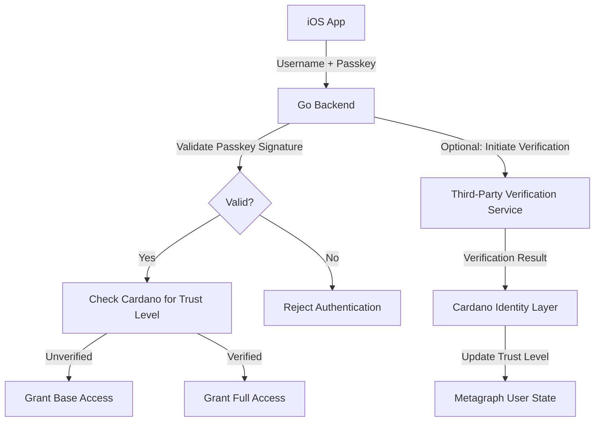
```mermaid
graph TD
    A[iOS App] -->|Username + Passkey| B[Go Backend]
    B -->|Validate Passkey Signature| C{Valid?}
    C -->|Yes| D[Check Cardano for Trust Level]
    C -->|No| E[Reject Authentication]
    D -->|Unverified| F[Grant Base Access]
    D -->|Verified| G[Grant Full Access]
    B -->|Optional: Initiate Verification| H[Third-Party Verification Service]
    H -->|Verification Result| I[Cardano Identity Layer]
    I -->|Update Trust Level| J[Metagraph User State]
```

## Decentralized Identifier (DID) Management

The system uses Decentralized Identifiers (DIDs) as the foundation for self-sovereign identity, enabling users to maintain complete control over their identity data while establishing verifiable credentials on the Cardano blockchain. DIDs are created using the Atala PRISM infrastructure, which implements the W3C DID specification and KERI standards for interoperability.

### DID Creation and Storage

When a user creates an account, the system generates a unique DID anchored to the Cardano blockchain. The DID follows the format `did:prism:cardano:<unique-identifier>` and serves as the user's immutable identity anchor across the platform and potentially other applications.

**DID Creation Process**:

1. User completes initial onboarding with username and passkey
2. Go backend generates a new DID using Atala PRISM infrastructure
3. DID is anchored to Cardano blockchain through a transaction that records the DID document
4. DID document includes the user's public key, verification methods, and service endpoints
5. DID is stored locally on the iOS device in the Secure Enclave alongside the passkey
6. Backend maintains a mapping between the user's DID and their account for quick lookup

**DID Document Structure**:

```plaintext
{
  "@context": "https://www.w3.org/ns/did/v1",
  "id": "did:prism:cardano:abc123def456",
  "publicKey": [
    {
      "id": "did:prism:cardano:abc123def456#key-1",
      "type": "Ed25519VerificationKey2018",
      "controller": "did:prism:cardano:abc123def456",
      "publicKeyBase58": "<base58-encoded-public-key>"
    }
  ],
  "authentication": [
    "did:prism:cardano:abc123def456#key-1"
  ],
  "assertionMethod": [
    "did:prism:cardano:abc123def456#key-1"
  ],
  "verifiableCredential": [
    {
      "id": "urn:uuid:credential-id",
      "type": "VerifiableCredential",
      "issuer": "did:prism:cardano:issuer-did",
      "credentialSubject": {
        "id": "did:prism:cardano:abc123def456",
        "verificationLevel": "high_assurance"
      },
      "proof": {
        "type": "Ed25519Signature2018",
        "created": "2024-01-15T10:30:00Z",
        "verificationMethod": "did:prism:cardano:issuer-did#key-1",
        "signatureValue": "<signature>"
      }
    }
  ],
  "service": [
    {
      "id": "did:prism:cardano:abc123def456#messaging",
      "type": "MessagingService",
      "serviceEndpoint": "https://backend.echo.app/messages"
    }
  ]
}
```

### DID Resolution and Verification

When the backend receives a request from a user, it resolves their DID to verify their identity and retrieve their public key for signature validation. The DID resolution process queries the Cardano blockchain to retrieve the authoritative DID document.

**DID Resolution Flow**:

1. Backend receives authenticated request with user's DID
2. Backend queries Cardano blockchain for the DID document
3. DID document is retrieved and cached locally for performance
4. Public key is extracted from the DID document
5. Request signature is validated against the public key
6. If valid, request is processed; if invalid, request is rejected

The backend maintains a local cache of recently resolved DIDs to reduce blockchain queries. Cache entries are invalidated after 24 hours or when the user updates their DID document.

### Multi-Device DID Support

Users can register multiple devices with their DID, with each device maintaining a separate passkey in its Secure Enclave. The DID document includes multiple public keys, one for each registered device, enabling the user to authenticate from any registered device.

**Multi-Device Registration**:

1. User authenticates on primary device with passkey
2. User initiates device registration on secondary device
3. Primary device displays QR code containing registration token
4. Secondary device scans QR code and generates new passkey
5. Secondary device submits registration request with new public key
6. Backend verifies request is from authenticated user
7. New public key is added to DID document on Cardano
8. Secondary device can now authenticate independently

## Trust Scoring Algorithm

The trust scoring system evaluates user behavior, verification status, and interaction history to assign dynamic trust scores from 0-100. Trust scores unlock progressive features and determine reward multipliers, creating incentives for authentic network participation.

### Trust Score Components

The trust score is calculated as a weighted combination of four components:

**Verification Level (0-30 points)**:

* Unverified: 0 points
* Device-verified (passkey only): 5 points
* KYC-lite verified (third-party service): 15 points
* High-assurance verified (government ID or Apple Digital ID): 30 points

**Interaction History (0-20 points)**:

* Account age: 0-5 points (1 point per month, max 5 points at 5+ months)
* Message count: 0-5 points (1 point per 100 messages, max 5 points at 500+ messages)
* Unique contacts: 0-5 points (1 point per 10 unique contacts, max 5 points at 50+ contacts)
* Group participation: 0-5 points (1 point per 5 groups, max 5 points at 25+ groups)

**On-Chain Behavior (0-30 points)**:

* Payment transactions: 0-10 points (1 point per transaction, max 10 points at 10+ transactions)
* Staking participation: 0-10 points (1 point per 100 ECHO staked, max 10 points at 1000+ ECHO)
* Governance participation: 0-10 points (1 point per vote, max 10 points at 10+ votes)

**Report History (0-20 points, penalty)**:

* Spam reports: -2 points per report (max -10 points)
* Fraud reports: -5 points per report (max -20 points)
* Blocked by users: -1 point per block (max -10 points)

**Trust Score Calculation**:

```plaintext
verification_score = verification_level_points
interaction_score = account_age + message_count + unique_contacts + group_participation
behavior_score = payment_transactions + staking_participation + governance_participation
report_penalty = spam_reports + fraud_reports + blocked_by_users

trust_score = min(100, max(0, 
  verification_score + 
  interaction_score + 
  behavior_score + 
  report_penalty
))
```

### Trust Score Updates

Trust scores are updated continuously as users engage with the platform. The Data L1 layer maintains trust score state and updates scores based on user activity. Updates occur in real-time for critical events (verification completion, fraud reports) and in batches for routine activity (message counts, interaction history).

**Trust Score Update Events**:

* Verification completion: Immediate update (+5 to +30 points)
* Payment transaction: Batch update every hour (+1 point per transaction)
* Message sent/received: Batch update every 24 hours (interaction history recalculation)
* Spam/fraud report: Immediate update (-2 to -5 points)
* User blocks: Batch update every 24 hours (-1 point per block)

### Trust Score Tiers and Feature Access

Trust scores map to 5 tiers (Tier 1–5). Tier commitments are stored on Cardano; raw scores are never on-chain.

**Tier 1 (0–20 points) — Unveri**fied: Basic messaging, limited to 10 contacts, \
\
\
\
no rewards, no governance participation.

**Tier 2 (21–40 points) — Newc**omer: Standard messaging, unlimited contacts, basic rewards (×0.5 multiplier), email/phone verified.

**Tier 3 (41–60 points) — Me**mber: Full rewards (×1.0), group creation, file sharing up to 100MB, governance voting eligible, third-party IDV verified.

**Tier 4 (61–80 points) — Veri**fied: Enhanced rewards (×1.5), advanced payment features, file sharing up to 500MB, government ID or Apple Digital ID verified.

**Tier 5 (81–100 points) — Tru**sted: Maximum rewards (×2.0), all features, unlimited messaging, large group management, 2GB file sharing, governance board election eligible, peer attested + sustained activity.

## Verifiable Credentials and Credential Schema

Verifiable credentials are cryptographically signed documents that prove specific claims about a user without revealing unnecessary personal information. The system uses W3C Verifiable Credentials Data Model 1.0 standard for credential issuance and verification.

### Credential Types

The system supports multiple credential types, each issued by different authorities:

**Proof of Humanity Credential**:

* Issued by: Prove, Daon, or Alloy
* Claims: User is a real person (not a bot)
* Verification method: Liveness check, device verification
* Expiration: 1 year
* Privacy: Zero-knowledge proof (no personal data exposed)

```plaintext
{
  "@context": [
    "https://www.w3.org/2018/credentials/v1",
    "https://www.w3.org/2018/credentials/examples/v1"
  ],
  "type": ["VerifiableCredential", "ProofOfHumanity"],
  "issuer": "did:prism:cardano:prove-issuer",
  "issuanceDate": "2024-01-15T10:30:00Z",
  "expirationDate": "2025-01-15T10:30:00Z",
  "credentialSubject": {
    "id": "did:prism:cardano:user-did",
    "humanityProof": true,
    "verificationMethod": "liveness_check"
  },
  "proof": {
    "type": "Ed25519Signature2018",
    "created": "2024-01-15T10:30:00Z",
    "verificationMethod": "did:prism:cardano:prove-issuer#key-1",
    "signatureValue": "<signature>"
  }
}
```

**KYC-Lite Credential**:

* Issued by: Third-party verification service
* Claims: User has completed basic identity verification
* Verification method: Document upload, selfie verification
* Expiration: 2 years
* Privacy: Zero-knowledge proof (no personal data exposed)

**High-Assurance Credential**:

* Issued by: Apple Digital ID or government verification service
* Claims: User has completed government-level identity verification
* Verification method: Government ID scan or Apple Digital ID
* Expiration: 5 years
* Privacy: Zero-knowledge proof (no personal data exposed)

**Professional Credential**:

* Issued by: Professional organizations or employers
* Claims: User holds specific professional certifications or employment
* Verification method: Organization verification
* Expiration: Variable based on credential type
* Privacy: Zero-knowledge proof (no personal data exposed)

### Credential Issuance Process

When a user completes identity verification, the backend coordinates with the verification service to issue a verifiable credential:

1. User initiates verification through the app
2. App redirects to verification service (Apple Digital ID, Prove, DAON, etc.)
3. User completes verification process with the service
4. Service returns verification result to backend
5. Backend creates credential subject with user's DID
6. Backend requests credential issuance from the service
7. Service signs credential with its private key
8. Credential is returned to backend and stored on Cardano
9. Credential is added to user's DID document
10. User's trust score is updated based on credential type

### Credential Storage and Revocation

Verifiable credentials are stored on the Cardano blockchain as part of the user's DID document. This ensures credentials are immutable and portable across applications. Credentials can be revoked by the issuer if the user's status changes (e.g., professional certification expires).

**Credential Revocation Process**:

1. Issuer determines credential should be revoked
2. Issuer submits revocation transaction to Cardano
3. Revocation is recorded in the credential revocation registry
4. Backend queries revocation registry during credential verification
5. If credential is revoked, it is no longer considered valid
6. User's trust score is recalculated without the revoked credential

## Zero-Knowledge Proof Integration

Zero-knowledge proofs enable the system to verify claims about users without exposing personal information. Phases 1–2 use standard on-chain credential verification. Phase 3+ introduces Midnight blockchain integration for privacy-preserving ZK proofs.

### Phase 1–2: Standard Credential Verification

Credentials are verified directly via Cardano. The backend resolves the user's DID, checks credential status bits, and validates the trust tier UTXO datum. Trust tier is confirmed, but the verification method and issuer are visible to the backend.

### Phase 3+: Midnight ZK Verification

Via Midnight blockchain (Cardano partner chain), users can prove tier eligibility and credential validity without revealing the credential itself. The Midnight SDK generates ZK proofs on-device; the Go backend submits the proof to Midnight for on-chain verification and caches the boolean result.

**ZK Use Cases:**

| Claim | What Midnight Proves | What Midnight Hides |
| --- | --- | --- |
| Trust tier minimum | "I am Tier 3 or above" | Exact score, credential issuer |
| KYC compliance (Org tier) | "My KYC is valid" | Passport data, name, address |
| Age verification | "I am 18 or older" | Actual birthdate |
| Group membership | "I am a member of Group X" | Full list of group memberships |

Midnight uses Compact (TypeScript DSL) for contracts — not Scala. The Scala requirement applies only to Constellation metagraph L1 validation. DID registration and credential issuance remain on Cardano permanently.

### ZKP Implementation (Phase 1–2 Legacy)

The system uses zk-SNARKs for Phase 1–2 credential ownership proofs within the ECHO backend:

**Proof of Credential Ownership Circuit:**

```plaintext
circuit ProveCredentialOwnership {
  // Private inputs (known only to prover)
  private input credentialHash: Field
  private input credentialSignature: Field
  private input issuerPublicKey: Field
  
  // Public inputs (known to verifier)
  public input userDID: Field
  public input credentialType: Field
  
  // Constraints
  assert(verifySignature(credentialHash, credentialSignature, issuerPublicKey))
  assert(credentialNotRevoked(credentialHash))
  assert(getCredentialType(credentialHash) == credentialType)
  assert(credentialNotExpired(credentialHash))
}
```

**Proof of Token Balance Circuit:**

```plaintext
circuit ProveTokenBalance {
  private input accountBalance: Field
  private input accountNonce: Field
  
  public input minimumBalance: Field
  public input balanceCommitment: Field
  
  assert(accountBalance >= minimumBalance)
  assert(hash(accountBalance, accountNonce) == balanceCommitment)
}
```

## Component Breakdown

### Streamlined Onboarding with Verifiable Credentials

Guides new users through account creation, passkey setup, and optional identity verification in a single flow. Users can create an account with just a username and passkey, or complete identity verification immediately to establish high trust.

**Key Features:**

* Username availability checking
* DID generation and Cardano anchoring
* Passkey generation in iOS Secure Enclave
* Optional Apple Digital ID, third-party service, or document upload verification
* Verifiable credential issuance and storage
* Account creation with base or verified access
* Completion in under 5 minutes

### In-App High-Assurance Identity Verification

Provides an optional workflow for users to generate a high-assurance Verifiable Credential by verifying their government-issued photo ID or Apple Digital ID. Users who complete verification receive ECHO token rewards and unlock premium features.

**Key Features:**

* Apple Digital ID integration (iOS 17+)
* Third-party verification services (Prove, Daon, Alloy)
* Document upload with selfie verification
* Fraud assessment via Darwinium
* Automatic ECHO token rewards (100 ECHO)
* Trust level elevation to highest tier
* Verifiable credential issuance on Cardano
* Zero-knowledge proof generation for privacy

### Device Passkey Management

Handles passkey generation, storage in iOS Secure Enclave, and authentication flows. Passkeys are device-bound and never transmitted, providing secure passwordless authentication.

**Key Features:**

* Passkey generation during account creation
* Storage in iOS Secure Enclave
* Server-side signature validation using DID public key
* Multi-device support with separate passkeys per device
* Passkey reset with identity verification or account recovery
* Device trust verification during authentication
* DID document updates for multi-device registration

### ECHO Reward Coordination

When users complete identity verification, the backend submits a reward transaction to the Currency L1 layer to distribute 100 ECHO tokens. This integration ensures users are immediately rewarded for strengthening the network's trust layer.

**Reward Submission Flow**:

1. User completes identity verification with third-party service
2. Backend receives verification result and creates verifiable credential
3. Backend submits verification reward transaction to Currency L1
4. Transaction includes: user DID, reward amount (100 ECHO), verification type, timestamp
5. Currency L1 validates transaction and updates user's token balance
6. Reward is distributed to user's account within 1 block cycle (\~5 seconds)
7. User sees reward notification in app with transaction hash for verification

**Reward Transaction Structure**:

```plaintext
{
  "transaction_type": "verification_reward",
  "user_did": "did:prism:cardano:abc123def456",
  "reward_amount": 100000000000000000, // 100 ECHO in smallest units
  "verification_type": "high_assurance",
  "verification_timestamp": "2024-01-15T10:30:00Z",
  "issuer_did": "did:prism:cardano:verification-service",
  "signature": "<backend-signature>",
  "nonce": 12345
}
```

## Security Principles

* Passkeys are stored exclusively in the iOS Secure Enclave and never transmitted
* All authentication requests are validated server-side by the Go backend
* Third-party verification services are used only for device trust assessment and fraud prevention
* Trust levels are immutably recorded on Cardano and referenced for access control
* Error messages are generic with error codes for support (no sensitive details exposed)

## Blockchain-Anchored Messaging with Provable Integrity

# Blockchain-Anchored Messaging with Provable Integrity

## Overview

This feature provides end-to-end encrypted messaging with cryptographic proof of message authenticity and conversation integrity. Messages are encrypted on-device, transported via a stateless WebSocket relay server, and anchored to the Constellation metagraph via Merkle root commitments. Users can prove that specific communications occurred without exposing message content—critical for legal, business, and security purposes.

**Key Innovation:** Message content never touches the blockchain. Only Merkle roots of commitment hashes are anchored on the Data L1 layer, enabling cryptographic verification of integrity without sacrificing privacy.

## Architecture

Messages are encrypted end-to-end using Kinnami encryption (X25519 key agreement + ChaCha20-Poly1305). The encrypted blobs are transported via a content-blind WebSocket relay server that cannot read, decrypt, or modify message content. Commitment hashes are batched into Merkle trees and anchored to the Constellation metagraph Data L1 every 5 minutes (or 1000 commitments, whichever comes first).

### Message Flow

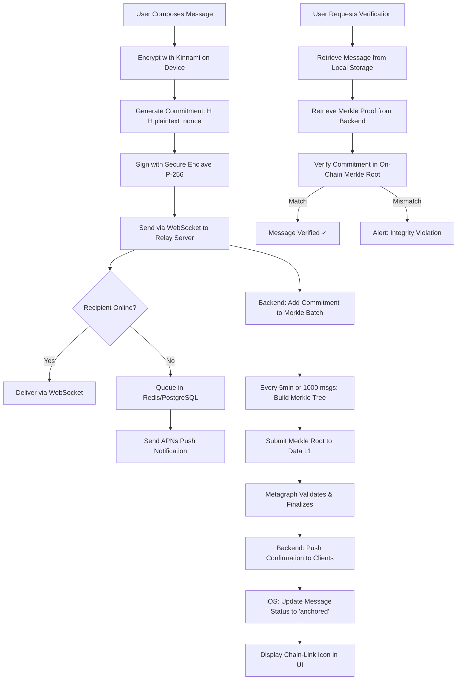
```mermaid
graph TD
    A[User Composes Message] --> B[Encrypt with Kinnami on Device]
    B --> C[Generate Commitment: H H plaintext  nonce]
    C --> D[Sign with Secure Enclave P-256]
    D --> E[Send via WebSocket to Relay Server]
    E --> F{Recipient Online?}
    F -->|Yes| G[Deliver via WebSocket]
    F -->|No| H[Queue in Redis/PostgreSQL]
    H --> I[Send APNs Push Notification]
    E --> J[Backend: Add Commitment to Merkle Batch]
    J --> K[Every 5min or 1000 msgs: Build Merkle Tree]
    K --> L[Submit Merkle Root to Data L1]
    L --> M[Metagraph Validates & Finalizes]
    M --> N[Backend: Push Confirmation to Clients]
    N --> O[iOS: Update Message Status to 'anchored']
    O --> P[Display Chain-Link Icon in UI]
    
    Q[User Requests Verification] --> R[Retrieve Message from Local Storage]
    R --> S[Retrieve Merkle Proof from Backend]
    S --> T[Verify Commitment in On-Chain Merkle Root]
    T -->|Match| U[Message Verified ✓]
    T -->|Mismatch| V[Alert: Integrity Violation]
```

## Key Components

### Message Encryption & Relay

Messages are encrypted end-to-end using Kinnami encryption (X25519 key agreement + ChaCha20-Poly1305) before transmission. Encryption keys are ephemeral per-session and never transmitted. The iOS Secure Enclave generates a P-256 signature over the encrypted payload. The WebSocket relay server transports opaque encrypted blobs—it cannot read, decrypt, or modify message content.

**Relay Server Role:**

* Transports encrypted blobs between online clients via WebSocket
* Queues encrypted blobs for offline recipients (Redis/PostgreSQL)
* Sends APNs push notifications (no content exposed)
* **Cannot:** read message content, forge messages, override on-chain state

**Key Features:**

* End-to-end encryption with Kinnami (X25519 + ChaCha20-Poly1305)
* Ephemeral key agreement per message session
* P-256 signature from Secure Enclave
* Content-blind relay server
* Offline message queuing (30-day retention for 1:1, 7-day for large groups)
* Push notification delivery (conversation ID only, no content)
* Message retry with exponential backoff
* Sealed sender support (Phase 3): server routes by recipient only, sender DID hidden

### Message Anchoring & Commitment Batching

Each message generates a **commitment hash**: `commitment = H(H(plaintext) || nonce)`. The double hash prevents content exposure, and the nonce prevents dictionary attacks. Commitments are batched by the Go backend every **5 minutes OR 1000 commitments** (whichever comes first).

**Batching Process:**

1. **Collection**: Backend collects commitment hashes from all relayed messages
2. **Merkle Tree**: Build a Merkle tree with commitments as leaves
3. **Root Submission**: Submit Merkle root to Data L1 via `DataL1Submission` transaction
4. **On-Chain Validation**: Data L1 validators verify Merkle structure and authorized sender DID
5. **Metagraph Consensus**: Metagraph L0 packages into snapshot, Global L0 finalizes
6. **Confirmation**: Backend pushes confirmation to clients via WebSocket with snapshot hash and height

**What Goes On-Chain:**

* ✅ Merkle root (32 bytes)
* ✅ Commitment count (integer)
* ✅ Time range (from/to timestamps)
* ✅ Batch schema version
* ❌ **Never:** message content, sender/recipient DIDs, metadata

**Data L1 Submission Structure:**

```go
type DataL1Submission struct {
    Type            string    // "message_integrity"
    MerkleRoot      []byte    // Root hash of Merkle tree
    CommitmentCount int       // Number of messages in batch
    TimeRange       TimeRange // From/To timestamps
    SchemaVersion   int       // Current: 1
}
```

**Key Features:**

* SHA-256 commitment hashing with double-hash + nonce
* Merkle tree batching (5min OR 1000 msgs)
* Data L1 anchoring with on-chain validation
* Snapshot reference storage (snapshot hash + height)
* Zero content or metadata on-chain (privacy-preserving)
* Commitment integrity verification via Merkle proofs

### Message Delivery Statuses

Messages progress through 7 delivery statuses, with UI indicators for each:

| Status | Icon | Meaning | Trigger |
| --- | --- | --- | --- |
| **sending** | ⏳ | Encrypting / queued locally (offline) | Before relay submission |
| **sent** | ✓ | Accepted by relay, recipient offline | Relay ACK, recipient not connected |
| **delivered** | ✓✓ | Delivered to recipient's device | Recipient WebSocket delivery |
| **read** | ✓✓ (blue) | Recipient opened the message | Recipient read receipt |
| **failed** | ❌ | Relay rejected or unrecoverable error | Validation failure, network timeout |
| **anchored** | 🔗 | Commitment in finalized metagraph snapshot | Backend confirmation + Merkle proof |
| **verified** | ✓ (Smart Checkmark) | Digital Evidence fingerprint (Org tier) | Enterprise audit anchoring complete |

**Anchored Status (All Users):**

When the backend confirms a message commitment was included in a finalized metagraph snapshot, the iOS app updates the message status to `.anchored` and displays a **chain-link icon** (🔗) next to the timestamp. This indicates blockchain-verified integrity. Users can tap the icon to view:

* Snapshot hash
* Snapshot height
* Commitment hash
* Merkle proof (Phase 3+)
* Link to DAG Explorer

**Verified Status (Organization Tier Only):**

Organization tier messages receive individual-event fingerprinting via Constellation's Digital Evidence API. A **Smart Checkmark badge** (✓) appears next to the message. Tapping opens the public Digital Evidence verification URL in Safari, showing:

* SHA-256 fingerprint
* Timestamp
* Event ID
* Public verification explorer
* Court-admissible evidence packaging

### Message Verification (Client-Side)

**Phase 1–2: Trust Backend Confirmation**

Clients trust the backend's anchoring confirmation. The `.anchored` status is displayed when the backend reports the Merkle root was finalized on-chain.

**Phase 3+: Trustless Merkle Proof Verification**

The iOS `AnchoringTracker` receives a Merkle proof alongside the confirmation. The client cryptographically verifies:

1. Compute leaf hash from stored commitment
2. Compute path from leaf to root using provided sibling hashes
3. Compare computed root with on-chain Merkle root
4. Display `.anchored` only if proof validates

This removes trust in the relay server for integrity verification. Clients can independently prove their messages were anchored.

**Merkle Proof Structure:**

```swift
struct MerkleProof {
    let commitment: Data        // User's message commitment
    let siblings: [Data]        // Sibling hashes from leaf to root
    let snapshotHash: String    // On-chain snapshot hash
    let snapshotHeight: Int     // On-chain snapshot height
}

func verifyMerkleProof(proof: MerkleProof, onChainRoot: Data) -> Bool {
    var computedHash = proof.commitment
    for sibling in proof.siblings {
        computedHash = SHA256.hash(data: computedHash + sibling)
    }
    return computedHash == onChainRoot
}
```

### Digital Evidence Integration (Organization Tier)

For Organization tier users, ECHO integrates with Constellation's Digital Evidence API to provide individual-event anchoring with public verification URLs and Smart Checkmark badges. This is **complementary** to the standard Merkle anchoring—all users get Merkle anchoring; Org tier gets both.

**Use Cases:**

* Enterprise audit trails with court-admissible evidence
* Media authenticity verification (SHA-256 fingerprint before E2E encryption)
* Smart Checkmark badges on messages for verified authenticity
* Data retention proof (fingerprint at regulatory retention boundary)

**iOS Integration:**

```swift
actor DigitalEvidenceBridge {
    private let backendAPI: BackendAPIClient
    
    /// Fingerprint media before E2E encryption (VIP+ optional, Org automatic)
    func fingerprintMedia(_ mediaData: Data, messageId: String) async throws -> EvidenceResult? {
        let hash = SHA256.hash(data: mediaData)
        let hashHex = hash.compactMap { String(format: "%02x", $0) }.joined()
        
        let result = try await backendAPI.submitEvidenceFingerprint(
            contentHash: hashHex,
            messageId: messageId,
            metadata: ["type": "media", "source": "echo_ios"]
        )
        
        return EvidenceResult(
            eventId: result.eventId,
            verificationURL: result.verificationUrl,
            timestamp: result.timestamp
        )
    }
    
    /// Get verification URL for Smart Checkmark
    func verificationURL(for message: Message) -> URL? {
        guard let eventId = message.evidenceEventId else { return nil }
        return URL(string: "https://digitalevidence.constellationnetwork.io/verify/\(eventId)")
    }
}
```

**Backend Integration:**

The Go backend submits fingerprints to Constellation's Digital Evidence REST API:

```go
// evidence/client.go
type DigitalEvidenceClient struct {
    baseURL        string
    apiKey         string
    organizationID string
    tenantID       string
}

func (c *DigitalEvidenceClient) SubmitFingerprint(fp Fingerprint) (*FingerprintResult, error) {
    signed := c.signPayload(fp)
    resp, err := c.post("/evidence", signed)
    return &FingerprintResult{
        EventID:         resp.EventID,
        VerificationURL: resp.VerificationURL,
        Timestamp:       resp.Timestamp,
    }, nil
}
```

### Message Editing with History

Users can edit sent messages within 24 hours of sending. Edited messages display an "edited" indicator with edit timestamp. Edit history is maintained locally showing all previous versions. The **original commitment** hash remains immutable on the blockchain—edits create new commitments that are anchored in subsequent Merkle batches.

**Key Features:**

* 24-hour edit window
* Edit history tracking (stored locally)
* Original commitment immutability (on-chain Merkle root unchanged)
* New commitment generated for each edit (anchored in next batch)
* Edit metadata stored locally (not on-chain)
* Edit notifications to recipients
* Edit count and timestamp display

### Message Pinning

Users can pin important messages in conversations for quick reference. Pinned messages are stored locally and accessible from a dedicated view. Each conversation supports up to 10 pinned messages.

**Key Features:**

* Pin up to 10 messages per conversation
* Pinned messages list view
* Pin timestamp tracking
* Local-only storage (not synced to metagraph)
* Pin notifications in groups
* Unpin functionality

### Message Forwarding

Users can forward messages to other conversations with or without sender attribution. Forwarded messages are encrypted end-to-end with new keys for the destination conversation. Forwarding metadata is stored **locally only**—not on the metagraph (privacy by design).

**Key Features:**

* Forward to individual contacts or groups
* With/without sender attribution
* Batch forwarding support
* Caption support
* Forwarding restrictions (hidden folders, disappearing messages)
* Forwarding metadata stored locally (not on-chain)
* New commitment generated for forwarded message

### Message Reactions & Replies

Users can react to messages with emojis and reply to specific messages. Reactions and replies are stored as separate message objects linked to the original message. Each reaction/reply is encrypted separately and generates its own commitment.

**Key Features:**

* Emoji reactions
* Custom reactions
* Multiple reactions per user per message
* Message replies with quoting
* Reply notifications
* Reaction aggregation
* Each reaction/reply anchored independently in Merkle batches

### Disappearing Messages with Cryptographic Verification

Users can send messages that automatically delete from all devices after predetermined time periods. The commitment hash is still anchored in the Merkle batch, allowing proof that a conversation occurred without revealing content. After the timer expires, the plaintext is deleted, but the on-chain commitment remains as an immutable record.

**Architecture Note:** The on-chain Merkle root persists indefinitely, but individual commitments become unverifiable after plaintext deletion (users can no longer generate the commitment hash from plaintext). This is the privacy/auditability tradeoff—the blockchain proves "a message existed at this time" but not "what the message said."

**Key Features:**

* Preset time intervals (10 seconds to 7 days)
* Custom timing for premium users
* Countdown timers
* Commitment anchored before deletion
* Plaintext deletion on sender + recipient devices
* Merkle root persists on-chain (proof of existence, not content)
* Keys deleted after plaintext deletion

### Hidden Folders with Biometric Protection

Users can create hidden folders to organize sensitive messages. Hidden folders are protected by biometric authentication (Face ID or Touch ID) and stored locally without metagraph sync. Messages in hidden folders are still E2E encrypted and commitments are still anchored, but the folder structure and contents are device-local.

**Key Features:**

* Biometric authentication (Face ID/Touch ID)
* PIN code fallback
* Local-only storage (folder structure not synced)
* iOS Data Protection encryption
* Access logging
* Multiple hidden folders support
* Message commitments still anchored (integrity preserved)

### Silent and Scheduled Private Chats

Users can mute notifications for specific conversations or schedule messages to be sent at a later time. Mute settings are stored locally while scheduled messages are queued and sent at the specified time via background tasks.

**Key Features:**

* Mute duration options (1 hour to forever)
* Silent message delivery
* Message scheduling up to 30 days
* Background task execution
* Offline message queuing
* Scheduled message editing/cancellation

## Implementation Details

### iOS (Swift)

**MessageRelayManager** coordinates send/receive with the WebSocket relay:

```swift
actor MessageRelayManager {
    private let webSocket: WebSocketRelay
    private let encryption: KinnamiEncryptionService
    private let secureEnclave: SecureEnclaveManager
    private let anchoringTracker: AnchoringTracker
    
    func sendMessage(
        plaintext: Data,
        recipientPublicKey: Data,
        conversationId: String
    ) async throws -> Message {
        // 1. E2E encrypt
        let encryptedPayload = try encryption.encrypt(
            plaintext: plaintext,
            recipientPublicKey: recipientPublicKey
        )
        
        // 2. Generate commitment
        let nonce = CryptoKit.randomBytes(32)
        let plaintextHash = SHA256.hash(data: plaintext)
        let commitment = SHA256.hash(data: plaintextHash + nonce)
        
        // 3. Sign with Secure Enclave
        let signature = try await secureEnclave.sign(
            data: encryptedPayload.serialized,
            reason: "Send message"
        )
        
        // 4. Send via relay
        let messageId = UUID().uuidString
        let response = try await webSocket.sendMessage(SendMessageRequest(
            messageId: messageId,
            conversationId: conversationId,
            encryptedPayload: encryptedPayload,
            commitment: commitment,
            signature: signature
        ))
        
        // 5. Track for anchoring
        anchoringTracker.track(messageId: messageId, commitment: commitment)
        
        return Message(
            id: messageId,
            status: response.status == "relayed" ? .delivered : .sent
        )
    }
}
```

**AnchoringTracker** receives confirmations and updates message status:

```swift
@MainActor
final class AnchoringTracker: ObservableObject {
    @Published private(set) var pendingAnchors: [String: PendingAnchor] = [:]
    
    func confirmAnchoring(
        messageId: String,
        snapshotHash: String,
        snapshotHeight: Int,
        merkleProof: [Data]?
    ) {
        pendingAnchors.removeValue(forKey: messageId)
        
        // Phase 3+: Verify Merkle proof
        if let proof = merkleProof {
            let isValid = verifyMerkleProof(
                commitment: storedCommitment,
                proof: proof,
                onChainRoot: fetchMerkleRoot(snapshotHash)
            )
            guard isValid else {
                // Alert: integrity violation
                return
            }
        }
        
        // Update message status
        NotificationCenter.default.post(
            name: .messageAnchored,
            object: nil,
            userInfo: [
                "messageId": messageId,
                "snapshotHash": snapshotHash,
                "snapshotHeight": snapshotHeight
            ]
        )
    }
}
```

### Go Backend

**AnchoringBatcher** collects commitments and submits Merkle roots:

```go
type AnchoringBatcher struct {
    commitments  []Commitment
    metagraph    *MetagraphClient
    ticker       *time.Ticker
    maxBatch     int
}

const (
    BatchInterval = 5 * time.Minute
    MaxBatchSize  = 1000
)

func (b *AnchoringBatcher) AddCommitment(messageID string, hash []byte) {
    b.commitments = append(b.commitments, Commitment{
        MessageID: messageID,
        Hash:      hash,
        Timestamp: time.Now(),
    })
    
    if len(b.commitments) >= b.maxBatch {
        go b.flush()
    }
}

func (b *AnchoringBatcher) flush() {
    if len(b.commitments) == 0 {
        return
    }
    
    batch := b.commitments
    b.commitments = nil
    
    // Build Merkle tree
    tree := BuildMerkleTree(extractHashes(batch))
    root := tree.Root()
    
    // Submit to Data L1
    txHash, err := b.metagraph.SubmitDataL1(DataL1Submission{
        Type:            "message_integrity",
        MerkleRoot:      root,
        CommitmentCount: len(batch),
        TimeRange: TimeRange{
            From: batch[0].Timestamp,
            To:   batch[len(batch)-1].Timestamp,
        },
        SchemaVersion: 1,
    })
    
    if err == nil {
        // Store tree for proof generation
        b.storeTree(txHash, tree, batch)
        
        // Push confirmations to clients
        b.pushConfirmations(batch, root, txHash)
    }
}
```

### Scala (Metagraph L1 Validation)

Data L1 validators enforce Merkle root structure validation:

```scala
class MessageIntegrityValidator extends DataL1Validator {
  def validate(submission: DataL1Submission): ValidationResult = {
    submission.`type` match {
      case "message_integrity" =>
        // 1. Verify Merkle root is 32 bytes (SHA-256)
        if (submission.merkleRoot.length != 32)
          return ValidationResult.Invalid("Invalid Merkle root length")
        
        // 2. Verify commitment count > 0
        if (submission.commitmentCount <= 0)
          return ValidationResult.Invalid("Empty batch")
        
        // 3. Verify time range is valid
        if (submission.timeRange.from >= submission.timeRange.to)
          return ValidationResult.Invalid("Invalid time range")
        
        // 4. Verify schema version is supported
        if (submission.schemaVersion > CurrentSchemaVersion)
          return ValidationResult.Invalid("Unsupported schema version")
        
        // 5. Verify sender DID is authorized
        if (!isAuthorizedSender(submission.senderDID))
          return ValidationResult.Invalid("Unauthorized sender")
        
        ValidationResult.Valid
      
      case _ => ValidationResult.Invalid("Unknown submission type")
    }
  }
}
```

## Security Principles

* All messages are encrypted end-to-end using Kinnami (X25519 + ChaCha20-Poly1305)
* Encryption keys are ephemeral and never transmitted
* Messages are relayed via a content-blind server that cannot read, decrypt, or modify content
* Commitment hashes (not content) are anchored in Merkle batches on the Data L1 layer
* Local storage is encrypted at rest using iOS Data Protection (AES-256-GCM)
* Hidden folders require biometric authentication
* Disappearing message plaintext is deleted but commitment persists on-chain (proof of existence)
* Message deletion is cryptographically verified before commitment anchoring
* Client-side Merkle proof verification (Phase 3+) removes trust in relay server
* No message content or metadata ever reaches the blockchain
* Sealed sender (Phase 3) hides sender DID from relay server

## Dynamic Trust Network and Social Verification

# Dynamic Trust Network and Social Verification

## Overview

This feature creates a decentralized reputation system that enables users to build trust relationships and verify authenticity without relying on centralized authorities or exposing personal information. The system combines blockchain-anchored verification badges, progressive trust circles, and community-driven reputation scoring to create a self-regulating network that reduces fraud and spam while preserving user privacy.

## Architecture

The trust network operates through smart contracts deployed on Cardano that maintain reputation scores and verification states while preserving user privacy through cryptographic commitments. Trust levels are recorded on-chain and referenced by the metagraph for access control and feature eligibility.

### Trust Scoring Flow

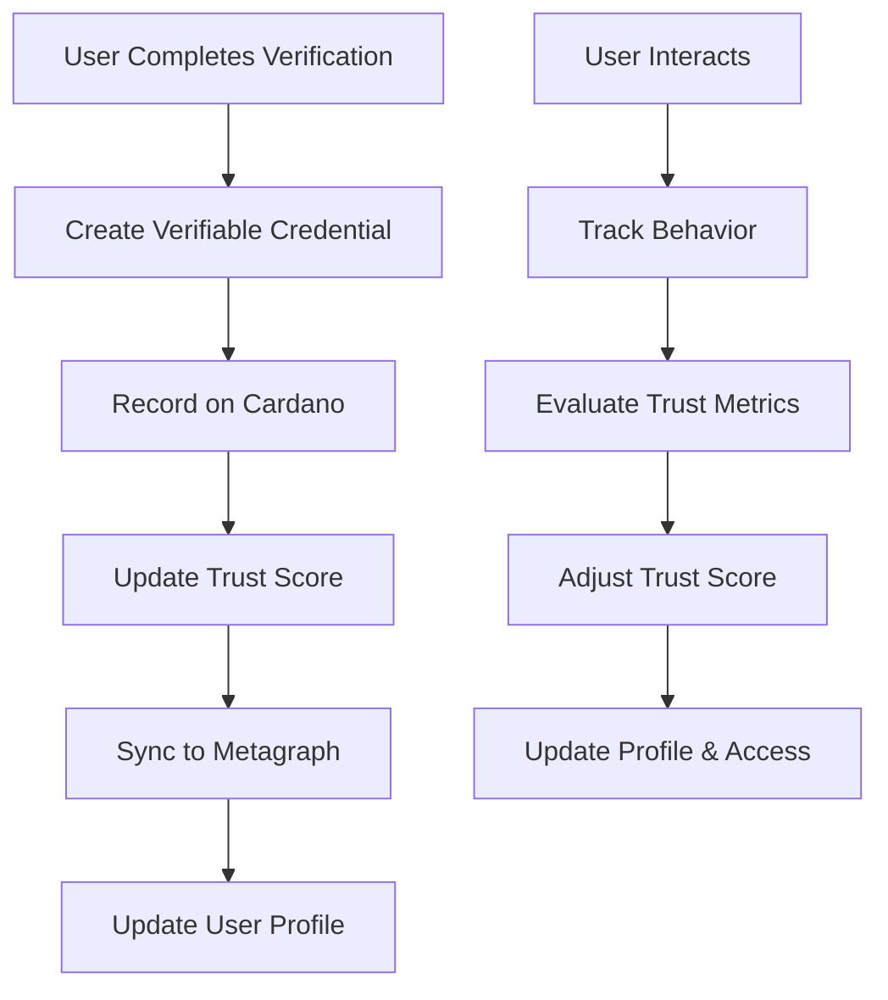
```mermaid
graph TD
    A[User Completes Verification] --> B[Create Verifiable Credential]
    B --> C[Record on Cardano]
    C --> D[Update Trust Score]
    D --> E[Sync to Metagraph]
    E --> F[Update User Profile]
    G[User Interacts] --> H[Track Behavior]
    H --> I[Evaluate Trust Metrics]
    I --> J[Adjust Trust Score]
    J --> K[Update Profile & Access]
```

## Key Components

### User Profiles & Contact Management

Each user has a profile with avatar, display name, username, and bio. User profiles display verification badges and trust scores. Users can view other users' profiles, edit their own profile information, and manage privacy settings.

**Key Features:**

* Avatar upload and management
* Display name and username
* Bio and status messages
* Verification badge display
* Trust score visibility
* Last seen status (privacy-controlled)
* Online/offline status (privacy-controlled)
* Privacy settings configuration

### Contact Blocking & Management

Users can block other users to prevent them from sending messages, calling, or seeing online status. Blocked users are not notified of the block. Users can organize contacts into favorites and custom groups.

**Key Features:**

* Block/unblock functionality
* Blocked user list management
* Contact favorites
* Custom contact groups
* Contact search and filtering
* Contact organization

### Typing Indicators & Read Receipts

Typing indicators show when a user is actively typing a message in real-time. Read receipts show when a message has been delivered and read. Both features respect privacy settings and can be disabled by users.

**Key Features:**

* Real-time typing indicators
* Multiple users typing display
* 5-second typing timeout
* Delivery receipt tracking
* Read receipt tracking
* Privacy-controlled visibility
* Per-conversation settings

### Audio Messages (Voice Notes)

Users can record voice messages directly in the app. Voice messages are encrypted end-to-end, compressed, and transmitted through the messaging infrastructure. Voice messages support optional automatic transcription.

**Key Features:**

* Voice message recording (up to 5 minutes)
* Audio compression (Opus codec)
* End-to-end encryption
* Playback with speed control (0.75x-1.5x)
* Waveform visualization
* Optional transcription
* Transcription search support

### Call History

All voice and video calls are recorded in call history. Call history displays call type, duration, timestamp, and participants. Missed calls show a notification badge and indicator.

**Key Features:**

* Call type tracking (voice/video)
* Call duration recording
* Call timestamp storage
* Missed call indicators
* Call history filtering
* Contact-specific call history
* Call history search
* Missed call badges

### Notification Badges

Unread message count badges appear on the app icon and conversations. Missed call badges appear on contacts. Badge counts update in real-time and clear when messages are read or calls are viewed.

**Key Features:**

* App icon badge count
* Conversation-level badges
* Contact-level badges
* Missed call badges
* Real-time badge updates
* Muted conversation handling
* Archived conversation handling
* Badge configuration

### Message Search & Conversation Search

Users can search messages by keyword, sender, date range, or media type. Search results are highlighted with matching keywords and ranked by relevance and recency. Conversation search allows filtering by name or last message content.

**Key Features:**

* Full-text message search
* Sender filtering
* Date range filtering
* Media type filtering
* Fuzzy matching for typos
* Case-insensitive search
* Search result highlighting
* Conversation search
* Search result ranking

### Archive Conversations

Users can archive conversations to hide them from the main list while keeping them accessible. Archived conversations do not show badges or send notifications. Users can auto-archive old conversations based on inactivity.

**Key Features:**

* Archive/unarchive functionality
* Separate archive view
* Auto-archive by inactivity
* Configurable auto-archive period
* Archive search support
* No notifications for archived conversations
* No badges for archived conversations

### Privacy Settings

Users can control who can see their last seen, online status, profile picture, and status message. Privacy settings are stored locally and synced to the metagraph so other users respect the settings.

**Key Features:**

* Last seen visibility control
* Online status visibility control
* Profile picture visibility control
* Status message visibility control
* Group invite permissions
* Call permissions
* Per-contact privacy overrides
* Privacy setting enforcement

## Security Principles

* Trust scores are immutably recorded on Cardano
* Verification badges are blockchain-anchored and tamper-proof
* Privacy settings are enforced on both client and backend
* Blocked users cannot access blocked user's data
* Contact information is encrypted at rest
* Trust network operates without centralized authority
* User privacy is preserved through cryptographic commitments

## Voice and Video Calls with Screen Sharing

# Voice and Video Calls with Screen Sharing

## Overview

This feature provides high-quality voice and video calling capabilities with advanced screen sharing functionality, enabling users to conduct business meetings, technical support sessions, and collaborative work directly within the secure messaging environment. The system maintains end-to-end encryption for all audio, video, and screen content while leveraging the platform's trust infrastructure to verify participant identities and prevent unauthorized access to sensitive shared content.

## Architecture

The calling infrastructure uses WebRTC protocols enhanced with the platform's Noise Protocol encryption to ensure all call data remains private and tamper-proof. Calls are established through peer-to-peer connections when possible, with relay nodes providing fallback routing when direct connections are unavailable.

### Call Establishment Flow

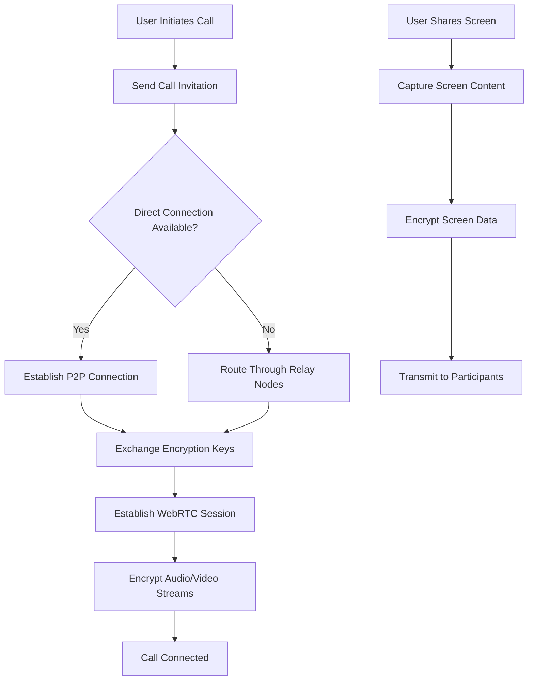
```mermaid
graph TD
    A[User Initiates Call] --> B[Send Call Invitation]
    B --> C{Direct Connection Available?}
    C -->|Yes| D[Establish P2P Connection]
    C -->|No| E[Route Through Relay Nodes]
    D --> F[Exchange Encryption Keys]
    E --> F
    F --> G[Establish WebRTC Session]
    G --> H[Encrypt Audio/Video Streams]
    H --> I[Call Connected]
    J[User Shares Screen] --> K[Capture Screen Content]
    K --> L[Encrypt Screen Data]
    L --> M[Transmit to Participants]
```

## Key Components

### Voice Calling

Users can initiate voice calls with individual contacts or groups. Voice calls support up to 50 participants with automatic quality adjustment based on network conditions. Voice is encrypted end-to-end using Noise Protocol.

**Key Features:**

* One-on-one and group voice calls
* Up to 50 participants per call
* Automatic quality adjustment
* Noise cancellation
* Speaker identification
* Mute/unmute functionality
* Call hold and resume
* Call transfer between contacts
* Call recording with consent
* Call history tracking

### Video Calling

Users can initiate video calls with individual contacts or groups. Video calls support up to 50 participants with automatic quality adjustment. Video is encrypted end-to-end using Noise Protocol.

**Key Features:**

* One-on-one and group video calls
* Up to 50 participants per call
* Automatic quality adjustment (720p to 1080p)
* Virtual backgrounds
* Beauty filters
* Camera switching (front/back)
* Mute/unmute functionality
* Video on/off toggle
* Call recording with consent
* Call history tracking
* Participant gallery view

### Screen Sharing

Users can share their entire screen, specific application windows, or selected desktop areas with call participants. Screen sharing is encrypted end-to-end and includes granular permission controls.

**Key Features:**

* Full screen sharing
* Application window sharing
* Selected area sharing
* Screen annotation tools
* Pointer highlighting
* Screen sharing permissions
* Recording prevention controls
* Screenshot prevention controls
* Screen sharing history
* Shared content encryption

### Call Quality Management

The system automatically adjusts call quality based on network conditions and device capabilities. Users can manually adjust quality settings for bandwidth optimization.

**Key Features:**

* Automatic quality adjustment
* Network condition detection
* Bandwidth optimization
* Manual quality settings
* Call statistics display
* Latency monitoring
* Packet loss detection
* Connection quality indicators
* Fallback to audio-only mode
* Network recovery handling

### Real-Time Transcription

Calls can be automatically transcribed in real-time for accessibility. Transcription is processed locally on user devices to maintain privacy.

**Key Features:**

* Real-time transcription
* Multiple language support
* Speaker identification
* Transcript search
* Transcript export
* Transcript sharing
* Accessibility features
* Privacy-preserving processing

### Call Scheduling

Users can schedule calls in advance with calendar integration. Scheduled calls send reminders and automatically initiate at the scheduled time.

**Key Features:**

* Call scheduling
* Calendar integration
* Reminder notifications
* Automatic call initiation
* Recurring call scheduling
* Time zone handling
* Participant invitations
* Meeting notes
* Agenda sharing

### Call Recording

Calls can be recorded with explicit participant consent. Recordings are encrypted and stored locally or in cloud storage.

**Key Features:**

* Recording with consent
* Participant notification
* Recording indicators
* Recording pause/resume
* Recording storage options
* Recording encryption
* Recording sharing
* Recording deletion
* Compliance recording for enterprises

### Call Metadata & Blockchain Anchoring

Call metadata including participant lists, duration, and quality metrics are recorded on the blockchain for audit purposes while maintaining participant privacy through zero-knowledge proofs.

**Key Features:**

* Call metadata recording
* Blockchain anchoring
* Participant list encryption
* Duration tracking
* Quality metrics recording
* Zero-knowledge proofs
* Audit trail creation
* Privacy preservation

### Verified Caller Identification

The system integrates with the trust scoring infrastructure to provide verified caller identification, reducing the risk of voice phishing attacks and impersonation during important business calls.

**Key Features:**

* Verified caller display
* Trust score indicators
* Verification badge display
* Caller identity verification
* Phishing attack prevention
* Impersonation detection
* Caller reputation display
* Caller history display

## Security Principles

* All call audio, video, and screen content is encrypted end-to-end using Kinnami (X25519 + ChaCha20-Poly1305) before transmission
* Calls are relayed through the Go backend relay by default — the relay transports opaque encrypted streams it cannot read
* Phase 4+ optional direct P2P via relay-assisted WebRTC signaling provides lower latency when both users are online
* Screen sharing content is encrypted before transmission; the relay cannot read screen content
* Call metadata (participant DIDs, duration, timestamps) is anchored on the metagraph for audit purposes — participant privacy preserved through hash commitments
* Recording requires explicit participant consent; recordings are encrypted at rest
* Verified caller identification via trust badges reduces voice phishing risk
* All call signaling and push notifications are TLS 1.3 encrypted and never expose call content

## Large File Sharing and Cloud Storage Integration

# Large File Sharing and Cloud Storage Integration

## Overview

This feature enables users to share files up to 2GB in size while maintaining end-to-end encryption and decentralized storage principles, addressing the need for secure document exchange in both personal and professional communications. The system combines IPFS distributed storage with blockchain anchoring to ensure file integrity and availability while providing seamless integration with popular cloud storage services for user convenience.

## Architecture

Files are encrypted end-to-end before leaving the user's device, then chunked and distributed across the IPFS network. Each chunk is encrypted with unique keys derived from the conversation's encryption context. File hashes are anchored to the Constellation blockchain to create immutable proof of file integrity.

### File Sharing Flow

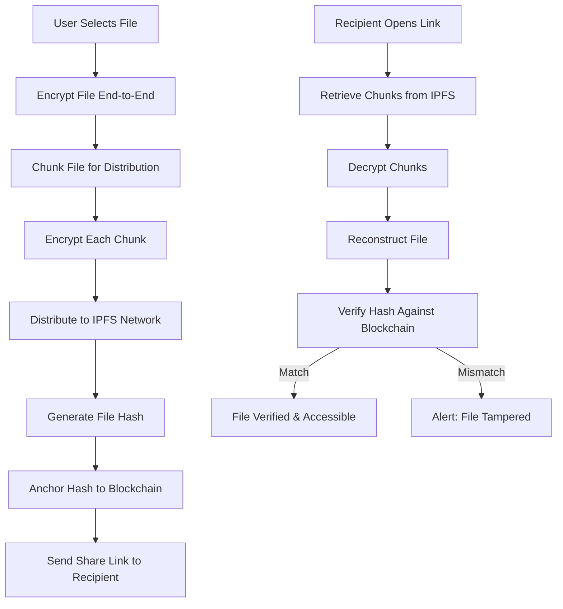
```mermaid
graph TD
    A[User Selects File] --> B[Encrypt File End-to-End]
    B --> C[Chunk File for Distribution]
    C --> D[Encrypt Each Chunk]
    D --> E[Distribute to IPFS Network]
    E --> F[Generate File Hash]
    F --> G[Anchor Hash to Blockchain]
    G --> H[Send Share Link to Recipient]
    I[Recipient Opens Link] --> J[Retrieve Chunks from IPFS]
    J --> K[Decrypt Chunks]
    K --> L[Reconstruct File]
    L --> M[Verify Hash Against Blockchain]
    M -->|Match| N[File Verified & Accessible]
    M -->|Mismatch| O[Alert: File Tampered]
```

## Key Components

### File Encryption

Files are encrypted end-to-end using Kinnami encryption before being uploaded to IPFS. Encryption keys are derived from the conversation's encryption context, ensuring only authorized recipients can decrypt files.

**Key Features:**

* End-to-end encryption with Kinnami
* Key derivation from conversation context
* Per-file encryption keys
* Encrypted metadata
* Key management and rotation
* Secure key transmission to recipients
* Encryption algorithm: AES-256-GCM

### File Chunking & Distribution

Large files are automatically chunked into smaller pieces (typically 256KB chunks) and distributed across the IPFS network. Each chunk is encrypted with a unique key derived from the file's master key.

**Key Features:**

* Automatic chunking (256KB default)
* Parallel chunk upload
* Chunk redundancy across IPFS nodes
* Chunk verification hashing
* Chunk retry on failure
* Bandwidth optimization
* Resume capability for interrupted uploads

### IPFS Storage Integration

Files are stored on the IPFS network, providing decentralized, redundant storage. The system uses IPFS pinning services to ensure files remain available even if the original uploader goes offline.

**Key Features:**

* IPFS node integration
* Pinning service integration
* Content addressing (IPFS hashes)
* Distributed storage
* Automatic replication
* Storage redundancy
* Garbage collection handling
* IPFS gateway fallback

### IPFS and Storj Storage

Files are stored using IPFS for distributed content-addressed storage, with Storj as the primary long-term storage provider for large media and audit trails. IPFS pinning services (Pinata / web3.storage) ensure files remain available even when the original uploader's node is offline. Storj provides encrypted, redundant object storage for files that require long-term availability beyond IPFS pinning windows.

**Key Features:**

* IPFS content addressing (CID-based retrieval)
* Pinata / web3.storage pinning (primary)
* Self-hosted IPFS node as secondary pin
* Storj overflow storage for large media (&gt;50MB)
* Automatic replication across IPFS nodes
* Storage deduplication via content hashing
* IPFS gateway fallback for retrieval
* Minimum 7-year retention for Organization tier audit files

### File Integrity Verification

File hashes are computed and anchored to the Constellation blockchain. Recipients can verify file integrity by comparing local file hashes with blockchain records.

**Key Features:**

* SHA-256 file hashing
* Constellation blockchain anchoring
* Hash verification by recipients
* Tamper detection and alerts
* Merkle tree construction for multiple files
* Blockchain confirmation tracking
* Integrity proof generation

### Cloud Storage Integration

Users can share files directly from popular cloud storage services including Google Drive, Dropbox, and OneDrive. Files are encrypted end-to-end while maintaining integration with cloud storage APIs.

**Key Features:**

* Google Drive integration
* Dropbox integration
* OneDrive integration
* OAuth authentication
* File selection from cloud storage
* Automatic encryption before sharing
* Cloud storage metadata preservation
* Revocation of cloud storage access

### Virus Scanning

Shared files are automatically scanned for malicious content through decentralized security oracles. Malicious content is blocked before distribution to recipients.

**Key Features:**

* Decentralized virus scanning
* Multiple antivirus engine integration
* Malware detection
* Ransomware detection
* Suspicious file blocking
* Scan result reporting
* Quarantine functionality
* Scan history tracking

### File Expiration & Cryptographic Deletion

Users can configure automatic file expiration for sensitive documents. Cryptographic deletion ensures files become permanently inaccessible after specified timeframes.

**Key Features:**

* Configurable expiration times
* Automatic deletion scheduling
* Cryptographic deletion verification
* Key destruction
* Blockchain deletion records
* Expiration notifications
* Manual deletion option
* Deletion confirmation

### File Management & Search

Users can organize shared files, search by filename or content type, and manage file permissions. File management features include version control for collaborative documents.

**Key Features:**

* File organization in folders
* File search by name and type
* File tagging
* File sorting and filtering
* File preview (images, documents)
* File download history
* File sharing history
* File permission management

### Collaborative Document Editing

The system supports collaborative document editing through integration with decentralized office suites. Multiple users can edit shared documents in real-time while maintaining the platform's privacy and security standards.

**Key Features:**

* Real-time collaborative editing
* Multiple user support
* Conflict resolution
* Version history
* Change tracking
* Comment and annotation
* Permission-based editing
* Offline editing with sync

## Security Principles

* Files are encrypted end-to-end before leaving the user's device
* File chunks are distributed across IPFS to prevent single-point access
* File hashes are immutably anchored to the blockchain
* Virus scanning prevents malicious content distribution
* Cryptographic deletion ensures permanent file removal
* File permissions are enforced through encryption keys
* User privacy is preserved through zero-knowledge proofs
* All file operations are logged on the blockchain for audit purposes

## Message Reactions, Polls, and Interactive Elements

# Message Reactions, Polls, and Interactive Elements

## Overview

This feature provides users with rich interactive communication tools including emoji reactions, polls, surveys, and interactive buttons that enhance group engagement while maintaining the platform's security and privacy standards. The system enables expressive communication and decision-making tools that rival traditional social media platforms while preserving end-to-end encryption and decentralized architecture.

## Architecture

Reactions and polls are treated as first-class message objects — encrypted, relayed, and anchored through the same pipeline as regular messages. Reactions are encrypted E2E and delivered via the WebSocket relay to conversation participants. Commitment hashes for reactions are included in Merkle batch anchoring alongside regular messages. Poll votes for governance proposals use the Tessellation v3 `AtomicAction` primitive via the metagraph. Standard chat polls use the relay model with aggregated results tallied client-side.

### Reaction & Poll Flow

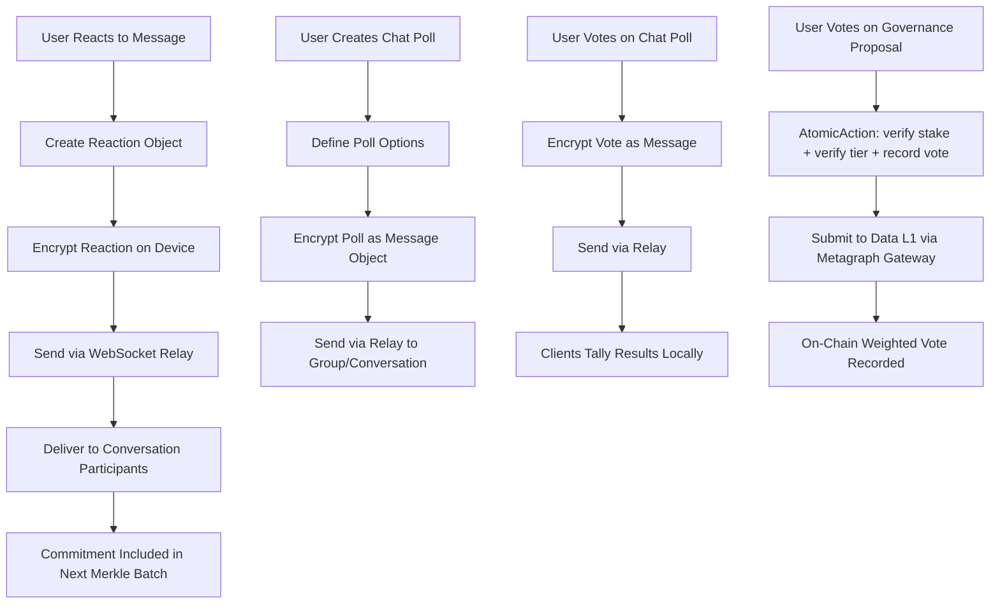
```mermaid
graph TD
    A[User Reacts to Message] --> B[Create Reaction Object]
    B --> C[Encrypt Reaction on Device]
    C --> D[Send via WebSocket Relay]
    D --> E[Deliver to Conversation Participants]
    E --> F[Commitment Included in Next Merkle Batch]
    G[User Creates Chat Poll] --> H[Define Poll Options]
    H --> I[Encrypt Poll as Message Object]
    I --> J[Send via Relay to Group/Conversation]
    K[User Votes on Chat Poll] --> L[Encrypt Vote as Message]
    L --> M[Send via Relay]
    M --> N[Clients Tally Results Locally]
    O[User Votes on Governance Proposal] --> P[AtomicAction: verify stake + verify tier + record vote]
    P --> Q[Submit to Data L1 via Metagraph Gateway]
    Q --> R[On-Chain Weighted Vote Recorded]
```

## Key Components

### Emoji Reactions

Users can react to messages using a comprehensive emoji library that includes standard Unicode emojis and custom reactions. The reaction system supports multiple reactions per user per message with real-time synchronization.

**Key Features:**

* Standard Unicode emoji library
* Custom reaction support
* Multiple reactions per user per message
* Reaction count aggregation
* Reaction list view
* Reaction removal
* Real-time synchronization
* Reaction notifications
* Reaction history tracking

### NFT Emojis

Custom VIP emoji packs allow VIP subscribers to use exclusive sticker sets and emoji reactions. Standard emoji reactions use the platform's built-in library with no blockchain dependency. Custom emoji uploads are supported for VIP users (upload your own reaction image). There is no NFT emoji trading marketplace in the initial implementation — this is reserved for potential Phase 5+ ecosystem expansion.

**Key Features:**

* Standard Unicode emoji reactions (all users)
* VIP exclusive emoji packs and sticker sets
* Custom emoji upload for VIP users
* Emoji reaction display in message threads
* Emoji reaction count aggregation
* Reaction list view (tap to see who reacted)
* Real-time reaction sync via relay

### Polls & Surveys

Users can create polls with multiple-choice answers within any conversation or group. Chat polls are standard encrypted message objects — votes are replies in the conversation thread, aggregated client-side. Governance polls use the metagraph Data L1 with trust-tier weighted `AtomicAction` voting (defined in the Dynamic Trust Network blueprint).

**Key Features:**

* Multiple choice poll creation in any conversation or group
* Anonymous voting option (recipient cannot link vote to sender)
* Time-limited polls with configurable expiration
* Real-time result updates via relay
* Client-side result tallying for chat polls
* On-chain weighted voting for governance proposals (AtomicAction)
* Trust-score weighted voting for group governance decisions
* Poll result visualization and export
* Poll history tracking

### Interactive Buttons

Users can create interactive messages that include buttons for quick responses, calendar scheduling, or e-commerce transactions. All interactions maintain the platform's security standards.

**Key Features:**

* Custom button creation
* Button action configuration
* Quick response buttons
* Calendar scheduling buttons
* Payment request buttons
* External app integration buttons
* Button click tracking
* Button result aggregation
* Button history

### Rich Media Reactions

Users can react to messages with voice note responses, photo reactions, and short video clips. Rich media reactions are automatically compressed and encrypted for efficient transmission.

**Key Features:**

* Voice note reactions
* Photo reactions
* Video clip reactions
* Automatic compression
* End-to-end encryption
* Reaction playback
* Reaction deletion
* Reaction notifications

### Reaction-Based Rewards

The system integrates with the ECHO token system to enable reaction-based rewards. Popular content creators can earn tokens based on engagement metrics while maintaining user privacy through anonymous interaction tracking.

**Key Features:**

* Reaction-based token rewards
* Engagement metric tracking
* Creator earnings calculation
* Anonymous interaction tracking
* Reward distribution
* Reward history
* Leaderboard display
* Reward withdrawal

### Poll Results & Analytics

Poll results and reaction data are anchored to the blockchain for transparency and audit purposes. Group administrators can view aggregated analytics while respecting individual user privacy.

**Key Features:**

* Blockchain-anchored results
* Result transparency
* Aggregated analytics
* Privacy-preserving reporting
* Result visualization
* Trend analysis
* Demographic breakdowns
* Export functionality

### Community Governance

Poll results can be used for community-driven decision making regarding group governance and platform development priorities. Smart contracts can automatically execute decisions based on poll outcomes.

**Key Features:**

* Governance poll creation
* Voting weight configuration
* Quorum requirements
* Automatic execution
* Smart contract integration
* Proposal tracking
* Voting history
* Governance transparency

## Security Principles

* All reactions and poll data are encrypted end-to-end
* Voting results are tallied through zero-knowledge proofs
* Voter privacy is preserved while ensuring result integrity
* Poll data is anchored to the blockchain for transparency
* Reaction data is stored in the metagraph for redundancy
* User privacy is maintained through anonymous interaction tracking
* All interactive elements maintain end-to-end encryption
* Governance decisions are transparent and auditable

## Advanced Message Search and Archive System

# Advanced Message Search and Archive System

## Overview

This feature provides users with powerful search capabilities across their entire message history while maintaining end-to-end encryption and privacy protection through client-side indexing and zero-knowledge search techniques. Users can quickly locate specific conversations, files, or information across years of communication history without compromising the security principles that protect their private communications.

## Architecture

The search system operates through local indexing where message content is processed and indexed on each user's device using privacy-preserving techniques. All search operations are performed locally to maintain privacy, with no message content exposed to external systems.

### Search & Archive Flow

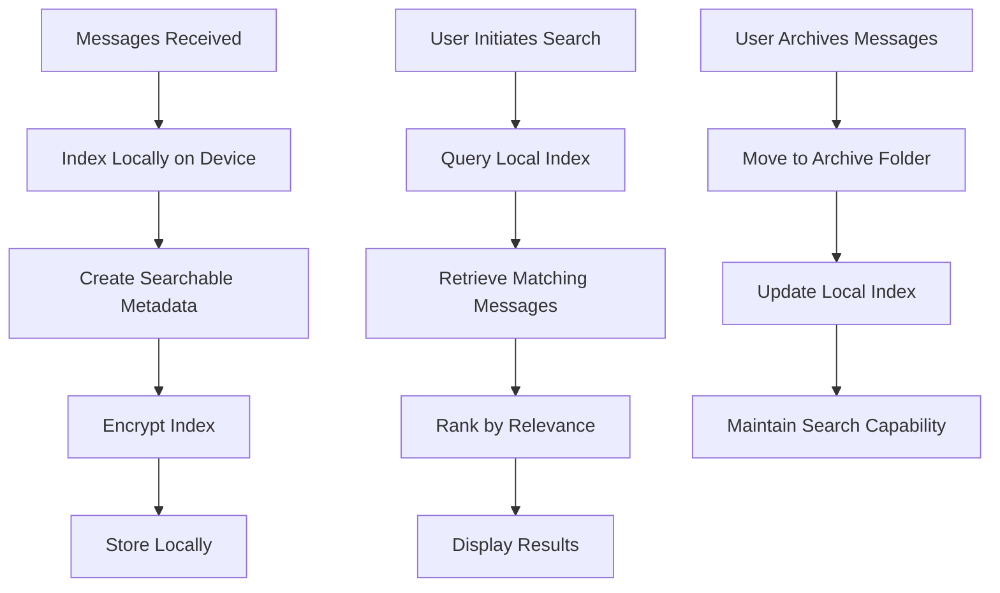
```mermaid
graph TD
    A[Messages Received] --> B[Index Locally on Device]
    B --> C[Create Searchable Metadata]
    C --> D[Encrypt Index]
    D --> E[Store Locally]
    F[User Initiates Search] --> G[Query Local Index]
    G --> H[Retrieve Matching Messages]
    H --> I[Rank by Relevance]
    I --> J[Display Results]
    K[User Archives Messages] --> L[Move to Archive Folder]
    L --> M[Update Local Index]
    M --> N[Maintain Search Capability]
```

## Key Components

### Local Message Indexing

Message content is processed and indexed on each user's device using privacy-preserving techniques that create searchable metadata without exposing message content to external systems. Indexing occurs automatically as messages are received.

**Key Features:**

* Automatic indexing on message receipt
* Local-only processing
* Privacy-preserving metadata creation
* Incremental index updates
* Index encryption at rest
* Index backup to user-controlled storage
* Index optimization for performance
* Index size management

### Keyword Search

Users can search by keywords to locate specific messages. Search results are ranked by relevance and recency. Fuzzy matching handles typos and variations.

**Key Features:**

* Full-text keyword search
* Fuzzy matching for typos
* Case-insensitive search
* Partial word matching
* Search result highlighting
* Result ranking by relevance
* Result ranking by recency
* Search history tracking

### Advanced Search Filters

Users can apply advanced filters to narrow search results by date range, sender identity, conversation context, or content type.

**Key Features:**

* Date range filtering
* Sender filtering
* Conversation filtering
* Content type filtering (text, images, files, links)
* Trust score filtering
* Verification status filtering
* Multiple filter combination
* Filter preset saving

### Semantic Search

The system supports semantic search that can locate messages based on meaning rather than exact keyword matches. Semantic search utilizes locally-processed natural language understanding that never exposes message content to external AI services.

**Key Features:**

* Semantic meaning matching
* Local NLP processing
* Concept-based search
* Intent recognition
* Context-aware results
* Synonym matching
* Related message suggestions
* Search refinement recommendations

### Archive Functionality

Users can organize their message history into custom categories and folders while maintaining the ability to search across archived content. The system supports automatic archiving based on user-defined rules.

**Key Features:**

* Custom archive folders
* Automatic archiving by inactivity
* Automatic archiving by content type
* Automatic archiving by trust score
* Archive search capability
* Archive browsing
* Archive restoration
* Archive deletion

### Archive Rules

Users can define rules for automatic archiving based on conversation inactivity, trust score thresholds, or content type classifications.

**Key Features:**

* Inactivity-based archiving
* Trust score-based archiving
* Content type-based archiving
* Custom rule creation
* Rule scheduling
* Rule modification
* Rule deletion
* Rule testing

### Secure Backup

Archived messages remain fully encrypted and accessible through the search interface. Users can configure secure backup to user-controlled storage locations including hardware devices or decentralized storage networks.

**Key Features:**

* Encrypted backup creation
* Hardware device backup
* Decentralized storage backup (IPFS/Filecoin)
* Cloud storage backup (encrypted)
* Backup scheduling
* Backup verification
* Backup restoration
* Backup deletion

### Cross-Device Search Synchronization

Search result sharing occurs through encrypted index sharing that allows users to search their complete message history from any device while maintaining end-to-end encryption.

**Key Features:**

* Encrypted index synchronization
* Cross-device search capability
* Index consistency verification
* Selective device synchronization
* Synchronization scheduling
* Bandwidth optimization
* Offline search support
* Sync conflict resolution

### Search Result Sharing

Users can create secure links to specific messages or conversations that can be shared with verified contacts while maintaining access controls and expiration settings.

**Key Features:**

* Secure message link generation
* Conversation link generation
* Access control configuration
* Expiration time setting
* Password protection
* View count limiting
* Link revocation
* Link tracking

### Search Analytics

The system provides analytics on search patterns and frequently searched terms to help users understand their communication history and optimize their search strategies.

**Key Features:**

* Search frequency tracking
* Popular search terms
* Search trend analysis
* Search performance metrics
* Search result quality metrics
* User search behavior insights
* Privacy-preserving analytics
* Analytics export

## Security Principles

* All search operations are performed locally on the user's device
* Message content is never exposed to external search services
* Search indexes are encrypted at rest
* Semantic search uses local NLP processing only
* Archive data remains fully encrypted
* Backup data is encrypted before transmission
* Cross-device synchronization uses encrypted channels
* User privacy is preserved through local-only processing

## Hidden Folders with Biometric Protection

# Hidden Folders with Biometric Protection

## Overview

This feature provides users with secure, biometrically-protected folders for sensitive one-on-one conversations that require additional privacy layers beyond standard end-to-end encryption. Hidden folders remain completely invisible in the main chat interface and can only be accessed through successful biometric authentication, creating a secure vault for confidential communications that protects against unauthorized access even if the device is compromised.

## Architecture

Hidden folders use biometric-derived encryption keys bound to the user's biometric template. The system integrates with the device's secure enclave to ensure biometric templates and derived encryption keys never leave the hardware security module.

### Hidden Folder Access Flow

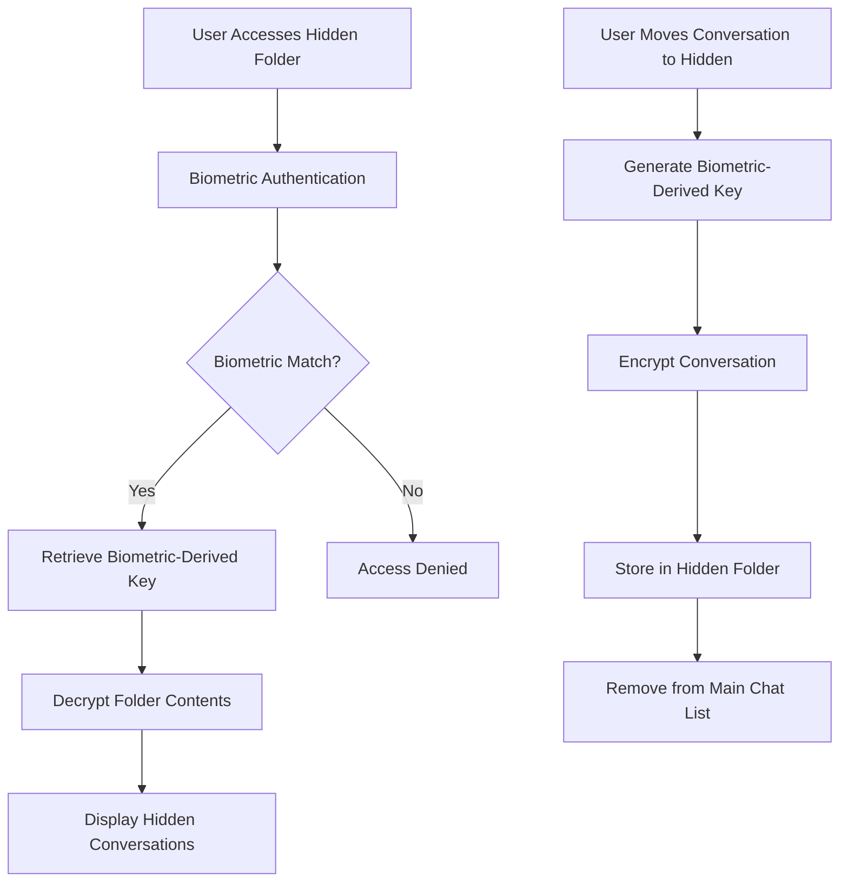
```mermaid
graph TD
    A[User Accesses Hidden Folder] --> B[Biometric Authentication]
    B --> C{Biometric Match?}
    C -->|Yes| D[Retrieve Biometric-Derived Key]
    C -->|No| E[Access Denied]
    D --> F[Decrypt Folder Contents]
    F --> G[Display Hidden Conversations]
    H[User Moves Conversation to Hidden] --> I[Generate Biometric-Derived Key]
    I --> J[Encrypt Conversation]
    J --> K[Store in Hidden Folder]
    K --> L[Remove from Main Chat List]
```

## Key Components

### Biometric Authentication

Users authenticate using Face ID, Touch ID, or other biometric verification methods supported by their device. Biometric authentication is required to access hidden folders.

**Key Features:**

* Face ID authentication
* Touch ID authentication
* Fallback PIN code
* Biometric template binding
* Secure enclave integration
* Failed attempt tracking
* Lockout after failed attempts
* Biometric re-enrollment

### Biometric-Derived Encryption Keys

Hidden folder encryption keys are derived from the user's biometric template, ensuring that even if someone gains access to the device, they cannot access hidden conversations without the correct biometric signature.

**Key Features:**

* Biometric-derived key generation
* Key binding to biometric template
* Key derivation function (PBKDF2)
* Unique key per hidden folder
* Key rotation on biometric update
* Key escrow prevention
* Secure key storage in enclave
* Key destruction on biometric removal

### Hidden Folder Management

Users can create multiple hidden folders with different access requirements. Each hidden folder maintains its own message history, notification settings, and backup protocols.

**Key Features:**

* Multiple hidden folder creation
* Custom folder naming
* Folder-specific access requirements
* Folder-specific notification settings
* Folder-specific backup settings
* Folder organization
* Folder deletion with secure wipe
* Folder recovery options

### Conversation Moving

Users can move one-on-one conversations to hidden folders. Moving a conversation removes it from the main chat list and encrypts it with biometric-derived keys.

**Key Features:**

* Conversation selection
* Move to hidden folder
* Conversation encryption
* Main list removal
* Conversation history preservation
* Notification setting changes
* Backup setting changes
* Move reversal

### Enhanced Encryption

Messages within hidden folders use enhanced encryption that combines the standard Noise Protocol implementation with biometric-derived key material, creating multi-layered security.

**Key Features:**

* Noise Protocol encryption
* Biometric-derived key material
* Multi-layered encryption
* Key ratcheting
* Forward secrecy
* Message authentication codes
* Replay attack prevention
* Encryption algorithm: AES-256-GCM

### Notification Management

Users can configure custom notification behaviors for hidden conversations, including silent notifications that appear only when the folder is unlocked, or complete notification suppression.

**Key Features:**

* Silent notifications
* Locked folder notifications
* Unlocked folder notifications
* Notification suppression
* Custom notification sounds
* Notification badges
* Notification preview control
* Notification scheduling

### Secure Enclave Integration

Hidden folder metadata is encrypted and stored locally on the device rather than synchronized across multiple devices. Biometric templates and derived encryption keys are stored in the device's secure enclave.

**Key Features:**

* Secure enclave storage
* Local-only metadata storage
* No cloud synchronization
* Biometric template protection
* Key material protection
* Tamper detection
* Secure deletion
* Hardware security module integration

### Secure Backup

Users can optionally enable secure backup of hidden folders through additional biometric verification combined with a recovery phrase. Backups are encrypted and stored securely.

**Key Features:**

* Biometric-protected backup
* Recovery phrase generation
* Encrypted backup storage
* Backup restoration
* Multi-device restoration
* Backup verification
* Backup deletion
* Backup scheduling

### Access Logging

All access to hidden folders is logged locally for security auditing. Users can view access logs to detect unauthorized access attempts.

**Key Features:**

* Access timestamp logging
* Biometric method logging
* Failed attempt logging
* Access duration logging
* Device information logging
* Location logging (optional)
* Access log encryption
* Access log retention

## Security Principles

* Biometric templates are stored exclusively in the secure enclave
* Encryption keys are derived from biometric templates and never transmitted
* Hidden folder metadata is encrypted and stored locally
* Messages within hidden folders use multi-layered encryption
* Biometric authentication is required for all access
* Access logs are maintained for security auditing
* Secure backup requires additional biometric verification
* All communication is encrypted in transit with TLS 1.3+

## Silent and Scheduled Private Chats

# Silent and Scheduled Private Chats

## Overview

This feature enables users to send messages that generate no notifications or visible indicators on the recipient's device, while also supporting scheduled message delivery for time-sensitive communications across different time zones or planned conversations. The system provides granular control over message visibility and timing while maintaining end-to-end encryption and blockchain anchoring for all communications.

## Architecture

Silent messages use enhanced metadata handling where notification suppression flags are embedded in the encrypted message payload. Scheduled messages use time-locked encryption where the message content is encrypted with keys that are only released at the specified delivery time through smart contract automation.

### Silent & Scheduled Message Flow

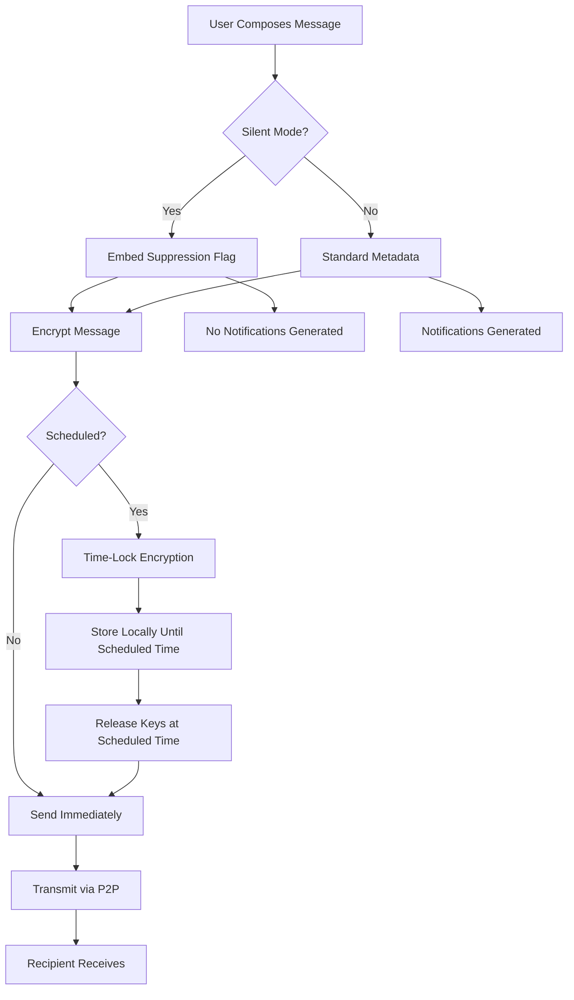
```mermaid
graph TD
    A[User Composes Message] --> B{Silent Mode?}
    B -->|Yes| C[Embed Suppression Flag]
    B -->|No| D[Standard Metadata]
    C --> E[Encrypt Message]
    D --> E
    E --> F{Scheduled?}
    F -->|Yes| G[Time-Lock Encryption]
    F -->|No| H[Send Immediately]
    G --> I[Store Locally Until Scheduled Time]
    I --> J[Release Keys at Scheduled Time]
    J --> H
    H --> K[Transmit via P2P]
    K --> L[Recipient Receives]
    C --> M[No Notifications Generated]
    D --> N[Notifications Generated]
```

## Key Components

### Silent Mode

Users can activate silent mode for individual conversations or specific messages, which suppresses all notification behaviors including push notifications, badge counts, typing indicators, and read receipts on the recipient's device.

**Key Features:**

* Per-conversation silent mode
* Per-message silent mode
* Push notification suppression
* Badge count suppression
* Typing indicator suppression
* Read receipt suppression
* Silent mode indicators
* Silent mode duration configuration

### Silent Message Delivery

Silent messages appear in the conversation thread only when the recipient actively opens the chat, creating a non-intrusive communication channel for sensitive or low-priority messages.

**Key Features:**

* Silent message appearance in thread
* No notification indicators
* No badge updates
* No typing indicators
* No read receipts
* Silent message marking
* Silent message history
* Silent mode toggle per message

### Notification Suppression Flags

Notification suppression flags are embedded in the encrypted message payload, ensuring that even relay nodes cannot determine which messages should generate notifications.

**Key Features:**

* Encrypted suppression flags
* Relay node privacy
* Flag verification
* Flag tampering prevention
* Flag encryption with message
* Flag decryption by recipient
* Flag audit logging
* Flag compliance verification

### Message Scheduling

Users can compose messages that are delivered at predetermined times. Messages are encrypted and stored locally on the sender's device until the scheduled delivery time. iOS background tasks wake the app at the scheduled time to transmit the message via the WebSocket relay.

**Scheduling limits by tier:**

| Tier | Max Advance Scheduling | Recurring Support |
| --- | --- | --- |
| Free | Up to 1 week | No |
| VIP ($9.99/month) | Up to 1 year | Yes (daily, weekly, monthly) |

**Key Features:**

* Message scheduling up to 1 week (free) / 1 year (VIP)
* Preset time options (in 1 hour, tomorrow morning, next week)
* Custom date/time selector with timezone support
* Recurring message scheduling (VIP only)
* Message editing or cancellation before delivery
* Delivery confirmation with timestamp
* Scheduled message list with pending/sent status
* iOS BGProcessingTask for reliable background delivery

### Local Encrypted Message Queue

Scheduled messages are encrypted on-device and stored in the local SwiftData database under iOS Data Protection (`NSFileProtectionComplete`). No server coordination or on-chain smart contract is needed for scheduling.

```swift
struct ScheduledMessage {
    let id: String
    let conversationId: String
    let encryptedPayload: Data     // Already E2E encrypted — same as live messages
    let commitment: Data           // For Merkle anchoring on delivery
    let scheduledAt: Date          // Delivery time (user's local timezone)
    let recipientDID: String
    let isSilent: Bool
    let isRecurring: Bool
    let recurrenceRule: RecurrenceRule?
    let createdAt: Date
}

// iOS background task delivers the message at scheduled time
class ScheduledMessageDeliveryTask: BGProcessingTask {
    func deliver(_ message: ScheduledMessage) async throws {
        // 1. Wake relay WebSocket connection
        // 2. Transmit encrypted payload via relay (same as live messages)
        // 3. Track commitment for Merkle anchoring
        // 4. Remove from local queue on success
        // 5. Retry with exponential backoff on failure
    }
}
```

**Key Features:**

* Local SwiftData storage with `NSFileProtectionComplete`
* No server-side scheduling infrastructure required
* Delivery via standard WebSocket relay on schedule
* Commitment anchored in Merkle batch at delivery time (not at compose time)
* Failed delivery retries with exponential backoff
* Automatic cleanup of delivered messages from queue

### Cross-Timezone Scheduling

The system supports cross-timezone scheduling with automatic conversion based on recipient location preferences while maintaining privacy through zero-knowledge proofs.

**Key Features:**

* Timezone detection
* Automatic timezone conversion
* Recipient timezone preferences
* Timezone-aware scheduling
* Daylight saving time handling
* Timezone verification
* Privacy-preserving timezone handling
* Timezone error prevention

### Trust Score Limitations

The feature integrates with the existing trust scoring system to prevent abuse, where users with low trust scores face limitations on silent messaging frequency to prevent spam or harassment.

**Key Features:**

* Trust score-based rate limiting
* Silent message frequency limits
* Scheduled message frequency limits
* Trust score thresholds
* Limit escalation
* Limit enforcement
* Limit appeals
* Limit transparency

### Blockchain Anchoring

Scheduled messages maintain full blockchain anchoring and provable integrity features, with delivery timestamps cryptographically verified to ensure messages were sent at the intended time.

**Key Features:**

* Message hash anchoring
* Delivery timestamp anchoring
* Blockchain confirmation
* Timestamp verification
* Integrity proof generation
* Proof sharing capability
* Audit trail creation
* Compliance recording

### Delivery Confirmation

Users receive confirmation when scheduled messages are delivered. Delivery confirmations include timestamp verification and blockchain proof.

**Key Features:**

* Delivery notifications
* Timestamp confirmation
* Blockchain proof display
* Delivery status tracking
* Failed delivery handling
* Retry automation
* Delivery history
* Delivery analytics

## Security Principles

* Silent message suppression flags are encrypted inside the message payload — relay nodes cannot determine which messages are silent
* Scheduled messages are encrypted on-device before local storage using the same Kinnami encryption as live messages (X25519 + ChaCha20-Poly1305)
* Local scheduled message queue is protected by iOS Data Protection (`NSFileProtectionComplete`)
* No server-side scheduling infrastructure — the relay is only involved at delivery time, not at compose time
* Commitment hashes are anchored in the standard Merkle batch at delivery time
* Blockchain anchoring provides immutable delivery timestamps verifiable on DAG Explorer
* Trust tier limits prevent abuse (low-trust users have frequency caps on silent messages)
* All communication is encrypted end-to-end via the content-blind WebSocket relay

## Disappearing Messages with Cryptographic Verification

# Disappearing Messages with Cryptographic Verification

## Overview

This feature provides users with the ability to send messages that automatically delete from all devices after predetermined time periods while maintaining cryptographic proof that the messages existed and were delivered. The system ensures that sensitive communications can be ephemeral while preserving audit trails through blockchain-anchored commitment hashes—proving a conversation occurred without revealing what was said.

**Key Innovation:** Message commitment hashes are anchored in Merkle batches on-chain before expiration. After the timer expires, plaintext is deleted from all devices, but the on-chain Merkle root persists indefinitely as immutable proof of existence.

## Architecture

Messages are encrypted end-to-end using standard Kinnami encryption (X25519 + ChaCha20-Poly1305). Commitment hashes are generated and anchored in Merkle batches on the Data L1 layer. Client-side timers trigger plaintext deletion at expiration time. The on-chain Merkle root remains as proof that "a message existed at this time" without revealing content.

**Privacy/Auditability Tradeoff:** The on-chain Merkle root persists indefinitely, but individual commitments become unverifiable after plaintext deletion (users can no longer regenerate the commitment hash from deleted plaintext). This preserves privacy (no one can read the deleted message) while maintaining auditability (the blockchain proves a message existed at that timestamp).

### Disappearing Message Flow

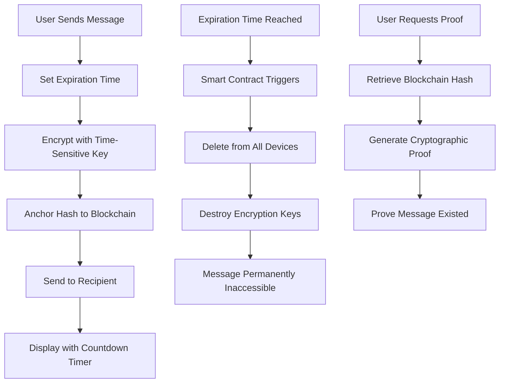
```mermaid
graph TD
    A[User Sends Message] --> B[Set Expiration Time]
    B --> C[Encrypt with Time-Sensitive Key]
    C --> D[Anchor Hash to Blockchain]
    D --> E[Send to Recipient]
    E --> F[Display with Countdown Timer]
    G[Expiration Time Reached] --> H[Smart Contract Triggers]
    H --> I[Delete from All Devices]
    I --> J[Destroy Encryption Keys]
    J --> K[Message Permanently Inaccessible]
    L[User Requests Proof] --> M[Retrieve Blockchain Hash]
    M --> N[Generate Cryptographic Proof]
    N --> O[Prove Message Existed]
```

## Key Components

### Disappearing Message Configuration

Users can enable disappearing messages for individual conversations or specific messages. The available expiration range depends on the user's tier — free tier is limited to a 24-hour maximum to prevent evidence destruction abuse, while VIP subscribers can set timers up to 1 year for long-lived but eventually ephemeral conversations.

**Expiration limits by tier:**

| Tier | Minimum | Maximum | Custom Timing |
| --- | --- | --- | --- |
| Free (Tier 1–2) | 1 hour | 24 hours | No |
| Free (Tier 3–5) | 10 seconds | 24 hours | No |
| VIP ($9.99/month) | 10 seconds | 1 year | Yes |
| Organization | Disabled if legal hold active | Disabled if legal hold active | N/A |

**Key Features:**

* Preset time intervals (10 seconds, 1 minute, 5 minutes, 1 hour, 1 day, 7 days)
* Extended options for VIP: 30 days, 90 days, 6 months, 1 year
* Per-conversation settings (all messages disappear after timer)
* Per-message settings (single message with custom timer)
* Default expiration configuration per conversation
* Expiration time visible in message metadata
* Warning indicators for disappearing conversations
* Trust tier enforcement (Tier 1 minimum: 1 hour, prevents harassment abuse)

### Countdown Timers

Messages display countdown timers that show remaining visibility time to all participants, creating transparency about message lifecycle.

**iOS Implementation:**

```swift
struct DisappearingMessageView: View {
    let message: Message
    @State private var timeRemaining: TimeInterval
    
    var body: some View {
        HStack {
            MessageBubble(message: message)
            
            if let expiresAt = message.expiresAt {
                CountdownTimer(expiresAt: expiresAt) { expired in
                    if expired {
                        deleteMessageLocally(message.id)
                    }
                }
            }
        }
    }
}

struct CountdownTimer: View {
    let expiresAt: Date
    let onExpire: (Bool) -> Void
    @State private var timeRemaining: TimeInterval = 0
    
    var body: some View {
        Text(formatTime(timeRemaining))
            .font(.caption)
            .foregroundColor(.secondary)
            .onAppear {
                startTimer()
            }
    }
    
    private func startTimer() {
        Timer.scheduledTimer(withTimeInterval: 1.0, repeats: true) { timer in
            timeRemaining = expiresAt.timeIntervalSinceNow
            if timeRemaining <= 0 {
                timer.invalidate()
                onExpire(true)
            }
        }
    }
}
```

**Key Features:**

* Real-time countdown display
* Timer visibility to all participants
* Timer completion triggers local deletion
* Timer format options (5:23, "in 5 minutes")
* Accessibility support for countdown announcements

### Client-Side Deletion Mechanism

When the expiration timer reaches zero, each client independently deletes the message plaintext and encryption keys from local storage. No server coordination is required—each device's timer triggers local deletion.

**iOS Deletion Process:**

```swift
func deleteMessageLocally(_ messageId: String) async {
    // 1. Delete plaintext from SwiftData
    try? await database.deleteMessage(messageId)
    
    // 2. Delete encryption keys from Keychain
    try? keychain.deleteKey(for: messageId)
    
    // 3. Delete any cached media
    try? mediaCache.deleteMedia(for: messageId)
    
    // 4. Clear from memory
    messageCache.removeValue(forKey: messageId)
    
    // 5. Log deletion event (local only)
    logger.log("Message \(messageId) expired and deleted")
    
    // Note: Commitment hash remains in local storage for proof generation
    // On-chain Merkle root persists indefinitely
}
```

**What Gets Deleted:**

* ✅ Message plaintext
* ✅ Encryption keys (X25519, ChaCha20)
* ✅ Media attachments
* ✅ Message metadata (sender, timestamp)
* ❌ **Commitment hash** (kept for proof generation)
* ❌ **On-chain Merkle root** (immutable, persists forever)

**What Remains as Proof:**

* On-chain Merkle root (proves message existed)
* Commitment hash (local, cannot verify without plaintext)
* Timestamp (when message was sent)
* Conversation ID (which conversation it belonged to)

**Key Features:**

* Independent client-side deletion (no server coordination)
* Timer-triggered deletion (iOS background tasks)
* Secure deletion (overwrite sensitive data)
* Deletion verification (check storage cleared)
* Failed deletion handling (retry on next app launch)
* Deletion logging (local audit trail)

### Blockchain-Anchored Commitment Hashes

Disappearing messages generate commitment hashes like standard messages: `commitment = H(H(plaintext) || nonce)`. These commitments are included in Merkle batches and anchored on the Data L1 layer **before** the expiration timer starts.

**Anchoring Timeline:**

```plaintext
T=0:      Message sent, commitment generated
T=0-5min: Commitment added to Merkle batch
T=5min:   Merkle root anchored on Data L1
T=5-10s:  Metagraph consensus finalizes
T=10s:    On-chain confirmation received
T=10s+:   Timer counts down from expiration time
T=expire: Plaintext deleted, commitment becomes unverifiable
Forever:  Merkle root persists on-chain as proof
```

**Why Anchor Before Deletion:**

Without pre-anchoring, a user could send a disappearing message, then claim "I never sent that" after deletion. With pre-anchoring, the on-chain Merkle root proves "a message existed at timestamp T from this device" even though the content is now deleted.

**Key Features:**

* Commitment hash generated before send
* Anchored in standard Merkle batch (5min/1000 msgs)
* On-chain confirmation before deletion
* Merkle proof verifiable before deletion
* Merkle root persists after deletion (proof of existence)
* Commitment becomes unverifiable after deletion (privacy preserved)

### Cryptographic Proof Generation

Users can generate cryptographic proofs that demonstrate message existence and delivery timestamps without revealing message content. This is critical for legal and compliance scenarios.

**Proof Structure:**

```swift
struct DisappearingMessageProof {
    let messageId: String
    let conversationId: String
    let senderDID: String
    let recipientDID: String
    let timestamp: Date
    let expiresAt: Date
    let snapshotHash: String         // On-chain snapshot
    let snapshotHeight: Int          // On-chain height
    let merkleRoot: Data             // On-chain Merkle root
    let merkleProof: [Data]?         // Siblings for verification
    let commitmentHash: Data         // Local (unverifiable after deletion)
    let proofType: ProofType
    
    enum ProofType {
        case beforeDeletion    // Full Merkle proof with verifiable commitment
        case afterDeletion     // Merkle root only, commitment unverifiable
    }
}

func generateProof(messageId: String) -> DisappearingMessageProof? {
    let message = database.fetchDeletedMessage(messageId)
    let anchoringInfo = database.fetchAnchoringInfo(messageId)
    
    let canVerifyCommitment = (message?.plaintext != nil)
    
    return DisappearingMessageProof(
        // ... populate fields
        proofType: canVerifyCommitment ? .beforeDeletion : .afterDeletion
    )
}
```

**Proof Capabilities:**

| Proof Type | Can Prove | Cannot Prove |
| --- | --- | --- |
| Before Deletion | Message existed, exact content, Merkle inclusion | N/A |
| After Deletion | Message existed at timestamp, on-chain Merkle root | Message content, commitment verification |

**Key Features:**

* Proof generation from local storage + on-chain data
* Timestamped proof of existence
* Shareable proof format (JSON/PDF)
* Third-party verification (anyone can verify Merkle root on-chain)
* Proof expiration not applicable (on-chain data persists)
* Proof indicates deletion status (before/after)

### Trust Score Restrictions

The feature integrates with the trust scoring system to prevent abuse. Users with low trust scores face restrictions on very short disappearing timeframes to prevent harassment or evidence destruction.

**Restriction Matrix:**

| Trust Tier | Minimum Expiration | Maximum Per Day | Rationale |
| --- | --- | --- | --- |
| Tier 1 (Unverified) | 1 hour | 10 messages | Prevent spam/harassment |
| Tier 2 (Newcomer) | 5 minutes | 50 messages | Minimal restrictions |
| Tier 3 (Member) | 10 seconds | 200 messages | Full access |
| Tier 4 (Verified) | 10 seconds | Unlimited | Trusted user |
| Tier 5 (Trusted) | 10 seconds | Unlimited | Maximum trust |

**Key Features:**

* Trust tier-based minimum expiration times
* Daily message count limits for low-trust users
* Restriction enforcement (backend validation)
* Restriction transparency (UI shows limits)
* Restriction escalation on abuse patterns

### Screenshot & Forwarding Limitations

**iOS Platform Limitations:**

Apple does not provide APIs for detecting or preventing screenshots. Apps cannot:

* Detect when a screenshot is taken
* Prevent screenshots technically
* Receive notifications when screenshots occur

**What ECHO Can Do:**

1. **Warning UI**: Display prominent warning in disappearing message conversations: "⚠️ Screenshots cannot be prevented on iOS. Only send disappearing messages to trusted contacts."

2. **Social/Trust Mechanisms**:

   * Trust tier requirements for disappearing messages
   * Reputation damage for users who screenshot
   * Community reporting for screenshot abuse

3. **Forwarding Prevention**:

   * Disable forwarding UI for disappearing messages
   * Backend validation rejects forwarded disappearing messages
   * Warning if user tries to forward

4. **iOS Data Protection**:

   * Messages stored with `NSFileProtectionComplete`
   * Encrypted at rest when device locked
   * Secure enclave for encryption keys

**User Education:**

The app clearly communicates:

* Screenshots cannot be prevented on iOS
* Disappearing messages are trust-based, not foolproof
* Only use with trusted contacts
* For maximum privacy, use Hidden Folders + Disappearing Messages

### Compliance & Legal Discovery

The system maintains compliance with legal discovery requirements by preserving cryptographic evidence of communications while respecting user privacy through content deletion.

**Legal Hold Support:**

For Organization tier users subject to legal hold:

1. Backend flags conversations under legal hold
2. Disappearing messages are **disabled** for held conversations
3. All messages are retained until hold is lifted
4. Audit trail records hold status

**Evidence Preservation:**

Even for non-held conversations:

* On-chain Merkle roots prove message existence
* Timestamps prove when communication occurred
* Commitment hashes (if stored) prove message ID
* Cannot prove content after deletion

**Proof for Legal Purposes:**

```swift
func generateLegalProof(messageId: String) -> LegalProof {
    return LegalProof(
        exists: true,
        timestamp: message.timestamp,
        conversationId: message.conversationId,
        senderDID: message.senderDID,
        recipientDID: message.recipientDID,
        merkleRoot: anchoringInfo.merkleRoot,
        snapshotHash: anchoringInfo.snapshotHash,
        contentAvailable: false,  // Deleted
        legalHoldStatus: .notApplicable,
        verificationURL: "https://dagexplorer.io/snapshot/\(snapshotHash)"
    )
}
```

**Key Features:**

* Legal hold support (Org tier)
* Compliance recording of deletion events
* Evidence preservation via on-chain Merkle roots
* Discovery support (proof of existence, not content)
* Regulatory compliance (GDPR right to be forgotten)
* Audit trail maintenance (local logs + on-chain)
* Privacy preservation (content deleted)
* Legal proof generation (existence proof only)

## Security Principles

* Messages are encrypted end-to-end using Kinnami (X25519 + ChaCha20-Poly1305)
* Commitment hashes are anchored in Merkle batches before expiration
* Client-side timers trigger independent deletion (no server coordination)
* Plaintext is securely deleted from local storage on expiration
* Encryption keys are destroyed on expiration
* On-chain Merkle roots persist indefinitely as proof of existence
* Commitment hashes become unverifiable after deletion (privacy preserved)
* Cryptographic proofs demonstrate existence without revealing content
* Trust score limitations prevent abuse of short expiration times
* Screenshots cannot be prevented on iOS (user education + trust-based)
* Forwarding is disabled for disappearing messages
* Legal hold disables disappearing messages for compliance
* All communication is encrypted end-to-end

## Public and Private Groups with Verified Status Display

# Public and Private Groups with Verified Status Display

## Overview

This feature enables users to create and participate in both public and private group conversations (up to 1M members) while displaying transparent verification status for all participants. Groups leverage the platform's trust infrastructure and group key management to create self-moderating communities where verification levels determine participation privileges. Group metadata is anchored to the Data L1 layer for integrity verification while maintaining participant privacy.

## Architecture

Groups use symmetric key encryption for message content, with keys distributed to members via individually encrypted E2E messages through the relay. Group metadata (group ID, member count hash, admin DID) is submitted to Data L1 for validation. The WebSocket relay server uses NATS pub/sub to fan out group messages to all pods where recipients are connected.

### Group Creation & Discovery Flow

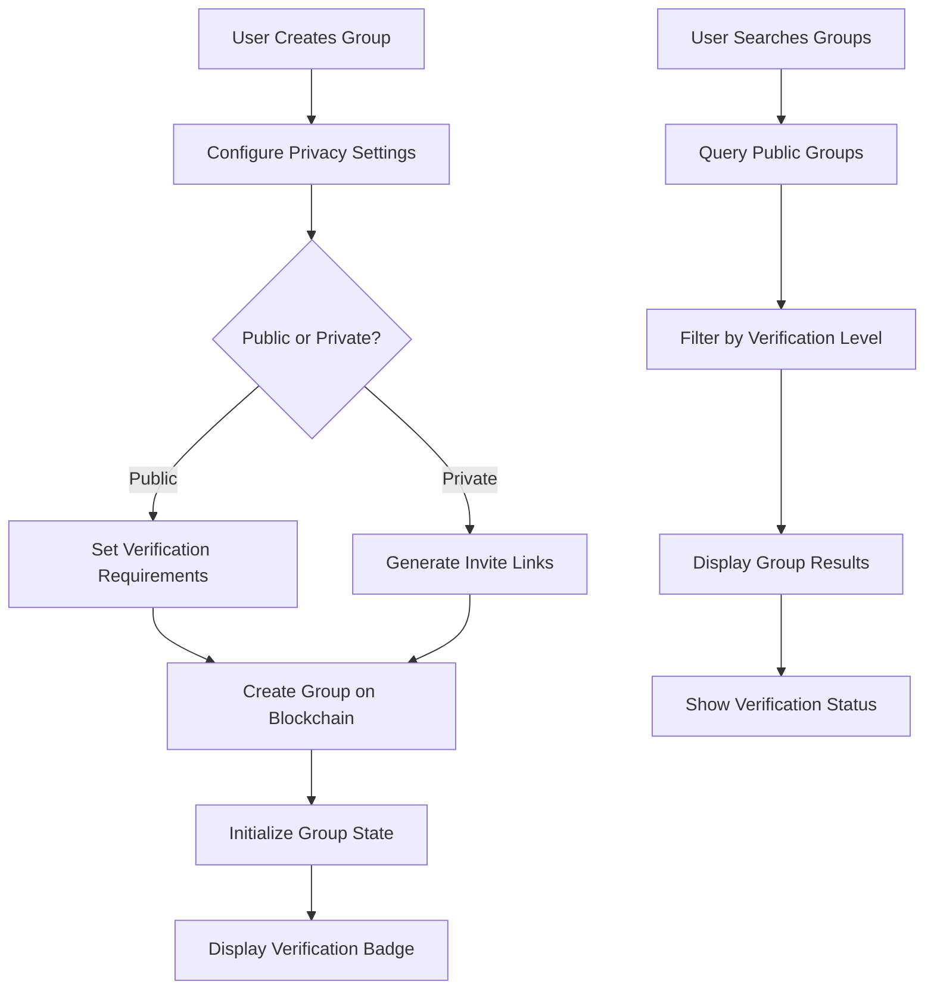
```mermaid
graph TD
    A[User Creates Group] --> B[Configure Privacy Settings]
    B --> C{Public or Private?}
    C -->|Public| D[Set Verification Requirements]
    C -->|Private| E[Generate Invite Links]
    D --> F[Create Group on Blockchain]
    E --> F
    F --> G[Initialize Group State]
    G --> H[Display Verification Badge]
    I[User Searches Groups] --> J[Query Public Groups]
    J --> K[Filter by Verification Level]
    K --> L[Display Group Results]
    L --> M[Show Verification Status]
```

## Key Components

### Group Key Management

Groups use symmetric encryption for message content to avoid per-recipient re-encryption for large groups. The iOS GroupKeyManager handles key lifecycle:

**Key Generation (Admin):**

```swift
actor GroupKeyManager {
    /// Generate new group key (called by group admin)
    func generateGroupKey(groupId: String) -> GroupKeyInfo {
        let key = encryption.generateSymmetricKey()  // AES-256
        let version = (getLatestKeyVersion(groupId: groupId) ?? 0) + 1
        let info = GroupKeyInfo(
            groupId: groupId, key: key,
            version: version, createdAt: Date()
        )
        storeGroupKey(info)
        return info
    }
    
    /// Encrypt group key for each member
    func encryptGroupKeyForMembers(
        groupKey: SymmetricKey,
        memberPublicKeys: [(did: String, publicKey: Data)]
    ) throws -> [(did: String, encryptedKey: Data)] {
        return try memberPublicKeys.map { member in
            let keyData = groupKey.withUnsafeBytes { Data($0) }
            let encrypted = try encryption.encrypt(
                plaintext: keyData,
                recipientPublicKey: member.publicKey  // X25519
            )
            return (did: member.did, encryptedKey: encrypted.serialized)
        }
    }
}
```

**Key Distribution:**

Admin encrypts the group key individually for each member using E2E encryption (X25519 + ChaCha20-Poly1305) and sends via the relay. Each member receives their encrypted key copy, decrypts with their private key, and stores in Keychain.

**Key Rotation:**

On member add/remove, admin generates a new group key and redistributes to all current members. This ensures removed members cannot decrypt future messages.

**Message Encryption:**

```swift
/// Encrypt group message with current group key
func encryptForGroup(plaintext: Data, groupId: String) throws -> Data {
    guard let keyInfo = getLatestKey(groupId: groupId) else {
        throw GroupError.noGroupKey
    }
    return try encryption.encryptForStorage(plaintext: plaintext, key: keyInfo.key)
}
```

**Key Features:**

* Symmetric key generation (AES-256-GCM)
* Per-member E2E distribution via relay
* Key rotation on membership changes
* Key versioning for message decryption
* Keychain storage for group keys
* Key expiration (optional, for high-security groups)

### Group Message Fan-Out Architecture

When a group message is sent, the relay server distributes it to all members. For large groups (10K+ members), NATS pub/sub enables cross-pod fan-out:

**Backend Fan-Out (Go):**

```go
// relay/group_fan_out.go

func (s *RelayService) RelayGroupMessage(msg GroupMessage) error {
    // 1. Rate limit check
    if err := s.rateLimiter.Check(msg.SenderDID, "group_message"); err != nil {
        return ErrRateLimitExceeded
    }
    
    // 2. Verify sender is group member
    if !s.isGroupMember(msg.GroupID, msg.SenderDID) {
        return ErrNotGroupMember
    }
    
    // 3. Get group member list
    members, err := s.getGroupMembers(msg.GroupID)
    if err != nil {
        return err
    }
    
    // 4. Publish to NATS for cross-pod fan-out
    s.nats.Publish("group."+msg.GroupID, msg)
    
    // 5. Deliver to online members on this pod
    for _, memberDID := range members {
        conn, online := s.connections.Get(memberDID)
        if online && conn.PodID == s.podID {
            conn.SendMessage(msg)
        } else if !online {
            // Queue for offline delivery (7-day retention for large groups)
            s.offlineQueue.Enqueue(memberDID, msg, Retention: 7*24*time.Hour)
        }
    }
    
    return nil
}
```

**Scaling for Large Groups:**

| Concern | Solution |
| --- | --- |
| Fan-out latency | NATS pub/sub for parallel delivery across relay pods |
| Offline queue explosion | 7-day retention for groups 100+ members (vs 30-day for 1:1) |
| Group key distribution | Sender trees: admin → sub-admins → members |
| On-chain metadata | Group ID + member count hash only; member list never on-chain |
| Rate limits | Group messages consume 1 send-rate token regardless of member count |

**Key Features:**

* NATS pub/sub for cross-pod fan-out
* WebSocket delivery to online members
* Offline queuing (7-day retention for large groups)
* Rate limiting per sender (not per recipient)
* APNs push for offline members

### Group Metadata Anchoring

Group metadata is submitted to Data L1 for validation and integrity verification. Only minimal metadata goes on-chain:

**Data L1 Submission:**

```go
type GroupMetadataSubmission struct {
    Type           string  // "group_metadata"
    GroupID        string  // UUID
    AdminDID       string  // Admin's DID
    MemberCountHash []byte // H(memberCount || salt)
    CreatedAt      time.Time
    SchemaVersion  int     // Current: 1
}
```

**What Goes On-Chain:**

* ✅ Group ID (UUID)
* ✅ Admin DID (creator)
* ✅ Member count hash (H(count || salt) - privacy-preserving)
* ✅ Timestamp
* ❌ **Never:** Member list, group name, description, messages

**Privacy-Preserving Statistics:**

Instead of zero-knowledge proofs (Phase 3+), Phase 1-2 uses simple hashing:

* Member count hash: `H(memberCount || groupSalt)` prevents manipulation without revealing exact count
* Users can verify group size when they join (see decrypted count)
* On-chain hash prevents admin from lying about group size

**Key Features:**

* Data L1 validation (admin DID authorization, hash structure)
* Member count hash (privacy-preserving)
* Group ID registration (prevents duplicates)
* Admin DID linkage (Cardano credential verification)
* Timestamp anchoring (group creation proof)

### Group Creation

Users can create public groups (discoverable via search) or private groups (invite-only). Trust tier determines maximum group size:

**Group Size Limits by Trust Tier:**

| Trust Tier | Max Group Size | Rationale |
| --- | --- | --- |
| Tier 1 (Unverified) | 10 members | Prevent spam group creation |
| Tier 2 (Newcomer) | 50 members | Emerging trust |
| Tier 3 (Member) | 500 members | Full trust |
| Tier 4 (Verified) | 10,000 members | Enhanced trust |
| Tier 5 (Trusted) | 1,000,000 members | Maximum trust |

**Key Features:**

* Public group creation (searchable)
* Private group creation (invite-only)
* Group naming and description
* Group avatar/icon
* Category and topic tagging
* Verification requirements configuration
* Trust tier-based size limits
* Group creation anchored on Data L1

### Verification Requirements

Group creators establish minimum trust tier requirements during setup. These requirements filter participants based on their Cardano-anchored credentials.

**Trust Tier Requirements:**

| Requirement Level | Minimum Trust Tier | Use Case |
| --- | --- | --- |
| Open | Tier 1 (Unverified) | Public communities, high moderation needs |
| Standard | Tier 2 (Newcomer) | General communities |
| Verified | Tier 3 (Member) | Professional communities |
| High-Trust | Tier 4 (Verified) | Financial/business communities |
| Restricted | Tier 5 (Trusted) | High-security communities |

**Key Features:**

* Minimum trust tier enforcement (validated by backend)
* Credential type requirements (government ID, institutional, etc.)
* Manual approval for edge cases
* Requirement modification (admin-only, requires Data L1 update)
* Join attempt rejection with reason (trust tier insufficient)

### Group Verification Badges

Each group displays a verification badge indicating the collective trust level of its members, with color-coded indicators.

**Badge Levels:**

| Badge | Criteria | Color | Icon |
| --- | --- | --- | --- |
| Unverified | <30% Tier 3+ | Gray | ○ |
| Basic | 30-50% Tier 3+ | Bronze | ◐ |
| Verified | 50-75% Tier 3+ | Silver | ◑ |
| Trusted | 75-90% Tier 3+ | Gold | ● |
| Elite | 90%+ Tier 3+ | Blue | ✦ |

**Badge Calculation:**

```swift
func calculateGroupBadge(members: [Member]) -> GroupBadge {
    let tier3Plus = members.filter { $0.trustTier >= 3 }.count
    let percentage = Double(tier3Plus) / Double(members.count)
    
    switch percentage {
    case 0.9...: return .elite
    case 0.75..<0.9: return .trusted
    case 0.5..<0.75: return .verified
    case 0.3..<0.5: return .basic
    default: return .unverified
    }
}
```

**Key Features:**

* Real-time badge calculation
* Badge display in group list and header
* Badge explanation on tap
* Badge history tracking (local)

### Participant Verification Display

Each participant's verification status is displayed via visual indicators:

**Per-Member Display:**

```swift
struct GroupMemberRow: View {
    let member: Member
    
    var body: some View {
        HStack {
            Avatar(member.avatarURL)
            
            VStack(alignment: .leading) {
                HStack {
                    Text(member.displayName)
                    TrustBadge(tier: member.trustTier)
                    if member.role == .admin {
                        AdminBadge()
                    }
                }
                Text("Trust Tier \(member.trustTier)")
                    .font(.caption)
                    .foregroundColor(.secondary)
            }
            
            Spacer()
            
            if member.isVerified {
                VerificationCheckmark()
            }
        }
    }
}
```

**Key Features:**

* Trust tier badge per participant
* Admin/moderator role indicators
* Verification checkmark (Tier 4+)
* Tap for full credential view
* Real-time status updates

### Group Moderation

Group admins (Tier 4+ required) can configure moderation settings:

**Moderation Features:**

```swift
struct ModerationSettings {
    var messageFilteringEnabled: Bool
    var minimumTierToPost: TrustTier
    var spamDetectionEnabled: Bool
    var mutedMembers: Set<String>  // DIDs
    var bannedMembers: Set<String>  // DIDs
    var moderationLog: [ModerationEvent]  // Local storage
}

struct ModerationEvent {
    let eventId: String
    let timestamp: Date
    let moderatorDID: String
    let targetDID: String
    let action: ModerationAction
    let reason: String
    let evidenceHash: Data?  // Optional commitment hash
}

enum ModerationAction {
    case mute(duration: TimeInterval)
    case unmute
    case ban
    case unban
    case deleteMessage
    case warnUser
}
```

**Storage:** Moderation logs are stored locally and in encrypted IPFS logs (Organization tier only). Never on-chain directly.

**Key Features:**

* Message filtering by trust tier
* Automatic spam detection (backend)
* Temporary muting (hours to days)
* Permanent banning (DID-based)
* Moderation logs (local + encrypted IPFS for Org tier)
* Appeal process (admin review)

### Permission Structures

Groups support role-based permissions:

**Permission Matrix:**

| Permission | Member | Moderator | Admin | Owner |
| --- | --- | --- | --- | --- |
| Send messages | ✓ | ✓ | ✓ | ✓ |
| Share media | Tier 2+ | ✓ | ✓ | ✓ |
| Pin messages | ✗ | ✓ | ✓ | ✓ |
| Mute members | ✗ | ✓ | ✓ | ✓ |
| Ban members | ✗ | ✗ | ✓ | ✓ |
| Invite members | Tier 3+ | ✓ | ✓ | ✓ |
| Edit group info | ✗ | ✗ | ✓ | ✓ |
| Change permissions | ✗ | ✗ | ✓ | ✓ |
| Delete group | ✗ | ✗ | ✗ | ✓ |

**Key Features:**

* Role-based permissions
* Trust tier-based permissions (hybrid)
* Custom permission configuration (admin)
* Permission enforcement (backend validation)

### Group Discovery

Public groups are discoverable via search:

**Discovery Features:**

```swift
struct GroupSearchRequest {
    var query: String
    var category: Category?
    var minimumVerificationLevel: GroupBadge?
    var maxMemberCount: Int?
    var page: Int
}

struct GroupSearchResult {
    let groupId: String
    let name: String
    let description: String
    let memberCount: Int  // Read from cache
    let verificationBadge: GroupBadge
    let category: Category
    let isPublic: Bool
    let avatarURL: URL?
}
```

**Privacy-Preserving Search:**

User searches don't expose personal interests. Backend logs searches in aggregate only (no DID linkage).

**Key Features:**

* Full-text search (name, description, tags)
* Category filtering
* Badge filtering
* Member count filtering
* Join preview (see rules before joining)

## Security Principles

* Group keys are symmetric (AES-256-GCM) and rotated on membership changes
* Keys distributed via E2E encryption (X25519 + ChaCha20-Poly1305)
* Group metadata anchored on Data L1 (group ID, admin DID, member count hash)
* Member list never on-chain (privacy-preserving)
* Moderation logs stored locally + encrypted IPFS (Org tier)
* Message fan-out via NATS pub/sub for scalability
* Offline queuing with 7-day retention for large groups
* Trust tier enforcement for group creation and permissions
* All group messages are end-to-end encrypted
* Backend validates group operations but cannot read message content

## Multiple Personas with Selective Visibility

# Multiple Personas with Selective Visibility

## Overview

This feature enables users to create multiple distinct personas under their main profile, allowing them to compartmentalize their identity and interactions across different social circles while maintaining complete control over which contacts can see each persona. Users can present different aspects of their identity to different groups without compromising their privacy or creating separate accounts, addressing the need for contextual identity management in both personal and professional communications.

## Architecture

Each persona has its own display name, avatar, bio, and verification status while sharing the underlying DID and trust score from the master identity. Selective visibility is enforced through cryptographic access controls where users explicitly grant specific contacts permission to see particular personas.

### Persona Management Flow

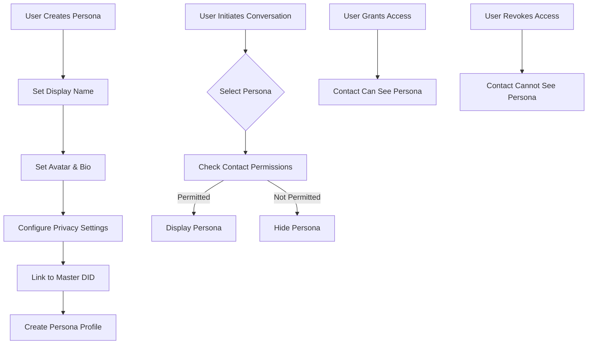
```mermaid
graph TD
    A[User Creates Persona] --> B[Set Display Name]
    B --> C[Set Avatar & Bio]
    C --> D[Configure Privacy Settings]
    D --> E[Link to Master DID]
    E --> F[Create Persona Profile]
    G[User Initiates Conversation] --> H{Select Persona}
    H --> I[Check Contact Permissions]
    I -->|Permitted| J[Display Persona]
    I -->|Not Permitted| K[Hide Persona]
    L[User Grants Access] --> M[Contact Can See Persona]
    N[User Revokes Access] --> O[Contact Cannot See Persona]

```

## Key Components

### Persona Creation

Users create additional personas through their main profile settings, with each persona having its own display name, avatar, bio, and verification status while sharing the underlying DID and trust score from the master identity.

**Key Features:**

* Persona creation (up to 5 per user)
* Custom display names
* Custom avatars
* Custom bios
* Persona categories (Professional, Personal, Family, Gaming, Custom)
* Persona description
* Persona creation confirmation
* Persona management interface

### Persona Privacy Settings

Each persona can have distinct privacy settings, notification preferences, and feature access levels, allowing users to maintain professional boundaries while engaging in casual conversations through different identity presentations.

**Key Features:**

* Per-persona privacy settings
* Per-persona notification preferences
* Per-persona feature access
* Last seen visibility control
* Online status visibility control
* Profile picture visibility control
* Status message visibility control
* Per-persona blocking

### Selective Visibility

The selective visibility system operates through cryptographic access controls where users explicitly grant specific contacts permission to see particular personas. When initiating conversations or joining groups, users choose which persona to present.

**Key Features:**

* Explicit permission granting
* Per-contact visibility control
* Per-group visibility control
* Permission revocation
* Permission modification
* Permission history
* Permission auditing
* Permission enforcement

### Persona Conversation Isolation

The system maintains separate conversation threads for each persona, ensuring that messages sent as one persona remain completely isolated from conversations conducted as another persona, even when communicating with overlapping contact lists.

**Key Features:**

* Separate conversation threads
* Persona-specific message history
* Persona-specific notifications
* Persona-specific read receipts
* Persona-specific typing indicators
* Persona-specific call history
* Persona-specific file sharing
* Persona-specific reactions

### Persona Trust Scoring

The feature integrates with the existing trust scoring system where the master identity's trust score applies to all personas, but individual personas can earn additional verification badges specific to their context.

**Key Features:**

* Master identity trust score
* Per-persona verification badges
* Per-persona credential display
* Per-persona achievement tracking
* Per-persona reputation
* Trust score inheritance
* Badge independence
* Credential portability

### Persona-Specific Verification

Individual personas can earn additional verification badges specific to their context, such as professional credentials for work personas or gaming achievements for entertainment personas.

**Key Features:**

* Professional credential verification
* Gaming achievement badges
* Community-specific credentials
* Persona-specific verification
* Credential display per persona
* Verification status per persona
* Credential portability
* Credential management

### Contact Management

Contact management becomes persona-aware, allowing users to categorize their contacts based on which personas they know about, with automatic suggestions for appropriate persona selection based on conversation context and contact relationships.

**Key Features:**

* Persona-aware contact lists
* Per-contact persona visibility
* Contact categorization by persona
* Automatic persona suggestions
* Contact relationship tracking
* Contact history per persona
* Contact blocking per persona
* Contact management interface

### Persona Switching

Users can switch between personas when initiating conversations or joining groups. The system automatically selects the appropriate persona based on conversation context and contact relationships.

**Key Features:**

* Manual persona selection
* Automatic persona suggestion
* Persona switching in conversations
* Persona switching in groups
* Persona switching confirmation
* Persona switching history
* Persona switching notifications
* Persona switching prevention

### Blockchain Anchoring

The blockchain anchoring system maintains provable integrity for all personas while using zero-knowledge proofs to ensure that contacts cannot discover the existence of personas they haven't been granted access to.

**Key Features:**

* Per-persona message anchoring
* Per-persona transaction recording
* Zero-knowledge proofs
* Persona existence privacy
* Persona discovery prevention
* Persona audit trails
* Persona verification
* Persona immutability

### Persona Deletion

Users can delete personas they no longer need. Deletion removes the persona profile but maintains conversation history for archival purposes.

**Key Features:**

* Persona deletion
* Conversation archival
* Data retention options
* Deletion confirmation
* Deletion reversal (within grace period)
* Deletion notification to contacts
* Deletion audit trail
* Deletion compliance

## Security Principles

* Each persona shares the underlying DID but maintains separate profiles
* Selective visibility is enforced through cryptographic access controls
* Contacts cannot discover personas they haven't been granted access to
* Conversation threads are completely isolated per persona
* Trust scores are shared across personas but badges are persona-specific
* Blockchain anchoring maintains provable integrity per persona
* Zero-knowledge proofs preserve persona privacy
* All communication is encrypted end-to-end per persona

## Broadcast Channels and Community Features

# Broadcast Channels and Community Features

## Overview

This feature enables users to create one-to-many communication channels for broadcasting information to large audiences while maintaining the platform's decentralized architecture and privacy protections. Channels support various content types and engagement models, from simple announcement channels to interactive community spaces that foster discussion and collaboration around shared interests.

## Architecture

Channels are created with configurable privacy settings and content policies. Content is distributed through the platform's encrypted relay network to ensure resilience and prevent censorship. Channel metadata including subscriber counts and activity levels are anchored to the blockchain.

### Channel Creation & Distribution Flow

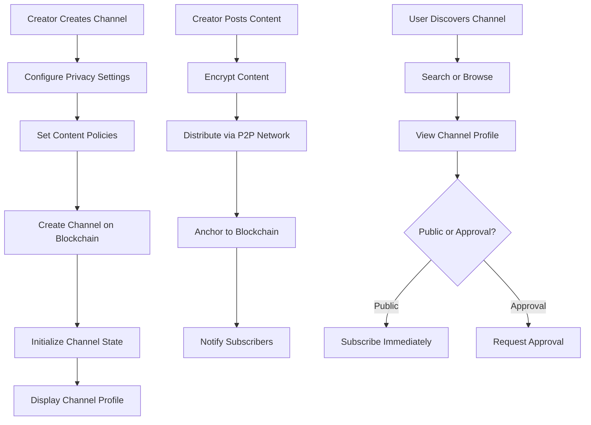
```mermaid
graph TD
    A[Creator Creates Channel] --> B[Configure Privacy Settings]
    B --> C[Set Content Policies]
    C --> D[Create Channel on Blockchain]
    D --> E[Initialize Channel State]
    E --> F[Display Channel Profile]
    G[Creator Posts Content] --> H[Encrypt Content]
    H --> I[Distribute via P2P Network]
    I --> J[Anchor to Blockchain]
    J --> K[Notify Subscribers]
    L[User Discovers Channel] --> M[Search or Browse]
    M --> N[View Channel Profile]
    N --> O{Public or Approval?}
    O -->|Public| P[Subscribe Immediately]
    O -->|Approval| Q[Request Approval]
```

## Key Components

### Channel Creation

Channel creators can establish broadcast channels that support unlimited subscribers, with content distributed through the Go backend WebSocket relay and NATS pub/sub fan-out infrastructure. Phase 4 introduces federated relay options where independent operators registered on the Data L1 can serve as channel delivery nodes.

**Key Features:**

* Channel creation (VIP tier required for unlimited subscribers; free tier limited to 1K subscribers)
* Channel naming, description, avatar/icon
* Category and topic tagging
* Data L1 anchoring of channel metadata at creation
* Channel management interface
* Channel deletion with subscriber notification

### Privacy Configuration

Channels can be configured as public (discoverable through search), private (invitation-only), or semi-private (discoverable but requiring approval to join).

**Key Features:**

* Public channel configuration
* Private channel configuration
* Semi-private channel configuration
* Privacy setting modification
* Subscriber approval process
* Invite link generation
* Privacy enforcement
* Privacy auditing

### Content Types

Content types include text messages, images, videos, files, polls, and interactive elements, with all content encrypted and distributed through the same security infrastructure used for private messaging.

**Key Features:**

* Text message posting
* Image sharing
* Video sharing
* File sharing
* Poll creation
* Interactive element creation
* Content type restrictions
* Content moderation

### Channel Moderation

Channel administrators can configure moderation settings, subscriber permissions, and content policies while maintaining transparency through blockchain-anchored governance records.

**Key Features:**

* Message filtering
* Spam detection
* User muting/banning
* Content policy enforcement
* Moderation logs
* Moderation appeals
* Moderation transparency
* Moderation automation

### Scheduled Posting

Channels support scheduled posting, allowing creators to plan content distribution in advance. Scheduled posts are encrypted and stored locally until the scheduled time.

**Key Features:**

* Post scheduling
* Preset time options
* Custom time selection
* Timezone handling
* Recurring post scheduling
* Post editing before delivery
* Post cancellation
* Delivery confirmation

### Content Categorization

Content can be organized into categories and topics, helping subscribers find relevant content and allowing creators to organize their channels effectively.

**Key Features:**

* Content categorization
* Topic tagging
* Content organization
* Category-based browsing
* Topic-based search
* Content filtering
* Category management
* Category auditing

### Subscriber Segmentation

Creators can segment subscribers for targeted messaging, allowing different content to be delivered to different subscriber groups based on interests or engagement levels.

**Key Features:**

* Subscriber segmentation
* Segment-based messaging
* Interest-based segmentation
* Engagement-based segmentation
* Segment management
* Segment analytics
* Segment targeting
* Segment privacy

### Channel Analytics

Channel analytics provide creators with insights into subscriber engagement, content performance, and growth metrics while maintaining subscriber privacy through anonymized reporting.

**Key Features:**

* Subscriber count tracking
* Engagement metrics
* Content performance analytics
* Growth analytics
* Subscriber demographics (anonymized)
* Content consumption patterns
* Subscriber retention metrics
* Analytics export

### Channel Discovery

The system includes discovery mechanisms that help users find relevant channels based on their interests, trust network connections, and engagement history while preventing spam and low-quality content through community-driven curation.

**Key Features:**

* Channel search
* Category-based discovery
* Tag-based discovery
* Recommendation engine
* Trending channels
* Curated channel lists
* Channel preview
* Subscribe functionality

### Monetization Options

Creators can monetize channels through ECHO token subscriptions paid using the Tessellation v3 `AllowSpend` + `SpendTransaction` primitives. Subscribers issue time-limited spend approvals that auto-renew monthly — no unlimited token approvals are ever granted. The platform takes a 15–30% revenue share that flows to the community treasury.

```go
// Subscriber issues a time-limited AllowSpend for channel subscription
type ChannelSubscriptionAllowSpend struct {
    SubscriberDID  string
    ChannelID      string
    CreatorDID     string
    AmountPerMonth uint64    // ECHO in smallest units
    ExpiresAt      time.Time // Hard expiry — subscriber must re-authorize monthly
    Purpose        string    // "channel_subscription"
}

// Platform splits payment: creator share + treasury fee
type SubscriptionDistribution struct {
    CreatorShare    uint64  // 70-85% depending on channel tier
    TreasuryFee     uint64  // 15-30% platform fee to community treasury
    TransactionHash string
}
```

**Monetization options:**

* Monthly ECHO token subscriptions (AllowSpend — time-limited, auto-expiring)
* Premium content tiers (different access levels via subscription amount)
* Transparent sponsored content with on-chain disclosure
* Direct ECHO donations from subscribers (single SpendTransaction)
* All revenue splits: creator receives 70–85%, community treasury receives 15–30%

**Key Features:**

* Subscription configuration (price, renewal period)
* AllowSpend-based payment (no unlimited approvals)
* Revenue split automation via metagraph
* Real-time earnings dashboard for creators
* Subscriber management (view, refund, cancel)
* Treasury fee automatically distributed to community

### Channel Content Archive

Channel content is archived and searchable, with subscribers able to access historical content and receive notifications for new posts based on their preferences and the channel's trust score.

**Key Features:**

* Content archival
* Archive search
* Historical content access
* Content organization
* Archive retention policies
* Archive deletion
* Archive export
* Archive compliance

### Channel Governance

Channels can implement governance structures where subscribers vote on channel policies, content direction, and moderation decisions. Voting uses the platform's poll infrastructure with blockchain anchoring.

**Key Features:**

* Governance voting
* Policy voting
* Content voting
* Moderation voting
* Voting weight configuration
* Quorum requirements
* Voting transparency
* Voting history

### Channel Roles

Channels support multiple roles including owner, administrator, moderator, and subscriber, with each role having specific permissions and responsibilities.

**Key Features:**

* Role assignment
* Role-based permissions
* Role hierarchy
* Role modification
* Role removal
* Role auditing
* Role transparency
* Role appeals

## Security Principles

* All channel content is encrypted end-to-end and delivered via the Go backend WebSocket relay and NATS pub/sub fan-out
* Channel metadata is anchored to the Data L1 (channel ID, admin DID, subscriber count hash)
* Moderation decisions are logged locally and optionally anchored for Organization tier channels
* Subscriber privacy is preserved through anonymized analytics (no DID linkage in aggregate stats)
* Content delivery uses the same relay infrastructure as messaging — stateless, content-blind transport
* Monetization uses time-limited AllowSpend approvals — the platform never holds unlimited spending authority over subscriber wallets
* Revenue platform fee (15–30%) flows automatically to the community treasury
* All communication is encrypted end-to-end
* Phase 4: federated relay operators registered on Data L1 provide additional delivery resilience

## Enterprise Organization Profiles with Verified Status

# Enterprise Organization Profiles with Verified Status

## Overview

This feature enables organizations including banks, corporations, government agencies, and non-profits to establish verified enterprise profiles that display authenticated organizational credentials and provide enhanced communication capabilities for official business interactions. Enterprise profiles receive distinctive verification checkmarks that differentiate legitimate organizations from impersonators. Organization plan subscribers ($10–50/seat/month) receive Constellation Digital Evidence integration providing Smart Checkmark badges on messages, court-admissible audit fingerprinting, and a public compliance dashboard — enabling legally defensible records of customer communications. All Organization plan revenue flows to the community treasury.

## Architecture

Organizations undergo multi-stage authentication where legal entities must provide proof of incorporation, regulatory standing with relevant authorities, and multi-signature authorization from C-level executives or board members. Verification status is recorded on the blockchain and referenced in the metagraph for access control.

### Enterprise Verification Flow

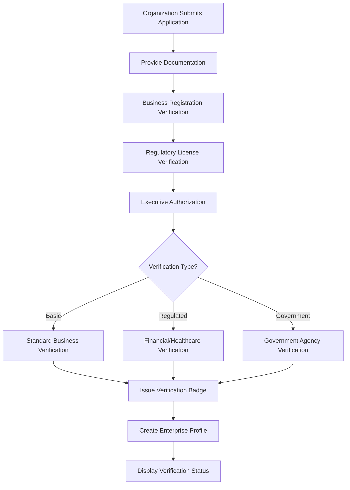
```mermaid
graph TD
    A[Organization Submits Application] --> B[Provide Documentation]
    B --> C[Business Registration Verification]
    C --> D[Regulatory License Verification]
    D --> E[Executive Authorization]
    E --> F{Verification Type?}
    F -->|Basic| G[Standard Business Verification]
    F -->|Regulated| H[Financial/Healthcare Verification]
    F -->|Government| I[Government Agency Verification]
    G --> J[Issue Verification Badge]
    H --> J
    I --> J
    J --> K[Create Enterprise Profile]
    K --> L[Display Verification Status]
```

## Key Components

### Enterprise Onboarding

Organizations begin the verification process by submitting comprehensive documentation including business registration certificates, regulatory licenses, executive authorization letters, and compliance certifications through a dedicated enterprise onboarding portal.

**Key Features:**

* Onboarding portal access
* Documentation submission
* Document verification
* Multi-stage review process
* Status tracking
* Communication with verification team
* Document storage
* Onboarding completion

### Business Registration Verification

The verification process involves multi-stage authentication where legal entities must provide proof of incorporation, regulatory standing with relevant authorities, and multi-signature authorization from C-level executives or board members.

**Key Features:**

* Business registration certificate verification
* Incorporation proof
* Legal entity verification
* Business address verification
* Business type classification
* Regulatory standing verification
* Verification database integration
* Verification updates

### Regulatory Compliance Verification

Financial institutions undergo additional scrutiny including FDIC registration verification, banking license validation, and compliance with anti-money laundering regulations.

**Key Features:**

* FDIC registration verification
* Banking license validation
* AML compliance verification
* Regulatory database integration
* Compliance certification
* Compliance monitoring
* Compliance updates
* Compliance auditing

### Executive Authorization

Multi-signature authorization from C-level executives or board members is required to verify organizational legitimacy and prevent impersonation.

**Key Features:**

* Executive identification
* Multi-signature requirement
* Digital signature verification
* Authorization documentation
* Authorization tracking
* Authorization updates
* Authorization revocation
* Authorization auditing

### Verification Tiers

The system supports different verification tiers including Basic Enterprise (standard business registration), Regulated Entity (financial services, healthcare, legal), and Government Agency (federal, state, local authorities) with corresponding visual indicators and privilege levels.

**Key Features:**

* Basic Enterprise tier
* Regulated Entity tier
* Government Agency tier
* Tier-specific privileges
* Tier-specific indicators
* Tier upgrade process
* Tier downgrade process
* Tier auditing

### Verification Badges

Enterprise profiles display prominent verification badges that indicate the organization's verified status, regulatory compliance level, and industry classification.

**Key Features:**

* Verification badge display
* Compliance level indicators
* Industry classification display
* Badge color coding
* Badge explanation
* Badge history
* Badge updates
* Badge verification

### Organizational Hierarchy

The interface shows organizational hierarchy with verified employee accounts linked to the main enterprise profile, enabling customers to distinguish between official representatives and potential impersonators.

**Key Features:**

* Employee account linking
* Organizational structure display
* Role-based employee classification
* Employee verification status
* Employee credential display
* Employee management interface
* Employee removal
* Employee auditing

### Branded Communication Channels

Organizations can configure branded communication channels with custom themes, official logos, and standardized message templates that maintain consistent corporate identity across all customer interactions.

**Key Features:**

* Custom channel branding
* Logo upload and display
* Color scheme customization
* Message template creation
* Template management
* Brand consistency enforcement
* Brand guidelines
* Brand auditing

### Role-Based Access Controls

The system supports role-based access controls where different employee verification levels unlock specific communication privileges, from basic customer service to executive-level secure channels.

**Key Features:**

* Role definition
* Role-based permissions
* Verification level requirements
* Permission enforcement
* Role assignment
* Role modification
* Role removal
* Role auditing

### Regulatory Database Integration

The feature integrates with existing regulatory databases and compliance systems to maintain real-time verification status, automatically flagging organizations that lose regulatory standing or face compliance violations.

**Key Features:**

* Regulatory database integration
* Real-time status monitoring
* Compliance violation detection
* Automatic flagging
* Status updates
* Violation notifications
* Remediation tracking
* Compliance reporting

### Cryptographic Signatures

Enterprise profiles can establish verified communication policies that require cryptographic signatures for official announcements, financial disclosures, or legal notifications, creating immutable audit trails for regulatory compliance.

**Key Features:**

* Cryptographic signature requirement
* Digital signature verification
* Signature timestamp recording
* Signature audit trails
* Signature validation
* Signature revocation
* Signature compliance
* Signature auditing

### Corporate Identity Management Integration

The system supports integration with corporate identity management systems including Active Directory, SAML authentication, and enterprise single sign-on solutions to streamline employee verification and access management.

**Key Features:**

* Active Directory integration
* SAML authentication support
* Enterprise SSO integration
* Employee provisioning
* Employee deprovisioning
* Access synchronization
* Identity synchronization
* Integration auditing

### Customer Communication Channels

Organizations benefit from enhanced trust signals that reduce customer skepticism about official communications, while customers gain confidence in distinguishing legitimate business communications from phishing attempts and fraud.

**Key Features:**

* Verified communication channels
* Customer trust indicators
* Phishing prevention
* Fraud prevention
* Communication verification
* Channel security
* Channel encryption
* Channel auditing

### Digital Evidence Integration (Organization Tier)

Organization tier subscribers receive automatic integration with Constellation's Digital Evidence managed API. Every message and media file sent from a verified Organization profile is SHA-256 fingerprinted and anchored via the Digital Evidence API, producing a Smart Checkmark badge visible to message recipients and a public verification URL for independent third-party verification.

**How it works:**

1. Before E2E encryption, the Go backend's Media Service computes `SHA-256(plaintext_content)` and submits it to the Digital Evidence API
2. The API returns an `EventID` and `VerificationURL` anchored on Constellation infrastructure
3. The `EventID` is embedded in the encrypted message envelope
4. Recipients see a Smart Checkmark (✓) badge on all Organization-sent messages
5. Tapping the badge opens the public verification URL in Safari, showing:

   * Content hash, timestamp, and event ID
   * Court-admissible evidence packaging
   * Public verification explorer accessible by regulators, auditors, or legal counsel

**Compliance Dashboard:**

Organization admins access a compliance dashboard showing:

* All fingerprinted messages with verification status and public URLs
* Audit trail export (CSV, JSON, PDF) for regulatory examinations
* Data retention proof (fingerprints at retention boundary)
* Legal hold management (freeze specific conversations for discovery)
* Smart Checkmark delivery rates and verification analytics

**Organization Plan Pricing:**

| Plan | Price | Seats | Features |
| --- | --- | --- | --- |
| Organization Starter | $10/seat/month | 5–25 seats | Digital Evidence, branded channels, admin controls, SSO |
| Organization Pro | $25/seat/month | 25–250 seats | All Starter + SLAs, API access, compliance dashboard, audit exports |
| Organization Enterprise | $50/seat/month | 250+ seats | All Pro + dedicated support, custom integrations, legal hold, FDIC compliance tools |

All revenue flows 100% to the community treasury — not to a corporation.

**Key Features:**

* Automatic SHA-256 fingerprinting for all Org-tier messages
* Smart Checkmark badge on all outbound Organization messages
* Public VerificationURL for each fingerprinted message
* Compliance dashboard with audit trail exports (CSV, JSON, PDF)
* Legal hold management (disable disappearing messages for held conversations)
* Data retention proof generation
* Regulatory examination support (public URLs accessible to third-party auditors)
* AI Compliance Agent integration (Phase 5+) for automated monitoring and reporting

### Compliance Recording

Enterprise profiles can leverage the platform's blockchain anchoring capabilities to create legally admissible records of customer communications, policy notifications, and compliance disclosures that satisfy regulatory examination requirements.

**Key Features:**

* Communication recording
* Blockchain anchoring
* Compliance documentation
* Audit trail creation
* Legal admissibility
* Regulatory compliance
* Retention policies
* Compliance auditing

## Security Principles

* Enterprise verification is multi-stage and requires comprehensive documentation
* Regulatory compliance is continuously monitored and flagged by AI Compliance Agent (Phase 5+)
* Employee accounts are linked to verified enterprise profiles with role-based permissions
* All messages from Organization profiles are automatically fingerprinted via Digital Evidence API
* Smart Checkmark badges on messages provide recipients cryptographic proof of organizational authenticity
* Blockchain anchoring creates immutable audit trails accessible to regulators via public verification URLs
* Legal hold disables disappearing messages and retains all content for held conversations
* Corporate identity management integration (Active Directory, SAML, SSO) streamlines employee verification
* All communication is encrypted end-to-end — Digital Evidence fingerprints content hashes, never plaintext
* Organization plan revenue flows 100% to the community treasury

## Verified Financial Institution Integration

# Verified Financial Institution Integration

## Overview

This feature transforms the messaging platform into a secure communication channel for financial institutions to conduct fraud prevention, customer service, and compliance activities with cryptographic proof and enhanced security compared to traditional SMS and email channels. Banks and credit unions can establish verified channels that leverage the platform's trust infrastructure to reduce phishing attacks and improve customer authentication while maintaining regulatory compliance.

## Architecture

Financial institutions establish institutional DIDs through the same Cardano-based identity system used by individual users, but with enhanced verification requirements including regulatory compliance documentation and multi-signature authorization from institution executives. Customer interactions flow through a structured verification process where banks send transaction alerts or service requests through the platform's API integration.

### Financial Institution Integration Flow

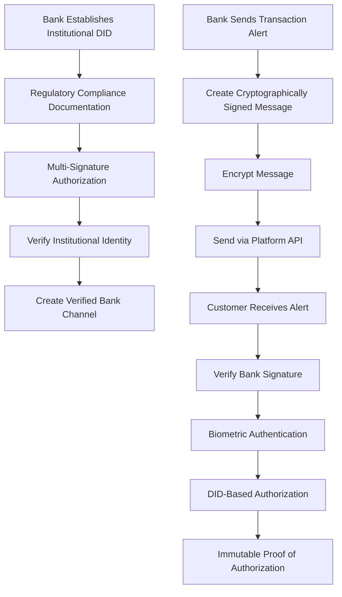
```mermaid
graph TD
    A[Bank Establishes Institutional DID] --> B[Regulatory Compliance Documentation]
    B --> C[Multi-Signature Authorization]
    C --> D[Verify Institutional Identity]
    D --> E[Create Verified Bank Channel]
    F[Bank Sends Transaction Alert] --> G[Create Cryptographically Signed Message]
    G --> H[Encrypt Message]
    H --> I[Send via Platform API]
    I --> J[Customer Receives Alert]
    J --> K[Verify Bank Signature]
    K --> L[Biometric Authentication]
    L --> M[DID-Based Authorization]
    M --> N[Immutable Proof of Authorization]
```

## Key Components

### Institutional DID Management

Financial institutions establish institutional DIDs through the same Cardano-based identity system used by individual users, but with enhanced verification requirements including regulatory compliance documentation and multi-signature authorization from institution executives.

**Key Features:**

* Institutional DID creation
* Regulatory compliance documentation
* Multi-signature authorization
* Executive verification
* DID resolution and verification
* DID document management
* DID metadata storage
* DID recovery procedures

### Regulatory Compliance Verification

Banks must complete regulatory compliance reviews including FDIC communication guidelines and implement multi-factor authentication for their institutional accounts.

**Key Features:**

* FDIC compliance verification
* Communication guideline compliance
* AML compliance verification
* KYC compliance verification
* Regulatory database integration
* Compliance monitoring
* Compliance updates
* Compliance auditing

### Fraud Alert Channels

Banks can create dedicated communication channels with their customers who have opted into institutional messaging. The system supports automated fraud alerts that require cryptographic confirmation from customers.

**Key Features:**

* Fraud alert channel creation
* Customer opt-in management
* Automated alert generation
* Cryptographic signing
* Message encryption
* Alert delivery
* Alert confirmation
* Alert history

### Customer Service Channels

Dedicated customer service channels staffed by verified bank representatives with trust scores visible to customers provide secure communication for customer inquiries and support.

**Key Features:**

* Customer service channel creation
* Representative verification
* Trust score display
* Message encryption
* Response time tracking
* Service quality metrics
* Customer satisfaction tracking
* Service history

### Secure Document Exchange

Secure document exchange for sensitive financial communications requires immutable audit trails and maintains regulatory compliance.

**Key Features:**

* Document encryption
* Document signing
* Document verification
* Audit trail creation
* Blockchain anchoring
* Compliance recording
* Document retention
* Document deletion

### Transaction Verification

Customers respond using biometric authentication combined with their DID signatures, creating immutable proof of authorization that prevents later disputes about transaction approvals.

**Key Features:**

* Biometric authentication
* DID-based signing
* Transaction authorization
* Immutable proof creation
* Signature verification
* Authorization timestamp
* Authorization audit trail
* Dispute prevention

### Trust Score Integration

The trust scoring system prioritizes customers with higher verification levels for premium support channels, while maintaining privacy through zero-knowledge proofs that confirm customer identity without exposing personal financial information.

**Key Features:**

* Trust score-based prioritization
* Verification level display
* Premium channel access
* Zero-knowledge proofs
* Privacy preservation
* Customer identification
* Service level configuration
* Service level enforcement

### API Integration

The feature requires integration with existing banking core systems through secure API endpoints that comply with PCI DSS and SOC 2 Type II standards.

**Key Features:**

* Secure API endpoints
* PCI DSS compliance
* SOC 2 Type II compliance
* API authentication
* API rate limiting
* API monitoring
* API logging
* API security

### Message Encryption

All messages are encrypted end-to-end using Kinnami encryption, ensuring that even the platform operators cannot access message content.

**Key Features:**

* End-to-end encryption
* Kinnami encryption implementation
* Key management
* Key rotation
* Encryption verification
* Decryption verification
* Encryption audit trails
* Encryption compliance

### Cryptographic Signatures

Messages are cryptographically signed by the bank to prove authenticity and prevent impersonation. Customers can verify signatures to confirm messages originated from their actual financial institution.

**Key Features:**

* Digital signature generation
* Signature verification
* Signature timestamp
* Signature audit trails
* Signature validation
* Signature revocation
* Signature compliance
* Signature auditing

### Digital Evidence for Regulatory Compliance

Financial institutions using Organization tier plans receive automatic Constellation Digital Evidence integration on all customer communications. This provides SHA-256 fingerprinting of messages and documents with public verification URLs, enabling court-admissible audit trails that satisfy regulatory examination requirements without storing plaintext content.

**Compliance capabilities:**

* Smart Checkmark (✓) badge on all institution-sent messages — customers see cryptographic proof the message is authentic
* Public verification URL per message for independent third-party verification (accessible by regulators, legal counsel, auditors)
* Data retention proof: fingerprints generated at the regulatory retention boundary (e.g., 7 years for banking communications)
* Legal hold management: freeze specific conversation threads for discovery, disabling disappearing messages for held conversations
* Audit trail export (CSV, JSON, PDF) for FDIC examinations, OCC reviews, and legal discovery
* AI Compliance Agent integration (Phase 5+): automated monitoring for regulatory flags, real-time reporting dashboards

**Regulatory use cases:**

| Requirement | ECHO Implementation |
| --- | --- |
| Transaction alert authenticity | Smart Checkmark + Digital Evidence fingerprint proves message origin |
| Customer communication records | 7-year retention with public verification URLs |
| Fraud investigation evidence | Court-admissible fingerprints with timestamp and sender DID |
| Regulatory examination | Audit trail export + public verification accessible to examiners |
| FDIC communication guidelines | Institutional DID + verified channel proves bank identity |

**Key Features:**

* Automatic Digital Evidence fingerprinting for all Org tier messages
* Smart Checkmark visible to customers receiving institution messages
* Compliance dashboard with audit trail exports
* Legal hold management for discovery compliance
* AI Compliance Agent for automated monitoring (Phase 5+)
* Public verification URLs accessible to regulators without ECHO account

### Recurring Payment Authorization (AllowSpend)

For automated payment confirmations and recurring authorization workflows (e.g., subscription auto-renewals, standing order confirmations), the platform uses the Tessellation v3 `AllowSpend` + `SpendTransaction` primitives. Customers grant time-limited, amount-bounded approval to the institution's verified DID. The approval auto-expires and requires periodic re-authorization — the institution can never hold unlimited spending authority over a customer's ECHO wallet.

```go
// Customer grants time-limited AllowSpend to bank's institutional DID
type InstitutionalAllowSpend struct {
    CustomerDID     string
    InstitutionDID  string    // Verified institutional DID (Cardano-anchored)
    MaxPerCharge    uint64    // Maximum per single transaction
    ExpiresAt       time.Time // Hard expiry — customer must re-authorize
    Purpose         string    // "payment_confirmation", "subscription"
}
```

**Key Features:**

* Time-limited AllowSpend approvals (no unlimited standing authorization)
* Per-charge amount caps set by customer
* Auto-expiring approvals with transparent re-authorization prompts
* Biometric confirmation required for each authorization renewal
* Immutable on-chain record of all authorization grants and expirations

### Regulatory Compliance

The system maintains compliance with banking regulations including FDIC communication guidelines, AML requirements, and KYC requirements.

**Key Features:**

* FDIC compliance
* AML compliance
* KYC compliance
* Regulatory reporting
* Compliance monitoring
* Compliance updates
* Compliance auditing
* Compliance documentation

## Security Principles

* Financial institutions establish verified institutional DIDs
* All messages are encrypted end-to-end
* Messages are cryptographically signed by the bank
* Customer authorization requires biometric authentication and DID signatures
* All interactions are recorded on the blockchain for audit purposes
* Regulatory compliance is continuously monitored
* Customer privacy is preserved through zero-knowledge proofs
* All communication complies with banking regulations

## User Rewards Tracker on Profile

# User Rewards Tracker on Profile

## Overview

This feature embeds a compact ECHO rewards summary in the user's profile tab, providing an at-a-glance view of daily earnings progress, trust tier, and achievement milestones. It is a profile-layer summary widget — not a full wallet interface. Staking, delegation, swaps, bridges, and full transaction history are all managed in the dedicated Wallet tab built on the Stargazer SDK. The rewards tracker focuses on the "earning" dimension: how much ECHO the user has earned today, this week, and this month, and how they can earn more.

## Architecture

The rewards tracker reads live data from two sources: the Go backend's Rewards Service (pending rewards, daily cap progress) and the Stargazer SDK's metagraph query client (confirmed token balance, staking tier). Data is cached locally with a 5-second TTL for balance and a 60-second TTL for daily stats. The tracker is read-only — all actions link to the Wallet tab.

### Rewards Summary Flow

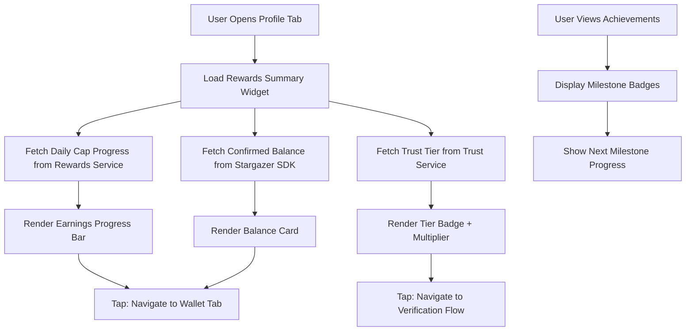
```mermaid
graph TD
    A[User Opens Profile Tab] --> B[Load Rewards Summary Widget]
    B --> C[Fetch Daily Cap Progress from Rewards Service]
    B --> D[Fetch Confirmed Balance from Stargazer SDK]
    B --> E[Fetch Trust Tier from Trust Service]
    C --> F[Render Earnings Progress Bar]
    D --> G[Render Balance Card]
    E --> H[Render Tier Badge + Multiplier]
    F --> I[Tap: Navigate to Wallet Tab]
    G --> I
    H --> J[Tap: Navigate to Verification Flow]
    K[User Views Achievements] --> L[Display Milestone Badges]
    L --> M[Show Next Milestone Progress]
```

## Key Components

### Earnings Summary Card

The profile tab shows a condensed balance card with today's earnings progress and a direct link to the Wallet tab for full management.

```swift
struct ProfileRewardsSummary: View {
    @StateObject private var viewModel = RewardsSummaryViewModel()
    
    var body: some View {
        VStack(alignment: .leading, spacing: 12) {
            // Balance headline
            HStack {
                Text("\(viewModel.totalBalance, format: .number) ECHO")
                    .font(.title2.bold())
                Spacer()
                NavigationLink("Open Wallet →", destination: WalletTab())
                    .font(.caption)
                    .foregroundColor(.accentColor)
            }
            
            // Trust tier badge + multiplier
            TrustTierBadgeRow(
                tier: viewModel.trustTier,
                multiplier: viewModel.rewardMultiplier
            )
            
            // Daily earnings progress bar
            DailyEarningsBar(
                earned: viewModel.todayEarned,
                cap: viewModel.dailyCap,
                breakdown: viewModel.earningsBreakdown
            )
            
            // Quick stats row
            HStack {
                StatChip(label: "This Week", value: viewModel.weekEarned)
                StatChip(label: "This Month", value: viewModel.monthEarned)
                StatChip(label: "Staking APY", value: viewModel.stakingAPY)
            }
        }
        .padding()
        .background(Color(.secondarySystemBackground))
        .cornerRadius(12)
    }
}
```

**Key Features:**

* Total ECHO balance (confirmed on metagraph)
* Today's earnings vs. daily cap (progress bar)
* Weekly and monthly earning totals
* Active staking APY display
* Trust tier badge with current reward multiplier
* "Open Wallet →" link to full Wallet tab
* Pending rewards with "Claim" button (triggers AtomicAction via Wallet tab)

### Trust Tier Earnings Impact

A section showing how the user's current trust tier affects their earning rate and what the next tier unlocks:

```swift
struct TrustTierEarningsPanel: View {
    let currentTier: TrustTier
    let nextTier: TrustTier?
    
    var body: some View {
        VStack(alignment: .leading) {
            Text("Your Earning Tier")
                .font(.headline)
            
            HStack {
                TrustTierBadge(tier: currentTier)
                Text("×\(currentTier.rewardMultiplier) multiplier on all rewards")
                    .font(.subheadline)
            }
            
            if let next = nextTier {
                Divider()
                Text("Upgrade to \(next.displayName) for ×\(next.rewardMultiplier) multiplier")
                    .font(.caption)
                    .foregroundColor(.secondary)
                Button("Verify Identity →") {
                    // Navigate to verification flow
                }
                .font(.caption.bold())
            }
        }
    }
}
```

**Key Features:**

* Current tier badge and multiplier display
* Projected monthly earnings at current rate
* "Upgrade to Tier X for Y× multiplier" call-to-action
* Link to identity verification flow for tier upgrade
* Multiplier breakdown by reward type (messaging, referrals, staking)

### Achievement Milestones

Achievement milestones create progression pathways that encourage long-term platform adoption and reward authentic participation. Milestones are tracked locally and verified against metagraph state.

**Milestone categories:**

| Category | Example Milestones | Reward |
| --- | --- | --- |
| Messaging | First 100 msgs, 1K msgs, 10K msgs | Badge + ECHO bonus |
| Referrals | First referral, 5 referrals, Super Referrer (25) | Badge + bonus multiplier period |
| Trust | Tier 3 verified, Tier 4 identity, Tier 5 trusted | Badge + permanent multiplier unlock |
| Staking | First stake, Bronze/Silver/Gold/Platinum tier | Badge + APY bonus |
| Governance | First vote, 10 votes, Board Candidate eligible | Badge + governance weight boost |

```swift
struct AchievementsSection: View {
    let achievements: [Achievement]
    let nextMilestone: Achievement
    
    var body: some View {
        VStack(alignment: .leading) {
            Text("Achievements")
                .font(.headline)
            
            // Earned badges grid
            LazyVGrid(columns: Array(repeating: .init(.flexible()), count: 4)) {
                ForEach(achievements.filter(\.earned)) { badge in
                    AchievementBadge(achievement: badge)
                }
            }
            
            // Next milestone progress
            NextMilestoneRow(
                milestone: nextMilestone,
                progress: nextMilestone.currentProgress,
                target: nextMilestone.target
            )
        }
    }
}
```

**Key Features:**

* Visual badge collection for earned milestones
* Progress bar toward next milestone in each category
* ECHO bonus distribution on milestone completion (via AtomicAction)
* Milestone history with completion timestamps
* Shareable achievement cards (optional — user-controlled)

### Earnings Breakdown

Users can view a daily, weekly, and monthly breakdown of earnings by source. This is a read-only view; claiming and managing rewards is done in the Wallet tab.

**Key Features:**

* Messaging rewards earned today/week/month (0.1 ECHO × trust multiplier)
* Referral bonuses earned (50 ECHO per verified referral)
* Staking rewards accrued (5–15% APY depending on tier)
* Payment rail bonuses (1–5 ECHO per payment transaction, Tier 3+ only)
* Earnings trend chart (7-day and 30-day sparkline)
* Daily cap remaining indicator
* "Claim All" button linking to Wallet tab AtomicAction claim flow

### Transaction History (Summary)

A condensed transaction history limited to the last 10 reward events. The full history with cryptographic proofs and tax export is in the Wallet tab.

**Key Features:**

* Last 10 reward transactions with type, amount, and timestamp
* On-chain verification link (DAG Explorer) per transaction
* "View Full History →" link to Wallet tab
* Filter by reward type (messaging, referral, staking)

## Security Principles

* All reward data is read from the metagraph (authoritative) or the Go Rewards Service cache (TTL: 5s)
* The rewards tracker is read-only — no token operations are performed in this view
* All token operations (claim, stake, delegate, swap) are handled in the Wallet tab via Stargazer SDK
* Achievement milestone completions are validated by the metagraph before ECHO bonuses are distributed
* Transaction history links directly to DAG Explorer for independent verification
* No PII is stored in the rewards tracker — data is identified by DID only

## Streamlined Onboarding with Verifiable Credentials and Passkeys

# Streamlined Onboarding with Verifiable Credentials and Passkeys

## Overview

This feature streamlines the user enrollment and registration process by enabling new users to onboard instantly using industry-standard Verifiable Credentials, compliant with the OpenID Connect for Verifiable Credentials (OIDC4VC) specification. This method allows users to establish a high-trust identity from the moment they join the platform by presenting pre-existing, cryptographically verified credentials from trusted issuers like governments or financial institutions. The process also incorporates passkey creation, providing secure, passwordless access for subsequent logins.

## Architecture

The onboarding flow uses OIDC4VC-compliant requests to enable users to present existing verifiable credentials. The system verifies credential signatures, checks issuer status against a distributed trust registry, and confirms credentials have not been revoked. Upon successful verification, the user's profile is automatically created and populated with verified information.

### OIDC4VC Onboarding Flow

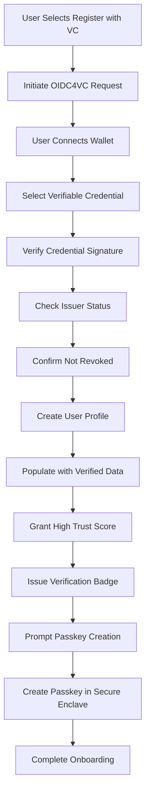
```mermaid
graph TD
    A[User Selects Register with VC] --> B[Initiate OIDC4VC Request]
    B --> C[User Connects Wallet]
    C --> D[Select Verifiable Credential]
    D --> E[Verify Credential Signature]
    E --> F[Check Issuer Status]
    F --> G[Confirm Not Revoked]
    G --> H[Create User Profile]
    H --> I[Populate with Verified Data]
    I --> J[Grant High Trust Score]
    J --> K[Issue Verification Badge]
    K --> L[Prompt Passkey Creation]
    L --> M[Create Passkey in Secure Enclave]
    M --> N[Complete Onboarding]

```

## Key Components

### OIDC4VC Compliance

The onboarding flow begins when a new user selects the "Register with Verifiable Credential" option. The application initiates an OIDC4VC-compliant request, prompting the user to connect their existing digital wallet.

**Key Features:**

* OIDC4VC protocol support
* Wallet connection
* Credential selection interface
* Credential presentation
* Protocol compliance
* Standard adherence
* Interoperability support
* Protocol updates

### Verifiable Credential Verification

The system verifies the credential's cryptographic signature, checks the issuer's status against a distributed trust registry, and confirms the credential has not been revoked.

**Key Features:**

* Cryptographic signature verification
* Issuer status checking
* Revocation checking
* Trust registry integration
* Verification automation
* Verification transparency
* Verification auditing
* Verification compliance

### Trust Registry Management

The platform must maintain and regularly update a decentralized trust registry of approved issuers to prevent fraudulent credentials.

**Key Features:**

* Issuer registry maintenance
* Issuer status tracking
* Issuer verification
* Registry updates
* Registry decentralization
* Registry transparency
* Registry auditing
* Registry compliance

### Automatic Profile Creation

Upon successful verification, the user's profile is automatically created and populated with the verified information from the credential.

**Key Features:**

* Automatic profile creation
* Data population from credential
* Profile initialization
* Profile verification
* Profile encryption
* Profile backup
* Profile recovery
* Profile auditing

### High Trust Score Assignment

Users are immediately granted a high initial trust score and a corresponding verification badge based on the credential's trust level.

**Key Features:**

* Trust score assignment
* Verification badge issuance
* Trust level determination
* Trust score calculation
* Trust score display
* Trust score tracking
* Trust score updates
* Trust score auditing

### Passkey Creation

As the final step, the user is prompted to create a passkey, which links their account to their device's biometric security (e.g., Face ID, fingerprint) for future passwordless authentication.

**Key Features:**

* Passkey creation prompt
* Biometric binding
* Secure enclave storage
* Passkey verification
* Passkey backup
* Passkey recovery
* Passkey rotation
* Passkey auditing

### WebAuthn/FIDO2 Integration

Implementation requires integration with device-native WebAuthn/FIDO2 APIs to enable passkey creation and management, binding the user's identity to their device's hardware security module.

**Key Features:**

* WebAuthn API integration
* FIDO2 support
* Hardware security module binding
* Device-native implementation
* Cross-platform support
* Fallback mechanisms
* Compatibility verification
* Integration testing

### Credential Wallet Integration

Users must possess a digital wallet that supports the OIDC4VC protocol and holds Verifiable Credentials from an issuer recognized by the platform's trust registry.

**Key Features:**

* Wallet compatibility checking
* Wallet connection
* Credential retrieval
* Credential validation
* Wallet security
* Wallet backup
* Wallet recovery
* Wallet auditing

### Sybil Attack Prevention

By adopting the OIDC4VC standard, the platform significantly reduces friction during onboarding while immediately establishing a high-trust environment by ensuring new users are authenticated against reliable, pre-vetted sources. This mitigates the risk of Sybil attacks and fraudulent account creation from the outset.

**Key Features:**

* Credential-based verification
* Issuer verification
* Revocation checking
* Duplicate account prevention
* Account linking prevention
* Fraud detection
* Abuse prevention
* Compliance verification

### Onboarding Analytics

The system tracks onboarding metrics including completion rates, credential types used, and trust score distribution to optimize the onboarding experience.

**Key Features:**

* Completion rate tracking
* Credential type analytics
* Trust score distribution
* Onboarding time tracking
* Dropout analysis
* Optimization recommendations
* Analytics export
* Analytics auditing

### Onboarding Support

Users who encounter issues during onboarding can access support resources including documentation, FAQs, and customer support channels.

**Key Features:**

* Support documentation
* FAQ resources
* Customer support access
* Troubleshooting guides
* Error message clarity
* Support ticket creation
* Support tracking
* Support analytics

## Security Principles

* Verifiable credentials are cryptographically signed and verified
* Issuer status is checked against a distributed trust registry
* Credentials are confirmed not revoked before acceptance
* Passkeys are stored exclusively in the device's secure enclave
* User profiles are automatically created with verified data
* High trust scores are assigned based on credential verification
* All onboarding data is encrypted and protected
* Sybil attacks are prevented through credential verification

## In-App High-Assurance Identity Verification and Reward

# In-App High-Assurance Identity Verification and Reward

## Overview

This feature provides an optional, in-app workflow for users to generate a high-assurance Verifiable Credential by verifying their government-issued photo ID. This process enables the highest level of trust on the platform, unlocks advanced financial features, and rewards users with ECHO tokens for their participation.

## Architecture

Users can initiate verification from their profile as a way to maximize their trust score and unlock payment capabilities. The system integrates with certified identity proofing services that comply with NIST 800-63-3 IAL2 standards. Raw identity data is processed exclusively by third-party identity verification partners and is not stored by the application.

### Identity Verification Flow

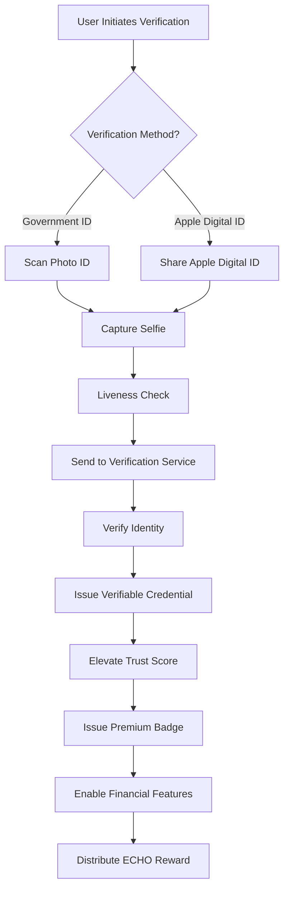
```mermaid
graph TD
    A[User Initiates Verification] --> B{Verification Method?}
    B -->|Government ID| C[Scan Photo ID]
    B -->|Apple Digital ID| D[Share Apple Digital ID]
    C --> E[Capture Selfie]
    D --> E
    E --> F[Liveness Check]
    F --> G[Send to Verification Service]
    G --> H[Verify Identity]
    H --> I[Issue Verifiable Credential]
    I --> J[Elevate Trust Score]
    J --> K[Issue Premium Badge]
    K --> L[Enable Financial Features]
    L --> M[Distribute ECHO Reward]

```

## Key Components

### Government ID Verification

Users can initiate this verification flow from their profile as a way to maximize their trust score and unlock payment capabilities. The user is prompted to either scan a government-issued photo ID, such as a driver's license.

**Key Features:**

* Government ID scanning
* Document type support (driver's license, passport, national ID)
* Image quality verification
* Document validation
* OCR processing
* Document encryption
* Document deletion after verification
* Verification status display

### Selfie-Based Liveness Check

Users complete a selfie-based liveness check to verify they are the person in the government-issued ID. The liveness check prevents fraud and ensures the person presenting the ID is the actual owner.

**Key Features:**

* Selfie capture
* Liveness detection
* Face matching
* Anti-spoofing measures
* Image quality verification
* Image encryption
* Image deletion after verification
* Verification status display

### Apple Digital ID Integration

On compatible iOS devices, users can share their verified Apple Digital ID instead of scanning a government ID. Apple Digital ID provides government-issued identity verification without exposing personal information to the application.

**Key Features:**

* Apple Digital ID support (iOS 17+)
* Automatic credential creation
* Privacy-preserving verification
* No personal data storage
* Verification status display
* Credential expiration handling
* Credential renewal support
* Credential revocation handling

### Third-Party Identity Verification Service

The entire process must adhere to strict data privacy regulations for handling PII. The raw identity data is processed exclusively by a third-party identity verification partner and is not stored by the application.

**Key Features:**

* NIST 800-63-3 IAL2 compliance
* Third-party service integration
* Data privacy compliance
* PII handling compliance
* GDPR compliance
* CCPA compliance
* Data deletion after verification
* Compliance auditing

### Verifiable Credential Issuance

Upon successful verification by a certified identity proofing service, a new high-assurance Verifiable Credential is issued directly to the user's wallet.

**Key Features:**

* Credential generation
* Credential signing
* Credential issuance
* Wallet integration
* Credential storage
* Credential verification
* Credential expiration
* Credential renewal

### Trust Score Elevation

This automatically elevates their trust score to the highest tier, grants them a premium "Identity Verified" badge, and enables access to regulated financial services within the app.

**Key Features:**

* Trust score elevation
* Highest tier assignment
* Premium badge issuance
* Financial feature access
* Feature unlock
* Access control enforcement
* Trust score display
* Trust score tracking

### Premium Badge Issuance

Users who successfully complete this verification process receive a premium "Identity Verified" badge that is displayed on their profile and in all interactions.

**Key Features:**

* Badge design
* Badge display
* Badge verification
* Badge revocation
* Badge history
* Badge auditing
* Badge compliance
* Badge transparency

### Financial Feature Access

Successful verification enables access to regulated financial services within the app, including payment processing, financial institution integration, and advanced financial features.

**Key Features:**

* Payment processing access
* Financial institution integration
* Advanced feature access
* Feature configuration
* Feature usage tracking
* Feature auditing
* Feature compliance
* Feature support

### ECHO Token Reward Distribution

As a direct incentive for strengthening the network's trust layer, users who successfully complete this verification process are automatically rewarded with a significant amount of ECHO coin, such as 100 ECHO, credited to their account.

**Key Features:**

* Automatic reward distribution
* 100 ECHO reward amount
* Reward timing
* Reward verification
* Reward tracking
* Reward history
* Reward auditing
* Reward compliance

### Verification Status Display

Users can view their verification status in their profile, including the verification method used, verification date, and credential expiration date.

**Key Features:**

* Verification status display
* Verification method display
* Verification date display
* Credential expiration display
* Verification history
* Credential management
* Credential renewal
* Credential revocation

### Verification Retry

If verification fails, users can retry the process. The system provides clear error messages and guidance for successful verification.

**Key Features:**

* Retry functionality
* Error message clarity
* Guidance provision
* Attempt tracking
* Attempt limits
* Cooldown periods
* Support access
* Troubleshooting guides

## Security Principles

* Government ID data is processed exclusively by third-party verification services
* No personal identity data is stored by the application
* Selfie-based liveness checks prevent fraud
* Apple Digital ID provides privacy-preserving verification
* Verifiable credentials are cryptographically signed
* Trust scores are elevated based on verified credentials
* ECHO rewards are automatically distributed
* All verification data is encrypted and protected

## Decentralized Bot Framework and Automation

# Decentralized Bot Framework and Automation

## Overview

This feature enables developers to create and deploy autonomous bots that can interact with users and provide services within the messaging platform while operating on decentralized infrastructure and maintaining the platform's security and privacy standards. The bot framework supports a wide range of applications from simple utility bots to complex AI assistants and business automation tools.

## Architecture

Bots operate as smart contracts deployed on the Constellation network, ensuring they cannot access user data beyond what is explicitly authorized and cannot be shut down by centralized authorities. The framework provides access to messaging APIs, payment processing, file sharing, and blockchain integration capabilities while enforcing strict security and privacy requirements.

### Bot Deployment & Interaction Flow

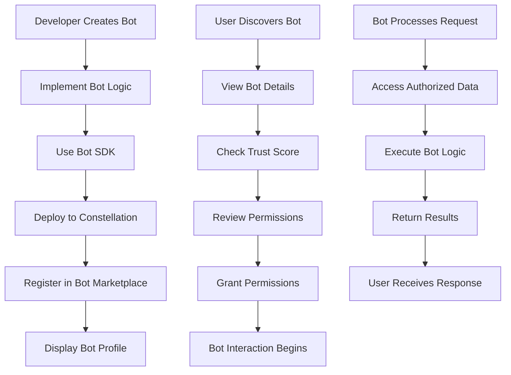
```mermaid
graph TD
    A[Developer Creates Bot] --> B[Implement Bot Logic]
    B --> C[Use Bot SDK]
    C --> D[Deploy to Constellation]
    D --> E[Register in Bot Marketplace]
    E --> F[Display Bot Profile]
    G[User Discovers Bot] --> H[View Bot Details]
    H --> I[Check Trust Score]
    I --> J[Review Permissions]
    J --> K[Grant Permissions]
    K --> L[Bot Interaction Begins]
    M[Bot Processes Request] --> N[Access Authorized Data]
    N --> O[Execute Bot Logic]
    O --> P[Return Results]
    P --> Q[User Receives Response]
```

## Key Components

### Bot SDK

Developers create bots using the ECHO Bot SDK, which provides clients for the messaging API, payment processing via AllowSpend, file sharing, and trust tier queries. Bots run as external services — they are not deployed on any blockchain.

```python
# Example: ECHO Bot SDK (Python)
from echo_bot_sdk import ECHOBot, AllowSpendClient

bot = ECHOBot(api_key="bot_api_key_here")

@bot.on_message
async def handle_message(event):
    user_did = event.sender_did
    text = event.plaintext  # Only visible after user grants message content access
    await bot.send_message(user_did, f"You said: {text}")

@bot.on_payment_request
async def handle_payment(event):
    # Execute against existing AllowSpend approval
    result = await bot.spend_tokens(
        user_did=event.user_did,
        amount=event.amount,
        purpose="bot_service_fee"
    )
    # Platform takes 15-30% fee automatically; developer receives remainder
```

**Key Features:**

* REST webhook integration for message events
* WebSocket for real-time bot interactions
* Messaging API: send text, media, reactions on behalf of bot DID
* Payment API: execute SpendTransaction against user AllowSpend approval
* Trust tier query API: check user tier before providing services
* File sharing API with E2E encrypted uploads
* Typed SDK clients (Python, Node.js, Go)

### Bot Payment Model (AllowSpend)

Bot payments use Tessellation v3 `AllowSpend` + `SpendTransaction` primitives. Users grant a time-limited, amount-bounded approval when installing a bot. The bot executes charges against that approval. Approvals auto-expire and require explicit user re-authorization — bots can never hold unlimited spending authority.

```go
// User grants AllowSpend when installing a bot
type BotInstallAllowSpend struct {
    UserDID      string
    BotDID       string
    MaxPerCharge uint64    // Maximum ECHO per single charge
    MaxPerMonth  uint64    // Monthly spending cap
    ExpiresAt    time.Time // Auto-expires; user must re-authorize
    Purpose      string    // "bot_payment"
}

// Revenue distribution on each bot charge
type BotRevenueDistribution struct {
    TotalCharged    uint64  // Amount charged to user
    DeveloperShare  uint64  // 70-85% to bot developer
    TreasuryFee     uint64  // 15-30% to community treasury
}
```

**Key Features:**

* AllowSpend-based payment authorization (no unlimited approvals)
* Per-charge and monthly spending caps set by user
* Auto-expiring approvals (require periodic re-authorization)
* Automatic 15–30% platform fee to community treasury
* Real-time earnings dashboard for bot developers
* Transparent fee disclosure before install

### Bot Trust Scoring

Bot interactions are governed by the same trust and verification systems used for human users, with bots earning trust scores based on user feedback, functionality reliability, and security audit results.

**Key Features:**

* Trust score calculation
* User feedback integration
* Reliability metrics
* Security audit results
* Trust score display
* Trust score updates
* Trust score history
* Trust score appeals

### Bot Marketplace

Users can discover bots through a decentralized marketplace where bot capabilities, trust scores, and user reviews are displayed transparently.

**Key Features:**

* Bot listing
* Bot search
* Bot categorization
* Bot filtering
* Bot reviews
* Bot ratings
* Bot installation
* Bot management

### Permission Management

Bot permissions are granular and user-controlled, allowing individuals to specify exactly what data and capabilities each bot can access, with all permissions revocable at any time.

**Key Features:**

* Permission definition
* Permission granting
* Permission revocation
* Permission modification
* Permission auditing
* Permission enforcement
* Permission transparency
* Permission history

### Rule-Based Bots

The framework supports simple rule-based bots that can perform automated tasks based on predefined conditions and actions.

**Key Features:**

* Rule definition
* Condition evaluation
* Action execution
* Rule chaining
* Rule scheduling
* Rule modification
* Rule testing
* Rule auditing

### AI-Powered Assistants

The framework supports advanced AI-powered assistants that can process natural language requests while maintaining user privacy through local processing and zero-knowledge techniques.

**Key Features:**

* Natural language processing
* Local processing
* Privacy preservation
* Zero-knowledge techniques
* Model updates
* Model versioning
* Model auditing
* Model compliance

### Customer Service Bots

Specialized bot types for common use cases including customer service bots for enterprise users that can handle customer inquiries and provide support.

**Key Features:**

* Customer inquiry handling
* Support ticket creation
* Response generation
* Escalation to human agents
* Knowledge base integration
* Learning from interactions
* Performance metrics
* Customer satisfaction tracking

### Trading Bots

Trading bots can execute cryptocurrency transactions with user authorization, enabling automated trading strategies while maintaining security and user control.

**Key Features:**

* Transaction authorization
* Order execution
* Portfolio management
* Risk management
* Performance tracking
* Audit trails
* Compliance recording
* Security verification

### Productivity Bots

Productivity bots integrate with external services while maintaining privacy, enabling users to automate workflows and increase productivity.

**Key Features:**

* External service integration
* Workflow automation
* Task scheduling
* Notification management
* Data synchronization
* Privacy preservation
* Security verification
* Compliance recording

### Entertainment Bots

Entertainment bots provide games and interactive content that users can enjoy within the messaging platform.

**Key Features:**

* Game implementation
* Interactive content
* User engagement
* Leaderboards
* Rewards integration
* Content moderation
* User safety
* Compliance verification

### Bot Analytics

The system includes comprehensive bot analytics and monitoring tools that help developers optimize their bots while respecting user privacy through anonymized usage statistics.

**Key Features:**

* Usage tracking
* Performance metrics
* User engagement metrics
* Error tracking
* Optimization recommendations
* Anonymized analytics
* Privacy preservation
* Analytics export

### Revenue Sharing

Revenue sharing mechanisms allow bot developers to monetize their creations through ECHO token payments, subscription models, or transaction fees, with all payments processed through the platform's secure payment infrastructure.

**Key Features:**

* ECHO token payments
* Subscription models
* Transaction fees
* Revenue tracking
* Payment distribution
* Revenue analytics
* Tax reporting
* Compliance recording

### Bot Security Auditing

Bots undergo security audits before marketplace listing to ensure they comply with security and privacy standards.

**Key Features:**

* Security audit process
* Vulnerability scanning
* Code review
* Permission verification
* Data access verification
* Compliance verification
* Audit reporting
* Audit history

### Bot Governance

The bot framework includes governance mechanisms that allow the community to vote on bot policies, security standards, and marketplace guidelines.

**Key Features:**

* Governance voting
* Policy voting
* Standard voting
* Guideline voting
* Voting transparency
* Voting history
* Community participation
* Governance auditing

## Security Principles

* Bots are external third-party applications — they are not smart contracts and do not run on any blockchain
* Bot API keys are scoped to specific permissions; keys cannot be used to access data beyond what the user explicitly authorized
* All user data access is permission-gated; users can revoke permissions at any time
* Bot payments use time-limited AllowSpend approvals — bots never hold unlimited spending authority over user wallets
* Platform fee (15–30%) on all bot payments flows automatically to the community treasury
* Bots undergo security audit before marketplace listing
* Trust scores for bots are calculated from user feedback and reliability metrics
* All bot interactions are logged and auditable
* AI assistants process natural language locally where possible to preserve user privacy
* Bot API keys are rotated on compromise; compromised bots can be delisted immediately

## Platform Roadmap and Future Vision

## Vision Overview

The ECHO platform will evolve from a secure messaging MVP to a fully decentralized communication and financial ecosystem over a four‑year horizon. The roadmap balances rapid user acquisition, progressive trust building, token‑driven incentives, and enterprise adoption.

## Strategic Phases

* **Phase 1 – Research & Prototype (Months 0‑6)**
  * Validate core cryptographic primitives (Kinnami, Noise, DID creation).
  * Build MVP iOS app with device‑passkey authentication and basic messaging.
  * Conduct limited beta with 5 k users, gather latency and reliability metrics.
* **Phase 2 – Core Build (Months 7‑18)**
  * Deploy Go backend services, integrate Cardano DID layer and Constellation metagraph.
  * Launch universal onboarding flow and token reward system.
  * Reach 100 k active users, achieve <500 ms message latency, &gt;99.5 % delivery success.
* **Phase 3 – Feature Polish & Public Launch (Months 19‑30)**
  * Introduce advanced features: provable integrity, voice/video calls, large file sharing, bot framework.
  * Open ECHO token marketplace, enable staking and governance.
  * Target 1 M users, $1.25 M revenue, 2 GB file sharing limit.
* **Phase 4 – Scale & Integrate (Months 31‑48)**
  * Enterprise onboarding, financial institution integration, regulatory compliance.
  * Multi‑region metagraph nodes, automated scaling to 10 k TPS.
  * Sustainable token economics, community‑driven governance.

## Success Metrics & KPIs

* **User Growth**: 100 k by end of Year 1, 1 M by end of Year 2.
* **Performance**: 95 % of messages delivered <500 ms, 99.9 % system uptime.
* **Economic**: Year 1 revenue $175 k, Year 2 $1.25 M; token circulation <5 % inflation per annum.
* **Trust**: 80 % of users achieve trust score ≥30 within 6 months of onboarding.

## Risk Mitigation

* **Regulatory**: Ongoing legal review, compliance with GDPR, CCPA, and financial regulations.
* **Security**: Continuous penetration testing, bug bounty program, formal verification of smart contracts.
* **Scalability**: Auto‑scaling Kubernetes, load‑testing to 15 k concurrent sessions before launch.

## High‑Level Architecture

The platform consists of four layers:

1. **Presentation Layer** – Native iOS SwiftUI app, future Android client.
2. **Application Layer** – Go REST services handling authentication, rate‑limiting, orchestration.
3. **Consensus Layer** – Cardano DID & credential layer, Constellation metagraph for data and token state.
4. **Storage Layer** – Decentralized logs on IPFS/Storj, Filecoin for large file persistence.

```mermaid
graph LR
    UI[iOS/Android UI] -->|Kinnami‑encrypted API| GoBackend[Go Backend Services]
    GoBackend -->|REST/HTTPS| Cardano[Cardano DID & Credential Layer]
    GoBackend -->|POST/GET| Metagraph[Constellation Metagraph]
    Metagraph -->|IPFS/Storj| DecentralizedLog[Encrypted Logs]
    Metagraph -->|Filecoin| FileStorage[Large File Storage]
```

## Implementation Milestones

* **M1 (Month 2)** – Complete universal onboarding prototype, issue first DIDs.
* **M2 (Month 5)** – Deploy Kinnami encryption across all services, passkey verification flow.
* **M3 (Month 9)** – Release beta of provable integrity messaging, anchor first messages on metagraph.
* **M4 (Month 12)** – Launch ECHO token reward contract, enable staking UI.
* **M5 (Month 18)** – Integrate voice/video calling with WebRTC and blockchain‑anchored screen‑share receipts.
* **M6 (Month 24)** – Open bot marketplace, publish SDK for third‑party developers.
* **M7 (Month 30)** – Enterprise profile verification flow, regulatory compliance audit complete.
* **M8 (Month 36)** – Multi‑region metagraph node deployment, achieve 10 k TPS.
* **M9 (Month 42)** – Governance upgrade via on‑chain voting, token burn mechanism live.
* **M10 (Month 48)** – Full public launch, target 1 M active users and sustainable revenue stream.

## Governance & Community

* Quarterly community roadmap reviews.
* On‑chain voting for major protocol upgrades.
* Open‑source SDKs and documentation hosted on GitHub.

## Summary

This future‑vision blueprint provides a concrete, phased roadmap, measurable success criteria, and a clear architectural foundation that aligns with the platform’s foundational blueprints (Backend, Frontend, Data Layer). Engineering teams can now derive detailed work orders from each milestone.

## Universal Onboarding and Identity Creation

## Functional Requirements

* **FR1: Username Entry** – The iOS app must allow a new user to enter a desired username (3–24 characters, alphanumeric + underscore) to initiate onboarding. No phone number, email, or real name is collected at signup.
* **FR2: Username Availability Check** – The backend must check the requested username against existing users and return availability within 500ms.
* **FR3: Passkey Creation** – The iOS app generates a fresh P-256 key pair in the device's Secure Enclave with `.biometryCurrentSet` access control. The public key is sent to the backend. The private key never leaves the hardware.
* **FR4: DID Generation** – Immediately after passkey creation, the backend generates a Decentralized Identifier (DID) on the Cardano blockchain using only the username and public key. Fee paid from platform treasury.
* **FR5: Initial Trust Tier Assignment** – Upon completion of steps 1–4, the user receives Trust Tier 1 (Unverified) with a 1.0x reward multiplier. The user can message immediately.
* **FR6: Progressive Trust Tier Cards** – After onboarding, the home screen displays contextual upgrade cards: "Verify phone → find friends + earn 1.2x" (Tier 2) and "Verify ID → earn 100 ECHO + unlock payments" (Tier 3-4). Each upgrade is voluntary and clearly shows the value exchange.
* **FR7: Optional Phone Verification (Tier 2 Upgrade)** – Users who want contact discovery can voluntarily verify their phone number via SMS OTP. On success: the phone number is hashed on-device (Argon2id + per-user salt), only the hash is sent to the contact discovery index, the raw number is never stored by the backend, and trust tier upgrades to 2 (1.2x reward multiplier).

## Non-Functional Requirements

* **NFR1: Performance** – Onboarding (username → passkey → DID) must complete within **5 seconds** under normal network conditions. No SMS wait time in the critical path.
* **NFR2: Scalability** – The onboarding service must handle **10,000 concurrent sessions** without degradation.
* **NFR3: Security** – All communication uses TLS 1.3. Passkeys never leave the Secure Enclave. Zero PII is collected during signup.
* **NFR4: Privacy** – No phone number, email, real name, or other PII is required for account creation. The backend stores only: username, DID, public key, and trust tier.
* **NFR5: Sybil Resistance** – Secure Enclave hardware binding provides one-account-per-device enforcement. Tier 1 receives the lowest reward multiplier (1.0x). L1 anti-gaming validators detect velocity anomalies.

## Solution Design

The onboarding flow consists of three components (no SMS gateway in the critical path):

1. **iOS Frontend** – Username entry, Secure Enclave key generation, passkey creation via Face ID.
2. **DID Generation Service** – Cardano DID registration using username + public key.
3. **Onboarding Backend** – Username availability check, DID creation orchestration, Tier 1 assignment.

```mermaid
graph TD
    A[iOS App] -->|Enter username| B[Backend: Check Availability]
    B -->|Available| A
    A -->|Generate passkey| C[Secure Enclave]
    C -->|Public key| A
    A -->|Submit username + public key| B
    B -->|Create DID| D[Cardano Blockchain]
    D -->|DID document| B
    B -->|Return DID + Tier 1| A
    A -->|Show home screen| E[Trust Tier Upgrade Cards]
    E -->|Optional: Verify Phone| F[SMS Service - Tier 2]
    E -->|Optional: Verify ID| G[IDV Provider - Tier 3-4]
```

### Key Design Decisions

* **Username-First, Not Phone-First** – ECHO's core promise is "privacy from everyone, including ECHO." Username + passkey collects zero PII and depends only on decentralized infrastructure.
* **Phone is a Tier Upgrade, Not a Gate** – Phone verification unlocks contact discovery and 1.2x rewards as an informed, voluntary choice.
* **Sybil Defense** – Secure Enclave hardware binding (one account per physical iPhone) is stronger than phone verification. Phone numbers can be purchased in bulk; physical iPhones cannot.

### Data Model

```go
type UserRegistration struct {
    DID           string    `json:"did"`
    Username      string    `json:"username"`
    PublicKey     string    `json:"public_key"`
    TrustTier     int       `json:"trust_tier"`
    PhoneVerified bool      `json:"phone_verified"`
    IDVVerified   bool      `json:"idv_verified"`
    CreatedAt     time.Time `json:"created_at"`
    UpdatedAt     time.Time `json:"updated_at"`
}
```

### API Implementation

#### POST /v1/identity/register

```json
// Request
{ "username": "alice_echo", "public_key": "BASE64_P256_KEY" }
// Response (201)
{ "did": "did:prism:cardano:abc123...", "username": "alice_echo", "trust_tier": 1, "reward_multiplier": 1.0 }
```

#### GET /v1/identity/username/:name

```json
// Response
{ "username": "alice_echo", "available": true }
```

#### POST /v1/identity/verify-phone (Optional Tier 2)

```json
// Step 1: Request OTP
{ "phone_number": "+15551234567", "did": "did:prism:..." }
// Step 2: Confirm OTP
{ "did": "did:prism:...", "code": "482917" }
// Response
{ "new_tier": 2, "reward_multiplier": 1.2, "unlocked_features": ["contact_discovery", "address_book_matching"] }
```

### UI Implementation

* **UsernameEntryView** – Username input with real-time availability check and validation feedback.
* **PasskeyCreationView** – Face ID prompt for Secure Enclave key generation.
* **DIDCreationProgressView** – Brief spinner ("Setting up your identity...").
* **OnboardingCompleteView** – "Welcome @username — you're on ECHO" with Tier 1 badge and "Start Messaging" button.
* **TrustTierUpgradeCard** – Home screen card: "Verify phone → find friends" (Tier 1) or "Verify ID → earn 100 ECHO" (Tier 2).
* **PhoneVerificationView** – Separate from onboarding. Phone entry → OTP → Tier 2 confirmation with privacy assurance.

## Privacy Architecture and Secure Data Handling

# Privacy Architecture and Secure Data Handling

## Functional Requirements

**FR1 — Zero PII on any blockchain:** No personally identifiable information — names, phone numbers, email addresses, IP addresses, exact trust scores, message content, or device fingerprints — may be included in any transaction submitted to the Constellation Hypergraph or Cardano. The Data L1 Scala validators must enforce this with field-level checks that reject prohibited patterns.

**FR2 — T0–T7 data classification enforcement:** Every data element must be handled according to its classification tier (see Data Classification Model below). Classification violations must cause transaction rejection at the Scala L1 layer, not just policy warnings.

**FR3 — Content-blind relay:** The Go backend relay service must never have access to message plaintext. Messages must be encrypted on the sender's device before transmission and decryptable only by the intended recipient. The relay transports opaque ciphertext blobs only.

**FR4 — Secure Enclave device secrets:** Passkeys and private keys must live exclusively in the iOS Secure Enclave and be configured as non-extractable and non-backupable. See the Secure Enclave Key Management blueprint for implementation details.

**FR5 — Background key purging:** All derived key material must be cleared from application memory when the iOS app transitions to background state.

**FR6 — Encrypted local storage:** All message content, user data, and credentials cached locally on-device must be encrypted with AES-256-GCM using an HKDF-derived key (never a stored key).

**FR7 — Encrypted audit logs:** Operational logs must contain no PII and no message content. Logs are batched, encrypted with AES-256-GCM (monthly rotating keys, Shamir 3-of-5 threshold), and stored on IPFS/Storj. Only the CID is recorded on-chain.

**FR8 — GDPR right to erasure:** User account deletion must cryptographically destroy all recoverable content by deleting the Secure Enclave keys. Encrypted ciphertext that remains after key deletion is computationally indistinguishable from random bytes. The DID document on Cardano is deactivated (revoked) but the public DID identifier may persist.

**FR9 — Metadata minimization:** The relay server must be constrained to seeing only the minimum metadata required for routing: recipient DID, timestamp, and blob size. Sender DID is hidden via sealed sender implementation (Phase 3). No conversation history, contact lists, or social graph data is accessible to the relay.

**FR10 — Sealed sender (Phase 3):** The sender's DID must be encrypted inside the E2E message envelope starting Phase 3. The relay routes only by recipient DID. The sender identity is revealed only to the intended recipient after decryption.

## Non-Functional Requirements

**NFR1 — Encryption performance:** AES-256-GCM and ChaCha20-Poly1305 operations must complete within 10ms for message-sized payloads (< 64KB) on iPhone 12 or newer, leveraging hardware acceleration.

**NFR2 — Audit log latency:** Operational log batches must be submitted to IPFS/Storj within 5 minutes of collection. Log submission failures must retry with exponential backoff and alert when &gt; 5 minutes delayed.

**NFR3 — Zero secrets in logs:** Automated CI checks must scan all log output for patterns matching private keys, seeds, passwords, phone numbers, and email addresses and fail the build if any are found.

**NFR4 — Security audit coverage:** The E2E encryption implementation, Secure Enclave integration, and Scala L1 validation logic must each undergo a third-party security audit before Phase 2 mainnet launch.

## Solution Design

Privacy is enforced at four independent layers. Compromising any single layer does not break the others.

```plaintext
Layer 1: Content Privacy
  E2E encryption (X25519 + ChaCha20-Poly1305)
  Relay sees only opaque ciphertext

Layer 2: Identity Privacy
  DIDs (not real names); no email/phone required
  ZK proofs for tier/age claims (Phase 3+, via Midnight)

Layer 3: Blockchain Privacy
  Hash commitments and Merkle roots only
  T0–T7 classification enforced by Scala L1 validators

Layer 4: Transport Privacy
  TLS 1.3 + certificate pinning
  Sealed sender (Phase 3)
  Federated relay (Phase 4)
  Optional P2P (Phase 4+)
```

### Key Design Decisions

**Privacy by architecture, not policy:** The system is designed so that sensitive data is physically inaccessible to servers and validators — not just contractually prohibited. A relay server that is fully compromised still cannot read message content. A subpoena of the metagraph nodes reveals only hash commitments.

**Hash commitments over encrypted storage:** Message content is never stored on-chain in any form, not even encrypted. Only `H(H(plaintext) || nonce)` commitment hashes are submitted, batched into Merkle trees, and anchored. This provides existence proofs without storage of content or keys.

**Key deletion as erasure:** GDPR right to erasure is satisfied by key deletion, not data deletion. When a user deletes their account, the Secure Enclave keys are destroyed. All locally stored ciphertext becomes permanently unreadable. On-chain Merkle roots contain no personal data and are not subject to erasure requests.

### Data Model — T0–T7 Classification

| Tier | Name | Examples | Storage |
| --- | --- | --- | --- |
| T0 | Runtime secret | Message plaintext, private key bytes | Memory only; never persisted |
| T1 | Hardware secret | Secure Enclave keys, biometric templates | Secure Enclave hardware only |
| T2 | Encrypted local | Message ciphertext, SwiftData records | AES-256-GCM at rest, device-local |
| T3 | Relay-transient | Offline queue encrypted blobs | Redis/PostgreSQL, TTL-bounded, no on-chain |
| T4 | Encrypted audit | Operational event logs (no PII) | IPFS/Storj encrypted; CID on-chain |
| T5 | Hash commitment | `H(H(plaintext) || nonce)`, Merkle roots | On-chain (Hypergraph Data L1) |
| T6 | Trust commitment | `H(trust_score || nonce)`, tier UTXO datum | On-chain (Cardano + Hypergraph) |
| T7 | Public chain data | Token balances, DID documents, governance votes | On-chain (public) |

### API Implementation

Privacy controls are enforced at each API layer:

* **All endpoints:** `X-Signature` header (ECDSA P-256, Secure Enclave) authenticates every request. Backend validates signature against Cardano-cached DID public key — no passwords or sessions.
* **Message relay (**`POST /messages/send`**):** Backend receives `{ encryptedPayload, commitment, signature }`. The payload is an opaque blob. Backend cannot access `encryptedPayload` content.
* **Log submission:** Log Publisher service encrypts batches client-side before IPFS upload. Encryption keys never reach IPFS/Storj servers.
* **ZK verification (**`POST /zk/verify/*`**):** Backend forwards proof bytes to Midnight; caches only the boolean result. Raw credential data never reaches the backend.

### UI Implementation

* **Privacy settings screen:** Controls for last-seen visibility, online status, profile picture access, read receipts, and contact discovery opt-in
* **Encryption indicator:** All conversation headers display a lock icon indicating E2E encryption status; tapping shows the encryption spec and commitment anchoring status
* **Account deletion flow:** Multi-step confirmation with explicit warning that deletion is cryptographically irreversible; key destruction confirmation screen

placeholder

### Secure Enclave Key Management

# Secure Enclave Key Management

## Functional Requirements

**FR1 — Identity key generation in Secure Enclave:** On first app launch, the iOS app must generate a P-256 key pair inside the device's Secure Enclave using `SecKeyCreateRandomKey` with `kSecAttrTokenIDSecureEnclave`. The private key must be marked as non-extractable (`kSecAttrIsPermanent: true`) and biometric-bound (`kSecAttrAccessControl: .biometryCurrentSet`).

**FR2 — Biometric authentication required for signing:** Every signing operation (API request signing, message signing, token transaction signing) must require biometric authentication via `LAContext`. The Secure Enclave rejects signing requests that bypass biometric confirmation.

**FR3 — No key backup or migration:** Keys must be configured with `kSecAttrAccessibleWhenUnlockedThisDeviceOnly` to prevent iCloud backup, iTunes backup, and device-to-device migration. Each device generates its own independent key pair.

**FR4 — Storage key derivation:** The local database encryption key must not be stored directly. It must be derived on-demand from a Secure Enclave signature over a fixed context string (`"echo-storage-key-v1"`) via HKDF-SHA256. The derived key is used immediately and discarded — never persisted.

**FR5 — Background key purging:** When the iOS app transitions to the background (`sceneDidEnterBackground`), all derived key material must be cleared from application memory. Re-entry requires biometric authentication to re-derive keys.

**FR6 — Biometric lockout policy:** 5 consecutive biometric failures → device passcode fallback. 10 total failures → 15-minute lockout before any further attempts. These limits are enforced in `BiometricAuthManager.swift`.

**FR7 — Multi-device support:** A user may register multiple devices. Each device generates its own Secure Enclave key pair. All registered public keys are stored in the user's DID document on Cardano. Adding a new device requires authentication on an existing registered device (QR code cross-device authorization).

**FR8 — Recovery phrase:** During initial setup, the app displays a 24-word BIP-39 mnemonic derived from Secure Enclave public parameters + user passphrase. It is displayed exactly once and never stored on any server. On a new device, entering the phrase generates a new Secure Enclave key pair and triggers a DID document key rotation on Cardano.

**FR9 — Key hierarchy:** Purpose-specific keys are derived via HKDF-SHA256 with distinct context strings: `"echo-did-signing"`, `"echo-msg-encryption"`, `"echo-storage-encryption"`, `"echo-wallet-signing"`. No key material crosses purpose boundaries.

**FR10 — Passkey (WebAuthn/FIDO2):** The authentication passkey is stored in the Secure Enclave bound to the same biometric template as the identity key. Passkey public key is registered with the backend and Cardano DID on account creation.

## Non-Functional Requirements

**NFR1 — Signing latency:** Secure Enclave signing operations must complete within 200ms including biometric prompt UI latency (measured on iPhone 12 or newer).

**NFR2 — No software key storage:** Zero private key bytes may appear in application memory, Keychain (outside Secure Enclave hardware reference), local database, logs, or network traffic at any point.

**NFR3 — Audit trail:** All Secure Enclave signing operations are logged (timestamp, operation type, DID) in the privacy-safe local audit log. No key material or biometric data appears in logs.

**NFR4 — Compatibility:** Secure Enclave is available on all iPhone 5s and later (A7 chip+). ECHO requires iPhone 12+ for performance; the Secure Enclave requirement has 100% coverage at this minimum spec.

## Solution Design

The `SecureEnclaveManager` actor in `Core/Security/` is the single point of access for all private key operations. No other module may generate, store, or use cryptographic key material directly.

```swift
actor SecureEnclaveManager {
    // Generate identity key pair — called once on first launch
    func generateIdentityKey(label: String) throws -> SecKey

    // Sign data — requires biometric; used for all outbound requests
    func sign(data: Data, keyLabel: String, reason: String) async throws -> Data

    // Perform X25519 key agreement — returns shared secret for message encryption
    func performKeyAgreement(ourPrivateKey: SecKey, theirPublicKey: Data) throws -> Data

    // Load stored key reference
    func loadKey(label: String) throws -> SecKey
}
```

Storage encryption key derivation is performed by `SecureStorage.swift` using the signing output as IKM for HKDF — the storage key is never stored, only recomputed on demand after biometric authentication.

### Key Design Decisions

**Hardware binding, not software key storage:** All private keys are hardware-bound Secure Enclave objects. The application never has access to key bytes — only SecKey references that proxy hardware operations. This means a compromised app process cannot extract private keys even with full memory access.

**Derived storage keys:** Storing the storage encryption key in Keychain creates a single point of compromise. Deriving it from a biometric-gated Secure Enclave signature means the storage key is only computable while the user is authenticated — unavailable from a device at rest, even to a forensic attacker with physical device access.

**Per-device independence:** Each device has its own Secure Enclave with its own keys. Message history and group keys are device-local by design. Multi-device sync (Phase 3) uses encrypted key packages, not key sharing.

### Data Model

| Key | Label | Type | Persistence | Backup |
| --- | --- | --- | --- | --- |
| Identity / DID signing key | `"echo-identity-v1"` | P-256 Secure Enclave | Device lifetime | None (hardware-bound) |
| Authentication passkey | `"echo-passkey-v1"` | P-256 Secure Enclave | Device lifetime | None |
| Storage encryption key | Derived | AES-256-GCM | Memory only | None |
| Message session key | Derived (per session) | ChaCha20 | Memory only (zeroed after use) | None |
| Group key | Keychain (SE-protected) | AES-256-GCM | Until explicit deletion | None |

### API Implementation

Secure Enclave operations are internal to the iOS app. There are no backend API endpoints for private keys — the backend only receives signatures and public keys.

* **DID registration:** `POST /identity/register` — receives P-256 public key; backend registers DID on Cardano
* **Request signing:** All authenticated API calls include an `X-Signature` header containing an ECDSA P-256 signature over the request body, signed in Secure Enclave
* **Multi-device registration:** `POST /identity/devices` — receives new device's public key; authenticated by existing device signature

### UI Implementation

* **Initial setup:** `PasskeySetupView` — system biometric prompt to create key pair; shows DID after Cardano anchoring
* **Recovery phrase display:** `RecoveryPhraseView` — 24-word mnemonic shown once with mandatory confirmation; no copy-to-clipboard
* **Biometric prompt:** System LAContext prompt appears for every signing operation with descriptive reason string (e.g., "Send message", "Stake ECHO tokens")
* **Lockout screen:** `BiometricLockoutView` — countdown timer, device passcode fallback option, support link

placeholder

### End-to-End Message Encryption and Commitment

## Functional Requirements

* FR1: Requirement 1
* FR2: Requirement 2

## Non-Functional Requirements

* NFR1: Performance, scalability, or latency target
* NFR2: Reliability, availability, or maintainability

## Solution Design

Describe the high-level technical architecture for the feature.

### Key Design Decisions

* Decision 1
* Decision 2

### Data Model

Define the entity data models and relationships with tables defined in other blueprints.

### API Implementation

Name and summarize the required API endpoints and request/response models.

### UI Implementation

Name and summarize the key UI components.

# End-to-End Message Encryption and Commitment

## Overview

Every message in ECHO is encrypted on the sender's device before it leaves the application and decrypted on the recipient's device after arrival. The relay server transports opaque ciphertext it cannot read, decrypt, or forge. The commitment hash pipeline provides cryptographic proof of message existence and integrity without revealing content — anchored on the Constellation metagraph via batched Merkle roots.

This blueprint specifies the complete encryption stack, commitment design, key derivation, group encryption model, and delivery status lifecycle. All implementations (iOS Swift, Go backend, Scala metagraph validators) must conform to this spec.

## Encryption Algorithms

| Purpose | Algorithm | Rationale |
| --- | --- | --- |
| Key agreement | X25519 ECDH (Curve25519) | High performance, strong security, no patent encumbrances |
| Message encryption | ChaCha20-Poly1305 | AEAD — provides both confidentiality and integrity; hardware-friendly on mobile |
| Group message encryption | AES-256-GCM | Symmetric; shared group key avoids per-recipient re-encryption for large groups |
| Sealed sender envelope (Phase 3) | AES-256-GCM | Hides sender identity from relay server |
| Signature | ECDSA P-256 (Secure Enclave) | Hardware-bound, biometric-protected signing |
| Commitment hash | SHA-256 (double hash + nonce) | Prevents content exposure; nonce prevents dictionary attacks |
| Storage encryption | AES-256-GCM + HKDF | Derived from Secure Enclave; never stored directly |
| Transport | TLS 1.3 + certificate pinning | Defense-in-depth for relay transport |

## 1:1 Message Encryption

### Key Agreement

Each message session uses an **ephemeral X25519 key pair** for forward secrecy. The sender generates a fresh ephemeral key pair per session, performs ECDH with the recipient's identity public key, and derives a 256-bit symmetric encryption key via HKDF-SHA256.

```swift
// iOS: Kinnami encryption — X25519 key agreement
func deriveSharedSecret(
    senderEphemeralPrivateKey: Curve25519.KeyAgreement.PrivateKey,
    recipientIdentityPublicKey: Curve25519.KeyAgreement.PublicKey
) throws -> SymmetricKey {
    let sharedSecret = try senderEphemeralPrivateKey.sharedSecretFromKeyAgreement(
        with: recipientIdentityPublicKey
    )
    return HKDF<SHA256>.deriveKey(
        inputKeyMaterial: sharedSecret,
        salt: Data("echo-message-salt-v1".utf8),
        info: Data("echo-message-encryption".utf8),
        outputByteCount: 32
    )
}
```

### Message Encryption

The derived key encrypts the message payload using ChaCha20-Poly1305 (AEAD). The ciphertext includes an authentication tag that detects any tampering.

```swift
struct EncryptedPayload: Codable {
    let senderEphemeralPublicKey: Data   // Recipient uses this for key agreement
    let ciphertext: Data                  // ChaCha20-Poly1305 ciphertext
    let authTag: Data                     // AEAD integrity tag (16 bytes)
    let nonce: Data                       // 12-byte nonce (random)
    let commitment: Data                  // H(H(plaintext) || nonce) — anchored on-chain
    let schemaVersion: Int                // Current: 1
}

func encrypt(plaintext: Data, recipientPublicKey: Data) throws -> EncryptedPayload {
    let ephemeralKey = Curve25519.KeyAgreement.PrivateKey()
    let recipientKey = try Curve25519.KeyAgreement.PublicKey(rawRepresentation: recipientPublicKey)
    let symmetricKey = try deriveSharedSecret(
        senderEphemeralPrivateKey: ephemeralKey,
        recipientIdentityPublicKey: recipientKey
    )

    let nonce = try ChaChaPoly.Nonce(data: Data((0..<12).map { _ in UInt8.random(in: 0...255) }))
    let sealed = try ChaChaPoly.seal(plaintext, using: symmetricKey, nonce: nonce)

    // Commitment: double-hash with random nonce for on-chain anchoring
    let commitmentNonce = Data((0..<32).map { _ in UInt8.random(in: 0...255) })
    let plaintextHash = SHA256.hash(data: plaintext)
    let commitment = SHA256.hash(data: plaintextHash + commitmentNonce)

    return EncryptedPayload(
        senderEphemeralPublicKey: ephemeralKey.publicKey.rawRepresentation,
        ciphertext: sealed.ciphertext,
        authTag: sealed.tag,
        nonce: Data(nonce),
        commitment: Data(commitment),
        schemaVersion: 1
    )
}
```

### Commitment Hash Design

The commitment `H(H(plaintext) || commitmentNonce)` achieves two privacy properties:

1. **Content hiding**: The double-hash means even if an attacker has the commitment, they cannot brute-force the plaintext without the nonce.
2. **Dictionary attack resistance**: The per-message random `commitmentNonce` prevents pre-computation attacks.

After plaintext deletion (disappearing messages), the commitment becomes permanently unverifiable. The on-chain Merkle root proves "a message existed at timestamp T" without revealing what was said.

## Group Message Encryption

For groups with 2+ members, a shared **symmetric group key** (AES-256-GCM) is used. This avoids per-recipient X25519 key agreement for each message, which would be impractical at 1M-member group sizes.

### Group Key Distribution

The group admin generates a random AES-256 key and encrypts it individually for each member using standard X25519 + ChaCha20-Poly1305 1:1 encryption. Each member receives their own encrypted copy of the group key.

```swift
actor GroupKeyManager {
    func distributeGroupKey(
        groupKey: SymmetricKey,
        members: [(did: String, identityPublicKey: Data)]
    ) throws -> [(did: String, encryptedKeyPackage: Data)] {
        return try members.map { member in
            let keyBytes = groupKey.withUnsafeBytes { Data($0) }
            let encryptedPackage = try encrypt(
                plaintext: keyBytes,
                recipientPublicKey: member.identityPublicKey
            )
            return (did: member.did, encryptedKeyPackage: encryptedPackage.serialized)
        }
    }

    func encryptGroupMessage(plaintext: Data, groupId: String) throws -> Data {
        guard let groupKey = fetchCurrentGroupKey(groupId: groupId) else {
            throw GroupError.noGroupKey
        }
        let nonce = AES.GCM.Nonce()
        let sealed = try AES.GCM.seal(plaintext, using: groupKey, nonce: nonce)
        return sealed.combined!
    }
}
```

### Key Rotation

On any membership change (member added or removed), the admin generates a new group key and redistributes to all current members. This ensures:

* **Removed members** cannot decrypt future messages (forward secrecy at the group level)
* **New members** receive the current key but cannot decrypt past messages they weren't present for

## Sealed Sender (Phase 3)

In Phase 1–2, the relay server sees both sender and recipient DIDs. Phase 3 implements sealed sender: the sender DID is encrypted inside the E2E message envelope, visible only to the recipient after decryption. The relay routes by recipient DID only.

```plaintext
Outer envelope (relay-visible):
  - Recipient DID
  - Encrypted delivery token (proves sender is registered, no identity revealed)
  - E2E ciphertext blob

Inner envelope (recipient-only after decryption):
  - Sender DID
  - Message plaintext
  - Commitment hash
  - ECDSA signature from sender
```

The delivery token is an HMAC of the recipient DID + timestamp, signed with a platform key. It proves the sender is a registered ECHO user without revealing who they are.

## Message Signing

Every outbound message payload (the serialized `EncryptedPayload`) is signed by the sender's P-256 Secure Enclave key. Recipients verify this signature before decrypting, ensuring relay servers cannot forge or replay messages.

```swift
// Sign: Secure Enclave P-256 ECDSA
let signature = try await secureEnclave.sign(
    data: encryptedPayload.serialized,
    reason: "Send message"
)

// Verify: recipient verifies before decryption
let isValid = try verifySignature(
    data: encryptedPayload.serialized,
    signature: signature,
    publicKey: senderIdentityPublicKey  // Fetched from Cardano DID
)
guard isValid else { throw MessageError.invalidSignature }
```

## Merkle Batching and On-Chain Anchoring

The Go backend collects commitment hashes from relayed messages and batches them into Merkle trees every **5 minutes OR 1000 commitments** (whichever comes first).

```go
// Go backend — AnchoringBatcher
const (
    BatchInterval = 5 * time.Minute
    MaxBatchSize  = 1000
)

type Commitment struct {
    MessageID string
    Hash      []byte    // H(H(plaintext) || nonce) — from client
    Timestamp time.Time
}

func (b *AnchoringBatcher) flush() {
    tree := BuildMerkleTree(extractHashes(b.commitments))
    root := tree.Root()

    b.metagraph.SubmitDataL1(DataL1Submission{
        Type:            "message_integrity",
        MerkleRoot:      root,
        CommitmentCount: len(b.commitments),
        TimeRange:       TimeRange{From: b.commitments[0].Timestamp, To: b.commitments[len(b.commitments)-1].Timestamp},
        SchemaVersion:   1,
    })
    b.storeTree(root, tree, b.commitments) // For future Merkle proof requests
}
```

**What goes on-chain:** Merkle root (32 bytes), commitment count, time range, schema version\
**What never goes on-chain:** Message content, sender/recipient DIDs, metadata

### Scala L1 Validation

The Data L1 Scala validator enforces Merkle root structure before accepting submissions:

```scala
class MessageIntegrityValidator extends DataL1Validator {
  def validate(sub: DataL1Submission): ValidationResult = sub.`type` match {
    case "message_integrity" =>
      if (sub.merkleRoot.length != 32) Invalid("Invalid Merkle root length")
      else if (sub.commitmentCount <= 0) Invalid("Empty batch")
      else if (sub.timeRange.from >= sub.timeRange.to) Invalid("Invalid time range")
      else if (sub.schemaVersion > CurrentSchemaVersion) Invalid("Unsupported schema version")
      else if (!isAuthorizedSender(sub.senderDID)) Invalid("Unauthorized sender")
      else Valid
    case _ => Invalid("Unknown submission type")
  }
}
```

## Message Delivery Status Lifecycle

```plaintext
sending    → Encrypting locally or queued offline
sent       → Relay accepted; recipient offline
delivered  → Delivered to recipient's device
read       → Recipient opened message
failed     → Relay rejected or unrecoverable error
anchored   → Commitment included in finalized metagraph snapshot (🔗 chain-link icon)
verified   → Individual Digital Evidence fingerprint via Constellation API (✓ Smart Checkmark)
```

The `anchored` status is reached when the backend pushes a WebSocket confirmation containing the snapshot hash, height, and optional Merkle proof (Phase 3+). The iOS `AnchoringTracker` handles this confirmation and triggers the UI update.

## Client-Side Merkle Proof Verification (Phase 3+)

Starting Phase 3, recipients can independently verify their messages were anchored without trusting the relay:

```swift
func verifyMerkleProof(
    commitment: Data,
    siblingHashes: [Data],
    onChainRoot: Data
) -> Bool {
    var computed = commitment
    for sibling in siblingHashes {
        computed = Data(SHA256.hash(data: computed + sibling))
    }
    return computed == onChainRoot
}
```

## Security Properties

| Property | Mechanism |
| --- | --- |
| Confidentiality | ChaCha20-Poly1305 AEAD; relay sees only ciphertext |
| Integrity | AEAD authentication tag detects tampering; ECDSA signature verifies sender |
| Forward secrecy | Ephemeral X25519 key per session; old sessions cannot be decrypted with current keys |
| Sender authentication | ECDSA P-256 signature from Secure Enclave; verified before decryption |
| Provable existence | SHA-256 Merkle root anchored on Constellation metagraph |
| Content privacy | Commitment hash design prevents content exposure even with on-chain data |
| No relay trust | Recipients verify all cryptographic claims locally |
| Group forward secrecy | Group key rotation on membership change |

### Privacy-Preserving Blockchain Data Model

## Functional Requirements

* FR1: Requirement 1
* FR2: Requirement 2

## Non-Functional Requirements

* NFR1: Performance, scalability, or latency target
* NFR2: Reliability, availability, or maintainability

## Solution Design

Describe the high-level technical architecture for the feature.

### Key Design Decisions

* Decision 1
* Decision 2

### Data Model

Define the entity data models and relationships with tables defined in other blueprints.

### API Implementation

Name and summarize the required API endpoints and request/response models.

### UI Implementation

Name and summarize the key UI components.

# Privacy-Preserving Blockchain Data Model

## Overview

ECHO uses public blockchains — the Constellation Hypergraph and Cardano — as sources of truth for token state, message integrity commitments, and identity credentials. Since these chains are publicly readable, the data model is designed so that everything stored on-chain is either inherently public (token balances, DID documents) or a cryptographic hash that reveals nothing about the underlying data. This blueprint defines exactly what goes on-chain, what form it takes, and how the T0–T7 data classification is enforced at every layer.

**Core invariant:** Zero PII on any blockchain. Enforced by Scala L1 validation code, not policy.

## Data Classification Model (T0–T7)

Every data element in ECHO is assigned a tier that governs where it may be stored.

| Tier | Name | Description | On-Chain | Backend DB | IPFS/Storj | Device |
| --- | --- | --- | --- | --- | --- | --- |
| T0 | Runtime secret | Message plaintext, private key bytes | ❌ | ❌ | ❌ | Memory only |
| T1 | Hardware secret | Derived keys, biometric template | ❌ | ❌ | ❌ | Secure Enclave only |
| T2 | Encrypted local | Message ciphertext, SwiftData records | ❌ | ❌ | ❌ | AES-256-GCM at rest |
| T3 | Relay-transient | Encrypted offline queue blobs | ❌ | TTL ephemeral | ❌ | ❌ |
| T4 | Encrypted audit | Operational logs (no DID linkage) | CID only | ❌ | AES-256-GCM | ❌ |
| T5 | Hash commitment | `H(H(plaintext) || nonce)`, Merkle roots | ✅ Merkle root | ❌ | ❌ | ❌ |
| T6 | Trust commitment | `H(trust_score || nonce)` | ✅ UTXO datum | ❌ | ❌ | ❌ |
| T7 | Public chain data | Token balances, DID documents, governance votes | ✅ | Cache only | ❌ | ❌ |

The Data L1 Scala validation code enforces T5/T6/T7 field formats and rejects any submission containing T0–T4 data.

## Constellation Metagraph — On-Chain Data Types

### Message Integrity (Data L1 — T5)

Only Merkle roots of batched commitment hashes are stored on-chain. Individual commitments, sender/recipient DIDs, and timestamps are never on-chain.

```plaintext
DataL1Submission {
  type:             "message_integrity"   // T7: public label
  merkleRoot:       bytes[32]             // T5: SHA-256 root of commitment batch
  commitmentCount:  uint32               // T7: count only, no content
  timeRangeFrom:    timestamp            // T7: batch start time
  timeRangeTo:      timestamp            // T7: batch end time
  schemaVersion:    uint8               // T7: for forward compatibility
}
```

**What the Merkle root proves:** A set of messages existed within the time range.\
**What it cannot reveal:** Which users sent messages, message content, conversation IDs, or individual message timestamps.

### Trust Tier Commitment (Data L1 — T6)

The raw trust score (0–100) is never stored on-chain. A hash commitment makes the score verifiable without revealing it.

```plaintext
TrustCommitment {
  userDID:      string               // T7: DID is public by design
  commitment:   H(score || nonce)    // T6: 32-byte commitment
  tier:         uint8 (1–5)         // T7: tier only, not exact score
  nonce:        bytes[32]            // T6: per-commitment random salt
  issuedAt:     timestamp            // T7
  expiresAt:    timestamp            // T7
}
```

The nonce is stored locally by the Trust Service. Tier-range verification: "Is score in range for Tier 3?" is checked by computing H(candidate_score || nonce) and comparing to the on-chain commitment.

### Reward Claims (Currency L1 — T7)

Token reward transactions are fully public — this is consistent with ECHO's "all users are owners" transparency principle. Reward amounts, recipient DID, and reward type are visible on DAG Explorer.

```plaintext
RewardClaim {
  recipientDID:   string       // T7: public
  rewardType:     string       // T7: "messaging", "referral", "staking"
  amount:         uint64       // T7: ECHO in smallest units
  trustTier:      uint8        // T7: tier at claim time
  claimId:        uuid         // T7: idempotency key
  timestamp:      timestamp    // T7
}
```

### Staking Operations (Currency L1 — T7)

TokenLock, StakeDelegation, WithdrawLock, and AtomicAction transactions are all public on the Hypergraph. Founder vesting positions are publicly visible by design — this is the on-chain cap table.

### Governance Votes (Data L1 — T7)

Governance votes are public. Voting power (`StakedECHO × TrustTierMultiplier`) is recorded with the vote, enabling transparent auditability of governance outcomes.

```plaintext
GovernanceVote {
  proposalId:     string     // T7
  voterDID:       string     // T7
  choice:         string     // T7: "for", "against", "abstain"
  stakeWeight:    uint64     // T7: effective voting weight
  timestamp:      timestamp  // T7
}
```

### Group Metadata (Data L1 — T7 partial)

Group membership lists are never on-chain. Only non-identifying group metadata is anchored.

```plaintext
GroupMetadata {
  groupId:          uuid                     // T7: public
  adminDID:         string                   // T7: creator identity
  memberCountHash:  H(memberCount || salt)   // T5: hash prevents manipulation without revealing count
  createdAt:        timestamp                // T7
  schemaVersion:    uint8                   // T7
}
```

### Relay Node Registry (Data L1 — T7)

Phase 4 community relay operators register their nodes publicly so clients can discover and rotate across them.

```plaintext
RelayNodeEntry {
  nodeDID:        string     // T7
  endpointURL:    string     // T7
  echoStake:      uint64     // T7: TokenLock amount
  cloudProvider:  string     // T7: "aws", "digitalocean", "hetzner", "bare-metal"
  registeredAt:   timestamp  // T7
}
```

## Cardano — On-Chain Data Types

### DID Document (T7)

DID documents are public by design — they contain the user's public keys and service endpoints. No names, emails, or personal data are included.

```plaintext
DIDDocument {
  id:                  "did:prism:cardano:<hash>"
  publicKeys:          [{ id, type, publicKeyHex }]  // T7
  verificationMethods: [{ id, controller }]           // T7
  serviceEndpoints:    [{ id, type, url }]             // T7
  created:             timestamp                       // T7
}
```

### Credential Schema (T7)

Schema definitions are public Plutus reference scripts.

### Credential Status Bit Vector (T6)

A Plutus UTXO datum stores a bit vector where each credential is assigned an index. Setting bit N to 1 revokes credential N. No PII is stored — the vector contains only boolean revocation flags.

```plaintext
CredentialStatusVector {
  schemaId:    string     // T7: links to schema
  bitVector:   bytes      // T6: revocation flags only
  updatedAt:   timestamp  // T7
}
```

### Trust Tier UTXO Datum (T6)

```plaintext
TrustTierDatum {
  holderDID:   string     // T7
  tier:        uint8      // T7: 1–5
  issuedBy:    string     // T7: issuer DID
  expiresAt:   timestamp  // T7
  commitment:  bytes[32]  // T6: H(score || nonce)
}
```

## IPFS/Storj — Encrypted Audit Storage (T4)

Operational logs are batched, encrypted with AES-256-GCM using monthly-rotated keys, and stored on IPFS. Only the CID (content address) is recorded on the Data L1 — creating a tamper-evident log index without storing log content on-chain.

**What logs contain (T4 — no PII):**

* Message count per time window (no content, no DIDs)
* Delivery success/failure rates
* Queue depth statistics
* Rate limit trigger events
* Circuit breaker state changes

**Log encryption key management:**

* Keys derived monthly from a platform master key via HKDF
* Master key split via Shamir's Secret Sharing (3-of-5 threshold)
* Key holders: designated platform operators (expandable to DAO members at Phase 4)

## Schema Versioning

All on-chain data types include a `schemaVersion` field. The Data L1 Scala validators support the current version and one prior version, enabling rolling upgrades. Schema changes require a governance proposal → vote → activation at a future snapshot height.

```scala
// Scala L1: schema version enforcement
val SupportedSchemaVersions = Set(1, 2)  // current + one prior

def validate(sub: DataL1Submission): ValidationResult =
  if (!SupportedSchemaVersions.contains(sub.schemaVersion))
    ValidationResult.Invalid(s"Unsupported schema version: ${sub.schemaVersion}")
  else ValidationResult.Valid
```

## Zero PII Enforcement — Scala L1 Guards

The following field patterns are rejected by Data L1 validators as prohibited T0–T4 data:

| Rejected Pattern | Reason |
| --- | --- |
| Email addresses (`@` + domain) | T0 PII |
| Phone numbers (E.164 format) | T0 PII |
| IP addresses | T0 network metadata |
| Raw trust scores (integer 0–100 without commitment structure) | T6 — must be committed |
| Device fingerprints | T0 PII |
| Message content (any non-hash string &gt; 64 bytes in message_integrity submissions) | T5 — only hashes allowed |
| Full member lists | Must use member count hash (T5) |

These guards are implemented as pattern-matching validators in the Euclid SDK Scala code. The Go backend performs pre-validation to avoid unnecessary chain transactions, but the Scala layer is the authoritative enforcement point.

## Security & Privacy Summary

| Principle | Implementation |
| --- | --- |
| Zero PII on-chain | T0–T4 data blocked by Scala L1 validators; public chain sees only hashes and token data |
| No content on-chain | Only Merkle roots of commitment hashes; content never reaches any chain |
| Trust privacy | Raw scores committed as H(score || nonce); tier range verifiable without revealing score |
| Membership privacy | Group member lists never on-chain; member count hashed |
| Audit trail | Log CIDs on Data L1; encrypted blobs on IPFS; 7-year retention |
| Public verifiability | Token supply, founder vesting, governance votes, reward claims all publicly auditable |
| Forward compatibility | Schema versioning + governance-gated upgrades |

### Zero-Knowledge Proofs and Midnight Integration

## Functional Requirements

* FR1: Requirement 1
* FR2: Requirement 2

## Non-Functional Requirements

* NFR1: Performance, scalability, or latency target
* NFR2: Reliability, availability, or maintainability

## Solution Design

Describe the high-level technical architecture for the feature.

### Key Design Decisions

* Decision 1
* Decision 2

### Data Model

Define the entity data models and relationships with tables defined in other blueprints.

### API Implementation

Name and summarize the required API endpoints and request/response models.

### UI Implementation

Name and summarize the key UI components.

# Zero-Knowledge Proofs and Midnight Integration

## Overview

Zero-knowledge proofs allow ECHO users to prove claims about their credentials — trust tier, age, KYC status, group membership, token balance — without revealing the underlying data. This enables privacy-preserving feature access gating, governance verification, and compliance attestation. ECHO evaluates Midnight (Cardano's partner chain) in Phase 3 and integrates it starting Phase 4.

**Key principle:** Credentials stay on Cardano as the authoritative source. Midnight provides a ZK verification layer that reads Cardano state via a native bridge. Private data never leaves the user's device during proof generation.

## Midnight Architecture

Midnight is a Cardano partner chain built by IOG, designed specifically for selective disclosure and privacy-preserving computations. It uses ZK-SNARKs with the **Compact DSL** (TypeScript-based) for smart contracts — no Scala required.

```plaintext
ECHO Identity Stack (Phase 4+)
├── Cardano (Source of Truth)
│   ├── DID Documents (public)
│   ├── Credential issuance + revocation (Plutus)
│   └── Trust tier UTXO datums
│
├── Cardano ↔ Midnight Bridge (IOG-built, native)
│   └── State queries: Midnight contracts read Cardano credential state
│
├── Midnight (ZK Verification Layer)
│   ├── ZK trust tier verifier (Compact contract)
│   ├── ZK KYC compliance prover (Compact contract)
│   ├── ZK age verification prover (Compact contract)
│   ├── ZK group membership prover (Compact contract)
│   └── ZK balance threshold prover (Compact contract)
│
└── Go Backend (Trust Service, port 8003)
    ├── Submits ZK proofs to Midnight for on-chain verification
    └── Caches boolean verification results (TTL: configurable)
```

## Midnight Token Model

Midnight has a dual-token model: **NIGHT** (governance/staking) and **DUST** (renewable, non-tradable, pays for ZK computation). ECHO does not need to hold significant NIGHT positions. ZK verification calls consume DUST, which is generated from minimal NIGHT holdings at a predictable rate. DUST cannot be traded — it is burned per ZK operation.

## ZK Proof Types

### \1. Trust Tier Minimum

**Claim:** "I am Trust Tier N or above"\
**Private input:** Exact trust score (0–100), credential details\
**Public signal:** Minimum tier threshold (integer 1–5), boolean `result`

```typescript
// Compact DSL (TypeScript-based Midnight contract)
contract TrustTierVerifier {
  // Reads Cardano trust tier UTXO via bridge
  witness cardanoTrustTier(userDID: string): TrustTierDatum;

  circuit verifyTierMinimum(
    private userDID: Opaque<string>,
    private minTier: Uint8,
    public result: Bool
  ): Bool {
    const datum = cardanoTrustTier(userDID);
    assert(!datum.isRevoked());
    assert(!datum.isExpired());
    return datum.tier >= minTier;
  }
}
```

**Use cases:** Group join requirements, feature access gating, governance voting eligibility

### \2. Age Verification

**Claim:** "I am N years of age or older"\
**Private input:** Actual birthdate from government ID credential\
**Public signal:** Age threshold (e.g., 18), boolean `result`

```typescript
contract AgeVerifier {
  witness cardanoCredential(userDID: string, credentialType: string): CredentialData;

  circuit verifyAgeThreshold(
    private userDID: Opaque<string>,
    private ageThreshold: Uint8,
    public result: Bool
  ): Bool {
    const cred = cardanoCredential(userDID, "age_credential");
    assert(!cred.isRevoked());
    assert(!cred.isExpired());
    const ageYears = currentYear() - cred.birthYear;
    return ageYears >= ageThreshold;
  }
}
```

**Use cases:** Age-gated financial institution features, regulated content access

### \3. KYC Compliance Proof

**Claim:** "I have passed KYC verification from an approved provider"\
**Private input:** Passport data, name, address, IDV provider details\
**Public signal:** Approved issuer set membership, boolean `valid`

```typescript
contract KYCVerifier {
  const approvedIssuers: Set<string> = { "did:prism:stripe-identity", "did:prism:sumsub" };

  circuit verifyKYCCompliance(
    private userDID: Opaque<string>,
    public validForOrganizationTier: Bool
  ): Bool {
    const cred = cardanoCredential(userDID, "kyc_credential");
    assert(!cred.isRevoked());
    assert(!cred.isExpired());
    assert(approvedIssuers.contains(cred.issuerDID));
    return cred.kycPassed;
  }
}
```

**Use cases:** Organization tier access, financial institution integration, enterprise compliance

### \4. Group Membership

**Claim:** "I am a member of Group G"\
**Private input:** Full list of group memberships\
**Public signal:** Group ID, boolean `isMember`

**Use cases:** Private group join verification, membership-gated channels

### \5. Balance Threshold

**Claim:** "I hold at least N ECHO tokens"\
**Private input:** Exact token balance\
**Public signal:** Minimum threshold, boolean `meetsThreshold`

**Use cases:** Staking eligibility, VIP access verification, governance participation threshold

## On-Device Proof Generation (iOS)

ZK proofs are generated entirely on the user's device using the Midnight iOS SDK. Private inputs (scores, birthdates, credential data, exact balances) never leave the device. Only the proof bytes and public signals are transmitted to the backend.

```swift
actor ZKProofUseCase {
    private let midnightSDK: MidnightClient
    private let backendAPI: BackendAPIClient
    private let cardanoIdentity: CardanoIdentityService

    // Generate trust tier threshold proof
    func proveTrustTierMinimum(minimumTier: Int) async throws -> ZKProof {
        // 1. Fetch credential from local Cardano cache (private — never transmitted raw)
        let trustDatum = try await cardanoIdentity.getTrustTierDatum()

        // 2. Generate ZK proof on-device
        // Private inputs stay on device; only proof bytes leave
        let proof = try await midnightSDK.generateProof(
            circuit: "TrustTierVerifier",
            privateInputs: ["userDID": currentDID, "minTier": minimumTier],
            publicSignals: ["minimumTier": minimumTier]
        )

        return ZKProof(
            proofBytes: proof.bytes,
            publicSignals: proof.publicSignals,
            claimType: .trustTierMinimum(threshold: minimumTier),
            generatedAt: Date()
        )
    }

    // Submit proof to backend for Midnight on-chain verification
    func submitAndVerify(_ proof: ZKProof) async throws -> Bool {
        let result = try await backendAPI.verifyZKProof(
            proofBytes: proof.proofBytes,
            publicSignals: proof.publicSignals,
            claimType: proof.claimType.rawValue
        )
        return result.valid
    }
}

struct ZKProof {
    let proofBytes: Data           // Compact/SNARK proof
    let publicSignals: [String: Any]  // Threshold + boolean result only
    let claimType: ZKClaimType
    let generatedAt: Date
    // Private inputs are NOT stored — they are used only during generation
}

enum ZKClaimType: String {
    case trustTierMinimum = "trust_tier_minimum"
    case ageVerification  = "age_verification"
    case kycCompliance    = "kyc_compliance"
    case groupMembership  = "group_membership"
    case balanceThreshold = "balance_threshold"
}
```

**Target proof generation time:** Under 5 seconds on iPhone 12 or newer.

## Backend Verification Flow

The Go Trust Service (port 8003) handles ZK proof verification requests:

```go
// POST /zk/verify/:claimType
func (s *TrustService) VerifyZKProof(ctx context.Context, req ZKVerifyRequest) (*ZKVerifyResult, error) {
    // 1. Forward proof to Midnight node for on-chain verification
    midnightResult, err := s.midnightClient.VerifyProof(ctx, MidnightVerifyRequest{
        CircuitName:   req.ClaimType,
        ProofBytes:    req.ProofBytes,
        PublicSignals: req.PublicSignals,
        SubjectDID:    req.SubjectDID,
    })
    if err != nil {
        // Graceful degradation: fall back to hash-commitment verification
        return s.fallbackHashVerification(ctx, req)
    }

    // 2. Cache boolean result — never cache the underlying credential data
    cacheKey := fmt.Sprintf("zk:%s:%s:%s", req.SubjectDID, req.ClaimType, req.Threshold)
    s.cache.Set(cacheKey, midnightResult.Valid, s.config.ZKCacheTTL)

    return &ZKVerifyResult{
        Valid:       midnightResult.Valid,
        VerifiedAt:  time.Now(),
        ExpiresAt:   time.Now().Add(s.config.ZKCacheTTL),
        ClaimType:   req.ClaimType,
    }, nil
}
```

**Graceful degradation:** If Midnight is unavailable, the backend falls back to hash-commitment verification (comparing `H(score || nonce)` against the on-chain trust commitment). This provides slightly weaker privacy guarantees but maintains system availability.

## Phase Rollout

| Phase | Midnight Role | Details |
| --- | --- | --- |
| Phase 1–2 | None | Use Cardano credential verification only |
| Phase 3 | Evaluate + PoC | Monitor mainnet stability; build ZK trust tier PoC on Midnight testnet |
| Phase 3–4 | Live: trust tier + age | ZK trust tier and age proofs live on Midnight mainnet |
| Phase 4 | Full integration | Add KYC compliance, group membership, balance threshold proofs |
| Phase 4+ | Enterprise privacy | Org-tier: private KYC, compliance verification without data exposure, regulatory audit with selective disclosure |

## What Stays on Cardano (Always)

Midnight augments Cardano for ZK verification — it does not replace it:

* DID Document registration (public by design)
* Credential schema definitions (Plutus reference scripts)
* Credential issuance and revocation (bit vector in UTXO datum)
* Trust tier UTXO datums (current system, backward compatible)

## Security Properties

| Property | Mechanism |
| --- | --- |
| Soundness | ZK-SNARK mathematical proof — verifier cannot be fooled without valid witness |
| Zero-knowledge | Private inputs (score, birthdate, balance) are never computable from proof bytes |
| Non-transferability | Proofs are bound to the subject DID and include a timestamp |
| Replay prevention | Backend requires a nonce/challenge in the proof public signals |
| Graceful degradation | Hash-commitment fallback maintains service if Midnight is unavailable |
| No NIGHT dependency | DUST-based fee model; ECHO platform requires only minimal NIGHT holdings |

## ECHO Tokenomics, Founder Allocation, and Token Launch

# ECHO Tokenomics, Founder Allocation, and Token Launch

## Functional Requirements

**FR1 — Fixed supply genesis mint:** The Currency L1 Scala code must mint exactly 1,000,000,000 ECHO at genesis (snapshot #1) and distribute to five allocation accounts per the table below. No admin key exists for post-genesis minting.

**FR2 — Founder TokenLock with cliff:** TokenLock positions for all five founders must be created at genesis with: cliff date = 12 months from genesis block timestamp; vest date = 48 months; monthly unlock = 1/36th of remaining locked amount per month after cliff. The L1 must reject any WithdrawLock before the cliff date.

**FR3 — Departure revocation:** A 3-of-5 founder multi-sig may trigger partial or full TokenLock revocation. Revoked tokens return to the Future Team pool, not to revoking founders.

**FR4 — Annual emission cap enforcement:** The Currency L1 must enforce annual caps on total community reward distributions: Year 1: 80M ECHO; Year 2: 64M; Year 3: 52M; Year 4: 44M; Year 5: 36M; Year 6: 28M; Years 7–10: 24M/yr. Reward claims that would exceed the year's remaining cap are rejected.

**FR5 — Auto-scaling reward rate:** No per-user daily caps. Per-message base rate = 0.1 ECHO × trust tier multiplier × volume decay factor. Volume decay: `max(0.01, 1.0 - 0.01 × max(0, messages_today - 100))`. This makes spam farming economically irrational while preserving rewards for genuine high-volume users.

**FR6 — AtomicAction reward claims:** All reward claims must be submitted as AtomicAction bundles (verify tier + compute decay rate + credit balance) to prevent race conditions.

**FR7 — Referral rewards:** 50 ECHO credited to referrer + 50 ECHO to referee when referee completes identity verification AND sends first 100 messages. Both parties must be Tier 2+.

**FR8 — PacaSwap liquidity seeding:** At ECHO token launch (Phase 2), 80M ECHO from treasury is deposited into the PacaSwap ECHO/DAG pool for price discovery. Phase 3 adds an ECHO/USDC pool. LP incentives of 20M ECHO from the Ecosystem allocation are distributed over 3 years.

**FR9 — Public founder visibility:** All founder TokenLock positions (allocated, vested, locked, cliff status, withdrawal history) are publicly visible on DAG Explorer and queryable via the ECHO Wallet founder vesting display.

**FR10 — Governance voting from locked tokens:** Locked founder TokenLock positions are eligible for governance voting from genesis. Voting weight = locked amount × trust tier governance multiplier.

## Non-Functional Requirements

**NFR1 — Finality:** Token transactions must achieve on-chain finality within 15 seconds under normal Hypergraph network conditions.

**NFR2 — Throughput:** Currency L1 must support 1,000+ token transactions per second at Phase 4 scale (1M+ users).

**NFR3 — Auditability:** Total supply, per-allocation balances, annual emission progress, and founder positions are publicly verifiable on DAG Explorer at all times without ECHO app access.

**NFR4 — Stargazer compatibility:** ECHO token must conform to the Tessellation v3 L0 token standard, ensuring automatic display in Stargazer wallet and D'Cent hardware wallet without custom integration work.

## Solution Design

ECHO token is a native Constellation Network Metagraph L1 token deployed on the public Hypergraph mainnet. All token operations use Tessellation v3 primitives. The Currency L1 Scala validation code enforces all emission rules, vesting schedules, and anti-gaming measures on-chain.

```plaintext
Genesis Block (Snapshot #1)
├── Community Rewards Pool  (400,000,000 ECHO) — emission account (Year 1–10 curve)
├── Treasury                (220,000,000 ECHO)
│   ├── 80M → PacaSwap ECHO/DAG pool seeding
│   ├── 50M → Operational reserve (stablecoins via bridge)
│   └── 90M → Multi-sig treasury (3-of-5 founders → DAO Phase 4+)
├── Founders                (180,000,000 ECHO)
│   ├── Founder 1 DID → TokenLock(100M, cliff=12mo, vest=48mo)
│   └── Founders 2–5 DID → TokenLock(20M each, cliff=12mo, vest=48mo)
├── Future Team Pool        (100,000,000 ECHO) — multi-sig release
└── Ecosystem Pool          (100,000,000 ECHO) — governance-approved release
```

### Key Design Decisions

**Single token for utility and governance:** ECHO serves as both the platform rewards token and the governance vote token. A separate governance token was rejected because it fragments liquidity, creates two token economies to explain, and weakens the "all users are owners" narrative. Plutocracy prevention uses trust-tier weighted voting (`StakedECHO × TrustTierMultiplier`) rather than token splitting.

**Auto-scaling vs. daily caps:** Hard per-user daily caps create a "cliff" where users stop earning mid-day, incentivizing gaming around the reset time. The auto-scaling volume decay model (1% rate reduction per message above 100/day) achieves the same anti-gaming goal with smoother economics.

**On-chain vesting via TokenLock:** Founder vesting is enforced by Currency L1 Scala code, not legal agreements alone. The blockchain is the cap table. This is a core trust signal for the community.

### Data Model

| Entity | Storage | Key Fields |
| --- | --- | --- |
| TokenLock position | Currency L1 state | did, amount, cliff_date, vest_date, withdrawn_amount |
| Reward claim | Currency L1 transaction | did, type, amount, trust_tier, claim_id, timestamp |
| Annual emission state | Currency L1 state | year_number, total_distributed, annual_cap, last_updated |
| PacaSwap pool state | PacaSwap metagraph | pool_id, token_a_reserve, token_b_reserve, k_constant |

### API Implementation

Wallet and reward operations are exposed through the Go backend:

* `GET /tokens/balance` — Returns available, staked, delegated, pending reward balances (cached from Currency L1, TTL: 5s)
* `POST /tokens/rewards/claim` — Submits AtomicAction reward claim bundle to Currency L1
* `GET /tokens/vesting` — Returns founder vesting position for the authenticated DID (founders only)
* `GET /tokens/emission/status` — Returns current year, distributed-to-date, remaining annual budget

### UI Implementation

The **Wallet tab** (Stargazer SDK integration) provides:

* Balance card: available, staked, delegated, pending, USD equivalent
* Staking flow: tier selection (Bronze/Silver/Gold/Platinum) → TokenLock submission
* Delegation flow: validator browser → StakeDelegation submission
* Rewards section: daily earnings progress, trust tier multiplier, claim button
* Swap flow (Phase 3+): ECHO ↔ DAG, ECHO ↔ USDC via PacaSwap
* Bridge flow (Phase 3+): ECHO → Base, ECHO → Ink
* Founder vesting panel (founders only): allocated, vested, locked, next unlock date, cliff status, DAG Explorer link

placeholder

## Production Launch, Infrastructure, and Deployment

## Functional Requirements

* FR1: Requirement 1
* FR2: Requirement 2

## Non-Functional Requirements

* NFR1: Performance, scalability, or latency target
* NFR2: Reliability, availability, or maintainability

## Solution Design

Describe the high-level technical architecture for the feature.

### Key Design Decisions

* Decision 1
* Decision 2

### Data Model

Define the entity data models and relationships with tables defined in other blueprints.

### API Implementation

Name and summarize the required API endpoints and request/response models.

### UI Implementation

Name and summarize the key UI components.

# Production Launch, Infrastructure, and Deployment

## Overview

This blueprint specifies the infrastructure configuration, deployment strategy, security gate requirements, and phased rollout plan for ECHO from testnet prototype through Network State formation. Each phase has explicit go/no-go criteria that must be met before proceeding.

## Infrastructure Stack

| Layer | Technology | Sizing at Launch (Phase 2) | Sizing at Scale (Phase 4) |
| --- | --- | --- | --- |
| Container orchestration | k3s on Hetzner Cloud (Phase 1-3); managed K8s Phase 4+ | 3 pods per service, min 3 nodes | Auto-scale; 20+ nodes across 3 providers |
| Go backend services | 10 microservices (ports 8000–8009) | 3 replicas each | 10+ replicas each; HPA enabled |
| Message queue / events | NATS JetStream | 3-node cluster | 9-node cluster, 3 regions |
| Cache | Redis 7+ (AOF persistence) | Primary + 2 replicas | Primary + 2 replicas per region |
| Persistence | PostgreSQL 15+ | Primary + 2 replicas (synchronous) | Primary + 2 replicas per region |
| Metagraph L0 nodes | Ubuntu 22.04, 8+ cores, 32GB RAM | 3 nodes (Hetzner dedicated) | 5 nodes (multi-provider) |
| Relay nodes | Ubuntu 22.04, 4+ cores, 16GB RAM | 3 project-operated (Hetzner) | Community-operated Phase 4 (Akash/Flux/bare metal encouraged) |
| Media storage | Storj + IPFS (Pinata) | Standard tier | Enterprise tier |
| Monitoring | Prometheus + Grafana + Loki | Standard | Multi-region |
| Secrets | HashiCorp Vault (self-hosted on Hetzner) | Single-provider | Multi-provider Vault cluster |

## Phase 1 — Testnet and Prototype

**Duration:** 1–2 months\
**Infrastructure:** Local Euclid SDK Docker cluster + Constellation testnet\
**No real DAG required**

Deliverables:

* Euclid SDK local development cluster running (Global L0 + Metagraph L0 + Currency L1 + Data L1 in Docker)
* Go backend services deployable on a single developer machine
* iOS app prototype connecting to local backend via WebSocket
* Cardano testnet DID registration working
* Currency L1 and Data L1 Scala validation logic compiled and passing unit tests
* Security whitepaper drafted: E2E encryption model, relay trust assumptions, on-chain anchoring

**Go/No-Go:** Metagraph testnet transaction finality < 30s; iOS → backend → metagraph full flow demonstrated

## Phase 2 — Mainnet Core Build

**Duration:** 3–5 months\
**Infrastructure:** Hetzner Cloud Falkenstein, Germany (primary region — EU privacy jurisdiction)

### Constellation Mainnet Deployment

```yaml
# L0 Node requirements (3 nodes minimum)
l0_nodes:
  count: 3
  dag_staking: 250000  # DAG per node (750K total)
  instance_type: m5.2xlarge  # 8 vCPU, 32GB RAM
  storage: 500GB SSD
  os: Ubuntu 22.04 LTS
  processes_per_node:
    - global_l0   # Participates in Hypergraph consensus
    - metagraph_l0  # ECHO metagraph snapshot aggregation

# Currency L1 validators (3 minimum)
currency_l1_validators:
  count: 3
  echo_stake_required: governance_set  # Set before mainnet
  operator: project_operated_phase_1_3

# Data L1 validators (3 minimum)  
data_l1_validators:
  count: 3
  echo_stake_required: governance_set
  operator: project_operated_phase_1_3
```

### Kubernetes Configuration

```yaml
# Horizontal Pod Autoscaler — Message Relay Service
apiVersion: autoscaling/v2
kind: HorizontalPodAutoscaler
metadata:
  name: message-relay-hpa
spec:
  scaleTargetRef:
    apiVersion: apps/v1
    kind: Deployment
    name: message-relay
  minReplicas: 3
  maxReplicas: 50
  metrics:
  - type: Resource
    resource:
      name: cpu
      target:
        type: Utilization
        averageUtilization: 70
  - type: Pods
    pods:
      metric:
        name: websocket_connections
      target:
        type: AverageValue
        averageValue: "10000"
  - type: Pods
    pods:
      metric:
        name: relay_latency_p99_ms
      target:
        type: AverageValue
        averageValue: "200"
```

### Security Gates Before Phase 2 Launch

| Gate | Requirement | Verifier |
| --- | --- | --- |
| E2E encryption audit | Third-party cryptographic review of Kinnami stack | External security firm |
| Secure Enclave audit | Apple platform security review | Apple + external |
| Scala L1 code review | Metagraph validation logic security audit | Blockchain security firm |
| Penetration test | Go backend + relay OWASP scope | External pen tester |
| DAG staking | 750K DAG acquired and staked to 3 L0 nodes | Verified on DAG Explorer |
| Beta criteria | 100-user alpha: &gt;60 msgs/day, <1% crash rate, 99%+ delivery | Internal metrics |

### Phase 2 Go/No-Go Criteria

* Metagraph mainnet transaction finality < 10s for 95th percentile
* Message delivery rate &gt; 99.9% in load test
* 100 alpha users active for minimum 2 weeks with no security incidents
* ECHO token visible on Stargazer wallet and DAG Explorer
* PacaSwap ECHO/DAG liquidity pool seeded

## Phase 3 — App Store Launch

**Duration:** 2–3 months\
**Infrastructure:** Hetzner multi-DC (Falkenstein + Helsinki), begin OVHcloud failover prep

### App Store Submission Requirements

* Apple Developer Program enrollment current
* Privacy manifest (PrivacyInfo.xcprivacy) completed with all API usage declarations
* App Privacy Report reviewed: zero third-party SDKs collecting PII
* No Keychain/Secure Enclave-related App Store guidelines violations
* Push notification entitlements configured for APNs
* In-app purchase entitlements for VIP subscription (Phase 5 prep)

### Security Gates Before App Store

| Gate | Requirement |
| --- | --- |
| ZK proof PoC | Midnight testnet trust tier proof working end-to-end |
| Sealed sender | Phase 3 metadata protection implemented and tested |
| Client-side Merkle proofs | iOS AnchoringTracker verifying proofs locally |
| Digital Evidence | Go backend Media Service submitting fingerprints to Constellation DE API |
| Open source preparation | Code review for secrets, keys, or PII in public-facing files |

### Open Source at Phase 3 Launch

The entire codebase — iOS app (Swift/SwiftUI), Go backend (10 microservices), Scala metagraph L1 validation logic — is open-sourced under **MIT or Apache 2.0** at App Store launch. This is a deliberate product decision: ECHO's value proposition is "no company owns your account" — open source provides cryptographic proof of this at the code level.

**License choice:** Apache 2.0 (preferred) — provides patent protection alongside MIT-level permissiveness.

**What is NOT open-sourced:** Production infrastructure credentials, founder private keys, treasury multi-sig configuration, financial institution partner agreements, unpatched security vulnerabilities.

### Phase 3 Beta Rollout

| Stage | Target | Duration | Success Criteria |
| --- | --- | --- | --- |
| Closed alpha | 100–500 users | 2–3 months | 60+ msgs/day, <1% crash, 99%+ delivery |
| TestFlight public beta | 1,000–10,000 users | 1–2 months | NPS &gt;40, 30-day retention &gt;50% |
| App Store soft launch | 10,000–100,000 users | 2–3 months | 30-day retention &gt;60%, 99.9% uptime |

## Phase 4 — Multi-Cloud and Federated Relay

**Duration:** Ongoing\
**Infrastructure:** Hetzner primary + OVHcloud secondary + community nodes on Akash/Flux/bare metal

### Multi-Cloud Relay Architecture

Phase 1–3 operates on Hetzner Cloud (Germany) for privacy-first jurisdiction, cost efficiency, and no Big Tech association. Phase 3 adds OVHcloud (France) for EU multi-provider failover. Phase 4 opens relay operation to the community:

```plaintext
Primary relay cluster:   Hetzner Falkenstein, DE (project-operated)
Secondary relay cluster: OVHcloud Gravelines, FR (project-operated)
Tertiary relay:          Community-operated (Akash Network, Flux, bare metal, or self-hosted)
```

**Cloud diversity requirement:** No single cloud provider may serve more than 60% of total relay traffic. Community relay operators registering on the Data L1 must declare their cloud provider; the relay registry governance enforces minimum diversity thresholds.

**Decentralized Cloud Evaluation (Phase 4+):**

ECHO evaluates Akash Network and Flux as decentralized compute platforms for community relay nodes and auxiliary services:

| Platform | Use Case | Evaluation Criteria | Phase |
| --- | --- | --- | --- |
| **Akash Network** | Community relay nodes, IPFS pinning | Uptime SLA achievability (99.5%+), latency consistency, provider diversity, cost vs. Hetzner | Phase 4 PoC |
| **Flux** | Log storage, media CDN, backup relay | Node availability, geographic distribution, integration complexity | Phase 4 PoC |

Evaluation deliverables: (1) Deploy a non-critical relay node on Akash for 30 days, measure uptime/latency vs. Hetzner baseline. (2) Deploy IPFS log pinning on Flux for 30 days, measure retrieval reliability. (3) If either meets SLA requirements, publish a community guide for operators to deploy ECHO relay nodes on the platform. Neither platform is required — they are options that community operators may choose alongside Hetzner, OVHcloud, or bare metal.

### Community Validator Onboarding (Phase 4)

```yaml
# Minimum requirements for community Currency L1 / Data L1 validators
community_validator_requirements:
  echo_stake: governance_set  # TokenLock required
  uptime_sla: 95%             # 30-day rolling average
  node_specs:
    cpu: "8+ cores"
    ram: "32GB+"
    storage: "500GB SSD"
    os: "Ubuntu 20.04 or 22.04"
  registration: "Data L1 relay registry"
  slashing:
    double_signing: "50% stake + permanent ban"
    invalid_blocks: "5% per invalid block"
    downtime_24h: "1% per 24h block"
```

### Validator Slashing

Phase 4 activates slashing for fraudulent L1 validation. Slashed ECHO flows to the community treasury. All slashing decisions are enforced by Metagraph L0 consensus — not the Go backend.

### Phase 4 Go/No-Go Criteria

* 100K+ MAU for 3+ consecutive months at 99.9% uptime
* Zero major security incidents in Phase 3 production
* Governance DAO operational with first successful on-chain proposal
* Midnight integration live on mainnet (trust tier + age proofs)
* 5+ community relay operators registered on Data L1

## Phase 5 — Community Economy

**Prerequisites:** 500K+ MAU, stable governance DAO\
**Key deployments:**

* VIP subscription system ($9.99/month via AllowSpend)
* Organization plan ($10–50/seat/month via API keys + AllowSpend)
* AI treasury agents deployed (CFO, Burn, BTC Reserve, Stablecoin Manager, Compliance, Reporting)
* FeeTransaction automation active (CFO agent manages DAG reserves)
* DAO LLC legal entity established (Wyoming or Marshall Islands)
* Community board election: first 5 elected members seated

## Phase 6 — Network State

**Prerequisites:** 1M+ MAU, self-sustaining treasury, DAO LLC established\
**Key deployments:**

* Real-world asset acquisition smart contract integration
* Network State membership tier system (staking level → physical access rights)
* Cross-metagraph alliance registry on Data L1
* AI agent layer expansion (property management, investment analysis, member services)

## Monitoring and Alerting

| Metric | Warning Threshold | Critical Threshold | Alert Channel |
| --- | --- | --- | --- |
| Message delivery rate | < 99.5% | < 99.0% | PagerDuty (on-call) |
| Relay latency P99 | &gt; 300ms | &gt; 1000ms | PagerDuty |
| Metagraph finality | &gt; 15s | &gt; 30s | PagerDuty |
| DAG snapshot fee reserves | < 30 days | < 7 days | Slack + PagerDuty |
| Redis queue depth | &gt; 10K per recipient | &gt; 50K | Slack |
| Circuit breaker opens | Any | 3+ simultaneous | PagerDuty |
| L0 node uptime | < 99% | < 95% | PagerDuty |
| Token emission budget | &gt; 90% of annual | &gt; 99% of annual | Governance notification |

## Disaster Recovery

| Scenario | RTO | RPO | Recovery Procedure |
| --- | --- | --- | --- |
| Single relay pod failure | < 30s | 0 | Kubernetes restarts; WebSocket reconnects automatically |
| Full relay region failure | < 60s | 0 | Load balancer routes to secondary region |
| Redis failure | < 30s | < 1s | PostgreSQL fallback; AOF persistence |
| PostgreSQL failure | < 30s | < 1s | Replica promotion via synchronous replication |
| Metagraph L0 node failure | < 5min | 0 (consensus) | Remaining 2 nodes maintain consensus; replacement starts |
| DAG staking loss | N/A | N/A | Emergency reserve covers; governance vote for recovery |

## Budget Reference

**Phase 1–4 (Product Build):** $500K – $2M total\
Key cost items:

* Development team (5–10 engineers including ≥1 Scala/JVM developer)
* Security audits (4 gates as listed above)
* 750K DAG staking (capital lockup — recoverable; earns DAG validator rewards)
* Constellation metagraph node infrastructure: \~$300–500/month (3 servers)
* Snapshot fees in DAG (offset by delegation; low at launch volumes)
* Cardano transaction fees (\~15,000 ADA/month at 100K users with 30% verified)
* IPFS/Storj pinning: \~$70/month at 100K users
* App Store developer account: $99/year
* TestFlight external testing infrastructure

**Phase 5+:** Self-funding via VIP subscriptions, Organization plans, and payment rail fees. Infrastructure costs funded by community treasury via governance-approved budgets.

