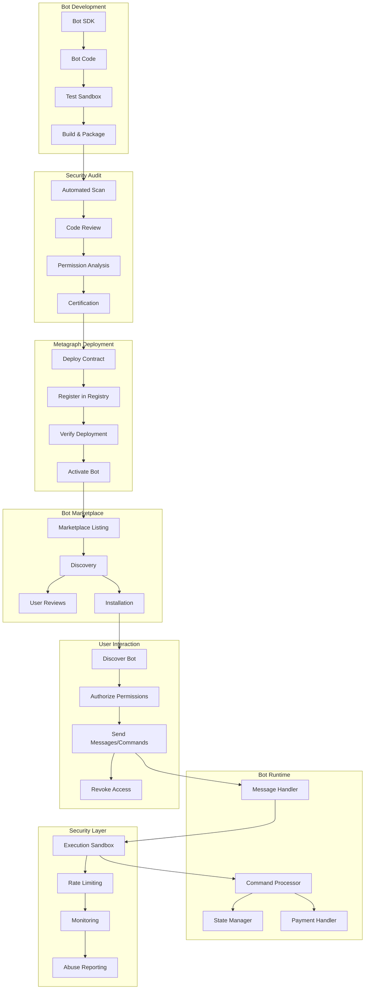
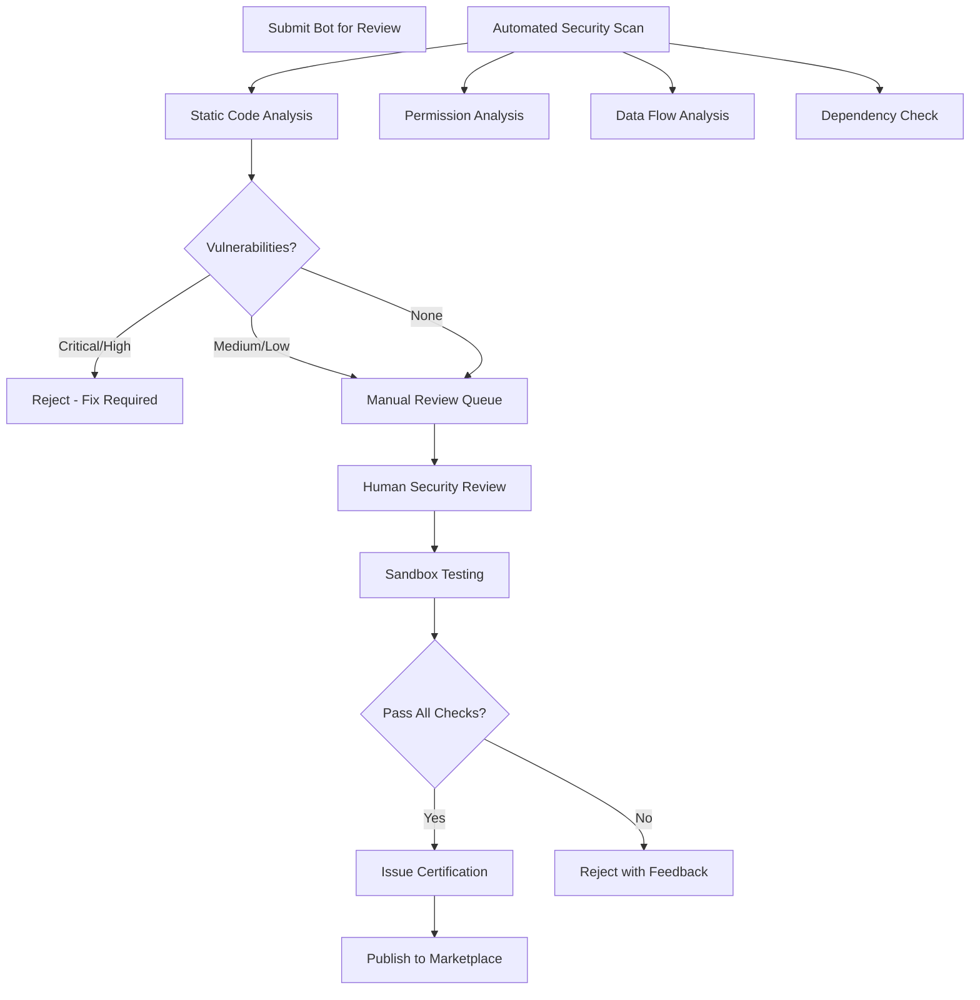

# Decentralized Bot Framework and Automation

## Overview

This feature enables developers to create and deploy autonomous bots that can interact with users and provide services within the messaging platform while operating on decentralized infrastructure and maintaining the platform's security and privacy standards. The bot framework supports a wide range of applications from simple utility bots to complex AI assistants and business automation tools. Bots operate as smart contracts on Constellation Network's metagraph, ensuring censorship resistance, transparent operation, and user-controlled permissions.

## Architecture

Bots operate as state machines deployed on the Constellation metagraph, with their logic executed by validators and their state stored on-chain. This ensures bots cannot access user data beyond what is explicitly authorized, cannot be shut down by centralized authorities, and operate with full transparency. The framework provides secure APIs for messaging, payments, file sharing, and external integrations while enforcing strict security sandboxing.

### Bot Deployment & Interaction Flow



### Architecture Components

| Component | Technology | Purpose |
|-----------|------------|---------|
| Bot Runtime | Constellation Metagraph | Decentralized bot execution |
| State Storage | Metagraph State Channels | Persistent bot state |
| Message Bus | Platform Message Queue | Bot-user communication |
| Permission Manager | Smart Contract | Granular access control |
| Sandbox | WASM Runtime | Isolated execution |
| Marketplace | Decentralized Registry | Bot discovery |
| Payment Processor | ECHO Token Contract | Monetization |
| Analytics Engine | Privacy-preserving | Usage metrics |

### Data Model

```typescript
// Bot Definition
interface Bot {
  // Identity
  botId: string;
  did: string;                       // Bot's DID
  contractAddress: string;           // Metagraph contract address
  
  // Metadata
  metadata: {
    name: string;
    description: string;
    shortDescription: string;
    version: string;
    author: DeveloperInfo;
    website?: string;
    supportEmail?: string;
    privacyPolicyUrl: string;
    termsOfServiceUrl: string;
    
    // Branding
    icon: string;                    // URL to icon
    banner?: string;                 // URL to banner
    color: string;                   // Brand color
    
    // Categorization
    category: BotCategory;
    tags: string[];
    capabilities: BotCapability[];
  };
  
  // Permissions required
  permissions: {
    required: Permission[];          // Must grant to use
    optional: Permission[];          // Can grant for enhanced features
  };
  
  // Commands
  commands: BotCommand[];
  
  // Pricing
  pricing: BotPricing;
  
  // Trust & Security
  trust: {
    score: number;                   // 0-100
    verified: boolean;               // Passed security audit
    audits: SecurityAudit[];
    reviews: ReviewSummary;
  };
  
  // Status
  status: BotStatus;
  
  // Stats
  stats: {
    installations: number;
    activeUsers: number;
    messagesProcessed: number;
    uptime: number;                  // Percentage
    avgResponseTime: number;         // ms
  };
  
  // Timestamps
  createdAt: Date;
  updatedAt: Date;
  publishedAt?: Date;
}

type BotCategory =
  | 'utility'
  | 'productivity'
  | 'entertainment'
  | 'finance'
  | 'social'
  | 'customer_service'
  | 'ai_assistant'
  | 'developer_tools'
  | 'education'
  | 'news'
  | 'commerce'
  | 'other';

type BotCapability =
  | 'messaging'
  | 'commands'
  | 'inline_queries'
  | 'payments'
  | 'file_handling'
  | 'group_management'
  | 'webhooks'
  | 'scheduled_tasks'
  | 'external_api'
  | 'ai_processing'
  | 'blockchain_interaction';

type BotStatus =
  | 'draft'
  | 'pending_review'
  | 'in_review'
  | 'approved'
  | 'published'
  | 'suspended'
  | 'deprecated';

// Bot Command
interface BotCommand {
  command: string;                   // e.g., "/help"
  description: string;
  usage: string;                     // e.g., "/remind <time> <message>"
  parameters: CommandParameter[];
  examples: string[];
  requiresPermission?: Permission;
  cooldown?: number;                 // seconds
}

interface CommandParameter {
  name: string;
  type: 'string' | 'number' | 'boolean' | 'user' | 'date' | 'file';
  required: boolean;
  description: string;
  validation?: ParameterValidation;
}

// Permission System
interface Permission {
  id: string;
  name: string;
  description: string;
  category: PermissionCategory;
  riskLevel: 'low' | 'medium' | 'high';
  dataAccessed: string[];
}

type PermissionCategory =
  | 'messaging'
  | 'profile'
  | 'contacts'
  | 'payments'
  | 'files'
  | 'groups'
  | 'notifications'
  | 'external';

// Predefined Permissions
const PERMISSIONS = {
  // Messaging
  READ_MESSAGES: {
    id: 'read_messages',
    name: 'Read Messages',
    description: 'Read messages sent to the bot',
    category: 'messaging',
    riskLevel: 'low',
    dataAccessed: ['message_content', 'sender_id', 'timestamp'],
  },
  SEND_MESSAGES: {
    id: 'send_messages',
    name: 'Send Messages',
    description: 'Send messages to users who interact with the bot',
    category: 'messaging',
    riskLevel: 'low',
    dataAccessed: [],
  },
  READ_GROUP_MESSAGES: {
    id: 'read_group_messages',
    name: 'Read Group Messages',
    description: 'Read messages in groups where the bot is added',
    category: 'messaging',
    riskLevel: 'medium',
    dataAccessed: ['group_messages', 'participant_ids'],
  },
  
  // Profile
  READ_PROFILE_BASIC: {
    id: 'read_profile_basic',
    name: 'Read Basic Profile',
    description: 'Read your display name and avatar',
    category: 'profile',
    riskLevel: 'low',
    dataAccessed: ['display_name', 'avatar_url'],
  },
  READ_PROFILE_FULL: {
    id: 'read_profile_full',
    name: 'Read Full Profile',
    description: 'Read your complete profile including trust score',
    category: 'profile',
    riskLevel: 'medium',
    dataAccessed: ['display_name', 'avatar_url', 'trust_score', 'badges'],
  },
  
  // Payments
  REQUEST_PAYMENT: {
    id: 'request_payment',
    name: 'Request Payments',
    description: 'Request ECHO token payments from you',
    category: 'payments',
    riskLevel: 'medium',
    dataAccessed: [],
  },
  SEND_PAYMENT: {
    id: 'send_payment',
    name: 'Send Payments',
    description: 'Send ECHO tokens on your behalf (requires approval)',
    category: 'payments',
    riskLevel: 'high',
    dataAccessed: ['wallet_balance'],
  },
  
  // Files
  RECEIVE_FILES: {
    id: 'receive_files',
    name: 'Receive Files',
    description: 'Receive files you send to the bot',
    category: 'files',
    riskLevel: 'medium',
    dataAccessed: ['file_content', 'file_metadata'],
  },
  SEND_FILES: {
    id: 'send_files',
    name: 'Send Files',
    description: 'Send files to you',
    category: 'files',
    riskLevel: 'low',
    dataAccessed: [],
  },
  
  // Notifications
  SEND_NOTIFICATIONS: {
    id: 'send_notifications',
    name: 'Send Notifications',
    description: 'Send push notifications to you',
    category: 'notifications',
    riskLevel: 'low',
    dataAccessed: [],
  },
  
  // External
  EXTERNAL_API: {
    id: 'external_api',
    name: 'External API Access',
    description: 'Connect to external services on your behalf',
    category: 'external',
    riskLevel: 'high',
    dataAccessed: ['varies_by_integration'],
  },
};

// Bot Installation (User's granted permissions)
interface BotInstallation {
  installationId: string;
  userId: string;
  botId: string;
  
  // Granted permissions
  permissions: {
    granted: Permission[];
    grantedAt: Date;
    expiresAt?: Date;
  };
  
  // Conversation state
  conversation: {
    channelId: string;
    lastInteraction: Date;
    messageCount: number;
  };
  
  // User preferences
  preferences: {
    notifications: boolean;
    language: string;
    customSettings: Record<string, any>;
  };
  
  // Subscription (if applicable)
  subscription?: {
    plan: string;
    status: 'active' | 'cancelled' | 'expired';
    startedAt: Date;
    expiresAt: Date;
    paymentMethod: 'echo' | 'fiat';
  };
  
  // Status
  status: 'active' | 'paused' | 'blocked' | 'uninstalled';
  installedAt: Date;
  updatedAt: Date;
}

// Bot Message
interface BotMessage {
  messageId: string;
  botId: string;
  userId: string;
  direction: 'incoming' | 'outgoing';
  
  // Content
  content: {
    type: 'text' | 'rich' | 'card' | 'carousel' | 'form' | 'file';
    text?: string;
    richContent?: RichContent;
    attachments?: Attachment[];
    quickReplies?: QuickReply[];
    actions?: MessageAction[];
  };
  
  // Context
  context: {
    command?: string;
    parameters?: Record<string, any>;
    replyTo?: string;
    conversationState?: string;
  };
  
  // Metadata
  timestamp: Date;
  processed: boolean;
  responseTime?: number;
}

// Rich Content Types
interface RichContent {
  type: 'card' | 'carousel' | 'list' | 'form';
  
  // Card
  card?: {
    title: string;
    subtitle?: string;
    image?: string;
    body: string;
    actions: MessageAction[];
  };
  
  // Carousel
  carousel?: {
    items: CardItem[];
  };
  
  // Form
  form?: {
    title: string;
    fields: FormField[];
    submitAction: MessageAction;
  };
}

interface MessageAction {
  type: 'button' | 'link' | 'callback' | 'payment';
  label: string;
  data?: string;
  url?: string;
  amount?: number;
  style?: 'primary' | 'secondary' | 'danger';
}

// Bot Pricing
interface BotPricing {
  model: 'free' | 'freemium' | 'subscription' | 'pay_per_use' | 'one_time';
  
  // Free tier limits
  freeTier?: {
    messagesPerDay: number;
    featuresIncluded: string[];
  };
  
  // Subscription tiers
  subscriptions?: {
    planId: string;
    name: string;
    price: number;                   // ECHO per month
    features: string[];
    limits: Record<string, number>;
  }[];
  
  // Pay per use
  payPerUse?: {
    action: string;
    price: number;                   // ECHO
  }[];
  
  // One-time purchase
  oneTime?: {
    price: number;
    features: string[];
  };
}

// Security Audit
interface SecurityAudit {
  auditId: string;
  botId: string;
  version: string;
  
  // Auditor
  auditor: {
    type: 'automated' | 'manual' | 'third_party';
    name: string;
    certificationLevel?: string;
  };
  
  // Results
  results: {
    passed: boolean;
    score: number;                   // 0-100
    issues: AuditIssue[];
    recommendations: string[];
  };
  
  // Checks performed
  checks: {
    codeAnalysis: boolean;
    permissionReview: boolean;
    dataHandling: boolean;
    externalConnections: boolean;
    paymentSecurity: boolean;
    privacyCompliance: boolean;
  };
  
  // Timestamps
  auditedAt: Date;
  expiresAt: Date;
}

interface AuditIssue {
  severity: 'critical' | 'high' | 'medium' | 'low' | 'info';
  category: string;
  description: string;
  location?: string;
  remediation: string;
  resolved: boolean;
}

// Developer Info
interface DeveloperInfo {
  developerId: string;
  did: string;
  name: string;
  email: string;
  website?: string;
  verified: boolean;
  reputation: {
    score: number;
    totalBots: number;
    totalInstalls: number;
  };
}
```

## Key Components

### Bot SDK

Comprehensive SDK for bot development with TypeScript/JavaScript, Rust, and Python support.

**SDK Features:**

| Feature | Description |
|---------|-------------|
| Message Handling | Receive and send messages |
| Command Parser | Parse and route commands |
| State Management | Persistent bot state |
| Payment Integration | ECHO token transactions |
| File Handling | Send/receive files |
| Rich Messages | Cards, carousels, forms |
| Webhooks | External event triggers |
| Scheduled Tasks | Cron-like scheduling |
| External APIs | HTTP client with rate limiting |
| Encryption | E2E encrypted data |

**SDK Structure:**

```typescript
// Bot SDK - TypeScript Implementation
import { 
  Bot, 
  Message, 
  Command, 
  Context, 
  Middleware 
} from '@echo/bot-sdk';

// Create bot instance
const bot = new Bot({
  botId: 'my-bot-id',
  privateKey: process.env.BOT_PRIVATE_KEY,
  permissions: ['read_messages', 'send_messages'],
});

// Message handler
bot.onMessage(async (ctx: Context) => {
  const { message, user, reply } = ctx;
  
  // Access user info (only permitted fields)
  console.log(`Message from ${user.displayName}`);
  
  // Send reply
  await reply.text('Hello! How can I help you?');
});

// Command handler
bot.command('help', async (ctx: Context) => {
  await ctx.reply.card({
    title: 'Available Commands',
    body: 'Here are the commands I support:',
    actions: [
      { type: 'button', label: '/weather', data: '/weather' },
      { type: 'button', label: '/remind', data: '/remind' },
      { type: 'button', label: '/settings', data: '/settings' },
    ],
  });
});

// Command with parameters
bot.command('remind', async (ctx: Context) => {
  const { time, message } = ctx.params;
  
  // Validate
  if (!time || !message) {
    return ctx.reply.text('Usage: /remind <time> <message>');
  }
  
  // Schedule reminder
  await ctx.scheduler.schedule({
    at: parseTime(time),
    action: 'send_reminder',
    data: { userId: ctx.user.id, message },
  });
  
  await ctx.reply.text(`⏰ Reminder set for ${time}`);
});

// Callback handler (button clicks)
bot.onCallback(async (ctx: Context) => {
  const { data, answer } = ctx;
  
  // Handle button click
  if (data.startsWith('/')) {
    // Treat as command
    await bot.handleCommand(ctx, data);
  }
  
  // Acknowledge callback
  await answer();
});

// Payment handler
bot.onPayment(async (ctx: Context) => {
  const { payment, user } = ctx;
  
  // Verify payment
  if (payment.verified && payment.amount >= 10) {
    // Grant premium access
    await ctx.state.set(`premium:${user.id}`, {
      active: true,
      expiresAt: Date.now() + 30 * 24 * 60 * 60 * 1000,
    });
    
    await ctx.reply.text('🎉 Premium activated! Enjoy your features.');
  }
});

// Middleware
bot.use(async (ctx: Context, next: () => Promise<void>) => {
  const start = Date.now();
  await next();
  console.log(`Response time: ${Date.now() - start}ms`);
});

// Error handler
bot.onError(async (error: Error, ctx: Context) => {
  console.error('Bot error:', error);
  await ctx.reply.text('Something went wrong. Please try again.');
});

// Start bot
bot.start();
```

**SDK API Reference:**

```typescript
// Context object available in all handlers
interface Context {
  // Message info
  message: Message;
  user: UserInfo;
  chat: ChatInfo;
  
  // Parsed data
  command?: string;
  params: Record<string, any>;
  
  // Reply methods
  reply: {
    text(content: string): Promise<Message>;
    card(card: CardContent): Promise<Message>;
    carousel(items: CardItem[]): Promise<Message>;
    form(form: FormContent): Promise<Message>;
    file(file: FileContent): Promise<Message>;
    typing(): Promise<void>;
  };
  
  // State management
  state: {
    get<T>(key: string): Promise<T | null>;
    set<T>(key: string, value: T, ttl?: number): Promise<void>;
    delete(key: string): Promise<void>;
  };
  
  // User state (per-user)
  userState: {
    get<T>(key: string): Promise<T | null>;
    set<T>(key: string, value: T): Promise<void>;
  };
  
  // Scheduler
  scheduler: {
    schedule(task: ScheduledTask): Promise<string>;
    cancel(taskId: string): Promise<void>;
    list(): Promise<ScheduledTask[]>;
  };
  
  // Payments
  payments: {
    request(amount: number, description: string): Promise<PaymentRequest>;
    verify(paymentId: string): Promise<PaymentResult>;
  };
  
  // External APIs (sandboxed)
  http: {
    get(url: string, options?: HttpOptions): Promise<HttpResponse>;
    post(url: string, body: any, options?: HttpOptions): Promise<HttpResponse>;
  };
  
  // Callback answer (for button clicks)
  answer(text?: string): Promise<void>;
}

// Bot class methods
class Bot {
  // Handlers
  onMessage(handler: MessageHandler): void;
  command(name: string, handler: CommandHandler): void;
  onCallback(handler: CallbackHandler): void;
  onPayment(handler: PaymentHandler): void;
  onInstall(handler: InstallHandler): void;
  onUninstall(handler: UninstallHandler): void;
  
  // Middleware
  use(middleware: Middleware): void;
  
  // Error handling
  onError(handler: ErrorHandler): void;
  
  // Proactive messaging
  sendMessage(userId: string, content: MessageContent): Promise<Message>;
  broadcastMessage(userIds: string[], content: MessageContent): Promise<void>;
  
  // Lifecycle
  start(): Promise<void>;
  stop(): Promise<void>;
}
```

### Smart Contract Bot Runtime

Bots execute as WASM modules within the Constellation metagraph.

**Contract Structure:**

```rust
// Bot Contract - Rust Implementation
use echo_bot_runtime::prelude::*;

#[bot_contract]
pub struct MyBot {
    // Persistent state
    state: BotState,
    
    // Configuration
    config: BotConfig,
}

#[derive(Serialize, Deserialize)]
pub struct BotState {
    user_data: HashMap<UserId, UserData>,
    global_stats: Stats,
}

impl Bot for MyBot {
    // Initialize bot
    fn init(config: BotConfig) -> Self {
        Self {
            state: BotState::default(),
            config,
        }
    }
    
    // Handle incoming message
    #[handler]
    fn handle_message(&mut self, ctx: Context, msg: Message) -> Result<Response> {
        // Check permissions
        ctx.require_permission(Permission::ReadMessages)?;
        
        // Process message
        let response = match msg.text.as_str() {
            text if text.starts_with('/') => self.handle_command(ctx, text)?,
            _ => self.handle_text(ctx, msg)?,
        };
        
        Ok(response)
    }
    
    // Handle command
    fn handle_command(&mut self, ctx: Context, cmd: &str) -> Result<Response> {
        match cmd.split_whitespace().next() {
            Some("/start") => self.cmd_start(ctx),
            Some("/help") => self.cmd_help(ctx),
            Some("/stats") => self.cmd_stats(ctx),
            _ => Ok(Response::text("Unknown command")),
        }
    }
    
    // Handle payment
    #[handler]
    fn handle_payment(&mut self, ctx: Context, payment: Payment) -> Result<Response> {
        ctx.require_permission(Permission::RequestPayment)?;
        
        // Verify payment
        if payment.verify()? {
            // Credit user
            let user = self.state.user_data
                .entry(ctx.user_id)
                .or_default();
            user.balance += payment.amount;
            
            Ok(Response::text(format!(
                "Payment received! Your balance: {} ECHO",
                user.balance
            )))
        } else {
            Ok(Response::text("Payment verification failed"))
        }
    }
    
    // Scheduled task
    #[scheduled]
    fn daily_cleanup(&mut self) -> Result<()> {
        // Clean up expired data
        self.state.user_data.retain(|_, v| !v.is_expired());
        Ok(())
    }
}

// Deploy contract
#[no_mangle]
pub extern "C" fn deploy() -> *mut MyBot {
    let config = BotConfig::from_env();
    Box::into_raw(Box::new(MyBot::init(config)))
}
```

### Permission Management

Granular, user-controlled permissions with transparency.

**Permission Grant Flow:**

```
┌─────────────────────────────────────────────────────────┐
│ WeatherBot wants access                                 │
├─────────────────────────────────────────────────────────┤
│                                                         │
│ ☀️ WeatherBot                                           │
│ by WeatherCorp • ✓ Verified                            │
│ ★★★★☆ 4.2 (1,234 reviews)                             │
│                                                         │
│ ─────────────────────────────────────────────────────── │
│                                                         │
│ This bot is requesting the following permissions:      │
│                                                         │
│ REQUIRED                                               │
│ ┌─────────────────────────────────────────────────────┐ │
│ │ ☑ Read Messages                          🟢 Low    │ │
│ │   Read messages you send to the bot                │ │
│ ├─────────────────────────────────────────────────────┤ │
│ │ ☑ Send Messages                          🟢 Low    │ │
│ │   Send messages to you                             │ │
│ └─────────────────────────────────────────────────────┘ │
│                                                         │
│ OPTIONAL                                               │
│ ┌─────────────────────────────────────────────────────┐ │
│ │ ☐ Send Notifications                     🟢 Low    │ │
│ │   Send push notifications for weather alerts       │ │
│ ├─────────────────────────────────────────────────────┤ │
│ │ ☐ Read Location                          🟡 Medium │ │
│ │   Access your location for local weather           │ │
│ └─────────────────────────────────────────────────────┘ │
│                                                         │
│ ┌─────────────────────────────────────────────────────┐ │
│ │ 🔒 Your data is processed according to the bot's  │ │
│ │ privacy policy. You can revoke access anytime.    │ │
│ └─────────────────────────────────────────────────────┘ │
│                                                         │
│           [Deny]                    [Allow Selected]   │
│                                                         │
└─────────────────────────────────────────────────────────┘
```

**Permission Enforcement:**

```typescript
interface PermissionEnforcement {
  // Check permission before API call
  async checkPermission(
    botId: string,
    userId: string,
    permission: Permission
  ): Promise<PermissionCheck> {
    const installation = await this.getInstallation(botId, userId);
    
    if (!installation) {
      return { allowed: false, reason: 'Bot not installed' };
    }
    
    const granted = installation.permissions.granted
      .find(p => p.id === permission.id);
    
    if (!granted) {
      return { allowed: false, reason: 'Permission not granted' };
    }
    
    // Check expiration
    if (installation.permissions.expiresAt && 
        installation.permissions.expiresAt < new Date()) {
      return { allowed: false, reason: 'Permission expired' };
    }
    
    // Log access
    await this.logPermissionAccess(botId, userId, permission);
    
    return { allowed: true };
  }
  
  // Revoke permission
  async revokePermission(
    userId: string,
    botId: string,
    permissionId: string
  ): Promise<void> {
    const installation = await this.getInstallation(botId, userId);
    
    installation.permissions.granted = installation.permissions.granted
      .filter(p => p.id !== permissionId);
    
    await this.updateInstallation(installation);
    
    // Notify bot of revocation
    await this.notifyBot(botId, {
      type: 'permission_revoked',
      userId,
      permissionId,
    });
  }
}
```

### Bot Marketplace

Decentralized marketplace for bot discovery and distribution.

**Marketplace UI:**

```
┌─────────────────────────────────────────────────────────┐
│ Bot Marketplace                          🔍 Search bots │
├─────────────────────────────────────────────────────────┤
│                                                         │
│ Categories                                             │
│ [All] [Productivity] [Finance] [Entertainment] [AI] ▶  │
│                                                         │
│ Featured Bots                                          │
│ ─────────────────────────────────────────────────────── │
│                                                         │
│ ┌─────────────────────────────────────────────────────┐ │
│ │ 🤖 TaskMaster Pro                        ✓ Verified │ │
│ │ ★★★★★ 4.9 (5,234 reviews)                          │ │
│ │                                                     │ │
│ │ AI-powered task management with natural language   │ │
│ │ input and smart scheduling.                        │ │
│ │                                                     │ │
│ │ 📥 125K installs    💰 Free / Premium              │ │
│ │                                                     │ │
│ │                                         [Install]  │ │
│ └─────────────────────────────────────────────────────┘ │
│                                                         │
│ ┌─────────────────────────────────────────────────────┐ │
│ │ 💰 CryptoTracker                         ✓ Verified │ │
│ │ ★★★★☆ 4.5 (2,891 reviews)                          │ │
│ │                                                     │ │
│ │ Real-time crypto prices, portfolio tracking, and   │ │
│ │ price alerts.                                      │ │
│ │                                                     │ │
│ │ 📥 89K installs     💰 Free                        │ │
│ │                                                     │ │
│ │                                         [Install]  │ │
│ └─────────────────────────────────────────────────────┘ │
│                                                         │
│ ┌─────────────────────────────────────────────────────┐ │
│ │ 🎮 TriviaBot                             ✓ Verified │ │
│ │ ★★★★☆ 4.3 (8,123 reviews)                          │ │
│ │                                                     │ │
│ │ Play trivia games with friends! Earn ECHO tokens  │ │
│ │ for correct answers.                               │ │
│ │                                                     │ │
│ │ 📥 234K installs    💰 Free + In-app               │ │
│ │                                                     │ │
│ │                                         [Install]  │ │
│ └─────────────────────────────────────────────────────┘ │
│                                                         │
│ New & Trending                                         │
│ ─────────────────────────────────────────────────────── │
│                                                         │
│ [View All Bots]                                        │
│                                                         │
└─────────────────────────────────────────────────────────┘
```

**Marketplace Implementation:**

```typescript
interface BotMarketplace {
  // Search bots
  async searchBots(query: SearchQuery): Promise<SearchResults> {
    const filters = {
      category: query.category,
      verified: query.verifiedOnly,
      minRating: query.minRating,
      pricing: query.pricing,
      capabilities: query.capabilities,
    };
    
    const bots = await this.botRegistry.search({
      text: query.text,
      filters,
      sort: query.sortBy || 'relevance',
      limit: query.limit || 20,
      offset: query.offset || 0,
    });
    
    return {
      bots,
      total: bots.length,
      hasMore: bots.length === query.limit,
    };
  }
  
  // Get featured bots
  async getFeaturedBots(): Promise<Bot[]> {
    // Algorithm considers:
    // - Trust score
    // - User ratings
    // - Recent activity
    // - Install growth
    // - Security audit freshness
    return this.botRegistry.query({
      verified: true,
      minTrustScore: 80,
      minRating: 4.0,
      orderBy: 'featured_score',
      limit: 10,
    });
  }
  
  // Install bot
  async installBot(
    userId: string,
    botId: string,
    grantedPermissions: Permission[]
  ): Promise<BotInstallation> {
    const bot = await this.getBot(botId);
    
    // Verify required permissions are granted
    for (const required of bot.permissions.required) {
      if (!grantedPermissions.find(p => p.id === required.id)) {
        throw new Error(`Required permission not granted: ${required.name}`);
      }
    }
    
    // Create installation
    const installation: BotInstallation = {
      installationId: generateId(),
      userId,
      botId,
      permissions: {
        granted: grantedPermissions,
        grantedAt: new Date(),
      },
      conversation: {
        channelId: await this.createBotChannel(userId, botId),
        lastInteraction: new Date(),
        messageCount: 0,
      },
      preferences: {
        notifications: true,
        language: 'en',
        customSettings: {},
      },
      status: 'active',
      installedAt: new Date(),
      updatedAt: new Date(),
    };
    
    await this.saveInstallation(installation);
    
    // Notify bot of installation
    await this.notifyBot(botId, {
      type: 'new_installation',
      userId,
      permissions: grantedPermissions,
    });
    
    // Send welcome message
    await this.sendBotMessage(botId, userId, {
      type: 'system',
      text: 'Bot installed! Send /start to begin.',
    });
    
    return installation;
  }
  
  // Submit review
  async submitReview(
    userId: string,
    botId: string,
    review: ReviewSubmission
  ): Promise<Review> {
    // Verify user has used the bot
    const installation = await this.getInstallation(botId, userId);
    if (!installation || installation.conversation.messageCount < 5) {
      throw new Error('Must use bot before reviewing');
    }
    
    // Check for existing review
    const existing = await this.getReview(userId, botId);
    if (existing) {
      // Update existing
      return this.updateReview(existing.reviewId, review);
    }
    
    // Create review
    const newReview: Review = {
      reviewId: generateId(),
      userId,
      botId,
      rating: review.rating,
      title: review.title,
      body: review.body,
      helpful: 0,
      verified: true,
      createdAt: new Date(),
    };
    
    await this.saveReview(newReview);
    
    // Update bot rating
    await this.recalculateBotRating(botId);
    
    return newReview;
  }
}
```

### Bot Trust Scoring

Trust scores for bots based on multiple factors.

**Trust Score Components:**

| Component | Weight | Description |
|-----------|--------|-------------|
| Security Audit | 30% | Latest audit score |
| User Ratings | 25% | Average user rating |
| Reliability | 20% | Uptime and response time |
| Developer Reputation | 15% | Developer's track record |
| Age & History | 10% | Time in marketplace without issues |

**Trust Score Calculation:**

```typescript
interface BotTrustScoring {
  async calculateTrustScore(botId: string): Promise<TrustScore> {
    const bot = await this.getBot(botId);
    
    // Security audit score (0-100)
    const auditScore = this.getAuditScore(bot.trust.audits);
    
    // User rating (0-5 normalized to 0-100)
    const ratingScore = (bot.trust.reviews.average / 5) * 100;
    
    // Reliability score
    const reliabilityScore = this.calculateReliability(bot.stats);
    
    // Developer reputation
    const devReputation = await this.getDeveloperReputation(
      bot.metadata.author.developerId
    );
    
    // Age bonus
    const ageBonus = this.calculateAgeBonus(bot.publishedAt);
    
    // Weighted calculation
    const score = (
      auditScore * 0.30 +
      ratingScore * 0.25 +
      reliabilityScore * 0.20 +
      devReputation * 0.15 +
      ageBonus * 0.10
    );
    
    return {
      score: Math.round(score),
      components: {
        audit: auditScore,
        rating: ratingScore,
        reliability: reliabilityScore,
        developer: devReputation,
        age: ageBonus,
      },
      verified: auditScore >= 70 && score >= 60,
    };
  }
  
  private calculateReliability(stats: BotStats): number {
    // Uptime (50% of reliability)
    const uptimeScore = stats.uptime;
    
    // Response time (50% of reliability)
    // <100ms = 100, 100-500ms = 80, 500-1000ms = 60, >1000ms = 40
    let responseScore: number;
    if (stats.avgResponseTime < 100) responseScore = 100;
    else if (stats.avgResponseTime < 500) responseScore = 80;
    else if (stats.avgResponseTime < 1000) responseScore = 60;
    else responseScore = 40;
    
    return (uptimeScore + responseScore) / 2;
  }
}
```

### Security Auditing

Automated and manual security audits before marketplace listing.

**Audit Process:**



**Automated Security Checks:**

| Check | Description | Blocking |
|-------|-------------|----------|
| Known Vulnerabilities | Check dependencies for CVEs | Critical/High |
| Code Injection | Detect eval(), exec() patterns | Critical |
| Data Exfiltration | Detect unauthorized data access | Critical |
| Permission Abuse | Verify permission usage matches declared | High |
| External Connections | Audit all external API calls | Medium |
| Crypto Misuse | Check cryptographic implementations | High |
| Input Validation | Verify input sanitization | Medium |
| Rate Limit Bypass | Check for rate limit evasion | Medium |

**Audit Implementation:**

```typescript
interface SecurityAuditService {
  // Run automated audit
  async runAutomatedAudit(
    botId: string,
    version: string,
    code: BotCode
  ): Promise<AutomatedAuditResult> {
    const issues: AuditIssue[] = [];
    
    // Static code analysis
    const staticResults = await this.staticAnalyzer.analyze(code);
    issues.push(...staticResults.issues);
    
    // Dependency vulnerability check
    const depResults = await this.dependencyChecker.check(code.dependencies);
    issues.push(...depResults.issues);
    
    // Permission analysis
    const permResults = await this.permissionAnalyzer.analyze(code);
    issues.push(...permResults.issues);
    
    // Data flow analysis
    const dataResults = await this.dataFlowAnalyzer.analyze(code);
    issues.push(...dataResults.issues);
    
    // Calculate score
    const score = this.calculateScore(issues);
    
    // Determine if can proceed to manual review
    const criticalIssues = issues.filter(i => 
      i.severity === 'critical' || i.severity === 'high'
    );
    
    return {
      passed: criticalIssues.length === 0,
      score,
      issues,
      canProceedToManual: criticalIssues.length === 0,
    };
  }
  
  // Request manual audit
  async requestManualAudit(
    botId: string,
    automatedResult: AutomatedAuditResult
  ): Promise<ManualAuditRequest> {
    if (!automatedResult.canProceedToManual) {
      throw new Error('Must pass automated audit first');
    }
    
    return this.auditQueue.add({
      botId,
      priority: this.calculatePriority(botId),
      automatedResult,
      requestedAt: new Date(),
    });
  }
  
  // Complete manual audit
  async completeManualAudit(
    requestId: string,
    auditor: AuditorInfo,
    result: ManualAuditResult
  ): Promise<SecurityAudit> {
    const request = await this.auditQueue.get(requestId);
    
    const audit: SecurityAudit = {
      auditId: generateId(),
      botId: request.botId,
      version: request.version,
      auditor: {
        type: 'manual',
        name: auditor.name,
        certificationLevel: auditor.level,
      },
      results: {
        passed: result.passed,
        score: result.score,
        issues: [...request.automatedResult.issues, ...result.issues],
        recommendations: result.recommendations,
      },
      checks: {
        codeAnalysis: true,
        permissionReview: true,
        dataHandling: true,
        externalConnections: true,
        paymentSecurity: request.bot.capabilities.includes('payments'),
        privacyCompliance: true,
      },
      auditedAt: new Date(),
      expiresAt: new Date(Date.now() + 365 * 24 * 60 * 60 * 1000), // 1 year
    };
    
    await this.saveAudit(audit);
    
    // Update bot status
    if (audit.results.passed) {
      await this.updateBotStatus(request.botId, 'approved');
    }
    
    return audit;
  }
}
```

### Revenue Sharing

Monetization mechanisms for bot developers.

**Revenue Models:**

| Model | Platform Fee | Developer Share |
|-------|-------------|-----------------|
| Subscription | 15% | 85% |
| One-time Purchase | 15% | 85% |
| Pay-per-use | 20% | 80% |
| In-bot Purchases | 20% | 80% |
| Tips | 5% | 95% |

**Revenue Implementation:**

```typescript
interface RevenueService {
  // Process subscription payment
  async processSubscription(
    userId: string,
    botId: string,
    planId: string
  ): Promise<SubscriptionResult> {
    const bot = await this.getBot(botId);
    const plan = bot.pricing.subscriptions?.find(p => p.planId === planId);
    
    if (!plan) throw new Error('Plan not found');
    
    // Calculate amounts
    const platformFee = plan.price * 0.15;
    const developerShare = plan.price * 0.85;
    
    // Process payment
    const payment = await this.tokenContract.transfer({
      from: await this.getUserWallet(userId),
      to: PLATFORM_REVENUE_ADDRESS,
      amount: BigInt(plan.price * 10 ** 8),
      memo: `Bot subscription: ${botId} - ${planId}`,
    });
    
    // Distribute to developer
    await this.tokenContract.transfer({
      from: PLATFORM_REVENUE_ADDRESS,
      to: await this.getDeveloperWallet(bot.metadata.author.developerId),
      amount: BigInt(developerShare * 10 ** 8),
      memo: `Revenue share: ${botId}`,
    });
    
    // Record subscription
    const subscription = await this.createSubscription({
      userId,
      botId,
      planId,
      amount: plan.price,
      platformFee,
      developerShare,
      paymentId: payment.txHash,
      startedAt: new Date(),
      expiresAt: new Date(Date.now() + 30 * 24 * 60 * 60 * 1000),
    });
    
    return subscription;
  }
  
  // Developer revenue dashboard
  async getDeveloperRevenue(
    developerId: string,
    period: 'day' | 'week' | 'month' | 'all'
  ): Promise<RevenueReport> {
    const bots = await this.getDeveloperBots(developerId);
    
    const revenue = await Promise.all(
      bots.map(async (bot) => ({
        botId: bot.botId,
        botName: bot.metadata.name,
        subscriptions: await this.getSubscriptionRevenue(bot.botId, period),
        purchases: await this.getPurchaseRevenue(bot.botId, period),
        tips: await this.getTipRevenue(bot.botId, period),
      }))
    );
    
    const total = revenue.reduce(
      (sum, r) => sum + r.subscriptions + r.purchases + r.tips,
      0
    );
    
    return {
      period,
      totalRevenue: total,
      breakdown: revenue,
      pendingPayout: await this.getPendingPayout(developerId),
      nextPayoutDate: this.getNextPayoutDate(),
    };
  }
}
```

### Bot Analytics

Privacy-preserving analytics for developers.

**Analytics Dashboard:**

```
┌─────────────────────────────────────────────────────────┐
│ Bot Analytics: TaskMaster Pro              Last 30 Days │
├─────────────────────────────────────────────────────────┤
│                                                         │
│ Overview                                               │
│ ─────────────────────────────────────────────────────── │
│                                                         │
│ ┌────────────┐ ┌────────────┐ ┌────────────┐           │
│ │   12,456   │ │   89.3%    │ │   142ms    │           │
│ │  Active    │ │ Retention  │ │  Avg Resp  │           │
│ │   Users    │ │   Rate     │ │   Time     │           │
│ │ +8.2% ▲    │ │ +2.1% ▲    │ │ -12ms ▼    │           │
│ └────────────┘ └────────────┘ └────────────┘           │
│                                                         │
│ Messages                                               │
│ ─────────────────────────────────────────────────────── │
│                                                         │
│     │                    ╱╲                            │
│ 50K │      ╱╲     ╱╲   ╱  ╲  ╱╲                       │
│     │    ╱    ╲ ╱    ╲╱    ╲╱  ╲                      │
│     │  ╱        ╲                ╲                     │
│ 25K │╱                             ╲                   │
│     │                                ╲                 │
│   0 └────────────────────────────────────              │
│       Week 1  Week 2  Week 3  Week 4                   │
│                                                         │
│ Top Commands                                           │
│ ─────────────────────────────────────────────────────── │
│                                                         │
│ /task       ████████████████████████░░░░  58%          │
│ /remind     ████████████░░░░░░░░░░░░░░░░  28%          │
│ /list       ██████░░░░░░░░░░░░░░░░░░░░░░  10%          │
│ /help       ██░░░░░░░░░░░░░░░░░░░░░░░░░░   4%          │
│                                                         │
│ Revenue                                                │
│ ─────────────────────────────────────────────────────── │
│                                                         │
│ Total: 4,521 ECHO  │  Premium: 892 users  │  Tips: 234 │
│                                                         │
└─────────────────────────────────────────────────────────┘
```

## Bot Categories & Examples

### Utility Bots

| Bot | Description | Pricing |
|-----|-------------|---------|
| ReminderBot | Schedule reminders and notifications | Free |
| TranslateBot | Real-time message translation | Freemium |
| PollBot | Create and manage polls | Free |
| QRBot | Generate and scan QR codes | Free |

### AI Assistants

| Bot | Description | Pricing |
|-----|-------------|---------|
| WritingAssistant | Help with writing and editing | Subscription |
| CodeHelper | Programming assistance | Subscription |
| ResearchBot | Research and summarization | Pay-per-use |

### Finance Bots

| Bot | Description | Pricing |
|-----|-------------|---------|
| PriceTracker | Crypto/stock price alerts | Freemium |
| PortfolioBot | Track investment portfolio | Subscription |
| ExpenseBot | Track expenses and budgets | Free |

### Entertainment

| Bot | Description | Pricing |
|-----|-------------|---------|
| TriviaBot | Trivia games with rewards | Free + Tips |
| MusicBot | Music recommendations | Free |
| MemeBot | Generate and share memes | Free |

## Security Principles

* Bots execute in sandboxed WASM runtime
* All data access requires explicit user permission
* Permissions are granular and revocable anytime
* Bot code is audited before marketplace listing
* Trust scores reflect security and reliability
* All bot interactions logged for audit
* External API calls are monitored and rate-limited
* Payment operations require user confirmation
* Privacy preserved through local processing
* Developers must complete verification

## Integration Points

### With Messaging Blueprint

| Feature | Integration |
|---------|-------------|
| Message Delivery | Bots receive messages via message bus |
| Rich Messages | Support cards, carousels, forms |
| File Sharing | Bots can send/receive files |

### With ECHO Token Blueprint

| Feature | Integration |
|---------|-------------|
| Payments | Bots can request/receive ECHO |
| Subscriptions | Recurring ECHO payments |
| Revenue Share | Developer payouts in ECHO |

### With Trust Network Blueprint

| Feature | Integration |
|---------|-------------|
| Bot Trust Score | Calculated like user trust |
| Developer Reputation | Affects bot trust |
| User Trust Display | Bots see user trust level |

### With Enterprise Blueprint

| Feature | Integration |
|---------|-------------|
| Enterprise Bots | Private bots for organizations |
| Customer Service | Enterprise support bots |
| Compliance | Audit trails for regulated industries |

## Appendix A: Error Codes

| Code | Meaning | User Message |
|------|---------|--------------|
| BOT_001 | Bot not found | "This bot doesn't exist or has been removed." |
| BOT_002 | Permission denied | "This bot doesn't have permission for this action." |
| BOT_003 | Rate limited | "Too many requests. Please slow down." |
| BOT_004 | Bot offline | "This bot is temporarily unavailable." |
| BOT_005 | Invalid command | "Unknown command. Try /help." |
| BOT_006 | Payment failed | "Payment could not be processed." |
| BOT_007 | Installation failed | "Could not install bot. Please try again." |
| BOT_008 | Audit required | "This bot is pending security review." |
| BOT_009 | Suspended | "This bot has been suspended." |
| BOT_010 | Version mismatch | "Please update to the latest version." |

## Appendix B: SDK Quick Start

```typescript
// 1. Install SDK
// npm install @echo/bot-sdk

// 2. Create bot
import { Bot } from '@echo/bot-sdk';

const bot = new Bot({
  botId: process.env.BOT_ID,
  privateKey: process.env.BOT_KEY,
});

// 3. Add handlers
bot.command('hello', async (ctx) => {
  await ctx.reply.text(`Hello, ${ctx.user.displayName}!`);
});

// 4. Start
bot.start();
```

---

*Blueprint Version: 2.0*  
*Last Updated: February 7, 2026*  
*Status: Complete with Implementation Details*
