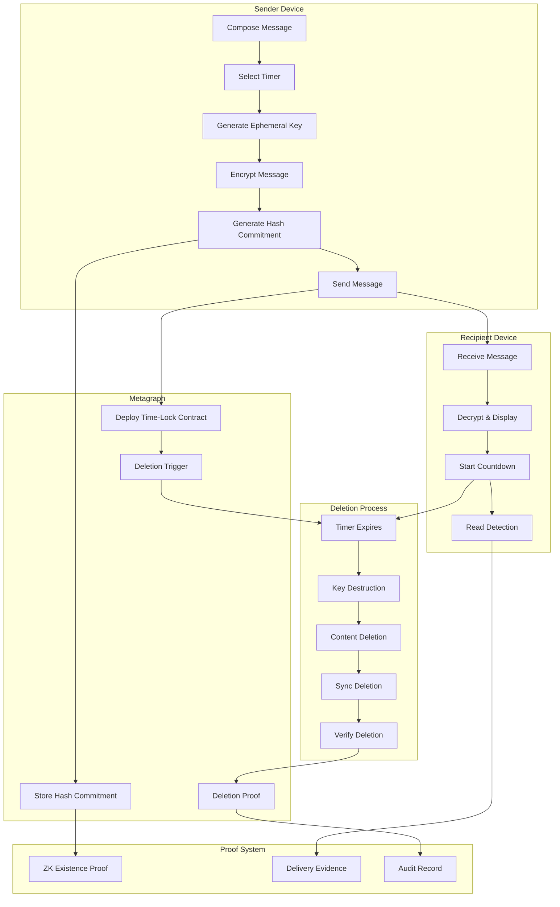
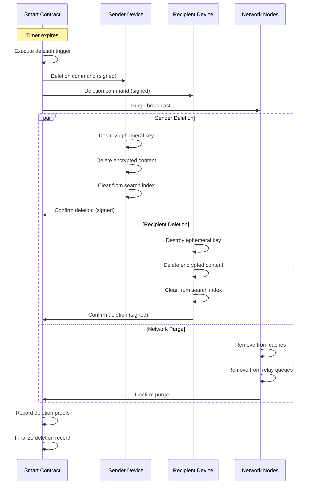

# Disappearing Messages with Cryptographic Verification

## Overview

This feature provides users with the ability to send messages that automatically delete from all devices after predetermined time periods while maintaining cryptographic proof that the messages existed and were delivered, addressing privacy needs without compromising the platform's provable integrity capabilities. The system ensures that sensitive communications can be ephemeral while preserving audit trails for compliance and dispute resolution when necessary.

## Architecture

Messages are encrypted with ephemeral keys managed through a key ratcheting protocol. Deletion is coordinated through a combination of client-side timers, smart contract triggers, and cryptographic key destruction. The system maintains blockchain-anchored commitments that prove message existence without revealing content, enabling verifiable deletion while preserving audit capabilities.

### Disappearing Message Flow



### Architecture Components

| Component | Technology | Purpose |
|-----------|------------|---------|
| Ephemeral Keys | X25519 + HKDF | Per-message encryption keys |
| Message Encryption | AES-256-GCM | Content encryption |
| Key Ratchet | Double Ratchet | Forward secrecy |
| Time-Lock | Metagraph Smart Contract | Automated deletion trigger |
| Hash Commitment | SHA-256 + Pedersen | Provable existence |
| ZK Proofs | Groth16 | Existence proof without content |
| Secure Deletion | Cryptographic erasure | Unrecoverable deletion |
| Sync Protocol | CRDT-based | Cross-device coordination |

### Deletion Guarantee Levels

| Level | Mechanism | Guarantee |
|-------|-----------|-----------|
| Level 1: Key Destruction | Ephemeral key deleted | Content unreadable |
| Level 2: Content Wipe | Encrypted blob deleted | No local data remains |
| Level 3: Smart Contract | On-chain deletion record | Verifiable deletion time |
| Level 4: Network Purge | P2P cache purge broadcast | Network-wide removal |

### Data Model

```typescript
interface DisappearingMessage {
  // Message identity
  messageId: string;
  conversationId: string;
  
  // Content (encrypted)
  content: {
    ciphertext: Uint8Array;
    nonce: Uint8Array;
    authTag: Uint8Array;
  };
  
  // Ephemeral key info
  ephemeralKey: {
    keyId: string;
    publicKey: string;           // For recipient
    createdAt: Date;
    expiresAt: Date;
    destroyed: boolean;
    destructionProof?: string;
  };
  
  // Timer configuration
  timer: {
    duration: number;            // Seconds
    startTrigger: 'send' | 'read' | 'open';
    startedAt?: Date;
    expiresAt?: Date;
    remainingSeconds?: number;
  };
  
  // Blockchain anchoring
  anchor: {
    commitmentHash: string;      // H(messageId || contentHash || metadata)
    contractAddress: string;     // Time-lock contract
    deployTxHash: string;
    deletionTxHash?: string;
  };
  
  // Status
  status: {
    state: 'pending' | 'sent' | 'delivered' | 'read' | 'expired' | 'deleted';
    deliveredAt?: Date;
    readAt?: Date;
    deletedAt?: Date;
  };
  
  // Proof data
  proofs: {
    existenceProof?: string;     // ZK proof of existence
    deliveryProof?: string;      // Signed delivery receipt
    deletionProof?: string;      // On-chain deletion record
  };
}

interface DisappearingConversationSettings {
  conversationId: string;
  
  enabled: boolean;
  defaultDuration: number;       // Seconds
  startTrigger: 'send' | 'read';
  
  // Overrides
  allowPerMessage: boolean;      // Can override per message
  allowExtension: boolean;       // Can extend timer
  minimumDuration: number;       // Floor (trust-based)
  maximumDuration: number;       // Ceiling
  
  // Features
  showCountdown: boolean;
  notifyOnExpiry: boolean;
  allowScreenshots: boolean;
  
  // Set by
  setBy: UserId;
  setAt: Date;
  
  // Both parties must agree for changes
  requireMutualConsent: boolean;
}
```

## Key Components

### Disappearing Message Configuration

Users can enable disappearing messages for individual conversations or specific messages by selecting from preset time intervals, with custom timing available based on trust level.

**Key Features:**

* Preset time intervals with trust-based access
* Per-conversation default settings
* Per-message override capability
* Start trigger options (on send, on read, on open)
* Mutual consent for setting changes
* Visual timer indicator
* Extension/modification options
* Conversation-level defaults

**Timer Presets by Trust Level:**

| Trust Level | Minimum Timer | Maximum Timer | Custom Allowed |
|-------------|---------------|---------------|----------------|
| Unverified (0-19) | 1 hour | 7 days | No |
| Newcomer (20-39) | 5 minutes | 7 days | No |
| Member (40-59) | 1 minute | 30 days | Preset only |
| Trusted (60-79) | 10 seconds | 30 days | Yes |
| Verified (80-100) | 10 seconds | 90 days | Yes (1 sec min) |

**Start Trigger Options:**

| Trigger | When Timer Starts | Use Case |
|---------|-------------------|----------|
| On Send | Immediately when sent | Time-boxed announcements |
| On Read | When recipient reads | Ensure recipient sees first |
| On Open | When message is expanded | For media/long messages |

**Configuration UI:**

```
┌─────────────────────────────────────────────────────────┐
│ Disappearing Messages                              ×    │
├─────────────────────────────────────────────────────────┤
│                                                         │
│ 🔥 Messages in this chat will disappear after the     │
│    selected time period.                               │
│                                                         │
│ Timer Duration:                                        │
│ ┌─────────────────────────────────────────────────────┐│
│ │ ○ 10 seconds                                        ││
│ │ ○ 1 minute                                          ││
│ │ ○ 5 minutes                                         ││
│ │ ● 1 hour              ← Selected                    ││
│ │ ○ 1 day                                             ││
│ │ ○ 7 days                                            ││
│ │ ○ Custom: [____] [minutes ▼]                        ││
│ └─────────────────────────────────────────────────────┘│
│                                                         │
│ Timer Starts:                                          │
│ ○ When message is sent                                 │
│ ● When message is read                                 │
│                                                         │
│ ─────────────────────────────────────────────────────── │
│                                                         │
│ □ Allow per-message overrides                          │
│ ☑ Show countdown timer                                 │
│ □ Notify when messages expire                          │
│                                                         │
│ ─────────────────────────────────────────────────────── │
│                                                         │
│ ⚠️ Both participants must agree to change these       │
│    settings. Alice will be notified of this change.   │
│                                                         │
│            [Cancel]              [Enable]              │
└─────────────────────────────────────────────────────────┘
```

**Per-Message Override:**

```
┌─────────────────────────────────────────────────────────┐
│ ← Alice Johnson                          🔥 1h default │
├─────────────────────────────────────────────────────────┤
│                                                         │
│ [Message input field...]                               │
│                                                         │
│ ┌─────────────────────────────────────────────────────┐│
│ │ 🔥 This message only:                              ││
│ │ [10s] [1m] [5m] [1h ✓] [1d] [7d] [Custom]          ││
│ └─────────────────────────────────────────────────────┘│
│                                                         │
│ [📎] [📷] [🎤]                           [Send 🔥]     │
└─────────────────────────────────────────────────────────┘
```

### Ephemeral Key Management

Messages are encrypted with ephemeral keys that are cryptographically destroyed after the timer expires, making content recovery impossible.

**Key Features:**

* Per-message ephemeral key generation
* Key derivation from conversation ratchet
* Secure key storage during validity
* Cryptographic key destruction
* Destruction proof generation
* No key escrow or backup
* Forward secrecy guarantee
* Post-compromise security

**Key Lifecycle:**

```typescript
interface EphemeralKeyLifecycle {
  // Generate ephemeral key for message
  async generateKey(
    messageId: MessageId,
    duration: number
  ): Promise<EphemeralKey> {
    // Derive from conversation ratchet (Double Ratchet)
    const ratchetState = await getRatchetState(conversationId);
    const chainKey = await advanceChain(ratchetState);
    
    // Generate message-specific key
    const messageKey = await hkdf(
      chainKey,
      messageId,
      'disappearing-message-key',
      32
    );
    
    const expiresAt = new Date(Date.now() + duration * 1000);
    
    // Store in secure enclave
    await secureStore.set(messageId, {
      key: messageKey,
      expiresAt,
      destroyed: false,
    });
    
    // Schedule destruction
    await scheduleKeyDestruction(messageId, expiresAt);
    
    return {
      keyId: messageId,
      key: messageKey,
      expiresAt,
    };
  }
  
  // Destroy key (cryptographic erasure)
  async destroyKey(
    messageId: MessageId
  ): Promise<DestructionProof> {
    // Get key location
    const keyEntry = await secureStore.get(messageId);
    
    if (!keyEntry || keyEntry.destroyed) {
      return { alreadyDestroyed: true };
    }
    
    // Secure overwrite (multiple passes)
    await secureStore.secureDelete(messageId, {
      passes: 3,
      pattern: 'random',
    });
    
    // Generate destruction proof
    const proof = await generateDestructionProof(messageId, keyEntry);
    
    // Record on chain
    await anchorDestruction(messageId, proof);
    
    return {
      messageId,
      destroyedAt: new Date(),
      proof,
      onChainTxHash: await getDestructionTxHash(messageId),
    };
  }
  
  // Verify key is destroyed
  async verifyDestruction(
    messageId: MessageId
  ): Promise<VerificationResult> {
    // Check local storage
    const localExists = await secureStore.exists(messageId);
    
    // Check on-chain record
    const onChainRecord = await getDestructionRecord(messageId);
    
    return {
      destroyed: !localExists && !!onChainRecord,
      localCleared: !localExists,
      onChainConfirmed: !!onChainRecord,
      destructionTime: onChainRecord?.timestamp,
    };
  }
}
```

**Key Derivation Diagram:**

```
┌─────────────────────────────────────────────────────────┐
│                    Key Derivation                       │
├─────────────────────────────────────────────────────────┤
│                                                         │
│  Conversation Root Key                                  │
│         │                                               │
│         ▼                                               │
│  ┌─────────────┐                                       │
│  │Double Ratchet│ ◄── Each message advances ratchet    │
│  └──────┬──────┘                                       │
│         │                                               │
│         ▼                                               │
│  Chain Key (per message)                               │
│         │                                               │
│         ▼                                               │
│  ┌─────────────┐                                       │
│  │    HKDF     │ ◄── messageId as salt                 │
│  └──────┬──────┘                                       │
│         │                                               │
│         ▼                                               │
│  Ephemeral Message Key (AES-256)                       │
│         │                                               │
│         │                                               │
│    ┌────┴────┐                                         │
│    ▼         ▼                                         │
│ Encrypt   Timer                                        │
│ Content   Expires                                      │
│    │         │                                         │
│    │         ▼                                         │
│    │    ┌─────────┐                                    │
│    │    │ DESTROY │ ─── Key zeroed, overwritten        │
│    │    └─────────┘                                    │
│    ▼                                                   │
│ Ciphertext (unreadable without key)                    │
│                                                         │
└─────────────────────────────────────────────────────────┘
```

### Countdown Timers

Messages display real-time countdown timers showing remaining visibility time to all participants.

**Key Features:**

* Real-time countdown display
* Synchronized across devices
* Multiple display formats
* Accessibility support
* Timer accuracy (±1 second)
* Pause indication (if allowed)
* Completion animation
* Urgency indicators

**Timer Display Formats:**

| Remaining Time | Display Format | Color |
|----------------|----------------|-------|
| > 1 day | "2d 5h" | Gray |
| 1-24 hours | "5h 23m" | Gray |
| 10-60 minutes | "23:45" | Yellow |
| 1-10 minutes | "5:32" | Orange |
| < 1 minute | "0:45" | Red (pulsing) |
| < 10 seconds | "7" (large) | Red (urgent) |

**Timer UI:**

```
Message with countdown:
┌─────────────────────────────────────────────────────────┐
│                                                         │
│                    ┌─────────────────────────────────┐  │
│                    │ Here's the confidential info   │  │
│                    │ you requested. Please review   │  │
│                    │ and let me know your thoughts. │  │
│                    │                                │  │
│                    │                  🔥 4:32       │  │
│                    └─────────────────────────────────┘  │
│                                           2:34 PM ✓✓    │
│                                                         │
└─────────────────────────────────────────────────────────┘

Timer about to expire:
┌─────────────────────────────────────────────────────────┐
│                                                         │
│                    ┌─────────────────────────────────┐  │
│                    │ Here's the confidential info   │  │
│                    │ you requested. Please review   │  │
│                    │ and let me know your thoughts. │  │
│                    │                                │  │
│                    │               🔥 0:08 ⚠️       │  │
│                    └─────────────────────────────────┘  │
│                                           2:34 PM ✓✓    │
│                                                         │
│  ⚠️ This message will disappear in 8 seconds           │
│                                                         │
└─────────────────────────────────────────────────────────┘
```

**Timer Synchronization:**

```typescript
interface TimerSync {
  // Sync timer state across devices
  async syncTimer(
    messageId: MessageId
  ): Promise<TimerState> {
    // Get authoritative time from smart contract
    const contractState = await getContractState(messageId);
    
    // Calculate remaining time
    const serverTime = await getNetworkTime();
    const remaining = contractState.expiresAt - serverTime;
    
    // Update local timer
    await updateLocalTimer(messageId, {
      remaining: Math.max(0, remaining),
      expiresAt: contractState.expiresAt,
      syncedAt: serverTime,
    });
    
    // Handle clock drift
    const drift = Math.abs(Date.now() - serverTime);
    if (drift > 5000) {
      console.warn(`Clock drift detected: ${drift}ms`);
    }
    
    return {
      remaining,
      expiresAt: contractState.expiresAt,
      accuracy: drift < 1000 ? 'high' : drift < 5000 ? 'medium' : 'low',
    };
  }
  
  // Handle offline scenarios
  async reconcileOffline(
    messageId: MessageId,
    lastKnownState: TimerState
  ): Promise<ReconciliationResult> {
    const currentTime = await getNetworkTime();
    
    if (currentTime >= lastKnownState.expiresAt) {
      // Message should have expired while offline
      await triggerDeletion(messageId);
      return { action: 'deleted', reason: 'expired_while_offline' };
    }
    
    // Resume countdown
    return { 
      action: 'resumed', 
      remaining: lastKnownState.expiresAt - currentTime,
    };
  }
}
```

### Synchronized Deletion

Deletion occurs simultaneously across all devices through cryptographic coordination and smart contract triggers.

**Key Features:**

* Cross-device synchronization
* Offline device handling
* Deletion verification
* Retry logic for failed deletions
* Orphaned content cleanup
* Sync conflict resolution
* Deletion confirmation
* Audit trail generation

**Deletion Process:**



**Deletion Implementation:**

```typescript
interface SynchronizedDeletion {
  // Trigger deletion across all devices
  async triggerDeletion(
    messageId: MessageId
  ): Promise<DeletionResult> {
    const message = await getMessage(messageId);
    
    // 1. Smart contract execution
    const contractResult = await executeDeleteContract(
      message.anchor.contractAddress,
      messageId
    );
    
    // 2. Local deletion
    const localResult = await performLocalDeletion(messageId);
    
    // 3. Broadcast to other devices
    const broadcastResult = await broadcastDeletion(messageId, {
      signature: await signDeletion(messageId),
      timestamp: Date.now(),
      contractTxHash: contractResult.txHash,
    });
    
    // 4. Network cache purge
    const purgeResult = await purgeNetworkCaches(messageId);
    
    // 5. Generate deletion proof
    const deletionProof = await generateDeletionProof({
      messageId,
      contractResult,
      localResult,
      broadcastResult,
      purgeResult,
    });
    
    return {
      success: true,
      messageId,
      deletedAt: new Date(),
      proof: deletionProof,
      confirmations: {
        local: localResult.success,
        contract: contractResult.success,
        network: purgeResult.nodesConfirmed,
      },
    };
  }
  
  // Perform local deletion
  async performLocalDeletion(
    messageId: MessageId
  ): Promise<LocalDeletionResult> {
    // Step 1: Destroy ephemeral key
    await destroyEphemeralKey(messageId);
    
    // Step 2: Secure delete encrypted content
    await secureDelete('messages', messageId, {
      passes: 3,
      verify: true,
    });
    
    // Step 3: Remove from search index
    await searchIndex.remove(messageId);
    
    // Step 4: Remove from conversation cache
    await conversationCache.removeMessage(messageId);
    
    // Step 5: Update UI
    await notifyUI('message_deleted', { messageId });
    
    // Step 6: Generate local proof
    return {
      success: true,
      keyDestroyed: true,
      contentDeleted: true,
      indexCleared: true,
      timestamp: Date.now(),
    };
  }
  
  // Handle offline device sync
  async handleOfflineDevice(
    deviceId: DeviceId,
    pendingDeletions: MessageId[]
  ): Promise<void> {
    // Queue deletions for when device comes online
    await queueOfflineDeletions(deviceId, pendingDeletions);
    
    // Set maximum wait time (e.g., 7 days)
    const deadline = Date.now() + 7 * 24 * 60 * 60 * 1000;
    
    // If device doesn't sync by deadline, mark as orphaned
    await scheduleOrphanCheck(deviceId, deadline);
  }
  
  // Reconcile on device reconnection
  async reconcileOnReconnect(
    deviceId: DeviceId
  ): Promise<ReconciliationResult> {
    const pendingDeletions = await getPendingDeletions(deviceId);
    
    const results = await Promise.all(
      pendingDeletions.map(async (messageId) => {
        // Verify message should be deleted
        const shouldDelete = await verifyDeletionRequired(messageId);
        
        if (shouldDelete) {
          await performLocalDeletion(messageId);
          return { messageId, deleted: true };
        }
        
        return { messageId, deleted: false, reason: 'no_longer_required' };
      })
    );
    
    return { processed: results.length, results };
  }
}
```

### Time-Locked Smart Contracts

Metagraph smart contracts automatically trigger deletion when timers expire.

**Key Features:**

* Automatic deployment on message send
* Configurable expiration time
* Tamper-proof execution
* Gas-efficient design
* Batch deletion support
* Contract state queries
* Upgrade capability
* Event emission

**Contract Structure:**

```typescript
// Metagraph Smart Contract (pseudo-code)
contract DisappearingMessage {
  // State
  struct Message {
    bytes32 commitmentHash;
    uint256 createdAt;
    uint256 expiresAt;
    address sender;
    address recipient;
    bool deleted;
    bytes deletionProof;
  }
  
  mapping(bytes32 => Message) public messages;
  
  // Events
  event MessageCreated(bytes32 indexed messageId, uint256 expiresAt);
  event MessageDeleted(bytes32 indexed messageId, bytes proof);
  event DeletionTriggered(bytes32 indexed messageId, uint256 timestamp);
  
  // Create new disappearing message record
  function createMessage(
    bytes32 messageId,
    bytes32 commitmentHash,
    uint256 duration,
    address recipient
  ) external {
    require(duration >= MIN_DURATION, "Duration too short");
    require(duration <= MAX_DURATION, "Duration too long");
    
    uint256 expiresAt = block.timestamp + duration;
    
    messages[messageId] = Message({
      commitmentHash: commitmentHash,
      createdAt: block.timestamp,
      expiresAt: expiresAt,
      sender: msg.sender,
      recipient: recipient,
      deleted: false,
      deletionProof: ""
    });
    
    emit MessageCreated(messageId, expiresAt);
    
    // Schedule deletion trigger
    scheduleTrigger(messageId, expiresAt);
  }
  
  // Automated deletion trigger (called by network)
  function triggerDeletion(bytes32 messageId) external {
    Message storage msg = messages[messageId];
    
    require(!msg.deleted, "Already deleted");
    require(block.timestamp >= msg.expiresAt, "Not yet expired");
    
    msg.deleted = true;
    
    emit DeletionTriggered(messageId, block.timestamp);
    
    // Broadcast deletion command to P2P network
    broadcastDeletionCommand(messageId);
  }
  
  // Record deletion confirmation
  function confirmDeletion(
    bytes32 messageId,
    bytes calldata proof
  ) external {
    Message storage msg = messages[messageId];
    
    require(msg.deleted, "Not marked for deletion");
    require(
      msg.sender == tx.origin || msg.recipient == tx.origin,
      "Not authorized"
    );
    
    msg.deletionProof = proof;
    
    emit MessageDeleted(messageId, proof);
  }
  
  // Verify message existed (for proofs)
  function verifyExistence(
    bytes32 messageId
  ) external view returns (bool existed, bool deleted, uint256 createdAt) {
    Message storage msg = messages[messageId];
    return (
      msg.createdAt > 0,
      msg.deleted,
      msg.createdAt
    );
  }
}
```

**Contract Deployment:**

```typescript
interface ContractDeployment {
  async deployMessageContract(
    message: DisappearingMessage
  ): Promise<ContractDeployResult> {
    // Prepare contract parameters
    const params = {
      messageId: message.messageId,
      commitmentHash: await generateCommitmentHash(message),
      duration: message.timer.duration,
      recipient: message.recipientAddress,
    };
    
    // Deploy to metagraph
    const deployment = await metagraph.deploy('DisappearingMessage', params);
    
    // Wait for confirmation
    await deployment.waitForConfirmation(3); // 3 blocks
    
    return {
      contractAddress: deployment.address,
      deployTxHash: deployment.txHash,
      expiresAt: new Date(Date.now() + params.duration * 1000),
    };
  }
  
  // Batch deployment for efficiency
  async deployBatch(
    messages: DisappearingMessage[]
  ): Promise<BatchDeployResult> {
    // Group by similar expiration times
    const batches = groupByExpiration(messages, 60); // 60 second windows
    
    const results = await Promise.all(
      batches.map(async (batch) => {
        const batchContract = await metagraph.deployBatch(
          'DisappearingMessageBatch',
          batch.map(m => ({
            messageId: m.messageId,
            commitmentHash: generateCommitmentHash(m),
            duration: m.timer.duration,
          }))
        );
        
        return { batch, contract: batchContract };
      })
    );
    
    return { batches: results.length, totalMessages: messages.length };
  }
}
```

### Blockchain-Anchored Proofs

The system maintains cryptographic proofs that messages existed and were delivered without revealing content.

**Key Features:**

* Existence proof generation
* Delivery proof generation
* Deletion proof generation
* Zero-knowledge verification
* Third-party verifiable
* Time-stamped proofs
* Proof expiration options
* Selective disclosure

**Proof Types:**

| Proof Type | Proves | Reveals | Use Case |
|------------|--------|---------|----------|
| Existence | Message was sent | Nothing about content | Legal compliance |
| Delivery | Message was received | Recipient, timestamp | Dispute resolution |
| Read | Message was read | Read timestamp | Confirmation |
| Deletion | Message was deleted | Deletion timestamp | Audit trail |
| Content (optional) | Specific content | Hash or content | Legal discovery |

**Proof Generation:**

```typescript
interface ProofGeneration {
  // Generate existence proof (ZK)
  async generateExistenceProof(
    messageId: MessageId
  ): Promise<ExistenceProof> {
    const message = await getMessage(messageId);
    const contractState = await getContractState(messageId);
    
    // ZK proof: "I know a message M such that H(M) = commitmentHash"
    const zkProof = await zkSnark.prove({
      circuit: 'message_existence_v1',
      publicInputs: {
        commitmentHash: message.anchor.commitmentHash,
        contractAddress: message.anchor.contractAddress,
        timestamp: contractState.createdAt,
      },
      privateInputs: {
        messageContent: message.content,
        senderId: message.senderId,
        recipientId: message.recipientId,
      },
    });
    
    return {
      type: 'existence',
      messageId,
      commitmentHash: message.anchor.commitmentHash,
      proof: zkProof,
      verifiableAt: message.anchor.contractAddress,
      generatedAt: new Date(),
      expiresAt: null, // Never expires
    };
  }
  
  // Generate delivery proof
  async generateDeliveryProof(
    messageId: MessageId
  ): Promise<DeliveryProof> {
    const message = await getMessage(messageId);
    
    // Recipient signs delivery receipt
    const receipt = {
      messageId,
      commitmentHash: message.anchor.commitmentHash,
      deliveredAt: message.status.deliveredAt,
      recipientId: message.recipientId,
    };
    
    const signature = await sign(receipt, recipientPrivateKey);
    
    return {
      type: 'delivery',
      messageId,
      receipt,
      signature,
      verifiableWith: recipientPublicKey,
    };
  }
  
  // Generate deletion proof
  async generateDeletionProof(
    messageId: MessageId,
    deletionResult: DeletionResult
  ): Promise<DeletionProof> {
    return {
      type: 'deletion',
      messageId,
      deletedAt: deletionResult.deletedAt,
      contractTxHash: deletionResult.contractResult.txHash,
      confirmations: deletionResult.confirmations,
      keyDestructionProof: deletionResult.keyDestructionProof,
    };
  }
  
  // Verify any proof
  async verifyProof(
    proof: Proof
  ): Promise<VerificationResult> {
    switch (proof.type) {
      case 'existence':
        return await verifyZKProof(proof);
      case 'delivery':
        return await verifySignature(proof);
      case 'deletion':
        return await verifyOnChain(proof);
      default:
        throw new Error('Unknown proof type');
    }
  }
}
```

**Proof Verification UI:**

```
┌─────────────────────────────────────────────────────────┐
│ Proof Verification                                      │
├─────────────────────────────────────────────────────────┤
│                                                         │
│ ✓ Message Existence Verified                           │
│                                                         │
│ ┌─────────────────────────────────────────────────────┐ │
│ │ Commitment: 0x7f3a8b2c...                          │ │
│ │ Created: February 5, 2026 at 2:34:12 PM            │ │
│ │ Contract: 0xabc123...                              │ │
│ │                                                    │ │
│ │ Proof Type: Zero-Knowledge (Groth16)               │ │
│ │ Status: ✓ Valid                                    │ │
│ │                                                    │ │
│ │ This proof demonstrates that a message existed     │ │
│ │ without revealing any content.                     │ │
│ └─────────────────────────────────────────────────────┘ │
│                                                         │
│ Additional Proofs Available:                           │
│ ✓ Delivery Proof (verified)                           │
│ ✓ Read Receipt (verified)                             │
│ ✓ Deletion Proof (verified)                           │
│                                                         │
│ [View on Explorer] [Export Proofs] [Share]             │
│                                                         │
└─────────────────────────────────────────────────────────┘
```

### Screenshot & Forwarding Prevention

Technical measures prevent screenshots and forwarding while maintaining user transparency about limitations.

**Key Features:**

* Platform-level screenshot prevention
* Screen recording detection
* Forwarding disabled for disappearing
* Copy/paste prevention
* External camera warning
* User notification on bypass attempt
* Watermarking option
* Transparency about limitations

**Prevention Methods by Platform:**

| Platform | Screenshot Prevention | Recording Prevention | Effectiveness |
|----------|----------------------|---------------------|----------------|
| iOS | FLAG_SECURE equivalent | Same | High |
| Android | FLAG_SECURE | MediaProjection detection | Medium-High |
| macOS | Private window mode | Screen capture detection | Medium |
| Windows | SetWindowDisplayAffinity | Detection only | Medium |
| Web | CSS/JS prevention | Detection only | Low |

**Implementation:**

```typescript
interface ContentProtection {
  // Enable protection for message view
  async enableProtection(
    messageId: MessageId
  ): Promise<ProtectionResult> {
    const platform = getPlatform();
    
    switch (platform) {
      case 'ios':
        await setSecureFlag(true);
        await disableScreenCapture();
        break;
        
      case 'android':
        await window.setFlags(FLAG_SECURE);
        await registerMediaProjectionCallback();
        break;
        
      case 'desktop':
        await setWindowPrivate(true);
        await registerCaptureDetection();
        break;
    }
    
    // Disable copy/paste for text
    await disableTextSelection(messageId);
    
    // Disable forwarding UI
    await hideForwardButton(messageId);
    
    return {
      screenshotPrevented: platform !== 'web',
      recordingDetected: true,
      copyPrevented: true,
      forwardPrevented: true,
    };
  }
  
  // Handle detection events
  async onCaptureAttempt(
    type: 'screenshot' | 'recording',
    messageId: MessageId
  ): Promise<void> {
    // Log attempt
    await logCaptureAttempt(messageId, type);
    
    // Notify sender
    await notifySender(messageId, {
      event: 'capture_attempt',
      type,
      timestamp: Date.now(),
    });
    
    // Show warning to capturer
    await showWarning(
      `Screenshot/recording detected. The sender has been notified.`
    );
  }
  
  // Optional: Add visible watermark
  async addWatermark(
    messageId: MessageId,
    viewerId: UserId
  ): void {
    // Overlay semi-transparent watermark with viewer ID
    const watermark = generateWatermark(viewerId, Date.now());
    await overlayWatermark(messageId, watermark);
  }
}
```

**User Notification:**

```
┌─────────────────────────────────────────────────────────┐
│ ⚠️ Screenshot Detected                                 │
├─────────────────────────────────────────────────────────┤
│                                                         │
│ Alice was notified that you attempted to capture       │
│ a screenshot of a disappearing message.                │
│                                                         │
│ Note: While we attempt to prevent captures,            │
│ determined users may find ways around these            │
│ protections (e.g., external camera).                   │
│                                                         │
│                         [OK]                            │
└─────────────────────────────────────────────────────────┘
```

**Transparency Notice:**

```
┌─────────────────────────────────────────────────────────┐
│ ℹ️ About Disappearing Message Protection               │
├─────────────────────────────────────────────────────────┤
│                                                         │
│ We use technical measures to protect disappearing      │
│ messages:                                              │
│                                                         │
│ ✓ Screenshots are blocked on mobile                   │
│ ✓ Screen recording is detected                        │
│ ✓ Forwarding is disabled                              │
│ ✓ Copy/paste is disabled                              │
│                                                         │
│ However, we cannot prevent:                            │
│ ✗ Photos taken with another device                    │
│ ✗ External capture devices                            │
│ ✗ Memorization of content                             │
│                                                         │
│ For maximum security, only share sensitive content    │
│ with trusted contacts.                                │
│                                                         │
│                         [Got It]                        │
└─────────────────────────────────────────────────────────┘
```

### Trust-Based Restrictions

The feature integrates with trust scoring to prevent abuse.

**Key Features:**

* Minimum timer by trust level
* Rate limits on very short timers
* Restriction escalation for abuse
* Appeal process
* Transparent policy display
* Gradual trust building
* Emergency override (admin)

**Restriction Matrix:**

| Trust Level | Min Timer | Short Timer (<1m) Limit | Very Short (<10s) Limit |
|-------------|-----------|-------------------------|-------------------------|
| Unverified | 1 hour | 0 per day | 0 per day |
| Newcomer | 5 minutes | 5 per day | 0 per day |
| Member | 1 minute | 20 per day | 0 per day |
| Trusted | 10 seconds | 50 per day | 10 per day |
| Verified | 1 second | Unlimited | 50 per day |

**Abuse Detection:**

```typescript
interface AbuseDetection {
  // Check if behavior indicates abuse
  async checkForAbuse(
    userId: UserId,
    messageParams: DisappearingMessageParams
  ): Promise<AbuseCheckResult> {
    const recentMessages = await getRecentDisappearing(userId, 24 * 60 * 60);
    
    // Pattern 1: Harassment via very short messages
    const veryShortCount = recentMessages.filter(
      m => m.timer.duration < 60
    ).length;
    
    if (veryShortCount > 20) {
      return {
        allowed: false,
        reason: 'excessive_short_messages',
        restriction: 'minimum_timer_increased',
        newMinimum: 300, // 5 minutes
        duration: 24 * 60 * 60, // 24 hours
      };
    }
    
    // Pattern 2: Evidence destruction suspicion
    const sameRecipient = recentMessages.filter(
      m => m.recipientId === messageParams.recipientId
    );
    
    if (sameRecipient.length > 50 && allShortTimers(sameRecipient)) {
      return {
        allowed: false,
        reason: 'suspected_evidence_destruction',
        restriction: 'feature_disabled',
        duration: 7 * 24 * 60 * 60, // 7 days
        appealable: true,
      };
    }
    
    // Pattern 3: Report correlation
    const reports = await getReports(userId, 'disappearing_abuse');
    if (reports.length >= 3) {
      return {
        allowed: false,
        reason: 'multiple_reports',
        restriction: 'feature_disabled',
        duration: 30 * 24 * 60 * 60, // 30 days
        appealable: true,
      };
    }
    
    return { allowed: true };
  }
}
```

### Compliance & Legal Discovery

The system maintains legal compliance while respecting privacy.

**Key Features:**

* Legal hold capability
* Compliance mode for enterprises
* Regulatory audit support
* Evidence preservation (hashes only)
* Discovery response generation
* Privacy-preserving compliance
* Jurisdiction awareness
* Retention policy enforcement

**Legal Hold Implementation:**

```typescript
interface LegalHold {
  // Enterprise: Place legal hold on user
  async placeLegalHold(
    userId: UserId,
    holdParams: LegalHoldParams
  ): Promise<LegalHoldResult> {
    // Validate authority
    await validateLegalAuthority(holdParams.authority);
    
    // Suspend deletions for user
    await suspendDeletions(userId, holdParams.scope);
    
    // Preserve existing message commitments
    const commitments = await preserveCommitments(userId, holdParams.scope);
    
    // Notify compliance team (not user)
    await notifyCompliance({
      type: 'legal_hold_placed',
      userId,
      scope: holdParams.scope,
      authority: holdParams.authority,
    });
    
    return {
      holdId: generateHoldId(),
      userId,
      placedAt: new Date(),
      scope: holdParams.scope,
      commitmentsPreserved: commitments.length,
    };
  }
  
  // Generate discovery response
  async generateDiscoveryResponse(
    holdId: HoldId,
    requestParams: DiscoveryRequest
  ): Promise<DiscoveryResponse> {
    const hold = await getLegalHold(holdId);
    
    // Get all commitments in scope
    const commitments = await getPreservedCommitments(holdId);
    
    // Generate existence proofs (content NOT included)
    const proofs = await Promise.all(
      commitments.map(c => generateExistenceProof(c.messageId))
    );
    
    // Format for legal discovery
    return {
      holdId,
      requestId: requestParams.requestId,
      generatedAt: new Date(),
      messageCount: commitments.length,
      dateRange: {
        from: Math.min(...commitments.map(c => c.createdAt)),
        to: Math.max(...commitments.map(c => c.createdAt)),
      },
      proofs,
      // Note: Content NOT included - only proofs of existence
      contentNote: 'Message content was deleted per user settings. ' +
                   'Existence proofs demonstrate messages occurred.',
    };
  }
}
```

**Compliance Modes:**

| Mode | Deletion Behavior | Proof Retention | Use Case |
|------|-------------------|-----------------|----------|
| Standard | Normal deletion | 90 days | Consumer |
| Extended | Normal deletion | 7 years | Business |
| Regulatory | Delayed deletion (7 days) | 7 years | Financial |
| Legal Hold | Suspended | Indefinite | Litigation |

## Security Principles

* Messages encrypted with ephemeral keys that are destroyed on expiry
* Key destruction is cryptographically verifiable
* Smart contracts provide tamper-proof deletion triggers
* Deletion is synchronized across all devices
* Offline devices reconcile on reconnection
* Blockchain proofs enable verification without content exposure
* Trust-based restrictions prevent abuse
* Screenshot/recording prevention with transparency about limits
* Forward secrecy: deleted keys cannot decrypt past messages
* Legal compliance through proof preservation, not content retention

## Integration Points

### With Messaging Blueprint

| Feature | Integration |
|---------|-------------|
| Message Encryption | Ephemeral keys derived from ratchet |
| Message Delivery | Standard delivery + timer metadata |
| Message Editing | No edits allowed on disappearing |
| Message Reactions | Reactions disappear with message |
| Read Receipts | Trigger timer start (if configured) |

### With Trust Network Blueprint

| Feature | Integration |
|---------|-------------|
| Timer Restrictions | Based on trust level |
| Abuse Detection | Affects trust score |
| Rate Limits | Trust-based limits |
| Reporting | Disappearing abuse category |

### With Search Blueprint

| Feature | Integration |
|---------|-------------|
| Search Indexing | Removed on deletion |
| Search Results | Excluded after expiry |
| Archive | Not archivable (by design) |

### With Groups Blueprint

| Feature | Integration |
|---------|-------------|
| Group Disappearing | All members see same timer |
| Admin Override | Admins can set minimum |
| Compliance | Enterprise groups may restrict |

### With Silent/Scheduled Blueprint

| Feature | Integration |
|---------|-------------|
| Scheduled Disappearing | Timer starts at delivery, not send |
| Silent Disappearing | Normal deletion, no notification |

## Appendix A: Timer Calculation

```typescript
// Timer calculation examples
interface TimerCalculation {
  // Standard: timer starts immediately
  standardTimer(duration: number): TimerConfig {
    return {
      startedAt: Date.now(),
      expiresAt: Date.now() + duration * 1000,
      remaining: duration,
    };
  }
  
  // Read-triggered: timer starts on read
  readTriggeredTimer(
    duration: number,
    readAt: number | null
  ): TimerConfig {
    if (!readAt) {
      return {
        startedAt: null,
        expiresAt: null,
        remaining: duration,
        status: 'waiting_for_read',
      };
    }
    
    return {
      startedAt: readAt,
      expiresAt: readAt + duration * 1000,
      remaining: Math.max(0, (readAt + duration * 1000 - Date.now()) / 1000),
    };
  }
  
  // Group message: use earliest read time
  groupTimer(
    duration: number,
    readTimes: Map<UserId, number>
  ): TimerConfig {
    const firstRead = Math.min(...readTimes.values());
    return this.readTriggeredTimer(duration, firstRead);
  }
}
```

## Appendix B: Error Codes

| Code | Meaning | User Message |
|------|---------|--------------|
| DISAP_001 | Timer too short | "Your trust level requires a minimum timer of X." |
| DISAP_002 | Rate limit exceeded | "You've reached the limit for short-timer messages today." |
| DISAP_003 | Feature restricted | "Disappearing messages are temporarily restricted for your account." |
| DISAP_004 | Deletion failed | "Message deletion failed. Retrying..." |
| DISAP_005 | Sync failed | "Could not sync deletion to all devices." |
| DISAP_006 | Contract error | "Smart contract execution failed." |
| DISAP_007 | Key destruction failed | "Ephemeral key destruction failed." |
| DISAP_008 | Proof generation failed | "Could not generate existence proof." |
| DISAP_009 | Legal hold active | "Disappearing messages are disabled due to legal hold." |
| DISAP_010 | Recipient unsupported | "Recipient's app version doesn't support disappearing messages." |

---

*Blueprint Version: 2.0*  
*Last Updated: February 5, 2026*  
*Status: Complete with Implementation Details*
