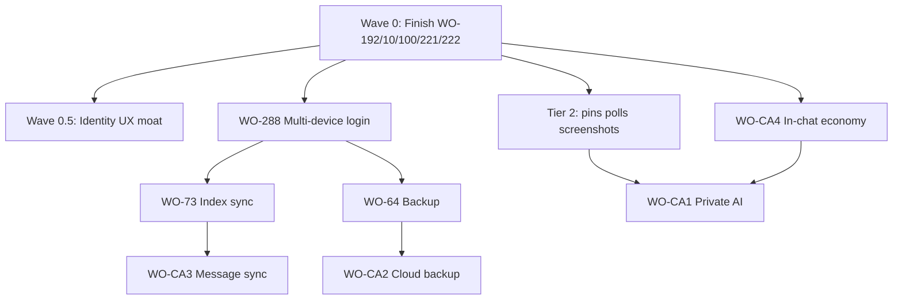

# Competitive Audit — Implementation Plan

**Source:** [`COMPETITIVE_AUDIT_2026-05.md`](COMPETITIVE_AUDIT_2026-05.md)  
**Date:** 2026-05-26  
**Purpose:** Ordered execution plan for audit recommendations — launch-critical first, net-new Tier 1 after foundations, Tier 2 parity in between.

**How to use:** Work top-to-bottom within each wave. Do not start a wave until its **gates** pass. Track status in Software Factory when WO numbers are assigned (`WO-CA1`–`WO-CA4` are provisional).

---

## Executive summary

| Priority | Theme | Why first |
|----------|--------|-----------|
| **0** | Finish in-flight Phase 2/3 | Already started; blocks E2E and credibility vs competitors |
| **0.5** | **Defend** identity moat (UX, not rebuild) | Audit §3 — you're ahead on `did:key`; surface it before adding features |
| **1** | Multi-device + backup (Signal parity) | WO-CA3 + WO-CA2 — table-stakes for 2026; unlocks “phone-free + restore” story |
| **2** | Messaging parity quick wins | Pins, polls, screenshot alerts — small scope, visible in demos |
| **3** | In-chat economy (WO-CA4) | Telegram Stars analog; wallet exists; needs stable messaging + token flows |
| **4** | Privacy-preserving AI (WO-CA1) | Differentiator but heavy; depends Phase 7 bot framework + on-device ML decision |
| **5** | Platform bets | Mini-apps / super-app — after core retention features |

**Explicitly out of scope** (audit §5): ads, silent cloud AI on plaintext, Meta-style centralized identity.

---

## Current baseline (don't rebuild)

Already **ahead** of WhatsApp/Telegram/Signal/XChat on:

- `did:key` + Secure Enclave passkeys + metagraph `@username` (D1)
- E2E-by-design relay, no ads/tracking
- Metagraph integrity anchoring (D3/D4)
- BIP-39 recovery UI (WO-234 ✅)
- OIDC4VC backend + enrollment VC handlers (WO-100 backend ✅; iOS landed, E2E pending)
- OPRF-PSI backend + iOS client (WO-220/221 landed, live OPRF + two-device E2E pending)
- Phase 3 signals backend + iOS agent layer (WO-192/10; Xcode UI wiring in progress)

See [`PHASE2_GAP_AUDIT.md`](PHASE2_GAP_AUDIT.md) and [`TESTING.md`](TESTING.md) for verification.

---

## Wave 0 — Close in-flight work (gates everything else)

**Goal:** Ship what competitors already expect as “basic messenger” plus Phase 2 contact/credential paths.

| Order | Item | WOs | Gate / done when |
|-------|------|-----|------------------|
| 0.1 | Phase 3 messaging UI E2E | WO-192, WO-10 | Two-client typing, read receipts, reactions pass [`TESTING.md`](TESTING.md) §5.4 |
| 0.2 | OIDC4VC wallet enrollment E2E | WO-100 | Simulator + device: start/finish VC flow; `OIDC4VC_ENABLED=true` |
| 0.3 | PSI contact discovery E2E | WO-220, WO-221 | Live `EchoOPRF.xcframework`; two devices, shared contact match |
| 0.4 | Username / QR / invite discovery | WO-222 | `echo://invite` deep link; search + QR exchange documented in E2E |
| 0.5 | Contact use-cases + privacy UI | WO-39, WO-228 | PSI + QR + invite + username search wired; consolidated privacy/deletion screen |
| 0.6 | Phase 2 stub closure (parallel) | WO-199, WO-203, WO-118 | Enrollment IDV/mDL real or scoped out; universal onboarding orchestrator MVP |

**Estimated effort:** 4–8 weeks (mostly iOS + E2E), assuming backend PSI/OIDC4VC already green.

**Do not start WO-CA*** until Wave 0.1–0.3 are at least **E2E-validated** — otherwise competitive features sit on broken core flows.

---

## Wave 0.5 — Defend the moat (high ROI, low build)

**Goal:** Make identity advantage **visible** — competitors are only now adding usernames and passkeys.

| Order | Deliverable | Type | Notes |
|-------|-------------|------|-------|
| 0.5.1 | Identity card / “Your DID” in profile | iOS UX | Show `@username`, truncated `did:key`, trust tier, “no phone required” |
| 0.5.2 | Onboarding copy + privacy receipt | UX/copy | Highlight self-sovereign ID vs Meta/X account |
| 0.5.3 | QR identity share | iOS | Extend `QRIdentityView` — primary growth loop vs phone discovery |
| 0.5.4 | Integrity explainer (optional) | UX | Link to metagraph anchor / “verified thread” — don't oversell chain |

**No new backend.** Reuse WO-222, trust tier APIs, existing Glacial components.

---

## Wave 1 — Signal parity: multi-device + secure backup (Tier 1)

Audit Tier 1 items **B** and **C** — highest competitive pressure after basic messaging.

### 1A — Multi-device foundation (before message sync)

| Order | WO | Title | Depends on | Deliverable |
|-------|-----|-------|------------|-------------|
| 1.1 | **WO-288** | New-device QR + recovery phrase login | WO-234 ✅, `/identity/devices` | E2E: old device signs new device; phrase path registers controller key |
| 1.2 | **WO-273** (hardening) | Multi-device controller on metagraph | Identity L0/L1 | Device list, revoke, controller-signed adds — verified in E2E |

### 1B — Message sync (WO-CA3)

| Order | WO | Title | Depends on | Deliverable |
|-------|-----|-------|------------|-------------|
| 1.3 | **WO-73** | Cross-device **search index** sync (encrypted) | 1.1 | Encrypted index blob per device; no plaintext metadata on server |
| 1.4 | **WO-CA3** | **did:key-scoped message history sync** | 1.1, 1.3, relay | Ciphertext bundles re-encrypted per device key; controller DID scopes sync namespace |

**Architecture notes:**

- Server stores **only** encrypted blobs (reuse relay/offline queue patterns; extend for sync cursor / device epoch).
- Each device has a device key in the controller document; sync payloads wrapped with pairwise ECDH or per-device keys from controller.
- Conflict policy: last-write-wins on metadata; message merge by idempotency keys.

**Done when:** User adds iPad after iPhone; full thread history appears after unlock; no plaintext in server logs; revoke device stops new sync.

### 1C — Secure encrypted backups (WO-CA2)

| Order | WO | Title | Depends on | Deliverable |
|-------|-----|-------|------------|-------------|
| 1.5 | **WO-64** | Secure backup system (encrypted archive) | BIP-39 ✅, storage encryption WO-224 | Export/import encrypted package; local restore |
| 1.6 | **WO-CA2** | Consumer cloud backup (Signal model) | WO-64, IPFS/S3 (D3), 1.5 | User-held phrase encrypts backup; optional cloud tier; cross-platform restore |

**Done when:** Restore on fresh install from cloud backup + 24 words; server operators cannot decrypt backup blob.

**Wave 1 total estimate:** 8–14 weeks backend + iOS (CA3 is the long pole).

---

## Wave 2 — Messaging parity quick wins (Tier 2)

Ship after Wave 0.1 (signals) or in parallel with Wave 1 if staffed separately.

| Order | Feature | WO / note | Effort | Competitive match |
|-------|---------|-----------|--------|-------------------|
| 2.1 | **Pinned messages** | WO-59 (partial UI: `PinnedSectionView`) | S | Signal 2026 |
| 2.2 | **Polls** | WO-23 | M | Signal, WhatsApp, channels |
| 2.3 | **Screenshot notifications** | Setting exists (`screenshotNotifications`); wire + WS notify | S | XChat |
| 2.4 | **Member labels** | New (Tier 2) | S | Signal 2026 |
| 2.5 | **On-device translation** | Tier 2; Apple Translation / local model | M | WhatsApp Meta AI (but **on-device** — audit differentiator) |
| 2.6 | **Local thread summaries** | Precursor to WO-CA1; on-device only | M | Grok/Meta summaries without cloud plaintext |
| 2.7 | **Collectible / sticker gifts** | Token-adjacent; optional before CA4 | M | Telegram |

**Recommended sequence:** 2.1 → 2.3 → 2.2 → 2.5 → 2.6 (2.5/2.6 feed CA1 without server AI).

---

## Wave 3 — In-chat ECHO economy (WO-CA4, Tier 1)

**After:** Wallet flows stable, messaging + identity E2E green (Wave 0), optional Wave 2.1–2.2 for demo richness.

| Order | WO | Scope | Notes |
|-------|-----|-------|-------|
| 3.1 | **WO-CA4** (backend) | Tip/gift/paid-unlock APIs | On-chain via existing tokenomics; no custodial “Stars” balance |
| 3.2 | **WO-CA4** (iOS) | In-chat tip sheet, gift animation, paid post unlock | Reuse `StakingDetailView` / wallet tab patterns |
| 3.3 | Compliance | App Store IAP vs crypto policy | Paid **digital content** may need legal/product review |

**Differentiator vs Telegram:** decentralized settlement, user-owned wallet, no platform cut on chain (product decision).

**Estimate:** 6–10 weeks.

---

## Wave 4 — Privacy-preserving AI (WO-CA1, Tier 1)

**Last among Tier 1** — largest dependency surface.

| Prerequisite | Status |
|--------------|--------|
| Decentralized Bot Framework (Phase 7) | Not started |
| On-device model runtime (Core ML / llama.cpp / Apple Intelligence API) | **Decision required** |
| Optional: confidential compute / ZK path for server assist | Phase 5+ (WO-212, WO-235/236) |

| Order | Milestone | Scope |
|-------|-----------|-------|
| 4.1 | **Policy + UX** | Per-message consent; “never leave device” default; audit log of AI invocations |
| 4.2 | **On-device v1** | Smart replies, thread summary, translation (extend Wave 2.5/2.6) |
| 4.3 | **WO-CA1 server assist (optional)** | Only with ZK/confidential-compute gate; zero retention contract |
| 4.4 | **Bot Framework hook** | Sandboxed bots; no plaintext exfiltration |

**Anti-pattern guard:** Do **not** ship Grok-style “helpful AI” that reads message plaintext on server.

**Estimate:** 12+ weeks after Bot Framework MVP.

---

## Wave 5 — Platform bets (Tier 3)

| Item | When | Notes |
|------|------|-------|
| Mini-app / bot platform (Telegram-scale) | Post Wave 3–4 | Verifiable, sandboxed, privacy-respecting apps on Bot Framework |
| Super-app surface (messaging + wallet + identity) | Post CA4 | UX shell, not new protocol |

---

## Dependency graph (simplified)

---

## Suggested sprint mapping (next 90 days)

| Sprint block | Focus | Outcome |
|--------------|-------|---------|
| **Now → +3 weeks** | Wave 0.1–0.3 E2E | TestFlight-ready messaging + VC + PSI |
| **+3 → +6 weeks** | Wave 0.4–0.5 + 2.1–2.3 | Discovery loops + identity showcase + pins/screenshots |
| **+6 → +12 weeks** | Wave 1A–1B (288 + CA3 MVP) | Two-device history sync beta |
| **+12 → +16 weeks** | Wave 1C (64 + CA2) | Signal-class backup story |
| **Parallel (staff permitting)** | WO-23 polls, WO-228 privacy | Parity checklist |
| **H2** | CA4 → CA1 → Tier 3 | Differentiation + platform |

Adjust if Phase 1 TestFlight date (`PHASE1_LAUNCH.md`) slips — Wave 0 always wins.

---

## Software Factory actions

1. Assign formal WO numbers to **WO-CA1**–**WO-CA4** (phase docs already stubbed).
2. Mark **WO-100**, **WO-221** `in_review` after E2E per [`TESTING.md`](TESTING.md).
3. Create or prioritize **WO-288** if not already active — blocks CA3.
4. Link child WOs: CA3 → WO-73; CA2 → WO-64; CA1 → Bot Framework epic.

---

## Success metrics (competitive lens)

| Metric | Target |
|--------|--------|
| Time-to-first-message (new user) | ≤ competitor median; highlight no phone step |
| Multi-device restore | Second device usable < 5 min after QR |
| Backup restore | Full history restore without support ticket |
| AI privacy | Zero default cloud plaintext; opt-in rate tracked |
| Retention hook | In-chat tip/gift used in ≥ X% of active wallets (post CA4) |

---

## Related docs

- [`COMPETITIVE_AUDIT_2026-05.md`](COMPETITIVE_AUDIT_2026-05.md) — source analysis
- [`PHASE2_GAP_AUDIT.md`](PHASE2_GAP_AUDIT.md) — Phase 2 truth table
- [`TESTING.md`](TESTING.md) — E2E gates per wave
- [`phase-3-work-orders.md`](phase-3-work-orders.md) — WO-CA3 stub
- [`phase-5-work-orders.md`](phase-5-work-orders.md) — WO-CA2 stub
- [`phase-7-work-orders.md`](phase-7-work-orders.md) — WO-CA1 / WO-CA4 stubs
