# Echo - Blueprints

## Table of Contents

### Foundation
- [Backend](#backend)
- [Frontend](#frontend)
- [Data Layer](#data-layer)
- [Secure Enclave Key Management](#secure-enclave-key-management)
- [Privacy Architecture and Secure Data Handling](#privacy-architecture-and-secure-data-handling)
- [ECHO Token Economics and Founder Allocation](#echo-token-economics-and-founder-allocation)
- [Privacy-Preserving Contact Discovery](#privacy-preserving-contact-discovery)
- [ECHO Comply — Enterprise Compliance Messaging](#echo-comply-enterprise-compliance-messaging)
- [ECHO Protocol Foundation and Corporate Structure](#echo-protocol-foundation-and-corporate-structure)
- [Portable Social Graph and Protocol Layer](#portable-social-graph-and-protocol-layer)
- [Post-Quantum Cryptography Mode](#post-quantum-cryptography-mode)
- [Privacy Commons Treasury](#privacy-commons-treasury)
- [Data Sovereignty Layer](#data-sovereignty-layer)

### Feature
- [Decentralized Identity and Authentication](#decentralized-identity-and-authentication)
- [Blockchain-Anchored Messaging with Provable Integrity](#blockchain-anchored-messaging-with-provable-integrity)
- [Dynamic Trust Network and Social Verification](#dynamic-trust-network-and-social-verification)
- [Voice and Video Calls with Screen Sharing](#voice-and-video-calls-with-screen-sharing)
- [Large File Sharing and Cloud Storage Integration](#large-file-sharing-and-cloud-storage-integration)
- [Message Reactions, Polls, and Interactive Elements](#message-reactions-polls-and-interactive-elements)
- [Advanced Message Search and Archive System](#advanced-message-search-and-archive-system)
- [Hidden Folders with Biometric Protection](#hidden-folders-with-biometric-protection)
- [Silent and Scheduled Private Chats](#silent-and-scheduled-private-chats)
- [Disappearing Messages with Cryptographic Verification](#disappearing-messages-with-cryptographic-verification)
- [Public and Private Groups with Verified Status Display](#public-and-private-groups-with-verified-status-display)
- [Multiple Personas with Selective Visibility](#multiple-personas-with-selective-visibility)
- [Broadcast Channels and Community Features](#broadcast-channels-and-community-features)
- [Enterprise Organization Profiles with Verified Status](#enterprise-organization-profiles-with-verified-status)
- [Verified Financial Institution Integration](#verified-financial-institution-integration)
- [User Rewards Tracker on Profile](#user-rewards-tracker-on-profile)
- [Streamlined Onboarding with Verifiable Credentials and Passkeys](#streamlined-onboarding-with-verifiable-credentials-and-passkeys)
- [In-App High-Assurance Identity Verification and Reward](#in-app-high-assurance-identity-verification-and-reward)
- [Decentralized Bot Framework and Automation](#decentralized-bot-framework-and-automation)
- [Platform Roadmap and Future Vision](#platform-roadmap-and-future-vision)
- [Universal Onboarding and Identity Creation](#universal-onboarding-and-identity-creation)
- [Privacy Architecture and Secure Data Handling](#privacy-architecture-and-secure-data-handling)
  - [Secure Enclave Key Management](#secure-enclave-key-management)
  - [End-to-End Message Encryption and Commitment](#end-to-end-message-encryption-and-commitment)
  - [Privacy-Preserving Blockchain Data Model](#privacy-preserving-blockchain-data-model)
  - [Zero-Knowledge Proofs and Midnight Integration](#zero-knowledge-proofs-and-midnight-integration)
- [ECHO Tokenomics, Founder Allocation, and Token Launch](#echo-tokenomics-founder-allocation-and-token-launch)
- [Production Launch, Infrastructure, and Deployment](#production-launch-infrastructure-and-deployment)
- [ECHO Comply — Enterprise Compliance Messaging](#echo-comply-enterprise-compliance-messaging)
  - [ECHO Comply — Healthcare (HIPAA)](#echo-comply-healthcare-hipaa)
  - [ECHO Comply — Local Government (FOIA)](#echo-comply-local-government-foia)
  - [ECHO Comply — Law Firms (Chain-of-Custody)](#echo-comply-law-firms-chain-of-custody)
- [ECHO Protocol Foundation and Corporate Structure](#echo-protocol-foundation-and-corporate-structure)
- [Portable Social Graph and Protocol Layer](#portable-social-graph-and-protocol-layer)
- [Post-Quantum Cryptography Mode](#post-quantum-cryptography-mode)
- [Privacy Commons Treasury](#privacy-commons-treasury)
- [Data Sovereignty Layer](#data-sovereignty-layer)

---

# Foundation

## Backend

The backend is implemented as a **stateless operational coordinator** and **content-blind message relay** built in Go. It sits between iOS clients and on-chain state, but is not an authority—it cannot read message content, does not own user identities, and does not control token balances. The backend's role is to coordinate operations, relay encrypted messages, enforce compliance policies, cache chain state, and validate submissions before forwarding to blockchain layers.

The backend serves two distinct product tracks sharing one infrastructure: **ECHO Comply** (enterprise B2B — healthcare HIPAA, local government FOIA, law firm chain-of-custody), which requires retention policy enforcement, litigation hold management, and court-admissible eDiscovery export; and **ECHO Message** (consumer — privacy-first messaging with portable identity), which requires low-latency relay and token operations. Both tracks share the same relay infrastructure, metagraph integration, and Constellation Identity Metagraph layer. They differ only in the compliance policy layer applied by the Comply Service.

## Architecture Philosophy

| Function | Authoritative Source | Backend Role |
| --- | --- | --- |
| Token balances | Metagraph Currency L1 | Read-through cache (TTL: 5s) |
| Trust scores | Constellation Identity Metagraph (trust tier commitment) | Compute engine + cache (TTL: 60s) |
| Message content | Device-local (E2E encrypted) | Relay only (queues ciphertext for offline) |
| Message integrity | Metagraph Data L1 (Merkle root) | Batch aggregator before submission |
| User identity | Constellation Identity Metagraph (did:key) | Cache + credential proof validator |
| Reward eligibility | Metagraph Data L1 validators | Pre-validator (reject obviously invalid) |

**3-Tier Architecture:**

```plaintext
Layer 1: iOS Clients (Swift, Secure Enclave, E2E encryption)
         ↓ WebSocket (real-time relay) + REST (operations)
Layer 2: Go Backend (Stateless relay + operational services)
         ↓ Metagraph APIs + submission pipelines
Layer 3: Constellation Identity Metagraph | Data L1 | Currency L1 | IPFS/Storj
```

## Technology Stack

* **Language & Framework**: Go with REST APIs and WebSocket for real-time messaging
* **Message Encryption**: End-to-end encryption on devices (Secure Enclave). Backend handles opaque encrypted blobs only
* **Caching**: Redis for hot data (balances, trust tiers, credentials) with TTL-based invalidation
* **Persistence**: PostgreSQL for operational data and offline message queues
* **Event Bus**: NATS for cross-service pub/sub and group message fan-out
* **Real-time Transport**: WebSocket (WSS) for message relay with sticky load balancing
* **Push Notifications**: APNs integration for offline message delivery alerts
* **Logging & Monitoring**: Batched, encrypted logs stored in decentralized storage (IPFS/Storj) with monthly key rotation
* **API Versioning**: Support multiple API versions (e.g., `/v1/`, `/v2/`) for backward compatibility
* **Transport Security**: TLS 1.3+ for all data in transit with certificate pinning

## Service Architecture

The backend consists of 10 independent microservices, each handling a specific domain:

| Service | Port | Role | Downstream Dependencies |
| --- | --- | --- | --- |
| **Gateway** | 8000 | Load balancer, TLS termination, rate limiting | All services |
| **Identity Service** | 8001 | Registration, did:key management, VC caching, trust tier coordination | Constellation Identity Metagraph, Redis |
| **Message Relay** | 8002 | WebSocket relay, offline queue, APNs push | Redis, PostgreSQL, NATS |
| **Trust Service** | 8003 | Trust score computation, tier caching | Constellation Identity Metagraph, Redis |
| **Rewards Service** | 8004 | Reward validation (auto-scaling rate, annual emission enforcement), batching, submission — **Phase 3+ conditional on token genesis** | Metagraph Currency L1, Redis |
| **Contacts Service** | 8005 | Contact list, block list, search, privacy-preserving contact discovery (OPRF-based PSI — IETF RFC 9497) | PostgreSQL, Redis |
| **Metagraph Gateway** | 8006 | L1/L0 submission, snapshot listening, anchoring, compliance anchor submission (ECHO Comply) | Metagraph nodes |
| **Notification Service** | 8007 | APNs push, in-app notifications | APNs, Redis |
| **Media Service** | 8008 | Encrypted media upload/download, Digital Evidence fingerprinting (ECHO Comply Org tier) | Storj/S3, Redis, Digital Evidence API |
| **Log Publisher** | 8009 | Batch encryption, IPFS submission, CID indexing | IPFS/Storj, Metagraph Data L1 |
| **Comply Service** | 8010 | Retention policy management, litigation hold enforcement, eDiscovery export, HIPAA/FOIA/chain-of-custody compliance, compliance dashboard API (ECHO Comply product) | PostgreSQL, Metagraph Data L1, Digital Evidence API |

## Core Responsibilities

**Message Relay (Content-Blind)**: The relay service transports end-to-end encrypted message blobs between clients without the ability to read, decrypt, or modify content. For online recipients, messages are delivered via WebSocket. For offline recipients, encrypted blobs are queued in Redis/PostgreSQL and delivered when the recipient reconnects. Push notifications alert offline users without exposing message content.

**Data Validation**: The backend pre-validates requests before submission to reduce unnecessary blockchain transactions. However, the metagraph L1 layers perform final authoritative validation. The backend can reject obviously invalid data but cannot override on-chain validation rules.

**Authentication Coordination**: The backend coordinates with the Constellation Identity Metagraph to verify user credentials and manage trust levels. It caches did:key resolution results and trust tier VCs with TTL-based invalidation (60s). The backend validates passkey signatures but does not store private keys. Note: `did:key` DIDs embed the public key directly in the DID identifier — no chain lookup is needed to verify a signature against a did:key DID.

**Metagraph Integration**: The backend submits validated transactions to the Constellation metagraph using Tessellation v3 transaction primitives (TokenLock, StakeDelegation, AtomicAction, FeeTransaction). It uses owned nodes for critical write operations and third-party APIs for read operations. Circuit breakers per chain isolate failures—if the metagraph is down, message relay continues with cached state.

**Message Integrity Anchoring**: The backend batches message commitment hashes into Merkle trees every 5 minutes (or 1000 messages, whichever comes first) and submits the Merkle root to the Data L1 layer. This proves message integrity on-chain without exposing encrypted content. Clients can later request Merkle proofs to verify their messages were anchored.

**Rate Limiting & Throttling**: Implements tiered per-DID API rate limiting with base users limited to 100 requests/minute and VIP users (subscription: $9.99/month) receiving 2x-10x increases based on app scaling. Note: API rate limiting is for abuse prevention only — it does not cap token rewards. Reward distribution uses an auto-scaling model with no per-user daily caps (see Rewards Service).

**Logging & Monitoring**: Batches operational events (no PII, no message content) into encrypted logs with monthly rotating AES-256-GCM keys. Logs are pushed to IPFS/Storj every 5 minutes with the CID recorded on the Data L1 for auditability.

## API Design Principles

* All endpoints require authentication via passkey verification (ECDSA P-256 signature)
* Backend validates signatures but never stores private keys (keys remain in Secure Enclave)
* Responses include structured error codes for client-side handling
* CORS policy is strict, allowing requests only from verified iOS app origins
* Message content is never exposed to backend—only opaque encrypted blobs
* Metadata is minimized to what's necessary for routing (sender DID, recipient DIDs, timestamps)

## Authentication Endpoints

The Identity Service (port 8001) provides authentication endpoints:

**Registration & DID Creation**: When a user creates an account, the iOS app generates a P-256 key pair in the Secure Enclave. The DID is computed locally as `did:key:z6Mk...` (W3C standard — no blockchain transaction required for DID creation itself). The backend then submits an initial trust tier VC issuance request to the Constellation Identity Metagraph, which anchors the user's trust tier commitment and issues a base-level credential. The public key is sent to the backend; the private key never leaves the device.

**Passkey Verification**: All API requests include an ECDSA signature over the request payload. The backend verifies the signature directly from the `did:key` identifier — the public key is embedded in the DID itself, requiring no chain lookup. Failed signature checks result in HTTP 401.

**Credential Caching**: The backend caches trust tier VCs and trust level information from the Constellation Identity Metagraph with a 60-second TTL. This avoids per-request metagraph queries while maintaining reasonable freshness for access control decisions.

**Third-Party Verification Coordination**: For identity verification providers (Prove, Daon, 1Kosmos, Darwinium), the backend coordinates the verification flow and submits successful verifications as trust tier upgrade requests to the Constellation Identity Metagraph. The backend acts as an orchestrator but does not store verification results — they live on-chain as W3C VC 2.0 credentials anchored to the Identity Metagraph.

## Contact Discovery Endpoints

The Contacts Service (port 8005) provides privacy-preserving contact discovery:

**Phone Number Matching (Opt-In — OPRF-PSI)**: Contact discovery uses an Oblivious PRF (OPRF) based Private Set Intersection protocol (IETF RFC 9497). The client blinds each phone number hash before sending to the server; the server applies its OPRF key and returns the blinded results. The client unblinds and compares against the server's registered-user OPRF set — computing the intersection without the server ever seeing which numbers were queried or which matched. Rate limited to 1 discovery request per 24 hours per DID. See the **Privacy-Preserving Contact Discovery** foundation blueprint for the full protocol detail.

**QR Code Exchange**: Users generate a QR code containing their DID and public key. Scanning creates a mutual contact connection with zero server involvement for the QR generation itself. The backend records the connection for message routing purposes only.

**Username Search**: Users who create a public handle (optional) can be discovered via `GET /contacts/search?handle={username}`. Returns DID, display name, trust tier badge, and verification status. Handles are not linked to real names on-chain.

**Invite Links**: Users generate unique referral links via `POST /contacts/invite`. The backend tracks the referral chain (max 3 tiers) for the 50 ECHO referral reward, triggered when the new user completes DID verification and sends their first 100 messages.

**Contact Discovery Registry**: The server-side OPRF registry stores each registered user's phone number evaluated under the server's OPRF key (`H(phone) × k_server`). Raw phone numbers and raw hashes are never stored. Because the server applies its key to the client's blinded values and never receives unblinded hashes, even a complete server breach reveals no usable phone numbers — only OPRF-evaluated values that cannot be reversed without `k_server`. The registry is NOT stored on any public blockchain.

## Enterprise Fraud Prevention Endpoints

The Identity Service (port 8001) extends to support Organization-tier enterprise fraud prevention:

**Transaction Verification Alerts**: Banks send cryptographically signed transaction alerts through ECHO's verified channel via `POST /enterprise/fraud/alert`. The alert includes the bank's verified institutional DID signature, transaction details (amount, merchant, timestamp), and a unique verification request ID. The customer receives the alert with the bank's verification badge and responds with a DID-signed confirmation or fraud report via `POST /enterprise/fraud/confirm`, creating a court-admissible authorization record.

**Fraud Analytics Dashboard**: Organization-tier customers access fraud analytics via `GET /enterprise/fraud/dashboard`. Metrics include: fraud attempt volume (phishing attempts blocked vs. SMS baseline), customer response times to fraud alerts, verification adoption rate, and ROI calculator (cost savings vs. SMS fraud losses). Dashboard data is computed from on-chain Digital Evidence records and relay metadata — no PII.

**Cross-Organization Fraud Intelligence (Phase 5+)**: Participating institutions query fraud patterns via `GET /enterprise/fraud/intelligence` using zero-knowledge proofs through the Midnight integration. Queries like "has DID xyz been flagged by 3+ institutions in 30 days" return a boolean result without revealing which institutions flagged it or the specific fraud type. This leverages ECHO's Midnight ZK infrastructure for privacy-preserving inter-institutional data sharing.

## Comply Service Architecture (Port 8010)

The Comply Service is a dedicated microservice that owns all organizational identity and compliance concepts. It communicates with the Identity Service via gRPC. The service is organized around seven distinct domain packages, each focused enough that the entire package can be read in one sitting:

```plaintext
services/comply/
├── internal/
│   ├── organization/   # Org lifecycle: create, suspend, terminate + async DID minting
│   ├── baa/            # BAA execution: JWS verification, PDF generation, purge lifecycle
│   ├── membership/     # Member lifecycle: invite, accept, revoke + invitation tokens
│   ├── credential/     # VC issuance + StatusList2021 bit-vector management + Cardano publication
│   │   └── status_list/  # 5-minute batch publish loop, advisory-lock bit allocation
│   ├── seats/          # Seat-cutoff enforcement + Enterprise grace period + Stripe webhook sync
│   ├── sso/            # SAML/OIDC/SCIM config management, test round-trip, cert expiry alerts
│   └── invitation/     # Pre-check service (new vs existing user) + acceptance orchestration
```

### Key Architectural Decisions

**\1. Org DID is a peer identity, not a sub-resource of the admin's DID.** When an admin signs up for ECHO Comply, two distinct DIDs exist: the admin's personal `did:key` (derived from their Secure Enclave key pair) and the organization's `did:key` (derived from an org-specific key pair managed by the platform KMS). The organization's DID signs credentials independently and persists across admin turnover. The relationship between them is expressed as a Verifiable Credential (the admin holds an `Owner-role` credential issued by the org DID), not as a parent-child DID hierarchy.

**\2. VC revocation uses W3C StatusList2021 published to the Constellation Identity Metagraph — not a centralized revocation REST endpoin**t. A centralized revocation endpoint is a privacy leak: every credential verification call reveals "this user's credential is being checked right now," which in aggregate exposes usage patterns and violates HIPAA behavioral data protections. StatusList2021 is a publicly-published bit vector where verifiers fetch the entire list and check the relevant bit locally — a check is indistinguishable from any other download.

**\3. BAA acceptance is a cryptographically-signed JWS artifact, not a checkbox log entry.** The admin's Secure Enclave key signs a structured assertion (org name, BAA version, SHA-256 document hash, timestamp, nonce). Because the signer uses `did:key`, the public key is directly embedded in the DID identifier — no chain lookup is required to verify the signature. This assertion is verifiable against the admin's did:key indefinitely, even if the admin disputes having signed it.

### Organization Creation: 3-Phase Flow

Org creation is split into three phases to avoid blocking the signup UX on Cardano confirmation latency (20–60 seconds):

```plaintext
Phase 1 (synchronous, ~100ms):
  INSERT organizations (org_did = NULL until VC registration completes)
  INSERT baa_signatures (JWS-signed acceptance assertion)
  INSERT memberships (admin as Owner, current_credential_id = NULL)
  INSERT status_lists (empty 16KB bit vector, list_index=0)
  → Return CreateOrgOutput immediately

Phase 2 (async, 5–15s):
  Worker: derive org did:key from KMS-managed org keypair (no chain tx required)
  Worker: register org VC on Constellation Identity Metagraph
  Worker: UPDATE organizations SET org_did = 'did:key:...'
  Worker: emit OrganizationProvisioned event

Phase 3 (async, follows Phase 2):
  Issue Owner credential for admin's membership
  Allocate StatusList bit, sign VC with org's Ed25519 key
  Publish initial StatusList to Identity Metagraph
  iOS app polls for credential availability (appears within 15–30s of Pay click)
```

### Database Schema (7 New Tables)

```sql
-- organizations: org lifecycle + seat enforcement + billing
CREATE TABLE organizations (
    id UUID PRIMARY KEY,
    org_did TEXT UNIQUE,                            -- NULL until async mint completes
    legal_name TEXT NOT NULL,                       -- appears on BAA
    display_name TEXT NOT NULL,                     -- appears in iOS context switcher
    primary_color TEXT NOT NULL DEFAULT '#4F46E5',  -- hex, embedded in VC display metadata
    logo_url TEXT,                                  -- CDN URL, embedded in VC
    tier TEXT NOT NULL CHECK (tier IN ('starter', 'professional', 'enterprise')),
    seat_count_paid INTEGER NOT NULL DEFAULT 10,
    seat_count_used INTEGER NOT NULL DEFAULT 0,     -- Admin + Member count, not Guest
    status TEXT NOT NULL CHECK (status IN ('active', 'enterprise_grace', 'suspended', 'terminated')),
    enterprise_grace_started_at TIMESTAMPTZ,        -- set when status = 'enterprise_grace'
    enterprise_grace_expires_at TIMESTAMPTZ,        -- 30 days after grace start
    domain TEXT,                                    -- DNS-verified org domain
    domain_verified_at TIMESTAMPTZ,
    stripe_customer_id TEXT,
    stripe_subscription_id TEXT,
    created_at TIMESTAMPTZ NOT NULL DEFAULT NOW(),
    created_by_did TEXT NOT NULL,
    terminated_at TIMESTAMPTZ
);

-- baa_signatures: append-only audit log of BAA acceptance events
CREATE TABLE baa_signatures (
    id UUID PRIMARY KEY,
    organization_id UUID NOT NULL REFERENCES organizations(id),
    signer_did TEXT NOT NULL,
    signer_legal_name TEXT NOT NULL,
    signer_role TEXT NOT NULL,                      -- "Compliance Officer", "IT Director"
    baa_version TEXT NOT NULL,                      -- "v1.2" → versioned template
    baa_document_hash TEXT NOT NULL,                -- SHA-256 of the signed PDF
    signed_assertion TEXT NOT NULL,                 -- JWS: signed by signer_did's Secure Enclave key
    pdf_storage_url TEXT NOT NULL,
    signed_at TIMESTAMPTZ NOT NULL DEFAULT NOW(),
    superseded_at TIMESTAMPTZ,
    return_or_destroy_window_ends_at TIMESTAMPTZ,   -- 30 days after cancellation
    purge_completed_at TIMESTAMPTZ,
    purge_attestation_hash TEXT                     -- SHA-256 of destruction attestation
);

-- memberships: one row per (user, organization) pair
CREATE TABLE memberships (
    id UUID PRIMARY KEY,
    organization_id UUID NOT NULL REFERENCES organizations(id),
    user_did TEXT NOT NULL,
    role TEXT NOT NULL CHECK (role IN ('admin', 'member', 'guest')),
    org_scoped_display_name TEXT NOT NULL,          -- user's work name, may differ from personal name
    org_scoped_email TEXT NOT NULL,
    department TEXT,
    employee_id TEXT,
    current_credential_id UUID,                     -- references credentials.id, NULL during issuance
    invited_by_did TEXT NOT NULL,
    invited_at TIMESTAMPTZ NOT NULL DEFAULT NOW(),
    accepted_at TIMESTAMPTZ,
    revoked_at TIMESTAMPTZ,
    revoked_by_did TEXT,
    revocation_reason TEXT,                         -- 'employment_terminated', 'role_changed', etc.
    UNIQUE(organization_id, user_did)
);

-- credentials: VC issuance metadata (actual VC payload held on user's device)
CREATE TABLE credentials (
    id UUID PRIMARY KEY,
    organization_id UUID NOT NULL REFERENCES organizations(id),
    membership_id UUID NOT NULL REFERENCES memberships(id),
    credential_type TEXT NOT NULL,                  -- "EchoOrgRoleCredential"
    credential_version TEXT NOT NULL,
    revocation_index INTEGER NOT NULL,              -- bit position in StatusList2021
    revocation_status SMALLINT NOT NULL DEFAULT 0, -- 0=active, 1=revoked, 2=suspended
    issued_at TIMESTAMPTZ NOT NULL DEFAULT NOW(),
    expires_at TIMESTAMPTZ,                         -- NULL for Admin/Member; 90 days for Guest
    revoked_at TIMESTAMPTZ,
    payload_jws TEXT NOT NULL,                      -- signed VC as JWS
    payload_hash TEXT NOT NULL,                     -- SHA-256 for integrity
    UNIQUE(organization_id, revocation_index)
);

-- status_lists: StatusList2021 bit vectors (131,072 bits = 16KB per list)
CREATE TABLE status_lists (
    id UUID PRIMARY KEY,
    organization_id UUID NOT NULL REFERENCES organizations(id),
    list_index INTEGER NOT NULL,                    -- 0 for first, 1 for second, etc.
    bit_vector BYTEA NOT NULL,                      -- 16 KB, all zeros at creation
    capacity INTEGER NOT NULL DEFAULT 131072,
    next_available_bit INTEGER NOT NULL DEFAULT 0,  -- monotonically increasing, never reused
    last_published_at TIMESTAMPTZ,
    last_publication_tx_hash TEXT,                  -- Identity Metagraph tx hash
    pending_publication BOOLEAN NOT NULL DEFAULT FALSE,
    UNIQUE(organization_id, list_index)
);

-- sso_configs: per-org SAML/OIDC/SCIM config with KMS-encrypted secrets
CREATE TABLE sso_configs (
    id UUID PRIMARY KEY,
    organization_id UUID UNIQUE NOT NULL REFERENCES organizations(id),
    idp_type TEXT NOT NULL CHECK (idp_type IN ('saml', 'oidc', 'scim')),
    saml_entity_id TEXT,
    saml_sso_url TEXT,
    saml_certificate_encrypted BYTEA,               -- KMS-encrypted X.509
    oidc_issuer_url TEXT,
    oidc_client_id TEXT,
    oidc_client_secret_encrypted BYTEA,             -- KMS-encrypted
    scim_bearer_token_encrypted BYTEA,              -- KMS-encrypted; HIPAA violation if plaintext
    scim_enabled BOOLEAN NOT NULL DEFAULT FALSE,
    enforcement_mode TEXT NOT NULL DEFAULT 'optional'
        CHECK (enforcement_mode IN ('required', 'optional_for_guests', 'optional')),
    cert_expires_at TIMESTAMPTZ,                    -- 60-day warning alert
    last_test_status TEXT,                          -- 'success', 'failure', 'never_tested'
    configured_by_did TEXT NOT NULL
);

-- invitations: pending/completed invitation tokens (7-day expiry, append-only)
CREATE TABLE invitations (
    id UUID PRIMARY KEY,
    organization_id UUID NOT NULL REFERENCES organizations(id),
    invitation_token TEXT UNIQUE NOT NULL,          -- 32-byte cryptographically random base64url
    invited_email TEXT NOT NULL,
    invited_by_did TEXT NOT NULL,
    role TEXT NOT NULL CHECK (role IN ('admin', 'member', 'guest')),
    suggested_display_name TEXT,
    department TEXT,
    employee_id TEXT,
    custom_message TEXT,
    created_at TIMESTAMPTZ NOT NULL DEFAULT NOW(),
    expires_at TIMESTAMPTZ NOT NULL,                -- 7 days from creation
    accepted_at TIMESTAMPTZ,
    accepted_by_did TEXT,
    revoked_at TIMESTAMPTZ,
    revoked_by_did TEXT
);
```

### StatusList2021 Publication: 5-Minute Batching

The StatusList Manager runs a background goroutine that publishes pending bit vector changes to the **Constellation Identity Metagraph** every 5 minutes. Individual credential issuance and revocation update the in-memory bit vector immediately; the on-chain publication batches changes per organization. This design:

* Keeps revocation propagation within 5 minutes + metagraph snapshot finality (target P99 per AC-COMPLY-VC-003.4)
* Caps Identity Metagraph snapshot costs (absorbed by ECHO treasury DAG reserves — feeless for users)
* Uses PostgreSQL advisory locks on `(org_id, list_index)` to serialize concurrent bit allocation — prevents two concurrent credential issuances from claiming the same bit position

Bits are **never reused** after revocation. `next_available_bit` is monotonically increasing. Reusing a revoked bit would produce a misleading audit trail and could briefly show a revoked credential as active during the publish cycle.

### Seat Enforcement and Enterprise Grace Period

```plaintext
Tier caps and triggers:
  Starter:            Hard cap at 10 seats. Invitations blocked past 10.
  Professional ≥50:   Sales notification (soft trigger, no block)
  Professional ≥200:  Enterprise eligibility notification (soft trigger)
  Professional ≥500:  → Enter enterprise_grace status (30-day window)
                       Full Professional access continues during grace
  Grace expires:      → Transition to suspended if no Enterprise contract signed
  
Daily reconciliation job:
  SELECT orgs WHERE status='enterprise_grace' AND enterprise_grace_expires_at < NOW()
  → SET status='suspended'
  → Notify admin

Stripe webhook sync:
  subscription.updated → UPDATE organizations SET seat_count_paid = new_quantity
  If seat_count_paid < seat_count_used: surface warning in admin console, do NOT auto-revoke
```

### BAA JWS Verification

The BAA acceptance from the iOS app is a JSON Web Signature (JWS) over a structured assertion: `{signer_did, org_name, baa_version, document_hash, signed_at, nonce}`. The backend verifies:

1. JWS signature is valid against the admin's DID public key — for `did:key` DIDs, the public key is directly embedded in the DID identifier itself, requiring no chain lookup (this is a simplification vs. the old Cardano approach)
2. `document_hash` matches the SHA-256 of the canonical BAA version we presented
3. `signed_at` is within 5 minutes (prevents replay attacks)
4. `signer_did` matches the authenticated admin's DID

The signed assertion is stored verbatim in `baa_signatures.signed_assertion`. If a customer disputes signing the BAA, we produce the JWS, prove the admin's did:key-bound Secure Enclave key signed it (proof of physical device participation), and prove the document hash matches the canonical BAA document. The did:key public key embedded in the DID is the cryptographic anchor — no chain dependency needed for future verification.

### Comply Service Endpoint Surface

```plaintext
# Organization lifecycle
POST   /v1/comply/organizations                              CreateOrg (phase 1)
GET    /v1/comply/organizations/{id}                         GetOrg
PATCH  /v1/comply/organizations/{id}                         UpdateOrg

# BAA lifecycle
POST   /v1/comply/organizations/{id}/baa                     SignBAA
GET    /v1/comply/organizations/{id}/baa/current             GetCurrentBAA
GET    /v1/comply/organizations/{id}/baa/{sigID}/pdf         DownloadBAAPDF

# Member management
POST   /v1/comply/organizations/{id}/members/invite          InviteMember
DELETE /v1/comply/invitations/{token}                        RevokeInvitation (pre-accept)
GET    /v1/comply/invitations/{token}/resolve                 PreCheck: user_status "new"|"existing"
POST   /v1/comply/invitations/{token}/accept                 AcceptInvitation → mints membership + VC
GET    /v1/comply/organizations/{id}/members                 ListMembers
POST   /v1/comply/organizations/{id}/members/{did}/revoke    RevokeMember → revokes VC
PATCH  /v1/comply/organizations/{id}/members/{did}           UpdateMemberRole → issues new VC

# Credentials
POST   /v1/comply/organizations/{id}/members/{did}/credential/refresh   RefreshCredential

# StatusList2021 — PUBLIC, unauthenticated (verifiers fetch without logging their identity)
GET    /v1/comply/organizations/{id}/status-list/{listIdx}   GetStatusList

# SSO configuration
PUT    /v1/comply/organizations/{id}/sso/saml                ConfigureSAML
PUT    /v1/comply/organizations/{id}/sso/oidc                ConfigureOIDC
PUT    /v1/comply/organizations/{id}/sso/scim                EnableSCIM
POST   /v1/comply/organizations/{id}/sso/test                TestSSOConnection
POST   /v1/comply/organizations/{id}/domain/verify           VerifyDomain
```

### Credential VC Expiry by Role

| Role | Expiry | Rationale |
| --- | --- | --- |
| Admin | None (no `expires_at`) | Long-term leadership accountability |
| Member | None (no `expires_at`) | Normal employment tenure |
| Guest | 90 days from acceptance | Temporary access, auto-revocation prevents stale credentials |

Guest credential expiry triggers a renewal reminder at 14 days before expiry. Expired guest credentials are automatically marked revoked in the StatusList on the next publication cycle.

## ZK Verification Endpoints (Phase 3+ — Implementation TBD)

The Trust Service (port 8003) will extend to coordinate zero-knowledge proof verification in Phase 3+. The implementation path — Constellation-native ZK circuits or Midnight (Cardano partner chain) — is under evaluation. Both options are being assessed before Phase 3 engineering begins.

**Trust Tier Verification**: `POST /zk/verify/trust-tier` accepts a ZK proof generated on-device demonstrating the user meets a minimum trust tier threshold. Public signals contain only the threshold and a boolean result — not the exact score. Used for governance eligibility checks and feature access gating.

**Age Verification**: `POST /zk/verify/age` accepts a ZK proof that the user's age exceeds a threshold (18 or 21) without revealing their actual birthdate. Used for age-gated financial institution features.

**Credential Validity**: `POST /zk/verify/credential` accepts a ZK proof that a credential is valid and issued by a trusted authority, without revealing credential content. Includes a verifier challenge nonce to prevent replay attacks.

**Balance Threshold**: `POST /zk/verify/balance` accepts a ZK proof that the user's ECHO token balance meets a minimum threshold for staking eligibility or VIP access, without revealing the exact balance.

All ZK proofs are generated on the user's iOS device — private inputs (birthdate, score, credential content, exact balance) never leave the device. The backend forwards proofs for on-chain verification and caches the boolean result with a configurable TTL. ZK contract implementation language depends on which infrastructure is chosen at Phase 3 evaluation.

## Metagraph Integration Patterns

The Metagraph Gateway service (port 8006) handles all interactions with Constellation infrastructure:

**Data L1 Submissions**: The backend submits application data to the Data L1 layer for consensus. Primary use case is anchoring Merkle roots for message integrity verification. Submissions use this structure:

```go
type DataL1Submission struct {
    Type            string    // "message_integrity" | "audit_log" | "compliance_retention" | "litigation_hold" | "digital_evidence_ref" | "ediscovery_checksum"
    MerkleRoot      []byte    // Root hash of Merkle tree (message_integrity)
    CommitmentCount int       // Number of messages in batch
    TimeRange       TimeRange // From/To timestamps
    SchemaVersion   int       // Current: 1

    // ECHO Comply compliance payload — nil for consumer message submissions
    OrgDID      string    // Organization's verified institutional DID
    PolicyID    string    // Retention policy ID
    PolicyType  string    // "permanent" | "time_limited" | "litigation_hold"
    ExpiryDate  time.Time // For time_limited policies
    MatterID    string    // Legal matter ID (litigation_hold type)
    HoldStatus  string    // "active" | "released"
    EventID     string    // Digital Evidence API event ID
    ContentHash string    // SHA-256 of fingerprinted content
    ExportID    string    // eDiscovery export identifier
}
```

**Currency L1 Submissions**: Token transactions use Tessellation v3 transaction primitives for Hypergraph interoperability:

```go
type CurrencyL1Transaction struct {
    Type            string
    TokenLock       *TokenLockData       // Lock ECHO for staking
    StakeDelegation *StakeDelegationData // Delegate to validator
    WithdrawLock    *WithdrawLockData    // Unstaking (14-day cooldown)
    AtomicBundle    *AtomicActionBundle  // Bundle multiple actions
    FeeTransaction  *FeeTransactionData  // Automated snapshot fee payment
    // Legacy types still supported:
    Claims          []RewardClaim
    Transfer        *TokenTransfer
}
```

**AtomicAction Bundles**: Multiple transactions can be bundled into all-or-nothing execution. Used for reward claims (verify tier + claim + update cap), staking tier changes, and governance operations.

**Snapshot Listening**: The backend subscribes to metagraph snapshot events. On each new snapshot, it invalidates caches and pushes confirmation events to clients via WebSocket. This ensures clients see finalized state within seconds of on-chain confirmation.

**Circuit Breakers**: Independent circuit breakers per downstream chain (Data L1, Currency L1, Cardano, IPFS). If a chain is unavailable, the circuit opens and the backend continues operating with cached state. Message relay never blocks on chain availability. Failed submissions queue for retry with exponential backoff.

**Error Handling**: Metagraph validation errors return structured error codes to clients. The backend distinguishes between retriable errors (network timeouts) and non-retriable errors (invalid transaction format) to avoid unnecessary retries.

## Encryption & Message Security

**End-to-End Encryption**: Message content is encrypted and decrypted exclusively on client devices using keys stored in the iOS Secure Enclave. The backend never has access to plaintext message content or encryption keys. Messages in transit through the backend are opaque encrypted blobs.

**Message Relay Flow**:

1. **Sender encrypts** message on-device using ephemeral X25519 key agreement with recipient's public key + ChaCha20-Poly1305 symmetric encryption (Kinnami)
2. **Sender signs** a commitment hash `H(H(plaintext) || nonce)` with their private key
3. **Backend receives** encrypted blob + commitment + signature (cannot read content)
4. **Backend validates** signature against sender's DID public key
5. **Backend relays** encrypted blob to recipient via WebSocket (if online) or queues (if offline)
6. **Recipient decrypts** on-device using their private key from Secure Enclave

**Offline Message Queue**: Encrypted blobs for offline recipients are stored in Redis (fast, in-memory) with PostgreSQL fallback (durable). Queue depth is limited to 1000 messages per recipient with retention: 30 days for 1:1 chats, 7 days for large groups (100+ members).

**Overflow Message Backup**: When a recipient's queue exceeds 1000 messages, overflow encrypted blobs are pinned to IPFS/Storj. The relay stores only the CID in the queue metadata. On reconnect, the relay provides CIDs for the recipient to retrieve overflow messages directly from IPFS. This prevents message loss during extended offline periods while maintaining the content-blind relay model — the backup is the same opaque E2E encrypted blob the relay would have queued.

**Commitment Anchoring**: The backend batches commitment hashes into Merkle trees and anchors the root on-chain every 5 minutes. This proves message integrity without exposing content. Clients can verify their messages were anchored by requesting Merkle proofs.

**Transport Security**: All client-backend communication uses TLS 1.3 with certificate pinning. WebSocket connections upgrade from HTTPS with strict same-origin policies. Push notifications never contain message content—only conversation IDs for wake-up signals.

**Backend Logging Keys**: Operational logs (no PII, no message content) are encrypted with AES-256-GCM using monthly rotating keys. Keys are managed by the platform and never shared with third parties. Encrypted logs are pushed to IPFS/Storj with CIDs recorded on-chain for auditability.

## Scaling & Reliability Architecture

**Stateless Pods**: All Go services are stateless and horizontally scalable. WebSocket connections are sticky to a pod via load balancer, but any pod can handle any REST request. This enables auto-scaling based on CPU, connection count, or relay latency metrics.

**Group Message Fan-Out**: When a group message arrives at Pod 1 but recipients are connected to Pods 2 and 3, NATS pub/sub distributes the encrypted blob to all pods for local delivery. This avoids cross-pod WebSocket proxying and reduces latency.

**Circuit Breakers Per Chain**: Independent circuit breakers for Data L1, Currency L1, Identity Metagraph, and IPFS. Thresholds: 5 failures for any metagraph or IPFS. Reset timeout: 30s for all metagraphs, 120s for IPFS. When a circuit opens, the backend serves from cache and queues submissions for retry. Message relay never blocks on metagraph availability — decentralized identity and integrity operations degrade gracefully to cached state.

**Auto-Scaling Triggers**: Kubernetes horizontal pod autoscaler monitors: CPU &gt; 70%, WebSocket connections &gt; 10K per pod, relay latency P99 &gt; 200ms. Pods scale from minimum 3 to maximum based on demand.

**Multi-Region & Multi-Cloud Deployment (Phase 4)**: Phase 1–3 deploys on AWS for speed. Phase 4 introduces multi-cloud relay infrastructure: primary relay nodes on AWS, secondary on DigitalOcean, tertiary on Hetzner. Community relay operators (Phase 4) MUST use non-AWS providers for cloud diversity. This prevents single-cloud dependency and strengthens ECHO's decentralization narrative for enterprise evaluators. Minimum 3 geographic regions for relay coverage. Redis and PostgreSQL use synchronous replication (primary + 2 replicas) to minimize data loss on failover. NATS cluster spans regions for event distribution redundancy.

## Frontend

# Frontend Architecture

## Overview

The frontend is a native iOS application built with SwiftUI and MVVM-C (Model-View-ViewModel-Coordinator) architecture. It serves two distinct product tracks from a single shared codebase: **ECHO Comply** (enterprise B2B — admin console for retention policies, litigation hold, and eDiscovery, used by healthcare, government, and legal organizations) and **ECHO Message** (consumer — private messaging, portable identity, and community ownership for privacy-conscious users). Both tracks share the same messaging core, encryption stack, and identity layer; the Comply admin features activate only for Organization-tier DIDs.

**Messaging model:** The app sends and receives E2E encrypted message blobs via a stateless WebSocket relay server. The relay cannot read, modify, or forge messages. All message content is encrypted on-device before transmission and decrypted on-device after receipt. The app verifies sender signatures and commitment hashes locally—no trust in the relay is required for content authenticity.

**Security model:** Private keys and passkeys live exclusively in the iOS Secure Enclave and are never extractable. All signing operations require biometric authentication (Face ID / Touch ID). Derived keys handle encryption for messaging (Curve25519), local storage (AES-256-GCM), and session encryption.

## Technology Stack

| Component | Technology | Purpose |
| --- | --- | --- |
| **UI Framework** | SwiftUI | Declarative UI |
| **Architecture** | MVVM-C | Separation of concerns |
| **Language** | Swift 5.9+ | Type safety, performance |
| **Concurrency** | Swift Concurrency (async/await) | Asynchronous operations |
| **Security** | CryptoKit, Security.framework | Encryption, Secure Enclave |
| **Networking** | URLSession, WebSocket | API & real-time relay |
| **Persistence** | SwiftData, Keychain | Local storage |
| **DI** | Factory pattern | Dependency injection |
| **E2E Encryption** | Kinnami (X25519 + ChaCha20-Poly1305) | Message encryption |
| **Identity Signing** | ECDSA P-256 (Secure Enclave) | DID signing, request signing |
| **ZK Proofs** | Phase 3+ TBD (Constellation-native ZK or Midnight — evaluation Phase 3) | Zero-knowledge credential verification |
| **Storage Encryption** | AES-256-GCM (HKDF-derived key) | Local data encryption |
| **Transport** | TLS 1.3+ with certificate pinning | Network security |
| **Push** | APNs | Offline message notifications |
| **Wallet SDK** | Stargazer SDK | Native Constellation L0 token wallet |
| **DEX Integration** | PacaSwap SDK (Phase 3+) | On-chain ECHO/DAG and ECHO/USDC swaps |
| **Bridge Integration** | Base & Ink bridges (Phase 3+) | Cross-chain token transfers |
| **Analytics** | Privacy-preserving (no PII) | Usage metrics |

## Encryption Specification (Canonical)

All iOS crypto operations follow this spec (shared with Backend and Data Layer blueprints):

| Purpose | Algorithm | Key Type | Library |
| --- | --- | --- | --- |
| Identity/DID signing | ECDSA P-256 | Secure Enclave hardware key | Security.framework |
| Message key agreement | X25519 ECDH | Ephemeral Curve25519 | CryptoKit |
| Message encryption | ChaCha20-Poly1305 | Derived symmetric (256-bit) | CryptoKit |
| Sealed sender envelope (Phase 3) | AES-256-GCM | Derived from recipient identity key | CryptoKit |
| Local storage encryption | AES-256-GCM | Derived from master key via HKDF | CryptoKit |
| Key derivation | HKDF-SHA256 | From Secure Enclave signature | CryptoKit |
| Hash commitments | SHA-256 | N/A | CryptoKit |
| Contact discovery hashing | Argon2id | Per-user salt (device-local) | Swift Argon2 |
| Post-quantum key agreement (Phase 3+ PQ Mode) | X25519 + Kyber-768 hybrid | Ephemeral hybrid key pair | CryptoKit + NIST PQC |
| Post-quantum signing (Phase 3+ PQ Mode) | Dilithium3 (CRYSTALS) | Long-term identity key | NIST PQC |
| Transport | TLS 1.3 | Certificate-based (pinned) | URLSession |

## Architecture Overview

```plaintext
┌───────────────────────────────────────────────────────┐
│              iOS Application Architecture              │
├───────────────────────────────────────────────────────┤
│                                                       │
│  ┌─────────────────────────────────────────────────┐ │
│  │            Presentation Layer                    │ │
│  │  ┌─────┐  ┌──────┐  ┌──────┐  ┌──────────────┐ │ │
│  │  │Views│  │VMs   │  │Coords│  │UI Components │ │ │
│  │  └─────┘  └──────┘  └──────┘  └──────────────┘ │ │
│  └─────────────────────────────────────────────────┘ │
│                        │                              │
│                        ▼                              │
│  ┌─────────────────────────────────────────────────┐ │
│  │            Domain Layer                          │ │
│  │  ┌─────────┐  ┌──────┐  ┌─────────────────────┐ │ │
│  │  │UseCases │  │Models│  │Group Key Manager    │ │ │
│  │  └─────────┘  └──────┘  └─────────────────────┘ │ │
│  └─────────────────────────────────────────────────┘ │
│                        │                              │
│                        ▼                              │
│  ┌─────────────────────────────────────────────────┐ │
│  │            Data Layer                            │ │
│  │  ┌─────┐  ┌────────┐  ┌──────┐  ┌────────────┐ │ │
│  │  │API  │  │WebSocket│  │Local │  │Secure      │ │ │
│  │  │     │  │Relay   │  │Store │  │Enclave     │ │ │
│  │  └─────┘  └────────┘  └──────┘  └────────────┘ │ │
│  └─────────────────────────────────────────────────┘ │
│                        │                              │
│                        ▼                              │
│  ┌─────────────────────────────────────────────────┐ │
│  │         Relay Server (Content-Blind)             │ │
│  │  Server sees: encrypted blobs, recipient DID     │ │
│  │  Server CANNOT: read, decrypt, modify messages   │ │
│  └─────────────────────────────────────────────────┘ │
│                                                       │
└───────────────────────────────────────────────────────┘
```

## Project Structure

```plaintext
ECHO/
├── App/
│   ├── ECHOApp.swift              # App entry point
│   ├── AppDelegate.swift          # Push notifications, lifecycle
│   └── SceneDelegate.swift        # Scene management
│
├── Core/
│   ├── DI/
│   │   ├── Container.swift        # Dependency container
│   │   └── Factories/             # Service factories
│   │
│   ├── Security/
│   │   ├── SecureEnclaveManager.swift    # Secure Enclave ops
│   │   ├── BiometricAuthManager.swift    # Face ID / Touch ID
│   │   ├── KeychainManager.swift         # Keychain wrapper
│   │   └── KinnamiEncryption.swift       # E2E (X25519 + ChaCha20)
│   │
│   ├── Networking/
│   │   ├── APIClient.swift               # REST client
│   │   ├── WebSocketRelay.swift          # Real-time relay + queue
│   │   ├── Endpoints.swift               # API endpoints
│   │   ├── RequestInterceptor.swift      # Auth, encryption
│   │   └── CertificatePinner.swift       # TLS pinning
│   │
│   ├── Relay/
│   │   ├── MessageRelayManager.swift     # Send/receive via relay
│   │   ├── OfflineQueueManager.swift     # Local outbox for offline
│   │   ├── SealedSenderService.swift     # Phase 3: sender-anonymous
│   │   └── AnchoringTracker.swift        # Track commitment → on-chain
│   │
│   ├── Storage/
│   │   ├── LocalDatabase.swift           # SwiftData setup
│   │   ├── SecureStorage.swift           # Encrypted storage
│   │   └── CacheManager.swift            # Caching layer
│   │
│   └── Utilities/
│       ├── Logger.swift                  # Privacy-safe logging
│       ├── Constants.swift               # App constants
│       └── Extensions/                   # Swift extensions
│
├── Domain/
│   ├── Models/
│   │   ├── User.swift                    # User model
│   │   ├── Message.swift                 # Message (with .anchored status)
│   │   ├── Conversation.swift            # Conversation model
│   │   ├── DID.swift                     # Decentralized identity
│   │   ├── Credential.swift              # Verifiable credential
│   │   ├── Token.swift                   # ECHO token (native Constellation L0)
│   │   ├── GroupKey.swift                # Group encryption key
│   │   ├── Proposal.swift                # Governance proposal
│   │   └── VotingPower.swift             # Trust-tier weighted governance power
│   │
│   ├── UseCases/
│   │   ├── Auth/
│   │   │   ├── AuthenticateUseCase.swift
│   │   │   ├── RegisterUseCase.swift
│   │   │   └── PasskeyUseCase.swift
│   │   │
│   │   ├── Messaging/
│   │   │   ├── SendMessageUseCase.swift        # Encrypt → sign → relay
│   │   │   ├── ReceiveMessageUseCase.swift     # Decrypt → verify
│   │   │   ├── EncryptMessageUseCase.swift
│   │   │   └── VerifyAnchoringUseCase.swift    # Merkle proof (Phase 3)
│   │   │
│   │   ├── Groups/
│   │   │   ├── CreateGroupUseCase.swift
│   │   │   ├── ManageGroupKeyUseCase.swift     # Key rotation
│   │   │   └── GroupFanOutUseCase.swift
│   │   │
│   │   ├── Contacts/
│   │   │   ├── ContactDiscoveryUseCase.swift    # Argon2id hash + server match
│   │   │   ├── QRContactExchangeUseCase.swift   # Generate/scan QR with DID
│   │   │   ├── InviteLinkUseCase.swift          # Generate referral links
│   │   │   └── UsernameSearchUseCase.swift      # Public handle search
│   │   │
│   │   ├── Identity/
│   │   │   ├── CreateDIDUseCase.swift
│   │   │   ├── VerifyIdentityUseCase.swift
│   │   │   ├── ManageCredentialsUseCase.swift
│   │   │   └── ZKProofUseCase.swift            # Midnight ZK proofs (Phase 3+)
│   │   │
│   │   ├── Tokens/
│   │   │   ├── GetBalanceUseCase.swift
│   │   │   ├── SendTokensUseCase.swift
│   │   │   ├── StakeTokensUseCase.swift
│   │   │   ├── ClaimRewardsUseCase.swift
│   │   │   ├── SwapTokensUseCase.swift         # PacaSwap DEX (Phase 3+)
│   │   │   └── BridgeTokensUseCase.swift       # Cross-chain bridge (Phase 3+)
│   │   │
│   │   └── Governance/
│   │       ├── GetProposalsUseCase.swift       # Fetch active proposals
│   │       ├── CalculateVotingPowerUseCase.swift  # Trust-tier weighted
│   │       └── VoteOnProposalUseCase.swift     # Submit governance vote
│   │
│   └── Repositories/
│       ├── AuthRepository.swift
│       ├── MessageRepository.swift       # Uses MessageRelayManager
│       ├── UserRepository.swift
│       ├── TokenRepository.swift
│       ├── GroupRepository.swift
│       └── GovernanceRepository.swift    # Proposal management
│
├── Presentation/
│   ├── Coordinators/
│   │   ├── AppCoordinator.swift
│   │   ├── AuthCoordinator.swift
│   │   ├── MainCoordinator.swift
│   │   └── SettingsCoordinator.swift
│   │
│   ├── Features/
│   │   ├── Auth/                   # Login, passkey setup
│   │   ├── Onboarding/             # Onboarding, ID verification
│   │   ├── Conversations/          # Conversation list (context-aware)
│   │   ├── Chat/                   # Chat view, message bubbles
│   │   ├── Profile/                # Profile, trust score
│   │   ├── Wallet/                 # Balance, stake, delegate, swap, bridge (Phase 3+)
│   │   ├── Contacts/              # Contact discovery, QR exchange, invites
│   │   ├── Groups/                 # Group management
│   │   ├── Governance/             # Proposals, voting (Phase 3+)
│   │   ├── Comply/                 # ECHO Comply: org context, credentials, invitations, guardrails
│   │   │   ├── Context/            # ContextCoordinator, ContextSegmentedControl, OrgBrandingResolver
│   │   │   ├── Credentials/        # CredentialCardView, StatusListVerifier, CredentialDetailView
│   │   │   ├── Invitation/         # InvitationCoordinator, two-branch flow, transparency screen
│   │   │   └── Composer/           # ComposerGuardrailsService, PostSwitchBanner, ClipboardOriginGuard
│   │   ├── DataSovereignty/        # Anonymized data contribution opt-in (Phase 4+)
│   │   └── Settings/               # Privacy, security, PQ mode, duress PIN
│   │
│   └── Components/
│       ├── Buttons/
│       ├── Inputs/
│       ├── Cards/
│       └── Indicators/
│           ├── TrustBadge.swift
│           ├── VerificationBadge.swift
│           └── AnchorStatusIndicator.swift  # Shows anchored status
│
└── Resources/
    ├── Assets.xcassets
    ├── Localizable.strings
    └── Info.plist
```

## Core Components

### MessageRelayManager

Coordinates all message send/receive operations through the WebSocket relay:

```swift
/// Manages message relay through the stateless WebSocket server.
/// The relay server transports E2E encrypted blobs it cannot read.
actor MessageRelayManager {
    
    private let webSocket: WebSocketRelay
    private let encryption: KinnamiEncryptionService
    private let secureEnclave: SecureEnclaveManager
    private let offlineQueue: OfflineQueueManager
    private let anchoringTracker: AnchoringTracker
    
    // MARK: - Send Flow
    
    /// Full message send pipeline: encrypt → commit → sign → relay
    func sendMessage(
        plaintext: Data,
        contentType: Message.ContentType,
        recipientPublicKey: Data,
        conversationId: String
    ) async throws -> Message {
        // 1. E2E encrypt with Kinnami (X25519 + ChaCha20-Poly1305)
        let encryptedPayload = try encryption.encrypt(
            plaintext: plaintext,
            recipientPublicKey: recipientPublicKey
        )
        
        // 2. Sign the encrypted payload with Secure Enclave (P-256)
        let signature = try await secureEnclave.sign(
            data: encryptedPayload.serialized,
            reason: "Send message"
        )
        
        // 3. Submit to relay via WebSocket
        let messageId = UUID().uuidString
        let request = SendMessageRequest(
            messageId: messageId,
            conversationId: conversationId,
            contentType: contentType,
            encryptedPayload: encryptedPayload,
            signature: signature
        )
        
        do {
            let response = try await webSocket.sendMessage(request)
            
            // 4. Track commitment for on-chain anchoring
            anchoringTracker.track(
                messageId: messageId,
                commitment: encryptedPayload.commitment
            )
            
            return Message(
                id: messageId,
                status: response.status == "relayed" ? .delivered : .sent
            )
        } catch {
            // 5. If relay unavailable, queue locally for retry
            try offlineQueue.enqueue(request)
            return Message(id: messageId, status: .sending)
        }
    }
    
    // MARK: - Receive Flow
    
    /// Process incoming encrypted message from relay
    func receiveMessage(
        encryptedPayload: EncryptedPayload,
        senderDID: String,
        senderPublicKey: Data,
        signature: Data
    ) async throws -> Data {
        // 1. Verify sender signature (P-256)
        let isValid = try await verifySenderSignature(
            payload: encryptedPayload.serialized,
            signature: signature,
            senderPublicKey: senderPublicKey
        )
        guard isValid else { throw MessageError.invalidSignature }
        
        // 2. Decrypt with own private key (Kinnami)
        let privateKey = try await getMessagingPrivateKey()
        let plaintext = try encryption.decrypt(
            payload: encryptedPayload,
            privateKey: privateKey
        )
        
        return plaintext
    }
    
    /// Called on WebSocket reconnect — drain queued outbound messages
    func drainOfflineQueue() async {
        let queuedMessages = offlineQueue.dequeueAll()
        for request in queuedMessages {
            do {
                _ = try await webSocket.sendMessage(request)
            } catch {
                try? offlineQueue.enqueue(request)
            }
        }
    }
}
```

### AnchoringTracker

Tracks message commitments and updates delivery status when on-chain confirmation arrives:

```swift
/// Tracks message commitment hashes and updates status when
/// the metagraph confirms anchoring in a finalized snapshot.
@MainActor
final class AnchoringTracker: ObservableObject {
    
    @Published private(set) var pendingAnchors: [String: PendingAnchor] = [:]
    
    struct PendingAnchor {
        let messageId: String
        let commitment: Data
        let submittedAt: Date
    }
    
    func track(messageId: String, commitment: Data) {
        pendingAnchors[messageId] = PendingAnchor(
            messageId: messageId,
            commitment: commitment,
            submittedAt: Date()
        )
    }
    
    /// Called when WebSocket receives confirmation from relay
    func confirmAnchoring(
        messageId: String,
        snapshotHash: String,
        snapshotHeight: Int,
        merkleProof: [Data]?
    ) {
        pendingAnchors.removeValue(forKey: messageId)
        
        // Phase 3+: Verify Merkle proof locally
        if let proof = merkleProof {
            // verifyMerkleInclusion(commitment, proof, snapshotHash)
        }
        
        // Update message delivery status to .anchored
        NotificationCenter.default.post(
            name: .messageAnchored,
            object: nil,
            userInfo: [
                "messageId": messageId,
                "snapshotHash": snapshotHash,
                "snapshotHeight": snapshotHeight
            ]
        )
    }
}
```

### GroupKeyManager

Manages group symmetric key lifecycle:

```swift
/// Manages group encryption keys.
/// Group keys are symmetric (AES-256) and distributed to members
/// via individually encrypted E2E messages.
actor GroupKeyManager {
    
    private let encryption: KinnamiEncryptionService
    private let keychain: KeychainManager
    
    struct GroupKeyInfo {
        let groupId: String
        let key: SymmetricKey
        let version: Int
        let receivedAt: Date
    }
    
    /// Generate a new group key (called by group admin)
    func generateGroupKey(groupId: String) -> GroupKeyInfo {
        let key = encryption.generateSymmetricKey()
        let version = (getLatestKeyVersion(groupId: groupId) ?? 0) + 1
        let info = GroupKeyInfo(
            groupId: groupId, key: key,
            version: version, receivedAt: Date()
        )
        storeGroupKey(info)
        return info
    }
    
    /// Encrypt group key for each member (admin distributes via relay)
    func encryptGroupKeyForMembers(
        groupKey: SymmetricKey,
        memberPublicKeys: [(did: String, publicKey: Data)]
    ) throws -> [(did: String, encryptedKey: Data)] {
        return try memberPublicKeys.map { member in
            let keyData = groupKey.withUnsafeBytes { Data($0) }
            let encrypted = try encryption.encrypt(
                plaintext: keyData,
                recipientPublicKey: member.publicKey
            )
            return (did: member.did, encryptedKey: encrypted.serialized)
        }
    }
    
    /// Encrypt a group message with the current group key
    func encryptForGroup(plaintext: Data, groupId: String) throws -> Data {
        guard let keyInfo = getLatestKey(groupId: groupId) else {
            throw GroupError.noGroupKey
        }
        return try encryption.encryptForStorage(plaintext: plaintext, key: keyInfo.key)
    }
    
    private func storeGroupKey(_ info: GroupKeyInfo) { /* Keychain */ }
    private func getLatestKey(groupId: String) -> GroupKeyInfo? { return nil }
    private func getLatestKeyVersion(groupId: String) -> Int? { return nil }
}
```

### WebSocket Relay Client

Handles real-time message transport with offline queue drain and anchoring confirmations:

```swift
struct WSMessage: Codable {
    let type: MessageType
    let payload: Data
    let timestamp: Date
    
    enum MessageType: String, Codable {
        case message            // E2E encrypted message blob
        case typing             // Typing indicator
        case presence           // Online/offline status
        case receipt            // Read/delivery receipt
        case ack                // Server acknowledgement
        case queueDrain         // Offline queue delivery on reconnect
        case confirmation       // On-chain anchoring confirmation
        case groupKey           // Group key distribution
    }
}

// On reconnect, relay server automatically drains offline queue:
private func handleMessage(_ wsMessage: WSMessage) async {
    switch wsMessage.type {
    case .message, .queueDrain:
        await messageRelayManager.handleIncomingMessage(wsMessage.payload)
        
    case .confirmation:
        let conf = try? JSONDecoder().decode(WSConfirmation.self, from: wsMessage.payload)
        if let conf = conf {
            await anchoringTracker.confirmAnchoring(
                messageId: conf.referenceId,
                snapshotHash: conf.snapshotHash,
                snapshotHeight: conf.snapshotHeight,
                merkleProof: conf.merkleProof
            )
        }
        
    case .groupKey:
        await groupKeyManager.handleKeyDistribution(wsMessage.payload)
        
    case .typing, .presence, .receipt, .ack:
        // Update UI accordingly
        break
    }
}
```

### Message Delivery Status

```swift
enum DeliveryStatus: String, Codable {
    case sending        // Encrypting / queued locally (offline)
    case sent           // Accepted by relay, recipient offline
    case delivered      // Delivered to recipient's device
    case read           // Recipient opened the message
    case failed         // Relay rejected or unrecoverable error
    case anchored       // Commitment in finalized metagraph snapshot
    case verified       // Digital Evidence fingerprint (Org tier)
}
```

The `anchored` status displays a chain-link icon (🔗) next to the message timestamp, indicating blockchain-verified integrity via ECHO's Merkle root pipeline (available for all users).

The `verified` status displays a Smart Checkmark badge (✓) — indicating the message was individually fingerprinted via Constellation's Digital Evidence API with a public verification URL (Organization tier senders, optional for VIP users who fingerprint media).

### Digital Evidence Bridge (v3.1)

Handles client-side Digital Evidence interactions for VIP/Organization tier users:

```swift
actor DigitalEvidenceBridge {
    private let backendAPI: BackendAPIClient
    
    /// Fingerprint media before E2E encryption (VIP+ users, optional).
    func fingerprintMedia(_ mediaData: Data, messageId: String) async throws -> EvidenceResult? {
        let hash = SHA256.hash(data: mediaData)
        let hashHex = hash.compactMap { String(format: "%02x", $0) }.joined()
        
        let result = try await backendAPI.submitEvidenceFingerprint(
            contentHash: hashHex,
            messageId: messageId,
            metadata: ["type": "media", "source": "echo_ios"]
        )
        
        return EvidenceResult(
            eventId: result.eventId,
            verificationURL: result.verificationUrl,
            timestamp: result.timestamp
        )
    }
    
    /// Get verification URL for Smart Checkmark rendering
    func verificationURL(for message: Message) -> URL? {
        guard let eventId = message.evidenceEventId else { return nil }
        return URL(string: "https://digitalevidence.constellationnetwork.io/verify/\(eventId)")
    }
}

struct EvidenceResult: Codable {
    let eventId: String
    let verificationURL: String
    let timestamp: Date
}
```

## Core Features

**Device-Based Authentication**: Users authenticate using passkeys stored in the iOS Secure Enclave, which never leave the device. All signing operations require biometric authentication (Face ID / Touch ID). Keys are generated inside the Secure Enclave using `SecKeyCreateRandomKey` with `kSecAttrTokenIDSecureEnclave` — the private key material is never accessible to any software, including ECHO.

**Key Hierarchy**: The Secure Enclave master key derives purpose-specific keys via HKDF-SHA256 with unique context strings: `"echo-did-signing"` (DID operations), `"echo-msg-encryption"` (message key agreement), `"echo-storage-encryption"` (local database encryption), and `"echo-wallet-signing"` (token transactions). Each derived key is cryptographically independent.

**Background Key Purging**: When the app transitions to background, all derived key material is cleared from application memory. Returning to the app requires biometric authentication to re-derive the storage decryption key. This ensures a memory dump of a backgrounded app reveals no usable key material.

**Biometric Lockout Policy**: 5 consecutive biometric failures → device passcode fallback. 10 total failures → 15-minute lockout. Implemented in `BiometricAuthManager.swift`.

**Recovery**: During initial account setup, a 24-word BIP-39 mnemonic recovery phrase is generated from the Secure Enclave public parameters + user passphrase. Displayed once, never stored on any server. On a new device, entering the phrase generates a new Secure Enclave key pair (a new `did:key` is derived from it), and the backend submits a VC refresh to the Constellation Identity Metagraph to register the new key as the canonical identity (same logical user, updated key pair).

**Identity Verification**: The app integrates with Apple's Digital ID API (if available) or third-party verification services (Prove, Daon, 1Kosmos, Darwinium) for credential verification. Users can upload passport or license scans and complete selfie verification to establish verifiable credentials on the Constellation Identity Metagraph. Phase 3+ adds optional zero-knowledge (ZK) credential verification, allowing users to prove trust tier eligibility or KYC compliance without revealing credential details. The ZK implementation path (Constellation-native ZK circuits or Midnight) is under Phase 3 evaluation.

**Duress PIN (ECHO Message)**: Hidden Folders support a Duress PIN — a secondary PIN that, when entered under coercion, opens a decoy empty folder indistinguishable in appearance from a real hidden folder. The real hidden folder contents remain inaccessible. The Duress PIN is stored separately in the Secure Enclave and the system cannot distinguish which PIN is "real" — both produce valid biometric-equivalent access tokens. This protects sources and sensitive contacts even under physical coercion.

```swift
enum HiddenFolderAccessMode {
    case realFolder(biometricToken: Data)    // Normal biometric access
    case decoyFolder(duressToken: Data)      // Duress PIN — shows empty decoy
}

actor HiddenFolderAccessController {
    func authenticate(pin: String) async -> HiddenFolderAccessMode {
        // Returns decoyFolder for duress PIN, realFolder for normal PIN
        // Behavior is computationally identical — no timing difference
    }
}
```

**Post-Quantum Mode (Phase 3+)**: Users can opt into post-quantum cryptography via Settings → Security → Post-Quantum Mode. When enabled, key agreement uses the hybrid X25519 + Kyber-768 scheme instead of X25519 alone. This protects against "harvest now, decrypt later" quantum attacks for communications retained long-term. Enterprise ECHO Comply customers on healthcare or legal tiers have PQ Mode enforced by their organization policy.

**Organizational Context Switching (ECHO Comply)**: The `ContextCoordinator` is an `@Observable @MainActor` singleton injected into the SwiftUI environment at app launch. It is the single source of truth for which context the user is viewing and drives all context-dependent UI rendering reactively.

The central architectural decision: **the user's **`did:key`** identifier is singular across all contexts. Context is runtime state, not a separate identity.** A user with a Personal context plus a Mercy Health org context has one DID. Tapping the org pill switches `ContextCoordinator.current`, which causes the header band to recolor to the org's branding, the message list to filter to org-scoped conversations, and the compose FAB to restrict contact autocomplete to org members. This is the "Welcome back, Alex — you've been added to Mercy Health" experience rather than "Create a new Mercy Health account."

```swift
// ContextCoordinator — spine of the Comply UI
@MainActor @Observable
final class ContextCoordinator {
    private(set) var availableContexts: [AppContext] = [.personal]
    private(set) var current: AppContext = .personal
    private(set) var messagesSinceLastSwitch: Int = 0

    func loadAvailableContexts() async {
        // Read all valid org membership VCs from credential store
        // Verify each against StatusList2021 (not revoked)
        // Build OrganizationContext from VC display metadata (color, logo, role)
    }

    func switchTo(_ context: AppContext) async {
        current = context
        messagesSinceLastSwitch = 0
        // Haptic feedback + crossfade animation
        // Async: load context-scoped conversation list from local storage
    }
}

enum AppContext: Hashable {
    case personal
    case organization(OrganizationContext)
}

struct OrganizationContext: Hashable {
    let orgDID: String                // did:key:z6Mk... derived from org's KMS key pair
    let displayName: String           // "Mercy Health"
    let primaryColor: Color           // from VC display metadata
    let logoURL: URL?                 // from VC display metadata
    let role: OrgRole                 // .admin | .member | .guest
    let orgScopedDisplayName: String  // user's name within org ("Dr. Jane Smith")
    let credentialID: String
    let revocationIndex: UInt32       // StatusList2021 bit position for live revocation check
}
```

**CredentialCard (ECHO Comply)**: Organization membership credentials are rendered by `CredentialCardView`, which reads its entire visual treatment from the credential's display metadata rather than from hard-coded theme tokens. A healthcare org with a green brand sees their credential card rendered green without any iOS code changes. The credential card displays: org logo, org display name, user's org-scoped display name, role badge, and a revocation status indicator that performs a live StatusList2021 check against the bit vector published to the Constellation Identity Metagraph.

**Composer Guardrails (ECHO Comply)**: `ComposerGuardrailsService` runs as an AppState-owned singleton implementing three layered misposting checks:

1. **Post-switch message banner**: After a context switch, the first 10 messages in the composer show a dismissable banner: "Sending as [Org Name] — tap to switch context." Resets on next switch.
2. **Cross-context autocomplete filter**: In an org context, contact autocomplete is restricted to org members only. Typing a personal contact name returns no results in the org composer.
3. **Clipboard origin guard**: On paste, the service checks whether the clipboard was populated while a different context was active. If so: "This content was copied in your [Personal / Other Org] context. Are you sure you want to paste it here?" The check fires once per app session per clipboard content change.

**Message Relay Architecture**: The app sends/receives E2E encrypted blobs via WebSocket to a stateless relay server. The relay cannot read, decrypt, or modify message content. All encryption/decryption occurs on-device. The app verifies sender signatures locally—no trust in the relay is required for authenticity.

**Offline Support**: When the relay is unavailable or the device is offline, messages are queued locally in OfflineQueueManager. On reconnect, the app automatically drains its outbound queue and the relay server drains any incoming messages that arrived while offline.

**On-Chain Anchoring**: Message commitments are tracked by AnchoringTracker. When the backend confirms a commitment was included in a finalized metagraph snapshot, the message status updates to `.anchored` with a chain-link icon displayed in the UI. Phase 3 adds client-side Merkle proof verification.

**Group Messaging**: GroupKeyManager handles symmetric key lifecycle. Group admins generate and distribute keys to members via individually encrypted E2E messages. On member add/remove, keys are rotated. For large groups (100+ members), group symmetric keys avoid per-recipient re-encryption.

**Digital Evidence Integration (VIP/Org Tier)**: VIP users can optionally fingerprint media before E2E encryption. Organization tier messages automatically receive Smart Checkmark badges indicating individual-event Digital Evidence anchoring with public verification URLs.

**ECHO Wallet (Stargazer SDK)**: ECHO includes a native decentralized wallet built on the Constellation Stargazer Wallet SDK. The wallet is a primary tab in the iOS app alongside Messaging and Profile. This replaces the concept of a "rewards page" with true asset ownership. ECHO is a native Constellation Network Metagraph L1 token deployed on the public Hypergraph mainnet, ensuring full interoperability with the Constellation ecosystem.

**Why a wallet, not a rewards page:** A rewards page implies gamification points inside someone else's app. A wallet implies real assets the user owns, controls, and can use across the Constellation ecosystem. For a project whose core value proposition is "all users are owners," the wallet framing is essential.

**Wallet Features:**

* Balance display: available, staked (TokenLock), delegated, pending rewards, USD equivalent (ECHO price from PacaSwap TWAP oracle)
* Staking: lock ECHO via TokenLock, choose tier (Bronze 30d/5%, Silver 90d/8%, Gold 180d/12%, Platinum 365d/15%)
* Delegation: browse validators (uptime, commission, delegated stake, APR estimate), delegate via StakeDelegation, switch validators instantly (no cooldown)
* Rewards: claim pending rewards via AtomicAction (atomic: verify trust tier + claim rewards + update daily cap), daily cap progress bar, trust tier multiplier display
* Swap (Phase 3+): ECHO ↔ DAG and ECHO ↔ USDC via PacaSwap DEX integration (constant product AMM with 0.3% fees)
* Bridge (Phase 3+): ECHO → Base (for Aerodrome DeFi), ECHO → Ink (for Kraken exchange access)
* Founder vesting display (founders only): total allocated (CEO 100M ECHO / 10%, co-founders 20M ECHO / 2% each), vested amount, locked amount, next unlock date (monthly after 1-year cliff), cliff completion status, withdrawable balance with 14-day cooldown, "View on DAG Explorer" link for public verification
* Transaction history: all staking, delegation, reward, swap, and bridge activity
* Liquidity provider interface (Phase 3+): add/remove liquidity to ECHO/DAG and ECHO/USDC pools, view LP token balance, stake LP tokens for liquidity mining rewards

**External wallet compatibility:** Users can also view and manage ECHO in standalone Stargazer wallet or D'Cent hardware wallet. The ECHO iOS wallet and Stargazer share the same underlying Constellation keypair.

**Push Notifications**: Users receive APNs push notifications for offline messages (no content exposed—only conversation ID wake-up signals), transaction confirmations, and reward updates.

**Privacy-Preserving Contact Discovery**: Users can find contacts through four mechanisms: (1) Phone number matching — contacts' phone numbers are hashed on-device using Argon2id with a per-user salt before server transmission; the server matches hashes and returns encrypted DID references without ever seeing raw numbers. (2) QR code DID exchange — in-person contact sharing with zero server involvement. (3) Username search — optional public handles discoverable via search. (4) Invite links — referral links that track the 50 ECHO reward chain (max 3 tiers). Contact discovery is opt-in; users who decline are discoverable only via QR code, username, or direct DID share.

**ZK Proof Generation (Phase 3+)**: The `ZKProofUseCase.swift` generates zero-knowledge proofs on-device for privacy-preserving verification. The ZK infrastructure (Constellation-native ZK circuits or Midnight — Phase 3 evaluation TBD) is abstracted behind `ZKProofUseCase`; the iOS app is agnostic to which backend verifies the proof. Supported proof types: trust tier threshold ("Prove I'm Tier 3+ without revealing my score"), age verification ("Prove I'm 18+ without revealing my birthdate"), credential validity ("Prove my credential is valid without revealing its content"), and balance threshold ("Prove I hold enough ECHO for staking without revealing my exact balance"). Private inputs never leave the device during proof generation. Target proof generation time: under 5 seconds on modern iPhone hardware.

**Analytics**: The app collects anonymized usage analytics with explicit user consent (no PII).

**Data Sovereignty Opt-In (Phase 4+)**: Users can optionally contribute anonymized behavioral metadata (never message content) to the Privacy Commons data pool via Settings → Privacy → Data Contribution. The app generates a ZK proof of anonymization on-device (Phase 4+ ZK infrastructure, details dependent on Phase 3 evaluation result) before transmitting any data — proving the submission cannot be linked to the user's DID. Contributors earn a proportional share of query fees paid by researchers and analytics firms (70% to contributors, 30% to Privacy Commons Treasury for legal defense and journalism programs). Users can revoke their opt-in at any time.

## ECHO Comply Admin Features (Organization-Tier Users)

ECHO Comply admin features are available exclusively to users whose DID is registered as an organization administrator. The admin interface activates automatically when a Comply-registered organizational DID is detected — standard ECHO Message users never see these screens.

### Compliance Dashboard

```swift
struct ComplyDashboardView: View {
    @StateObject private var viewModel = ComplyDashboardViewModel()

    var body: some View {
        NavigationStack {
            List {
                // Retention coverage: % of org messages with retention anchors
                RetentionCoverageRow(coverage: viewModel.retentionCoverage)

                // Active litigation holds
                Section("Active Holds (\(viewModel.activeHolds.count))") {
                    ForEach(viewModel.activeHolds) { hold in
                        LitigationHoldRow(hold: hold)
                    }
                }

                // eDiscovery exports
                Section("Recent Exports") {
                    ForEach(viewModel.recentExports) { export in
                        ExportStatusRow(export: export)
                    }
                    Button("New Export") { viewModel.showExportWizard = true }
                }

                // Digital Evidence fingerprint health
                DigitalEvidenceCoverageRow(coverage: viewModel.deCoverage)
            }
            .navigationTitle("Compliance Dashboard")
        }
    }
}
```

**Retention Policy Flow:**

```plaintext
Admin taps [Retention Policy] →
  ├── Select policy type: Permanent | Time-Limited (N years) | Litigation Hold
  ├── Select scope: All messages | Specific channels | User groups
  ├── Confirm — policy anchored to Data L1
  └── All future messages in scope carry retention anchor reference
```

**Litigation Hold Flow:**

```plaintext
Admin activates hold for matter ID →
  ├── Enter matter ID + select custodians
  ├── Confirm — hold marker anchored to Data L1
  ├── All affected conversations: disappearing messages DISABLED
  ├── All new messages: permanent retention + Digital Evidence fingerprint
  └── Affected users notified: "This conversation is under legal hold"
```

**eDiscovery Export Flow:**

```plaintext
Admin initiates export →
  ├── Select matter ID, date range, custodians, optional keywords
  ├── Backend packages encrypted messages + Merkle proof references + DE event IDs
  ├── Export checksum anchored to Data L1 (court-admissible integrity proof)
  ├── Admin downloads encrypted export package
  └── Export package includes Data L1 verification URL — verifiable by any third party
```

### Wallet Components (Stargazer SDK)

The ECHO app adds a "Wallet" tab alongside Messaging and Profile:

```plaintext
┌──────────────────────────────────────────────────┐
│  Tab Bar:  💬 Messages  |  👛 Wallet  |  👤 Me (+ Governance in Phase 4)  │
└──────────────────────────────────────────────────┘
```

**WalletTab SwiftUI View:**

```swift
import SwiftUI
import StargazerSDK  // Constellation Stargazer Wallet SDK

struct WalletTab: View {
    @StateObject private var viewModel = WalletViewModel()
    
    var body: some View {
        NavigationStack {
            ScrollView {
                BalanceCard(
                    balance: viewModel.totalBalance,
                    usdValue: viewModel.usdValue
                )
                
                BalanceBreakdown(
                    available: viewModel.available,
                    staked: viewModel.staked,
                    delegatedTo: viewModel.delegatedValidator,
                    pending: viewModel.pendingRewards
                )
                
                ActionButtons(
                    onStake: { viewModel.showStaking = true },
                    onDelegate: { viewModel.showDelegation = true },
                    onSwap: { viewModel.showSwap = true },
                    onBridge: { viewModel.showBridge = true }
                )
                
                DailyRewardsSection(rewards: viewModel.dailyRewards)
                
                // Founder section — only visible if user has founder TokenLock
                if let vesting = viewModel.founderVesting {
                    FounderVestingSection(vesting: vesting)
                }
                
                RecentActivityList(activity: viewModel.recentActivity)
            }
            .navigationTitle("ECHO Wallet")
        }
    }
}
```

**WalletViewModel:**

```swift
@MainActor
class WalletViewModel: ObservableObject {
    private let stargazer: StargazerClient  // Stargazer SDK
    private let backendAPI: BackendAPIClient
    private let metagraphQuery: MetagraphQueryClient
    
    @Published var totalBalance: Decimal = 0
    @Published var available: Decimal = 0
    @Published var staked: Decimal = 0
    @Published var pendingRewards: Decimal = 0
    @Published var delegatedValidator: ValidatorInfo?
    @Published var founderVesting: VestingInfo?  // nil for non-founders
    @Published var dailyRewards: DailyRewards = .empty
    @Published var recentActivity: [WalletActivity] = []
    
    func loadWallet() async {
        // 1. Query balance from Stargazer SDK (reads metagraph state)
        let balance = try? await stargazer.getBalance(token: .echo)
        self.totalBalance = balance?.total ?? 0
        self.available = balance?.available ?? 0
        
        // 2. Query TokenLock positions (staking)
        let locks = try? await stargazer.getTokenLocks(token: .echo)
        self.staked = locks?.reduce(0) { $0 + $1.amount } ?? 0
        
        // 3. Query StakeDelegation positions
        let delegations = try? await stargazer.getDelegations(token: .echo)
        self.delegatedValidator = delegations?.first?.validator
        
        // 4. Query pending rewards from backend cache
        let rewards = try? await backendAPI.getPendingRewards()
        self.pendingRewards = rewards?.total ?? 0
        self.dailyRewards = rewards?.daily ?? .empty
        
        // 5. Check for founder vesting TokenLock (special type with cliff/vest metadata)
        if let founderLock = locks?.first(where: { $0.isFounderVesting }) {
            let vestingProgress = Float(founderLock.vestedAmount) / Float(founderLock.originalAmount)
            self.founderVesting = VestingInfo(
                totalAllocated: founderLock.originalAmount,
                vested: founderLock.vestedAmount,
                locked: founderLock.lockedAmount,
                nextUnlockAmount: founderLock.nextUnlockAmount,
                nextUnlockDate: founderLock.nextUnlockDate,
                cliffCompleted: founderLock.cliffCompleted,
                cliffDate: founderLock.cliffDate,
                withdrawable: founderLock.withdrawableAmount,
                vestingProgress: vestingProgress
            )
        }
        
        // 6. Query USD value from PacaSwap TWAP oracle (Phase 3+)
        if let echoPrice = try? await getPacaSwapPrice() {
            self.usdValue = totalBalance * echoPrice
        }
    }
    
    // Claim rewards via AtomicAction (verify tier + claim + record network activity)
    // AtomicAction ensures all steps succeed or all fail (no partial claims)
    func claimRewards() async throws {
        try await stargazer.submitAtomicAction([
            .verifyTrustTier(did: currentDID),
            .claimRewards(did: currentDID, types: dailyRewards.claimableTypes),
            .recordNetworkActivity(did: currentDID)
        ])
        await loadWallet()
    }
    
    // Stake ECHO via TokenLock (native Tessellation v3 primitive)
    func stakeEcho(amount: Decimal, tier: StakingTier) async throws {
        try await stargazer.submitTokenLock(TokenLockRequest(
            token: .echo,
            amount: amount,
            tier: tier.rawValue,
            duration: tier.durationDays
        ))
        await loadWallet()
    }
    
    // Delegate staked ECHO via StakeDelegation (native v3 primitive)
    // Instant validator switching - no cooldown to change delegation
    func delegateToValidator(_ validatorId: String, stakeId: String) async throws {
        try await stargazer.submitStakeDelegation(StakeDelegationRequest(
            stakeId: stakeId,
            validatorId: validatorId
        ))
        await loadWallet()
    }
    
    // Withdraw vested founder tokens via WithdrawLock (14-day cooldown)
    func withdrawVestedTokens(amount: Decimal) async throws {
        guard let vesting = founderVesting, amount <= vesting.withdrawable else {
            throw WalletError.insufficientVestedBalance
        }
        try await stargazer.submitWithdrawLock(WithdrawLockRequest(
            amount: amount
            // 14-day cooldown enforced by Currency L1 validation
        ))
        await loadWallet()
    }
    
    // Query ECHO price from PacaSwap TWAP oracle (Phase 3+)
    private func getPacaSwapPrice() async throws -> Decimal {
        let twapPrice = try await metagraphQuery.getTWAPPrice(
            tokenA: "ECHO",
            tokenB: "DAG",
            windowSeconds: 600  // 10-minute TWAP
        )
        let dagUsdPrice = try await getDagUsdPrice()
        return twapPrice * dagUsdPrice
    }
    
    // Swap ECHO tokens via PacaSwap DEX (Phase 3+)
    func swapTokens(
        inputToken: String,
        outputToken: String,
        inputAmount: Decimal,
        minOutputAmount: Decimal
    ) async throws {
        try await stargazer.submitAtomicAction([
            .swapExactInput(
                inputToken: inputToken,
                outputToken: outputToken,
                inputAmount: inputAmount,
                minOutputAmount: minOutputAmount,
                slippageTolerance: 0.05  // 5% default
            )
        ])
        await loadWallet()
    }
}

struct VestingInfo {
    let totalAllocated: Decimal       // CEO: 100M, Co-founders: 20M each
    let vested: Decimal                // Amount unlocked and available
    let locked: Decimal                // Amount still in 4-year vesting
    let nextUnlockAmount: Decimal      // 1/36th monthly after cliff
    let nextUnlockDate: Date           // Next monthly unlock date
    let cliffCompleted: Bool           // 1-year cliff status
    let cliffDate: Date                // 12 months from genesis
    let withdrawable: Decimal          // Vested but not yet withdrawn
    let vestingProgress: Float         // 0.0 to 1.0 (for progress bar)
}

struct DailyRewards {
    let messaging: Decimal              // Earned today from messaging
    let currentAutoScaledRate: Decimal  // Current per-message rate (auto-scales with network activity)
    let referrals: Decimal              // Referral bonuses (50 ECHO per verified referral)
    let staking: Decimal                // Auto-distributed staking rewards (5-15% APY by tier)
    let total: Decimal                  // Total earned today
    let claimableTypes: [String]        // Reward types ready to claim
    let trustTierRewardMultiplier: Float // Reward scale: 1.0x (Tier 1) to 3.0x (Tier 5)
    let networkDailyBudget: Decimal     // Today's emission budget (Year 1 ≈ 219,178 ECHO/day)
    let networkDistributedToday: Decimal // Total distributed across all users today
    
    static var empty: DailyRewards {
        DailyRewards(
            messaging: 0, currentAutoScaledRate: 0.1,
            referrals: 0,
            staking: 0, total: 0,
            claimableTypes: [],
            trustTierRewardMultiplier: 1.0,
            networkDailyBudget: 219178,
            networkDistributedToday: 0
        )
    }
}
```

**Staking Flow:**

```plaintext
User taps [Stake] →
  ├── Select amount (slider + input)
  ├── Select tier:
  │   ├── Bronze (30 days, 5% APR)
  │   ├── Silver (90 days, 8% APR)
  │   ├── Gold (180 days, 12% APR)
  │   └── Platinum (365 days, 15% APR)
  ├── Review: "Lock 8,000 ECHO for 180 days at 12% APR"
  ├── Biometric confirmation (Secure Enclave signs transaction)
  └── Stargazer SDK → TokenLock transaction → Currency L1
```

**Delegation Flow:**

```plaintext
User taps [Delegate] →
  ├── Validator Browser:
  │   ├── List of active L1 validators
  │   ├── Per validator: uptime %, commission %, total delegated, APR
  │   ├── Sort by: APR, uptime, commission, total delegated
  │   └── Filter: Currency L1, Data L1, both
  ├── Select validator → "Delegate 8,000 staked ECHO to Validator #7"
  ├── Biometric confirmation
  └── Stargazer SDK → StakeDelegation transaction → Currency L1
```

**Swap Flow (Phase 3+ — **PacaSwap** DEX**):

```plaintext
User taps [Swap] →
  ├── Select pair: ECHO/DAG or ECHO/USDC
  ├── Enter input amount
  ├── See live quote:
  │   ├── Exchange rate (from constant product AMM: x*y=k)
  │   ├── Price impact % (larger trades = higher impact)
  │   ├── Estimated output amount
  │   ├── 0.3% swap fee breakdown
  │   ├── Minimum received (with 5% slippage protection)
  │   └── Route: "ECHO → DAG (direct)" or "ECHO → DAG → USDC (2-hop)"
  ├── Biometric confirmation
  └── Stargazer SDK → AtomicAction swap → Currency L1
      ├── Success: tokens swapped atomically (both sides execute or neither)
      └── Failure: no tokens moved, error displayed
```

**Bridge Flow (Phase 3+ — **Base/Ink** Cross-Chain**):

```plaintext
User taps [Bridge] →
  ├── Select destination chain:
  │   ├── Base (for Aerodrome DeFi, treasury operations)
  │   └── Ink (for Kraken exchange access)
  ├── Enter ECHO amount to bridge
  ├── See bridge details:
  │   ├── Bridge fee (e.g., 0.1%)
  │   ├── Estimated time (~1-2 minutes for finality)
  │   ├── Destination address (user's wallet on target chain)
  │   └── Total to receive (after fees)
  ├── Biometric confirmation
  └── Bridge transaction initiated
      ├── Status: "Locking ECHO..." → "Waiting for confirmation..." → "Minting on Base/Ink..."
      └── Complete: Tokens available on destination chain
      └── View on explorer: Link to Base/Ink block explorer
```

## Messaging Features

* **Message Editing with History** - Edit messages within 24 hours with full edit history
* **Message Pinning** - Pin important messages for quick reference
* **Message Forwarding** - Forward messages to other conversations with optional attribution
* **Typing Indicators** - Real-time typing status for active conversations
* **Read Receipts** - Track message delivery and read status
* **Audio Messages** - Record and send voice notes with playback
* **Message Reactions** - React to messages with emojis and custom reactions
* **Message Replies** - Quote and reply to specific messages
* **Disappearing Messages** - Auto-delete messages after specified time (up to 1 year for VIP, 24 hours max for free tier)
* **Hidden Folders** - Biometrically protected folders for sensitive messages
* **On-Chain Anchoring** - Chain-link icon for blockchain-verified integrity (all users)
* **Smart Checkmark** - Verified badge for Digital Evidence-anchored messages (Org tier)

## VIP Subscription Management (Phase 5+)

ECHO VIP is a $9.99/month subscription that unlocks capacity upgrades, customization, priority features, and governance bonuses. All subscription revenue flows to the community treasury. The free tier always retains full messaging, E2E encryption, blockchain anchoring, and token rewards — VIP adds convenience and status, never security.

**Subscription flow:**

```plaintext
Settings → "Upgrade to VIP" →
  ├── Feature comparison screen (free vs. VIP)
  │   ├── Groups: 10K free → 100K VIP
  │   ├── Storage: 2GB free → 20GB VIP
  │   ├── Daily reward cap: 100 ECHO free → 150 ECHO VIP
  │   ├── Disappearing messages: 24h max free → 1 year VIP
  │   └── Governance: standard weight → +10% governance bonus
  ├── Payment screen:
  │   ├── Monthly: $9.99/month (auto-renew via AllowSpend approval)
  │   └── Annual: $99/year (10% discount)
  ├── AllowSpend authorization:
  │   └── User approves time-limited ECHO or fiat allowance
  │       "Allow ECHO app to charge up to $9.99/month — expires monthly"
  └── Confirmation: VIP badge appears immediately
```

**VIP status components:**

```swift
struct VIPSubscription {
    let status: VIPStatus
    let renewsAt: Date
    let monthlyPrice: Decimal  // $9.99
    let allowSpendID: String   // References on-chain AllowSpend approval
    let features: VIPFeatures
}

enum VIPStatus {
    case active           // Subscription live and paid
    case pastDue          // Payment failed, grace period (3 days)
    case cancelled        // Cancelled, active until period end
    case expired          // Period ended, reverted to free
}

struct VIPFeatures {
    let maxGroupSize: Int              // 100,000
    let cloudStorageGB: Int            // 20
    let dailyRewardCapECHO: Decimal    // 150 ECHO/day
    let maxScheduledMessageDays: Int   // 365
    let governanceBonusPct: Float      // 10% weight bonus
    let priorityRelay: Bool            // true
    let customThemes: Bool             // true
    let vipBadge: Bool                 // true
    let advancedBotCount: Int          // 10
}

// VIP badge displayed inline in chats and on profiles
struct VIPBadge: View {
    let animated: Bool  // Animated border for VIP users
    var body: some View {
        // Gold animated ring around user avatar
    }
}
```

**Cancellation and downgrade:**

When a VIP subscription is cancelled or expires, the app gracefully downgrades capacity to free-tier limits. Groups the user created above 10K members remain but are locked to new joins until either VIP is renewed or group size drops below the free-tier limit. Accumulated ECHO rewards and wallet balance are never affected by subscription status.

## User Management Features

* **User Profiles** - Display user information, avatars, status, and verification badges
* **Contact Management** - Organize contacts, add to favorites, create custom groups
* **Contact Blocking** - Block users to prevent messaging and visibility
* **Privacy Settings** - Control who can see last seen, online status, profile picture
* **Notification Management** - Configure notifications per conversation or globally:

  * Per-conversation settings: mute, mentions-only, all notifications
  * Digest mode: real-time (default), hourly batch, daily summary
  * Do Not Disturb scheduling with automatic time-zone adjustment
  * Lock screen preview controls: show/hide message content (default: hidden for privacy)
  * Notification categories: messages, transactions, rewards, governance, system

## Security Principles

| Principle | Implementation |
| --- | --- |
| **Biometric Binding** | All signing keys require Face ID/Touch ID via Secure Enclave |
| **Key Isolation** | Private keys never leave the Secure Enclave |
| **E2E Encryption** | All messages encrypted with Kinnami (X25519 + ChaCha20-Poly1305) |
| **Content-Blind Relay** | Relay server transports opaque ciphertext; cannot read or modify |
| **Client-Side Verification** | Recipient verifies sender signature + commitment hash locally |
| **Forward Secrecy** | Ephemeral keys for each message session |
| **Transport Security** | TLS 1.3 minimum with certificate pinning for all connections |
| **Local Encryption** | All cached data encrypted with HKDF-derived storage key |
| **Memory Protection** | Derived keys cleared when app backgrounds |
| **No PII Logging** | Logger sanitizes all sensitive data |
| **Offline Resilience** | Local outbox queues encrypted messages when relay unavailable |

## Performance Optimizations

| Area | Optimization |
| --- | --- |
| **Message Loading** | Pagination with cursor-based loading |
| **Image Loading** | AsyncImage with caching, progressive loading |
| **Encryption** | Hardware-accelerated via Secure Enclave |
| **Database** | SwiftData with lazy loading, batch operations |
| **WebSocket** | Automatic reconnection with exponential backoff + offline queue drain |
| **Memory** | View recycling, image downsampling |
| **Network** | Request deduplication, response caching |
| **Group Messages** | Group symmetric key avoids per-recipient re-encryption for large groups |
| **Anchoring** | Background tracking; non-blocking UI updates on confirmation |

## Error Handling

```swift
/// User-facing error codes (no sensitive details)
enum ECHOError: Int, LocalizedError {
    // Authentication (1xxx)
    case authFailed = 1001
    case biometricFailed = 1002
    case sessionExpired = 1003
    
    // Network (2xxx)
    case networkUnavailable = 2001
    case requestTimeout = 2002
    case serverError = 2003
    case relayUnavailable = 2004
    
    // Encryption (3xxx)
    case encryptionFailed = 3001
    case decryptionFailed = 3002
    case keyNotFound = 3003
    case invalidSignature = 3004
    case commitmentMismatch = 3005
    
    // Messages (4xxx)
    case messageSendFailed = 4001
    case messageNotFound = 4002
    case rateLimitExceeded = 4003
    case messageQueued = 4004
    
    // Identity (5xxx)
    case didCreationFailed = 5001
    case verificationFailed = 5002
    
    // Groups (6xxx)
    case groupKeyMissing = 6001
    case groupKeyRotationFailed = 6002
    case notGroupAdmin = 6003
    
    var errorDescription: String? {
        "Error \(rawValue). Please try again or contact support."
    }
    
    var supportCode: String {
        "ECHO-\(rawValue)"
    }
}
```

## Testing Strategy

| Test Type | Coverage | Tools |
| --- | --- | --- |
| Unit Tests | ViewModels, UseCases, Services, RelayManager, GroupKeyManager | XCTest |
| Integration Tests | API client, WebSocket relay, offline queue drain | XCTest + MockServer |
| UI Tests | Critical flows (send message, verify identity, claim reward) | XCUITest |
| Snapshot Tests | UI components, anchoring indicator, trust badge | swift-snapshot-testing |
| Security Tests | Encryption, key management, signature verification, sealed sender | Custom + third-party audit |
| Relay Tests | Offline queue, reconnect drain, rate limit handling | XCTest + MockRelay |

### Governance Features (Phase 4+)

Trust-tier weighted governance enables ECHO token holders to vote on protocol upgrades, treasury allocation, and ecosystem decisions. Governance weight is calculated as `StakedECHO × TrustTierMultip`lier to prevent plutocracy while rewarding verified, active community members.

```swift
actor GovernanceManager {
    private let stargazer: StargazerClient
    private let backendAPI: BackendAPIClient
    
    struct Proposal {
        let id: String
        let title: String
        let description: String
        let proposalType: ProposalType
        let votingEndsAt: Date
        let votesFor: Decimal
        let votesAgainst: Decimal
        let quorumRequired: Decimal  // 20% of staked tokens
        let approvalThreshold: Float  // 50% or 67% (supermajority)
        let status: ProposalStatus
    }
    
    enum ProposalType {
        case protocolUpgrade          // 67% supermajority required
        case treasuryAllocation       // Simple majority (50%)
        case validatorAdmission       // Simple majority
        case emergencyAction          // 75% supermajority
    }
    
    enum ProposalStatus {
        case active, passed, rejected, executed
    }
    
    /// Calculate user's governance voting power
    func calculateVotingPower() async throws -> VotingPower {
        // 1. Get total staked ECHO (including founder vesting locks)
        let locks = try await stargazer.getTokenLocks(token: .echo)
        let totalStaked = locks.reduce(0) { $0 + $1.amount }
        
        // 2. Get trust tier from backend
        let trustTier = try await backendAPI.getTrustTier()
        
        // 3. Apply trust tier multiplier
        let govMultiplier = trustTier.governanceMultiplier
        let effectiveWeight = totalStaked * Decimal(govMultiplier)
        
        return VotingPower(
            stakedAmount: totalStaked,
            trustTier: trustTier.level,
            governanceMultiplier: govMultiplier,
            effectiveWeight: effectiveWeight
        )
    }
    
    /// Submit vote on active proposal
    func voteOnProposal(
        proposalId: String,
        vote: VoteChoice,
        votingPower: VotingPower
    ) async throws {
        // Verify eligibility: must be Tier 2+ and have staked ECHO
        guard votingPower.trustTier >= 2, votingPower.stakedAmount > 0 else {
            throw GovernanceError.ineligibleToVote
        }
        
        // Submit vote via AtomicAction (verify stake + record vote)
        try await stargazer.submitAtomicAction([
            .verifyStake(did: currentDID, minAmount: 0),
            .submitVote(
                proposalId: proposalId,
                vote: vote,
                weight: votingPower.effectiveWeight
            )
        ])
    }
}

struct VotingPower {
    let stakedAmount: Decimal
    let trustTier: Int  // 1-5
    let governanceMultiplier: Float  // Governance scale: 0.0 (Tier 1) to 2.0 (Tier 5)
    // Note: This is DIFFERENT from the reward multiplier (1.0x-3.0x)
    // Governance: 0.0/0.5/1.0/1.5/2.0 — Rewards: 1.0/1.2/1.5/2.0/3.0
    let effectiveWeight: Decimal  // StakedECHO × governanceMultiplier
}

enum VoteChoice: String {
    case `for`, against, abstain
}
```

**Governance UI:**

```swift
struct GovernanceTab: View {
    @StateObject private var viewModel = GovernanceViewModel()
    
    var body: some View {
        NavigationStack {
            ScrollView {
                // User's voting power card
                VotingPowerCard(power: viewModel.votingPower)
                
                // Active proposals
                ForEach(viewModel.activeProposals) { proposal in
                    ProposalCard(
                        proposal: proposal,
                        onVote: { choice in
                            await viewModel.vote(
                                proposalId: proposal.id,
                                choice: choice
                            )
                        }
                    )
                }
                
                // Executed proposals (history)
                Section("Past Decisions") {
                    ForEach(viewModel.executedProposals) { proposal in
                        ProposalHistoryRow(proposal: proposal)
                    }
                }
            }
            .navigationTitle("Governance")
        }
    }
}
```

**Trust Tier Governance Multipliers:**

| Trust Tier | Multiplier | Governance Weight Formula |
| --- | --- | --- |
| Tier 1 (Unverified) | 0.0x | 0 (cannot vote) |
| Tier 2 (Newcomer) | 0.5x | StakedECHO × 0.5 |
| Tier 3 (Member) | 1.0x | StakedECHO × 1.0 |
| Tier 4 (Verified) | 1.5x | StakedECHO × 1.5 |
| Tier 5 (Trusted) | 2.0x | StakedECHO × 2.0 |

This ensures that:

* A whale who buys 50M ECHO but never verifies (Tier 1) gets **zero** governance power
* The CEO's 100M staked ECHO at Tier 5 = 200M effective weight
* 10,000 Tier 5 community members × 10K ECHO each = 200M effective weight (community can outvote CEO)
* Economic commitment (staking) + verified participation (trust tier) both matter for governance

## Data Layer

# Data Layer Architecture

## Overview

The data layer is built on a **single-chain Constellation-native **architecture combining three dedicated Constellation metagraphs — Identity, Data L1 (message integrity), and Currency L1 (token operations, Phase 3+) — with decentralized storage for logging and compliance audit trails. A Go backend microservices layer acts as an operational coordinator, stateless message relay, and hot cache between client applications and on-chain state.

This eliminates the two-chain Cardano + Constellation complexity from previous versions. All identity, integrity, and token operations live on Constellation. Cardano is retained as a **Phase 3 evaluation candidate only** for ZK proof circuits via Midnight — not used in Phase 1–2.

This data layer serves as the shared protocol foundation for all three ECHO products: **ECHO Protocol** (open developer infrastructure), **ECHO Comply** (enterprise compliance for healthcare, government, and legal), and **ECHO Message** (privacy-first consumer messaging). Enterprise compliance and consumer messaging share identical cryptographic guarantees and the same metagraph — they differ only in the policy and retention layers applied on top.

**Design Principles:**

* On-chain as source of truth; off-chain as performance optimization
* Zero PII on any blockchain (enforced by T0–T7 data classification)
* Single Constellation chain handles all concerns: identity (Identity Metagraph), message integrity + compliance proofs (Data L1), token operations (Currency L1, Phase 3+), audit (IPFS/Storj)
* The Go backend is a relay and cache, not an authority—it cannot read message content, does not own user identities, and does not control token balances
* Message relay is client-server for reliability; decentralization comes from identity, data integrity, and encryption layers
* The data layer serves both ECHO Comply (enterprise compliance with configurable retention, litigation hold, and court-admissible audit export) and ECHO Message (consumer privacy with portable identity) through one shared protocol
* Public Hypergraph mainnet for token and data integrity verifiability; permissioned L1 validators for controlled business logic (progressive decentralization to permissionless in Phase 4)
* Use native Tessellation v3 transaction primitives (TokenLock, StakeDelegation, AtomicAction, AllowSpend, WithdrawLock, FeeTransaction) rather than custom implementations for Hypergraph interoperability
* Metagraph validation logic in Scala (Euclid SDK); Go backend and iOS app interact via REST API
* Proof of Reputable Observation (PRO) consensus—Constellation's DAG-based consensus model enables parallel transaction processing, near-zero fees for end users, and real-time data validation

## Core Components

### Constellation Metagraph (Application & Rewards Layer)

The primary data layer uses Constellation Network's metagraph architecture for high-throughput, decentralized consensus on application data and token transactions.

**Deployment Model: Public Hypergraph Mainnet with Permissioned L1 (Hybrid)**

ECHO deploys as a public metagraph on Constellation's Hypergraph mainnet. L0 nodes submit snapshots to the public Global L0 for immutable recording. L1 validators are permissioned (project-operated) initially, transitioning to community-operated in Phase 4.

This is not a private metagraph. Rationale:

* **Token credibility requires public verifiability.** ECHO token supply, distribution, and reward claims must be publicly auditable. A private chain would mean "trust us"—the exact problem ECHO solves.
* **Ecosystem network effects.** Public metagraph = ECHO token visible in Stargazer wallet, tradeable on PacaSwap DEX, eligible for DAG delegation, interoperable with other Hypergraph metagraphs.
* **Privacy is application-layer, not chain-layer.** The public Hypergraph sees only Merkle roots (opaque hashes), trust commitments, and token transactions. No PII, no message content ever reaches any chain.

**Node Infrastructure:**

| Node Type | Minimum Count | DAG Requirement | Operator | Role |
| --- | --- | --- | --- | --- |
| L0 Hybrid Nodes | 3 | 250K DAG staked per node (750K total) | Project-operated (all phases) | Run Global L0 + Metagraph L0 processes; submit snapshots to Hypergraph |
| Currency L1 Validators | 3 (launch), 5+ (scale) | ECHO token stake (governance-set) | Project-operated (Phase 1–3); community (Phase 4) | Validate ECHO token transfers, rewards, staking |
| Data L1 Validators | 3 (launch), 5+ (scale) | ECHO token stake (governance-set) | Project-operated (Phase 1–3); community (Phase 4) | Validate Merkle roots, trust commitments, governance votes |

**Server Requirements (per node):** Ubuntu 20.04/22.04, 8+ CPU cores, 32GB+ RAM, SSD storage, stable network. Recommended: AWS m5.2xlarge or equivalent.

**Snapshot Fee Economics:**

Metagraphs pay snapshot fees in DAG to the Hypergraph for each snapshot submitted by L0 nodes. End users pay zero fees—ECHO as a project absorbs snapshot costs. Snapshot cap: 50KB per snapshot. ECHO snapshot frequency: \~1 per 5 seconds. Cost reduction via delegation: more DAG delegated to ECHO's validators = lower net snapshot fees.

**Metagraph Structure:**

| Layer | Role | Scaling Model |
| --- | --- | --- |
| **Currency L1** | Validates ECHO reward token transactions, manages balances, processes staking state changes | Horizontal (add validator nodes) |
| **Data L1** | Validates domain-specific application data with custom business logic | Horizontal (add validator nodes) |
| **Metagraph L0** | Aggregates validated L1 blocks into metagraph snapshots (finalized state) | Vertical (more powerful nodes) |
| **Global L0 (Hypergraph)** | Final consensus, immutable recording of all metagraph snapshots | Vertical |

**Metagraph L1 Validation Logic (Scala/JVM):**

All custom validation logic for ECHO's Data L1 and Currency L1 must be written in Scala using the Euclid SDK (built on Constellation's Tessellation framework). This enforces ECHO-specific business rules on-chain:

| Validation Rule | L1 Layer | Logic |
| --- | --- | --- |
| Annual emission enforcement | Currency L1 | Reject reward claims that would cause Year-N total distributions to exceed the Year-N emission cap. Per-message rate auto-scales based on total daily network activity weight. No per-user daily cap. |
| Trust-tier multiplier | Currency L1 | Apply correct multiplier based on cached trust tier; reject mismatched multipliers |
| Anti-gaming | Currency L1 | Detect and reject suspicious reward patterns (velocity checks, repeat claims) |
| Merkle root structure | Data L1 | Validate submitted Merkle roots have correct structure, authorized sender DID |
| Trust commitment format | Data L1 | Validate H(score |
| Governance vote rules | Data L1 | One-vote-per-DID, active proposal check, minimum stake requirement |
| Schema version check | Both | Reject submissions with unsupported schema versions |

The Go backend and iOS app interact with the metagraph through its REST API. Only the on-chain validation layer requires Scala.

**Data L1 Validated Data Types:**

| Data Type | On-Chain Content | Privacy | Validation Rules |
| --- | --- | --- | --- |
| Message integrity | Merkle root of batch commitments (never content) | T3 compliant | Valid Merkle structure, authorized sender DID |
| Trust commitments | H(trust_score | nonce) |  |
| Reward claims (Phase 3+) | Claim type, DID, amount, trust tier | T7 (public) | Annual budget enforcement, auto-scale rate validation, trust multiplier check, anti-gaming rules. Phase 3+ conditional on token genesis. |
| Governance votes (Phase 3+) | Proposal ID, DID, vote, stake weight | T7 (public) | Active proposal, sufficient stake, one-vote-per-DID. Phase 3+ conditional. |
| Staking operations (Phase 3+) | DID, amount, tier, lock duration | T7 (public) | Minimum amounts per tier, valid lock period, founder vesting cliff/schedule enforcement. Phase 3+ conditional. |
| Group metadata | Group ID, member count hash, admin DID | T7 (public) | Valid admin signature, member count bounds |
| Relay node registry | Node DID, endpoint, stake, uptime | T7 (public) | Minimum stake, valid endpoint (Phase 4) |
| Compliance retention anchor (ECHO Comply) | Retention policy ID, DID, policy type (permanent/timed/hold), expiry | T7 (public) | Valid policy type, authorized sender DID (organization), non-expired |
| Litigation hold marker (ECHO Comply) | Matter ID, holder DID, hold start, status (active/released) | T7 (public) | Active matter ID, authorized legal entity DID |
| Digital Evidence reference (ECHO Comply) | Event ID, content hash (SHA-256), verification URL anchor, timestamp | T5 (hash only) | Valid SHA-256, authorized Organization-tier DID, non-duplicate event ID |
| eDiscovery export checksum (ECHO Comply) | Export ID, query hash, message count, requester DID, export timestamp | T5 (hash only) | Authorized legal entity DID, non-tamperable export integrity proof |

**Tessellation v3 Transaction Type Mapping:**

ECHO uses native Tessellation v3 transaction primitives for all token operations. Custom implementations are used only for ECHO-specific business logic that v3 primitives don't cover. Using native types ensures interoperability with Stargazer wallet, DAG Explorer, PacaSwap DEX, and cross-chain bridges.

| v3 Primitive | ECHO Operation | L1 Layer | Notes |
| --- | --- | --- | --- |
| **TokenLock** | ECHO staking (lock ECHO for 5–15% APY) | Currency L1 | Tokens locked but remain in user's wallet. Lock duration enforced by L1 validation. |
| **StakeDelegation** | Delegate locked ECHO to an L1 validator to earn rewards | Currency L1 | Users choose a validator. Delegation increases validator's consensus weight. |
| **WithdrawLock** | Initiate ECHO unstaking with 14-day cooldown | Currency L1 | 14-day cooldown (governance-adjustable). |
| **AtomicAction** | Bundle reward claim + trust tier verification + network activity recording as single all-or-nothing transaction (Phase 3+) | Both L1s | Eliminates race conditions in reward claims. Also used for governance votes, staking tier changes. |
| **AllowSpend** | Time-limited approval for bot/marketplace payments (Phase 5) | Currency L1 | Explicitly time-limited—avoids unlimited approval vulnerability. |
| **SpendTransaction** | Execute payment against an AllowSpend approval | Currency L1 | Paired with AllowSpend for Phase 5 payment rails. |
| **FeeTransaction** | Automated snapshot fee payment from ECHO treasury DAG reserves | Currency L1 | Eliminates manual snapshot fee management. |

**Performance Targets:**

| Metric | Launch (100K users) | Scale (1M users) |
| --- | --- | --- |
| Data L1 TPS | 50 | 500 |
| Currency L1 TPS | 100 | 1,000 |
| End-to-end finality | < 10 seconds | < 15 seconds |
| Metagraph snapshot interval | 5 seconds | 5 seconds |
| L1 validator nodes | 5 | 20+ |
| L0 nodes | 3 | 5 |

**Phased Deployment:**

| Phase | Metagraph State | Details |
| --- | --- | --- |
| Phase 1 | **Testnet** | Euclid SDK local development + Constellation testnet. Build and test all L1 validation logic. Acquire 750K+ DAG. |
| Phase 2 | **Mainnet — Permissio**ned L1 | Deploy 3 L0 hybrid nodes on Hypergraph mainnet (750K DAG staked). ECHO Message consumer product launched. Token genesis is Phase 3+ conditional — not Phase 2. Project operates all L1 validators. |
| Phase 3 | **Mainnet — DAG Dele**gation** + Conditional Token Genesis** | Launch delegation campaign: attract DAG holders to delegate to ECHO validators for lower snapshot fees. Token genesis proceeds only when Phase 3 business conditions are met (see Tokenomics blueprint). PacaSwap liquidity seeded if/when token launches. |
| Phase 4 | **Mainnet — Permissionl**ess L1** + Federated Relay** | Any operator meeting minimum ECHO stake can run L1 validators. L0 nodes still require 250K DAG. DAO governance. Relay nodes deployed across AWS, DigitalOcean, and Hetzner for cloud diversity. Community relay operators MUST use non-AWS providers. |

### Constellation Identity Metagraph (Identity & Credentials Layer)

The Identity Metagraph is a dedicated Constellation metagraph, separate from the Data L1 and Currency L1, that handles all identity and credential operations. This collapses the architecture to a single blockchain dependency for Phase 1–2, eliminating Cardano's cost volatility and engineering complexity while maintaining equivalent or better security properties.

**DID Method: **`did:key`

Every ECHO user has a `did:key` — a W3C-standard Decentralized Identifier derived directly from their Secure Enclave key pair. `did:key` is permanent, device-sovereign, and costs nothing to create: no blockchain transaction, no external chain required. The private key never leaves the Secure Enclave; the DID is the public key's fingerprint.

```plaintext
did:key:z6Mk...  (Multibase-encoded Ed25519 public key from Secure Enclave)
```

**What the Identity Metagraph Anchors:**

| Structure | Storage Method | Content |
| --- | --- | --- |
| VC Issuance Record | Identity Metagraph Data L1 | VC credential ID, subject DID, issuer DID, credential type, issued timestamp |
| Trust Tier Commitment | Identity Metagraph snapshot | H(tier || nonce) — proves tier without revealing raw score |
| StatusList2021 Bit Vector | Identity Metagraph (published per org) | 131,072-bit revocation vector per organization; 5-minute batch publication |
| EchoOrgRoleCredential | Identity Metagraph Data L1 | Org membership VC metadata (issuer org DID, member DID, role, expiry) |

**Credential Standard:** W3C Verifiable Credentials 2.0 signed with the issuer's Ed25519 key (from KMS for org DIDs). Credential payload delivered to the user's iOS wallet; only the metadata anchor goes on-chain.

**Trust Levels:**

| Tier | Method | On-Chain Record | Feature Access |
| --- | --- | --- | --- |
| 1 — Unverified | did:key creation | VC issuance record (base tier) | Basic messaging (ECHO Message + ECHO Comply) |
| 2 — Newcomer | Email/phone verification | Trust tier commitment H(2||nonce) | Messaging (token rewards Phase 3+) |
| 3 — Member | Third-party IDV (Stripe Identity / Sumsub) | Trust tier commitment H(3||nonce) + VC | Full features, group creation, governance (Phase 3+) |
| 4 — Verified | Government ID (Apple Digital ID or IDV provider) | Trust tier commitment H(4||nonce) + VC | Enhanced multipliers (Phase 3+), ECHO Comply admin, payment rails |
| 5 — Trusted | Peer attestations + sustained activity | Trust tier commitment H(5||nonce) + attestation chain | Maximum governance weight (Phase 3+), ECHO Comply org admin |

**Cost Model (vs. Cardano):**

| Approach | Cost at 1M users/year | Notes |
| --- | --- | --- |
| Cardano Atala PRISM | \~$98K/year | ADA fees per DID write; cost volatility risk |
| Constellation Identity Metagraph | <$10K/year | DAG snapshot fees paid by ECHO treasury; feeless for users |

ECHO treasury pays Constellation snapshot fees in DAG (already staked and held for metagraph operations). Users never pay identity transaction fees.

**Revocation Mechanism (StatusList2021):**

The Identity Metagraph publishes W3C StatusList2021 bit vectors per organization. Each credential holds a bit position; setting the bit to 1 revokes it. Bit vectors are published on a 5-minute batch schedule. Verifiers fetch the entire vector and check the relevant bit locally — indistinguishable from any other download, preventing behavioral inference attacks (see ECHO Comply foundation blueprint for privacy rationale).

**Cardano / Midnight (Phase 3 Evaluation Only):**

Cardano is retained as a **Phase 3 evaluation candidate only** for ZK proof circuits via Midnight. If Midnight's ZK capabilities prove materially better than Constellation-native ZK circuits for privacy-preserving credential verification, Midnight may be integrated. If not, Constellation-native ZK is used. No Phase 1–2 code depends on Cardano.

### ZK Proof Layer (Phase 3+ — Constellation-native or Midnight)

ZK proofs for privacy-preserving credential verification are planned as Phase 3+ capabilities. The implementation path depends on evaluation results:

**Option A: Constellation-native ZK circuits** (preferred if sufficient) — ZK proof generation and verification handled within the Constellation metagraph ecosystem. No external chain dependency.

**Option B: Midnight integration** (if Constellation-native ZK is insufficient) — Midnight is a Cardano partner chain using ZK-SNARKs. If its capabilities prove materially better for privacy-preserving credential verification, Midnight may be integrated in Phase 4. Evaluation begins Phase 3.

**ZK proof use cases (target, regardless of implementation path):**

| Use Case | ZK Proof | Benefit | Phase |
| --- | --- | --- | --- |
| Trust tier verification | "Prove I am Tier 3+ without revealing my score" | Eliminates hash-commitment workaround; native ZK verification | Phase 3–4 |
| KYC compliance proof | "Prove I passed KYC without revealing passport data" | Organization tier: compliance without data exposure | Phase 4 |
| Private group membership | "Prove I am in Group X without revealing my groups" | Privacy for sensitive group affiliations | Phase 4 |
| Age/eligibility | "Prove I am 18+ without revealing my birthdate" | Minimal disclosure for age-gated features | Phase 4 |
| Balance threshold | "Prove I hold enough ECHO for staking" | Financial privacy for governance and feature access | Phase 4 |

**Technical invariant regardless of implementation path:** ZK proofs are generated locally on the user's iOS device. Private inputs (score, birthdate, balance, group memberships) never leave the device. Target proof generation time: under 5 seconds on iPhone 12+.

### Message Relay Layer

The message relay layer transports E2E encrypted messages between clients. It is a stateless, content-blind relay—it handles ciphertext blobs it cannot read, decrypt, or modify.

**Architecture Decision: Client-Server Relay (not P2P)**

ECHO uses a client-server WebSocket relay model. iOS platform constraints (aggressive background process killing), offline delivery requirements, group fan-out at scale (1M members), and push notification requirements make pure P2P unviable for a consumer iOS messaging product. ECHO's decentralization value comes from identity (Cardano DIDs), data integrity (metagraph consensus), and content privacy (E2E encryption)—not from the transport layer.

**Relay Server Capabilities and Limitations:**

| Relay Server CAN | Relay Server CANNOT |
| --- | --- |
| Transport encrypted blobs between clients | Read, decrypt, or modify message content |
| Queue encrypted messages for offline recipients | Forge messages (clients verify sender signatures) |
| Deliver push notifications via APNs | Access private keys or identity credentials |
| Track delivery status (sent, delivered, read receipt) | Override metagraph or Identity Metagraph state |
| Rate-limit abusive senders | Associate encrypted content with real-world identity |
| See sender DID, recipient DID, timestamp, blob size | See message plaintext, attachments, or reactions |

**Offline Message Queuing:**

When a recipient is offline, the relay server holds encrypted messages in a temporary queue:

| Property | Value |
| --- | --- |
| Storage | Redis (encrypted blobs in memory) or PostgreSQL (encrypted at rest) |
| Retention | Maximum 30 days for 1:1 chats; 7 days for large groups (100+ members) |
| Encryption | Messages are already E2E encrypted by sender; server stores opaque blobs |
| Delivery | On recipient reconnect (WebSocket), server drains queue in order |
| Size limit | 1000 queued messages per recipient; overflow backed up to IPFS (see below) |
| Overflow backup | When queue exceeds 1000 messages, overflow E2E encrypted blobs are pinned to IPFS/Storj. Relay stores only the CID in queue metadata. On reconnect, relay provides CIDs for the recipient to retrieve overflow messages directly from IPFS. Content-blind model preserved — backup is the same opaque encrypted blob. |
| Push notification | APNs notification sent immediately on queue insertion |

**Metadata Protection Roadmap:**

| Phase | Protection Level | Method | Server Sees |
| --- | --- | --- | --- |
| 1–2 | Baseline | TLS 1.3 transport; auth token per session | Sender DID, recipient DID, timestamp, blob size |
| 3 | Sealed sender | Sender identity encrypted inside E2E envelope; server routes by recipient only | Recipient DID, timestamp, blob size (sender hidden) |
| 4 | Federated relay | Traffic split across independent operators; no single operator sees all traffic | Each operator sees only its routed fraction |
| 4+ | Optional P2P | When both parties are online, establish direct WebSocket via relay-assisted signaling | Relay sees connection setup only |

### Go Backend Operational Layer

The Go backend is **not** a centralized authority—it is an operational coordinator and hot cache that sits between clients and on-chain state. It also serves as the message relay infrastructure (Phase 1–3), which transitions to federated relay operators in Phase 4.

**Role Clarification:**

| Function | Authoritative Source | Backend Role |
| --- | --- | --- |
| Token balances | Currency L1 (metagraph) | Read-through cache (TTL: 5s) |
| Trust scores | Identity Metagraph (trust tier commitment) | Compute engine + cache (TTL: 60s) |
| Message content | Device-local (E2E encrypted) | Relay only (queues ciphertext for offline) |
| Message metadata | Data L1 (Merkle root) | Batch aggregator before submission |
| User identity | Cardano DID | Cache + credential proof validator |
| Reward eligibility | Data L1 validators | Pre-validator (reject obviously invalid claims) |
| Message relay | N/A (stateless transport) | WebSocket relay + APNs push + offline queue |

**Circuit Breakers:** Each downstream connection (metagraph, Cardano, IPFS/Storj) has an independent circuit breaker. Message relay continues even if all chains are unavailable—messages are transported as encrypted blobs regardless of on-chain status. On-chain operations (rewards, commitments, credential checks) degrade gracefully to cached state.

### Community Relay Node Economics (Phase 4)

Federated relay infrastructure requires economic incentives for community operators. The relay node program transitions message routing from project-operated (Phase 1–3) to community-operated (Phase 4+).

| Parameter | Value |
| --- | --- |
| Minimum ECHO stake | Governance-set (suggested: 50,000 ECHO via TokenLock) |
| Minimum DAG stake | Not required (DAG staking is for L0 nodes only) |
| Revenue model | Relay operators earn a share of snapshot fee rebates proportional to uptime and traffic served |
| Slashing conditions | Downtime &gt; 1 hour in 24h → warning; &gt; 4 hours → 1% stake slashed; repeated violations → ejection from registry |
| Registration | Submit relay node DID + endpoint + cloud provider to Data L1 registry |
| Discovery | Clients query Data L1 for active relay nodes; rotate across 3 nodes per session |
| Load balancing | Client-side rotation with preference for low-latency, high-uptime nodes |
| Cloud diversity | Registry tracks cloud provider per node; community operators MUST use non-AWS providers; governance sets minimum diversity thresholds |
| Minimum nodes | 5 community-operated relay nodes before federated mode activates |

**Relay Node Data L1 Registry Entry:**

| Field | Content | Privacy |
| --- | --- | --- |
| Node DID | Operator's decentralized identifier | T7 (public) |
| Endpoint URL | WebSocket relay endpoint | T7 (public) |
| ECHO Stake | TokenLock amount and duration | T7 (public) |
| Cloud Provider | AWS, DigitalOcean, Hetzner, bare metal, etc. | T7 (public) |
| Uptime (30d rolling) | Percentage based on heartbeat checks | T7 (public) |
| Traffic Served (30d) | Encrypted blob count (no content metadata) | T7 (public) |
| Registration Date | Timestamp of initial registration | T7 (public) |

### Decentralized Logging & Storage

**Storage Provider:** IPFS (with Pinata / web3.storage pinning) for immutable logs. Storj as fallback for large media audit trails.

**Log Lifecycle:**

| Phase | Action | Details |
| --- | --- | --- |
| **Collection** | Go backend batches API events, relay metadata, and metagraph transaction receipts | In-memory buffer, max 1000 events or 5 minutes |
| **Encryption** | Batch encrypted with AES-256-GCM using a rotating log encryption key | Key derived from platform master key via HKDF with date-based info string |
| **Submission** | Encrypted batch pushed to IPFS; CID recorded | Retry with exponential backoff on failure |
| **Pinning** | CID pinned via Pinata/web3.storage (primary) + self-hosted IPFS node (secondary) | Minimum 2 pin providers for redundancy |
| **Indexing** | CID + time range + batch hash submitted to Data L1 | Enables on-chain verifiable log index |
| **Retrieval** | Authorized auditors decrypt with log key (threshold scheme: 3-of-5 key holders) | Access logged on-chain as audit access event |
| **Retention** | Minimum 7 years for compliance; pins maintained by platform treasury | Unpinning only after retention period + governance vote |

**What relay metadata is logged (privacy-safe):**

* Message count per time window (no content, no DIDs unless required for compliance)
* Delivery success/failure rates
* Queue depth statistics
* Rate limit trigger events
* Circuit breaker state changes

**Key Management for Logs:**

* Log encryption keys are derived monthly from a platform master key
* Master key is split using Shamir's Secret Sharing (3-of-5 threshold)
* Key holders are designated platform operators (expandable to DAO members at Phase 4)

**Compression and Cost:**

* Batches compressed with zstd before encryption
* Estimated cost at 100K users: \~$50/month (IPFS pinning) + \~$20/month (Storj overflow)
* Batch size target: 1–5 MB compressed per batch

### DeFi and Liquidity Infrastructure

ECHO token's utility depends on liquid markets. Constellation's DeFi infrastructure provides this without ECHO building custom exchange infrastructure.

**PacaSwap DEX Integration:**

| Liquidity Pool | Purpose | Phase |
| --- | --- | --- |
| **ECHO/DAG** | Primary trading pair. Validators need DAG for L0 staking and ECHO for L1 staking. Treasury needs DAG for snapshot fees. | Phase 3+ (conditional on token genesis) |
| **ECHO/USDC** | Stablecoin on/off ramp. Treasury needs stablecoins for operational reserves. | Phase 3+ (conditional on token genesis) |

**Cross-Chain Bridges:**

Constellation has live bridges to Base (Coinbase L2) and Ink (Kraken L2). ECHO should be bridgeable for broader DeFi access and exchange liquidity.

| Bridge | Purpose | Phase |
| --- | --- | --- |
| **ECHO ↔ **Base | Access Aerodrome DEX on Base. Broader DeFi (lending, yield). Treasury BTC accumulation path. | Phase 3 |
| **ECHO ↔** Ink | Access Kraken exchange. Major liquidity and credibility milestone. | Phase 4 |

**Stargazer Wallet:**

Stargazer is the official Constellation wallet supporting DAG, L0 tokens, delegation, and cross-chain bridging. ECHO token should be fully functional in Stargazer once token genesis occurs (Phase 3+ conditional):

* Display ECHO balance and transaction history
* Stake and delegate ECHO to L1 validators via TokenLock + StakeDelegation
* Bridge ECHO to Base/Ink
* Execute PacaSwap swaps
* D'Cent hardware wallet support

### Digital Evidence and Compliance Infrastructure (ECHO Comply)

Constellation's Digital Evidence managed API provides SHA-256 content fingerprinting for ECHO Comply enterprise customers. This layer enables court-admissible audit trails and Smart Checkmark verification for healthcare, legal, and government clients without storing any message content on-chain.

| Compliance Feature | Data Layer Implementation | Standard |
| --- | --- | --- |
| Message integrity proof | Merkle root on Data L1 (same as consumer) | All tiers |
| Individual message fingerprint | Digital Evidence API → eventID anchored on Data L1 | ECHO Comply only |
| Retention policy enforcement | Retention anchor on Data L1; Go backend policy engine | ECHO Comply |
| Litigation hold | Hold marker on Data L1; backend conversation freeze | ECHO Comply |
| eDiscovery export | Encrypted export + checksum on Data L1 | ECHO Comply |
| HIPAA compliance | Encrypted audit trail on IPFS/Storj + BAA | Healthcare tier |
| FOIA records export | Integrity-proofed export with Data L1 anchor | Government tier |
| Chain-of-custody log | Sequenced Digital Evidence fingerprints | Legal/law firm tier |

### Privacy Commons Treasury Data Layer

The Privacy Commons Treasury receives a share of Data Sovereignty Layer query fees and a governance-set percentage of platform revenue. Its on-chain allocation is visible on DAG Explorer. Funded programs include legal defense for users under surveillance pressure, subsidized access for journalists and activists, and open-source privacy research grants.

| Treasury Function | Data Structure | On-Chain |
| --- | --- | --- |
| Inbound fee receipts | SpendTransaction → treasury DID | T7 (public) |
| Grant disbursements | AllowSpend approval → grantee DID | T7 (public) |
| Program allocation | Governance vote → treasury allocation ratios | T7 (public) |
| Legal defense fund balance | TokenLock (program reserve) | T7 (public) |

## Data Flows

### Message Send (End-to-End)

```plaintext
1. iOS App (Sender)
   ├─ Compose message
   ├─ Encrypt with X25519 key agreement + ChaCha20-Poly1305
   │   (Post-quantum mode: X25519 + Kyber-768 hybrid, if enabled)
   ├─ Create commitment: H(H(plaintext) || nonce)
   ├─ Sign encrypted payload with Secure Enclave (P-256)
   └─ Send via WebSocket to relay server

2. Go Backend — Message Relay Service
   ├─ Validate auth token + delivery token
   ├─ Rate limit check (per-DID send rate)
   ├─ IF recipient online:
   │   └─ Forward encrypted blob via recipient's WebSocket
   ├─ IF recipient offline:
   │   ├─ Queue encrypted blob (Redis/PostgreSQL)
   │   └─ Send APNs push notification
   ├─ Add commitment to current Merkle batch
   └─ Log relay metadata (no content, no plaintext)

3. iOS App (Recipient)
   ├─ Receive encrypted blob via WebSocket
   ├─ Decrypt with own private key (X25519)
   ├─ Verify sender signature
   ├─ Verify commitment integrity
   └─ Display plaintext message

4. Batch Processing (every 5 minutes or 1000 commitments)
   ├─ Build Merkle tree from commitment batch
   ├─ Submit Merkle root to Data L1
   ├─ Encrypt log batch, push to IPFS
   └─ Record IPFS CID + Merkle root on Data L1

5. Metagraph Consensus
   ├─ Data L1 validates Merkle root submission
   ├─ Metagraph L0 packages into snapshot
   └─ Global L0 finalizes snapshot

6. Confirmation
   ├─ Backend receives finality callback
   └─ Push confirmation to sender via WebSocket
```

### ECHO Comply Message — Compliance Anchoring

```plaintext
1. Organization Admin (ECHO Comply setup)
   └─ Configure retention policy: permanent | time-limited | litigation-hold
       ├─ Policy anchored to Data L1 with organization DID + expiry
       └─ Digital Evidence integration enabled for all outbound messages

2. Org User Sends Message (automatic compliance flow)
   ├─ Message encrypted E2E (same as standard flow)
   ├─ Backend (Media Service): compute SHA-256(plaintext_content)
   ├─ Submit to Constellation Digital Evidence API:
   │   POST /fingerprint { contentHash, messageID, senderDID }
   └─ Receive: { eventID, verificationURL, timestamp }

3. Retention Policy Enforcement (Data L1)
   ├─ Backend submits retention anchor with message batch:
   │   { retentionPolicyID, orgDID, batchID, expiryDate }
   └─ Data L1 validates against registered org retention policy

4. Litigation Hold (when activated)
   ├─ Legal admin activates hold for matter ID
   ├─ Hold marker anchored to Data L1: { matterID, holderDID, holdStart, status=active }
   ├─ Backend flags all affected conversations: disable disappearing messages
   └─ All new messages in held conversations: Digital Evidence fingerprint + permanent retention

5. eDiscovery Export
   ├─ Authorized requester (legal admin DID) requests export
   ├─ Backend generates encrypted export package
   ├─ Export checksum anchored to Data L1: { exportID, queryHash, msgCount, requesterDID }
   └─ Export package delivered with Data L1 anchor reference for court-admissible integrity proof
```

### Reward Claim (Phase 3+ — Conditional on Token Genesis)

```plaintext
1. iOS App → POST /tokens/rewards/claim (type, evidence)

2. Go Backend (Rewards Service)
   ├─ Validate claim against annual emission budget and auto-scaled network rate
   ├─ Apply trust tier reward multiplier (cached from Cardano):
   │     Tier 1 (1.0x), Tier 2 (1.2x), Tier 3 (1.5x), Tier 4 (2.0x), Tier 5 (3.0x)
   ├─ Pre-validate against anti-gaming rules (velocity checks, repeat claims)
   └─ Add to reward batch queue

3. Batch Processing (every 30 seconds)
   ├─ Construct reward batch transaction
   └─ Submit to Currency L1

4. Currency L1
   ├─ Validate each reward (annual budget, auto-scale rate, eligibility, signature)
   ├─ Update token balances
   └─ Package into L1 block

5. Metagraph L0 → Global L0 → Finality

6. Confirmation
   ├─ Backend cache updated with new balance
   └─ Push balance update to iOS via WebSocket
```

### Contact Discovery

```plaintext
1. iOS App
   ├─ User opts in to contact matching (Settings → Privacy)
   ├─ Hash each contact phone number with Argon2id + per-user salt (on-device)
   │   └─ Salt is generated once, stored in Secure Enclave, never transmitted
   └─ Send array of hashed entries to Contacts Service

2. Go Backend (Contacts Service)
   ├─ Match incoming hashed entries against server-side discovery index
   │   └─ Index stores: Argon2id salted hashes → encrypted DID references
   ├─ Return encrypted DID references for matches
   ├─ Rate limit: 1 discovery request per 24 hours per DID
   └─ Server never sees raw phone numbers; index not on any blockchain

3. iOS App
   ├─ Decrypt DID references
   ├─ Display matched contacts with trust tier badges
   └─ Offer to send connection request

Alternative Discovery Paths (no server involvement):
  - QR Code: User displays DID QR code → other user scans → mutual connection
  - Username: GET /contacts/search?handle={username} → DID + badge
  - Invite Link: POST /contacts/invite → unique link with referral tracking
```

### Governance Voting (Phase 3+)

```plaintext
1. iOS App → POST /governance/vote { proposalID, choice, userDID }

2. Go Backend (Governance Service)
   ├─ Fetch all TokenLock positions for DID → totalStaked
   ├─ Fetch trust tier for DID (cached from Cardano, TTL: 60s)
   ├─ Calculate governance weight:
   │     weight = totalStaked × tierMultiplier
   │     Tier 1: ×0.0 (reject — ineligible)
   │     Tier 2: ×0.5 | Tier 3: ×1.0 | Tier 4: ×1.5 | Tier 5: ×2.0
   ├─ Validate: active proposal, Tier 2+ required, no prior vote from this DID
   └─ Build AtomicAction bundle: [verifyStake, verifyTier, recordVote(weight)]

3. Metagraph Gateway → Submit AtomicAction to Data L1

4. Data L1 Validation
   ├─ Verify DID has active TokenLock (staked ECHO required to vote)
   ├─ Enforce one-vote-per-DID per proposal
   ├─ Record weighted vote: { proposalID, voterDID, choice, weight, timestamp }
   └─ Reject if proposal is expired or DID already voted

5. Metagraph L0 → Global L0 → Finality

6. Governance Service
   ├─ Check if quorum met (20% of total staked tokens)
   └─ If voting period ended + quorum met → calculate result and notify board
```

### Identity Verification

```plaintext
1. iOS App
   ├─ Capture ID document (camera)
   └─ Send directly to IDV provider (Stripe Identity / Sumsub)
       ├─ Platform backend NEVER sees raw images or PII
       └─ IDV provider processes, verifies, DELETES images

2. IDV Provider → Callback to Go Backend
   ├─ pass/fail, confidence score, document type, age_over_18 flag
   └─ Reference UUID only (no PII)

3. Go Backend (Identity Service)
   ├─ Map reference UUID to user DID
   ├─ Determine trust tier based on verification result
   └─ Submit trust tier VC issuance to Constellation Identity Metagraph

4. Constellation Identity Metagraph
   ├─ Issue W3C VC 2.0 (trust tier credential) signed by ECHO Identity Metagraph key
   ├─ Anchor trust tier commitment H(tier || nonce) on Identity Metagraph
   └─ Update StatusList2021 bit vector (new credential allocated a bit position)

5. Backend Cache
   ├─ Update cached trust tier (TTL: 60s)
   └─ Notify Data L1 of new trust tier for reward multiplier enforcement (Phase 3+)
```

### Data Sovereignty Layer — Anonymized Data Contribution (Phase 4+)

```plaintext
1. iOS App (user opts in)
   ├─ User selects data categories to contribute (e.g., topic frequency, response times)
   │   NOTE: message content is NEVER included — metadata patterns only
   ├─ Generate ZK proof of anonymization on-device:
   │   "This data cannot be linked to my DID — Midnight proof"
   └─ Submit anonymized data package + ZK proof to Data Sovereignty Service

2. Go Backend (Data Sovereignty Service)
   ├─ Verify ZK anonymization proof via Midnight
   ├─ Reject any submission where proof fails (data not sufficiently anonymized)
   ├─ Aggregate into community data pool (differential privacy noise applied)
   └─ Record contribution event: { contributorDID (hashed), timestamp, data_category }

3. Data Buyers (researchers, analytics firms, AI training orgs)
   ├─ Query the community data pool via API (paid, per-query fee)
   └─ Fee distribution: 70% → contributing DIDs (Privacy Commons Treasury distributes)
                         30% → Privacy Commons Treasury (legal defense, journalism fund)

4. Payment Distribution (Phase 4+ — if token launched)
   ├─ Query fees collected in ECHO or stablecoins
   └─ Distributed to opted-in contributors proportional to data weight
```

## Cross-Chain Consistency Model

All on-chain operations use **a single Constellation chain** (three metagraphs: Identity, Data L1, Currency L1). The model is eventual consistency within Constellation's PRO consensus, not a cross-chain consistency problem. The message relay layer operates independently of metagraph state — messages are delivered even if all metagraphs are temporarily unavailable.

| Operation | Primary Metagraph | Secondary Chain | Failure Mode | Recovery |
| --- | --- | --- | --- | --- |
| Message relay | None (stateless transport) | Data L1 (commitment batch) | Data L1 failure → messages still delivered; commitments queue | Commitment retry with exponential backoff |
| Message anchoring | Data L1 (Merkle root) | IPFS (log CID) | IPFS failure → retry queue; Data L1 failure → batch queued | Retry; alert if &gt;5 min |
| Reward claim (Phase 3+) | Currency L1 | None | Claim queued in backend; retry on L1 recovery | Idempotent submission (claim ID dedup) |
| Identity verification | Identity Metagraph (VC + trust tier) | None | Identity Metagraph failure → backend serves cached tier | Backend retries on recovery |
| Compliance anchoring (ECHO Comply) | Data L1 (retention/hold markers) | Digital Evidence API | Data L1 failure → compliance anchor queued | Retry with backoff |
| ZK verification (Phase 3+ — TBD) | Constellation ZK circuits or Midnight | Identity Metagraph (credential source) | ZK unavailable → fall back to hash-commitment verification | Graceful degradation |
| Staking (Phase 3+) | Currency L1 | None | Same as reward claim | Idempotent |

**Key insight:** Because message relay is decoupled from all metagraph operations, a metagraph outage does not prevent users from messaging. It only delays on-chain anchoring and reward distribution.

## Fault Tolerance

### Failure Scenarios

| Scenario | Impact on Messaging | Impact on Other Features | Mitigation |
| --- | --- | --- | --- |
| Metagraph L1 partition | **None** — messages relay normally | Rewards/anchoring queue | Backend queues submissions; drains on recovery |
| Metagraph L0 failure | **None** — messages relay normally | Snapshots halt; L1 blocks accumulate | L1 continues; L0 catches up |
| Global L0 unavailable | **None** — messages relay normally | Global finality delayed | Metagraph operates normally |
| Cardano congestion | N/A — Cardano not used in Phase 1–2 | Phase 3 evaluation only | No impact on Phase 1–2 operations |
| Identity Metagraph failure | **None** — messages relay normally | Credential operations slow; backend serves cached trust tiers | Backend uses cached credentials (TTL: 60s); retries on recovery |
| IPFS/Storj outage | **None** — messages relay normally | Logs buffer locally | Flush on recovery |
| Go backend outage | **Message delivery stops** | All client operations blocked | Auto-scaling + multi-region; RTO < 60s |
| Redis failure | Offline queue degraded (falls back to PostgreSQL) | Cache miss → chain queries | Graceful degradation |
| PostgreSQL failure | Offline queue degraded | Operational data unavailable | Replicated (primary + 2 replicas); RTO < 30s |

### Recovery Targets

| Layer | RTO | RPO |
| --- | --- | --- |
| Go backend / relay | < 60 seconds | 0 (stateless; offline queue in Redis/PG) |
| Redis cache + queue | < 30 seconds | < 1 second (AOF persistence) |
| PostgreSQL | < 30 seconds | < 1 second (synchronous replication) |
| Metagraph L1 | Network-dependent | 0 (consensus ensures no data loss) |
| Identity Metagraph | Network-dependent | 0 (consensus ensures no data loss) |
| IPFS/Storj | < 1 hour | < 5 minutes (buffered in backend) |

## Security & Decentralization Summary

| Principle | Implementation |
| --- | --- |
| No centralized database as authority | PostgreSQL/Redis are caches; Constellation metagraphs (Identity, Data L1, Currency L1) are sources of truth |
| Public verifiability | ECHO metagraph on public Hypergraph mainnet; token supply, rewards, identity VCs, and integrity commitments auditable by anyone |
| PRO consensus | Proof of Reputable Observation — DAG-based parallel transaction processing; validators earn reputation through honest behavior |
| Content-blind relay | Relay servers transport E2E encrypted blobs; cannot read, modify, or forge messages |
| Client-verified authenticity | Recipients verify sender signatures and commitment hashes locally; no relay trust needed |
| Encrypted storage | Logs encrypted before IPFS/Storj; local data encrypted with derived keys; offline queue stores only ciphertext |
| Immutable audit trail | Merkle roots on Data L1; log CIDs on Data L1; Identity Metagraph VC history; all anchored on public Hypergraph |
| Separation of concerns | Identity (Cardano), app state + compliance proofs (metagraph on Hypergraph), audit (IPFS/Storj), transport (relay). ECHO Comply adds compliance retention anchors, litigation hold markers, and Digital Evidence references as dedicated Data L1 data types. |
| Native token primitives | All token operations use Tessellation v3 types (TokenLock, StakeDelegation, AtomicAction) for Hypergraph-wide interoperability. Token mechanics are Phase 3+ conditional. |
| Device-local secrets | Passkeys and private keys in iOS Secure Enclave; never extractable |
| Zero PII on-chain | Enforced by T0–T7 data classification; Data L1 validators reject prohibited types; public chain sees only hashes and token transactions |
| Forward secrecy | Ephemeral X25519 keys per message session |
| Anti-spam | Multi-layer: API rate limits, per-DID message rate, annual emission budget with auto-scaled per-message rate (Phase 3+ conditional — no token until genesis conditions met), economic micro-fees at scale |
| Compliance anchoring | ECHO Comply adds retention policy anchors, litigation hold markers, Digital Evidence references, and eDiscovery checksums as dedicated Data L1 data types alongside standard message integrity proofs |
| Portable social graph | User identities, credentials, and trust tier attestations are anchored on Cardano — not in ECHO's database. Users own their network. Switching platforms means taking credentials and trust tier with you. |
| Privacy Commons Treasury | Legal defense fund, journalist access program, and privacy research grants funded by platform revenue and Data Sovereignty Layer query fees; all allocations publicly visible on DAG Explorer |
| Post-quantum readiness | Hybrid X25519 + Kyber-768 key agreement and Dilithium3 signing available as opt-in PQ Mode (Phase 3+), protecting against harvest-now-decrypt-later quantum attacks |
| Graceful degradation | Message relay operates independently of chain state; blockchain outages don't stop messaging |
| Progressive metadata protection | Phase 1: baseline; Phase 3: sealed sender; Phase 4: federated relay + optional P2P |
| ZK privacy layer | Phase 3: evaluate Constellation-native ZK circuits and/or Midnight (Phase 3 TBD); Phase 4: integrate for trust tier, KYC, group membership, and balance threshold proofs |
| Single-chain Constellation architecture | Identity (Identity Metagraph), app state + compliance proofs (Data L1), token operations (Currency L1, Phase 3+) — no Cardano dependency in Phase 1–2 |
| Progressive decentralization | Phase 1–3: permissioned L1 validators; Phase 4: permissionless with ECHO stake + federated relay with cloud diversity requirements; L0 always public Hypergraph |

## Encryption Specification

All documents should reference this single canonical table:

| Purpose | Algorithm | Key Type | Library |
| --- | --- | --- | --- |
| Identity signing | ECDSA P-256 | Secure Enclave hardware key | Security.framework |
| DID signing | ECDSA P-256 | Secure Enclave hardware key | Security.framework |
| Message key agreement | X25519 ECDH | Ephemeral Curve25519 | CryptoKit |
| Message encryption | ChaCha20-Poly1305 | Derived symmetric (256-bit) | CryptoKit |
| Sealed sender envelope | AES-256-GCM | Derived from recipient identity key | CryptoKit |
| Local storage encryption | AES-256-GCM | Derived from master key via HKDF | CryptoKit |
| Key derivation | HKDF-SHA256 | From Secure Enclave signature | CryptoKit |
| Hash commitments | SHA-256 | N/A | CryptoKit / Go crypto |
| Password/PII hashing | Argon2id | Per-user salt | [golang.org/x/crypto]() |
| Log encryption | AES-256-GCM | Monthly derived key (Shamir split) | Go crypto |
| Transport | TLS 1.3 | Certificate-based (with pinning) | URLSession / Go TLS |
| Post-quantum key agreement (Phase 3+ PQ Mode) | X25519 + Kyber-768 hybrid | Ephemeral hybrid key pair | CryptoKit + NIST PQC |
| Post-quantum signing (Phase 3+ PQ Mode) | Dilithium3 (CRYSTALS) | Long-term identity key | NIST PQC |

## Secure Enclave Key Management

Write your blueprint here.

# Secure Enclave Key Management

## Overview

ECHO stores all cryptographic secrets exclusively in the iOS Secure Enclave — a dedicated hardware security module present on all A-series and M-series Apple devices. Private keys generated in the Secure Enclave are non-extractable: they are bound to the specific device hardware and cannot be exported, copied, or accessed by any software layer, including the operating system. All signing and decryption operations that require a private key execute entirely within the Secure Enclave; only the result (signature or plaintext) is returned to application memory.

This is the foundational security guarantee that makes ECHO's content-blind relay model work. Because private keys never leave the hardware module, a compromised relay server, a compromised backend, or even a compromised operating system cannot access message content or forge user signatures.

## Key Types and Their Storage

ECHO manages four distinct cryptographic key types, each with different storage location, lifecycle, and usage patterns.

| Key Type | Algorithm | Storage Location | Lifecycle | Use |
| --- | --- | --- | --- | --- |
| Identity / DID Signing Key | ECDSA P-256 | Secure Enclave | Device lifetime | Signs API requests, DID assertions, governance votes |
| Passkey (Authentication) | ECDSA P-256 | Secure Enclave | Device lifetime | Authenticates user sessions via WebAuthn/FIDO2 |
| Message Key Agreement Key | X25519 (Curve25519) | Secure Enclave | Per-session ephemeral | Derives shared secret for each message session |
| Storage Encryption Key | AES-256-GCM | Derived via HKDF from Secure Enclave sig | App lifetime (rotated monthly) | Encrypts local SwiftData/Keychain data at rest |

**Keys that are deliberately NOT in the Secure Enclave** (too frequent to benefit from hardware bound signing):

* Message session symmetric keys (ChaCha20-Poly1305) — derived ephemerally, held in memory only, zeroed after use
* Group symmetric keys (AES-256-GCM) — stored in iOS Keychain (encrypted at rest), not Secure Enclave

## Secure Enclave Key Operations

All Secure Enclave operations require user biometric confirmation (Face ID / Touch ID) via `LAContext`. The biometric requirement is enforced at the hardware level — the Secure Enclave only executes the operation if the biometric check passes within the same hardware session.

```swift
// Core SecureEnclaveManager — all private key operations
actor SecureEnclaveManager {

    // MARK: - Key Generation

    /// Generate identity key pair in Secure Enclave on first launch
    func generateIdentityKey(label: String) throws -> SecKey {
        let access = SecAccessControlCreateWithFlags(
            nil,
            kSecAttrAccessibleWhenUnlockedThisDeviceOnly,  // Never backed up, never migrated
            [.privateKeyUsage, .biometryCurrentSet],        // Biometric binding
            nil
        )!

        let attributes: [String: Any] = [
            kSecAttrKeyType as String: kSecAttrKeyTypeECSECPrimeRandom,
            kSecAttrKeySizeInBits as String: 256,
            kSecAttrTokenID as String: kSecAttrTokenIDSecureEnclave,
            kSecPrivateKeyAttrs as String: [
                kSecAttrIsPermanent as String: true,
                kSecAttrApplicationLabel as String: label,
                kSecAttrAccessControl as String: access
            ]
        ]

        var error: Unmanaged<CFError>?
        guard let privateKey = SecKeyCreateRandomKey(attributes as CFDictionary, &error) else {
            throw SecureEnclaveError.keyGenerationFailed(error!.takeRetainedValue())
        }
        return privateKey
    }

    // MARK: - Signing

    /// Sign data with Secure Enclave key — requires biometric auth
    func sign(data: Data, keyLabel: String, reason: String) async throws -> Data {
        let context = LAContext()
        context.localizedReason = reason

        guard let privateKey = try? loadKey(label: keyLabel) else {
            throw SecureEnclaveError.keyNotFound(keyLabel)
        }

        let algorithm = SecKeyAlgorithm.ecdsaSignatureMessageX962SHA256
        guard SecKeyIsAlgorithmSupported(privateKey, .sign, algorithm) else {
            throw SecureEnclaveError.unsupportedAlgorithm
        }

        var cfError: Unmanaged<CFError>?
        guard let signature = SecKeyCreateSignature(
            privateKey, algorithm, data as CFData, &cfError
        ) else {
            throw SecureEnclaveError.signingFailed(cfError!.takeRetainedValue())
        }

        return signature as Data
    }

    // MARK: - Key Agreement (Ephemeral)

    /// Perform X25519 ECDH key agreement — ephemeral key stays in Secure Enclave
    func performKeyAgreement(
        ourPrivateKey: SecKey,
        theirPublicKey: Data
    ) throws -> Data {
        let algorithm = SecKeyAlgorithm.ecdhKeyExchangeStandard
        let params: [String: Any] = [
            SecKeyKeyExchangeParameter.requestedSize.rawValue: 32,
            SecKeyKeyExchangeParameter.sharedInfo.rawValue: Data()
        ]

        guard let theirKey = SecKeyCreateWithData(
            theirPublicKey as CFData,
            [kSecAttrKeyType: kSecAttrKeyTypeECSECPrimeRandom,
             kSecAttrKeyClass: kSecAttrKeyClassPublic] as CFDictionary,
            nil
        ) else {
            throw SecureEnclaveError.invalidPublicKey
        }

        var cfError: Unmanaged<CFError>?
        guard let sharedSecret = SecKeyCreateKeyExchangeResult(
            ourPrivateKey, algorithm, theirKey, params as CFDictionary, &cfError
        ) else {
            throw SecureEnclaveError.keyAgreementFailed(cfError!.takeRetainedValue())
        }

        return sharedSecret as Data
    }

    // MARK: - Key Retrieval

    private func loadKey(label: String) throws -> SecKey {
        let query: [String: Any] = [
            kSecClass as String: kSecClassKey,
            kSecAttrApplicationLabel as String: label,
            kSecAttrKeyType as String: kSecAttrKeyTypeECSECPrimeRandom,
            kSecReturnRef as String: true
        ]

        var item: CFTypeRef?
        let status = SecItemCopyMatching(query as CFDictionary, &item)
        guard status == errSecSuccess else {
            throw SecureEnclaveError.keyNotFound(label)
        }
        return (item as! SecKey)
    }
}
```

## Storage Encryption Key Derivation

The local storage encryption key is not stored directly. It is derived on-demand from a Secure Enclave signature over a fixed derivation context, using HKDF-SHA256. This means the storage key is only computable while the user is authenticated and the Secure Enclave can sign — it is never persisted in plaintext.

```swift
func deriveStorageKey() async throws -> SymmetricKey {
    // 1. Sign a fixed derivation context with the identity key (requires biometric)
    let context = "echo-storage-key-v1".data(using: .utf8)!
    let signature = try await sign(data: context, keyLabel: "identity", reason: "Unlock storage")

    // 2. Derive the storage key using HKDF-SHA256
    let ikm = SymmetricKey(data: signature)
    let storageKey = HKDF<SHA256>.deriveKey(
        inputKeyMaterial: ikm,
        salt: Data("echo-storage-salt".utf8),
        info: Data("local-db-encryption".utf8),
        outputByteCount: 32
    )

    // 3. Key is used immediately and NOT stored — re-derived on each unlock
    return storageKey
}
```

## Key Lifecycle Management

| Event | Action |
| --- | --- |
| New device / first launch | Generate identity key + passkey in Secure Enclave |
| Biometric update (Face ID re-enroll) | `.biometryCurrentSet` flag invalidates old keys; re-generate required |
| Device backup | Keys are NOT backed up — `kSecAttrAccessibleWhenUnlockedThisDeviceOnly` prevents iCloud/iTunes backup |
| Device transfer | Keys do NOT transfer — bound to specific Secure Enclave hardware |
| Multi-device support | Each device generates its own identity key; all public keys registered in DID document |
| Key compromise | Emergency: backend can flag DID as compromised; user must re-verify identity to re-register |
| App uninstall | Keychain items are retained by iOS unless explicitly deleted; identity key persists |
| Memory protection | Derived symmetric keys are zeroed in memory when the app backgrounds (AppDelegate lifecycle hook) |

## Multi-Device Key Architecture

ECHO supports multiple registered devices, each with its own independent Secure Enclave key pair. The user's DID document on Cardano contains all registered public keys. Messages encrypted for a user include a separate ephemeral key agreement exchange for each registered device.

```plaintext
DID Document (on Cardano):
  publicKeys:
    - id: "device-iphone-15-pro"
      type: "EcdsaSecp256r1VerificationKey2019"
      publicKeyHex: "<Secure Enclave public key from iPhone>"
    - id: "device-ipad-air"
      type: "EcdsaSecp256r1VerificationKey2019"
      publicKeyHex: "<Secure Enclave public key from iPad>"
```

Adding a new device requires authentication on an existing registered device. The existing device scans a QR code on the new device, verifying it is the same user before authorizing the new public key to be added to the DID document.

## Security Guarantees

| Threat | Mitigation |
| --- | --- |
| Private key extraction via software | Secure Enclave hardware isolation — private key bytes are never in application memory |
| Malicious app accessing keys | `.biometryCurrentSet` requires biometric confirmation per signing operation |
| iCloud backup exposure | `kSecAttrAccessibleWhenUnlockedThisDeviceOnly` prevents all backup |
| Side-channel attacks on device | Hardware module design mitigates power analysis and timing attacks |
| Relay server reading message content | Messages are decrypted only in the Secure Enclave with recipient's private key |
| Lost device | DID document can be updated to revoke the lost device's public key; new device generates fresh keys |
| Biometric spoofing | Apple's Secure Enclave biometric binding uses hardware liveness detection |

## Privacy Architecture and Secure Data Handling

Write your blueprint here.

# Privacy Architecture and Secure Data Handling

## Overview

ECHO is built on the principle that privacy is enforced by cryptographic architecture, not by policy or trust in servers. The system is designed so that no single entity — not ECHO's operators, not relay servers, not metagraph validators — can access user message content, real-world identity, or behavioral patterns. Privacy is achieved through four independent layers that each provide a different protection boundary.

## Four Privacy Layers

```plaintext
Layer 1: Content Privacy      — E2E encryption; relay sees only ciphertext
Layer 2: Identity Privacy     — DIDs, not real names; ZK proofs for tier claims (Phase 3+)
Layer 3: Blockchain Privacy   — Hashes and commitments only; no PII ever on-chain
Layer 4: Transport Privacy    — TLS 1.3; sealed sender (Phase 3); federated relay (Phase 4)
```

Each layer operates independently. Compromising one layer does not break the others.

## Data Classification Model (T0–T7)

Every piece of data in the ECHO system is assigned a classification tier that determines where it may be stored, transmitted, or recorded on-chain. The metagraph L1 validators reject any submission that violates these classifications — enforcement is at the consensus layer, not just policy.

| Tier | Classification | Examples | On-Chain | Backend DB | IPFS/Storj | Device-Local |
| --- | --- | --- | --- | --- | --- | --- |
| T0 | Secret — never persisted | Message plaintext, private keys | ❌ | ❌ | ❌ | Memory only |
| T1 | Device-local secret | Derived symmetric keys, biometric template | ❌ | ❌ | ❌ | Secure Enclave only |
| T2 | Encrypted local | Message ciphertext, local DB | ❌ | ❌ | ❌ | AES-256-GCM at rest |
| T3 | Relay-transient | Encrypted blobs in offline queue | ❌ | Ephemeral (30d TTL) | ❌ | ❌ |
| T4 | Encrypted audit | Operational logs (no content, no DID linkage) | CID only | ❌ | Encrypted | ❌ |
| T5 | Hash commitment | Message commitment \`H(H(plaintext) | nonce)\` | ✅ (Merkle root) | ❌ |  |
|  | T6 | Trust commitment | \`H(trust_score | nonce)\` | ✅ | ❌ |
| T7 | Public chain data | Token transactions, DID documents, governance votes | ✅ | Cache only | ❌ | ❌ |

**Zero PII on any blockchain** is a hard system invariant, not a goal. The metagraph Data L1 Scala validation code rejects any submission that contains personal identifiers, message content, or user behavioral data beyond what is required for T5/T6/T7 operations.

## Content Privacy: End-to-End Encryption

Message content is encrypted on the sender's device before it leaves the application. The relay server receives and transports opaque ciphertext — it has no ability to read, modify, or forge message content.

**Encryption stack:**

| Operation | Algorithm | Key |
| --- | --- | --- |
| 1:1 message key agreement | X25519 ECDH | Ephemeral Curve25519, per-session |
| 1:1 message encryption | ChaCha20-Poly1305 | Derived from X25519 shared secret |
| Group message encryption | AES-256-GCM | Symmetric group key, rotated on membership change |
| Local storage encryption | AES-256-GCM | HKDF-derived from Secure Enclave signature |
| Sealed sender envelope (Phase 3) | AES-256-GCM | Derived from recipient identity key |

The encrypted payload includes a commitment hash `H(H(plaintext) || nonce)` that is batched into Merkle trees and anchored to the Data L1 layer — proving message existence without revealing content.

**What the relay server CAN see:**

* Recipient DID (to route delivery)
* Sender DID (Phase 1–2; hidden by sealed sender in Phase 3+)
* Message timestamp and blob size
* Delivery status (queued, delivered)

**What the relay server CANNOT see:**

* Message plaintext (encrypted on device)
* Message sender identity (Phase 3+ sealed sender)
* Group membership lists (only member count hash is on-chain)
* Any PII

## Identity Privacy: DIDs and ZK Proofs

Users are identified by their Decentralized Identifier (DID) — a globally unique, self-sovereign identifier anchored on Cardano. DIDs are not linked to real names, email addresses, or phone numbers unless the user voluntarily provides that information through credential verification.

**Trust tier proofs without credential exposure (Phase 3+ via Midnight):**

Rather than revealing the credential that establishes a trust tier, users can generate a zero-knowledge proof that asserts only the claim needed — "I am Tier 3 or above" — without revealing the issuer, the raw score, or any credential data. This enables:

* Group join verification: prove tier eligibility without exposing identity details
* Governance voting: prove stake + tier without revealing wallet balance
* KYC compliance: prove KYC was completed without revealing passport data
* Age verification: prove 18+ without revealing birthdate

ZK proofs are generated on-device using the Midnight SDK (Compact DSL) and verified by the Go backend against the Midnight chain. The backend caches boolean verification results (TTL: 5 minutes); it never sees the underlying credential.

## Blockchain Privacy: Hash-Only Model

The public Constellation Hypergraph stores only cryptographic commitments — never message content, never PII, never behavioral data.

**What is anchored on-chain:**

| Data | On-Chain Form | What It Proves | What It Hides |
| --- | --- | --- | --- |
| Message integrity | Merkle root of `H(H(plaintext) || nonce)` batches | A set of messages existed at this timestamp | Which messages, who sent them, what they said |
| Trust tier | `H(score || nonce)` in UTXO datum | User is in a trust range | Exact score, verification issuer |
| Token transactions | Standard L0 token transfer | Balance changes | Nothing (token transactions are public by design) |
| Governance votes | Proposal ID + vote + stake weight | Voting result | Individual voter identity if ZK used |
| Group metadata | `H(memberCount || salt)` | Group has members | Who the members are |

## Transport Privacy: Metadata Protection Roadmap

Network-level metadata (who talks to whom, when, how often) is addressed progressively across phases. Transport privacy is a defense-in-depth concern — it does not affect content privacy (already handled by E2E encryption) but protects against traffic analysis.

| Phase | Protection | Method | Server Sees |
| --- | --- | --- | --- |
| 1–2 | Baseline | TLS 1.3; auth token per session | Sender DID, recipient DID, timestamp, blob size |
| 3 | Sealed sender | Sender DID encrypted inside E2E envelope | Recipient DID, timestamp, blob size |
| 4 | Federated relay | Traffic across independent operators; no single operator sees all traffic | Each operator sees only its fraction |
| 4+ | Optional direct P2P | When both parties are online, direct WebSocket via relay-assisted signaling | Relay sees connection setup only |

**Sealed sender implementation (Phase 3):**

```plaintext
Outer envelope (visible to relay):
  - Recipient DID
  - Encrypted delivery token (proves sender is registered, without revealing identity)
  - E2E ciphertext blob

Inner envelope (decrypted by recipient only):
  - Sender DID
  - Message content
  - Commitment hash
  - ECDSA signature
```

The relay can route to the recipient but cannot determine who sent the message.

## GDPR and Right to Be Forgotten

ECHO complies with GDPR right to erasure through cryptographic key deletion rather than data deletion. Message content encrypted with a deleted key becomes permanently unreadable — functionally equivalent to deletion, even if encrypted ciphertext persists in offline queues or cached states.

**Erasure process:**

1. User requests account deletion
2. Backend deletes all Keychain and local storage on device (including derived keys)
3. Backend wipes offline message queue (ephemeral ciphertext destroyed)
4. DID document is marked as deactivated on Cardano
5. On-chain Merkle roots remain (they contain no personal data — only opaque hashes)
6. Token balance is either burned or transferred before deletion (user choice)

The on-chain Merkle roots that persist after deletion prove "messages existed at timestamps" without revealing any content or identity — they are not personal data under GDPR's definition.

## Security Audit Requirements

Each release must complete the following security review gates before production deployment:

| Scope | Frequency | Requirement |
| --- | --- | --- |
| E2E encryption implementation | Annual + pre-launch | Third-party cryptographic review |
| Secure Enclave integration | Annual | Apple platform security review |
| Metagraph Scala L1 validation logic | Annual | Smart contract / consensus logic audit |
| Go backend + relay | Annual | Penetration testing (OWASP scope) |
| Data classification enforcement | Continuous | Automated CI checks for T0–T7 violations |
| ZK proof circuits (Phase 3+) | Pre-launch | Third-party ZK circuit audit |

## ECHO Token Economics and Founder Allocation

Write your blueprint here.

# ECHO Token Economics and Founder Allocation

## Overview

ECHO uses a single native Constellation Network Metagraph L1 token for all utility and governance functions. ECHO is deployed on the public Hypergraph mainnet as a Tessellation v3 L0 token, enabling full interoperability with Stargazer wallet, PacaSwap DEX, DAG Explorer, and cross-chain bridges to Base and Ink. There is no separate governance token. Total supply is fixed at 1 billion ECHO — minted at genesis, deflationary via Phase 5 burn programs.

## Token Allocation

**Total Supply: 1,000,000,000 ECHO — Fixed. No minting after genesis.**

| Allocation | % | Tokens | Vesting | Purpose |
| --- | --- | --- | --- | --- |
| Community Rewards | 40% | 400,000,000 | Emitted over 10 years via declining curve | Messaging rewards, referrals, staking APY, governance incentives |
| Treasury | 22% | 220,000,000 | Multi-sig (founders) → DAO governance (Phase 4+) | PacaSwap liquidity, DAG staking collateral, Digital Evidence subscriptions, operations, Phase 5–6 |
| Founders (5) | 18% | 180,000,000 | 4-year vest, 1-year cliff, on-chain TokenLock | CEO 10% (100M), co-founders 2% each (20M each) |
| Future Team & Advisors | 10% | 100,000,000 | Same vesting when allocated | Future recruits, advisors, legal counsel |
| Ecosystem & Partnerships | 10% | 100,000,000 | Governance-approved | PacaSwap LP incentives, DAG delegators, grants, exchange listings |

### Founder Allocation

| Founder | Role | ECHO | % Supply |
| --- | --- | --- | --- |
| Founder 1 | CEO / Visionary | 100,000,000 | 10.0% |
| Founder 2 | CTO / Lead iOS | 20,000,000 | 2.0% |
| Founder 3 | Scala / Blockchain Lead | 20,000,000 | 2.0% |
| Founder 4 | Head of Growth | 20,000,000 | 2.0% |
| Founder 5 | Head of Design | 20,000,000 | 2.0% |

Vesting is enforced by Currency L1 Scala validation (not legal agreement alone): 1-year cliff, then 1/36th of remaining allocation released monthly for 36 months. All founder TokenLock positions are publicly visible on DAG Explorer.

## Emission Curve (Community Rewards)

| Year | % of 400M | Tokens |
| --- | --- | --- |
| 1 | 20% | 80,000,000 |
| 2 | 16% | 64,000,000 |
| 3 | 13% | 52,000,000 |
| 4 | 11% | 44,000,000 |
| 5 | 9% | 36,000,000 |
| 6 | 7% | 28,000,000 |
| 7–10 | 6%/yr | 24,000,000/yr |

After Year 10, all rewards come from transaction fees only.

## Auto-Scaling Reward Model

The reward system uses a volume-decay (auto-scaling) model rather than hard per-user daily message caps. This eliminates cliff behaviour and replaces it with a smooth diminishing returns curve that makes spam farming economically irrational while allowing genuine high-volume users to earn continuously.

**Effective messaging reward rate:**

```plaintext
base_rate = 0.1 ECHO
trust_multiplier = tier_multiplier(trust_tier)   // 0.5× – 2.0×
volume_decay = 1.0 - (0.01 × max(0, messages_today - 100))

effective_rate = base_rate × trust_multiplier × max(0.01, volume_decay)
```

* First 100 messages/day: full rate
* Messages 101+: 1% decay per message — continuously earns but at diminishing rate
* No hard cutoff — all messages earn something
* VIP subscribers receive 50% higher effective rate at each volume level

This model is enforced on-chain via AtomicAction bundles. The Currency L1 Scala validation computes the decay factor and credits the appropriate amount.

## Reward Types and Rates

| Reward | Base Rate | Trust Requirement | Mechanism |
| --- | --- | --- | --- |
| Messaging | 0.1 ECHO/msg (with volume decay) | Tier 2+ | AtomicAction (verify tier + decay + credit) |
| Payment rail | 1–5 ECHO/transaction | Tier 3+ | AtomicAction |
| Referral | 50 ECHO each (referrer + referee) | Tier 2+ both | AtomicAction on verification completion |
| Staking APY | 5–15% (Bronze/Silver/Gold/Platinum) | Tier 2+ | TokenLock + StakeDelegation |

## Tessellation v3 Primitive Usage

| Primitive | ECHO Use Case |
| --- | --- |
| TokenLock | ECHO staking; founder vesting |
| StakeDelegation | Delegate locked ECHO to L1 validator |
| WithdrawLock | 14-day unstaking cooldown |
| AtomicAction | Reward claims; governance votes; swap operations |
| AllowSpend | VIP subscriptions; bot payments; marketplace escrow (time-limited) |
| SpendTransaction | Execute payments against AllowSpend approval |
| FeeTransaction | Automated metagraph snapshot fee payment from treasury |

## DEX and Liquidity

* **ECHO/DAG pool** (Phase 2): Primary trading pair; seeded from treasury at genesis
* **ECHO/USDC pool** (Phase 3): Stablecoin on/off ramp for users and treasury
* Both use constant product AMM (x\*y=k), 0.3% swap fees to liquidity providers
* 20M ECHO ecosystem pool funds LP mining incentives over 3 years
* **Base bridge** (Phase 3): Aerodrome DeFi, treasury BTC accumulation path
* **Ink bridge** (Phase 4): Kraken exchange access, CEX liquidity

## Phase 5 Deflationary Mechanisms

* AI Burn Agent: buys ECHO from ECHO/DAG pool via atomic swap → burns. 30% of annual treasury surplus.
* Transaction fee burning: 10% of all fees permanently removed via TokenBurner logic
* BTC reserve: AI BTC Reserve Agent converts surplus to Bitcoin via Base bridge → cold storage

## Genesis Block Structure

```plaintext
Genesis Block (Snapshot #1)
├── Community Rewards Pool  (400,000,000 ECHO) — emission account
├── Treasury                (220,000,000 ECHO)
│   ├── 80M → PacaSwap liquidity seeding
│   ├── 50M → Operational reserve (stablecoins via bridge)
│   └── 90M → Treasury multi-sig (3-of-5 founders → DAO)
├── Founders                (180,000,000 ECHO)
│   ├── Founder 1 → TokenLock(100M, cliff=12mo, vest=48mo)
│   └── Founders 2–5 → TokenLock(20M each, cliff=12mo, vest=48mo)
├── Future Team Pool        (100,000,000 ECHO) — multi-sig controlled
└── Ecosystem Pool          (100,000,000 ECHO) — governance-controlled
```

## Security Principles

* Fixed supply — no admin key can mint tokens after genesis
* Founder vesting enforced by Currency L1 Scala code — blockchain is the cap table
* Full on-chain transparency — all positions publicly auditable on DAG Explorer
* Auto-scaling rewards — volume decay makes spam farming economically irrational
* AllowSpend-based payments — platform never holds unlimited spending authority over user wallets
* DEX liquidity — ECHO/DAG and ECHO/USDC pools provide price discovery without CEX dependency

## Privacy-Preserving Contact Discovery

Write your blueprint here.

# Privacy-Preserving Contact Discovery

## Overview

Contact discovery — finding which of your existing contacts also use ECHO — is one of the hardest privacy problems in messaging. Naive implementations (Signal's original approach) upload the user's entire contact list to the server, which learns who knows whom and builds a social graph. ECHO uses a Private Set Intersection (PSI) protocol so that the server learns nothing about which contacts a user has, and contacts only learn they were found if they opt in.

**Core guarantee:** The ECHO server never learns your phone number contact list. Your contacts only learn their ECHO identity was found if they explicitly opted into being discoverable.

## Discovery Mechanism: Private Set Intersection (PSI)

PSI allows a client to compute the intersection of two sets — their local contact list and the ECHO registered user set — without revealing either set to the other party.

### PSI Protocol Overview

```mermaid
graph TD
    A[User Installs ECHO] --> B{Prompt: Allow Contact Sync?}
    B -->|No| C[Contacts not synced — manual DID entry only]
    B -->|Yes| D[User Grants Contacts Permission]
    D --> E[Extract phone numbers from Contacts]
    E --> F[Hash each number: H(normalized_phone)]
    F --> G[Send hashed set to PSI Service]
    G --> H[PSI Service computes intersection without learning input set]
    H --> I[Return set of matching DIDs (no phone numbers revealed)]
    I --> J[iOS app resolves DIDs to display names + trust tiers]
    J --> K[Show "Contacts on ECHO" list]
    K --> L[User adds contacts manually or in bulk]
```

### PSI Protocol Detail

ECHO uses an Oblivious PRF (OPRF) based PSI, derived from IETF RFC 9497. This is the same approach used by Signal's contact discovery service since 2017.

**Client side:**

1. Normalize each phone number to E.164 format
2. Hash with SHA-256: `H("+15551234567")` → 32-byte blind value
3. Apply client-side OPRF blinding: `r = H(phone) × k_clien`t (random scalar)
4. Send blinded hashes to server

**Server side:**

5. Apply server OPRF key: `r' = r × k_serve`r
6. Return `r'` values to client (server never sees original hashes)
7. Separately, maintain a set of registered user OPRF-evaluated hashes

**Client side:**

8. Unblind: `result = r' × k_client_invers`e
9. Compare with server's registered user set (provided as an Oblivious PRF evaluation)
10. Intersection = contacts who are registered on ECHO

The server learns only that a client queried, not which contacts were queried or found.

## User Opt-In Controls

Contact discovery is fully opt-in at two levels:

**Discoverer opt-in**: The user must explicitly grant iOS Contacts permission when prompted. If denied, no contact syncing occurs — users can still add contacts by QR code, username, or DID directly.

**Discoverability opt-in**: Registered users control whether their phone number can be used to find them. Default is discoverable for Tier 3+ users; Tier 1–2 users are not discoverable by default.

```swift
struct ContactDiscoverySettings {
    var allowDiscoveryByContacts: Bool   // Can others find me via phone number?
    var lastSyncTimestamp: Date?          // When was last sync performed?
    var syncFrequency: SyncFrequency      // Manual, weekly, monthly
    
    enum SyncFrequency {
        case manual, weekly, monthly
    }
}
```

Users can change discoverability at any time from Settings &gt; Privacy &gt; Contact Discovery.

## Data Flow and Privacy Guarantees

| What the Server Knows | What the Server Does NOT Know |
| --- | --- |
| A sync request was made from a DID | Which phone numbers were in the user's contacts |
| Total count of blinded hashes in query | Which of the queried hashes matched registered users |
| Timestamp of sync | Which specific contacts are now connected in-app |

| What ECHO Stores | Retention |
| --- | --- |
| Blinded hash query (server-side PSI computation only) | Not stored — computation only |
| Your phone number (if you provided it during onboarding) | Encrypted; deleted on request; used only for OPRF evaluation |
| Your contact list | Never stored — processing happens on-device |

## Phone Number Lifecycle

Phone numbers are used during onboarding to bootstrap the PSI registry. After a user's DID is created:

* The phone number is stored encrypted as an OPRF input for discovery purposes
* The user may delete their phone number via Settings (per `Universal Onboarding` blueprint DELETE endpoint)
* If deleted, the user's OPRF entry is removed — they become undiscoverable by phone number
* All subsequent discovery uses DID/username/QR code only

## Alternative Discovery Methods (No Phone Number Required)

ECHO users who do not provide a phone number (or delete it) can still be found via:

**QR Code**: Every user has a unique QR code in their profile. Others scan the code to add them directly.

**Username**: Users can set a public username (`@username`) that maps to their DID. Usernames are stored in a public index on the metagraph Data L1 — discoverable by anyone.

**Direct DID entry**: Advanced users can enter a `did:key:z6Mk...` identifier directly. Because `did:key` embeds the public key in the identifier itself, the recipient can verify the DID without any chain lookup.

**Invitation links**: Generate a one-time or time-limited invitation link that shares a DID without revealing personal info.

## iOS Implementation

```swift
actor ContactDiscoveryService {
    private let psiClient: PSIClient       // OPRF-based PSI client library
    private let metagraphQuery: MetagraphQueryClient
    private let contactsStore: CNContactStore

    func discoverContacts() async throws -> [DiscoveredContact] {
        // 1. Check permission
        guard CNContactStore.authorizationStatus(for: .contacts) == .authorized else {
            throw ContactDiscoveryError.permissionDenied
        }

        // 2. Fetch and normalize phone numbers from iOS Contacts
        let phoneNumbers = try fetchNormalizedPhoneNumbers()

        // 3. PSI: compute intersection without revealing phone numbers to server
        let matchingDIDs = try await psiClient.intersect(
            clientSet: phoneNumbers,
            serverEndpoint: "https://api.echo.app/v1/contacts/psi"
        )

        // 4. Resolve DIDs to user profiles (from metagraph cache)
        let profiles = try await metagraphQuery.batchResolveDIDs(matchingDIDs)

        // 5. Filter to only discoverable users (those with opt-in set)
        return profiles.filter { $0.isDiscoverable }.map { DiscoveredContact(profile: $0) }
    }

    private func fetchNormalizedPhoneNumbers() throws -> [String] {
        let keys = [CNContactPhoneNumbersKey] as [CNKeyDescriptor]
        let request = CNFetchContactsRequest(keysToFetch: keys)
        var numbers: [String] = []
        try contactsStore.enumerateContacts(with: request) { contact, _ in
            numbers += contact.phoneNumbers.compactMap { value in
                normalize(value.value.stringValue)
            }
        }
        return Array(Set(numbers))  // Deduplicate
    }
}
```

## Security Principles

* The ECHO server never learns a user's phone number contact list — PSI ensures the server cannot determine what was queried
* Contact discovery is double opt-in: the searcher must grant Contacts permission, and the searchee must have opted into discoverability
* Phone numbers are stored encrypted and can be deleted by the user at any time
* After deletion, the user becomes undiscoverable by phone number — only QR/username/DID discovery works
* No social graph is inferred or stored by the server — matches are computed on-demand and not retained
* Alternative discovery methods (QR code, username, DID) require no phone number at any stage

## ECHO Comply — Enterprise Compliance Messaging

# ECHO Comply — Enterprise Compliance Messaging

## Overview

ECHO Comply is ECHO's Phase 1 enterprise product. It delivers end-to-end encrypted messaging with court-admissible integrity proofs to regulated industries that cannot use consumer messaging apps for official communications. Three target segments ship as a single configurable platform: Healthcare (HIPAA), Local Government (FOIA), and Law Firms (chain-of-custody). Each segment shares the same underlying cryptographic infrastructure and metagraph anchoring — they differ only in retention policies, export formats, and compliance-specific workflows.

ECHO Comply is Phase 1 revenue. It funds development of ECHO Message (consumer) and defers token launch pressure. The compliance features described here run on the same Go backend, Constellation metagraph, Constellation Identity Metagraph, and iOS app as ECHO Message — one protocol, two products.

## Three Key Architectural Decisions

These decisions shape everything else in the Comply implementation. Each was made deliberately to meet HIPAA compliance posture:

**\1. The organization's DID is a peer identity, not a user sub-resource.**\
Two distinct DIDs exist: the admin's personal `did:key` (derived from their Secure Enclave key pair) and the organization's `did:key` (derived from a KMS-managed org key pair). They are related through a Verifiable Credential (the admin holds an `Owner-role` credential issued by the org DID) but neither is owned by the other. The organization's DID persists and continues to issue credentials even after admin turnover. This is what makes portable identity actually work — the user's personal DID is theirs, the org DID is the organization's, and the credential connecting them is revocable without destroying either party.

**\2. VC revocation uses W3C StatusList2021 published to the Constellation Identity Metagraph, not a centralized endpoint.**\
A centralized revocation REST endpoint is a HIPAA privacy risk: every credential verification call reveals "this user's credential is being checked right now," which in aggregate exposes behavioral usage patterns (which nurses check their credentials, when, how often). StatusList2021 is a publicly-published bit vector — verifiers fetch the entire list and check the relevant bit locally. A verification check is indistinguishable from any other download, eliminating the inference attack.

**\3. BAA acceptance is a JWS-signed cryptographic artifact, not a checkbox log entry.**\
The admin's Secure Enclave key signs a structured JSON assertion over the BAA document hash. Because the signer uses `did:key`, the public key is **directly embedded in the DID identifier itself** — BAA verification requires no chain lookup whatsoever. The signed assertion is stored verbatim and is provable against the admin's `did:key` public key indefinitely, even if the admin's company disputes signing the BAA years later. This simplification (no chain resolution needed) is a concrete improvement over prior DID methods.

## Organization Verifiable Credential Lifecycle

```plaintext
Org creation:
  Phase 1 (sync):  INSERT organizations + baa_signatures + memberships + status_lists
  Phase 2 (async): Derive org did:key from KMS-managed keypair (instant — no chain tx required)
                   Register org identity VC on Constellation Identity Metagraph (~5–15s)
  Phase 3 (async): Issue admin Owner-role VC, allocate StatusList bit
                   Publish initial StatusList to Identity Metagraph

Member invitation:
  Admin sends invitation token (magic link, 7-day expiry)
  iOS: GET /v1/comply/invitations/{token}/resolve → user_status: "new" | "existing"
  New user:     Complete first-run → accept invitation → membership + VC issued
  Existing user: Authenticate → accept invitation → new context appears in app

VC issuance:
  Org did:key signs VC with Ed25519 key (from KMS)
  VC payload includes: role, org-scoped display name, org branding (color, logo)
  StatusList2021 bit allocated (monotonically increasing, never reused)
  VC delivered to iOS app wallet

VC revocation:
  In-memory bit flip (immediate)
  StatusList publication to Constellation Identity Metagraph (batched every 5 minutes)
  P99 revocation propagation: <5 minutes + metagraph snapshot finality

VC expiry by role:
  Admin / Member: No expiry (long-term employment)
  Guest:          90 days from acceptance (auto-renewal reminder at 14 days)
```

## Seat Tiers and Enforcement

| Tier | Seat Cap | Hard/Soft | Enforcement |
| --- | --- | --- | --- |
| Starter | 10 | Hard | Invitations blocked past 10 |
| Professional | Paid seat count | Soft triggers | Sales notifications at 50, 200, 500 |
| Professional ≥500 | — | → Enterprise Grace | 30-day full-access window, then suspend |
| Enterprise | Contractual | Hard at contract limit | Custom |

**Enterprise grace period:** At seat 500, Professional org status transitions to `enterprise_grace`. Full Professional access continues for 30 days while contract negotiation happens. No access interruption. At day 30 with no contract signed, status transitions to `suspended` — admin notified, messaging blocked, data preserved. This is the "no hostage contract" promise: we won't cut access during negotiations.

**Stripe downgrade handling:** If a customer downgrades below their current `seat_count_used` (e.g., 30 active members, downgrades to 25-seat plan), we surface a warning in the admin console but do NOT automatically revoke any member. The admin must resolve the discrepancy.

## BAA Lifecycle

```plaintext
Acceptance:
  iOS app constructs JWS over: {signer_did, org_name, baa_version, doc_hash, signed_at, nonce}
  JWS signed with admin's Secure Enclave key (admin's did:key)
  Backend verifies: public key decoded directly from did:key (no chain lookup needed)
                    signature valid, doc_hash matches canonical BAA, signed_at within 5 min
  Signed assertion stored verbatim in baa_signatures table

Termination (customer cancels subscription):
  Record termination event + 30-day return-or-destroy window
  Day 30: Cryptographic erasure — shred per-org data encryption keys (PHI unreadable)
  Mass credential revocation → StatusList updated + published to Constellation Identity Metagraph
  Destruction attestation signed by platform key, emailed to admin for HIPAA audit
  BAA signature records retained for 6 years (audit retention)
```

## Compliance Data: Constellation Identity Metagraph vs Data L1 vs PostgreSQL

| Data | Constellation Identity Metagraph (immutable) | Constellation Data L1 (immutable) | PostgreSQL (mutable operational) |
| --- | --- | --- | --- |
| Org did:key public key | ✅ Via VC — embedded in did:key itself | ❌ | ❌ |
| Org VC issuance record | ✅ VC metadata anchor | ❌ | ✅ `credentials` table |
| VC payload (signed JWS) | ❌ (stored on user's device) | ❌ | ✅ backup copy |
| StatusList2021 bit vector | ✅ Every 5 minutes | ❌ | ✅ Source of truth |
| BAA signed assertion | ❌ | ❌ | ✅ `baa_signatures.signed_assertion` |
| Retention policy anchors | ❌ | ✅ `compliance_retention` | ✅ Policy config |
| Litigation hold markers | ❌ | ✅ `litigation_hold` | ✅ Enforcement state |
| eDiscovery export checksums | ❌ | ✅ | ✅ Export metadata |

**Key insight:** `did:key` eliminates the need for the Identity Metagraph to store a DID Document. The public key is embedded directly in the DID identifier — the Identity Metagraph stores VC records (what credentials exist, their StatusList bits, trust tier commitments) but not the DID Document itself. No PHI (message content) ever reaches any blockchain.

## Functional Requirements

### REQ-COMPLY-001: Tamper-Evident Message Integrity

**User Story:** As a compliance officer, I want every message sent through ECHO Comply to have a cryptographic integrity proof that survives outside our infrastructure, so that message authenticity can be verified in regulatory examinations or court proceedings without relying on ECHO's cooperation.

**Acceptance Criteria:**

* AC-COMPLY-001.1: Every message sent by an ECHO Comply user shall produce a commitment hash `H(H(plaintext) || nonce)` that is batched into a Merkle tree and anchored on the Constellation metagraph Data L1 every 5 minutes or 1000 messages (whichever comes first).
* AC-COMPLY-001.2: For Organization-tier users, each message shall additionally be individually fingerprinted via the Constellation Digital Evidence API. The resulting `eventID` and `verificationURL` shall be embedded in the message envelope.
* AC-COMPLY-001.3: The `verificationURL` shall be publicly accessible without an ECHO account — any regulator, auditor, or court officer can verify message integrity independently.
* AC-COMPLY-001.4: The Smart Checkmark badge (✓) shall appear on all Organization-tier messages, indicating individual Digital Evidence fingerprinting is complete.
* AC-COMPLY-001.5: The chain-link icon (🔗) shall appear on all messages (including free/standard tiers) once the batch Merkle root is anchored on the metagraph.
* AC-COMPLY-001.6: The backend shall never have access to plaintext message content at any point — integrity fingerprints are computed from hashes only.

### REQ-COMPLY-002: Configurable Retention Policies

**User Story:** As an IT administrator, I want to configure message retention policies that are enforced automatically and independently verifiable, so that I can demonstrate compliance with regulatory record-keeping requirements.

**Acceptance Criteria:**

* AC-COMPLY-002.1: Organization administrators shall be able to configure three retention policy types: `permanent` (messages never deleted), `time_limited` (deleted after N years), and `litigation_hold` (deletion blocked while hold is active).
* AC-COMPLY-002.2: Retention policy activation shall anchor a `compliance_retention` record to the Data L1, including policy type, scope, organization DID, and effective date.
* AC-COMPLY-002.3: The backend Comply Service (port 8010) shall enforce retention policies at the Go layer — disappearing messages, device storage clearing, and manual deletion requests shall all be blocked for messages under a retention policy.
* AC-COMPLY-002.4: Retention policies shall apply to all messages sent within their scope, including messages in hidden folders, group messages, and media attachments.
* AC-COMPLY-002.5: Administrators shall be able to view all active retention policies and their Data L1 anchor references via `GET /comply/retention/policy`.

### REQ-COMPLY-003: Litigation Hold

**User Story:** As a legal counsel, I want to activate a litigation hold that immediately freezes all message deletion for specified custodians and creates an immutable on-chain record of the hold, so that I can satisfy eDiscovery obligations and demonstrate preservation compliance.

**Acceptance Criteria:**

* AC-COMPLY-003.1: `POST /comply/litigation/hold` shall accept a matter ID, custodian list, and scope. Activation shall complete within 5 seconds.
* AC-COMPLY-003.2: Immediately upon hold activation: (a) disappearing messages shall be disabled for all affected conversations; (b) all messages sent by custodians shall receive permanent retention; (c) Digital Evidence fingerprinting shall be activated for all custodian messages.
* AC-COMPLY-003.3: A `litigation_hold` marker with status `active` shall be anchored to the Data L1 within 30 seconds of activation.
* AC-COMPLY-003.4: Affected custodians shall receive an in-app notification: "This conversation is under legal hold. Disappearing messages have been disabled."
* AC-COMPLY-003.5: Hold release via `PUT /comply/litigation/hold/:matterID/release` shall anchor a `litigation_hold` status update (`released`) to the Data L1.
* AC-COMPLY-003.6: The Data L1 litigation hold record shall be admissible evidence demonstrating when preservation began.

### REQ-COMPLY-004: eDiscovery Export

**User Story:** As a legal or compliance team member, I want to export a complete, integrity-verified record of communications for a given matter, so that I can respond to regulatory requests or produce court documents with cryptographic proof the export has not been altered.

**Acceptance Criteria:**

* AC-COMPLY-004.1: `POST /comply/ediscovery/export` shall accept matter ID, date range, custodian set, and optional keyword filters.
* AC-COMPLY-004.2: The export package shall contain: encrypted message blobs, their Merkle proof references, Digital Evidence event IDs, sender/recipient DID pairs, and timestamps.
* AC-COMPLY-004.3: An export checksum anchored to the Data L1 shall be generated at export time: `{ exportID, queryHash, messageCount, requesterDID, exportTimestamp }`. This checksum enables any third party to verify the export has not been altered after generation.
* AC-COMPLY-004.4: Export status shall be pollable via `GET /comply/ediscovery/export/:exportID` with states: `pending | processing | ready | delivered`.
* AC-COMPLY-004.5: The completed export package shall include a human-readable cover sheet with the Data L1 anchor reference and instructions for independent verification.
* AC-COMPLY-004.6: Export packages shall never contain ECHO's private keys or any data that would allow ECHO to claim content ownership — all verification is third-party via the public Hypergraph.

### REQ-COMPLY-005: Compliance Dashboard

**User Story:** As a compliance officer, I want a real-time dashboard showing message retention status, active holds, and integrity coverage metrics, so that I can demonstrate ongoing compliance to regulators without manual audit processes.

**Acceptance Criteria:**

* AC-COMPLY-005.1: `GET /comply/dashboard` shall return: Digital Evidence fingerprint coverage rate, number of active retention policies, number of active holds, pending export count, metagraph anchor health status.
* AC-COMPLY-005.2: `GET /comply/audit/report` shall generate a structured compliance audit report (JSON + PDF export) suitable for OCR investigations, FOIA audits, and court submissions. The report shall include Data L1 anchor references for all compliance events.
* AC-COMPLY-005.3: All dashboard data shall be derived from Data L1 records and relay metadata — no PII or message content shall appear in compliance dashboards.

## Segment-Specific Requirements

### Healthcare (HIPAA)

| Requirement | Implementation |
| --- | --- |
| Minimum retention | 6 years for all ePHI communications |
| Encryption | AES-256 + E2E (always on, no opt-out) |
| Access controls | Role-based: attending physician, nurse, admin, on-call routing |
| MFA enforcement | Secure Enclave biometric (non-negotiable) |
| BAA | HIPAA Business Associate Agreement included for all healthcare contracts |
| Breach reporting | 24-hour incident detection alerting via Compliance Dashboard |
| Export format | HL7 FHIR-compatible JSON for integration with EHR systems |

**Role-Based Clinical Routing (Healthcare-Specific):**

```plaintext
Incoming patient alert →
  ├── Route to: On-call cardiologist (verified badge required)
  ├── CC: Charge nurse, unit coordinator
  ├── Escalation: If no response in 5 minutes → attending physician
  └── All routing events: Digital Evidence fingerprinted + retained permanently
```

### Local Government (FOIA)

| Requirement | Implementation |
| --- | --- |
| Retention | Permanent for all communications on official government matters |
| Scope | Any communication by a public official in their official capacity |
| Auto-classification | Keyword-triggered retention for FOIA-triggering terms |
| Export format | NARA-compatible archive with metadata schema |
| Response deadline | Built-in FOIA request tracking with statutory deadline alerts |
| Personal communications | Users can mark a conversation as "personal" to exclude it from FOIA scope |

### Law Firms (Chain-of-Custody)

| Requirement | Implementation |
| --- | --- |
| Matter organization | All conversations linked to client matter IDs |
| Litigation hold | Mandatory on matter creation; released only by supervising partner |
| Ethical walls | Automated conflict-of-interest blocking between matter groups |
| Export format | Sequenced Digital Evidence fingerprints forming cryptographic chain-of-custody |
| Privilege marking | Attorney-client privilege designation with access restriction |
| eDiscovery | Integrated with litigation hold; exports production-ready |

## Pricing

| Plan | Price | Min Seats | Target |
| --- | --- | --- | --- |
| Comply Starter | $30/seat/month | 10 | Small healthcare practices, small municipalities |
| Comply Professional | $50/seat/month | 50 | Mid-size hospitals, county governments, boutique law firms |
| Comply Enterprise | $80–100/seat/month | 500 | Hospital systems, state agencies, large litigation firms |

All revenue flows 100% to the community treasury (Phase 4+ DAO governance). During Phase 1–3, treasury disbursements require 3-of-5 founder multi-sig.

## Non-Functional Requirements

**NFR-COMPLY-001 — Integrity proof latenc**y: Digital Evidence fingerprint shall be generated and `eventID` returned within 2 seconds of message send.

**NFR-COMPLY-002 — Litigation hold activatio**n: Full hold activation (disable disappearing messages, anchor Data L1 record) shall complete within 5 seconds.

**NFR-COMPLY-003 — Export generatio**n: eDiscovery exports of up to 100K messages shall complete within 30 minutes. Larger exports shall provide progress polling.

**NFR-COMPLY-004 — Availabilit**y: ECHO Comply services (Comply Service port 8010) shall maintain 99.9%+ uptime with SLA contractual guarantees for Professional and Enterprise tiers.

**NFR-COMPLY-005 — Audit trail completenes**s: 100% of messages sent by Organization-tier users shall have a Data L1 anchor record. Zero gap in integrity coverage is the contractual standard.

## ECHO Protocol Foundation and Corporate Structure

Write your blueprint here.

# ECHO Protocol Foundation and Corporate Structure

## Overview

ECHO operates through a dual-entity structure: a **Wyoming DUNA Foundation** (Decentralized Unincorporated Nonprofit Association) that stewards the open-source protocol, and a **commercial LLC** that operates the ECHO Comply and ECHO Message products and employs the team. This structure separates protocol governance (decentralized, mission-driven) from commercial operations (accountable, legally compliant) while ensuring all commercial revenue eventually flows to the community.

The Foundation is the long-term home of the ECHO Protocol. The LLC is the vehicle for Phase 1–3 product development. As community governance matures (Phase 4+), the LLC transitions commercial operations to treasury-funded governance.

## Corporate Structure

```plaintext
ECHO Protocol Foundation (Wyoming DUNA)
├── Stewards ECHO Protocol (open-source)
├── Holds IP: protocol specifications, cryptographic primitives, DID schemas
├── Issues development grants from Ecosystem & Partnerships pool
├── Governed by: 5 founders (years 1–5) → elected board (Phase 4+)
└── Non-profit mission: universal access to private, verifiable communication

ECHO Labs LLC (commercial operating entity)
├── Employs development team
├── Operates ECHO Comply product (enterprise revenue)
├── Operates ECHO Message product (consumer revenue)
├── Pays snapshot fees, node infrastructure, legal/audit costs
├── All surplus revenue → Foundation treasury (Phase 4+ DAO governance)
└── Managed by: founders under Foundation oversight
```

## Wyoming DUNA Foundation

The **Decentralized Unincorporated Nonprofit Association (DUNA)** structure, enacted by Wyoming in 2024, is purpose-built for DAOs and decentralized protocols. It provides:

* **Legal personhood** for the Foundation without a traditional corporate hierarchy
* **Member governance** (token holders as members, not shareholders)
* **Liability protection** for members and managers
* **Protocol IP ownership** with decentralized governance
* **No fiduciary duty to maximize profit** — the Foundation's sole duty is its stated mission

**Foundation Mission Statement:** To develop and maintain open-source infrastructure for verifiable private communication that is accessible to all people regardless of jurisdiction, financial means, or technical sophistication.

**Foundation Bylaws Key Provisions:**

| Provision | Detail |
| --- | --- |
| Membership | All ECHO token holders (Phase 3+) are members with proportional governance rights |
| Governance weight | StakedECHO × TrustTierMultiplier (same formula as protocol governance) |
| Board composition | 5 founders (years 1–5, advisory after); 5 elected community members (Phase 4+) |
| Mission protection | E2E encryption, content-blind relay, and zero-PII-on-chain cannot be removed by any governance vote |
| Protocol IP | Licensed to ECHO Labs LLC under perpetual, royalty-free, irrevocable license |
| Revenue disposition | 100% of LLC surplus flows to Foundation treasury after LLC operating costs |
| Emergency powers | 3-of-5 founder multi-sig for protocol changes that cannot wait for governance cycle |

## Commercial LLC Structure

The **ECHO Labs LLC** operates as a traditional LLC during Phases 1–3, transitioning to treasury-funded operations in Phase 4+.

**Revenue allocation (Phase 1–3):**

| Allocation | % | Purpose |
| --- | --- | --- |
| Operations | 60% | Team salaries, infrastructure, compliance, legal |
| Foundation development grant | 25% | Protocol R&D, security audits, open-source contributions |
| Foundation reserve | 15% | Emergency fund, runway |

**Phase 4+ transition:** When DAO governance is operational, the Foundation directly governs budget allocation via annual token holder votes. The LLC becomes a service provider to the Foundation rather than an independent commercial entity.

## Token Holder Rights (Phase 3+ Conditional)

All ECHO token holders are Foundation members with the following rights:

| Right | Details |
| --- | --- |
| Governance voting | Weighted votes on protocol upgrades, treasury allocation, board elections |
| Economic participation | Proportional share of treasury distributions (governance-approved) |
| Information rights | Real-time treasury dashboard; quarterly financial reports; all governance proposals |
| Proposal rights | Any Tier 3+ member with minimum staked ECHO can submit governance proposals |
| Exit rights | Token holders can exit at any time; no lock-up beyond voluntary staking |
| Mission veto | 75% supermajority can override board decisions that violate the mission statement |

## Decision Authority Matrix

| Decision | Phase 1–3 | Phase 4+ |
| --- | --- | --- |
| Protocol upgrades (encryption, schema changes) | 3-of-5 founders | 67% governance supermajority |
| Annual treasury allocation | 3-of-5 founders | Simple majority governance vote |
| Board member removal | N/A (Phase 1–3) | 75% governance supermajority |
| Emergency protocol changes | 3-of-5 founders | 3-of-5 founders (preserved) |
| RWA acquisition &gt; $100K | N/A (Phase 1–3) | Board 7/10 + 60% governance vote |
| ECHO burn / BTC reserve | N/A (Phase 1–3) | AI agents (within governance ratios) |
| Team compensation | LLC board | Governance-approved budgets |

## Open Source Strategy

| Phase | Code Status | License |
| --- | --- | --- |
| Phase 1 (ECHO Comply launch) | Closed | Competitive protection; security audits in progress |
| Phase 2 (ECHO Message launch) | Closed | Enterprise pilots; security audits completing |
| Phase 3 (Protocol stable) | **Open Source** | MIT or Apache 2.0 — permissive, allows commercial forks |
| Phase 4+ | Open + Community PRs | Community contributions, governance-approved roadmap |

**What is open-sourced:** iOS app (Swift/SwiftUI), Go backend (all 11 microservices), Scala metagraph L1 validation logic, API specifications, deployment documentation.

**What stays private permanently:** Production infrastructure credentials, founder private keys and treasury multi-sig setup, security vulnerability reports (until patched), financial institution partnership terms.

## Phase 6 Legal Structure (Network State)

When the community is ready to acquire real-world assets, a supplementary legal entity is established:

```plaintext
ECHO Protocol Foundation (Wyoming DUNA)
└── Controls:
    ├── ECHO Labs LLC (commercial operations)
    └── ECHO Community Holdings LLC (Wyoming or Marshall Islands DAO LLC)
        ├── Holds: land, buildings, companies, infrastructure
        ├── Managed by: Governance Board (5 founders + 5 elected)
        └── All assets titled on behalf of the community
```

The DAO LLC structure enables the Foundation to hold real-world assets that the unincorporated DUNA cannot directly own. Legal counsel must review and approve this structure before the first real-world asset acquisition.

## Portable Social Graph and Protocol Layer

Write your blueprint here.

# Portable Social Graph and Protocol Layer

## Overview

The Portable Social Graph is ECHO's most structurally differentiated feature: your identity, verified credentials, trust tier, and contact relationships are anchored on Cardano — not in ECHO's database. They belong to you. Any DID-compatible application can read and verify your trust tier. When you leave ECHO, your reputation follows you.

This is not just a privacy feature — it is a competitive moat for users and an architectural constraint for the platform. ECHO cannot lock users in through data capture. Network effects are created by users investing in their own reputation, which is richest where they've been most active. The switching cost is in the user's favor.

## Identity Anchoring

All portable identity data is anchored on the Cardano blockchain via Atala PRISM / Veridian DIDs using the `did:prism:cardano:` method.

```plaintext
Portable Identity Stack:
├── DID Document (Cardano — public)
│   ├── All registered device public keys
│   ├── Service endpoints (messaging, ECHO apps)
│   └── Controller (user controls their own DID)
│
├── Credential Portfolio (Cardano — public references only)
│   ├── Credential type + issuer DID (no content)
│   ├── Revocation status (bit vector)
│   └── Trust tier UTXO datum
│
├── Trust Tier Attestation (Cardano UTXO datum)
│   ├── Tier level (1–5)
│   ├── Issuer DID (ECHO platform)
│   ├── Timestamp
│   └── Expiry
│
└── Contact Relationships (Local device + optional Data L1 anchor)
    ├── Contact DID
    ├── Trust circle tier
    ├── Mutual connection hash
    └── Connection timestamp
```

## Portable Identity Export

Users can export their full portable identity at any time via `GET /identity/export`. The export contains everything needed to prove identity and trust tier in any DID-compatible application — no ECHO account required to verify.

```json
{
  "did": "did:prism:cardano:abc123",
  "didDocument": { ... },
  "credentials": [
    {
      "type": "TrustTierAttestation",
      "tier": 4,
      "issuerDID": "did:prism:cardano:echo-platform",
      "issuedAt": "2026-01-15T10:30:00Z",
      "expiresAt": "2027-01-15T10:30:00Z",
      "cardanoTxHash": "abc123...",
      "verificationURL": "https://cardanoscan.io/transaction/abc123"
    }
  ],
  "trustAttestation": {
    "tier": 4,
    "cardanoRef": "utxo:abc123#0",
    "verifiableByAnyone": true
  }
}
```

## Cross-Application Identity Verification

Any developer building on ECHO Protocol can verify a user's trust tier without an ECHO account or API key:

```plaintext
Step 1: Resolve DID → DID Document (public Cardano resolver)
Step 2: Query trust tier UTXO datum (public Cardano state)
Step 3: Verify tier commitment: H(score || nonce) matches on-chain value
Step 4: Check credential revocation status (bit vector in UTXO datum)
Step 5: Accept trust tier — no ECHO involvement required
```

This is the **Protocol Network Effect**: the more applications that build on ECHO Protocol, the more valuable every ECHO identity becomes. A healthcare app can accept ECHO Tier 4 as KYC-lite. A DAO governance tool can accept ECHO Tier 3 as Sybil resistance. A legal platform can accept ECHO Tier 5 as a reputation attestation.

## Contact Portability

Contact relationships (trust circles) can be exported and imported by DID-compatible applications:

```go
type PortableContact struct {
    ContactDID     string    // Cardano DID of the contact
    TrustCircle    string    // "inner_circle" | "trusted" | "acquaintance"
    ConnectionDate time.Time // When connection was established
    MutualHash     []byte    // H(userDID || contactDID || date) — proves mutual connection without revealing DID pair
    LocalAlias     string    // User-assigned name (never synced to any server)
}
```

**Privacy guarantee:** Contact relationships are stored locally on device. The server-side index contains only Argon2id-hashed phone numbers → encrypted DID references. Even ECHO cannot reconstruct your social graph.

## Protocol Developer API

Third-party applications can integrate ECHO Protocol identity via:

```plaintext
GET  /protocol/identity/resolve/:did     → DID Document (public)
GET  /protocol/identity/tier/:did        → Trust tier + verification URL
POST /protocol/identity/verify           → Verify a credential presentation
GET  /protocol/contacts/mutual/:did1/:did2 → Mutual connection exists (boolean, privacy-preserving)
```

**Rate limits:** Public DID resolution: 100 requests/minute (unauthenticated). Identity verification: 10/minute per API key. Developer API keys issued by Foundation governance grant.

## Functional Requirements

**REQ-GRAPH-001 — DID Portability:** A user's DID shall be resolvable by any W3C DID-compatible resolver without ECHO's involvement. The DID Document shall be publicly readable on Cardano.

**REQ-GRAPH-002 — Trust Tier Verifiability:** Any third party shall be able to verify a user's trust tier by querying the Cardano UTXO datum directly. No ECHO API call shall be required.

**REQ-GRAPH-003 — Identity Export:** Users shall be able to export their complete portable identity package via `GET /identity/export` at any time.

**REQ-GRAPH-004 — Account Deletion Portability:** When a user deletes their ECHO account, their DID remains valid and verifiable on Cardano. The DID is deactivated (flagged as inactive) but not destroyed — the user retains the ability to recover their identity on another platform.

**REQ-GRAPH-005 — Protocol Developer Access:** Developers who register for a Foundation API key shall be able to resolve DIDs, verify trust tiers, and check credential validity via the Protocol API at documented rate limits.

**REQ-GRAPH-006 — Zero ECHO Lock-in:** The portable social graph shall be designed so that a user could migrate all their verified identity, credentials, and trust tier to a competing application with zero data loss and zero ECHO cooperation required.

## Post-Quantum Cryptography Mode

Write your blueprint here.

# Post-Quantum Cryptography Mode

## Overview

Nation-state adversaries are collecting encrypted communications today, intending to decrypt them when quantum computers mature — a "harvest now, decrypt later" attack. NIST standardized post-quantum algorithms in 2024 (Kyber, Dilithium). CISA is actively mandating quantum migration timelines. Healthcare records retained 7+ years and legal communications subject to long-term eDiscovery holds are already vulnerable.

ECHO ships post-quantum cryptography as an opt-in mode in Phase 3, before market pressure creates urgency. Enterprise ECHO Comply customers on healthcare or legal tiers can enforce PQ Mode by organization policy. Consumer ECHO Message users can enable it voluntarily via Settings → Security → Post-Quantum Mode.

**PQ Mode is additive, not replacing:** The hybrid approach (`X25519 + Kyber-768`) combines classical and post-quantum key agreement. This protects against both quantum and classical attacks — if either algorithm is broken, the other still provides security.

## Algorithms

| Operation | Standard Mode | PQ Mode |
| --- | --- | --- |
| Key agreement | X25519 ECDH | X25519 + Kyber-768 hybrid (CRYSTALS-Kyber) |
| Message encryption | ChaCha20-Poly1305 | ChaCha20-Poly1305 (unchanged — symmetric crypto is quantum-resistant at 256-bit) |
| Identity signing | ECDSA P-256 (Secure Enclave) | ECDSA P-256 + Dilithium3 (dual signature) |
| Group key distribution | AES-256-GCM (standard) | AES-256-GCM (unchanged — symmetric) |
| Key derivation | HKDF-SHA256 | HKDF-SHA3-256 |

**Why Kyber-768?** NIST selected CRYSTALS-Kyber as the primary post-quantum KEM standard (FIPS 203). Level 3 security (Kyber-768) provides quantum security equivalent to AES-192, exceeding the 128-bit quantum resistance threshold NIST recommends for data retained beyond 2030.

**Why Dilithium3?** CRYSTALS-Dilithium Level 3 is NIST's primary post-quantum signature standard (FIPS 204). Dual signing (ECDSA P-256 + Dilithium3) provides transitional security: classical verifiers check P-256; post-quantum verifiers check Dilithium3. Either signature alone is sufficient for message authenticity.

## Hybrid Key Agreement Protocol

```plaintext
Standard Mode:
  Sender: X25519 ephemeral keypair → ECDH shared secret → HKDF → ChaCha20 key

PQ Mode:
  Sender: 
    1. X25519 ephemeral keypair → ECDH shared secret (ss1)
    2. Kyber-768 encapsulate(recipient_kyber_public_key) → (ciphertext, ss2)
    3. HKDF-SHA3-256(ss1 || ss2 || context) → ChaCha20 key
    
  Recipient:
    1. X25519 ECDH → ss1
    2. Kyber-768 decapsulate(ciphertext, kyber_private_key) → ss2
    3. HKDF-SHA3-256(ss1 || ss2 || context) → ChaCha20 key (same key)
```

The Kyber ciphertext is included in the message envelope alongside the X25519 ephemeral public key. Recipients with only X25519 capability (standard mode) cannot decrypt PQ Mode messages — this is intentional.

## iOS Implementation

```swift
// PQ Mode key generation (at account setup or PQ Mode activation)
struct PostQuantumKeyPair {
    let kyberPublicKey: Data    // 1,184 bytes (Kyber-768)
    let kyberPrivateKey: Data   // Stored in iOS Keychain (not Secure Enclave — too large for SE)
    let dilithiumPublicKey: Data  // 1,952 bytes (Dilithium3)
    let dilithiumPrivateKey: Data // Stored in iOS Keychain
}

actor PQEncryptionService {
    // Hybrid key agreement — combines X25519 and Kyber-768
    func hybridKeyAgreement(
        ourX25519PrivateKey: Curve25519.KeyAgreement.PrivateKey,
        ourKyberPrivateKey: Data,
        theirX25519PublicKey: Data,
        theirKyberPublicKey: Data
    ) throws -> (sharedSecret: SymmetricKey, kyberCiphertext: Data) {
        
        // Classical leg
        let x25519Secret = try ourX25519PrivateKey.sharedSecretFromKeyAgreement(
            with: try Curve25519.KeyAgreement.PublicKey(rawRepresentation: theirX25519PublicKey)
        )
        
        // Post-quantum leg (Kyber-768 encapsulation)
        let (kyberCiphertext, kyberSecret) = try Kyber768.encapsulate(theirKyberPublicKey)
        
        // Combine: neither leg alone reveals the final key
        let combined = HKDF<SHA3_256>.deriveKey(
            inputKeyMaterial: SymmetricKey(data: x25519Secret + kyberSecret),
            salt: Data("echo-pq-hybrid-v1".utf8),
            info: Data("message-encryption".utf8),
            outputByteCount: 32
        )
        
        return (combined, kyberCiphertext)
    }
}
```

**Key storage:** Kyber and Dilithium private keys are too large for the Secure Enclave. They are stored in iOS Keychain with `.whenUnlockedThisDeviceOnly` protection class. The Secure Enclave P-256 key remains the primary authentication credential.

## DID Document Extension for PQ Mode

When a user activates PQ Mode, their Cardano DID Document is updated to include their Kyber and Dilithium public keys:

```json
{
  "id": "did:prism:cardano:abc123",
  "publicKey": [
    { "id": "#key-p256",   "type": "EcdsaSecp256r1VerificationKey2019", "publicKeyHex": "..." },
    { "id": "#key-kyber",  "type": "Kyber768EncryptionKey2024",          "publicKeyHex": "..." },
    { "id": "#key-dil3",   "type": "Dilithium3VerificationKey2024",      "publicKeyHex": "..." }
  ],
  "pqMode": true,
  "pqActivatedAt": "2026-06-01T00:00:00Z"
}
```

Recipients check the sender's DID Document to determine whether PQ Mode is supported before sending a PQ-encrypted message. If the recipient doesn't support PQ Mode, the sender falls back to standard X25519.

## Organizational Policy Enforcement (ECHO Comply)

ECHO Comply administrators can enforce PQ Mode for all users in their organization:

```go
type CompliancePolicy struct {
    OrgDID          string
    RequirePQMode   bool      // If true, non-PQ messages are rejected by backend
    PQEnforcedAt    time.Time // When the policy was activated
    DataL1AnchorRef string    // Policy anchored on-chain for audit trail
}
```

When PQ Mode is enforced, the backend rejects any standard-mode messages from organizational users and returns HTTP 403 with `error: "pq_mode_required"`. This is especially relevant for healthcare (7+ year record retention) and legal (eDiscovery holds) tiers.

## Performance Considerations

| Operation | Standard Mode | PQ Mode | Overhead |
| --- | --- | --- | --- |
| Key agreement | \~1ms | \~5ms | +4ms |
| Key generation (Kyber) | — | \~2ms | +2ms (one-time) |
| Signature (Dilithium3) | — | \~3ms | +3ms |
| Message size increase | 32 bytes (X25519 pubkey) | +1,184 bytes (Kyber ciphertext) | +1.15KB per message |
| Total send latency increase | — | \~8ms | Acceptable on modern hardware |

Target: PQ Mode adds < 10ms to total message send latency on iPhone 12 or newer.

## Functional Requirements

**REQ-PQ-001 — Opt-In:** PQ Mode shall be activatable by any user via Settings → Security → Post-Quantum Mode. Activation requires biometric authentication.

**REQ-PQ-002 — DID Update:** Activating PQ Mode shall trigger a Cardano DID Document update adding Kyber-768 and Dilithium3 public keys. The update shall complete within 30 seconds.

**REQ-PQ-003 — Hybrid Key Agreement:** PQ Mode messages shall use the hybrid X25519 + Kyber-768 scheme. Neither leg alone shall be sufficient to decrypt the message.

**REQ-PQ-004 — Backward Compatibility:** PQ Mode users shall still be able to send and receive standard-mode messages with users who have not activated PQ Mode. The sender's client detects recipient capability from the DID Document.

**REQ-PQ-005 — Organizational Enforcement:** ECHO Comply administrators shall be able to enforce PQ Mode for all organizational users. Enforcement anchors a compliance policy on Data L1.

**REQ-PQ-006 — Performance:** PQ Mode shall add < 10ms to total message send latency on iPhone 12 or newer (measured from compose to relay confirmation).

## Privacy Commons Treasury

Write your blueprint here.

# Privacy Commons Treasury

## Overview

The Privacy Commons Treasury is a mission-driven allocation within ECHO's community treasury that funds programs directly serving the right to private communication: legal defense for users under surveillance pressure, subsidized access for journalists and activists in restrictive regimes, and open-source privacy research grants. It is funded by a governance-set percentage of platform revenue and a share of Data Sovereignty Layer query fees.

Unlike the main treasury (which funds operations and token economics), the Privacy Commons Treasury exists specifically to demonstrate that ECHO's community ownership model creates real-world impact for people who need privacy most — not just for token holders seeking financial returns.

## Funding Sources

| Source | Allocation | Phase |
| --- | --- | --- |
| Platform revenue share | Governance-set % of annual surplus (starting at 5%) | Phase 5+ |
| Data Sovereignty Layer query fees | 30% of all query fees | Phase 4+ |
| Direct community donations | Any ECHO holder can donate to treasury DID | Phase 3+ |
| Foundation development grants | Constellation ecosystem grants directed to Commons | Phase 1+ |

## Programs

### Program 1: Legal Defense Fund

Provides legal representation and support for ECHO users who face government action related to their communications — subpoenas, requests for backdoors, surveillance orders, or coercion to reveal private key material.

**Eligibility criteria:**

* Active ECHO user (Tier 2+) facing legal action related to communications privacy
* Threat is related to use of ECHO or its underlying protocol
* Case has broader implications for digital privacy rights

**Governance:** Individual case funding requires approval from 3 of the 5 Community Board members. Cases over $50K require full governance vote (simple majority).

**On-chain transparency:** All case approvals and disbursements are recorded as `privacy_commons_disbursement` events on the Data L1 with the case category (legal defense / journalist / research) but not the recipient identity.

### Program 2: Journalist and Activist Access

Subsidizes ECHO Comply or ECHO Message access for journalists, human rights activists, and civil society organizations operating in environments where communications surveillance is an existential risk.

**Eligibility criteria:**

* Individual or organization with documented journalism, activism, or civil society mission
* Operating in a jurisdiction with active surveillance or communications restriction
* Accepted by a recognized press freedom organization (CPJ, RSF, EFF, or equivalent)

**Access level:** Full ECHO Comply Professional tier access, funded by Privacy Commons Treasury, at no cost to the recipient. Includes Duress PIN, Hidden Folders, and post-quantum mode (Phase 3+).

**Privacy:** Recipients' identities are never stored in any system. Access is granted via anonymous credential on Cardano — the treasury funds the DID activation cost without knowing who the DID belongs to.

### Program 3: Privacy Research Grants

Funds open-source privacy research that benefits the broader ecosystem — cryptography, metadata protection, ZK proof systems, secure messaging protocols, and privacy-preserving data analysis.

**Grant sizes:** $5K–$50K per grant. Grants over $25K require governance vote.

**Eligibility:** Researchers must agree to open-source all outputs under MIT or Apache 2.0. ECHO Foundation receives co-authorship credit but no IP ownership.

**Selection process:** Community nomination → Community Board review → governance vote for grants over $25K → public announcement.

## On-Chain Treasury Structure

```plaintext
Privacy Commons Treasury (Data L1 visible)
├── Legal Defense Reserve: TokenLock(amount, purpose="legal_defense")
├── Journalist Access Pool: AllowSpend-funded subsidy pool
├── Research Grants Pool: Governance-controlled disbursements
└── Operating Reserve: 3 months of program funding minimum
```

All treasury balances, incoming fees, and outgoing disbursements are publicly visible on DAG Explorer. The Privacy Commons Treasury DID is published in Foundation governance documents.

## Governance

| Decision | Threshold |
| --- | --- |
| Set % of revenue to Privacy Commons | Annual governance vote (simple majority) |
| Individual case funding < $10K | 3 of 5 Community Board members |
| Individual case funding $10K–$50K | 5 of 5 Community Board members |
| Individual case funding &gt; $50K | Community governance vote (simple majority) |
| New program creation | Community governance vote (simple majority) |
| Program cancellation | Community governance vote (60% supermajority) |

## Functional Requirements

**REQ-PCT-001 — On-Chain Transparency:** All Privacy Commons Treasury inflows and outflows shall be recorded on the Data L1 with category labels. Individual recipient identities shall never be recorded.

**REQ-PCT-002 — Journalist Access Privacy:** Journalist and activist access grants shall be issued via anonymous Cardano credentials. The Treasury Service shall fund DID activation costs without storing recipient identity in any ECHO system.

**REQ-PCT-003 — Legal Defense Response Time:** Emergency legal defense cases shall receive initial funding decision within 24 hours of verified application.

**REQ-PCT-004 — Research Grant Transparency:** All research grant recipients, amounts, and project descriptions shall be publicly disclosed in the Foundation's public governance record within 30 days of disbursement.

**REQ-PCT-005 — Minimum Funding Guarantee:** Community governance shall maintain a minimum of 3 months of program funding in the Privacy Commons reserve at all times. If reserve falls below this threshold, the AI Treasury CFO Agent shall flag it for emergency governance action.

## Data Sovereignty Layer

Write your blueprint here.

# Data Sovereignty Layer

## Overview

The Data Sovereignty Layer inverts the surveillance capitalism model. Instead of ECHO collecting user behavioral data and keeping 100% of the value (WhatsApp/Meta model), users who choose to participate contribute anonymized behavioral metadata to a community data pool and receive direct payments proportional to the value their data generates.

**Critical constraint:** Message content is NEVER included. The Data Sovereignty Layer processes only metadata patterns — topic frequency distributions, response time statistics, conversation volume trends. No names, no message text, no contact identities. A ZK proof of anonymization is generated on-device via Midnight before any data leaves the device.

This is Phase 4+ — it requires the Midnight ZK infrastructure (Phase 3+) to be operational first.

## What Data Can Be Contributed

| Data Category | Examples | Prohibited |
| --- | --- | --- |
| Communication patterns | Messages per day (count only), response latency distribution | Message content, who you talked to |
| Topic frequency | Keyword category frequencies (hashed) | Actual keywords, DID linkage |
| Trust network patterns | Tier distribution of contacts (count only) | Contact identities |
| Feature usage | Features used (boolean flags only) | Session identifiers |

**Never included under any circumstances:** Message plaintext, sender/recipient DIDs, contact lists, location data, biometric data, or any T0–T4 data per the classification model.

## Privacy Guarantee Architecture

```plaintext
On-Device Processing (iOS):
  1. Compute behavioral statistics from local SwiftData
     (all computation on-device, no raw data transmitted)
  
  2. Apply differential privacy noise to all statistics
     (prevents reconstruction of individual events)
  
  3. Generate ZK proof via Midnight SDK:
     "This data package cannot be linked to DID: did:prism:cardano:abc123"
     (proves anonymization without revealing the DID)
  
  4. Submit: anonymized data package + ZK proof (device → Data Sovereignty Service)

Server-Side (Go Backend):
  5. Verify ZK proof via Midnight
     (reject if proof fails — data not sufficiently anonymized)
  
  6. Apply additional differential privacy (server-side noise addition)
  
  7. Aggregate into community data pool
     (individual contribution no longer separable)
  
  8. Record contribution event:
     { contributorDID_hashed, timestamp, data_category, weight }
     (hash of DID — cannot be reversed)
```

## Data Buyer API

Researchers, public health agencies, analytics firms, and AI training organizations can query the community data pool:

```plaintext
POST /datasov/query
Authorization: Bearer {api_key}
Body: {
  "queryType": "aggregate_stats",
  "dataCategories": ["communication_patterns"],
  "timeRange": "2026-Q1",
  "minSampleSize": 10000,    // Minimum N to prevent individual identification
  "maxQueryDepth": 3          // Prevents combinatorial attacks
}

Response: {
  "queryID": "q_abc123",
  "fee": "500 ECHO",
  "results": { ... aggregated stats ... },
  "sampleSize": 45000,        // Never reveals individual contributions
  "privacyBudgetUsed": 0.15   // Differential privacy epsilon consumed
}
```

**Access controls:** No raw data is ever accessible via the API — only aggregate statistics with minimum sample size of 10,000. Query results are further protected by differential privacy budget tracking (epsilon accounting). When a buyer exhausts their privacy budget for a dataset, additional queries are blocked.

## Fee Distribution

| Recipient | Share | Mechanism |
| --- | --- | --- |
| Contributing users | 70% | Distributed proportional to data weight contributed; paid in ECHO (Phase 3+) or stablecoins (Phase 5+) |
| Privacy Commons Treasury | 30% | Legal defense fund, journalist access, research grants |

**Distribution cadence:** Query fees are accumulated in a pool and distributed to contributors monthly. Each contributor's payment is proportional to the weight of their contribution relative to the total pool.

**Minimum payment threshold:** Users must accumulate at least 10 ECHO (Phase 3+) or $1.00 (stablecoin, Phase 5+) before payment is triggered, to avoid dust transactions.

## Opt-In Controls

The Data Sovereignty Layer is **double opt-in and fully revocable**:

```swift
struct DataSovereigntySettings {
    var isOptedIn: Bool = false        // Defaults to false — never on without explicit consent
    var contributionCategories: Set<DataCategory>  // User selects which categories
    var minimumPaymentThreshold: Decimal  // User sets their payment threshold
    var anonymizationLevel: AnonymizationLevel  // Standard | Enhanced (more noise, less value)
}

enum AnonymizationLevel {
    case standard    // Differential privacy epsilon = 1.0
    case enhanced    // Differential privacy epsilon = 0.1 (more noise, lower payment)
}
```

Users can revoke opt-in at any time. Upon revocation, future contributions stop immediately. Past anonymized contributions remain in the aggregate pool (they cannot be extracted once aggregated) but no new data is collected.

## Data Sovereignty Service (Go Backend)

A dedicated microservice handles all Data Sovereignty Layer operations:

```go
// Data Sovereignty Service responsibilities
type DataSovereigntyService struct {
    midnightClient MidnightClient   // ZK proof verification
    privacyEngine  DiffPrivEngine   // Differential privacy computation
    queryEngine    AggregateEngine  // Aggregate query execution
    feeDistributor FeeDistributor   // Payment distribution
}

// Validate and process a contribution
func (s *DataSovereigntyService) ProcessContribution(
    ctx context.Context,
    req ContributionRequest,
) error {
    // 1. Verify ZK anonymization proof via Midnight
    if !s.midnightClient.VerifyAnonymizationProof(req.ZKProof, req.SubjectDID) {
        return ErrAnonymizationProofFailed
    }
    
    // 2. Apply server-side differential privacy
    noisedData := s.privacyEngine.AddNoise(req.DataPackage, req.AnonymizationLevel)
    
    // 3. Aggregate into pool (no individual extraction possible after this)
    s.aggregatePool.Add(noisedData, req.DataCategory)
    
    // 4. Record contribution event (hashed DID — cannot reverse)
    s.recordEvent(ContributionEvent{
        ContributorHash: sha256(req.SubjectDID + salt),
        Timestamp:       time.Now(),
        DataCategory:    req.DataCategory,
        Weight:          req.DataPackage.Weight,
    })
    
    return nil
}
```

## Functional Requirements

**REQ-DSL-001 — On-Device Computation:** All behavioral statistics shall be computed on the user's device from local data. Raw data shall never be transmitted.

**REQ-DSL-002 — ZK Proof Requirement:** Every contribution shall include a Midnight ZK proof demonstrating the data cannot be linked to the contributor's DID. Contributions without valid proofs shall be rejected.

**REQ-DSL-003 — Differential Privacy:** Server-side differential privacy noise shall be applied to all contributions and queries. Privacy budget epsilon shall be tracked per dataset.

**REQ-DSL-004 — Minimum Query Sample Size:** No query result shall contain statistics derived from fewer than 10,000 contributors. Queries with insufficient sample sizes shall return `insufficient_sample_size` error.

**REQ-DSL-005 — Opt-In Default:** Data contribution shall default to OFF. Users must explicitly opt in via Settings → Privacy → Data Contribution.

**REQ-DSL-006 — Revocation:** Users shall be able to revoke opt-in at any time. Future contributions stop immediately upon revocation.

**REQ-DSL-007 — Payment Distribution:** 70% of query fees shall be distributed to contributing users proportional to data weight. 30% shall flow to the Privacy Commons Treasury. Distribution shall occur at least monthly.

**REQ-DSL-008 — Message Content Prohibition:** Under no circumstances shall message content, sender/recipient DIDs, or contact identities be included in any contribution. The Data Sovereignty Service shall validate all contributions against the T0–T4 data classification rules and reject any submission containing prohibited data.

# Feature

## Decentralized Identity and Authentication

# Decentralized Identity and Authentication

## Overview

User authentication and identity verification form the foundation of ECHO. The system uses `did:key` — a W3C-standard Decentralized Identifier derived directly from the user's iOS Secure Enclave key pair — as its identity primitive. `did:key` is permanent, device-sovereign, zero-cost (no blockchain transaction required to create), and resolves locally because the public key is embedded in the DID identifier itself.

Verifiable Credentials (trust tier commitments, organization membership, professional credentials) are issued and anchored on the **Constellation Identity Metagraph** — a dedicated Constellation metagraph separate from the Data L1 and Currency L1 layers. This architecture eliminates any Cardano dependency in Phase 1–2. Cardano and Midnight are retained as Phase 3 evaluation candidates for ZK proof circuits only.

## Architecture

The authentication system operates in two phases:

**Phase 1 — Device Authentication**: Users authenticate using passkeys stored in the iOS Secure Enclave. A `did:key` is derived from the Secure Enclave key pair. No blockchain transaction is required — the DID is computable locally at any time from the public key.

**Phase 2 — Identity Verification (Optional)**: Users complete identity verification through Apple Digital ID, third-party IDV services (Prove, Daon, Darwinium), or document upload with selfie verification. Verified credentials are issued as W3C VC 2.0 records anchored on the Constellation Identity Metagraph, establishing trust tiers referenced throughout the app.

### Authentication Data Flow

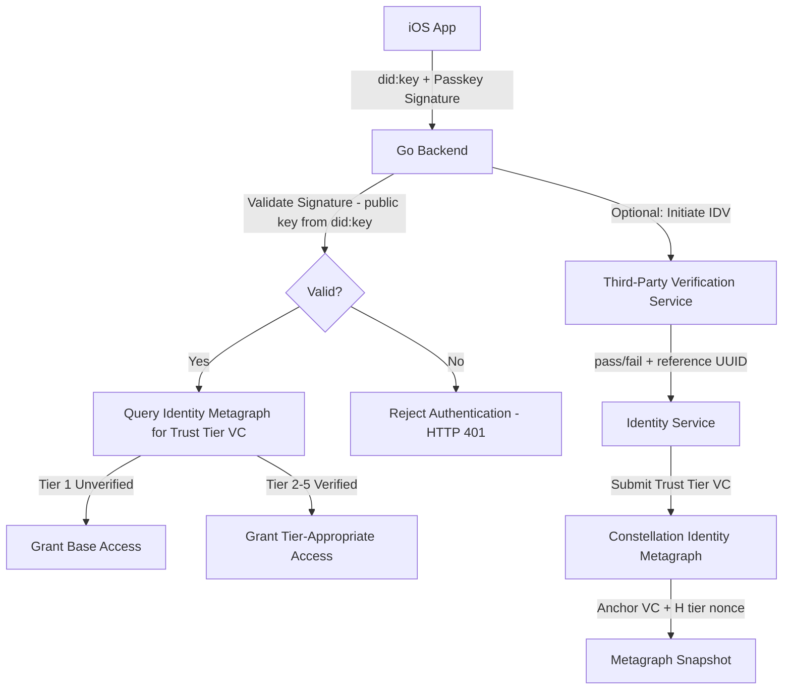
```mermaid
graph TD
    A[iOS App] -->|did:key + Passkey Signature| B[Go Backend]
    B -->|Validate Signature - public key from did:key| C{Valid?}
    C -->|Yes| D[Query Identity Metagraph for Trust Tier VC]
    C -->|No| E[Reject Authentication - HTTP 401]
    D -->|Tier 1 Unverified| F[Grant Base Access]
    D -->|Tier 2-5 Verified| G[Grant Tier-Appropriate Access]
    B -->|Optional: Initiate IDV| H[Third-Party Verification Service]
    H -->|pass/fail + reference UUID| I[Identity Service]
    I -->|Submit Trust Tier VC| J[Constellation Identity Metagraph]
    J -->|Anchor VC + H tier nonce| K[Metagraph Snapshot]
```

## Decentralized Identifier (DID) Management

The system uses Decentralized Identifiers (DIDs) as the foundation for self-sovereign identity, enabling users to maintain complete control over their identity data. ECHO uses the **W3C **[`did:key`]()** method** for the user identity primitive: the DID is derived deterministically from a P-256 key pair generated in the iOS Secure Enclave. Resolution is purely local — the public key is embedded in the DID identifier itself — so no network round-trip and no chain transaction are required to create or resolve a DID.

Verifiable Credentials (trust tier commitments, KYC, professional credentials) are issued and anchored on the **Constellation Identity Metagraph** as W3C VC 2.0 records, with revocation handled via StatusList2021 entries on the same metagraph. There is no Cardano dependency in Phase 1–2. Cardano and Midnight remain Phase 3+ evaluation candidates for ZK proof circuits only — see ADR-0001 for the decision record.

### DID Creation and Storage

When a user creates an account, the system derives a `did:key` locally from the iOS Secure Enclave's P-256 key pair. The DID follows the format `did:key:z<base58btc-of-multicodec-prefixed-public-key>` (multicodec `0x1200` for P-256). It is derived once at account creation and re-derivable on demand from the same key pair. Because the DID *is* the public key, no chain transaction or network call is required, and resolution is deterministic and offline-capable.

**DID Creation Process**:

1. User completes initial onboarding with username and passkey
2. iOS app generates a P-256 key pair in the Secure Enclave (private key never leaves the device)
3. iOS app derives the `did:key` deterministically from the P-256 public key (no chain transaction)
4. iOS app submits `POST /identity/register` to the Go backend with `{ did, public_key_hex }`
5. Backend verifies the supplied DID matches the canonical derivation from `public_key_hex` and persists the `(did, public_key, registered_at)` binding
6. The DID document is computed on demand from the registered public key — there is no on-chain DID document; service endpoints (e.g. `MessagingService`) are returned by the resolver as a synthetic document built at request time

**DID Document Structure** (computed on demand from the registered public key):

```plaintext
{
  "@context": [
    "https://www.w3.org/ns/did/v1",
    "https://w3id.org/security/multikey/v1"
  ],
  "id": "did:key:z2DA8x9XyAEWfJUg5FctK46tFZ6oEJ4nBM5Cv6fMA8DGo7R",
  "verificationMethod": [
    {
      "id": "did:key:z2DA8x9XyAEWfJUg5FctK46tFZ6oEJ4nBM5Cv6fMA8DGo7R#z2DA8x9XyAEWfJUg5FctK46tFZ6oEJ4nBM5Cv6fMA8DGo7R",
      "type": "Multikey",
      "controller": "did:key:z2DA8x9XyAEWfJUg5FctK46tFZ6oEJ4nBM5Cv6fMA8DGo7R",
      "publicKeyMultibase": "z2DA8x9XyAEWfJUg5FctK46tFZ6oEJ4nBM5Cv6fMA8DGo7R"
    }
  ],
  "authentication": [
    "did:key:z2DA8x9XyAEWfJUg5FctK46tFZ6oEJ4nBM5Cv6fMA8DGo7R#z2DA8x9XyAEWfJUg5FctK46tFZ6oEJ4nBM5Cv6fMA8DGo7R"
  ],
  "assertionMethod": [
    "did:key:z2DA8x9XyAEWfJUg5FctK46tFZ6oEJ4nBM5Cv6fMA8DGo7R#z2DA8x9XyAEWfJUg5FctK46tFZ6oEJ4nBM5Cv6fMA8DGo7R"
  ],
  "service": [
    {
      "id": "did:key:z2DA8x9XyAEWfJUg5FctK46tFZ6oEJ4nBM5Cv6fMA8DGo7R#messaging",
      "type": "MessagingService",
      "serviceEndpoint": "https://backend.echo.app/messages"
    }
  ]
}
```

> Note: Verifiable credentials are no longer embedded in the DID document.\
> They are stored on the **Constellation Identity Metagraph** and queried at\
> request time using the holder's `did:key` as the lookup key. This keeps\
> the DID document static and key-derivable while making credential\
> issuance/revocation independently mutable.

### DID Resolution and Verification

When the backend receives a request from a user, it resolves their DID to verify their identity and retrieve their public key for signature validation. Because `did:key` embeds the public key in the identifier itself, resolution is **purely deterministic and offline** — no blockchain query is required.

**DID Resolution Flow**:

1. Backend receives authenticated request with user's DID
2. Backend extracts the multibase-encoded public key from the DID string and decodes it (`did:key` parser library)
3. Public key is used directly for signature validation against the request
4. If valid, request is processed; if invalid, request is rejected
5. (Optional) Backend looks up trust-tier VCs on the Identity Metagraph for the resolved DID, with caching and circuit-breaker fallback to last-known-good per the Backend blueprint's "Circuit Breakers Per Chain" rules

Because resolution is local, no blockchain cache is needed for the DID document itself. The Identity Metagraph VC cache is the only network-bound cache and follows the standard Identity Metagraph circuit-breaker policy (5-failure threshold, 30s reset).

### Multi-Device DID Support

Because `did:key` binds the DID to a single public key, multi-device support uses a **controller pattern** rather than DID rotation. The user's primary device DID is the *controller*, and each additional device gets its own `did:key` that is authorized by a signed device-attestation credential issued by the controller. The Identity Metagraph stores the device-attestation set so the backend can resolve "all DIDs controlled by user X" without exposing the device list to the network at signing time.

**Multi-Device Registration**:

1. User authenticates on primary device with its `did:key` (the controller)
2. User initiates device registration on the secondary device
3. Primary device displays a QR code containing a one-time registration nonce signed by the controller key
4. Secondary device scans the QR code, generates its own P-256 key pair in its Secure Enclave, and derives a new `did:key`
5. Secondary device submits a registration request with `{ controller_did, device_did, nonce, controller_signature }` to the backend
6. Backend verifies the controller signature, the nonce freshness, and the public-key-to-DID derivation for the new device
7. Backend issues a `DeviceAttestationCredential` (W3C VC 2.0) signed by the platform issuer DID and submits it to the Identity Metagraph
8. Secondary device can now authenticate independently using its own `did:key`; revocation is handled by adding the device DID to a per-controller StatusList2021 entry on the Identity Metagraph

## Trust Scoring Algorithm

The trust scoring system evaluates user behavior, verification status, and interaction history to assign dynamic trust scores from 0-100. Trust scores unlock progressive features and determine reward multipliers, creating incentives for authentic network participation.

### Trust Score Components

The trust score is calculated as a weighted combination of four components:

**Verification Level (0-30 points)**:

* Unverified: 0 points
* Device-verified (passkey only): 5 points
* KYC-lite verified (third-party service): 15 points
* High-assurance verified (government ID or Apple Digital ID): 30 points

**Interaction History (0-20 points)**:

* Account age: 0-5 points (1 point per month, max 5 points at 5+ months)
* Message count: 0-5 points (1 point per 100 messages, max 5 points at 500+ messages)
* Unique contacts: 0-5 points (1 point per 10 unique contacts, max 5 points at 50+ contacts)
* Group participation: 0-5 points (1 point per 5 groups, max 5 points at 25+ groups)

**On-Chain Behavior (0-30 points)**:

* Payment transactions: 0-10 points (1 point per transaction, max 10 points at 10+ transactions)
* Staking participation: 0-10 points (1 point per 100 ECHO staked, max 10 points at 1000+ ECHO)
* Governance participation: 0-10 points (1 point per vote, max 10 points at 10+ votes)

**Report History (0-20 points, penalty)**:

* Spam reports: -2 points per report (max -10 points)
* Fraud reports: -5 points per report (max -20 points)
* Blocked by users: -1 point per block (max -10 points)

**Trust Score Calculation**:

```plaintext
verification_score = verification_level_points
interaction_score = account_age + message_count + unique_contacts + group_participation
behavior_score = payment_transactions + staking_participation + governance_participation
report_penalty = spam_reports + fraud_reports + blocked_by_users

trust_score = min(100, max(0, 
  verification_score + 
  interaction_score + 
  behavior_score + 
  report_penalty
))
```

### Trust Score Updates

Trust scores are updated continuously as users engage with the platform. The Data L1 layer maintains trust score state and updates scores based on user activity. Updates occur in real-time for critical events (verification completion, fraud reports) and in batches for routine activity (message counts, interaction history).

**Trust Score Update Events**:

* Verification completion: Immediate update (+5 to +30 points)
* Payment transaction: Batch update every hour (+1 point per transaction)
* Message sent/received: Batch update every 24 hours (interaction history recalculation)
* Spam/fraud report: Immediate update (-2 to -5 points)
* User blocks: Batch update every 24 hours (-1 point per block)

### Trust Score Tiers and Feature Access

Trust scores map to 5 tiers (Tier 1–5). Tier commitments (`H(score || nonce)`) are stored on the Constellation Identity Metagraph; raw scores are never on-chain.

**Tier 1 (0–20 points) — Un**verified: Basic messaging, limited to 10 contacts, \
\
\
\
no rewards, no governance participation.

**Tier 2 (21–40 points) **— Newcomer: Standard messaging, unlimited contacts, basic rewards (×0.5 multiplier), email/phone verified.

**Tier 3 (41–60 points) — Me**mber: Full rewards (×1.0), group creation, file sharing up to 100MB, governance voting eligible, third-party IDV verified.

**Tier 4 (61–80 points) **— Verified: Enhanced rewards (×1.5), advanced payment features, file sharing up to 500MB, government ID or Apple Digital ID verified.

**Tier 5 (81–100 points)** — Trusted: Maximum rewards (×2.0), all features, unlimited messaging, large group management, 2GB file sharing, governance board election eligible, peer attested + sustained activity.

## Verifiable Credentials and Credential Schema

Verifiable credentials are cryptographically signed documents that prove specific claims about a user without revealing unnecessary personal information. The system uses W3C Verifiable Credentials Data Model 1.0 standard for credential issuance and verification.

### Credential Types

The system supports multiple credential types, each issued by different authorities:

**Proof of Humanity Credential**:

* Issued by: Prove, Daon, or Alloy
* Claims: User is a real person (not a bot)
* Verification method: Liveness check, device verification
* Expiration: 1 year
* Privacy: Zero-knowledge proof (no personal data exposed)

```plaintext
{
  "@context": [
    "https://www.w3.org/ns/credentials/v2",
    "https://w3id.org/security/multikey/v1"
  ],
  "type": ["VerifiableCredential", "ProofOfHumanity"],
  "issuer": "did:key:z6MkrJVnaZkeFzdQyMZu1cgjg7k1pZZ6pvBQ7XJPt4swbTQ2",
  "validFrom": "2026-01-15T10:30:00Z",
  "validUntil": "2027-01-15T10:30:00Z",
  "credentialSubject": {
    "id": "did:key:z2DA8x9XyAEWfJUg5FctK46tFZ6oEJ4nBM5Cv6fMA8DGo7R",
    "humanityProof": true,
    "verificationMethod": "liveness_check"
  },
  "credentialStatus": {
    "id": "https://identity-metagraph.echo.app/status/0#42",
    "type": "StatusList2021Entry",
    "statusPurpose": "revocation",
    "statusListIndex": "42",
    "statusListCredential": "https://identity-metagraph.echo.app/status/0"
  },
  "proof": {
    "type": "DataIntegrityProof",
    "cryptosuite": "ecdsa-2019",
    "created": "2026-01-15T10:30:00Z",
    "verificationMethod": "did:key:z6MkrJVnaZkeFzdQyMZu1cgjg7k1pZZ6pvBQ7XJPt4swbTQ2#z6MkrJVnaZkeFzdQyMZu1cgjg7k1pZZ6pvBQ7XJPt4swbTQ2",
    "proofPurpose": "assertionMethod",
    "proofValue": "<signature>"
  }
}
```

> Note: this example moves to **W3C VC 2.0** (`v2` context, `validFrom`/`validUntil`, `DataIntegrityProof` with `ecdsa-2019` cryptosuite, `StatusList2021Entry` for revocation). The same pattern applies to the KYC-Lite, High-Assurance, and Professional credential examples — issuer DIDs and subject DIDs become `did:key:…`, expiration uses `validUntil`, revocation uses `StatusList2021Entry` rather than embedding inside the DID document.

**KYC-Lite Credential**:

* Issued by: Third-party verification service
* Claims: User has completed basic identity verification
* Verification method: Document upload, selfie verification
* Expiration: 2 years
* Privacy: Zero-knowledge proof (no personal data exposed)

**High-Assurance Credential**:

* Issued by: Apple Digital ID or government verification service
* Claims: User has completed government-level identity verification
* Verification method: Government ID scan or Apple Digital ID
* Expiration: 5 years
* Privacy: Zero-knowledge proof (no personal data exposed)

**Professional Credential**:

* Issued by: Professional organizations or employers
* Claims: User holds specific professional certifications or employment
* Verification method: Organization verification
* Expiration: Variable based on credential type
* Privacy: Zero-knowledge proof (no personal data exposed)

### Credential Issuance Process

When a user completes identity verification, the backend coordinates with the verification service to issue a verifiable credential:

1. User initiates verification through the app
2. App redirects to verification service (Apple Digital ID, Prove, DAON, etc.)
3. User completes verification process with the service
4. Service returns verification result to backend
5. Backend creates credential subject with user's DID
6. Backend requests credential issuance from the service
7. Service signs credential with its private key
8. Credential is returned to backend and stored on Cardano
9. Credential is added to user's DID document
10. User's trust score is updated based on credential type

### Credential Storage and Revocation

Verifiable credentials are issued by the platform issuer DID and anchored on the **Constellation Identity Metagraph**. Each issued credential includes a `credentialStatus` field pointing to a StatusList2021 credential maintained by the issuer. The status list itself is a single VC anchored on the Identity Metagraph and updated by the issuer when revocations occur.

**Credential Revocation Process**:

1. Issuer determines a credential should be revoked
2. Issuer flips the corresponding bit in its StatusList2021 bitstring
3. Issuer submits the updated StatusList2021 credential as an Identity Metagraph update; consensus finalizes the new status (< 30s target)
4. Backend queries the StatusList2021 credential during verification (cached with circuit-breaker fallback)
5. If the bit is set, the credential is no longer considered valid
6. User's trust score is recalculated without the revoked credential

## Zero-Knowledge Proof Integration

Zero-knowledge proofs enable the system to verify claims about users without exposing personal information. Phases 1–2 use standard on-chain credential verification. Phase 3+ introduces Midnight blockchain integration for privacy-preserving ZK proofs.

### Phase 1–2: Standard Credential Verification

Credentials are verified directly via the **Constellation Identity Metagraph**. The backend resolves the user's `did:key` locally (no network call), then queries the Identity Metagraph for the corresponding trust-tier VC and its StatusList2021 entry. Trust tier is confirmed; the verification method and issuer are visible to the backend (this is acceptable in Phase 1–2 because no end-user privacy promise is made for the issuer field at this stage).

### Phase 3+: Midnight ZK Verification

Via Midnight blockchain (Cardano partner chain), users can prove tier eligibility and credential validity without revealing the credential itself. The Midnight SDK generates ZK proofs on-device; the Go backend submits the proof to Midnight for on-chain verification and caches the boolean result.

**ZK Use Cases:**

| Claim | What Midnight Proves | What Midnight Hides |
| --- | --- | --- |
| Trust tier minimum | "I am Tier 3 or above" | Exact score, credential issuer |
| KYC compliance (Org tier) | "My KYC is valid" | Passport data, name, address |
| Age verification | "I am 18 or older" | Actual birthdate |
| Group membership | "I am a member of Group X" | Full list of group memberships |

Midnight uses Compact (TypeScript DSL) for contracts — not Scala. The Scala requirement applies only to Constellation metagraph L1 validation. DID **derivation is local (**`did:key`**); credential issuance is anchored on the Constellation Identity Metagraph. There is no permanent Cardano dependency.** Cardano and Midnight remain Phase 3+ evaluation candidates exclusively for ZK circuits, and only if their privacy / interop properties cannot be achieved natively on the Identity Metagraph.

### ZKP Implementation (Phase 1–2 Legacy)

The system uses zk-SNARKs for Phase 1–2 credential ownership proofs within the ECHO backend:

**Proof of Credential Ownership Circuit:**

```plaintext
circuit ProveCredentialOwnership {
  // Private inputs (known only to prover)
  private input credentialHash: Field
  private input credentialSignature: Field
  private input issuerPublicKey: Field
  
  // Public inputs (known to verifier)
  public input userDID: Field
  public input credentialType: Field
  
  // Constraints
  assert(verifySignature(credentialHash, credentialSignature, issuerPublicKey))
  assert(credentialNotRevoked(credentialHash))
  assert(getCredentialType(credentialHash) == credentialType)
  assert(credentialNotExpired(credentialHash))
}
```

**Proof of Token Balance Circuit:**

```plaintext
circuit ProveTokenBalance {
  private input accountBalance: Field
  private input accountNonce: Field
  
  public input minimumBalance: Field
  public input balanceCommitment: Field
  
  assert(accountBalance >= minimumBalance)
  assert(hash(accountBalance, accountNonce) == balanceCommitment)
}
```

## Component Breakdown

### Streamlined Onboarding with Verifiable Credentials

Guides new users through account creation, passkey setup, and optional identity verification in a single flow. Users can create an account with just a username and passkey, or complete identity verification immediately to establish high trust.

**Key Features:**

* Username availability checking
* `did:key` derivation from Secure Enclave P-256 key (local, no chain transaction)
* `POST /identity/register` binding the DID to the user account
* Passkey generation in iOS Secure Enclave
* Optional Apple Digital ID, third-party service, or document upload verification
* Verifiable credential issuance and storage
* Account creation with base or verified access
* Completion in under 5 minutes

### In-App High-Assurance Identity Verification

Provides an optional workflow for users to generate a high-assurance Verifiable Credential by verifying their government-issued photo ID or Apple Digital ID. Users who complete verification receive ECHO token rewards and unlock premium features.

**Key Features:**

* Apple Digital ID integration (iOS 17+)
* Third-party verification services (Prove, Daon, Alloy)
* Document upload with selfie verification
* Fraud assessment via Darwinium
* Automatic ECHO token rewards (100 ECHO)
* Trust level elevation to highest tier
* Verifiable credential issuance and anchoring on the Constellation Identity Metagraph
* Zero-knowledge proof generation for privacy

### Device Passkey Management

Handles passkey generation, storage in iOS Secure Enclave, and authentication flows. Passkeys are device-bound and never transmitted, providing secure passwordless authentication.

**Key Features:**

* Passkey generation during account creation
* Storage in iOS Secure Enclave
* Server-side signature validation using DID public key
* Multi-device support with separate passkeys per device
* Passkey reset with identity verification or account recovery
* Device trust verification during authentication
* Device-attestation credentials issued on the Identity Metagraph for multi-device registration (controller-pattern; no DID document mutation since `did:key` is immutable)

### ECHO Reward Coordination

When users complete identity verification, the backend submits a reward transaction to the Currency L1 layer to distribute 100 ECHO tokens. This integration ensures users are immediately rewarded for strengthening the network's trust layer.

**Reward Submission Flow**:

1. User completes identity verification with third-party service
2. Backend receives verification result and creates verifiable credential
3. Backend submits verification reward transaction to Currency L1
4. Transaction includes: user DID, reward amount (100 ECHO), verification type, timestamp
5. Currency L1 validates transaction and updates user's token balance
6. Reward is distributed to user's account within 1 block cycle (\~5 seconds)
7. User sees reward notification in app with transaction hash for verification

**Reward Transaction Structure**:

```plaintext
{
  "transaction_type": "verification_reward",
  "user_did": "did:key:z2DA8x9XyAEWfJUg5FctK46tFZ6oEJ4nBM5Cv6fMA8DGo7R",
  "reward_amount": 100000000000000000,
  "verification_type": "high_assurance",
  "verification_timestamp": "2026-01-15T10:30:00Z",
  "issuer_did": "did:key:z6MkrJVnaZkeFzdQyMZu1cgjg7k1pZZ6pvBQ7XJPt4swbTQ2",
  "signature": "<backend-signature>",
  "nonce": 12345
}
```

## Security Principles

* Passkeys are stored exclusively in the iOS Secure Enclave and never transmitted

* All authentication requests are validated server-side by the Go backend

* Third-party verification services are used only for device trust assessment and fraud prevention

* Trust-tier commitments (`H(score || nonce)`) are anchored on the Constellation Identity Metagraph and referenced for access control; the raw score never leaves the user's device or the backend's trust service

* `did:key` is permanent and key-derived: rotation is performed by replacing the controller relationship in the device-attestation credential set, not by mutating an on-chain DID document

* aw score never leaves the user's device or the backend's trust service

* `did:key` is permanent and key-derived: rotation is performed by replacing the controller relationship in the device-attestation credential set, not by mutating an on-chain DID document

```plaintext

```plaintext

## Decentralized Identifier (DID) Management

The system uses Decentralized Identifiers (DIDs) as the foundation for self-sovereign identity.

**DID Creation Process**:

1. User completes initial onboarding with username and passkey
2. Go backend generates a new DID using Atala PRISM infrastructure
3. DID is anchored to Cardano blockchain through a transaction that records the DID document
4. DID document includes the user's public key, verification methods, and service endpoints
5. DID is stored locally on the iOS device in the Secure Enclave alongside the passkey
6. Backend maintains a mapping between the user's DID and their account for quick lookup

**DID Document Structure**:

```plaintext
{
  "@context": "https://www.w3.org/ns/did/v1",
  "id": "did:prism:cardano:abc123def456",
  "publicKey": [
    {
      "id": "did:prism:cardano:abc123def456#key-1",
      "type": "Ed25519VerificationKey2018",
      "controller": "did:prism:cardano:abc123def456",
      "publicKeyBase58": "<base58-encoded-public-key>"
    }
  ],
  "authentication": [
    "did:prism:cardano:abc123def456#key-1"
  ],
  "assertionMethod": [
    "did:prism:cardano:abc123def456#key-1"
  ],
  "verifiableCredential": [
    {
      "id": "urn:uuid:credential-id",
      "type": "VerifiableCredential",
      "issuer": "did:prism:cardano:issuer-did",
      "credentialSubject": {
        "id": "did:prism:cardano:abc123def456",
        "verificationLevel": "high_assurance"
      },
      "proof": {
        "type": "Ed25519Signature2018",
        "created": "2024-01-15T10:30:00Z",
        "verificationMethod": "did:prism:cardano:issuer-did#key-1",
        "signatureValue": "<signature>"
      }
    }
  ],
  "service": [
    {
      "id": "did:prism:cardano:abc123def456#messaging",
      "type": "MessagingService",
      "serviceEndpoint": "https://backend.echo.app/messages"
    }
  ]
}
```

```plaintext

## Decentralized Identifier (DID) Management

The system uses Decentralized Identifiers (DIDs) as the foundation for self-sovereign identity.

## Decentralized Identifier (DID) Management

The system uses Decentralized Identifiers (DIDs) as the foundation for self-sovereign identity, enabling users to maintain complete control over their identity data while establishing verifiable credentials on the Cardano blockchain. DIDs are created using the Atala PRISM infrastructure, which implements the W3C DID specification and KERI standards for interoperability.

### DID Creation and Storage

When a user creates an account, the system generates a unique DID anchored to the Cardano blockchain. The DID follows the format `did:prism:cardano:<unique-identifier>` and serves as the user's immutable identity anchor across the platform and potentially other applications.

**DID Creation Process**:

1. User completes initial onboarding with username and passkey
2. Go backend generates a new DID using Atala PRISM infrastructure
3. DID is anchored to Cardano blockchain through a transaction that records the DID document
4. DID document includes the user's public key, verification methods, and service endpoints
5. DID is stored locally on the iOS device in the Secure Enclave alongside the passkey
6. Backend maintains a mapping between the user's DID and their account for quick lookup

**DID Document Structure**:

```plaintext
{
  "@context": "https://www.w3.org/ns/did/v1",
  "id": "did:prism:cardano:abc123def456",
  "publicKey": [
    {
      "id": "did:prism:cardano:abc123def456#key-1",
      "type": "Ed25519VerificationKey2018",
      "controller": "did:prism:cardano:abc123def456",
      "publicKeyBase58": "<base58-encoded-public-key>"
    }
  ],
  "authentication": [
    "did:prism:cardano:abc123def456#key-1"
  ],
  "assertionMethod": [
    "did:prism:cardano:abc123def456#key-1"
  ],
  "verifiableCredential": [
    {
      "id": "urn:uuid:credential-id",
      "type": "VerifiableCredential",
      "issuer": "did:prism:cardano:issuer-did",
      "credentialSubject": {
        "id": "did:prism:cardano:abc123def456",
        "verificationLevel": "high_assurance"
      },
      "proof": {
        "type": "Ed25519Signature2018",
        "created": "2024-01-15T10:30:00Z",
        "verificationMethod": "did:prism:cardano:issuer-did#key-1",
        "signatureValue": "<signature>"
      }
    }
  ],
  "service": [
    {
      "id": "did:prism:cardano:abc123def456#messaging",
      "type": "MessagingService",
      "serviceEndpoint": "https://backend.echo.app/messages"
    }
  ]
}
```

## Decentralized Identifier (DID) Management

The system uses Decentralized Identifiers (DIDs) as the foundation for self-sovereign identity, enabling users to maintain complete control over their identity data while establishing verifiable credentials on the Cardano blockchain. DIDs are created using the Atala PRISM infrastructure, which implements the W3C DID specification and KERI standards for interoperability.

### DID Creation and Storage

When a user creates an account, the system generates a unique DID anchored to the Cardano blockchain. The DID follows the format `did:prism:cardano:<unique-identifier>` and serves as the user's immutable identity anchor across the platform and potentially other applications.

**DID Creation Process**:

1. User completes initial onboarding with username and passkey
2. Go backend generates a new DID using Atala PRISM infrastructure
3. DID is anchored to Cardano blockchain through a transaction that records the DID document
4. DID document includes the user's public key, verification methods, and service endpoints
5. DID is stored locally on the iOS device in the Secure Enclave alongside the passkey
6. Backend maintains a mapping between the user's DID and their account for quick lookup

**DID Document Structure**:

```plaintext
{
  "@context": "https://www.w3.org/ns/did/v1",
  "id": "did:prism:cardano:abc123def456",
  "publicKey": [
    {
      "id": "did:prism:cardano:abc123def456#key-1",
      "type": "Ed25519VerificationKey2018",
      "controller": "did:prism:cardano:abc123def456",
      "publicKeyBase58": "<base58-encoded-public-key>"
    }
  ],
  "authentication": [
    "did:prism:cardano:abc123def456#key-1"
  ],
  "assertionMethod": [
    "did:prism:cardano:abc123def456#key-1"
  ],
  "verifiableCredential": [
    {
      "id": "urn:uuid:credential-id",
      "type": "VerifiableCredential",
      "issuer": "did:prism:cardano:issuer-did",
      "credentialSubject": {
        "id": "did:prism:cardano:abc123def456",
        "verificationLevel": "high_assurance"
      },
      "proof": {
        "type": "Ed25519Signature2018",
        "created": "2024-01-15T10:30:00Z",
        "verificationMethod": "did:prism:cardano:issuer-did#key-1",
        "signatureValue": "<signature>"
      }
    }
  ],
  "service": [
    {
      "id": "did:prism:cardano:abc123def456#messaging",
      "type": "MessagingService",
      "serviceEndpoint": "https://backend.echo.app/messages"
    }
  ]
}
```

### DID Resolution and Verification

When the backend receives a request from a user, it resolves their DID to verify their identity and retrieve their public key for signature validation. The DID resolution process queries the Cardano blockchain to retrieve the authoritative DID document.

**DID Resolution Flow**:

1. Backend receives authenticated request with user's DID
2. Backend queries Cardano blockchain for the DID document
3. DID document is retrieved and cached locally for performance
4. Public key is extracted from the DID document
5. Request signature is validated against the public key
6. If valid, request is processed; if invalid, request is rejected

The backend maintains a local cache of recently resolved DIDs to reduce blockchain queries. Cache entries are invalidated after 24 hours or when the user updates their DID document.

### Multi-Device DID Support

Users can register multiple devices with their DID, with each device maintaining a separate passkey in its Secure Enclave. The DID document includes multiple public keys, one for each registered device, enabling the user to authenticate from any registered device.

**Multi-Device Registration**:

1. User authenticates on primary device with passkey
2. User initiates device registration on secondary device
3. Primary device displays QR code containing registration token
4. Secondary device scans QR code and generates new passkey
5. Secondary device submits registration request with new public key
6. Backend verifies request is from authenticated user
7. New public key is added to DID document on Cardano
8. Secondary device can now authenticate independently

## Trust Scoring Algorithm

The trust scoring system evaluates user behavior, verification status, and interaction history to assign dynamic trust scores from 0-100. Trust scores unlock progressive features and determine reward multipliers, creating incentives for authentic network participation.

### Trust Score Components

The trust score is calculated as a weighted combination of four components:

**Verification Level (0-30 points)**:

* Unverified: 0 points
* Device-verified (passkey only): 5 points
* KYC-lite verified (third-party service): 15 points
* High-assurance verified (government ID or Apple Digital ID): 30 points

**Interaction History (0-20 points)**:

* Account age: 0-5 points (1 point per month, max 5 points at 5+ months)
* Message count: 0-5 points (1 point per 100 messages, max 5 points at 500+ messages)
* Unique contacts: 0-5 points (1 point per 10 unique contacts, max 5 points at 50+ contacts)
* Group participation: 0-5 points (1 point per 5 groups, max 5 points at 25+ groups)

**On-Chain Behavior (0-30 points)**:

* Payment transactions: 0-10 points (1 point per transaction, max 10 points at 10+ transactions)
* Staking participation: 0-10 points (1 point per 100 ECHO staked, max 10 points at 1000+ ECHO)
* Governance participation: 0-10 points (1 point per vote, max 10 points at 10+ votes)

**Report History (0-20 points, penalty)**:

* Spam reports: -2 points per report (max -10 points)
* Fraud reports: -5 points per report (max -20 points)
* Blocked by users: -1 point per block (max -10 points)

**Trust Score Calculation**:

```plaintext
verification_score = verification_level_points
interaction_score = account_age + message_count + unique_contacts + group_participation
behavior_score = payment_transactions + staking_participation + governance_participation
report_penalty = spam_reports + fraud_reports + blocked_by_users

trust_score = min(100, max(0, 
  verification_score + 
  interaction_score + 
  behavior_score + 
  report_penalty
))
```

### Trust Score Updates

Trust scores are updated continuously as users engage with the platform. The Data L1 layer maintains trust score state and updates scores based on user activity. Updates occur in real-time for critical events (verification completion, fraud reports) and in batches for routine activity (message counts, interaction history).

**Trust Score Update Events**:

* Verification completion: Immediate update (+5 to +30 points)
* Payment transaction: Batch update every hour (+1 point per transaction)
* Message sent/received: Batch update every 24 hours (interaction history recalculation)
* Spam/fraud report: Immediate update (-2 to -5 points)
* User blocks: Batch update every 24 hours (-1 point per block)

### Trust Score Tiers and Feature Access

Trust scores map to 5 tiers (Tier 1–5). Tier commitments are stored on Cardano; raw scores are never on-chain.

**Tier 1 (0–20 points) — Un**verified: Basic messaging, limited to 10 contacts, \
\
\
\
no rewards, no governance participation.

**Tier 2 (21–40 points) **— Newcomer: Standard messaging, unlimited contacts, basic rewards (×0.5 multiplier), email/phone verified.

**Tier 3 (41–60 points) — Me**mber: Full rewards (×1.0), group creation, file sharing up to 100MB, governance voting eligible, third-party IDV verified.

**Tier 4 (61–80 points) **— Verified: Enhanced rewards (×1.5), advanced payment features, file sharing up to 500MB, government ID or Apple Digital ID verified.

**Tier 5 (81–100 points)** — Trusted: Maximum rewards (×2.0), all features, unlimited messaging, large group management, 2GB file sharing, governance board election eligible, peer attested + sustained activity.

## Verifiable Credentials and Credential Schema

Verifiable credentials are cryptographically signed documents that prove specific claims about a user without revealing unnecessary personal information. The system uses W3C Verifiable Credentials Data Model 1.0 standard for credential issuance and verification.

### Credential Types

The system supports multiple credential types, each issued by different authorities:

**Proof of Humanity Credential**:

* Issued by: Prove, Daon, or Alloy
* Claims: User is a real person (not a bot)
* Verification method: Liveness check, device verification
* Expiration: 1 year
* Privacy: Zero-knowledge proof (no personal data exposed)

```plaintext
{
  "@context": [
    "https://www.w3.org/2018/credentials/v1",
    "https://www.w3.org/2018/credentials/examples/v1"
  ],
  "type": ["VerifiableCredential", "ProofOfHumanity"],
  "issuer": "did:prism:cardano:prove-issuer",
  "issuanceDate": "2024-01-15T10:30:00Z",
  "expirationDate": "2025-01-15T10:30:00Z",
  "credentialSubject": {
    "id": "did:prism:cardano:user-did",
    "humanityProof": true,
    "verificationMethod": "liveness_check"
  },
  "proof": {
    "type": "Ed25519Signature2018",
    "created": "2024-01-15T10:30:00Z",
    "verificationMethod": "did:prism:cardano:prove-issuer#key-1",
    "signatureValue": "<signature>"
  }
}
```

**KYC-Lite Credential**:

* Issued by: Third-party verification service
* Claims: User has completed basic identity verification
* Verification method: Document upload, selfie verification
* Expiration: 2 years
* Privacy: Zero-knowledge proof (no personal data exposed)

**High-Assurance Credential**:

* Issued by: Apple Digital ID or government verification service
* Claims: User has completed government-level identity verification
* Verification method: Government ID scan or Apple Digital ID
* Expiration: 5 years
* Privacy: Zero-knowledge proof (no personal data exposed)

**Professional Credential**:

* Issued by: Professional organizations or employers
* Claims: User holds specific professional certifications or employment
* Verification method: Organization verification
* Expiration: Variable based on credential type
* Privacy: Zero-knowledge proof (no personal data exposed)

### Credential Issuance Process

When a user completes identity verification, the backend coordinates with the verification service to issue a verifiable credential:

1. User initiates verification through the app
2. App redirects to verification service (Apple Digital ID, Prove, DAON, etc.)
3. User completes verification process with the service
4. Service returns verification result to backend
5. Backend creates credential subject with user's DID
6. Backend requests credential issuance from the service
7. Service signs credential with its private key
8. Credential is returned to backend and stored on Cardano
9. Credential is added to user's DID document
10. User's trust score is updated based on credential type

### Credential Storage and Revocation

Verifiable credentials are stored on the Cardano blockchain as part of the user's DID document. This ensures credentials are immutable and portable across applications. Credentials can be revoked by the issuer if the user's status changes (e.g., professional certification expires).

**Credential Revocation Process**:

1. Issuer determines credential should be revoked
2. Issuer submits revocation transaction to Cardano
3. Revocation is recorded in the credential revocation registry
4. Backend queries revocation registry during credential verification
5. If credential is revoked, it is no longer considered valid
6. User's trust score is recalculated without the revoked credential

## Zero-Knowledge Proof Integration

Zero-knowledge proofs enable the system to verify claims about users without exposing personal information. Phases 1–2 use standard on-chain credential verification. Phase 3+ introduces Midnight blockchain integration for privacy-preserving ZK proofs.

### Phase 1–2: Standard Credential Verification

Credentials are verified directly via Cardano. The backend resolves the user's DID, checks credential status bits, and validates the trust tier UTXO datum. Trust tier is confirmed, but the verification method and issuer are visible to the backend.

### Phase 3+: Midnight ZK Verification

Via Midnight blockchain (Cardano partner chain), users can prove tier eligibility and credential validity without revealing the credential itself. The Midnight SDK generates ZK proofs on-device; the Go backend submits the proof to Midnight for on-chain verification and caches the boolean result.

**ZK Use Cases:**

| Claim | What Midnight Proves | What Midnight Hides |
| --- | --- | --- |
| Trust tier minimum | "I am Tier 3 or above" | Exact score, credential issuer |
| KYC compliance (Org tier) | "My KYC is valid" | Passport data, name, address |
| Age verification | "I am 18 or older" | Actual birthdate |
| Group membership | "I am a member of Group X" | Full list of group memberships |

Midnight uses Compact (TypeScript DSL) for contracts — not Scala. The Scala requirement applies only to Constellation metagraph L1 validation. DID registration and credential issuance remain on Cardano permanently.

### ZKP Implementation (Phase 1–2 Legacy)

The system uses zk-SNARKs for Phase 1–2 credential ownership proofs within the ECHO backend:

**Proof of Credential Ownership Circuit:**

```plaintext
circuit ProveCredentialOwnership {
  // Private inputs (known only to prover)
  private input credentialHash: Field
  private input credentialSignature: Field
  private input issuerPublicKey: Field
  
  // Public inputs (known to verifier)
  public input userDID: Field
  public input credentialType: Field
  
  // Constraints
  assert(verifySignature(credentialHash, credentialSignature, issuerPublicKey))
  assert(credentialNotRevoked(credentialHash))
  assert(getCredentialType(credentialHash) == credentialType)
  assert(credentialNotExpired(credentialHash))
}
```

**Proof of Token Balance Circuit:**

```plaintext
circuit ProveTokenBalance {
  private input accountBalance: Field
  private input accountNonce: Field
  
  public input minimumBalance: Field
  public input balanceCommitment: Field
  
  assert(accountBalance >= minimumBalance)
  assert(hash(accountBalance, accountNonce) == balanceCommitment)
}
```

## Component Breakdown

### Streamlined Onboarding with Verifiable Credentials

Guides new users through account creation, passkey setup, and optional identity verification in a single flow. Users can create an account with just a username and passkey, or complete identity verification immediately to establish high trust.

**Key Features:**

* Username availability checking
* DID generation and Cardano anchoring
* Passkey generation in iOS Secure Enclave
* Optional Apple Digital ID, third-party service, or document upload verification
* Verifiable credential issuance and storage
* Account creation with base or verified access
* Completion in under 5 minutes

### In-App High-Assurance Identity Verification

Provides an optional workflow for users to generate a high-assurance Verifiable Credential by verifying their government-issued photo ID or Apple Digital ID. Users who complete verification receive ECHO token rewards and unlock premium features.

**Key Features:**

* Apple Digital ID integration (iOS 17+)
* Third-party verification services (Prove, Daon, Alloy)
* Document upload with selfie verification
* Fraud assessment via Darwinium
* Automatic ECHO token rewards (100 ECHO)
* Trust level elevation to highest tier
* Verifiable credential issuance on Cardano
* Zero-knowledge proof generation for privacy

### Device Passkey Management

Handles passkey generation, storage in iOS Secure Enclave, and authentication flows. Passkeys are device-bound and never transmitted, providing secure passwordless authentication.

**Key Features:**

* Passkey generation during account creation
* Storage in iOS Secure Enclave
* Server-side signature validation using DID public key
* Multi-device support with separate passkeys per device
* Passkey reset with identity verification or account recovery
* Device trust verification during authentication
* DID document updates for multi-device registration

### ECHO Reward Coordination

When users complete identity verification, the backend submits a reward transaction to the Currency L1 layer to distribute 100 ECHO tokens. This integration ensures users are immediately rewarded for strengthening the network's trust layer.

**Reward Submission Flow**:

1. User completes identity verification with third-party service
2. Backend receives verification result and creates verifiable credential
3. Backend submits verification reward transaction to Currency L1
4. Transaction includes: user DID, reward amount (100 ECHO), verification type, timestamp
5. Currency L1 validates transaction and updates user's token balance
6. Reward is distributed to user's account within 1 block cycle (\~5 seconds)
7. User sees reward notification in app with transaction hash for verification

**Reward Transaction Structure**:

```plaintext
{
  "transaction_type": "verification_reward",
  "user_did": "did:prism:cardano:abc123def456",
  "reward_amount": 100000000000000000, // 100 ECHO in smallest units
  "verification_type": "high_assurance",
  "verification_timestamp": "2024-01-15T10:30:00Z",
  "issuer_did": "did:prism:cardano:verification-service",
  "signature": "<backend-signature>",
  "nonce": 12345
}
```

## Security Principles

* Passkeys are stored exclusively in the iOS Secure Enclave and never transmitted
* All authentication requests are validated server-side by the Go backend
* Third-party verification services are used only for device trust assessment and fraud prevention
* Trust levels are immutably recorded on Cardano and referenced for access control
* Error messages are generic with error codes for support (no sensitive details exposed)

## Blockchain-Anchored Messaging with Provable Integrity

# Blockchain-Anchored Messaging with Provable Integrity

## Overview

This feature provides end-to-end encrypted messaging with cryptographic proof of message authenticity and conversation integrity. Messages are encrypted on-device, transported via a stateless WebSocket relay server, and anchored to the Constellation metagraph via Merkle root commitments. Users can prove that specific communications occurred without exposing message content—critical for legal, business, and security purposes.

**Key Innovation:** Message content never touches the blockchain. Only Merkle roots of commitment hashes are anchored on the Data L1 layer, enabling cryptographic verification of integrity without sacrificing privacy.

## Architecture

Messages are encrypted end-to-end using Kinnami encryption (X25519 key agreement + ChaCha20-Poly1305). The encrypted blobs are transported via a content-blind WebSocket relay server that cannot read, decrypt, or modify message content. Commitment hashes are batched into Merkle trees and anchored to the Constellation metagraph Data L1 every 5 minutes (or 1000 commitments, whichever comes first).

### Message Flow

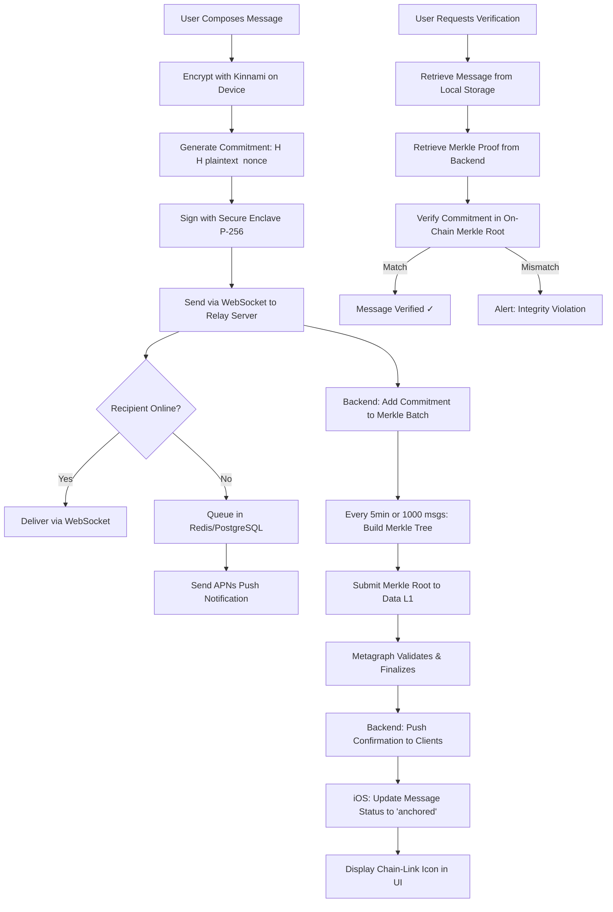
```mermaid
graph TD
    A[User Composes Message] --> B[Encrypt with Kinnami on Device]
    B --> C[Generate Commitment: H H plaintext  nonce]
    C --> D[Sign with Secure Enclave P-256]
    D --> E[Send via WebSocket to Relay Server]
    E --> F{Recipient Online?}
    F -->|Yes| G[Deliver via WebSocket]
    F -->|No| H[Queue in Redis/PostgreSQL]
    H --> I[Send APNs Push Notification]
    E --> J[Backend: Add Commitment to Merkle Batch]
    J --> K[Every 5min or 1000 msgs: Build Merkle Tree]
    K --> L[Submit Merkle Root to Data L1]
    L --> M[Metagraph Validates & Finalizes]
    M --> N[Backend: Push Confirmation to Clients]
    N --> O[iOS: Update Message Status to 'anchored']
    O --> P[Display Chain-Link Icon in UI]
    
    Q[User Requests Verification] --> R[Retrieve Message from Local Storage]
    R --> S[Retrieve Merkle Proof from Backend]
    S --> T[Verify Commitment in On-Chain Merkle Root]
    T -->|Match| U[Message Verified ✓]
    T -->|Mismatch| V[Alert: Integrity Violation]
```

## Key Components

### Message Encryption & Relay

Messages are encrypted end-to-end using Kinnami encryption (X25519 key agreement + ChaCha20-Poly1305) before transmission. Encryption keys are ephemeral per-session and never transmitted. The iOS Secure Enclave generates a P-256 signature over the encrypted payload. The WebSocket relay server transports opaque encrypted blobs—it cannot read, decrypt, or modify message content.

**Relay Server Role:**

* Transports encrypted blobs between online clients via WebSocket
* Queues encrypted blobs for offline recipients (Redis/PostgreSQL)
* Sends APNs push notifications (no content exposed)
* **Cannot:** read message content, forge messages, override on-chain state

**Key Features:**

* End-to-end encryption with Kinnami (X25519 + ChaCha20-Poly1305)
* Ephemeral key agreement per message session
* P-256 signature from Secure Enclave
* Content-blind relay server
* Offline message queuing (30-day retention for 1:1, 7-day for large groups)
* Push notification delivery (conversation ID only, no content)
* Message retry with exponential backoff
* Sealed sender support (Phase 3): server routes by recipient only, sender DID hidden

### Message Anchoring & Commitment Batching

Each message generates a **commitment hash**: `commitment = H(H(plaintext) || nonce)`. The double hash prevents content exposure, and the nonce prevents dictionary attacks. Commitments are batched by the Go backend every **5 minutes OR 1000 commitments** (whichever comes first).

**Batching Process:**

1. **Collection**: Backend collects commitment hashes from all relayed messages
2. **Merkle Tree**: Build a Merkle tree with commitments as leaves
3. **Root Submission**: Submit Merkle root to Data L1 via `DataL1Submission` transaction
4. **On-Chain Validation**: Data L1 validators verify Merkle structure and authorized sender DID
5. **Metagraph Consensus**: Metagraph L0 packages into snapshot, Global L0 finalizes
6. **Confirmation**: Backend pushes confirmation to clients via WebSocket with snapshot hash and height

**What Goes On-Chain:**

* ✅ Merkle root (32 bytes)
* ✅ Commitment count (integer)
* ✅ Time range (from/to timestamps)
* ✅ Batch schema version
* ❌ **Never:** message content, sender/recipient DIDs, metadata

**Data L1 Submission Structure:**

```go
type DataL1Submission struct {
    Type            string    // "message_integrity"
    MerkleRoot      []byte    // Root hash of Merkle tree
    CommitmentCount int       // Number of messages in batch
    TimeRange       TimeRange // From/To timestamps
    SchemaVersion   int       // Current: 1
}
```

**Key Features:**

* SHA-256 commitment hashing with double-hash + nonce
* Merkle tree batching (5min OR 1000 msgs)
* Data L1 anchoring with on-chain validation
* Snapshot reference storage (snapshot hash + height)
* Zero content or metadata on-chain (privacy-preserving)
* Commitment integrity verification via Merkle proofs

### Message Delivery Statuses

Messages progress through 7 delivery statuses, with UI indicators for each:

| Status | Icon | Meaning | Trigger |
| --- | --- | --- | --- |
| **sending** | ⏳ | Encrypting / queued locally (offline) | Before relay submission |
| **sent** | ✓ | Accepted by relay, recipient offline | Relay ACK, recipient not connected |
| **delivered** | ✓✓ | Delivered to recipient's device | Recipient WebSocket delivery |
| **read** | ✓✓ (blue) | Recipient opened the message | Recipient read receipt |
| **failed** | ❌ | Relay rejected or unrecoverable error | Validation failure, network timeout |
| **anchored** | 🔗 | Commitment in finalized metagraph snapshot | Backend confirmation + Merkle proof |
| **verified** | ✓ (Smart Checkmark) | Digital Evidence fingerprint (Org tier) | Enterprise audit anchoring complete |

**Anchored Status (All Users):**

When the backend confirms a message commitment was included in a finalized metagraph snapshot, the iOS app updates the message status to `.anchored` and displays a **chain-link icon** (🔗) next to the timestamp. This indicates blockchain-verified integrity. Users can tap the icon to view:

* Snapshot hash
* Snapshot height
* Commitment hash
* Merkle proof (Phase 3+)
* Link to DAG Explorer

**Verified Status (Organization Tier Only):**

Organization tier messages receive individual-event fingerprinting via Constellation's Digital Evidence API. A **Smart Checkmark badge** (✓) appears next to the message. Tapping opens the public Digital Evidence verification URL in Safari, showing:

* SHA-256 fingerprint
* Timestamp
* Event ID
* Public verification explorer
* Court-admissible evidence packaging

### Message Verification (Client-Side)

**Phase 1–2: Trust Backend Confirmation**

Clients trust the backend's anchoring confirmation. The `.anchored` status is displayed when the backend reports the Merkle root was finalized on-chain.

**Phase 3+: Trustless Merkle Proof Verification**

The iOS `AnchoringTracker` receives a Merkle proof alongside the confirmation. The client cryptographically verifies:

1. Compute leaf hash from stored commitment
2. Compute path from leaf to root using provided sibling hashes
3. Compare computed root with on-chain Merkle root
4. Display `.anchored` only if proof validates

This removes trust in the relay server for integrity verification. Clients can independently prove their messages were anchored.

**Merkle Proof Structure:**

```swift
struct MerkleProof {
    let commitment: Data        // User's message commitment
    let siblings: [Data]        // Sibling hashes from leaf to root
    let snapshotHash: String    // On-chain snapshot hash
    let snapshotHeight: Int     // On-chain snapshot height
}

func verifyMerkleProof(proof: MerkleProof, onChainRoot: Data) -> Bool {
    var computedHash = proof.commitment
    for sibling in proof.siblings {
        computedHash = SHA256.hash(data: computedHash + sibling)
    }
    return computedHash == onChainRoot
}
```

### Digital Evidence Integration (Organization Tier)

For Organization tier users, ECHO integrates with Constellation's Digital Evidence API to provide individual-event anchoring with public verification URLs and Smart Checkmark badges. This is **complementary** to the standard Merkle anchoring—all users get Merkle anchoring; Org tier gets both.

**Use Cases:**

* Enterprise audit trails with court-admissible evidence
* Media authenticity verification (SHA-256 fingerprint before E2E encryption)
* Smart Checkmark badges on messages for verified authenticity
* Data retention proof (fingerprint at regulatory retention boundary)

**iOS Integration:**

```swift
actor DigitalEvidenceBridge {
    private let backendAPI: BackendAPIClient
    
    /// Fingerprint media before E2E encryption (VIP+ optional, Org automatic)
    func fingerprintMedia(_ mediaData: Data, messageId: String) async throws -> EvidenceResult? {
        let hash = SHA256.hash(data: mediaData)
        let hashHex = hash.compactMap { String(format: "%02x", $0) }.joined()
        
        let result = try await backendAPI.submitEvidenceFingerprint(
            contentHash: hashHex,
            messageId: messageId,
            metadata: ["type": "media", "source": "echo_ios"]
        )
        
        return EvidenceResult(
            eventId: result.eventId,
            verificationURL: result.verificationUrl,
            timestamp: result.timestamp
        )
    }
    
    /// Get verification URL for Smart Checkmark
    func verificationURL(for message: Message) -> URL? {
        guard let eventId = message.evidenceEventId else { return nil }
        return URL(string: "https://digitalevidence.constellationnetwork.io/verify/\(eventId)")
    }
}
```

**Backend Integration:**

The Go backend submits fingerprints to Constellation's Digital Evidence REST API:

```go
// evidence/client.go
type DigitalEvidenceClient struct {
    baseURL        string
    apiKey         string
    organizationID string
    tenantID       string
}

func (c *DigitalEvidenceClient) SubmitFingerprint(fp Fingerprint) (*FingerprintResult, error) {
    signed := c.signPayload(fp)
    resp, err := c.post("/evidence", signed)
    return &FingerprintResult{
        EventID:         resp.EventID,
        VerificationURL: resp.VerificationURL,
        Timestamp:       resp.Timestamp,
    }, nil
}
```

### Message Editing with History

Users can edit sent messages within 24 hours of sending. Edited messages display an "edited" indicator with edit timestamp. Edit history is maintained locally showing all previous versions. The **original commitment** hash remains immutable on the blockchain—edits create new commitments that are anchored in subsequent Merkle batches.

**Key Features:**

* 24-hour edit window
* Edit history tracking (stored locally)
* Original commitment immutability (on-chain Merkle root unchanged)
* New commitment generated for each edit (anchored in next batch)
* Edit metadata stored locally (not on-chain)
* Edit notifications to recipients
* Edit count and timestamp display

### Message Pinning

Users can pin important messages in conversations for quick reference. Pinned messages are stored locally and accessible from a dedicated view. Each conversation supports up to 10 pinned messages.

**Key Features:**

* Pin up to 10 messages per conversation
* Pinned messages list view
* Pin timestamp tracking
* Local-only storage (not synced to metagraph)
* Pin notifications in groups
* Unpin functionality

### Message Forwarding

Users can forward messages to other conversations with or without sender attribution. Forwarded messages are encrypted end-to-end with new keys for the destination conversation. Forwarding metadata is stored **locally only**—not on the metagraph (privacy by design).

**Key Features:**

* Forward to individual contacts or groups
* With/without sender attribution
* Batch forwarding support
* Caption support
* Forwarding restrictions (hidden folders, disappearing messages)
* Forwarding metadata stored locally (not on-chain)
* New commitment generated for forwarded message

### Message Reactions & Replies

Users can react to messages with emojis and reply to specific messages. Reactions and replies are stored as separate message objects linked to the original message. Each reaction/reply is encrypted separately and generates its own commitment.

**Key Features:**

* Emoji reactions
* Custom reactions
* Multiple reactions per user per message
* Message replies with quoting
* Reply notifications
* Reaction aggregation
* Each reaction/reply anchored independently in Merkle batches

### Disappearing Messages with Cryptographic Verification

Users can send messages that automatically delete from all devices after predetermined time periods. The commitment hash is still anchored in the Merkle batch, allowing proof that a conversation occurred without revealing content. After the timer expires, the plaintext is deleted, but the on-chain commitment remains as an immutable record.

**Architecture Note:** The on-chain Merkle root persists indefinitely, but individual commitments become unverifiable after plaintext deletion (users can no longer generate the commitment hash from plaintext). This is the privacy/auditability tradeoff—the blockchain proves "a message existed at this time" but not "what the message said."

**Key Features:**

* Preset time intervals (10 seconds to 7 days)
* Custom timing for premium users
* Countdown timers
* Commitment anchored before deletion
* Plaintext deletion on sender + recipient devices
* Merkle root persists on-chain (proof of existence, not content)
* Keys deleted after plaintext deletion

### Hidden Folders with Biometric Protection

Users can create hidden folders to organize sensitive messages. Hidden folders are protected by biometric authentication (Face ID or Touch ID) and stored locally without metagraph sync. Messages in hidden folders are still E2E encrypted and commitments are still anchored, but the folder structure and contents are device-local.

**Key Features:**

* Biometric authentication (Face ID/Touch ID)
* PIN code fallback
* Local-only storage (folder structure not synced)
* iOS Data Protection encryption
* Access logging
* Multiple hidden folders support
* Message commitments still anchored (integrity preserved)

### Silent and Scheduled Private Chats

Users can mute notifications for specific conversations or schedule messages to be sent at a later time. Mute settings are stored locally while scheduled messages are queued and sent at the specified time via background tasks.

**Key Features:**

* Mute duration options (1 hour to forever)
* Silent message delivery
* Message scheduling up to 30 days
* Background task execution
* Offline message queuing
* Scheduled message editing/cancellation

## Implementation Details

### iOS (Swift)

**MessageRelayManager** coordinates send/receive with the WebSocket relay:

```swift
actor MessageRelayManager {
    private let webSocket: WebSocketRelay
    private let encryption: KinnamiEncryptionService
    private let secureEnclave: SecureEnclaveManager
    private let anchoringTracker: AnchoringTracker
    
    func sendMessage(
        plaintext: Data,
        recipientPublicKey: Data,
        conversationId: String
    ) async throws -> Message {
        // 1. E2E encrypt
        let encryptedPayload = try encryption.encrypt(
            plaintext: plaintext,
            recipientPublicKey: recipientPublicKey
        )
        
        // 2. Generate commitment
        let nonce = CryptoKit.randomBytes(32)
        let plaintextHash = SHA256.hash(data: plaintext)
        let commitment = SHA256.hash(data: plaintextHash + nonce)
        
        // 3. Sign with Secure Enclave
        let signature = try await secureEnclave.sign(
            data: encryptedPayload.serialized,
            reason: "Send message"
        )
        
        // 4. Send via relay
        let messageId = UUID().uuidString
        let response = try await webSocket.sendMessage(SendMessageRequest(
            messageId: messageId,
            conversationId: conversationId,
            encryptedPayload: encryptedPayload,
            commitment: commitment,
            signature: signature
        ))
        
        // 5. Track for anchoring
        anchoringTracker.track(messageId: messageId, commitment: commitment)
        
        return Message(
            id: messageId,
            status: response.status == "relayed" ? .delivered : .sent
        )
    }
}
```

**AnchoringTracker** receives confirmations and updates message status:

```swift
@MainActor
final class AnchoringTracker: ObservableObject {
    @Published private(set) var pendingAnchors: [String: PendingAnchor] = [:]
    
    func confirmAnchoring(
        messageId: String,
        snapshotHash: String,
        snapshotHeight: Int,
        merkleProof: [Data]?
    ) {
        pendingAnchors.removeValue(forKey: messageId)
        
        // Phase 3+: Verify Merkle proof
        if let proof = merkleProof {
            let isValid = verifyMerkleProof(
                commitment: storedCommitment,
                proof: proof,
                onChainRoot: fetchMerkleRoot(snapshotHash)
            )
            guard isValid else {
                // Alert: integrity violation
                return
            }
        }
        
        // Update message status
        NotificationCenter.default.post(
            name: .messageAnchored,
            object: nil,
            userInfo: [
                "messageId": messageId,
                "snapshotHash": snapshotHash,
                "snapshotHeight": snapshotHeight
            ]
        )
    }
}
```

### Go Backend

**AnchoringBatcher** collects commitments and submits Merkle roots:

```go
type AnchoringBatcher struct {
    commitments  []Commitment
    metagraph    *MetagraphClient
    ticker       *time.Ticker
    maxBatch     int
}

const (
    BatchInterval = 5 * time.Minute
    MaxBatchSize  = 1000
)

func (b *AnchoringBatcher) AddCommitment(messageID string, hash []byte) {
    b.commitments = append(b.commitments, Commitment{
        MessageID: messageID,
        Hash:      hash,
        Timestamp: time.Now(),
    })
    
    if len(b.commitments) >= b.maxBatch {
        go b.flush()
    }
}

func (b *AnchoringBatcher) flush() {
    if len(b.commitments) == 0 {
        return
    }
    
    batch := b.commitments
    b.commitments = nil
    
    // Build Merkle tree
    tree := BuildMerkleTree(extractHashes(batch))
    root := tree.Root()
    
    // Submit to Data L1
    txHash, err := b.metagraph.SubmitDataL1(DataL1Submission{
        Type:            "message_integrity",
        MerkleRoot:      root,
        CommitmentCount: len(batch),
        TimeRange: TimeRange{
            From: batch[0].Timestamp,
            To:   batch[len(batch)-1].Timestamp,
        },
        SchemaVersion: 1,
    })
    
    if err == nil {
        // Store tree for proof generation
        b.storeTree(txHash, tree, batch)
        
        // Push confirmations to clients
        b.pushConfirmations(batch, root, txHash)
    }
}
```

### Scala (Metagraph L1 Validation)

Data L1 validators enforce Merkle root structure validation:

```scala
class MessageIntegrityValidator extends DataL1Validator {
  def validate(submission: DataL1Submission): ValidationResult = {
    submission.`type` match {
      case "message_integrity" =>
        // 1. Verify Merkle root is 32 bytes (SHA-256)
        if (submission.merkleRoot.length != 32)
          return ValidationResult.Invalid("Invalid Merkle root length")
        
        // 2. Verify commitment count > 0
        if (submission.commitmentCount <= 0)
          return ValidationResult.Invalid("Empty batch")
        
        // 3. Verify time range is valid
        if (submission.timeRange.from >= submission.timeRange.to)
          return ValidationResult.Invalid("Invalid time range")
        
        // 4. Verify schema version is supported
        if (submission.schemaVersion > CurrentSchemaVersion)
          return ValidationResult.Invalid("Unsupported schema version")
        
        // 5. Verify sender DID is authorized
        if (!isAuthorizedSender(submission.senderDID))
          return ValidationResult.Invalid("Unauthorized sender")
        
        ValidationResult.Valid
      
      case _ => ValidationResult.Invalid("Unknown submission type")
    }
  }
}
```

## Security Principles

* All messages are encrypted end-to-end using Kinnami (X25519 + ChaCha20-Poly1305)
* Encryption keys are ephemeral and never transmitted
* Messages are relayed via a content-blind server that cannot read, decrypt, or modify content
* Commitment hashes (not content) are anchored in Merkle batches on the Data L1 layer
* Local storage is encrypted at rest using iOS Data Protection (AES-256-GCM)
* Hidden folders require biometric authentication
* Disappearing message plaintext is deleted but commitment persists on-chain (proof of existence)
* Message deletion is cryptographically verified before commitment anchoring
* Client-side Merkle proof verification (Phase 3+) removes trust in relay server
* No message content or metadata ever reaches the blockchain
* Sealed sender (Phase 3) hides sender DID from relay server

## Dynamic Trust Network and Social Verification

# Dynamic Trust Network and Social Verification

## Overview

This feature creates a decentralized reputation system that enables users to build trust relationships and verify authenticity without relying on centralized authorities or exposing personal information. Trust tiers are anchored on Cardano as verifiable credentials, referenced by the Constellation metagraph for governance weight and feature access, and extended by Midnight ZK proofs (Phase 3+) for privacy-preserving verification. The trust network serves both ECHO Message consumer users and ECHO Comply enterprise administrators.

## Architecture

Trust tiers are stored as UTXO datums on Cardano (not raw scores). Raw scores are computed off-chain by the Go Trust Service and committed to the metagraph as `H(score || nonce)` — a hash commitment that enforces tier thresholds without revealing the exact score.

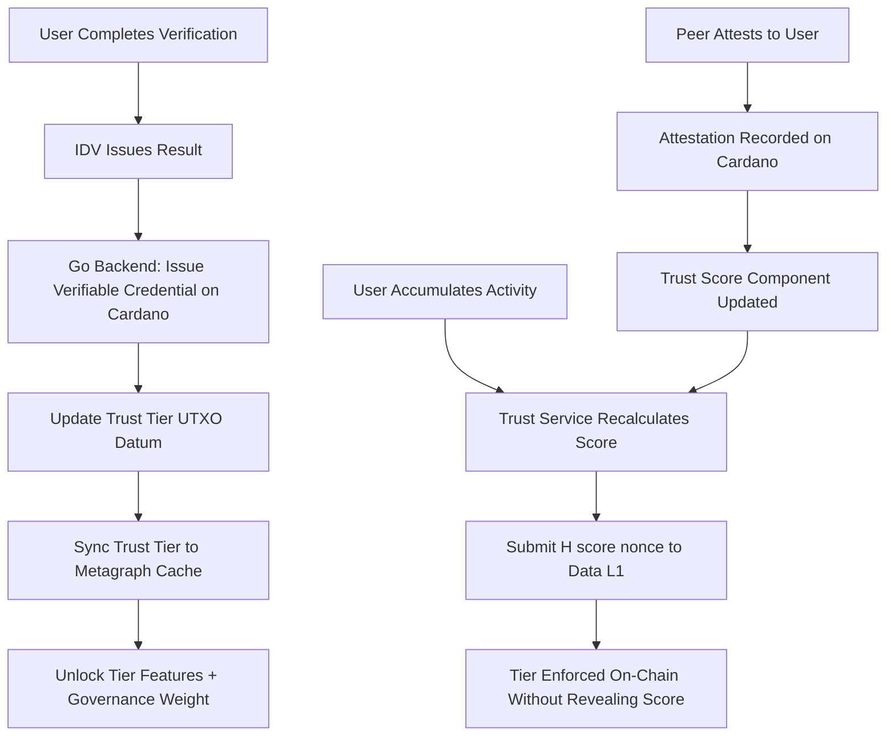
```mermaid
graph TD
    A[User Completes Verification] --> B[IDV Issues Result]
    B --> C[Go Backend: Issue Verifiable Credential on Cardano]
    C --> D[Update Trust Tier UTXO Datum]
    D --> E[Sync Trust Tier to Metagraph Cache]
    E --> F[Unlock Tier Features + Governance Weight]
    G[User Accumulates Activity] --> H[Trust Service Recalculates Score]
    H --> I[Submit H score nonce to Data L1]
    I --> J[Tier Enforced On-Chain Without Revealing Score]
    K[Peer Attests to User] --> L[Attestation Recorded on Cardano]
    L --> N[Trust Score Component Updated]
    N --> H
```

## Trust Tiers

| Tier | Name | Verification Method | Reward Multiplier (Phase 3+) | Governance Multiplier (Phase 3+) |
| --- | --- | --- | --- | --- |
| 1 | Unverified | Self-registration | 1.0x | ×0.0 (cannot vote) |
| 2 | Newcomer | Email/phone | 1.2x | ×0.5 |
| 3 | Member | Third-party IDV (Stripe Identity / Sumsub) | 1.5x | ×1.0 |
| 4 | Verified | Government ID or Apple Digital ID | 2.0x | ×1.5 |
| 5 | Trusted | Peer attestations + sustained activity | 3.0x | ×2.0 |

## Trust Score Calculation

The trust score (0–100) is computed by the Go Trust Service from four weighted components and committed to Data L1 as `H(score || nonce)`.

| Component | Points | Source |
| --- | --- | --- |
| Verification level | 0–30 | Cardano credential type |
| Interaction history | 0–20 | Message count, account age, contacts, groups |
| On-chain behavior | 0–30 | Payment txns (Phase 3+), staking, governance votes (Phase 3+) |
| Report history | 0 to −20 | Spam/fraud reports received, blocks |

## Verification Badges

| Badge | Criteria | Display |
| --- | --- | --- |
| Email/Phone Verified | Tier 2 | Gray check |
| IDV Verified | Tier 3 — third-party IDV | Blue check |
| Identity Verified | Tier 4 — government ID or Apple Digital ID | Gold check |
| Trusted Community | Tier 5 — peer attestations | Gold check + star |
| Organization | ECHO Comply enterprise profile | Blue badge with org icon |

## Trusted Circles

| Circle | Criteria | Features Unlocked |
| --- | --- | --- |
| Inner Circle | Manually added | Highest priority, full feature access, hidden folder invites |
| Trusted | Tier 3+ contacts with interaction | Full messaging, payment rails (Phase 3+) |
| Acquaintance | All verified contacts | Standard messaging, group participation |
| Unknown | Unverified or new | Message request flow, limited features |

## Trust-Tier Weighted Governance (Phase 3+)

**Formula:** `GovernanceWeight = StakedECHO × TrustTierMultiplier`

A Tier 1 whale with 50M staked ECHO gets zero governance weight. The CEO's 100M staked ECHO at Tier 5 = 200M effective weight — the same as 10,000 Tier 5 community members each staking 10K ECHO. Governance weight is enforced by Data L1 Scala validation — not the Go backend.

Requirements to vote: active TokenLock (staked ECHO), Tier 2+, one DID per proposal. Founder vesting locks are eligible from genesis.

## Peer Attestation System (Tier 5 Path)

Tier 5 requires minimum 3 independent attestations from existing Tier 4+ users, evaluated for Sybil ring topology. Attestations are recorded on Cardano. Attestors can revoke — dropping below threshold downgrades to Tier 4 at next recalculation.

## Zero-Knowledge Trust Proofs (Phase 3+)

Via Midnight blockchain, users prove tier eligibility without revealing their score:

| Proof Type | Claim | Hides |
| --- | --- | --- |
| Trust tier minimum | "I am Tier 3+" | Exact score, credential details |
| KYC compliance | "I passed KYC" | Passport data, name, address |
| Age verification | "I am 18+" | Actual birthdate |
| Group membership | "I am in Group X" | Full membership list |

## On-Chain Report and Block Evidence

Reports and blocks create on-chain evidence via Data L1 submissions: `H(evidence || nonce)` commitment. Fraud reports trigger immediate score penalty. Multiple independent fraud reports from different users trigger automatic Tier 1 demotion pending review.

## Security Principles

* Trust tier commitments on-chain; raw scores never on-chain
* Verification badges are Cardano-anchored and tamper-proof
* Governance weight enforced by Data L1 Scala validation
* ZK proofs (Phase 3+) allow tier verification without credential exposure
* Peer attestation topology analysis prevents Sybil ring attacks

**Key Features:**

* Avatar upload and management
* Display name and username
* Bio and status messages
* Verification badge display
* Trust score visibility
* Last seen status (privacy-controlled)
* Online/offline status (privacy-controlled)
* Privacy settings configuration

### Contact Blocking & Management

Users can block other users to prevent them from sending messages, calling, or seeing online status. Blocked users are not notified of the block. Users can organize contacts into favorites and custom groups.

**Key Features:**

* Block/unblock functionality
* Blocked user list management
* Contact favorites
* Custom contact groups
* Contact search and filtering
* Contact organization

### Typing Indicators & Read Receipts

Typing indicators show when a user is actively typing a message in real-time. Read receipts show when a message has been delivered and read. Both features respect privacy settings and can be disabled by users.

**Key Features:**

* Real-time typing indicators
* Multiple users typing display
* 5-second typing timeout
* Delivery receipt tracking
* Read receipt tracking
* Privacy-controlled visibility
* Per-conversation settings

### Audio Messages (Voice Notes)

Users can record voice messages directly in the app. Voice messages are encrypted end-to-end, compressed, and transmitted through the messaging infrastructure. Voice messages support optional automatic transcription.

**Key Features:**

* Voice message recording (up to 5 minutes)
* Audio compression (Opus codec)
* End-to-end encryption
* Playback with speed control (0.75x-1.5x)
* Waveform visualization
* Optional transcription
* Transcription search support

### Call History

All voice and video calls are recorded in call history. Call history displays call type, duration, timestamp, and participants. Missed calls show a notification badge and indicator.

**Key Features:**

* Call type tracking (voice/video)
* Call duration recording
* Call timestamp storage
* Missed call indicators
* Call history filtering
* Contact-specific call history
* Call history search
* Missed call badges

### Notification Badges

Unread message count badges appear on the app icon and conversations. Missed call badges appear on contacts. Badge counts update in real-time and clear when messages are read or calls are viewed.

**Key Features:**

* App icon badge count
* Conversation-level badges
* Contact-level badges
* Missed call badges
* Real-time badge updates
* Muted conversation handling
* Archived conversation handling
* Badge configuration

### Message Search & Conversation Search

Users can search messages by keyword, sender, date range, or media type. Search results are highlighted with matching keywords and ranked by relevance and recency. Conversation search allows filtering by name or last message content.

**Key Features:**

* Full-text message search
* Sender filtering
* Date range filtering
* Media type filtering
* Fuzzy matching for typos
* Case-insensitive search
* Search result highlighting
* Conversation search
* Search result ranking

### Archive Conversations

Users can archive conversations to hide them from the main list while keeping them accessible. Archived conversations do not show badges or send notifications. Users can auto-archive old conversations based on inactivity.

**Key Features:**

* Archive/unarchive functionality
* Separate archive view
* Auto-archive by inactivity
* Configurable auto-archive period
* Archive search support
* No notifications for archived conversations
* No badges for archived conversations

### Privacy Settings

Users can control who can see their last seen, online status, profile picture, and status message. Privacy settings are stored locally and synced to the metagraph so other users respect the settings.

**Key Features:**

* Last seen visibility control
* Online status visibility control
* Profile picture visibility control
* Status message visibility control
* Group invite permissions
* Call permissions
* Per-contact privacy overrides
* Privacy setting enforcement

## Security Principles

* Trust scores are immutably recorded on Cardano
* Verification badges are blockchain-anchored and tamper-proof
* Privacy settings are enforced on both client and backend
* Blocked users cannot access blocked user's data
* Contact information is encrypted at rest
* Trust network operates without centralized authority
* User privacy is preserved through cryptographic commitments

## Voice and Video Calls with Screen Sharing

# Voice and Video Calls with Screen Sharing

## Overview

This feature provides high-quality voice and video calling capabilities with advanced screen sharing functionality, enabling users to conduct business meetings, technical support sessions, and collaborative work directly within the secure messaging environment. The system maintains end-to-end encryption for all audio, video, and screen content while leveraging the platform's trust infrastructure to verify participant identities and prevent unauthorized access to sensitive shared content.

## Architecture

The calling infrastructure uses WebRTC protocols enhanced with the platform's Noise Protocol encryption to ensure all call data remains private and tamper-proof. Calls are established through peer-to-peer connections when possible, with relay nodes providing fallback routing when direct connections are unavailable.

### Call Establishment Flow

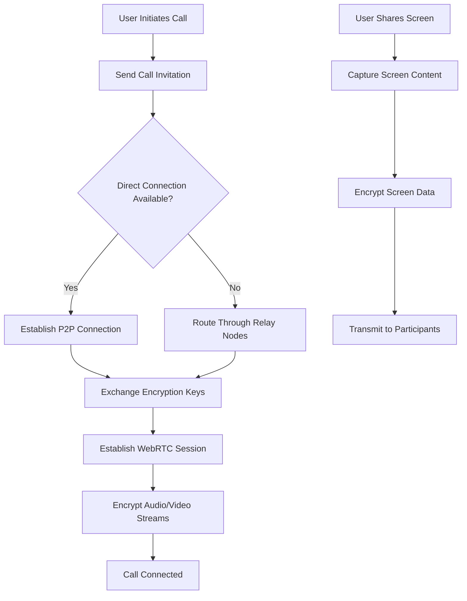
```mermaid
graph TD
    A[User Initiates Call] --> B[Send Call Invitation]
    B --> C{Direct Connection Available?}
    C -->|Yes| D[Establish P2P Connection]
    C -->|No| E[Route Through Relay Nodes]
    D --> F[Exchange Encryption Keys]
    E --> F
    F --> G[Establish WebRTC Session]
    G --> H[Encrypt Audio/Video Streams]
    H --> I[Call Connected]
    J[User Shares Screen] --> K[Capture Screen Content]
    K --> L[Encrypt Screen Data]
    L --> M[Transmit to Participants]
```

## Key Components

### Voice Calling

Users can initiate voice calls with individual contacts or groups. Voice calls support up to 50 participants with automatic quality adjustment based on network conditions. Voice is encrypted end-to-end using Noise Protocol.

**Key Features:**

* One-on-one and group voice calls
* Up to 50 participants per call
* Automatic quality adjustment
* Noise cancellation
* Speaker identification
* Mute/unmute functionality
* Call hold and resume
* Call transfer between contacts
* Call recording with consent
* Call history tracking

### Video Calling

Users can initiate video calls with individual contacts or groups. Video calls support up to 50 participants with automatic quality adjustment. Video is encrypted end-to-end using Noise Protocol.

**Key Features:**

* One-on-one and group video calls
* Up to 50 participants per call
* Automatic quality adjustment (720p to 1080p)
* Virtual backgrounds
* Beauty filters
* Camera switching (front/back)
* Mute/unmute functionality
* Video on/off toggle
* Call recording with consent
* Call history tracking
* Participant gallery view

### Screen Sharing

Users can share their entire screen, specific application windows, or selected desktop areas with call participants. Screen sharing is encrypted end-to-end and includes granular permission controls.

**Key Features:**

* Full screen sharing
* Application window sharing
* Selected area sharing
* Screen annotation tools
* Pointer highlighting
* Screen sharing permissions
* Recording prevention controls
* Screenshot prevention controls
* Screen sharing history
* Shared content encryption

### Call Quality Management

The system automatically adjusts call quality based on network conditions and device capabilities. Users can manually adjust quality settings for bandwidth optimization.

**Key Features:**

* Automatic quality adjustment
* Network condition detection
* Bandwidth optimization
* Manual quality settings
* Call statistics display
* Latency monitoring
* Packet loss detection
* Connection quality indicators
* Fallback to audio-only mode
* Network recovery handling

### Real-Time Transcription

Calls can be automatically transcribed in real-time for accessibility. Transcription is processed locally on user devices to maintain privacy.

**Key Features:**

* Real-time transcription
* Multiple language support
* Speaker identification
* Transcript search
* Transcript export
* Transcript sharing
* Accessibility features
* Privacy-preserving processing

### Call Scheduling

Users can schedule calls in advance with calendar integration. Scheduled calls send reminders and automatically initiate at the scheduled time.

**Key Features:**

* Call scheduling
* Calendar integration
* Reminder notifications
* Automatic call initiation
* Recurring call scheduling
* Time zone handling
* Participant invitations
* Meeting notes
* Agenda sharing

### Call Recording

Calls can be recorded with explicit participant consent. Recordings are encrypted and stored locally or in cloud storage.

**Key Features:**

* Recording with consent
* Participant notification
* Recording indicators
* Recording pause/resume
* Recording storage options
* Recording encryption
* Recording sharing
* Recording deletion
* Compliance recording for enterprises

### Call Metadata & Blockchain Anchoring

Call metadata including participant lists, duration, and quality metrics are recorded on the blockchain for audit purposes while maintaining participant privacy through zero-knowledge proofs.

**Key Features:**

* Call metadata recording
* Blockchain anchoring
* Participant list encryption
* Duration tracking
* Quality metrics recording
* Zero-knowledge proofs
* Audit trail creation
* Privacy preservation

### Verified Caller Identification

The system integrates with the trust scoring infrastructure to provide verified caller identification, reducing the risk of voice phishing attacks and impersonation during important business calls.

**Key Features:**

* Verified caller display
* Trust score indicators
* Verification badge display
* Caller identity verification
* Phishing attack prevention
* Impersonation detection
* Caller reputation display
* Caller history display

## Security Principles

* All call audio, video, and screen content is encrypted end-to-end using Kinnami (X25519 + ChaCha20-Poly1305) before transmission
* Calls are relayed through the Go backend relay by default — the relay transports opaque encrypted streams it cannot read
* Phase 4+ optional direct P2P via relay-assisted WebRTC signaling provides lower latency when both users are online
* Screen sharing content is encrypted before transmission; the relay cannot read screen content
* Call metadata (participant DIDs, duration, timestamps) is anchored on the metagraph for audit purposes — participant privacy preserved through hash commitments
* Recording requires explicit participant consent; recordings are encrypted at rest
* Verified caller identification via trust badges reduces voice phishing risk
* All call signaling and push notifications are TLS 1.3 encrypted and never expose call content

## Large File Sharing and Cloud Storage Integration

# Large File Sharing and Cloud Storage Integration

## Overview

This feature enables users to share files up to 2GB in size while maintaining end-to-end encryption and decentralized storage principles, addressing the need for secure document exchange in both personal and professional communications. The system combines IPFS distributed storage with blockchain anchoring to ensure file integrity and availability while providing seamless integration with popular cloud storage services for user convenience.

## Architecture

Files are encrypted end-to-end before leaving the user's device, then chunked and distributed across the IPFS network. Each chunk is encrypted with unique keys derived from the conversation's encryption context. File hashes are anchored to the Constellation blockchain to create immutable proof of file integrity.

### File Sharing Flow

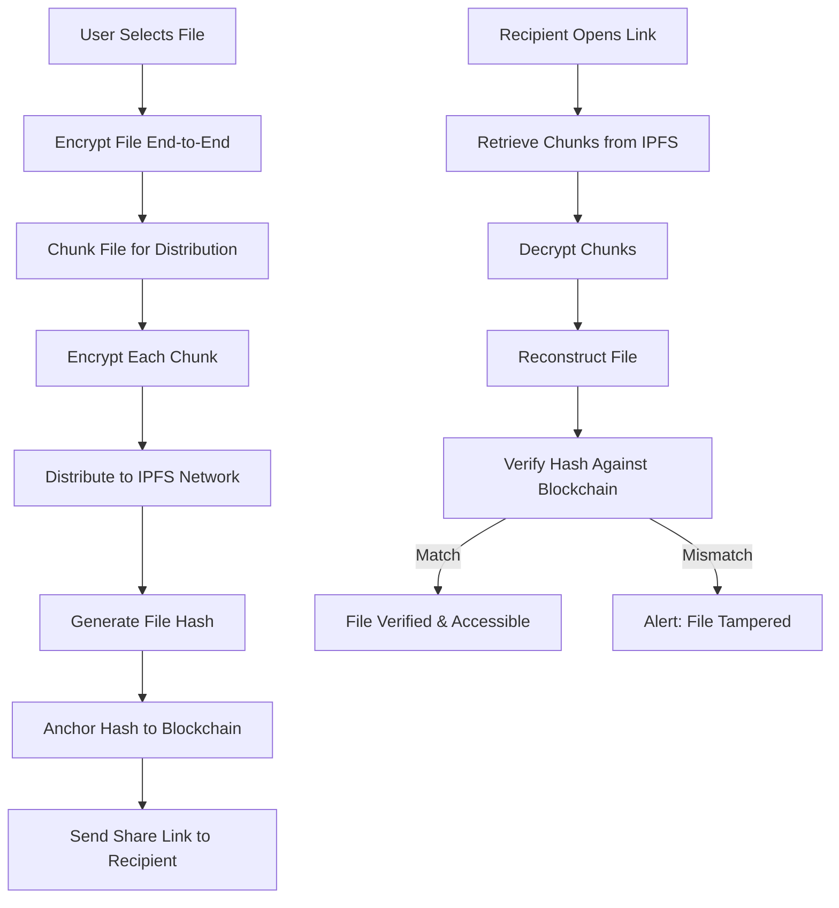
```mermaid
graph TD
    A[User Selects File] --> B[Encrypt File End-to-End]
    B --> C[Chunk File for Distribution]
    C --> D[Encrypt Each Chunk]
    D --> E[Distribute to IPFS Network]
    E --> F[Generate File Hash]
    F --> G[Anchor Hash to Blockchain]
    G --> H[Send Share Link to Recipient]
    I[Recipient Opens Link] --> J[Retrieve Chunks from IPFS]
    J --> K[Decrypt Chunks]
    K --> L[Reconstruct File]
    L --> M[Verify Hash Against Blockchain]
    M -->|Match| N[File Verified & Accessible]
    M -->|Mismatch| O[Alert: File Tampered]
```

## Key Components

### File Encryption

Files are encrypted end-to-end using Kinnami encryption before being uploaded to IPFS. Encryption keys are derived from the conversation's encryption context, ensuring only authorized recipients can decrypt files.

**Key Features:**

* End-to-end encryption with Kinnami
* Key derivation from conversation context
* Per-file encryption keys
* Encrypted metadata
* Key management and rotation
* Secure key transmission to recipients
* Encryption algorithm: AES-256-GCM

### File Chunking & Distribution

Large files are automatically chunked into smaller pieces (typically 256KB chunks) and distributed across the IPFS network. Each chunk is encrypted with a unique key derived from the file's master key.

**Key Features:**

* Automatic chunking (256KB default)
* Parallel chunk upload
* Chunk redundancy across IPFS nodes
* Chunk verification hashing
* Chunk retry on failure
* Bandwidth optimization
* Resume capability for interrupted uploads

### IPFS Storage Integration

Files are stored on the IPFS network, providing decentralized, redundant storage. The system uses IPFS pinning services to ensure files remain available even if the original uploader goes offline.

**Key Features:**

* IPFS node integration
* Pinning service integration
* Content addressing (IPFS hashes)
* Distributed storage
* Automatic replication
* Storage redundancy
* Garbage collection handling
* IPFS gateway fallback

### IPFS and Storj Storage

Files are stored using IPFS for distributed content-addressed storage, with Storj as the primary long-term storage provider for large media and audit trails. IPFS pinning services (Pinata / web3.storage) ensure files remain available even when the original uploader's node is offline. Storj provides encrypted, redundant object storage for files that require long-term availability beyond IPFS pinning windows.

**Key Features:**

* IPFS content addressing (CID-based retrieval)
* Pinata / web3.storage pinning (primary)
* Self-hosted IPFS node as secondary pin
* Storj overflow storage for large media (&gt;50MB)
* Automatic replication across IPFS nodes
* Storage deduplication via content hashing
* IPFS gateway fallback for retrieval
* Minimum 7-year retention for Organization tier audit files

### File Integrity Verification

File hashes are computed and anchored to the Constellation blockchain. Recipients can verify file integrity by comparing local file hashes with blockchain records.

**Key Features:**

* SHA-256 file hashing
* Constellation blockchain anchoring
* Hash verification by recipients
* Tamper detection and alerts
* Merkle tree construction for multiple files
* Blockchain confirmation tracking
* Integrity proof generation

### Cloud Storage Integration

Users can share files directly from popular cloud storage services including Google Drive, Dropbox, and OneDrive. Files are encrypted end-to-end while maintaining integration with cloud storage APIs.

**Key Features:**

* Google Drive integration
* Dropbox integration
* OneDrive integration
* OAuth authentication
* File selection from cloud storage
* Automatic encryption before sharing
* Cloud storage metadata preservation
* Revocation of cloud storage access

### Virus Scanning

Shared files are automatically scanned for malicious content through decentralized security oracles. Malicious content is blocked before distribution to recipients.

**Key Features:**

* Decentralized virus scanning
* Multiple antivirus engine integration
* Malware detection
* Ransomware detection
* Suspicious file blocking
* Scan result reporting
* Quarantine functionality
* Scan history tracking

### File Expiration & Cryptographic Deletion

Users can configure automatic file expiration for sensitive documents. Cryptographic deletion ensures files become permanently inaccessible after specified timeframes.

**Key Features:**

* Configurable expiration times
* Automatic deletion scheduling
* Cryptographic deletion verification
* Key destruction
* Blockchain deletion records
* Expiration notifications
* Manual deletion option
* Deletion confirmation

### File Management & Search

Users can organize shared files, search by filename or content type, and manage file permissions. File management features include version control for collaborative documents.

**Key Features:**

* File organization in folders
* File search by name and type
* File tagging
* File sorting and filtering
* File preview (images, documents)
* File download history
* File sharing history
* File permission management

### Collaborative Document Editing

The system supports collaborative document editing through integration with decentralized office suites. Multiple users can edit shared documents in real-time while maintaining the platform's privacy and security standards.

**Key Features:**

* Real-time collaborative editing
* Multiple user support
* Conflict resolution
* Version history
* Change tracking
* Comment and annotation
* Permission-based editing
* Offline editing with sync

## Security Principles

* Files are encrypted end-to-end before leaving the user's device
* File chunks are distributed across IPFS to prevent single-point access
* File hashes are immutably anchored to the blockchain
* Virus scanning prevents malicious content distribution
* Cryptographic deletion ensures permanent file removal
* File permissions are enforced through encryption keys
* User privacy is preserved through zero-knowledge proofs
* All file operations are logged on the blockchain for audit purposes

## Message Reactions, Polls, and Interactive Elements

# Message Reactions, Polls, and Interactive Elements

## Overview

This feature provides users with rich interactive communication tools including emoji reactions, polls, surveys, and interactive buttons that enhance group engagement while maintaining the platform's security and privacy standards. The system enables expressive communication and decision-making tools that rival traditional social media platforms while preserving end-to-end encryption and decentralized architecture.

## Architecture

Reactions and polls are treated as first-class message objects — encrypted, relayed, and anchored through the same pipeline as regular messages. Reactions are encrypted E2E and delivered via the WebSocket relay to conversation participants. Commitment hashes for reactions are included in Merkle batch anchoring alongside regular messages. Poll votes for governance proposals use the Tessellation v3 `AtomicAction` primitive via the metagraph. Standard chat polls use the relay model with aggregated results tallied client-side.

### Reaction & Poll Flow

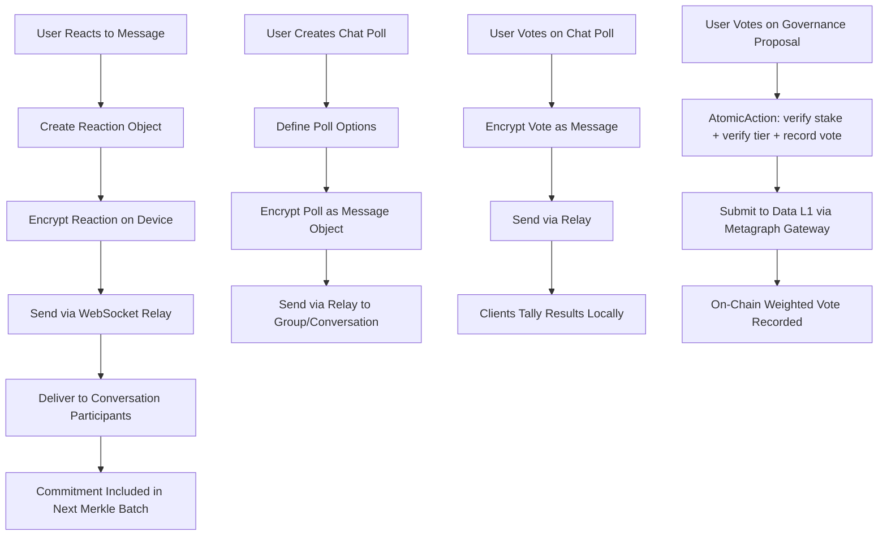
```mermaid
graph TD
    A[User Reacts to Message] --> B[Create Reaction Object]
    B --> C[Encrypt Reaction on Device]
    C --> D[Send via WebSocket Relay]
    D --> E[Deliver to Conversation Participants]
    E --> F[Commitment Included in Next Merkle Batch]
    G[User Creates Chat Poll] --> H[Define Poll Options]
    H --> I[Encrypt Poll as Message Object]
    I --> J[Send via Relay to Group/Conversation]
    K[User Votes on Chat Poll] --> L[Encrypt Vote as Message]
    L --> M[Send via Relay]
    M --> N[Clients Tally Results Locally]
    O[User Votes on Governance Proposal] --> P[AtomicAction: verify stake + verify tier + record vote]
    P --> Q[Submit to Data L1 via Metagraph Gateway]
    Q --> R[On-Chain Weighted Vote Recorded]
```

## Key Components

### Emoji Reactions

Users can react to messages using a comprehensive emoji library that includes standard Unicode emojis and custom reactions. The reaction system supports multiple reactions per user per message with real-time synchronization.

**Key Features:**

* Standard Unicode emoji library
* Custom reaction support
* Multiple reactions per user per message
* Reaction count aggregation
* Reaction list view
* Reaction removal
* Real-time synchronization
* Reaction notifications
* Reaction history tracking

### NFT Emojis

Custom VIP emoji packs allow VIP subscribers to use exclusive sticker sets and emoji reactions. Standard emoji reactions use the platform's built-in library with no blockchain dependency. Custom emoji uploads are supported for VIP users (upload your own reaction image). There is no NFT emoji trading marketplace in the initial implementation — this is reserved for potential Phase 5+ ecosystem expansion.

**Key Features:**

* Standard Unicode emoji reactions (all users)
* VIP exclusive emoji packs and sticker sets
* Custom emoji upload for VIP users
* Emoji reaction display in message threads
* Emoji reaction count aggregation
* Reaction list view (tap to see who reacted)
* Real-time reaction sync via relay

### Polls & Surveys

Users can create polls with multiple-choice answers within any conversation or group. Chat polls are standard encrypted message objects — votes are replies in the conversation thread, aggregated client-side. Governance polls use the metagraph Data L1 with trust-tier weighted `AtomicAction` voting (defined in the Dynamic Trust Network blueprint).

**Key Features:**

* Multiple choice poll creation in any conversation or group
* Anonymous voting option (recipient cannot link vote to sender)
* Time-limited polls with configurable expiration
* Real-time result updates via relay
* Client-side result tallying for chat polls
* On-chain weighted voting for governance proposals (AtomicAction)
* Trust-score weighted voting for group governance decisions
* Poll result visualization and export
* Poll history tracking

### Interactive Buttons

Users can create interactive messages that include buttons for quick responses, calendar scheduling, or e-commerce transactions. All interactions maintain the platform's security standards.

**Key Features:**

* Custom button creation
* Button action configuration
* Quick response buttons
* Calendar scheduling buttons
* Payment request buttons
* External app integration buttons
* Button click tracking
* Button result aggregation
* Button history

### Rich Media Reactions

Users can react to messages with voice note responses, photo reactions, and short video clips. Rich media reactions are automatically compressed and encrypted for efficient transmission.

**Key Features:**

* Voice note reactions
* Photo reactions
* Video clip reactions
* Automatic compression
* End-to-end encryption
* Reaction playback
* Reaction deletion
* Reaction notifications

### Reaction-Based Rewards

The system integrates with the ECHO token system to enable reaction-based rewards. Popular content creators can earn tokens based on engagement metrics while maintaining user privacy through anonymous interaction tracking.

**Key Features:**

* Reaction-based token rewards
* Engagement metric tracking
* Creator earnings calculation
* Anonymous interaction tracking
* Reward distribution
* Reward history
* Leaderboard display
* Reward withdrawal

### Poll Results & Analytics

Poll results and reaction data are anchored to the blockchain for transparency and audit purposes. Group administrators can view aggregated analytics while respecting individual user privacy.

**Key Features:**

* Blockchain-anchored results
* Result transparency
* Aggregated analytics
* Privacy-preserving reporting
* Result visualization
* Trend analysis
* Demographic breakdowns
* Export functionality

### Community Governance

Poll results can be used for community-driven decision making regarding group governance and platform development priorities. Smart contracts can automatically execute decisions based on poll outcomes.

**Key Features:**

* Governance poll creation
* Voting weight configuration
* Quorum requirements
* Automatic execution
* Smart contract integration
* Proposal tracking
* Voting history
* Governance transparency

## Security Principles

* All reactions and poll data are encrypted end-to-end
* Voting results are tallied through zero-knowledge proofs
* Voter privacy is preserved while ensuring result integrity
* Poll data is anchored to the blockchain for transparency
* Reaction data is stored in the metagraph for redundancy
* User privacy is maintained through anonymous interaction tracking
* All interactive elements maintain end-to-end encryption
* Governance decisions are transparent and auditable

## Advanced Message Search and Archive System

# Advanced Message Search and Archive System

## Overview

This feature provides users with powerful search capabilities across their entire message history while maintaining end-to-end encryption and privacy protection through client-side indexing and zero-knowledge search techniques. Users can quickly locate specific conversations, files, or information across years of communication history without compromising the security principles that protect their private communications.

## Architecture

The search system operates through local indexing where message content is processed and indexed on each user's device using privacy-preserving techniques. All search operations are performed locally to maintain privacy, with no message content exposed to external systems.

### Search & Archive Flow

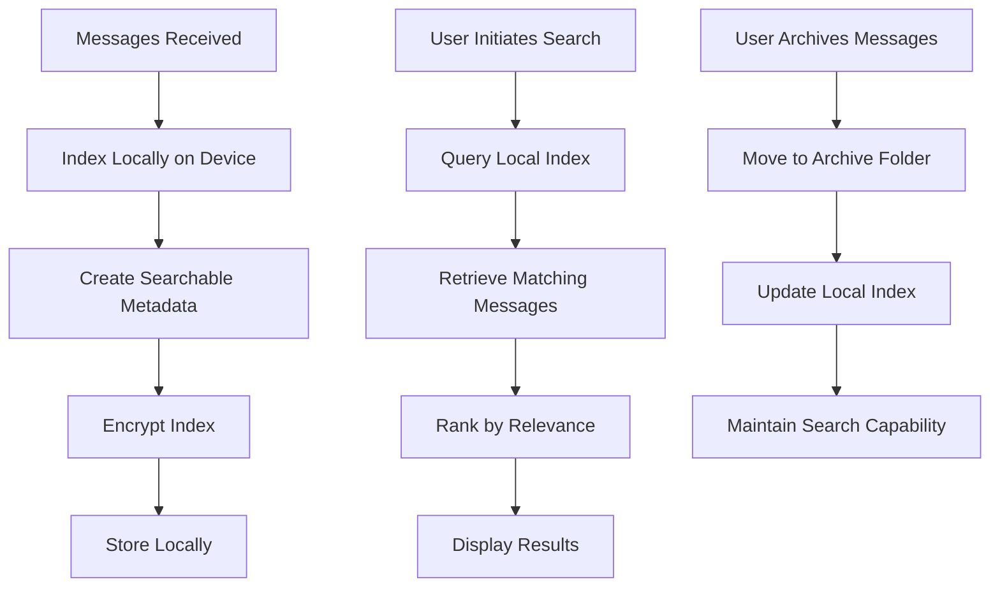
```mermaid
graph TD
    A[Messages Received] --> B[Index Locally on Device]
    B --> C[Create Searchable Metadata]
    C --> D[Encrypt Index]
    D --> E[Store Locally]
    F[User Initiates Search] --> G[Query Local Index]
    G --> H[Retrieve Matching Messages]
    H --> I[Rank by Relevance]
    I --> J[Display Results]
    K[User Archives Messages] --> L[Move to Archive Folder]
    L --> M[Update Local Index]
    M --> N[Maintain Search Capability]
```

## Key Components

### Local Message Indexing

Message content is processed and indexed on each user's device using privacy-preserving techniques that create searchable metadata without exposing message content to external systems. Indexing occurs automatically as messages are received.

**Key Features:**

* Automatic indexing on message receipt
* Local-only processing
* Privacy-preserving metadata creation
* Incremental index updates
* Index encryption at rest
* Index backup to user-controlled storage
* Index optimization for performance
* Index size management

### Keyword Search

Users can search by keywords to locate specific messages. Search results are ranked by relevance and recency. Fuzzy matching handles typos and variations.

**Key Features:**

* Full-text keyword search
* Fuzzy matching for typos
* Case-insensitive search
* Partial word matching
* Search result highlighting
* Result ranking by relevance
* Result ranking by recency
* Search history tracking

### Advanced Search Filters

Users can apply advanced filters to narrow search results by date range, sender identity, conversation context, or content type.

**Key Features:**

* Date range filtering
* Sender filtering
* Conversation filtering
* Content type filtering (text, images, files, links)
* Trust score filtering
* Verification status filtering
* Multiple filter combination
* Filter preset saving

### Semantic Search

The system supports semantic search that can locate messages based on meaning rather than exact keyword matches. Semantic search utilizes locally-processed natural language understanding that never exposes message content to external AI services.

**Key Features:**

* Semantic meaning matching
* Local NLP processing
* Concept-based search
* Intent recognition
* Context-aware results
* Synonym matching
* Related message suggestions
* Search refinement recommendations

### Archive Functionality

Users can organize their message history into custom categories and folders while maintaining the ability to search across archived content. The system supports automatic archiving based on user-defined rules.

**Key Features:**

* Custom archive folders
* Automatic archiving by inactivity
* Automatic archiving by content type
* Automatic archiving by trust score
* Archive search capability
* Archive browsing
* Archive restoration
* Archive deletion

### Archive Rules

Users can define rules for automatic archiving based on conversation inactivity, trust score thresholds, or content type classifications.

**Key Features:**

* Inactivity-based archiving
* Trust score-based archiving
* Content type-based archiving
* Custom rule creation
* Rule scheduling
* Rule modification
* Rule deletion
* Rule testing

### Secure Backup

Archived messages remain fully encrypted and accessible through the search interface. Users can configure secure backup to user-controlled storage locations including hardware devices or decentralized storage networks.

**Key Features:**

* Encrypted backup creation
* Hardware device backup
* Decentralized storage backup (IPFS/Filecoin)
* Cloud storage backup (encrypted)
* Backup scheduling
* Backup verification
* Backup restoration
* Backup deletion

### Cross-Device Search Synchronization

Search result sharing occurs through encrypted index sharing that allows users to search their complete message history from any device while maintaining end-to-end encryption.

**Key Features:**

* Encrypted index synchronization
* Cross-device search capability
* Index consistency verification
* Selective device synchronization
* Synchronization scheduling
* Bandwidth optimization
* Offline search support
* Sync conflict resolution

### Search Result Sharing

Users can create secure links to specific messages or conversations that can be shared with verified contacts while maintaining access controls and expiration settings.

**Key Features:**

* Secure message link generation
* Conversation link generation
* Access control configuration
* Expiration time setting
* Password protection
* View count limiting
* Link revocation
* Link tracking

### Search Analytics

The system provides analytics on search patterns and frequently searched terms to help users understand their communication history and optimize their search strategies.

**Key Features:**

* Search frequency tracking
* Popular search terms
* Search trend analysis
* Search performance metrics
* Search result quality metrics
* User search behavior insights
* Privacy-preserving analytics
* Analytics export

## Security Principles

* All search operations are performed locally on the user's device
* Message content is never exposed to external search services
* Search indexes are encrypted at rest
* Semantic search uses local NLP processing only
* Archive data remains fully encrypted
* Backup data is encrypted before transmission
* Cross-device synchronization uses encrypted channels
* User privacy is preserved through local-only processing

## ECHO Comply eDiscovery Integration

For ECHO Comply Organization-tier users, the message search infrastructure powers the backend eDiscovery export engine. Standard consumer search is device-local and privacy-preserving; ECHO Comply eDiscovery is admin-initiated server-side and operates over a custodian's archived message metadata (never plaintext content — always encrypted blobs with their commitment hashes and Digital Evidence references).

### How Search Feeds eDiscovery

When an administrator issues `POST /comply/ediscovery/export`, the Comply Service queries the backend search index using the following parameters:

```go
type EDiscoveryQuery struct {
    MatterID     string      // Links to active litigation hold or retention policy
    CustodianDIDs []string   // The organizational users whose messages are in scope
    DateRange    TimeRange   // From/To timestamps
    Keywords     []string    // Optional keyword filters (searched against commitment metadata)
    IncludeAttachments bool  // Whether to include media fingerprint references
    ExcludePrivileged  bool  // Exclude attorney-client privilege-designated messages (law firm tier)
}
```

The search index for ECHO Comply contains per-message metadata (message ID, timestamp, custodian DID, conversation ID, Digital Evidence event ID, Merkle root reference) — but never message plaintext. Keyword filtering operates against this metadata only; actual message content is never decrypted server-side.

### Two Search Modes

| Mode | Who uses it | Where executed | Privacy model |
| --- | --- | --- | --- |
| **Consumer search** | ECHO Message users | On device, local index only | Content never leaves device |
| **eDiscovery search** | ECHO Comply admins (Comply Service) | Server-side metadata index | Operates on encrypted blobs + metadata; no plaintext access |

### Backend Index (ECHO Comply Only)

The Go backend maintains a compliance metadata index for ECHO Comply organizations. This index stores only T5–T7 data (commitment hashes, Digital Evidence event IDs, timestamps, DID references) and is segregated from consumer data. The index is encrypted at rest and accessible only to the Comply Service with organization admin authentication.

```go
// ComplianceMessageIndex — backend metadata index for eDiscovery
type ComplianceMessageIndex struct {
    MessageID       string    // Opaque message identifier
    OrgDID          string    // Organization the custodian belongs to
    CustodianDID    string    // Sender/recipient DID
    ConversationID  string    // Conversation reference
    Timestamp       time.Time
    MerkleRootRef   string    // Data L1 Merkle root anchor reference
    DEEventID       string    // Digital Evidence API event ID (if fingerprinted)
    IsPrivileged    bool      // Attorney-client privilege designation (law firm tier)
    RetentionPolicy string    // "hipaa_6yr" | "permanent" | "litigation_hold"
    MatterID        string    // Legal matter ID if covered by hold
}
```

### eDiscovery Search Flow

```plaintext
Admin initiates export (Comply Service):
  1. Query ComplianceMessageIndex with EDiscoveryQuery
  2. Retrieve matching message IDs + Digital Evidence event IDs
  3. Fetch encrypted blobs from relay offline store (IPFS CIDs)
  4. Package: encrypted blobs + Merkle proof refs + DE event IDs + metadata
  5. Compute export checksum → anchor to Data L1
  6. Deliver encrypted export package to admin
```

**Important:** The Comply Service never decrypts message content during eDiscovery. The export package contains encrypted blobs that only the original participants can decrypt. This preserves end-to-end encryption even in an enterprise compliance context — ECHO cannot be compelled to produce plaintext because it does not have it.

## Hidden Folders with Biometric Protection

# Hidden Folders with Biometric Protection

## Overview

This feature provides users with secure, biometrically-protected folders for sensitive one-on-one conversations that require additional privacy layers beyond standard end-to-end encryption. Hidden folders remain completely invisible in the main chat interface and can only be accessed through successful biometric authentication, creating a secure vault for confidential communications that protects against unauthorized access even if the device is compromised.

## Architecture

Hidden folders use biometric-derived encryption keys bound to the user's biometric template. The system integrates with the device's secure enclave to ensure biometric templates and derived encryption keys never leave the hardware security module.

### Hidden Folder Access Flow

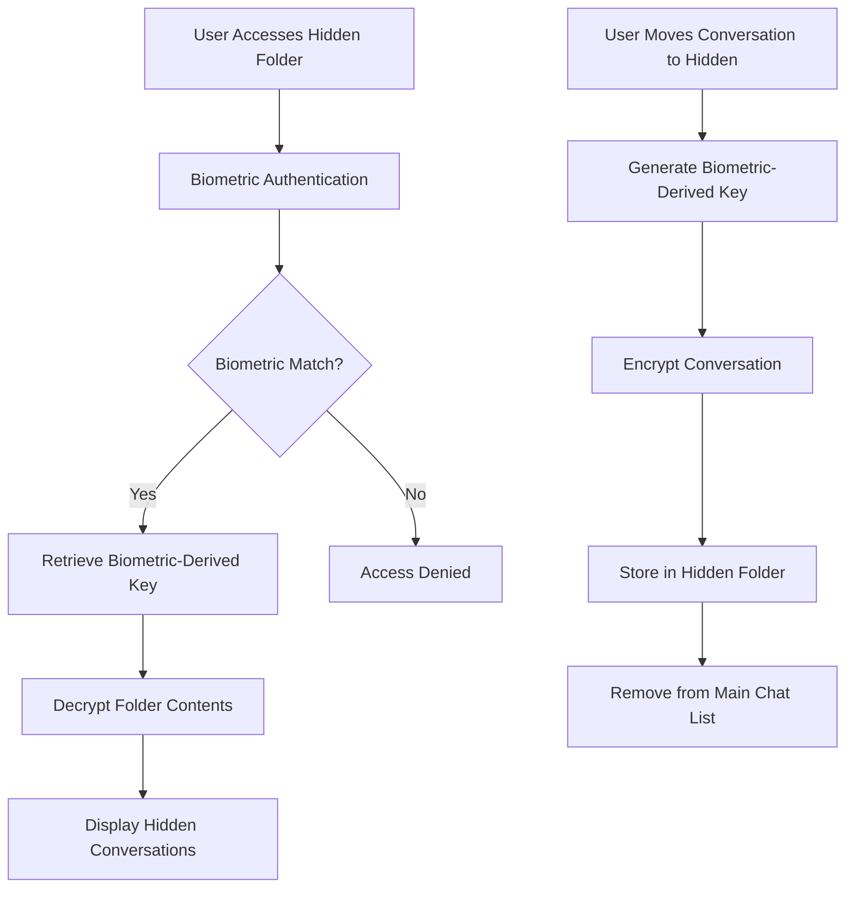
```mermaid
graph TD
    A[User Accesses Hidden Folder] --> B[Biometric Authentication]
    B --> C{Biometric Match?}
    C -->|Yes| D[Retrieve Biometric-Derived Key]
    C -->|No| E[Access Denied]
    D --> F[Decrypt Folder Contents]
    F --> G[Display Hidden Conversations]
    H[User Moves Conversation to Hidden] --> I[Generate Biometric-Derived Key]
    I --> J[Encrypt Conversation]
    J --> K[Store in Hidden Folder]
    K --> L[Remove from Main Chat List]
```

## Key Components

### Biometric Authentication

Users authenticate using Face ID, Touch ID, or other biometric verification methods supported by their device. Biometric authentication is required to access hidden folders.

**Key Features:**

* Face ID authentication
* Touch ID authentication
* Fallback PIN code
* **Duress PIN** — a secondary PIN that, when entered under coercion, opens a decoy empty folder indistinguishable from a real hidden folder. The real folder remains inaccessible. Implemented as `HiddenFolderAccessController` with two modes: `realFolder(biometricToken)` and `decoyFolder(duressToken)`. No timing difference between the two code paths.
* Biometric template binding
* Secure enclave integration
* Failed attempt tracking
* Lockout after failed attempts

### Biometric-Derived Encryption Keys

Hidden folder encryption keys are derived from the user's biometric template, ensuring that even if someone gains access to the device, they cannot access hidden conversations without the correct biometric signature.

**Key Features:**

* Biometric-derived key generation
* Key binding to biometric template
* Key derivation function (PBKDF2)
* Unique key per hidden folder
* Key rotation on biometric update
* Key escrow prevention
* Secure key storage in enclave
* Key destruction on biometric removal

### Hidden Folder Management

Users can create multiple hidden folders with different access requirements. Each hidden folder maintains its own message history, notification settings, and backup protocols.

**Key Features:**

* Multiple hidden folder creation
* Custom folder naming
* Folder-specific access requirements
* Folder-specific notification settings
* Folder-specific backup settings
* Folder organization
* Folder deletion with secure wipe
* Folder recovery options

### Conversation Moving

Users can move one-on-one conversations to hidden folders. Moving a conversation removes it from the main chat list and encrypts it with biometric-derived keys.

**Key Features:**

* Conversation selection
* Move to hidden folder
* Conversation encryption
* Main list removal
* Conversation history preservation
* Notification setting changes
* Backup setting changes
* Move reversal

### Enhanced Encryption

Messages within hidden folders use enhanced encryption that combines the standard Noise Protocol implementation with biometric-derived key material, creating multi-layered security.

**Key Features:**

* Noise Protocol encryption
* Biometric-derived key material
* Multi-layered encryption
* Key ratcheting
* Forward secrecy
* Message authentication codes
* Replay attack prevention
* Encryption algorithm: AES-256-GCM

### Notification Management

Users can configure custom notification behaviors for hidden conversations, including silent notifications that appear only when the folder is unlocked, or complete notification suppression.

**Key Features:**

* Silent notifications
* Locked folder notifications
* Unlocked folder notifications
* Notification suppression
* Custom notification sounds
* Notification badges
* Notification preview control
* Notification scheduling

### Secure Enclave Integration

Hidden folder metadata is encrypted and stored locally on the device rather than synchronized across multiple devices. Biometric templates and derived encryption keys are stored in the device's secure enclave.

**Key Features:**

* Secure enclave storage
* Local-only metadata storage
* No cloud synchronization
* Biometric template protection
* Key material protection
* Tamper detection
* Secure deletion
* Hardware security module integration

### Secure Backup

Users can optionally enable secure backup of hidden folders through additional biometric verification combined with a recovery phrase. Backups are encrypted and stored securely.

**Key Features:**

* Biometric-protected backup
* Recovery phrase generation
* Encrypted backup storage
* Backup restoration
* Multi-device restoration
* Backup verification
* Backup deletion
* Backup scheduling

### Access Logging

All access to hidden folders is logged locally for security auditing. Users can view access logs to detect unauthorized access attempts.

**Key Features:**

* Access timestamp logging
* Biometric method logging
* Failed attempt logging
* Access duration logging
* Device information logging
* Location logging (optional)
* Access log encryption
* Access log retention

## Security Principles

* Biometric templates are stored exclusively in the secure enclave
* Encryption keys are derived from biometric templates and never transmitted
* Hidden folder metadata is encrypted and stored locally
* Messages within hidden folders use multi-layered encryption
* Biometric authentication is required for all access
* Access logs are maintained for security auditing
* Secure backup requires additional biometric verification
* All communication is encrypted in transit with TLS 1.3+

## Silent and Scheduled Private Chats

# Silent and Scheduled Private Chats

## Overview

This feature enables users to send messages that generate no notifications or visible indicators on the recipient's device, while also supporting scheduled message delivery for time-sensitive communications across different time zones or planned conversations. The system provides granular control over message visibility and timing while maintaining end-to-end encryption and blockchain anchoring for all communications.

## Architecture

Silent messages use enhanced metadata handling where notification suppression flags are embedded in the encrypted message payload. Scheduled messages use time-locked encryption where the message content is encrypted with keys that are only released at the specified delivery time through smart contract automation.

### Silent & Scheduled Message Flow

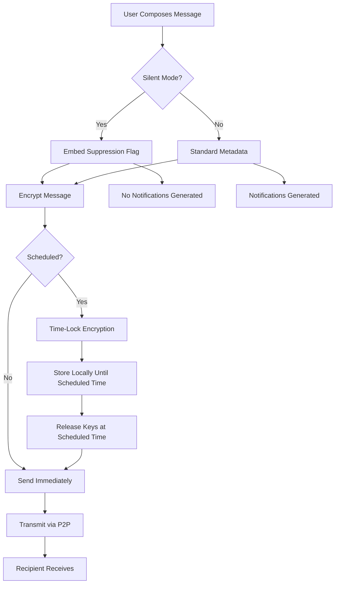
```mermaid
graph TD
    A[User Composes Message] --> B{Silent Mode?}
    B -->|Yes| C[Embed Suppression Flag]
    B -->|No| D[Standard Metadata]
    C --> E[Encrypt Message]
    D --> E
    E --> F{Scheduled?}
    F -->|Yes| G[Time-Lock Encryption]
    F -->|No| H[Send Immediately]
    G --> I[Store Locally Until Scheduled Time]
    I --> J[Release Keys at Scheduled Time]
    J --> H
    H --> K[Transmit via P2P]
    K --> L[Recipient Receives]
    C --> M[No Notifications Generated]
    D --> N[Notifications Generated]
```

## Key Components

### Silent Mode

Users can activate silent mode for individual conversations or specific messages, which suppresses all notification behaviors including push notifications, badge counts, typing indicators, and read receipts on the recipient's device.

**Key Features:**

* Per-conversation silent mode
* Per-message silent mode
* Push notification suppression
* Badge count suppression
* Typing indicator suppression
* Read receipt suppression
* Silent mode indicators
* Silent mode duration configuration

### Silent Message Delivery

Silent messages appear in the conversation thread only when the recipient actively opens the chat, creating a non-intrusive communication channel for sensitive or low-priority messages.

**Key Features:**

* Silent message appearance in thread
* No notification indicators
* No badge updates
* No typing indicators
* No read receipts
* Silent message marking
* Silent message history
* Silent mode toggle per message

### Notification Suppression Flags

Notification suppression flags are embedded in the encrypted message payload, ensuring that even relay nodes cannot determine which messages should generate notifications.

**Key Features:**

* Encrypted suppression flags
* Relay node privacy
* Flag verification
* Flag tampering prevention
* Flag encryption with message
* Flag decryption by recipient
* Flag audit logging
* Flag compliance verification

### Message Scheduling

Users can compose messages that are delivered at predetermined times. Messages are encrypted and stored locally on the sender's device until the scheduled delivery time. iOS background tasks wake the app at the scheduled time to transmit the message via the WebSocket relay.

**Scheduling limits by tier:**

| Tier | Max Advance Scheduling | Recurring Support |
| --- | --- | --- |
| Free | Up to 1 week | No |
| VIP ($9.99/month) | Up to 1 year | Yes (daily, weekly, monthly) |

**Key Features:**

* Message scheduling up to 1 week (free) / 1 year (VIP)
* Preset time options (in 1 hour, tomorrow morning, next week)
* Custom date/time selector with timezone support
* Recurring message scheduling (VIP only)
* Message editing or cancellation before delivery
* Delivery confirmation with timestamp
* Scheduled message list with pending/sent status
* iOS BGProcessingTask for reliable background delivery

### Local Encrypted Message Queue

Scheduled messages are encrypted on-device and stored in the local SwiftData database under iOS Data Protection (`NSFileProtectionComplete`). No server coordination or on-chain smart contract is needed for scheduling.

```swift
struct ScheduledMessage {
    let id: String
    let conversationId: String
    let encryptedPayload: Data     // Already E2E encrypted — same as live messages
    let commitment: Data           // For Merkle anchoring on delivery
    let scheduledAt: Date          // Delivery time (user's local timezone)
    let recipientDID: String
    let isSilent: Bool
    let isRecurring: Bool
    let recurrenceRule: RecurrenceRule?
    let createdAt: Date
}

// iOS background task delivers the message at scheduled time
class ScheduledMessageDeliveryTask: BGProcessingTask {
    func deliver(_ message: ScheduledMessage) async throws {
        // 1. Wake relay WebSocket connection
        // 2. Transmit encrypted payload via relay (same as live messages)
        // 3. Track commitment for Merkle anchoring
        // 4. Remove from local queue on success
        // 5. Retry with exponential backoff on failure
    }
}
```

**Key Features:**

* Local SwiftData storage with `NSFileProtectionComplete`
* No server-side scheduling infrastructure required
* Delivery via standard WebSocket relay on schedule
* Commitment anchored in Merkle batch at delivery time (not at compose time)
* Failed delivery retries with exponential backoff
* Automatic cleanup of delivered messages from queue

### Cross-Timezone Scheduling

The system supports cross-timezone scheduling with automatic conversion based on recipient location preferences while maintaining privacy through zero-knowledge proofs.

**Key Features:**

* Timezone detection
* Automatic timezone conversion
* Recipient timezone preferences
* Timezone-aware scheduling
* Daylight saving time handling
* Timezone verification
* Privacy-preserving timezone handling
* Timezone error prevention

### Trust Score Limitations

The feature integrates with the existing trust scoring system to prevent abuse, where users with low trust scores face limitations on silent messaging frequency to prevent spam or harassment.

**Key Features:**

* Trust score-based rate limiting
* Silent message frequency limits
* Scheduled message frequency limits
* Trust score thresholds
* Limit escalation
* Limit enforcement
* Limit appeals
* Limit transparency

### Blockchain Anchoring

Scheduled messages maintain full blockchain anchoring and provable integrity features, with delivery timestamps cryptographically verified to ensure messages were sent at the intended time.

**Key Features:**

* Message hash anchoring
* Delivery timestamp anchoring
* Blockchain confirmation
* Timestamp verification
* Integrity proof generation
* Proof sharing capability
* Audit trail creation
* Compliance recording

### Delivery Confirmation

Users receive confirmation when scheduled messages are delivered. Delivery confirmations include timestamp verification and blockchain proof.

**Key Features:**

* Delivery notifications
* Timestamp confirmation
* Blockchain proof display
* Delivery status tracking
* Failed delivery handling
* Retry automation
* Delivery history
* Delivery analytics

## Security Principles

* Silent message suppression flags are encrypted inside the message payload — relay nodes cannot determine which messages are silent
* Scheduled messages are encrypted on-device before local storage using the same Kinnami encryption as live messages (X25519 + ChaCha20-Poly1305)
* Local scheduled message queue is protected by iOS Data Protection (`NSFileProtectionComplete`)
* No server-side scheduling infrastructure — the relay is only involved at delivery time, not at compose time
* Commitment hashes are anchored in the standard Merkle batch at delivery time
* Blockchain anchoring provides immutable delivery timestamps verifiable on DAG Explorer
* Trust tier limits prevent abuse (low-trust users have frequency caps on silent messages)
* All communication is encrypted end-to-end via the content-blind WebSocket relay

## Disappearing Messages with Cryptographic Verification

# Disappearing Messages with Cryptographic Verification

## Overview

This feature provides users with the ability to send messages that automatically delete from all devices after predetermined time periods while maintaining cryptographic proof that the messages existed and were delivered. The system ensures that sensitive communications can be ephemeral while preserving audit trails through blockchain-anchored commitment hashes—proving a conversation occurred without revealing what was said.

**Key Innovation:** Message commitment hashes are anchored in Merkle batches on-chain before expiration. After the timer expires, plaintext is deleted from all devices, but the on-chain Merkle root persists indefinitely as immutable proof of existence.

## Architecture

Messages are encrypted end-to-end using standard Kinnami encryption (X25519 + ChaCha20-Poly1305). Commitment hashes are generated and anchored in Merkle batches on the Data L1 layer. Client-side timers trigger plaintext deletion at expiration time. The on-chain Merkle root remains as proof that "a message existed at this time" without revealing content.

**Privacy/Auditability Tradeoff:** The on-chain Merkle root persists indefinitely, but individual commitments become unverifiable after plaintext deletion (users can no longer regenerate the commitment hash from deleted plaintext). This preserves privacy (no one can read the deleted message) while maintaining auditability (the blockchain proves a message existed at that timestamp).

### Disappearing Message Flow

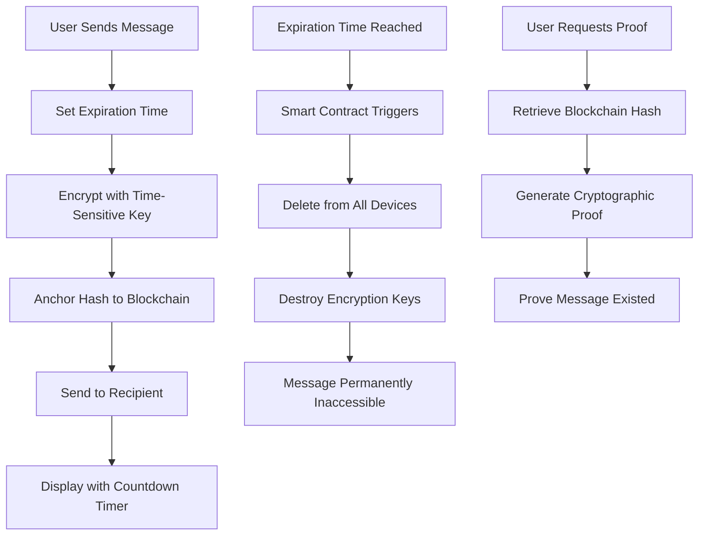
```mermaid
graph TD
    A[User Sends Message] --> B[Set Expiration Time]
    B --> C[Encrypt with Time-Sensitive Key]
    C --> D[Anchor Hash to Blockchain]
    D --> E[Send to Recipient]
    E --> F[Display with Countdown Timer]
    G[Expiration Time Reached] --> H[Smart Contract Triggers]
    H --> I[Delete from All Devices]
    I --> J[Destroy Encryption Keys]
    J --> K[Message Permanently Inaccessible]
    L[User Requests Proof] --> M[Retrieve Blockchain Hash]
    M --> N[Generate Cryptographic Proof]
    N --> O[Prove Message Existed]
```

## Key Components

### Disappearing Message Configuration

Users can enable disappearing messages for individual conversations or specific messages. The available expiration range depends on the user's tier — free tier is limited to a 24-hour maximum to prevent evidence destruction abuse, while VIP subscribers can set timers up to 1 year for long-lived but eventually ephemeral conversations.

**Expiration limits by tier:**

| Tier | Minimum | Maximum | Custom Timing |
| --- | --- | --- | --- |
| Free (Tier 1–2) | 1 hour | 24 hours | No |
| Free (Tier 3–5) | 10 seconds | 24 hours | No |
| VIP ($9.99/month) | 10 seconds | 1 year | Yes |
| Organization | Disabled if legal hold active | Disabled if legal hold active | N/A |

**Key Features:**

* Preset time intervals (10 seconds, 1 minute, 5 minutes, 1 hour, 1 day, 7 days)
* Extended options for VIP: 30 days, 90 days, 6 months, 1 year
* Per-conversation settings (all messages disappear after timer)
* Per-message settings (single message with custom timer)
* Default expiration configuration per conversation
* Expiration time visible in message metadata
* Warning indicators for disappearing conversations
* Trust tier enforcement (Tier 1 minimum: 1 hour, prevents harassment abuse)

### Countdown Timers

Messages display countdown timers that show remaining visibility time to all participants, creating transparency about message lifecycle.

**iOS Implementation:**

```swift
struct DisappearingMessageView: View {
    let message: Message
    @State private var timeRemaining: TimeInterval
    
    var body: some View {
        HStack {
            MessageBubble(message: message)
            
            if let expiresAt = message.expiresAt {
                CountdownTimer(expiresAt: expiresAt) { expired in
                    if expired {
                        deleteMessageLocally(message.id)
                    }
                }
            }
        }
    }
}

struct CountdownTimer: View {
    let expiresAt: Date
    let onExpire: (Bool) -> Void
    @State private var timeRemaining: TimeInterval = 0
    
    var body: some View {
        Text(formatTime(timeRemaining))
            .font(.caption)
            .foregroundColor(.secondary)
            .onAppear {
                startTimer()
            }
    }
    
    private func startTimer() {
        Timer.scheduledTimer(withTimeInterval: 1.0, repeats: true) { timer in
            timeRemaining = expiresAt.timeIntervalSinceNow
            if timeRemaining <= 0 {
                timer.invalidate()
                onExpire(true)
            }
        }
    }
}
```

**Key Features:**

* Real-time countdown display
* Timer visibility to all participants
* Timer completion triggers local deletion
* Timer format options (5:23, "in 5 minutes")
* Accessibility support for countdown announcements

### Client-Side Deletion Mechanism

When the expiration timer reaches zero, each client independently deletes the message plaintext and encryption keys from local storage. No server coordination is required—each device's timer triggers local deletion.

**iOS Deletion Process:**

```swift
func deleteMessageLocally(_ messageId: String) async {
    // 1. Delete plaintext from SwiftData
    try? await database.deleteMessage(messageId)
    
    // 2. Delete encryption keys from Keychain
    try? keychain.deleteKey(for: messageId)
    
    // 3. Delete any cached media
    try? mediaCache.deleteMedia(for: messageId)
    
    // 4. Clear from memory
    messageCache.removeValue(forKey: messageId)
    
    // 5. Log deletion event (local only)
    logger.log("Message \(messageId) expired and deleted")
    
    // Note: Commitment hash remains in local storage for proof generation
    // On-chain Merkle root persists indefinitely
}
```

**What Gets Deleted:**

* ✅ Message plaintext
* ✅ Encryption keys (X25519, ChaCha20)
* ✅ Media attachments
* ✅ Message metadata (sender, timestamp)
* ❌ **Commitment hash** (kept for proof generation)
* ❌ **On-chain Merkle root** (immutable, persists forever)

**What Remains as Proof:**

* On-chain Merkle root (proves message existed)
* Commitment hash (local, cannot verify without plaintext)
* Timestamp (when message was sent)
* Conversation ID (which conversation it belonged to)

**Key Features:**

* Independent client-side deletion (no server coordination)
* Timer-triggered deletion (iOS background tasks)
* Secure deletion (overwrite sensitive data)
* Deletion verification (check storage cleared)
* Failed deletion handling (retry on next app launch)
* Deletion logging (local audit trail)

### Blockchain-Anchored Commitment Hashes

Disappearing messages generate commitment hashes like standard messages: `commitment = H(H(plaintext) || nonce)`. These commitments are included in Merkle batches and anchored on the Data L1 layer **before** the expiration timer starts.

**Anchoring Timeline:**

```plaintext
T=0:      Message sent, commitment generated
T=0-5min: Commitment added to Merkle batch
T=5min:   Merkle root anchored on Data L1
T=5-10s:  Metagraph consensus finalizes
T=10s:    On-chain confirmation received
T=10s+:   Timer counts down from expiration time
T=expire: Plaintext deleted, commitment becomes unverifiable
Forever:  Merkle root persists on-chain as proof
```

**Why Anchor Before Deletion:**

Without pre-anchoring, a user could send a disappearing message, then claim "I never sent that" after deletion. With pre-anchoring, the on-chain Merkle root proves "a message existed at timestamp T from this device" even though the content is now deleted.

**Key Features:**

* Commitment hash generated before send
* Anchored in standard Merkle batch (5min/1000 msgs)
* On-chain confirmation before deletion
* Merkle proof verifiable before deletion
* Merkle root persists after deletion (proof of existence)
* Commitment becomes unverifiable after deletion (privacy preserved)

### Cryptographic Proof Generation

Users can generate cryptographic proofs that demonstrate message existence and delivery timestamps without revealing message content. This is critical for legal and compliance scenarios.

**Proof Structure:**

```swift
struct DisappearingMessageProof {
    let messageId: String
    let conversationId: String
    let senderDID: String
    let recipientDID: String
    let timestamp: Date
    let expiresAt: Date
    let snapshotHash: String         // On-chain snapshot
    let snapshotHeight: Int          // On-chain height
    let merkleRoot: Data             // On-chain Merkle root
    let merkleProof: [Data]?         // Siblings for verification
    let commitmentHash: Data         // Local (unverifiable after deletion)
    let proofType: ProofType
    
    enum ProofType {
        case beforeDeletion    // Full Merkle proof with verifiable commitment
        case afterDeletion     // Merkle root only, commitment unverifiable
    }
}

func generateProof(messageId: String) -> DisappearingMessageProof? {
    let message = database.fetchDeletedMessage(messageId)
    let anchoringInfo = database.fetchAnchoringInfo(messageId)
    
    let canVerifyCommitment = (message?.plaintext != nil)
    
    return DisappearingMessageProof(
        // ... populate fields
        proofType: canVerifyCommitment ? .beforeDeletion : .afterDeletion
    )
}
```

**Proof Capabilities:**

| Proof Type | Can Prove | Cannot Prove |
| --- | --- | --- |
| Before Deletion | Message existed, exact content, Merkle inclusion | N/A |
| After Deletion | Message existed at timestamp, on-chain Merkle root | Message content, commitment verification |

**Key Features:**

* Proof generation from local storage + on-chain data
* Timestamped proof of existence
* Shareable proof format (JSON/PDF)
* Third-party verification (anyone can verify Merkle root on-chain)
* Proof expiration not applicable (on-chain data persists)
* Proof indicates deletion status (before/after)

### Trust Score Restrictions

The feature integrates with the trust scoring system to prevent abuse. Users with low trust scores face restrictions on very short disappearing timeframes to prevent harassment or evidence destruction.

**Restriction Matrix:**

| Trust Tier | Minimum Expiration | Maximum Per Day | Rationale |
| --- | --- | --- | --- |
| Tier 1 (Unverified) | 1 hour | 10 messages | Prevent spam/harassment |
| Tier 2 (Newcomer) | 5 minutes | 50 messages | Minimal restrictions |
| Tier 3 (Member) | 10 seconds | 200 messages | Full access |
| Tier 4 (Verified) | 10 seconds | Unlimited | Trusted user |
| Tier 5 (Trusted) | 10 seconds | Unlimited | Maximum trust |

**Key Features:**

* Trust tier-based minimum expiration times
* Daily message count limits for low-trust users
* Restriction enforcement (backend validation)
* Restriction transparency (UI shows limits)
* Restriction escalation on abuse patterns

### Screenshot & Forwarding Limitations

**iOS Platform Limitations:**

Apple does not provide APIs for detecting or preventing screenshots. Apps cannot:

* Detect when a screenshot is taken
* Prevent screenshots technically
* Receive notifications when screenshots occur

**What ECHO Can Do:**

1. **Warning UI**: Display prominent warning in disappearing message conversations: "⚠️ Screenshots cannot be prevented on iOS. Only send disappearing messages to trusted contacts."

2. **Social/Trust Mechanisms**:

   * Trust tier requirements for disappearing messages
   * Reputation damage for users who screenshot
   * Community reporting for screenshot abuse

3. **Forwarding Prevention**:

   * Disable forwarding UI for disappearing messages
   * Backend validation rejects forwarded disappearing messages
   * Warning if user tries to forward

4. **iOS Data Protection**:

   * Messages stored with `NSFileProtectionComplete`
   * Encrypted at rest when device locked
   * Secure enclave for encryption keys

**User Education:**

The app clearly communicates:

* Screenshots cannot be prevented on iOS
* Disappearing messages are trust-based, not foolproof
* Only use with trusted contacts
* For maximum privacy, use Hidden Folders + Disappearing Messages

### Compliance & Legal Discovery

The system maintains compliance with legal discovery requirements by preserving cryptographic evidence of communications while respecting user privacy through content deletion.

**Legal Hold Support:**

For Organization tier users subject to legal hold:

1. Backend flags conversations under legal hold
2. Disappearing messages are **disabled** for held conversations
3. All messages are retained until hold is lifted
4. Audit trail records hold status

**Evidence Preservation:**

Even for non-held conversations:

* On-chain Merkle roots prove message existence
* Timestamps prove when communication occurred
* Commitment hashes (if stored) prove message ID
* Cannot prove content after deletion

**Proof for Legal Purposes:**

```swift
func generateLegalProof(messageId: String) -> LegalProof {
    return LegalProof(
        exists: true,
        timestamp: message.timestamp,
        conversationId: message.conversationId,
        senderDID: message.senderDID,
        recipientDID: message.recipientDID,
        merkleRoot: anchoringInfo.merkleRoot,
        snapshotHash: anchoringInfo.snapshotHash,
        contentAvailable: false,  // Deleted
        legalHoldStatus: .notApplicable,
        verificationURL: "https://dagexplorer.io/snapshot/\(snapshotHash)"
    )
}
```

**Key Features:**

* Legal hold support (Org tier)
* Compliance recording of deletion events
* Evidence preservation via on-chain Merkle roots
* Discovery support (proof of existence, not content)
* Regulatory compliance (GDPR right to be forgotten)
* Audit trail maintenance (local logs + on-chain)
* Privacy preservation (content deleted)
* Legal proof generation (existence proof only)

## Security Principles

* Messages are encrypted end-to-end using Kinnami (X25519 + ChaCha20-Poly1305)
* Commitment hashes are anchored in Merkle batches before expiration
* Client-side timers trigger independent deletion (no server coordination)
* Plaintext is securely deleted from local storage on expiration
* Encryption keys are destroyed on expiration
* On-chain Merkle roots persist indefinitely as proof of existence
* Commitment hashes become unverifiable after deletion (privacy preserved)
* Cryptographic proofs demonstrate existence without revealing content
* Trust score limitations prevent abuse of short expiration times
* Screenshots cannot be prevented on iOS (user education + trust-based)
* Forwarding is disabled for disappearing messages
* Legal hold disables disappearing messages for compliance — see ECHO Comply Litigation Hold Enforcement section below
* All communication is encrypted end-to-end

## ECHO Comply Litigation Hold Enforcement

When an ECHO Comply litigation hold is active for a conversation's custodian, disappearing messages must be permanently disabled for that conversation. This is a non-negotiable compliance requirement — allowing evidence to auto-delete during a litigation hold would violate preservation obligations under the Federal Rules of Civil Procedure, HIPAA, FOIA, and equivalent regulations.

### Detection and Enforcement Flow

The backend Comply Service monitors active `litigation_hold` records on the Data L1. When a hold is activated or a new conversation is created involving a hold-covered custodian, the Comply Service pushes a hold status update to the Message Relay Service, which propagates it to all participants' iOS clients via WebSocket.

```go
// ComplyService: check and enforce hold on a conversation
func (cs *ComplyService) EnforceHoldOnConversation(
    ctx context.Context,
    conversationID string,
    custodianDIDs []string,
) (bool, error) {
    for _, did := range custodianDIDs {
        hold, err := cs.getActiveHold(ctx, did)
        if err != nil {
            return false, err
        }
        if hold != nil && hold.Status == "active" {
            // Broadcast hold-active status to all conversation participants
            cs.relay.BroadcastHoldStatus(conversationID, HoldStatusActive{
                MatterID:  hold.MatterID,
                HoldStart: hold.HoldStart,
            })
            return true, nil
        }
    }
    return false, nil
}
```

### iOS Client Behavior Under Litigation Hold

When the iOS client receives a `hold_active` WebSocket event for a conversation:

```swift
enum HoldState {
    case noHold                   // Normal operation
    case activeHold(matterID: String, holdStart: Date)  // Disappearing messages blocked
}

struct DisappearingMessageController {
    let holdState: HoldState

    var canSetDisappearingTimer: Bool {
        switch holdState {
        case .noHold: return true
        case .activeHold: return false  // Timer controls hidden from UI
        }
    }

    var userNotice: String? {
        switch holdState {
        case .noHold: return nil
        case .activeHold(let matterID, _):
            return "This conversation is under legal hold (Matter \(matterID)). Disappearing messages have been disabled."
        }
    }
}
```

**UI behavior under hold:**

1. The disappearing message timer control is hidden entirely (not grayed out — removed from the UI)
2. A persistent banner appears in the conversation: *"This conversation is under legal hold. Disappearing messages have been disabled."*
3. If the user had a pre-existing disappearing timer active on this conversation, the timer is suspended and a notification is sent: *"Your disappearing message timer has been suspended due to a legal hold on this conversation."*
4. Pre-existing timers that fired before the hold was activated are not reversed — messages already deleted before hold activation are gone. The hold only prevents future deletions.

### Pre-Hold Deletion Handling

If a message timer fires between when a hold should have been active and when the client received the hold status update (network delay scenario):

* The backend Comply Service maintains a hold activation timestamp
* Any deletion event that occurred after the hold activation timestamp is flagged in the compliance audit log as a "deletion during hold window"
* The Data L1 Merkle root still proves the message existed — only the content is lost
* The compliance dashboard alerts the admin with a "Preservation Gap" warning requiring review

### Hold Release

When the hold is released via `PUT /comply/litigation/hold/:matterID/release`:

1. The Comply Service broadcasts a `hold_released` event to all conversation participants
2. iOS clients restore disappearing message controls to normal
3. If the user had a pre-existing timer that was suspended, they are notified: *"The legal hold on this conversation has been released. You can re-enable disappearing messages if desired."*
4. The suspended timer is NOT automatically restarted — the user must consciously re-enable it

## Public and Private Groups with Verified Status Display

# Public and Private Groups with Verified Status Display

## Overview

This feature enables users to create and participate in both public and private group conversations (up to 1M members) while displaying transparent verification status for all participants. Groups leverage the platform's trust infrastructure and group key management to create self-moderating communities where verification levels determine participation privileges. Group metadata is anchored to the Data L1 layer for integrity verification while maintaining participant privacy.

## Architecture

Groups use symmetric key encryption for message content, with keys distributed to members via individually encrypted E2E messages through the relay. Group metadata (group ID, member count hash, admin DID) is submitted to Data L1 for validation. The WebSocket relay server uses NATS pub/sub to fan out group messages to all pods where recipients are connected.

### Group Creation & Discovery Flow

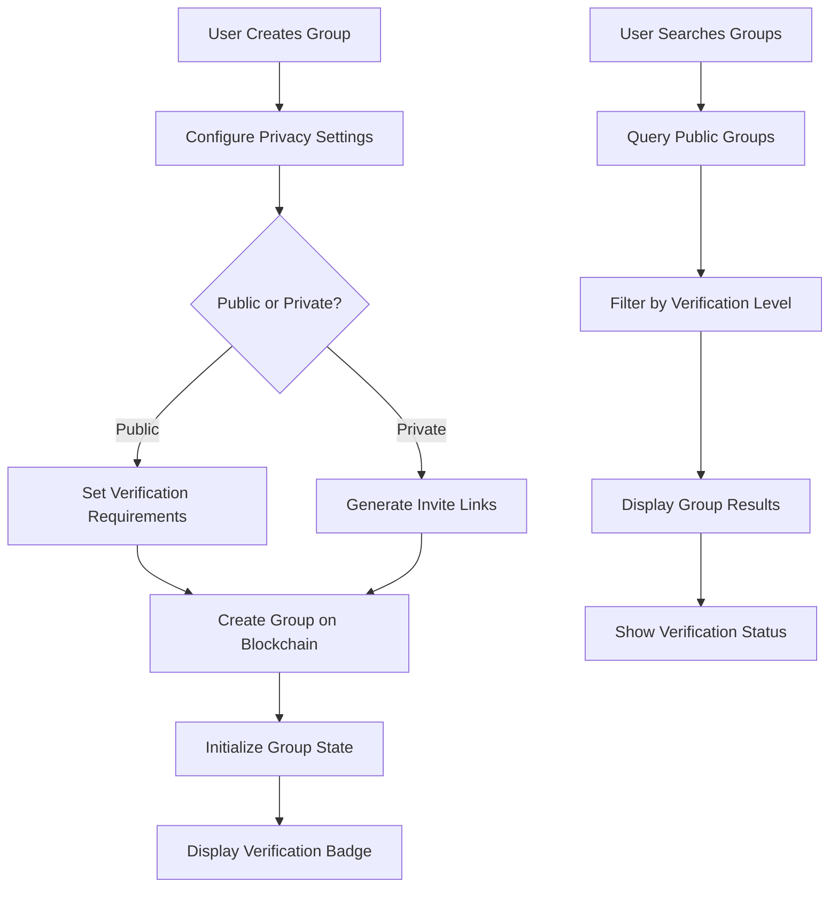
```mermaid
graph TD
    A[User Creates Group] --> B[Configure Privacy Settings]
    B --> C{Public or Private?}
    C -->|Public| D[Set Verification Requirements]
    C -->|Private| E[Generate Invite Links]
    D --> F[Create Group on Blockchain]
    E --> F
    F --> G[Initialize Group State]
    G --> H[Display Verification Badge]
    I[User Searches Groups] --> J[Query Public Groups]
    J --> K[Filter by Verification Level]
    K --> L[Display Group Results]
    L --> M[Show Verification Status]
```

## Key Components

### Group Key Management

Groups use symmetric encryption for message content to avoid per-recipient re-encryption for large groups. The iOS GroupKeyManager handles key lifecycle:

**Key Generation (Admin):**

```swift
actor GroupKeyManager {
    /// Generate new group key (called by group admin)
    func generateGroupKey(groupId: String) -> GroupKeyInfo {
        let key = encryption.generateSymmetricKey()  // AES-256
        let version = (getLatestKeyVersion(groupId: groupId) ?? 0) + 1
        let info = GroupKeyInfo(
            groupId: groupId, key: key,
            version: version, createdAt: Date()
        )
        storeGroupKey(info)
        return info
    }
    
    /// Encrypt group key for each member
    func encryptGroupKeyForMembers(
        groupKey: SymmetricKey,
        memberPublicKeys: [(did: String, publicKey: Data)]
    ) throws -> [(did: String, encryptedKey: Data)] {
        return try memberPublicKeys.map { member in
            let keyData = groupKey.withUnsafeBytes { Data($0) }
            let encrypted = try encryption.encrypt(
                plaintext: keyData,
                recipientPublicKey: member.publicKey  // X25519
            )
            return (did: member.did, encryptedKey: encrypted.serialized)
        }
    }
}
```

**Key Distribution:**

Admin encrypts the group key individually for each member using E2E encryption (X25519 + ChaCha20-Poly1305) and sends via the relay. Each member receives their encrypted key copy, decrypts with their private key, and stores in Keychain.

**Key Rotation:**

On member add/remove, admin generates a new group key and redistributes to all current members. This ensures removed members cannot decrypt future messages.

**Message Encryption:**

```swift
/// Encrypt group message with current group key
func encryptForGroup(plaintext: Data, groupId: String) throws -> Data {
    guard let keyInfo = getLatestKey(groupId: groupId) else {
        throw GroupError.noGroupKey
    }
    return try encryption.encryptForStorage(plaintext: plaintext, key: keyInfo.key)
}
```

**Key Features:**

* Symmetric key generation (AES-256-GCM)
* Per-member E2E distribution via relay
* Key rotation on membership changes
* Key versioning for message decryption
* Keychain storage for group keys
* Key expiration (optional, for high-security groups)

### Group Message Fan-Out Architecture

When a group message is sent, the relay server distributes it to all members. For large groups (10K+ members), NATS pub/sub enables cross-pod fan-out:

**Backend Fan-Out (Go):**

```go
// relay/group_fan_out.go

func (s *RelayService) RelayGroupMessage(msg GroupMessage) error {
    // 1. Rate limit check
    if err := s.rateLimiter.Check(msg.SenderDID, "group_message"); err != nil {
        return ErrRateLimitExceeded
    }
    
    // 2. Verify sender is group member
    if !s.isGroupMember(msg.GroupID, msg.SenderDID) {
        return ErrNotGroupMember
    }
    
    // 3. Get group member list
    members, err := s.getGroupMembers(msg.GroupID)
    if err != nil {
        return err
    }
    
    // 4. Publish to NATS for cross-pod fan-out
    s.nats.Publish("group."+msg.GroupID, msg)
    
    // 5. Deliver to online members on this pod
    for _, memberDID := range members {
        conn, online := s.connections.Get(memberDID)
        if online && conn.PodID == s.podID {
            conn.SendMessage(msg)
        } else if !online {
            // Queue for offline delivery (7-day retention for large groups)
            s.offlineQueue.Enqueue(memberDID, msg, Retention: 7*24*time.Hour)
        }
    }
    
    return nil
}
```

**Scaling for Large Groups:**

| Concern | Solution |
| --- | --- |
| Fan-out latency | NATS pub/sub for parallel delivery across relay pods |
| Offline queue explosion | 7-day retention for groups 100+ members (vs 30-day for 1:1) |
| Group key distribution | Sender trees: admin → sub-admins → members |
| On-chain metadata | Group ID + member count hash only; member list never on-chain |
| Rate limits | Group messages consume 1 send-rate token regardless of member count |

**Key Features:**

* NATS pub/sub for cross-pod fan-out
* WebSocket delivery to online members
* Offline queuing (7-day retention for large groups)
* Rate limiting per sender (not per recipient)
* APNs push for offline members

### Group Metadata Anchoring

Group metadata is submitted to Data L1 for validation and integrity verification. Only minimal metadata goes on-chain:

**Data L1 Submission:**

```go
type GroupMetadataSubmission struct {
    Type           string  // "group_metadata"
    GroupID        string  // UUID
    AdminDID       string  // Admin's DID
    MemberCountHash []byte // H(memberCount || salt)
    CreatedAt      time.Time
    SchemaVersion  int     // Current: 1
}
```

**What Goes On-Chain:**

* ✅ Group ID (UUID)
* ✅ Admin DID (creator)
* ✅ Member count hash (H(count || salt) - privacy-preserving)
* ✅ Timestamp
* ❌ **Never:** Member list, group name, description, messages

**Privacy-Preserving Statistics:**

Instead of zero-knowledge proofs (Phase 3+), Phase 1-2 uses simple hashing:

* Member count hash: `H(memberCount || groupSalt)` prevents manipulation without revealing exact count
* Users can verify group size when they join (see decrypted count)
* On-chain hash prevents admin from lying about group size

**Key Features:**

* Data L1 validation (admin DID authorization, hash structure)
* Member count hash (privacy-preserving)
* Group ID registration (prevents duplicates)
* Admin DID linkage (Cardano credential verification)
* Timestamp anchoring (group creation proof)

### Group Creation

Users can create public groups (discoverable via search) or private groups (invite-only). Trust tier determines maximum group size:

**Group Size Limits by Trust Tier:**

| Trust Tier | Max Group Size | Rationale |
| --- | --- | --- |
| Tier 1 (Unverified) | 10 members | Prevent spam group creation |
| Tier 2 (Newcomer) | 50 members | Emerging trust |
| Tier 3 (Member) | 500 members | Full trust |
| Tier 4 (Verified) | 10,000 members | Enhanced trust |
| Tier 5 (Trusted) | 1,000,000 members | Maximum trust |

**Key Features:**

* Public group creation (searchable)
* Private group creation (invite-only)
* Group naming and description
* Group avatar/icon
* Category and topic tagging
* Verification requirements configuration
* Trust tier-based size limits
* Group creation anchored on Data L1

### Verification Requirements

Group creators establish minimum trust tier requirements during setup. These requirements filter participants based on their Cardano-anchored credentials.

**Trust Tier Requirements:**

| Requirement Level | Minimum Trust Tier | Use Case |
| --- | --- | --- |
| Open | Tier 1 (Unverified) | Public communities, high moderation needs |
| Standard | Tier 2 (Newcomer) | General communities |
| Verified | Tier 3 (Member) | Professional communities |
| High-Trust | Tier 4 (Verified) | Financial/business communities |
| Restricted | Tier 5 (Trusted) | High-security communities |

**Key Features:**

* Minimum trust tier enforcement (validated by backend)
* Credential type requirements (government ID, institutional, etc.)
* Manual approval for edge cases
* Requirement modification (admin-only, requires Data L1 update)
* Join attempt rejection with reason (trust tier insufficient)

### Group Verification Badges

Each group displays a verification badge indicating the collective trust level of its members, with color-coded indicators.

**Badge Levels:**

| Badge | Criteria | Color | Icon |
| --- | --- | --- | --- |
| Unverified | <30% Tier 3+ | Gray | ○ |
| Basic | 30-50% Tier 3+ | Bronze | ◐ |
| Verified | 50-75% Tier 3+ | Silver | ◑ |
| Trusted | 75-90% Tier 3+ | Gold | ● |
| Elite | 90%+ Tier 3+ | Blue | ✦ |

**Badge Calculation:**

```swift
func calculateGroupBadge(members: [Member]) -> GroupBadge {
    let tier3Plus = members.filter { $0.trustTier >= 3 }.count
    let percentage = Double(tier3Plus) / Double(members.count)
    
    switch percentage {
    case 0.9...: return .elite
    case 0.75..<0.9: return .trusted
    case 0.5..<0.75: return .verified
    case 0.3..<0.5: return .basic
    default: return .unverified
    }
}
```

**Key Features:**

* Real-time badge calculation
* Badge display in group list and header
* Badge explanation on tap
* Badge history tracking (local)

### Participant Verification Display

Each participant's verification status is displayed via visual indicators:

**Per-Member Display:**

```swift
struct GroupMemberRow: View {
    let member: Member
    
    var body: some View {
        HStack {
            Avatar(member.avatarURL)
            
            VStack(alignment: .leading) {
                HStack {
                    Text(member.displayName)
                    TrustBadge(tier: member.trustTier)
                    if member.role == .admin {
                        AdminBadge()
                    }
                }
                Text("Trust Tier \(member.trustTier)")
                    .font(.caption)
                    .foregroundColor(.secondary)
            }
            
            Spacer()
            
            if member.isVerified {
                VerificationCheckmark()
            }
        }
    }
}
```

**Key Features:**

* Trust tier badge per participant
* Admin/moderator role indicators
* Verification checkmark (Tier 4+)
* Tap for full credential view
* Real-time status updates

### Group Moderation

Group admins (Tier 4+ required) can configure moderation settings:

**Moderation Features:**

```swift
struct ModerationSettings {
    var messageFilteringEnabled: Bool
    var minimumTierToPost: TrustTier
    var spamDetectionEnabled: Bool
    var mutedMembers: Set<String>  // DIDs
    var bannedMembers: Set<String>  // DIDs
    var moderationLog: [ModerationEvent]  // Local storage
}

struct ModerationEvent {
    let eventId: String
    let timestamp: Date
    let moderatorDID: String
    let targetDID: String
    let action: ModerationAction
    let reason: String
    let evidenceHash: Data?  // Optional commitment hash
}

enum ModerationAction {
    case mute(duration: TimeInterval)
    case unmute
    case ban
    case unban
    case deleteMessage
    case warnUser
}
```

**Storage:** Moderation logs are stored locally and in encrypted IPFS logs (Organization tier only). Never on-chain directly.

**Key Features:**

* Message filtering by trust tier
* Automatic spam detection (backend)
* Temporary muting (hours to days)
* Permanent banning (DID-based)
* Moderation logs (local + encrypted IPFS for Org tier)
* Appeal process (admin review)

### Permission Structures

Groups support role-based permissions:

**Permission Matrix:**

| Permission | Member | Moderator | Admin | Owner |
| --- | --- | --- | --- | --- |
| Send messages | ✓ | ✓ | ✓ | ✓ |
| Share media | Tier 2+ | ✓ | ✓ | ✓ |
| Pin messages | ✗ | ✓ | ✓ | ✓ |
| Mute members | ✗ | ✓ | ✓ | ✓ |
| Ban members | ✗ | ✗ | ✓ | ✓ |
| Invite members | Tier 3+ | ✓ | ✓ | ✓ |
| Edit group info | ✗ | ✗ | ✓ | ✓ |
| Change permissions | ✗ | ✗ | ✓ | ✓ |
| Delete group | ✗ | ✗ | ✗ | ✓ |

**Key Features:**

* Role-based permissions
* Trust tier-based permissions (hybrid)
* Custom permission configuration (admin)
* Permission enforcement (backend validation)

### Group Discovery

Public groups are discoverable via search:

**Discovery Features:**

```swift
struct GroupSearchRequest {
    var query: String
    var category: Category?
    var minimumVerificationLevel: GroupBadge?
    var maxMemberCount: Int?
    var page: Int
}

struct GroupSearchResult {
    let groupId: String
    let name: String
    let description: String
    let memberCount: Int  // Read from cache
    let verificationBadge: GroupBadge
    let category: Category
    let isPublic: Bool
    let avatarURL: URL?
}
```

**Privacy-Preserving Search:**

User searches don't expose personal interests. Backend logs searches in aggregate only (no DID linkage).

**Key Features:**

* Full-text search (name, description, tags)
* Category filtering
* Badge filtering
* Member count filtering
* Join preview (see rules before joining)

## Security Principles

* Group keys are symmetric (AES-256-GCM) and rotated on membership changes
* Keys distributed via E2E encryption (X25519 + ChaCha20-Poly1305)
* Group metadata anchored on Data L1 (group ID, admin DID, member count hash)
* Member list never on-chain (privacy-preserving)
* Moderation logs stored locally + encrypted IPFS (Org tier)
* Message fan-out via NATS pub/sub for scalability
* Offline queuing with 7-day retention for large groups
* Trust tier enforcement for group creation and permissions
* All group messages are end-to-end encrypted
* Backend validates group operations but cannot read message content

## Multiple Personas with Selective Visibility

# Multiple Personas with Selective Visibility

## Overview

This feature enables users to create multiple distinct personas under their main profile, allowing them to compartmentalize their identity and interactions across different social circles while maintaining complete control over which contacts can see each persona. Users can present different aspects of their identity to different groups without compromising their privacy or creating separate accounts, addressing the need for contextual identity management in both personal and professional communications.

## Architecture

Each persona has its own display name, avatar, bio, and verification status while sharing the underlying DID and trust score from the master identity. Selective visibility is enforced through cryptographic access controls where users explicitly grant specific contacts permission to see particular personas.

### Persona Management Flow

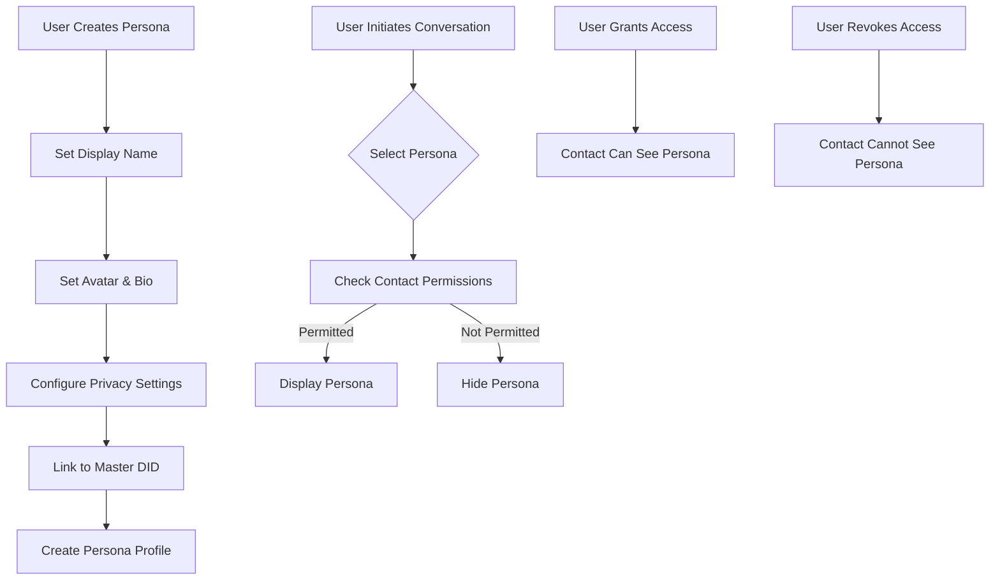
```mermaid
graph TD
    A[User Creates Persona] --> B[Set Display Name]
    B --> C[Set Avatar & Bio]
    C --> D[Configure Privacy Settings]
    D --> E[Link to Master DID]
    E --> F[Create Persona Profile]
    G[User Initiates Conversation] --> H{Select Persona}
    H --> I[Check Contact Permissions]
    I -->|Permitted| J[Display Persona]
    I -->|Not Permitted| K[Hide Persona]
    L[User Grants Access] --> M[Contact Can See Persona]
    N[User Revokes Access] --> O[Contact Cannot See Persona]
```

## Key Components

### Persona Creation

Users create additional personas through their main profile settings, with each persona having its own display name, avatar, bio, and verification status while sharing the underlying DID and trust score from the master identity.

**Key Features:**

* Persona creation (up to 5 per user)
* Custom display names
* Custom avatars
* Custom bios
* Persona categories (Professional, Personal, Family, Gaming, Custom)
* Persona description
* Persona creation confirmation
* Persona management interface

### Persona Privacy Settings

Each persona can have distinct privacy settings, notification preferences, and feature access levels, allowing users to maintain professional boundaries while engaging in casual conversations through different identity presentations.

**Key Features:**

* Per-persona privacy settings
* Per-persona notification preferences
* Per-persona feature access
* Last seen visibility control
* Online status visibility control
* Profile picture visibility control
* Status message visibility control
* Per-persona blocking

### Selective Visibility

The selective visibility system operates through cryptographic access controls where users explicitly grant specific contacts permission to see particular personas. When initiating conversations or joining groups, users choose which persona to present.

**Key Features:**

* Explicit permission granting
* Per-contact visibility control
* Per-group visibility control
* Permission revocation
* Permission modification
* Permission history
* Permission auditing
* Permission enforcement

### Persona Conversation Isolation

The system maintains separate conversation threads for each persona, ensuring that messages sent as one persona remain completely isolated from conversations conducted as another persona, even when communicating with overlapping contact lists.

**Key Features:**

* Separate conversation threads
* Persona-specific message history
* Persona-specific notifications
* Persona-specific read receipts
* Persona-specific typing indicators
* Persona-specific call history
* Persona-specific file sharing
* Persona-specific reactions

### Persona Trust Scoring

The feature integrates with the existing trust scoring system where the master identity's trust score applies to all personas, but individual personas can earn additional verification badges specific to their context.

**Key Features:**

* Master identity trust score
* Per-persona verification badges
* Per-persona credential display
* Per-persona achievement tracking
* Per-persona reputation
* Trust score inheritance
* Badge independence
* Credential portability

### Persona-Specific Verification

Individual personas can earn additional verification badges specific to their context, such as professional credentials for work personas or gaming achievements for entertainment personas.

**Key Features:**

* Professional credential verification
* Gaming achievement badges
* Community-specific credentials
* Persona-specific verification
* Credential display per persona
* Verification status per persona
* Credential portability
* Credential management

### Contact Management

Contact management becomes persona-aware, allowing users to categorize their contacts based on which personas they know about, with automatic suggestions for appropriate persona selection based on conversation context and contact relationships.

**Key Features:**

* Persona-aware contact lists
* Per-contact persona visibility
* Contact categorization by persona
* Automatic persona suggestions
* Contact relationship tracking
* Contact history per persona
* Contact blocking per persona
* Contact management interface

### Persona Switching

Users can switch between personas when initiating conversations or joining groups. The system automatically selects the appropriate persona based on conversation context and contact relationships.

**Key Features:**

* Manual persona selection
* Automatic persona suggestion
* Persona switching in conversations
* Persona switching in groups
* Persona switching confirmation
* Persona switching history
* Persona switching notifications
* Persona switching prevention

### Blockchain Anchoring

The blockchain anchoring system maintains provable integrity for all personas while using zero-knowledge proofs to ensure that contacts cannot discover the existence of personas they haven't been granted access to.

**Key Features:**

* Per-persona message anchoring
* Per-persona transaction recording
* Zero-knowledge proofs
* Persona existence privacy
* Persona discovery prevention
* Persona audit trails
* Persona verification
* Persona immutability

### Persona Deletion

Users can delete personas they no longer need. Deletion removes the persona profile but maintains conversation history for archival purposes.

**Key Features:**

* Persona deletion
* Conversation archival
* Data retention options
* Deletion confirmation
* Deletion reversal (within grace period)
* Deletion notification to contacts
* Deletion audit trail
* Deletion compliance

## Security Principles

* Each persona shares the underlying DID but maintains separate profiles
* Selective visibility is enforced through cryptographic access controls
* Contacts cannot discover personas they haven't been granted access to
* Conversation threads are completely isolated per persona
* Trust scores are shared across personas but badges are persona-specific
* Blockchain anchoring maintains provable integrity per persona
* Zero-knowledge proofs preserve persona privacy — via Midnight ZK group_membership proofs (Phase 3+), a user can prove they are presenting a specific persona without revealing which other personas they hold
* All communication is encrypted end-to-end per persona

## ECHO Comply Restriction

**Personas are an ECHO Message-only feature. They are disabled for all ECHO Comply accounts.**

Organizational communications must be unambiguous and attributable to the verified organizational identity. A hospital employee sending clinical coordination messages under a pseudonymous persona, or a government official communicating under a personal persona, would undermine the integrity proof and audit trail that ECHO Comply provides. Therefore:

* Users whose DID is registered under an ECHO Comply organization account shall not have access to persona creation or switching.
* The persona management screen shall not appear in the Settings menu for Comply accounts.
* If a user has an existing personal ECHO Message account with personas and later joins an ECHO Comply organization, their personas remain intact but are not accessible while the Comply account session is active.
* The backend Identity Service shall reject any persona-creation or persona-switch request from a DID flagged as an active ECHO Comply organizational member.

## Midnight ZK Integration (Phase 3+)

The blockchain anchoring section references zero-knowledge proofs for persona privacy. The specific Midnight ZK claim type used is `group_membership` proof: a user can prove "I am the authorized presenter of Persona X for this contact" without revealing how many other personas they hold or which persona contexts they participate in.

This replaces the generic ZK statement in earlier versions of this blueprint. The proof is generated on-device using the Midnight SDK, verified by the Go Identity Service, and cached as a boolean result. The proof workflow:

1. Contact requests confirmation they are talking to "Persona X" (e.g., the user's professional persona)
2. User's device generates a ZK group_membership proof: "I am authorized to present this persona"
3. Backend verifies via Midnight — returns boolean only, no persona list revealed
4. Contact's app shows persona badge confirmed without learning about any other personas

## Broadcast Channels and Community Features

# Broadcast Channels and Community Features

## Overview

This feature enables users to create one-to-many communication channels for broadcasting information to large audiences while maintaining the platform's decentralized architecture and privacy protections. Channels support various content types and engagement models, from simple announcement channels to interactive community spaces that foster discussion and collaboration around shared interests.

## Architecture

Channels are created with configurable privacy settings and content policies. Content is distributed through the Go backend WebSocket relay and NATS pub/sub fan-out infrastructure — the same stateless, content-blind relay used for direct messaging. Channel metadata is anchored to the Data L1. ECHO Comply organization channels receive automatic compliance rules (retention, Digital Evidence fingerprinting, eDiscovery scope) applied by the Comply Service on channel creation.

### Channel Creation & Distribution Flow

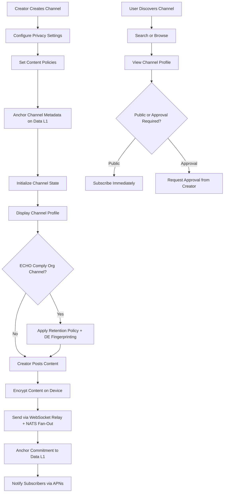
```mermaid
graph TD
    A[Creator Creates Channel] --> B[Configure Privacy Settings]
    B --> C[Set Content Policies]
    C --> D[Anchor Channel Metadata on Data L1]
    D --> E[Initialize Channel State]
    E --> F[Display Channel Profile]
    F --> F2{ECHO Comply Org Channel?}
    F2 -->|Yes| F3[Apply Retention Policy + DE Fingerprinting]
    F2 -->|No| G[Creator Posts Content]
    F3 --> G
    G --> H[Encrypt Content on Device]
    H --> I[Send via WebSocket Relay + NATS Fan-Out]
    I --> J[Anchor Commitment to Data L1]
    J --> K[Notify Subscribers via APNs]
    L[User Discovers Channel] --> M[Search or Browse]
    M --> N[View Channel Profile]
    N --> O{Public or Approval Required?}
    O -->|Public| P[Subscribe Immediately]
    O -->|Approval| Q[Request Approval from Creator]
```

## Key Components

### Channel Creation

Channel creators can establish broadcast channels that support unlimited subscribers, with content distributed through the Go backend WebSocket relay and NATS pub/sub fan-out infrastructure. Phase 4 introduces federated relay options where independent operators registered on the Data L1 can serve as channel delivery nodes.

**Key Features:**

* Channel creation (VIP tier required for unlimited subscribers; free tier limited to 1K subscribers)
* Channel naming, description, avatar/icon
* Category and topic tagging
* Data L1 anchoring of channel metadata at creation
* Channel management interface
* Channel deletion with subscriber notification

### Privacy Configuration

Channels can be configured as public (discoverable through search), private (invitation-only), or semi-private (discoverable but requiring approval to join).

**Key Features:**

* Public channel configuration
* Private channel configuration
* Semi-private channel configuration
* Privacy setting modification
* Subscriber approval process
* Invite link generation
* Privacy enforcement
* Privacy auditing

### Content Types

Content types include text messages, images, videos, files, polls, and interactive elements, with all content encrypted and distributed through the same security infrastructure used for private messaging.

**Key Features:**

* Text message posting
* Image sharing
* Video sharing
* File sharing
* Poll creation
* Interactive element creation
* Content type restrictions
* Content moderation

### Channel Moderation

Channel administrators can configure moderation settings, subscriber permissions, and content policies while maintaining transparency through blockchain-anchored governance records.

**Key Features:**

* Message filtering
* Spam detection
* User muting/banning
* Content policy enforcement
* Moderation logs
* Moderation appeals
* Moderation transparency
* Moderation automation

### Scheduled Posting

Channels support scheduled posting, allowing creators to plan content distribution in advance. Scheduled posts are encrypted and stored locally until the scheduled time.

**Key Features:**

* Post scheduling
* Preset time options
* Custom time selection
* Timezone handling
* Recurring post scheduling
* Post editing before delivery
* Post cancellation
* Delivery confirmation

### Content Categorization

Content can be organized into categories and topics, helping subscribers find relevant content and allowing creators to organize their channels effectively.

**Key Features:**

* Content categorization
* Topic tagging
* Content organization
* Category-based browsing
* Topic-based search
* Content filtering
* Category management
* Category auditing

### Subscriber Segmentation

Creators can segment subscribers for targeted messaging, allowing different content to be delivered to different subscriber groups based on interests or engagement levels.

**Key Features:**

* Subscriber segmentation
* Segment-based messaging
* Interest-based segmentation
* Engagement-based segmentation
* Segment management
* Segment analytics
* Segment targeting
* Segment privacy

### Channel Analytics

Channel analytics provide creators with insights into subscriber engagement, content performance, and growth metrics while maintaining subscriber privacy through anonymized reporting.

**Key Features:**

* Subscriber count tracking
* Engagement metrics
* Content performance analytics
* Growth analytics
* Subscriber demographics (anonymized)
* Content consumption patterns
* Subscriber retention metrics
* Analytics export

### Channel Discovery

The system includes discovery mechanisms that help users find relevant channels based on their interests, trust network connections, and engagement history while preventing spam and low-quality content through community-driven curation.

**Key Features:**

* Channel search
* Category-based discovery
* Tag-based discovery
* Recommendation engine
* Trending channels
* Curated channel lists
* Channel preview
* Subscribe functionality

### Monetization Options

Creators can monetize channels through ECHO token subscriptions paid using the Tessellation v3 `AllowSpend` + `SpendTransaction` primitives. Subscribers issue time-limited spend approvals that auto-renew monthly — no unlimited token approvals are ever granted. The platform takes a 15–30% revenue share that flows to the community treasury.

```go
// Subscriber issues a time-limited AllowSpend for channel subscription
type ChannelSubscriptionAllowSpend struct {
    SubscriberDID  string
    ChannelID      string
    CreatorDID     string
    AmountPerMonth uint64    // ECHO in smallest units
    ExpiresAt      time.Time // Hard expiry — subscriber must re-authorize monthly
    Purpose        string    // "channel_subscription"
}

// Platform splits payment: creator share + treasury fee
type SubscriptionDistribution struct {
    CreatorShare    uint64  // 70-85% depending on channel tier
    TreasuryFee     uint64  // 15-30% platform fee to community treasury
    TransactionHash string
}
```

**Monetization options:**

* Monthly ECHO token subscriptions (AllowSpend — time-limited, auto-expiring)
* Premium content tiers (different access levels via subscription amount)
* Transparent sponsored content with on-chain disclosure
* Direct ECHO donations from subscribers (single SpendTransaction)
* All revenue splits: creator receives 70–85%, community treasury receives 15–30%

**Key Features:**

* Subscription configuration (price, renewal period)
* AllowSpend-based payment (no unlimited approvals)
* Revenue split automation via metagraph
* Real-time earnings dashboard for creators
* Subscriber management (view, refund, cancel)
* Treasury fee automatically distributed to community

### Channel Content Archive

Channel content is archived and searchable, with subscribers able to access historical content and receive notifications for new posts based on their preferences and the channel's trust score.

**Key Features:**

* Content archival
* Archive search
* Historical content access
* Content organization
* Archive retention policies
* Archive deletion
* Archive export
* Archive compliance

### Channel Governance

Channels can implement governance structures where subscribers vote on channel policies, content direction, and moderation decisions. Voting uses the platform's poll infrastructure with blockchain anchoring.

**Key Features:**

* Governance voting
* Policy voting
* Content voting
* Moderation voting
* Voting weight configuration
* Quorum requirements
* Voting transparency
* Voting history

### Channel Roles

Channels support multiple roles including owner, administrator, moderator, and subscriber, with each role having specific permissions and responsibilities.

**Key Features:**

* Role assignment
* Role-based permissions
* Role hierarchy
* Role modification
* Role removal
* Role auditing
* Role transparency
* Role appeals

## Security Principles

* All channel content is encrypted end-to-end and delivered via the Go backend WebSocket relay and NATS pub/sub fan-out
* Channel metadata is anchored to the Data L1 (channel ID, admin DID, subscriber count hash)
* Moderation decisions are logged locally and optionally anchored for Organization tier channels
* Subscriber privacy is preserved through anonymized analytics (no DID linkage in aggregate stats)
* Content delivery uses the same relay infrastructure as messaging — stateless, content-blind transport
* Monetization uses time-limited AllowSpend approvals — the platform never holds unlimited spending authority over subscriber wallets
* Revenue platform fee (15–30%) flows automatically to the community treasury
* All communication is encrypted end-to-end
* Phase 4: federated relay operators registered on Data L1 provide additional delivery resilience

## ECHO Comply Organization Channels

ECHO Comply organizations can create **official channels** for broadcasting compliance-relevant communications to staff and stakeholders (e.g., a hospital broadcasting patient-care policy updates, a municipality publishing official notices, a law firm distributing case updates to client teams). Official organization channels are subject to all ECHO Comply compliance rules automatically.

### Compliance Behavior for Org-Owned Channels

| Behavior | Standard Consumer Channel | ECHO Comply Org Channel |
| --- | --- | --- |
| Retention | None — messages can be deleted | Permanent (or per org retention policy) |
| Digital Evidence fingerprinting | Optional (VIP only) | Automatic — every post fingerprinted |
| eDiscovery scope | Not included | Included if channel is covered by a litigation hold |
| Disappearing content | Allowed | Blocked when litigation hold active |
| Audit trail | Local logs only | Data L1 anchor + compliance dashboard |

### Org Channel Registration

When an ECHO Comply organization administrator creates a channel, the backend Comply Service (port 8010) automatically:

1. Registers the channel with the organization's retention policy
2. Activates Digital Evidence fingerprinting for all posts in that channel
3. Adds the channel to the organization's eDiscovery scope
4. Anchors a `compliance_retention` record on the Data L1 with the channel ID and org DID

```go
// Backend: automatic ECHO Comply hook on org channel creation
func (cs *ComplyService) OnOrgChannelCreated(channelID, orgDID string) error {
    policy, err := cs.getActiveRetentionPolicy(orgDID)
    if err != nil {
        return err
    }
    // Register channel under org retention policy
    return cs.registerChannelCompliance(channelID, orgDID, policy)
}
```

### Litigation Hold on Org Channels

If an organization activates a litigation hold that covers a broadcast channel (e.g., a hospital channel discussing a patient case under legal hold), the following happens automatically:

* All future posts to the channel are flagged as hold-covered
* Scheduled posts that would publish after the hold activation are held pending admin review
* Channel admins receive an in-app notification: "This channel is under legal hold. All content is subject to preservation."
* Posts cannot be deleted or edited while the hold is active

### Channel eDiscovery

Org-owned channel posts appear in eDiscovery exports when the channel is covered by the export's scope. The export includes each post's Digital Evidence event ID and verificationURL alongside the standard message integrity fields.

## Enterprise Organization Profiles with Verified Status

# Enterprise Organization Profiles with Verified Status

## Overview

This feature enables organizations including banks, corporations, government agencies, and non-profits to establish verified enterprise profiles that display authenticated organizational credentials and provide enhanced communication capabilities for official business interactions. Enterprise profiles receive distinctive verification checkmarks that differentiate legitimate organizations from impersonators. Organization plan subscribers ($10–50/seat/month) receive Constellation Digital Evidence integration providing Smart Checkmark badges on messages, court-admissible audit fingerprinting, and a public compliance dashboard — enabling legally defensible records of customer communications. All Organization plan revenue flows to the community treasury.

## Architecture

Organizations undergo multi-stage authentication where legal entities must provide proof of incorporation, regulatory standing with relevant authorities, and multi-signature authorization from C-level executives or board members. Verification status is recorded on the blockchain and referenced in the metagraph for access control.

### Enterprise Verification Flow

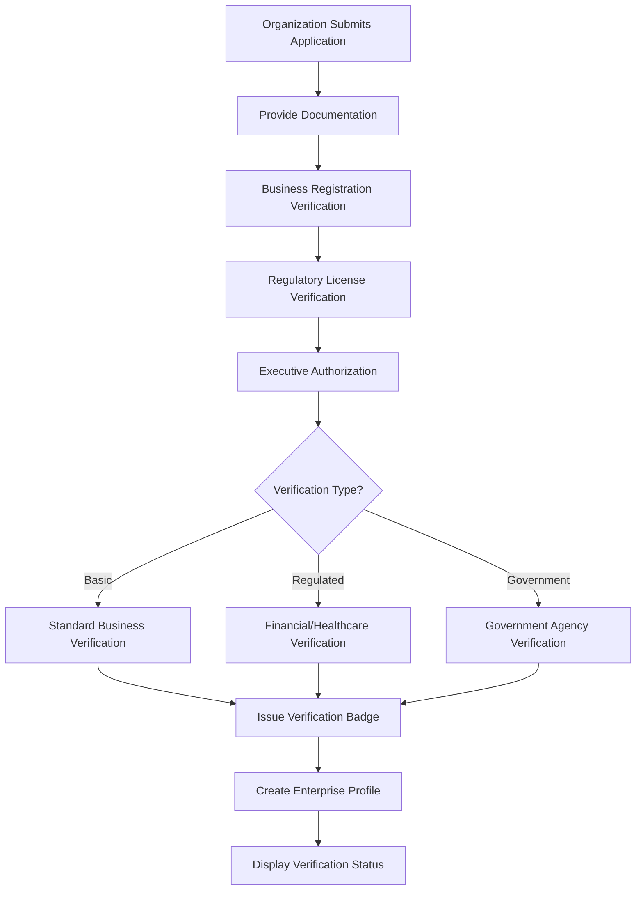
```mermaid
graph TD
    A[Organization Submits Application] --> B[Provide Documentation]
    B --> C[Business Registration Verification]
    C --> D[Regulatory License Verification]
    D --> E[Executive Authorization]
    E --> F{Verification Type?}
    F -->|Basic| G[Standard Business Verification]
    F -->|Regulated| H[Financial/Healthcare Verification]
    F -->|Government| I[Government Agency Verification]
    G --> J[Issue Verification Badge]
    H --> J
    I --> J
    J --> K[Create Enterprise Profile]
    K --> L[Display Verification Status]
```

## Key Components

### Enterprise Onboarding

Organizations begin the verification process by submitting comprehensive documentation including business registration certificates, regulatory licenses, executive authorization letters, and compliance certifications through a dedicated enterprise onboarding portal.

**Key Features:**

* Onboarding portal access
* Documentation submission
* Document verification
* Multi-stage review process
* Status tracking
* Communication with verification team
* Document storage
* Onboarding completion

### Business Registration Verification

The verification process involves multi-stage authentication where legal entities must provide proof of incorporation, regulatory standing with relevant authorities, and multi-signature authorization from C-level executives or board members.

**Key Features:**

* Business registration certificate verification
* Incorporation proof
* Legal entity verification
* Business address verification
* Business type classification
* Regulatory standing verification
* Verification database integration
* Verification updates

### Regulatory Compliance Verification

Financial institutions undergo additional scrutiny including FDIC registration verification, banking license validation, and compliance with anti-money laundering regulations.

**Key Features:**

* FDIC registration verification
* Banking license validation
* AML compliance verification
* Regulatory database integration
* Compliance certification
* Compliance monitoring
* Compliance updates
* Compliance auditing

### Executive Authorization

Multi-signature authorization from C-level executives or board members is required to verify organizational legitimacy and prevent impersonation.

**Key Features:**

* Executive identification
* Multi-signature requirement
* Digital signature verification
* Authorization documentation
* Authorization tracking
* Authorization updates
* Authorization revocation
* Authorization auditing

### Verification Tiers

The system supports different verification tiers including Basic Enterprise (standard business registration), Regulated Entity (financial services, healthcare, legal), and Government Agency (federal, state, local authorities) with corresponding visual indicators and privilege levels.

**Key Features:**

* Basic Enterprise tier
* Regulated Entity tier
* Government Agency tier
* Tier-specific privileges
* Tier-specific indicators
* Tier upgrade process
* Tier downgrade process
* Tier auditing

### Verification Badges

Enterprise profiles display prominent verification badges that indicate the organization's verified status, regulatory compliance level, and industry classification.

**Key Features:**

* Verification badge display
* Compliance level indicators
* Industry classification display
* Badge color coding
* Badge explanation
* Badge history
* Badge updates
* Badge verification

### Organizational Hierarchy

The interface shows organizational hierarchy with verified employee accounts linked to the main enterprise profile, enabling customers to distinguish between official representatives and potential impersonators.

**Key Features:**

* Employee account linking
* Organizational structure display
* Role-based employee classification
* Employee verification status
* Employee credential display
* Employee management interface
* Employee removal
* Employee auditing

### Branded Communication Channels

Organizations can configure branded communication channels with custom themes, official logos, and standardized message templates that maintain consistent corporate identity across all customer interactions.

**Key Features:**

* Custom channel branding
* Logo upload and display
* Color scheme customization
* Message template creation
* Template management
* Brand consistency enforcement
* Brand guidelines
* Brand auditing

### Role-Based Access Controls

The system supports role-based access controls where different employee verification levels unlock specific communication privileges, from basic customer service to executive-level secure channels.

**Key Features:**

* Role definition
* Role-based permissions
* Verification level requirements
* Permission enforcement
* Role assignment
* Role modification
* Role removal
* Role auditing

### Regulatory Database Integration

The feature integrates with existing regulatory databases and compliance systems to maintain real-time verification status, automatically flagging organizations that lose regulatory standing or face compliance violations.

**Key Features:**

* Regulatory database integration
* Real-time status monitoring
* Compliance violation detection
* Automatic flagging
* Status updates
* Violation notifications
* Remediation tracking
* Compliance reporting

### Cryptographic Signatures

Enterprise profiles can establish verified communication policies that require cryptographic signatures for official announcements, financial disclosures, or legal notifications, creating immutable audit trails for regulatory compliance.

**Key Features:**

* Cryptographic signature requirement
* Digital signature verification
* Signature timestamp recording
* Signature audit trails
* Signature validation
* Signature revocation
* Signature compliance
* Signature auditing

### Corporate Identity Management Integration

The system supports integration with corporate identity management systems including Active Directory, SAML authentication, and enterprise single sign-on solutions to streamline employee verification and access management.

**Key Features:**

* Active Directory integration
* SAML authentication support
* Enterprise SSO integration
* Employee provisioning
* Employee deprovisioning
* Access synchronization
* Identity synchronization
* Integration auditing

### Customer Communication Channels

Organizations benefit from enhanced trust signals that reduce customer skepticism about official communications, while customers gain confidence in distinguishing legitimate business communications from phishing attempts and fraud.

**Key Features:**

* Verified communication channels
* Customer trust indicators
* Phishing prevention
* Fraud prevention
* Communication verification
* Channel security
* Channel encryption
* Channel auditing

### Digital Evidence Integration (Organization Tier)

Organization tier subscribers receive automatic integration with Constellation's Digital Evidence managed API. Every message and media file sent from a verified Organization profile is SHA-256 fingerprinted and anchored via the Digital Evidence API, producing a Smart Checkmark badge visible to message recipients and a public verification URL for independent third-party verification.

**How it works:**

1. Before E2E encryption, the Go backend's Media Service computes `SHA-256(plaintext_content)` and submits it to the Digital Evidence API
2. The API returns an `EventID` and `VerificationURL` anchored on Constellation infrastructure
3. The `EventID` is embedded in the encrypted message envelope
4. Recipients see a Smart Checkmark (✓) badge on all Organization-sent messages
5. Tapping the badge opens the public verification URL in Safari, showing:

   * Content hash, timestamp, and event ID
   * Court-admissible evidence packaging
   * Public verification explorer accessible by regulators, auditors, or legal counsel

**Compliance Dashboard:**

Organization admins access a compliance dashboard showing:

* All fingerprinted messages with verification status and public URLs
* Audit trail export (CSV, JSON, PDF) for regulatory examinations
* Data retention proof (fingerprints at retention boundary)
* Legal hold management (freeze specific conversations for discovery)
* Smart Checkmark delivery rates and verification analytics

**Organization Plan Pricing:**

| Plan | Price | Seats | Features |
| --- | --- | --- | --- |
| Organization Starter | $10/seat/month | 5–25 seats | Digital Evidence, branded channels, admin controls, SSO |
| Organization Pro | $25/seat/month | 25–250 seats | All Starter + SLAs, API access, compliance dashboard, audit exports |
| Organization Enterprise | $50/seat/month | 250+ seats | All Pro + dedicated support, custom integrations, legal hold, FDIC compliance tools |

All revenue flows 100% to the community treasury — not to a corporation.

**Key Features:**

* Automatic SHA-256 fingerprinting for all Org-tier messages
* Smart Checkmark badge on all outbound Organization messages
* Public VerificationURL for each fingerprinted message
* Compliance dashboard with audit trail exports (CSV, JSON, PDF)
* Legal hold management (disable disappearing messages for held conversations)
* Data retention proof generation
* Regulatory examination support (public URLs accessible to third-party auditors)
* AI Compliance Agent integration (Phase 5+) for automated monitoring and reporting

### Compliance Recording

Enterprise profiles can leverage the platform's blockchain anchoring capabilities to create legally admissible records of customer communications, policy notifications, and compliance disclosures that satisfy regulatory examination requirements.

**Key Features:**

* Communication recording
* Blockchain anchoring
* Compliance documentation
* Audit trail creation
* Legal admissibility
* Regulatory compliance
* Retention policies
* Compliance auditing

## Security Principles

* Enterprise verification is multi-stage and requires comprehensive documentation
* Regulatory compliance is continuously monitored and flagged by AI Compliance Agent (Phase 5+)
* Employee accounts are linked to verified enterprise profiles with role-based permissions
* All messages from Organization profiles are automatically fingerprinted via Digital Evidence API
* Smart Checkmark badges on messages provide recipients cryptographic proof of organizational authenticity
* Blockchain anchoring creates immutable audit trails accessible to regulators via public verification URLs
* Legal hold disables disappearing messages and retains all content for held conversations
* Corporate identity management integration (Active Directory, SAML, SSO) streamlines employee verification
* All communication is encrypted end-to-end — Digital Evidence fingerprints content hashes, never plaintext
* Organization plan revenue flows 100% to the community treasury

## Verified Financial Institution Integration

# Verified Financial Institution Integration

## Overview

This blueprint specifies ECHO Comply's financial institution segment — banks, credit unions, and fintech companies using ECHO as a cryptographically-verified, fraud-resistant communication channel with their customers. Financial institutions are a Phase 1 ECHO Comply target segment alongside healthcare, government, and legal.

Financial institutions share the same ECHO Comply infrastructure as other segments (tamper-evident message integrity via Constellation Data L1, Digital Evidence fingerprinting, configurable retention, eDiscovery export, litigation hold). This blueprint covers **bank-specific capabilities** not present in other segments: institutional identity verification against regulatory databases, fraud alert channels with customer biometric confirmation, transaction authorization workflows using `did:key` + `AllowSpend` primitives, and cross-organization fraud intelligence via ZK proofs (Phase 5+).

For shared ECHO Comply infrastructure (retention policies, Digital Evidence, compliance dashboard, eDiscovery export, SSO), see the **ECHO Comply — Enterprise Compliance Messaging** foundation blueprint.

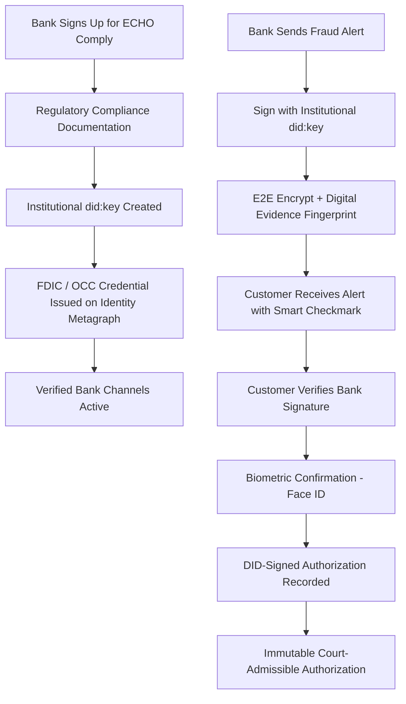
```mermaid
graph TD
    A[Bank Signs Up for ECHO Comply] --> B[Regulatory Compliance Documentation]
    B --> C[Institutional did:key Created]
    C --> D[FDIC / OCC Credential Issued on Identity Metagraph]
    D --> E[Verified Bank Channels Active]
    F[Bank Sends Fraud Alert] --> G[Sign with Institutional did:key]
    G --> H[E2E Encrypt + Digital Evidence Fingerprint]
    H --> I[Customer Receives Alert with Smart Checkmark]
    I --> J[Customer Verifies Bank Signature]
    J --> K[Biometric Confirmation - Face ID]
    K --> L[DID-Signed Authorization Recorded]
    L --> M[Immutable Court-Admissible Authorization]
```

## Functional Requirements

### REQ-FI-001: Institutional Identity Verification

**User Story:** As a bank compliance officer, I want our institution to have a cryptographically-verified identity on ECHO, so that our customers can confirm they are receiving authentic communications from us — not phishing attacks.

**Acceptance Criteria:**

* AC-FI-001.1: Financial institutions shall establish an institutional `did:key` derived from an institution-managed key pair. The institution's public key is registered on the Constellation Identity Metagraph as an EchoOrgRoleCredential with institution type `"financial_institution"`.
* AC-FI-001.2: Institutional onboarding shall require submission of: business registration documentation, FDIC or equivalent regulatory registration number, and multi-signature authorization from at least 2 C-level executives or designated compliance officers.
* AC-FI-001.3: ECHO shall verify institutional credentials against FDIC/NCUA/OCC regulatory databases before activating verified status. Verification shall complete within 5 business days.
* AC-FI-001.4: The institution's verified status badge shall appear on all institution-sent messages — customers can tap to view the institution's regulatory filing and the verification timestamp.
* AC-FI-001.5: If an institution loses regulatory standing (license revoked, regulatory sanction), the Identity Metagraph credential shall be flagged as suspended and the verified badge removed within 24 hours of ECHO detecting the status change.

### REQ-FI-002: Fraud Alert Channels

**User Story:** As a bank's fraud prevention team, I want to send cryptographically-authenticated fraud alerts to customers in real time, so that customers can confirm alert authenticity and respond with a verified authorization — replacing vulnerable SMS-based fraud alerts that can be spoofed.

**Acceptance Criteria:**

* AC-FI-002.1: Financial institutions shall be able to send fraud alerts via `POST /enterprise/fraud/alert` with: the institution's `did:key` signature over the alert content, transaction details (amount, merchant, timestamp), a unique verification request ID, and the customer's ECHO DID as recipient.
* AC-FI-002.2: The customer's iOS app shall display the alert with the institution's verified badge and Smart Checkmark (Digital Evidence fingerprint). Tapping the badge shall show the institution's regulatory credentials and the alert's Digital Evidence verification URL.
* AC-FI-002.3: Customers shall confirm or dispute alerts via `POST /enterprise/fraud/confirm` using biometric authentication (Face ID / Touch ID) combined with a DID-signed response. This creates an immutable authorization record on the Data L1.
* AC-FI-002.4: The authorization record shall include: customer DID, institution DID, verification request ID, decision (confirmed / disputed), biometric method used, and timestamp. This record is court-admissible evidence that the customer personally authorized or disputed the transaction.
* AC-FI-002.5: Alert delivery shall complete within 5 seconds of `POST /enterprise/fraud/alert` call. Customers shall receive an APNs push notification immediately.
* AC-FI-002.6: Unresponded alerts shall escalate per institution-configured rules (e.g., auto-freeze card after 15 minutes of no response).

### REQ-FI-003: Transaction Authorization Workflow

**User Story:** As a bank, I want customers to authorize high-value or unusual transactions through ECHO's verified channel, so that disputed transactions have cryptographic proof of customer intent rather than relying on vulnerable SMS OTP codes.

**Acceptance Criteria:**

* AC-FI-003.1: Institutions shall issue time-limited `AllowSpend` approvals to customers using the Tessellation v3 `AllowSpend` primitive. Each approval shall specify: institution DID, maximum per-charge amount, approval expiry (hard expiry — cannot be extended without new biometric authorization), and purpose string.
* AC-FI-003.2: Customers shall authorize approvals via biometric authentication in the ECHO app. The approval transaction shall be anchored on the Constellation metagraph with the customer's DID signature — creating immutable, timestamp-verified proof of authorization.
* AC-FI-003.3: `AllowSpend` approvals shall never be unlimited. Every approval shall have an expiry date. The institution cannot hold perpetual authorization over a customer's account.
* AC-FI-003.4: Customers shall be able to revoke any active `AllowSpend` approval at any time from the ECHO Wallet tab. Revocation is anchored on the metagraph immediately.
* AC-FI-003.5: All authorization grants, uses, and revocations shall be visible to customers in the ECHO Wallet transaction history with institution name, amount, and timestamp.

### REQ-FI-004: FDIC and Regulatory Compliance

**User Story:** As a bank compliance officer, I want all customer communications to automatically satisfy FDIC communication guidelines, AML record-keeping requirements, and potential eDiscovery holds, so that I can demonstrate compliance without manual audit processes.

**Acceptance Criteria:**

* AC-FI-004.1: All messages sent by institution accounts shall be automatically enrolled in ECHO Comply's Digital Evidence fingerprinting pipeline. The SHA-256 fingerprint and `verificationURL` shall be embedded in every message.
* AC-FI-004.2: All customer communication records shall be retained for a minimum of 7 years (FDIC communication guideline) with Digital Evidence anchoring. Retention policy shall be enforced at the Go Comply Service layer — customers cannot delete messages under retention.
* AC-FI-004.3: Institutions shall access a compliance dashboard (`GET /comply/dashboard`) showing: message retention coverage, active regulatory holds, pending eDiscovery exports, Digital Evidence fingerprint health, and fraud response metrics. All data is derived from Data L1 records — no PII.
* AC-FI-004.4: Audit trail exports for FDIC examinations, OCC reviews, and legal discovery shall be available via `POST /comply/ediscovery/export`. Exports shall include Digital Evidence event IDs enabling independent verification by examiners without ECHO's cooperation.
* AC-FI-004.5: Institutions shall be able to activate litigation hold on customer conversation threads via `POST /comply/litigation/hold`. This immediately disables disappearing messages and enforces permanent retention for affected threads.

### REQ-FI-005: Cross-Organization Fraud Intelligence (Phase 5+)

**User Story:** As a participating bank, I want to query whether a customer's DID has been flagged for suspicious activity by other institutions — without revealing which institutions flagged it or the specific fraud type — so that I can make better authorization decisions while preserving customer privacy.

**Acceptance Criteria:**

* AC-FI-005.1: Participating institutions shall be able to query `GET /enterprise/fraud/intelligence` with a customer DID and time window. The query shall return a boolean result: "flagged by N or more institutions in the past X days" — no institution identities or flag reasons are disclosed.
* AC-FI-005.2: The cross-org fraud intelligence query shall use ZK proofs (Phase 3+ ZK infrastructure, implementation TBD) to ensure the querying institution cannot determine which specific institutions flagged the DID.
* AC-FI-005.3: Participation in the cross-org fraud intelligence network shall be opt-in at the institution level. Non-participating institutions' flag data is never included.
* AC-FI-005.4: Customer DIDs shall never be stored in a central cross-org registry. The ZK proof computation shall be performed on ephemeral in-memory state — no persistent cross-institution DID database.
* AC-FI-005.5: All cross-org intelligence queries shall be logged per-institution for audit compliance. The log records that a query occurred and the boolean result, but not the customer DID queried (privacy-preserving audit log).

## Non-Functional Requirements

**NFR-FI-001 — Fraud alert delivery:** Alert delivery from `POST /enterprise/fraud/alert` to customer APNs notification shall complete within 5 seconds at P99.

**NFR-FI-002 — Authorization anchoring:** Customer authorization transaction from biometric confirmation to Data L1 finality shall complete within 15 seconds.

**NFR-FI-003 — Regulatory verification SLA:** Institutional onboarding regulatory database check shall complete within 5 business days with 99%+ success rate for valid institutions.

**NFR-FI-004 — Uptime:** Financial institution channels shall maintain 99.9%+ uptime with contractual SLA. Downtime notifications within 15 minutes of outage detection.

**NFR-FI-005 — Compliance coverage:** 100% of institution-sent messages shall have a Digital Evidence fingerprint. Zero gaps in the audit trail are the contractual standard.

**NFR-FI-006 — Cross-org query latency:** Phase 5+ cross-org fraud intelligence queries shall return a boolean result within 2 seconds.

## Relationship to ECHO Comply

Financial institution integration is a segment of ECHO Comply, not a separate product. The same Comply Service (port 8010) handles institutional accounts using the same infrastructure as healthcare, government, and legal customers. Bank-specific additions:

| Capability | Financial Institutions | Healthcare | Government | Legal |
| --- | --- | --- | --- | --- |
| Digital Evidence fingerprinting | ✅ Automatic | ✅ Automatic | ✅ Automatic | ✅ Automatic |
| Configurable retention | ✅ 7 years (FDIC) | ✅ 6 years (HIPAA) | ✅ Permanent | ✅ Per-matter |
| Litigation hold | ✅ | ✅ | ✅ | ✅ Auto on matter |
| eDiscovery export | ✅ | ✅ HL7 FHIR | ✅ NARA format | ✅ EDRM format |
| Fraud alert channels | ✅ **Bank-specific** | ❌ | ❌ | ❌ |
| Transaction authorization (AllowSpend) | ✅ **Bank-specific** | ❌ | ❌ | ❌ |
| Cross-org fraud intelligence (Phase 5+) | ✅ **Bank-specific** | ❌ | ❌ | ❌ |
| Regulatory DB verification (FDIC/OCC) | ✅ **Bank-specific** | BAA + IDV | Domain verification | Bar assoc. verification |

## Pricing

| Plan | Price | Min Seats | Includes |
| --- | --- | --- | --- |
| Financial Comply Starter | $30/seat/month | 10 | FDIC retention, Digital Evidence, fraud alerts, verified badge |
| Financial Comply Professional | $50/seat/month | 50 | \+ Transaction authorization, compliance dashboard, eDiscovery |
| Financial Comply Enterprise | $80–100/seat/month | 500 | \+ Cross-org fraud intelligence (Phase 5+), dedicated support, custom API SLA |

All revenue flows 100% to the community treasury.

## Security Principles

* Institutional `did:key` DIDs are verified against regulatory databases before activation — any institution can establish a DID but only verified institutions display the trust badge
* All messages are E2E encrypted — the relay sees only opaque ciphertext blobs; banks cannot read messages in transit any more than ECHO can
* Customer authorization requires biometric authentication + DID signature — cannot be faked by the institution or an attacker
* `AllowSpend` approvals are time-limited and customer-revocable — institutions can never hold perpetual authorization
* Cross-org fraud intelligence uses ZK proofs — no central DID registry, no institution identity disclosure
* All compliance data is anchored on public Constellation metagraph — verifiable by regulators without ECHO's cooperation

## User Rewards Tracker on Profile

# User Rewards Tracker on Profile

## Overview

This feature embeds a compact ECHO rewards summary in the user's profile tab, providing an at-a-glance view of daily earnings progress, trust tier, and achievement milestones. It is a profile-layer summary widget — not a full wallet interface. Staking, delegation, swaps, bridges, and full transaction history are all managed in the dedicated Wallet tab built on the Stargazer SDK. The rewards tracker focuses on the "earning" dimension: how much ECHO the user has earned today, this week, and this month, and how they can earn more.

## Architecture

The rewards tracker reads live data from two sources: the Go backend's Rewards Service (pending rewards, auto-scaled rate progress — **Phase 3+ conditional on token genesis**) and the Stargazer SDK's metagraph query client (confirmed token balance, staking tier). Data is cached locally with a 5-second TTL for balance and a 60-second TTL for daily stats. The tracker is read-only — all actions link to the Wallet tab. Before token genesis (Phase 1–2), the tracker shows trust tier progression, achievement badges, and staking tier status only; token balance fields display "—" with a "Token genesis: Phase 3+" note.

### Rewards Summary Flow

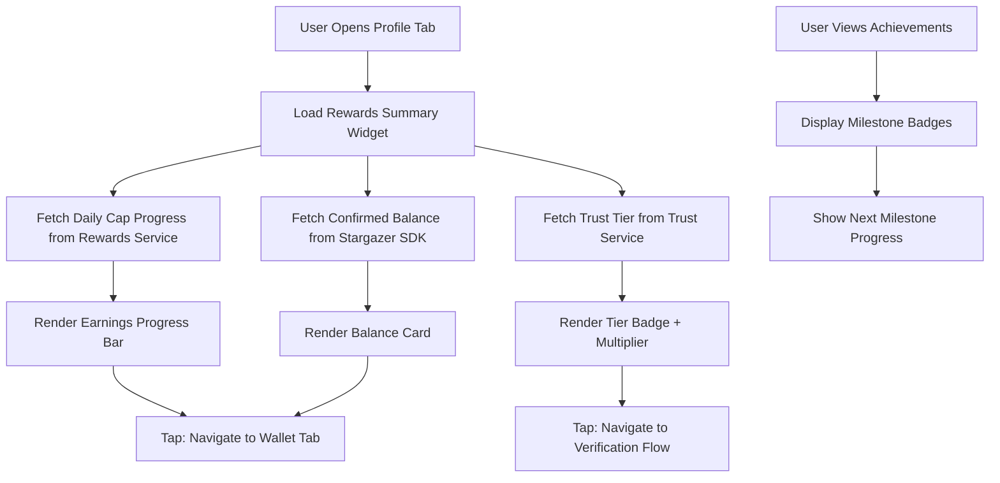
```mermaid
graph TD
    A[User Opens Profile Tab] --> B[Load Rewards Summary Widget]
    B --> C[Fetch Daily Cap Progress from Rewards Service]
    B --> D[Fetch Confirmed Balance from Stargazer SDK]
    B --> E[Fetch Trust Tier from Trust Service]
    C --> F[Render Earnings Progress Bar]
    D --> G[Render Balance Card]
    E --> H[Render Tier Badge + Multiplier]
    F --> I[Tap: Navigate to Wallet Tab]
    G --> I
    H --> J[Tap: Navigate to Verification Flow]
    K[User Views Achievements] --> L[Display Milestone Badges]
    L --> M[Show Next Milestone Progress]
```

## Key Components

### Earnings Summary Card

The profile tab shows a condensed balance card with today's earnings progress and a direct link to the Wallet tab for full management.

```swift
struct ProfileRewardsSummary: View {
    @StateObject private var viewModel = RewardsSummaryViewModel()
    
    var body: some View {
        VStack(alignment: .leading, spacing: 12) {
            // Balance headline
            HStack {
                Text("\(viewModel.totalBalance, format: .number) ECHO")
                    .font(.title2.bold())
                Spacer()
                NavigationLink("Open Wallet →", destination: WalletTab())
                    .font(.caption)
                    .foregroundColor(.accentColor)
            }
            
            // Trust tier badge + multiplier
            TrustTierBadgeRow(
                tier: viewModel.trustTier,
                multiplier: viewModel.rewardMultiplier
            )
            
            // Daily earnings progress bar
            DailyEarningsBar(
                earned: viewModel.todayEarned,
                cap: viewModel.dailyCap,
                breakdown: viewModel.earningsBreakdown
            )
            
            // Quick stats row
            HStack {
                StatChip(label: "This Week", value: viewModel.weekEarned)
                StatChip(label: "This Month", value: viewModel.monthEarned)
                StatChip(label: "Staking APY", value: viewModel.stakingAPY)
            }
        }
        .padding()
        .background(Color(.secondarySystemBackground))
        .cornerRadius(12)
    }
}
```

**Key Features:**

* Total ECHO balance (confirmed on metagraph)
* Today's earnings vs. daily cap (progress bar)
* Weekly and monthly earning totals
* Active staking APY display
* Trust tier badge with current reward multiplier
* "Open Wallet →" link to full Wallet tab
* Pending rewards with "Claim" button (triggers AtomicAction via Wallet tab)

### Trust Tier Earnings Impact

A section showing how the user's current trust tier affects their earning rate and what the next tier unlocks:

```swift
struct TrustTierEarningsPanel: View {
    let currentTier: TrustTier
    let nextTier: TrustTier?
    
    var body: some View {
        VStack(alignment: .leading) {
            Text("Your Earning Tier")
                .font(.headline)
            
            HStack {
                TrustTierBadge(tier: currentTier)
                Text("×\(currentTier.rewardMultiplier) multiplier on all rewards")
                    .font(.subheadline)
            }
            
            if let next = nextTier {
                Divider()
                Text("Upgrade to \(next.displayName) for ×\(next.rewardMultiplier) multiplier")
                    .font(.caption)
                    .foregroundColor(.secondary)
                Button("Verify Identity →") {
                    // Navigate to verification flow
                }
                .font(.caption.bold())
            }
        }
    }
}
```

**Key Features:**

* Current tier badge and multiplier display
* Projected monthly earnings at current rate
* "Upgrade to Tier X for Y× multiplier" call-to-action
* Link to identity verification flow for tier upgrade
* Multiplier breakdown by reward type (messaging, referrals, staking)

### Achievement Milestones

Achievement milestones create progression pathways that encourage long-term platform adoption and reward authentic participation. Milestones are tracked locally and verified against metagraph state.

**Milestone categories:**

| Category | Example Milestones | Reward |
| --- | --- | --- |
| Messaging | First 100 msgs, 1K msgs, 10K msgs | Badge + ECHO bonus |
| Referrals | First referral, 5 referrals, Super Referrer (25) | Badge + bonus multiplier period |
| Trust | Tier 3 verified, Tier 4 identity, Tier 5 trusted | Badge + permanent multiplier unlock |
| Staking | First stake, Bronze/Silver/Gold/Platinum tier | Badge + APY bonus |
| Governance | First vote, 10 votes, Board Candidate eligible | Badge + governance weight boost |

```swift
struct AchievementsSection: View {
    let achievements: [Achievement]
    let nextMilestone: Achievement
    
    var body: some View {
        VStack(alignment: .leading) {
            Text("Achievements")
                .font(.headline)
            
            // Earned badges grid
            LazyVGrid(columns: Array(repeating: .init(.flexible()), count: 4)) {
                ForEach(achievements.filter(\.earned)) { badge in
                    AchievementBadge(achievement: badge)
                }
            }
            
            // Next milestone progress
            NextMilestoneRow(
                milestone: nextMilestone,
                progress: nextMilestone.currentProgress,
                target: nextMilestone.target
            )
        }
    }
}
```

**Key Features:**

* Visual badge collection for earned milestones
* Progress bar toward next milestone in each category
* ECHO bonus distribution on milestone completion (via AtomicAction)
* Milestone history with completion timestamps
* Shareable achievement cards (optional — user-controlled)

### Earnings Breakdown

Users can view a daily, weekly, and monthly breakdown of earnings by source. This is a read-only view; claiming and managing rewards is done in the Wallet tab.

**Key Features:**

* Messaging rewards earned today/week/month (0.1 ECHO × trust multiplier)
* Referral bonuses earned (50 ECHO per verified referral)
* Staking rewards accrued (5–15% APY depending on tier)
* Payment rail bonuses (1–5 ECHO per payment transaction, Tier 3+ only)
* Earnings trend chart (7-day and 30-day sparkline)
* Daily cap remaining indicator
* "Claim All" button linking to Wallet tab AtomicAction claim flow

### Transaction History (Summary)

A condensed transaction history limited to the last 10 reward events. The full history with cryptographic proofs and tax export is in the Wallet tab.

**Key Features:**

* Last 10 reward transactions with type, amount, and timestamp
* On-chain verification link (DAG Explorer) per transaction
* "View Full History →" link to Wallet tab
* Filter by reward type (messaging, referral, staking)

## Security Principles

* All reward data is read from the metagraph (authoritative) or the Go Rewards Service cache (TTL: 5s)
* The rewards tracker is read-only — no token operations are performed in this view
* All token operations (claim, stake, delegate, swap) are handled in the Wallet tab via Stargazer SDK
* Achievement milestone completions are validated by the metagraph before ECHO bonuses are distributed
* Transaction history links directly to DAG Explorer for independent verification
* No PII is stored in the rewards tracker — data is identified by DID only

## Streamlined Onboarding with Verifiable Credentials and Passkeys

# Streamlined Onboarding with Verifiable Credentials and Passkeys

## Overview

This feature covers one specific advanced path within ECHO's broader three-path registration model: **credential-wallet presentation via OIDC4VC**. It is a high-trust variant of Registration Path A (phone-assisted) where users who already hold verifiable credentials from trusted issuers (governments, financial institutions, healthcare providers) can present those credentials at registration to immediately establish Tier 3–5 trust rather than starting at Tier 2.

**Context within the three-path model (see Universal Onboarding and Identity Creation blueprint):**

| Path | Description | This Blueprint? |
| --- | --- | --- |
| Path A — Phone-Assisted | SMS verification → DID creation | Partially — OIDC4VC is an optional upgrade step within Path A |
| Path B — Device-Only | No phone, no email, no credential | No |
| Path C — Enterprise SSO | SAML/OIDC org authentication | No — ECHO Comply users follow Path C, not OIDC4VC |

**ECHO Comply Note:** Enterprise users do not use OIDC4VC onboarding. Their identity is established through their organization's SSO provider (Okta, Azure AD, Google Workspace) via Path C. This blueprint applies to ECHO Message users only.

## Architecture

The OIDC4VC flow is offered as an optional trust-elevation step. A user who completed basic registration (Path A or B) can present an existing verifiable credential to immediately elevate their trust tier, OR a new user with a compatible credential wallet can use OIDC4VC as their primary onboarding method (skipping SMS verification in favor of credential presentation).

### OIDC4VC Onboarding Flow

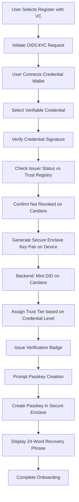
```mermaid
graph TD
    A[User Selects Register with VC] --> B[Initiate OIDC4VC Request]
    B --> C[User Connects Credential Wallet]
    C --> D[Select Verifiable Credential]
    D --> E[Verify Credential Signature]
    E --> F[Check Issuer Status vs Trust Registry]
    F --> G[Confirm Not Revoked on Cardano]
    G --> H[Generate Secure Enclave Key Pair on Device]
    H --> I[Backend: Mint DID on Cardano]
    I --> J[Assign Trust Tier based on Credential Level]
    J --> K[Issue Verification Badge]
    K --> L[Prompt Passkey Creation]
    L --> M[Create Passkey in Secure Enclave]
    M --> N[Display 24-Word Recovery Phrase]
    N --> O[Complete Onboarding]
```

### Trust Tier Assignment from Credential Type

| Credential Source | Trust Tier Assigned | Notes |
| --- | --- | --- |
| Government-issued digital ID (Apple Digital ID, ePassport) | Tier 4 — Verified | Highest non-peer-attested tier |
| Financial institution credential (KYC-verified bank credential) | Tier 3 — Member | Equivalent to third-party IDV |
| Professional credential (medical license, bar admission) | Tier 3 — Member | Issuer must be in trust registry |
| Generic VC from unsupported issuer | Tier 2 — Newcomer | Credential accepted but tier limited |

## Key Components

### OIDC4VC Compliance

The onboarding flow begins when a new user selects the "Register with Verifiable Credential" option. The application initiates an OIDC4VC-compliant request, prompting the user to connect their existing digital wallet.

**Key Features:**

* OIDC4VC protocol support
* Wallet connection
* Credential selection interface
* Credential presentation
* Protocol compliance
* Standard adherence
* Interoperability support
* Protocol updates

### Verifiable Credential Verification

The system verifies the credential's cryptographic signature, checks the issuer's status against a distributed trust registry, and confirms the credential has not been revoked.

**Key Features:**

* Cryptographic signature verification
* Issuer status checking
* Revocation checking
* Trust registry integration
* Verification automation
* Verification transparency
* Verification auditing
* Verification compliance

### Trust Registry Management

The platform must maintain and regularly update a decentralized trust registry of approved issuers to prevent fraudulent credentials.

**Key Features:**

* Issuer registry maintenance
* Issuer status tracking
* Issuer verification
* Registry updates
* Registry decentralization
* Registry transparency
* Registry auditing
* Registry compliance

### Automatic Profile Creation

Upon successful verification, the user's profile is automatically created and populated with the verified information from the credential.

**Key Features:**

* Automatic profile creation
* Data population from credential
* Profile initialization
* Profile verification
* Profile encryption
* Profile backup
* Profile recovery
* Profile auditing

### High Trust Score Assignment

Users are immediately granted a high initial trust score and a corresponding verification badge based on the credential's trust level.

**Key Features:**

* Trust score assignment
* Verification badge issuance
* Trust level determination
* Trust score calculation
* Trust score display
* Trust score tracking
* Trust score updates
* Trust score auditing

### Passkey Creation

As the final step, the user is prompted to create a passkey, which links their account to their device's biometric security (e.g., Face ID, fingerprint) for future passwordless authentication.

**Key Features:**

* Passkey creation prompt
* Biometric binding
* Secure enclave storage
* Passkey verification
* Passkey backup
* Passkey recovery
* Passkey rotation
* Passkey auditing

### WebAuthn/FIDO2 Integration

Implementation requires integration with device-native WebAuthn/FIDO2 APIs to enable passkey creation and management, binding the user's identity to their device's hardware security module.

**Key Features:**

* WebAuthn API integration
* FIDO2 support
* Hardware security module binding
* Device-native implementation
* Cross-platform support
* Fallback mechanisms
* Compatibility verification
* Integration testing

### Credential Wallet Integration

Users must possess a digital wallet that supports the OIDC4VC protocol and holds Verifiable Credentials from an issuer recognized by the platform's trust registry.

**Key Features:**

* Wallet compatibility checking
* Wallet connection
* Credential retrieval
* Credential validation
* Wallet security
* Wallet backup
* Wallet recovery
* Wallet auditing

### Sybil Attack Prevention

By adopting the OIDC4VC standard, the platform significantly reduces friction during onboarding while immediately establishing a high-trust environment by ensuring new users are authenticated against reliable, pre-vetted sources. This mitigates the risk of Sybil attacks and fraudulent account creation from the outset.

**Key Features:**

* Credential-based verification
* Issuer verification
* Revocation checking
* Duplicate account prevention
* Account linking prevention
* Fraud detection
* Abuse prevention
* Compliance verification

### Onboarding Analytics

The system tracks onboarding metrics including completion rates, credential types used, and trust score distribution to optimize the onboarding experience.

**Key Features:**

* Completion rate tracking
* Credential type analytics
* Trust score distribution
* Onboarding time tracking
* Dropout analysis
* Optimization recommendations
* Analytics export
* Analytics auditing

### Onboarding Support

Users who encounter issues during onboarding can access support resources including documentation, FAQs, and customer support channels.

**Key Features:**

* Support documentation
* FAQ resources
* Customer support access
* Troubleshooting guides
* Error message clarity
* Support ticket creation
* Support tracking
* Support analytics

## Security Principles

* Verifiable credentials are cryptographically signed and verified
* Issuer status is checked against a distributed trust registry
* Credentials are confirmed not revoked before acceptance
* Passkeys are stored exclusively in the device's secure enclave
* User profiles are automatically created with verified data
* High trust scores are assigned based on credential verification
* All onboarding data is encrypted and protected
* Sybil attacks are prevented through credential verification

## In-App High-Assurance Identity Verification and Reward

# In-App High-Assurance Identity Verification and Reward

## Overview

This feature provides an optional, in-app workflow for users to generate a high-assurance Verifiable Credential by verifying their government-issued photo ID. This process enables the highest level of trust on the platform, unlocks advanced financial features, and rewards users with ECHO tokens for their participation.

## Architecture

Users can initiate verification from their profile as a way to maximize their trust score and unlock payment capabilities. The system integrates with certified identity proofing services that comply with NIST 800-63-3 IAL2 standards. Raw identity data is processed exclusively by third-party identity verification partners and is not stored by the application.

### Identity Verification Flow

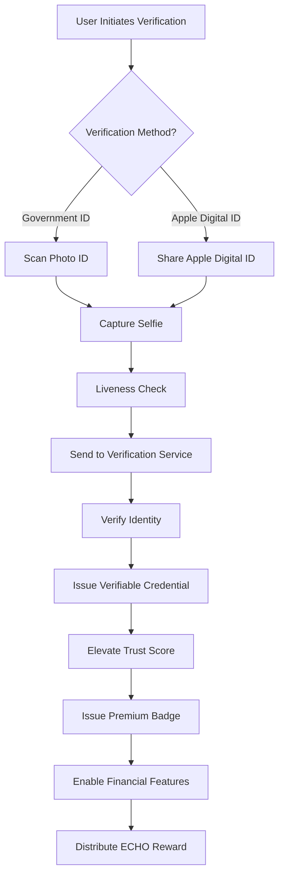
```mermaid
graph TD
    A[User Initiates Verification] --> B{Verification Method?}
    B -->|Government ID| C[Scan Photo ID]
    B -->|Apple Digital ID| D[Share Apple Digital ID]
    C --> E[Capture Selfie]
    D --> E
    E --> F[Liveness Check]
    F --> G[Send to Verification Service]
    G --> H[Verify Identity]
    H --> I[Issue Verifiable Credential]
    I --> J[Elevate Trust Score]
    J --> K[Issue Premium Badge]
    K --> L[Enable Financial Features]
    L --> M[Distribute ECHO Reward]
```

## Key Components

### Government ID Verification

Users can initiate this verification flow from their profile as a way to maximize their trust score and unlock payment capabilities. The user is prompted to either scan a government-issued photo ID, such as a driver's license.

**Key Features:**

* Government ID scanning
* Document type support (driver's license, passport, national ID)
* Image quality verification
* Document validation
* OCR processing
* Document encryption
* Document deletion after verification
* Verification status display

### Selfie-Based Liveness Check

Users complete a selfie-based liveness check to verify they are the person in the government-issued ID. The liveness check prevents fraud and ensures the person presenting the ID is the actual owner.

**Key Features:**

* Selfie capture
* Liveness detection
* Face matching
* Anti-spoofing measures
* Image quality verification
* Image encryption
* Image deletion after verification
* Verification status display

### Apple Digital ID Integration

On compatible iOS devices, users can share their verified Apple Digital ID instead of scanning a government ID. Apple Digital ID provides government-issued identity verification without exposing personal information to the application.

**Key Features:**

* Apple Digital ID support (iOS 17+)
* Automatic credential creation
* Privacy-preserving verification
* No personal data storage
* Verification status display
* Credential expiration handling
* Credential renewal support
* Credential revocation handling

### Third-Party Identity Verification Service

The entire process must adhere to strict data privacy regulations for handling PII. The raw identity data is processed exclusively by a third-party identity verification partner and is not stored by the application.

**Key Features:**

* NIST 800-63-3 IAL2 compliance
* Third-party service integration
* Data privacy compliance
* PII handling compliance
* GDPR compliance
* CCPA compliance
* Data deletion after verification
* Compliance auditing

### Verifiable Credential Issuance

Upon successful verification by a certified identity proofing service, a new high-assurance Verifiable Credential is issued directly to the user's wallet.

**Key Features:**

* Credential generation
* Credential signing
* Credential issuance
* Wallet integration
* Credential storage
* Credential verification
* Credential expiration
* Credential renewal

### Trust Score Elevation

This automatically elevates their trust score to the highest tier, grants them a premium "Identity Verified" badge, and enables access to regulated financial services within the app.

**Key Features:**

* Trust score elevation
* Highest tier assignment
* Premium badge issuance
* Financial feature access
* Feature unlock
* Access control enforcement
* Trust score display
* Trust score tracking

### Premium Badge Issuance

Users who successfully complete this verification process receive a premium "Identity Verified" badge that is displayed on their profile and in all interactions.

**Key Features:**

* Badge design
* Badge display
* Badge verification
* Badge revocation
* Badge history
* Badge auditing
* Badge compliance
* Badge transparency

### Financial Feature Access

Successful verification enables access to regulated financial services within the app, including payment processing, financial institution integration, and advanced financial features.

**Key Features:**

* Payment processing access
* Financial institution integration
* Advanced feature access
* Feature configuration
* Feature usage tracking
* Feature auditing
* Feature compliance
* Feature support

### ECHO Token Reward Distribution (Phase 3+ Conditional)

If token genesis has occurred (Phase 3+ conditional), users who successfully complete identity verification are automatically rewarded with ECHO tokens as a direct incentive for strengthening the network's trust layer. If token genesis has not yet occurred (Phase 1–2), verification completes successfully and unlocks all non-token features; the reward is queued and credited at genesis.

**Key Features:**

* Automatic reward distribution upon token genesis
* 100 ECHO reward for high-assurance verification
* Reward timing tied to token genesis milestone
* Reward verification and tracking
* Reward history
* Reward queued if pre-genesis; credited at genesis block

### Verification Status Display

Users can view their verification status in their profile, including the verification method used, verification date, and credential expiration date.

**Key Features:**

* Verification status display
* Verification method display
* Verification date display
* Credential expiration display
* Verification history
* Credential management
* Credential renewal
* Credential revocation

### Verification Retry

If verification fails, users can retry the process. The system provides clear error messages and guidance for successful verification.

**Key Features:**

* Retry functionality
* Error message clarity
* Guidance provision
* Attempt tracking
* Attempt limits
* Cooldown periods
* Support access
* Troubleshooting guides

## Security Principles

* Government ID data is processed exclusively by third-party verification services
* No personal identity data is stored by the application
* Selfie-based liveness checks prevent fraud
* Apple Digital ID provides privacy-preserving verification
* Verifiable credentials are cryptographically signed
* Trust scores are elevated based on verified credentials
* ECHO rewards are automatically distributed
* All verification data is encrypted and protected

## Decentralized Bot Framework and Automation

# Decentralized Bot Framework and Automation

## Overview

This feature enables developers to create and deploy autonomous bots that can interact with users and provide services within the messaging platform while operating on decentralized infrastructure and maintaining the platform's security and privacy standards. The bot framework supports a wide range of applications from simple utility bots to complex AI assistants and business automation tools.

## Architecture

Bots operate as smart contracts deployed on the Constellation network, ensuring they cannot access user data beyond what is explicitly authorized and cannot be shut down by centralized authorities. The framework provides access to messaging APIs, payment processing, file sharing, and blockchain integration capabilities while enforcing strict security and privacy requirements.

### Bot Deployment & Interaction Flow

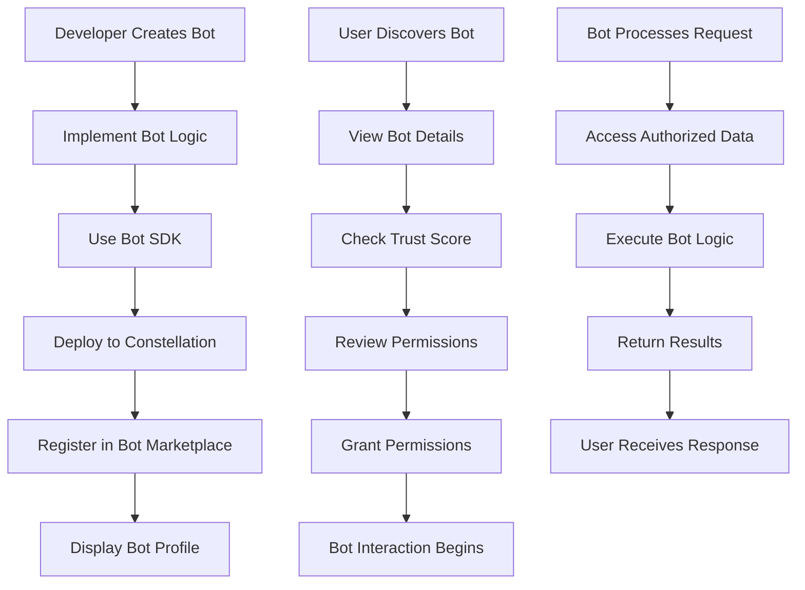
```mermaid
graph TD
    A[Developer Creates Bot] --> B[Implement Bot Logic]
    B --> C[Use Bot SDK]
    C --> D[Deploy to Constellation]
    D --> E[Register in Bot Marketplace]
    E --> F[Display Bot Profile]
    G[User Discovers Bot] --> H[View Bot Details]
    H --> I[Check Trust Score]
    I --> J[Review Permissions]
    J --> K[Grant Permissions]
    K --> L[Bot Interaction Begins]
    M[Bot Processes Request] --> N[Access Authorized Data]
    N --> O[Execute Bot Logic]
    O --> P[Return Results]
    P --> Q[User Receives Response]
```

## Key Components

### Bot SDK

Developers create bots using the ECHO Bot SDK, which provides clients for the messaging API, payment processing via AllowSpend, file sharing, and trust tier queries. Bots run as external services — they are not deployed on any blockchain.

```python
# Example: ECHO Bot SDK (Python)
from echo_bot_sdk import ECHOBot, AllowSpendClient

bot = ECHOBot(api_key="bot_api_key_here")

@bot.on_message
async def handle_message(event):
    user_did = event.sender_did
    text = event.plaintext  # Only visible after user grants message content access
    await bot.send_message(user_did, f"You said: {text}")

@bot.on_payment_request
async def handle_payment(event):
    # Execute against existing AllowSpend approval
    result = await bot.spend_tokens(
        user_did=event.user_did,
        amount=event.amount,
        purpose="bot_service_fee"
    )
    # Platform takes 15-30% fee automatically; developer receives remainder
```

**Key Features:**

* REST webhook integration for message events
* WebSocket for real-time bot interactions
* Messaging API: send text, media, reactions on behalf of bot DID
* Payment API: execute SpendTransaction against user AllowSpend approval
* Trust tier query API: check user tier before providing services
* File sharing API with E2E encrypted uploads
* Typed SDK clients (Python, Node.js, Go)

### Bot Payment Model (AllowSpend)

Bot payments use Tessellation v3 `AllowSpend` + `SpendTransaction` primitives. Users grant a time-limited, amount-bounded approval when installing a bot. The bot executes charges against that approval. Approvals auto-expire and require explicit user re-authorization — bots can never hold unlimited spending authority.

```go
// User grants AllowSpend when installing a bot
type BotInstallAllowSpend struct {
    UserDID      string
    BotDID       string
    MaxPerCharge uint64    // Maximum ECHO per single charge
    MaxPerMonth  uint64    // Monthly spending cap
    ExpiresAt    time.Time // Auto-expires; user must re-authorize
    Purpose      string    // "bot_payment"
}

// Revenue distribution on each bot charge
type BotRevenueDistribution struct {
    TotalCharged    uint64  // Amount charged to user
    DeveloperShare  uint64  // 70-85% to bot developer
    TreasuryFee     uint64  // 15-30% to community treasury
}
```

**Key Features:**

* AllowSpend-based payment authorization (no unlimited approvals)
* Per-charge and monthly spending caps set by user
* Auto-expiring approvals (require periodic re-authorization)
* Automatic 15–30% platform fee to community treasury
* Real-time earnings dashboard for bot developers
* Transparent fee disclosure before install

### Bot Trust Scoring

Bot interactions are governed by the same trust and verification systems used for human users, with bots earning trust scores based on user feedback, functionality reliability, and security audit results.

**Key Features:**

* Trust score calculation
* User feedback integration
* Reliability metrics
* Security audit results
* Trust score display
* Trust score updates
* Trust score history
* Trust score appeals

### Bot Marketplace

Users can discover bots through a decentralized marketplace where bot capabilities, trust scores, and user reviews are displayed transparently.

**Key Features:**

* Bot listing
* Bot search
* Bot categorization
* Bot filtering
* Bot reviews
* Bot ratings
* Bot installation
* Bot management

### Permission Management

Bot permissions are granular and user-controlled, allowing individuals to specify exactly what data and capabilities each bot can access, with all permissions revocable at any time.

**Key Features:**

* Permission definition
* Permission granting
* Permission revocation
* Permission modification
* Permission auditing
* Permission enforcement
* Permission transparency
* Permission history

### Rule-Based Bots

The framework supports simple rule-based bots that can perform automated tasks based on predefined conditions and actions.

**Key Features:**

* Rule definition
* Condition evaluation
* Action execution
* Rule chaining
* Rule scheduling
* Rule modification
* Rule testing
* Rule auditing

### AI-Powered Assistants

The framework supports advanced AI-powered assistants that can process natural language requests while maintaining user privacy through local processing and zero-knowledge techniques.

**Key Features:**

* Natural language processing
* Local processing
* Privacy preservation
* Zero-knowledge techniques
* Model updates
* Model versioning
* Model auditing
* Model compliance

### Customer Service Bots

Specialized bot types for common use cases including customer service bots for enterprise users that can handle customer inquiries and provide support.

**Key Features:**

* Customer inquiry handling
* Support ticket creation
* Response generation
* Escalation to human agents
* Knowledge base integration
* Learning from interactions
* Performance metrics
* Customer satisfaction tracking

### Trading Bots

Trading bots can execute cryptocurrency transactions with user authorization, enabling automated trading strategies while maintaining security and user control.

**Key Features:**

* Transaction authorization
* Order execution
* Portfolio management
* Risk management
* Performance tracking
* Audit trails
* Compliance recording
* Security verification

### Productivity Bots

Productivity bots integrate with external services while maintaining privacy, enabling users to automate workflows and increase productivity.

**Key Features:**

* External service integration
* Workflow automation
* Task scheduling
* Notification management
* Data synchronization
* Privacy preservation
* Security verification
* Compliance recording

### Entertainment Bots

Entertainment bots provide games and interactive content that users can enjoy within the messaging platform.

**Key Features:**

* Game implementation
* Interactive content
* User engagement
* Leaderboards
* Rewards integration
* Content moderation
* User safety
* Compliance verification

### Bot Analytics

The system includes comprehensive bot analytics and monitoring tools that help developers optimize their bots while respecting user privacy through anonymized usage statistics.

**Key Features:**

* Usage tracking
* Performance metrics
* User engagement metrics
* Error tracking
* Optimization recommendations
* Anonymized analytics
* Privacy preservation
* Analytics export

### Revenue Sharing

Revenue sharing mechanisms allow bot developers to monetize their creations through ECHO token payments, subscription models, or transaction fees, with all payments processed through the platform's secure payment infrastructure.

**Key Features:**

* ECHO token payments
* Subscription models
* Transaction fees
* Revenue tracking
* Payment distribution
* Revenue analytics
* Tax reporting
* Compliance recording

### Bot Security Auditing

Bots undergo security audits before marketplace listing to ensure they comply with security and privacy standards.

**Key Features:**

* Security audit process
* Vulnerability scanning
* Code review
* Permission verification
* Data access verification
* Compliance verification
* Audit reporting
* Audit history

### Bot Governance

The bot framework includes governance mechanisms that allow the community to vote on bot policies, security standards, and marketplace guidelines.

**Key Features:**

* Governance voting
* Policy voting
* Standard voting
* Guideline voting
* Voting transparency
* Voting history
* Community participation
* Governance auditing

## Security Principles

* Bots are external third-party applications — they are not smart contracts and do not run on any blockchain
* Bot API keys are scoped to specific permissions; keys cannot be used to access data beyond what the user explicitly authorized
* All user data access is permission-gated; users can revoke permissions at any time
* Bot payments use time-limited AllowSpend approvals — bots never hold unlimited spending authority over user wallets
* Platform fee (15–30%) on all bot payments flows automatically to the community treasury
* Bots undergo security audit before marketplace listing
* Trust scores for bots are calculated from user feedback and reliability metrics
* All bot interactions are logged and auditable
* AI assistants process natural language locally where possible to preserve user privacy
* Bot API keys are rotated on compromise; compromised bots can be delisted immediately

## Platform Roadmap and Future Vision

## Vision Overview

The ECHO platform will evolve from a secure messaging MVP to a fully decentralized communication and financial ecosystem over a four‑year horizon. The roadmap balances rapid user acquisition, progressive trust building, token‑driven incentives, and enterprise adoption.

## Strategic Phases

* **Phase 1 – Research & Prototype (Months 0‑6)**
  * Validate core cryptographic primitives (Kinnami, Noise, DID creation).
  * Build MVP iOS app with device‑passkey authentication and basic messaging.
  * Conduct limited beta with 5 k users, gather latency and reliability metrics.
* **Phase 2 – Core Build (Months 7‑18)**
  * Deploy Go backend services, integrate Cardano DID layer and Constellation metagraph.
  * Launch universal onboarding flow and token reward system.
  * Reach 100 k active users, achieve <500 ms message latency, &gt;99.5 % delivery success.
* **Phase 3 – Feature Polish & Public Launch (Months 19‑30)**
  * Introduce advanced features: provable integrity, voice/video calls, large file sharing, bot framework.
  * Open ECHO token marketplace, enable staking and governance.
  * Target 1 M users, $1.25 M revenue, 2 GB file sharing limit.
* **Phase 4 – Scale & Integrate (Months 31‑48)**
  * Enterprise onboarding, financial institution integration, regulatory compliance.
  * Multi‑region metagraph nodes, automated scaling to 10 k TPS.
  * Sustainable token economics, community‑driven governance.

## Success Metrics & KPIs

* **User Growth**: 100 k by end of Year 1, 1 M by end of Year 2.
* **Performance**: 95 % of messages delivered <500 ms, 99.9 % system uptime.
* **Economic**: Year 1 revenue $175 k, Year 2 $1.25 M; token circulation <5 % inflation per annum.
* **Trust**: 80 % of users achieve trust score ≥30 within 6 months of onboarding.

## Risk Mitigation

* **Regulatory**: Ongoing legal review, compliance with GDPR, CCPA, and financial regulations.
* **Security**: Continuous penetration testing, bug bounty program, formal verification of smart contracts.
* **Scalability**: Auto‑scaling Kubernetes, load‑testing to 15 k concurrent sessions before launch.

## High‑Level Architecture

The platform consists of four layers:

1. **Presentation Layer** – Native iOS SwiftUI app, future Android client.
2. **Application Layer** – Go REST services handling authentication, rate‑limiting, orchestration.
3. **Consensus Layer** – Cardano DID & credential layer, Constellation metagraph for data and token state.
4. **Storage Layer** – Decentralized logs on IPFS/Storj, Filecoin for large file persistence.

```mermaid
graph LR
    UI[iOS/Android UI] -->|Kinnami‑encrypted API| GoBackend[Go Backend Services]
    GoBackend -->|REST/HTTPS| Cardano[Cardano DID & Credential Layer]
    GoBackend -->|POST/GET| Metagraph[Constellation Metagraph]
    Metagraph -->|IPFS/Storj| DecentralizedLog[Encrypted Logs]
    Metagraph -->|Filecoin| FileStorage[Large File Storage]
```

## Implementation Milestones

* **M1 (Month 2)** – Complete universal onboarding prototype, issue first DIDs.
* **M2 (Month 5)** – Deploy Kinnami encryption across all services, passkey verification flow.
* **M3 (Month 9)** – Release beta of provable integrity messaging, anchor first messages on metagraph.
* **M4 (Month 12)** – Launch ECHO token reward contract, enable staking UI.
* **M5 (Month 18)** – Integrate voice/video calling with WebRTC and blockchain‑anchored screen‑share receipts.
* **M6 (Month 24)** – Open bot marketplace, publish SDK for third‑party developers.
* **M7 (Month 30)** – Enterprise profile verification flow, regulatory compliance audit complete.
* **M8 (Month 36)** – Multi‑region metagraph node deployment, achieve 10 k TPS.
* **M9 (Month 42)** – Governance upgrade via on‑chain voting, token burn mechanism live.
* **M10 (Month 48)** – Full public launch, target 1 M active users and sustainable revenue stream.

## Governance & Community

* Quarterly community roadmap reviews.
* On‑chain voting for major protocol upgrades.
* Open‑source SDKs and documentation hosted on GitHub.

## Summary

This future‑vision blueprint provides a concrete, phased roadmap, measurable success criteria, and a clear architectural foundation that aligns with the platform’s foundational blueprints (Backend, Frontend, Data Layer). Engineering teams can now derive detailed work orders from each milestone.

## Universal Onboarding and Identity Creation

## Functional Requirements

## FR1: Mobile Number Entry

> **Note: FR1–FR7 below represent the original single-path spec and are superseded by the full redesign further in this document. The current implementation-ready specification covers three registration paths (phone-assisted, device-only, enterprise SSO), complete login flows, and the two-branch invited member flow.**

## Invited Member Flow (ECHO Comply)

When an ECHO Comply administrator invites a new member, the invited user receives a magic link containing an invitation token (32-byte cryptographically random base64url, 7-day expiry). Tapping the link routes through a two-branch flow determined by a pre-check: does this email have an existing ECHO DID?

### Pre-Check: New User vs Existing User

```plaintext
Tap magic link → iOS deep link opens ECHO app
                 ↓
GET /v1/comply/invitations/{token}/resolve
  → { user_status: "new" | "existing",
      org_name, org_primary_color, org_logo_url,
      role, suggested_display_name, custom_message,
      role_assigned_by_display_name, expires_at }
                 ↓
    ┌──────────────────────────────────┐
    │ user_status = "new"              │   user_status = "existing"
    │ → Branch A: First-run + Invite   │   → Branch B: Auth + Invite
    └──────────────────────────────────┘
```

The endpoint is unauthenticated — the invitation token is the auth mechanism. User status is determined by whether the invited email has a registered DID in the Identity Service.

### Branch A: New User (First-Run + Invite)

```plaintext
Organization welcome screen (org branding)
  → Standard ECHO registration (phone or device-only path)
  → Transparency screen: what org WILL and WON'T see
  → Work display name confirmation (pre-filled from suggested_display_name)
  → POST /v1/comply/invitations/{token}/accept
  → Backend: create membership + issue EchoOrgRoleCredential VC
  → iOS: org context appears in context switcher
```

### Branch B: Existing User (Auth + Invite)

```plaintext
Organization welcome screen (org branding)
  → Biometric authentication (existing personal DID)
  → Transparency screen
  → Work display name (may differ from personal display name)
  → POST /v1/comply/invitations/{token}/accept
  → iOS: new org context appears alongside existing Personal context
```

### Transparency Screen

Both branches show this screen before acceptance — the core trust mechanism:

```plaintext
┌──────────────────────────────────────────────────────┐
│  [Org logo]  Mercy Health secure messaging             │
│                                                        │
│  What Mercy Health WILL see in your work context:      │
│  ✓ Messages you send to Mercy Health colleagues        │
│  ✓ Your work display name: "Dr. Jane Smith"            │
│  ✓ Your work profile photo                             │
│                                                        │
│  What Mercy Health will NOT see:                       │
│  ✗ Your personal messages or conversations             │
│  ✗ Who you message outside this organization           │
│  ✗ Your personal trust tier or credential details      │
│  ✗ Any data from your Personal context                 │
│                                                        │
│  Your personal ECHO identity remains entirely private. │
│                                                        │
│       [ Accept and join Mercy Health ]                 │
└──────────────────────────────────────────────────────┘
```

### InvitationCoordinator (iOS)

```swift
@MainActor
final class InvitationCoordinator: ObservableObject {
    enum Branch {
        case newUser(ResolvedInvitation)
        case existingUser(ResolvedInvitation)
    }

    func resolve(token: String) async throws -> Branch {
        let resolved = try await invitationService.resolve(token: token)
        return resolved.userStatus == .new
            ? .newUser(resolved)
            : .existingUser(resolved)
    }
}

struct ResolvedInvitation {
    let token: String
    let userStatus: UserStatus             // .new or .existing
    let organizationName: String
    let orgPrimaryColor: Color             // used to brand the welcome screen
    let orgLogoURL: URL?
    let role: String
    let roleAssignedByDisplayName: String  // "Invited by Sarah Chen"
    let suggestedDisplayName: String
    let department: String?
    let customMessage: String?
    let expiresAt: Date
}
```

### Acceptance: Idempotency

The acceptance endpoint uses the idempotency-key middleware. Network-induced retry of the same accept call is safe — if the membership already exists for the same DID and token, the endpoint returns the existing membership ID. Re-accept by a **different** DID returns an error, preventing account hijacking via token sharing.

* **FR3: DID Generation** – Immediately after successful SMS verification, the backend generates a Decentralized Identifier (DID) on the Cardano blockchain and anchors it to the user's profile.
* **FR4: Passkey Creation** – The iOS app generates a fresh passkey using the device's Secure Enclave. The public key is sent to the backend and linked to the newly created DID document.
* **FR5: Initial Trust Score Assignment** – Upon completion of steps 2‑4, the user receives an initial trust score of **5 points** (device‑verified tier) to unlock basic platform features.
* **FR6: Optional Phone Number Decoupling** – After DID creation, the user may choose to delete the stored phone number. If deleted, the number is removed from all persistent storage.
* **FR7: Transition to Progressive Identity** – The onboarding flow must surface a prompt encouraging the user to continue to the "Streamlined Onboarding with Verifiable Credentials" or "In‑App High‑Assurance Identity Verification" flows for higher trust levels.

> **Note: The above FR1–FR7 represent the original single-path spec and are superseded by the full redesign below. See "Revised Specification: Login + Registration (Full Redesign)" for the current implementation-ready specification covering three registration paths (phone-assisted, device-only, enterprise SSO) and complete login flow**s.

## Non-Functional Requirements

* **NFR1: Performance** – SMS verification code delivery and verification must complete within **2 sec**onds on average under normal network conditions.
* **NFR2: Scalability** – The onboarding service must handle **10,000 concurrent sessions** without degradation, supporting auto‑scaling of backend containers.
* **NFR3: Security** – All communication uses TLS 1.3 and Kinnami end‑to‑end encryption. Passkeys never leave the Secure Enclave; only the public key is transmitted.
* **NFR4: Reliability** – SMS gateway failures trigger an automatic retry with the fallback provider (Prove). The system must guarantee **99.5 %** successful verification attempts.
* **NFR5: Privacy** – Phone numbers are stored encrypted at rest and are **deleted** immediately after the user opts to decouple them. No logs retain the raw number.
* **NFR6: Auditable Traceability** – DID creation and passkey linking events are recorded on the Cardano metagraph with immutable transaction hashes for compliance.

## Solution Design

The onboarding flow consists of four tightly coupled components:

1. **iOS Frontend** – Handles UI, Secure Enclave passkey generation, and communicates with the backend via Kinnami‑encrypted REST calls.
2. **SMS Verification Service** – Wraps Twilio and Prove APIs, exposing a simple verification endpoint to the backend.
3. **DID Generation Service** – Interacts with the Cardano network (Atala PRISM) to mint a DID and write the initial DID document containing the passkey public key.
4. **Onboarding Backend** – Orchestrates the flow, stores temporary phone numbers, assigns the initial trust score, and optionally deletes the phone number.

```mermaid
graph TD
    A[iOS App] -->|Enter phone| B[Backend: Start Session]
    B -->|Send SMS via| C[SMS Service (Twilio/Prove)]
    C -->|SMS code| A
    A -->|Submit code| B
    B -->|Verify code| C
    B -->|Success| D[DID Service]
    D -->|Create DID| E[Cardano Blockchain]
    A -->|Generate passkey| F[Secure Enclave]
    F -->|Public key| B
    B -->|Link DID & key| D
    B -->|Assign trust score 5| G[Trust Score Service]
    B -->|Optional delete phone| H[Secure Storage]
```

### Key Design Decisions

* **SMS Provider Choice** – Twilio is the default provider for global coverage; Prove is used as a fallback for regions where Twilio is unavailable.
* **DID Timing** – The DID is minted **immediately after SMS verification** to ensure the identifier exists before passkey linking.
* **Passkey Generation** – A fresh key pair is generated on the device; the private key never leaves the Secure Enclave.
* **Phone Number Lifecycle** – Phone numbers are stored only for the duration of the onboarding session and are encrypted. Deletion is optional but recommended for privacy.
* **Initial Trust Score** – Users start with a base trust score of **5** (device‑verified) to enable basic messaging and onboarding continuation.

### Data Model

```go
// UserOnboarding represents the persisted onboarding state for a user.
type UserOnboarding struct {
    UserID            uuid.UUID `json:"user_id"`            // Internal UUID for the user record
    PhoneNumber       string    `json:"phone_number,omitempty"` // Encrypted, optional after decoupling
    DID               string    `json:"did"`               // Cardano DID (did:prism:cardano:...)
    PasskeyPublicKey  string    `json:"passkey_public_key"` // Base58‑encoded Ed25519 public key
    TrustScore        int       `json:"trust_score"`        // Starts at 5 for device‑verified users
    CreatedAt         time.Time `json:"created_at"`
    UpdatedAt         time.Time `json:"updated_at"`
}

// OnboardingSession tracks the SMS verification lifecycle.
type OnboardingSession struct {
    SessionID      uuid.UUID `json:"session_id"`
    PhoneNumber    string    `json:"phone_number"` // Encrypted
    VerificationCode string  `json:"verification_code"`
    ExpiresAt      time.Time `json:"expires_at"`
    Status         string    `json:"status"` // pending, verified, failed
}
```

### API Implementation

#### POST /v1/onboarding/start

*Purpose*: Initiate onboarding by submitting a phone number.

```json
{
  "phone_number": "+15551234567"
}
```

*Response* (202 Accepted):

```json
{
  "session_id": "a1b2c3d4-5678-90ab-cdef-1234567890ab",
  "message": "Verification code sent"
}
```

---

#### POST /v1/onboarding/verify

*Purpose*: Verify the SMS code and trigger DID creation.

```json
{
  "session_id": "a1b2c3d4-5678-90ab-cdef-1234567890ab",
  "verification_code": "834921"
}
```

*Response* (200 OK):

```json
{
  "did": "did:prism:cardano:abc123def456",
  "trust_score": 5,
  "message": "Phone verified, DID created"
}
```

---

#### POST /v1/onboarding/passkey

*Purpose*: Submit the freshly generated passkey public key to link with the DID.

```json
{
  "did": "did:prism:cardano:abc123def456",
  "public_key": "<base58‑encoded‑public‑key>"
}
```

*Response* (200 OK):

```json
{
  "status": "linked",
  "message": "Passkey linked to DID"
}
```

---

#### DELETE /v1/onboarding/phone

*Purpose*: Optional removal of the stored phone number after DID creation.

```json
{
  "did": "did:prism:cardano:abc123def456"
}
```

*Response* (200 OK):

```json
{
  "status": "deleted",
  "message": "Phone number removed from persistent storage"
}
```

---

All endpoints require a valid **Bearer token** obtained after the passkey linking step; the token is signed using the passkey private key via WebAuthn/FIDO2.

### UI Implementation

* **PhoneNumberEntryView** – Text field for phone number entry, “Send Code” button, validation of E.164 format.
* **VerificationCodeView** – Input for 6‑digit code, “Verify” button, countdown timer for code expiry.
* **DIDCreationProgressView** – Spinner with status messages (“Creating DID on Cardano…”) and a fallback error screen.
* **PasskeySetupView** – System prompt to create a passkey via Secure Enclave, displays success/failure.
* **OnboardingCompleteView** – Shows the newly created DID, initial trust score, and offers a button to “Continue to Full Identity Setup”.
* **PhoneNumberDeletionToggle** – Switch allowing the user to delete the phone number; triggers the DELETE endpoint.

Each view follows the existing SwiftUI MVVM pattern used throughout the app, with ViewModels handling API calls, state management, and error handling.

---

# Revised Specification: Login + Registration (Full Redesign)

## Overview

Onboarding is ECHO's first impression of its core promise: you own your identity, not us. The entire flow communicates this through mechanics — what the app asks for, and what it explicitly does not.

This specification covers both **registration** and **login** in a single unified experience. A new user and a returning user land on the same screen. The app silently checks for an existing Secure Enclave key on device load to determine which path to take.

## The Phone Number Decision

This is the most important architectural decision in the onboarding flow.

### What competitors do

| App | Registration | What they store | Privacy reality |
| --- | --- | --- | --- |
| **Signal** | Phone required | Phone number (for verification; not visible to contacts) | Phone is permanent anchor; username is secondary |
| **Telegram** | Phone or username | Phone always retained on Telegram servers even if hidden from contacts | Phone kept for analytics and recovery regardless |
| **Session** | No phone, no email | Nothing — random 66-char Session ID + 24-word seed phrase | True anonymity; seed phrase loss = account loss |

### ECHO's recommendation: Offer both, default to decentralized

**Path A — Quick Start (Phone Optional**): Phone number for SMS verification → DID created → app immediately asks: *"Delete your phone number?"* Default: Delete. Familiar entry point, zero long-term PII.

**Path B — Pure ECHO (No Phone**): No phone, no email. Secure Enclave generates key pair. DID minted on Cardano directly. Discovery via QR code, username, and invite links. Session-inspired maximum privacy path.

**Path C — Enterprise SSO (ECHO Comply**): SAML/OIDC via Okta, Azure AD, or Google Workspace. DID linked to organizational credential. Trust tier set by org policy.

**Why phone is useful but optional:**

| Reason to offer phone | Reason to make it optional |
| --- | --- |
| Sybil resistance — harder to mass-create fake accounts | Ties real-world identity to DID permanently |
| Familiar to mainstream users (Signal model) | ECHO targets journalists, activists, surveillance-risk users |
| Enables contact discovery via phone number matching | ECHO's architecture (Cardano DID + Secure Enclave) doesn't technically need it |
| Provides recovery anchor for less technical users | Session proves phone-free is viable at millions of users |

**The right default:** Phone is the first visible option (familiar), but "Skip — Create with just this device" is equally prominent below it — not a buried footnote.

## Login / Register Screen Design

```plaintext
App launch
    │
    ├── Secure Enclave key exists on device?
    │   YES → Biometric login (returning user, no screen shown)
    │   NO  → Show Login / Register screen
    │
    └── Login / Register screen:

┌──────────────────────────────────────────────────┐
│              [ECHO logo / wordmark]                │
│         Private messaging. Owned by you.           │
│                                                    │
│  ┌──────────────────────────────────────────────┐ │
│  │  📱  Register with phone number              │ │
│  │      Fast setup — phone deleted after signup │ │
│  └──────────────────────────────────────────────┘ │
│                                                    │
│  ┌──────────────────────────────────────────────┐ │
│  │  🔑  Register with just this device          │ │
│  │      No phone. No email. Maximum privacy.    │ │
│  └──────────────────────────────────────────────┘ │
│                                                    │
│  ─────────── Already have an account? ──────────── │
│                                                    │
│  ┌──────────────────────────────────────────────┐ │
│  │  📷  Sign in on new device                   │ │
│  │      Scan QR code from your old device       │ │
│  └──────────────────────────────────────────────┘ │
│                                                    │
│  ┌──────────────────────────────────────────────┐ │
│  │  🔐  Restore from recovery phrase            │ │
│  │      Enter 24-word phrase to recover account │ │
│  └──────────────────────────────────────────────┘ │
│                                                    │
│         [ Enterprise / ECHO Comply login → ]       │
└──────────────────────────────────────────────────┘
```

**UX principles from research:**

* Registration and login on **one screen** — no separate "create account" / "sign in" pages
* Both registration paths **equally prominent** — no default nudge toward phone
* Login options clearly separated from registration by a visual divider
* Enterprise SSO is secondary — not the consumer primary CTA
* No "Sign in with Google/Apple" — that re-centralizes identity

## Registration Flow A: Phone-Assisted

```mermaid
graph TD
    A[Tap Register with phone number] --> B[Enter phone in E.164 format]
    B --> C[SMS sent via Twilio / Prove fallback / voice call]
    C --> D[Enter 6-digit code - 10 min expiry, 3 attempt max]
    D --> E{Code valid?}
    E -->|No| F[Error + retry]
    E -->|Yes| G[Generate Secure Enclave P-256 key pair on device]
    G --> H[Derive did:key from public key - instant, zero cost]
    H --> I[Backend: register VC on Constellation Identity Metagraph]
    I --> J[Assign Trust Tier 2 - Newcomer]
    J --> K[Phone deletion prompt - delete is default CTA]
    K -->|Delete recommended| L[Phone permanently removed from all storage]
    K -->|Keep for contact discovery| M[Phone stored encrypted - Argon2id hashed in discovery index only]
    L --> N[Set display name + optional public username]
    M --> N
    N --> O[24-word BIP-39 recovery phrase - screenshot blocked]
    O --> P[Confirm 3 random words from phrase]
    P --> Q[Enter ECHO]
```

**Phone deletion prompt text:** *"Your ECHO identity is cryptographically yours — derived from this device's Secure Enclave key. You no longer need your phone number. Delete it now*?" Primary button: "Delete" (green). Secondary: "Keep for contact discovery" (ghost button).

## Registration Flow B: Pure Device-Only

```mermaid
graph TD
    A[Tap Register with just this device] --> B[Generate Secure Enclave P-256 key pair]
    B --> C[Derive did:key from public key - instant, zero cost]
    C --> D[Backend: register initial VC on Constellation Identity Metagraph]
    D --> E[Assign Trust Tier 1 - Unverified]
    E --> F[Set display name - optional]
    F --> G[Set public username - optional, for discoverability]
    G --> H[24-word recovery phrase display - screenshot blocked]
    H --> I[Confirm 3 random words from phrase]
    I --> J[Enter ECHO]
```

**Trust tier upgrade prompt:** After entering the app, a dismissable banner: *"Add a phone number or complete identity verification to reach Tier 2 and unlock more features →"*

## Registration Flow C: Enterprise SSO

```mermaid
graph TD
    A[Tap Enterprise ECHO Comply login] --> B[Enter organization domain]
    B --> C[Backend resolves SSO provider - Okta / Azure AD / Google]
    C --> D[Redirect to org SSO]
    D --> E{SSO verified?}
    E -->|No| F[Auth failure message - contact IT admin]
    E -->|Yes| G[Receive SAML / OIDC token]
    G --> H[Generate Secure Enclave key pair]
    H --> I[Backend: register org membership VC on Constellation Identity Metagraph]
    I --> J[Set Trust Tier from org policy - Tier 3 or 4]
    J --> K[Apply org retention and compliance policy]
    K --> L[Enter ECHO Comply]
```

## Login: Returning User — Same Device (Biometric)

The app detects the Secure Enclave key on launch and goes directly to biometric — no screen is shown between splash and the app.

```plaintext
App launches → detect Secure Enclave key → show biometric prompt:
  "Welcome back, [display name]"
  [Face ID / Touch ID]
    ├── Success → derive storage key → load messages → enter app
    └── Failure (5x) → device passcode fallback
                       (10 total → 15-minute lockout)
```

No password entry. No "remember me." The biometric is the login.

## Login: Returning User — New Device

### Option 1: QR Code Transfer (Recommended)

```plaintext
Old device:  Settings → Account → Link New Device → display QR (5-min expiry)
New device:  Tap "Sign in on new device" → scan QR → biometric confirm on OLD device

What transfers:  ✅ DID identity    ✅ New device did:key registered on Constellation Identity Metagraph
                 ✅ Group keys re-encrypted for new device
                 ❌ Message history (stays on old device — privacy by design)
```

Requires confirmation on the existing trusted device — prevents account takeover even if new device is immediately stolen.

### Option 2: Recovery Phrase

```plaintext
New device: Tap "Restore from recovery phrase" → enter 24-word BIP-39 phrase
→ Secure Enclave generates new key pair derived from phrase entropy
→ New did:key derived from new public key
→ Backend: submits Identity Metagraph VC update registering new key as canonical
→ Account accessible on new device — no message history
```

### Option 3: Identity Re-Verification

```plaintext
"I lost my recovery phrase" → re-verify via original phone or IDV credential
→ available only if user originally completed Tier 4 high-assurance IDV
→ new did:key registered on Constellation Identity Metagraph (key rotation)
→ mirrors Signal's registration-lock model
```

## Recovery Phrase Design

24-word BIP-39 mnemonic. Generated from Secure Enclave public parameters + user passphrase. Displayed once. Never stored anywhere by ECHO.

```swift
struct RecoveryPhraseView: View {
    let phrase: [String]  // 24 words

    var body: some View {
        VStack(spacing: 24) {
            Text("Your Recovery Phrase").font(.title2.bold())
            Text("Write these 24 words in order and store them somewhere safe. This is the only way to recover your account on a new device. ECHO never stores a copy.")
                .foregroundColor(.secondary).multilineTextAlignment(.center)

            LazyVGrid(columns: Array(repeating: .init(.flexible()), count: 4)) {
                ForEach(Array(phrase.enumerated()), id: \.offset) { i, word in
                    HStack(spacing: 4) {
                        Text("\(i+1).").foregroundColor(.secondary).font(.caption)
                        Text(word).font(.system(.body, design: .monospaced))
                    }
                    .padding(8)
                    .background(Color(.secondarySystemBackground))
                    .cornerRadius(8)
                }
            }

            Button("I've written it down — Continue") {
                // Challenge: user must enter 3 randomly selected words before proceeding
            }
            .buttonStyle(.borderedProminent)
        }
    }

    // Disable screenshot and app switcher preview on this screen
}
```

## Session Token Architecture

ECHO uses a **three-tier authentication model**: a short-lived registration token during onboarding, a backend-issued session JWT for ongoing API calls, and per-request Secure Enclave signatures for high-value operations. The user's private key never leaves the Secure Enclave and never signs JWTs — it only signs challenges and sensitive payloads.

### Tier 1 — Registration Token (Onboarding Only)

Issued immediately after SMS code is verified (Phone path) or public key is received (Device-only path). Scoped exclusively to `/v1/onboarding/*` endpoints. Used to complete the multi-step registration without re-verifying identity.

| Property | Value |
| --- | --- |
| Issued by | Backend Identity Service after SMS verify or public key receipt |
| Format | Opaque 32-byte random base64url string |
| Expiry | 30 minutes |
| Scope | `/v1/onboarding/*` only — rejected on any other endpoint |
| Storage | In-memory only on iOS (not persisted to Keychain) |
| Invalidation | Single-use after `create-did` completes; deleted on expiry |

The registration token is **not** a JWT because it exists before the user has a `did:key` — there is no subject claim to include. It is an opaque nonce tied server-side to the onboarding session.

### Tier 2 — Session JWT (Full API Access)

After registration completes or when an existing user authenticates, the backend issues a session JWT via a **challenge-response flow**. The user's Secure Enclave key signs a server-provided challenge; the backend verifies the signature and issues a JWT signed with the **backend's own Ed25519 key** — not the user's key.

#### Challenge-Response Issuance Flow

```plaintext
1. Client:  POST /v1/auth/challenge
   Body:    { "did_key": "did:key:z6Mk..." }
   Response: { "challenge": "<32-byte-random-base64url>", "expires_at": "T+5min" }

2. Client:  Sign challenge using Secure Enclave P-256 key (biometric required)
   Input:   SHA-256(challenge || did_key || timestamp_seconds)
   Output:  ECDSA P-256 signature (DER-encoded, base64url)

3. Client:  POST /v1/auth/token
   Body:    {
              "did_key": "did:key:z6Mk...",
              "challenge": "<same-32-byte-value>",
              "signature": "<base64url-ecdsa-signature>",
              "device_id": "<opaque-device-identifier>"
            }

4. Backend: Decode public key from did:key identifier directly (no chain lookup)
            Verify: SHA-256(challenge || did_key || timestamp) matches signature
            Verify: challenge not expired, not already used (one-time)
            Verify: device_id is registered for this did:key
            Issue: session JWT + refresh token

5. Response: {
              "access_token": "<session-jwt>",
              "refresh_token": "<opaque-32-bytes>",
              "expires_in": 7200,
              "token_type": "Bearer"
            }
```

#### Session JWT Format

The session JWT is signed by the **backend's Ed25519 signing key** (rotated annually, key ID in header). This means token validation requires only the backend public key — no database lookup for normal requests.

```json
// Header
{
  "alg": "EdDSA",
  "typ": "JWT",
  "kid": "backend-ed25519-2026-v1"
}

// Payload
{
  "iss": "https://api.echo.app",
  "sub": "did:key:z6MkhaXgBZDvotDkL5257faiztiGiC2QtKLGpbnnEGta2doK",
  "iat": 1714000000,
  "exp": 1714007200,
  "jti": "unique-nonce-per-token",
  "tier": 2,
  "device_id": "opaque-device-identifier",
  "scope": "full"
}
```

| JWT Claim | Description |
| --- | --- |
| `sub` | User's `did:key` — the authenticated identity |
| `exp` | 2 hours from issuance (`iat + 7200`) |
| `jti` | Unique token ID — enables targeted revocation |
| `tier` | Trust tier at issuance — cached for access control without DB lookup |
| `device_id` | Opaque device identifier — enables per-device revocation |
| `kid` | Backend key ID — enables key rotation without breaking existing tokens |

#### Session JWT Storage and Usage

```swift
// iOS — store session JWT in Keychain (NOT Secure Enclave — size constraint)
// Session JWTs are ~350 bytes; Secure Enclave is optimized for key material
let keychainQuery: [String: Any] = [
    kSecClass as String: kSecClassGenericPassword,
    kSecAttrAccount as String: "echo.session.jwt",
    kSecAttrAccessible as String: kSecAttrAccessibleWhenUnlockedThisDeviceOnly,
    kSecValueData as String: jwtData
]

// Attach to every API request:
// Authorization: Bearer <session-jwt>
var request = URLRequest(url: endpoint)
request.setValue("Bearer \(sessionJWT)", forHTTPHeaderField: "Authorization")
```

#### Session Token Refresh

```plaintext
POST /v1/auth/refresh
Body:     { "refresh_token": "<opaque-32-bytes>" }
Response: { "access_token": "<new-jwt>", "refresh_token": "<new-opaque-token>", "expires_in": 7200 }
```

| Refresh Token Property | Value |
| --- | --- |
| Format | 32-byte cryptographically random base64url (opaque, not a JWT) |
| Expiry | 7 days |
| Rotation | Single-use — every refresh issues a new refresh token, old one is invalidated |
| Storage | iOS Keychain + PostgreSQL `sessions` table (for revocation) |
| Revocation | Delete from `sessions` table; next refresh attempt returns 401 |

Refresh tokens do NOT require biometric re-authentication by default. If the backend detects suspicious activity (new IP, unusual pattern), it can require re-authentication by returning `401 Unauthorized` with `"error": "reauth_required"`.

### Tier 3 — Per-Request Secure Enclave Signature (High-Value Operations)

Certain sensitive operations require the user to additionally sign the specific request payload with their Secure Enclave key. This provides **biometric-bound, replay-proof authorization** for actions that cannot be undone.

```swift
// High-value request signing pattern
func signRequest(payload: Data, path: String) async throws -> String {
    // Construct the signing input
    let signingInput = SigningInput(
        method: "POST",
        path: path,
        payload_hash: SHA256.hash(data: payload),
        timestamp: Int(Date().timeIntervalSince1970),
        nonce: UUID().uuidString
    )
    let signingData = try JSONEncoder().encode(signingInput)
    
    // Sign with Secure Enclave key (requires Face ID / Touch ID)
    let signature = try await secureEnclave.sign(
        data: signingData,
        keyLabel: "echo-did-signing",
        reason: "Authorize this action"  // shown in biometric prompt
    )
    
    return signature.base64URLEncoded()
}

// Include in request header:
// X-DID-Signature: <base64url-ecdsa-signature>
// X-DID-Timestamp: <unix-seconds>
// X-DID-Nonce: <uuid>
```

**Endpoints requiring **`X-DID-Signature`**:**

| Endpoint | Why |
| --- | --- |
| `DELETE /v1/account` | Account deletion is irreversible |
| `DELETE /v1/account/devices/:id` | Removing a device affects all sessions |
| `POST /v1/onboarding/create-did` | Registering a new identity |
| `POST /v1/login/link-device/complete` | Adding a new trusted device |
| `POST /v1/tokens/rewards/claim` | Token claims (Phase 3+) |
| `POST /v1/governance/vote` | Governance votes (Phase 3+) |
| ECHO Comply: `POST /v1/comply/litigation/hold` | Compliance-critical, court-admissible |
| ECHO Comply: `POST /v1/comply/organizations/{id}/baa` | BAA acceptance |

**Backend validation for **`X-DID-Signature`**:**

```go
func ValidateDIDSignature(
    r *http.Request,
    userDIDKey string,
    replayWindow time.Duration,
) error {
    signature := r.Header.Get("X-DID-Signature")
    timestamp := r.Header.Get("X-DID-Timestamp")
    nonce := r.Header.Get("X-DID-Nonce")

    // 1. Parse timestamp — reject if outside ±5 minute window
    ts, err := strconv.ParseInt(timestamp, 10, 64)
    if err != nil || time.Since(time.Unix(ts, 0)).Abs() > replayWindow {
        return ErrTimestampOutOfWindow
    }

    // 2. Reject replayed nonces (Redis set, TTL = replayWindow)
    if cache.NonceExists(nonce) {
        return ErrReplayedNonce
    }
    cache.StoreNonce(nonce, replayWindow)

    // 3. Reconstruct signing input
    body, _ := io.ReadAll(r.Body)
    signingInput := SigningInput{
        Method:      r.Method,
        Path:        r.URL.Path,
        PayloadHash: sha256.Sum256(body),
        Timestamp:   ts,
        Nonce:       nonce,
    }

    // 4. Decode public key directly from did:key (no chain lookup)
    pubKey, err := didkey.DecodePublicKey(userDIDKey)
    if err != nil {
        return ErrInvalidDIDKey
    }

    // 5. Verify ECDSA P-256 signature
    inputBytes, _ := json.Marshal(signingInput)
    sigBytes, _ := base64.URLEncoding.DecodeString(signature)
    if !ecdsa.VerifyASN1(pubKey, inputBytes, sigBytes) {
        return ErrInvalidSignature
    }

    return nil
}
```

### Token Revocation

| Scenario | Revocation Method |
| --- | --- |
| User logs out | Invalidate refresh token in `sessions` table; JWT expires naturally in ≤2h |
| Device revoked | Invalidate all refresh tokens for `device_id` in `sessions` table |
| Account deleted | Invalidate all refresh tokens for `sub` (did:key) |
| Suspected compromise | Add `jti` to Redis revocation list (TTL = remaining JWT expiry) + invalidate all refresh tokens |
| Backend key rotation | Old `kid` tokens remain valid until `exp`; new tokens use new `kid` |

```sql
-- sessions table for refresh token management
CREATE TABLE sessions (
    id UUID PRIMARY KEY DEFAULT gen_random_uuid(),
    user_did TEXT NOT NULL,
    device_id TEXT NOT NULL,
    refresh_token_hash TEXT NOT NULL,  -- SHA-256 of the opaque token
    issued_at TIMESTAMPTZ NOT NULL DEFAULT NOW(),
    expires_at TIMESTAMPTZ NOT NULL,   -- 7 days
    last_used_at TIMESTAMPTZ,
    revoked_at TIMESTAMPTZ,
    UNIQUE(refresh_token_hash)
);
CREATE INDEX idx_sessions_user_did ON sessions(user_did) WHERE revoked_at IS NULL;
CREATE INDEX idx_sessions_device_id ON sessions(device_id) WHERE revoked_at IS NULL;
```

```go
type UserOnboarding struct {
    UserID           uuid.UUID `json:"user_id"`
    RegistrationPath string    `json:"registration_path"` // "phone" | "device_only" | "enterprise_sso"
    PhoneNumber      string    `json:"phone_number,omitempty"` // Encrypted; nil if deleted
    PhoneDeleted     bool      `json:"phone_deleted"`
    DID              string    `json:"did"` // did:key:z6Mk... (derived from Secure Enclave public key)
    PasskeyPublicKey string    `json:"passkey_public_key"`
    DisplayName      string    `json:"display_name,omitempty"`
    Username         string    `json:"username,omitempty"` // Optional public @handle
    TrustTier        int       `json:"trust_tier"`         // 1 (device_only) or 2 (phone_verified)
    OrgDID           string    `json:"org_did,omitempty"`  // Enterprise SSO only
    CreatedAt        time.Time `json:"created_at"`
    UpdatedAt        time.Time `json:"updated_at"`
}

type OnboardingSession struct {
    SessionID        uuid.UUID `json:"session_id"`
    PhoneNumber      string    `json:"phone_number"` // Encrypted; deleted after verification
    VerificationCode string    `json:"verification_code"` // Hashed in storage
    Attempts         int       `json:"attempts"`     // Max 3 before lockout
    ExpiresAt        time.Time `json:"expires_at"`   // 10-minute TTL
    Status           string    `json:"status"`       // pending | verified | failed | expired
}

type DeviceLink struct {
    DID        string    `json:"did"`
    DeviceID   string    `json:"device_id"`
    PublicKey  string    `json:"public_key"`
    DeviceName string    `json:"device_name"` // User-editable; "iPhone 15 Pro"
    LinkedAt   time.Time `json:"linked_at"`
    IsRevoked  bool      `json:"is_revoked"`
}
```

## API Specification

### Registration — Phone Path

```plaintext
POST /v1/onboarding/start
Body:     { "phone_number": "+15551234567" }
Response: { "session_id": "uuid", "expires_at": "T+10min" }

POST /v1/onboarding/verify
Body:     { "session_id": "uuid", "verification_code": "834921" }
Response: { "verified": true, "registration_token": "opaque-30min-scoped-token" }

POST /v1/onboarding/create-did          (requires registration_token)
Body:     { "public_key": "base58-p256", "display_name": "Alice", "username": "alice" }
Response: { "did": "did:key:z6Mk...", "trust_tier": 2, "vc_id": "uuid" }
          (also issues full session JWT via POST /v1/auth/token implicitly)

DELETE /v1/onboarding/phone             (requires registration_token)
Body:     { "did": "did:key:z6Mk..." }
Response: { "deleted": true }
```

### Registration — Device-Only Path

```plaintext
POST /v1/onboarding/create-did          (no phone session required; X-DID-Signature required)
Body:     { "public_key": "base58-p256", "display_name": "Alice", "username": "alice" }
Response: { "did": "did:key:z6Mk...", "trust_tier": 1, "vc_id": "uuid" }
```

### Registration — Enterprise SSO

```plaintext
GET  /v1/onboarding/sso/resolve?domain=hospital.com
Response: { "provider": "okta", "sso_url": "https://hospital.okta.com/..." }

POST /v1/onboarding/sso/complete
Body:     { "saml_response": "...", "public_key": "base58-p256" }
Response: { "did": "did:key:z6Mk...", "trust_tier": 3, "org_did": "did:key:z6Mk...", "retention_policy": "hipaa_6yr", "vc_id": "uuid" }
```

### Authentication — Token Issuance

```plaintext
POST /v1/auth/challenge
Body:     { "did_key": "did:key:z6Mk..." }
Response: { "challenge": "<32-byte-base64url>", "expires_at": "T+5min" }

POST /v1/auth/token                     (X-DID-Signature required)
Body:     { "did_key": "did:key:z6Mk...", "challenge": "...", "signature": "...", "device_id": "..." }
Response: { "access_token": "<jwt>", "refresh_token": "<opaque>", "expires_in": 7200, "token_type": "Bearer" }

POST /v1/auth/refresh
Body:     { "refresh_token": "<opaque>" }
Response: { "access_token": "<new-jwt>", "refresh_token": "<new-opaque>", "expires_in": 7200 }

DELETE /v1/auth/session                 (logout — invalidates refresh token)
Response: { "revoked": true }
```

### Login — New Device (QR Transfer)

```plaintext
POST /v1/login/link-device/initiate     (authenticated on OLD device; X-DID-Signature required)
Response: { "link_token": "uuid", "qr_payload": "base64", "expires_at": "T+5min" }

POST /v1/login/link-device/complete     (from NEW device; X-DID-Signature required)
Body:     { "link_token": "uuid", "new_public_key": "base58-p256", "device_name": "iPhone 16" }
Response: { "did": "did:key:z6Mk...", "trust_tier": N, "vc_id": "uuid" }
```

### Login — Recovery Phrase

```plaintext
POST /v1/login/recover                  (X-DID-Signature required)
Body:     { "public_key": "base58-p256", "phrase_commitment": "H(phrase||nonce)", "device_name": "..." }
Response: { "did": "did:key:z6Mk...", "trust_tier": N }
Note: phrase_commitment proves possession without transmitting the phrase
```

### Account Management

```plaintext
GET    /v1/account/devices              → List all linked devices
DELETE /v1/account/devices/:device_id  → Revoke a device (removes from Identity Metagraph VC; X-DID-Signature required)
PUT    /v1/account/username            → Set or change public @username
DELETE /v1/account                     → Delete account (deactivates Identity Metagraph VC; X-DID-Signature required)
```

## Non-Functional Requirements

**NFR1 — Performanc**e: SMS code delivery and verification within 2 seconds. `did:key` derivation is instant (local computation). Identity Metagraph VC registration completes within 15 seconds. User enters app within 5 seconds of tapping "Create Account."

**NFR2 — Zero Data Minimu**m: Path B (device-only) creates an account with zero PII collected. The backend stores only: device public key, `did:key` reference, and trust tier. Display name and username are optional.

**NFR3 — Phone Privac**y: Phone numbers stored encrypted (AES-256-GCM). Deletion is immediate and permanent — no log, no audit trail retains the raw number.

**NFR4 — Recovery Phrase Securit**y: Screenshot disabled on recovery phrase screen. Screen does not appear in app switcher preview. Phrase never transmitted to or stored by any server.

**NFR5 — Biometric Lockou**t: 5 consecutive failures → device passcode fallback. 10 total failures within 1 hour → 15-minute lockout.

**NFR6 — SMS Fallbac**k: Twilio primary → Prove fallback → voice call → offer switch to Path B (device-only) with trust tier explanation.

**NFR7 — Scalabilit**y: 10,000 concurrent onboarding sessions. SMS verification sessions are stateless after issuance. Identity Metagraph VC registration is queued and processed asynchronously.

**NFR8 — Token Security:** Session JWTs expire within 2 hours. Refresh tokens are single-use, 7-day expiry, stored hashed in PostgreSQL. Token revocation propagates within 30 seconds. Challenge nonces are single-use with a 5-minute window to prevent replay attacks.

## Privacy Architecture and Secure Data Handling

# Privacy Architecture and Secure Data Handling

## Overview

ECHO's privacy architecture ensures that user information remains private even when leveraging public blockchains. The design follows a "privacy by architecture" approach: sensitive data never leaves the user's device unencrypted, biometrics are bound to cryptographic keys via the device's Secure Enclave, and only opaque hashes and reference IDs are ever stored on-chain — making blockchain discovery attacks structurally impossible.

Privacy is not a feature toggle in ECHO — it is the foundation every other feature is built on. A user's real name, phone number, message content, biometrics, and private keys never reach any server or blockchain in any recoverable form. This architecture satisfies GDPR, CCPA, and HIPAA requirements by design, not by policy.

## Terminology

* **Secure Enclave**: A hardware-isolated security subsystem on iOS devices that stores private keys and requires biometric authentication (Face ID / Touch ID) for cryptographic operations. Keys generated in the Secure Enclave are never extractable.
* **Data Tier (T0–T7)**: An 8-level classification system that governs where each category of data may be stored. T0 (message plaintext, private key bytes) may only exist in volatile memory and is never persisted. T7 (public keys, token balances) may be published on-chain. See the Data Classification table in this blueprint.
* **Hash Commitment**: A one-way cryptographic construct of the form H(H(data) || nonce) that proves data existed at a point in time without revealing the data itself.
* **Merkle Root**: A single hash that cryptographically summarizes a batch of individual message commitments. Only the root is stored on-chain; individual messages are never exposed.
* **Zero-Knowledge Proof (ZKP)**: A cryptographic proof that demonstrates a statement is true (e.g., "I am Trust Tier 3+") without revealing the underlying data (e.g., the actual credential or score).
* **Reference ID**: An opaque UUID stored on-chain in place of a credential. It has no semantic meaning and cannot be reversed to reveal credential content or holder identity.
* **Forward Secrecy**: The property that compromise of a current session key does not expose past communications, because each session uses a freshly generated ephemeral key.
* **Blind Index**: A deterministic but unlinkable hash used for contact discovery. The server can match hashed phone numbers without ever learning the actual phone numbers. Uses Argon2id with a per-user salt stored only on the user's device.

## Requirements

### REQ-PRIV-001: Data Classification Enforcement

**User Story:** As a user, I want my personal information to be classified and handled according to strict privacy tiers, so that sensitive data never reaches servers or blockchains in readable form.

**Acceptance Criteria:**

* AC-PRIV-001.1: When any data is processed by the platform, it shall be assigned to one of eight tiers (T0–T7) that determine permissible storage locations, as defined in the Data Classification Model section of this blueprint.
* AC-PRIV-001.2: T0 data (message plaintext, private key bytes) shall only exist in volatile device memory and shall never be persisted in any form.
* AC-PRIV-001.3: T1 data (Secure Enclave keys, biometric templates) shall never leave the device's Secure Enclave hardware and shall never be transmitted to any server or stored in any software-accessible location.
* AC-PRIV-001.4: T2 data (message ciphertext, SwiftData records) shall only be stored on-device encrypted with AES-256-GCM keys derived from the Secure Enclave.
* AC-PRIV-001.5: T3 data (offline queue encrypted blobs) shall only exist in the relay server's ephemeral Redis/PostgreSQL queue and shall be deleted on delivery or after the retention TTL expires. It shall never be written to any blockchain or long-term storage.
* AC-PRIV-001.6: T4 data (operational audit logs) shall be encrypted before leaving the Go backend. Logs shall contain no PII, no message content, and no DID linkage to individual users. Only the IPFS CID referencing the encrypted log batch shall be stored on-chain.
* AC-PRIV-001.7: T5 data (message commitment hashes, Merkle roots) and T6 data (trust tier commitments) shall be stored on-chain only in their hash commitment form — raw scores, message content, and credential data shall never be derivable from on-chain records.
* AC-PRIV-001.8: T7 data (public keys, DID documents, token balances, governance votes) may be stored on-chain and is publicly visible by design.
* AC-PRIV-001.9: The system shall enforce data tier rules at the service layer, rejecting any operation that would violate tier constraints. The Data L1 Scala validators shall perform final authoritative enforcement for on-chain submissions, rejecting any transaction containing prohibited T0–T4 data patterns.

### REQ-PRIV-002: Device-Local Key Management

**User Story:** As a user, I want my private keys to be secured by my biometrics on my device, so that only I can authorize cryptographic operations and no one — including ECHO — can access my keys.

**Acceptance Criteria:**

* AC-PRIV-002.1: When a user creates their identity, the system shall generate a key pair inside the device's Secure Enclave using `SecKeyCreateRandomKey` with `kSecAttrTokenIDSecureEnclave`, ensuring the private key is never extractable and is marked as non-backupable (`kSecAttrAccessibleWhenUnlockedThisDeviceOnly`).
* AC-PRIV-002.2: When a cryptographic signing operation is required, the system shall present a biometric prompt (Face ID / Touch ID) via `LAContext` before the Secure Enclave performs the operation.
* AC-PRIV-002.3: The system shall maintain a purpose-separated key hierarchy derived via HKDF-SHA256 with distinct context strings: `"echo-did-signing"`, `"echo-msg-encryption"`, `"echo-storage-encryption"`, and `"echo-wallet-signing"`. No key material shall cross purpose boundaries.
* AC-PRIV-002.4: Derived application keys (message session key, storage key) shall be held in memory only and cleared when the app transitions to the background.
* AC-PRIV-002.5: The local database encryption key shall not be stored directly. It shall be derived on-demand from a Secure Enclave signature over a fixed context string and cleared from memory after use.
* AC-PRIV-002.6: When a user exports their public key (e.g., for DID registration), the private key shall not be included under any circumstances. The backend receives only the public key.

### REQ-PRIV-003: End-to-End Message Encryption

**User Story:** As a user, I want every message I send to be encrypted on my device before transmission, so that relay servers and third parties see only ciphertext and can never read my conversations.

**Acceptance Criteria:**

* AC-PRIV-003.1: When a user sends a message, the system shall encrypt it on-device using X25519 key agreement and ChaCha20-Poly1305 before the message leaves the device.
* AC-PRIV-003.2: The relay server shall receive only the encrypted payload, sender DID (pseudonymous), recipient DID (pseudonymous), and a timestamp — no plaintext content.
* AC-PRIV-003.3: For each message, the system shall generate a hash commitment H(H(plaintext) || nonce) that allows integrity verification without exposing content.
* AC-PRIV-003.4: Message commitments shall be batched into Merkle trees and only the Merkle root shall be anchored on-chain; no individual message data shall reach the blockchain.
* AC-PRIV-003.5: The system shall use ephemeral key pairs for each session to ensure forward secrecy — compromise of one session key shall not expose any previous communications.
* AC-PRIV-003.6: All local message storage shall be encrypted at rest using AES-256-GCM keys derived from the Secure Enclave, requiring biometric unlock to access.
* AC-PRIV-003.7: Group messages shall use a shared AES-256-GCM symmetric group key, distributed to members via individually encrypted E2E messages. The group key shall be rotated when any member is added or removed.

### REQ-PRIV-004: Privacy-Preserving Blockchain Data

**User Story:** As a user, I want any data stored on the public blockchain to be unlinkable to my real identity, so that public blockchain access reveals nothing about who I am or what I communicate.

**Acceptance Criteria:**

* AC-PRIV-004.1: When the system stores identity data on-chain, it shall store only the user's DID (a pseudonymous identifier) and public key — no name, email, phone, address, or any other PII.
* AC-PRIV-004.2: When the system stores trust score data on-chain, it shall store only a commitment H(score || nonce) and the trust tier level (1–5) — not the exact score.
* AC-PRIV-004.3: When the system stores credential data on-chain, it shall store only an opaque reference UUID, the issuer DID, the credential type, and a revocation status bit — not the credential content or holder identity.
* AC-PRIV-004.4: When the system stores token balance data on-chain, balances shall be linked to pseudonymous DIDs only — not real-world identities.
* AC-PRIV-004.5: Contact discovery shall use a blind index approach: the server shall match hashed phone numbers between users without ever learning the actual phone numbers. The hash shall use Argon2id with a per-user salt stored only on the user's device and never transmitted to the server.
* AC-PRIV-004.6: Group membership lists shall never be stored on-chain. Only a member count hash H(memberCount || salt) shall be anchored, preventing manipulation of reported group size without revealing the count.
* AC-PRIV-004.7: Message batching shall anchor only the Merkle root on the Data L1. The root contains no information about which users communicated, how many messages were sent by any individual, or what any message contained.

### REQ-PRIV-005: Zero-Knowledge Verification (Phase 3+)

**User Story:** As a user, I want to prove attributes about myself — my age, trust tier, or credential validity — without revealing the underlying data, so that I can satisfy verification requirements while preserving my privacy.

**Acceptance Criteria:**

* AC-PRIV-005.1: When an age verification is required, the system shall generate a ZK proof on-device that the user meets the age threshold (18 or 21) without revealing their actual birthdate.
* AC-PRIV-005.2: When a trust tier check is required (e.g., for governance voting or group access), the system shall generate a ZK proof that the user meets the minimum tier without revealing their exact trust score.
* AC-PRIV-005.3: When a credential validity check is required, the system shall generate a ZK proof that the credential is valid and issued by an approved issuer without revealing credential content or the issuer's identity to the verifying party.
* AC-PRIV-005.4: When a balance threshold check is required (e.g., for staking eligibility or VIP access), the system shall generate a ZK proof that the user holds at least the required amount without revealing the exact balance.
* AC-PRIV-005.5: ZK proofs shall be generated entirely on the user's iOS device using the Midnight SDK. Private inputs (birthdate, score, credential content, exact balance) shall not leave the device during proof generation.
* AC-PRIV-005.6: The Go backend shall forward proof bytes to the Midnight partner chain for on-chain verification and shall cache only the boolean result — never the private inputs or the full proof details.
* AC-PRIV-005.7: When Midnight is unavailable, the system shall fall back to hash-commitment verification (comparing H(score || nonce) against the on-chain trust commitment), maintaining system availability with slightly reduced privacy guarantees.
* AC-PRIV-005.8: The Midnight integration shall enable Organization-tier clients to obtain private KYC proofs and compliance verification without exposing customer data to the public Hypergraph. This use case activates in Phase 4.

### REQ-PRIV-006: Identity Verification Without PII Exposure

**User Story:** As a user, I want to complete identity verification without ECHO ever seeing my government-issued ID or personal information, so that I gain trust tier benefits without surrendering my privacy to the platform.

**Acceptance Criteria:**

* AC-PRIV-006.1: When a user initiates identity verification, the system shall direct the verification session to a third-party IDV provider (Prove, Daon, 1Kosmos, Darwinium, or Apple Digital ID) via a direct TLS connection from the iOS device. The ECHO platform backend shall never receive ID document images, selfie photos, or extracted PII.
* AC-PRIV-006.2: The IDV provider shall return to the ECHO backend only: a pass/fail result, a confidence score, document type, issuing country, and age-over-threshold boolean — no names, DOB, document numbers, addresses, or biometric data.
* AC-PRIV-006.3: The system shall store the IDV result on-chain (Cardano) as an opaque reference UUID with credential type and assurance level only — not any PII from the IDV provider response.
* AC-PRIV-006.4: The IDV provider shall delete all captured images immediately after processing. ECHO shall not retain any PII beyond what is specified in AC-PRIV-006.2.
* AC-PRIV-006.5: For Apple Digital ID (iOS 17+), the system shall use the Apple-provided privacy-preserving verification flow that shares only the minimum necessary attributes with the ECHO backend — no raw document data leaves Apple's framework.

## Feature Behavior and Rules

### Data Tier Hierarchy

Data tiers are strictly ordered: T0 is the most sensitive and T7 is the least sensitive. A violation at any tier — such as T1 key material appearing in a server log, or T0 message plaintext appearing in any database — constitutes a privacy breach regardless of whether data was encrypted in transit. Enforcement applies at the service boundary before data leaves the device, and again at the Scala L1 validator before any on-chain submission. The backend can reject obviously invalid data, but the Scala layer is the authoritative enforcement point.

### Blockchain Privacy by Design

The public nature of the Constellation Hypergraph and Cardano blockchains is not a privacy risk for ECHO because no recoverable personal data is ever submitted. An adversary with full read access to both blockchains can determine:

* That a DID exists and what its public key is
* What trust tier commitment is on record (not the score)
* What token balance the DID holds
* What Merkle roots have been anchored (not which users, not which messages)
* What governance votes the DID cast (public by design)

They **cannot** determine:

* The real-world identity behind any DID
* What messages were sent or to whom
* Who communicates with whom (social graph)
* What credentials are held or their content
* The exact trust score of any user

This property holds by construction, not by access control.

### Biometric Requirement Scope

Biometric authentication is required for: generating new Secure Enclave keys, signing DID operations, decrypting local message storage after the app returns from background, signing staking or wallet transactions, and accessing hidden folders. Biometric authentication is not required for: reading cached plaintext messages already decrypted in an active foreground session, browsing the public contact list, or viewing non-sensitive profile information. This scope ensures security without friction for everyday use.

### Metadata Protection Phases

Even with content encrypted, communication metadata (who talks to whom, when, how often) can reveal sensitive information. ECHO addresses this progressively:

| Phase | Protection Level | What the Relay Sees |
| --- | --- | --- |
| 1–2 | TLS 1.3 baseline | Sender DID, recipient DID, timestamp, blob size |
| 3 | Sealed sender | Recipient DID, timestamp, blob size (sender DID hidden) |
| 4 | Federated relay | Each operator sees only its fraction of traffic |
| 4+ | Optional direct P2P | Relay sees connection setup only, not message traffic |

### GDPR Right to Erasure

Because all PII is stored on the user's device and encrypted with Secure Enclave-derived keys, GDPR erasure is implemented by deleting the Secure Enclave keys. Once the keys are deleted:

* All locally encrypted data (messages, credentials, contacts) becomes permanently unrecoverable
* The offline message queue on the relay server is deleted
* Hashed contact index entries are removed from the server-side blind index
* The DID document on Cardano is deactivated (marked revoked), rendering it inactive

On-chain Merkle roots, token transaction history, and governance votes persist (blockchain immutability), but they contain no PII and cannot be linked to a real-world identity after DID deactivation. This is consistent with GDPR guidance that pseudonymous data on immutable public ledgers is outside the scope of erasure obligations.

## Solution Design

Privacy is enforced at four independent layers. Compromising any single layer does not break the others.

```plaintext
Layer 1: Content Privacy
  E2E encryption (X25519 + ChaCha20-Poly1305 for 1:1; AES-256-GCM for groups)
  Relay sees only opaque ciphertext blobs
  Hash commitments H(H(plaintext) || nonce) for on-chain integrity

Layer 2: Identity Privacy
  DIDs are pseudonymous — no email or phone required for account creation
  ZK proofs for tier/age/balance claims via Midnight (Phase 3+)
  IDV providers see raw documents; ECHO backend sees only pass/fail + reference UUID

Layer 3: Blockchain Privacy
  Hash commitments and Merkle roots only on-chain (T5)
  Trust commitments H(score || nonce) on-chain (T6)
  T0–T6 violations rejected by Scala L1 validators

Layer 4: Transport Privacy
  TLS 1.3 + certificate pinning (Phase 1+)
  Sealed sender — sender DID encrypted in E2E envelope (Phase 3)
  Federated relay nodes — traffic split across independent operators (Phase 4)
  Optional direct P2P — relay sees only connection setup (Phase 4+)
```

### Key Design Decisions

**Privacy by architecture, not policy:** The system is designed so that sensitive data is physically inaccessible to servers and validators — not just contractually prohibited. A fully compromised relay server cannot read message content. A subpoena of the metagraph nodes reveals only hash commitments. This is enforced at the cryptographic level, not the legal level.

**Hash commitments over encrypted storage:** Message content is never stored on-chain in any form, not even encrypted. Only H(H(plaintext) || nonce) commitment hashes are batched into Merkle trees and anchored. This provides existence proofs without creating storage that could be decrypted in the future.

**Key deletion as erasure:** GDPR right to erasure is satisfied by key deletion, not data deletion. Destroying the Secure Enclave keys renders all locally encrypted ciphertext computationally indistinguishable from random bytes — functionally equivalent to deletion with zero data-recovery risk.

**Blind index for contact discovery:** Raw phone numbers are hashed on-device with Argon2id + per-user Secure Enclave salt before transmission to the server. The server performs set intersection on hashed values and returns encrypted DID references. The server never learns actual phone numbers. Even a full server breach reveals only irreversible hashes linked to encrypted pointers.

### Data Classification Model

| Tier | Name | Examples | Storage Location |
| --- | --- | --- | --- |
| T0 | Runtime secret | Message plaintext, private key bytes | Volatile memory only; never persisted |
| T1 | Hardware secret | Secure Enclave keys, biometric templates | Secure Enclave hardware only |
| T2 | Encrypted local | Message ciphertext, SwiftData records, group keys | AES-256-GCM at rest, device-local |
| T3 | Relay-transient | Offline queue encrypted blobs | Redis/PostgreSQL, TTL-bounded; deleted on delivery |
| T4 | Encrypted audit | Operational event logs (no PII, no content) | IPFS/Storj encrypted; only CID stored on-chain |
| T5 | Hash commitment | H(H(plaintext) || nonce), Merkle roots | On-chain (Hypergraph Data L1) |
| T6 | Trust commitment | H(trust_score || nonce), tier UTXO datum | On-chain (Cardano + Hypergraph) |
| T7 | Public chain data | Token balances, DID documents, governance votes | On-chain (publicly readable) |

### API Implementation

Privacy controls are enforced at each API layer:

* **All endpoints:** `X-Signature` header (ECDSA P-256, Secure Enclave) authenticates every request. Backend validates signature against Cardano-cached DID public key — no passwords, no sessions, no centralized auth.
* **Message relay (**`POST /messages/send`**):** Backend receives `{ encryptedPayload, commitment, signature }`. The payload is an opaque blob. Backend cannot access plaintext under any circumstances.
* **Contact discovery (**`POST /contacts/discover`**):** Backend receives Argon2id-hashed phone numbers (blind index). Returns encrypted DID references for matches. Raw phone numbers never reach the server.
* **Log submission:** Log Publisher service encrypts batches before IPFS upload. Encryption keys never reach IPFS/Storj servers. Only the CID is recorded on the Data L1.
* **ZK verification (**`POST /zk/verify/*`**):** Backend forwards proof bytes to Midnight; caches only the boolean result. Raw credential data, private inputs, and exact scores never reach the backend.
* **IDV callback:** Third-party IDV providers POST only pass/fail, confidence, document type, and age-over-threshold. No PII in the callback payload.

### UI Implementation

* **Privacy settings screen:** Controls for last-seen visibility, online status, profile picture access, read receipts, and contact discovery opt-in (defaulting to opt-out for Tier 1 users)
* **Encryption indicator:** All conversation headers display a lock icon indicating E2E encryption status; tapping shows the encryption algorithm, commitment anchoring status, and current metadata protection phase (baseline/sealed sender/federated)
* **Account deletion flow:** Multi-step confirmation screen with explicit warning that deletion is cryptographically irreversible; shows what will be destroyed (keys → local data) vs. what persists (anonymized on-chain history); final confirmation requires biometric authentication
* **ZK proof flow (Phase 3+):** When a feature requires ZK verification (e.g., joining a Tier 3+ group), the app generates the proof on-device with a progress indicator. The user sees "Proving tier eligibility — your score is never shared" with no raw data displayed

## Non-Functional Requirements

**NFR1 — Encryption performance:** AES-256-GCM and ChaCha20-Poly1305 operations must complete within 10ms for message-sized payloads (< 64KB) on iPhone 12 or newer, leveraging hardware acceleration.

**NFR2 — Audit log latency:** Operational log batches must be submitted to IPFS/Storj within 5 minutes of collection. Log submission failures must retry with exponential backoff and trigger an alert when submission is delayed &gt; 5 minutes.

**NFR3 — Zero secrets in logs:** Automated CI pipeline checks must scan all log output for patterns matching private keys, seeds, passwords, phone numbers (E.164 format), email addresses, and DID identifiers, and fail the build if any are found.

**NFR4 — Security audit coverage:** The E2E encryption implementation, Secure Enclave integration, Scala L1 validation logic, and ZK proof generation (Phase 3+) must each undergo a third-party security audit before their respective phase launch gates.

**NFR5 — ZK proof generation time:** ZK proof generation on-device must complete within 5 seconds on iPhone 12 or newer for all supported proof types (trust tier, age, credential validity, balance threshold).

**NFR6 — Blind index collision resistance:** The Argon2id contact discovery hash must use a minimum work factor sufficient to make offline cracking of any individual hash impractical on current hardware (minimum 64MB memory, 3 iterations, parallelism 1).

### Secure Enclave Key Management

# Secure Enclave Key Management

## Functional Requirements

**FR1 — Identity key generation in Secure Enclave:** On first app launch, the iOS app must generate a P-256 key pair inside the device's Secure Enclave using `SecKeyCreateRandomKey` with `kSecAttrTokenIDSecureEnclave`. The private key must be marked as non-extractable (`kSecAttrIsPermanent: true`) and biometric-bound (`kSecAttrAccessControl: .biometryCurrentSet`).

**FR2 — Biometric authentication required for signing:** Every signing operation (API request signing, message signing, token transaction signing) must require biometric authentication via `LAContext`. The Secure Enclave rejects signing requests that bypass biometric confirmation.

**FR3 — No key backup or migration:** Keys must be configured with `kSecAttrAccessibleWhenUnlockedThisDeviceOnly` to prevent iCloud backup, iTunes backup, and device-to-device migration. Each device generates its own independent key pair.

**FR4 — Storage key derivation:** The local database encryption key must not be stored directly. It must be derived on-demand from a Secure Enclave signature over a fixed context string (`"echo-storage-key-v1"`) via HKDF-SHA256. The derived key is used immediately and discarded — never persisted.

**FR5 — Background key purging:** When the iOS app transitions to the background (`sceneDidEnterBackground`), all derived key material must be cleared from application memory. Re-entry requires biometric authentication to re-derive keys.

**FR6 — Biometric lockout policy:** 5 consecutive biometric failures → device passcode fallback. 10 total failures → 15-minute lockout before any further attempts. These limits are enforced in `BiometricAuthManager.swift`.

**FR7 — Multi-device support:** A user may register multiple devices. Each device generates its own Secure Enclave key pair. All registered public keys are stored in the user's DID document on Cardano. Adding a new device requires authentication on an existing registered device (QR code cross-device authorization).

**FR8 — Recovery phrase:** During initial setup, the app displays a 24-word BIP-39 mnemonic derived from Secure Enclave public parameters + user passphrase. It is displayed exactly once and never stored on any server. On a new device, entering the phrase generates a new Secure Enclave key pair and triggers a DID document key rotation on Cardano.

**FR9 — Key hierarchy:** Purpose-specific keys are derived via HKDF-SHA256 with distinct context strings: `"echo-did-signing"`, `"echo-msg-encryption"`, `"echo-storage-encryption"`, `"echo-wallet-signing"`. No key material crosses purpose boundaries.

**FR10 — Passkey (WebAuthn/FIDO2):** The authentication passkey is stored in the Secure Enclave bound to the same biometric template as the identity key. Passkey public key is registered with the backend and Cardano DID on account creation.

## Non-Functional Requirements

**NFR1 — Signing latency:** Secure Enclave signing operations must complete within 200ms including biometric prompt UI latency (measured on iPhone 12 or newer).

**NFR2 — No software key storage:** Zero private key bytes may appear in application memory, Keychain (outside Secure Enclave hardware reference), local database, logs, or network traffic at any point.

**NFR3 — Audit trail:** All Secure Enclave signing operations are logged (timestamp, operation type, DID) in the privacy-safe local audit log. No key material or biometric data appears in logs.

**NFR4 — Compatibility:** Secure Enclave is available on all iPhone 5s and later (A7 chip+). ECHO requires iPhone 12+ for performance; the Secure Enclave requirement has 100% coverage at this minimum spec.

## Solution Design

The `SecureEnclaveManager` actor in `Core/Security/` is the single point of access for all private key operations. No other module may generate, store, or use cryptographic key material directly.

```swift
actor SecureEnclaveManager {
    // Generate identity key pair — called once on first launch
    func generateIdentityKey(label: String) throws -> SecKey

    // Sign data — requires biometric; used for all outbound requests
    func sign(data: Data, keyLabel: String, reason: String) async throws -> Data

    // Perform X25519 key agreement — returns shared secret for message encryption
    func performKeyAgreement(ourPrivateKey: SecKey, theirPublicKey: Data) throws -> Data

    // Load stored key reference
    func loadKey(label: String) throws -> SecKey
}
```

Storage encryption key derivation is performed by `SecureStorage.swift` using the signing output as IKM for HKDF — the storage key is never stored, only recomputed on demand after biometric authentication.

### Key Design Decisions

**Hardware binding, not software key storage:** All private keys are hardware-bound Secure Enclave objects. The application never has access to key bytes — only SecKey references that proxy hardware operations. This means a compromised app process cannot extract private keys even with full memory access.

**Derived storage keys:** Storing the storage encryption key in Keychain creates a single point of compromise. Deriving it from a biometric-gated Secure Enclave signature means the storage key is only computable while the user is authenticated — unavailable from a device at rest, even to a forensic attacker with physical device access.

**Per-device independence:** Each device has its own Secure Enclave with its own keys. Message history and group keys are device-local by design. Multi-device sync (Phase 3) uses encrypted key packages, not key sharing.

### Data Model

| Key | Label | Type | Persistence | Backup |
| --- | --- | --- | --- | --- |
| Identity / DID signing key | `"echo-identity-v1"` | P-256 Secure Enclave | Device lifetime | None (hardware-bound) |
| Authentication passkey | `"echo-passkey-v1"` | P-256 Secure Enclave | Device lifetime | None |
| Storage encryption key | Derived | AES-256-GCM | Memory only | None |
| Message session key | Derived (per session) | ChaCha20 | Memory only (zeroed after use) | None |
| Group key | Keychain (SE-protected) | AES-256-GCM | Until explicit deletion | None |

### API Implementation

Secure Enclave operations are internal to the iOS app. There are no backend API endpoints for private keys — the backend only receives signatures and public keys.

* **DID registration:** `POST /identity/register` — receives P-256 public key; backend registers DID on Cardano
* **Request signing:** All authenticated API calls include an `X-Signature` header containing an ECDSA P-256 signature over the request body, signed in Secure Enclave
* **Multi-device registration:** `POST /identity/devices` — receives new device's public key; authenticated by existing device signature

### UI Implementation

* **Initial setup:** `PasskeySetupView` — system biometric prompt to create key pair; shows DID after Cardano anchoring
* **Recovery phrase display:** `RecoveryPhraseView` — 24-word mnemonic shown once with mandatory confirmation; no copy-to-clipboard
* **Biometric prompt:** System LAContext prompt appears for every signing operation with descriptive reason string (e.g., "Send message", "Stake ECHO tokens")
* **Lockout screen:** `BiometricLockoutView` — countdown timer, device passcode fallback option, support link

placeholder

### End-to-End Message Encryption and Commitment

## Functional Requirements

* FR1: Requirement 1
* FR2: Requirement 2

## Non-Functional Requirements

* NFR1: Performance, scalability, or latency target
* NFR2: Reliability, availability, or maintainability

## Solution Design

Describe the high-level technical architecture for the feature.

### Key Design Decisions

* Decision 1
* Decision 2

### Data Model

Define the entity data models and relationships with tables defined in other blueprints.

### API Implementation

Name and summarize the required API endpoints and request/response models.

### UI Implementation

Name and summarize the key UI components.

# End-to-End Message Encryption and Commitment

## Overview

Every message in ECHO is encrypted on the sender's device before it leaves the application and decrypted on the recipient's device after arrival. The relay server transports opaque ciphertext it cannot read, decrypt, or forge. The commitment hash pipeline provides cryptographic proof of message existence and integrity without revealing content — anchored on the Constellation metagraph via batched Merkle roots.

This blueprint specifies the complete encryption stack, commitment design, key derivation, group encryption model, and delivery status lifecycle. All implementations (iOS Swift, Go backend, Scala metagraph validators) must conform to this spec.

## Encryption Algorithms

| Purpose | Algorithm | Rationale |
| --- | --- | --- |
| Key agreement | X25519 ECDH (Curve25519) | High performance, strong security, no patent encumbrances |
| Message encryption | ChaCha20-Poly1305 | AEAD — provides both confidentiality and integrity; hardware-friendly on mobile |
| Group message encryption | AES-256-GCM | Symmetric; shared group key avoids per-recipient re-encryption for large groups |
| Sealed sender envelope (Phase 3) | AES-256-GCM | Hides sender identity from relay server |
| Signature | ECDSA P-256 (Secure Enclave) | Hardware-bound, biometric-protected signing |
| Commitment hash | SHA-256 (double hash + nonce) | Prevents content exposure; nonce prevents dictionary attacks |
| Storage encryption | AES-256-GCM + HKDF | Derived from Secure Enclave; never stored directly |
| Transport | TLS 1.3 + certificate pinning | Defense-in-depth for relay transport |

## 1:1 Message Encryption

### Key Agreement

Each message session uses an **ephemeral X25519 key pair** for forward secrecy. The sender generates a fresh ephemeral key pair per session, performs ECDH with the recipient's identity public key, and derives a 256-bit symmetric encryption key via HKDF-SHA256.

```swift
// iOS: Kinnami encryption — X25519 key agreement
func deriveSharedSecret(
    senderEphemeralPrivateKey: Curve25519.KeyAgreement.PrivateKey,
    recipientIdentityPublicKey: Curve25519.KeyAgreement.PublicKey
) throws -> SymmetricKey {
    let sharedSecret = try senderEphemeralPrivateKey.sharedSecretFromKeyAgreement(
        with: recipientIdentityPublicKey
    )
    return HKDF<SHA256>.deriveKey(
        inputKeyMaterial: sharedSecret,
        salt: Data("echo-message-salt-v1".utf8),
        info: Data("echo-message-encryption".utf8),
        outputByteCount: 32
    )
}
```

### Message Encryption

The derived key encrypts the message payload using ChaCha20-Poly1305 (AEAD). The ciphertext includes an authentication tag that detects any tampering.

```swift
struct EncryptedPayload: Codable {
    let senderEphemeralPublicKey: Data   // Recipient uses this for key agreement
    let ciphertext: Data                  // ChaCha20-Poly1305 ciphertext
    let authTag: Data                     // AEAD integrity tag (16 bytes)
    let nonce: Data                       // 12-byte nonce (random)
    let commitment: Data                  // H(H(plaintext) || nonce) — anchored on-chain
    let schemaVersion: Int                // Current: 1
}

func encrypt(plaintext: Data, recipientPublicKey: Data) throws -> EncryptedPayload {
    let ephemeralKey = Curve25519.KeyAgreement.PrivateKey()
    let recipientKey = try Curve25519.KeyAgreement.PublicKey(rawRepresentation: recipientPublicKey)
    let symmetricKey = try deriveSharedSecret(
        senderEphemeralPrivateKey: ephemeralKey,
        recipientIdentityPublicKey: recipientKey
    )

    let nonce = try ChaChaPoly.Nonce(data: Data((0..<12).map { _ in UInt8.random(in: 0...255) }))
    let sealed = try ChaChaPoly.seal(plaintext, using: symmetricKey, nonce: nonce)

    // Commitment: double-hash with random nonce for on-chain anchoring
    let commitmentNonce = Data((0..<32).map { _ in UInt8.random(in: 0...255) })
    let plaintextHash = SHA256.hash(data: plaintext)
    let commitment = SHA256.hash(data: plaintextHash + commitmentNonce)

    return EncryptedPayload(
        senderEphemeralPublicKey: ephemeralKey.publicKey.rawRepresentation,
        ciphertext: sealed.ciphertext,
        authTag: sealed.tag,
        nonce: Data(nonce),
        commitment: Data(commitment),
        schemaVersion: 1
    )
}
```

### Commitment Hash Design

The commitment `H(H(plaintext) || commitmentNonce)` achieves two privacy properties:

1. **Content hiding**: The double-hash means even if an attacker has the commitment, they cannot brute-force the plaintext without the nonce.
2. **Dictionary attack resistance**: The per-message random `commitmentNonce` prevents pre-computation attacks.

After plaintext deletion (disappearing messages), the commitment becomes permanently unverifiable. The on-chain Merkle root proves "a message existed at timestamp T" without revealing what was said.

## Group Message Encryption

For groups with 2+ members, a shared **symmetric group key** (AES-256-GCM) is used. This avoids per-recipient X25519 key agreement for each message, which would be impractical at 1M-member group sizes.

### Group Key Distribution

The group admin generates a random AES-256 key and encrypts it individually for each member using standard X25519 + ChaCha20-Poly1305 1:1 encryption. Each member receives their own encrypted copy of the group key.

```swift
actor GroupKeyManager {
    func distributeGroupKey(
        groupKey: SymmetricKey,
        members: [(did: String, identityPublicKey: Data)]
    ) throws -> [(did: String, encryptedKeyPackage: Data)] {
        return try members.map { member in
            let keyBytes = groupKey.withUnsafeBytes { Data($0) }
            let encryptedPackage = try encrypt(
                plaintext: keyBytes,
                recipientPublicKey: member.identityPublicKey
            )
            return (did: member.did, encryptedKeyPackage: encryptedPackage.serialized)
        }
    }

    func encryptGroupMessage(plaintext: Data, groupId: String) throws -> Data {
        guard let groupKey = fetchCurrentGroupKey(groupId: groupId) else {
            throw GroupError.noGroupKey
        }
        let nonce = AES.GCM.Nonce()
        let sealed = try AES.GCM.seal(plaintext, using: groupKey, nonce: nonce)
        return sealed.combined!
    }
}
```

### Key Rotation

On any membership change (member added or removed), the admin generates a new group key and redistributes to all current members. This ensures:

* **Removed members** cannot decrypt future messages (forward secrecy at the group level)
* **New members** receive the current key but cannot decrypt past messages they weren't present for

## Sealed Sender (Phase 3)

In Phase 1–2, the relay server sees both sender and recipient DIDs. Phase 3 implements sealed sender: the sender DID is encrypted inside the E2E message envelope, visible only to the recipient after decryption. The relay routes by recipient DID only.

```plaintext
Outer envelope (relay-visible):
  - Recipient DID
  - Encrypted delivery token (proves sender is registered, no identity revealed)
  - E2E ciphertext blob

Inner envelope (recipient-only after decryption):
  - Sender DID
  - Message plaintext
  - Commitment hash
  - ECDSA signature from sender
```

The delivery token is an HMAC of the recipient DID + timestamp, signed with a platform key. It proves the sender is a registered ECHO user without revealing who they are.

## Message Signing

Every outbound message payload (the serialized `EncryptedPayload`) is signed by the sender's P-256 Secure Enclave key. Recipients verify this signature before decrypting, ensuring relay servers cannot forge or replay messages.

```swift
// Sign: Secure Enclave P-256 ECDSA
let signature = try await secureEnclave.sign(
    data: encryptedPayload.serialized,
    reason: "Send message"
)

// Verify: recipient verifies before decryption
let isValid = try verifySignature(
    data: encryptedPayload.serialized,
    signature: signature,
    publicKey: senderIdentityPublicKey  // Fetched from Cardano DID
)
guard isValid else { throw MessageError.invalidSignature }
```

## Merkle Batching and On-Chain Anchoring

The Go backend collects commitment hashes from relayed messages and batches them into Merkle trees every **5 minutes OR 1000 commitments** (whichever comes first).

```go
// Go backend — AnchoringBatcher
const (
    BatchInterval = 5 * time.Minute
    MaxBatchSize  = 1000
)

type Commitment struct {
    MessageID string
    Hash      []byte    // H(H(plaintext) || nonce) — from client
    Timestamp time.Time
}

func (b *AnchoringBatcher) flush() {
    tree := BuildMerkleTree(extractHashes(b.commitments))
    root := tree.Root()

    b.metagraph.SubmitDataL1(DataL1Submission{
        Type:            "message_integrity",
        MerkleRoot:      root,
        CommitmentCount: len(b.commitments),
        TimeRange:       TimeRange{From: b.commitments[0].Timestamp, To: b.commitments[len(b.commitments)-1].Timestamp},
        SchemaVersion:   1,
    })
    b.storeTree(root, tree, b.commitments) // For future Merkle proof requests
}
```

**What goes on-chain:** Merkle root (32 bytes), commitment count, time range, schema version\
**What never goes on-chain:** Message content, sender/recipient DIDs, metadata

### Scala L1 Validation

The Data L1 Scala validator enforces Merkle root structure before accepting submissions:

```scala
class MessageIntegrityValidator extends DataL1Validator {
  def validate(sub: DataL1Submission): ValidationResult = sub.`type` match {
    case "message_integrity" =>
      if (sub.merkleRoot.length != 32) Invalid("Invalid Merkle root length")
      else if (sub.commitmentCount <= 0) Invalid("Empty batch")
      else if (sub.timeRange.from >= sub.timeRange.to) Invalid("Invalid time range")
      else if (sub.schemaVersion > CurrentSchemaVersion) Invalid("Unsupported schema version")
      else if (!isAuthorizedSender(sub.senderDID)) Invalid("Unauthorized sender")
      else Valid
    case _ => Invalid("Unknown submission type")
  }
}
```

## Message Delivery Status Lifecycle

```plaintext
sending    → Encrypting locally or queued offline
sent       → Relay accepted; recipient offline
delivered  → Delivered to recipient's device
read       → Recipient opened message
failed     → Relay rejected or unrecoverable error
anchored   → Commitment included in finalized metagraph snapshot (🔗 chain-link icon)
verified   → Individual Digital Evidence fingerprint via Constellation API (✓ Smart Checkmark)
```

The `anchored` status is reached when the backend pushes a WebSocket confirmation containing the snapshot hash, height, and optional Merkle proof (Phase 3+). The iOS `AnchoringTracker` handles this confirmation and triggers the UI update.

## Client-Side Merkle Proof Verification (Phase 3+)

Starting Phase 3, recipients can independently verify their messages were anchored without trusting the relay:

```swift
func verifyMerkleProof(
    commitment: Data,
    siblingHashes: [Data],
    onChainRoot: Data
) -> Bool {
    var computed = commitment
    for sibling in siblingHashes {
        computed = Data(SHA256.hash(data: computed + sibling))
    }
    return computed == onChainRoot
}
```

## Security Properties

| Property | Mechanism |
| --- | --- |
| Confidentiality | ChaCha20-Poly1305 AEAD; relay sees only ciphertext |
| Integrity | AEAD authentication tag detects tampering; ECDSA signature verifies sender |
| Forward secrecy | Ephemeral X25519 key per session; old sessions cannot be decrypted with current keys |
| Sender authentication | ECDSA P-256 signature from Secure Enclave; verified before decryption |
| Provable existence | SHA-256 Merkle root anchored on Constellation metagraph |
| Content privacy | Commitment hash design prevents content exposure even with on-chain data |
| No relay trust | Recipients verify all cryptographic claims locally |
| Group forward secrecy | Group key rotation on membership change |

### Privacy-Preserving Blockchain Data Model

## Functional Requirements

* FR1: Requirement 1
* FR2: Requirement 2

## Non-Functional Requirements

* NFR1: Performance, scalability, or latency target
* NFR2: Reliability, availability, or maintainability

## Solution Design

Describe the high-level technical architecture for the feature.

### Key Design Decisions

* Decision 1
* Decision 2

### Data Model

Define the entity data models and relationships with tables defined in other blueprints.

### API Implementation

Name and summarize the required API endpoints and request/response models.

### UI Implementation

Name and summarize the key UI components.

# Privacy-Preserving Blockchain Data Model

## Overview

ECHO uses public blockchains — the Constellation Hypergraph and Cardano — as sources of truth for token state, message integrity commitments, and identity credentials. Since these chains are publicly readable, the data model is designed so that everything stored on-chain is either inherently public (token balances, DID documents) or a cryptographic hash that reveals nothing about the underlying data. This blueprint defines exactly what goes on-chain, what form it takes, and how the T0–T7 data classification is enforced at every layer.

**Core invariant:** Zero PII on any blockchain. Enforced by Scala L1 validation code, not policy.

## Data Classification Model (T0–T7)

Every data element in ECHO is assigned a tier that governs where it may be stored.

| Tier | Name | Description | On-Chain | Backend DB | IPFS/Storj | Device |
| --- | --- | --- | --- | --- | --- | --- |
| T0 | Runtime secret | Message plaintext, private key bytes | ❌ | ❌ | ❌ | Memory only |
| T1 | Hardware secret | Derived keys, biometric template | ❌ | ❌ | ❌ | Secure Enclave only |
| T2 | Encrypted local | Message ciphertext, SwiftData records | ❌ | ❌ | ❌ | AES-256-GCM at rest |
| T3 | Relay-transient | Encrypted offline queue blobs | ❌ | TTL ephemeral | ❌ | ❌ |
| T4 | Encrypted audit | Operational logs (no DID linkage) | CID only | ❌ | AES-256-GCM | ❌ |
| T5 | Hash commitment | `H(H(plaintext) || nonce)`, Merkle roots | ✅ Merkle root | ❌ | ❌ | ❌ |
| T6 | Trust commitment | `H(trust_score || nonce)` | ✅ UTXO datum | ❌ | ❌ | ❌ |
| T7 | Public chain data | Token balances, DID documents, governance votes | ✅ | Cache only | ❌ | ❌ |

The Data L1 Scala validation code enforces T5/T6/T7 field formats and rejects any submission containing T0–T4 data.

## Constellation Metagraph — On-Chain Data Types

### Message Integrity (Data L1 — T5)

Only Merkle roots of batched commitment hashes are stored on-chain. Individual commitments, sender/recipient DIDs, and timestamps are never on-chain.

```plaintext
DataL1Submission {
  type:             "message_integrity"   // T7: public label
  merkleRoot:       bytes[32]             // T5: SHA-256 root of commitment batch
  commitmentCount:  uint32               // T7: count only, no content
  timeRangeFrom:    timestamp            // T7: batch start time
  timeRangeTo:      timestamp            // T7: batch end time
  schemaVersion:    uint8               // T7: for forward compatibility
}
```

**What the Merkle root proves:** A set of messages existed within the time range.\
**What it cannot reveal:** Which users sent messages, message content, conversation IDs, or individual message timestamps.

### Trust Tier Commitment (Data L1 — T6)

The raw trust score (0–100) is never stored on-chain. A hash commitment makes the score verifiable without revealing it.

```plaintext
TrustCommitment {
  userDID:      string               // T7: DID is public by design
  commitment:   H(score || nonce)    // T6: 32-byte commitment
  tier:         uint8 (1–5)         // T7: tier only, not exact score
  nonce:        bytes[32]            // T6: per-commitment random salt
  issuedAt:     timestamp            // T7
  expiresAt:    timestamp            // T7
}
```

The nonce is stored locally by the Trust Service. Tier-range verification: "Is score in range for Tier 3?" is checked by computing H(candidate_score || nonce) and comparing to the on-chain commitment.

### Reward Claims (Currency L1 — T7)

Token reward transactions are fully public — this is consistent with ECHO's "all users are owners" transparency principle. Reward amounts, recipient DID, and reward type are visible on DAG Explorer.

```plaintext
RewardClaim {
  recipientDID:   string       // T7: public
  rewardType:     string       // T7: "messaging", "referral", "staking"
  amount:         uint64       // T7: ECHO in smallest units
  trustTier:      uint8        // T7: tier at claim time
  claimId:        uuid         // T7: idempotency key
  timestamp:      timestamp    // T7
}
```

### Staking Operations (Currency L1 — T7)

TokenLock, StakeDelegation, WithdrawLock, and AtomicAction transactions are all public on the Hypergraph. Founder vesting positions are publicly visible by design — this is the on-chain cap table.

### Governance Votes (Data L1 — T7)

Governance votes are public. Voting power (`StakedECHO × TrustTierMultiplier`) is recorded with the vote, enabling transparent auditability of governance outcomes.

```plaintext
GovernanceVote {
  proposalId:     string     // T7
  voterDID:       string     // T7
  choice:         string     // T7: "for", "against", "abstain"
  stakeWeight:    uint64     // T7: effective voting weight
  timestamp:      timestamp  // T7
}
```

### Group Metadata (Data L1 — T7 partial)

Group membership lists are never on-chain. Only non-identifying group metadata is anchored.

```plaintext
GroupMetadata {
  groupId:          uuid                     // T7: public
  adminDID:         string                   // T7: creator identity
  memberCountHash:  H(memberCount || salt)   // T5: hash prevents manipulation without revealing count
  createdAt:        timestamp                // T7
  schemaVersion:    uint8                   // T7
}
```

### Relay Node Registry (Data L1 — T7)

Phase 4 community relay operators register their nodes publicly so clients can discover and rotate across them.

```plaintext
RelayNodeEntry {
  nodeDID:        string     // T7
  endpointURL:    string     // T7
  echoStake:      uint64     // T7: TokenLock amount
  cloudProvider:  string     // T7: "aws", "digitalocean", "hetzner", "bare-metal"
  registeredAt:   timestamp  // T7
}
```

## Cardano — On-Chain Data Types

### DID Document (T7)

DID documents are public by design — they contain the user's public keys and service endpoints. No names, emails, or personal data are included.

```plaintext
DIDDocument {
  id:                  "did:prism:cardano:<hash>"
  publicKeys:          [{ id, type, publicKeyHex }]  // T7
  verificationMethods: [{ id, controller }]           // T7
  serviceEndpoints:    [{ id, type, url }]             // T7
  created:             timestamp                       // T7
}
```

### Credential Schema (T7)

Schema definitions are public Plutus reference scripts.

### Credential Status Bit Vector (T6)

A Plutus UTXO datum stores a bit vector where each credential is assigned an index. Setting bit N to 1 revokes credential N. No PII is stored — the vector contains only boolean revocation flags.

```plaintext
CredentialStatusVector {
  schemaId:    string     // T7: links to schema
  bitVector:   bytes      // T6: revocation flags only
  updatedAt:   timestamp  // T7
}
```

### Trust Tier UTXO Datum (T6)

```plaintext
TrustTierDatum {
  holderDID:   string     // T7
  tier:        uint8      // T7: 1–5
  issuedBy:    string     // T7: issuer DID
  expiresAt:   timestamp  // T7
  commitment:  bytes[32]  // T6: H(score || nonce)
}
```

## IPFS/Storj — Encrypted Audit Storage (T4)

Operational logs are batched, encrypted with AES-256-GCM using monthly-rotated keys, and stored on IPFS. Only the CID (content address) is recorded on the Data L1 — creating a tamper-evident log index without storing log content on-chain.

**What logs contain (T4 — no PII):**

* Message count per time window (no content, no DIDs)
* Delivery success/failure rates
* Queue depth statistics
* Rate limit trigger events
* Circuit breaker state changes

**Log encryption key management:**

* Keys derived monthly from a platform master key via HKDF
* Master key split via Shamir's Secret Sharing (3-of-5 threshold)
* Key holders: designated platform operators (expandable to DAO members at Phase 4)

## Schema Versioning

All on-chain data types include a `schemaVersion` field. The Data L1 Scala validators support the current version and one prior version, enabling rolling upgrades. Schema changes require a governance proposal → vote → activation at a future snapshot height.

```scala
// Scala L1: schema version enforcement
val SupportedSchemaVersions = Set(1, 2)  // current + one prior

def validate(sub: DataL1Submission): ValidationResult =
  if (!SupportedSchemaVersions.contains(sub.schemaVersion))
    ValidationResult.Invalid(s"Unsupported schema version: ${sub.schemaVersion}")
  else ValidationResult.Valid
```

## Zero PII Enforcement — Scala L1 Guards

The following field patterns are rejected by Data L1 validators as prohibited T0–T4 data:

| Rejected Pattern | Reason |
| --- | --- |
| Email addresses (`@` + domain) | T0 PII |
| Phone numbers (E.164 format) | T0 PII |
| IP addresses | T0 network metadata |
| Raw trust scores (integer 0–100 without commitment structure) | T6 — must be committed |
| Device fingerprints | T0 PII |
| Message content (any non-hash string &gt; 64 bytes in message_integrity submissions) | T5 — only hashes allowed |
| Full member lists | Must use member count hash (T5) |

These guards are implemented as pattern-matching validators in the Euclid SDK Scala code. The Go backend performs pre-validation to avoid unnecessary chain transactions, but the Scala layer is the authoritative enforcement point.

## Security & Privacy Summary

| Principle | Implementation |
| --- | --- |
| Zero PII on-chain | T0–T4 data blocked by Scala L1 validators; public chain sees only hashes and token data |
| No content on-chain | Only Merkle roots of commitment hashes; content never reaches any chain |
| Trust privacy | Raw scores committed as H(score || nonce); tier range verifiable without revealing score |
| Membership privacy | Group member lists never on-chain; member count hashed |
| Audit trail | Log CIDs on Data L1; encrypted blobs on IPFS; 7-year retention |
| Public verifiability | Token supply, founder vesting, governance votes, reward claims all publicly auditable |
| Forward compatibility | Schema versioning + governance-gated upgrades |

### Zero-Knowledge Proofs and Midnight Integration

## Functional Requirements

* FR1: Requirement 1
* FR2: Requirement 2

## Non-Functional Requirements

* NFR1: Performance, scalability, or latency target
* NFR2: Reliability, availability, or maintainability

## Solution Design

Describe the high-level technical architecture for the feature.

### Key Design Decisions

* Decision 1
* Decision 2

### Data Model

Define the entity data models and relationships with tables defined in other blueprints.

### API Implementation

Name and summarize the required API endpoints and request/response models.

### UI Implementation

Name and summarize the key UI components.

# Zero-Knowledge Proofs and Midnight Integration

## Overview

Zero-knowledge proofs allow ECHO users to prove claims about their credentials — trust tier, age, KYC status, group membership, token balance — without revealing the underlying data. This enables privacy-preserving feature access gating, governance verification, and compliance attestation. ECHO evaluates Midnight (Cardano's partner chain) in Phase 3 and integrates it starting Phase 4.

**Key principle:** Credentials stay on Cardano as the authoritative source. Midnight provides a ZK verification layer that reads Cardano state via a native bridge. Private data never leaves the user's device during proof generation.

## Midnight Architecture

Midnight is a Cardano partner chain built by IOG, designed specifically for selective disclosure and privacy-preserving computations. It uses ZK-SNARKs with the **Compact DSL** (TypeScript-based) for smart contracts — no Scala required.

```plaintext
ECHO Identity Stack (Phase 4+)
├── Cardano (Source of Truth)
│   ├── DID Documents (public)
│   ├── Credential issuance + revocation (Plutus)
│   └── Trust tier UTXO datums
│
├── Cardano ↔ Midnight Bridge (IOG-built, native)
│   └── State queries: Midnight contracts read Cardano credential state
│
├── Midnight (ZK Verification Layer)
│   ├── ZK trust tier verifier (Compact contract)
│   ├── ZK KYC compliance prover (Compact contract)
│   ├── ZK age verification prover (Compact contract)
│   ├── ZK group membership prover (Compact contract)
│   └── ZK balance threshold prover (Compact contract)
│
└── Go Backend (Trust Service, port 8003)
    ├── Submits ZK proofs to Midnight for on-chain verification
    └── Caches boolean verification results (TTL: configurable)
```

## Midnight Token Model

Midnight has a dual-token model: **NIGHT** (governance/staking) and **DUST** (renewable, non-tradable, pays for ZK computation). ECHO does not need to hold significant NIGHT positions. ZK verification calls consume DUST, which is generated from minimal NIGHT holdings at a predictable rate. DUST cannot be traded — it is burned per ZK operation.

## ZK Proof Types

### \1. Trust Tier Minimum

**Claim:** "I am Trust Tier N or above"\
**Private input:** Exact trust score (0–100), credential details\
**Public signal:** Minimum tier threshold (integer 1–5), boolean `result`

```typescript
// Compact DSL (TypeScript-based Midnight contract)
contract TrustTierVerifier {
  // Reads Cardano trust tier UTXO via bridge
  witness cardanoTrustTier(userDID: string): TrustTierDatum;

  circuit verifyTierMinimum(
    private userDID: Opaque<string>,
    private minTier: Uint8,
    public result: Bool
  ): Bool {
    const datum = cardanoTrustTier(userDID);
    assert(!datum.isRevoked());
    assert(!datum.isExpired());
    return datum.tier >= minTier;
  }
}
```

**Use cases:** Group join requirements, feature access gating, governance voting eligibility

### \2. Age Verification

**Claim:** "I am N years of age or older"\
**Private input:** Actual birthdate from government ID credential\
**Public signal:** Age threshold (e.g., 18), boolean `result`

```typescript
contract AgeVerifier {
  witness cardanoCredential(userDID: string, credentialType: string): CredentialData;

  circuit verifyAgeThreshold(
    private userDID: Opaque<string>,
    private ageThreshold: Uint8,
    public result: Bool
  ): Bool {
    const cred = cardanoCredential(userDID, "age_credential");
    assert(!cred.isRevoked());
    assert(!cred.isExpired());
    const ageYears = currentYear() - cred.birthYear;
    return ageYears >= ageThreshold;
  }
}
```

**Use cases:** Age-gated financial institution features, regulated content access

### \3. KYC Compliance Proof

**Claim:** "I have passed KYC verification from an approved provider"\
**Private input:** Passport data, name, address, IDV provider details\
**Public signal:** Approved issuer set membership, boolean `valid`

```typescript
contract KYCVerifier {
  const approvedIssuers: Set<string> = { "did:prism:stripe-identity", "did:prism:sumsub" };

  circuit verifyKYCCompliance(
    private userDID: Opaque<string>,
    public validForOrganizationTier: Bool
  ): Bool {
    const cred = cardanoCredential(userDID, "kyc_credential");
    assert(!cred.isRevoked());
    assert(!cred.isExpired());
    assert(approvedIssuers.contains(cred.issuerDID));
    return cred.kycPassed;
  }
}
```

**Use cases:** Organization tier access, financial institution integration, enterprise compliance

### \4. Group Membership

**Claim:** "I am a member of Group G"\
**Private input:** Full list of group memberships\
**Public signal:** Group ID, boolean `isMember`

**Use cases:** Private group join verification, membership-gated channels

### \5. Balance Threshold

**Claim:** "I hold at least N ECHO tokens"\
**Private input:** Exact token balance\
**Public signal:** Minimum threshold, boolean `meetsThreshold`

**Use cases:** Staking eligibility, VIP access verification, governance participation threshold

## On-Device Proof Generation (iOS)

ZK proofs are generated entirely on the user's device using the Midnight iOS SDK. Private inputs (scores, birthdates, credential data, exact balances) never leave the device. Only the proof bytes and public signals are transmitted to the backend.

```swift
actor ZKProofUseCase {
    private let midnightSDK: MidnightClient
    private let backendAPI: BackendAPIClient
    private let cardanoIdentity: CardanoIdentityService

    // Generate trust tier threshold proof
    func proveTrustTierMinimum(minimumTier: Int) async throws -> ZKProof {
        // 1. Fetch credential from local Cardano cache (private — never transmitted raw)
        let trustDatum = try await cardanoIdentity.getTrustTierDatum()

        // 2. Generate ZK proof on-device
        // Private inputs stay on device; only proof bytes leave
        let proof = try await midnightSDK.generateProof(
            circuit: "TrustTierVerifier",
            privateInputs: ["userDID": currentDID, "minTier": minimumTier],
            publicSignals: ["minimumTier": minimumTier]
        )

        return ZKProof(
            proofBytes: proof.bytes,
            publicSignals: proof.publicSignals,
            claimType: .trustTierMinimum(threshold: minimumTier),
            generatedAt: Date()
        )
    }

    // Submit proof to backend for Midnight on-chain verification
    func submitAndVerify(_ proof: ZKProof) async throws -> Bool {
        let result = try await backendAPI.verifyZKProof(
            proofBytes: proof.proofBytes,
            publicSignals: proof.publicSignals,
            claimType: proof.claimType.rawValue
        )
        return result.valid
    }
}

struct ZKProof {
    let proofBytes: Data           // Compact/SNARK proof
    let publicSignals: [String: Any]  // Threshold + boolean result only
    let claimType: ZKClaimType
    let generatedAt: Date
    // Private inputs are NOT stored — they are used only during generation
}

enum ZKClaimType: String {
    case trustTierMinimum = "trust_tier_minimum"
    case ageVerification  = "age_verification"
    case kycCompliance    = "kyc_compliance"
    case groupMembership  = "group_membership"
    case balanceThreshold = "balance_threshold"
}
```

**Target proof generation time:** Under 5 seconds on iPhone 12 or newer.

## Backend Verification Flow

The Go Trust Service (port 8003) handles ZK proof verification requests:

```go
// POST /zk/verify/:claimType
func (s *TrustService) VerifyZKProof(ctx context.Context, req ZKVerifyRequest) (*ZKVerifyResult, error) {
    // 1. Forward proof to Midnight node for on-chain verification
    midnightResult, err := s.midnightClient.VerifyProof(ctx, MidnightVerifyRequest{
        CircuitName:   req.ClaimType,
        ProofBytes:    req.ProofBytes,
        PublicSignals: req.PublicSignals,
        SubjectDID:    req.SubjectDID,
    })
    if err != nil {
        // Graceful degradation: fall back to hash-commitment verification
        return s.fallbackHashVerification(ctx, req)
    }

    // 2. Cache boolean result — never cache the underlying credential data
    cacheKey := fmt.Sprintf("zk:%s:%s:%s", req.SubjectDID, req.ClaimType, req.Threshold)
    s.cache.Set(cacheKey, midnightResult.Valid, s.config.ZKCacheTTL)

    return &ZKVerifyResult{
        Valid:       midnightResult.Valid,
        VerifiedAt:  time.Now(),
        ExpiresAt:   time.Now().Add(s.config.ZKCacheTTL),
        ClaimType:   req.ClaimType,
    }, nil
}
```

**Graceful degradation:** If Midnight is unavailable, the backend falls back to hash-commitment verification (comparing `H(score || nonce)` against the on-chain trust commitment). This provides slightly weaker privacy guarantees but maintains system availability.

## Phase Rollout

| Phase | Midnight Role | Details |
| --- | --- | --- |
| Phase 1–2 | None | Use Cardano credential verification only |
| Phase 3 | Evaluate + PoC | Monitor mainnet stability; build ZK trust tier PoC on Midnight testnet |
| Phase 3–4 | Live: trust tier + age | ZK trust tier and age proofs live on Midnight mainnet |
| Phase 4 | Full integration | Add KYC compliance, group membership, balance threshold proofs |
| Phase 4+ | Enterprise privacy | Org-tier: private KYC, compliance verification without data exposure, regulatory audit with selective disclosure |

## What Stays on Cardano (Always)

Midnight augments Cardano for ZK verification — it does not replace it:

* DID Document registration (public by design)
* Credential schema definitions (Plutus reference scripts)
* Credential issuance and revocation (bit vector in UTXO datum)
* Trust tier UTXO datums (current system, backward compatible)

## Security Properties

| Property | Mechanism |
| --- | --- |
| Soundness | ZK-SNARK mathematical proof — verifier cannot be fooled without valid witness |
| Zero-knowledge | Private inputs (score, birthdate, balance) are never computable from proof bytes |
| Non-transferability | Proofs are bound to the subject DID and include a timestamp |
| Replay prevention | Backend requires a nonce/challenge in the proof public signals |
| Graceful degradation | Hash-commitment fallback maintains service if Midnight is unavailable |
| No NIGHT dependency | DUST-based fee model; ECHO platform requires only minimal NIGHT holdings |

## ECHO Tokenomics, Founder Allocation, and Token Launch

# ECHO Tokenomics, Founder Allocation, and Token Launch

## Overview

ECHO Tokenomics defines the complete supply, distribution, emission, vesting, and governance model for the ECHO token. The design is built around one principle: **all users are owners.** The fixed 1 billion supply, transparent on-chain founder vesting, trust-tier weighted governance, and community-first emission curve are designed to create a platform where value flows to participants, not extractors. This document covers the token genesis mechanics, rate of issuance to users, founder allocation and vesting, and the token launch sequence.

## Terminology

* **Genesis**: The single event at Phase **3+ (conditional)** when all 1,000,000,000 ECHO tokens are minted. No tokens are minted after genesis. Token genesis proceeds only when Phase 3 business conditions are met — ECHO Message must have 500K+ MAU, ECHO Comply must have $3M+ ARR, and governance DAO must be operational. If conditions are not met, genesis is deferred. ECHO Message ships without a token in Phase 2.
* **Emission Curve**: The schedule by which community reward tokens are released from the protocol-controlled pool to users. Front-loaded toward early adopters; declining annually over 10 years.
* **TokenLock**: A Tessellation v3 primitive that locks ECHO for a defined period. Used for founder vesting, user staking, and validator requirements. Enforced by Currency L1 Scala validation — cannot be bypassed.
* **WithdrawLock**: A Tessellation v3 primitive creating a 14-day cooldown before locked tokens become transferable. Prevents immediate dumping of newly vested or unstaked tokens.
* **AtomicAction**: A Tessellation v3 primitive bundling multiple operations (verify tier + claim reward + record network activity) into a single indivisible transaction. Prevents reward gaming.
* **Cliff**: The 12-month period from genesis during which no founder vesting occurs. All founder tokens remain locked regardless of time elapsed until the cliff date passes.
* **Auto-Scaling Rate**: The per-message reward rate that adjusts in real time based on total daily network activity so that the annual emission budget is always fully distributed but never exceeded. No per-user daily caps exist; every message always earns.
* **FDV (Fully Diluted Valuation)**: Market cap if all 1B tokens were in circulation at the current price. Reference metric for evaluating allocation sizes.
* **Deflationary Pressure**: Phase 5 burns 30% of annual treasury surplus to permanently remove ECHO from circulation, reducing supply as revenue grows.

## Functional Requirements

### REQ-TOK-001: Fixed Supply and Genesis Allocation

**User Story:** As a token holder, I want the total ECHO supply fixed at genesis and publicly verifiable, so that I can trust no additional tokens will ever be minted to dilute my holdings.

**Acceptance Criteria:**

* AC-TOK-001.1: At Phase 2 mainnet launch, the Currency L1 Scala genesis block shall mint exactly 1,000,000,000 ECHO tokens and allocate them to five protocol-controlled pools: Community Rewards 40% (400M), Treasury 22% (220M), Founders 18% (180M), Future Team & Advisors 10% (100M), Ecosystem & Partnerships 10% (100M).
* AC-TOK-001.2: No additional minting shall be possible after genesis. The Currency L1 validation logic shall reject any transaction attempting to increase total supply.
* AC-TOK-001.3: The genesis block and all five allocation pools shall be publicly visible on DAG Explorer from the moment of mainnet launch.
* AC-TOK-001.4: After Phase 5 burns begin, total circulating supply shall decrease over time. The 1B genesis supply is a ceiling, not a floor.

### REQ-TOK-002: Community Reward Emission Budget

**User Story:** As a user, I want to earn ECHO tokens for every message I send with no daily limit, so that I am always incentivized to communicate — while knowing the total annual budget keeps the economy sustainable.

**Acceptance Criteria:**

* AC-TOK-002.1: The 400M community reward pool shall emit over 10 years per a declining annual budget: Year 1 = 80M (20%), Year 2 = 64M (16%), Year 3 = 52M (13%), Year 4 = 44M (11%), Year 5 = 36M (9%), Years 6–10 = 24M each (6%).
* AC-TOK-002.2: There shall be no per-user daily earning cap. Every message a user sends earns a reward regardless of how many messages they have already sent that day.
* AC-TOK-002.3: The per-message reward rate shall auto-scale based on total daily network activity. The actual rate = Daily Budget ÷ Total Daily Network Activity Weight, where each message contributes 1 × the sender's trust tier multiplier. As the network grows, the per-message rate declines — but every message always earns something.
* AC-TOK-002.4: The daily budget shall equal Annual Emission ÷ 365 (Year 1 ≈ 219,178 ECHO/day). Unused daily budget from low-activity days rolls forward within the same calendar year.
* AC-TOK-002.5: After Year 10, no new ECHO shall be emitted. Staking APY from Year 11 onward is funded from transaction fees and platform revenue — not new emission.
* AC-TOK-002.6: The current year's emission budget, total distributed year-to-date, current auto-scaled per-message rate, and remaining pool balance shall be publicly queryable via DAG Explorer and the ECHO backend API in real time.

### REQ-TOK-003: Per-Action Reward Rates

**User Story:** As a user, I want to know exactly how many ECHO tokens each of my actions earns, so that I can understand the reward model and verify it is applied correctly.

**Acceptance Criteria:**

* AC-TOK-003.1: **Messaging**: Rate = auto-scaled daily rate × trust tier multiplier (Tier 1: 1.0x, Tier 2: 1.2x, Tier 3: 1.5x, Tier 4: 2.0x, Tier 5: 3.0x). The 0.1 ECHO/message figure is the target rate when network activity exactly matches the daily budget; actual rate scales up when activity is low and down when activity is high. There is no per-user cap — every message always earns.
* AC-TOK-003.2: **Referrals**: 50 ECHO each to referrer and new user when the new user completes DID-verified identity and sends their first 100 messages. Referral rewards are fixed payments exempt from auto-scaling, drawn directly from the community pool. Capped at 3 referral tiers to prevent pyramid gaming.
* AC-TOK-003.3: **Payment Rails**: 1–5 ECHO per payment transaction based on transaction value and verification level. Tier 5 × Tier 5 transactions earn the maximum rate.
* AC-TOK-003.4: **Staking APY**: Bronze 5% (30d), Silver 8% (90d), Gold 12% (180d), Platinum 15% (365d) annually on staked amount, distributed continuously and claimable via AtomicAction.
* AC-TOK-003.5: All messaging reward claims shall be AtomicActions that simultaneously verify the trust tier, apply the correct multiplier, record the claim against the network daily total, and update the auto-scale rate — preventing any partial-state gaming.

### REQ-TOK-004: Founder Allocation and Vesting

**User Story:** As a community member, I want founder token allocations locked on-chain with verified vesting, so that I can confirm founders cannot dump tokens and can hold them accountable to the same transparency ECHO promises users.

**Acceptance Criteria:**

* AC-TOK-004.1: At genesis, the system shall create five founder TokenLock positions with allocations reflecting each founder's role: Founder 1 (CEO/Visionary/Product) 100M ECHO (10% of total supply); Founders 2–5 (co-founders) 20M ECHO each (2% of total supply each). Total founders: 180M ECHO (18%).
* AC-TOK-004.2: All founder TokenLock positions shall enforce a 12-month cliff — no tokens are withdrawable before the cliff date regardless of any other condition.
* AC-TOK-004.3: After the cliff, each founder's remaining allocation vests at 1/36th per month over 36 months (48-month total vesting period from genesis).
* AC-TOK-004.4: Vested tokens are subject to a 14-day WithdrawLock cooldown before becoming transferable.
* AC-TOK-004.5: Pre-cliff departure: the entire TokenLock balance is returned to the Future Team pool via 3-of-5 founder multi-sig revocation transaction.
* AC-TOK-004.6: Post-cliff departure: vested tokens are released; unvested balance is returned to the Future Team pool via 3-of-5 founder multi-sig.
* AC-TOK-004.7: All founder TokenLock positions (allocated, cliff date, vested, locked, monthly vest, all WithdrawLock transactions) shall be publicly visible on DAG Explorer from genesis.
* AC-TOK-004.8: The ECHO Wallet shall display a founder vesting panel (visible only to the DID holding a founder TokenLock) showing: allocated, vested, locked, next unlock date, cliff status, and a "View on DAG Explorer" link.
* AC-TOK-004.9: DAO transition acceleration: 50% of unvested founder tokens accelerate when ECHO transitions to full DAO governance (Phase 5–6), triggered by governance vote in L1 code.

### REQ-TOK-005: Treasury Allocation and Controls

**User Story:** As a community member, I want the treasury allocation clearly defined with spend controls, so that I know funds cannot be misappropriated before DAO governance is operational.

**Acceptance Criteria:**

* AC-TOK-005.1: The 220M treasury at genesis shall be subdivided as: 80M to PacaSwap liquidity seeding (ECHO/DAG and ECHO/USDC pools), 50M to operational reserve (bridged to stablecoins via Base bridge), and 90M locked in a 3-of-5 founder multi-sig for Phase 5–6 operations.
* AC-TOK-005.2: During Phases 1–3, treasury disbursements require 3-of-5 founder multi-sig authorization. From Phase 4 onward, disbursements require a governance vote passing the defined threshold for the disbursement type.
* AC-TOK-005.2b: Future Team & Advisors pool disbursements (allocating tokens to new hires, advisors, or contractors) shall require Governance Board approval. No single founder can unilaterally approve an allocation. Unallocated tokens after 3 years from genesis revert to treasury via governance vote.
* AC-TOK-005.3: The treasury multi-sig address and all disbursement transactions shall be publicly visible on DAG Explorer.
* AC-TOK-005.4: From Phase 5, 30% of annual treasury surplus from VIP, Organization, and payment rail revenue shall be used by the AI Burn Agent to buy back and permanently destroy ECHO via PacaSwap.

### REQ-TOK-006: Token Launch Sequence

**User Story:** As an early user or ecosystem participant, I want to understand the token launch sequence so that I know when ECHO becomes tradeable, how liquidity is seeded, and how to participate from day one.

**Acceptance Criteria:**

* AC-TOK-006.1: **Phase 1 (Pre-Launch):** No ECHO tokens exist. No presale, no private round, no VC allocation, and no community token sale of any kind. ECHO shall never be sold before it is earned or traded on the open market. Community awareness is built through waitlist, beta signup, and Constellation ecosystem participation only. If pre-launch capital is needed, the sources are founder capital and Constellation ecosystem grants — never token sales.
* AC-TOK-006.2: **Phase 2 (Genesis):** 1B ECHO minted. Founder TokenLocks created. Community reward emission begins. ECHO Wallet tab goes live in iOS app so alpha users immediately see their accumulated rewards.
* AC-TOK-006.3: **Phase 2 (DEX Launch):** Treasury seeds ECHO/DAG and ECHO/USDC liquidity pools on PacaSwap within 7 days of mainnet launch — the first moment ECHO is tradeable.
* AC-TOK-006.4: **Phase 2 (First Holders):** The 100–500 alpha beta users receive their accumulated messaging rewards at genesis, creating the first authentic ECHO holders — people who earned tokens through product usage, not purchase.
* AC-TOK-006.5: **Phase 3 (DAG Delegation Campaign):** Community is invited to delegate DAG to ECHO validators in exchange for ECHO token incentives from the Ecosystem pool, bootstrapping validator decentralization and liquidity.
* AC-TOK-006.6: **Phase 3 (Base Bridge):** ECHO becomes bridgeable to Base via the 3A DAO bridge, opening Aerodrome liquidity and broader on-ramp paths.
* AC-TOK-006.7: **Phase 4 (CEX Listing):** ECHO bridges to Ink (Kraken L2) to pursue a Kraken listing, expanding to a mainstream trading audience.
* AC-TOK-006.8: ECHO shall not conduct a presale, private round, or VC allocation at any phase. Early access to ECHO is earned through product usage and ecosystem participation, not financial investment.

### REQ-TOK-007: Single-Token Governance Model

**User Story:** As a token holder, I want ECHO to serve as the only governance token, and whale attacks prevented through trust-tier weighting, so that community participation — not capital concentration — determines governance outcomes.

**Acceptance Criteria:**

* AC-TOK-007.1: ECHO shall be the sole token for all utility (rewards, staking, payments) and all governance. No separate governance token shall ever be created.
* AC-TOK-007.2: Governance votes shall use the formula: Governance Weight = StakedECHO × TrustTierMultiplier (Tier 1 = 0.0, Tier 2 = 0.5, Tier 3 = 1.0, Tier 4 = 1.5, Tier 5 = 2.0).
* AC-TOK-007.3: Tier 1 (Unverified) users shall have zero governance weight regardless of token holdings. Governance participation requires Trust Tier 2 minimum.
* AC-TOK-007.4: Only staked (TokenLock) ECHO counts toward governance weight. Unstaked tokens confer no voting power.
* AC-TOK-007.5: Founder TokenLock positions shall be eligible for governance voting, giving founders participation from day one proportional to their staked allocation and trust tier.
* AC-TOK-007.6: Governance weight shall be calculated and enforced by Data L1 Scala validation — not the Go backend — ensuring it cannot be manipulated at the application layer.

## Feature Behavior and Rules

### No Caps: Why It Works and How Supply Stays Controlled

Removing per-user daily caps keeps the incentive to message alive every minute of the day. Caps create a frustrating cliff — users hit their limit, stop earning, and reduce engagement at exactly the wrong moment. Without caps, every message always earns something.

Supply is controlled by the annual emission budget through the auto-scaling mechanism. The per-message rate adjusts in real time based on total network activity. When the network is small, each message earns more than the 0.1 ECHO target. When the network is large, each message earns less. The annual pool is never exceeded — the math enforces it structurally:

| Scenario | Daily Budget | Network Msgs/Day | Auto-Scaled Rate (Tier 3) | User Earnings/Day (50 msgs) |
| --- | --- | --- | --- | --- |
| Year 1, 10K users | 219K ECHO | 500K | \~0.66 ECHO | \~32.8 ECHO |
| Year 1, 100K users | 219K ECHO | 5M | \~0.066 ECHO | \~3.3 ECHO |
| Year 1, 1M users | 219K ECHO | 50M | \~0.0066 ECHO | \~0.33 ECHO |
| Year 3, 1M users | 142K ECHO | 50M | \~0.0043 ECHO | \~0.21 ECHO |

This creates a powerful early-adopter effect: the earlier you join, the more each message is worth. Every message earns something regardless of network size. The annual pool is always fully distributed.

### No Presale: The Commitment

ECHO will not conduct a presale, private round, community token sale, or VC allocation at any phase. This is absolute.

A community presale sounds fair but creates the same problem at smaller scale: early buyers get tokens at a discount, establishing a class of holders with financial exposure rather than earned ownership. The moment you sell tokens before the product exists, you attract speculators, not users.

ECHO's model is cleaner: the first ECHO holders are alpha users who earned tokens by using the product. First price discovery happens on PacaSwap at mainnet launch with treasury-seeded liquidity. Anyone who wants ECHO after launch can buy it on PacaSwap or earn it by messaging. No early access. No discount tier.

If pre-launch capital is needed, the sources are founder capital and Constellation ecosystem grants. These preserve the "no early investors" story without creating a two-tier holder structure.

### The Blockchain Is the Cap Table

All founder vesting, treasury balances, emission distributions, and token holdings are on-chain and publicly verifiable on DAG Explorer. There is no private cap table, no off-chain vesting agreement that can be altered, and no backdoor token releases. Any user, journalist, investor, or regulator can verify the exact token distribution at any moment.

### Founder Allocation Rationale

The CEO receives 10% of total supply (100M ECHO). This reflects the totality of pre-team work: full product architecture, multiple versions of the PRD, backend/iOS/API architecture, tokenomics design, governance model, and all strategic decisions before any co-founder joined. The co-founder equal split at 2% each provides a clean, competitive offer that avoids internal allocation disputes. The insider total (founders 18% + future team 10% = 28%) remains below the industry average of 35–45% that typically includes VC allocation. Community + ecosystem retains 50% — the majority.

## Token Marketing Strategy

### Core Positioning: "Chat. Earn. Own."

ECHO's token marketing must bridge two audiences simultaneously: crypto-native users who understand token economics, and mainstream messaging users who have never held a token. The winning approach is to **lead with the benefit, not the mechanism**. Never say "earn ERC-20 tokens via on-chain AtomicAction primitives." Say "every message you send earns you a share of ECHO."

The single most important framing decision: ECHO tokens are **ownership shares in a co-operative**, not speculative investments.

### Message Architecture by Audience

**Non-crypto users (primary growth audience)**

Lead message: "Chat and earn ECHO — the more you use the app, the more you own of it."

Simplest possible mental model: ECHO tokens are like airline miles — except they give you a vote on where the airline flies, and a cut of its profits.

**Privacy-conscious users**

Lead message: "Your data stays yours. Your keys, your messages, your identity. And you get paid for building the network."

**Crypto-native / DeFi users**

Lead message: "L0 token on Constellation Hypergraph. Trust-tier weighted governance. 5–15% APY on TokenLock. PacaSwap liquidity pairs live at mainnet. No VC allocation. Community retains 50% of supply."

**Enterprise / institutional users**

Lead message: "Your organization's communications generate compliance value. ECHO's Digital Evidence integration means every verified message is court-admissible — and Organization plan fees flow to a community treasury, not a corporate profit center."

### The Three Pillars of Value

**Pillar 1 — Earn by Usi**ng

* "Every message earns ECHO tokens, automatically credited to your wallet."
* "Trust tier multipliers mean the more you verify your identity, the more you earn per message. Tier 5 users earn 3× more per message than Tier 1."
* Referral hook: "Refer a friend who completes identity verification and sends 100 messages — you both receive 50 ECHO."

**Pillar 2 — Build Wealth by Staki**ng

* "Lock your ECHO tokens for 30 days or more and earn 5–15% APY — on top of your messaging rewards."
* Staking tier ladder: Bronze (30d/5%) → Silver (90d/8%) → Gold (180d/12%) → Platinum (365d/15%).
* "Your staked tokens also give you governance weight — so staking is not just earning, it's having a say."
* Early adopter angle: "Token emission is front-loaded. Year 1 users earn 20% of the total 10-year community pool — more per message than any future cohort."

**Pillar 3 — Own the Platform by Governi**ng

* "Every dollar ECHO earns — from VIP subscriptions, Organization plans, payment rail fees, marketplace commissions — goes to a community treasury. None to shareholders. None to a parent company."
* "You govern that treasury. Token holders vote on ECHO burns, BTC reserves, and operational spending."
* Network State hook (Phase 6+): "As the community grows, the treasury accumulates real-world assets — land, buildings, infrastructure — accessible to token holders."

**Revenue transparency reference:**

| Revenue Source | Year 2 Estimate | Flows To |
| --- | --- | --- |
| VIP Subscriptions ($9.99/mo × 5% of 1M users) | \~$5.99M | Community Treasury |
| Organization Plans | \~$2.5M | Community Treasury |
| Payment Rail Fees (0.5–1.5%) | \~$1M | Community Treasury |
| Marketplace/Bot Revenue Share | \~$500K | Community Treasury |
| **Total (est. Year 2)** | **\~$10M** | **100% to token holders via governance** |

### Sample Messaging Copy

**Website hero / app store description:**

> ECHO is the messaging app you own. Every message earns you ECHO tokens. Every dollar ECHO makes goes to a community treasury you govern. No shareholders. No ads. No data harvesting. Just communication that pays you back.

**In-app first token notification:**

> You just earned your first ECHO tokens. These tokens give you voting power over the platform, a share of all revenue it generates, and staking rewards of up to 15% APY. Welcome to ownership.

## Gamification Strategy

### Design Principle: Reward Real Network Value

Every gamification mechanic must reward behavior that genuinely benefits the ECHO network — authentic communication, trusted identity building, quality referrals, and network growth. Anti-gaming enforcement (DID-verified identity, trust tier requirements, AtomicAction atomic claims) ensures the system rewards real participants, not bots.

### Mechanic 1: Usage Leaderboards

Weekly and monthly leaderboards ranked by a composite activity score, with token pool prizes distributed to top performers.

| Leaderboard | Scoring Formula | Prize Pool | Reset |
| --- | --- | --- | --- |
| Chat Champions | Messages × trust tier multiplier | 500 ECHO/week from Ecosystem pool | Weekly |
| Top Referrers | Verified referrals × quality score | 1,000 ECHO/month | Monthly |
| Community Builders | Group creation + member growth + moderation actions | 750 ECHO/month | Monthly |
| Staking Leaders | Total ECHO staked × lock duration tier weight | Bonus APY boost (+0.5%) | Monthly |
| Trust Climbers | Fastest trust tier advancement | 250 ECHO/week + exclusive badge | Weekly |

Rules: Minimum Trust Tier 2 to appear on any leaderboard. Scores are on-chain and publicly verifiable. Prize pools come from the Ecosystem pool — not from the Community Rewards emission, preserving the messaging reward rate.

### Mechanic 2: Referral Program

Structured for quality referrals — users who actually engage — not raw quantity.

| Milestone | Referrer Reward | New User Reward | Trigger |
| --- | --- | --- | --- |
| Friend completes DID onboarding | 25 ECHO | 25 ECHO | DID creation confirmed on Cardano |
| Friend sends first 100 messages | +25 ECHO | +25 ECHO | 100th message confirmed |
| Friend reaches Trust Tier 3 | +50 ECHO | — | Tier 3 credential issued |
| 5 active referrals in 30 days | +100 ECHO streak bonus | — | 5th qualifying referral |
| 10 active referrals in 30 days | "Connector" badge + +250 ECHO | — | 10th qualifying referral |

Maximum per referral pair: 100 ECHO (referrer) + 50 ECHO (referee) = 150 ECHO. New user must send ≥100 messages within 30 days for full reward to vest — prevents install-farm abuse.

### Mechanic 3: Quest System

Short-term, structured activities that onboard users into deeper ECHO features.

**Starter quests (Phase 2 launch):**

| Quest | Action Required | Reward | Badge |
| --- | --- | --- | --- |
| First Contact | Send first 10 messages | 5 ECHO | "Chat Starter" |
| Identity Builder | Complete Cardano DID verification | 20 ECHO | "Verified" |
| Community Joiner | Join or create a group with 5+ members | 10 ECHO | "Group Member" |
| Trusted Messenger | Reach Trust Tier 3 | 50 ECHO | "Trusted" |
| Stack & Earn | Stake ECHO for the first time | 15 ECHO | "Staker" |
| Invite & Grow | Complete first successful referral | 25 ECHO | "Connector" |
| Vault Keeper | Send a disappearing message | 5 ECHO | "Ghost" |
| Private Circle | Activate a Hidden Folder | 10 ECHO | "Vault" |
| VIP Experience | Upgrade to VIP for first month | 50 ECHO cashback | "VIP" |
| Governance Debut | Cast first governance vote | 25 ECHO | "Voter" |

**Advanced quests (Phase 3+):**

| Quest | Action Required | Reward |
| --- | --- | --- |
| Network Validator | Delegate to a validator for 30 days | 100 ECHO + "Delegator" badge |
| Whale Staker | Stake Platinum tier (365 days) | 500 ECHO + animated badge |
| 1K Club | Send 1,000 total messages | 100 ECHO + "1K Club" badge |
| Network Builder | Refer 10 active users | 500 ECHO + "Builder" badge |
| Bot Creator | Publish a bot to the marketplace | 200 ECHO + revenue share activation |

### Mechanic 4: Streak System

Daily streaks create habit loops. A streak increments when a user sends at least 5 messages in any 24-hour window. Missing a day resets the streak to zero. Streak multipliers apply a bonus on top of the regular auto-scaled reward.

| Streak Length | Multiplier Bonus | Milestone |
| --- | --- | --- |
| 1–6 days | Base (no bonus) | Getting started |
| 7 days | +10% on all message rewards | "Week Warrior" notification |
| 14 days | +20% on all message rewards | "Fortnight Fighter" badge |
| 30 days | +40% on all message rewards | "Monthly Master" badge + 50 ECHO bonus |
| 60 days | +60% on all message rewards | "Two-Month Titan" badge + 150 ECHO bonus |
| 100 days | +100% (2× base rate) | "Century Club" badge + 500 ECHO bonus + leaderboard feature |

### Mechanic 5: Trust Tier Progression

The trust tier system is itself a long-term progression arc that unlocks real economic benefits at each level.

| Tier | Name | How to Reach | Reward Multiplier | Governance Weight |
| --- | --- | --- | --- | --- |
| Tier 1 | Unverified | Default | 1.0x | 0.0x (cannot vote) |
| Tier 2 | Newcomer | Install + first message | 1.2x | 0.5x |
| Tier 3 | Member | DID verified + 100 messages | 1.5x | 1.0x |
| Tier 4 | Verified | ID verification + 500 messages + no violations | 2.0x | 1.5x |
| Tier 5 | Trusted | 1,000+ messages + high community score + credential | 3.0x | 2.0x |

Marketing line: "ECHO gets more valuable the more you use it. Every level you reach multiplies what you earn. Tier 5 users earn 3× more per message and 4× more governance weight than Tier 1. Your investment of time and trust pays compounding returns."

### Gamification Anti-Gaming Framework

| Rule | Enforcement |
| --- | --- |
| DID uniqueness | Each DID can only receive referral/quest rewards once; one phone ≠ infinite referrals |
| Activity quality gates | Rewards require sustained activity (100 messages, 30d staking) — not one-time actions |
| Trust tier gates | Higher-value rewards require Tier 2+; bots are locked out of leaderboards and bonus rewards |
| AtomicAction enforcement | All reward claims are atomic on-chain operations — no partial or double claims |
| Rate limiting | Backend enforces per-minute and per-hour message rate limits |
| Sybil resistance | Blockchain-anchored DIDs with Cardano credential backing make Sybil attacks expensive |

### Gamification Success Metrics

| Metric | Target |
| --- | --- |
| Quest completion rate (new users, 7 days) | &gt;60% complete at least 3 quests |
| Leaderboard participation | &gt;40% of MAU earn a leaderboard rank monthly |
| Referral conversion rate | &gt;25% of invited friends become 100-message users |
| 7-day streak retention | &gt;35% of users hit a 7-day streak |
| Trust Tier 3+ conversion | 30% of MAU at 6 months |

## Solution Design

ECHO token is a native Constellation Network Metagraph L1 token deployed on the public Hypergraph mainnet. All token operations use Tessellation v3 primitives. The Currency L1 Scala validation code enforces all emission rules, vesting schedules, and anti-gaming measures on-chain.

```plaintext
Genesis Block (Snapshot #1)
├── Community Rewards Pool  (400,000,000 ECHO) — auto-scaling emission account (Year 1–10 curve)
├── Treasury                (220,000,000 ECHO)
│   ├── 80M → PacaSwap ECHO/DAG + ECHO/USDC pool seeding
│   ├── 50M → Operational reserve (bridged to stablecoins via Base)
│   └── 90M → 3-of-5 founder multi-sig (→ DAO governance at Phase 4+)
├── Founders                (180,000,000 ECHO)
│   ├── Founder 1 DID → TokenLock(100M, cliff=12mo, vest=48mo)
│   ├── Founder 2 DID → TokenLock(20M, cliff=12mo, vest=48mo)
│   ├── Founder 3 DID → TokenLock(20M, cliff=12mo, vest=48mo)
│   ├── Founder 4 DID → TokenLock(20M, cliff=12mo, vest=48mo)
│   └── Founder 5 DID → TokenLock(20M, cliff=12mo, vest=48mo)
├── Future Team Pool        (100,000,000 ECHO) — Governance Board approval required for disbursement
└── Ecosystem Pool          (100,000,000 ECHO) — governance-approved (leaderboards, DAG delegation, listings)
```

### Key Design Decisions

**Single token for utility and governance:** A separate governance token was rejected because it fragments liquidity, creates two token economies to explain, and weakens the "all users are owners" narrative. Plutocracy prevention uses trust-tier weighted voting (`StakedECHO × TrustTierMultiplie`r) rather than token splitting.

**Auto-scaling vs. daily caps:** Hard per-user daily caps create a cliff where users stop earning mid-day, incentivizing gaming around the reset time. The auto-scaling rate model achieves the same anti-gaming goal with smoother economics — every message always earns something.

**On-chain vesting via TokenLock:** Founder vesting is enforced by Currency L1 Scala code, not legal agreements alone. The blockchain is the cap table.

**No presale:** First holders earn tokens through product usage. First price discovery happens on PacaSwap at mainnet launch. This creates authentic early holders and avoids the speculator/user misalignment that presales produce.

### Data Model

| Entity | Storage | Key Fields |
| --- | --- | --- |
| TokenLock position | Currency L1 state | did, amount, cliff_date, vest_date, monthly_unlock, withdrawn_amount |
| Reward claim | Currency L1 transaction | did, type, amount, trust_tier, claim_id, timestamp |
| Annual emission state | Currency L1 state | year_number, total_distributed, annual_cap, daily_budget, last_updated |
| Auto-scale rate state | Currency L1 state | date, total_activity_weight, current_rate, budget_used |
| PacaSwap pool state | PacaSwap metagraph | pool_id, token_a_reserve, token_b_reserve, k_constant, lp_total |
| Leaderboard score | Data L1 state | did, category, score, rank, period |
| Quest completion | Data L1 state | did, quest_id, completed_at, reward_claimed |
| Streak counter | Backend (PostgreSQL) + Data L1 anchor | did, current_streak, longest_streak, last_active_date |

### API Implementation

* `GET /tokens/balance` — Returns available, staked, delegated, pending reward balances (cached, TTL: 5s)
* `POST /tokens/rewards/claim` — Submits AtomicAction reward claim bundle to Currency L1
* `GET /tokens/vesting` — Returns founder vesting position for the authenticated DID (founders only)
* `GET /tokens/emission/status` — Returns current year, distributed-to-date, current auto-scaled rate, remaining annual budget
* `GET /gamification/leaderboard?category=chat_champions&period=weekly` — Returns leaderboard rankings
* `GET /gamification/quests` — Returns quest catalog with user completion status
* `POST /gamification/quests/:questId/claim` — Claims quest reward via AtomicAction

### UI Implementation

The **Wallet tab** (Stargazer SDK) provides:

* Balance card: available, staked, delegated, pending, USD equivalent (PacaSwap TWAP oracle)
* Staking flow: tier selection (Bronze/Silver/Gold/Platinum) → TokenLock submission
* Delegation flow: validator browser → StakeDelegation submission
* Rewards section: current auto-scaled rate, trust tier multiplier, claim button
* Swap flow (Phase 3+): ECHO ↔ DAG, ECHO ↔ USDC via PacaSwap
* Bridge flow (Phase 3+): ECHO → Base, ECHO → Ink
* Founder vesting panel (founders only): allocated, vested, locked, next unlock date, cliff status, DAG Explorer link

The **Profile tab** embeds the rewards tracker summary widget (see User Rewards Tracker blueprint) and the **Gamification** section shows quest progress, streak counter, and leaderboard rank.

## Non-Functional Requirements

**NFR1 — Finalit**y: Token transactions must achieve on-chain finality within 15 seconds under normal Hypergraph network conditions.

**NFR2 — Throughpu**t: Currency L1 must support 1,000+ token transactions per second at Phase 4 scale (1M+ users).

**NFR3 — Auditabilit**y: Total supply, per-allocation balances, annual emission progress, auto-scaled rate, and founder positions are publicly verifiable on DAG Explorer at all times without ECHO app access.

**NFR4 — Stargazer compatibilit**y: ECHO token must conform to the Tessellation v3 L0 token standard, ensuring automatic display in Stargazer wallet and D'Cent hardware wallet.

**NFR5 — Emission accurac**y: The Currency L1 must enforce the annual emission cap with zero tolerance for over-emission. The auto-scaled rate must be recalculated on every snapshot and publicly readable in real time.

## Production Launch, Infrastructure, and Deployment

# Production Launch, Infrastructure, and Deployment

## Overview

This blueprint specifies the infrastructure configuration, deployment strategy, security gate requirements, and phased rollout plan for ECHO from testnet prototype through Network State formation. Each phase has explicit go/no-go criteria that must be met before proceeding.

## Infrastructure Stack

| Layer | Technology | Sizing at Launch (Phase 2) | Sizing at Scale (Phase 4) |
| --- | --- | --- | --- |
| Container orchestration | Kubernetes (EKS on AWS) | 3 pods per service, min 3 nodes | Auto-scale; 20+ nodes across 3 clouds |
| Go backend services | 10 microservices (ports 8000–8009) | 3 replicas each | 10+ replicas each; HPA enabled |
| Message queue / events | NATS JetStream | 3-node cluster | 9-node cluster, 3 regions |
| Cache | Redis 7+ (AOF persistence) | Primary + 2 replicas | Primary + 2 replicas per region |
| Persistence | PostgreSQL 15+ | Primary + 2 replicas (synchronous) | Primary + 2 replicas per region |
| Metagraph L0 nodes | Ubuntu 22.04, 8+ cores, 32GB RAM | 3 nodes (AWS) | 5 nodes (multi-cloud) |
| Relay nodes | Ubuntu 22.04, 4+ cores, 16GB RAM | 3 project-operated | Community-operated Phase 4 (non-AWS required) |
| Media storage | Storj + IPFS (Pinata) | Standard tier | Enterprise tier |
| Monitoring | Prometheus + Grafana | Standard | Multi-region |
| Secrets | AWS Secrets Manager / Vault | AWS only | Multi-cloud Vault |

## Phase 1 — Testnet and Prototype

**Duration:** 1–2 months\
**Infrastructure:** Local Euclid SDK Docker cluster + Constellation testnet\
**No real DAG required**

Deliverables:

* Euclid SDK local development cluster running (Global L0 + Metagraph L0 + Currency L1 + Data L1 in Docker)
* Go backend services deployable on a single developer machine
* iOS app prototype connecting to local backend via WebSocket
* Cardano testnet DID registration working
* Currency L1 and Data L1 Scala validation logic compiled and passing unit tests
* Security whitepaper drafted: E2E encryption model, relay trust assumptions, on-chain anchoring

**Go/No-Go:** Metagraph testnet transaction finality < 30s; iOS → backend → metagraph full flow demonstrated

## Phase 2 — Mainnet Core Build

**Duration:** 3–5 months\
**Infrastructure:** AWS us-east-1 (primary region)

### Constellation Mainnet Deployment

```yaml
# L0 Node requirements (3 nodes minimum)
l0_nodes:
  count: 3
  dag_staking: 250000  # DAG per node (750K total)
  instance_type: m5.2xlarge  # 8 vCPU, 32GB RAM
  storage: 500GB SSD
  os: Ubuntu 22.04 LTS
  processes_per_node:
    - global_l0   # Participates in Hypergraph consensus
    - metagraph_l0  # ECHO metagraph snapshot aggregation

# Currency L1 validators (3 minimum)
currency_l1_validators:
  count: 3
  echo_stake_required: governance_set  # Set before mainnet
  operator: project_operated_phase_1_3

# Data L1 validators (3 minimum)  
data_l1_validators:
  count: 3
  echo_stake_required: governance_set
  operator: project_operated_phase_1_3
```

### Kubernetes Configuration

```yaml
# Horizontal Pod Autoscaler — Message Relay Service
apiVersion: autoscaling/v2
kind: HorizontalPodAutoscaler
metadata:
  name: message-relay-hpa
spec:
  scaleTargetRef:
    apiVersion: apps/v1
    kind: Deployment
    name: message-relay
  minReplicas: 3
  maxReplicas: 50
  metrics:
  - type: Resource
    resource:
      name: cpu
      target:
        type: Utilization
        averageUtilization: 70
  - type: Pods
    pods:
      metric:
        name: websocket_connections
      target:
        type: AverageValue
        averageValue: "10000"
  - type: Pods
    pods:
      metric:
        name: relay_latency_p99_ms
      target:
        type: AverageValue
        averageValue: "200"
```

### Security Gates Before Phase 2 Launch

| Gate | Requirement | Verifier |
| --- | --- | --- |
| E2E encryption audit | Third-party cryptographic review of Kinnami stack | External security firm |
| Secure Enclave audit | Apple platform security review | Apple + external |
| Scala L1 code review | Metagraph validation logic security audit | Blockchain security firm |
| Penetration test | Go backend + relay OWASP scope | External pen tester |
| DAG staking | 750K DAG acquired and staked to 3 L0 nodes | Verified on DAG Explorer |
| Beta criteria | 100-user alpha: &gt;60 msgs/day, <1% crash rate, 99%+ delivery | Internal metrics |

### Phase 2 Go/No-Go Criteria

* Metagraph mainnet transaction finality < 10s for 95th percentile
* Message delivery rate &gt; 99.9% in load test
* 100 alpha users active for minimum 2 weeks with no security incidents
* ECHO token visible on Stargazer wallet and DAG Explorer
* PacaSwap ECHO/DAG liquidity pool seeded

## Phase 3 — App Store Launch

**Duration:** 2–3 months\
**Infrastructure:** AWS multi-AZ, begin cross-region prep

### App Store Submission Requirements

* Apple Developer Program enrollment current
* Privacy manifest (PrivacyInfo.xcprivacy) completed with all API usage declarations
* App Privacy Report reviewed: zero third-party SDKs collecting PII
* No Keychain/Secure Enclave-related App Store guidelines violations
* Push notification entitlements configured for APNs
* In-app purchase entitlements for VIP subscription (Phase 5 prep)

### Security Gates Before App Store

| Gate | Requirement |
| --- | --- |
| ZK proof PoC | Midnight testnet trust tier proof working end-to-end |
| Sealed sender | Phase 3 metadata protection implemented and tested |
| Client-side Merkle proofs | iOS AnchoringTracker verifying proofs locally |
| Digital Evidence | Go backend Media Service submitting fingerprints to Constellation DE API |
| Open source preparation | Code review for secrets, keys, or PII in public-facing files |

### Open Source at Phase 3 Launch

The entire codebase — iOS app (Swift/SwiftUI), Go backend (10 microservices), Scala metagraph L1 validation logic — is open-sourced under **MIT or Apache 2.0** at App Store launch. This is a deliberate product decision: ECHO's value proposition is "no company owns your account" — open source provides cryptographic proof of this at the code level.

**License choice:** Apache 2.0 (preferred) — provides patent protection alongside MIT-level permissiveness.

**What is NOT open-sourced:** Production infrastructure credentials, founder private keys, treasury multi-sig configuration, financial institution partner agreements, unpatched security vulnerabilities.

### Phase 3 Beta Rollout

| Stage | Target | Duration | Success Criteria |
| --- | --- | --- | --- |
| Closed alpha | 100–500 users | 2–3 months | 60+ msgs/day, <1% crash, 99%+ delivery |
| TestFlight public beta | 1,000–10,000 users | 1–2 months | NPS &gt;40, 30-day retention &gt;50% |
| App Store soft launch | 10,000–100,000 users | 2–3 months | 30-day retention &gt;60%, 99.9% uptime |

## Phase 4 — Multi-Cloud and Federated Relay

**Duration:** Ongoing\
**Infrastructure:** AWS primary + DigitalOcean secondary + Hetzner tertiary

### Multi-Cloud Relay Architecture

Phase 1–3 operates entirely on AWS for speed. Phase 4 mandates multi-cloud for resilience and decentralization credibility:

```plaintext
Primary relay cluster:   AWS us-east-1 (project-operated)
Secondary relay cluster: DigitalOcean NYC1 (project-operated)
Tertiary relay:          Community-operated (MUST be non-AWS — DigitalOcean, Hetzner, or bare metal)
```

**Cloud diversity requirement:** No single cloud provider may serve more than 60% of total relay traffic. Community relay operators registering on the Data L1 must declare their cloud provider; the relay registry governance enforces minimum diversity thresholds.

### Community Validator Onboarding (Phase 4)

```yaml
# Minimum requirements for community Currency L1 / Data L1 validators
community_validator_requirements:
  echo_stake: governance_set  # TokenLock required
  uptime_sla: 95%             # 30-day rolling average
  node_specs:
    cpu: "8+ cores"
    ram: "32GB+"
    storage: "500GB SSD"
    os: "Ubuntu 20.04 or 22.04"
  registration: "Data L1 relay registry"
  slashing:
    double_signing: "50% stake + permanent ban"
    invalid_blocks: "5% per invalid block"
    downtime_24h: "1% per 24h block"
```

### Validator Slashing

Phase 4 activates slashing for fraudulent L1 validation. Slashed ECHO flows to the community treasury. All slashing decisions are enforced by Metagraph L0 consensus — not the Go backend.

### Phase 4 Go/No-Go Criteria

* 100K+ MAU for 3+ consecutive months at 99.9% uptime
* Zero major security incidents in Phase 3 production
* Governance DAO operational with first successful on-chain proposal
* Midnight integration live on mainnet (trust tier + age proofs)
* 5+ community relay operators registered on Data L1

## Phase 5 — Community Economy

**Prerequisites:** 500K+ MAU, stable governance DAO\
**Key deployments:**

* VIP subscription system ($9.99/month via AllowSpend)
* Organization plan ($10–50/seat/month via API keys + AllowSpend)
* AI treasury agents deployed (CFO, Burn, BTC Reserve, Stablecoin Manager, Compliance, Reporting)
* FeeTransaction automation active (CFO agent manages DAG reserves)
* DAO LLC legal entity established (Wyoming or Marshall Islands)
* Community board election: first 5 elected members seated

## Phase 6 — Network State

**Prerequisites:** 1M+ MAU, self-sustaining treasury, DAO LLC established\
**Key deployments:**

* Real-world asset acquisition smart contract integration
* Network State membership tier system (staking level → physical access rights)
* Cross-metagraph alliance registry on Data L1
* AI agent layer expansion (property management, investment analysis, member services)

## Monitoring and Alerting

| Metric | Warning Threshold | Critical Threshold | Alert Channel |
| --- | --- | --- | --- |
| Message delivery rate | < 99.5% | < 99.0% | PagerDuty (on-call) |
| Relay latency P99 | &gt; 300ms | &gt; 1000ms | PagerDuty |
| Metagraph finality | &gt; 15s | &gt; 30s | PagerDuty |
| DAG snapshot fee reserves | < 30 days | < 7 days | Slack + PagerDuty |
| Redis queue depth | &gt; 10K per recipient | &gt; 50K | Slack |
| Circuit breaker opens | Any | 3+ simultaneous | PagerDuty |
| L0 node uptime | < 99% | < 95% | PagerDuty |
| Token emission budget | &gt; 90% of annual | &gt; 99% of annual | Governance notification |

## Disaster Recovery

| Scenario | RTO | RPO | Recovery Procedure |
| --- | --- | --- | --- |
| Single relay pod failure | < 30s | 0 | Kubernetes restarts; WebSocket reconnects automatically |
| Full relay region failure | < 60s | 0 | Load balancer routes to secondary region |
| Redis failure | < 30s | < 1s | PostgreSQL fallback; AOF persistence |
| PostgreSQL failure | < 30s | < 1s | Replica promotion via synchronous replication |
| Metagraph L0 node failure | < 5min | 0 (consensus) | Remaining 2 nodes maintain consensus; replacement starts |
| DAG staking loss | N/A | N/A | Emergency reserve covers; governance vote for recovery |

## Budget Reference

**Phase 1–4 (Product Build**): $500K – $2M total\
Key cost items:

* Development team (5–10 engineers including ≥1 Scala/JVM developer)
* Security audits (4 gates as listed above)
* 750K DAG staking (capital lockup — recoverable; earns DAG validator rewards)
* Constellation metagraph node infrastructure: \~$300–500/month (3 servers)
* Snapshot fees in DAG (offset by delegation; low at launch volumes)
* Cardano transaction fees (\~15,000 ADA/month at 100K users with 30% verified)
* IPFS/Storj pinning: \~$70/month at 100K users
* App Store developer account: $99/year
* TestFlight external testing infrastructure

**Phase 5+:** Self-funding via VIP subscriptions, Organization plans, and payment rail fees. Infrastructure costs funded by community treasury via governance-approved budgets.

## ECHO Comply — Enterprise Compliance Messaging

# ECHO Comply — Enterprise Compliance Messaging

## Overview

This is the feature-level entry point for ECHO Comply. For the complete functional requirements, acceptance criteria, segment specifications (Healthcare HIPAA, Local Government FOIA, Law Firms Chain-of-Custody), pricing model, and compliance architecture, see:

* **Foundation blueprint:** ECHO Comply — Enterprise Compliance Messaging (full technical specification)
* **Sub-feature blueprints:** ECHO Comply — Healthcare (HIPAA), ECHO Comply — Local Government (FOIA), ECHO Comply — Law Firms (Chain-of-Custody)

## Summary

ECHO Comply is ECHO's Phase 1 enterprise product delivering court-admissible integrity proofs, configurable retention policies, litigation hold enforcement, and eDiscovery export to regulated industries.

## Functional Requirements

**FR1 — Tamper-Evident Integrity:** All messages shall produce cryptographic commitment hashes anchored on the Constellation Data L1, with individual Digital Evidence fingerprinting for Organization-tier senders (Smart Checkmark badge + public `verificationURL`).

**FR2 — Configurable Retention:** Administrators shall configure retention policies (permanent, time-limited, litigation-hold) anchored on Data L1. Affected conversations block message deletion.

**FR3 — Litigation Hold:** `POST /comply/litigation/hold` activates within 5 seconds: disables disappearing messages, enforces permanent retention, anchors Data L1 hold marker, notifies custodians.

**FR4 — eDiscovery Export:** `POST /comply/ediscovery/export` generates an encrypted package (messages + Merkle proofs + Digital Evidence event IDs) with a Data L1 checksum for court-admissible integrity.

**FR5 — Compliance Dashboard:** `GET /comply/dashboard` returns retention coverage, active holds, pending exports, and Digital Evidence health. `GET /comply/audit/report` generates OCR/audit-ready report.

## Non-Functional Requirements

**NFR1 — Fingerprint latency:** Digital Evidence fingerprint generated within 2 seconds of message send.

**NFR2 — Hold activation:** Full hold activation (Data L1 anchor + notification) within 5 seconds.

**NFR3 — Export speed:** Up to 100K messages exported within 30 minutes.

**NFR4 — Uptime SLA:** 99.9%+ with contractual SLA for Professional and Enterprise tiers.

**NFR5 — Zero fingerprint gaps:** 100% of Organization-tier messages must have a Data L1 anchor record.

### ECHO Comply — Healthcare (HIPAA)

# ECHO Comply — Healthcare (HIPAA)

## Overview

ECHO Comply Healthcare delivers HIPAA-compliant secure messaging to hospitals, clinics, and health systems. It replaces the clinical communications gap where staff use personal iMessage or WhatsApp for patient coordination — a clear HIPAA violation — with a compliant, encrypted messaging platform that feels as fast as consumer apps. The platform provides a signed HIPAA Business Associate Agreement (BAA), mandatory end-to-end encryption, configurable ePHI retention, and role-based clinical routing built on the same Constellation metagraph infrastructure as the rest of ECHO.

For the full compliance data model, Digital Evidence fingerprinting architecture, and eDiscovery export specification shared across all ECHO Comply segments, see the **ECHO Comply — Enterprise Compliance Messaging** foundation blueprint.

## Functional Requirements

### REQ-HIPAA-001: Mandatory E2E Encryption for ePHI

**User Story:** As a healthcare IT security officer, I want all messages containing or potentially containing ePHI to be end-to-end encrypted with zero server-side decryption, so that a server breach or HIPAA audit cannot expose patient information.

**Acceptance Criteria:**

* AC-HIPAA-001.1: All messages shall be encrypted on the sender's device using X25519 + ChaCha20-Poly1305 before transmission. The relay server shall receive only opaque ciphertext.
* AC-HIPAA-001.2: The organization administrator shall not be able to disable E2E encryption. It is non-negotiable for all Healthcare tier accounts.
* AC-HIPAA-001.3: If PQ Mode is enforced by the organization policy, all messages shall use hybrid X25519 + Kyber-768 key agreement (Post-Quantum Cryptography Mode blueprint).

### REQ-HIPAA-002: HIPAA Business Associate Agreement

**User Story:** As a healthcare compliance officer, I want a signed HIPAA BAA included with my ECHO Comply contract, so that I can satisfy OCR requirements that any third-party handling ePHI has a signed agreement.

**Acceptance Criteria:**

* AC-HIPAA-002.1: A HIPAA-compliant BAA shall be included as a standard exhibit in all ECHO Comply Healthcare contracts.
* AC-HIPAA-002.2: The BAA shall accurately describe ECHO's technical architecture: ePHI is never stored in plaintext on ECHO's servers; only encrypted blobs and cryptographic commitment hashes are retained.
* AC-HIPAA-002.3: The BAA shall specify that ECHO acts as a Business Associate for the covered entity, subject to all applicable HIPAA Security Rule provisions.

### REQ-HIPAA-003: Minimum 6-Year Retention

**User Story:** As a compliance officer, I want all clinical communications automatically retained for at least 6 years, so that I comply with HIPAA medical records retention requirements without manual tracking.

**Acceptance Criteria:**

* AC-HIPAA-003.1: All messages sent by any user under a Healthcare retention policy shall be permanently retained for a minimum of 6 years from the date of sending.
* AC-HIPAA-003.2: Users cannot manually delete messages under an active retention policy. The delete option shall be hidden for covered conversations.
* AC-HIPAA-003.3: Retention policy activation shall anchor a `compliance_retention` record on the Data L1 with `policyType: "hipaa_6yr"` and the effective date.
* AC-HIPAA-003.4: After 6 years, messages shall be archived (not immediately deleted) pending explicit admin review and compliance approval.

### REQ-HIPAA-004: Role-Based Clinical Routing

**User Story:** As a nurse or physician, I want urgent clinical messages routed to the right on-call provider based on their specialty and availability, so that critical patient information reaches the right person without manual searching for who is on call.

**Acceptance Criteria:**

* AC-HIPAA-004.1: Organization administrators shall be able to define clinical roles: attending physician, resident, charge nurse, on-call specialist, unit coordinator, and custom roles.
* AC-HIPAA-004.2: Messages tagged as urgent (red alert) shall automatically CC the defined escalation chain if unacknowledged within a configurable timeout (default: 5 minutes).
* AC-HIPAA-004.3: All routing events (message sent, CC added, acknowledgment received) shall be individually fingerprinted via the Digital Evidence API and included in the audit trail.
* AC-HIPAA-004.4: On-call schedules shall be configurable via the ECHO Comply admin console or via integration with the organization's scheduling system (HL7 FHIR interface optional).

### REQ-HIPAA-005: MFA Enforcement

**User Story:** As a HIPAA security officer, I want multi-factor authentication enforced for all users accessing ePHI, so that I comply with the HIPAA Security Rule requirement for entity authentication controls.

**Acceptance Criteria:**

* AC-HIPAA-005.1: All Healthcare tier users shall authenticate via Secure Enclave biometric (Face ID / Touch ID). This satisfies HIPAA's "something you are" MFA requirement.
* AC-HIPAA-005.2: The organization administrator shall not be able to disable biometric authentication. Device passcode is the only permitted fallback.
* AC-HIPAA-005.3: Session timeout shall be enforced at a configurable interval (default: 15 minutes of inactivity). Users must re-authenticate with biometrics after timeout.

### REQ-HIPAA-006: Audit Trail and OCR Reporting

**User Story:** As a compliance officer under an OCR audit, I want to produce a complete, independently verifiable audit trail of all communications, so that I can demonstrate compliance without relying on ECHO's cooperation.

**Acceptance Criteria:**

* AC-HIPAA-006.1: All messages shall be fingerprinted via the Digital Evidence API. The `verificationURL` shall be publicly accessible for independent verification.
* AC-HIPAA-006.2: `GET /comply/audit/report` shall generate an OCR-ready compliance report including: all active retention policies with Data L1 anchors, all active litigation holds, message count, fingerprint coverage rate, and breach detection events.
* AC-HIPAA-006.3: The audit report shall export in HL7 FHIR-compatible JSON format for integration with hospital EHR systems.
* AC-HIPAA-006.4: A 24-hour breach detection alert shall be configured: if the Comply Service detects any gap in Digital Evidence fingerprint coverage (message sent but fingerprint not received), an alert shall fire to the compliance dashboard and the admin email address.

## Non-Functional Requirements

**NFR-HIPAA-001 — Uptime SLA:** 99.9% uptime with contractual SLA for Professional and Enterprise tiers. Downtime notifications within 15 minutes of outage detection.

**NFR-HIPAA-002 — Breach reporting:** System must detect and alert on fingerprint coverage gaps within 60 minutes to support the 24-hour HIPAA breach notification timeline.

**NFR-HIPAA-003 — PHI isolation:** ePHI data (message content) never leaves the end-user device in plaintext. ECHO servers process only encrypted blobs.

## Pricing

| Plan | Price | Min Seats | Includes |
| --- | --- | --- | --- |
| Healthcare Starter | $30/seat/month | 10 | HIPAA BAA, 6-year retention, Digital Evidence, basic dashboard |
| Healthcare Professional | $50/seat/month | 50 | \+ HL7 FHIR export, clinical routing, dedicated support |
| Healthcare Enterprise | $80–100/seat/month | 500 | \+ Custom integrations, EHR connectors, OCR reporting, SLA |

### ECHO Comply — Local Government (FOIA)

# ECHO Comply — Local Government (FOIA)

## Overview

ECHO Comply Local Government enables municipalities, counties, and state agencies to conduct official business communications on a platform that automatically preserves records for public records (FOIA/OPRA) responses. It solves the growing legal crisis where public officials conduct government business on personal devices and messaging apps — creating records that cannot be produced in response to records requests, exposing officials and agencies to sanctions.

For the full compliance data model, retention architecture, and eDiscovery export specification, see the **ECHO Comply — Enterprise Compliance Messaging** foundation blueprint.

## Functional Requirements

### REQ-FOIA-001: Automatic Preservation of Official Communications

**User Story:** As a city clerk, I want all official communications by public officials automatically preserved in an independently verifiable format, so that I can respond to FOIA requests without relying on individual officials to produce their own messages.

**Acceptance Criteria:**

* AC-FOIA-001.1: All messages sent on a government-registered ECHO Comply account shall be automatically classified as official records and retained permanently unless the user has explicitly marked the conversation as personal.
* AC-FOIA-001.2: Automatic keyword detection shall flag communications containing government-business terms (configurable by admin) and enforce official record status even if the user has not explicitly designated them.
* AC-FOIA-001.3: All official record messages shall be fingerprinted via the Digital Evidence API and anchored on the Constellation Data L1 with a permanent retention policy.
* AC-FOIA-001.4: Disappearing messages shall be disabled for all conversations classified as official records.

### REQ-FOIA-002: Personal vs. Official Communication Designation

**User Story:** As a public official, I want to be able to mark clearly personal conversations (not government business) as outside FOIA scope, so that my private communications are not inadvertently captured in records responses.

**Acceptance Criteria:**

* AC-FOIA-002.1: Users shall be able to mark any conversation as "Personal — not government business" via a visible toggle in the conversation settings.
* AC-FOIA-002.2: Personal designation shall be logged with the DID and timestamp of who designated it and when.
* AC-FOIA-002.3: The agency administrator shall be able to review and override personal designations. Any override shall be logged on the Data L1.
* AC-FOIA-002.4: Contested designations (official vs. personal) shall be preserved in their original state pending legal review — the system shall not delete any contested conversation.

### REQ-FOIA-003: FOIA Response Export

**User Story:** As a records officer responding to a public records request, I want to export all responsive communications for a given period, requester, and topic with an independently verifiable integrity proof, so that I can produce records that survive legal challenge.

**Acceptance Criteria:**

* AC-FOIA-003.1: `POST /comply/ediscovery/export` shall accept: date range, custodian (official) list, optional keyword filter, and FOIA request reference number.
* AC-FOIA-003.2: The export package shall include: encrypted message blobs, Digital Evidence event IDs, sender/recipient DID pairs, timestamps, and the Data L1 anchor reference proving the export has not been altered post-production.
* AC-FOIA-003.3: Export format shall be NARA-compatible (National Archives and Records Administration standards) for federal-agency compatibility.
* AC-FOIA-003.4: The export cover sheet shall include: the FOIA request reference, the Data L1 transaction hash, and a `verificationURL` that any requester or court can use to independently verify the export's integrity.
* AC-FOIA-003.5: Exports shall be generated and available for download within 30 minutes for requests covering up to 100,000 messages.

### REQ-FOIA-004: Statutory Deadline Tracking

**User Story:** As a city clerk, I want the compliance dashboard to track all outstanding FOIA requests and their statutory response deadlines, so that I never miss a deadline and expose the agency to sanctions.

**Acceptance Criteria:**

* AC-FOIA-004.1: Administrators shall be able to create FOIA request records in the compliance dashboard with: request date, requester name (optional), request description, applicable statute (FOIA, state equivalent), and statutory deadline.
* AC-FOIA-004.2: The dashboard shall display a countdown for each open request. Requests within 3 days of deadline shall trigger a warning notification to the responsible records officer.
* AC-FOIA-004.3: Completed responses shall be marked closed with the production date and Data L1 export reference.

### REQ-FOIA-005: Elected Official Device Policy

**User Story:** As an IT administrator for a municipality, I want to enforce ECHO Comply usage for official communications across all elected and appointed officials, so that government business does not migrate to unpreserved personal apps.

**Acceptance Criteria:**

* AC-FOIA-005.1: Organization administrators shall be able to provision ECHO Comply accounts for all officials via bulk CSV upload or SCIM integration with the government's directory (Active Directory, Google Workspace).
* AC-FOIA-005.2: Once provisioned, officials shall receive a mandatory onboarding notification explaining their obligations under the applicable records law.
* AC-FOIA-005.3: The admin console shall show each official's account status: active, never activated, or inactive (last login &gt; 30 days).

## Non-Functional Requirements

**NFR-FOIA-001 — Permanent retention:** Official records shall be retained permanently with no automatic expiry. Manual deletion requires explicit admin override with a Data L1 audit log entry.

**NFR-FOIA-002 — Export speed:** FOIA exports of up to 100K messages shall complete within 30 minutes. Progress polling available for larger exports.

**NFR-FOIA-003 — Legal defensibility:** Every export shall include a Data L1 anchor that any third party (requesters, courts, oversight bodies) can verify independently without ECHO's cooperation.

## Pricing

| Plan | Price | Min Seats | Includes |
| --- | --- | --- | --- |
| Government Starter | $30/seat/month | 10 | Permanent retention, Digital Evidence, FOIA export |
| Government Professional | $50/seat/month | 50 | \+ NARA format, deadline tracking, keyword auto-classification |
| Government Enterprise | $80/seat/month | 500 | \+ SCIM provisioning, bulk export, SLA, dedicated support |

### ECHO Comply — Law Firms (Chain-of-Custody)

# ECHO Comply — Law Firms (Chain-of-Custody)

## Overview

ECHO Comply for Law Firms provides litigation-grade secure messaging with cryptographic chain-of-custody for attorney-client communications, evidence, and case coordination. It solves the eDiscovery challenge: law firms need messaging records that survive outside their own infrastructure and can be produced in court as unalterable evidence. ECHO's metagraph anchoring and Digital Evidence fingerprinting create a sequenced, independently verifiable chain of custody for every message from send to archive.

For the full compliance data model, retention architecture, and eDiscovery export specification, see the **ECHO Comply — Enterprise Compliance Messaging** foundation blueprint.

## Functional Requirements

### REQ-COC-001: Matter-Based Message Organization

**User Story:** As an attorney, I want all communications automatically organized by client matter number, so that I can retrieve a complete communication record for any matter without manual sorting.

**Acceptance Criteria:**

* AC-COC-001.1: Users shall be able to assign any conversation to a client matter ID at conversation creation or any time thereafter.
* AC-COC-001.2: All messages in a matter-assigned conversation shall automatically receive the matter's retention policy (permanent unless the matter has a specific retention period).
* AC-COC-001.3: The compliance dashboard shall display all active matters with message count, date range, retention status, and hold status.
* AC-COC-001.4: Matter IDs shall be searchable and filterable in the eDiscovery export interface.

### REQ-COC-002: Automatic Litigation Hold on Matter Creation

**User Story:** As a supervising partner, I want litigation hold to activate automatically when a matter is created, so that no attorney can accidentally delete communications that may be subject to discovery obligations.

**Acceptance Criteria:**

* AC-COC-002.1: When a matter is created, a litigation hold shall automatically activate for all assigned custodians (attorneys, paralegals, and staff assigned to the matter).
* AC-COC-002.2: Hold activation shall: disable disappearing messages for all matter conversations, enforce permanent retention, activate Digital Evidence fingerprinting for all custodian messages.
* AC-COC-002.3: A `litigation_hold` marker with `status: active` shall be anchored to the Data L1 within 30 seconds of matter creation.
* AC-COC-002.4: Hold release shall require explicit action by the supervising partner or designated compliance officer. Release anchors a `litigation_hold` status update (`released`) to the Data L1.

### REQ-COC-003: Ethical Wall Enforcement

**User Story:** As an IT director at a litigation firm, I want automatic ethical walls between conflicting matters, so that attorneys on opposing sides of a conflict cannot inadvertently communicate or access each other's client information.

**Acceptance Criteria:**

* AC-COC-003.1: When a new matter is created, the system shall check for conflict status against all existing matters in the org's conflict database (via admin-defined conflict list or API integration).
* AC-COC-003.2: If a conflict is detected, an ethical wall shall automatically prevent any communication between the conflicting matter groups. Attempts to message across the wall shall return a clear error: "Ethical wall active — conflict of interest detected for [matter reference]."
* AC-COC-003.3: Ethical wall overrides shall require explicit approval from the firm's General Counsel, logged on the Data L1.
* AC-COC-003.4: The admin console shall display all active ethical walls with the conflicting matter pairs and activation dates.

### REQ-COC-004: Attorney-Client Privilege Designation

**User Story:** As an attorney, I want to mark communications as attorney-client privileged so they are excluded from discovery productions unless a privilege review has been completed.

**Acceptance Criteria:**

* AC-COC-004.1: Users shall be able to mark individual messages or entire conversations as privileged via a visible "Privileged — AC" indicator.
* AC-COC-004.2: Privileged messages shall be excluded from eDiscovery exports by default. The export interface shall show a count of excluded privileged messages and require explicit inclusion with a privilege log entry.
* AC-COC-004.3: Privilege designations shall be logged on the Data L1 with the designating attorney's DID and timestamp.

### REQ-COC-005: Sequenced Chain-of-Custody Export

**User Story:** As a litigation attorney preparing for trial, I want to produce a court-admissible communication record with a cryptographic chain of custody showing every message in sequence with integrity proofs, so that opposing counsel and the court cannot challenge the authenticity of the records.

**Acceptance Criteria:**

* AC-COC-005.1: eDiscovery exports for law firm matters shall include a sequenced chain of custody: each message's Digital Evidence `eventID`, the preceding message's `eventID`, and the metagraph Merkle root anchoring all messages in the batch — forming an unbroken cryptographic chain.
* AC-COC-005.2: The export cover sheet shall explain the chain-of-custody verification methodology in plain language suitable for a judge unfamiliar with blockchain technology.
* AC-COC-005.3: All exports shall include a `verificationURL` for each Digital Evidence event, accessible by any court officer or opposing counsel without an ECHO account.
* AC-COC-005.4: The export format shall be compatible with major eDiscovery review platforms (Relativity, Everlaw, Logikcull) via standard EDRM XML or CCSF metadata format.

### REQ-COC-006: Privilege Log Generation

**User Story:** As a paralegal conducting document review, I want to automatically generate a privilege log from all privilege-designated communications, so that I can produce the required privilege log during discovery without manual compilation.

**Acceptance Criteria:**

* AC-COC-006.1: `GET /comply/audit/privilege-log` shall generate a privilege log containing: date, author DID, recipient DIDs, privilege basis (attorney-client / work product), and description — for all privilege-designated messages in the specified matter and date range.
* AC-COC-006.2: The privilege log shall export in standard formats used in US federal litigation (FRCP-compliant privilege log format).

## Non-Functional Requirements

**NFR-COC-001 — Chain-of-custody integrity:** Every message in an ECHO Comply law firm account shall have an unbroken Digital Evidence chain. Any gap in the chain shall trigger an immediate alert to the firm's compliance officer.

**NFR-COC-002 — eDiscovery format compatibility:** Exports shall be compatible with Relativity, Everlaw, and Logikcull without custom transformation.

**NFR-COC-003 — Ethical wall response time:** Ethical wall enforcement shall take effect within 60 seconds of conflict detection.

## Pricing

| Plan | Price | Min Seats | Includes |
| --- | --- | --- | --- |
| Legal Starter | $30/seat/month | 10 | Matter organization, auto-hold, Digital Evidence, basic export |
| Legal Professional | $50/seat/month | 50 | \+ Ethical walls, privilege log, EDRM export, eDiscovery platform connectors |
| Legal Enterprise | $80–100/seat/month | 500 | \+ Custom integrations, chain-of-custody certification, dedicated support |

## ECHO Protocol Foundation and Corporate Structure

# ECHO Protocol Foundation and Corporate Structure

## Overview

This is the feature-level entry point for ECHO's corporate and protocol governance structure. For the complete specification, see the **ECHO Protocol Foundation and Corporate Structure** foundation blueprint, which covers the Wyoming DUNA Foundation structure, commercial LLC operations, token holder rights, decision authority matrix, open-source timeline, and Phase 6 Network State legal structure.

## Summary

ECHO operates through a dual-entity structure: a Wyoming DUNA Foundation (stewards the open-source protocol, governed by token holders) and a commercial LLC (operates ECHO Comply and ECHO Message products, employs the team). All commercial revenue flows to the Foundation treasury.

## Functional Requirements

**FR1 — Foundation Incorporation:** Wyoming DUNA Foundation shall be incorporated by Month 2 of Phase 1. Commercial LLC shall be established concurrently as the operating entity.

**FR2 — Open Source at Phase 3:** The complete codebase (iOS app, Go backend, Scala metagraph validation logic) shall be open-sourced under Apache 2.0 at Phase 3 launch.

**FR3 — Token Holder Governance (Phase 3+):** Token holders shall have the rights defined in the Foundation bylaws: governance voting, economic participation, information rights, proposal rights, and mission veto (75% supermajority).

**FR4 — Community Board Elections (Phase 4+):** Annual elections for 5 community board seats. Eligible candidates: Trust Tier 3+ with minimum staked ECHO.

**FR5 — Revenue Transparency:** All commercial revenue, treasury balances, and disbursements shall be publicly visible on DAG Explorer from Phase 3+ (when token exists) or via public Foundation financial reports before that.

**FR6 — DAO LLC Formation (Phase 6):** A DAO LLC (Wyoming or Marshall Islands) shall be established before the first real-world asset acquisition to enable community ownership of physical assets.

## Non-Functional Requirements

**NFR1 — Governance response time:** All governance proposals shall have a minimum 7-day voting period to allow global participation across time zones.

**NFR2 — Transparency:** Foundation financial reports shall be published quarterly. All treasury transactions shall be on-chain from Phase 3+.

## Portable Social Graph and Protocol Layer

# Portable Social Graph and Protocol Layer

## Overview

This is the feature-level entry point for ECHO's portable identity and social graph system. For the complete technical specification including Cardano identity anchoring architecture, portable identity export format, cross-application verification flow, Protocol Developer API, and all functional requirements, see the **Portable Social Graph and Protocol Layer** foundation blueprint.

## Summary

User identities, verified credentials, trust tier attestations, and contact relationships are anchored on Cardano DIDs — not in ECHO's database. Users own their network. Any DID-compatible application can verify a user's trust tier without ECHO's involvement. Switching away from ECHO means taking credentials and trust tier with you.

## Functional Requirements

**FR1 — DID Portability:** User DIDs shall be resolvable by any W3C DID-compatible resolver without ECHO's involvement.

**FR2 — Trust Tier Verifiability:** Any third party shall verify a user's trust tier by querying the Cardano UTXO datum directly. No ECHO API call required.

**FR3 — Identity Export:** Users shall export their complete portable identity package via `GET /identity/export` at any time: DID Document, credential portfolio references, trust tier attestation, and Cardano verification URL.

**FR4 — Account Deletion Portability:** When a user deletes their ECHO account, their DID remains valid and verifiable on Cardano. The DID is deactivated but not destroyed.

**FR5 — Protocol Developer Access:** Foundation API key holders shall resolve DIDs, verify trust tiers, and check credential validity via the Protocol API.

**FR6 — Zero ECHO Lock-in:** A user shall be able to migrate their verified identity, credentials, and trust tier to any compatible application with zero data loss and zero ECHO cooperation required.

## Non-Functional Requirements

**NFR1 — DID resolution:** Public DID resolution via Cardano resolver shall complete within 500ms under normal network conditions.

**NFR2 — Export completeness:** The identity export package shall include all data needed to prove identity and trust tier in any DID-compatible application — no ECHO account required to verify.

## Post-Quantum Cryptography Mode

# Post-Quantum Cryptography Mode

## Overview

This is the feature-level entry point for ECHO's post-quantum cryptography mode. For the complete technical specification including algorithm selection rationale (X25519 + Kyber-768 hybrid, Dilithium3), hybrid key agreement protocol, iOS implementation, DID Document extension format, organizational enforcement for ECHO Comply, and performance benchmarks, see the **Post-Quantum Cryptography Mode** foundation blueprint.

## Summary

PQ Mode protects against "harvest now, decrypt later" quantum attacks using hybrid X25519 + Kyber-768 key agreement (NIST FIPS 203 / CRYSTALS-Kyber). Activatable by any user in Settings → Security → Post-Quantum Mode. Enforceable by ECHO Comply organizations (healthcare and legal tiers especially). Ships Phase 3.

## Functional Requirements

**FR1 — User Opt-In:** PQ Mode shall be activatable by any user via Settings → Security → Post-Quantum Mode. Activation requires biometric authentication and triggers a Cardano DID Document update.

**FR2 — Hybrid Key Agreement:** PQ Mode messages shall use X25519 + Kyber-768 hybrid key agreement. Neither algorithm alone shall suffice to decrypt the message.

**FR3 — DID Document Update:** Activating PQ Mode shall add Kyber-768 and Dilithium3 public keys to the user's Cardano DID Document within 30 seconds.

**FR4 — Backward Compatibility:** PQ Mode users shall be able to send and receive standard-mode messages with non-PQ users. Client detects recipient capability from DID Document.

**FR5 — Organizational Enforcement (ECHO Comply):** ECHO Comply administrators shall enforce PQ Mode for all org users. Enforcement anchors a policy on Data L1. Non-PQ messages from org users are rejected with HTTP 403 `pq_mode_required`.

**FR6 — Performance:** PQ Mode shall add < 10ms to total message send latency on iPhone 12 or newer.

## Non-Functional Requirements

**NFR1 — Key size overhead:** Kyber-768 ciphertext adds \~1.15KB per message envelope. This is acceptable given average message payload sizes.

**NFR2 — Proof generation time:** Target proof generation < 10ms for key agreement on iPhone 12+.

## Privacy Commons Treasury

# Privacy Commons Treasury

## Overview

This is the feature-level entry point for the Privacy Commons Treasury. For the complete specification including all three programs (Legal Defense Fund, Journalist and Activist Access, Privacy Research Grants), funding sources, governance thresholds, on-chain transparency model, and functional requirements, see the **Privacy Commons Treasury** foundation blueprint.

## Summary

The Privacy Commons Treasury is a mission-driven allocation within ECHO's community treasury funded by platform revenue (governance-set %) and 30% of Data Sovereignty Layer query fees. It funds legal defense for users under surveillance pressure, free access for journalists and activists in restrictive regimes, and open-source privacy research grants.

## Functional Requirements

**FR1 — On-Chain Transparency:** All inflows and outflows shall be recorded on Data L1 with category labels. Individual recipient identities shall never be recorded.

**FR2 — Journalist Access Privacy:** Journalist and activist access grants shall be issued via anonymous Cardano credentials. Identity never stored in any ECHO system.

**FR3 — Legal Defense Response:** Emergency legal defense cases shall receive initial funding decision within 24 hours of verified application.

**FR4 — Research Grant Transparency:** All research grant recipients, amounts, and project descriptions shall be publicly disclosed within 30 days of disbursement.

**FR5 — Minimum Reserve:** Community governance shall maintain a minimum of 3 months of program funding in reserve. AI Treasury CFO Agent monitors and alerts if reserve falls below threshold.

**FR6 — Governance Approval:** Individual disbursements follow a tiered approval process: < $10K requires 3 of 5 Community Board members; $10K–$50K requires 5 of 5; &gt; $50K requires full community governance vote.

## Non-Functional Requirements

**NFR1 — Funding activation:** Privacy Commons Treasury programs activate at Phase 4+ when Data Sovereignty Layer query fees begin. Foundation grants may seed the treasury earlier.

**NFR2 — Anonymity guarantee:** The journalist access credential issuance flow shall complete without storing any mapping between the treasury transaction and the recipient's real identity.

## Data Sovereignty Layer

# Data Sovereignty Layer

## Overview

This is the feature-level entry point for the Data Sovereignty Layer. For the complete technical specification including the privacy guarantee architecture (ZK proof of anonymization via Midnight, differential privacy), Data Buyer API spec, fee distribution model (70/30 contributors/Privacy Commons Treasury), opt-in controls, Go backend `DataSovereigntyService` implementation, and all functional requirements, see the **Data Sovereignty Layer** foundation blueprint.

## Summary

Users who opt in contribute anonymized behavioral metadata (never message content) to a community data pool and receive direct payment proportional to query fees generated. All contributions require an on-device ZK proof of anonymization before transmission. Phase 4+.

## Functional Requirements

**FR1 — On-Device Computation:** All behavioral statistics shall be computed on-device from local data. Raw data shall never be transmitted.

**FR2 — ZK Proof Requirement:** Every contribution shall include a Midnight ZK proof that the data cannot be linked to the contributor's DID. Contributions without valid proofs are rejected.

**FR3 — Differential Privacy:** Server-side differential privacy noise is applied to all contributions and queries. Privacy budget epsilon tracked per dataset.

**FR4 — Minimum Query Sample Size:** No query result shall contain statistics from fewer than 10,000 contributors.

**FR5 — Opt-In Default:** Data contribution defaults to OFF. Users must explicitly opt in via Settings → Privacy → Data Contribution.

**FR6 — Revocation:** Users can revoke opt-in at any time. Future contributions stop immediately.

**FR7 — Payment Distribution:** 70% of query fees to contributing users proportional to data weight. 30% to Privacy Commons Treasury. Distribution at least monthly.

**FR8 — Message Content Prohibition:** Under no circumstances shall message content, sender/recipient DIDs, or contact identities be included in any contribution.

## Non-Functional Requirements

**NFR1 — Phase dependency:** Data Sovereignty Layer requires Midnight ZK infrastructure (Phase 3+) to be operational before activation. Target: Phase 4+.

**NFR2 — Minimum payment threshold:** Users must accumulate at least 10 ECHO (Phase 3+) or $1.00 (Phase 5+ stablecoin) before payment is triggered.

