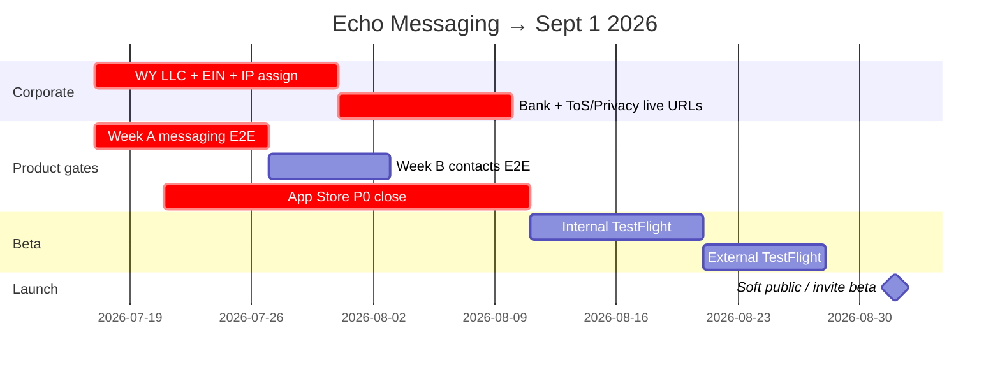

# Echo Messaging — Go-Live Master Plan (target: **1 September 2026**)

**Status:** Living plan · **Owner:** Founder + release lead  
**Last updated:** 2026-07-17  
**Product in scope:** Echo Messaging (`com.echo.app` / scheme `EchoMessaging`)  
**Out of scope for Sept 1:** Echo Comply public launch · Echo Passport standalone listing · ECHO token sale/listing · custodial payments

> **How to use this doc.** This is the single Sept 1 go-live source of truth. Deep procedures live in linked docs; do not duplicate work elsewhere without updating this file.  
> **Not legal advice.** Corporate / banking / token sections summarize [`legal/CORPORATE_STRUCTURE_AND_COMPLIANCE.md`](legal/CORPORATE_STRUCTURE_AND_COMPLIANCE.md) — engage counsel before acting on securities, payments, or HIPAA.

---

## 0. One-page verdict

| Question | Answer for Sept 1 |
|----------|-------------------|
| **What ships?** | Consumer messaging MVP: onboarding, DMs, Phase 3 signals, groups/calls baseline, wallet **earn/stake/claim** (no buy crypto), invite/QR discovery |
| **What does *not* ship as “done”?** | Production-proven cloud chat backup / multi-device history E2E, in-chat tips, StoreKit VIP, private AI, token Foundation (channels: Postgres when `DATABASE_URL` set — don’t market until soak) |
| **Code vs E2E?** | Messaging code is largely on `main`; **go-live is gated by device E2E + App Store P0 + legal entity** — not more feature inventing |
| **Competitive bar?** | Launch as **verifiable-identity privacy messenger** (ahead on `did:key` / trust / no ads). Match SimpleX/Signal crypto *already coded* (Double Ratchet, sealed-sender, Tor option). Defer Telegram Stars / Grok AI / Signal cloud backup to post-Sept waves |
| **Corporate?** | Form Wyoming HoldCo + bank + IP assignment + published ToS/Privacy **before external TestFlight** |
| **Primary risk to Sept 1** | Unclosed App Store P0 (VIP IAP, privacy URLs, account deletion) + incomplete two-client E2E sign-off |

**Canonical companions**

| Doc | Role |
|-----|------|
| **[`E2E_TESTING.md`](E2E_TESTING.md)** | All automated + manual E2E (merged) |
| [`APP_STORE_SUBMISSION.md`](APP_STORE_SUBMISSION.md) | ASC / Guideline P0–P2 checklist |
| [`PRODUCT_LAUNCH.md`](PRODUCT_LAUNCH.md) | Three-product deploy tags & schemes |
| [`ECHO_MESSAGING_LAUNCH_STATUS.md`](ECHO_MESSAGING_LAUNCH_STATUS.md) | WO completion snapshot |
| [`legal/FORMATION_CHECKLIST.md`](legal/FORMATION_CHECKLIST.md) | LLC / bank / IP do-now |
| [`COMPETITIVE_AUDIT_*`](#8-competitive-readiness--coded-vs-expected) | Market expectations |

---

## 1. Release phases (calendar → Sept 1)

Assume today ≈ **2026-07-17** (~6.5 weeks). Phases are sequential gates — do not skip legal/App Store for features.



| Phase | Window | Goal | Exit criteria |
|-------|--------|------|---------------|
| **P0 — Corporate & legal** | Jul 17 – Aug 1 | Bankable entity + public legal pages | LLC, EIN, bank, IP assignment, ToS/Privacy URLs live (no `example.com`) |
| **P1 — Messaging E2E (Week A)** | Jul 17 – Jul 27 | Two clients DM + Phase 3 signals | [`E2E_TESTING.md`](E2E_TESTING.md) A1–A10 + §6.4 all ✅ |
| **P2 — Contacts E2E (Week B)** | Jul 28 – Aug 4 | Growth + multi-device login | B1–B6 ✅; optional PSI |
| **P3 — App Store P0** | Jul 21 – Aug 11 | External TF unblocked | [`APP_STORE_SUBMISSION.md`](APP_STORE_SUBMISSION.md) all P0 closed |
| **P4 — Internal TestFlight** | Aug 11 – Aug 20 | Team QA on HTTPS prod-like API | Sign-off template complete; crash-free smoke |
| **P5 — External TestFlight** | Aug 21 – Aug 31 | Beta App Review + invited users | ASC review notes; privacy labels; support URL |
| **P6 — Go-live soft launch** | **Sept 1** | Invite-only public beta (or limited App Store) | Marketing integrity guardrails; monitoring on |

**Release tag train (when shipping a build):**

```bash
./scripts/release/product-tag.sh echo-messaging 1.0.0-rc.N   # RCs through August
./scripts/release/product-tag.sh echo-messaging 1.0.0        # Sept 1 candidate
git push origin echo-messaging@v1.0.0
```

See [`PRODUCT_LAUNCH.md`](PRODUCT_LAUNCH.md).

---

## 2. What “complete” means for Sept 1 Messaging

### 2.1 In scope (must work)

| Domain | Capability | Proof |
|--------|------------|-------|
| Identity | `did:key`, passkey, Glacial first-run + login | Manual onboarding; frozen UX |
| Transport | Content-blind WS relay; JWT WS auth | `validate-phase1` + two-client DM |
| Chat | Send/receive, local history, typing, receipts, reactions | Week A + Phase 3 matrix |
| Ops | Edit/delete/pin/disappearing (as shipped) | Sign-off §6.4b |
| Groups | Create, key distribute, encrypted chat | Sign-off §6.9 |
| Calls | Voice/video baseline if in build | Sign-off M4; WebRTC linked |
| Discovery | `@username`, QR, `echo://invite` | Week B |
| Devices | Link new device QR (WO-288) | B6 |
| Wallet | Balance, stake, claim messaging rewards — **earn not buy** | `validate-wallet.sh` + Rewards tab |
| Privacy | Privacy hub, sealed-sender path, Tor/SOCKS option as shipped | Settings QA |
| Security | Passkey-signed REST; T0–T7 CI | `make release-check` |

### 2.2 Explicitly deferred past Sept 1 (do not block launch)

| Item | Why defer | Track |
|------|-----------|-------|
| Channels/communities production persistence | In-memory MVP only; Postgres + fan-out unfinished | Phase 6 WOs |
| Channel engagement rewards as launch story | Accrual scaffold exists; not production ledger | Post-MVP |
| Full multi-device message history sync (WO-CA3) | Wave 1; weeks of work | Post-Sept |
| Secure cloud backups (WO-CA2) | Wave 1C | Post-Sept |
| In-chat tips/gifts (WO-CA4) | Compliance + App Store crypto narrative | Post-Sept |
| StoreKit VIP $9.99 | Hide VIP purchase until StoreKit (P0-1) | WO-286 |
| In-chat ECHO payments | Keep `ECHO_IN_CHAT_PAYMENTS` off | WO-299 |
| Privacy-preserving AI (WO-CA1) | Heavy deps | H2+ |
| Relay federation (WO-320) | Design backlog | Phase 4+ |
| Comply / Passport App Store | Separate products | Own tags |

### 2.3 Code-complete but must be proven on device

From [`ECHO_MESSAGING_LAUNCH_STATUS.md`](ECHO_MESSAGING_LAUNCH_STATUS.md) + Week A/B wiring:

- Phase 3 UI wiring is **in code** — still needs **two-client manual proof**.
- Conversation hub is **local-first** (not server inbox sync) — acceptable for MVP if documented.
- Groups lack full Phase 3 signal parity — acceptable if basic group chat E2E passes.

---

## 3. Backend testing (must be green)

### 3.1 Automated gates (every RC)

| Gate | Command / MCP | Pass criteria |
|------|---------------|---------------|
| Go release | `make release-check` or `run_release_check` | build + race tests + vet + fmt |
| Metagraph | `make metagraph-test` or `run_metagraph_test` | Scala L1 tests green |
| Phase 1 go/no-go | `make validate-phase1` / `regression-with-phase1` | **GO**, no skipped steps |
| Phase 3 signals | `make phase3-signals-proof` + `run_ios_phase3_tests` | WS typing/receipt/reaction unit/integration |
| Wallet | `./scripts/validate-wallet.sh` | stake/claim path healthy |
| Full regression | `make regression` / `run_regression` | Headless suite green |
| Cluster health | `make dev-status` / `cluster_status` | gateway `:8000` operational |

### 3.2 Backend feature areas to re-verify before external TF

| Area | Focus | Notes |
|------|-------|-------|
| Auth | Passkey REST, JWT WS, rate limits | [`echo-auth-contracts`](../.cursor/skills/echo-auth-contracts/SKILL.md) |
| Messaging | Envelope `to` = peer DID; sealed-sender | Not `WSRelayMessage` |
| Groups | Create/members/keys; rekey on remove | |
| Media | Chunked encrypted upload | Trust-tier size gates |
| Rewards | Claim messaging; **disable genesis auto-credit in prod** | P1-6 App Store doc |
| Identity L1 | Trust tier hashes | Phase 1 steps 1–3 |
| Data L1 | Merkle `/data` | Phase 1 step 5 |
| T0–T7 | No PII on chain / logs | [`data-classification.md`](data-classification.md) |
| Account deletion | Harden `DELETE` beyond refresh revoke | **P0-12 blocker** |
| Broadcasts | Optional: list/create/post only if Channels exposed | In-memory — label as beta |

### 3.3 Production deploy checklist (backend)

- [ ] Prod/staging Compose or k8s with rotated secrets
- [ ] `COMPLY_SERVICE_TOKEN` / wallet / SMS keys only where needed
- [ ] `ECHO_WALLET_GENESIS_AUTO` **off**
- [ ] HTTPS API + WSS for TestFlight devices (no LAN-only)
- [ ] Backups for Postgres/Redis if used beyond ephemeral demo
- [ ] Health + alert on `/health`
- [ ] Log redaction audited for T0–T7

Detail: **[`ZERO_TO_PRODUCTION.md`](ZERO_TO_PRODUCTION.md) §2** (backend → staging/prod: terraform apply
→ image push → `kubectl apply -k deploy/k8s` → DNS → verify `/health` + WSS). Release tagging:
[`PRODUCT_LAUNCH.md`](PRODUCT_LAUNCH.md).

---

## 4. User experience testing (must pass)

### 4.1 Frozen UX (validate only — do not redesign)

- `FirstRunCoordinator` / `GlacialLoginScreen` — canonical; not the React onboarding prototype.
- Policy: [`ECHO_IOS_UI_IMPLEMENTATION_SPEC.md`](ECHO_IOS_UI_IMPLEMENTATION_SPEC.md) §0.

### 4.2 UX journeys (manual)

| Journey | Pass if |
|---------|---------|
| First run → authenticated tabs | ≤ competitor-median friction; DID/username visible |
| Returning login (passkey / biometrics) | Reliable unlock |
| Find contact → first DM | Invite or username or QR works |
| Chat quality | Typing, receipts, reactions feel instant |
| Group create → both members chat | Decrypt OK |
| Privacy toggles | Typing/receipts respect off |
| Rewards tab | Balance/stake/claim without “buy ECHO” language |
| Account deletion | Step-up + real wipe path (P0-11/12) |
| Settings legal links | Live Privacy + Terms |

### 4.3 UX review artifacts

```bash
make screen-catalog   # docs/screen_catalog/index.html
```

Optional: Figma catalog (Echo iOS UI Catalog) for stakeholder review — do not block launch on Figma polish.

### 4.4 Marketing integrity (UX messaging)

From [`marketing/ECHO_LAUNCH_CAMPAIGN.md`](marketing/ECHO_LAUNCH_CAMPAIGN.md):

- Market only what ships.
- Never “unhackable / 100% secure.”
- Mesh / offline: only if demo is real recording.
- Payments: do not promise real money movement.
- Sept 1 story: **verified humans, no phone number, E2E, earn ECHO** — not Telegram Stars or cloud AI.

---

## 5. Corporate structure, banking & compliance (pre–external TF)

**Source of truth:** [`legal/CORPORATE_STRUCTURE_AND_COMPLIANCE.md`](legal/CORPORATE_STRUCTURE_AND_COMPLIANCE.md) · printable: [`legal/FORMATION_CHECKLIST.md`](legal/FORMATION_CHECKLIST.md).

### 5.1 Recommended architecture (now)

- **One Wyoming holding LLC** (e.g. Echo Holdings, LLC) — manager-managed, commercial registered agent.
- Products as **DBAs / divisions** until spin-out triggers (Comply enterprise BAA, Passport money movement, etc.).
- **Defer** Echo Protocol Foundation / token distribution until counsel + token actually moves.

### 5.2 Do-now checklist (target complete by **Aug 1**)

| # | Action | Done |
|---|--------|:----:|
| 1 | Name + Wyoming availability + domains/handles | ☐ |
| 2 | Commercial registered agent (WY) | ☐ |
| 3 | File Articles of Organization (manager-managed) | ☐ |
| 4 | Operating Agreement (attorney-drafted preferred) | ☐ |
| 5 | EIN (Form SS-4) — you as responsible party | ☐ |
| 6 | **IP assignment** of all code + brand into LLC | ☐ |
| 7 | **Business bank account** (Articles, EIN, OA, ID; crypto/tech-friendly bank) | ☐ |
| 8 | Finalize & host ToS + Privacy (replace `[LEGAL ENTITY NAME]`) | ☐ |
| 9 | Bookkeeping + CPA; no personal/business commingling | ☐ |
| 10 | Trademark filings (ECHO + product names/logos) | ☐ |
| 11 | GL + tech E&O / cyber insurance | ☐ |
| 12 | Privacy ops: virtual address, legal@ / privacy@ / security@ | ☐ |

### 5.3 Anonymity reality (do not fight this)

| Surface | Anonymous? |
|---------|------------|
| Public WY record / App Store seller name (entity) | Yes — entity is the face |
| Bank KYC + IRS EIN | **No** — you disclose |
| Put company in son’s name to hide | **Do not** — not real anonymity; veil/gift-tax risk |

### 5.4 Explicitly do NOT before counsel

- Sell/list/advertise ECHO token or “APY”/yield to consumers.
- Turn on custodial payments / in-chat pay.
- Sign HIPAA BAA for Comply without readiness.
- Form Foundation solely for optics.

### 5.5 App Store Connect entity prerequisites

- [ ] Legal entity name matches bank/ASC
- [ ] D-U-N-S if required for org account
- [ ] Paid Apple Developer Program under entity
- [ ] Support URL + Privacy Policy URL + Terms URL
- [ ] App Privacy nutrition labels match [`data-classification.md`](data-classification.md)

---

## 6. App Store / TestFlight gates

Full checklist: [`APP_STORE_SUBMISSION.md`](APP_STORE_SUBMISSION.md).

### 6.1 P0 blockers (must close before external TF)

| ID | Item |
|----|------|
| P0-1…4 | Hide VIP paid subscribe until StoreKit; no off-store digital goods; payments flag off; no “buy ECHO” |
| P0-5…10 | PrivacyInfo.xcprivacy, photo usage string, encryption export, **real legal URLs**, ASC privacy labels |
| P0-11…13 | Account deletion step-up + backend wipe + retention copy aligned |

### 6.2 Rollout

| Stage | Target date | Gate |
|-------|-------------|------|
| Internal TF | Aug 11 | P0 closed or VIP hidden; Week A/B green |
| External TF | Aug 21 | Legal URLs + privacy labels + deletion |
| Soft launch | **Sept 1** | Invite-only or limited public; monitoring |

---

## 7. Week-by-week execution (Jul 17 → Sept 1)

**Software Factory epic:** **WO-321** — *Sept 1 2026 — Echo Messaging Go-Live Epic*  
**Assignee (all rows):** Chad Cromwell

| Week | Dates | SF WO | Focus | Deliverable |
|------|-------|-------|-------|-------------|
| **W1** | Jul 17–23 | **WO-322** `in_progress` | Corporate start + Week A E2E | LLC filing started; A1–A10 in progress |
| **W2** | Jul 24–30 | **WO-323** | Finish Week A; start Week B; App Store P0 | Messaging E2E signed; VIP hidden; PrivacyInfo started |
| **W3** | Jul 31–Aug 6 | **WO-324** | Bank + legal URLs; Week B; deletion API | Entity banked; B1–B6; DELETE hardened |
| **W4** | Aug 7–13 | **WO-325** | Internal TF build; regression-with-phase1 | `echo-messaging@v1.0.0-rc.1` |
| **W5** | Aug 14–20 | **WO-327** | Internal TF bake; fix crashes; ASC metadata | Sign-off template filled |
| **W6** | Aug 21–27 | **WO-326** | External TF / Beta Review | Invite cohort live |
| **W7** | Aug 28–31 | **WO-328** | Buffer + go/no-go meeting | Sept 1 decision: soft launch vs slip |
| **Launch** | **Sept 1** | **WO-329** | Soft public / invite beta | Campaign Phase 1; tags; on-call |

**Go / no-go meeting (Aug 28):** all of §9 must be ✅ or explicitly waived with owner + date (WO-328).

---

## 8. Competitive readiness — market vs coded vs Sept 1

Sources: [`SIGNAL_ECHO_PARITY.md`](SIGNAL_ECHO_PARITY.md) (**Signal tree deep review + post-launch waves S1–S5**), [`SIGNAL_PARITY_WORK_ORDERS.md`](SIGNAL_PARITY_WORK_ORDERS.md) (**WO-330** epic + S1–S4 children), [`COMPETITIVE_AUDIT_2026-05.md`](COMPETITIVE_AUDIT_2026-05.md), [`COMPETITIVE_AUDIT_SIMPLEX_2026-06.md`](COMPETITIVE_AUDIT_SIMPLEX_2026-06.md), [`COMPETITIVE_AUDIT_IMPLEMENTATION_PLAN.md`](COMPETITIVE_AUDIT_IMPLEMENTATION_PLAN.md), plus Radar note in marketing.

### 8.1 Positioning (what users should expect)

**Launch promise:** Phone-free, passkey-secured, E2E messaging with **verifiable `did:key` identity**, trust tiers, no ads/tracking, optional earned ECHO rewards — not an identity-free SimpleX clone and not a Telegram super-app.

### 8.2 Feature matrix (expectation check)

Legend: ✅ coded & shippable for Sept 1 if E2E green · 🟡 coded but incomplete/beta · ⬜ not ready · ❌ out of thesis / don’t ship

| Expectation (market) | Competitor cue | Echo coded? | Sept 1 launch? |
|----------------------|----------------|-------------|----------------|
| E2E encrypted chat | All | ✅ | ✅ Must |
| No phone number required | Signal usernames / XChat / SimpleX | ✅ `did:key` + passkeys | ✅ Lead with this |
| Typing / receipts / reactions | WA/Signal/TG | ✅ Phase 3 | ✅ Must E2E |
| Groups | All | 🟡 create/chat; signals incomplete | ✅ Basic groups |
| Voice notes | SimpleX / WA | ✅ WO-316 | ✅ If in build |
| Voice/video calls | All | 🟡 WebRTC baseline | 🟡 Ship if E2E; else hide |
| Disappearing / edit / delete / pins | Signal 2026 | ✅ / 🟡 | ✅ Core ops |
| Sealed sender / metadata minimize | Signal / SimpleX | ✅ WO-317 (partial anonymity) | ✅ On |
| Double Ratchet FS | Signal / SimpleX | ✅ WO-314 | ✅ On |
| PQ-hybrid bootstrap | SimpleX | ✅ WO-315 bootstrap | ✅ On (per-step later) |
| Tor / SOCKS | SimpleX | ✅ WO-319 | ✅ Optional setting |
| Invite / QR connect | SimpleX / Signal | ✅ `echo://invite` | ✅ Must |
| Multi-device login | Signal | ✅ WO-288 link QR | ✅ Must |
| Full history sync new device | Signal | ⬜ WO-CA3 | ❌ Post-Sept |
| Encrypted cloud backup | Signal Secure Backup | ⬜ WO-CA2 | ❌ Post-Sept |
| Channels / communities | WA / TG | 🟡 Postgres store (028) + iOS MVP | ❌ Don’t market as prod until soak |
| In-chat payments / Stars | Telegram / Radar BTC | ⬜ tips CA4; pay WO-299 off | ❌ Off |
| In-chat AI | Grok / Meta AI | ⬜ WO-CA1 | ❌ Never cloud plaintext |
| Ads / tracking | WhatsApp | ❌ Rejected by thesis | ❌ Never |
| Username discovery | WA/Signal 2026 | ✅ | ✅ |
| Wallet + earn/stake | Echo unique | ✅ rewards/staking | ✅ Earn narrative only |
| Trust / anti-scam tiers | Echo unique | ✅ | ✅ Surface in UX |
| Metagraph integrity | Echo unique | ✅ anchoring | 🟡 Soft-sell; don’t overclaim |
| Federation / self-host relay | SimpleX | ⬜ WO-320 | ❌ Post-Sept |
| Radar-style BTC Lightning | Radar.chat | ❌ Not chasing BTC | ❌ Counter-position “own the network” |

### 8.3 Competitive waves vs Sept 1 (do not slip Wave 0)

| Wave | Content | Sept 1 |
|------|---------|--------|
| **0** | Phase 3 E2E, invite/QR, contacts, optional PSI/OIDC | **Required** |
| **0.5** | Identity UX moat (DID card, copy) | **Strongly recommended** |
| **1** | Multi-device sync + cloud backup | After Sept |
| **2** | Pins/polls/screenshot polish | Nice-to-have if free |
| **3–5** | Economy / AI / mini-apps | After Sept |

### 8.4 “Am I launching what is expected?”

| Audience expectation | Honest Sept 1 answer |
|----------------------|----------------------|
| “Private messenger like Signal” | **Yes** on E2E + no ads + hardening (ratchet/sealed/Tor option) — **No** on Signal-class backup/sync yet |
| “Anonymous like SimpleX” | **No** — Echo is identity-forward; metadata minimized, not identity-free |
| “Super-app like Telegram” | **No** — messaging + earn/stake wallet only |
| “AI in chat like Grok” | **No** — and should not ship Grok-style cloud read |
| “Pay friends in chat” | **No** for Sept 1 — flags off; counsel later |
| “Verified humans / anti-scam” | **Yes** if trust tiers + invite beta are real and marketed carefully |

---

## 9. Sept 1 go / no-go checklist

Copy into the release ticket. All **Must** rows required for soft launch.

### Must

- [ ] Wyoming LLC + EIN + **business bank account** + IP assignment
- [ ] Hosted Privacy Policy + Terms with real entity name (ASC + in-app)
- [ ] `make regression-with-phase1` → **GO**
- [ ] Week A A1–A10 + Phase 3 §6.4 signed
- [ ] Week B B1–B3 + B6 signed (B4/B5/PSI as scoped)
- [ ] App Store **P0** all closed (VIP hidden, PrivacyInfo, deletion, encryption answer)
- [ ] Production API HTTPS + WSS reachable from TestFlight devices
- [ ] Wallet genesis auto-credit **off** in prod
- [ ] No “buy ECHO” / no enabled in-chat payments
- [ ] On-call / crash monitoring for launch week
- [ ] Marketing copy reviewed against §8.4 (no overclaims)

### Should

- [ ] Identity moat UX (DID / username card)
- [ ] External TF cohort ≥ N invited users completed smoke
- [ ] Trademarks filed
- [ ] Insurance bound
- [ ] Groups §6.9 + media smoke
- [ ] Screen catalog / Figma reviewed for P0 UX bugs

### Nice / post-launch

- [ ] Channels marketed as beta only
- [ ] PSI live OPRF
- [ ] OIDC4VC enrollment E2E
- [ ] Calls polish
- [ ] Wave 1 backup/sync kickoff plan dated

**Decision (Aug 28):** ☐ GO Sept 1 · ☐ Slip to ________ · Owner **Chad Cromwell** (WO-328)

---

## 10. Roles & RACI

All launch execution rows assigned to **Chad Cromwell** until delegated. Counsel/CPA remain external advisors (not SF assignees).

| Area | Responsible | Accountable | SF |
|------|-------------|-------------|-----|
| Backend / metagraph | Chad Cromwell | Chad Cromwell | WO-321 children |
| iOS E2E / TF builds | Chad Cromwell | Chad Cromwell | WO-322…325, 327 |
| App Store / ASC | Chad Cromwell | Chad Cromwell | WO-323…326; related WO-233 |
| Legal entity / bank | Chad Cromwell (+ counsel/CPA) | Chad Cromwell | WO-322…324 |
| Privacy policy finalize | Chad Cromwell (+ privacy counsel) | Chad Cromwell | WO-324 |
| Marketing integrity | Chad Cromwell | Chad Cromwell | WO-328…329 |
| On-call week of Sept 1 | Chad Cromwell | Chad Cromwell | WO-329 |
| Go/no-go decision | Chad Cromwell | Chad Cromwell | WO-328 |

---

## 11. Related docs (superseded as primary)

| Former primary | Now |
|----------------|-----|
| Scattered launch status / Week A-B / PRODUCT_LAUNCH alone | **This file** for Sept 1 planning |
| Multiple E2E guides | **[`E2E_TESTING.md`](E2E_TESTING.md)** |
| Competitive audits (keep as research) | Summarized in §8; full text unchanged |

Keep deep references:

- [`legal/CORPORATE_STRUCTURE_AND_COMPLIANCE.md`](legal/CORPORATE_STRUCTURE_AND_COMPLIANCE.md)
- [`APP_STORE_SUBMISSION.md`](APP_STORE_SUBMISSION.md)
- [`PRODUCT_LAUNCH.md`](PRODUCT_LAUNCH.md) — multi-product deploy mechanics
- [`ECHO_MESSAGING_LAUNCH_STATUS.md`](ECHO_MESSAGING_LAUNCH_STATUS.md) — WO tallies
- [`PHASE4_7_GAP_AUDIT.md`](PHASE4_7_GAP_AUDIT.md) — post-MVP backlog
