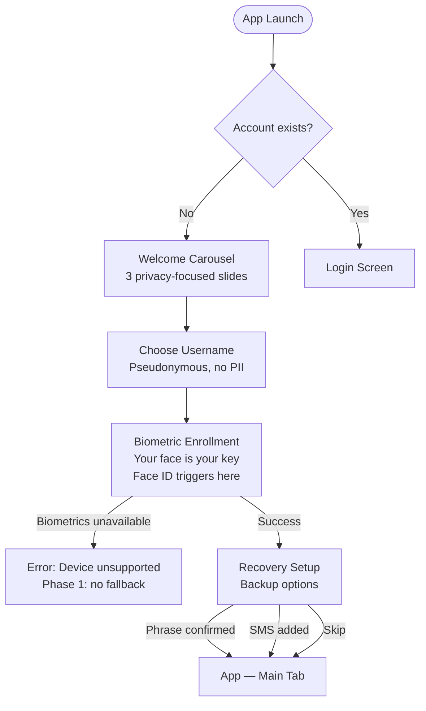
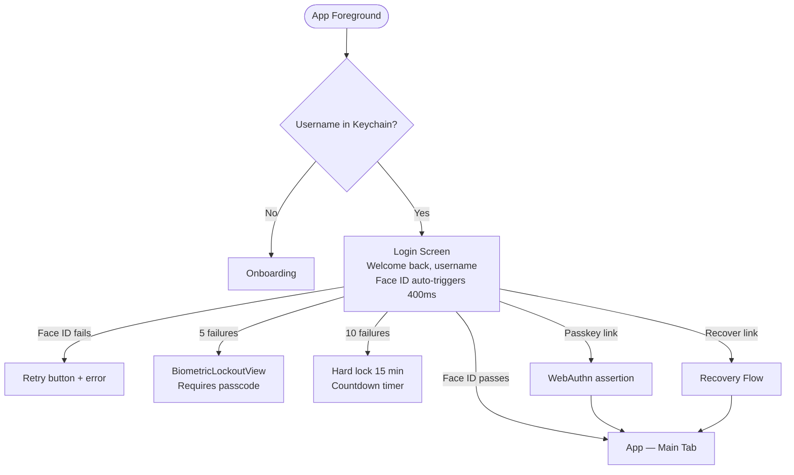
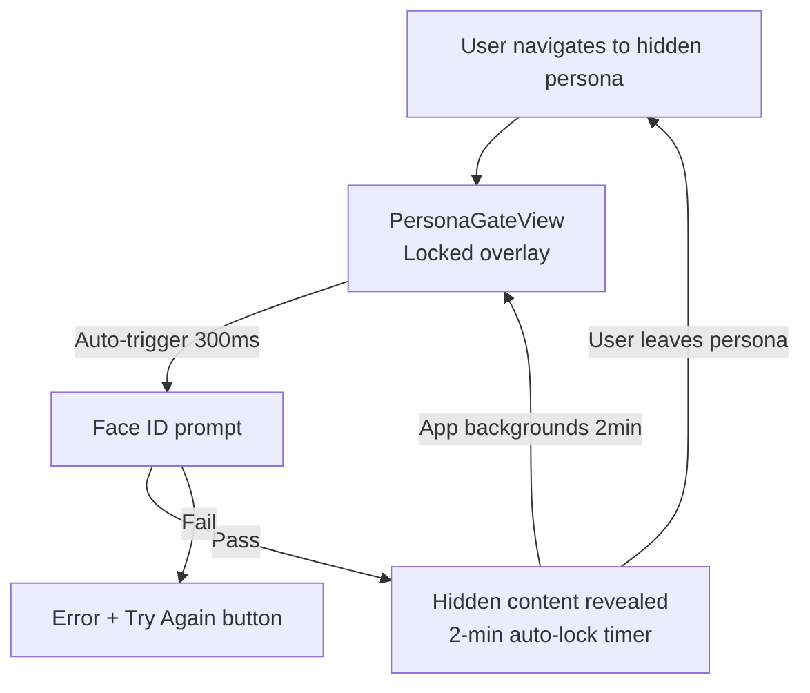
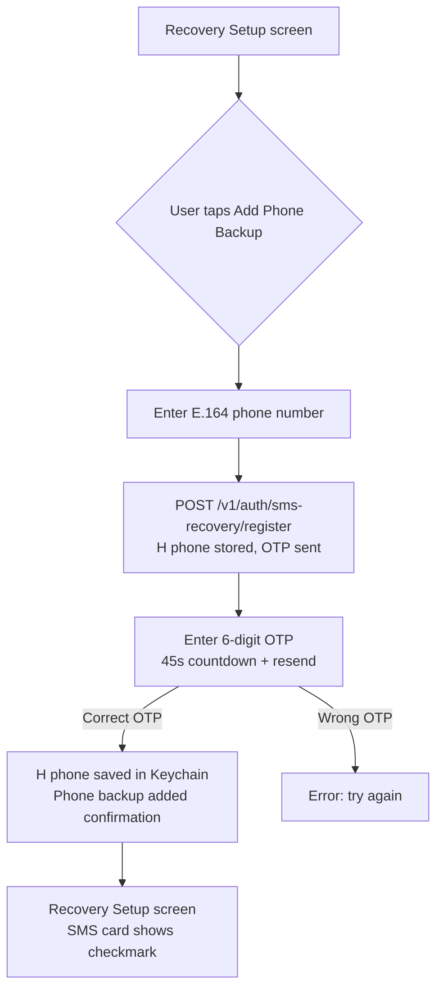
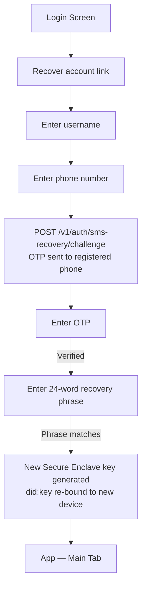

# Echo — UX Design Specification
## Phase 1 · v0.1.0

> **How to use this file for design review:**
> Paste this document into a new Claude conversation and say *"Review the Echo UX — what should we improve before Phase 2?"*
> Claude will read every screen, flow, and component and give specific, actionable feedback.

---

## 1 · Product Vision

Echo is a **privacy-first, decentralized messaging app** modelled after Signal's privacy principles but built on Constellation Network's DAG infrastructure. The core UX promise:

- **No phone number. No email. No password.** Your Secure Enclave P-256 key *is* your identity.
- **Your face is your key.** Face ID unlocks everything — the app, hidden personas, sensitive actions.
- **Zero knowledge on our backend.** We store hashes, not content. The server relays encrypted blobs it cannot read.

---

## 2 · User Flows

### 2.1 · First-run Onboarding (new user)

### 2.2 · Login (returning user)

### 2.3 · Hidden Persona Access

### 2.4 · SMS Recovery Setup (optional, in onboarding)

### 2.5 · Account Recovery (new device)

---

## 3 · Screen Inventory

### 3.1 · Onboarding

| Screen | Purpose | Key Actions | Design Notes |
|---|---|---|---|
| **WelcomeCarouselView** | Brand + privacy pitch | Continue → | 3 auto-advancing slides, 3.5s timer. "Private messaging always" / "E2E encrypted" / "No phone, email, or password". Dark ice-blue background (Glacial theme). |
| **DisplayNameEntryView** | Username choice | Next → | Single field. 1–32 chars. Unicode letters/digits/space/hyphen/apostrophe. Step badge "1 of 3". Helper card: "No phone number, email, or password required." |
| **BiometricEnrollmentView** | Mandatory Face ID enrollment | Set Up Face ID | Hero Face ID icon. "Your face is your key." Phases: generating → verifying → registering → done. Blocks if device has no biometrics. |
| **RecoverySetupView** | Backup method selection | Show phrase / Add phone / Skip | Two option cards (phrase + SMS). Both skippable. "Continue" disabled until at least one configured. "Skip for now — I'll do this in Settings" link. |
| **SMSOTPSetupView** | Phone hash registration | Send code → Enter OTP | E.164 entry → hash sent to backend → 6-digit OTP. 45s countdown. Privacy notice: "We store only a hash of your number." |
| **PasskeySetupView** | Optional WebAuthn enrollment | Create Passkey / Skip | In Settings only (not in primary onboarding flow). Face ID + checkmark animation on success. |

### 3.2 · Login

| Screen | Purpose | Key Actions | Design Notes |
|---|---|---|---|
| **GlacialLoginScreen** | Returning user authentication | [auto Face ID] / Passkey / Recover | Shows "Welcome back, [username]". Face ID auto-triggers 400ms post-appear. Frosted glass header, gradient button. Secondary links: "Use passkey instead", "Recover account". |
| **StorageLockedView** | Storage key derivation gate | Unlock | Shown if app is foregrounded and storage key is zeroed. Lock-and-document icon. "Your messages are protected with biometrics." |
| **BiometricLockoutView** | Soft/hard biometric lockout | [passcode or wait] | Two states: requiresPasscode (5 fails) shows info + prompt; hardLocked (10 fails) shows circular countdown timer in error red. |
| **AccountLockedView** | Account suspension | Recover Account | Shown for tooManyAttempts / suspiciousActivity / accountSuspended. Lock icon + reason + countdown. |

### 3.3 · Recovery

| Screen | Purpose | Key Actions | Design Notes |
|---|---|---|---|
| **RecoveryPhraseDisplayView** | Show 24-word BIP-39 phrase | Continue | Words in 4-column grid. Blurs if screen recording detected. "Stop screen recording" warning. No copy/share buttons. |
| **RecoveryPhraseConfirmView** | Confirm user saved phrase | Confirm random challenge words | Asks user to type 3 random words from the phrase. Fails gracefully on mismatch. |
| **RestoreFromPhraseView** | Enter phrase to restore account | Restore | Text area for 24-word phrase. Validates via BIP-39 word list before submit. |

### 3.4 · Messaging

| Screen | Purpose | Key Actions | Design Notes |
|---|---|---|---|
| **ConversationListView** | All conversations | Tap to open / New conversation | Sorted by recency. Shows last message preview (truncated) + timestamp + unread count. |
| **ChatView** | One-on-one / group chat | Send message / Attachments | Message bubbles (sent right-blue, received left-gray). SecureThreadIndicator in header. Delivery status (sent/delivered/read). |
| **MessagesEmptyStateView** | No conversations yet | Compose / Upgrade trust | Illustration + "Start a secure conversation". Trust upgrade CTA if tier < 2. |

### 3.5 · Personas & Hidden Folders

| Screen | Purpose | Key Actions | Design Notes |
|---|---|---|---|
| **PersonasManagementView** | List all personas | Tap to switch / Create | Shows active, public, and hidden personas. Hidden ones show lock icon. |
| **PersonaGateView** | Biometric re-auth gate | Unlock with Face ID | Full-screen overlay. "Hidden area. Verify with Face ID." Auto-triggers 300ms post-appear. Auto-locks after 2-min background. |

### 3.6 · Profile & Settings

| Screen | Purpose | Key Actions | Design Notes |
|---|---|---|---|
| **ProfileTabView** | User profile hub | Edit / Trust score / Credentials | Avatar + username + DID (truncated). Trust tier badge. Credential count. |
| **PrivacySecuritySettingsView** | Privacy controls | Toggle showLastSeen / showOnlineStatus / contactDiscoveryOptIn / encryption indicator | WO-208. "Presence" section + "Discovery" section + "Security" section. |
| **AccountSettingsView** | Account management | Passkey / Devices / Recovery / Delete | Links to PasskeySetupView, DeviceManagementView, RecoveryCoordinator. |
| **DeviceManagementView** | Registered devices | Revoke device | Lists all registered P-256 public keys with device labels and dates. |

---

## 4 · Design System

### 4.1 · Color Tokens

| Token | Light Hex | Usage |
|---|---|---|
| `echoPrimary` | #6C63FF | Buttons, links, active states, icons |
| `echoBackground` | #0A0E1A | App background (dark-first) |
| `echoCardBackground` | #111827 | Card surfaces |
| `echoPrimaryText` | #F9FAFB | Primary content |
| `echoSecondaryText` | #9CA3AF | Captions, metadata, placeholder |
| `echoError` | #EF4444 | Error states, destructive actions |
| `echoSuccess` | #10B981 | Confirmed states, checkmarks |
| Trust T0 | #6B7280 | Unverified tier |
| Trust T1 | #3B82F6 | Basic verified |
| Trust T2 | #10B981 | Identity verified |
| Trust T3 | #8B5CF6 | Trusted community |
| Trust T4 | #F59E0B | Premium tier |
| Trust T5 | #EC4899 | Elite tier |

### 4.2 · Typography

| Style | Size | Weight | Usage |
|---|---|---|---|
| Display Large | 56pt | Bold | Hero moments, empty states |
| Display Medium | 45pt | Bold | Screen-level large headers |
| Headline Sm | 24pt | Bold | Section titles |
| Title Large | 20pt | Bold | Card titles, modal headers |
| Body Large | 16pt | Medium | Primary content |
| Body Medium | 14pt | Medium | Secondary content |
| Label Sm | 11pt | Semibold + tracking 1.4 | Badges, section headers, all-caps labels |

Font family: **Inter** (loaded as custom font resource).

### 4.3 · Spacing

| Step | Value | Usage |
|---|---|---|
| xs | 4pt | Tight icon gaps |
| sm | 8pt | Within-component gaps |
| md | 16pt | Between components |
| lg | 24pt | Section padding, horizontal margins |
| xl | 32pt | Major section separation |
| xxl | 48pt | Bottom safe-area padding |

### 4.4 · Corner Radius

| Size | Value | Usage |
|---|---|---|
| sm | 8pt | Tags, badges |
| md | 12pt | Cards |
| lg | 16pt | Modals, sheets |
| xl | 22pt | Primary CTA buttons |
| pill | 32pt | Text fields, secondary buttons |
| circle | 50% | Avatars, icon containers |

### 4.5 · Motion

All transitions use `withAnimation(.spring(response: 0.38, dampingFraction: 0.82))` (referred to as `.glacial` in the codebase). Phase-in for new screens uses `.opacity.combined(with: .move(edge: .top))`.

---

## 5 · Component Library

### EchoButton
4 styles: `.primary` (gradient), `.secondary` (ghost fill), `.destructive` (red), `.ghost` (text only).
Full-width by default. Spring press animation. Disabled state: 55% opacity.

### EchoTextField
Rounded pill field with subtle border. Focus: 45% opacity primary border.
Variants: plain, secure (password), phone keyboard.

### EchoCard
Rounded rectangle with `echoCardBackground` fill. Subtle shadow. Ghosted border (8% primary).

### TrustBadge
Colored circle with tier initial. 3 sizes: `.small`, `.medium`, `.large`.
Color maps to trust tier 0–5.

### SecureThreadIndicator
Thin horizontal bar at top of chat/messaging screens.
Lock icon + "End-to-end encrypted" text. Always visible in chat.

### OTPInputView
6-cell digit entry. Auto-focus next cell on input. Shake animation on error.

### MessageBubble
Sent: right-aligned, primary blue fill. Received: left-aligned, card fill.
Status icons: clock (sent), single check (delivered), double check (read).

### GhostBorderCard (Glacial)
Frosted glass + ultra-thin material background + ghosted border.
Used in login screen header and onboarding hero cards.

### SignatureGradientButton (Glacial)
Full-width button with deep navy → primary gradient.
Title + subtitle + left icon. Used as primary CTA on login screen.

---

## 6 · Interaction Patterns

### Face ID prompt timing
- **Login screen:** auto-triggers 400ms after appear (gives visual settle time)
- **PersonaGateView:** auto-triggers 300ms after appear
- **StorageLockedView:** user-triggered via "Unlock" button
- **PasskeySetupView:** user-triggered via "Create Passkey" button

### Loading / progress states
- Multi-step views (BiometricEnrollmentView, SMSOTPSetupView) use a `phase` enum that drives the CTA button label and disabled state
- No separate loading spinners — the button itself changes label (e.g., "Creating key…", "Registering…", "Verifying…")

### Empty states
- Conversation list: illustration + CTA
- No conversations in persona: inline prompt
- No contacts: "Add your first contact" with QR link

### Error handling
- Inline error text below the relevant field or button (13pt, echoError)
- Never modal popups for field errors
- System errors (network down, Face ID unavailable) show full-screen error state with retry CTA

---

## 7 · Privacy-First UX Principles

1. **Never ask for PII unless absolutely necessary.** Username is pseudonymous; phone is optional and hashed.
2. **Visual encryption indicators everywhere relevant.** SecureThreadIndicator in chat; lock icon in hidden persona gate; "Your messages are protected" copy in StorageLockedView.
3. **Recovery phrase is deliberately friction-ful.** No copy button, blurs on screen recording, requires word confirmation. Users should understand the gravity.
4. **Biometric failure is graceful, not punishing.** Clear error copy, always a path forward (retry, passkey, recover account).
5. **Hidden personas have no UX affordance from outside.** The persona list doesn't hint at hidden content until biometric passes — prevents social engineering.

---

## 8 · Known UX Gaps / Open Questions for Review

1. **Onboarding length:** 4 steps before the user can send a message. Is the Recovery Setup step worth the friction at onboarding time, or should we push it fully to Settings?
2. **Username discoverability:** Users set a pseudonymous username but there's no "find me by username" flow yet. How should contact discovery work while preserving privacy?
3. **Hidden persona entry point:** Currently accessed from the Personas screen. Should there be a gesture shortcut (long-press on tab bar?) to switch to hidden persona without going through Settings?
4. **Biometric on first message:** Should the app request biometric confirmation before the user sends their very first message (to confirm they understand key commitment)?
5. **Trust tier explanation:** The 6-tier system (T0–T5) is powerful but users encounter it without context. Should there be a "What is Trust Tier?" explainer inline?
6. **SMS recovery opt-in copy:** "We store only a hash of your number" is technically accurate but may confuse non-technical users. Better copy?
7. **Dark-only theme:** The Glacial design system is dark-first. Phase 2 should add a light mode — but should it be opt-in or follow system preference?
8. **Onboarding progress indicator:** The "Step 1 of 3" badge exists on username entry but disappears on biometric enrollment (back button hidden). Should all steps show progress?

---

## 9 · Screen Count Summary

| Section | Screens |
|---|---|
| Onboarding | 6 |
| Auth & Security | 7 |
| Recovery | 3 |
| Credential Enrollment | 4 |
| Messaging | 3 |
| Personas & Hidden Folders | 2 |
| Profile & Settings | 7 |
| Wallet & Staking | 4 |
| Governance | 3 |
| Contacts | 2 |
| Other | 4 |
| **Total** | **45** |
