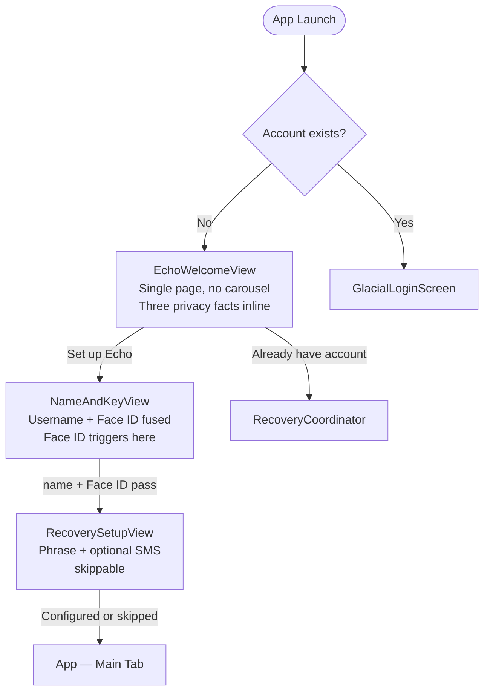
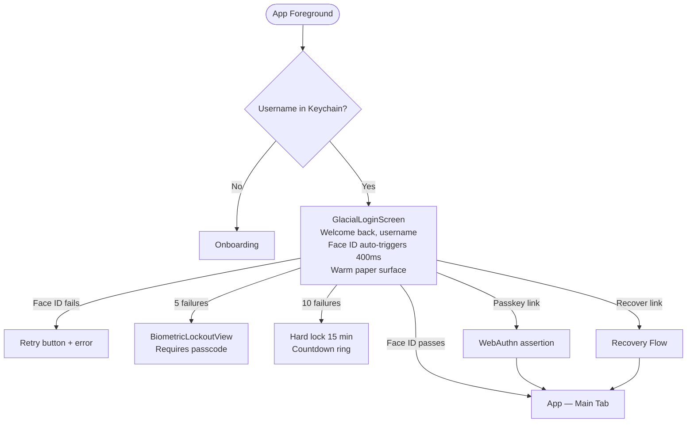
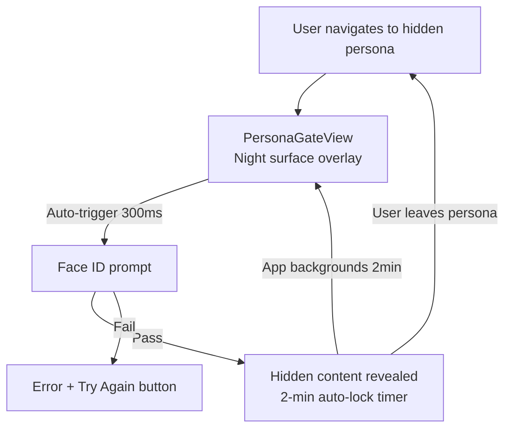
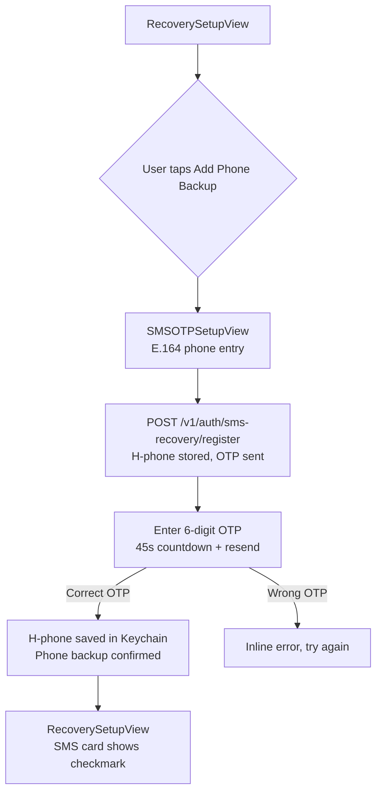
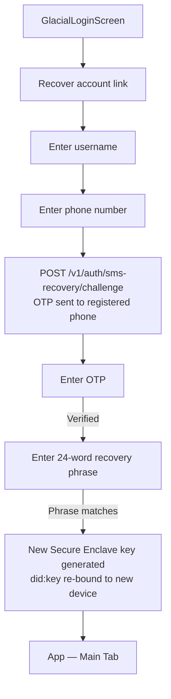

# Echo — UX Design Specification
## Phase 1 · v0.1.0 (Design Review Edition)

> **How to use this file for design review:**
> Paste this document into a new Claude conversation and say *"Review the Echo UX — what should we improve before Phase 2?"*
> Claude will read every screen, flow, and component and give specific, actionable feedback.

> **Design Review Applied (May 2026):**
> The original Glacial dark theme has been superseded by a warm paper / ink system.
> Key changes: light-first surfaces, single-accent colour (signal blue), trust collapsed to
> one green hue with five opacities, onboarding compressed from 4 steps to 2.

---

## 1 · Product Vision

Echo is a **privacy-first, decentralized messaging app** modelled after Signal's privacy
principles but built on Constellation Network's DAG infrastructure. The core UX promise:

- **No phone number. No email. No password.** Your Secure Enclave P-256 key *is* your identity.
- **Your face is your key.** Face ID unlocks everything — the app, hidden personas, sensitive actions.
- **Zero knowledge on our backend.** We store hashes, not content. The server relays encrypted blobs it cannot read.

---

## 2 · User Flows

### 2.1 · First-run Onboarding (new user) — 2-step Design Review flow

### 2.2 · Login (returning user)

### 2.3 · Hidden Persona Access

### 2.4 · SMS Recovery Setup (optional, in onboarding)

### 2.5 · Account Recovery (new device)

---

## 3 · Screen Inventory

### 3.1 · Onboarding

| Screen | Purpose | Key Actions | Design Notes |
|---|---|---|---|
| **EchoWelcomeView** | Brand + privacy pitch (Design Review) | Set up Echo → / Already have account | Single page, no carousel, no auto-advance. Mark top-left. Three inline privacy facts (E2EE · Zero metadata · Keys on device). Warm paper surface `#FBFBF7`. Preferred colour scheme: `.light`. |
| **NameAndKeyView** | Username + Face ID fused (Design Review) | Confirm username → Face ID | Single screen combines name entry and biometric enrollment. Privacy receipt shows exactly what is stored vs not. Phases: naming → enrolling → done. |
| **RecoverySetupView** | Backup method selection | Show phrase / Add phone / Skip | Two option cards. Both skippable. "Skip for now — I'll do this in Settings" link. |
| **SMSOTPSetupView** | Phone hash registration | Send code → Enter OTP | E.164 entry → SHA-256 hash sent to backend → 6-digit OTP. 45s countdown. Privacy notice: "We store only a hash of your number." |
| **PasskeySetupView** | Optional WebAuthn enrollment | Create Passkey / Skip | In Settings only — not in primary onboarding. Face ID + checkmark on success. |
| **WelcomeCarouselView** *(legacy)* | Original 3-slide carousel | Continue → | Kept for reference. Superseded by EchoWelcomeView in the primary flow. Glacial dark surface. |
| **DisplayNameEntryView** *(legacy)* | Original username entry | Next → | Step badge "1 of 3". Kept as legacy route inside FirstRunCoordinator. |
| **BiometricEnrollmentView** *(legacy)* | Original biometric screen | Set Up Face ID | Kept as legacy route. Superseded by the fused NameAndKeyView. |

### 3.2 · Login & Auth

| Screen | Purpose | Key Actions | Design Notes |
|---|---|---|---|
| **GlacialLoginScreen** | Returning user authentication | [auto Face ID] / Passkey / Recover | "Welcome back, [username]". Face ID auto-triggers 400ms post-appear. Warm paper surface. EchoRippleMark top-left. Minimal layout — one greeting, one target. |
| **StorageLockedView** | Storage key derivation gate | Unlock | Shown if app is foregrounded and storage key is zeroed (WO-224). Lock-and-document icon. "Your messages are protected with biometrics." |
| **BiometricLockoutView** | Soft/hard biometric lockout | Passcode / Wait | Two states: `requiresPasscode` (5 fails) — passcode prompt; `hardLocked` (10 fails) — circular countdown ring in `echoAlert` red. |
| **AccountLockedView** | Account suspension | Recover Account | Three reasons: tooManyAttempts / suspiciousActivity / accountSuspended. Countdown timer if retryAfter set. |
| **TrustIntroView** | Trust score explainer | Get Started | Shown once after first verification. Four trust tiers explained. "How to build trust" checklist. |

### 3.3 · Recovery

| Screen | Purpose | Key Actions | Design Notes |
|---|---|---|---|
| **RecoveryPhraseDisplayView** | Show 24-word BIP-39 phrase | Continue | Words in 4-column grid. Blurs if screen recording detected. No copy/share buttons. |
| **RecoveryPhraseConfirmView** | Confirm user saved phrase | Confirm challenge words | Asks user to type 3 random words from the phrase. Fails gracefully on mismatch. |
| **RestoreFromPhraseView** | Enter phrase to restore account | Restore | 24-word entry. Validates via BIP-39 word list before submit. |

### 3.4 · Credential Enrollment

| Screen | Purpose | Key Actions | Design Notes |
|---|---|---|---|
| **EnrollmentMethodPickerView** | Choose credential type | Wallet / Driver's Licence / Phone | Three paths: mobile wallet (primary), mDL (secondary), phone (tertiary). |
| **DriversLicenseEnrollmentView** | mDL hub | Apple Wallet / QR / NFC / IDV | Probes device capability; disables unavailable paths. |
| **IDVFallbackView** | Scan + selfie fallback | Start Verification | Stripe Identity / Sumsub. IDV SDK not wired in Phase 1; stub returns error. |
| **WalletCredentialEnrollmentView** | OIDC4VC / OID4VP | Present credential | ASWebAuthenticationSession → W3C DC API. |

### 3.5 · Messaging

| Screen | Purpose | Key Actions | Design Notes |
|---|---|---|---|
| **ConversationListView** | All conversations | Tap to open / New | Sorted by recency. Last message preview + timestamp + unread count. |
| **ChatView** | One-on-one / group chat | Send / Attachments | Sent right (signal blue), received left (paper dim). SecureThreadIndicator in nav. Delivery status (sent/delivered/read). |
| **MessagesEmptyStateView** | No conversations yet | Compose / Upgrade trust | EchoRippleMark illustration + "Start a secure conversation". Trust upgrade CTA if tier < 2. |

### 3.6 · Personas & Hidden Folders

| Screen | Purpose | Key Actions | Design Notes |
|---|---|---|---|
| **PersonasManagementView** | List all personas | Tap to switch / Create | Active, public, and hidden personas. Hidden ones show lock icon. |
| **PersonaGateView** | Biometric re-auth gate | Unlock with Face ID | Full-screen overlay on **night surface** `#0E1418` — privacy *feels* different. "Verify with Face ID." Auto-triggers 300ms. Auto-locks after 2-min background. |

### 3.7 · Identity & Privacy (Design Review)

| Screen | Purpose | Key Actions | Design Notes |
|---|---|---|---|
| **IdentityCardView** | Show user's public key | Show QR / Copy | Full DID string visible (Geist Mono). "Your public key is your identity." Join date. QR sheet on tap. |
| **IdentityProtectedList** | What's backed up | — | Shows recovery phrase status + SMS backup status. Inline with IdentityCardView. |
| **PrivacySecuritySettingsView** | Privacy controls | Toggle presence / discovery / security | "You're sharing five things. Everything else stays here." NEVER COLLECTED chip cloud. WO-208 settings. |

### 3.8 · Profile & Settings

| Screen | Purpose | Key Actions | Design Notes |
|---|---|---|---|
| **ProfileTabView** | User profile hub | Edit / Trust score / Credentials | Avatar + username + DID (truncated). Trust tier. Credential count. |
| **EditProfileView** | Edit profile | Save | Display name, username, bio, status, website. Username availability check. |
| **AccountSettingsView** | Account management | Passkey / Devices / Recovery / Delete | Links to PasskeySetupView, DeviceManagementView (requires auth session), RecoveryCoordinator. |
| **NotificationSettingsView** | Notification prefs | Toggles | Message / group / call / quiet hours. |
| **AppearanceSettingsView** | Theme prefs | Theme / Accent / Font size | Light/dark/system. Accent colour picker. App icon picker. |
| **StorageDataView** | Storage usage | Clear cache / Back up | Breakdown by type. Auto-download and media quality settings. |
| **AboutView** | App info | Help / Support / Policies | Version number. Links to help centre, terms, privacy policy, open source. |
| **QRIdentityView** | QR code sharing | Share / Scan | Generates QR from DID. Camera scanner for incoming. |
| **DeviceManagementView** | Registered devices | Revoke | Lists all registered P-256 keys with labels and dates. *Requires active auth session — not shown in demo.* |

### 3.9 · Wallet & Staking

| Screen | Purpose | Key Actions | Design Notes |
|---|---|---|---|
| **WalletTab** | Wallet overview | Stake / Delegate | Balance, locked, claimable rewards. Quick-action row. |
| **RewardsStakingView** | Staking entry point | Stake DAG | Tier table, expected APY per tier. |
| **StakingDetailView** | Active staking position | Withdraw / Redelegate | Current tier, delegated validator, rewards breakdown. |
| **ValidatorBrowserView** | Validator list | Select / Delegate | Metrics: uptime, commission, delegated stake. |
| **RewardsDashboardView** | Rewards overview | Claim | Earned by type. Multiplier from trust tier. |

### 3.10 · Governance

| Screen | Purpose | Key Actions | Design Notes |
|---|---|---|---|
| **GovernanceWeightView** | Voting power display | — | Shows staked weight, trust multiplier, effective vote. |
| **VoteConfirmationView** | Confirm a vote | Confirm / Cancel | Proposal summary, vote value (for/against/abstain), voting power used. |

### 3.11 · Contacts

| Screen | Purpose | Key Actions | Design Notes |
|---|---|---|---|
| **ContactsListView** | Contacts list | Search / Add | Trust tier badge per contact. Online indicator. |
| **ContactDetailView** | Contact profile | Message / Call / Trust actions | Avatar, DID, trust history, shared media, privacy settings. |

### 3.12 · Other

| Screen | Purpose | Key Actions | Design Notes |
|---|---|---|---|
| **SearchView** | Global search | Search by name / DID / message | Filter chips: All / Messages / Contacts / Files. Recent searches. |
| **NotificationCenterView** | Notification inbox | Mark read / Clear | Grouped by date. Swipe to dismiss. |
| **BotManagementView** | Bot integrations | Add / Remove | Active bots + discovery. |
| **MediaGalleryView** | Shared media | Tap to view | Tabs: Photos / Videos / Files / Links. |

---

## 4 · Design System

### 4.1 · Color Tokens (Design Review — warm paper / ink)

Three surfaces encode meaning:

| Surface | Purpose |
|---|---|
| **Paper** | Default — warm off-white. Reads as real, not synthetic. |
| **Ink** | Near-black text. One accent (signal blue), one affirming hue (trust green). |
| **Night** | Reserved exclusively for private moments — hidden persona, vault, recovery — so privacy *feels* different. |

**Paper surfaces**

| Token | Hex | Usage |
|---|---|---|
| `echoPaper` | `#FBFBF7` | Default background |
| `echoPaperDim` | `#F2F1EA` | Cards, inset areas |
| `echoPaperEdge` | `#E6E4DA` | Dividers, subtle borders |

**Ink (text + UI)**

| Token | Value | Usage |
|---|---|---|
| `echoInk` | `#0B0F10` | Primary text, icons |
| `echoInk70` | `#0B0F10 · 70%` | Subheadings, important secondary |
| `echoInk55` | `#0B0F10 · 55%` | Secondary text, captions |
| `echoInk40` | `#0B0F10 · 40%` | Labels, overlines, placeholders |
| `echoHair` | `#0B0F10 · 10%` | Dividers, ghost borders |

**Night (private surfaces only)**

| Token | Hex | Usage |
|---|---|---|
| `echoNight` | `#0E1418` | Hidden persona background |
| `echoNightHi` | `#161D22` | Night surface cards |
| `echoNightInk` | `#F4F1E8` | Text on night surface |

**Accent + status**

| Token | Hex | Usage |
|---|---|---|
| `echoSignal` | `#0E7AB8` | One accent — buttons, links, SecureThreadIndicator |
| `echoTrustGreen` | `#1F7A4C` | One affirming hue — trust, success, verification |
| `echoAlert` | `#B5341B` | Errors, destructive actions (less saturated than pure red) |
| `echoWarning` | `#F59E0B` | Warnings (backward-compat, used sparingly) |

**Trust — one hue, five opacities** *(replaces 6-colour rainbow)*

| Tier | Token | Opacity | Meaning |
|---|---|---|---|
| T0 | `echoTrustUnverified` | 10% | Not verified |
| T1 | `echoTrustBasic` | 25% | Profile visible |
| T2 | `echoTrustVerified` | 45% | Identity confirmed |
| T3 | `echoTrustTrusted` | 70% | Community trusted |
| T4 | `echoTrustElite` | 100% | Full trust |

No legend required — same green at different intensities communicates degree, not category.

### 4.2 · Typography

Two families:

| Family | Usage |
|---|---|
| **System (SF Pro)** | All UI text — headlines, body, labels, buttons |
| **Geist Mono** | Cryptographic content only — DIDs, key fingerprints, OTP digits, timestamps, section labels like "WHAT ECHO STORES" |

**Type scale**

| Style | Size | Weight | Tracking | Usage |
|---|---|---|---|---|
| Display | 34pt | Semibold | −1.0 | Hero screens |
| Title | 26pt | Semibold | −0.7 | Screen-level headings |
| Heading | 22pt | Semibold | −0.5 | Section titles, card headers |
| Body | 15pt | Regular | 0 | Primary content |
| Small | 13pt | Regular | 0 | Secondary text, captions |
| Label | 11pt | Semibold | +0.8 | All-caps overlines, badges |
| Mono Caption | 10–10.5pt | Regular | 0–1.0 | Crypto labels ("WHAT ECHO STORES", "● E2EE") |
| Mono Body | 12.5–13pt | Regular | 0 | DID strings, key fingerprints |
| Mono Display | 22pt | Regular | 0 | OTP digit entry |

### 4.3 · Spacing

| Step | Value | Usage |
|---|---|---|
| xs | 4pt | Tight icon gaps |
| sm | 8pt | Within-component gaps |
| md | 16pt | Between components |
| lg | 24pt | Section padding, horizontal margins |
| xl | 32pt | Major section separation |
| xxl | 48pt | Bottom safe-area padding |

### 4.4 · Corner Radius

| Size | Value | Usage |
|---|---|---|
| sm | 8–9pt | Tags, OTP cells, small buttons |
| md | 12pt | Cards (`EchoCard`) |
| lg | 14–16pt | Sheets, modals, privacy chips |
| xl | 22pt | Primary CTA buttons |
| pill | 32pt | Text fields, secondary buttons |
| circle | 50% | Avatars, icon containers |

### 4.5 · Motion

Primary spring: `.spring(response: 0.38, dampingFraction: 0.82)` — used for all interactive transitions.

Screen entrance: `.opacity.combined(with: .move(edge: .top))`.

SecureThreadIndicator pulse: `.easeInOut(duration: 2).repeatForever(autoreverses: true)` between 60% → 100% opacity.

---

## 5 · Component Library

### EchoRippleMark
Concentric ring mark — replaces the old centred logo lockup. Used top-left on welcome and login screens. Configurable size and colour. Renders via `Canvas` for crisp scaling at any size.

### EchoButton
4 styles: `.primary` (signal blue fill), `.secondary` (ghost border), `.destructive` (alert red), `.ghost` (text only).
Full-width by default. Spring press animation (`SpringPressStyle`). Disabled: 55% opacity.

### EchoTextField
Rounded pill field with subtle paper-edge border. Focus: signal blue at 45% opacity.
Variants: plain, secure (password), phone keyboard.
Label parameter: `EchoTextField(placeholder: "...", text: $binding)`.

### EchoCard
Rounded rectangle, `echoPaperDim` fill. Subtle shadow. Ghost border (10% ink).

### SecureThreadIndicator
2px horizontal bar at the top of screens showing active encrypted connections.
Filled `echoSignal` blue. Pulses between 60–100% opacity continuously.
No text — the bar itself IS the indicator.

### TrustBadge
Single green circle with trust tier label. 3 sizes: `.small`, `.medium`, `.large`.
Uses `echoTrustGreen` at the opacity for the given tier.

### OTPInputView
6-cell digit entry. Auto-focuses next cell on input. Shake animation on error.
`OTPInputView(code: $binding, onComplete: { code in ... })`

### MessageBubble
Sent: right-aligned, signal blue fill. Received: left-aligned, paper dim fill.
Status icons: clock (sent), single check (delivered), double check (read).

### IdentityCardView
Shows the user's full DID in Geist Mono with Show QR / Copy actions.
"YOUR PUBLIC KEY" label in mono caption. Warm paper dim card.

---

## 6 · Interaction Patterns

### Face ID prompt timing
- **GlacialLoginScreen:** auto-triggers 400ms after appear
- **PersonaGateView:** auto-triggers 300ms after appear
- **StorageLockedView:** user-triggered via "Unlock" button
- **NameAndKeyView:** triggers on "Set Up Face ID" tap (key generation + first sign)

### Loading / progress states
Multi-step views use a `phase` enum driving the CTA label and disabled state.
No separate spinners — button label changes: "Creating key…" / "Registering…" / "Verifying…"

### Privacy indicator placement
- Warm paper screens: `SecureThreadIndicator()` added via `.safeAreaInset(edge: .top)`
- Chat screens: indicator lives in the navigation bar area
- Night surface (PersonaGateView): indicator omitted — the dark surface itself signals privacy mode

### Empty states
- Conversation list: EchoRippleMark + "Start a secure conversation" + compose CTA
- No contacts: "Add your first contact" with QR link
- No personas (other than default): "Create a persona" prompt

### Error handling
- Inline error text below the relevant field or button (13pt, `echoAlert`)
- Never modal popups for field-level errors
- System errors (network, Face ID unavailable) use full-screen state with retry CTA
- Biometric failures show counted attempts toward the lockout threshold

---

## 7 · Privacy-First UX Principles

1. **Never ask for PII unless absolutely necessary.** Username is pseudonymous; phone is optional, hashed, and never stored raw.
2. **Make the cryptography legible.** Show the user's full DID — it IS their identity. Don't hide it.
3. **Visual encryption indicators everywhere relevant.** SecureThreadIndicator in chat; night surface in hidden persona; "Your messages are protected" copy in StorageLockedView.
4. **Recovery phrase is deliberately friction-ful.** No copy button. Blurs on screen recording. Requires word confirmation. Users should understand the gravity.
5. **Biometric failure is graceful, not punishing.** Clear error copy, always a path forward (retry → passcode → recover account).
6. **Hidden personas have no UX affordance from outside.** The persona list doesn't reveal hidden content until biometric passes — prevents social engineering.
7. **Surface maps to mood.** Paper = open, approachable. Night = private, serious. The user learns the visual language without reading documentation.

---

## 8 · Known UX Gaps / Open Questions for Phase 2

1. **Username discoverability:** Users set a pseudonymous username but there's no "find me by username" flow yet. How should contact discovery work while preserving privacy?
2. **Hidden persona entry point:** Currently accessed via the Personas screen. Should there be a gesture shortcut (long-press tab bar?) to switch to a hidden persona without going through Settings?
3. **Biometric on first message:** Should the app request biometric confirmation before the very first message (to confirm key commitment)?
4. **Trust tier explanation:** The 5-tier system is powerful but users encounter it without context. Should TrustIntroView be triggered inline rather than explicitly navigated to?
5. **SMS recovery copy:** "We store only a hash of your number" is accurate but may confuse non-technical users. Needs plain-English rewrite.
6. **Light / dark parity:** Warm paper is light-first. Phase 2 must add full night-mode equivalents for all screens — opt-in or follow system preference?
7. **Onboarding progress indicator:** "Step 1 of 2" badge exists on NameAndKeyView but is absent in RecoverySetupView (back button hidden). All steps should show progress.
8. **Recovery Setup skippability:** Currently both phrase and SMS are skippable independently. Should at least one be required before the app allows messaging?

---

## 9 · Screen Count Summary

| Section | Screens |
|---|---|
| Onboarding (2-step primary + 3 legacy) | 8 |
| Login & Auth | 5 |
| Recovery | 3 |
| Credential Enrollment | 4 |
| Messaging | 3 |
| Personas & Hidden Folders | 2 |
| Identity & Privacy | 3 |
| Profile & Settings | 9 |
| Wallet & Staking | 5 |
| Governance | 2 |
| Contacts | 2 |
| Other | 4 |
| **Total** | **50** |
