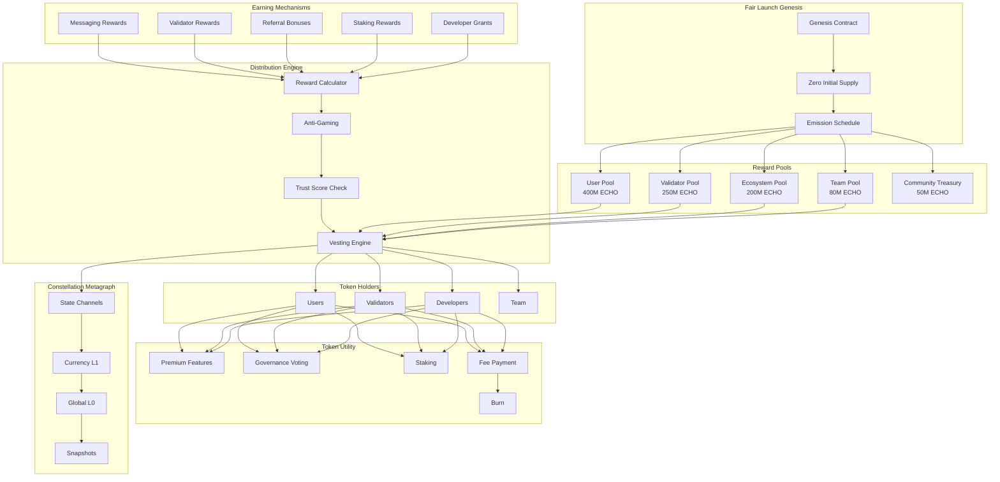

# ECHO Token Reward System and Incentive Economy

## Overview

This feature creates a comprehensive token-based reward system that incentivizes user engagement, network growth, and ecosystem participation through ECHO tokens distributed for messaging activity, payment rail usage, and referrals. The system operates on a **fair launch model** with **no pre-mine**, **no private sale advantages**, and a **hard-capped supply** of 1 billion tokens. Built natively on Constellation Network's Metagraph infrastructure, the tokenomics ensure transparent, auditable, and decentralized distribution that benefits all participants equally.

## Fairness Principles

This token system is designed with fairness as a core principle:

| Principle | Implementation |
|-----------|----------------|
| **No Pre-Mine** | Zero tokens exist before genesis; all tokens are minted through transparent mechanisms |
| **No Private Sale** | No early investor advantages; everyone earns tokens the same way |
| **Fair Launch** | All participants have equal opportunity from day one |
| **Hard Cap** | Maximum 1 billion ECHO tokens ever; no inflation beyond cap |
| **Transparent Vesting** | All allocations visible on-chain with time-locked contracts |
| **Community First** | 65% of tokens go directly to users and validators |
| **Earned, Not Bought** | Primary distribution through participation, not purchase |
| **Open Source** | All smart contracts publicly auditable |
| **Decentralized Governance** | Token holders control protocol changes |

## Token Specifications

```
Token Name: ECHO
Token Symbol: ECHO
Total Supply: 1,000,000,000 (1 Billion) - HARD CAP
Decimals: 8
Network: Constellation Network Metagraph (Primary)
Secondary: Cardano Native Asset (Bridged)
Token Standard: Constellation L0 Token Standard
Genesis Date: TBD
```

## Architecture

The ECHO token is implemented as a Constellation Network Metagraph with custom state channels for reward distribution, staking, and governance. The metagraph validates all token operations through a decentralized network of validators, ensuring no single party controls token issuance.

### Token Distribution Model (Fair Launch)

```
┌─────────────────────────────────────────────────────────────────────┐
│                    ECHO TOKEN DISTRIBUTION                          │
│                    Total Supply: 1,000,000,000                      │
├─────────────────────────────────────────────────────────────────────┤
│                                                                     │
│  ████████████████████████████████████████░░░░░░░░░░░░░░░░░░░░░░░░  │
│  │           40% User Rewards          │                           │
│  │         400,000,000 ECHO            │                           │
│  │      10-year emission schedule      │                           │
│  └─────────────────────────────────────┘                           │
│                                                                     │
│  ██████████████████████████░░░░░░░░░░░░░░░░░░░░░░░░░░░░░░░░░░░░░░  │
│  │    25% Validators    │                                          │
│  │  250,000,000 ECHO    │                                          │
│  │ 10-year distribution │                                          │
│  └──────────────────────┘                                          │
│                                                                     │
│  ████████████████████░░░░░░░░░░░░░░░░░░░░░░░░░░░░░░░░░░░░░░░░░░░░  │
│  │  20% Ecosystem   │                                              │
│  │ 200,000,000 ECHO │                                              │
│  │ Developer grants │                                              │
│  └──────────────────┘                                              │
│                                                                     │
│  ████████░░░░░░░░░░░░░░░░░░░░░░░░░░░░░░░░░░░░░░░░░░░░░░░░░░░░░░░░  │
│  │ 8% Team │ 80M ECHO │ 4-year vest + 1-year cliff                 │
│  └─────────┘                                                       │
│                                                                     │
│  ████░░░░░░░░░░░░░░░░░░░░░░░░░░░░░░░░░░░░░░░░░░░░░░░░░░░░░░░░░░░░  │
│  │ 5% │ Community Treasury │ 50M ECHO │ DAO-controlled             │
│  └────┘                                                            │
│                                                                     │
│  ██░░░░░░░░░░░░░░░░░░░░░░░░░░░░░░░░░░░░░░░░░░░░░░░░░░░░░░░░░░░░░░  │
│  │2%│ Initial Liquidity │ 20M ECHO │ Locked 2 years               │
│  └──┘                                                              │
│                                                                     │
└─────────────────────────────────────────────────────────────────────┘
```

### Detailed Allocation

| Allocation | Amount | Percentage | Vesting | Purpose |
|------------|--------|------------|---------|---------|
| User Rewards | 400,000,000 | 40% | 10 years, decreasing emission | Messaging, referrals, engagement |
| Validator Rewards | 250,000,000 | 25% | 10 years, decreasing emission | Network security, message routing |
| Ecosystem Fund | 200,000,000 | 20% | DAO-controlled release | Developer grants, partnerships |
| Team & Contributors | 80,000,000 | 8% | 4-year vest, 1-year cliff | Core development team |
| Community Treasury | 50,000,000 | 5% | DAO-controlled | Governance proposals, emergencies |
| Initial Liquidity | 20,000,000 | 2% | 2-year lock | DEX liquidity provision |

### Token Earning & Distribution Flow



## Constellation Network Implementation

### Metagraph Architecture

ECHO operates as a dedicated Metagraph on Constellation Network, leveraging the Hypergraph Transfer Protocol (HGTP) for scalable, feeless transactions.

```typescript
// Metagraph Configuration
interface ECHOMetagraph {
  // Network Identity
  metagraphId: string;              // Unique metagraph identifier
  name: 'ECHO Token Metagraph';
  version: '1.0.0';
  
  // Consensus
  consensus: {
    type: 'proof_of_stake';
    minValidators: 3;
    targetValidators: 100;
    blockTime: 5;                   // seconds
    snapshotInterval: 60;           // seconds
  };
  
  // Token Configuration
  token: {
    name: 'ECHO';
    symbol: 'ECHO';
    totalSupply: 1_000_000_000n;    // Hard cap
    decimals: 8;
    mintable: false;                // No additional minting after genesis
  };
  
  // State Channels
  stateChannels: [
    'rewards',                      // User reward distribution
    'staking',                      // Staking operations
    'governance',                   // Voting and proposals
    'vesting',                      // Time-locked allocations
    'burning',                      // Token burn tracking
  ];
  
  // Fees (paid in DAG, not ECHO)
  fees: {
    transferFee: 0;                 // Feeless transfers
    stakingFee: 0;
    votingFee: 0;
  };
}
```

### L0 Token Standard Implementation

```scala
// ECHO Token - Constellation L0 Implementation
// File: modules/l0/src/main/scala/com/echo/l0/ECHOToken.scala

package com.echo.l0

import org.tessellation.currency.dataApplication._
import org.tessellation.currency.schema._
import org.tessellation.schema.address.Address
import org.tessellation.security.signature.Signed

object ECHOToken {
  // Hard-capped total supply
  val TOTAL_SUPPLY: Long = 1_000_000_000_00000000L  // With 8 decimals
  val DECIMALS: Int = 8
  
  // Allocation pools (in base units)
  val USER_REWARDS_POOL: Long      = 400_000_000_00000000L  // 40%
  val VALIDATOR_POOL: Long         = 250_000_000_00000000L  // 25%
  val ECOSYSTEM_POOL: Long         = 200_000_000_00000000L  // 20%
  val TEAM_POOL: Long              = 80_000_000_00000000L   // 8%
  val COMMUNITY_TREASURY: Long     = 50_000_000_00000000L   // 5%
  val INITIAL_LIQUIDITY: Long      = 20_000_000_00000000L   // 2%
  
  // Verify allocations sum to total (compile-time check)
  require(
    USER_REWARDS_POOL + VALIDATOR_POOL + ECOSYSTEM_POOL + 
    TEAM_POOL + COMMUNITY_TREASURY + INITIAL_LIQUIDITY == TOTAL_SUPPLY,
    "Allocations must sum to total supply"
  )
}

// Token State
case class ECHOState(
  balances: Map[Address, Long],
  totalMinted: Long,
  totalBurned: Long,
  pools: PoolState,
  vestingSchedules: Map[Address, VestingSchedule],
  stakingState: StakingState,
  governanceState: GovernanceState,
  lastSnapshotOrdinal: Long
) {
  def circulatingSupply: Long = totalMinted - totalBurned
  
  def remainingSupply: Long = ECHOToken.TOTAL_SUPPLY - totalMinted
  
  // Ensure we never exceed hard cap
  def canMint(amount: Long): Boolean = 
    totalMinted + amount <= ECHOToken.TOTAL_SUPPLY
}

// Pool State (tracks emissions from each pool)
case class PoolState(
  userRewardsRemaining: Long,
  validatorRewardsRemaining: Long,
  ecosystemRemaining: Long,
  teamRemaining: Long,
  treasuryRemaining: Long,
  liquidityRemaining: Long
)

// Vesting Schedule
case class VestingSchedule(
  beneficiary: Address,
  totalAmount: Long,
  releasedAmount: Long,
  startTimestamp: Long,
  cliffDuration: Long,           // seconds
  vestingDuration: Long,         // seconds
  revocable: Boolean,
  revoked: Boolean
) {
  def vestedAmount(currentTimestamp: Long): Long = {
    if (currentTimestamp < startTimestamp + cliffDuration) {
      0L  // Before cliff
    } else if (currentTimestamp >= startTimestamp + vestingDuration) {
      totalAmount  // Fully vested
    } else {
      // Linear vesting after cliff
      val elapsed = currentTimestamp - startTimestamp - cliffDuration
      val vestingPeriod = vestingDuration - cliffDuration
      (totalAmount * elapsed) / vestingPeriod
    }
  }
  
  def releasableAmount(currentTimestamp: Long): Long = 
    vestedAmount(currentTimestamp) - releasedAmount
}
```

### L1 Data Application

```scala
// ECHO L1 Data Application
// File: modules/l1/src/main/scala/com/echo/l1/ECHODataApplication.scala

package com.echo.l1

import cats.effect.Async
import cats.syntax.all._
import org.tessellation.currency.dataApplication._
import org.tessellation.currency.dataApplication.dataApplication._
import org.tessellation.schema.SnapshotOrdinal

class ECHODataApplication[F[_]: Async] extends DataApplication[F, ECHOState, ECHOUpdate] {

  // Transaction Types
  sealed trait ECHOUpdate
  case class Transfer(from: Address, to: Address, amount: Long) extends ECHOUpdate
  case class ClaimReward(claimer: Address, rewardType: RewardType) extends ECHOUpdate
  case class Stake(staker: Address, amount: Long, duration: StakeDuration) extends ECHOUpdate
  case class Unstake(staker: Address, stakeId: String) extends ECHOUpdate
  case class CreateProposal(proposer: Address, proposal: Proposal) extends ECHOUpdate
  case class CastVote(voter: Address, proposalId: String, vote: Vote) extends ECHOUpdate
  case class ClaimVesting(beneficiary: Address) extends ECHOUpdate
  case class Burn(burner: Address, amount: Long) extends ECHOUpdate
  
  // Validate updates
  override def validateUpdate(
    state: ECHOState,
    update: Signed[ECHOUpdate]
  ): F[DataApplicationValidationResult] = {
    update.value match {
      case Transfer(from, to, amount) =>
        validateTransfer(state, from, to, amount, update.proofs)
        
      case ClaimReward(claimer, rewardType) =>
        validateRewardClaim(state, claimer, rewardType)
        
      case Stake(staker, amount, duration) =>
        validateStake(state, staker, amount, duration)
        
      case Burn(burner, amount) =>
        validateBurn(state, burner, amount)
        
      case _ => 
        Async[F].pure(DataApplicationValidationResult.valid)
    }
  }
  
  // Apply state transitions
  override def combine(
    state: ECHOState,
    updates: List[Signed[ECHOUpdate]]
  ): F[ECHOState] = {
    updates.foldLeftM(state) { (currentState, update) =>
      applyUpdate(currentState, update.value)
    }
  }
  
  private def applyUpdate(state: ECHOState, update: ECHOUpdate): F[ECHOState] = {
    update match {
      case Transfer(from, to, amount) =>
        applyTransfer(state, from, to, amount)
        
      case ClaimReward(claimer, rewardType) =>
        applyRewardClaim(state, claimer, rewardType)
        
      case Stake(staker, amount, duration) =>
        applyStake(state, staker, amount, duration)
        
      case Unstake(staker, stakeId) =>
        applyUnstake(state, staker, stakeId)
        
      case Burn(burner, amount) =>
        applyBurn(state, burner, amount)
        
      case ClaimVesting(beneficiary) =>
        applyVestingClaim(state, beneficiary)
        
      case _ => 
        Async[F].pure(state)
    }
  }
  
  // Transfer tokens
  private def applyTransfer(
    state: ECHOState, 
    from: Address, 
    to: Address, 
    amount: Long
  ): F[ECHOState] = Async[F].pure {
    val fromBalance = state.balances.getOrElse(from, 0L)
    val toBalance = state.balances.getOrElse(to, 0L)
    
    state.copy(
      balances = state.balances
        .updated(from, fromBalance - amount)
        .updated(to, toBalance + amount)
    )
  }
  
  // Burn tokens (permanently remove from circulation)
  private def applyBurn(
    state: ECHOState,
    burner: Address,
    amount: Long
  ): F[ECHOState] = Async[F].pure {
    val balance = state.balances.getOrElse(burner, 0L)
    
    state.copy(
      balances = state.balances.updated(burner, balance - amount),
      totalBurned = state.totalBurned + amount
    )
  }
}
```

### Genesis Block Configuration

```json
{
  "metagraph": {
    "id": "echo-metagraph-mainnet",
    "name": "ECHO Token",
    "version": "1.0.0"
  },
  "token": {
    "name": "ECHO",
    "symbol": "ECHO",
    "decimals": 8,
    "totalSupply": "1000000000.00000000",
    "hardCapped": true
  },
  "genesis": {
    "timestamp": "2026-03-01T00:00:00Z",
    "initialState": {
      "balances": {},
      "totalMinted": 0,
      "totalBurned": 0,
      "pools": {
        "userRewardsRemaining": "400000000.00000000",
        "validatorRewardsRemaining": "250000000.00000000",
        "ecosystemRemaining": "200000000.00000000",
        "teamRemaining": "80000000.00000000",
        "treasuryRemaining": "50000000.00000000",
        "liquidityRemaining": "20000000.00000000"
      }
    }
  },
  "emission": {
    "userRewards": {
      "schedule": "halving",
      "halvingInterval": "2 years",
      "initialRatePerDay": "273972.60",
      "minimumRate": "27397.26"
    },
    "validatorRewards": {
      "schedule": "linear_decrease",
      "duration": "10 years",
      "transitionToFees": "year 5"
    }
  },
  "fairLaunch": {
    "noPreMine": true,
    "noPrivateSale": true,
    "teamVesting": {
      "cliff": "1 year",
      "duration": "4 years",
      "revocable": false
    }
  }
}
```

## Key Components

### Emission Schedule

The emission schedule follows a Bitcoin-like halving model for user rewards, ensuring decreasing inflation over time.

**User Rewards Emission (400M ECHO over 10 years):**

| Year | Daily Emission | Annual Emission | Cumulative % |
|------|----------------|-----------------|--------------|
| 1-2 | 273,972 ECHO | 100M ECHO | 25% |
| 3-4 | 136,986 ECHO | 50M ECHO | 37.5% |
| 5-6 | 68,493 ECHO | 25M ECHO | 43.75% |
| 7-8 | 34,247 ECHO | 12.5M ECHO | 46.875% |
| 9-10 | 17,123 ECHO | 6.25M ECHO | 48.4% |
| 10+ | From fees only | ~0 new emission | - |

**Validator Rewards Emission (250M ECHO over 10 years):**

| Phase | Years | Annual Emission | Fee Revenue % |
|-------|-------|-----------------|---------------|
| Bootstrap | 1-2 | 50M ECHO | 10% |
| Growth | 3-5 | 30M ECHO | 40% |
| Mature | 6-10 | 10M ECHO | 80% |
| Sustained | 10+ | 0 new ECHO | 100% |

```typescript
interface EmissionSchedule {
  // Calculate daily user reward emission
  calculateDailyUserEmission(daysSinceGenesis: number): bigint {
    const INITIAL_DAILY = 273_972_60000000n; // With 8 decimals
    const HALVING_INTERVAL = 730; // 2 years in days
    
    const halvings = Math.floor(daysSinceGenesis / HALVING_INTERVAL);
    const emission = INITIAL_DAILY >> BigInt(halvings); // Halve for each period
    
    const MINIMUM_DAILY = 27_397_26000000n; // 10% of initial
    return emission > MINIMUM_DAILY ? emission : MINIMUM_DAILY;
  }
  
  // Calculate validator epoch reward
  calculateValidatorEpochReward(
    epoch: number,
    totalValidators: number,
    validatorPerformance: number
  ): bigint {
    const yearsSinceGenesis = epoch / 365;
    
    let baseAnnualReward: bigint;
    if (yearsSinceGenesis < 2) {
      baseAnnualReward = 50_000_000_00000000n;
    } else if (yearsSinceGenesis < 5) {
      baseAnnualReward = 30_000_000_00000000n;
    } else if (yearsSinceGenesis < 10) {
      baseAnnualReward = 10_000_000_00000000n;
    } else {
      baseAnnualReward = 0n; // Only fee revenue after year 10
    }
    
    const dailyReward = baseAnnualReward / 365n;
    const perValidatorReward = dailyReward / BigInt(totalValidators);
    
    // Apply performance multiplier (0.5x to 2.0x)
    return (perValidatorReward * BigInt(Math.floor(validatorPerformance * 100))) / 100n;
  }
}
```

### Messaging Rewards

Active messaging generates base rewards with trust-based multipliers. Anti-gaming measures prevent abuse.

**Reward Structure:**

| Action | Base Reward | Max Multiplier | Daily Cap |
|--------|-------------|----------------|-----------|
| Send Message | 0.01 ECHO | 5x | 50 ECHO |
| Receive Message | 0.005 ECHO | 3x | 25 ECHO |
| Voice Call (per min) | 0.02 ECHO | 3x | 30 ECHO |
| Video Call (per min) | 0.03 ECHO | 3x | 45 ECHO |
| Group Message | 0.005 ECHO | 2x | 25 ECHO |

**Trust Score Multipliers:**

| Trust Level | Score Range | Multiplier |
|-------------|-------------|------------|
| Unverified | 0-19 | 0.5x |
| Newcomer | 20-39 | 1.0x |
| Member | 40-59 | 1.5x |
| Trusted | 60-79 | 2.5x |
| Verified | 80-100 | 5.0x |

**Implementation:**

```scala
// Messaging Rewards Calculator
case class MessagingReward(
  userId: Address,
  messageType: MessageType,
  timestamp: Long,
  trustScore: Int
) {
  def calculateReward: Long = {
    val baseReward = messageType match {
      case MessageType.TextSent => 1_000_000L      // 0.01 ECHO
      case MessageType.TextReceived => 500_000L    // 0.005 ECHO
      case MessageType.VoiceMinute => 2_000_000L   // 0.02 ECHO
      case MessageType.VideoMinute => 3_000_000L   // 0.03 ECHO
      case MessageType.GroupMessage => 500_000L   // 0.005 ECHO
    }
    
    val multiplier = trustScore match {
      case s if s < 20 => 0.5
      case s if s < 40 => 1.0
      case s if s < 60 => 1.5
      case s if s < 80 => 2.5
      case _ => 5.0
    }
    
    (baseReward * multiplier).toLong
  }
}

// Anti-Gaming: Daily reward caps and progressive decay
case class DailyRewardTracker(
  userId: Address,
  date: String,
  messagesRewarded: Int,
  totalEarned: Long
) {
  val DAILY_MESSAGE_CAP = 500
  val DAILY_ECHO_CAP = 50_00000000L  // 50 ECHO
  
  def canEarnMore: Boolean = 
    messagesRewarded < DAILY_MESSAGE_CAP && totalEarned < DAILY_ECHO_CAP
  
  // Progressive decay after 100 messages
  def decayMultiplier: Double = {
    if (messagesRewarded < 100) 1.0
    else if (messagesRewarded < 200) 0.8
    else if (messagesRewarded < 300) 0.5
    else if (messagesRewarded < 400) 0.25
    else 0.1
  }
}
```

### Referral Program

Fair referral system with verification requirements to prevent gaming.

**Referral Rewards:**

| Milestone | Referrer Reward | Referee Reward | Requirements |
|-----------|-----------------|----------------|--------------|
| Sign Up | 5 ECHO | 5 ECHO | Account created |
| Verification | 20 ECHO | 20 ECHO | Phone + email verified |
| First 100 Messages | 25 ECHO | 25 ECHO | Send 100 messages |
| Trust Score 40+ | 25 ECHO | 10 ECHO | Achieve Member status |
| Trust Score 60+ | 25 ECHO | 15 ECHO | Achieve Trusted status |
| **Total Possible** | **100 ECHO** | **75 ECHO** | All milestones |

**Anti-Gaming:**

| Protection | Description |
|------------|-------------|
| Unique Device | Each device can only be referee once |
| IP Throttling | Max 5 referrals per IP per month |
| Verification Required | Phone verification required for both parties |
| Message Quality | Messages must be with unique recipients |
| Cooldown | 7-day waiting period between referrals |

```scala
case class Referral(
  referrerId: Address,
  refereeId: Address,
  referralCode: String,
  createdAt: Long,
  milestones: ReferralMilestones
)

case class ReferralMilestones(
  signUpCompleted: Boolean = false,
  verificationCompleted: Boolean = false,
  first100Messages: Boolean = false,
  trustScore40: Boolean = false,
  trustScore60: Boolean = false
) {
  def referrerReward: Long = {
    var total = 0L
    if (signUpCompleted) total += 5_00000000L
    if (verificationCompleted) total += 20_00000000L
    if (first100Messages) total += 25_00000000L
    if (trustScore40) total += 25_00000000L
    if (trustScore60) total += 25_00000000L
    total
  }
  
  def refereeReward: Long = {
    var total = 0L
    if (signUpCompleted) total += 5_00000000L
    if (verificationCompleted) total += 20_00000000L
    if (first100Messages) total += 25_00000000L
    if (trustScore40) total += 10_00000000L
    if (trustScore60) total += 15_00000000L
    total
  }
}
```

### Staking System

Users can stake ECHO to earn additional rewards and participate in governance.

**Staking Tiers:**

| Duration | APY | Governance Weight | Early Unstake Penalty |
|----------|-----|-------------------|----------------------|
| Flexible | 3% | 1x | None |
| 30 Days | 5% | 1.25x | 25% of rewards |
| 90 Days | 8% | 1.5x | 50% of rewards |
| 180 Days | 12% | 2x | 75% of rewards |
| 365 Days | 15% | 3x | 90% of rewards |

**Staking Contract:**

```scala
case class Stake(
  stakeId: String,
  staker: Address,
  amount: Long,
  duration: StakeDuration,
  startTimestamp: Long,
  lastRewardClaim: Long,
  autoCompound: Boolean
) {
  def endTimestamp: Long = startTimestamp + duration.seconds
  
  def isLocked: Boolean = System.currentTimeMillis / 1000 < endTimestamp
  
  def pendingReward(currentTimestamp: Long): Long = {
    val elapsedSeconds = currentTimestamp - lastRewardClaim
    val annualReward = (amount * duration.apyBasisPoints) / 10000
    val secondsInYear = 365 * 24 * 60 * 60
    (annualReward * elapsedSeconds) / secondsInYear
  }
  
  def earlyUnstakePenalty: Long = {
    if (!isLocked) 0L
    else (pendingReward(System.currentTimeMillis / 1000) * duration.penaltyPercent) / 100
  }
}

sealed trait StakeDuration {
  def seconds: Long
  def apyBasisPoints: Int  // 100 = 1%
  def governanceWeight: Double
  def penaltyPercent: Int
}

object StakeDuration {
  case object Flexible extends StakeDuration {
    val seconds = 0L
    val apyBasisPoints = 300  // 3%
    val governanceWeight = 1.0
    val penaltyPercent = 0
  }
  case object Days30 extends StakeDuration {
    val seconds = 30L * 24 * 60 * 60
    val apyBasisPoints = 500  // 5%
    val governanceWeight = 1.25
    val penaltyPercent = 25
  }
  case object Days90 extends StakeDuration {
    val seconds = 90L * 24 * 60 * 60
    val apyBasisPoints = 800  // 8%
    val governanceWeight = 1.5
    val penaltyPercent = 50
  }
  case object Days180 extends StakeDuration {
    val seconds = 180L * 24 * 60 * 60
    val apyBasisPoints = 1200  // 12%
    val governanceWeight = 2.0
    val penaltyPercent = 75
  }
  case object Days365 extends StakeDuration {
    val seconds = 365L * 24 * 60 * 60
    val apyBasisPoints = 1500  // 15%
    val governanceWeight = 3.0
    val penaltyPercent = 90
  }
}
```

### Governance System

Token holders govern protocol changes through on-chain voting.

**Governance Parameters:**

| Parameter | Value |
|-----------|-------|
| Proposal Threshold | 100,000 ECHO staked |
| Quorum | 4% of circulating supply |
| Voting Period | 7 days |
| Time Lock | 2 days after passing |
| Vote Options | For, Against, Abstain |

**Proposal Types:**

| Type | Description | Quorum Required |
|------|-------------|-----------------|
| Parameter Change | Adjust protocol parameters | 4% |
| Ecosystem Grant | Fund from ecosystem pool | 4% |
| Treasury Spend | Spend from community treasury | 6% |
| Protocol Upgrade | Smart contract upgrades | 10% |
| Emergency | Critical security fixes | 2% (expedited) |

```scala
case class Proposal(
  proposalId: String,
  proposer: Address,
  proposalType: ProposalType,
  title: String,
  description: String,
  ipfsHash: String,           // Full proposal on IPFS
  
  // Voting
  votesFor: Long,
  votesAgainst: Long,
  votesAbstain: Long,
  
  // Lifecycle
  createdAt: Long,
  votingEndsAt: Long,
  executionTime: Option[Long],
  executed: Boolean,
  
  // Actions (for executable proposals)
  actions: List[ProposalAction]
) {
  def status: ProposalStatus = {
    val now = System.currentTimeMillis / 1000
    if (executed) ProposalStatus.Executed
    else if (now < votingEndsAt) ProposalStatus.Active
    else if (votesFor <= votesAgainst) ProposalStatus.Defeated
    else if (totalVotes < quorumRequired) ProposalStatus.QuorumNotMet
    else if (now < executionTime.getOrElse(Long.MaxValue)) ProposalStatus.Queued
    else ProposalStatus.ReadyForExecution
  }
  
  def totalVotes: Long = votesFor + votesAgainst + votesAbstain
  
  def quorumRequired: Long = proposalType.quorumPercent * circulatingSupply / 100
}

case class Vote(
  voter: Address,
  proposalId: String,
  voteOption: VoteOption,
  weight: Long,              // Staked amount * governance weight
  timestamp: Long
)

sealed trait VoteOption
object VoteOption {
  case object For extends VoteOption
  case object Against extends VoteOption
  case object Abstain extends VoteOption
}
```

### Validator Economics

Validators secure the network and earn rewards based on performance.

**Validator Requirements:**

| Requirement | Value |
|-------------|-------|
| Minimum Stake | 50,000 ECHO |
| Recommended Stake | 250,000 ECHO |
| Hardware | 8 CPU, 32GB RAM, 500GB SSD |
| Uptime | >95% required |
| Network | 1 Gbps connection |

**Validator Reward Formula:**

```
base_reward = validator_pool_emission / active_validators

performance_multiplier = (
  uptime_score * 0.30 +
  block_production_rate * 0.30 +
  latency_score * 0.20 +
  stake_weight * 0.20
)

fee_share = epoch_fees * (validator_blocks / total_blocks)

total_reward = (base_reward * performance_multiplier) + fee_share
```

**Slashing Conditions:**

| Offense | Penalty | Recovery |
|---------|---------|----------|
| Downtime (1-4 hours) | 0.5% stake | Immediate |
| Downtime (4-24 hours) | 2% stake | 7 days |
| Downtime (>24 hours) | 10% stake + removal | 30 days |
| Invalid Block | 5% stake | 14 days |
| Double Signing | 50% stake + permanent ban | Never |
| Collusion | 100% stake + permanent ban | Never |

### Token Utility

ECHO tokens have multiple utility functions within the ecosystem.

**Utility Matrix:**

| Utility | Cost/Requirement | Benefit |
|---------|------------------|---------|
| Premium Features | 10 ECHO/month | Advanced messaging, themes |
| Priority Routing | 5 ECHO/month | Faster message delivery |
| Large Groups | 20 ECHO/month | Groups up to 5,000 members |
| Enterprise Channel | 100 ECHO/month | Verified business features |
| Custom Emoji | 2 ECHO each | Personal emoji uploads |
| Profile Badge | 5 ECHO each | Special profile badges |
| Governance Vote | Staked ECHO | Protocol decision power |
| Validator Node | 50,000 ECHO staked | Network rewards |

### Deflationary Mechanisms

Multiple burn mechanisms ensure long-term token value.

**Burn Sources:**

| Source | Burn Rate | Estimated Annual Burn |
|--------|-----------|----------------------|
| Premium Subscriptions | 20% | Variable |
| Transaction Fees | 10% | Variable |
| Feature Purchases | 50% | Variable |
| Slashed Stakes | 50% to burn | Variable |
| Governance Burns | DAO-decided | Variable |

**Burn Contract:**

```scala
case class BurnEvent(
  burnId: String,
  source: BurnSource,
  amount: Long,
  burner: Address,
  timestamp: Long,
  txHash: String
)

object BurnTracker {
  def totalBurned: Long = // Sum of all burns
  def burnRate: Double = // Burns per day (7-day average)
  def projectedSupplyIn1Year: Long = // Current - projected burns
}

// All burned tokens are sent to this irrecoverable address
val BURN_ADDRESS = Address("DAG_ECHO_BURN_000000000000000000000000000000")
```

### Anti-Gaming & Sybil Protection

Comprehensive measures prevent reward manipulation.

**Protection Layers:**

| Layer | Protection | Description |
|-------|------------|-------------|
| Identity | Phone Verification | One account per phone number |
| Device | Device Fingerprint | One account per device |
| Network | IP Analysis | Detect VPN/proxy abuse |
| Behavior | ML Detection | Identify bot-like patterns |
| Social | Graph Analysis | Detect Sybil clusters |
| Economic | Progressive Decay | Diminishing returns |
| Trust | Score Requirements | Higher trust = more rewards |

```scala
case class AntiGamingCheck(
  userId: Address,
  action: RewardableAction
) {
  def isLegitimate: Boolean = {
    val checks = List(
      checkDeviceUniqueness,
      checkIPReputation,
      checkBehaviorPattern,
      checkSocialGraph,
      checkTrustScore,
      checkDailyCaps
    )
    checks.forall(identity)
  }
  
  private def checkBehaviorPattern: Boolean = {
    // ML model checks for:
    // - Message timing patterns (too regular = bot)
    // - Recipient diversity (same recipients = gaming)
    // - Content similarity (copied messages = spam)
    // - Activity hours (24/7 activity = suspicious)
    true // Placeholder
  }
  
  private def checkSocialGraph: Boolean = {
    // Graph analysis checks for:
    // - Isolated clusters (Sybil networks)
    // - Reciprocal-only relationships
    // - Sudden relationship bursts
    true // Placeholder
  }
}
```

## Security Principles

* **Hard Cap Enforcement**: Smart contract prevents minting beyond 1 billion tokens
* **No Admin Keys**: After genesis, no party can mint new tokens
* **Transparent Vesting**: All vesting schedules visible on-chain
* **Decentralized Validation**: Multiple validators confirm all transactions
* **Immutable Audit Trail**: All emissions recorded on Constellation L0
* **Open Source**: All smart contract code publicly auditable
* **Governance Controls**: Token holders control protocol changes
* **Slashing Protection**: Validators have skin in the game
* **Multi-Sig Treasury**: Community treasury requires multiple signatures
* **Time-Locked Changes**: Protocol changes have mandatory delays

## Integration Points

### With Constellation Network

| Component | Integration |
|-----------|-------------|
| Global L0 | Anchor token state snapshots |
| Currency L1 | Process token transactions |
| State Channels | Manage rewards, staking, governance |
| DAG Token | Validators stake DAG for L0 participation |

### With Platform Features

| Feature | Token Integration |
|---------|-------------------|
| Messaging | Earn rewards for messages |
| Trust Network | Higher trust = higher multipliers |
| Financial Integration | Payment rail rewards |
| Groups | Premium group features |
| Enterprise | Enterprise subscription payments |

### With External Systems

| System | Integration |
|--------|-------------|
| Cardano | Cross-chain bridge for liquidity |
| DEXs | Trading pairs (ECHO/DAG, ECHO/ADA) |
| Price Oracles | Fair market price for premium features |
| Analytics | Public dashboard for token metrics |

## Appendix A: Token Contract Addresses

```
Metagraph ID: [To be generated at genesis]
L0 Token Contract: [To be deployed]
L1 Data Application: [To be deployed]
Staking Contract: [To be deployed]
Governance Contract: [To be deployed]
Vesting Contract: [To be deployed]
Bridge Contract (Cardano): [To be deployed]
Burn Address: DAG_ECHO_BURN_000000000000000000000000000000
```

## Appendix B: Audit & Transparency

| Item | Status | Link |
|------|--------|------|
| Smart Contract Audit | Pending | [TBD] |
| Tokenomics Review | Pending | [TBD] |
| Open Source Code | Yes | [GitHub TBD] |
| Real-Time Dashboard | Planned | [TBD] |
| Emission Tracker | Planned | [TBD] |
| Burn Tracker | Planned | [TBD] |

## Appendix C: Error Codes

| Code | Meaning | User Message |
|------|---------|--------------|
| ECHO_001 | Insufficient balance | "You don't have enough ECHO for this transaction." |
| ECHO_002 | Daily cap reached | "You've reached your daily earning cap." |
| ECHO_003 | Stake locked | "Your stake is still locked." |
| ECHO_004 | Below minimum stake | "Minimum stake is 50,000 ECHO." |
| ECHO_005 | Proposal threshold not met | "You need 100,000 staked ECHO to create proposals." |
| ECHO_006 | Voting period ended | "Voting for this proposal has ended." |
| ECHO_007 | Already voted | "You have already voted on this proposal." |
| ECHO_008 | Vesting not claimable | "No vested tokens available to claim." |
| ECHO_009 | Anti-gaming triggered | "This action was flagged by our anti-gaming system." |
| ECHO_010 | Bridge limit exceeded | "Bridge daily limit exceeded. Try again tomorrow." |

---

*Blueprint Version: 2.0*  
*Last Updated: February 7, 2026*  
*Status: Complete with Fair Launch Implementation*
