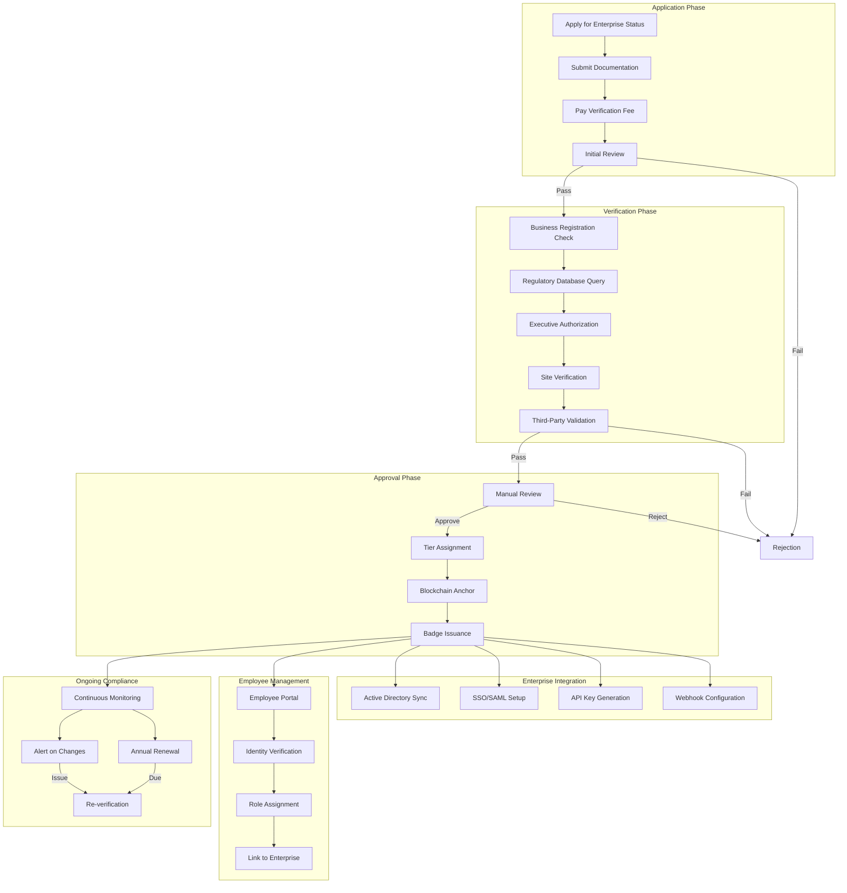

# Enterprise Organization Profiles with Verified Status

## Overview

This feature enables organizations including banks, corporations, government agencies, and non-profits to establish verified enterprise profiles that display authenticated organizational credentials and provide enhanced communication capabilities for official business interactions. Enterprise profiles receive distinctive verification checkmarks that differentiate legitimate organizations from impersonators while providing customers and stakeholders with trusted communication channels for official business.

## Architecture

Organizations undergo multi-stage authentication where legal entities must provide proof of incorporation, regulatory standing with relevant authorities, and multi-signature authorization from designated executives. Verification status is recorded on the blockchain and referenced in the metagraph for access control. The system integrates with government databases, regulatory authorities, and corporate identity providers to maintain real-time verification status.

### Enterprise Verification Flow



### Architecture Components

| Component | Technology | Purpose |
|-----------|------------|---------|
| Verification Engine | Rule-based + ML | Document and identity verification |
| Regulatory API Gateway | REST + GraphQL | Connect to regulatory databases |
| Identity Provider | SAML 2.0 / OIDC | Enterprise SSO integration |
| Employee Registry | Encrypted PostgreSQL | Employee-enterprise linking |
| Compliance Monitor | Event-driven | Real-time status monitoring |
| Blockchain Anchor | Metagraph | Immutable verification records |
| Brand Asset CDN | CloudFront | Logo and asset delivery |
| Audit Logger | Append-only log | Compliance audit trail |

### Data Model

```typescript
interface EnterpriseProfile {
  // Identity
  enterpriseId: string;
  did: string;                       // Decentralized Identifier
  
  // Organization details
  organization: {
    legalName: string;
    tradeName?: string;              // DBA name
    type: OrganizationType;
    industry: IndustryClassification;
    registrationNumber: string;      // EIN, company number, etc.
    registrationCountry: string;
    registrationState?: string;
    incorporationDate: Date;
    
    // Contact
    headquarters: Address;
    website: string;
    phone: string;
    email: string;
  };
  
  // Verification
  verification: {
    tier: VerificationTier;
    status: VerificationStatus;
    verifiedAt: Date;
    expiresAt: Date;
    verifiedBy: string;              // Verification agent ID
    
    // Verification evidence
    documents: VerificationDocument[];
    regulatoryChecks: RegulatoryCheck[];
    executiveAuthorizations: ExecutiveAuth[];
    
    // Blockchain anchor
    anchor: {
      txHash: string;
      snapshotId: string;
      timestamp: Date;
    };
  };
  
  // Branding
  branding: {
    logo: {
      primary: string;               // URL
      square: string;
      monochrome: string;
    };
    colors: {
      primary: string;
      secondary: string;
      accent: string;
    };
    messageTemplates: MessageTemplate[];
  };
  
  // Settings
  settings: EnterpriseSettings;
  
  // Employees
  employees: {
    count: number;
    admins: EmployeeId[];
    managers: EmployeeId[];
  };
  
  // Metrics
  metrics: {
    totalMessages: number;
    totalCustomers: number;
    responseTime: number;            // Average in seconds
    satisfactionScore: number;       // 1-5
  };
  
  // Timestamps
  createdAt: Date;
  updatedAt: Date;
}

type OrganizationType =
  | 'corporation'
  | 'llc'
  | 'partnership'
  | 'sole_proprietorship'
  | 'non_profit'
  | 'government_federal'
  | 'government_state'
  | 'government_local'
  | 'educational'
  | 'healthcare'
  | 'financial_institution'
  | 'other';

type IndustryClassification =
  | 'banking'
  | 'insurance'
  | 'investment'
  | 'healthcare'
  | 'pharmaceutical'
  | 'technology'
  | 'telecommunications'
  | 'retail'
  | 'manufacturing'
  | 'energy'
  | 'transportation'
  | 'real_estate'
  | 'legal'
  | 'education'
  | 'government'
  | 'non_profit'
  | 'media'
  | 'hospitality'
  | 'other';

type VerificationTier =
  | 'basic'                          // Standard business
  | 'regulated'                      // Financial, healthcare, legal
  | 'government'                     // Government agencies
  | 'critical_infrastructure';       // Utilities, defense

type VerificationStatus =
  | 'pending'
  | 'in_review'
  | 'verified'
  | 'suspended'
  | 'revoked'
  | 'expired';

interface EnterpriseEmployee {
  employeeId: string;
  enterpriseId: string;
  
  // Personal info
  profile: {
    firstName: string;
    lastName: string;
    email: string;
    phone?: string;
    title: string;
    department: string;
    avatar?: string;
  };
  
  // Verification
  verification: {
    status: 'pending' | 'verified' | 'suspended';
    method: 'email' | 'sso' | 'manual';
    verifiedAt?: Date;
    corporateEmail: string;
    employeeId?: string;             // Internal employee ID
  };
  
  // Role
  role: EmployeeRole;
  permissions: Permission[];
  
  // Status
  status: {
    active: boolean;
    lastActiveAt: Date;
    onboardedAt: Date;
    offboardedAt?: Date;
  };
  
  // Linked user account
  linkedUserId?: string;
  linkedPersonaId?: string;
}

type EmployeeRole =
  | 'owner'                          // Can transfer ownership
  | 'admin'                          // Full administrative access
  | 'manager'                        // Manage employees, settings
  | 'supervisor'                     // Manage team, view reports
  | 'agent'                          // Customer communication
  | 'readonly';                      // View only

interface VerificationDocument {
  documentId: string;
  type: DocumentType;
  filename: string;
  uploadedAt: Date;
  verifiedAt?: Date;
  status: 'pending' | 'verified' | 'rejected';
  rejectionReason?: string;
  hash: string;                      // For integrity
  expiresAt?: Date;                  // For licenses
}

type DocumentType =
  | 'certificate_of_incorporation'
  | 'business_license'
  | 'articles_of_organization'
  | 'ein_letter'
  | 'banking_license'
  | 'insurance_license'
  | 'healthcare_license'
  | 'securities_license'
  | 'government_authorization'
  | 'board_resolution'
  | 'executive_authorization'
  | 'proof_of_address'
  | 'regulatory_certificate'
  | 'other';
```

## Key Components

### Enterprise Onboarding

Organizations begin the verification process through a dedicated enterprise portal with guided workflow.

**Key Features:**

* Self-service application portal
* Guided document collection
* Real-time validation feedback
* Progress tracking dashboard
* Dedicated support channel
* Multi-language support
* Draft saving
* Bulk document upload

**Onboarding Steps:**

| Step | Description | Time Estimate |
|------|-------------|---------------|
| 1. Account Creation | Admin creates enterprise account | 5 minutes |
| 2. Organization Details | Legal name, type, registration | 10 minutes |
| 3. Document Upload | Certificates, licenses, authorizations | 15-30 minutes |
| 4. Executive Authorization | C-level or board member signs | 1-3 days |
| 5. Verification Review | Our team reviews submission | 3-7 business days |
| 6. Integration Setup | SSO, API, employee onboarding | 1-2 days |

**Onboarding UI:**

```
┌─────────────────────────────────────────────────────────┐
│ Enterprise Verification                         Step 2/6│
├─────────────────────────────────────────────────────────┤
│                                                         │
│ Organization Details                                   │
│                                                         │
│ Legal Name: *                                          │
│ ┌─────────────────────────────────────────────────┐    │
│ │ Acme Corporation                                │    │
│ └─────────────────────────────────────────────────┘    │
│                                                         │
│ Trade Name (DBA): (optional)                           │
│ ┌─────────────────────────────────────────────────┐    │
│ │ Acme Financial Services                         │    │
│ └─────────────────────────────────────────────────┘    │
│                                                         │
│ Organization Type: *                                   │
│ [Corporation                              ▼]           │
│                                                         │
│ Industry: *                                            │
│ [Financial Services - Banking             ▼]           │
│                                                         │
│ Registration Number (EIN): *                           │
│ ┌─────────────────────────────────────────────────┐    │
│ │ 12-3456789                               ✓ Valid │    │
│ └─────────────────────────────────────────────────┘    │
│                                                         │
│ Country of Registration: *                             │
│ [United States                            ▼]           │
│                                                         │
│ State of Incorporation: *                              │
│ [Delaware                                 ▼]           │
│                                                         │
│              [Save Draft]        [Continue →]          │
└─────────────────────────────────────────────────────────┘
```

**Document Upload UI:**

```
┌─────────────────────────────────────────────────────────┐
│ Enterprise Verification                         Step 3/6│
├─────────────────────────────────────────────────────────┤
│                                                         │
│ Required Documents                                     │
│                                                         │
│ ┌─────────────────────────────────────────────────────┐ │
│ │ ✓ Certificate of Incorporation                     │ │
│ │   acme_incorporation.pdf                   2.3 MB  │ │
│ │   Uploaded: Feb 5, 2026 • Status: ✓ Verified       │ │
│ └─────────────────────────────────────────────────────┘ │
│                                                         │
│ ┌─────────────────────────────────────────────────────┐ │
│ │ ⏳ Banking License                                  │ │
│ │   fdic_license.pdf                        1.8 MB   │ │
│ │   Uploaded: Feb 5, 2026 • Status: Under Review     │ │
│ └─────────────────────────────────────────────────────┘ │
│                                                         │
│ ┌─────────────────────────────────────────────────────┐ │
│ │ ○ Executive Authorization Letter          Required │ │
│ │   Not uploaded                                     │ │
│ │   [Upload Document] [Download Template]            │ │
│ └─────────────────────────────────────────────────────┘ │
│                                                         │
│ ┌─────────────────────────────────────────────────────┐ │
│ │ ○ Proof of Headquarters Address           Required │ │
│ │   Not uploaded                                     │ │
│ │   [Upload Document]                                │ │
│ └─────────────────────────────────────────────────────┘ │
│                                                         │
│ Optional Documents:                                    │
│ [+ Add Additional Documents]                           │
│                                                         │
│              [← Back]               [Continue →]       │
└─────────────────────────────────────────────────────────┘
```

### Verification Tiers

Different verification tiers provide varying levels of trust and capabilities.

**Tier Comparison:**

| Feature | Basic | Regulated | Government | Critical Infrastructure |
|---------|-------|-----------|------------|------------------------|
| Verification Badge | ✓ Blue | ✓ Gold | ✓ Purple | ✓ Red |
| Employee Accounts | 50 | 500 | Unlimited | Unlimited |
| Customer Channels | 10 | 100 | Unlimited | Unlimited |
| API Rate Limit | 1K/hr | 10K/hr | 50K/hr | 100K/hr |
| Message Templates | 20 | 100 | Unlimited | Unlimited |
| Broadcast Messages | 1K/day | 10K/day | 100K/day | Unlimited |
| Custom Branding | Basic | Full | Full | Full |
| Compliance Dashboard | Basic | Full | Full | Full + Gov |
| SLA | Standard | Priority | Priority+ | Dedicated |
| Dedicated Support | Email | Phone | Named Rep | 24/7 Team |
| Annual Cost | $5K | $25K | $50K | Custom |

**Tier Requirements:**

```typescript
interface TierRequirements {
  basic: {
    documents: [
      'certificate_of_incorporation',
      'proof_of_address',
      'executive_authorization',
    ];
    regulatoryChecks: [];
    executiveSignatures: 1;
    annualRevenue: null;            // No minimum
    employeeCount: null;
  };
  
  regulated: {
    documents: [
      'certificate_of_incorporation',
      'proof_of_address',
      'executive_authorization',
      'board_resolution',
      // Plus industry-specific:
      'banking_license',            // For banks
      'insurance_license',          // For insurers
      'securities_license',         // For brokers
      'healthcare_license',         // For healthcare
    ];
    regulatoryChecks: [
      'fdic_status',                // Banking
      'state_insurance_db',         // Insurance
      'finra_brokercheck',          // Securities
      'npi_registry',               // Healthcare
    ];
    executiveSignatures: 2;         // CEO + CFO or Board Chair
    annualRevenue: 10_000_000;      // $10M minimum
    employeeCount: 50;
  };
  
  government: {
    documents: [
      'government_authorization',
      'agency_charter',
      'official_appointment_letter',
    ];
    regulatoryChecks: [
      'sam_gov_registration',
      'government_directory',
    ];
    executiveSignatures: 2;         // Agency head + legal
    annualRevenue: null;
    employeeCount: null;
  };
  
  critical_infrastructure: {
    documents: [
      // All regulated requirements plus:
      'cisa_designation',
      'sector_specific_compliance',
      'security_clearance_authorization',
    ];
    regulatoryChecks: [
      'cisa_registry',
      'sector_isac_membership',
    ];
    executiveSignatures: 3;
    annualRevenue: 100_000_000;
    employeeCount: 500;
    additionalVetting: true;
  };
}
```

### Business Registration Verification

Automated verification against government databases and registries.

**Key Features:**

* Real-time database queries
* Multi-jurisdiction support
* Automatic status updates
* Discrepancy detection
* Manual override capability
* Verification caching
* Audit trail

**Verification Sources by Country:**

| Country | Primary Source | Secondary Source |
|---------|---------------|------------------|
| USA | IRS (EIN), State SoS | D&B, Experian Business |
| UK | Companies House | Credit agencies |
| EU | National registries | VIES VAT validation |
| Canada | Corporations Canada | Provincial registries |
| Australia | ASIC | ABN Lookup |

**Verification Implementation:**

```typescript
interface BusinessVerification {
  // Verify business registration
  async verifyBusiness(
    registration: BusinessRegistration
  ): Promise<VerificationResult> {
    const checks: CheckResult[] = [];
    
    // 1. Verify EIN/Tax ID
    const taxCheck = await verifyTaxId(
      registration.taxId,
      registration.country
    );
    checks.push({
      type: 'tax_id',
      status: taxCheck.valid ? 'passed' : 'failed',
      source: taxCheck.source,
      data: taxCheck.data,
    });
    
    // 2. Verify with state/national registry
    const registryCheck = await queryBusinessRegistry(
      registration.registrationNumber,
      registration.country,
      registration.state
    );
    checks.push({
      type: 'business_registry',
      status: registryCheck.found ? 'passed' : 'failed',
      source: registryCheck.source,
      data: {
        legalName: registryCheck.legalName,
        status: registryCheck.status,
        incorporationDate: registryCheck.incorporationDate,
        registeredAgent: registryCheck.registeredAgent,
      },
    });
    
    // 3. Verify name matches
    const nameMatch = fuzzyMatch(
      registration.legalName,
      registryCheck.legalName
    );
    checks.push({
      type: 'name_match',
      status: nameMatch.score > 0.9 ? 'passed' : 'review_needed',
      data: { 
        submitted: registration.legalName,
        registered: registryCheck.legalName,
        score: nameMatch.score,
      },
    });
    
    // 4. Verify business is in good standing
    checks.push({
      type: 'good_standing',
      status: registryCheck.status === 'active' ? 'passed' : 'failed',
      data: { status: registryCheck.status },
    });
    
    // 5. Third-party business data (D&B, Experian)
    const thirdParty = await queryThirdPartyData(registration);
    checks.push({
      type: 'third_party',
      status: thirdParty.verified ? 'passed' : 'review_needed',
      source: thirdParty.source,
      data: thirdParty.data,
    });
    
    // Aggregate results
    const allPassed = checks.every(c => c.status === 'passed');
    const anyFailed = checks.some(c => c.status === 'failed');
    
    return {
      verified: allPassed,
      requiresReview: !allPassed && !anyFailed,
      checks,
      timestamp: new Date(),
    };
  }
}
```

### Regulatory Compliance Verification

Industry-specific compliance verification for regulated entities.

**Key Features:**

* FDIC/OCC verification for banks
* State insurance department checks
* FINRA BrokerCheck integration
* NPI registry for healthcare
* Bar association verification for legal
* Continuous monitoring for changes
* Automatic alerts on status changes

**Regulatory Database Integrations:**

| Industry | Database | Data Available |
|----------|----------|----------------|
| Banking | FDIC BankFind | Institution status, assets, FDIC cert |
| Banking | OCC | Charter type, enforcement actions |
| Credit Unions | NCUA | Charter, field of membership |
| Securities | FINRA BrokerCheck | Firm status, disclosures |
| Insurance | NAIC | License status by state |
| Healthcare | NPI Registry | Provider type, taxonomy |
| Legal | State Bar | Attorney status, discipline |
| Real Estate | State RE Commission | Broker license status |

**Compliance Monitoring:**

```typescript
interface ComplianceMonitoring {
  // Continuous monitoring configuration
  monitoring: {
    frequency: {
      regulatory_status: 'daily',
      enforcement_actions: 'daily',
      license_expiration: 'weekly',
      ownership_changes: 'weekly',
      bankruptcy_filings: 'daily',
      litigation: 'weekly',
    };
    
    alerts: {
      status_change: ['email', 'webhook', 'in_app'];
      enforcement_action: ['email', 'webhook', 'in_app', 'sms'];
      license_expiring: ['email', 'in_app'];
      suspension: ['email', 'webhook', 'in_app', 'sms'];
    };
  };
  
  // Check regulatory status
  async checkRegulatoryStatus(
    enterpriseId: EnterpriseId
  ): Promise<RegulatoryStatus> {
    const enterprise = await getEnterprise(enterpriseId);
    const industry = enterprise.organization.industry;
    
    const checks: RegulatoryCheck[] = [];
    
    if (industry === 'banking') {
      // Check FDIC status
      const fdicStatus = await queryFDIC(enterprise.organization);
      checks.push({
        type: 'fdic',
        status: fdicStatus.active ? 'active' : 'inactive',
        details: fdicStatus,
        checkedAt: new Date(),
      });
      
      // Check for enforcement actions
      const enforcement = await checkEnforcementActions(
        enterprise.organization.registrationNumber
      );
      if (enforcement.actions.length > 0) {
        checks.push({
          type: 'enforcement',
          status: 'action_found',
          details: enforcement,
          severity: enforcement.maxSeverity,
        });
      }
    }
    
    if (industry === 'insurance') {
      // Check state insurance licenses
      const licenses = await checkInsuranceLicenses(enterprise);
      checks.push({
        type: 'insurance_license',
        status: licenses.allActive ? 'active' : 'issues_found',
        details: licenses,
      });
    }
    
    // Aggregate status
    const hasIssues = checks.some(c => 
      c.status !== 'active' || c.severity === 'high'
    );
    
    if (hasIssues) {
      await triggerComplianceAlert(enterpriseId, checks);
    }
    
    return {
      overall: hasIssues ? 'review_needed' : 'compliant',
      checks,
      lastChecked: new Date(),
      nextCheck: addDays(new Date(), 1),
    };
  }
}
```

### Executive Authorization

Multi-signature authorization from designated executives.

**Key Features:**

* Digital signature collection
* Identity verification for signers
* Role verification (C-level, board)
* Multi-signature thresholds
* Signature expiration
* Delegation support
* Notarization option

**Authorization Flow:**

```
┌─────────────────────────────────────────────────────────┐
│ Executive Authorization                         Step 4/6│
├─────────────────────────────────────────────────────────┤
│                                                         │
│ Two executives must authorize this enterprise profile. │
│                                                         │
│ REQUIRED SIGNERS (2 of 2)                              │
│ ─────────────────────────────────────────────────────── │
│                                                         │
│ ┌─────────────────────────────────────────────────────┐ │
│ │ ✓ John Smith                                       │ │
│ │   Chief Executive Officer                          │ │
│ │   john.smith@acme.com                              │ │
│ │                                                    │ │
│ │   Signed: Feb 5, 2026 at 2:34 PM                  │ │
│ │   Identity Verified: Government ID + Video        │ │
│ └─────────────────────────────────────────────────────┘ │
│                                                         │
│ ┌─────────────────────────────────────────────────────┐ │
│ │ ⏳ Sarah Johnson                                    │ │
│ │   Chief Financial Officer                          │ │
│ │   sarah.johnson@acme.com                           │ │
│ │                                                    │ │
│ │   Status: Invitation sent Feb 5, 2026             │ │
│ │   [Resend Invitation] [Change Signer]              │ │
│ └─────────────────────────────────────────────────────┘ │
│                                                         │
│ ─────────────────────────────────────────────────────── │
│                                                         │
│ Authorization Statement:                               │
│ "I, the undersigned, hereby authorize Acme Corporation │
│ to establish a verified enterprise profile on this     │
│ platform and confirm that all submitted information    │
│ is accurate and complete."                             │
│                                                         │
│ [Download Authorization Document]                      │
│                                                         │
└─────────────────────────────────────────────────────────┘
```

**Signature Process:**

```typescript
interface ExecutiveAuthorization {
  // Request executive signature
  async requestSignature(
    enterpriseId: EnterpriseId,
    executive: ExecutiveInfo
  ): Promise<SignatureRequest> {
    // Generate authorization document
    const document = await generateAuthDocument(enterpriseId, executive);
    
    // Create signature request
    const request = {
      requestId: generateId(),
      enterpriseId,
      executive,
      document: {
        hash: sha256(document),
        url: await uploadDocument(document),
      },
      status: 'pending',
      createdAt: new Date(),
      expiresAt: addDays(new Date(), 7),
    };
    
    // Send invitation email
    await sendSignatureInvitation(executive.email, request);
    
    return request;
  }
  
  // Process signature
  async processSignature(
    requestId: string,
    signature: ExecutiveSignature
  ): Promise<SignatureResult> {
    const request = await getSignatureRequest(requestId);
    
    // 1. Verify executive identity
    const identityCheck = await verifyExecutiveIdentity(signature);
    if (!identityCheck.verified) {
      throw new Error('Identity verification failed');
    }
    
    // 2. Verify executive role
    const roleCheck = await verifyExecutiveRole(
      request.enterpriseId,
      signature.executive
    );
    if (!roleCheck.verified) {
      throw new Error('Executive role verification failed');
    }
    
    // 3. Record signature
    const signatureRecord = {
      requestId,
      executive: signature.executive,
      signedAt: new Date(),
      signature: signature.digitalSignature,
      identityVerification: identityCheck,
      roleVerification: roleCheck,
      ipAddress: signature.ipAddress,
      userAgent: signature.userAgent,
    };
    
    // 4. Anchor to blockchain
    const anchor = await anchorSignature(signatureRecord);
    
    // 5. Check if all required signatures collected
    const allSigned = await checkAllSignaturesCollected(request.enterpriseId);
    if (allSigned) {
      await advanceVerificationState(request.enterpriseId);
    }
    
    return {
      success: true,
      signatureRecord,
      anchor,
      allSignaturesCollected: allSigned,
    };
  }
}
```

### Verification Badges

Enterprise profiles display distinctive verification badges.

**Badge Types:**

| Tier | Badge | Color | Icon |
|------|-------|-------|------|
| Basic | Verified Business | Blue (#3B82F6) | ✓ Check |
| Regulated | Regulated Entity | Gold (#F59E0B) | 🏛️ Building |
| Government | Government Agency | Purple (#8B5CF6) | ⭐ Star |
| Critical | Critical Infrastructure | Red (#EF4444) | 🛡️ Shield |

**Badge Display:**

```
Standard Badge (Compact):
┌──────────────────────────────┐
│ ✓ Acme Bank                  │
│   Verified Financial Institution
└──────────────────────────────┘

Expanded Badge (Profile):
┌─────────────────────────────────────────────────────────┐
│ 🏛️ ACME BANK                                           │
│                                                         │
│ ┌───────────────────────────────────────────────────┐  │
│ │ ✓ VERIFIED FINANCIAL INSTITUTION                  │  │
│ │                                                   │  │
│ │ Tier: Regulated Entity (Gold)                    │  │
│ │ Verified Since: January 15, 2024                 │  │
│ │ Verification Expires: January 15, 2025           │  │
│ │                                                   │  │
│ │ Regulatory Status:                               │  │
│ │ ✓ FDIC Insured (Cert #12345)                    │  │
│ │ ✓ OCC Chartered National Bank                   │  │
│ │ ✓ No enforcement actions                        │  │
│ │                                                   │  │
│ │ [View Verification Details]                      │  │
│ └───────────────────────────────────────────────────┘  │
│                                                         │
│ About: Acme Bank is a national bank providing          │
│ personal and business banking services since 1985.     │
│                                                         │
│ Headquarters: New York, NY                             │
│ Website: www.acmebank.com                              │
│                                                         │
└─────────────────────────────────────────────────────────┘
```

### Organizational Hierarchy & Employee Management

Employee accounts linked to enterprise profile with role-based structure.

**Key Features:**

* Multi-level org structure
* Department organization
* Role-based permissions
* Employee verification via SSO
* Delegation support
* Bulk employee management
* SCIM provisioning

**Employee Management UI:**

```
┌─────────────────────────────────────────────────────────┐
│ Employee Management                     🔍 [+ Add Team] │
├─────────────────────────────────────────────────────────┤
│                                                         │
│ [All ▼] [Active ▼] [By Department ▼]     123 employees │
│                                                         │
│ EXECUTIVES (3)                                         │
│ ─────────────────────────────────────────────────────── │
│ ┌─────────────────────────────────────────────────────┐ │
│ │ 👤 John Smith                              Owner    │ │
│ │    CEO • john.smith@acme.com                       │ │
│ │    ✓ Enhanced Verification • Active now            │ │
│ └─────────────────────────────────────────────────────┘ │
│                                                         │
│ CUSTOMER SERVICE (45)                                  │
│ ─────────────────────────────────────────────────────── │
│ ┌─────────────────────────────────────────────────────┐ │
│ │ 👤 Bob Williams                            Agent    │ │
│ │    Senior Agent • bob.w@acme.com                   │ │
│ │    ✓ Verified • Active 15m ago                     │ │
│ │    Metrics: 4.8★ • 234 chats today                 │ │
│ └─────────────────────────────────────────────────────┘ │
│                                                         │
│ Bulk Actions: [Import CSV] [Export] [Sync AD]          │
└─────────────────────────────────────────────────────────┘
```

### Corporate Identity Integration (SSO)

Integration with enterprise identity providers.

**Key Features:**

* Active Directory sync
* SAML 2.0 / OIDC support
* SCIM provisioning
* Just-in-time provisioning
* Group to role mapping
* Automatic de-provisioning
* MFA enforcement

**SSO Configuration:**

```typescript
interface SSOConfiguration {
  protocols: {
    saml: {
      version: '2.0';
      entityId: string;
      acsUrl: string;
      certificate: string;
    };
    oidc: {
      clientId: string;
      clientSecret: string;
      issuerUrl: string;
      scopes: ['openid', 'profile', 'email', 'groups'];
    };
  };
  
  groupRoleMapping: {
    'ACME_Executives': 'admin';
    'ACME_Managers': 'manager';
    'ACME_Agents': 'agent';
  };
  
  scim: {
    enabled: boolean;
    endpoint: string;
    syncFrequency: 'realtime' | 'hourly' | 'daily';
  };
}
```

### Enterprise API

Programmatic access for enterprise automation.

**Key Features:**

* REST API with OpenAPI spec
* Webhook notifications
* Rate limiting by tier
* API key management
* OAuth 2.0 support
* Audit logging

**API Endpoints:**

| Endpoint | Method | Description |
|----------|--------|-------------|
| /v1/messages | POST | Send message to customer |
| /v1/customers | GET | List customer conversations |
| /v1/employees | GET/POST | Manage employees |
| /v1/templates | GET/POST | Manage message templates |
| /v1/analytics | GET | Get usage analytics |
| /v1/compliance/export | POST | Export compliance data |
| /v1/webhooks | POST | Configure webhooks |

### Branded Communication Channels

Custom branding for enterprise communications.

**Key Features:**

* Logo upload and validation
* Color scheme customization
* Message template library
* Brand consistency enforcement
* Template approval workflow
* Multi-language templates

### Compliance Recording

Blockchain-anchored compliance records for regulatory requirements.

**Key Features:**

* Automatic message archiving
* Configurable retention policies
* Legal hold support
* eDiscovery export
* Audit trail generation
* Regulatory report generation

**Compliance Dashboard:**

```
┌─────────────────────────────────────────────────────────┐
│ Compliance Dashboard                                    │
├─────────────────────────────────────────────────────────┤
│                                                         │
│ ┌────────────┐ ┌────────────┐ ┌────────────┐           │
│ │   45,231   │ │   100%     │ │    0       │           │
│ │  Messages  │ │  Archived  │ │ Violations │           │
│ │  Recorded  │ │            │ │            │           │
│ └────────────┘ └────────────┘ └────────────┘           │
│                                                         │
│ Retention Policies                                     │
│ • Customer Communications: 7 years    ✓ Active        │
│ • Security Alerts: 5 years            ✓ Active        │
│                                                         │
│ Legal Holds (1 active)                                 │
│ • Matter: Smith v. Acme - 1,247 messages preserved    │
│                                                         │
│ [Generate Audit Report] [Export for eDiscovery]        │
└─────────────────────────────────────────────────────────┘
```

### Enterprise Analytics

Analytics dashboard for enterprise operations.

**Key Features:**

* Message volume metrics
* Response time tracking
* Customer satisfaction scores
* Employee performance
* Channel utilization
* Trend analysis

## Security Principles

* Multi-stage verification with document validation
* Regulatory database integration for continuous compliance
* Executive authorization with identity verification
* Blockchain-anchored verification records
* Employee accounts cryptographically linked to enterprise
* Role-based access with verification requirements
* Cryptographic signatures for official communications
* End-to-end encryption for all messages
* Compliance recording with retention enforcement
* SSO integration with enterprise identity providers
* API access with audit logging
* Automatic suspension on compliance violations

## Integration Points

### With Trust Network Blueprint

| Feature | Integration |
|---------|-------------|
| Enterprise Trust | Organizations have trust scores |
| Employee Verification | Links to personal trust |
| Customer Trust | Trust display in conversations |

### With Messaging Blueprint

| Feature | Integration |
|---------|-------------|
| Message Encryption | Standard E2EE |
| Templates | Enterprise message templates |
| Branding | Enterprise styling applied |

### With Groups Blueprint

| Feature | Integration |
|---------|-------------|
| Enterprise Groups | Internal team groups |
| Customer Communities | Enterprise-moderated groups |

### With Compliance Blueprint

| Feature | Integration |
|---------|-------------|
| Message Recording | Automatic compliance archive |
| Retention Policies | Enterprise-specific policies |
| Legal Hold | Enterprise-initiated holds |

## Appendix: Error Codes

| Code | Meaning | User Message |
|------|---------|--------------|
| ENT_001 | Document verification failed | "We could not verify this document." |
| ENT_002 | Registration not found | "Business registration not found." |
| ENT_003 | Not in good standing | "Business is not in good standing." |
| ENT_004 | Regulatory check failed | "Regulatory verification failed." |
| ENT_005 | Executive not verified | "Executive identity could not be verified." |
| ENT_006 | Signature invalid | "Digital signature verification failed." |
| ENT_007 | SSO configuration error | "SSO configuration is invalid." |
| ENT_008 | Employee limit reached | "Employee limit for your tier reached." |
| ENT_009 | API rate limit exceeded | "API rate limit exceeded." |
| ENT_010 | Template not approved | "Template has not been approved." |
| ENT_011 | Verification expired | "Enterprise verification has expired." |
| ENT_012 | Compliance violation | "Action blocked due to compliance violation." |

---

*Blueprint Version: 2.0*  
*Last Updated: February 5, 2026*  
*Status: Complete with Implementation Details*
