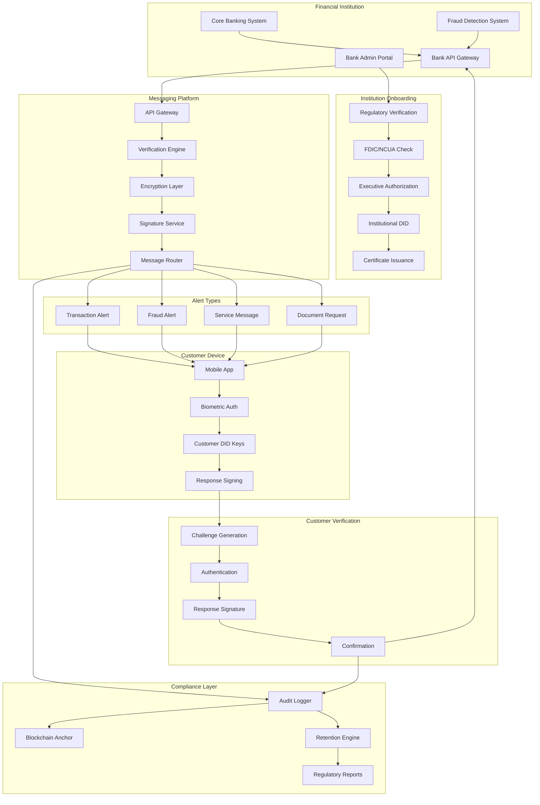
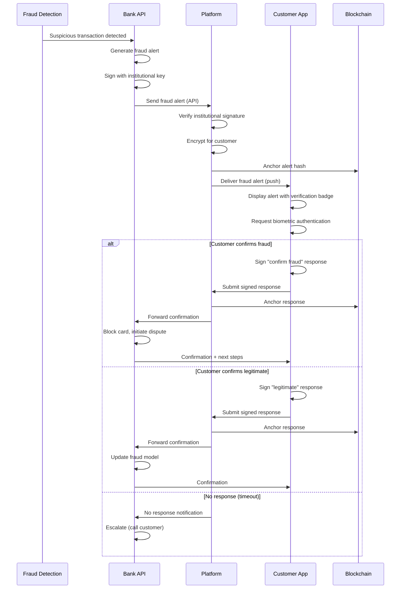

# Verified Financial Institution Integration

## Overview

This feature transforms the messaging platform into a secure communication channel for financial institutions to conduct fraud prevention, customer service, and compliance activities with cryptographic proof and enhanced security compared to traditional SMS and email channels. Banks and credit unions can establish verified channels that leverage the platform's trust infrastructure to reduce phishing attacks and improve customer authentication while maintaining regulatory compliance.

## Architecture

Financial institutions establish institutional DIDs through the Cardano-based identity system with enhanced verification requirements including regulatory compliance documentation, FDIC/NCUA registration verification, and multi-signature authorization from institution executives. Customer interactions flow through a structured verification process where banks send transaction alerts or service requests through secure API integration, with customers responding via biometric authentication combined with DID signatures.

### Financial Institution Integration Flow



### Architecture Components

| Component | Technology | Purpose |
|-----------|------------|---------|
| Institution DID | Cardano + Metagraph | Verified institutional identity |
| API Gateway | REST + mTLS | Secure bank integration |
| Message Encryption | AES-256-GCM + X25519 | E2EE for all messages |
| Digital Signatures | Ed25519 | Message authenticity |
| Biometric Auth | FIDO2/WebAuthn | Customer authentication |
| Audit Logger | Append-only + blockchain | Immutable audit trail |
| ZK Proofs | Groth16 | Privacy-preserving verification |
| Core Banking Adapter | REST/SOAP/ISO 20022 | Bank system integration |

### Compliance Standards

| Standard | Requirement | Implementation |
|----------|-------------|----------------|
| PCI DSS 4.0 | Protect cardholder data | E2EE, tokenization, no PAN storage |
| SOC 2 Type II | Security controls | Audit logs, access controls |
| FDIC Guidelines | Consumer communication | Verified sender, opt-in |
| GLBA | Financial privacy | Encryption, access controls |
| Reg E | Electronic transfers | Audit trail, dispute resolution |
| BSA/AML | Anti-money laundering | Transaction monitoring |
| FFIEC | Cybersecurity | Authentication, encryption |

### Data Model

```typescript
interface FinancialInstitution {
  // Identity
  institutionId: string;
  did: string;                       // Institutional DID
  enterpriseProfileId: string;       // Link to enterprise profile
  
  // Institution details
  institution: {
    legalName: string;
    charterType: CharterType;
    charterNumber: string;
    regulators: Regulator[];
    
    // Registration
    fdicCertNumber?: string;
    ncuaCharterNumber?: string;
    rssdId?: string;                 // Federal Reserve ID
    leiCode?: string;                // Legal Entity Identifier
    
    // Contact
    headquarters: Address;
    complianceContact: Contact;
    technicalContact: Contact;
  };
  
  // Verification
  verification: {
    status: VerificationStatus;
    tier: 'community_bank' | 'regional_bank' | 'national_bank' | 'credit_union';
    fdicVerified: boolean;
    ncuaVerified: boolean;
    lastRegulatoryCheck: Date;
    nextRegulatoryCheck: Date;
  };
  
  // Capabilities
  capabilities: {
    fraudAlerts: boolean;
    transactionVerification: boolean;
    documentExchange: boolean;
    customerService: boolean;
    accountAlerts: boolean;
    paymentAuthorization: boolean;
  };
  
  // Integration
  integration: {
    apiKeys: APIKey[];
    webhooks: Webhook[];
    coreSystemType: CoreSystemType;
    connectionStatus: 'active' | 'inactive' | 'error';
    lastHealthCheck: Date;
  };
  
  // Compliance
  compliance: {
    pciDssCompliant: boolean;
    pciDssValidatedDate: Date;
    soc2Compliant: boolean;
    soc2ReportDate: Date;
    dataRetentionYears: number;
    auditLogRetentionYears: number;
  };
  
  // Metrics
  metrics: {
    totalCustomersEnrolled: number;
    monthlyAlertVolume: number;
    averageResponseTime: number;
    fraudPreventionRate: number;
  };
  
  // Blockchain anchor
  anchor: {
    creationTxHash: string;
    lastUpdateTxHash: string;
  };
}

type CharterType =
  | 'national_bank'
  | 'state_member_bank'
  | 'state_nonmember_bank'
  | 'savings_association'
  | 'federal_credit_union'
  | 'state_credit_union';

type Regulator =
  | 'occ'                           // Office of Comptroller of Currency
  | 'federal_reserve'
  | 'fdic'
  | 'ncua'
  | 'cfpb'
  | 'state_banking_dept';

type CoreSystemType =
  | 'fiserv'
  | 'jack_henry'
  | 'fis'
  | 'temenos'
  | 'finastra'
  | 'custom'
  | 'other';

interface BankCustomerEnrollment {
  enrollmentId: string;
  institutionId: string;
  customerId: string;               // Bank's customer ID
  userId: string;                   // Platform user ID
  
  // Enrollment
  enrollment: {
    status: 'pending' | 'active' | 'suspended' | 'revoked';
    enrolledAt: Date;
    consentRecordId: string;        // Blockchain-anchored consent
    consentVersion: string;
    
    // Verification
    verificationMethod: 'in_app' | 'branch' | 'call_center' | 'online_banking';
    verifiedAt: Date;
    verifiedBy?: string;            // For branch/call center
  };
  
  // Linked accounts (tokenized)
  linkedAccounts: {
    accountToken: string;           // Opaque token, not actual account number
    accountType: 'checking' | 'savings' | 'credit_card' | 'loan' | 'investment';
    accountNickname?: string;
    alertsEnabled: boolean;
  }[];
  
  // Preferences
  preferences: {
    alertTypes: AlertType[];
    quietHours?: QuietHours;
    language: string;
    transactionThreshold?: number;  // Alert for transactions above this
  };
  
  // Trust
  trust: {
    userTrustScore: number;
    priorityLevel: 'standard' | 'priority' | 'premium';
    lastInteraction: Date;
  };
}

interface FinancialMessage {
  messageId: string;
  institutionId: string;
  customerId: string;
  enrollmentId: string;
  
  // Message type
  type: FinancialMessageType;
  category: MessageCategory;
  priority: 'low' | 'normal' | 'high' | 'urgent';
  
  // Content
  content: {
    title: string;
    body: string;
    structuredData?: TransactionData | FraudAlertData | DocumentData;
  };
  
  // Security
  security: {
    encryptedContent: Uint8Array;
    institutionSignature: string;
    signatureTimestamp: Date;
    requiresResponse: boolean;
    responseDeadline?: Date;
    authenticationRequired: AuthLevel;
  };
  
  // Response (if applicable)
  response?: {
    responseType: 'confirm' | 'deny' | 'report_fraud' | 'contact_me';
    respondedAt: Date;
    customerSignature: string;
    biometricProof: string;
    deviceAttestation: string;
  };
  
  // Audit
  audit: {
    createdAt: Date;
    deliveredAt?: Date;
    readAt?: Date;
    respondedAt?: Date;
    auditLogId: string;
    blockchainTxHash: string;
  };
}

type FinancialMessageType =
  | 'transaction_alert'
  | 'fraud_alert'
  | 'fraud_verification'
  | 'payment_authorization'
  | 'account_alert'
  | 'document_request'
  | 'document_delivery'
  | 'service_notification'
  | 'security_alert'
  | 'statement_ready'
  | 'payment_reminder'
  | 'rate_change_notice';

type MessageCategory =
  | 'fraud'
  | 'security'
  | 'transaction'
  | 'account'
  | 'document'
  | 'service'
  | 'marketing';         // Requires separate opt-in

type AuthLevel =
  | 'none'              // Informational only
  | 'app_open'          // Just open the app
  | 'pin'               // Enter PIN
  | 'biometric'         // Face/fingerprint
  | 'biometric_plus'    // Biometric + PIN
  | 'step_up';          // Full re-authentication

interface TransactionData {
  transactionId: string;
  transactionType: 'purchase' | 'withdrawal' | 'transfer' | 'payment' | 'deposit';
  amount: number;
  currency: string;
  merchantName?: string;
  merchantCategory?: string;
  location?: {
    city: string;
    state: string;
    country: string;
  };
  timestamp: Date;
  accountToken: string;
  cardLast4?: string;
  isDeclined?: boolean;
  declineReason?: string;
}

interface FraudAlertData {
  alertId: string;
  alertType: 'suspicious_transaction' | 'account_takeover' | 'card_compromise' | 'identity_theft';
  severity: 'low' | 'medium' | 'high' | 'critical';
  suspiciousTransactions: TransactionData[];
  recommendedActions: string[];
  temporaryHold: boolean;
  expiresAt: Date;
}

interface DocumentData {
  documentId: string;
  documentType: 'statement' | 'tax_form' | 'loan_document' | 'disclosure' | 'contract';
  documentName: string;
  pageCount: number;
  signatureRequired: boolean;
  expiresAt?: Date;
  downloadUrl: string;       // Time-limited, authenticated URL
}
```

## Key Components

### Institutional DID Management

Financial institutions establish institutional DIDs with enhanced verification requirements specific to regulated entities.

**Key Features:**

* Institutional DID creation with regulatory verification
* Multi-signature executive authorization
* FDIC/NCUA certificate linking
* Automated regulatory status monitoring
* DID key rotation procedures
* Recovery and succession planning
* Cross-institution verification

**DID Structure:**

```typescript
interface InstitutionalDID {
  // DID Document
  document: {
    '@context': ['https://www.w3.org/ns/did/v1', 'https://w3id.org/security/v2'];
    id: string;                      // did:cardano:institution:12345
    controller: string[];            // Executive DIDs
    
    verificationMethod: [
      {
        id: string;
        type: 'Ed25519VerificationKey2020';
        controller: string;
        publicKeyMultibase: string;
      }
    ];
    
    authentication: string[];
    assertionMethod: string[];
    
    service: [
      {
        id: string;
        type: 'MessagingService';
        serviceEndpoint: string;
      },
      {
        id: string;
        type: 'FraudAlertService';
        serviceEndpoint: string;
      },
      {
        id: string;
        type: 'RegulatoryProfile';
        serviceEndpoint: string;
        regulatoryData: {
          charterType: string;
          fdicCert: string;
          primaryRegulator: string;
        };
      }
    ];
  };
  
  // Blockchain anchor
  anchor: {
    network: 'cardano_mainnet';
    txHash: string;
    block: number;
    slot: number;
  };
  
  // Verification chain
  verificationChain: {
    fdicVerification: {
      verified: boolean;
      certNumber: string;
      verifiedAt: Date;
      proof: string;
    };
    executiveAuthorizations: {
      executiveId: string;
      role: string;
      signature: string;
      signedAt: Date;
    }[];
    regulatoryStanding: {
      status: 'good_standing' | 'under_review' | 'enforcement_action';
      lastChecked: Date;
      source: string;
    };
  };
}
```

### Regulatory Compliance Verification

Continuous verification against regulatory databases with real-time status monitoring.

**Key Features:**

* FDIC BankFind API integration
* NCUA Research a Credit Union integration
* OCC enforcement action monitoring
* State banking department checks
* AML/BSA compliance verification
* Consumer complaint monitoring (CFPB)
* Automatic suspension on adverse findings

**Regulatory Check Implementation:**

```typescript
interface RegulatoryVerification {
  // Verify institution regulatory status
  async verifyInstitution(
    institution: FinancialInstitution
  ): Promise<RegulatoryVerificationResult> {
    const checks: RegulatoryCheck[] = [];
    
    // 1. FDIC verification (for banks)
    if (institution.institution.fdicCertNumber) {
      const fdicResult = await this.verifyFDIC(
        institution.institution.fdicCertNumber
      );
      checks.push({
        type: 'fdic',
        status: fdicResult.active ? 'passed' : 'failed',
        data: {
          certNumber: fdicResult.certNumber,
          institutionName: fdicResult.name,
          totalAssets: fdicResult.totalAssets,
          establishedDate: fdicResult.establishedDate,
          regulatorRegion: fdicResult.regulatorRegion,
        },
        checkedAt: new Date(),
      });
      
      // Check for enforcement actions
      const enforcement = await this.checkFDICEnforcement(
        institution.institution.fdicCertNumber
      );
      if (enforcement.actions.length > 0) {
        checks.push({
          type: 'fdic_enforcement',
          status: 'warning',
          data: enforcement,
          severity: enforcement.maxSeverity,
        });
      }
    }
    
    // 2. NCUA verification (for credit unions)
    if (institution.institution.ncuaCharterNumber) {
      const ncuaResult = await this.verifyNCUA(
        institution.institution.ncuaCharterNumber
      );
      checks.push({
        type: 'ncua',
        status: ncuaResult.active ? 'passed' : 'failed',
        data: {
          charterNumber: ncuaResult.charterNumber,
          creditUnionName: ncuaResult.name,
          totalAssets: ncuaResult.totalAssets,
          memberCount: ncuaResult.memberCount,
        },
        checkedAt: new Date(),
      });
    }
    
    // 3. OCC verification (for national banks)
    if (institution.institution.charterType === 'national_bank') {
      const occResult = await this.verifyOCC(institution);
      checks.push({
        type: 'occ',
        status: occResult.valid ? 'passed' : 'failed',
        data: occResult,
      });
    }
    
    // 4. CFPB complaint check
    const cfpbComplaints = await this.checkCFPBComplaints(
      institution.institution.legalName
    );
    checks.push({
      type: 'cfpb_complaints',
      status: cfpbComplaints.recentCount < 10 ? 'passed' : 'review',
      data: {
        totalComplaints: cfpbComplaints.totalCount,
        recentComplaints: cfpbComplaints.recentCount,
        resolutionRate: cfpbComplaints.resolutionRate,
      },
    });
    
    // Aggregate results
    const allPassed = checks.every(c => 
      c.status === 'passed' || c.status === 'warning'
    );
    const hasEnforcement = checks.some(c => 
      c.type.includes('enforcement') && c.severity === 'high'
    );
    
    return {
      verified: allPassed && !hasEnforcement,
      checks,
      overallStatus: hasEnforcement ? 'suspended' : allPassed ? 'verified' : 'review_needed',
      nextCheckDate: addDays(new Date(), 1),
    };
  }
  
  // FDIC BankFind API
  private async verifyFDIC(certNumber: string): Promise<FDICResult> {
    const response = await fetch(
      `https://banks.data.fdic.gov/api/institutions?filters=CERT:${certNumber}&fields=NAME,CERT,ACTIVE,ASSET,ESTYMD,REGAGENT`,
      { headers: { 'Accept': 'application/json' } }
    );
    
    const data = await response.json();
    const institution = data.data[0];
    
    return {
      certNumber: institution.data.CERT,
      name: institution.data.NAME,
      active: institution.data.ACTIVE === 1,
      totalAssets: institution.data.ASSET,
      establishedDate: institution.data.ESTYMD,
      regulatorRegion: institution.data.REGAGENT,
    };
  }
}
```

### Fraud Alert Channels

Dedicated channels for fraud prevention with cryptographic verification.

**Key Features:**

* Real-time fraud alert delivery
* Cryptographically signed alerts
* Customer confirmation workflow
* Automatic account protection
* Dispute initiation
* False positive reporting
* Alert escalation

**Fraud Alert Flow:**



**Fraud Alert UI:**

```
┌─────────────────────────────────────────────────────────┐
│ 🚨 FRAUD ALERT                              🏦 Verified │
├─────────────────────────────────────────────────────────┤
│                                                         │
│ ┌─────────────────────────────────────────────────────┐ │
│ │ 🏛️ ACME BANK ✓                                     │ │
│ │ Verified Financial Institution                     │ │
│ │ FDIC Cert #12345                                   │ │
│ └─────────────────────────────────────────────────────┘ │
│                                                         │
│ We detected a suspicious transaction on your account:  │
│                                                         │
│ ┌─────────────────────────────────────────────────────┐ │
│ │ 💳 Visa ending in 4532                             │ │
│ │                                                    │ │
│ │ Amount: $1,247.99                                  │ │
│ │ Merchant: ELECTRONICS STORE                        │ │
│ │ Location: Miami, FL                                │ │
│ │ Time: Today at 3:47 PM EST                         │ │
│ │                                                    │ │
│ │ ⚠️ This location is 1,200 miles from your usual   │ │
│ │ spending pattern.                                  │ │
│ └─────────────────────────────────────────────────────┘ │
│                                                         │
│ Did you make this transaction?                         │
│                                                         │
│ ┌─────────────────┐  ┌─────────────────┐              │
│ │  ✓ Yes, It's    │  │  ✗ No, Report   │              │
│ │     Mine        │  │     Fraud       │              │
│ └─────────────────┘  └─────────────────┘              │
│                                                         │
│ ⏱️ Please respond within 10 minutes                    │
│ Your card is temporarily on hold for your protection.  │
│                                                         │
│ ─────────────────────────────────────────────────────── │
│ 🔒 Secured by biometric verification                   │
│ 📜 Response will be cryptographically signed           │
└─────────────────────────────────────────────────────────┘
```

**Alert Message Types:**

| Alert Type | Priority | Auth Required | Response Timeout | Auto-Action |
|------------|----------|---------------|------------------|-------------|
| Fraud Alert | Urgent | Biometric | 10 minutes | Card hold |
| Large Transaction | High | Biometric | 30 minutes | None |
| International Use | High | PIN | 1 hour | None |
| New Device Login | High | Biometric+ | 15 minutes | Session block |
| Password Change | High | Biometric | Immediate | None |
| Wire Transfer | Urgent | Biometric+ | 5 minutes | Hold transfer |
| Account Alert | Normal | App open | None | None |

### Transaction Verification

Real-time transaction verification with cryptographic proof of customer authorization.

**Key Features:**

* Pre-authorization verification
* Post-transaction confirmation
* Cryptographic proof generation
* Biometric authentication
* Device attestation
* Location verification (optional)
* Immutable authorization record

**Verification Implementation:**

```typescript
interface TransactionVerification {
  // Request customer verification for transaction
  async requestVerification(
    institutionId: string,
    customerId: string,
    transaction: TransactionData
  ): Promise<VerificationRequest> {
    // Generate challenge
    const challenge = await generateChallenge({
      type: 'transaction_verification',
      transactionId: transaction.transactionId,
      amount: transaction.amount,
      merchantName: transaction.merchantName,
      timestamp: Date.now(),
      nonce: crypto.randomBytes(32),
    });
    
    // Create verification request
    const request: VerificationRequest = {
      requestId: generateId(),
      institutionId,
      customerId,
      transaction,
      challenge,
      authLevel: this.determineAuthLevel(transaction),
      expiresAt: new Date(Date.now() + 5 * 60 * 1000), // 5 minutes
      status: 'pending',
    };
    
    // Send to customer
    await this.sendVerificationRequest(request);
    
    // Anchor request
    await this.anchorRequest(request);
    
    return request;
  }
  
  // Process customer response
  async processResponse(
    requestId: string,
    response: CustomerResponse
  ): Promise<VerificationResult> {
    const request = await this.getRequest(requestId);
    
    // 1. Verify biometric proof
    const biometricValid = await this.verifyBiometric(
      response.biometricProof,
      request.customerId
    );
    if (!biometricValid) {
      throw new AuthenticationError('Biometric verification failed');
    }
    
    // 2. Verify device attestation
    const deviceValid = await this.verifyDeviceAttestation(
      response.deviceAttestation
    );
    if (!deviceValid) {
      throw new AuthenticationError('Device attestation failed');
    }
    
    // 3. Verify customer signature
    const signatureValid = await this.verifySignature(
      response.customerSignature,
      request.challenge,
      request.customerId
    );
    if (!signatureValid) {
      throw new AuthenticationError('Signature verification failed');
    }
    
    // 4. Create authorization proof
    const authorizationProof: AuthorizationProof = {
      requestId,
      transactionId: request.transaction.transactionId,
      customerId: request.customerId,
      response: response.responseType,
      
      // Cryptographic evidence
      evidence: {
        challengeHash: sha256(request.challenge),
        responseSignature: response.customerSignature,
        biometricProofHash: sha256(response.biometricProof),
        deviceAttestationHash: sha256(response.deviceAttestation),
        timestamp: Date.now(),
      },
      
      // Location (if provided)
      location: response.location,
    };
    
    // 5. Anchor to blockchain
    const anchor = await this.anchorAuthorization(authorizationProof);
    
    // 6. Notify institution
    await this.notifyInstitution(request.institutionId, {
      type: 'verification_complete',
      requestId,
      result: response.responseType,
      proof: authorizationProof,
      anchor,
    });
    
    return {
      verified: true,
      responseType: response.responseType,
      proof: authorizationProof,
      anchor,
    };
  }
  
  // Determine authentication level based on risk
  private determineAuthLevel(transaction: TransactionData): AuthLevel {
    // High-value transactions
    if (transaction.amount > 1000) {
      return 'biometric_plus';
    }
    
    // Wire transfers always require highest auth
    if (transaction.transactionType === 'transfer' && transaction.amount > 500) {
      return 'biometric_plus';
    }
    
    // International transactions
    if (transaction.location?.country !== 'US') {
      return 'biometric';
    }
    
    // Standard transactions
    if (transaction.amount > 100) {
      return 'biometric';
    }
    
    return 'pin';
  }
}
```

**Authorization Proof Structure:**

```typescript
interface AuthorizationProof {
  // Proof metadata
  proofId: string;
  version: '1.0';
  proofType: 'transaction_authorization';
  
  // Transaction reference
  transaction: {
    transactionId: string;
    amount: number;
    currency: string;
    merchantName: string;
    timestamp: Date;
  };
  
  // Customer authorization
  authorization: {
    customerId: string;            // Hashed for privacy
    response: 'approved' | 'denied' | 'fraud_reported';
    responseTimestamp: Date;
  };
  
  // Cryptographic evidence
  cryptographicEvidence: {
    // Challenge-response
    challenge: {
      hash: string;                // H(challenge)
      issuedAt: Date;
      expiresAt: Date;
    };
    
    // Customer signature
    signature: {
      algorithm: 'Ed25519';
      publicKeyId: string;         // Reference to customer's DID key
      signatureValue: string;
      signedData: string;          // H(challenge || response || timestamp)
    };
    
    // Biometric
    biometric: {
      type: 'face' | 'fingerprint' | 'both';
      matchScore: number;          // 0-100
      livenessVerified: boolean;
      proofHash: string;           // H(biometric_template || timestamp)
    };
    
    // Device
    device: {
      attestationType: 'android_key_attestation' | 'apple_app_attest';
      attestationHash: string;
      deviceId: string;            // Hashed device ID
      secureEnclaveUsed: boolean;
    };
  };
  
  // Blockchain anchor
  anchor: {
    network: 'metagraph';
    txHash: string;
    timestamp: Date;
    snapshotId: string;
  };
  
  // Verification
  verification: {
    verifiedAt: Date;
    verifiedBy: string;            // Platform verification service
    allChecksPass: boolean;
  };
}
```

### Customer Enrollment

Secure enrollment process linking bank customers to the messaging platform.

**Key Features:**

* Multi-channel enrollment (app, branch, online banking)
* Identity verification
* Account linking (tokenized)
* Consent collection and recording
* Preference configuration
* Enrollment verification

**Enrollment Flow:**

```
┌─────────────────────────────────────────────────────────┐
│ Enroll in Secure Bank Messaging                 Step 1/3│
├─────────────────────────────────────────────────────────┤
│                                                         │
│ 🏛️ ACME BANK wants to connect with you securely.       │
│                                                         │
│ ┌─────────────────────────────────────────────────────┐ │
│ │ With secure messaging, you'll get:                 │ │
│ │                                                    │ │
│ │ ✓ Instant fraud alerts with one-tap response      │ │
│ │ ✓ Verified messages you can trust (no phishing)   │ │
│ │ ✓ Secure document exchange                        │ │
│ │ ✓ Direct access to customer service               │ │
│ │                                                    │ │
│ │ All messages are end-to-end encrypted and         │ │
│ │ cryptographically signed by the bank.             │ │
│ └─────────────────────────────────────────────────────┘ │
│                                                         │
│ To get started, verify your identity:                  │
│                                                         │
│ Verification Code:                                     │
│ ┌─────────────────────────────────────────────────┐    │
│ │ [    ] [    ] [    ] [    ] [    ] [    ]       │    │
│ └─────────────────────────────────────────────────┘    │
│ This code was sent to your phone ending in ***1234     │
│ and your email a***@email.com                         │
│                                                         │
│              [Cancel]           [Verify & Continue →]   │
└─────────────────────────────────────────────────────────┘

┌─────────────────────────────────────────────────────────┐
│ Enroll in Secure Bank Messaging                 Step 2/3│
├─────────────────────────────────────────────────────────┤
│                                                         │
│ Select which accounts to enable alerts for:            │
│                                                         │
│ ┌─────────────────────────────────────────────────────┐ │
│ │ ☑ Checking ****4532                                │ │
│ │   Balance alerts, fraud alerts, transaction alerts │ │
│ └─────────────────────────────────────────────────────┘ │
│                                                         │
│ ┌─────────────────────────────────────────────────────┐ │
│ │ ☑ Savings ****7891                                 │ │
│ │   Balance alerts, large withdrawal alerts          │ │
│ └─────────────────────────────────────────────────────┘ │
│                                                         │
│ ┌─────────────────────────────────────────────────────┐ │
│ │ ☑ Visa Credit Card ****2468                        │ │
│ │   Fraud alerts, payment due, transaction alerts    │ │
│ └─────────────────────────────────────────────────────┘ │
│                                                         │
│ Alert preferences:                                     │
│                                                         │
│ Transaction alert threshold: [$100          ▼]        │
│ (Alert me for transactions above this amount)          │
│                                                         │
│                [← Back]           [Continue →]         │
└─────────────────────────────────────────────────────────┘

┌─────────────────────────────────────────────────────────┐
│ Enroll in Secure Bank Messaging                 Step 3/3│
├─────────────────────────────────────────────────────────┤
│                                                         │
│ Review and consent:                                    │
│                                                         │
│ ┌─────────────────────────────────────────────────────┐ │
│ │ By enrolling, you agree to:                        │ │
│ │                                                    │ │
│ │ • Receive secure messages from Acme Bank          │ │
│ │ • Use biometric authentication for verification   │ │
│ │ • Allow transaction data for fraud alerts         │ │
│ │                                                    │ │
│ │ Your data is:                                     │ │
│ │ • Encrypted end-to-end                           │ │
│ │ • Never shared with third parties               │ │
│ │ • Stored according to banking regulations        │ │
│ │                                                    │ │
│ │ [Read full terms and conditions]                  │ │
│ └─────────────────────────────────────────────────────┘ │
│                                                         │
│ ☑ I consent to receive secure messages from Acme Bank │
│ ☑ I consent to use biometric verification             │
│                                                         │
│ ┌─────────────────────────────────────────────────────┐ │
│ │ 🔒 Your consent will be recorded on the blockchain │ │
│ │ for your protection and regulatory compliance.     │ │
│ └─────────────────────────────────────────────────────┘ │
│                                                         │
│                [← Back]           [Complete Enrollment] │
└─────────────────────────────────────────────────────────┘
```

**Consent Record:**

```typescript
interface ConsentRecord {
  consentId: string;
  
  // Parties
  customerId: string;
  institutionId: string;
  
  // Consent details
  consent: {
    version: string;
    consentedAt: Date;
    consentType: 'enrollment';
    
    // What was consented to
    permissions: {
      receiveAlerts: boolean;
      receiveFraudAlerts: boolean;
      receiveDocuments: boolean;
      receiveMarketing: boolean;
      useBiometric: boolean;
      shareTransactionData: boolean;
    };
    
    // Accounts covered
    accountTokens: string[];
    
    // Terms version
    termsVersion: string;
    termsHash: string;
  };
  
  // Verification
  verification: {
    method: 'code_verification';
    verifiedFactors: ('phone' | 'email' | 'knowledge')[];
    deviceId: string;
  };
  
  // Blockchain anchor
  anchor: {
    txHash: string;
    timestamp: Date;
    proofHash: string;
  };
}
```

### Secure Document Exchange

Encrypted document exchange for sensitive financial communications.

**Key Features:**

* End-to-end encrypted documents
* Digital signature requests
* Automatic expiration
* Read receipts with blockchain proof
* Secure download with authentication
* Document retention compliance
* Audit trail for document access

**Document Exchange Implementation:**

```typescript
interface SecureDocumentExchange {
  // Send document to customer
  async sendDocument(
    institutionId: string,
    customerId: string,
    document: DocumentPayload
  ): Promise<DocumentDelivery> {
    // 1. Encrypt document for customer
    const customerKey = await getCustomerEncryptionKey(customerId);
    const encryptedDocument = await encrypt(document.content, customerKey);
    
    // 2. Sign document hash with institutional key
    const documentHash = sha256(document.content);
    const institutionSignature = await signWithInstitutionKey(
      institutionId,
      documentHash
    );
    
    // 3. Create document record
    const documentRecord: DocumentRecord = {
      documentId: generateId(),
      institutionId,
      customerId,
      
      document: {
        type: document.type,
        name: document.name,
        hash: documentHash,
        size: document.content.length,
        mimeType: document.mimeType,
      },
      
      encryption: {
        algorithm: 'AES-256-GCM',
        encryptedContent: encryptedDocument,
        keyId: customerKey.id,
      },
      
      signature: {
        algorithm: 'Ed25519',
        institutionKeyId: institutionId,
        signatureValue: institutionSignature,
      },
      
      requirements: {
        signatureRequired: document.requiresSignature,
        expiresAt: document.expiresAt,
        downloadLimit: document.downloadLimit || null,
      },
      
      status: {
        delivered: false,
        read: false,
        signed: false,
        downloaded: false,
      },
    };
    
    // 4. Store and notify
    await storeDocument(documentRecord);
    await notifyCustomer(customerId, documentRecord);
    
    // 5. Anchor delivery
    await anchorDocumentDelivery(documentRecord);
    
    return {
      documentId: documentRecord.documentId,
      deliveredAt: new Date(),
    };
  }
  
  // Customer downloads document
  async downloadDocument(
    documentId: string,
    customerId: string,
    authProof: AuthenticationProof
  ): Promise<DocumentDownload> {
    // 1. Verify authentication
    await verifyAuthentication(authProof, 'document_access');
    
    // 2. Get document
    const record = await getDocumentRecord(documentId);
    
    // 3. Verify customer has access
    if (record.customerId !== customerId) {
      throw new AccessDeniedError('Not authorized to access this document');
    }
    
    // 4. Check expiration
    if (record.requirements.expiresAt && record.requirements.expiresAt < new Date()) {
      throw new DocumentExpiredError('Document has expired');
    }
    
    // 5. Decrypt document
    const customerKey = await getCustomerDecryptionKey(customerId);
    const decryptedContent = await decrypt(
      record.encryption.encryptedContent,
      customerKey
    );
    
    // 6. Log access
    await logDocumentAccess(documentId, customerId, 'download');
    
    // 7. Anchor access event
    await anchorDocumentAccess(documentId, customerId, 'download');
    
    // 8. Update status
    await updateDocumentStatus(documentId, { downloaded: true, downloadedAt: new Date() });
    
    return {
      content: decryptedContent,
      mimeType: record.document.mimeType,
      name: record.document.name,
      verifiedSignature: await verifyInstitutionSignature(record),
    };
  }
}
```

### API Integration

Secure API for financial institution integration with PCI DSS and SOC 2 compliance.

**Key Features:**

* mTLS authentication
* API key management
* Rate limiting
* Request signing
* Webhook notifications
* Idempotency support
* Comprehensive logging

**API Endpoints:**

| Endpoint | Method | Description | Auth |
|----------|--------|-------------|------|
| /v1/fi/alerts/fraud | POST | Send fraud alert | mTLS + API Key |
| /v1/fi/alerts/transaction | POST | Send transaction alert | mTLS + API Key |
| /v1/fi/verify/transaction | POST | Request transaction verification | mTLS + API Key |
| /v1/fi/verify/transaction/{id}/status | GET | Get verification status | mTLS + API Key |
| /v1/fi/documents | POST | Send document | mTLS + API Key |
| /v1/fi/documents/{id}/status | GET | Get document status | mTLS + API Key |
| /v1/fi/customers | POST | Initiate enrollment | mTLS + API Key |
| /v1/fi/customers/{id}/status | GET | Get enrollment status | mTLS + API Key |
| /v1/fi/customers/{id}/preferences | PUT | Update preferences | mTLS + API Key |
| /v1/fi/webhooks | POST | Configure webhooks | mTLS + API Key |

**API Authentication:**

```typescript
interface APIAuthentication {
  // mTLS + API Key authentication
  async authenticate(
    request: APIRequest
  ): Promise<AuthenticationResult> {
    // 1. Verify mTLS certificate
    const certResult = await verifyClientCertificate(request.clientCert);
    if (!certResult.valid) {
      throw new AuthError('Invalid client certificate');
    }
    
    // 2. Extract institution from certificate
    const institutionId = extractInstitutionId(certResult.certificate);
    
    // 3. Verify API key
    const apiKey = request.headers['X-API-Key'];
    const keyResult = await verifyAPIKey(apiKey, institutionId);
    if (!keyResult.valid) {
      throw new AuthError('Invalid API key');
    }
    
    // 4. Verify request signature (optional but recommended)
    if (request.headers['X-Signature']) {
      const signatureValid = await verifyRequestSignature(
        request.headers['X-Signature'],
        request.body,
        keyResult.signingKey
      );
      if (!signatureValid) {
        throw new AuthError('Invalid request signature');
      }
    }
    
    // 5. Check rate limits
    const rateLimitResult = await checkRateLimit(institutionId, request.endpoint);
    if (rateLimitResult.exceeded) {
      throw new RateLimitError('Rate limit exceeded', rateLimitResult.resetAt);
    }
    
    return {
      authenticated: true,
      institutionId,
      apiKeyId: keyResult.keyId,
      permissions: keyResult.permissions,
    };
  }
}
```

**API Request/Response:**

```typescript
// Send fraud alert
interface FraudAlertRequest {
  customerId: string;                // Bank's customer ID
  alertType: 'suspicious_transaction' | 'account_takeover' | 'card_compromise';
  severity: 'low' | 'medium' | 'high' | 'critical';
  
  transactions: {
    transactionId: string;
    amount: number;
    currency: string;
    merchantName: string;
    merchantCategory?: string;
    location?: {
      city: string;
      state: string;
      country: string;
    };
    timestamp: string;              // ISO 8601
    cardLast4?: string;
  }[];
  
  recommendedActions?: string[];
  temporaryHold?: boolean;
  responseDeadlineMinutes?: number;
  
  idempotencyKey: string;           // For retry safety
}

interface FraudAlertResponse {
  alertId: string;
  status: 'sent' | 'delivered' | 'pending';
  deliveredAt?: string;
  expiresAt: string;
  
  // For tracking
  auditId: string;
  blockchainTxHash: string;
}

// Webhook notification
interface WebhookNotification {
  eventId: string;
  eventType: 'alert.responded' | 'enrollment.completed' | 'document.signed';
  timestamp: string;
  
  data: {
    alertId?: string;
    customerId: string;
    response?: 'confirmed' | 'denied' | 'fraud_reported';
    
    // Cryptographic proof
    proof?: {
      proofId: string;
      proofHash: string;
      blockchainTxHash: string;
    };
  };
  
  // Webhook signature for verification
  signature: string;
}
```

### Trust Score Integration

Priority routing and service levels based on customer trust scores.

**Key Features:**

* Trust-based priority routing
* Premium support channels
* Faster response for verified customers
* Zero-knowledge identity verification
* Privacy-preserving trust display

**Trust Integration:**

```typescript
interface TrustIntegration {
  // Get customer priority level based on trust
  async getCustomerPriority(
    customerId: string,
    enrollmentId: string
  ): Promise<PriorityLevel> {
    const enrollment = await getEnrollment(enrollmentId);
    const trustScore = enrollment.trust.userTrustScore;
    
    // Determine priority
    if (trustScore >= 80) {
      return {
        level: 'premium',
        benefits: [
          'direct_agent_access',
          'priority_queue',
          'extended_support_hours',
          'dedicated_fraud_team',
        ],
        responseTimeSLA: 60,        // seconds
      };
    }
    
    if (trustScore >= 60) {
      return {
        level: 'priority',
        benefits: [
          'priority_queue',
          'extended_support_hours',
        ],
        responseTimeSLA: 300,       // 5 minutes
      };
    }
    
    return {
      level: 'standard',
      benefits: [],
      responseTimeSLA: 900,         // 15 minutes
    };
  }
  
  // Generate ZK proof of trust level (without revealing score)
  async generateTrustProof(
    customerId: string,
    threshold: number
  ): Promise<ZKTrustProof> {
    const enrollment = await getEnrollment(customerId);
    
    // ZK proof: "My trust score >= threshold" without revealing actual score
    return zkSnark.prove({
      circuit: 'trust_threshold_v1',
      publicInputs: {
        threshold,
        institutionId: enrollment.institutionId,
      },
      privateInputs: {
        actualScore: enrollment.trust.userTrustScore,
        scoreSignature: enrollment.trust.scoreSignature,
      },
    });
  }
}
```

### Immutable Audit Trails

Blockchain-anchored audit trails for regulatory compliance.

**Key Features:**

* All interactions recorded
* Tamper-proof audit log
* Regulatory examination support
* Privacy-preserving records
* Long-term retention
* Export for compliance

**Audit Implementation:**

```typescript
interface AuditTrail {
  // Log event to audit trail
  async logEvent(event: AuditEvent): Promise<AuditLogEntry> {
    const entry: AuditLogEntry = {
      entryId: generateId(),
      timestamp: new Date(),
      
      // Event details
      event: {
        type: event.type,
        subtype: event.subtype,
        institutionId: event.institutionId,
        customerId: event.customerId ? hash(event.customerId) : null,
      },
      
      // Data (hashed for privacy)
      data: {
        dataHash: sha256(JSON.stringify(event.data)),
        dataType: event.dataType,
      },
      
      // Reference IDs
      references: {
        messageId: event.messageId,
        transactionId: event.transactionId,
        documentId: event.documentId,
      },
      
      // Actor
      actor: {
        type: event.actorType,
        id: hash(event.actorId),
      },
    };
    
    // Store in append-only log
    await appendOnlyLog.write(entry);
    
    // Anchor to blockchain (batched for efficiency)
    const anchor = await batchAnchor.add(entry);
    entry.anchor = anchor;
    
    return entry;
  }
  
  // Generate compliance report
  async generateComplianceReport(
    institutionId: string,
    dateRange: DateRange,
    reportType: ComplianceReportType
  ): Promise<ComplianceReport> {
    // Query audit log
    const entries = await queryAuditLog({
      institutionId,
      startDate: dateRange.start,
      endDate: dateRange.end,
    });
    
    // Aggregate by type
    const aggregated = aggregateByType(entries);
    
    // Generate report
    return {
      reportId: generateId(),
      institutionId,
      dateRange,
      generatedAt: new Date(),
      
      summary: {
        totalEvents: entries.length,
        fraudAlertsSent: aggregated['fraud_alert_sent'],
        fraudAlertsResponded: aggregated['fraud_alert_responded'],
        averageResponseTime: calculateAverageResponseTime(entries),
        documentsExchanged: aggregated['document_sent'],
        verificationsCompleted: aggregated['verification_completed'],
      },
      
      compliance: {
        allEventsAnchored: entries.every(e => e.anchor),
        retentionCompliant: true,
        auditTrailIntegrity: await verifyIntegrity(entries),
      },
      
      // Include blockchain proofs
      proofs: entries.map(e => ({
        entryId: e.entryId,
        txHash: e.anchor.txHash,
      })),
    };
  }
}
```

**Audit Event Types:**

| Event Type | Description | Retention |
|------------|-------------|-----------|
| enrollment.initiated | Customer enrollment started | 7 years |
| enrollment.completed | Customer enrolled successfully | 7 years |
| enrollment.revoked | Enrollment cancelled | 7 years |
| alert.sent | Alert sent to customer | 7 years |
| alert.delivered | Alert delivered to device | 7 years |
| alert.read | Customer opened alert | 7 years |
| alert.responded | Customer responded to alert | 7 years |
| verification.requested | Transaction verification requested | 7 years |
| verification.completed | Verification completed | 7 years |
| document.sent | Document sent to customer | 10 years |
| document.downloaded | Customer downloaded document | 10 years |
| document.signed | Customer signed document | 10 years |
| auth.biometric | Biometric authentication performed | 5 years |
| auth.failed | Authentication failed | 5 years |

## Security Principles

* Institutional DIDs verified against FDIC/NCUA databases
* All messages encrypted end-to-end with AES-256-GCM
* All messages cryptographically signed by institution
* Customer responses require biometric authentication + DID signature
* Device attestation prevents emulator/rooted device attacks
* All interactions anchored to blockchain for audit
* Zero-knowledge proofs preserve customer privacy
* PCI DSS compliance for all data handling
* mTLS + API key for all institution API calls
* Automatic suspension on adverse regulatory findings

## Integration Points

### With Enterprise Profiles Blueprint

| Feature | Integration |
|---------|-------------|
| Institution Profile | Financial institutions are specialized enterprise profiles |
| Employee Management | Bank representatives are enterprise employees |
| SSO Integration | Bank SSO for employee access |
| API Framework | Extends enterprise API |

### With Trust Network Blueprint

| Feature | Integration |
|---------|-------------|
| Customer Trust | Trust score affects priority level |
| Institution Trust | Banks have institutional trust scores |
| ZK Proofs | Trust verification without exposure |

### With Messaging Blueprint

| Feature | Integration |
|---------|-------------|
| Message Encryption | Standard E2EE with financial extensions |
| Message Types | Financial message types (fraud, transaction, etc.) |
| Delivery | Push notifications for urgent alerts |

### With Compliance Blueprint

| Feature | Integration |
|---------|-------------|
| Audit Trail | Financial-specific audit events |
| Retention | Regulatory retention periods (7-10 years) |
| Legal Hold | Support for regulatory examination |

## Appendix: Error Codes

| Code | Meaning | User Message |
|------|---------|--------------|
| FI_001 | Institution not verified | "This institution is not verified on our platform." |
| FI_002 | Customer not enrolled | "Customer has not enrolled for secure messaging." |
| FI_003 | Enrollment pending | "Customer enrollment is pending verification." |
| FI_004 | Biometric failed | "Biometric verification failed. Please try again." |
| FI_005 | Signature invalid | "Message signature verification failed." |
| FI_006 | Response expired | "The response window has expired." |
| FI_007 | Document expired | "This document has expired." |
| FI_008 | Rate limit exceeded | "API rate limit exceeded. Please retry later." |
| FI_009 | Regulatory hold | "Institution is under regulatory review." |
| FI_010 | Account not linked | "This account is not linked for alerts." |
| FI_011 | Auth level insufficient | "Higher authentication level required." |
| FI_012 | Certificate invalid | "Client certificate validation failed." |

## Appendix: Regulatory References

| Regulation | Relevant Section | Requirement |
|------------|------------------|-------------|
| FDIC FIL-14-2019 | Social Media | Authentication for official communications |
| Reg E (12 CFR 1005) | §1005.11 | Error resolution procedures |
| GLBA (15 USC 6801) | §6802 | Financial privacy requirements |
| BSA (31 USC 5311) | §5318 | AML compliance |
| FFIEC IT Handbook | Authentication | Multi-factor authentication |
| PCI DSS 4.0 | Req 3, 4 | Cardholder data protection |

---

*Blueprint Version: 2.0*  
*Last Updated: February 5, 2026*  
*Status: Complete with Implementation Details*
