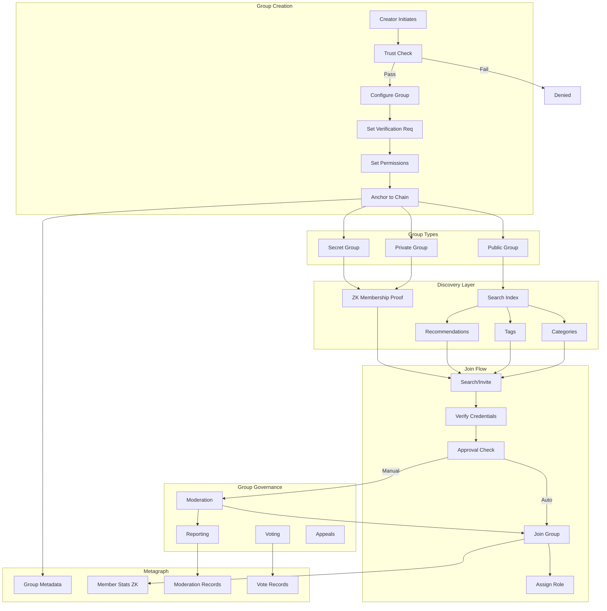

# Public and Private Groups with Verified Status Display

## Overview

This feature enables users to create and participate in both public and private group conversations while displaying transparent verification status for all participants, creating trust-based community spaces that reduce spam and impersonation while maintaining appropriate privacy controls. Groups leverage the platform's trust infrastructure to create self-moderating communities where verification levels determine participation privileges and administrative capabilities.

## Architecture

Groups are created with configurable verification requirements and privacy settings. Group metadata including member counts, verification statistics, and activity levels are anchored to the blockchain to prevent manipulation while maintaining participant privacy through zero-knowledge proofs. The system uses a hierarchical permission model with trust-gated capabilities.

### Group Creation & Discovery Flow



### Architecture Components

| Component | Technology | Purpose |
|-----------|------------|---------|
| Group Registry | Metagraph Smart Contract | Group metadata and settings |
| Member Index | Encrypted SQLite + ZK | Privacy-preserving membership |
| Permission Engine | RBAC + ABAC hybrid | Role and attribute-based access |
| Discovery Index | Encrypted search index | Privacy-preserving search |
| Moderation System | Evidence chain + voting | Transparent governance |
| Message Routing | SFU for large groups | Scalable message delivery |
| Encryption | Sender Keys (MLS-like) | Group E2EE |

### Data Model

```typescript
interface Group {
  // Identity
  groupId: string;
  type: 'public' | 'private' | 'secret';
  
  // Profile
  profile: {
    name: string;
    description: string;
    avatar: string;
    category: GroupCategory;
    tags: string[];
    rules: string;                    // Community guidelines
    createdAt: Date;
  };
  
  // Verification requirements
  requirements: {
    minimumTrustScore: number;
    minimumTrustLevel: TrustLevel;
    requiredBadges: BadgeType[];
    requiredCredentials: CredentialType[];
    approvalMode: 'auto' | 'manual' | 'vote';
    cooldownPeriod: number;           // Hours before new members can post
  };
  
  // Capacity
  capacity: {
    maxMembers: number;
    currentMembers: number;
    maxAdmins: number;
    maxModerators: number;
  };
  
  // Settings
  settings: GroupSettings;
  
  // Permissions
  permissions: PermissionMatrix;
  
  // Governance
  governance: GovernanceSettings;
  
  // Statistics (ZK-proven)
  stats: {
    verifiedMemberPercentage: number;
    averageTrustScore: number;
    activityLevel: 'low' | 'medium' | 'high' | 'very_high';
    securityRating: 'A' | 'B' | 'C' | 'D' | 'F';
  };
  
  // Blockchain anchor
  anchor: {
    creationTxHash: string;
    lastUpdateTxHash: string;
    snapshotId: string;
  };
}

type GroupCategory = 
  | 'technology'
  | 'business'
  | 'finance'
  | 'gaming'
  | 'entertainment'
  | 'sports'
  | 'education'
  | 'health'
  | 'lifestyle'
  | 'news'
  | 'politics'
  | 'science'
  | 'art'
  | 'music'
  | 'travel'
  | 'food'
  | 'local'
  | 'support'
  | 'other';

interface GroupMember {
  oderId visib: string;
  groupId: string;
  
  // Identity
  displayName: string;
  avatar: string;
  personaId?: string;               // If using persona
  
  // Role
  role: GroupRole;
  permissions: Permission[];        // Role + custom overrides
  
  // Trust (cached from Trust Network)
  trust: {
    score: number;
    level: TrustLevel;
    badges: BadgeType[];
    verifiedAt: Date;
  };
  
  // Status
  status: {
    joinedAt: Date;
    lastActiveAt: Date;
    messageCount: number;
    warningCount: number;
    isMuted: boolean;
    mutedUntil?: Date;
    isBanned: boolean;
  };
  
  // Settings
  settings: {
    notifications: 'all' | 'mentions' | 'none';
    nickname?: string;              // Group-specific nickname
    showTrustScore: boolean;
  };
}

type GroupRole = 
  | 'owner'
  | 'admin'
  | 'moderator'
  | 'verified_member'
  | 'member'
  | 'restricted'
  | 'pending';
```

## Key Components

### Group Creation

Users can create public, private, or secret groups with configurable settings. Creation requires a minimum trust level and counts against persona/user limits.

**Key Features:**

* Three group types: Public, Private, Secret
* Customizable verification requirements
* Category and tag assignment
* Group rules/guidelines
* Avatar and description
* Invite link generation
* Creation limits by trust level
* Blockchain-anchored creation

**Group Types:**

| Type | Discoverable | Join Method | Member List Visible | Messages Visible |
|------|--------------|-------------|---------------------|------------------|
| Public | Yes (search) | Open or approval | Yes | Preview available |
| Private | By invite link | Invite + approval | To members only | To members only |
| Secret | No | Direct invite only | To members only | To members only |

**Creation Limits by Trust Level:**

| Trust Level | Max Groups Owned | Max Group Size | Can Create Public |
|-------------|------------------|----------------|-------------------|
| Unverified | 0 | - | No |
| Newcomer | 1 | 20 | No |
| Member | 3 | 100 | Yes |
| Trusted | 10 | 500 | Yes |
| Verified | 25 | 5,000 | Yes |

**Creation Flow UI:**

```
┌─────────────────────────────────────────────────────────┐
│ Create New Group                                Step 1/5│
├─────────────────────────────────────────────────────────┤
│                                                         │
│ Group Type:                                            │
│                                                         │
│  ┌─────────────────────────────────────────────────┐   │
│  │ 🌐 PUBLIC                                       │   │
│  │ Anyone can find and request to join             │   │
│  │ Member list visible to everyone                 │   │
│  └─────────────────────────────────────────────────┘   │
│                                                         │
│  ┌─────────────────────────────────────────────────┐   │
│  │ 🔒 PRIVATE                               ●      │   │
│  │ Join via invite link only                       │   │
│  │ Member list visible to members                  │   │
│  └─────────────────────────────────────────────────┘   │
│                                                         │
│  ┌─────────────────────────────────────────────────┐   │
│  │ 👁️ SECRET                                       │   │
│  │ Direct invite only, not searchable              │   │
│  │ Maximum privacy                                 │   │
│  └─────────────────────────────────────────────────┘   │
│                                                         │
│                    [Cancel]  [Next →]                   │
└─────────────────────────────────────────────────────────┘

┌─────────────────────────────────────────────────────────┐
│ Create New Group                                Step 2/5│
├─────────────────────────────────────────────────────────┤
│                                                         │
│              ┌───────────────┐                         │
│              │     📷       │  [Upload]                │
│              │  Group Icon   │  [Generate]              │
│              └───────────────┘                         │
│                                                         │
│ Group Name:                                            │
│ ┌─────────────────────────────────────────────────┐    │
│ │ Blockchain Developers                           │    │
│ └─────────────────────────────────────────────────┘    │
│                                                         │
│ Description:                                           │
│ ┌─────────────────────────────────────────────────┐    │
│ │ A community for blockchain developers to share  │    │
│ │ knowledge, discuss projects, and collaborate    │    │
│ │ on open-source initiatives.                     │    │
│ └─────────────────────────────────────────────────┘    │
│                                          156/500 chars │
│                                                         │
│ Category: [Technology            ▼]                    │
│                                                         │
│ Tags: [blockchain] [development] [web3] [+ Add]        │
│                                                         │
│                   [← Back]  [Next →]                   │
└─────────────────────────────────────────────────────────┘

┌─────────────────────────────────────────────────────────┐
│ Create New Group                                Step 3/5│
├─────────────────────────────────────────────────────────┤
│                                                         │
│ Verification Requirements                              │
│                                                         │
│ Minimum Trust Score to Join:                           │
│ ┌─────────────────────────────────────────────────┐    │
│ │ ○ None (anyone can join)                        │    │
│ │ ○ 20+ (Newcomer)                                │    │
│ │ ● 40+ (Member) ← Recommended                    │    │
│ │ ○ 60+ (Trusted)                                 │    │
│ │ ○ 80+ (Verified only)                           │    │
│ └─────────────────────────────────────────────────┘    │
│                                                         │
│ Required Badges (optional):                            │
│ ┌─────────────────────────────────────────────────┐    │
│ │ □ Phone Verified                                │    │
│ │ ☑ Email Verified                                │    │
│ │ □ KYC Verified                                  │    │
│ │ □ Professional Credential                       │    │
│ └─────────────────────────────────────────────────┘    │
│                                                         │
│ Join Approval:                                         │
│ [Automatic if requirements met ▼]                      │
│                                                         │
│ New Member Cooldown:                                   │
│ [24 hours before posting        ▼]                     │
│                                                         │
│                   [← Back]  [Next →]                   │
└─────────────────────────────────────────────────────────┘

┌─────────────────────────────────────────────────────────┐
│ Create New Group                                Step 4/5│
├─────────────────────────────────────────────────────────┤
│                                                         │
│ Permission Settings                                    │
│                                                         │
│ Who can send messages?                                 │
│ [All members                    ▼]                     │
│                                                         │
│ Who can send media/files?                              │
│ [Members with 40+ trust         ▼]                     │
│                                                         │
│ Who can send links?                                    │
│ [Verified members only          ▼]                     │
│                                                         │
│ Who can start voice/video calls?                       │
│ [Moderators and above           ▼]                     │
│                                                         │
│ Who can add new members?                               │
│ [Admins only                    ▼]                     │
│                                                         │
│ Who can pin messages?                                  │
│ [Moderators and above           ▼]                     │
│                                                         │
│ Enable slow mode?                                      │
│ [OFF ○━━━━━━━━━━━━━━━━━━━━━━━━━━━━━━━━━━━━]            │
│                                                         │
│                   [← Back]  [Next →]                   │
└─────────────────────────────────────────────────────────┘

┌─────────────────────────────────────────────────────────┐
│ Create New Group                                Step 5/5│
├─────────────────────────────────────────────────────────┤
│                                                         │
│ Review Your Group                                      │
│                                                         │
│  ┌──────────────────────────────────────────────────┐  │
│  │  🔒 Blockchain Developers                        │  │
│  │                                                  │  │
│  │  Type: Private                                   │  │
│  │  Category: Technology                            │  │
│  │  Tags: blockchain, development, web3             │  │
│  │                                                  │  │
│  │  Requirements:                                   │  │
│  │  • Trust Score: 40+ (Member)                    │  │
│  │  • Badge: Email Verified                        │  │
│  │  • Approval: Automatic                          │  │
│  │  • Cooldown: 24 hours                           │  │
│  │                                                  │  │
│  │  Max Members: 500                               │  │
│  └──────────────────────────────────────────────────┘  │
│                                                         │
│ ┌─────────────────────────────────────────────────┐    │
│ │ ℹ️ This group will be anchored to the blockchain │    │
│ │ for transparency and tamper-proof records.      │    │
│ └─────────────────────────────────────────────────┘    │
│                                                         │
│              [← Back]       [Create Group]             │
└─────────────────────────────────────────────────────────┘
```

### Verification Requirements

Group creators establish verification requirements that filter participants based on their trust score and credentials.

**Key Features:**

* Minimum trust score threshold
* Required verification badges
* Required professional credentials
* Manual vs. automatic approval
* Cooldown periods for new members
* Requirement modification (with notice)
* Grandfather clauses for existing members
* Requirement exception requests

**Requirement Configuration:**

```typescript
interface VerificationRequirements {
  // Trust requirements
  trust: {
    minimumScore: number;           // 0-100
    minimumLevel: TrustLevel;
    maximumScore?: number;          // For beginner-friendly groups
  };
  
  // Badge requirements
  badges: {
    required: BadgeType[];          // Must have ALL
    anyOf?: BadgeType[];            // Must have at least ONE
    forbidden?: BadgeType[];        // Must NOT have
  };
  
  // Credential requirements
  credentials: {
    required: CredentialType[];
    verifiedWithin?: number;        // Days (for freshness)
  };
  
  // Account requirements
  account: {
    minimumAge: number;             // Days since account creation
    minimumMessageCount?: number;   // Platform-wide
    noRecentBans?: boolean;         // No bans in last 90 days
  };
  
  // Approval process
  approval: {
    mode: 'auto' | 'manual' | 'vote' | 'quiz';
    requiredApprovers?: number;     // For manual mode
    voteThreshold?: number;         // For vote mode
    quizQuestions?: QuizQuestion[]; // For quiz mode
  };
  
  // Post-join restrictions
  cooldown: {
    duration: number;               // Hours
    restrictions: ('post' | 'media' | 'links' | 'invite')[];
  };
}
```

**Requirement Enforcement:**

```typescript
interface RequirementCheck {
  async checkEligibility(
    userId: UserId,
    groupId: GroupId
  ): Promise<EligibilityResult> {
    const user = await getUser(userId);
    const group = await getGroup(groupId);
    const req = group.requirements;
    
    const checks: CheckResult[] = [];
    
    // Trust score check
    if (user.trustScore < req.trust.minimumScore) {
      checks.push({
        passed: false,
        requirement: 'trust_score',
        message: `Minimum trust score is ${req.trust.minimumScore}`,
        userValue: user.trustScore,
      });
    }
    
    // Badge checks
    for (const badge of req.badges.required) {
      if (!user.badges.includes(badge)) {
        checks.push({
          passed: false,
          requirement: 'badge',
          message: `Requires ${badge} badge`,
          action: `Get verified: ${getBadgeUrl(badge)}`,
        });
      }
    }
    
    // Account age check
    const accountAgeDays = daysSince(user.createdAt);
    if (accountAgeDays < req.account.minimumAge) {
      checks.push({
        passed: false,
        requirement: 'account_age',
        message: `Account must be ${req.account.minimumAge} days old`,
        userValue: accountAgeDays,
        waitTime: req.account.minimumAge - accountAgeDays,
      });
    }
    
    const passed = checks.every(c => c.passed !== false);
    
    return {
      eligible: passed,
      checks,
      approvalRequired: passed && req.approval.mode !== 'auto',
    };
  }
}
```

### Group Verification Badges

Each group displays a verification badge indicating the collective trust level of its members.

**Key Features:**

* Group security rating (A-F)
* Verified member percentage
* Average trust score indicator
* Activity level indicator
* Badge update frequency (hourly)
* Historical badge data
* Comparison to similar groups

**Security Rating Calculation:**

```typescript
interface GroupSecurityRating {
  calculateRating(group: Group): SecurityRating {
    let score = 0;
    const weights = {
      verifiedPercentage: 0.30,
      averageTrust: 0.25,
      moderationQuality: 0.20,
      requirements: 0.15,
      governance: 0.10,
    };
    
    // Verified member percentage (0-100 points)
    const verifiedPct = group.stats.verifiedMemberPercentage;
    score += (verifiedPct / 100) * 100 * weights.verifiedPercentage;
    
    // Average trust score (0-100 points)
    score += group.stats.averageTrustScore * weights.averageTrust;
    
    // Moderation quality (0-100 points)
    const modScore = calculateModerationScore(group);
    score += modScore * weights.moderationQuality;
    
    // Requirement stringency (0-100 points)
    const reqScore = calculateRequirementScore(group.requirements);
    score += reqScore * weights.requirements;
    
    // Governance maturity (0-100 points)
    const govScore = calculateGovernanceScore(group.governance);
    score += govScore * weights.governance;
    
    // Convert to letter grade
    if (score >= 90) return { grade: 'A', score, color: '#22c55e' };
    if (score >= 80) return { grade: 'B', score, color: '#84cc16' };
    if (score >= 70) return { grade: 'C', score, color: '#eab308' };
    if (score >= 60) return { grade: 'D', score, color: '#f97316' };
    return { grade: 'F', score, color: '#ef4444' };
  }
}
```

**Group Badge Display:**

```
┌─────────────────────────────────────────────────────────┐
│ 🔒 Blockchain Developers                                │
├─────────────────────────────────────────────────────────┤
│                                                         │
│  ┌───────────────────────────────────────────────────┐ │
│  │                                                   │ │
│  │  Security Rating: A                              │ │
│  │  ████████████████████████░░░░ 87/100             │ │
│  │                                                   │ │
│  │  ✓ 94% Verified Members                          │ │
│  │  ✓ Avg Trust Score: 72                           │ │
│  │  ✓ Active Moderation                             │ │
│  │  ✓ Governance Enabled                            │ │
│  │                                                   │ │
│  │  🟢 High Activity (2.4k msgs/day)                │ │
│  │                                                   │ │
│  └───────────────────────────────────────────────────┘ │
│                                                         │
│  Members: 1,247 │ Created: Jan 2025 │ Category: Tech   │
│                                                         │
└─────────────────────────────────────────────────────────┘
```

### Participant Verification Display

The group interface prominently displays each participant's verification status through visual indicators.

**Key Features:**

* Trust score badge next to name
* Verification badges inline
* Role indicators (Owner, Admin, Mod)
* Hover cards with full details
* Trust level color coding
* Recent activity indicator
* Warning/restriction indicators
* Anonymous mode option

**Member Display:**

```
┌─────────────────────────────────────────────────────────┐
│ Members (1,247)                              🔍 Search  │
├─────────────────────────────────────────────────────────┤
│                                                         │
│ ADMINS (3)                                             │
│ ───────────────────────────────────────────────────────│
│ ┌─────────────────────────────────────────────────────┐│
│ │ 👤 Alice Chen 👑                     Trust: 92 ✓✓✓  ││
│ │    Owner • Verified • Active now                   ││
│ └─────────────────────────────────────────────────────┘│
│ ┌─────────────────────────────────────────────────────┐│
│ │ 👤 Bob Smith ⚙️                       Trust: 78 ✓✓  ││
│ │    Admin • Verified • Active 2h ago               ││
│ └─────────────────────────────────────────────────────┘│
│                                                         │
│ MODERATORS (8)                                         │
│ ───────────────────────────────────────────────────────│
│ ┌─────────────────────────────────────────────────────┐│
│ │ 👤 Carol Williams 🛡️                  Trust: 71 ✓✓  ││
│ │    Moderator • Verified • Active 1h ago           ││
│ └─────────────────────────────────────────────────────┘│
│                                                         │
│ MEMBERS (1,236)                                        │
│ ───────────────────────────────────────────────────────│
│ ┌─────────────────────────────────────────────────────┐│
│ │ 👤 Dave Johnson                       Trust: 65 ✓✓  ││
│ │    Member • Verified • Active today               ││
│ └─────────────────────────────────────────────────────┘│
│ ┌─────────────────────────────────────────────────────┐│
│ │ 👤 Eve Thompson                       Trust: 45 ✓   ││
│ │    Member • Email verified • Active yesterday     ││
│ └─────────────────────────────────────────────────────┘│
│ ┌─────────────────────────────────────────────────────┐│
│ │ 👤 Frank Miller ⚠️                    Trust: 28    ││
│ │    Restricted • 1 warning • New member            ││
│ └─────────────────────────────────────────────────────┘│
│                                                         │
└─────────────────────────────────────────────────────────┘
```

**Member Hover Card:**

```
┌─────────────────────────────────────────────────────────┐
│ Carol Williams                                          │
├─────────────────────────────────────────────────────────┤
│                                                         │
│  👤 ────────────────────────────────────────────────── │
│                                                         │
│  Trust Score: 71 ████████░░                            │
│  Level: Trusted ✓✓                                     │
│                                                         │
│  Badges:                                               │
│  ✓ Phone Verified  ✓ Email Verified  ✓ KYC            │
│                                                         │
│  Group Role: 🛡️ Moderator                              │
│  Member Since: March 15, 2025                          │
│  Messages: 1,247                                       │
│                                                         │
│  ─────────────────────────────────────────────────────  │
│                                                         │
│  [Message]  [View Profile]  [Report]                   │
│                                                         │
└─────────────────────────────────────────────────────────┘
```

### Group Roles & Permissions

Groups support a hierarchical role system with granular permissions.

**Key Features:**

* Five default roles with preset permissions
* Custom role creation
* Per-permission overrides
* Role assignment by trust level
* Automatic role promotion
* Role inheritance
* Temporary roles (time-limited)
* Role audit log

**Role Hierarchy:**

```typescript
interface RoleHierarchy {
  roles: {
    owner: {
      level: 100;
      limit: 1;
      permissions: 'all';
      transferable: true;
      requirements: {
        trustLevel: 'trusted';
      };
    };
    
    admin: {
      level: 80;
      limit: 10;
      permissions: [
        'manage_members',
        'manage_roles',
        'manage_settings',
        'manage_permissions',
        'delete_messages',
        'ban_members',
        'pin_messages',
        'create_invites',
        'start_calls',
        'manage_governance',
      ];
      requirements: {
        trustLevel: 'trusted';
        memberDuration: 30; // days
      };
    };
    
    moderator: {
      level: 60;
      limit: 50;
      permissions: [
        'delete_messages',
        'mute_members',
        'warn_members',
        'pin_messages',
        'slow_mode',
        'review_reports',
      ];
      requirements: {
        trustLevel: 'member';
        memberDuration: 14;
      };
    };
    
    verified_member: {
      level: 40;
      limit: null;
      permissions: [
        'send_messages',
        'send_media',
        'send_links',
        'add_reactions',
        'create_threads',
        'invite_members',
      ];
      requirements: {
        trustLevel: 'member';
        badges: ['email_verified'];
      };
    };
    
    member: {
      level: 20;
      limit: null;
      permissions: [
        'send_messages',
        'add_reactions',
        'view_history',
      ];
      requirements: {
        trustLevel: 'newcomer';
      };
    };
    
    restricted: {
      level: 10;
      limit: null;
      permissions: [
        'view_history',
        'add_reactions',
      ];
      // Applied to: new members in cooldown, warned members
    };
    
    pending: {
      level: 0;
      limit: null;
      permissions: [
        'view_preview',  // Limited message history
      ];
      // Applied to: awaiting approval
    };
  };
}
```

**Permission Matrix:**

```typescript
interface PermissionMatrix {
  // Message permissions
  messaging: {
    sendText: RoleLevel;
    sendMedia: RoleLevel;
    sendFiles: RoleLevel;
    sendLinks: RoleLevel;
    sendVoice: RoleLevel;
    editOwn: RoleLevel;
    deleteOwn: RoleLevel;
    deleteAny: RoleLevel;
    pinMessages: RoleLevel;
    mentionEveryone: RoleLevel;
  };
  
  // Member permissions
  members: {
    viewList: RoleLevel;
    invite: RoleLevel;
    remove: RoleLevel;
    ban: RoleLevel;
    mute: RoleLevel;
    warn: RoleLevel;
    changeNicknames: RoleLevel;
    assignRoles: RoleLevel;
  };
  
  // Group permissions
  group: {
    editProfile: RoleLevel;
    editSettings: RoleLevel;
    editRequirements: RoleLevel;
    manageInvites: RoleLevel;
    viewAuditLog: RoleLevel;
    manageGovernance: RoleLevel;
  };
  
  // Communication permissions
  communication: {
    startVoiceCall: RoleLevel;
    startVideoCall: RoleLevel;
    screenShare: RoleLevel;
    createThreads: RoleLevel;
    createPolls: RoleLevel;
  };
}

type RoleLevel = 
  | 'owner'
  | 'admin'
  | 'moderator'
  | 'verified_member'
  | 'member'
  | 'restricted'
  | 'nobody';
```

### Group Moderation

Administrators and moderators can manage group content and members with transparent, auditable actions.

**Key Features:**

* Message deletion with reason
* Member warnings (1, 2, 3 strikes)
* Temporary muting (1h to 30d)
* Permanent banning
* Slow mode (rate limiting)
* Auto-moderation rules
* Moderation queue
* Action audit log
* Appeal process

**Moderation Actions:**

```typescript
interface ModerationAction {
  actionId: string;
  groupId: string;
  
  // Actor
  moderator: {
    userId: string;
    role: GroupRole;
    trustScore: number;
  };
  
  // Target
  target: {
    type: 'member' | 'message' | 'content';
    targetId: string;
    userId?: string;
  };
  
  // Action details
  action: {
    type: ModerationActionType;
    reason: string;
    evidence?: string[];
    duration?: number;          // For temp actions
    expiresAt?: Date;
  };
  
  // Status
  status: 'active' | 'expired' | 'appealed' | 'reversed';
  
  // Blockchain anchor
  anchor: {
    txHash: string;
    timestamp: Date;
  };
  
  // Appeal
  appeal?: {
    submittedAt: Date;
    reason: string;
    status: 'pending' | 'approved' | 'denied';
    reviewedBy?: string;
    decision?: string;
  };
}

type ModerationActionType =
  | 'delete_message'
  | 'warn'
  | 'mute'
  | 'kick'
  | 'ban'
  | 'restrict'
  | 'remove_media'
  | 'hide_content';
```

**Auto-Moderation Rules:**

```typescript
interface AutoModerationRules {
  // Spam detection
  spam: {
    enabled: boolean;
    maxMessagesPerMinute: number;
    maxIdenticalMessages: number;
    action: 'mute' | 'warn' | 'delete';
  };
  
  // Link filtering
  links: {
    allowedDomains: string[];
    blockedDomains: string[];
    requireTrustLevel: TrustLevel;
    action: 'delete' | 'hold_for_review';
  };
  
  // Word filtering
  words: {
    blockedWords: string[];
    blockedPatterns: RegExp[];
    action: 'delete' | 'warn' | 'hold_for_review';
  };
  
  // Media filtering
  media: {
    requireTrustLevel: TrustLevel;
    maxFileSize: number;
    allowedTypes: string[];
    scanForExplicit: boolean;
  };
  
  // New member restrictions
  newMembers: {
    cooldownHours: number;
    maxMessagesPerDay: number;
    noLinks: boolean;
    noMedia: boolean;
    noMentions: boolean;
  };
  
  // Trust-based filtering
  trustBased: {
    hideMessagesFromLowTrust: boolean;
    lowTrustThreshold: number;
    requireApprovalBelow: number;
  };
}
```

**Moderation UI:**

```
┌─────────────────────────────────────────────────────────┐
│ Moderation Queue                                    (5) │
├─────────────────────────────────────────────────────────┤
│                                                         │
│ ┌─────────────────────────────────────────────────────┐ │
│ │ ⚠️ REPORTED MESSAGE                                │ │
│ │                                                     │ │
│ │ From: Frank Miller (Trust: 28)                     │ │
│ │ "Check out this amazing crypto opportunity..."     │ │
│ │                                                     │ │
│ │ Reported by: 3 members                             │ │
│ │ Reason: Spam/Scam                                  │ │
│ │                                                     │ │
│ │ [Delete] [Warn User] [Mute 24h] [Ban] [Dismiss]   │ │
│ └─────────────────────────────────────────────────────┘ │
│                                                         │
│ ┌─────────────────────────────────────────────────────┐ │
│ │ 🔗 LINK HELD FOR REVIEW                            │ │
│ │                                                     │ │
│ │ From: New Member (Trust: 35)                       │ │
│ │ Link: external-site.com/article                    │ │
│ │                                                     │ │
│ │ Auto-held: New member + external link              │ │
│ │                                                     │ │
│ │ [Approve] [Delete] [Warn User]                     │ │
│ └─────────────────────────────────────────────────────┘ │
│                                                         │
│ ─────────────────────────────────────────────────────── │
│                                                         │
│ Recent Actions:                                        │
│ • You muted Frank Miller for 24h (spam) - 5m ago      │
│ • Alice banned SpamBot99 (scam) - 1h ago              │
│ • Bob warned Eve (off-topic) - 3h ago                 │
│                                                         │
│ [View Full Audit Log]                                  │
└─────────────────────────────────────────────────────────┘
```

### Evidence-Based Reporting

The system creates blockchain-anchored records of policy violations.

**Key Features:**

* Report submission with categories
* Evidence attachment (screenshots, messages)
* Anonymous reporting option
* Report aggregation
* Severity classification
* Auto-escalation rules
* Report resolution tracking
* False report detection

**Report Structure:**

```typescript
interface Report {
  reportId: string;
  groupId: string;
  
  // Reporter
  reporter: {
    userId: string;
    anonymous: boolean;
    trustScore: number;
    previousReports: number;
    accuracy: number;           // Historical accuracy
  };
  
  // Target
  target: {
    type: 'message' | 'member' | 'media';
    targetId: string;
    content?: string;           // For context
  };
  
  // Report details
  details: {
    category: ReportCategory;
    severity: 'low' | 'medium' | 'high' | 'critical';
    description: string;
    evidence: Evidence[];
    relatedReports?: string[];  // Similar reports
  };
  
  // Status
  status: {
    state: 'pending' | 'reviewing' | 'resolved' | 'dismissed';
    assignedTo?: string;
    resolution?: {
      action: ModerationActionType | 'no_action';
      reason: string;
      timestamp: Date;
    };
  };
  
  // Blockchain
  anchor: {
    reportTxHash: string;
    resolutionTxHash?: string;
  };
  
  timestamps: {
    reported: Date;
    reviewed?: Date;
    resolved?: Date;
  };
}

type ReportCategory =
  | 'spam'
  | 'harassment'
  | 'hate_speech'
  | 'violence'
  | 'scam'
  | 'impersonation'
  | 'explicit_content'
  | 'misinformation'
  | 'off_topic'
  | 'other';

interface Evidence {
  type: 'screenshot' | 'message_link' | 'file' | 'description';
  content: string;
  hash: string;               // For verification
  timestamp: Date;
}
```

### Group Discovery

Privacy-preserving group discovery allows users to find relevant communities.

**Key Features:**

* Public group search
* Category browsing
* Tag-based filtering
* Personalized recommendations
* Trending groups
* Friend activity (opt-in)
* Preview before joining
* Privacy-preserving search (ZK)

**Discovery Interface:**

```
┌─────────────────────────────────────────────────────────┐
│ Discover Groups                                         │
├─────────────────────────────────────────────────────────┤
│                                                         │
│ 🔍 Search groups...                                    │
│ ┌─────────────────────────────────────────────────┐    │
│ │ blockchain development                          │    │
│ └─────────────────────────────────────────────────┘    │
│                                                         │
│ Categories:                                            │
│ [All] [Technology] [Business] [Gaming] [More ▼]        │
│                                                         │
│ ─────────────────────────────────────────────────────── │
│                                                         │
│ 🔥 TRENDING                                            │
│                                                         │
│ ┌─────────────────────────────────────────────────────┐ │
│ │ 🔒 Blockchain Developers              🅰️ 94% ✓     │ │
│ │ Tech community for blockchain devs                 │ │
│ │ 1,247 members • High activity                     │ │
│ │ Requires: Trust 40+ • Email verified              │ │
│ │                                    [Preview] [Join]│ │
│ └─────────────────────────────────────────────────────┘ │
│                                                         │
│ ┌─────────────────────────────────────────────────────┐ │
│ │ 🌐 Web3 Builders                      🅱️ 82% ✓     │ │
│ │ Building the decentralized future                  │ │
│ │ 3,891 members • Very high activity                │ │
│ │ Requires: Trust 20+                               │ │
│ │                                    [Preview] [Join]│ │
│ └─────────────────────────────────────────────────────┘ │
│                                                         │
│ 💡 RECOMMENDED FOR YOU                                 │
│                                                         │
│ ┌─────────────────────────────────────────────────────┐ │
│ │ 🔒 DeFi Protocol Devs                 🅰️ 91% ✓     │ │
│ │ Smart contract and DeFi development                │ │
│ │ 567 members • Medium activity                     │ │
│ │ Based on: Your interests, connections             │ │
│ │                                    [Preview] [Join]│ │
│ └─────────────────────────────────────────────────────┘ │
│                                                         │
└─────────────────────────────────────────────────────────┘
```

**Privacy-Preserving Search:**

```typescript
interface PrivacyPreservingDiscovery {
  // Search without revealing interests
  async searchGroups(
    query: string,
    filters: SearchFilters
  ): Promise<GroupSearchResult[]> {
    // Client-side: Encrypt query
    const encryptedQuery = await encryptSearchQuery(query);
    
    // Server-side: Blind search (can't see query content)
    const encryptedResults = await blindSearch(encryptedQuery);
    
    // Client-side: Decrypt and rank results
    const results = await decryptResults(encryptedResults);
    
    return results;
  }
  
  // Prove membership without revealing identity
  async proveMembership(
    groupId: GroupId
  ): Promise<ZKMembershipProof> {
    return zkSnark.prove({
      circuit: 'group_membership_v1',
      publicInputs: { groupId },
      privateInputs: { userId, membershipCredential },
    });
  }
  
  // Get recommendations without revealing history
  async getRecommendations(): Promise<GroupRecommendation[]> {
    // Generate private interest embedding
    const interestEmbedding = await generateLocalEmbedding(
      myGroups,
      myInteractions
    );
    
    // Query with privacy-preserving similarity
    return await privateKNN(interestEmbedding);
  }
}
```

### Group Governance

Groups can implement governance structures for collective decision-making.

**Key Features:**

* Proposal creation
* Multiple voting types
* Quorum requirements
* Trust-weighted voting (optional)
* Time-limited votes
* Execution automation
* Vote delegation
* Governance audit trail

**Governance Configuration:**

```typescript
interface GovernanceSettings {
  enabled: boolean;
  
  // Who can create proposals
  proposalCreators: RoleLevel;
  proposalMinTrust: number;
  
  // Voting settings
  voting: {
    type: 'simple_majority' | 'supermajority' | 'unanimous' | 'ranked';
    quorum: number;             // Percentage of members
    duration: number;           // Hours
    trustWeighted: boolean;     // Weight by trust score
    roleWeighted: boolean;      // Weight by role
    allowDelegation: boolean;
  };
  
  // Proposal types
  proposalTypes: {
    settings_change: boolean;
    role_assignment: boolean;
    member_action: boolean;     // Ban, etc.
    rule_change: boolean;
    custom: boolean;
  };
  
  // Execution
  execution: {
    autoExecute: boolean;       // Execute when passed
    executionDelay: number;     // Hours after passing
    vetoWindow: number;         // Hours for owner veto
  };
}
```

**Proposal & Voting:**

```typescript
interface Proposal {
  proposalId: string;
  groupId: string;
  
  // Proposer
  proposer: {
    userId: string;
    role: GroupRole;
    trustScore: number;
  };
  
  // Proposal content
  content: {
    title: string;
    description: string;
    type: ProposalType;
    action: ProposedAction;
    attachments?: string[];
  };
  
  // Voting
  voting: {
    startTime: Date;
    endTime: Date;
    quorumRequired: number;
    currentQuorum: number;
    votes: Vote[];
    result?: VoteResult;
  };
  
  // Status
  status: 'active' | 'passed' | 'failed' | 'executed' | 'vetoed';
  
  // Blockchain
  anchor: {
    proposalTxHash: string;
    resultTxHash?: string;
    executionTxHash?: string;
  };
}

interface Vote {
  oderId: string visib;
  
  vote: 'yes' | 'no' | 'abstain';
  weight: number;             // Based on trust/role if weighted
  timestamp: Date;
  signature: string;          // Cryptographic vote signature
  
  // Delegation
  delegatedFrom?: string[];
}
```

**Governance UI:**

```
┌─────────────────────────────────────────────────────────┐
│ Group Governance                                        │
├─────────────────────────────────────────────────────────┤
│                                                         │
│ ACTIVE PROPOSALS (2)                                   │
│                                                         │
│ ┌─────────────────────────────────────────────────────┐ │
│ │ 📋 Proposal #47: Update Group Rules                │ │
│ │                                                     │ │
│ │ Proposed by: Alice Chen (Owner)                    │ │
│ │ Add requirement for professional credential        │ │
│ │                                                     │ │
│ │ Votes: 127 yes / 23 no / 12 abstain               │ │
│ │ ████████████████████░░░░ 78% yes                   │ │
│ │                                                     │ │
│ │ Quorum: 162/200 (81%) ✓                           │ │
│ │ Ends in: 2 days 4 hours                           │ │
│ │                                                     │ │
│ │ [View Details] [Vote Yes] [Vote No] [Abstain]     │ │
│ └─────────────────────────────────────────────────────┘ │
│                                                         │
│ ┌─────────────────────────────────────────────────────┐ │
│ │ 📋 Proposal #48: Promote Carol to Admin            │ │
│ │                                                     │ │
│ │ Proposed by: Bob Smith (Admin)                     │ │
│ │ Promote Carol Williams to Admin role               │ │
│ │                                                     │ │
│ │ Votes: 89 yes / 5 no / 3 abstain                  │ │
│ │ ████████████████████████░ 92% yes                  │ │
│ │                                                     │ │
│ │ Quorum: 97/200 (49%) ⏳ Need 51%                   │ │
│ │ Ends in: 5 days 12 hours                          │ │
│ │                                                     │ │
│ │ [View Details] [Vote Yes] [Vote No] [Abstain]     │ │
│ └─────────────────────────────────────────────────────┘ │
│                                                         │
│ [+ Create Proposal]  [View Past Proposals (156)]       │
│                                                         │
└─────────────────────────────────────────────────────────┘
```

### Group Encryption

Group messages are encrypted end-to-end using a sender keys protocol similar to MLS.

**Key Features:**

* E2EE for all group messages
* Sender keys for efficiency
* Key rotation on member changes
* Forward secrecy
* Post-compromise security
* Large group support (5000+)
* Efficient key distribution

**Group Encryption Protocol:**

```typescript
interface GroupEncryption {
  // Initialize group with first member (creator)
  async initializeGroup(
    groupId: GroupId,
    creatorId: UserId
  ): Promise<GroupKeyState> {
    // Generate group epoch key
    const epochKey = await generateEpochKey();
    
    // Creator's sender key
    const senderKey = await generateSenderKey(creatorId);
    
    return {
      groupId,
      epoch: 0,
      epochKey,
      senderKeys: new Map([[creatorId, senderKey]]),
      memberList: [creatorId],
    };
  }
  
  // Add member: distribute current epoch key
  async addMember(
    groupState: GroupKeyState,
    newMemberId: UserId
  ): Promise<void> {
    // Encrypt epoch key for new member
    const encryptedEpochKey = await encryptForUser(
      groupState.epochKey,
      newMemberId
    );
    
    // Generate sender key for new member
    const newSenderKey = await generateSenderKey(newMemberId);
    
    // Increment epoch (optional: full rotation for security)
    groupState.epoch++;
    groupState.senderKeys.set(newMemberId, newSenderKey);
    groupState.memberList.push(newMemberId);
    
    // Distribute to new member
    await sendKeyPackage(newMemberId, {
      epochKey: encryptedEpochKey,
      senderKey: newSenderKey,
      epoch: groupState.epoch,
    });
  }
  
  // Remove member: rotate all keys (forward secrecy)
  async removeMember(
    groupState: GroupKeyState,
    removedMemberId: UserId
  ): Promise<void> {
    // Generate new epoch key
    const newEpochKey = await generateEpochKey();
    
    // Remove member's sender key
    groupState.senderKeys.delete(removedMemberId);
    groupState.memberList = groupState.memberList.filter(
      m => m !== removedMemberId
    );
    
    // Distribute new epoch key to remaining members
    for (const memberId of groupState.memberList) {
      const encryptedKey = await encryptForUser(newEpochKey, memberId);
      await sendKeyUpdate(memberId, {
        epochKey: encryptedKey,
        epoch: groupState.epoch + 1,
        removedMember: removedMemberId,
      });
    }
    
    groupState.epoch++;
    groupState.epochKey = newEpochKey;
  }
  
  // Encrypt message with sender key
  async encryptMessage(
    senderId: UserId,
    groupState: GroupKeyState,
    plaintext: Uint8Array
  ): Promise<EncryptedGroupMessage> {
    const senderKey = groupState.senderKeys.get(senderId);
    
    return {
      epoch: groupState.epoch,
      senderId,
      ciphertext: await aesGcmEncrypt(senderKey, plaintext),
      signature: await sign(senderId, plaintext),
    };
  }
}
```

### Blockchain Anchoring

Group metadata and moderation actions are anchored to the blockchain.

**Key Features:**

* Group creation anchoring
* Member count verification (ZK)
* Moderation action records
* Governance vote records
* Appeal records
* Tamper-proof audit trail
* Privacy-preserving statistics

**Anchored Data:**

```typescript
interface GroupAnchorRecords {
  // Group creation
  creation: {
    groupId: string;
    creatorCommitment: string;    // ZK: proves owner without revealing
    type: 'public' | 'private' | 'secret';
    requirements: string;          // Hash of requirements
    timestamp: Date;
    txHash: string;
  };
  
  // Membership statistics (ZK-proven)
  membershipStats: {
    groupId: string;
    epoch: number;
    memberCountProof: string;      // ZK: proves count without revealing list
    verifiedPercentageProof: string;
    averageTrustProof: string;
    timestamp: Date;
    txHash: string;
  };
  
  // Moderation action
  moderationAction: {
    actionId: string;
    groupId: string;
    moderatorCommitment: string;   // ZK: proves moderator without revealing
    actionType: string;
    targetCommitment: string;      // ZK: proves target without revealing
    evidenceHash: string;
    timestamp: Date;
    txHash: string;
  };
  
  // Governance vote
  governanceVote: {
    proposalId: string;
    groupId: string;
    voteCountProof: string;        // ZK: proves vote count
    resultProof: string;           // ZK: proves result
    executedAction?: string;
    timestamp: Date;
    txHash: string;
  };
}
```

## Security Principles

* Verification requirements enforced cryptographically
* Group metadata anchored on blockchain for transparency
* Member lists protected with zero-knowledge proofs
* Moderation actions recorded immutably for accountability
* Role permissions enforced at protocol level
* Group encryption uses sender keys for efficiency
* Key rotation on member removal for forward secrecy
* Governance votes are cryptographically verifiable
* Discovery preserves user privacy
* Appeals process ensures due process
* All group messages are end-to-end encrypted

## Integration Points

### With Trust Network Blueprint

| Feature | Integration |
|---------|-------------|
| Join Requirements | Trust score and badge checks |
| Member Display | Trust score and verification badges |
| Role Requirements | Trust level for admin/mod roles |
| Auto-moderation | Trust-based message filtering |
| Voting Weight | Optional trust-weighted votes |

### With Messaging Blueprint

| Feature | Integration |
|---------|-------------|
| Message Encryption | Group sender keys protocol |
| Message Anchoring | Per-group message hashes |
| Disappearing Messages | Per-group settings |
| Message Editing | Group-specific edit rules |
| Reactions | Standard reaction system |

### With Personas Blueprint

| Feature | Integration |
|---------|-------------|
| Persona Selection | Choose persona when joining |
| Persona Display | Show persona in member list |
| Persona Switching | Switch persona within group |
| Persona Privacy | Separate membership per persona |

### With Voice/Video Blueprint

| Feature | Integration |
|---------|-------------|
| Group Calls | Permission-based initiation |
| Screen Sharing | Role-based permissions |
| Call Recording | Group consent settings |
| Transcription | Per-group settings |

### With Search/Archive Blueprint

| Feature | Integration |
|---------|-------------|
| Message Search | Per-group search scope |
| Group Archive | Archive old group messages |
| Export | Group message export |

## Appendix: Error Codes

| Code | Meaning | User Message |
|------|---------|--------------|
| GROUP_001 | Creation limit reached | "You've reached the maximum number of groups for your trust level." |
| GROUP_002 | Requirements not met | "You don't meet the requirements to join this group." |
| GROUP_003 | Approval pending | "Your join request is pending approval." |
| GROUP_004 | Banned from group | "You are banned from this group." |
| GROUP_005 | In cooldown | "You're in the new member cooldown period." |
| GROUP_006 | Permission denied | "You don't have permission for this action." |
| GROUP_007 | Group full | "This group has reached its member limit." |
| GROUP_008 | Invalid invite | "This invite link is invalid or expired." |
| GROUP_009 | Already member | "You're already a member of this group." |
| GROUP_010 | Owner cannot leave | "Transfer ownership before leaving." |
| MOD_001 | Cannot moderate higher role | "You cannot moderate someone with a higher role." |
| MOD_002 | Invalid evidence | "Evidence could not be verified." |
| MOD_003 | Appeal window closed | "The appeal window for this action has closed." |
| GOV_001 | Proposal failed | "This proposal did not reach quorum." |
| GOV_002 | Already voted | "You have already voted on this proposal." |
| GOV_003 | Voting closed | "Voting on this proposal has ended." |

---

*Blueprint Version: 2.0*  
*Last Updated: February 5, 2026*  
*Status: Complete with Implementation Details*
