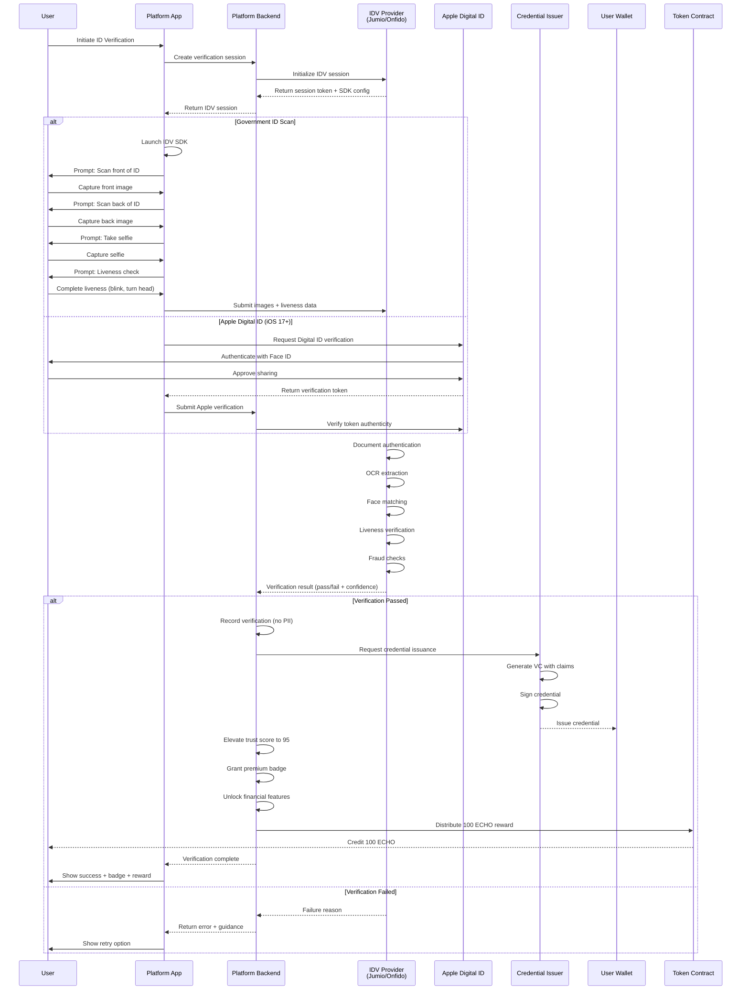

# In-App High-Assurance Identity Verification and Reward

## Overview

This feature provides an optional, in-app workflow for users to generate a high-assurance Verifiable Credential by verifying their government-issued photo ID. This process enables the highest level of trust on the platform (Trust Score 95+), unlocks advanced financial features, and rewards users with 100 ECHO tokens for their participation. The verification complies with NIST 800-63-3 Identity Assurance Level 2 (IAL2) standards.

## Architecture

Users can initiate verification from their profile to maximize their trust score and unlock payment capabilities. The system integrates with certified identity proofing services (Jumio, Onfido, or Persona) that comply with NIST 800-63-3 IAL2 standards. Raw identity data is processed exclusively by the third-party identity verification partner—the application never sees, stores, or processes actual PII. Upon successful verification, a high-assurance Verifiable Credential is issued to the user's wallet, their trust score is elevated to the highest tier, and they receive 100 ECHO tokens.

### Identity Verification Flow



### Architecture Components

| Component | Technology | Purpose |
|-----------|------------|---------|
| IDV Provider | Jumio / Onfido / Persona | Document verification, liveness |
| Document Scanner | IDV SDK (native) | Capture ID images |
| Liveness Detection | IDV SDK (3D liveness) | Prevent spoofing |
| Face Matching | IDV biometric engine | Match selfie to ID photo |
| Apple Digital ID | PassKit (iOS 17+) | Privacy-preserving verification |
| Credential Issuer | Platform signing service | Issue VCs |
| Trust Engine | Platform service | Calculate and update scores |
| Token Contract | ECHO Metagraph | Distribute rewards |

### NIST 800-63-3 IAL2 Compliance

| Requirement | Implementation |
|-------------|----------------|
| Evidence Collection | Government-issued photo ID (1 piece SUPERIOR evidence) |
| Evidence Validation | Document authentication via IDV provider |
| Identity Verification | Biometric comparison (selfie to ID photo) |
| Liveness Detection | 3D liveness with anti-spoofing |
| Address Verification | Optional (not required for IAL2) |
| Resolution | Verify identity is real and unique |
| Fraud Detection | IDV provider fraud signals |

### Data Model

```typescript
// Verification Session
interface VerificationSession {
  sessionId: string;
  userId: string;
  
  // Session configuration
  config: {
    provider: IDVProvider;
    workflowId: string;
    allowedDocuments: DocumentType[];
    requiredChecks: VerificationCheck[];
    locale: string;
  };
  
  // Status tracking
  status: VerificationStatus;
  steps: VerificationStep[];
  
  // Timestamps
  createdAt: Date;
  startedAt?: Date;
  completedAt?: Date;
  expiresAt: Date;
  
  // Result (no PII stored)
  result?: {
    outcome: 'approved' | 'declined' | 'review';
    confidenceScore: number;
    checks: CheckResult[];
    
    // Only store verification facts, not PII
    verifiedFacts: {
      documentType: DocumentType;
      issuingCountry: string;
      ageVerified: boolean;
      documentNotExpired: boolean;
      facesMatch: boolean;
      livenessConfirmed: boolean;
    };
    
    // IDV reference (for disputes)
    providerReference: string;
  };
  
  // Credential issuance
  credential?: {
    credentialId: string;
    issuedAt: Date;
    expiresAt: Date;
  };
  
  // Reward
  reward?: {
    amount: number;
    transactionId: string;
    distributedAt: Date;
  };
  
  // Retry tracking
  attempts: VerificationAttempt[];
}

type IDVProvider = 'jumio' | 'onfido' | 'persona' | 'apple_digital_id';

type DocumentType =
  | 'passport'
  | 'drivers_license'
  | 'national_id'
  | 'residence_permit'
  | 'visa';

type VerificationStatus =
  | 'created'
  | 'started'
  | 'documents_submitted'
  | 'processing'
  | 'approved'
  | 'declined'
  | 'expired'
  | 'cancelled';

type VerificationCheck =
  | 'document_authenticity'
  | 'document_not_expired'
  | 'face_match'
  | 'liveness'
  | 'fraud_detection'
  | 'watchlist'
  | 'age_verification';

interface VerificationStep {
  step: 'document_front' | 'document_back' | 'selfie' | 'liveness' | 'processing';
  status: 'pending' | 'completed' | 'failed';
  startedAt?: Date;
  completedAt?: Date;
  errorCode?: string;
}

interface CheckResult {
  check: VerificationCheck;
  passed: boolean;
  confidence: number;      // 0-100
  details?: string;
}

interface VerificationAttempt {
  attemptNumber: number;
  startedAt: Date;
  completedAt?: Date;
  outcome: 'approved' | 'declined' | 'abandoned';
  failureReason?: string;
}

// Issued Credential
interface IdentityVerificationCredential {
  '@context': string[];
  type: ['VerifiableCredential', 'IdentityVerificationCredential'];
  id: string;
  issuer: {
    id: string;            // Platform DID
    name: string;
  };
  issuanceDate: string;
  expirationDate: string;
  
  credentialSubject: {
    id: string;            // User DID
    
    // Verification facts (no PII)
    verification: {
      method: 'document_verification' | 'apple_digital_id';
      level: 'IAL2';
      provider: string;
      verifiedAt: string;
      
      // What was verified (not actual values)
      claims: {
        ageOver18: boolean;
        ageOver21?: boolean;
        documentValid: boolean;
        facialMatch: boolean;
        livenessConfirmed: boolean;
        countryOfIssuance: string;
        documentType: DocumentType;
      };
    };
  };
  
  credentialStatus: {
    id: string;
    type: 'StatusList2021Entry';
    statusPurpose: 'revocation';
    statusListIndex: string;
    statusListCredential: string;
  };
  
  proof: {
    type: 'DataIntegrityProof';
    cryptosuite: 'eddsa-jcs-2022';
    created: string;
    verificationMethod: string;
    proofPurpose: 'assertionMethod';
    proofValue: string;
  };
}

// Premium Badge
interface IdentityVerifiedBadge {
  badgeId: string;
  userId: string;
  
  // Badge details
  type: 'identity_verified';
  tier: 'premium';
  displayName: 'Identity Verified';
  icon: '🛡️';
  color: '#10B981';        // Green
  
  // Verification reference
  verificationSessionId: string;
  credentialId: string;
  
  // Validity
  issuedAt: Date;
  expiresAt: Date;
  status: 'active' | 'expired' | 'revoked';
  
  // Display settings
  display: {
    showOnProfile: boolean;
    showInMessages: boolean;
    showInGroups: boolean;
  };
}

// Feature Unlock
interface FeatureUnlock {
  userId: string;
  feature: UnlockableFeature;
  unlockedAt: Date;
  unlockedBy: 'identity_verification';
  verificationSessionId: string;
}

type UnlockableFeature =
  | 'payment_send'
  | 'payment_receive'
  | 'payment_request'
  | 'bank_linking'
  | 'card_issuance'
  | 'high_value_transactions'
  | 'international_transfers'
  | 'business_payments'
  | 'crypto_offramp';
```

## Key Components

### Government ID Verification

Document scanning and verification using certified IDV provider SDK.

**Supported Documents:**

| Document Type | Countries | Verification Level |
|---------------|-----------|-------------------|
| Passport | 195+ countries | Highest |
| Driver's License | US, UK, EU, AU, CA, + 50 more | High |
| National ID Card | EU, LATAM, Asia, + 100 more | High |
| Residence Permit | EU, US, UK, AU | Medium |

**Document Verification Checks:**

| Check | Description | Required |
|-------|-------------|----------|
| Document Authenticity | MRZ, barcodes, security features | ✓ |
| Template Matching | Compare to known document templates | ✓ |
| Tamper Detection | Detect photo/text manipulation | ✓ |
| Expiration Check | Document not expired | ✓ |
| Data Consistency | OCR data matches encoded data | ✓ |
| Issuing Authority | Validate issuer legitimacy | ✓ |

**Document Capture UI:**

```
┌─────────────────────────────────────────────────────────┐
│ Verify Your Identity                            Step 1/4│
├─────────────────────────────────────────────────────────┤
│                                                         │
│ Scan the front of your ID                              │
│                                                         │
│ ┌─────────────────────────────────────────────────────┐ │
│ │                                                     │ │
│ │                                                     │ │
│ │     ┌─────────────────────────────────────┐        │ │
│ │     │                                     │        │ │
│ │     │    Position your ID here           │        │ │
│ │     │                                     │        │ │
│ │     │    ┌─────┐                          │        │ │
│ │     │    │ 📷  │  Align within frame     │        │ │
│ │     │    └─────┘                          │        │ │
│ │     │                                     │        │ │
│ │     └─────────────────────────────────────┘        │ │
│ │                                                     │ │
│ │                                                     │ │
│ └─────────────────────────────────────────────────────┘ │
│                                                         │
│ Tips for best results:                                 │
│ • Use good lighting                                    │
│ • Avoid glare and shadows                              │
│ • Hold your device steady                              │
│ • Ensure all text is readable                          │
│                                                         │
│ Supported IDs: Driver's License, Passport, National ID │
│                                                         │
└─────────────────────────────────────────────────────────┘
```

### Selfie-Based Liveness Check

3D liveness detection with face matching to prevent spoofing attacks.

**Liveness Detection Methods:**

| Method | Description | Anti-Spoofing |
|--------|-------------|---------------|
| 3D Depth Analysis | Detect 3D face structure | Photo attacks |
| Motion Analysis | Track natural micro-movements | Static image |
| Texture Analysis | Analyze skin texture patterns | Masks, printouts |
| Reflection Analysis | Detect screen reflections | Video replay |
| Challenge-Response | Random head movements | Pre-recorded video |

**Liveness Check Implementation:**

```typescript
interface LivenessCheckService {
  // Initialize liveness session
  async initializeLiveness(
    sessionId: string
  ): Promise<LivenessSession> {
    // Generate random challenge
    const challenge = generateLivenessChallenge();
    
    return {
      sessionId,
      challenge,
      instructions: getInstructions(challenge),
      timeout: 30000,           // 30 seconds
      requiredFrames: 10,
      minConfidence: 0.95,
    };
  }
  
  // Process liveness frames
  async processFrames(
    sessionId: string,
    frames: LivenessFrame[]
  ): Promise<LivenessResult> {
    // Send to IDV provider
    const result = await idvProvider.analyzeLiveness(frames);
    
    return {
      passed: result.confidence >= 0.95 && result.isLive,
      confidence: result.confidence,
      checks: {
        depthDetected: result.has3DDepth,
        motionDetected: result.hasNaturalMotion,
        textureValid: result.skinTextureValid,
        noScreenReflection: !result.screenDetected,
        challengeCompleted: result.challengePassed,
      },
      spoofingAttempt: result.spoofingDetected,
    };
  }
}

interface LivenessChallenge {
  type: 'head_turn' | 'blink' | 'smile' | 'nod';
  direction?: 'left' | 'right' | 'up' | 'down';
  sequence: ChallengeStep[];
}

interface ChallengeStep {
  instruction: string;
  duration: number;
  validator: (frames: LivenessFrame[]) => boolean;
}
```

**Liveness Check UI:**

```
┌─────────────────────────────────────────────────────────┐
│ Verify Your Identity                            Step 3/4│
├─────────────────────────────────────────────────────────┤
│                                                         │
│ Let's verify it's really you                           │
│                                                         │
│ ┌─────────────────────────────────────────────────────┐ │
│ │                                                     │ │
│ │              ┌───────────────┐                      │ │
│ │              │               │                      │ │
│ │              │    👤         │                      │ │
│ │              │               │                      │ │
│ │              │  Position     │                      │ │
│ │              │  face here    │                      │ │
│ │              │               │                      │ │
│ │              └───────────────┘                      │ │
│ │                                                     │ │
│ └─────────────────────────────────────────────────────┘ │
│                                                         │
│ ┌─────────────────────────────────────────────────────┐ │
│ │                                                     │ │
│ │   👈  Now slowly turn your head to the LEFT        │ │
│ │                                                     │ │
│ │   ████████████░░░░░░░░░░░░░░░░  40%                │ │
│ │                                                     │ │
│ └─────────────────────────────────────────────────────┘ │
│                                                         │
│ Hold your device at eye level and follow instructions  │
│                                                         │
└─────────────────────────────────────────────────────────┘
```

### Apple Digital ID Integration

Privacy-preserving verification using Apple's Digital ID (iOS 17+, US only initially).

**Key Features:**

* No document scanning required
* Government-verified identity from DMV
* Privacy-preserving (selective disclosure)
* Face ID authentication
* No PII shared with app

**Apple Digital ID Flow:**

```typescript
interface AppleDigitalIDService {
  // Check availability
  async isAvailable(): Promise<boolean> {
    // Check iOS version (17+)
    // Check supported region (US states with Digital ID)
    // Check user has Digital ID in Wallet
    return PKPassLibrary.hasDigitalID();
  }
  
  // Request verification
  async requestVerification(
    sessionId: string
  ): Promise<AppleVerificationResult> {
    // Create verification request
    const request = PKIdentityRequest();
    
    // Request only what we need (selective disclosure)
    request.addElement(.givenName, intentToStore: .mayNotStore);
    request.addElement(.familyName, intentToStore: .mayNotStore);
    request.addElement(.dateOfBirth, intentToStore: .mayNotStore);
    request.addElement(.portrait, intentToStore: .mayNotStore);
    request.addElement(.ageAtLeast(18), intentToStore: .mayNotStore);
    request.addElement(.documentExpirationDate, intentToStore: .mayNotStore);
    
    // Set nonce for replay protection
    request.nonce = generateNonce();
    
    // Present to user
    const document = await PKIdentityAuthorizationController()
      .requestDocument(request);
    
    // Verify response
    const verified = await verifyAppleResponse(document, request.nonce);
    
    if (verified) {
      return {
        success: true,
        method: 'apple_digital_id',
        verificationToken: document.encryptedData,
        ageVerified: document.elements.ageAtLeast18,
        documentValid: !document.elements.isExpired,
      };
    }
    
    throw new VerificationError('Apple Digital ID verification failed');
  }
}
```

**Apple Digital ID UI:**

```
┌─────────────────────────────────────────────────────────┐
│ Verify Your Identity                                    │
├─────────────────────────────────────────────────────────┤
│                                                         │
│ You have Apple Digital ID available!                   │
│                                                         │
│ ┌─────────────────────────────────────────────────────┐ │
│ │                                                     │ │
│ │  🍎 Verify with Apple Digital ID                   │ │
│ │                                                     │ │
│ │  Use your government-verified ID from Apple Wallet │ │
│ │  for instant verification.                         │ │
│ │                                                     │ │
│ │  ✓ No document scanning                            │ │
│ │  ✓ Government-verified                             │ │
│ │  ✓ Privacy-preserving                              │ │
│ │                                                     │ │
│ │            [Verify with Apple Digital ID]          │ │
│ │                                                     │ │
│ └─────────────────────────────────────────────────────┘ │
│                                                         │
│ ─────────────── or ───────────────                     │
│                                                         │
│ ┌─────────────────────────────────────────────────────┐ │
│ │  📷 Scan your physical ID                          │ │
│ │                                                     │ │
│ │  Take photos of your driver's license, passport,   │ │
│ │  or national ID card.                              │ │
│ │                                                     │ │
│ │            [Scan Physical ID]                      │ │
│ └─────────────────────────────────────────────────────┘ │
│                                                         │
└─────────────────────────────────────────────────────────┘
```

### IDV Provider Integration

Integration with certified identity verification providers.

**Supported Providers:**

| Provider | Strengths | Coverage | Compliance |
|----------|-----------|----------|------------|
| Jumio | Document coverage, AI | 195+ countries | SOC 2, ISO 27001, IAL2 |
| Onfido | Liveness, fraud detection | 195+ countries | SOC 2, ISO 27001, IAL2 |
| Persona | Customization, workflows | 180+ countries | SOC 2, CCPA, IAL2 |

**Provider Abstraction:**

```typescript
interface IDVProviderAdapter {
  // Initialize verification session
  createSession(config: SessionConfig): Promise<ProviderSession>;
  
  // Get SDK configuration
  getSDKConfig(sessionId: string): Promise<SDKConfig>;
  
  // Get verification result
  getResult(sessionId: string): Promise<VerificationResult>;
  
  // Handle webhook
  handleWebhook(payload: WebhookPayload): Promise<void>;
}

class JumioAdapter implements IDVProviderAdapter {
  async createSession(config: SessionConfig): Promise<ProviderSession> {
    const response = await fetch(`${JUMIO_API}/accounts`, {
      method: 'POST',
      headers: {
        'Authorization': `Bearer ${this.apiKey}`,
        'Content-Type': 'application/json',
      },
      body: JSON.stringify({
        customerInternalReference: config.userId,
        workflowDefinition: {
          key: config.workflowId,
          credentials: [{
            category: 'ID',
            type: { values: config.allowedDocuments },
            country: { predefinedType: 'ALL' },
          }],
        },
        callbackUrl: `${API_BASE}/webhooks/jumio`,
        userReference: config.sessionId,
      }),
    });
    
    const data = await response.json();
    
    return {
      providerId: data.account.id,
      providerSessionId: data.workflowExecution.id,
      sdkToken: data.web.successUrl,
      expiresAt: new Date(Date.now() + 30 * 60 * 1000),
    };
  }
  
  async getResult(sessionId: string): Promise<VerificationResult> {
    const response = await fetch(
      `${JUMIO_API}/accounts/${sessionId}/workflow-executions`,
      { headers: { 'Authorization': `Bearer ${this.apiKey}` } }
    );
    
    const data = await response.json();
    const execution = data.workflowExecutions[0];
    
    return {
      outcome: mapJumioStatus(execution.status),
      confidenceScore: execution.decision?.details?.label === 'PASSED' ? 95 : 0,
      checks: mapJumioChecks(execution.capabilities),
      verifiedFacts: extractVerifiedFacts(execution),
      providerReference: execution.id,
    };
  }
}
```

### Trust Score Elevation

Automatic trust score elevation upon successful verification.

**Trust Score Changes:**

| Before Verification | After Verification | Increase |
|--------------------|-------------------|----------|
| 0-20 (Unverified) | 95 | +75-95 |
| 20-40 (Basic) | 95 | +55-75 |
| 40-60 (Verified Email/Phone) | 95 | +35-55 |
| 60-80 (VC Onboarded) | 95 | +15-35 |
| 80-90 (Multiple VCs) | 95 | +5-15 |

**Trust Score Implementation:**

```typescript
interface TrustScoreElevation {
  // Elevate trust score after verification
  async elevateTrustScore(
    userId: string,
    verificationResult: VerificationResult
  ): Promise<TrustScoreUpdate> {
    const currentScore = await this.getTrustScore(userId);
    
    // IAL2 verification grants highest tier
    const newScore = 95;
    
    // Record elevation
    const update: TrustScoreUpdate = {
      userId,
      previousScore: currentScore,
      newScore,
      reason: 'ial2_identity_verification',
      verificationSessionId: verificationResult.sessionId,
      timestamp: new Date(),
    };
    
    // Update score
    await this.updateTrustScore(userId, newScore);
    
    // Grant badge
    await this.grantBadge(userId, 'identity_verified');
    
    // Unlock features
    await this.unlockFeatures(userId, [
      'payment_send',
      'payment_receive',
      'payment_request',
      'bank_linking',
      'high_value_transactions',
    ]);
    
    // Emit event for analytics
    await this.emitEvent('trust_score_elevated', update);
    
    return update;
  }
}
```

### Premium Badge Issuance

Issue the "Identity Verified" premium badge.

**Badge Design:**

```
┌─────────────────────────────────────────────────────────┐
│ Badge: Identity Verified                                │
├─────────────────────────────────────────────────────────┤
│                                                         │
│  Profile Display:                                      │
│  ┌─────────────────────────────────────────────────┐   │
│  │  👤 John Smith                                  │   │
│  │  🛡️ Identity Verified                          │   │
│  │                                                 │   │
│  │  Trust Score: 95                                │   │
│  │  ████████████████████████████████████████░░░░░  │   │
│  └─────────────────────────────────────────────────┘   │
│                                                         │
│  Message Display:                                      │
│  ┌─────────────────────────────────────────────────┐   │
│  │  John Smith 🛡️                        10:32 AM │   │
│  │  Hey, want to grab lunch?                       │   │
│  └─────────────────────────────────────────────────┘   │
│                                                         │
│  Tooltip (on hover/tap):                              │
│  ┌─────────────────────────────────────────────────┐   │
│  │  🛡️ Identity Verified                          │   │
│  │                                                 │   │
│  │  This user has verified their identity with    │   │
│  │  a government-issued ID.                        │   │
│  │                                                 │   │
│  │  Verified: Feb 7, 2026                         │   │
│  │  Valid until: Feb 7, 2028                      │   │
│  └─────────────────────────────────────────────────┘   │
│                                                         │
└─────────────────────────────────────────────────────────┘
```

### Financial Feature Unlocking

Features unlocked by identity verification.

**Feature Matrix:**

| Feature | Without IDV | With IDV |
|---------|-------------|----------|
| Send payments | ❌ | ✓ Up to $10,000/day |
| Receive payments | ❌ | ✓ Unlimited |
| Request payments | ❌ | ✓ Unlimited |
| Link bank account | ❌ | ✓ Up to 5 accounts |
| Virtual card | ❌ | ✓ |
| International transfers | ❌ | ✓ |
| Crypto off-ramp | ❌ | ✓ |
| Business payments | ❌ | ✓ (with business verification) |

**Feature Unlock Implementation:**

```typescript
interface FeatureUnlockService {
  // Unlock features for verified user
  async unlockFeaturesForUser(
    userId: string,
    verificationLevel: 'ial1' | 'ial2'
  ): Promise<UnlockedFeatures> {
    const features: UnlockableFeature[] = [];
    
    if (verificationLevel === 'ial2') {
      features.push(
        'payment_send',
        'payment_receive',
        'payment_request',
        'bank_linking',
        'card_issuance',
        'high_value_transactions',
        'international_transfers',
        'crypto_offramp'
      );
    }
    
    // Record unlocks
    for (const feature of features) {
      await this.recordUnlock({
        userId,
        feature,
        unlockedAt: new Date(),
        unlockedBy: 'identity_verification',
      });
    }
    
    // Update user capabilities
    await this.updateUserCapabilities(userId, features);
    
    return {
      features,
      limits: getFeatureLimits('ial2'),
    };
  }
}

function getFeatureLimits(level: 'ial2'): FeatureLimits {
  return {
    payment_send: {
      dailyLimit: 10_000_00,      // $10,000
      monthlyLimit: 50_000_00,    // $50,000
      perTransactionLimit: 5_000_00,
    },
    payment_receive: {
      dailyLimit: null,           // Unlimited
      monthlyLimit: null,
    },
    bank_linking: {
      maxAccounts: 5,
    },
    international_transfers: {
      dailyLimit: 5_000_00,
      monthlyLimit: 25_000_00,
      supportedCountries: ['US', 'UK', 'EU', 'CA', 'AU'],
    },
  };
}
```

### ECHO Token Reward Distribution

Automatic 100 ECHO reward for completing verification.

**Reward Configuration:**

| Parameter | Value |
|-----------|-------|
| Reward Amount | 100 ECHO |
| Distribution Timing | Immediate upon approval |
| One-Time | Yes (per user) |
| Vesting | None (immediate) |
| Source Pool | User Rewards (40% allocation) |

**Reward Distribution Implementation:**

```typescript
interface VerificationRewardService {
  // Distribute verification reward
  async distributeReward(
    userId: string,
    sessionId: string
  ): Promise<RewardDistribution> {
    const REWARD_AMOUNT = 100_00000000n; // 100 ECHO with 8 decimals
    
    // Check user hasn't already received this reward
    const existingReward = await this.getExistingReward(userId);
    if (existingReward) {
      throw new Error('User has already received verification reward');
    }
    
    // Distribute from rewards pool
    const transaction = await this.tokenContract.transfer({
      from: REWARDS_POOL_ADDRESS,
      to: await this.getUserWalletAddress(userId),
      amount: REWARD_AMOUNT,
      memo: `Identity verification reward - Session ${sessionId}`,
    });
    
    // Record distribution
    const distribution: RewardDistribution = {
      distributionId: generateId(),
      userId,
      sessionId,
      amount: REWARD_AMOUNT,
      transactionId: transaction.txHash,
      distributedAt: new Date(),
      type: 'identity_verification',
    };
    
    await this.recordDistribution(distribution);
    
    // Emit event
    await this.emitEvent('verification_reward_distributed', distribution);
    
    return distribution;
  }
}
```

### Verification Retry Logic

Handle failures with clear guidance and retry options.

**Retry Configuration:**

| Parameter | Value |
|-----------|-------|
| Max Attempts | 3 per 24 hours |
| Cooldown After Failure | 5 minutes |
| Cooldown After 3 Failures | 24 hours |
| Lifetime Limit | 10 attempts |

**Common Failure Reasons & Guidance:**

| Failure Reason | User Guidance |
|----------------|---------------|
| Document unreadable | "Please ensure good lighting and avoid glare. Hold your ID flat and steady." |
| Document expired | "Your ID has expired. Please use a valid, non-expired document." |
| Document not supported | "This document type is not supported. Please use a driver's license, passport, or national ID." |
| Face not detected | "We couldn't detect a face. Remove sunglasses, hats, and ensure good lighting." |
| Face doesn't match | "The selfie doesn't match the photo on your ID. Please try again." |
| Liveness failed | "We couldn't verify liveness. Look directly at the camera and follow the instructions." |
| Suspected fraud | "We couldn't complete verification. Please contact support." |

**Retry UI:**

```
┌─────────────────────────────────────────────────────────┐
│ Verification Unsuccessful                               │
├─────────────────────────────────────────────────────────┤
│                                                         │
│                         ⚠️                              │
│                                                         │
│ We couldn't verify your identity                       │
│                                                         │
│ ┌─────────────────────────────────────────────────────┐ │
│ │                                                     │ │
│ │ Reason: Document image quality                     │ │
│ │                                                     │ │
│ │ The image of your ID was not clear enough to      │ │
│ │ read. This usually happens due to:                │ │
│ │                                                     │ │
│ │ • Poor lighting                                    │ │
│ │ • Glare on the document                           │ │
│ │ • Blurry image                                    │ │
│ │                                                     │ │
│ └─────────────────────────────────────────────────────┘ │
│                                                         │
│ Tips for your next attempt:                            │
│ ✓ Use bright, even lighting                           │
│ ✓ Avoid direct light that causes glare               │
│ ✓ Hold your device steady                             │
│ ✓ Place ID on a dark, flat surface                   │
│                                                         │
│ Attempts remaining: 2 of 3                             │
│                                                         │
│            [Try Again]        [Contact Support]        │
│                                                         │
│ Need help? [View troubleshooting guide]               │
│                                                         │
└─────────────────────────────────────────────────────────┘
```

### Credential Issuance

Issue W3C Verifiable Credential upon successful verification.

**Credential Issuance Implementation:**

```typescript
interface CredentialIssuanceService {
  // Issue identity verification credential
  async issueCredential(
    userId: string,
    verificationResult: VerificationResult
  ): Promise<IdentityVerificationCredential> {
    const userDID = await this.getUserDID(userId);
    const issuerDID = this.platformDID;
    
    // Create credential (no PII, only verification facts)
    const credential: IdentityVerificationCredential = {
      '@context': [
        'https://www.w3.org/ns/credentials/v2',
        'https://platform.example/credentials/identity/v1',
      ],
      type: ['VerifiableCredential', 'IdentityVerificationCredential'],
      id: `urn:uuid:${generateUUID()}`,
      issuer: {
        id: issuerDID,
        name: 'Platform Identity Verification',
      },
      issuanceDate: new Date().toISOString(),
      expirationDate: new Date(
        Date.now() + 2 * 365 * 24 * 60 * 60 * 1000 // 2 years
      ).toISOString(),
      
      credentialSubject: {
        id: userDID,
        verification: {
          method: verificationResult.method,
          level: 'IAL2',
          provider: verificationResult.provider,
          verifiedAt: new Date().toISOString(),
          claims: {
            ageOver18: verificationResult.verifiedFacts.ageVerified,
            ageOver21: verificationResult.verifiedFacts.ageOver21,
            documentValid: verificationResult.verifiedFacts.documentNotExpired,
            facialMatch: verificationResult.verifiedFacts.facesMatch,
            livenessConfirmed: verificationResult.verifiedFacts.livenessConfirmed,
            countryOfIssuance: verificationResult.verifiedFacts.issuingCountry,
            documentType: verificationResult.verifiedFacts.documentType,
          },
        },
      },
      
      credentialStatus: {
        id: `${STATUS_LIST_BASE}/credentials/identity/${Date.now()}#${Math.random()}`,
        type: 'StatusList2021Entry',
        statusPurpose: 'revocation',
        statusListIndex: await this.getNextStatusIndex(),
        statusListCredential: `${STATUS_LIST_BASE}/status/identity`,
      },
    };
    
    // Sign credential
    const signedCredential = await this.signCredential(credential);
    
    // Issue to user's wallet
    await this.issueToWallet(userId, signedCredential);
    
    // Record issuance
    await this.recordIssuance(userId, signedCredential);
    
    return signedCredential;
  }
  
  // Sign credential with platform key
  private async signCredential(
    credential: IdentityVerificationCredential
  ): Promise<IdentityVerificationCredential> {
    const proof = await createDataIntegrityProof({
      credential,
      cryptosuite: 'eddsa-jcs-2022',
      verificationMethod: `${this.platformDID}#key-1`,
      proofPurpose: 'assertionMethod',
      privateKey: this.signingKey,
    });
    
    return {
      ...credential,
      proof,
    };
  }
}
```

### Complete Verification UI Flow

**Step 1: Initiation**

```
┌─────────────────────────────────────────────────────────┐
│ Verify Your Identity                                    │
├─────────────────────────────────────────────────────────┤
│                                                         │
│ Unlock premium features and earn 100 ECHO!             │
│                                                         │
│ ┌─────────────────────────────────────────────────────┐ │
│ │                                                     │ │
│ │  🛡️ Identity Verified Badge                        │ │
│ │                                                     │ │
│ │  Benefits:                                         │ │
│ │  ✓ Trust Score elevated to 95                     │ │
│ │  ✓ Send and receive payments                      │ │
│ │  ✓ Link bank accounts                             │ │
│ │  ✓ Premium "Identity Verified" badge              │ │
│ │  ✓ 100 ECHO token reward                          │ │
│ │                                                     │ │
│ └─────────────────────────────────────────────────────┘ │
│                                                         │
│ What you'll need:                                      │
│ • A valid government-issued photo ID                   │
│ • Good lighting for photos                             │
│ • About 2 minutes                                      │
│                                                         │
│ ┌─────────────────────────────────────────────────────┐ │
│ │ 🔒 Your privacy is protected                       │ │
│ │ We use a certified verification service. Your ID  │ │
│ │ images are processed securely and never stored.   │ │
│ └─────────────────────────────────────────────────────┘ │
│                                                         │
│                 [Begin Verification]                   │
│                                                         │
│ [Learn more about identity verification]              │
│                                                         │
└─────────────────────────────────────────────────────────┘
```

**Step 5: Success**

```
┌─────────────────────────────────────────────────────────┐
│ Verification Complete!                                  │
├─────────────────────────────────────────────────────────┤
│                                                         │
│                         ✓                              │
│                                                         │
│              Your identity has been verified!          │
│                                                         │
│ ┌─────────────────────────────────────────────────────┐ │
│ │                                                     │ │
│ │  🛡️ Identity Verified                              │ │
│ │                                                     │ │
│ │  Trust Score: 95                                   │ │
│ │  ███████████████████████████████████████████░░░░  │ │
│ │                                                     │ │
│ └─────────────────────────────────────────────────────┘ │
│                                                         │
│ ┌─────────────────────────────────────────────────────┐ │
│ │  🎉 Reward Received!                               │ │
│ │                                                     │ │
│ │  +100 ECHO                                         │ │
│ │                                                     │ │
│ │  credited to your wallet                           │ │
│ └─────────────────────────────────────────────────────┘ │
│                                                         │
│ You now have access to:                                │
│ ✓ Send & receive payments                             │
│ ✓ Link bank accounts                                  │
│ ✓ International transfers                             │
│ ✓ Virtual card                                        │
│                                                         │
│                   [Go to Wallet]                       │
│                                                         │
│               [Explore Payment Features]               │
│                                                         │
└─────────────────────────────────────────────────────────┘
```

## Security Principles

* Raw identity data processed exclusively by certified IDV providers (Jumio/Onfido)
* No PII stored by the application—only verification facts
* NIST 800-63-3 IAL2 compliant verification process
* 3D liveness detection with anti-spoofing prevents fraud
* Face matching confirms document holder is present
* Apple Digital ID provides government-verified, privacy-preserving alternative
* Verifiable credentials cryptographically signed by platform
* Credential revocation supported via StatusList2021
* IDV provider reference retained for dispute resolution
* All verification data encrypted in transit and at rest
* Session expiration prevents stale verification attempts
* Rate limiting prevents brute force attacks

## Integration Points

### With Trust Network Blueprint

| Feature | Integration |
|---------|-------------|
| Trust Score | Elevated to 95 upon verification |
| Verification Badge | "Identity Verified" badge issued |
| Trust Decay | Identity verification prevents decay |

### With ECHO Token Blueprint

| Feature | Integration |
|---------|-------------|
| Reward Distribution | 100 ECHO from User Rewards pool |
| One-Time Reward | Tracked to prevent duplicate claims |

### With Onboarding Blueprint

| Feature | Integration |
|---------|-------------|
| VC Issuance | Identity VC issued to wallet |
| Credential Type | "IdentityVerificationCredential" |

### With Financial Institution Blueprint

| Feature | Integration |
|---------|-------------|
| KYC Status | IAL2 verification satisfies KYC |
| Payment Access | Unlocks payment features |
| Bank Linking | Enables bank account connection |

## Appendix A: Error Codes

| Code | Meaning | User Message |
|------|---------|--------------|
| IDV_001 | Session expired | "Your verification session has expired. Please start again." |
| IDV_002 | Document unreadable | "We couldn't read your ID. Please try again with better lighting." |
| IDV_003 | Document expired | "Your ID has expired. Please use a valid document." |
| IDV_004 | Document not supported | "This document type is not supported." |
| IDV_005 | Face not detected | "We couldn't detect a face. Please try again." |
| IDV_006 | Face mismatch | "The selfie doesn't match your ID photo." |
| IDV_007 | Liveness failed | "Liveness check failed. Please follow the instructions." |
| IDV_008 | Fraud detected | "Verification could not be completed. Contact support." |
| IDV_009 | Rate limit exceeded | "Too many attempts. Please try again later." |
| IDV_010 | Provider unavailable | "Verification service temporarily unavailable." |
| IDV_011 | Already verified | "Your identity has already been verified." |
| IDV_012 | Apple ID unavailable | "Apple Digital ID is not available on this device." |

## Appendix B: Compliance References

| Standard | Description | Implementation |
|----------|-------------|----------------|
| NIST 800-63-3 | Digital Identity Guidelines | IAL2 evidence and verification |
| GDPR | EU Data Protection | No PII storage, consent |
| CCPA | California Privacy | Data minimization, disclosure |
| SOC 2 Type II | Security Controls | IDV provider certified |
| PCI DSS | Payment Data Security | Required for payment features |

---

*Blueprint Version: 2.0*  
*Last Updated: February 7, 2026*  
*Status: Complete with Implementation Details*
