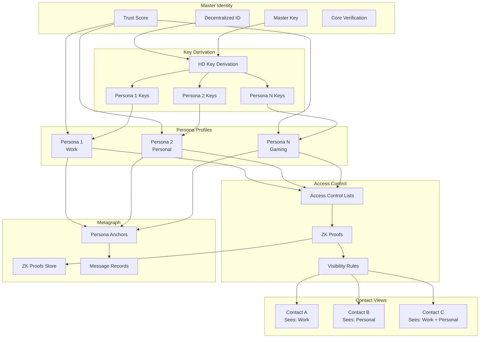

# Multiple Personas with Selective Visibility

## Overview

This feature enables users to create multiple distinct personas under their main profile, allowing them to compartmentalize their identity and interactions across different social circles while maintaining complete control over which contacts can see each persona. Users can present different aspects of their identity to different groups without compromising their privacy or creating separate accounts, addressing the need for contextual identity management in both personal and professional communications.

## Architecture

Each persona has its own display name, avatar, bio, and verification status while sharing the underlying DID and trust score from the master identity. Selective visibility is enforced through cryptographic access controls where users explicitly grant specific contacts permission to see particular personas. The system uses hierarchical deterministic key derivation to generate unique keys per persona while maintaining the ability to prove common ownership when needed.

### Persona Management Flow



### Architecture Components

| Component | Technology | Purpose |
|-----------|------------|---------|
| Master Identity | DID + Passkey | Root identity anchor |
| Key Derivation | BIP-32 HD Keys | Unique keys per persona |
| Persona Profiles | Encrypted JSON | Profile data storage |
| Access Control | Attribute-Based Encryption | Cryptographic visibility |
| Zero-Knowledge | ZK-SNARKs (Groth16) | Prove ownership without linking |
| Conversation Isolation | Separate key spaces | Message separation |
| Blockchain Anchor | Metagraph + Cardano | Immutable records |

### Data Model

```typescript
interface MasterIdentity {
  did: string;                      // Decentralized Identifier
  masterPublicKey: string;          // Root public key
  trustScore: number;               // Shared across personas
  coreVerification: {
    kycVerified: boolean;
    phoneVerified: boolean;
    emailVerified: boolean;
  };
  personas: PersonaId[];            // List of persona IDs
  createdAt: Date;
  
  // Recovery
  recoveryContacts: UserId[];       // Social recovery guardians
  recoveryThreshold: number;        // M-of-N for recovery
}

interface Persona {
  personaId: string;                // Unique identifier
  masterDid: string;                // Link to master (encrypted)
  
  // Profile
  profile: {
    displayName: string;
    username: string;               // Unique per persona
    avatar: string;                 // URL or base64
    bio: string;
    category: PersonaCategory;
    status: string;
  };
  
  // Keys (derived from master)
  keys: {
    signingKey: string;             // For this persona
    encryptionKey: string;          // For this persona
    derivationPath: string;         // HD path from master
  };
  
  // Visibility
  visibility: {
    accessList: AccessGrant[];      // Who can see this persona
    defaultVisibility: 'none' | 'contacts' | 'public';
    discoverability: boolean;       // Can be found in search
  };
  
  // Settings
  settings: {
    privacy: PersonaPrivacySettings;
    notifications: PersonaNotificationSettings;
    features: PersonaFeatureSettings;
  };
  
  // Verification
  verification: {
    badges: PersonaBadge[];         // Persona-specific badges
    credentials: Credential[];      // Professional credentials
  };
  
  // Metadata
  createdAt: Date;
  lastActiveAt: Date;
  messageCount: number;
  contactCount: number;
}

type PersonaCategory = 
  | 'professional'
  | 'personal' 
  | 'family'
  | 'gaming'
  | 'dating'
  | 'creative'
  | 'anonymous'
  | 'custom';

interface AccessGrant {
  grantId: string;
  contactId: string;
  personaId: string;
  grantedAt: Date;
  grantedBy: PersonaId;             // Which persona granted access
  permissions: {
    canView: boolean;
    canMessage: boolean;
    canCall: boolean;
    canSeeOtherPersonas: boolean;   // Can discover linked personas
  };
  expiresAt?: Date;
  revocable: boolean;
}
```

## Key Components

### Persona Creation

Users create additional personas through their main profile settings. Each persona has its own display name, avatar, bio, and verification status while sharing the underlying DID and trust score from the master identity.

**Key Features:**

* Create up to 5 personas (free) or 10 (verified)
* Custom display names with uniqueness check
* Custom avatars (upload or generate)
* Custom bios (500 character limit)
* Persona categories with icons
* Optional persona description
* Username reservation per persona
* Persona creation wizard

**Persona Limits by Trust Level:**

| Trust Level | Max Personas | Custom Categories | Badge Slots |
|-------------|--------------|-------------------|-------------|
| Unverified | 2 | No | 1 |
| Newcomer | 3 | No | 2 |
| Member | 5 | Yes | 3 |
| Trusted | 7 | Yes | 5 |
| Verified | 10 | Yes | Unlimited |

**Creation Flow:**

```
┌─────────────────────────────────────────────────────────┐
│ Create New Persona                              Step 1/4│
├─────────────────────────────────────────────────────────┤
│                                                         │
│ Choose a category for your new persona:                │
│                                                         │
│  ┌─────────┐  ┌─────────┐  ┌─────────┐  ┌─────────┐   │
│  │   💼    │  │   👤    │  │   👨‍👩‍👧   │  │   🎮    │   │
│  │  Work   │  │Personal │  │ Family  │  │ Gaming  │   │
│  └─────────┘  └─────────┘  └─────────┘  └─────────┘   │
│                                                         │
│  ┌─────────┐  ┌─────────┐  ┌─────────┐  ┌─────────┐   │
│  │   💕    │  │   🎨    │  │   🎭    │  │   ⚙️    │   │
│  │ Dating  │  │Creative │  │  Anon   │  │ Custom  │   │
│  └─────────┘  └─────────┘  └─────────┘  └─────────┘   │
│                                                         │
│ Selected: Professional                                  │
│                                                         │
│                    [Cancel]  [Next →]                   │
└─────────────────────────────────────────────────────────┘

┌─────────────────────────────────────────────────────────┐
│ Create New Persona                              Step 2/4│
├─────────────────────────────────────────────────────────┤
│                                                         │
│              ┌───────────────┐                         │
│              │     📷       │  [Upload Photo]          │
│              │   Add Photo   │  [Generate Avatar]       │
│              └───────────────┘                         │
│                                                         │
│ Display Name:                                          │
│ ┌─────────────────────────────────────────────────┐    │
│ │ Alex Chen                                       │    │
│ └─────────────────────────────────────────────────┘    │
│                                                         │
│ Username:                                              │
│ ┌─────────────────────────────────────────────────┐    │
│ │ @alex.chen.work                          ✓ Available│    │
│ └─────────────────────────────────────────────────┘    │
│                                                         │
│ Bio:                                                   │
│ ┌─────────────────────────────────────────────────┐    │
│ │ Senior Software Engineer | Cloud Architecture  │    │
│ │ | Open to consulting opportunities             │    │
│ └─────────────────────────────────────────────────┘    │
│                                          124/500 chars │
│                                                         │
│                   [← Back]  [Next →]                   │
└─────────────────────────────────────────────────────────┘

┌─────────────────────────────────────────────────────────┐
│ Create New Persona                              Step 3/4│
├─────────────────────────────────────────────────────────┤
│                                                         │
│ Privacy Settings for "Alex Chen (Work)"                │
│                                                         │
│ Who can find this persona?                             │
│ ○ Nobody (invite only)                                 │
│ ● Contacts you add                                     │
│ ○ Anyone (public profile)                              │
│                                                         │
│ Show online status to:                                 │
│ [Contacts of this persona          ▼]                  │
│                                                         │
│ Show last seen to:                                     │
│ [Contacts of this persona          ▼]                  │
│                                                         │
│ ┌─────────────────────────────────────────────────┐    │
│ │ ⚠️ Contacts who know multiple personas will NOT │    │
│ │ be able to see which persona you're using      │    │
│ │ unless you explicitly allow it.                │    │
│ └─────────────────────────────────────────────────┘    │
│                                                         │
│                   [← Back]  [Next →]                   │
└─────────────────────────────────────────────────────────┘

┌─────────────────────────────────────────────────────────┐
│ Create New Persona                              Step 4/4│
├─────────────────────────────────────────────────────────┤
│                                                         │
│ Review your new persona:                               │
│                                                         │
│  ┌──────────────────────────────────────────────────┐  │
│  │  👤 Alex Chen                                    │  │
│  │  @alex.chen.work                                 │  │
│  │                                                  │  │
│  │  💼 Professional                                 │  │
│  │                                                  │  │
│  │  Senior Software Engineer | Cloud Architecture  │  │
│  │  | Open to consulting opportunities             │  │
│  │                                                  │  │
│  │  Trust Score: 72 (inherited)                    │  │
│  │  Visibility: Contacts only                      │  │
│  └──────────────────────────────────────────────────┘  │
│                                                         │
│ ┌─────────────────────────────────────────────────┐    │
│ │ ℹ️ Your master identity trust score (72) will   │    │
│ │ apply to this persona. You can earn additional  │    │
│ │ badges specific to this persona.                │    │
│ └─────────────────────────────────────────────────┘    │
│                                                         │
│                [← Back]  [Create Persona]              │
└─────────────────────────────────────────────────────────┘
```

**Key Derivation:**

```typescript
interface PersonaKeyDerivation {
  // BIP-32 style derivation
  // Master Key → Persona Keys
  
  derivePath(masterKey: MasterKey, personaIndex: number): PersonaKeys {
    // m/purpose'/persona'/index'
    const path = `m/867530'/${personaIndex}'/0'`;
    
    return {
      signingKey: deriveKey(masterKey, `${path}/0`),
      encryptionKey: deriveKey(masterKey, `${path}/1`),
      path: path,
    };
  }
  
  // Prove two personas share master without revealing master
  proveCommonOwnership(
    persona1: Persona,
    persona2: Persona,
    masterKey: MasterKey
  ): ZKProof {
    return generateProof({
      statement: 'persona1.master == persona2.master',
      witness: masterKey,
      publicInputs: [persona1.publicKey, persona2.publicKey],
    });
  }
}
```

### Persona Privacy Settings

Each persona can have distinct privacy settings, notification preferences, and feature access levels.

**Key Features:**

* Independent privacy settings per persona
* Independent notification preferences
* Independent feature toggles
* Per-persona last seen visibility
* Per-persona online status visibility
* Per-persona profile picture visibility
* Per-persona read receipts
* Per-persona blocking (contacts blocked for one persona only)

**Privacy Settings Structure:**

```typescript
interface PersonaPrivacySettings {
  // Visibility controls
  visibility: {
    lastSeen: 'everyone' | 'contacts' | 'nobody';
    onlineStatus: 'everyone' | 'contacts' | 'nobody';
    profilePicture: 'everyone' | 'contacts' | 'nobody';
    bio: 'everyone' | 'contacts' | 'nobody';
    statusMessage: 'everyone' | 'contacts' | 'nobody';
  };
  
  // Interaction controls
  interactions: {
    whoCanMessage: 'everyone' | 'contacts' | 'nobody';
    whoCanCall: 'everyone' | 'contacts' | 'nobody';
    whoCanAddToGroups: 'everyone' | 'contacts' | 'nobody';
    requireApprovalForContact: boolean;
  };
  
  // Read receipts
  receipts: {
    sendReadReceipts: boolean;
    sendTypingIndicators: boolean;
  };
  
  // Discovery
  discovery: {
    searchable: boolean;
    showInSuggestions: boolean;
    allowContactSharing: boolean;
  };
  
  // Cross-persona
  crossPersona: {
    allowLinkingDiscovery: boolean;     // Can contacts discover other personas?
    showSharedTrustScore: boolean;      // Show master trust score?
    allowCrossPersonaForward: boolean;  // Can forward messages across personas?
  };
}

interface PersonaNotificationSettings {
  // Notification delivery
  enabled: boolean;
  
  // Quiet hours (per persona)
  quietHours: {
    enabled: boolean;
    start: string;      // HH:MM
    end: string;        // HH:MM
    timezone: string;
    allowExceptions: boolean;
  };
  
  // Notification types
  types: {
    messages: 'all' | 'mentions' | 'none';
    calls: 'all' | 'contacts' | 'none';
    groupActivity: 'all' | 'mentions' | 'none';
    contactRequests: boolean;
  };
  
  // Sound and vibration
  sound: {
    enabled: boolean;
    soundId: string;
    vibration: boolean;
  };
  
  // Preview
  preview: {
    showContent: boolean;
    showSender: boolean;
    showPersonaName: boolean;   // Show which persona received it
  };
}

interface PersonaFeatureSettings {
  // Enabled features for this persona
  voiceCalls: boolean;
  videoCalls: boolean;
  screenSharing: boolean;
  voiceMessages: boolean;
  fileSharing: boolean;
  locationSharing: boolean;
  disappearingMessages: boolean;
  scheduledMessages: boolean;
  silentMessages: boolean;
  
  // Limits
  maxGroupSize: number;
  maxFileSize: number;         // MB
  voiceMessageDuration: number; // seconds
}
```

**Settings UI:**

```
┌─────────────────────────────────────────────────────────┐
│ Privacy Settings: Alex Chen (Work)                      │
├─────────────────────────────────────────────────────────┤
│                                                         │
│ VISIBILITY                                              │
│ ─────────────────────────────────────────────────────── │
│                                                         │
│ Last Seen                                               │
│ [Contacts of this persona              ▼]              │
│                                                         │
│ Online Status                                           │
│ [Contacts of this persona              ▼]              │
│                                                         │
│ Profile Picture                                         │
│ [Everyone                               ▼]              │
│                                                         │
│ CROSS-PERSONA PRIVACY                                   │
│ ─────────────────────────────────────────────────────── │
│                                                         │
│ Allow contacts to discover my other personas           │
│ [OFF ○━━━━━━━━━━━━━━━━━━━━━━━━━━━━━━━━━━━━]            │
│                                                         │
│ ℹ️ When OFF, contacts who know you as "Alex Chen"       │
│ cannot see or discover your other personas.            │
│                                                         │
│ Show shared trust score                                 │
│ [ON ━━━━━━━━━━━━━━━━━━━━━━━━━━━━━━━━━━━━●]             │
│                                                         │
│ ℹ️ Your trust score (72) will be visible to contacts   │
│ of this persona.                                       │
│                                                         │
└─────────────────────────────────────────────────────────┘
```

### Selective Visibility

The selective visibility system operates through cryptographic access controls where users explicitly grant specific contacts permission to see particular personas.

**Key Features:**

* Explicit permission granting per contact
* Bulk permission management
* Permission templates (e.g., "all work contacts")
* Permission expiry dates
* One-time reveal (temporary access)
* Permission delegation (trusted contacts can introduce)
* Permission audit log
* Cryptographic enforcement (impossible to bypass)

**Access Control Implementation:**

```typescript
interface VisibilityControl {
  // Grant access to a persona
  async grantAccess(
    personaId: PersonaId,
    contactId: UserId,
    permissions: PermissionSet
  ): Promise<AccessGrant> {
    // 1. Generate access credential
    const credential = await generateAccessCredential(
      personaId,
      contactId,
      permissions
    );
    
    // 2. Encrypt persona profile for this contact
    const encryptedProfile = await encryptForContact(
      persona.profile,
      contactId
    );
    
    // 3. Store grant on metagraph
    const anchor = await anchorAccessGrant(credential);
    
    // 4. Notify contact (if not anonymous persona)
    if (!persona.category === 'anonymous') {
      await notifyContactOfAccess(contactId, personaId);
    }
    
    return {
      grantId: credential.id,
      ...credential,
      anchor,
    };
  }
  
  // Revoke access
  async revokeAccess(
    grantId: string,
    reason?: string
  ): Promise<void> {
    // 1. Mark grant as revoked
    await updateGrantStatus(grantId, 'revoked');
    
    // 2. Rotate persona keys if needed
    if (await shouldRotateKeys(grantId)) {
      await rotatePersonaKeys(personaId);
    }
    
    // 3. Anchor revocation
    await anchorRevocation(grantId, reason);
    
    // 4. Contact can no longer decrypt new content
    // Old content remains accessible (forward secrecy limitation)
  }
  
  // Check if contact can see persona
  async canAccess(
    contactId: UserId,
    personaId: PersonaId
  ): Promise<AccessCheckResult> {
    const grants = await getActiveGrants(contactId, personaId);
    
    if (grants.length === 0) {
      return { allowed: false, reason: 'no_grant' };
    }
    
    const validGrant = grants.find(g => 
      !g.expiresAt || g.expiresAt > new Date()
    );
    
    if (!validGrant) {
      return { allowed: false, reason: 'expired' };
    }
    
    return { 
      allowed: true, 
      permissions: validGrant.permissions,
      grant: validGrant,
    };
  }
}
```

**Visibility Matrix UI:**

```
┌─────────────────────────────────────────────────────────┐
│ Persona Visibility                                      │
├─────────────────────────────────────────────────────────┤
│                                                         │
│ Who can see each persona:                              │
│                                                         │
│            │ 💼 Work │ 👤 Personal │ 🎮 Gaming │        │
│ ───────────┼─────────┼─────────────┼───────────┤        │
│ Alice      │   ✓     │     ✓       │           │        │
│ Bob        │   ✓     │             │           │        │
│ Carol      │         │     ✓       │     ✓     │        │
│ Dave       │         │             │     ✓     │        │
│ Eve        │   ✓     │     ✓       │     ✓     │        │
│ ───────────┴─────────┴─────────────┴───────────┘        │
│                                                         │
│ [Manage Work Contacts]                                 │
│ [Manage Personal Contacts]                             │
│ [Manage Gaming Contacts]                               │
│                                                         │
│ Quick Actions:                                         │
│ [Grant Access to Multiple...] [Import from Contacts...]│
└─────────────────────────────────────────────────────────┘
```

**Zero-Knowledge Visibility:**

```typescript
interface ZKVisibility {
  // Prove you have access without revealing which persona
  proveAccess(
    contactId: UserId,
    personaSet: PersonaId[]
  ): ZKProof {
    // Generates proof: "I can see at least one of these personas"
    // without revealing which one
    return zkSnark.prove({
      publicInputs: { contactId, personaCommitments: personaSet.map(commit) },
      privateInputs: { grantedPersonaId, grantCredential },
      circuit: 'persona_access_v1',
    });
  }
  
  // Prove personas are NOT linked (for privacy)
  proveUnlinked(
    persona1: PersonaId,
    persona2: PersonaId
  ): ZKProof | null {
    // Only works if personas are actually unlinked
    // Returns null if they share a master (can't lie)
    if (samemaster(persona1, persona2)) {
      return null;
    }
    return zkSnark.prove({
      statement: 'different_masters',
      publicInputs: { persona1, persona2 },
    });
  }
}
```

### Persona Conversation Isolation

The system maintains completely separate conversation threads for each persona, ensuring messages sent as one persona remain isolated from conversations conducted as another persona.

**Key Features:**

* Separate conversation threads per persona
* Independent message history
* Independent notification badges
* Independent read states
* Independent typing indicators
* Independent call history
* No cross-persona message leakage
* Optional cross-persona forwarding (explicit action)

**Isolation Architecture:**

```
┌─────────────────────────────────────────────────────────┐
│                     Your Device                         │
├─────────────────────────────────────────────────────────┤
│                                                         │
│  ┌─────────────────┐  ┌─────────────────┐              │
│  │ 💼 Work Persona │  │ 👤 Personal     │              │
│  ├─────────────────┤  ├─────────────────┤              │
│  │ Encryption Key A│  │ Encryption Key B│              │
│  ├─────────────────┤  ├─────────────────┤              │
│  │ Conversations:  │  │ Conversations:  │              │
│  │ • Alice (work)  │  │ • Alice (friend)│  ← Same      │
│  │ • Bob           │  │ • Carol         │    contact,  │
│  │ • Work Group    │  │ • Family Group  │    different │
│  ├─────────────────┤  ├─────────────────┤    threads   │
│  │ Messages: 1,234 │  │ Messages: 567   │              │
│  │ Unread: 5       │  │ Unread: 12      │              │
│  └─────────────────┘  └─────────────────┘              │
│                                                         │
│  Conversation with Alice:                              │
│  ┌─────────────────┐  ┌─────────────────┐              │
│  │ Work Thread     │  │ Personal Thread │              │
│  │ (as Alex Chen)  │  │ (as Alex)       │              │
│  │                 │  │                 │              │
│  │ "Please review  │  │ "Want to grab   │              │
│  │ the proposal"   │  │ lunch Saturday?"│              │
│  └─────────────────┘  └─────────────────┘              │
│         ▲                     ▲                        │
│         │                     │                        │
│         └──── ISOLATED ───────┘                        │
│                                                         │
└─────────────────────────────────────────────────────────┘
```

**Thread Isolation Implementation:**

```typescript
interface ConversationIsolation {
  // Get conversation for specific persona + contact
  getConversation(
    personaId: PersonaId,
    contactId: UserId
  ): Conversation {
    // Unique conversation ID per persona-contact pair
    const conversationId = hash(personaId + contactId);
    return conversations.get(conversationId);
  }
  
  // Send message as persona
  async sendMessage(
    personaId: PersonaId,
    recipientId: UserId,
    content: MessageContent
  ): Promise<Message> {
    // Get persona-specific keys
    const persona = await getPersona(personaId);
    
    // Encrypt with persona's key
    const encrypted = await encrypt(
      content,
      persona.keys.encryptionKey,
      recipientId
    );
    
    // Include persona identifier (encrypted for recipient)
    const metadata = await encryptMetadata({
      senderPersona: personaId,
      timestamp: Date.now(),
    }, recipientId);
    
    return {
      conversationId: hash(personaId + recipientId),
      encrypted,
      metadata,
    };
  }
  
  // Forward message across personas (explicit action)
  async forwardCrossPersona(
    messageId: MessageId,
    fromPersona: PersonaId,
    toPersona: PersonaId,
    recipientId: UserId
  ): Promise<Message> {
    // Check permission
    if (!persona.settings.crossPersona.allowCrossPersonaForward) {
      throw new Error('Cross-persona forwarding disabled');
    }
    
    // Decrypt with source persona key
    const message = await decryptMessage(messageId, fromPersona);
    
    // Re-encrypt with destination persona key
    // This creates a NEW message, not a link
    return sendMessage(toPersona, recipientId, {
      type: 'forwarded',
      content: message.content,
      originalTimestamp: message.timestamp,
      // Note: original sender info NOT included (privacy)
    });
  }
}
```

**Same Contact, Multiple Personas:**

```
┌─────────────────────────────────────────────────────────┐
│ Alice (appears in multiple personas)                    │
├─────────────────────────────────────────────────────────┤
│                                                         │
│ You know Alice through:                                │
│                                                         │
│ ┌─────────────────────────────────────────────────────┐ │
│ │ 💼 Work (as "Alex Chen")                           │ │
│ │    Last message: "Please review the proposal"      │ │
│ │    Alice sees you as: Alex Chen, Sr. Engineer     │ │
│ └─────────────────────────────────────────────────────┘ │
│                                                         │
│ ┌─────────────────────────────────────────────────────┐ │
│ │ 👤 Personal (as "Alex")                            │ │
│ │    Last message: "Want to grab lunch Saturday?"   │ │
│ │    Alice sees you as: Alex, friend                │ │
│ └─────────────────────────────────────────────────────┘ │
│                                                         │
│ ⚠️ Alice does NOT know these are the same person      │
│ (unless you choose to reveal)                          │
│                                                         │
│ [Link These Conversations] [Keep Separate]             │
└─────────────────────────────────────────────────────────┘
```

### Persona Trust Scoring

The master identity's trust score applies to all personas, but individual personas can earn additional verification badges specific to their context.

**Key Features:**

* Inherited master trust score
* Per-persona verification badges
* Per-persona reputation (within context)
* Badge portability options
* Score display controls
* Behavioral signals per persona
* Aggregate vs. per-persona analytics

**Trust Model:**

```typescript
interface PersonaTrust {
  // Master trust (inherited)
  masterTrustScore: number;         // 0-100
  masterTrustLevel: TrustLevel;
  
  // Persona-specific metrics
  personaMetrics: {
    messagesSent: number;
    messagesReceived: number;
    callsCompleted: number;
    reportsReceived: number;
    endorsementsReceived: number;
    accountAge: number;             // Days since persona created
  };
  
  // Persona-specific badges
  badges: PersonaBadge[];
  
  // Display configuration
  display: {
    showMasterScore: boolean;
    showPersonaBadges: boolean;
    showCombinedReputation: boolean;
  };
}

interface PersonaBadge {
  badgeId: string;
  type: PersonaBadgeType;
  issuedAt: Date;
  issuer: string;
  verifiable: boolean;
  proof?: string;                   // Metagraph anchor
}

type PersonaBadgeType =
  // Professional
  | 'verified_employer'             // Employer confirmed
  | 'professional_credential'       // License, certification
  | 'linkedin_verified'             // LinkedIn profile linked
  | 'domain_email'                  // Company email verified
  
  // Gaming
  | 'game_achievement'              // In-game achievement
  | 'tournament_winner'             // Competition placement
  | 'verified_gamer_tag'            // Platform account linked
  
  // Creative
  | 'portfolio_verified'            // Portfolio site linked
  | 'published_work'                // Published content
  
  // Community
  | 'community_moderator'           // Mod status
  | 'trusted_contributor'           // Contribution recognition
  | 'event_organizer'               // Event hosting
  
  // Dating
  | 'photo_verified'                // Photo matches live selfie
  | 'age_verified'                  // Age confirmed (ZK)
  | 'location_verified'             // Location confirmed (ZK)
```

**Trust Display:**

```
┌─────────────────────────────────────────────────────────┐
│ Profile: Alex Chen (Work)                               │
├─────────────────────────────────────────────────────────┤
│                                                         │
│                    👤                                   │
│               Alex Chen                                 │
│            @alex.chen.work                             │
│                                                         │
│ ────────────────────────────────────────────────────── │
│                                                         │
│ Trust Score: 72 ████████░░                             │
│ Level: Trusted ✓✓                                      │
│                                                         │
│ Verification:                                          │
│ ✓ Identity Verified (master)                           │
│ ✓ Phone Verified (master)                              │
│                                                         │
│ Professional Badges:                                   │
│ 🏢 Verified: Acme Corp (employer)                     │
│ 📜 AWS Solutions Architect                             │
│ 💼 LinkedIn Connected                                  │
│                                                         │
│ ────────────────────────────────────────────────────── │
│                                                         │
│ Senior Software Engineer | Cloud Architecture          │
│ | Open to consulting opportunities                     │
│                                                         │
└─────────────────────────────────────────────────────────┘
```

### Persona-Specific Verification

Individual personas can earn additional verification badges specific to their context.

**Key Features:**

* Professional credential verification
* Gaming platform linking
* Social media verification
* Domain email verification
* Portfolio verification
* Community role verification
* Privacy-preserving age/location verification
* Credential revocation and updates

**Verification Flows:**

```typescript
interface PersonaVerification {
  // Professional email verification
  async verifyWorkEmail(
    personaId: PersonaId,
    email: string
  ): Promise<VerificationResult> {
    // Send verification to work email
    const code = await sendVerificationEmail(email);
    
    // On verification:
    return {
      badge: {
        type: 'domain_email',
        domain: extractDomain(email),
        verifiedAt: new Date(),
      },
      proof: await anchorVerification(personaId, 'domain_email'),
    };
  }
  
  // LinkedIn verification
  async verifyLinkedIn(
    personaId: PersonaId,
    oauthCode: string
  ): Promise<VerificationResult> {
    // OAuth flow with LinkedIn
    const profile = await linkedInApi.getProfile(oauthCode);
    
    return {
      badge: {
        type: 'linkedin_verified',
        profileUrl: profile.url,
        headline: profile.headline,
      },
      proof: await anchorVerification(personaId, 'linkedin'),
    };
  }
  
  // Gaming platform verification
  async verifyGamingAccount(
    personaId: PersonaId,
    platform: 'steam' | 'xbox' | 'playstation' | 'nintendo',
    oauthCode: string
  ): Promise<VerificationResult> {
    const account = await gamingPlatformApi[platform].verify(oauthCode);
    
    return {
      badge: {
        type: 'verified_gamer_tag',
        platform,
        gamerTag: account.displayName,
        achievements: account.topAchievements,
      },
    };
  }
  
  // ZK age verification (prove over 18 without revealing age)
  async verifyAgeZK(
    personaId: PersonaId,
    idDocument: EncryptedDocument,
    threshold: number = 18
  ): Promise<VerificationResult> {
    // Process document locally, generate ZK proof
    const birthDate = await extractBirthDate(idDocument);
    const proof = await generateAgeProof(birthDate, threshold);
    
    return {
      badge: {
        type: 'age_verified',
        threshold,
        zkProof: proof,
      },
      // Note: actual age never stored or transmitted
    };
  }
}
```

### Contact Management

Contact management becomes persona-aware, with contacts categorized based on which personas they know.

**Key Features:**

* Persona-aware contact lists
* Contact visibility across personas
* Automatic persona suggestions
* Contact relationship tracking
* Per-persona contact notes
* Cross-persona contact linking (by user)
* Smart contact recommendations
* Contact import with persona assignment

**Contact Data Model:**

```typescript
interface PersonaAwareContact {
  contactId: string;
  
  // Which of YOUR personas this contact can see
  visiblePersonas: {
    personaId: PersonaId;
    grantedAt: Date;
    relationship: string;           // "colleague", "friend", etc.
    notes?: string;                 // Per-persona notes
  }[];
  
  // Which of THEIR personas you can see
  theirPersonas: {
    personaId: PersonaId;
    displayName: string;
    avatar: string;
    discoveredAt: Date;
  }[];
  
  // Suggestions
  suggestions: {
    suggestPersona?: PersonaId;     // Suggested persona to reveal
    suggestMerge?: boolean;         // Suggest they're same person
    confidence: number;
  };
}
```

**Contact UI:**

```
┌─────────────────────────────────────────────────────────┐
│ Contacts                                    🔍 [+ Add]  │
├─────────────────────────────────────────────────────────┤
│                                                         │
│ View by: [All Personas ▼]                              │
│                                                         │
│ 💼 WORK CONTACTS (12)                                   │
│ ─────────────────────────────────────────────────────── │
│ ┌─────────────────────────────────────────────────────┐ │
│ │ 👤 Alice Johnson                                    │ │
│ │    Knows: 💼 Work                                   │ │
│ │    Last: "Thanks for the update" · 2h              │ │
│ └─────────────────────────────────────────────────────┘ │
│ ┌─────────────────────────────────────────────────────┐ │
│ │ 👤 Bob Smith                                        │ │
│ │    Knows: 💼 Work                                   │ │
│ │    Last: Missed call · Yesterday                   │ │
│ └─────────────────────────────────────────────────────┘ │
│                                                         │
│ 👤 PERSONAL CONTACTS (8)                               │
│ ─────────────────────────────────────────────────────── │
│ ┌─────────────────────────────────────────────────────┐ │
│ │ 👤 Carol Williams                                   │ │
│ │    Knows: 👤 Personal, 🎮 Gaming                    │ │
│ │    Last: "See you at the game!" · 5h               │ │
│ └─────────────────────────────────────────────────────┘ │
│                                                         │
│ 🔗 MULTI-PERSONA CONTACTS (3)                          │
│ ─────────────────────────────────────────────────────── │
│ ┌─────────────────────────────────────────────────────┐ │
│ │ 👤 Alice Johnson                                    │ │
│ │    Knows: 💼 Work, 👤 Personal                      │ │
│ │    ⚠️ May not know these are same person           │ │
│ │    [Reveal Link] [Keep Separate]                   │ │
│ └─────────────────────────────────────────────────────┘ │
│                                                         │
└─────────────────────────────────────────────────────────┘
```

### Persona Switching

Users can seamlessly switch between personas when messaging, with intelligent suggestions based on context.

**Key Features:**

* One-tap persona switch
* Context-aware auto-suggestions
* Switch confirmation for sensitive contexts
* Recent persona memory per contact
* Keyboard shortcut for power users
* Visual indicator of active persona
* Prevent accidental cross-persona messaging

**Switching UI:**

```
┌─────────────────────────────────────────────────────────┐
│ ← Alice Johnson                         [💼 Alex Chen]  │
├─────────────────────────────────────────────────────────┤
│                                                         │
│ You're messaging Alice as: 💼 Alex Chen (Work)         │
│                                                         │
│                     ┌─────────────────────────────┐     │
│                     │ "Please review the Q4       │     │
│                     │ proposal when you have time"│     │
│                     └─────────────────────────────┘     │
│                                              2:34 PM ✓✓ │
│                                                         │
│ ┌─────────────────────────────────────────────────┐     │
│ │ "Sure, I'll take a look this afternoon"         │     │
│ └─────────────────────────────────────────────────┘     │
│                                              2:36 PM    │
│                                                         │
├─────────────────────────────────────────────────────────┤
│ ┌───────────────────────────────────────────────────┐   │
│ │ Message as 💼 Alex Chen...                        │   │
│ └───────────────────────────────────────────────────┘   │
│                                                         │
│ [Switch Persona ▼]                                     │
└─────────────────────────────────────────────────────────┘

Persona Switcher Dropdown:
┌─────────────────────────────────────────────────────────┐
│ Message as:                                             │
├─────────────────────────────────────────────────────────┤
│                                                         │
│ ● 💼 Alex Chen (Work)           ← Currently selected   │
│     Alice knows this persona                           │
│                                                         │
│ ○ 👤 Alex (Personal)                                   │
│     Alice knows this persona                           │
│                                                         │
│ ○ 🎮 ProGamer99 (Gaming)                               │
│     ⚠️ Alice doesn't know this persona                 │
│     [Reveal to Alice...]                               │
│                                                         │
│ ─────────────────────────────────────────────────────── │
│ [+ Create New Persona]                                 │
└─────────────────────────────────────────────────────────┘
```

**Auto-Suggestion Logic:**

```typescript
interface PersonaSuggestion {
  async suggestPersona(
    contactId: UserId,
    context: MessageContext
  ): Promise<SuggestionResult> {
    // 1. Check which personas contact can see
    const visiblePersonas = await getVisiblePersonas(contactId);
    
    if (visiblePersonas.length === 0) {
      return { suggestion: null, action: 'request_reveal' };
    }
    
    if (visiblePersonas.length === 1) {
      return { suggestion: visiblePersonas[0], confidence: 1.0 };
    }
    
    // 2. Check recent history
    const recentPersona = await getLastUsedPersona(contactId);
    if (recentPersona && timeSince(recentPersona.lastUsed) < hours(24)) {
      return { suggestion: recentPersona.personaId, confidence: 0.9 };
    }
    
    // 3. Analyze context
    const contextSignals = analyzeContext(context);
    
    // Work hours + formal language → Work persona
    if (contextSignals.isBusinessHours && contextSignals.formalLanguage) {
      const workPersona = visiblePersonas.find(p => p.category === 'professional');
      if (workPersona) {
        return { suggestion: workPersona.personaId, confidence: 0.8 };
      }
    }
    
    // 4. Default to most recently active
    return { 
      suggestion: visiblePersonas.sort((a, b) => 
        b.lastActiveAt - a.lastActiveAt
      )[0].personaId,
      confidence: 0.6,
    };
  }
}
```

**Safety Features:**

```typescript
interface PersonaSwitchSafety {
  // Prevent accidental cross-persona messaging
  async validateSwitch(
    fromPersona: PersonaId,
    toPersona: PersonaId,
    contactId: UserId
  ): Promise<ValidationResult> {
    // Check if contact knows both personas as same person
    const knowsLink = await contactKnowsPersonaLink(
      contactId, 
      fromPersona, 
      toPersona
    );
    
    if (!knowsLink) {
      return {
        allowed: true,
        warning: 'Contact does not know these personas are linked. ' +
                 'Switching may reveal your identity.',
        requireConfirmation: true,
      };
    }
    
    return { allowed: true };
  }
  
  // Conversation boundary warning
  showBoundaryWarning(
    conversationId: ConversationId,
    newPersona: PersonaId
  ): Warning | null {
    const existingPersona = getConversationPersona(conversationId);
    
    if (existingPersona !== newPersona) {
      return {
        type: 'persona_boundary',
        message: 'This conversation was started as a different persona. ' +
                 'Sending as this persona will start a NEW conversation.',
        options: ['Continue (New Thread)', 'Cancel', 'Switch Conversation'],
      };
    }
    
    return null;
  }
}
```

### Blockchain Anchoring

The blockchain anchoring system maintains provable integrity for all personas while preserving privacy through zero-knowledge proofs.

**Key Features:**

* Per-persona message anchoring (separate from master)
* ZK proofs for persona ownership
* ZK proofs for persona non-linkability
* Selective disclosure proofs
* Audit trail without identity exposure
* Credential anchoring per persona
* Revocation anchoring

**Anchoring Architecture:**

```typescript
interface PersonaAnchoring {
  // Anchor persona creation (privacy-preserving)
  async anchorPersonaCreation(
    persona: Persona
  ): Promise<AnchorRecord> {
    return anchor({
      type: 'persona_created',
      personaId: persona.personaId,
      // Master ID is NOT included (ZK proof instead)
      ownershipProof: await generateOwnershipProof(persona),
      createdAt: new Date(),
      category: persona.category,
    });
  }
  
  // Anchor message (per-persona)
  async anchorMessage(
    personaId: PersonaId,
    messageId: MessageId,
    contentHash: string
  ): Promise<AnchorRecord> {
    return anchor({
      type: 'message',
      personaId,
      messageId,
      contentHash,
      timestamp: new Date(),
    });
  }
  
  // Generate proof of persona ownership
  async generateOwnershipProof(
    persona: Persona
  ): Promise<ZKProof> {
    return zkSnark.prove({
      circuit: 'persona_ownership_v1',
      publicInputs: {
        personaId: persona.personaId,
        personaPublicKey: persona.keys.signingKey,
      },
      privateInputs: {
        masterKey: getMasterKey(),
        derivationPath: persona.keys.derivationPath,
      },
    });
  }
  
  // Prove two personas are NOT linked (for privacy)
  async proveNotLinked(
    persona1: PersonaId,
    persona2: PersonaId
  ): Promise<ZKProof | null> {
    if (await areLinked(persona1, persona2)) {
      // Cannot generate false proof
      return null;
    }
    
    return zkSnark.prove({
      circuit: 'persona_not_linked_v1',
      publicInputs: { persona1, persona2 },
      privateInputs: { 
        master1: getMaster(persona1),
        master2: getMaster(persona2),
      },
    });
  }
  
  // Selectively reveal persona link to specific party
  async revealLink(
    persona1: PersonaId,
    persona2: PersonaId,
    toContactId: UserId
  ): Promise<Disclosure> {
    const proof = await generateLinkProof(persona1, persona2);
    
    // Encrypt proof for specific contact
    const encryptedProof = await encryptFor(proof, toContactId);
    
    // Anchor the disclosure
    await anchor({
      type: 'persona_link_revealed',
      toContact: hash(toContactId),
      timestamp: new Date(),
      // Actual proof encrypted, not public
    });
    
    return { encryptedProof };
  }
}
```

**Metagraph Records:**

```typescript
// Persona creation record (public)
interface PersonaCreationRecord {
  recordType: 'persona_created';
  personaId: string;
  ownershipProof: string;           // ZK proof
  category: PersonaCategory;
  createdAt: Date;
  txHash: string;
  
  // NOT included:
  // - masterId (private)
  // - masterPublicKey (private)
  // - other persona IDs (private)
}

// Access grant record (public)
interface AccessGrantRecord {
  recordType: 'access_grant';
  grantId: string;
  personaId: string;
  granteeCommitment: string;        // Hash of grantee ID
  permissions: string;              // Encrypted
  grantedAt: Date;
  expiresAt?: Date;
  txHash: string;
}

// Message anchor record (per-persona)
interface PersonaMessageAnchor {
  recordType: 'message';
  personaId: string;
  messageId: string;
  contentHash: string;
  timestamp: Date;
  txHash: string;
  
  // Linked to persona, not master
  // Cannot correlate across personas without proof
}
```

### Persona Deletion

Users can delete personas they no longer need, with options for data handling.

**Key Features:**

* Graceful persona deletion
* Conversation archival options
* Contact notification options
* 30-day recovery grace period
* Immediate permanent deletion option
* Data export before deletion
* Credential revocation
* Blockchain tombstone record

**Deletion Flow:**

```
┌─────────────────────────────────────────────────────────┐
│ Delete Persona: Alex Chen (Work)                        │
├─────────────────────────────────────────────────────────┤
│                                                         │
│ ⚠️ This will permanently delete this persona.          │
│                                                         │
│ What happens when you delete:                          │
│                                                         │
│ • Your profile "Alex Chen" will be removed            │
│ • 12 contacts will no longer be able to reach you     │
│ • 1,234 messages will be archived (or deleted)        │
│ • 3 professional badges will be revoked               │
│                                                         │
│ ─────────────────────────────────────────────────────── │
│                                                         │
│ Message History:                                       │
│ ○ Archive conversations (keep locally, encrypted)     │
│ ● Delete all conversations                            │
│                                                         │
│ Notify Contacts:                                       │
│ ○ Send "account deleted" notification                 │
│ ● Disappear silently                                  │
│                                                         │
│ Recovery:                                              │
│ ● Keep recoverable for 30 days                        │
│ ○ Delete immediately and permanently                  │
│                                                         │
│ ─────────────────────────────────────────────────────── │
│                                                         │
│ Type "DELETE ALEX CHEN" to confirm:                   │
│ ┌─────────────────────────────────────────────────┐    │
│ │                                                 │    │
│ └─────────────────────────────────────────────────┘    │
│                                                         │
│            [Cancel]        [Delete Persona]            │
└─────────────────────────────────────────────────────────┘
```

**Deletion Implementation:**

```typescript
interface PersonaDeletion {
  async deletePersona(
    personaId: PersonaId,
    options: DeletionOptions
  ): Promise<DeletionResult> {
    // 1. Validate (can't delete last persona)
    const personas = await getPersonas();
    if (personas.length <= 1) {
      throw new Error('Cannot delete last persona');
    }
    
    // 2. Export data if requested
    if (options.exportBeforeDelete) {
      await exportPersonaData(personaId);
    }
    
    // 3. Handle conversations
    if (options.archiveConversations) {
      await archivePersonaConversations(personaId);
    } else {
      await deletePersonaConversations(personaId);
    }
    
    // 4. Revoke access grants
    await revokeAllGrants(personaId);
    
    // 5. Revoke credentials
    await revokePersonaCredentials(personaId);
    
    // 6. Notify contacts (optional)
    if (options.notifyContacts) {
      await notifyContactsOfDeletion(personaId);
    }
    
    // 7. Anchor deletion
    await anchorDeletion(personaId, {
      deletedAt: new Date(),
      recoverable: options.recoveryPeriod > 0,
      recoveryExpires: options.recoveryPeriod > 0 
        ? addDays(new Date(), options.recoveryPeriod)
        : null,
    });
    
    // 8. Mark as deleted (soft delete for recovery)
    if (options.recoveryPeriod > 0) {
      await softDeletePersona(personaId, options.recoveryPeriod);
    } else {
      await hardDeletePersona(personaId);
    }
    
    return { success: true, recoverable: options.recoveryPeriod > 0 };
  }
  
  async recoverPersona(
    personaId: PersonaId
  ): Promise<RecoveryResult> {
    const deletion = await getDeletionRecord(personaId);
    
    if (!deletion.recoverable || deletion.recoveryExpires < new Date()) {
      throw new Error('Persona cannot be recovered');
    }
    
    // Restore persona
    await restorePersona(personaId);
    
    // Note: Conversations may be gone, contacts need re-granting
    return {
      success: true,
      warning: 'Persona restored. You may need to re-grant access to contacts.',
    };
  }
}
```

## Security Principles

* Each persona shares the underlying DID but has unique derived keys
* HD key derivation ensures personas are cryptographically linked but separately usable
* Selective visibility enforced through attribute-based encryption
* Contacts cannot discover personas without explicit grants
* Zero-knowledge proofs enable ownership proof without linking
* Conversation threads use persona-specific keys (complete isolation)
* Trust scores inherited from master; badges are persona-specific
* Blockchain anchoring per-persona prevents cross-persona correlation
* Persona deletion includes cryptographic revocation
* All inter-persona operations require explicit user action
* Cross-persona forwarding is disabled by default
* Persona switching includes safety confirmations

## Integration Points

### With Messaging Blueprint

| Feature | Integration |
|---------|-------------|
| Message Encryption | Per-persona keys |
| Conversations | Isolated per persona |
| Message Anchoring | Per-persona records |
| Disappearing Messages | Per-persona settings |
| Hidden Folders | Can be persona-specific |

### With Trust Network Blueprint

| Feature | Integration |
|---------|-------------|
| Trust Score | Inherited from master |
| Trust Circles | Per-persona circles |
| Verification Badges | Per-persona badges |
| Endorsements | Per-persona |
| Blocking | Per-persona |

### With Voice/Video Blueprint

| Feature | Integration |
|---------|-------------|
| Caller ID | Shows active persona |
| Call History | Per-persona |
| Transcripts | Per-persona storage |
| Recording Consent | Per-persona |

### With Search/Archive Blueprint

| Feature | Integration |
|---------|-------------|
| Search Scope | Per-persona or all |
| Archive | Per-persona folders |
| Export | Per-persona |

### With Silent/Scheduled Blueprint

| Feature | Integration |
|---------|-------------|
| Silent Mode | Per-persona settings |
| Scheduled Messages | Send as specific persona |
| DND | Per-persona schedules |

## Appendix: Error Codes

| Code | Meaning | User Message |
|------|---------|--------------|
| PERSONA_001 | Max personas reached | "You've reached the maximum number of personas for your trust level." |
| PERSONA_002 | Username taken | "This username is already in use." |
| PERSONA_003 | Cannot delete last | "You must have at least one persona." |
| PERSONA_004 | Access denied | "You don't have access to this persona." |
| PERSONA_005 | Grant expired | "Your access to this persona has expired." |
| PERSONA_006 | Switch blocked | "Cannot switch personas in this conversation." |
| PERSONA_007 | Cross-persona disabled | "Cross-persona actions are disabled for this persona." |
| PERSONA_008 | Verification failed | "Could not verify this credential for your persona." |
| PERSONA_009 | Recovery expired | "The recovery period for this persona has expired." |
| PERSONA_010 | Link reveal failed | "Could not reveal persona link to this contact." |

---

*Blueprint Version: 2.0*  
*Last Updated: February 5, 2026*  
*Status: Complete with Implementation Details*
