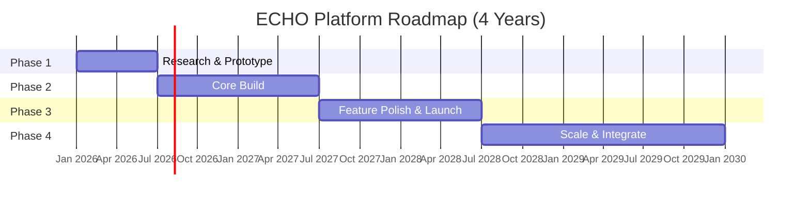
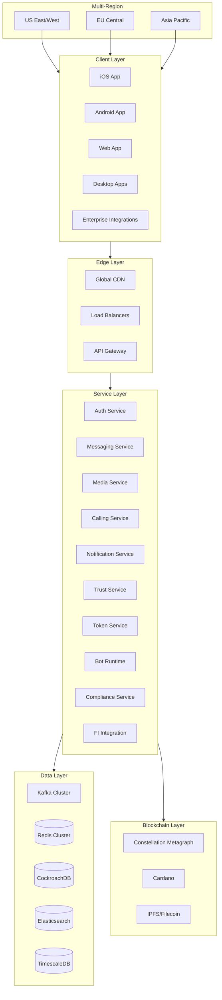
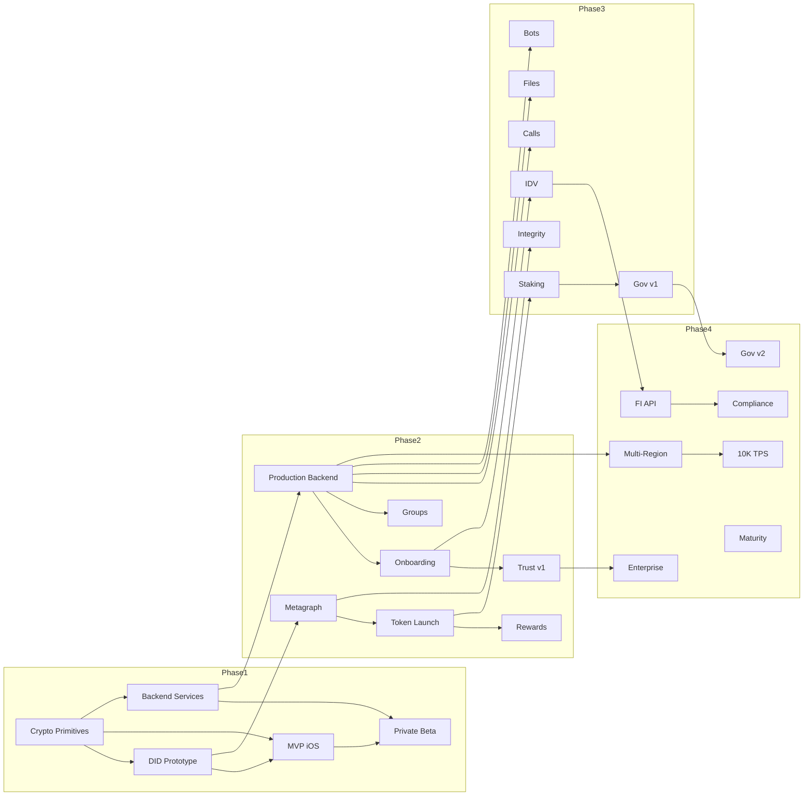

# Platform Roadmap and Future Vision

## Vision Overview

The ECHO platform will evolve from a secure messaging MVP to a fully decentralized communication and financial ecosystem over a four-year horizon. The roadmap balances rapid user acquisition, progressive trust building, token-driven incentives, and enterprise adoption. By Year 4, ECHO will be the leading privacy-preserving communication platform with integrated identity, payments, and trust infrastructure—serving 10M+ users and processing $1B+ in annual transaction volume.

## Mission Statement

**"Empowering secure, trusted communication for everyone—where your identity is yours, your messages are private, and your trust is earned."**

## Strategic Pillars

| Pillar | Description | Key Outcomes |
|--------|-------------|--------------|
| **Privacy First** | End-to-end encryption, zero-knowledge proofs, user-controlled data | 100% message encryption, no PII storage |
| **Decentralized Trust** | Blockchain-anchored identity, verifiable credentials, reputation | IAL2 verification, portable identity |
| **Token Economy** | Fair launch, sustainable incentives, community governance | 1B hard cap, 65% to community |
| **Enterprise Ready** | Compliance, audit trails, financial institution integration | SOC 2, PCI DSS, FDIC partnerships |

## Strategic Phases

### Phase Overview



### Phase 1 – Research & Prototype (Months 0-6)

**Objective:** Validate core technology, build MVP, establish product-market fit

**Key Deliverables:**

| Milestone | Timeline | Deliverable | Success Criteria |
|-----------|----------|-------------|------------------|
| M1.1 | Month 1-2 | Cryptographic primitives | Kinnami encryption benchmarked, Noise protocol integrated |
| M1.2 | Month 2-3 | DID system prototype | Create/resolve DIDs on Cardano testnet |
| M1.3 | Month 3-4 | MVP iOS app | Passkey auth, basic 1:1 messaging |
| M1.4 | Month 4-5 | Backend services | Go services deployed, <100ms API latency |
| M1.5 | Month 5-6 | Private beta | 5K users, NPS >40, crash rate <1% |

**Features:**

| Feature | Priority | Complexity | Dependencies |
|---------|----------|------------|--------------|
| Passkey authentication | P0 | Medium | WebAuthn implementation |
| Basic messaging (1:1) | P0 | Medium | Encryption layer |
| DID creation | P0 | High | Cardano integration |
| Contact discovery | P1 | Low | Phone/email verification |
| Message encryption (E2EE) | P0 | High | Kinnami library |
| Read receipts | P2 | Low | Message delivery |
| Typing indicators | P2 | Low | WebSocket connection |

**Team Allocation:**

| Role | Headcount | Focus |
|------|-----------|-------|
| iOS Engineers | 3 | SwiftUI app, passkeys |
| Backend Engineers | 4 | Go services, APIs |
| Blockchain Engineers | 2 | Cardano DID, Constellation |
| Security Engineers | 2 | Cryptography, audits |
| Product/Design | 2 | UX research, prototypes |
| QA | 1 | Testing, automation |
| **Total** | **14** | |

**Budget:** $1.2M

**Risks & Mitigations:**

| Risk | Likelihood | Impact | Mitigation |
|------|------------|--------|------------|
| Cardano DID delays | Medium | High | Parallel did:key fallback |
| Encryption performance | Low | High | Native library optimization |
| Beta user acquisition | Medium | Medium | Partner with privacy communities |

---

### Phase 2 – Core Build (Months 7-18)

**Objective:** Build production infrastructure, launch token, achieve 100K users

**Key Deliverables:**

| Milestone | Timeline | Deliverable | Success Criteria |
|-----------|----------|-------------|------------------|
| M2.1 | Month 7-9 | Production backend | 99.5% uptime, <500ms latency |
| M2.2 | Month 8-10 | Constellation metagraph | Token contract deployed |
| M2.3 | Month 9-11 | Universal onboarding | VC + passkey flow live |
| M2.4 | Month 10-12 | ECHO token launch | Fair launch, no pre-mine |
| M2.5 | Month 11-14 | Messaging rewards | Earning system live |
| M2.6 | Month 13-15 | Group messaging | Groups up to 500 members |
| M2.7 | Month 15-18 | Trust scoring v1 | Score calculation, display |

**Features:**

| Feature | Priority | Complexity | Dependencies |
|---------|----------|------------|--------------|
| Production infrastructure | P0 | High | Cloud setup, monitoring |
| ECHO token contract | P0 | High | Constellation metagraph |
| Token rewards (messaging) | P0 | Medium | Token contract |
| VC onboarding | P0 | High | OIDC4VP, wallet integration |
| Passkey recovery | P1 | Medium | Social recovery |
| Group messaging | P1 | High | Key management |
| Trust score v1 | P1 | Medium | Scoring algorithm |
| Push notifications | P1 | Low | APNs/FCM |
| Message search | P2 | Medium | Local index |
| Message reactions | P2 | Low | UI update |
| Android app (alpha) | P1 | High | Kotlin development |

**Team Expansion:**

| Role | Headcount | Delta | Focus |
|------|-----------|-------|-------|
| iOS Engineers | 4 | +1 | Features, optimization |
| Android Engineers | 3 | +3 | New platform |
| Backend Engineers | 6 | +2 | Scaling, reliability |
| Blockchain Engineers | 4 | +2 | Token, metagraph |
| Security Engineers | 3 | +1 | Audits, compliance |
| DevOps/SRE | 2 | +2 | Infrastructure |
| Product/Design | 3 | +1 | Growth, analytics |
| QA | 2 | +1 | Automation |
| **Total** | **27** | **+13** | |

**Budget:** $4.5M

**Key Metrics:**

| Metric | Target | Current | Status |
|--------|--------|---------|--------|
| Monthly Active Users | 100K | - | 🎯 |
| Message Latency (p95) | <500ms | - | 🎯 |
| Delivery Success Rate | >99.5% | - | 🎯 |
| App Crash Rate | <0.5% | - | 🎯 |
| NPS Score | >50 | - | 🎯 |
| Token Holders | 50K | - | 🎯 |

---

### Phase 3 – Feature Polish & Public Launch (Months 19-30)

**Objective:** Launch premium features, open marketplace, reach 1M users

**Key Deliverables:**

| Milestone | Timeline | Deliverable | Success Criteria |
|-----------|----------|-------------|------------------|
| M3.1 | Month 19-21 | Voice/video calls | WebRTC, E2EE calls |
| M3.2 | Month 20-22 | Provable integrity | Blockchain-anchored messages |
| M3.3 | Month 21-24 | File sharing (2GB) | E2EE file transfer |
| M3.4 | Month 22-25 | In-app ID verification | IAL2 compliance |
| M3.5 | Month 24-27 | Bot framework v1 | SDK, marketplace |
| M3.6 | Month 25-28 | Token staking | 3-15% APY tiers |
| M3.7 | Month 27-30 | Governance v1 | On-chain voting |

**Features:**

| Feature | Priority | Complexity | Dependencies |
|---------|----------|------------|--------------|
| Voice calls (1:1) | P0 | High | WebRTC, SRTP |
| Video calls (1:1) | P0 | High | WebRTC, camera |
| Group calls | P1 | Very High | SFU architecture |
| File sharing (E2EE) | P0 | High | IPFS/Storj |
| Large file support (2GB) | P1 | Medium | Chunked upload |
| Provable integrity | P0 | High | Metagraph anchoring |
| In-app IDV | P0 | High | Jumio/Onfido integration |
| Bot SDK | P1 | High | WASM runtime |
| Bot marketplace | P1 | Medium | Registry, reviews |
| Token staking | P1 | Medium | Staking contract |
| Governance voting | P1 | Medium | Proposal system |
| Web app | P2 | High | React PWA |
| Desktop apps | P2 | High | Electron |

**Team Expansion:**

| Role | Headcount | Delta | Focus |
|------|-----------|-------|-------|
| iOS Engineers | 5 | +1 | Calls, polish |
| Android Engineers | 4 | +1 | Feature parity |
| Backend Engineers | 8 | +2 | Calls, files |
| Blockchain Engineers | 5 | +1 | Staking, governance |
| Security Engineers | 4 | +1 | IDV, compliance |
| DevOps/SRE | 3 | +1 | Global scale |
| Product/Design | 4 | +1 | Growth, enterprise |
| QA | 3 | +1 | E2E testing |
| Developer Relations | 2 | +2 | Bot ecosystem |
| **Total** | **38** | **+11** | |

**Budget:** $8.5M

**Key Metrics:**

| Metric | Target | Current | Status |
|--------|--------|---------|--------|
| Monthly Active Users | 1M | - | 🎯 |
| Daily Active Users | 400K | - | 🎯 |
| Messages/Day | 50M | - | 🎯 |
| Revenue (ARR) | $1.25M | - | 🎯 |
| Token Staked | 100M ECHO | - | 🎯 |
| Bots Published | 500 | - | 🎯 |
| Premium Subscribers | 50K | - | 🎯 |

---

### Phase 4 – Scale & Integrate (Months 31-48)

**Objective:** Enterprise adoption, financial integration, sustainable economics

**Key Deliverables:**

| Milestone | Timeline | Deliverable | Success Criteria |
|-----------|----------|-------------|------------------|
| M4.1 | Month 31-34 | Enterprise profiles | Verified organizations |
| M4.2 | Month 33-36 | Financial institution API | Bank messaging channels |
| M4.3 | Month 35-38 | Multi-region deployment | <100ms global latency |
| M4.4 | Month 36-40 | Regulatory compliance | SOC 2, PCI DSS certified |
| M4.5 | Month 38-42 | 10K TPS scaling | Auto-scaling metagraph |
| M4.6 | Month 40-44 | Governance v2 | Full DAO transition |
| M4.7 | Month 44-48 | Ecosystem maturity | Self-sustaining economics |

**Features:**

| Feature | Priority | Complexity | Dependencies |
|---------|----------|------------|--------------|
| Enterprise profiles | P0 | High | Verification flow |
| SSO/SAML integration | P0 | Medium | IdP support |
| Financial institution API | P0 | Very High | Compliance |
| Fraud alert channels | P0 | High | FI integration |
| Payment authorization | P0 | Very High | Biometric + DID |
| Multi-region nodes | P0 | High | Global infrastructure |
| Compliance dashboard | P1 | Medium | Audit trails |
| eDiscovery export | P1 | Medium | EDRM format |
| Token burn mechanism | P1 | Medium | Deflationary |
| Full DAO governance | P1 | High | Decentralization |
| AI assistant bots | P2 | High | LLM integration |
| Cross-chain bridge | P2 | Very High | Cardano bridge |

**Team Expansion:**

| Role | Headcount | Delta | Focus |
|------|-----------|-------|-------|
| iOS Engineers | 6 | +1 | Enterprise features |
| Android Engineers | 5 | +1 | Enterprise features |
| Backend Engineers | 12 | +4 | Scale, compliance |
| Blockchain Engineers | 6 | +1 | DAO, bridge |
| Security Engineers | 5 | +1 | Enterprise security |
| DevOps/SRE | 5 | +2 | Multi-region |
| Product/Design | 5 | +1 | Enterprise PM |
| QA | 4 | +1 | Compliance testing |
| Developer Relations | 4 | +2 | Enterprise devs |
| Sales/BD | 5 | +5 | Enterprise sales |
| Legal/Compliance | 3 | +3 | Regulatory |
| **Total** | **60** | **+22** | |

**Budget:** $18M

**Key Metrics:**

| Metric | Target | Current | Status |
|--------|--------|---------|--------|
| Monthly Active Users | 10M | - | 🎯 |
| Enterprise Customers | 500 | - | 🎯 |
| Financial Institutions | 50 | - | 🎯 |
| Revenue (ARR) | $25M | - | 🎯 |
| Transaction Volume | $1B/year | - | 🎯 |
| TPS Capacity | 10,000 | - | 🎯 |
| Global Latency (p95) | <100ms | - | 🎯 |

---

## Success Metrics & KPIs

### User Metrics

```
┌─────────────────────────────────────────────────────────────────────┐
│ User Growth Trajectory                                              │
├─────────────────────────────────────────────────────────────────────┤
│                                                                     │
│     │                                              ╱ 10M           │
│ 10M │                                            ╱                 │
│     │                                          ╱                   │
│     │                                        ╱                     │
│     │                                      ╱                       │
│  5M │                                   ╱                          │
│     │                                 ╱                            │
│     │                              ╱                               │
│     │                           ╱                                  │
│     │                        ╱ 1M                                  │
│  1M │                     ╱─                                       │
│     │                  ╱─                                          │
│     │              ╱──                                             │
│     │          ╱──     100K                                        │
│ 100K│      ╱──────────────                                        │
│     │  ╱──          5K                                             │
│   0 └────┬────┬────┬────┬────┬────┬────┬────┬────┬────┬────┬──── │
│          M6   M12  M18  M24  M30  M36  M42  M48                    │
│                                                                     │
│    Phase 1  │  Phase 2   │   Phase 3   │     Phase 4              │
└─────────────────────────────────────────────────────────────────────┘
```

| Metric | Month 6 | Month 12 | Month 24 | Month 36 | Month 48 |
|--------|---------|----------|----------|----------|----------|
| Total Users | 5K | 50K | 500K | 3M | 10M |
| MAU | 4K | 40K | 350K | 2M | 7M |
| DAU | 1K | 15K | 150K | 800K | 3M |
| DAU/MAU Ratio | 25% | 37% | 43% | 40% | 43% |
| Retention (D30) | 30% | 40% | 50% | 55% | 60% |

### Performance Metrics

| Metric | Phase 1 | Phase 2 | Phase 3 | Phase 4 |
|--------|---------|---------|---------|---------|
| Message Latency (p50) | <200ms | <150ms | <100ms | <50ms |
| Message Latency (p95) | <500ms | <400ms | <300ms | <150ms |
| Delivery Rate | >99% | >99.5% | >99.9% | >99.99% |
| System Uptime | >99% | >99.5% | >99.9% | >99.99% |
| App Crash Rate | <1% | <0.5% | <0.2% | <0.1% |
| API Error Rate | <1% | <0.5% | <0.2% | <0.1% |
| TPS Capacity | 100 | 1,000 | 5,000 | 10,000 |

### Financial Metrics

| Metric | Year 1 | Year 2 | Year 3 | Year 4 |
|--------|--------|--------|--------|--------|
| Revenue | $175K | $1.25M | $8M | $25M |
| Costs | $5.7M | $8.5M | $15M | $18M |
| Burn Rate | $5.5M | $7.25M | $7M | -$7M |
| Runway | 24 mo | 18 mo | Profitable | Profitable |

**Revenue Streams:**

| Stream | Year 2 | Year 3 | Year 4 |
|--------|--------|--------|--------|
| Premium Subscriptions | $500K | $3M | $10M |
| Enterprise Licenses | $200K | $2M | $8M |
| Transaction Fees | $300K | $1.5M | $4M |
| Bot Marketplace | $100K | $500K | $1.5M |
| API Access | $150K | $1M | $1.5M |
| **Total** | **$1.25M** | **$8M** | **$25M** |

### Token Metrics

| Metric | Phase 2 | Phase 3 | Phase 4 |
|--------|---------|---------|---------|
| Tokens in Circulation | 50M | 200M | 400M |
| Tokens Staked | 10M | 100M | 250M |
| Staking Ratio | 20% | 50% | 62.5% |
| Daily Trading Volume | $100K | $1M | $10M |
| Token Holders | 50K | 200K | 1M |
| Annual Emission | 5% | 4% | 3% |
| Annual Burn | 1% | 2% | 3% |
| Net Inflation | 4% | 2% | 0% |

### Trust Metrics

| Metric | Phase 1 | Phase 2 | Phase 3 | Phase 4 |
|--------|---------|---------|---------|---------|
| Users with Trust ≥30 | 40% | 60% | 75% | 80% |
| Users with Trust ≥60 | 10% | 25% | 40% | 50% |
| Users with Trust ≥80 | 2% | 8% | 15% | 25% |
| IAL2 Verified Users | 0% | 5% | 15% | 30% |
| VC Onboarded Users | 10% | 30% | 50% | 65% |

---

## High-Level Architecture

### Architecture Evolution

```mermaid
flowchart TB
    subgraph Phase1["Phase 1: MVP"]
        UI1[iOS App]
        BE1[Go Backend]
        DB1[(PostgreSQL)]
        CARD1[Cardano Testnet]
    end
    
    subgraph Phase2["Phase 2: Core"]
        UI2[iOS + Android]
        BE2[Go Microservices]
        MQ2[Message Queue]
        CACHE2[(Redis)]
        DB2[(PostgreSQL Cluster)]
        META2[Constellation Metagraph]
        CARD2[Cardano Mainnet]
    end
    
    subgraph Phase3["Phase 3: Scale"]
        UI3[iOS + Android + Web]
        GW3[API Gateway]
        BE3[Go Services]
        MEDIA3[Media Services]
        MQ3[Kafka]
        CACHE3[(Redis Cluster)]
        DB3[(CockroachDB)]
        STORE3[IPFS/Storj]
        META3[Metagraph Cluster]
        CARD3[Cardano]
    end
    
    subgraph Phase4["Phase 4: Enterprise"]
        UI4[All Platforms]
        GW4[Global API Gateway]
        BE4[Regional Services]
        MEDIA4[Global Media]
        COMPLY4[Compliance Services]
        FI4[FI Integration]
        MQ4[Global Kafka]
        CACHE4[(Global Redis)]
        DB4[(Multi-Region DB)]
        STORE4[Global Storage]
        META4[Multi-Region Metagraph]
    end
    
    Phase1 --> Phase2 --> Phase3 --> Phase4
```



### Final Architecture (Phase 4)



### Technology Stack

| Layer | Technology | Purpose |
|-------|------------|---------|
| **Mobile** | SwiftUI, Kotlin/Compose | Native apps |
| **Web** | React, TypeScript | Progressive web app |
| **Desktop** | Electron, React | Cross-platform desktop |
| **API Gateway** | Kong/Envoy | Rate limiting, auth |
| **Backend** | Go, gRPC | High-performance services |
| **Message Queue** | Apache Kafka | Event streaming |
| **Cache** | Redis Cluster | Session, presence |
| **Database** | CockroachDB | Distributed SQL |
| **Search** | Elasticsearch | Message search |
| **Time Series** | TimescaleDB | Analytics, metrics |
| **Object Storage** | IPFS, Storj, Filecoin | Decentralized files |
| **Blockchain** | Constellation, Cardano | Identity, tokens |
| **CDN** | Cloudflare | Global delivery |
| **Monitoring** | Prometheus, Grafana | Observability |
| **Logging** | ELK Stack | Centralized logs |
| **CI/CD** | GitHub Actions, ArgoCD | Deployment |
| **Infrastructure** | Kubernetes, Terraform | Orchestration |

---

## Implementation Milestones

### Detailed Milestone Schedule

| ID | Milestone | Start | End | Dependencies | Team | Status |
|----|-----------|-------|-----|--------------|------|--------|
| **Phase 1** |
| M1.1 | Cryptographic primitives | M0 | M2 | None | Security | 🔵 |
| M1.2 | DID system prototype | M1 | M3 | M1.1 | Blockchain | 🔵 |
| M1.3 | MVP iOS app | M2 | M4 | M1.1, M1.2 | iOS | 🔵 |
| M1.4 | Backend services | M2 | M4 | M1.1 | Backend | 🔵 |
| M1.5 | Private beta | M4 | M6 | M1.3, M1.4 | All | 🔵 |
| **Phase 2** |
| M2.1 | Production backend | M7 | M9 | M1.4 | Backend | 🔵 |
| M2.2 | Constellation metagraph | M7 | M10 | M1.2 | Blockchain | 🔵 |
| M2.3 | Universal onboarding | M9 | M11 | M2.1 | Full-stack | 🔵 |
| M2.4 | ECHO token launch | M10 | M12 | M2.2 | Blockchain | 🔵 |
| M2.5 | Messaging rewards | M11 | M14 | M2.4 | Backend | 🔵 |
| M2.6 | Group messaging | M13 | M15 | M2.1 | All | 🔵 |
| M2.7 | Trust scoring v1 | M15 | M18 | M2.3 | Backend | 🔵 |
| **Phase 3** |
| M3.1 | Voice/video calls | M19 | M21 | M2.1 | Media | 🔵 |
| M3.2 | Provable integrity | M20 | M22 | M2.2 | Blockchain | 🔵 |
| M3.3 | File sharing (2GB) | M21 | M24 | M2.1 | Backend | 🔵 |
| M3.4 | In-app IDV | M22 | M25 | M2.3 | Security | 🔵 |
| M3.5 | Bot framework v1 | M24 | M27 | M2.1 | Platform | 🔵 |
| M3.6 | Token staking | M25 | M28 | M2.4 | Blockchain | 🔵 |
| M3.7 | Governance v1 | M27 | M30 | M3.6 | Blockchain | 🔵 |
| **Phase 4** |
| M4.1 | Enterprise profiles | M31 | M34 | M2.7 | Enterprise | 🔵 |
| M4.2 | Financial institution API | M33 | M36 | M3.4 | FI | 🔵 |
| M4.3 | Multi-region deployment | M35 | M38 | M2.1 | DevOps | 🔵 |
| M4.4 | Regulatory compliance | M36 | M40 | M4.2 | Compliance | 🔵 |
| M4.5 | 10K TPS scaling | M38 | M42 | M4.3 | Backend | 🔵 |
| M4.6 | Governance v2 | M40 | M44 | M3.7 | Blockchain | 🔵 |
| M4.7 | Ecosystem maturity | M44 | M48 | All | All | 🔵 |

### Dependency Graph



---

## Risk Mitigation

### Risk Matrix

| Risk | Category | Likelihood | Impact | Score | Mitigation | Owner |
|------|----------|------------|--------|-------|------------|-------|
| Regulatory changes | Legal | Medium | High | 🔴 | Ongoing legal review, flexible architecture | Legal |
| Cardano delays | Technical | Medium | High | 🔴 | did:key fallback, multi-chain strategy | Blockchain |
| Security breach | Security | Low | Critical | 🔴 | Audits, bug bounty, incident response | Security |
| Token volatility | Financial | High | Medium | 🟡 | Stable utility focus, treasury management | Finance |
| Competitor launch | Market | Medium | Medium | 🟡 | Differentiation, fast iteration | Product |
| Key person risk | Operational | Medium | Medium | 🟡 | Documentation, cross-training | HR |
| Scaling issues | Technical | Medium | High | 🔴 | Load testing, auto-scaling, CDN | DevOps |
| User acquisition | Growth | Medium | High | 🔴 | Community building, partnerships | Marketing |
| App store rejection | Platform | Low | High | 🟡 | Compliance review, backup distribution | Mobile |
| Encryption export | Legal | Low | Medium | 🟢 | Legal review, classification | Legal |

### Contingency Plans

| Scenario | Trigger | Response | Timeline |
|----------|---------|----------|----------|
| Cardano mainnet delays | 2+ month delay | Launch on testnet, bridge later | 2 weeks |
| Security incident | Any breach | Incident response, disclosure, fix | 24-72 hours |
| Regulatory action | Cease & desist | Legal response, geo-restrictions | 1 week |
| Scaling emergency | >80% capacity | Emergency scaling, degraded mode | 1 hour |
| Key departure | Executive leaves | Succession plan activation | Immediate |
| Funding gap | <6 month runway | Cost reduction, emergency raise | 2 weeks |

---

## Governance & Community

### Governance Evolution

| Phase | Governance Model | Key Decisions |
|-------|-----------------|---------------|
| Phase 1-2 | Founding team | Technical architecture, hiring |
| Phase 3 | Advisory input | Feature prioritization, partnerships |
| Phase 4 Early | Token voting (limited) | Parameter changes, grants |
| Phase 4 Late | Full DAO | Protocol upgrades, treasury |

### DAO Structure (Phase 4)

```
┌─────────────────────────────────────────────────────────────────────┐
│                        ECHO DAO Governance                          │
├─────────────────────────────────────────────────────────────────────┤
│                                                                     │
│  ┌─────────────────────────────────────────────────────────────┐   │
│  │                    Token Holders                             │   │
│  │              (1 ECHO staked = 1 vote)                       │   │
│  └─────────────────────────────────────────────────────────────┘   │
│                              │                                      │
│                              ▼                                      │
│  ┌─────────────────────────────────────────────────────────────┐   │
│  │                   Governance Proposals                       │   │
│  │                                                              │   │
│  │  • Protocol Upgrades (10% quorum, 67% approval)             │   │
│  │  • Treasury Grants (6% quorum, 51% approval)                │   │
│  │  • Parameter Changes (4% quorum, 51% approval)              │   │
│  │  • Emergency Actions (2% quorum, 75% approval)              │   │
│  └─────────────────────────────────────────────────────────────┘   │
│                              │                                      │
│                              ▼                                      │
│  ┌───────────────┐  ┌───────────────┐  ┌───────────────┐          │
│  │   Security    │  │  Development  │  │   Treasury    │          │
│  │   Council     │  │   Council     │  │   Council     │          │
│  │               │  │               │  │               │          │
│  │ 7 members     │  │ 9 members     │  │ 5 members     │          │
│  │ Veto power    │  │ Tech review   │  │ Fund mgmt     │          │
│  └───────────────┘  └───────────────┘  └───────────────┘          │
│                                                                     │
└─────────────────────────────────────────────────────────────────────┘
```

### Community Programs

| Program | Timeline | Description | Budget |
|---------|----------|-------------|--------|
| Bug Bounty | Phase 1+ | Security vulnerability rewards | $50K-$500K/year |
| Ambassador | Phase 2+ | Community leaders program | $100K/year |
| Developer Grants | Phase 3+ | Bot and integration funding | $500K/year |
| Ecosystem Fund | Phase 4 | Strategic investments | $2M/year |

---

## Go-to-Market Strategy

### Market Positioning

**Primary Market:** Privacy-conscious consumers (18-45)
**Secondary Market:** Enterprise communications
**Tertiary Market:** Financial institutions

### Launch Strategy

| Phase | Channel | Target | Budget |
|-------|---------|--------|--------|
| Phase 1 | Privacy communities, Reddit, HN | Early adopters | $50K |
| Phase 2 | Product Hunt, App Store featuring | Tech enthusiasts | $200K |
| Phase 3 | Influencer partnerships, PR | Mainstream | $1M |
| Phase 4 | Enterprise sales, conferences | Business | $3M |

### Competitive Differentiation

| Feature | ECHO | Signal | Telegram | WhatsApp |
|---------|------|--------|----------|----------|
| E2E Encryption | ✓ | ✓ | Partial | ✓ |
| Decentralized Identity | ✓ | ✗ | ✗ | ✗ |
| Verifiable Credentials | ✓ | ✗ | ✗ | ✗ |
| Token Rewards | ✓ | ✗ | ✗ | ✗ |
| Trust Scoring | ✓ | ✗ | ✗ | ✗ |
| Blockchain Anchoring | ✓ | ✗ | ✗ | ✗ |
| Financial Integration | ✓ | ✗ | ✗ | Partial |
| Open Source | ✓ | ✓ | Partial | ✗ |
| No Phone Required | ✓ | ✗ | ✗ | ✗ |

---

## Summary

The ECHO platform roadmap delivers a privacy-first, decentralized communication platform over four strategic phases:

| Phase | Timeline | Users | Revenue | Key Achievement |
|-------|----------|-------|---------|-----------------|
| 1 | M0-6 | 5K | $0 | MVP validated |
| 2 | M7-18 | 100K | $175K | Token launched |
| 3 | M19-30 | 1M | $1.25M | Public launch |
| 4 | M31-48 | 10M | $25M | Enterprise scale |

**Total 4-Year Investment:** $32.2M
**Year 4 ARR Target:** $25M
**Path to Profitability:** Month 36

Engineering teams can derive detailed work orders from each milestone, with clear dependencies, success criteria, and risk mitigations defined throughout this document.

---

*Blueprint Version: 2.0*
*Last Updated: February 7, 2026*
*Status: Complete Strategic Roadmap*
