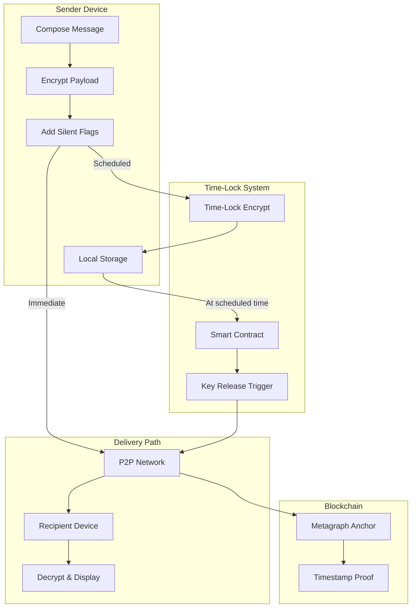

# Silent & Scheduled Private Chats Blueprint — Analysis & Improvements

## Quick Assessment

| Category | Status | Notes |
|----------|--------|-------|
| Core Concept | ✅ Strong | Clear use cases, good privacy focus |
| Architecture | ⚠️ Incomplete | Empty mermaid diagram, vague time-lock mechanism |
| Feature Coverage | ✅ Good | Comprehensive silent mode features |
| Security Model | ⚠️ Gaps | Time-lock crypto undefined, local storage risks |
| Integration | ✅ Referenced | Trust score integration mentioned |

---

## Critical Gaps

### 1. Empty Architecture Diagram

The mermaid block is empty. This is the flow that should be documented:

**Recommended Diagram:**



### 2. Time-Locked Encryption is Undefined

The blueprint claims messages use "time-locked encryption" with "smart contract automation" but provides no technical specification.

**Problem:** True time-lock cryptography is computationally expensive and complex. The blueprint doesn't specify which approach is used.

**Recommended Clarification:**

```
### Time-Lock Implementation

The system uses a **trusted key escrow** model rather than pure time-lock puzzles:

1. Sender generates a one-time message key (K_msg)
2. Message is encrypted with K_msg
3. K_msg is encrypted to a time-release service's public key
4. Smart contract holds encrypted K_msg with release timestamp
5. At scheduled time, contract releases K_msg to recipient's address
6. Recipient decrypts K_msg, then decrypts message

**Why not pure time-lock puzzles:**
- Computational cost is prohibitive for mobile devices
- Puzzle difficulty varies with hardware advances
- No reliable way to calibrate puzzle duration

**Trust assumptions:**
- Time-release service is honest-but-curious (can't read messages, must release on time)
- Multiple time-release nodes for redundancy
- Slashing conditions for early/late release
```

### 3. Local Storage Security Risks

Scheduled messages stored locally for up to 30 days create significant risks not addressed in the blueprint.

**Missing Considerations:**

| Risk | Missing Mitigation |
|------|-------------------|
| Device theft | No mention of additional encryption layer |
| Device loss | What happens to scheduled messages? |
| App uninstall | Are scheduled messages lost? |
| Storage forensics | Can deleted scheduled messages be recovered? |
| Background process killed | How is delivery ensured? |

**Recommended Addition:**

```
### Local Storage Security

**Encryption:**
- Scheduled messages encrypted with device-bound key + user PIN
- Key stored in Secure Enclave / Keystore
- Messages re-encrypted on PIN change

**Redundancy:**
- Optional encrypted backup to metagraph (premium feature)
- Recovery requires user PIN + device attestation
- Backup encrypted client-side before upload

**Background Delivery:**
- iOS: Background App Refresh + Push notification trigger
- Android: WorkManager with exact timing
- Fallback: Server-side delivery proxy for offline senders

**Secure Deletion:**
- Overwrite scheduled message storage on delivery
- Cryptographic erasure (destroy key, ciphertext becomes unrecoverable)
```

### 4. Trust Score Thresholds Undefined

The blueprint mentions "trust score-based rate limiting" but doesn't specify the actual limits.

**Recommended Specification:**

```
### Trust-Based Limits

| Trust Level | Silent Messages/Day | Scheduled Messages/Day | Max Schedule Ahead |
|-------------|---------------------|------------------------|-------------------|
| Unverified (0-19) | 5 | 3 | 24 hours |
| Newcomer (20-39) | 20 | 10 | 7 days |
| Member (40-59) | 50 | 25 | 14 days |
| Trusted (60-79) | 100 | 50 | 30 days |
| Verified (80+) | Unlimited | Unlimited | 30 days |

**Per-Recipient Limits:**
- Max 10 silent messages to same recipient per day (any trust level)
- Recipient can report silent message abuse → sender loses 5 trust points
- Repeated abuse → silent messaging disabled for 7 days
```

---

## Feature Improvements

### Silent Mode — Add Recipient Override

Recipients should have some control over silent messages.

**Add:**
```
### Recipient Silent Message Controls

* Block silent messages from specific contacts
* Require approval for silent messages from non-trusted contacts
* "Important" flag that bypasses silent mode (limited uses)
* Silent message notification summary (daily digest option)
* Emergency override for trusted contacts
```

### Message Scheduling — Add Smart Scheduling

Basic scheduling is good, but smart features would improve UX.

**Add:**
```
### Smart Scheduling Features

* "Best time to send" suggestion based on recipient activity patterns
* Business hours detection (don't schedule for 3 AM in recipient's timezone)
* Recurring message templates (weekly check-in, monthly reminder)
* Batch scheduling (schedule multiple messages at once)
* Schedule conflict detection (warn if sending too many at same time)
* "Send when online" option (deliver when recipient is active)
```

### Cross-Timezone — Add Explicit Handling

The current spec mentions timezone handling but lacks detail.

**Add:**
```
### Timezone Handling Details

**Sender Experience:**
- Show both sender and recipient local times when scheduling
- Highlight if scheduled time is outside typical waking hours
- "Send at 9 AM their time" option (auto-converts)

**Privacy Preservation:**
- Recipient timezone stored as offset, not location
- Timezone revealed only to sender (not to network)
- Option to hide timezone from all contacts

**Edge Cases:**
- DST transitions: Warn if scheduled time falls in DST gap/overlap
- Timezone changes: If recipient moves, use last known timezone
- Unknown timezone: Default to sender's timezone with warning
```

### Delivery Confirmation — Add Failure Handling

The blueprint mentions "failed delivery handling" but doesn't specify the process.

**Add:**
```
### Delivery Failure Handling

| Failure Type | Handling |
|--------------|----------|
| Recipient offline | Queue for 7 days, then expire with notification |
| Recipient blocked sender | Silent failure, message marked as "undeliverable" |
| Network error | Retry 3x with exponential backoff, then queue |
| Key release failed | Re-request from backup time-release node |
| Recipient deleted account | Notify sender, refund any premium scheduling fees |

**Sender Notifications:**
- Real-time delivery status updates
- "Message expired" notification after 7 days
- Option to resend expired messages
```

---

## New Features to Add

### 1. Silent Message Indicators for Sender

Senders should know how silent messages are being received.

```
### Silent Message Analytics (Sender View)

* Count of silent messages sent (per contact, total)
* "Viewed" indicator when recipient opens conversation
* Average time to view for silent messages
* Silent message effectiveness (did recipient respond?)
* Warning if recipient rarely checks silent messages
```

### 2. Scheduled Message Preview

Let senders see exactly what will be delivered.

```
### Pre-Delivery Preview

* View scheduled message as recipient will see it
* Edit until 5 minutes before scheduled time
* Preview includes: message content, timestamp, attachments
* Test notification (see how it appears on recipient device)
* Simulate delivery to verify formatting
```

### 3. Conditional Scheduling

Deliver based on conditions, not just time.

```
### Conditional Delivery Triggers

* "Send when recipient comes online"
* "Send after recipient reads my last message"
* "Send if I haven't heard back in X hours" (auto-followup)
* "Send only if recipient is in trusted circle" (downgrade to draft if not)
* "Cancel if conversation continues before scheduled time"

**Privacy Note:** Conditional triggers use encrypted status checks,
recipient doesn't know a message is waiting on conditions.
```

### 4. Silent Conversation Mode

Extend silent mode beyond individual messages.

```
### Silent Conversation Mode

Entire conversations can operate in silent mode:

* All messages from both parties are silent
* No typing indicators, read receipts, or badges
* Conversation hidden from main list (optional)
* Access via search or dedicated "Silent" tab
* Automatic for hidden folder conversations
* Trust score minimum to initiate silent conversations
```

### 5. Message Recall for Scheduled Messages

What if sender changes their mind?

```
### Scheduled Message Management

* Cancel scheduled message anytime before delivery
* Edit scheduled message content (new timestamp anchor)
* Reschedule to different time
* "Send now" option to deliver immediately
* Bulk management (view all scheduled, cancel multiple)
* Calendar view of scheduled messages
```

---

## Security Additions

### Threat Model

| Threat | Current Mitigation | Recommended Addition |
|--------|-------------------|---------------------|
| Silent spam | Trust score limits | Per-recipient daily caps |
| Harassment via silent | None specified | Recipient can block silent from contact |
| Scheduled message tampering | Blockchain anchor | Add edit history on-chain |
| Time-release service collusion | Not addressed | Multi-party threshold release |
| Local storage compromise | Basic encryption | Secure enclave + PIN |
| Sender device offline at delivery | Not addressed | Server-side delivery proxy |

### Abuse Prevention

```
### Anti-Abuse Measures

**Silent Message Abuse:**
- Recipient reports → sender gets warning
- 3 reports from different recipients → silent disabled 7 days
- Pattern detection: many silent messages to new contacts = flag
- Recipient can globally disable silent messages from non-contacts

**Scheduled Message Abuse:**
- Max 50 scheduled messages total (prevents spam queuing)
- Max 10 to same recipient in queue
- Scheduled messages count toward daily message limits
- Premium users get higher limits with identity verification
```

---

## Integration Recommendations

### With Messaging Blueprint

```
**Message Editing:**
- Scheduled messages can be edited before delivery (24-hour rule doesn't apply)
- Silent messages follow same 24-hour edit window after delivery

**Disappearing Messages:**
- Silent messages can be disappearing (timer starts when viewed)
- Scheduled disappearing messages: timer starts at delivery time

**Message Forwarding:**
- Forwarded messages cannot be scheduled (prevents impersonation)
- Silent mode doesn't carry to forwarded messages
```

### With Trust Network Blueprint

```
**Trust Circle Integration:**
- Inner circle: No limits on silent/scheduled
- Trusted: Standard limits
- Known: Strict limits, recipient approval for silent
- Public: Cannot send silent messages

**Trust Score Effects:**
- Sending scheduled message that gets reported: -3 points
- Receiving thanks for well-timed scheduled message: +1 point
- Silent message abuse: -5 points + feature suspension
```

---

## Summary of Recommendations

**Must Fix:**
1. Complete the architecture diagram
2. Specify time-lock encryption implementation
3. Address local storage security gaps
4. Define trust score thresholds and limits

**Should Add:**
5. Recipient controls for silent messages
6. Delivery failure handling details
7. Abuse prevention mechanisms
8. Sender device offline handling

**Nice to Have:**
9. Smart scheduling suggestions
10. Conditional delivery triggers
11. Scheduled message preview
12. Silent conversation mode
13. Calendar view of scheduled messages

---

*Analysis Date: February 5, 2026*
