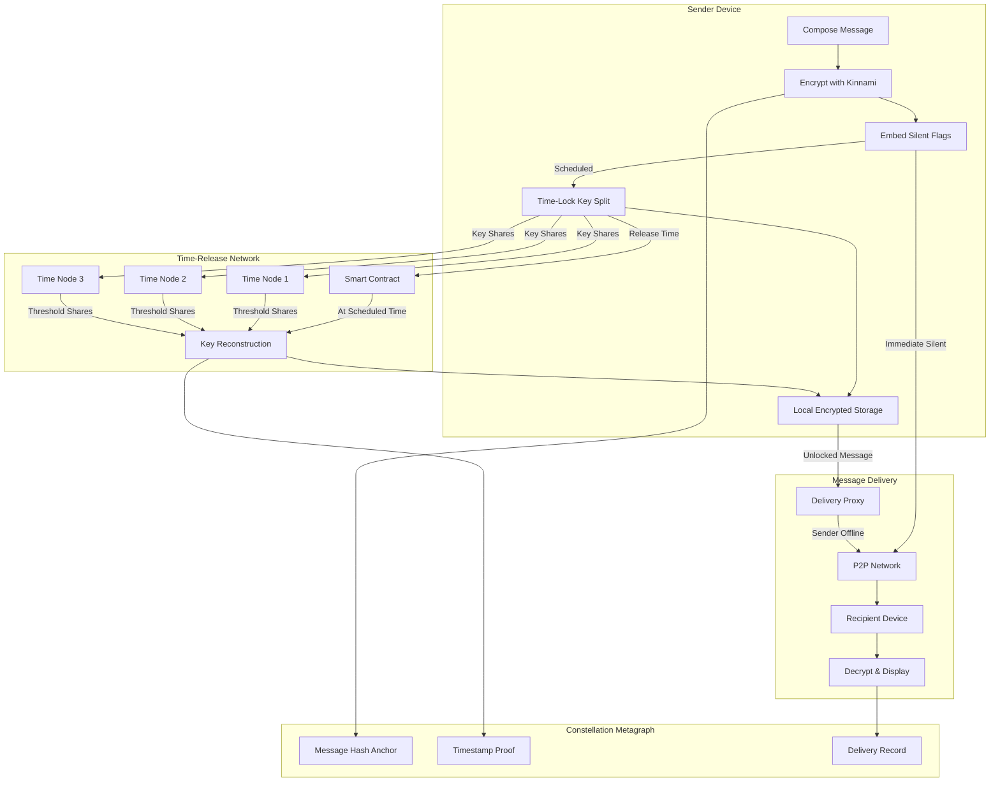

# Silent and Scheduled Private Chats

## Overview

This feature enables users to send messages that generate no notifications or visible indicators on the recipient's device, while also supporting scheduled message delivery for time-sensitive communications across different time zones or planned conversations. The system provides granular control over message visibility and timing while maintaining end-to-end encryption and blockchain anchoring for all communications.

## Architecture

Silent messages use enhanced metadata handling where notification suppression flags are embedded in the encrypted message payload. Scheduled messages use a **trusted key escrow model** where message encryption keys are held by a distributed network of time-release nodes and released at the specified delivery time through smart contract coordination.

### Silent & Scheduled Message Flow



### Architecture Components

| Component | Purpose | Technology |
|-----------|---------|------------|
| Silent Flag Encryption | Hide notification intent from relays | AES-256-GCM embedded in payload |
| Time-Lock Key Escrow | Hold keys until release time | Shamir Secret Sharing (2-of-3) |
| Time-Release Nodes | Distributed key custody | Constellation L1 validators |
| Delivery Proxy | Send when sender offline | Edge nodes with message queue |
| Smart Contract | Coordinate key release | Constellation metagraph contract |

## Key Components

### Silent Mode

Users can activate silent mode for individual conversations or specific messages, which suppresses all notification behaviors including push notifications, badge counts, typing indicators, and read receipts on the recipient's device.

**Key Features:**

* Per-conversation silent mode toggle
* Per-message silent mode option
* Push notification suppression
* Badge count suppression
* Typing indicator suppression
* Read receipt suppression
* Silent mode visual indicator (sender side only)
* Silent mode duration: 1 hour, 8 hours, 24 hours, 7 days, always

**Silent Mode States:**

| State | Sender View | Recipient View |
|-------|-------------|----------------|
| Silent message sent | 🔇 icon on message | No indicator until opened |
| Silent conversation | 🔇 badge on conversation | Normal appearance |
| Recipient views | "Seen" without timestamp | Normal message thread |

### Silent Message Delivery

Silent messages appear in the conversation thread only when the recipient actively opens the chat, creating a non-intrusive communication channel for sensitive or low-priority messages.

**Key Features:**

* Silent message appears in thread on open
* No push notification generated
* No badge count increment
* No typing indicator shown while composing
* No read receipt sent (unless recipient enables)
* Silent message marker visible to sender
* Silent message history filter
* Per-message silent toggle in compose UI

**Delivery Behavior:**

```
Normal Message:
  Send → Push Notification → Badge +1 → Typing shown → Read receipt

Silent Message:
  Send → No notification → No badge → No typing → No receipt (default)
```

### Notification Suppression Flags

Notification suppression flags are embedded in the encrypted message payload, ensuring that even relay nodes cannot determine which messages should generate notifications.

**Key Features:**

* Flags encrypted within message payload (not metadata)
* Relay nodes see identical packet structure
* Flag verified only after recipient decryption
* Tampering detected via HMAC validation
* Flags use 2-byte header inside encrypted blob
* Recipient device enforces suppression
* Flag audit log for abuse investigation (encrypted)
* Compliance verification without content exposure

**Flag Structure:**

```
Encrypted Payload:
┌─────────────────────────────────────────┐
│ Flags (2 bytes, encrypted)              │
│ ├─ Bit 0: Suppress push notification    │
│ ├─ Bit 1: Suppress badge count          │
│ ├─ Bit 2: Suppress typing indicator     │
│ ├─ Bit 3: Suppress read receipt         │
│ ├─ Bit 4: Silent conversation mode      │
│ ├─ Bit 5-7: Reserved                    │
│ └─ Byte 2: Flag version + checksum      │
├─────────────────────────────────────────┤
│ Message Content (variable length)       │
├─────────────────────────────────────────┤
│ HMAC (32 bytes)                         │
└─────────────────────────────────────────┘
```

### Message Scheduling

Users can compose messages that are delivered at predetermined times. Messages are encrypted immediately, with the decryption key split and distributed to time-release nodes until the scheduled delivery time.

**Key Features:**

* Schedule up to 30 days in advance
* Preset options: In 1 hour, Tomorrow 9 AM, Next Monday 9 AM
* Custom date/time picker with timezone display
* Timezone auto-detection with manual override
* Recurring schedules: Daily, Weekly, Monthly, Custom
* Edit message content until 5 minutes before delivery
* Cancel scheduled message anytime before delivery
* Delivery confirmation with blockchain proof

**Scheduling Limits by Trust Level:**

| Trust Level | Score Range | Max Scheduled | Max Days Ahead | Max Per Recipient |
|-------------|-------------|---------------|----------------|-------------------|
| Unverified | 0-19 | 3 total | 1 day | 1 |
| Newcomer | 20-39 | 10 total | 7 days | 3 |
| Member | 40-59 | 25 total | 14 days | 5 |
| Trusted | 60-79 | 50 total | 30 days | 10 |
| Verified | 80-100 | 100 total | 30 days | 20 |

### Time-Locked Encryption

Scheduled messages use a **trusted key escrow model** with distributed time-release nodes. This approach is more practical than pure time-lock puzzles, which are computationally expensive and difficult to calibrate.

**Key Features:**

* Message encrypted with one-time key (K_msg)
* K_msg split using Shamir Secret Sharing (2-of-3 threshold)
* Key shares distributed to 3 independent time-release nodes
* Smart contract holds release timestamp and share commitments
* At scheduled time, contract authorizes share release
* Any 2 shares reconstruct K_msg for delivery
* Unused shares destroyed after delivery + 24 hours
* Key reconstruction logged on metagraph

**Time-Lock Protocol:**

```
1. ENCRYPT
   K_msg = random_256_bit_key()
   ciphertext = AES-256-GCM(K_msg, message)
   
2. SPLIT KEY
   shares[3] = shamir_split(K_msg, threshold=2, total=3)
   commitments[3] = hash(shares[i]) for each share
   
3. DISTRIBUTE
   For each time_release_node[i]:
     encrypted_share[i] = encrypt_to_node(shares[i])
     send(node[i], encrypted_share[i])
   
4. REGISTER
   smart_contract.register(
     message_id,
     release_timestamp,
     commitments[3],
     recipient_pubkey
   )
   
5. STORE LOCALLY
   local_storage.save(message_id, ciphertext, metadata)
   
6. AT RELEASE TIME
   smart_contract.trigger_release(message_id)
   
   For each node[i]:
     if contract.authorized(message_id):
       release(shares[i], recipient_pubkey)
   
7. RECONSTRUCT & DELIVER
   K_msg = shamir_reconstruct(shares[any_2])
   plaintext = decrypt(K_msg, ciphertext)
   deliver_to_recipient(plaintext)
   
8. CLEANUP
   destroy(K_msg, shares)
   log_delivery(metagraph)
```

**Trust Assumptions:**

| Assumption | Mitigation |
|------------|------------|
| Time nodes are honest | 2-of-3 threshold tolerates 1 malicious node |
| Nodes release on time | Slashing conditions for early/late release |
| Nodes don't collude | Nodes selected from different validator pools |
| Network available at release | 24-hour release window with retries |

### Local Message Storage

Scheduled messages are encrypted and stored locally on the sender's device until delivery. The local copy ensures message availability even if the sender's device is offline at the scheduled time.

**Key Features:**

* AES-256 encryption with device-bound key
* Key stored in Secure Enclave (iOS) / Keystore (Android)
* Additional PIN/biometric protection layer
* Message integrity verification on each access
* Automatic cleanup after confirmed delivery
* Optional encrypted backup to metagraph
* Recovery via PIN + device attestation
* Storage limit: 100 scheduled messages, 50 MB total

**Local Storage Security:**

```
Storage Encryption Layers:

┌─────────────────────────────────────────┐
│ Layer 1: iOS Data Protection /          │
│          Android Keystore               │
├─────────────────────────────────────────┤
│ Layer 2: App-level AES-256              │
│          Key: Secure Enclave bound      │
├─────────────────────────────────────────┤
│ Layer 3: User PIN/Biometric             │
│          Required for scheduled tab     │
├─────────────────────────────────────────┤
│ Scheduled Message Data (encrypted)      │
└─────────────────────────────────────────┘
```

**Offline Delivery Handling:**

| Scenario | Handling |
|----------|----------|
| Sender online at delivery | Direct P2P delivery from sender device |
| Sender offline at delivery | Delivery proxy retrieves ciphertext, delivers |
| Sender device lost | Backup restored to new device, or message lost |
| App uninstalled | Scheduled messages lost (warning shown before uninstall) |
| Device storage full | Oldest drafts auto-deleted, scheduled preserved |

### Delivery Proxy Service

When the sender's device is offline at the scheduled delivery time, a delivery proxy service ensures the message is still sent.

**Key Features:**

* Encrypted message blob uploaded to proxy 1 hour before delivery
* Proxy cannot decrypt message content
* Proxy holds only ciphertext + delivery metadata
* At release time, proxy delivers via P2P network
* Delivery confirmation relayed to sender device
* Proxy deletes blob after confirmed delivery
* Fallback: 3 proxy nodes for redundancy

**Proxy Protocol:**

```
1. T minus 1 hour:
   Sender device uploads to proxy:
   - Encrypted ciphertext (proxy can't read)
   - Recipient address
   - Scheduled timestamp
   - Delivery proof request

2. At scheduled time:
   Proxy receives key from time-release network
   Proxy delivers encrypted message to recipient
   Proxy records delivery hash

3. After delivery:
   Proxy sends confirmation to sender
   Proxy deletes all message data
   Delivery logged on metagraph
```

### Cross-Timezone Scheduling

The system supports scheduling in the recipient's local time while preserving privacy. Recipients can share timezone preferences without revealing precise location.

**Key Features:**

* Sender sees both local and recipient time when scheduling
* "Send at 9 AM their time" convenience option
* Recipient timezone stored as UTC offset only (not location)
* Timezone shared only with approved contacts
* DST transitions handled with warnings
* Unknown timezone defaults to sender's with notice
* Manual recipient timezone input option

**Timezone Privacy Model:**

```
Recipient Timezone Sharing:

┌─────────────────────────────────────────┐
│ Privacy Setting          │ Shared Info  │
├─────────────────────────────────────────┤
│ "Share with everyone"    │ UTC offset   │
│ "Share with contacts"    │ UTC offset   │
│ "Share with trusted"     │ UTC offset   │
│ "Don't share"            │ Nothing      │
└─────────────────────────────────────────┘

Note: Only UTC offset shared (e.g., UTC-5), 
never city/region/coordinates
```

**Scheduling UI:**

```
┌─────────────────────────────────────────┐
│ Schedule Message                        │
├─────────────────────────────────────────┤
│ Date: [February 10, 2026      ▼]        │
│ Time: [9:00 AM                ▼]        │
│                                         │
│ Your time:    9:00 AM EST (UTC-5)       │
│ Their time:   3:00 PM CET (UTC+1)       │
│                                         │
│ ⚠️ This is outside typical waking hours │
│    in recipient's timezone              │
│                                         │
│ [ ] Send at 9 AM their time instead     │
│                                         │
│ [Cancel]              [Schedule Message]│
└─────────────────────────────────────────┘
```

### Trust Score Integration

The feature integrates with the trust scoring system to prevent abuse. Users with low trust scores face limitations on silent and scheduled messaging frequency.

**Key Features:**

* Trust score-based rate limiting (see table above)
* Silent message daily limits by trust level
* Scheduled message queue limits by trust level
* Per-recipient limits prevent targeted harassment
* Limit violations logged but not blocking
* Soft limits warn, hard limits block
* Appeal process for limit increases
* Transparent limit display in settings

**Silent Message Limits:**

| Trust Level | Silent/Day Total | Silent/Day Per Recipient |
|-------------|------------------|--------------------------|
| Unverified | 5 | 2 |
| Newcomer | 20 | 5 |
| Member | 50 | 10 |
| Trusted | 100 | 20 |
| Verified | Unlimited | 50 |

**Abuse Detection:**

```
Abuse Signals:
- Many silent messages to new contacts → Flag for review
- Recipient reports silent spam → Sender loses 5 trust points
- 3+ reports from different recipients → Silent disabled 7 days
- Scheduled message reported → Sender loses 3 trust points
- Pattern: schedule → cancel → reschedule → Flag manipulation
```

### Recipient Controls

Recipients have control over how they receive silent and scheduled messages.

**Key Features:**

* Block silent messages from specific contacts
* Block silent messages from non-contacts entirely
* Require approval for silent messages from "Known" circle
* Daily digest option for silent messages
* Emergency bypass: Trusted contacts can override silent once/day
* Report silent message as spam/harassment
* View silent message history separately

**Recipient Settings:**

```
Silent Message Preferences:
├─ Accept silent messages from:
│  ○ Everyone
│  ○ Contacts only
│  ○ Trusted circle only
│  ○ Inner circle only
│  ○ Nobody
│
├─ Daily silent message digest:
│  [ ] Send summary at [9:00 PM ▼]
│
├─ Emergency override:
│  [✓] Allow trusted contacts to bypass silent (1x/day)
│
└─ Blocked from silent:
   [Alice] [Bob] [+ Add contact]
```

### Blockchain Anchoring

All scheduled messages maintain full blockchain anchoring with cryptographically verified delivery timestamps.

**Key Features:**

* Message hash anchored at composition time
* Scheduled timestamp recorded in smart contract
* Actual delivery timestamp anchored on delivery
* Delta between scheduled and actual recorded
* Integrity proof generation for legal/compliance
* Proof shareable without revealing content
* Audit trail queryable by message ID
* Compliance export for enterprise users

**Anchoring Data Structure:**

```
Metagraph Record:
{
  "message_id": "msg_abc123...",
  "composition_hash": "sha256:def456...",
  "composition_timestamp": "2026-02-05T10:00:00Z",
  "scheduled_delivery": "2026-02-10T14:00:00Z",
  "actual_delivery": "2026-02-10T14:00:03Z",
  "delivery_delta_ms": 3000,
  "delivery_proof": "sig:789abc...",
  "recipient_confirmation": "sig:xyz123...",
  "anchor_tx": "tx_hash:fedcba..."
}
```

### Delivery Confirmation

Users receive confirmation when scheduled messages are delivered, including timestamp verification and blockchain proof.

**Key Features:**

* Push notification on successful delivery
* Delivery timestamp with blockchain proof
* "View proof" option shows metagraph record
* Failed delivery notification with reason
* Automatic retry for transient failures
* Manual retry option after 3 auto-retries
* Delivery history tab in scheduled messages
* Export delivery proofs for records

**Delivery Status Flow:**

```
Scheduled → Pending → Releasing Key → Delivering → Delivered
                                          ↓
                                    Failed (Retry)
                                          ↓
                                    Failed (Manual)
                                          ↓
                                    Expired (7 days)
```

**Failure Handling:**

| Failure Type | Auto-Retry | User Action | Message Fate |
|--------------|------------|-------------|--------------|
| Recipient offline | Yes, 24h | Wait or cancel | Queued 7 days |
| Network error | Yes, 3x | Retry or cancel | Queued 7 days |
| Key release failed | Yes, backup nodes | Contact support | Queued 7 days |
| Recipient blocked sender | No | Notified | Marked undeliverable |
| Recipient deleted account | No | Notified | Marked undeliverable |
| Expired after 7 days | No | Resend as new | Deleted |

### Scheduled Message Management

Users can view, edit, and manage all scheduled messages from a dedicated interface.

**Key Features:**

* Calendar view of all scheduled messages
* List view sorted by delivery time
* Edit message content (until 5 min before)
* Reschedule to different time
* Cancel and delete scheduled message
* "Send now" to deliver immediately
* Bulk actions: cancel multiple, reschedule multiple
* Search scheduled messages by recipient or content

**Management UI:**

```
┌─────────────────────────────────────────┐
│ Scheduled Messages                   ⚙️ │
├─────────────────────────────────────────┤
│ [Calendar View] [List View]             │
│                                         │
│ February 2026                           │
│ ┌───┬───┬───┬───┬───┬───┬───┐          │
│ │Sun│Mon│Tue│Wed│Thu│Fri│Sat│          │
│ ├───┼───┼───┼───┼───┼───┼───┤          │
│ │   │   │   │   │   │   │ 1 │          │
│ │ 2 │ 3 │ 4 │ 5●│ 6 │ 7 │ 8 │          │
│ │ 9 │10●│11 │12 │13 │14●│15 │          │
│ └───┴───┴───┴───┴───┴───┴───┘          │
│ ● = Scheduled messages                  │
│                                         │
│ Upcoming:                               │
│ ┌─────────────────────────────────────┐ │
│ │ 📅 Feb 5, 9:00 AM → Alice           │ │
│ │ "Don't forget our meeting..."       │ │
│ │ [Edit] [Reschedule] [Send Now] [×]  │ │
│ └─────────────────────────────────────┘ │
│ ┌─────────────────────────────────────┐ │
│ │ 📅 Feb 10, 2:00 PM → Bob            │ │
│ │ "Happy birthday! Hope you..."       │ │
│ │ [Edit] [Reschedule] [Send Now] [×]  │ │
│ └─────────────────────────────────────┘ │
└─────────────────────────────────────────┘
```

### Conditional Delivery (Premium Feature)

Premium users can set conditions for message delivery beyond simple time scheduling.

**Key Features:**

* "Send when recipient comes online"
* "Send after recipient reads my last message"
* "Send if no reply in X hours" (auto-followup)
* "Cancel if conversation continues" (draft becomes obsolete)
* Condition timeout: max 7 days, then expires or sends
* Combine conditions: time AND online, time OR read
* Privacy: recipient unaware of pending conditional messages

**Condition Types:**

| Condition | Trigger | Privacy |
|-----------|---------|---------|
| Online | Recipient status changes to online | Status check encrypted |
| Read | Recipient reads specified message | Read receipt required |
| No reply | Timer expires without incoming message | Local timer only |
| Conversation idle | No messages either direction for X hours | Local detection |

### Smart Scheduling Suggestions

The system suggests optimal delivery times based on recipient activity patterns.

**Key Features:**

* "Best time to send" suggestion based on historical read times
* Warning if scheduled for outside waking hours
* Business hours detection (M-F 9-5 in recipient TZ)
* Holiday awareness (optional calendar integration)
* Response likelihood indicator
* A/B learning: system improves suggestions over time
* Privacy: analysis done locally on sender device

**Suggestion UI:**

```
┌─────────────────────────────────────────┐
│ 💡 Suggested times for Alice:           │
│                                         │
│ ● 9:15 AM their time (92% response)     │
│ ○ 1:00 PM their time (78% response)     │
│ ○ 6:30 PM their time (65% response)     │
│                                         │
│ Based on Alice's typical activity       │
└─────────────────────────────────────────┘
```

## Security Principles

* Silent message flags are encrypted within the message payload, invisible to relay nodes
* Relay nodes see identical packet structures for silent and normal messages
* Scheduled messages use 2-of-3 threshold key escrow, tolerating 1 malicious node
* Time-release nodes selected from independent validator pools to prevent collusion
* Local storage uses three encryption layers: OS, app, and user PIN
* Delivery proxy holds only ciphertext, cannot read message content
* All delivery timestamps cryptographically anchored to metagraph
* Trust score integration prevents spam and harassment via rate limiting
* Recipients control who can send silent messages to them
* Recipient timezone shared as UTC offset only, never revealing location
* Failed deliveries retry automatically with graceful degradation
* All communication remains end-to-end encrypted throughout the flow

## Integration Points

### With Messaging Blueprint

* Silent messages follow same 24-hour edit window after delivery
* Scheduled messages can be edited freely until 5 minutes before delivery
* Disappearing message timer starts at actual delivery time for scheduled
* Silent + disappearing: timer starts when recipient opens conversation
* Forwarded messages cannot be scheduled (prevents impersonation abuse)
* Silent mode flag does not transfer to forwarded messages
* Pinned messages: scheduled messages can be pinned after delivery
* Reactions: available on silent messages after recipient views

### With Trust Network Blueprint

* Trust circles affect silent message permissions (see Recipient Controls)
* Inner circle: no limits, emergency bypass allowed
* Trusted circle: standard limits, silent allowed by default
* Known circle: strict limits, recipient approval option
* Public: cannot send silent messages
* Endorsements: "Respectful communicator" badge unlocks higher silent limits
* Reports: silent spam reports reduce trust score by 5 points
* Appeals: trust score appeals can include silent limit increase request

## Appendix: Error Codes

| Code | Meaning | User Message |
|------|---------|--------------|
| SILENT_001 | Recipient blocked silent messages | "This contact doesn't accept silent messages" |
| SILENT_002 | Daily limit exceeded | "You've reached your daily silent message limit" |
| SCHED_001 | Queue full | "You have too many scheduled messages. Send or cancel some first" |
| SCHED_002 | Too far in advance | "You can only schedule up to [X] days ahead" |
| SCHED_003 | Edit window closed | "This message can no longer be edited" |
| SCHED_004 | Key release failed | "Delivery delayed. Retrying automatically" |
| SCHED_005 | Recipient unavailable | "Could not deliver. Recipient may have deleted their account" |
| SCHED_006 | Expired | "Message expired after 7 days without delivery" |

---

*Blueprint Version: 2.0*  
*Last Updated: February 5, 2026*  
*Status: Complete with Implementation Details*
