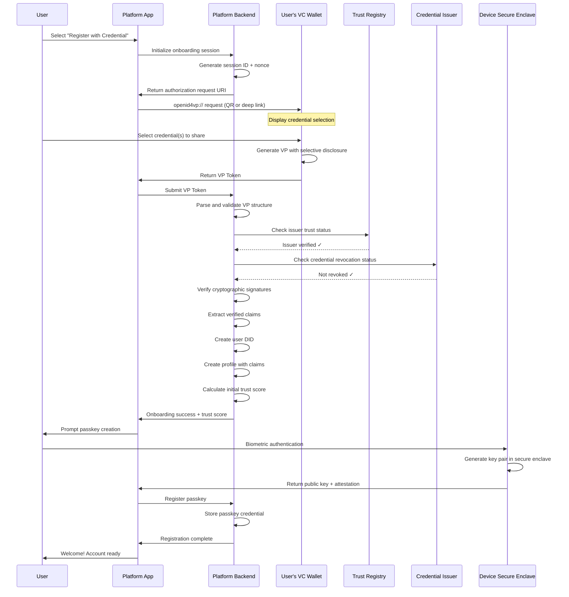

# Streamlined Onboarding with Verifiable Credentials and Passkeys

## Overview

This feature streamlines the user enrollment and registration process by enabling new users to onboard instantly using industry-standard Verifiable Credentials, compliant with the OpenID Connect for Verifiable Credentials (OIDC4VC) specification. This method allows users to establish a high-trust identity from the moment they join the platform by presenting pre-existing, cryptographically verified credentials from trusted issuers like governments or financial institutions. The process also incorporates passkey creation, providing secure, passwordless access for subsequent logins.

## Architecture

The onboarding flow uses OIDC4VC-compliant requests (specifically OID4VP - OpenID for Verifiable Presentations) to enable users to present existing verifiable credentials. The system verifies credential signatures against issuer public keys, checks issuer status against a distributed trust registry anchored on Constellation Network, and confirms credentials have not been revoked via status list checks. Upon successful verification, the user's DID is created, their profile is automatically populated with verified claims, and they're prompted to create a passkey for passwordless authentication.

### OIDC4VC Onboarding Flow



### Architecture Components

| Component | Technology | Purpose |
|-----------|------------|---------|
| OIDC4VP Server | Custom + Spruce/SpruceID | Handle VP requests and responses |
| Credential Verifier | did-jwt-vc + jsonld-signatures | Verify VC/VP signatures |
| Trust Registry | Constellation Metagraph | Decentralized issuer registry |
| Revocation Checker | StatusList2021 | Check credential revocation |
| DID Resolver | Universal Resolver | Resolve issuer DIDs |
| Passkey Server | WebAuthn/FIDO2 | Handle passkey registration/auth |
| Secure Enclave | Platform Authenticator | Store passkey private keys |

### Data Model

```typescript
// Onboarding Session
interface OnboardingSession {
  sessionId: string;
  status: OnboardingStatus;
  
  // Request parameters
  request: {
    nonce: string;
    state: string;
    responseUri: string;
    presentationDefinition: PresentationDefinition;
    createdAt: Date;
    expiresAt: Date;
  };
  
  // Received credentials
  presentation?: {
    vpToken: string;
    presentationSubmission: PresentationSubmission;
    receivedAt: Date;
  };
  
  // Verification results
  verification?: {
    credentialsVerified: CredentialVerification[];
    issuersTrusted: boolean;
    notRevoked: boolean;
    overallValid: boolean;
    verifiedAt: Date;
  };
  
  // Extracted claims
  claims?: {
    givenName?: string;
    familyName?: string;
    dateOfBirth?: string;
    nationality?: string;
    documentNumber?: string;
    documentType?: string;
    issuingCountry?: string;
    // Additional claims based on credential type
    [key: string]: any;
  };
  
  // Created account
  account?: {
    userId: string;
    did: string;
    trustScore: number;
    verificationBadge: VerificationBadge;
    passkeyRegistered: boolean;
  };
  
  // Metadata
  clientInfo: {
    userAgent: string;
    ipAddress: string;
    deviceFingerprint: string;
  };
}

type OnboardingStatus =
  | 'initiated'           // Session created, awaiting wallet
  | 'wallet_connected'    // Wallet connected, awaiting selection
  | 'credentials_received'// VP received, verifying
  | 'verification_failed' // Verification failed
  | 'verified'           // Credentials verified
  | 'account_created'    // Account created, awaiting passkey
  | 'passkey_pending'    // Passkey creation in progress
  | 'completed'          // Fully onboarded
  | 'expired'            // Session expired
  | 'cancelled';         // User cancelled

// Verifiable Credential (W3C VC Data Model 2.0)
interface VerifiableCredential {
  '@context': string[];
  type: string[];
  id?: string;
  issuer: string | { id: string; name?: string };
  issuanceDate: string;
  expirationDate?: string;
  credentialSubject: {
    id?: string;
    [key: string]: any;
  };
  credentialStatus?: {
    id: string;
    type: 'StatusList2021Entry' | 'RevocationList2020';
    statusPurpose: 'revocation' | 'suspension';
    statusListIndex: string;
    statusListCredential: string;
  };
  proof: CredentialProof;
}

interface CredentialProof {
  type: 'DataIntegrityProof' | 'Ed25519Signature2020' | 'JsonWebSignature2020';
  cryptosuite?: string;
  created: string;
  verificationMethod: string;
  proofPurpose: 'assertionMethod';
  proofValue: string;
}

// Verifiable Presentation
interface VerifiablePresentation {
  '@context': string[];
  type: ['VerifiablePresentation'];
  holder: string;
  verifiableCredential: VerifiableCredential[];
  proof: PresentationProof;
}

interface PresentationProof {
  type: string;
  created: string;
  verificationMethod: string;
  proofPurpose: 'authentication';
  challenge: string;              // Must match session nonce
  domain: string;                 // Must match our domain
  proofValue: string;
}

// Trust Registry Entry
interface TrustedIssuer {
  issuerId: string;              // DID of issuer
  name: string;
  type: IssuerType;
  jurisdiction: string;
  
  // Trust level
  trustLevel: TrustLevel;
  credentialTypesIssued: CredentialType[];
  
  // Verification
  verificationMethod: string[];   // Public keys for signature verification
  statusEndpoint?: string;        // For revocation checking
  
  // Registry metadata
  addedAt: Date;
  addedBy: string;               // Governance decision
  status: 'active' | 'suspended' | 'revoked';
  lastVerified: Date;
  
  // Blockchain anchor
  anchor: {
    txHash: string;
    snapshotId: string;
  };
}

type IssuerType =
  | 'government'
  | 'financial_institution'
  | 'educational'
  | 'healthcare'
  | 'employer'
  | 'identity_provider'
  | 'other';

type TrustLevel =
  | 'high'      // Government, regulated financial
  | 'medium'    // Educational, healthcare
  | 'basic';    // Other verified issuers

type CredentialType =
  | 'government_id'
  | 'passport'
  | 'drivers_license'
  | 'national_id'
  | 'bank_account'
  | 'proof_of_address'
  | 'employment'
  | 'education'
  | 'age_verification'
  | 'email_verification'
  | 'phone_verification';

// Passkey Registration
interface PasskeyCredential {
  credentialId: string;
  
  // User binding
  userId: string;
  userHandle: Uint8Array;
  
  // Credential details
  publicKey: Uint8Array;
  publicKeyAlgorithm: number;    // -7 (ES256) or -257 (RS256)
  
  // Attestation
  attestationFormat: string;
  attestationData?: Uint8Array;
  
  // Authenticator info
  authenticator: {
    aaguid: string;
    signCount: number;
    transports: AuthenticatorTransport[];
    backupEligible: boolean;
    backupState: boolean;
  };
  
  // Metadata
  createdAt: Date;
  lastUsedAt: Date;
  deviceName?: string;
}

type AuthenticatorTransport =
  | 'usb'
  | 'nfc'
  | 'ble'
  | 'internal'    // Platform authenticator
  | 'hybrid';     // Cross-device

// Presentation Definition (DIF PE)
interface PresentationDefinition {
  id: string;
  name: string;
  purpose: string;
  input_descriptors: InputDescriptor[];
}

interface InputDescriptor {
  id: string;
  name: string;
  purpose: string;
  constraints: {
    fields: FieldConstraint[];
  };
}

interface FieldConstraint {
  path: string[];               // JSONPath to claim
  filter?: {
    type: string;
    pattern?: string;
    minimum?: number;
    maximum?: number;
  };
  optional?: boolean;
}
```

## Key Components

### OIDC4VP Authorization Request

The platform generates an OpenID4VP authorization request that specifies which credentials are accepted.

**Key Features:**

* Standards-compliant request generation
* QR code and deep link support
* Presentation definition with selective disclosure
* Cross-device flow support
* Session management
* Request expiration

**Authorization Request Implementation:**

```typescript
interface OIDC4VPService {
  // Generate authorization request
  async createAuthorizationRequest(
    sessionId: string
  ): Promise<AuthorizationRequest> {
    const nonce = generateSecureNonce();
    const state = generateSecureState();
    
    // Define what credentials we accept
    const presentationDefinition: PresentationDefinition = {
      id: `pd-${sessionId}`,
      name: 'Identity Verification',
      purpose: 'Verify your identity to create an account',
      input_descriptors: [
        {
          id: 'government_id',
          name: 'Government-Issued ID',
          purpose: 'Prove your identity with a government credential',
          constraints: {
            fields: [
              {
                path: ['$.type'],
                filter: {
                  type: 'array',
                  contains: {
                    type: 'string',
                    enum: [
                      'GovernmentId',
                      'Passport',
                      'DriversLicense',
                      'NationalIdCard',
                    ],
                  },
                },
              },
              {
                path: ['$.credentialSubject.givenName'],
              },
              {
                path: ['$.credentialSubject.familyName'],
              },
              {
                path: ['$.credentialSubject.dateOfBirth'],
              },
            ],
          },
        },
      ],
    };
    
    const request: AuthorizationRequest = {
      response_type: 'vp_token',
      response_mode: 'direct_post',
      client_id: process.env.PLATFORM_DID,
      redirect_uri: `${process.env.API_BASE}/oidc4vp/response`,
      state,
      nonce,
      presentation_definition: presentationDefinition,
    };
    
    // Store session
    await storeOnboardingSession(sessionId, {
      nonce,
      state,
      presentationDefinition,
      createdAt: new Date(),
      expiresAt: new Date(Date.now() + 10 * 60 * 1000), // 10 minutes
    });
    
    // Generate request URI
    const requestUri = `openid4vp://?${new URLSearchParams({
      client_id: request.client_id,
      request_uri: `${process.env.API_BASE}/oidc4vp/request/${sessionId}`,
    })}`;
    
    return {
      requestUri,
      qrCode: await generateQRCode(requestUri),
      deepLink: requestUri,
      expiresAt: new Date(Date.now() + 10 * 60 * 1000),
    };
  }
}
```

**Supported Credential Types:**

| Credential Type | Trust Level | Initial Trust Score | Badge |
|-----------------|-------------|---------------------|-------|
| Government Passport | High | 85 | 🛂 Passport Verified |
| National ID Card | High | 85 | 🪪 ID Verified |
| Driver's License | High | 80 | 🚗 License Verified |
| Bank Account (KYC'd) | High | 75 | 🏦 Bank Verified |
| Educational Credential | Medium | 60 | 🎓 Education Verified |
| Employer Credential | Medium | 55 | 💼 Employment Verified |
| Phone Verification | Basic | 30 | 📱 Phone Verified |
| Email Verification | Basic | 25 | ✉️ Email Verified |

### Credential Verification Pipeline

Multi-stage verification ensures credential authenticity.

**Verification Stages:**

```mermaid
flowchart LR
    subgraph Stage1["Stage 1: Structure"]
        S1[Parse VP/VC]
        S2[Validate Schema]
        S3[Check Expiration]
    end
    
    subgraph Stage2["Stage 2: Issuer"]
        I1[Resolve Issuer DID]
        I2[Query Trust Registry]
        I3[Verify Trust Level]
    end
    
    subgraph Stage3["Stage 3: Cryptographic"]
        C1[Extract Public Key]
        C2[Verify VC Signature]
        C3[Verify VP Signature]
        C4[Verify Challenge/Nonce]
    end
    
    subgraph Stage4["Stage 4: Revocation"]
        R1[Fetch Status List]
        R2[Check Revocation Bit]
        R3[Check Suspension]
    end
    
    subgraph Stage5["Stage 5: Claims"]
        CL1[Extract Claims]
        CL2[Validate Formats]
        CL3[Apply Business Rules]
    end
    
    S1 --> S2 --> S3 --> I1
    I1 --> I2 --> I3 --> C1
    C1 --> C2 --> C3 --> C4 --> R1
    R1 --> R2 --> R3 --> CL1
    CL1 --> CL2 --> CL3 --> DONE[Verification Complete]
```



**Implementation:**

```typescript
interface CredentialVerificationService {
  // Full verification pipeline
  async verifyPresentation(
    vpToken: string,
    session: OnboardingSession
  ): Promise<VerificationResult> {
    const results: VerificationResult = {
      valid: false,
      stages: [],
      credentials: [],
      claims: {},
    };
    
    try {
      // Stage 1: Parse and validate structure
      const stage1 = await this.validateStructure(vpToken);
      results.stages.push(stage1);
      if (!stage1.passed) throw new VerificationError('Invalid VP structure');
      
      const vp = stage1.data as VerifiablePresentation;
      
      // Verify VP holder signature and challenge
      const vpValid = await this.verifyPresentationSignature(vp, session.request.nonce);
      if (!vpValid) throw new VerificationError('Invalid VP signature');
      
      // Process each credential
      for (const vc of vp.verifiableCredential) {
        const credResult = await this.verifyCredential(vc);
        results.credentials.push(credResult);
        
        if (credResult.valid) {
          // Extract claims
          Object.assign(results.claims, credResult.claims);
        }
      }
      
      // Check all credentials are valid
      results.valid = results.credentials.every(c => c.valid);
      
      return results;
      
    } catch (error) {
      results.error = error.message;
      return results;
    }
  }
  
  // Verify individual credential
  async verifyCredential(
    vc: VerifiableCredential
  ): Promise<CredentialVerificationResult> {
    // Stage 2: Issuer verification
    const issuerId = typeof vc.issuer === 'string' ? vc.issuer : vc.issuer.id;
    
    // Resolve issuer DID
    const issuerDoc = await this.didResolver.resolve(issuerId);
    if (!issuerDoc) {
      return { valid: false, error: 'Cannot resolve issuer DID' };
    }
    
    // Check trust registry
    const trustedIssuer = await this.trustRegistry.getIssuer(issuerId);
    if (!trustedIssuer || trustedIssuer.status !== 'active') {
      return { valid: false, error: 'Issuer not in trust registry' };
    }
    
    // Stage 3: Cryptographic verification
    const verificationMethod = issuerDoc.verificationMethod.find(
      vm => vm.id === vc.proof.verificationMethod
    );
    if (!verificationMethod) {
      return { valid: false, error: 'Verification method not found' };
    }
    
    const signatureValid = await this.verifySignature(
      vc,
      verificationMethod.publicKeyJwk || verificationMethod.publicKeyMultibase
    );
    if (!signatureValid) {
      return { valid: false, error: 'Invalid credential signature' };
    }
    
    // Stage 4: Revocation check
    if (vc.credentialStatus) {
      const revoked = await this.checkRevocation(vc.credentialStatus);
      if (revoked) {
        return { valid: false, error: 'Credential has been revoked' };
      }
    }
    
    // Stage 5: Extract claims
    const claims = this.extractClaims(vc);
    
    // Check expiration
    if (vc.expirationDate && new Date(vc.expirationDate) < new Date()) {
      return { valid: false, error: 'Credential has expired' };
    }
    
    return {
      valid: true,
      issuer: trustedIssuer,
      credentialType: vc.type,
      claims,
      trustLevel: trustedIssuer.trustLevel,
    };
  }
  
  // Check revocation status using StatusList2021
  async checkRevocation(
    status: CredentialStatus
  ): Promise<boolean> {
    if (status.type !== 'StatusList2021Entry') {
      // Unknown status type, cannot verify
      return false;
    }
    
    // Fetch status list credential
    const statusListVC = await fetch(status.statusListCredential)
      .then(r => r.json());
    
    // Verify status list credential itself
    const statusListValid = await this.verifyCredential(statusListVC);
    if (!statusListValid.valid) {
      throw new VerificationError('Invalid status list credential');
    }
    
    // Decode status list (compressed bitstring)
    const encodedList = statusListVC.credentialSubject.encodedList;
    const statusList = await decodeStatusList(encodedList);
    
    // Check bit at index
    const index = parseInt(status.statusListIndex);
    const isRevoked = statusList.getBit(index) === 1;
    
    return isRevoked;
  }
}
```

### Trust Registry

Decentralized registry of trusted credential issuers anchored on Constellation Network.

**Key Features:**

* Decentralized storage on metagraph
* Governance-controlled updates
* Automated issuer verification
* Real-time status checks
* Multi-jurisdiction support
* Audit trail

**Trust Registry Implementation:**

```typescript
interface TrustRegistryService {
  // Add trusted issuer (governance action)
  async addIssuer(
    proposal: IssuerProposal,
    governanceApproval: GovernanceApproval
  ): Promise<TrustedIssuer> {
    // Verify governance approval
    await this.verifyGovernanceApproval(governanceApproval);
    
    // Verify issuer DID is resolvable
    const issuerDoc = await this.didResolver.resolve(proposal.issuerId);
    if (!issuerDoc) {
      throw new Error('Cannot resolve issuer DID');
    }
    
    const issuer: TrustedIssuer = {
      issuerId: proposal.issuerId,
      name: proposal.name,
      type: proposal.type,
      jurisdiction: proposal.jurisdiction,
      trustLevel: proposal.trustLevel,
      credentialTypesIssued: proposal.credentialTypesIssued,
      verificationMethod: issuerDoc.verificationMethod.map(vm => vm.id),
      statusEndpoint: proposal.statusEndpoint,
      addedAt: new Date(),
      addedBy: governanceApproval.proposalId,
      status: 'active',
      lastVerified: new Date(),
      anchor: await this.anchorToBlockchain({ issuer: proposal }),
    };
    
    await this.storage.set(`issuer:${proposal.issuerId}`, issuer);
    
    return issuer;
  }
  
  // Get issuer from registry
  async getIssuer(issuerId: string): Promise<TrustedIssuer | null> {
    const issuer = await this.storage.get(`issuer:${issuerId}`);
    
    if (issuer) {
      // Refresh verification if stale
      if (this.isStale(issuer.lastVerified)) {
        await this.refreshIssuerStatus(issuerId);
      }
    }
    
    return issuer;
  }
  
  // Check if issuer is trusted for credential type
  async isTrustedFor(
    issuerId: string,
    credentialType: CredentialType
  ): Promise<boolean> {
    const issuer = await this.getIssuer(issuerId);
    
    if (!issuer || issuer.status !== 'active') {
      return false;
    }
    
    return issuer.credentialTypesIssued.includes(credentialType);
  }
}
```

**Initial Trusted Issuers:**

| Issuer | Type | Jurisdiction | Credentials | Trust Level |
|--------|------|--------------|-------------|-------------|
| AU Post Digital ID | Government | Australia | National ID | High |
| UK Gov Verify | Government | UK | National ID | High |
| EU Digital ID Wallet | Government | EU | National ID, Passport | High |
| Singapore SingPass | Government | Singapore | National ID | High |
| India DigiLocker | Government | India | National ID, Driving License | High |
| Yoti | Identity Provider | Global | Age Verification, ID | Medium |
| Plaid | Financial | US | Bank Account | High |
| Stripe Identity | Identity Provider | Global | ID Verification | Medium |

### Trust Score Calculation

Initial trust score based on credential type and issuer trust level.

**Trust Score Matrix:**

| Credential Type | High Trust Issuer | Medium Trust Issuer | Basic Trust Issuer |
|-----------------|-------------------|---------------------|-------------------|
| Passport | 90 | 70 | N/A |
| National ID | 85 | 65 | N/A |
| Driver's License | 80 | 60 | N/A |
| Bank Account | 75 | 55 | 40 |
| Employment | 60 | 45 | 30 |
| Education | 55 | 40 | 25 |
| Phone Verification | 35 | 30 | 25 |
| Email Verification | 30 | 25 | 20 |

**Multiple Credentials Bonus:**

| Credentials Presented | Bonus |
|----------------------|-------|
| 2 credentials | +5 |
| 3 credentials | +10 |
| 4+ credentials | +15 |

**Trust Score Calculation:**

```typescript
function calculateInitialTrustScore(
  verifiedCredentials: CredentialVerificationResult[]
): TrustScoreResult {
  // Sort by trust score (highest first)
  const sorted = verifiedCredentials
    .filter(c => c.valid)
    .sort((a, b) => getTrustScore(b) - getTrustScore(a));
  
  if (sorted.length === 0) {
    return { score: 0, badge: null };
  }
  
  // Base score from highest credential
  let score = getTrustScore(sorted[0]);
  
  // Add diminishing bonuses for additional credentials
  for (let i = 1; i < sorted.length; i++) {
    const additionalScore = getTrustScore(sorted[i]);
    score += additionalScore * (0.2 / i); // Diminishing returns
  }
  
  // Multi-credential bonus
  if (sorted.length >= 4) score += 15;
  else if (sorted.length >= 3) score += 10;
  else if (sorted.length >= 2) score += 5;
  
  // Cap at 100
  score = Math.min(100, Math.round(score));
  
  // Determine badge based on primary credential
  const badge = determineBadge(sorted[0]);
  
  return { score, badge };
}

function getTrustScore(credential: CredentialVerificationResult): number {
  const trustMatrix = {
    passport: { high: 90, medium: 70 },
    national_id: { high: 85, medium: 65 },
    drivers_license: { high: 80, medium: 60 },
    bank_account: { high: 75, medium: 55, basic: 40 },
    employment: { high: 60, medium: 45, basic: 30 },
    education: { high: 55, medium: 40, basic: 25 },
    phone: { high: 35, medium: 30, basic: 25 },
    email: { high: 30, medium: 25, basic: 20 },
  };
  
  const credType = mapCredentialType(credential.credentialType);
  const trustLevel = credential.trustLevel;
  
  return trustMatrix[credType]?.[trustLevel] ?? 20;
}
```

### Passkey (WebAuthn) Integration

Secure, passwordless authentication using device biometrics.

**Key Features:**

* FIDO2/WebAuthn compliance
* Platform authenticator support (Face ID, Touch ID, Windows Hello)
* Roaming authenticator support (Security keys)
* Passkey backup and sync (where supported)
* Cross-device authentication
* Account recovery options

**Passkey Registration Flow:**

```typescript
interface PasskeyService {
  // Start passkey registration
  async startRegistration(
    userId: string,
    userName: string
  ): Promise<PublicKeyCredentialCreationOptions> {
    const userHandle = generateUserHandle(userId);
    const challenge = generateChallenge();
    
    // Store challenge for verification
    await this.storeChallenge(userId, challenge);
    
    return {
      challenge: challenge,
      rp: {
        name: 'Platform',
        id: process.env.RP_ID,        // e.g., 'example.com'
      },
      user: {
        id: userHandle,
        name: userName,
        displayName: userName,
      },
      pubKeyCredParams: [
        { type: 'public-key', alg: -7 },   // ES256
        { type: 'public-key', alg: -257 }, // RS256
      ],
      timeout: 60000,
      attestation: 'none',                  // Privacy-preserving
      authenticatorSelection: {
        authenticatorAttachment: 'platform', // Prefer built-in
        residentKey: 'required',            // Discoverable credential
        userVerification: 'required',       // Require biometric
      },
      excludeCredentials: await this.getExistingCredentials(userId),
    };
  }
  
  // Complete passkey registration
  async completeRegistration(
    userId: string,
    credential: PublicKeyCredential
  ): Promise<PasskeyCredential> {
    const response = credential.response as AuthenticatorAttestationResponse;
    
    // Verify challenge
    const expectedChallenge = await this.getStoredChallenge(userId);
    const clientDataJSON = JSON.parse(
      new TextDecoder().decode(response.clientDataJSON)
    );
    
    if (clientDataJSON.challenge !== base64url(expectedChallenge)) {
      throw new Error('Challenge mismatch');
    }
    
    // Parse attestation object
    const attestationObject = cbor.decode(response.attestationObject);
    const authData = parseAuthenticatorData(attestationObject.authData);
    
    // Extract public key
    const publicKey = authData.credentialPublicKey;
    const publicKeyAlgorithm = publicKey.alg;
    
    // Create passkey record
    const passkey: PasskeyCredential = {
      credentialId: base64url(credential.rawId),
      userId,
      userHandle: authData.userHandle,
      publicKey: authData.credentialPublicKey.key,
      publicKeyAlgorithm,
      attestationFormat: attestationObject.fmt,
      attestationData: response.attestationObject,
      authenticator: {
        aaguid: authData.aaguid,
        signCount: authData.signCount,
        transports: credential.response.getTransports?.() || [],
        backupEligible: authData.flags.BE,
        backupState: authData.flags.BS,
      },
      createdAt: new Date(),
      lastUsedAt: new Date(),
    };
    
    await this.storePasskey(passkey);
    
    return passkey;
  }
  
  // Authenticate with passkey
  async authenticate(
    userId?: string              // Optional for discoverable credentials
  ): Promise<AuthenticationResult> {
    const challenge = generateChallenge();
    
    const options: PublicKeyCredentialRequestOptions = {
      challenge,
      timeout: 60000,
      rpId: process.env.RP_ID,
      allowCredentials: userId 
        ? await this.getAllowedCredentials(userId)
        : [],                     // Empty for discoverable
      userVerification: 'required',
    };
    
    // Store challenge
    await this.storeAuthChallenge(challenge);
    
    return { options, challengeId: base64url(challenge) };
  }
  
  // Verify authentication response
  async verifyAuthentication(
    credential: PublicKeyCredential,
    challengeId: string
  ): Promise<AuthVerificationResult> {
    const response = credential.response as AuthenticatorAssertionResponse;
    
    // Get passkey from database
    const passkey = await this.getPasskey(base64url(credential.rawId));
    if (!passkey) {
      throw new Error('Unknown credential');
    }
    
    // Verify challenge
    const expectedChallenge = await this.getAuthChallenge(challengeId);
    const clientDataJSON = JSON.parse(
      new TextDecoder().decode(response.clientDataJSON)
    );
    
    if (clientDataJSON.challenge !== base64url(expectedChallenge)) {
      throw new Error('Challenge mismatch');
    }
    
    // Verify signature
    const authData = parseAuthenticatorData(response.authenticatorData);
    const signatureBase = Buffer.concat([
      response.authenticatorData,
      sha256(response.clientDataJSON),
    ]);
    
    const signatureValid = verifySignature(
      passkey.publicKey,
      passkey.publicKeyAlgorithm,
      response.signature,
      signatureBase
    );
    
    if (!signatureValid) {
      throw new Error('Invalid signature');
    }
    
    // Update sign count (replay protection)
    if (authData.signCount <= passkey.authenticator.signCount) {
      // Possible cloned authenticator
      throw new Error('Sign count mismatch - possible replay attack');
    }
    
    await this.updateSignCount(passkey.credentialId, authData.signCount);
    
    return {
      verified: true,
      userId: passkey.userId,
      credentialId: passkey.credentialId,
    };
  }
}
```

**Passkey Creation UI:**

```
┌─────────────────────────────────────────────────────────┐
│ Create Your Passkey                             Step 2/2│
├─────────────────────────────────────────────────────────┤
│                                                         │
│ ✓ Identity verified successfully!                      │
│                                                         │
│ Now let's secure your account with a passkey.          │
│                                                         │
│ ┌─────────────────────────────────────────────────────┐ │
│ │                                                     │ │
│ │             🔐                                      │ │
│ │                                                     │ │
│ │   A passkey lets you sign in securely using       │ │
│ │   your device's built-in security:                │ │
│ │                                                     │ │
│ │   • Face ID / Touch ID (Apple)                    │ │
│ │   • Fingerprint / Face Unlock (Android)           │ │
│ │   • Windows Hello (Windows)                       │ │
│ │                                                     │ │
│ │   No password to remember or type!                │ │
│ │                                                     │ │
│ └─────────────────────────────────────────────────────┘ │
│                                                         │
│ ┌─────────────────────────────────────────────────────┐ │
│ │                                                     │ │
│ │           [Create Passkey with Face ID]            │ │
│ │                                                     │ │
│ └─────────────────────────────────────────────────────┘ │
│                                                         │
│ [Skip for now - set up later in settings]              │
│                                                         │
│ ─────────────────────────────────────────────────────── │
│ ℹ️ Your passkey is stored securely in your device's    │
│ secure enclave and never leaves your device.           │
└─────────────────────────────────────────────────────────┘
```

### Account Creation & DID Generation

Upon successful verification, automatically create user account with DID.

**Account Creation Flow:**

```typescript
interface AccountCreationService {
  // Create account from verified credentials
  async createAccount(
    session: OnboardingSession,
    verificationResult: VerificationResult
  ): Promise<CreatedAccount> {
    // 1. Generate user DID
    const did = await this.generateUserDID();
    
    // 2. Calculate trust score
    const trustResult = calculateInitialTrustScore(
      verificationResult.credentials
    );
    
    // 3. Create user profile
    const profile: UserProfile = {
      userId: generateUserId(),
      did,
      
      // Verified claims from credentials
      verifiedClaims: {
        givenName: verificationResult.claims.givenName,
        familyName: verificationResult.claims.familyName,
        dateOfBirth: verificationResult.claims.dateOfBirth,
        // Only store what's needed, with consent
      },
      
      // Trust
      trustScore: trustResult.score,
      verificationBadge: trustResult.badge,
      verificationMethod: 'verifiable_credential',
      
      // Credential references (not the credentials themselves)
      credentialReferences: verificationResult.credentials.map(c => ({
        type: c.credentialType,
        issuer: c.issuer.issuerId,
        issuedAt: c.issuedAt,
        verifiedAt: new Date(),
      })),
      
      // Account status
      status: 'active',
      createdAt: new Date(),
      onboardingSessionId: session.sessionId,
    };
    
    // 4. Store profile
    await this.userRepository.create(profile);
    
    // 5. Anchor DID to blockchain
    await this.anchorDID(did, profile.userId);
    
    // 6. Initialize user wallet
    await this.initializeWallet(profile.userId, did);
    
    return {
      userId: profile.userId,
      did,
      trustScore: trustResult.score,
      badge: trustResult.badge,
    };
  }
  
  // Generate DID using did:key method
  private async generateUserDID(): Promise<string> {
    // Generate Ed25519 key pair
    const keyPair = await generateEd25519KeyPair();
    
    // Create did:key DID
    const did = `did:key:${multibaseEncode(
      multicodecPrefix.ed25519 + keyPair.publicKey
    )}`;
    
    // Store private key in secure storage
    await this.keyStorage.store(did, keyPair.privateKey);
    
    return did;
  }
}
```

### Onboarding UI Flow

Complete user interface for the onboarding process.

**Step 1: Welcome & Options**

```
┌─────────────────────────────────────────────────────────┐
│                        Welcome!                         │
├─────────────────────────────────────────────────────────┤
│                                                         │
│        Create your account in seconds using            │
│        your existing digital credentials.               │
│                                                         │
│ ┌─────────────────────────────────────────────────────┐ │
│ │ 🪪 Register with Verifiable Credential              │ │
│ │                                                     │ │
│ │ Use a government ID, bank account, or other        │ │
│ │ digital credential from your wallet.               │ │
│ │                                                     │ │
│ │ ✓ Instant verification                             │ │
│ │ ✓ High trust score from day one                    │ │
│ │ ✓ No password needed                               │ │
│ │                                              [→]   │ │
│ └─────────────────────────────────────────────────────┘ │
│                                                         │
│ ┌─────────────────────────────────────────────────────┐ │
│ │ 📧 Register with Email                              │ │
│ │                                                     │ │
│ │ Traditional registration with email verification.  │ │
│ │ Lower initial trust score.                         │ │
│ │                                              [→]   │ │
│ └─────────────────────────────────────────────────────┘ │
│                                                         │
│ Already have an account? [Sign In]                     │
│                                                         │
└─────────────────────────────────────────────────────────┘
```

**Step 2: Connect Wallet**

```
┌─────────────────────────────────────────────────────────┐
│ Connect Your Wallet                             Step 1/2│
├─────────────────────────────────────────────────────────┤
│                                                         │
│ Scan this QR code with your digital wallet:            │
│                                                         │
│           ┌─────────────────────────┐                  │
│           │ ▄▄▄▄▄▄▄ ▄▄▄▄▄ ▄▄▄▄▄▄▄ │                  │
│           │ █ ▄▄▄ █ ▄ ▄▄█ █ ▄▄▄ █ │                  │
│           │ █ ███ █ ██▄▀  █ ███ █ │                  │
│           │ █▄▄▄▄▄█ ▄▀▄▀▄ █▄▄▄▄▄█ │                  │
│           │ ▄▄ ▄▄▄▄▄▄▀▄ ▄▄▄  ▄▄▄▄ │                  │
│           │ ▀▀▀ ▄▀▄▀█▀█▀▄▄█▄▀▄█▄▀ │                  │
│           │ ▄▄▄▄▄▄▄ ▀▄▀▀▀ ▄ █▄▄█▀ │                  │
│           │ █ ▄▄▄ █ ▀▄ ▀▄▄▄▄▀▀▄ ▄ │                  │
│           │ █ ███ █ █▀▄▀▄▀▀▀█▄ ▀▄ │                  │
│           │ █▄▄▄▄▄█ █ █▀ ▄▄  ▀▀█▀ │                  │
│           └─────────────────────────┘                  │
│                                                         │
│ Or open directly on this device:                       │
│ [Open in Wallet App]                                   │
│                                                         │
│ ─────────────────────────────────────────────────────── │
│ Supported wallets:                                     │
│ • EU Digital Identity Wallet                           │
│ • Microsoft Entra Verified ID                          │
│ • Dock Wallet                                          │
│ • Bloom                                                │
│ • [View all supported wallets]                         │
│                                                         │
│ ⏱️ This request expires in 9:45                         │
└─────────────────────────────────────────────────────────┘
```

**Step 3: Select Credential (in wallet)**

```
┌─────────────────────────────────────────────────────────┐
│ Platform requests verification                          │
├─────────────────────────────────────────────────────────┤
│                                                         │
│ 🏢 Platform App                                        │
│ wants to verify your identity                          │
│                                                         │
│ They are requesting:                                   │
│ ─────────────────────────────────────────────────────── │
│                                                         │
│ ☑ Government-Issued ID                                 │
│   Select which credential to share:                    │
│                                                         │
│   ┌─────────────────────────────────────────────────┐  │
│   │ ● 🪪 Driver's License                           │  │
│   │   California DMV • Expires Dec 2027             │  │
│   └─────────────────────────────────────────────────┘  │
│                                                         │
│   ┌─────────────────────────────────────────────────┐  │
│   │ ○ 🛂 Passport                                   │  │
│   │   US Department of State • Expires Mar 2030     │  │
│   └─────────────────────────────────────────────────┘  │
│                                                         │
│ Information to be shared:                              │
│ • Full name                                            │
│ • Date of birth                                        │
│                                                         │
│ ⚠️ Photo and document number will NOT be shared        │
│                                                         │
│        [Decline]              [Share Selected]         │
└─────────────────────────────────────────────────────────┘
```

**Step 4: Verification Success**

```
┌─────────────────────────────────────────────────────────┐
│ Identity Verified!                              Step 2/2│
├─────────────────────────────────────────────────────────┤
│                                                         │
│                         ✓                              │
│                                                         │
│              Your identity has been verified!          │
│                                                         │
│ ┌─────────────────────────────────────────────────────┐ │
│ │                                                     │ │
│ │  Welcome, John!                                    │ │
│ │                                                     │ │
│ │  🛡️ Trust Score: 85                                │ │
│ │  ████████████████████░░░░                          │ │
│ │                                                     │ │
│ │  🚗 Badge: License Verified                        │ │
│ │                                                     │ │
│ │  Your account has been created with high trust    │ │
│ │  status. You'll have access to all features.      │ │
│ │                                                     │ │
│ └─────────────────────────────────────────────────────┘ │
│                                                         │
│ ┌─────────────────────────────────────────────────────┐ │
│ │ 🏦 Want an even higher trust score?                │ │
│ │ Add your bank account credential for +10 points    │ │
│ │                                    [Add Later]     │ │
│ └─────────────────────────────────────────────────────┘ │
│                                                         │
│                [Continue to Passkey Setup →]           │
│                                                         │
└─────────────────────────────────────────────────────────┘
```

### Sybil Attack Prevention

Multi-layer protection against fake account creation.

**Protection Layers:**

| Layer | Protection | Description |
|-------|------------|-------------|
| Credential Uniqueness | One account per credential | Same credential can't create multiple accounts |
| Issuer Verification | Trust registry | Only accept credentials from verified issuers |
| Revocation Checking | StatusList2021 | Reject revoked credentials |
| Device Binding | Passkey attestation | Detect emulators and cloned devices |
| Rate Limiting | Per-IP, per-device | Limit registration attempts |
| Fraud Detection | ML-based | Detect suspicious patterns |

**Implementation:**

```typescript
interface SybilPreventionService {
  // Check if credential has been used before
  async checkCredentialUniqueness(
    credential: VerifiableCredential
  ): Promise<UniquenessResult> {
    // Generate credential hash (privacy-preserving)
    const credentialHash = sha256(
      `${credential.issuer}:${credential.credentialSubject.id}:${credential.type.join(',')}`
    );
    
    // Check if already used
    const existing = await this.usedCredentials.get(credentialHash);
    
    if (existing) {
      return {
        unique: false,
        reason: 'This credential has already been used to create an account',
        existingAccountHint: maskUserId(existing.userId),
      };
    }
    
    return { unique: true };
  }
  
  // Register credential as used
  async markCredentialUsed(
    credential: VerifiableCredential,
    userId: string
  ): Promise<void> {
    const credentialHash = sha256(
      `${credential.issuer}:${credential.credentialSubject.id}:${credential.type.join(',')}`
    );
    
    await this.usedCredentials.set(credentialHash, {
      userId,
      usedAt: new Date(),
      credentialType: credential.type,
      issuer: typeof credential.issuer === 'string' 
        ? credential.issuer 
        : credential.issuer.id,
    });
  }
  
  // Rate limiting
  async checkRateLimits(
    clientInfo: ClientInfo
  ): Promise<RateLimitResult> {
    const limits = [
      { key: `ip:${clientInfo.ipAddress}`, max: 5, window: '1h' },
      { key: `device:${clientInfo.deviceFingerprint}`, max: 3, window: '24h' },
    ];
    
    for (const limit of limits) {
      const count = await this.rateLimiter.getCount(limit.key, limit.window);
      if (count >= limit.max) {
        return {
          allowed: false,
          reason: 'Too many registration attempts',
          retryAfter: await this.rateLimiter.getRetryAfter(limit.key),
        };
      }
    }
    
    return { allowed: true };
  }
}
```

### Onboarding Analytics

Track and optimize the onboarding funnel.

**Metrics:**

| Metric | Description | Target |
|--------|-------------|--------|
| Completion Rate | % who complete full onboarding | >80% |
| Wallet Connection Rate | % who successfully connect wallet | >90% |
| Credential Verification Rate | % whose credentials verify | >95% |
| Passkey Creation Rate | % who create passkey | >70% |
| Drop-off Points | Where users abandon | Identify |
| Time to Complete | Average onboarding time | <3 minutes |
| Trust Score Distribution | Distribution of initial scores | Monitor |

**Analytics Dashboard:**

```
┌─────────────────────────────────────────────────────────┐
│ Onboarding Analytics                    Last 30 Days    │
├─────────────────────────────────────────────────────────┤
│                                                         │
│ Funnel Overview                                        │
│ ─────────────────────────────────────────────────────── │
│                                                         │
│ Started    ████████████████████████████████  12,456    │
│ Wallet     ██████████████████████████████░░  11,210 90%│
│ Verified   █████████████████████████████░░░  10,654 85%│
│ Passkey    █████████████████████████░░░░░░░   9,342 75%│
│ Completed  ████████████████████████░░░░░░░░   8,965 72%│
│                                                         │
│ Credential Types Used                                  │
│ ─────────────────────────────────────────────────────── │
│                                                         │
│ Driver's License  ████████████████░░░░  45%            │
│ Passport          ██████████░░░░░░░░░░  28%            │
│ National ID       ██████░░░░░░░░░░░░░░  15%            │
│ Bank Account      ████░░░░░░░░░░░░░░░░   8%            │
│ Other             ██░░░░░░░░░░░░░░░░░░   4%            │
│                                                         │
│ Trust Score Distribution                               │
│ ─────────────────────────────────────────────────────── │
│                                                         │
│ 80-100  ████████████████████████░░░░░░░░  58%          │
│ 60-79   ████████████░░░░░░░░░░░░░░░░░░░░  28%          │
│ 40-59   ██████░░░░░░░░░░░░░░░░░░░░░░░░░░  11%          │
│ <40     ██░░░░░░░░░░░░░░░░░░░░░░░░░░░░░░   3%          │
│                                                         │
│ Average Time to Complete: 2m 34s                       │
│                                                         │
└─────────────────────────────────────────────────────────┘
```

## Security Principles

* Verifiable credentials cryptographically verified using issuer's public keys
* Trust registry is decentralized and governance-controlled
* Credential revocation checked in real-time via StatusList2021
* Selective disclosure protects unnecessary data exposure
* Passkeys stored exclusively in device secure enclave
* Private keys never transmitted; only signatures
* Challenge-response prevents replay attacks
* Rate limiting prevents brute force
* Credential uniqueness prevents Sybil attacks
* All onboarding data encrypted at rest and in transit

## Integration Points

### With Trust Network Blueprint

| Feature | Integration |
|---------|-------------|
| Initial Trust Score | Based on credential type and issuer trust level |
| Verification Badges | Issued based on verified credential |
| Trust Registry | Shared issuer trust database |

### With DID/Identity Blueprint

| Feature | Integration |
|---------|-------------|
| DID Creation | Auto-generate DID on successful verification |
| Credential Storage | Optional storage of credential references |
| Key Management | Passkey keys linked to DID |

### With Messaging Blueprint

| Feature | Integration |
|---------|-------------|
| Verified Status | Display verification badge in messages |
| Trust Display | Show trust score to message recipients |

### With Enterprise Blueprint

| Feature | Integration |
|---------|-------------|
| Employee Onboarding | Accept employer-issued credentials |
| KYC Sharing | Share verified claims with enterprises |

## Appendix A: Supported Wallets

| Wallet | Platform | OIDC4VP Support | Notes |
|--------|----------|-----------------|-------|
| EU Digital Identity Wallet | iOS, Android | Full | Reference implementation |
| Microsoft Entra Verified ID | iOS, Android | Full | Enterprise-focused |
| Dock Wallet | iOS, Android | Full | Web3-focused |
| Bloom | iOS, Android | Full | Privacy-focused |
| Walt.id Wallet | Web, Mobile | Full | Open source |
| Trinsic Wallet | iOS, Android | Full | Developer-friendly |

## Appendix B: Error Codes

| Code | Meaning | User Message |
|------|---------|--------------|
| ONBOARD_001 | Session expired | "Your session has expired. Please start again." |
| ONBOARD_002 | Wallet connection failed | "Could not connect to your wallet. Please try again." |
| ONBOARD_003 | No compatible credentials | "Your wallet doesn't contain a supported credential." |
| ONBOARD_004 | Issuer not trusted | "This credential issuer is not yet supported." |
| ONBOARD_005 | Credential revoked | "This credential has been revoked by the issuer." |
| ONBOARD_006 | Credential expired | "This credential has expired." |
| ONBOARD_007 | Signature invalid | "Could not verify credential authenticity." |
| ONBOARD_008 | Credential already used | "This credential was used to create another account." |
| ONBOARD_009 | Rate limit exceeded | "Too many attempts. Please try again later." |
| ONBOARD_010 | Passkey creation failed | "Could not create passkey. Please try again." |
| ONBOARD_011 | Challenge mismatch | "Security verification failed. Please start again." |
| ONBOARD_012 | Unsupported browser | "Your browser doesn't support passkeys." |

## Appendix C: OIDC4VP Protocol References

| Specification | URL |
|---------------|-----|
| OpenID for Verifiable Presentations | https://openid.net/specs/openid-4-verifiable-presentations-1_0.html |
| W3C Verifiable Credentials | https://www.w3.org/TR/vc-data-model-2.0/ |
| DIF Presentation Exchange | https://identity.foundation/presentation-exchange/ |
| StatusList2021 | https://w3c.github.io/vc-status-list-2021/ |
| WebAuthn | https://www.w3.org/TR/webauthn-2/ |
| FIDO2 | https://fidoalliance.org/fido2/ |

---

*Blueprint Version: 2.0*  
*Last Updated: February 7, 2026*  
*Status: Complete with Implementation Details*
