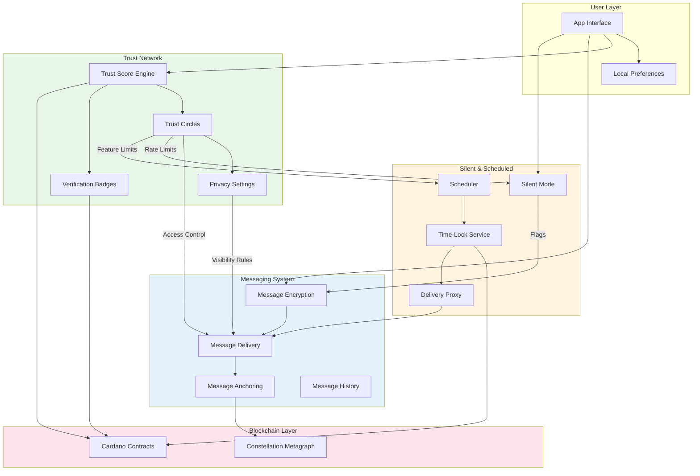
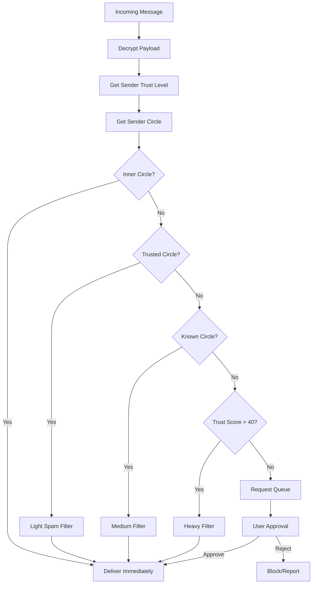
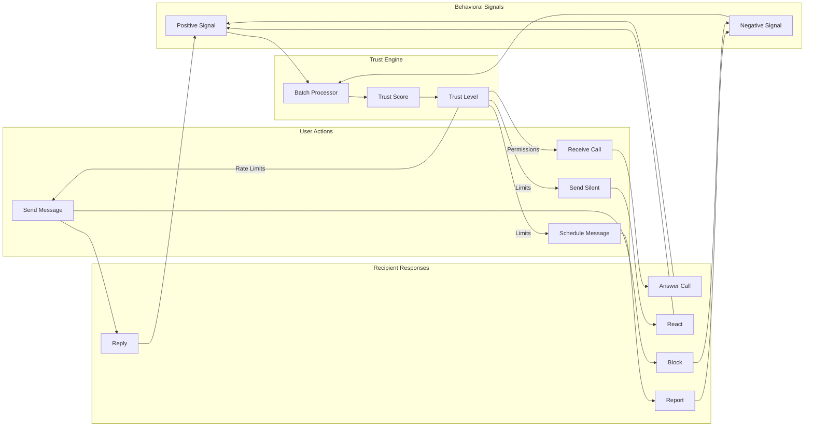
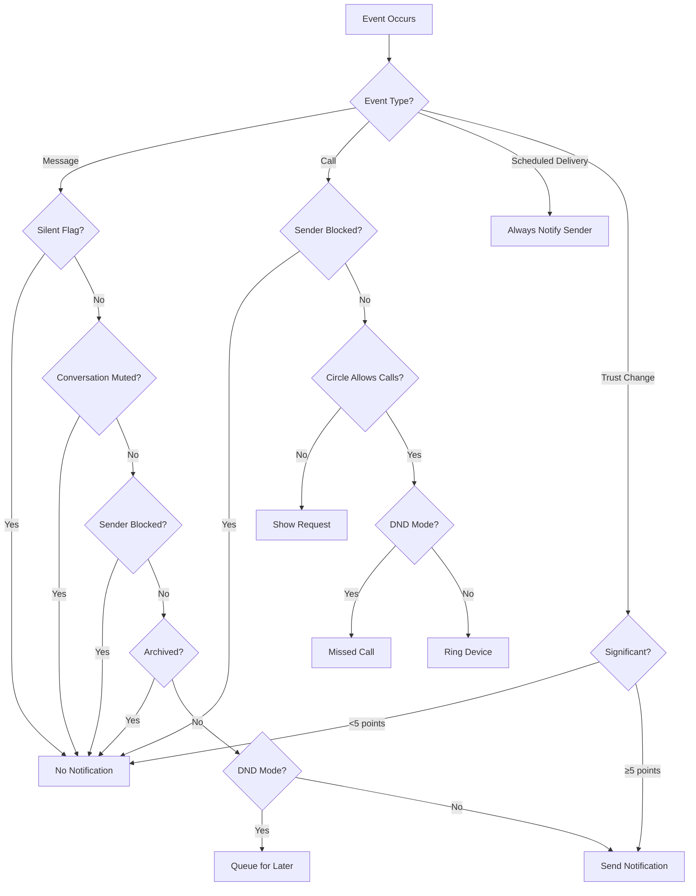

# System Integration Specifications

## Cross-Blueprint Integration for Secure Messaging Platform

This document defines how the three core system blueprints integrate:
1. **Blockchain-Anchored Messaging** — Message encryption, delivery, and integrity
2. **Dynamic Trust Network** — Reputation, verification, and access control
3. **Silent & Scheduled Chats** — Timing control and notification management

---

## Architecture Overview

### System Integration Diagram



### Data Flow Summary

| From | To | Data | Purpose |
|------|-----|------|---------|
| Trust → Messaging | Trust level, circle | Filter/prioritize messages |
| Trust → Silent | Score, limits | Rate limiting |
| Trust → Silent | Circle membership | Silent message permissions |
| Messaging → Trust | Interaction data | Behavioral scoring |
| Messaging → Silent | Delivery status | Silent/scheduled coordination |
| Silent → Messaging | Flags, timing | Modified delivery behavior |
| All → Blockchain | Hashes, proofs | Immutable records |

---

## Integration Point 1: Trust-Based Message Filtering

### Overview

The Trust Network controls how messages are filtered and prioritized based on sender reputation and relationship level.

### Message Reception Flow



### Filter Levels by Trust

| Circle/Level | Spam Filter | Link Preview | Media Auto-Download | Priority |
|--------------|-------------|--------------|---------------------|----------|
| Inner Circle | None | Always | Always | Highest |
| Trusted | Light | Always | WiFi only | High |
| Known | Medium | Ask first | Never auto | Normal |
| Public (Score 40+) | Heavy | Disabled | Never | Low |
| Public (Score <40) | Maximum | Disabled | Never | Lowest + Approval |

### API Specification

```typescript
// Trust-Messaging Integration API

interface MessageFilterRequest {
  messageId: string;
  senderId: string;
  recipientId: string;
  messageType: 'text' | 'media' | 'voice' | 'call';
  contentFlags: ContentFlags;
}

interface MessageFilterResponse {
  action: 'deliver' | 'filter' | 'quarantine' | 'block';
  priority: 'highest' | 'high' | 'normal' | 'low' | 'lowest';
  senderContext: {
    trustScore: number;
    trustLevel: TrustLevel;
    circle: CircleLevel;
    verificationBadges: Badge[];
  };
  filterReason?: string;
  requiresApproval: boolean;
}

// Called by Messaging system before delivery
async function filterIncomingMessage(
  request: MessageFilterRequest
): Promise<MessageFilterResponse> {
  const senderTrust = await trustNetwork.getTrustScore(request.senderId);
  const circle = await trustNetwork.getCircle(request.recipientId, request.senderId);
  const settings = await trustNetwork.getPrivacySettings(request.recipientId);
  
  return applyFilterRules(request, senderTrust, circle, settings);
}
```

### Message Metadata Extension

Every message includes sender trust context at send time:

```typescript
interface EnhancedMessageMetadata {
  // Standard messaging fields
  messageId: string;
  conversationId: string;
  senderId: string;
  recipientId: string;
  timestamp: number;
  contentHash: string;
  
  // Trust Network integration
  senderTrust: {
    scoreAtSend: number;           // Trust score when message sent
    levelAtSend: TrustLevel;       // Unverified/Newcomer/Member/Trusted/Verified
    badges: BadgeType[];           // Active verification badges
    endorsedByRecipient: boolean;  // Has recipient endorsed sender?
  };
  
  // Silent & Scheduled integration  
  delivery: {
    isSilent: boolean;
    isScheduled: boolean;
    scheduledTime?: number;
    actualDeliveryTime: number;
  };
  
  // Blockchain anchoring
  anchoring: {
    metagraphTxHash: string;
    snapshotId: string;
    integrityProof: string;
  };
}
```

---

## Integration Point 2: Trust Circles & Privacy Control

### Overview

Trust Circles determine what information is visible and what actions are permitted between users.

### Circle Permission Matrix

```
┌─────────────────────────────────────────────────────────────────────────────┐
│                           TRUST CIRCLE PERMISSIONS                          │
├─────────────┬───────────┬───────────┬───────────┬───────────┬──────────────┤
│ Feature     │ Inner (0) │ Trusted(1)│ Known (2) │ Public(3) │ Blocked (X)  │
├─────────────┼───────────┼───────────┼───────────┼───────────┼──────────────┤
│ MESSAGING                                                                   │
├─────────────┼───────────┼───────────┼───────────┼───────────┼──────────────┤
│ Send text   │ ✓         │ ✓         │ ✓         │ ✓ filtered│ ✗            │
│ Send media  │ ✓         │ ✓         │ ✓         │ Approval  │ ✗            │
│ Send voice  │ ✓         │ ✓         │ ✓         │ Approval  │ ✗            │
│ Voice call  │ ✓ direct  │ ✓ direct  │ ✓ request │ ✗         │ ✗            │
│ Video call  │ ✓ direct  │ ✓ request │ ✗         │ ✗         │ ✗            │
│ Add to group│ ✓         │ ✓         │ ✓ request │ ✗         │ ✗            │
├─────────────┼───────────┼───────────┼───────────┼───────────┼──────────────┤
│ SILENT & SCHEDULED                                                          │
├─────────────┼───────────┼───────────┼───────────┼───────────┼──────────────┤
│ Silent msg  │ ✓ unlim   │ ✓ 20/day  │ ✓ 5/day   │ ✗         │ ✗            │
│ Scheduled   │ ✓ unlim   │ ✓ 10/day  │ ✓ 3/day   │ ✓ 1/day   │ ✗            │
│ Emergency   │ ✓ bypass  │ ✗         │ ✗         │ ✗         │ ✗            │
│ Conditional │ ✓         │ ✓         │ ✗         │ ✗         │ ✗            │
├─────────────┼───────────┼───────────┼───────────┼───────────┼──────────────┤
│ VISIBILITY                                                                  │
├─────────────┼───────────┼───────────┼───────────┼───────────┼──────────────┤
│ Online now  │ ✓ real-time│ ✓ real-time│ ✓ delayed│ ✗        │ ✗            │
│ Last seen   │ ✓ exact   │ ✓ 1-hour  │ ✓ 24-hour │ "Recently"│ ✗            │
│ Typing      │ ✓         │ ✓         │ ✗         │ ✗         │ ✗            │
│ Read receipt│ ✓         │ ✓         │ Optional  │ ✗         │ ✗            │
│ Profile pic │ ✓ full    │ ✓ full    │ ✓ standard│ ✓ minimal │ ✗            │
│ Bio         │ ✓ full    │ ✓ full    │ ✓ partial │ ✗         │ ✗            │
│ Trust score │ ✓ exact   │ ✓ exact   │ ✓ level   │ ✓ level   │ ✗            │
└─────────────┴───────────┴───────────┴───────────┴───────────┴──────────────┘
```

### Privacy Settings Enforcement

```typescript
// Privacy check before revealing information

interface PrivacyCheckRequest {
  requesterId: string;
  targetId: string;
  infoType: 'online_status' | 'last_seen' | 'typing' | 'read_receipt' | 
            'profile_pic' | 'bio' | 'trust_score' | 'phone' | 'email';
}

interface PrivacyCheckResponse {
  allowed: boolean;
  granularity: 'full' | 'partial' | 'minimal' | 'hidden';
  value?: any;  // The actual value if allowed
  reason?: string;
}

async function checkPrivacy(
  request: PrivacyCheckRequest
): Promise<PrivacyCheckResponse> {
  
  // Get relationship
  const circle = await getCircle(request.targetId, request.requesterId);
  const settings = await getPrivacySettings(request.targetId);
  
  // Check if blocked
  if (await isBlocked(request.targetId, request.requesterId)) {
    return { allowed: false, granularity: 'hidden', reason: 'blocked' };
  }
  
  // Apply privacy rules based on circle and settings
  const rule = settings.rules[request.infoType];
  
  if (rule.visibility === 'nobody') {
    return { allowed: false, granularity: 'hidden' };
  }
  
  if (rule.visibility === 'everyone' || 
      circleMatchesVisibility(circle, rule.visibility)) {
    return {
      allowed: true,
      granularity: getGranularity(circle, request.infoType),
      value: await getValue(request.targetId, request.infoType, circle)
    };
  }
  
  return { allowed: false, granularity: 'hidden' };
}
```

### Circle Auto-Management

Circles can auto-adjust based on interaction patterns:

```typescript
interface CircleAutoRules {
  // Auto-promote conditions
  promoteToInner: {
    minDaysKnown: 90;
    minMessagesExchanged: 500;
    minCallMinutes: 60;
    minMutualContacts: 5;
    requiresMutualPromotion: true;
  };
  
  promoteToTrusted: {
    minDaysKnown: 30;
    minMessagesExchanged: 100;
    minCallMinutes: 15;
    requiresEndorsement: false;
  };
  
  promoteToKnown: {
    minDaysKnown: 7;
    minMessagesExchanged: 20;
    autoOnReply: true;  // If they reply, auto-promote from Public
  };
  
  // Auto-demote conditions
  demoteOnInactivity: {
    innerToTrusted: 180;   // days
    trustedToKnown: 90;
    knownToPublic: 30;
  };
  
  demoteOnNegative: {
    onBlock: 'remove';           // Remove from all circles
    onReport: 'demoteOne';       // Demote one level
    onSpamFlag: 'demoteToPublic';
  };
}
```

---

## Integration Point 3: Trust Score Effects on Features

### Overview

Trust scores gate access to features and set rate limits across the entire system.

### Feature Access by Trust Level

```
┌─────────────────────────────────────────────────────────────────────────────┐
│                        FEATURE ACCESS BY TRUST LEVEL                        │
├─────────────────────┬──────────┬──────────┬──────────┬──────────┬──────────┤
│ Feature             │Unverified│ Newcomer │ Member   │ Trusted  │ Verified │
│                     │  (0-19)  │ (20-39)  │ (40-59)  │ (60-79)  │ (80-100) │
├─────────────────────┼──────────┼──────────┼──────────┼──────────┼──────────┤
│ MESSAGING                                                                   │
├─────────────────────┼──────────┼──────────┼──────────┼──────────┼──────────┤
│ 1:1 messaging       │ ✓        │ ✓        │ ✓        │ ✓        │ ✓        │
│ Create groups       │ ✗        │ ≤10 memb │ ≤50 memb │ ≤200 memb│ Unlimited│
│ Message edit time   │ 5 min    │ 1 hour   │ 24 hours │ 24 hours │ 24 hours │
│ Forward messages    │ ✗        │ ✓        │ ✓        │ ✓        │ ✓        │
│ Voice messages      │ 1 min    │ 3 min    │ 5 min    │ 5 min    │ 10 min   │
│ Hidden folders      │ ✗        │ 1 folder │ 3 folders│ 5 folders│ Unlimited│
├─────────────────────┼──────────┼──────────┼──────────┼──────────┼──────────┤
│ DISAPPEARING MESSAGES                                                       │
├─────────────────────┼──────────┼──────────┼──────────┼──────────┼──────────┤
│ Disappearing msgs   │ ✗        │ Preset   │ Preset   │ Custom   │ Custom   │
│ Min timer           │ -        │ 24 hours │ 1 hour   │ 10 sec   │ 10 sec   │
│ Max timer           │ -        │ 7 days   │ 7 days   │ 30 days  │ 90 days  │
├─────────────────────┼──────────┼──────────┼──────────┼──────────┼──────────┤
│ SILENT & SCHEDULED                                                          │
├─────────────────────┼──────────┼──────────┼──────────┼──────────┼──────────┤
│ Silent messages     │ 5/day    │ 20/day   │ 50/day   │ 100/day  │ Unlimited│
│ Scheduled messages  │ 3 total  │ 10 total │ 25 total │ 50 total │ 100 total│
│ Max schedule ahead  │ 1 day    │ 7 days   │ 14 days  │ 30 days  │ 30 days  │
│ Recurring schedules │ ✗        │ ✗        │ ✓        │ ✓        │ ✓        │
│ Conditional delivery│ ✗        │ ✗        │ ✗        │ ✓        │ ✓        │
│ Smart suggestions   │ ✗        │ ✗        │ ✓        │ ✓        │ ✓        │
├─────────────────────┼──────────┼──────────┼──────────┼──────────┼──────────┤
│ TRUST NETWORK                                                               │
├─────────────────────┼──────────┼──────────┼──────────┼──────────┼──────────┤
│ Endorse others      │ ✗        │ ✗        │ ✗        │ ✓ 5/day  │ ✓ 10/day │
│ Create trust circle │ ✗        │ 2 circles│ 5 circles│ 10 circle│ Unlimited│
│ Custom circle rules │ ✗        │ ✗        │ ✗        │ ✓        │ ✓        │
│ Dispute filing      │ ✗        │ ✓        │ ✓        │ ✓        │ ✓        │
│ Serve as juror      │ ✗        │ ✗        │ ✗        │ ✗        │ ✓        │
├─────────────────────┼──────────┼──────────┼──────────┼──────────┼──────────┤
│ CALLS                                                                       │
├─────────────────────┼──────────┼──────────┼──────────┼──────────┼──────────┤
│ Voice calls         │ Contacts │ ✓        │ ✓        │ ✓        │ ✓        │
│ Video calls         │ ✗        │ Contacts │ ✓        │ ✓        │ ✓        │
│ Group calls         │ ✗        │ ✗        │ ≤4 people│ ≤8 people│ ≤16 people│
│ Call recording      │ ✗        │ ✗        │ ✗        │ ✓ consent│ ✓ consent│
└─────────────────────┴──────────┴──────────┴──────────┴──────────┴──────────┘
```

### Rate Limit Enforcement

```typescript
interface RateLimitConfig {
  feature: string;
  limits: {
    [trustLevel: string]: {
      count: number | 'unlimited';
      window: 'per_message' | 'per_hour' | 'per_day' | 'total';
      perRecipient?: number;
    };
  };
}

const RATE_LIMITS: RateLimitConfig[] = [
  {
    feature: 'silent_message',
    limits: {
      unverified: { count: 5, window: 'per_day', perRecipient: 2 },
      newcomer: { count: 20, window: 'per_day', perRecipient: 5 },
      member: { count: 50, window: 'per_day', perRecipient: 10 },
      trusted: { count: 100, window: 'per_day', perRecipient: 20 },
      verified: { count: 'unlimited', window: 'per_day', perRecipient: 50 },
    }
  },
  {
    feature: 'scheduled_message',
    limits: {
      unverified: { count: 3, window: 'total', perRecipient: 1 },
      newcomer: { count: 10, window: 'total', perRecipient: 3 },
      member: { count: 25, window: 'total', perRecipient: 5 },
      trusted: { count: 50, window: 'total', perRecipient: 10 },
      verified: { count: 100, window: 'total', perRecipient: 20 },
    }
  },
  {
    feature: 'message_forward',
    limits: {
      unverified: { count: 0, window: 'per_day' },
      newcomer: { count: 10, window: 'per_day' },
      member: { count: 50, window: 'per_day' },
      trusted: { count: 100, window: 'per_day' },
      verified: { count: 'unlimited', window: 'per_day' },
    }
  }
];

async function checkRateLimit(
  userId: string,
  feature: string,
  recipientId?: string
): Promise<RateLimitResult> {
  const trustLevel = await getTrustLevel(userId);
  const config = RATE_LIMITS.find(r => r.feature === feature);
  const limit = config.limits[trustLevel];
  
  const usage = await getUsage(userId, feature, limit.window);
  const recipientUsage = recipientId 
    ? await getRecipientUsage(userId, recipientId, feature) 
    : 0;
  
  return {
    allowed: usage < limit.count && 
             (!limit.perRecipient || recipientUsage < limit.perRecipient),
    remaining: Math.max(0, limit.count - usage),
    recipientRemaining: limit.perRecipient 
      ? Math.max(0, limit.perRecipient - recipientUsage) 
      : undefined,
    resetsAt: getResetTime(limit.window),
  };
}
```

---

## Integration Point 4: Behavioral Scoring from Interactions

### Overview

User interactions in Messaging and Silent/Scheduled systems feed back into the Trust Network as behavioral signals.

### Positive Signals

| Action | Trust Points | Conditions |
|--------|--------------|------------|
| Message replied to | +0.1 | Within 24 hours |
| Call answered | +0.2 | Duration > 30 seconds |
| Added to group by other | +0.5 | Group has 5+ members |
| Received endorsement | +2.0 | From Trusted+ user |
| Scheduled message delivered successfully | +0.1 | No report received |
| Thanks reaction received | +0.1 | On any message |

### Negative Signals

| Action | Trust Points | Conditions |
|--------|--------------|------------|
| Message reported as spam | -3.0 | Per unique reporter |
| Silent message reported | -5.0 | Abuse of silent feature |
| Blocked by user | -1.0 | Weighted by blocker's trust |
| Call declined repeatedly | -0.2 | 3+ declines from same user |
| Scheduled message expired undelivered | -0.5 | Recipient unavailable |
| Left/kicked from group | -0.5 | Within 24 hours of joining |

### Signal Processing

```typescript
interface BehavioralSignal {
  userId: string;
  signalType: string;
  points: number;
  timestamp: number;
  context: {
    otherPartyId?: string;
    otherPartyTrust?: number;
    conversationId?: string;
    messageId?: string;
  };
  weight: number;  // Based on other party's trust level
}

async function processSignal(signal: BehavioralSignal): Promise<void> {
  // Weight signal by other party's trust level
  const weight = signal.context.otherPartyTrust 
    ? signal.context.otherPartyTrust / 100 
    : 0.5;
  
  const adjustedPoints = signal.points * weight;
  
  // Apply diminishing returns for repeated signals
  const recentSimilar = await getRecentSignals(
    signal.userId, 
    signal.signalType, 
    24 * 60 * 60 * 1000  // 24 hours
  );
  
  const diminishingFactor = 1 / (1 + recentSimilar.length * 0.2);
  const finalPoints = adjustedPoints * diminishingFactor;
  
  // Record signal
  await recordSignal({
    ...signal,
    adjustedPoints: finalPoints
  });
  
  // Update trust score (batched, not immediate)
  await queueTrustUpdate(signal.userId, finalPoints);
}
```

### Feedback Loop Diagram



---

## Integration Point 5: Blockchain Anchoring Coordination

### Overview

All three systems anchor data to the blockchain. This section defines what gets anchored and how records reference each other.

### Anchoring Responsibilities

| System | Data Anchored | Blockchain | Frequency |
|--------|---------------|------------|-----------|
| Messaging | Message hashes, edit history | Metagraph | Per message |
| Messaging | Deletion records | Metagraph | On delete |
| Trust | Trust score commitments | Cardano | On change |
| Trust | Verification badges | Cardano | On verify |
| Trust | Endorsements | Cardano | On endorse |
| Silent/Scheduled | Scheduled timestamps | Metagraph | On schedule |
| Silent/Scheduled | Delivery proofs | Metagraph | On deliver |
| Silent/Scheduled | Key release records | Cardano | On release |

### Cross-Reference Schema

```typescript
interface UnifiedAnchorRecord {
  // Common fields
  recordId: string;
  recordType: 'message' | 'trust_update' | 'verification' | 
              'endorsement' | 'scheduled_delivery' | 'key_release';
  timestamp: number;
  
  // Blockchain references
  metagraphRef?: {
    txHash: string;
    snapshotId: string;
    ordinal: number;
  };
  cardanoRef?: {
    txHash: string;
    blockNumber: number;
    slot: number;
  };
  
  // Cross-references
  relatedRecords: {
    type: string;
    recordId: string;
    relationship: 'parent' | 'child' | 'sibling' | 'reference';
  }[];
  
  // Actor references
  actors: {
    role: 'sender' | 'recipient' | 'endorser' | 'verifier';
    trustScoreAtTime: number;
    trustLevelAtTime: TrustLevel;
  }[];
}
```

### Anchor Record Examples

**Message with Trust Context:**
```json
{
  "recordId": "msg_abc123",
  "recordType": "message",
  "timestamp": 1738764000000,
  "metagraphRef": {
    "txHash": "0x1234...",
    "snapshotId": "snap_5678",
    "ordinal": 12345
  },
  "relatedRecords": [
    {
      "type": "trust_score",
      "recordId": "trust_sender_xyz",
      "relationship": "reference"
    }
  ],
  "actors": [
    {
      "role": "sender",
      "trustScoreAtTime": 72,
      "trustLevelAtTime": "trusted"
    }
  ]
}
```

**Scheduled Message Delivery:**
```json
{
  "recordId": "sched_def456",
  "recordType": "scheduled_delivery",
  "timestamp": 1738850400000,
  "metagraphRef": {
    "txHash": "0x5678...",
    "snapshotId": "snap_9012",
    "ordinal": 12400
  },
  "cardanoRef": {
    "txHash": "0xabcd...",
    "blockNumber": 9876543,
    "slot": 98765432
  },
  "relatedRecords": [
    {
      "type": "message",
      "recordId": "msg_ghi789",
      "relationship": "child"
    },
    {
      "type": "key_release",
      "recordId": "key_jkl012",
      "relationship": "sibling"
    }
  ],
  "actors": [
    {
      "role": "sender",
      "trustScoreAtTime": 65,
      "trustLevelAtTime": "trusted"
    },
    {
      "role": "recipient",
      "trustScoreAtTime": 48,
      "trustLevelAtTime": "member"
    }
  ]
}
```

---

## Integration Point 6: Notification & Badge Coordination

### Overview

Notifications and badges must coordinate across all systems while respecting silent mode flags and privacy settings.

### Notification Decision Tree



### Badge Count Logic

```typescript
interface BadgeState {
  appBadge: number;           // iOS/Android app icon
  conversationBadges: Map<string, number>;
  contactBadges: Map<string, number>;
  featureBadges: {
    missedCalls: number;
    scheduledPending: number;
    trustAlerts: number;
  };
}

function calculateBadges(userId: string): BadgeState {
  const state: BadgeState = {
    appBadge: 0,
    conversationBadges: new Map(),
    contactBadges: new Map(),
    featureBadges: {
      missedCalls: 0,
      scheduledPending: 0,
      trustAlerts: 0,
    }
  };
  
  // Get all unread messages
  const unreads = getUnreadMessages(userId);
  
  for (const msg of unreads) {
    // Skip if conversation is muted or archived
    if (isConversationMuted(msg.conversationId) || 
        isConversationArchived(msg.conversationId)) {
      continue;
    }
    
    // Skip silent messages for badge count
    if (msg.isSilent) {
      continue;
    }
    
    // Increment conversation badge
    const current = state.conversationBadges.get(msg.conversationId) || 0;
    state.conversationBadges.set(msg.conversationId, current + 1);
    
    // Increment app badge
    state.appBadge++;
  }
  
  // Add missed calls
  state.featureBadges.missedCalls = getMissedCallCount(userId);
  state.appBadge += state.featureBadges.missedCalls;
  
  // Add pending scheduled (sender view)
  state.featureBadges.scheduledPending = getPendingScheduledCount(userId);
  
  // Add trust alerts
  state.featureBadges.trustAlerts = getTrustAlertCount(userId);
  if (state.featureBadges.trustAlerts > 0) {
    state.appBadge++;  // Just show 1 for trust, not count
  }
  
  return state;
}
```

---

## Integration Point 7: Error Handling & Edge Cases

### Cross-System Error Scenarios

| Scenario | System | Handling |
|----------|--------|----------|
| Trust service unavailable | Messaging | Deliver with cached trust level, flag for re-check |
| Metagraph congested | All | Queue anchoring, deliver immediately |
| Time-lock node offline | Scheduled | Failover to backup nodes (2-of-3 threshold) |
| Recipient trust dropped during schedule | Scheduled | Deliver anyway, log trust delta |
| Sender blocked after scheduling | Scheduled | Cancel delivery, notify sender |
| Key release fails | Scheduled | Retry 3x, then notify sender to resend |
| Circle changed mid-conversation | Messaging | Apply new rules to future messages only |
| Verification expired | Trust | Grace period 7 days, then downgrade features |

### Error Propagation

```typescript
interface CrossSystemError {
  originSystem: 'messaging' | 'trust' | 'silent_scheduled';
  errorCode: string;
  severity: 'fatal' | 'degraded' | 'warning';
  affectedSystems: string[];
  userMessage: string;
  recoveryAction: string;
  retryable: boolean;
}

const ERROR_HANDLERS: Record<string, CrossSystemError> = {
  'TRUST_SERVICE_DOWN': {
    originSystem: 'trust',
    errorCode: 'TRUST_001',
    severity: 'degraded',
    affectedSystems: ['messaging', 'silent_scheduled'],
    userMessage: 'Some features may be limited. Your messages will still be delivered.',
    recoveryAction: 'Use cached trust levels, retry trust fetch in background',
    retryable: true,
  },
  'SCHEDULE_KEY_RELEASE_FAILED': {
    originSystem: 'silent_scheduled',
    errorCode: 'SCHED_004',
    severity: 'warning',
    affectedSystems: ['messaging'],
    userMessage: 'Scheduled message delayed. Retrying automatically.',
    recoveryAction: 'Try backup time-release nodes, extend delivery window',
    retryable: true,
  },
  'RECIPIENT_NOW_BLOCKED': {
    originSystem: 'trust',
    errorCode: 'TRUST_010',
    severity: 'fatal',
    affectedSystems: ['messaging', 'silent_scheduled'],
    userMessage: 'This user is no longer available.',
    recoveryAction: 'Cancel pending messages, hide conversation',
    retryable: false,
  },
};
```

---

## API Summary

### Unified Service Interfaces

```typescript
// Main integration service

interface IntegrationService {
  // Message sending with full integration
  sendMessage(params: {
    senderId: string;
    recipientId: string;
    content: EncryptedContent;
    options: {
      silent?: boolean;
      scheduledTime?: number;
      disappearAfter?: number;
    };
  }): Promise<SendResult>;
  
  // Get user context for UI
  getUserContext(params: {
    viewerId: string;
    targetId: string;
  }): Promise<{
    trust: TrustContext;
    circle: CircleLevel;
    permissions: PermissionSet;
    privacy: PrivacyVisibility;
  }>;
  
  // Check if action is allowed
  checkPermission(params: {
    actorId: string;
    targetId: string;
    action: ActionType;
  }): Promise<PermissionResult>;
  
  // Get rate limit status
  getRateLimits(params: {
    userId: string;
    features: string[];
  }): Promise<RateLimitStatus[]>;
  
  // Record interaction for trust scoring
  recordInteraction(params: {
    interaction: InteractionEvent;
  }): Promise<void>;
}
```

### Event Bus

```typescript
// Cross-system event coordination

type SystemEvent = 
  | { type: 'MESSAGE_SENT'; payload: MessageSentEvent }
  | { type: 'MESSAGE_DELIVERED'; payload: MessageDeliveredEvent }
  | { type: 'MESSAGE_READ'; payload: MessageReadEvent }
  | { type: 'TRUST_CHANGED'; payload: TrustChangedEvent }
  | { type: 'CIRCLE_CHANGED'; payload: CircleChangedEvent }
  | { type: 'SCHEDULED_RELEASED'; payload: ScheduledReleasedEvent }
  | { type: 'BLOCK_ADDED'; payload: BlockAddedEvent }
  | { type: 'VERIFICATION_UPDATED'; payload: VerificationUpdatedEvent };

interface EventBus {
  publish(event: SystemEvent): Promise<void>;
  subscribe(eventType: string, handler: EventHandler): Unsubscribe;
}

// Example: When trust changes, notify other systems
eventBus.subscribe('TRUST_CHANGED', async (event) => {
  const { userId, oldLevel, newLevel } = event.payload;
  
  if (newLevel < oldLevel) {
    // Downgrade: Check for affected features
    await messagingService.revalidatePermissions(userId);
    await scheduledService.checkPendingLimits(userId);
  }
});
```

---

## Implementation Checklist

### Phase 1: Core Integration
- [ ] Trust level lookup from Messaging system
- [ ] Basic rate limiting by trust level
- [ ] Circle-based privacy enforcement
- [ ] Message metadata includes sender trust

### Phase 2: Silent/Scheduled Integration
- [ ] Trust-based limits for silent messages
- [ ] Trust-based limits for scheduled messages
- [ ] Circle permissions for silent messaging
- [ ] Delivery proxy respects blocking

### Phase 3: Behavioral Feedback
- [ ] Interaction signals to trust engine
- [ ] Positive/negative signal processing
- [ ] Diminishing returns implementation
- [ ] Batch trust score updates

### Phase 4: Advanced Features
- [ ] Conditional delivery with trust checks
- [ ] Auto-circle management
- [ ] Cross-reference anchoring
- [ ] Unified error handling

---

*Integration Specification Version: 1.0*  
*Last Updated: February 5, 2026*  
*Covers: Messaging v1.0, Trust Network v1.0, Silent/Scheduled v2.0*
