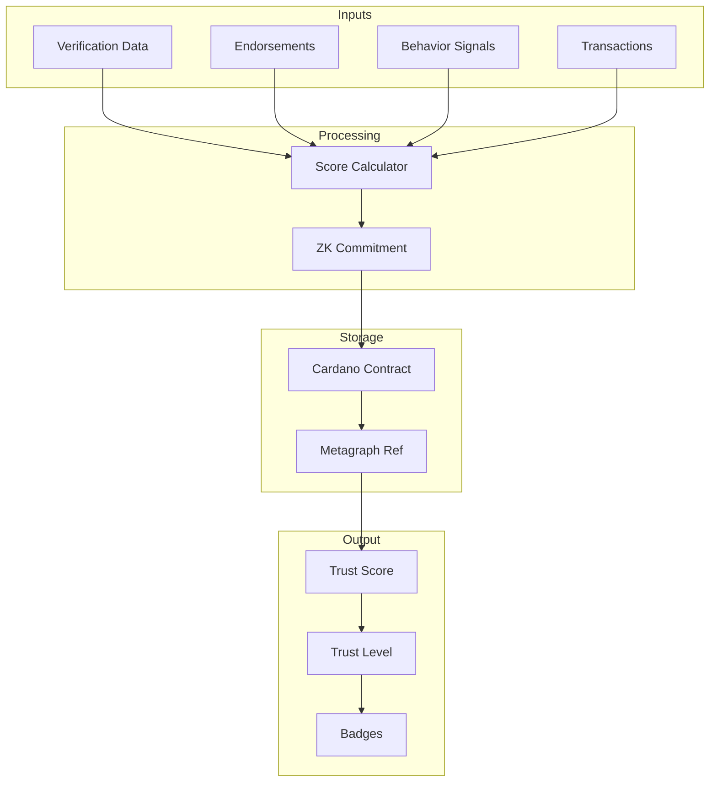

# Dynamic Trust Network Blueprint — Analysis & Feature Improvements

## Quick Assessment

| Category | Status | Notes |
|----------|--------|-------|
| Core Concept | ✅ Strong | Decentralized trust with blockchain anchoring is solid |
| Architecture | ⚠️ Incomplete | Missing trust scoring logic, empty diagrams |
| Feature Coverage | ✅ Good | Comprehensive messaging features |
| Security Model | ⚠️ Gaps | No threat model or attack mitigations |
| Integration | ❌ Missing | No connection to messaging blueprint |

---

## Critical Gaps

### 1. Trust Scoring is Undefined

The blueprint mentions "trust scores" and "reputation scoring" repeatedly but never defines:
- What inputs affect the score
- How scores are calculated
- What the score ranges mean
- How scores decay or recover

**Recommended Addition:**

```
### Trust Score Calculation

Trust scores range from 0-100 and are calculated from four weighted components:

| Component | Weight | Inputs |
|-----------|--------|--------|
| Verification | 30% | Email, phone, KYC, social links |
| Network | 25% | Endorsements, mutual connections |
| Behavior | 25% | Account age, response rate, reports |
| Transactions | 20% | P2P completions, dispute rate |

**Score Levels:**
- 0-19: Unverified (basic messaging only)
- 20-39: Newcomer (small groups allowed)
- 40-59: Member (standard features)
- 60-79: Trusted (can endorse others)
- 80-100: Verified (priority features)

**Decay:** Scores decay 0.2% daily without activity, floor at 60% of peak.
```

### 2. Empty Mermaid Diagram

The Trust Scoring Flow section has an empty code block. 

**Recommended Diagram:**



### 3. No Integration with Messaging Blueprint

These two blueprints should work together but don't reference each other.

**Recommended Addition — Cross-System Integration:**

```
### Trust-Messaging Integration

Trust scores directly affect messaging behavior:

| Trust Level | Message Filtering | Call Permissions | Group Creation |
|-------------|-------------------|------------------|----------------|
| Unverified | Strict spam filter | Cannot call | Cannot create |
| Newcomer | Standard filter | Request only | Up to 10 members |
| Member | Light filter | Trusted contacts | Up to 50 members |
| Trusted | No filter | Anyone | Up to 200 members |
| Verified | No filter | Anyone | Unlimited |

**Message Metadata Extension:**
Each message includes sender's trust level at send time, enabling recipients
to filter by trust. Trust level is included in the metagraph-anchored hash.
```

---

## Feature Improvements

### User Profiles — Add Trust History

Current spec shows trust score but not how it changed over time.

**Add:**
```
* Trust score history graph (90 days)
* Score change notifications
* Breakdown by component (verification, network, behavior, transactions)
* Percentile ranking vs. network average
```

### Contact Blocking — Add Trust Impact

Blocking should affect the blocked user's trust signals.

**Add:**
```
* Blocks contribute to target's behavior score (weighted by blocker's trust)
* Multiple blocks from high-trust users triggers review
* Block patterns analyzed for coordinated abuse detection
* Blocker's identity protected (aggregate signals only)
```

### Privacy Settings — Add Trust-Based Tiers

Current privacy is all-or-nothing. Should integrate with trust circles.

**Add:**
```
* Trust-tiered visibility (show to Trusted+, Members+, etc.)
* Automatic privacy escalation for new contacts
* Grace period before full visibility
* Trust threshold for contact requests
```

### Audio Messages — Add Transcription Trust

Voice message transcription should show reliability indicator.

**Add:**
```
* Transcription confidence score display
* User corrections improve model (opt-in)
* Transcription verification hash for disputes
* Language detection with confidence
```

### Call History — Add Trust Context

Call history should show trust level at time of call.

**Add:**
```
* Caller trust level at call time
* Trust-based call screening (optional)
* Suspicious caller warnings
* Call quality correlation with trust (for spam detection)
```

---

## New Features to Add

### 1. Endorsement System

Users should be able to vouch for each other.

```
### Endorsements

Trusted users (score 60+) can endorse other users in specific categories.
Endorsements are recorded on Cardano and contribute to the recipient's network score.

**Key Features:**
* Category-specific endorsements (reliable, responsive, professional, etc.)
* One endorsement per user per category
* Endorsement weight based on endorser's trust score
* Revocable with cooldown period
* Public endorsement feed on profiles
* Rate limit: 5 endorsements per day
```

### 2. Verification Methods

The blueprint mentions "verification badges" but doesn't specify how to get them.

```
### Verification Methods

| Method | Trust Points | Process |
|--------|--------------|---------|
| Email | +10 | Click confirmation link |
| Phone (SMS) | +15 | Enter 6-digit code |
| Phone (Carrier) | +20 | Carrier API verification |
| Government ID | +40 | KYC provider integration |
| Social (each) | +5 | OAuth link (max 4 platforms) |
| Biometric | +15 | Device biometric enrollment |

**Verification Badges:**
* ✓ Basic (email + phone) — Score 25+
* ✓✓ Standard (+ 2 social links) — Score 35+  
* ✓✓✓ Full (+ government ID) — Score 75+

**Privacy:** Verification proofs are stored as commitments. 
The blockchain proves *that* verification occurred, not *what* was verified.
```

### 3. Trust Circles

Referenced in overview but not defined.

```
### Trust Circles

Trust circles are relationship tiers that control feature access and visibility.

| Circle | Max Size | Permissions |
|--------|----------|-------------|
| Inner | 15 | Real-time status, direct calls, full profile |
| Trusted | 50 | Online status, call requests, standard profile |
| Known | 200 | Approximate status, filtered messages |
| Public | ∞ | Minimal profile, strict message filtering |

**Circle Management:**
* Manual promotion/demotion
* Auto-promotion rules (messages exchanged, call count, time known)
* Auto-demotion on inactivity (configurable)
* Circle-specific notification settings
```

### 4. Dispute Resolution

No mechanism for handling trust disputes.

```
### Dispute Resolution

Users can dispute unfair trust penalties or report manipulation.

**Process:**
1. User submits dispute with evidence
2. System assigns 5 high-trust jurors (score 80+, no connection to parties)
3. 72-hour review period
4. Majority vote determines outcome
5. Jurors earn small trust bonus for participation

**Dispute Types:**
* False reports (reverses penalty if upheld)
* Coordinated attack (multiple accounts targeting one user)
* System error (technical malfunction)
* Account compromise (reputation recovery)

**Limits:**
* 1 dispute per 90 days
* Small stake required (refunded if upheld)
* Juror identities protected
```

### 5. Anti-Sybil Protection

No protection against fake account networks.

```
### Anti-Sybil Measures

**Detection Signals:**
* Device fingerprint clustering
* IP address correlation
* Behavioral pattern similarity
* Endorsement graph analysis
* Timing correlation (accounts active at same times)

**Mitigations:**
* New accounts start with limited features
* Verification required to endorse
* Endorsements from cluster members weighted less
* Graph analysis flags suspicious patterns
* Rate limits scale with trust level

**Humanity Verification:**
* Optional biometric liveness check
* Behavioral biometrics (typing patterns)
* Social graph minimum (must have real connections)
```

---

## Security Additions

### Threat Model

The blueprint should explicitly address:

| Threat | Mitigation |
|--------|------------|
| Score farming | Diminishing returns on repeated actions, rate limits |
| Fake endorsements | Endorser must be verified, graph analysis |
| Revenge blocking | Blocks weighted by blocker trust, pattern detection |
| Privacy inference | ZK proofs for trust levels, relationship obfuscation |
| Key compromise | Social recovery with trusted contacts |

### Rate Limits

```
### Trust Operation Limits

| Operation | Limit | Cooldown |
|-----------|-------|----------|
| Endorsements given | 5/day | Resets daily |
| Circle promotions | 10/day | Resets daily |
| Reports filed | 10/day | Per-target: 1 ever |
| Verification attempts | 3/day | 24h after failure |
| Disputes filed | 1/90 days | After resolution |
```

---

## Summary of Recommendations

**Must Fix:**
1. Define trust score calculation formula
2. Complete the mermaid architecture diagram
3. Add verification methods and badge criteria
4. Define trust circle levels and permissions

**Should Add:**
5. Endorsement system
6. Trust-messaging integration
7. Dispute resolution process
8. Anti-sybil protections
9. Rate limits specification

**Nice to Have:**
10. Trust history visualization
11. Trust-based call screening
12. Automated circle management
13. Network health analytics

---

## Implementation Status & Additional Gaps Identified

*Updated: February 26, 2026*

### Implemented (in `internal/services/trustnet/`)

| Service | File | Status | Tests |
|---------|------|--------|-------|
| Trust Circles | `circles.go` | Complete | 25 tests |
| Endorsements | `endorsements.go` | Complete | 15 tests |
| Trust Score Decay & History | `decay.go` | Complete | 12 tests |
| Dispute Resolution | `disputes.go` | Complete | 14 tests |
| Anti-Sybil Detection | `sybil.go` | Complete | 12 tests |
| Trust Operation Rate Limiter | `rate_limiter.go` | Complete | 11 tests |
| Error Definitions | `errors.go` | Complete | — |

### Additional Gaps Identified During Implementation

**1. Trust Score Persistence**
The current implementation uses in-memory stores. For production:
- Scores and history need database-backed storage
- Decay should run as a scheduled job (cron/worker)
- Snapshots should be written to time-series storage for efficient history queries

**2. Cross-Service Integration Missing**
- `CircleService` should notify `EndorsementService` when contacts are promoted (endorsement weight could factor in circle tier)
- `SybilService` assessments should feed into `EndorsementService.CalculateNetworkScore()` to penalize endorsements from suspected sybils
- `DisputeService` resolution should trigger score adjustments in `TrustDecayService`
- Auto-promotion (`CheckAutoPromotion`) should integrate with the rate limiter

**3. Blockchain Anchoring Not Implemented**
The spec references Cardano contract storage and metagraph references. None of the services currently write to or read from blockchain. Need:
- ZK commitment generation for trust scores
- Cardano transaction submission for endorsements and disputes
- Metagraph reference storage for trust proofs

**4. Juror Selection Algorithm Missing**
`DisputeService.AssignJurors()` accepts juror DIDs but doesn't implement the selection algorithm. Need:
- Query for users with trust score 80+
- Filter out connections to dispute parties (currently only checks direct party match)
- Random selection with geographic/social diversity
- Fallback pool if insufficient eligible jurors

**5. Notification System Not Connected**
Several features should trigger user notifications:
- Auto-promotion suggestions from `CheckAutoPromotion`
- Score change alerts from `TrustDecayService`
- Dispute status updates (assigned as juror, vote results)
- Endorsement received notifications
- Sybil risk warnings

**6. Trust-Based Feature Gating Not Centralized**
The analysis mentions trust levels affecting messaging, calls, and groups, but there's no centralized feature gate service. Each consumer currently needs to check trust scores independently.

**7. Recovery of Trust After Dispute**
When a dispute is upheld (false report confirmed), the victim's score should be restored. Currently `DisputeService` resolves disputes but doesn't trigger score restoration in `TrustDecayService`.

**8. Endorsement Graph Analysis**
Beyond basic ring detection in `SybilService`, need:
- PageRank-style analysis of endorsement network
- Detection of endorsement farming patterns (rapid endorsements between new accounts)
- Weighted graph metrics for network health monitoring

---

*Original Analysis Date: February 4, 2026*
*Implementation Date: February 26, 2026*
