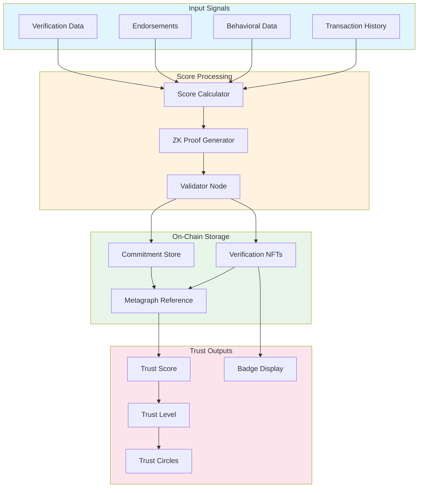
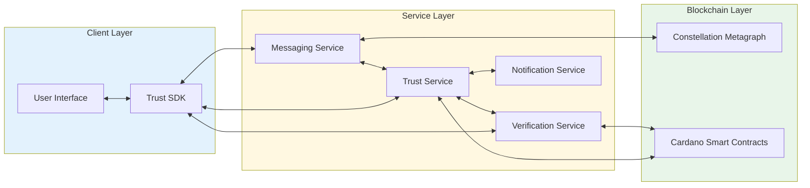

# Dynamic Trust Network & Social Verification — Blueprint Review

## Executive Summary

This review analyzes the Dynamic Trust Network blueprint, identifies architectural and feature gaps, and proposes detailed implementations for missing components. The analysis also considers integration points with the companion Blockchain-Anchored Messaging blueprint to ensure system cohesion.

---

## Part 1: Identified Gaps & Issues

### 1.1 Architectural Gaps

#### Missing Trust Scoring Algorithm
The blueprint references "trust scores" and "reputation scoring" but provides no specification for:
- How scores are calculated
- What inputs affect the score
- Score decay over time
- Dispute resolution mechanisms
- Sybil attack prevention

#### Incomplete Mermaid Diagram
The Trust Scoring Flow section contains an empty mermaid block, leaving the architecture undefined.

#### No Cross-Blueprint Integration
The messaging blueprint and trust network blueprint operate in isolation with no defined integration points for:
- Trust-based message filtering
- Reputation-weighted message delivery priority
- Verification status in message metadata

#### Missing On-Chain Data Model
While Cardano anchoring is mentioned, there's no specification for:
- Smart contract structure
- State machine definitions
- Transaction types
- Storage patterns for privacy-preserving data

### 1.2 Feature Gaps

| Area | Missing Feature | Impact |
|------|-----------------|--------|
| Trust Circles | No definition of trust levels or progression | Users can't understand or advance in the system |
| Verification | No verification methods specified | "Verification badges" have no meaning |
| Recovery | No account/reputation recovery mechanism | Lost keys = lost reputation |
| Abuse Prevention | No rate limiting or spam scoring | System vulnerable to gaming |
| Interoperability | No cross-platform trust portability | Reputation locked to single app |
| Governance | No community governance model | Centralized control contradicts decentralization claims |
| Analytics | No trust network analytics or insights | Users can't evaluate network health |

### 1.3 Security Gaps

- **No threat model** for reputation manipulation
- **Missing rate limits** on trust operations
- **No specification** for cryptographic commitment schemes
- **Undefined** privacy boundaries between trust tiers
- **No specification** for zero-knowledge proofs (mentioned implicitly but not defined)

---

## Part 2: New Features & Implementations

### 2.1 Trust Scoring Engine

#### Overview
A multi-factor reputation scoring system that combines on-chain verification, peer endorsements, and behavioral signals into a unified trust score.

#### Trust Score Calculation

```
TrustScore = Σ(wi × fi) where:

f1 = Verification Score (0-100)
    - KYC verification: +40
    - Social proof (linked accounts): +20
    - Phone verification: +15
    - Email verification: +10
    - Biometric enrollment: +15

f2 = Network Score (0-100)
    - Endorsements from high-trust users: +5 each (max 50)
    - Mutual connections: +2 each (max 30)
    - Trust circle membership: +4 per circle (max 20)

f3 = Behavioral Score (0-100)
    - Account age: +1 per month (max 24)
    - Message response rate: 0-20
    - Report ratio (inverse): 0-30
    - Consistent activity: 0-26

f4 = Transaction Score (0-100)
    - Successful P2P transactions: +2 each (max 50)
    - Transaction disputes (inverse): -10 each
    - Payment reliability: 0-50

Weights: w1=0.30, w2=0.25, w3=0.25, w4=0.20
```

#### Score Decay Function

```
DecayedScore = CurrentScore × e^(-λt)

where:
- λ = 0.002 (decay constant)
- t = days since last positive activity

Minimum decay floor: 60% of earned score
Recovery rate: +0.5 points per day of positive activity
```

#### Trust Levels

| Level | Score Range | Badge | Capabilities |
|-------|-------------|-------|--------------|
| Unverified | 0-19 | None | Basic messaging only |
| Newcomer | 20-39 | 🌱 | Group creation (up to 10) |
| Member | 40-59 | ✓ | Full features, 50 contacts |
| Trusted | 60-79 | ✓✓ | Endorsement rights, 200 contacts |
| Verified | 80-94 | ✓✓✓ | Priority support, unlimited contacts |
| Ambassador | 95-100 | ⭐ | Governance participation, beta features |

#### Implementation

**Smart Contract (Aiken/Plutus pseudocode):**

```haskell
data TrustRecord = TrustRecord
  { userId :: PubKeyHash
  , scoreCommitment :: Hash  -- ZK commitment to actual score
  , verificationProofs :: [ProofHash]
  , lastUpdate :: POSIXTime
  , endorsements :: [EndorsementRef]
  }

data TrustAction
  = UpdateScore ScoreProof
  | AddEndorsement PubKeyHash Signature
  | RevokeEndorsement PubKeyHash
  | DisputeScore DisputeEvidence

validator :: TrustRecord -> TrustAction -> ScriptContext -> Bool
validator record action ctx = case action of
  UpdateScore proof -> 
    verifyZKProof proof && 
    signedByOracle ctx &&
    withinUpdateWindow record ctx
    
  AddEndorsement endorser sig ->
    verifySignature endorser sig &&
    meetsEndorsementThreshold endorser &&
    notSelfEndorsement record endorser
    
  RevokeEndorsement endorser ->
    signedBy endorser ctx ||
    signedBy (userId record) ctx
    
  DisputeScore evidence ->
    validDisputeEvidence evidence &&
    sufficientStake ctx
```

**Key Features:**
- Privacy-preserving score storage via cryptographic commitments
- Only score thresholds are publicly verifiable (ZK range proofs)
- Endorsements are public but weights are private
- Dispute mechanism with stake requirement to prevent spam

---

### 2.2 Progressive Trust Circles

#### Overview
A hierarchical system of trust relationships that enables granular privacy controls and feature access based on relationship depth.

#### Circle Definitions

```
Circle 0: Self
├── Full access to all personal data
├── Can modify all settings
└── Single member (account owner)

Circle 1: Inner Circle (max 15 members)
├── See real-time online status
├── See exact last-seen time
├── Can send voice/video calls without approval
├── See full profile including private fields
└── Receive priority message delivery

Circle 2: Trusted (max 50 members)
├── See online/offline status
├── See last-seen within 1-hour granularity
├── Voice calls with single-tap approval
├── See standard profile fields
└── Standard message delivery

Circle 3: Known (max 200 members)
├── See last-seen within 24-hour granularity
├── Must request call permission
├── See public profile only
└── Messages may be filtered by spam score

Circle 4: Public (unlimited)
├── See last-seen as "Recently" or "Long ago"
├── Cannot initiate calls
├── See minimal public profile
└── Messages subject to full spam filtering
```

#### Circle Management API

```typescript
interface TrustCircle {
  circleId: number;          // 0-4
  members: UserId[];
  maxMembers: number;
  permissions: CirclePermissions;
  promotionRules: PromotionRule[];
  demotionRules: DemotionRule[];
}

interface CirclePermissions {
  canSeeOnlineStatus: boolean;
  lastSeenGranularity: 'exact' | 'hour' | 'day' | 'approximate';
  canInitiateCall: boolean | 'with_approval';
  profileVisibility: 'full' | 'standard' | 'public' | 'minimal';
  messageFiltering: 'none' | 'light' | 'standard' | 'strict';
}

interface PromotionRule {
  fromCircle: number;
  toCircle: number;
  conditions: PromotionCondition[];
  requiresApproval: boolean;
}

type PromotionCondition = 
  | { type: 'time_known'; minDays: number }
  | { type: 'messages_exchanged'; minCount: number }
  | { type: 'calls_completed'; minCount: number }
  | { type: 'mutual_contacts'; minCount: number }
  | { type: 'trust_score'; minScore: number };
```

#### Auto-Promotion Logic

```typescript
async function evaluatePromotion(
  userId: UserId, 
  contactId: UserId
): Promise<PromotionResult> {
  const currentCircle = await getCircle(userId, contactId);
  const rules = await getPromotionRules(userId, currentCircle);
  
  for (const rule of rules) {
    const conditions = await Promise.all(
      rule.conditions.map(c => evaluateCondition(userId, contactId, c))
    );
    
    if (conditions.every(c => c.met)) {
      if (rule.requiresApproval) {
        return { 
          eligible: true, 
          targetCircle: rule.toCircle,
          pendingApproval: true 
        };
      }
      return { 
        eligible: true, 
        targetCircle: rule.toCircle,
        autoPromote: true 
      };
    }
  }
  
  return { eligible: false };
}
```

---

### 2.3 Multi-Factor Verification System

#### Overview
A layered verification system that combines multiple identity proofs to create tamper-proof, blockchain-anchored verification badges.

#### Verification Methods

| Method | Trust Points | Privacy Level | Revocable |
|--------|--------------|---------------|-----------|
| Email | 10 | Low | Yes |
| Phone (SMS) | 15 | Medium | Yes |
| Phone (Carrier) | 20 | Medium | Yes |
| Government ID (KYC) | 40 | High | No* |
| Social Proof (OAuth) | 5 each (max 20) | Low | Yes |
| Biometric Hash | 15 | High | No |
| Web of Trust | 5 per endorsement | Low | Yes |

*KYC verification is immutable but can be flagged as "disputed"

#### Verification Badge Structure

```typescript
interface VerificationBadge {
  badgeId: string;                    // Unique identifier
  userId: UserId;                     // Badge holder
  verificationType: VerificationType;
  verificationLevel: 1 | 2 | 3;       // Confidence level
  issuedAt: Timestamp;
  expiresAt: Timestamp | null;
  issuer: IssuerId;                   // Verification provider
  proofHash: string;                  // Hash of verification proof
  onChainRef: {
    txHash: string;
    outputIndex: number;
  };
  metadata: {
    countryCode?: string;             // For KYC
    ageVerified?: boolean;            // 18+ without revealing DOB
    humanityProof?: boolean;          // Anti-bot verification
  };
}

type VerificationType = 
  | 'email'
  | 'phone_sms'
  | 'phone_carrier'
  | 'government_id'
  | 'social_twitter'
  | 'social_linkedin'
  | 'social_github'
  | 'biometric'
  | 'web_of_trust';
```

#### Zero-Knowledge Age Verification

```typescript
interface AgeVerificationProof {
  // Proves age >= threshold without revealing actual age
  commitment: string;           // Pedersen commitment to birth date
  rangeProof: string;          // ZK proof that age >= 18
  verifierSignature: string;   // Signed by KYC provider
  
  verify(): Promise<boolean>;
}

// Usage
const proof = await generateAgeProof(birthDate, threshold: 18);
const isValid = await proof.verify();
// Returns true/false without revealing actual birth date
```

#### On-Chain Badge Anchoring

```haskell
data VerificationNFT = VerificationNFT
  { tokenName :: TokenName        -- Badge type identifier
  , holder :: PubKeyHash          -- Current badge holder
  , issuer :: PubKeyHash          -- Verification provider
  , proofCommitment :: Hash       -- Commitment to verification data
  , validUntil :: Maybe POSIXTime -- Expiration (None = permanent)
  }

-- Minting policy ensures:
-- 1. Issuer is authorized verification provider
-- 2. Proof commitment is valid
-- 3. One badge per type per user
mintingPolicy :: VerificationNFT -> ScriptContext -> Bool
mintingPolicy badge ctx =
  isAuthorizedIssuer (issuer badge) &&
  validProofCommitment (proofCommitment badge) &&
  noDuplicateBadge (holder badge) (tokenName badge)
```

---

### 2.4 Reputation Recovery System

#### Overview
A mechanism for users to recover their reputation after key loss, account compromise, or unfair penalization.

#### Recovery Methods

**1. Social Recovery**
```typescript
interface SocialRecovery {
  guardians: UserId[];           // 3-7 trusted contacts
  threshold: number;             // Minimum approvals needed (e.g., 3 of 5)
  timelock: Duration;            // Waiting period after initiation
  
  async initiateRecovery(
    newPubKey: PublicKey
  ): Promise<RecoveryRequest>;
  
  async approveRecovery(
    requestId: string,
    guardianSignature: Signature
  ): Promise<void>;
  
  async executeRecovery(
    requestId: string
  ): Promise<RecoveryResult>;
}
```

**2. Identity Reverification**
```typescript
interface IdentityRecovery {
  // Re-verify identity to recover account
  async submitIdentityProof(
    kycData: EncryptedKYCData,
    biometricHash: string
  ): Promise<RecoveryRequest>;
  
  // Match against original verification
  async verifyMatch(
    requestId: string
  ): Promise<MatchResult>;
}
```

**3. Reputation Appeal**
```typescript
interface ReputationAppeal {
  appealId: string;
  userId: UserId;
  reason: AppealReason;
  evidence: Evidence[];
  status: 'pending' | 'reviewing' | 'approved' | 'rejected';
  
  // Community jury of high-trust users
  jurors: UserId[];
  votes: Map<UserId, Vote>;
  
  async submitAppeal(
    reason: AppealReason,
    evidence: Evidence[]
  ): Promise<Appeal>;
  
  async castVote(
    jurorId: UserId,
    vote: Vote
  ): Promise<void>;
}

type AppealReason = 
  | 'false_reports'
  | 'coordinated_attack'
  | 'system_error'
  | 'account_compromise'
  | 'other';
```

#### Recovery Constraints

| Recovery Type | Reputation Restored | Cooldown | Cost |
|---------------|---------------------|----------|------|
| Social Recovery | 100% | 7 days | Gas fees only |
| Identity Reverification | 80% | 30 days | KYC fee |
| Reputation Appeal | Variable | 90 days | Stake (refundable if approved) |

---

### 2.5 Anti-Sybil Mechanisms

#### Overview
Prevent manipulation of the trust network through fake accounts or coordinated attacks.

#### Humanity Verification

```typescript
interface HumanityCheck {
  // Proof of humanity without revealing identity
  
  async verifyHuman(
    userId: UserId
  ): Promise<HumanityProof>;
  
  // Methods:
  // - Biometric liveness detection
  // - CAPTCHA challenges
  // - Social graph analysis
  // - Behavioral biometrics
}

interface HumanityProof {
  proofType: 'biometric' | 'behavioral' | 'social';
  confidence: number;           // 0-1
  timestamp: Timestamp;
  expiresAt: Timestamp;
  commitment: string;           // ZK commitment
}
```

#### Graph Analysis for Sybil Detection

```typescript
interface SybilDetector {
  // Analyze trust graph for suspicious patterns
  
  async analyzeUser(
    userId: UserId
  ): Promise<SybilRisk>;
  
  async analyzeCluster(
    userIds: UserId[]
  ): Promise<ClusterAnalysis>;
}

interface SybilRisk {
  riskScore: number;            // 0-100
  indicators: SybilIndicator[];
  recommendation: 'allow' | 'flag' | 'restrict' | 'ban';
}

type SybilIndicator = 
  | { type: 'rapid_endorsement'; count: number; timespan: Duration }
  | { type: 'isolated_cluster'; clusterSize: number }
  | { type: 'coordinated_activity'; similarity: number }
  | { type: 'device_fingerprint_reuse'; count: number }
  | { type: 'ip_correlation'; uniqueIps: number; accountCount: number };
```

#### Rate Limiting

```typescript
interface TrustRateLimits {
  endorsements: {
    perDay: 5;
    perWeek: 20;
    perTarget: 1;               // One endorsement per user ever
  };
  
  trustCircleChanges: {
    promotionsPerDay: 10;
    demotionsPerDay: 20;
  };
  
  verificationAttempts: {
    perDay: 3;
    cooldownOnFailure: Duration.hours(24);
  };
  
  reports: {
    perDay: 10;
    perTarget: 1;               // One report per user per issue
  };
}
```

---

### 2.6 Cross-System Integration

#### Trust-Based Message Filtering

```typescript
interface TrustBasedFiltering {
  // Filter incoming messages based on sender trust
  
  async filterMessage(
    message: IncomingMessage,
    recipientSettings: FilterSettings
  ): Promise<FilterResult>;
}

interface FilterSettings {
  // Minimum trust level to bypass spam filter
  trustThreshold: number;
  
  // Per-circle settings
  circleSettings: Map<CircleLevel, {
    allowMedia: boolean;
    allowLinks: boolean;
    allowCalls: boolean;
    rateLimitMessages: number;  // per hour
  }>;
  
  // Unknown sender handling
  unknownSenderAction: 'allow' | 'filter' | 'request' | 'block';
}

interface FilterResult {
  action: 'deliver' | 'spam' | 'request_approval' | 'block';
  reason?: string;
  senderTrustLevel?: number;
  senderCircle?: CircleLevel;
}
```

#### Reputation in Message Metadata

```typescript
interface EnhancedMessageMetadata {
  // Standard fields from messaging blueprint
  messageId: string;
  senderId: UserId;
  timestamp: Timestamp;
  
  // Trust network integration
  trust: {
    senderScore: number;        // At time of sending
    senderBadges: BadgeType[];  // Verified badges
    relationshipCircle: CircleLevel;
    endorsedByRecipient: boolean;
  };
  
  // Verification status
  verification: {
    integrityHash: string;
    metagraphRef: string;
    senderKeyFingerprint: string;
  };
}
```

#### API Integration Points

```typescript
// Trust Network API
interface TrustNetworkAPI {
  // Score queries
  getTrustScore(userId: UserId): Promise<TrustScore>;
  getTrustLevel(userId: UserId): Promise<TrustLevel>;
  
  // Circle management
  getCircle(userId: UserId, contactId: UserId): Promise<CircleLevel>;
  setCircle(contactId: UserId, circle: CircleLevel): Promise<void>;
  
  // Verification
  getVerificationStatus(userId: UserId): Promise<VerificationStatus>;
  requestVerification(type: VerificationType): Promise<VerificationRequest>;
  
  // Endorsements
  endorseUser(userId: UserId, category: EndorsementCategory): Promise<void>;
  getEndorsements(userId: UserId): Promise<Endorsement[]>;
  
  // Reporting
  reportUser(userId: UserId, reason: ReportReason, evidence?: Evidence[]): Promise<Report>;
}

// Messaging API integration
interface MessagingTrustIntegration {
  // Called before message delivery
  async onMessageReceived(
    message: Message,
    trustContext: TrustContext
  ): Promise<DeliveryDecision>;
  
  // Called on user interaction
  async onInteraction(
    type: InteractionType,
    participants: UserId[]
  ): Promise<void>;  // Updates behavioral scores
}
```

---

### 2.7 Trust Network Analytics

#### User Dashboard

```typescript
interface TrustDashboard {
  // Personal trust metrics
  myScore: {
    current: number;
    trend: 'rising' | 'stable' | 'falling';
    percentile: number;         // Compared to network
    breakdown: ScoreBreakdown;
  };
  
  // Network health
  network: {
    totalUsers: number;
    averageScore: number;
    myConnections: number;
    trustCircleSummary: CircleSummary[];
  };
  
  // Recent activity
  activity: {
    endorsementsReceived: Endorsement[];
    endorsementsGiven: Endorsement[];
    circleChanges: CircleChange[];
    verificationUpdates: VerificationUpdate[];
  };
  
  // Recommendations
  recommendations: {
    actionsToImprove: Recommendation[];
    suggestedConnections: UserId[];
    verificationOpportunities: VerificationType[];
  };
}
```

#### Network Health Metrics

```typescript
interface NetworkHealthMetrics {
  // Sybil resistance
  estimatedSybilRate: number;
  suspiciousClusterCount: number;
  
  // Trust distribution
  scoreDistribution: Histogram;
  levelDistribution: Map<TrustLevel, number>;
  
  // Network connectivity
  averageConnectionsPerUser: number;
  networkClustering: number;    // Clustering coefficient
  
  // Verification coverage
  verificationRates: Map<VerificationType, number>;
  
  // Health indicators
  healthScore: number;          // 0-100
  alerts: HealthAlert[];
}
```

---

## Part 3: Updated Architecture Diagram

### Trust Scoring Flow (Completed Mermaid)



### System Integration Architecture



---

## Part 4: Implementation Priority Matrix

| Feature | Impact | Effort | Priority | Dependencies |
|---------|--------|--------|----------|--------------|
| Trust Scoring Engine | High | High | P0 | Smart contracts |
| Trust Circles | High | Medium | P0 | Trust scoring |
| Basic Verification (Email/Phone) | High | Low | P0 | None |
| Message Trust Filtering | High | Medium | P1 | Trust scoring |
| KYC Verification | Medium | High | P1 | Verification provider |
| Anti-Sybil Detection | High | High | P1 | Trust scoring |
| Reputation Recovery | Medium | Medium | P2 | Trust scoring, Circles |
| ZK Proofs | Medium | High | P2 | Cryptography expertise |
| Trust Analytics | Low | Medium | P3 | All scoring features |
| Web of Trust | Medium | Medium | P3 | Trust circles |

---

## Part 5: Security Recommendations

### Threat Model Additions

1. **Reputation Farming** — Coordinated groups artificially inflating scores
   - Mitigation: Graph analysis, rate limiting, diminishing returns

2. **Verification Fraud** — Fake documents or compromised verification providers
   - Mitigation: Multi-factor verification, provider auditing, cross-reference checks

3. **Privacy Attacks** — Inferring private data from public trust relationships
   - Mitigation: Differential privacy, relationship obfuscation options

4. **Endorsement Coercion** — Users pressured to give endorsements
   - Mitigation: Anonymous endorsement option, cooling-off period

5. **Score Manipulation via Blocking** — Blocking users to affect their network score
   - Mitigation: Blocks don't affect endorser's given endorsements

### Cryptographic Requirements

- **Commitment Scheme**: Pedersen commitments for score privacy
- **Range Proofs**: Bulletproofs for trust level verification
- **Signatures**: Ed25519 for endorsements and attestations
- **Hash Function**: SHA-256 for on-chain anchoring
- **Encryption**: ChaCha20-Poly1305 for trust metadata

---

## Part 6: Recommended Next Steps

1. **Define smart contract specifications** for Cardano deployment
2. **Design ZK circuit** for trust score range proofs
3. **Select verification providers** and define integration APIs
4. **Create detailed UI/UX specifications** for trust features
5. **Establish governance model** for dispute resolution
6. **Define metrics and monitoring** for network health
7. **Plan phased rollout** starting with basic verification

---

*Document Version: 1.0*  
*Review Date: February 4, 2026*  
*Status: Initial Review Complete*
