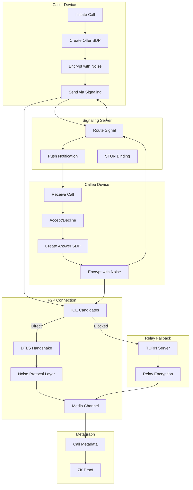

# Voice and Video Calls with Screen Sharing — Analysis & Improvements

## Quick Assessment

| Category | Status | Notes |
|----------|--------|-------|
| Core Concept | ✅ Strong | WebRTC + Noise Protocol is solid foundation |
| Architecture | ⚠️ Incomplete | Empty mermaid diagram, no TURN/STUN details |
| Feature Coverage | ✅ Comprehensive | Good breadth of calling features |
| Security Model | ⚠️ Gaps | E2EE for group calls undefined, recording consent vague |
| Integration | ⚠️ Partial | Trust mentioned but not fully specified |

---

## Critical Gaps

### 1. Empty Architecture Diagram

The Call Establishment Flow mermaid block is empty.

**Recommended Diagram:**



### 2. Group Call E2EE Undefined

The blueprint claims E2EE for up to 50 participants but doesn't explain how. Standard WebRTC E2EE is point-to-point; group calls typically require an SFU (Selective Forwarding Unit) which breaks E2EE.

**Problem:** True E2EE with 50 participants is technically challenging:
- Full mesh (each participant connects to all others): Max ~6 participants practically
- SFU (server forwards streams): Server can see unencrypted media unless using insertable streams
- Need to specify the actual approach

**Recommended Clarification:**

```
### Group Call Encryption Architecture

The system uses **Insertable Streams API** with SFU routing to achieve 
E2EE for group calls:

**Architecture:**
┌─────────┐    Encrypted    ┌─────────┐    Encrypted    ┌─────────┐
│Participant├───────────────►│   SFU   ├───────────────►│Participant│
│    A     │◄───────────────┤ (Relay) │◄───────────────┤    B     │
└─────────┘                 └────┬────┘                 └─────────┘
                                 │
                            Encrypted
                                 │
                            ┌────▼────┐
                            │Participant│
                            │    C     │
                            └─────────┘

**Key Distribution:**
- Sender keys: Each participant generates unique media encryption key
- Key distribution: Keys shared via Noise Protocol encrypted channel
- Key rotation: Every 5 minutes or on participant change
- Algorithm: AES-256-GCM for media frames

**SFU Role:**
- Routes encrypted packets (cannot decrypt)
- Handles bandwidth adaptation
- Manages simulcast layers
- No access to plaintext media

**Participant Limits by Connection Type:**

| Connection | Max Participants | Quality |
|------------|------------------|---------|
| Mesh (P2P) | 6 | Highest (no relay) |
| SFU | 50 | Adaptive |
| Audio-only SFU | 100 | N/A |
```

### 3. TURN/STUN Infrastructure Missing

No specification for NAT traversal infrastructure.

**Recommended Addition:**

```
### NAT Traversal Infrastructure

**STUN Servers:**
- Purpose: Discover public IP and port
- Deployment: Globally distributed (8 regions)
- Protocol: STUN over UDP/TCP
- No media passes through STUN

**TURN Servers:**
- Purpose: Relay media when P2P blocked
- Deployment: Same regions as STUN
- Protocol: TURN over UDP/TCP/TLS
- Encryption: TLS 1.3 + Noise Protocol overlay
- Media remains E2EE (relay can't decrypt)

**ICE Candidate Priority:**
1. Host candidates (local network)
2. Server reflexive (STUN-discovered)
3. Relay candidates (TURN fallback)

**Connection Statistics:**
- ~70% calls establish P2P directly
- ~25% require STUN assistance
- ~5% require TURN relay

**TURN Server Security:**
- Short-lived credentials (1 hour)
- Credential tied to call session
- Rate limiting per user
- Geographic restrictions available
```

### 4. Recording Consent Mechanism Undefined

"Recording with consent" is mentioned but not specified.

**Recommended Addition:**

```
### Recording Consent Protocol

**Consent Requirements:**
- Recording initiator must have trust level: Member (40+)
- All participants notified before recording starts
- Each participant must explicitly consent
- Consent recorded on metagraph

**Consent Flow:**

┌─────────────────────────────────────────────────────────┐
│ 🔴 Alice wants to record this call                      │
├─────────────────────────────────────────────────────────┤
│                                                         │
│ All participants must consent before recording begins.  │
│                                                         │
│ Participants:                                           │
│ ✓ Alice (you) - Consented                              │
│ ⏳ Bob - Waiting...                                     │
│ ⏳ Carol - Waiting...                                   │
│                                                         │
│ Recording will begin when all participants consent.     │
│                                                         │
│        [Cancel Recording Request]                       │
└─────────────────────────────────────────────────────────┘

**Consent Record (Metagraph):**
{
  "callId": "call_abc123",
  "recordingId": "rec_def456",
  "initiator": "user_alice",
  "consentTimestamps": {
    "user_alice": "2026-02-05T10:00:00Z",
    "user_bob": "2026-02-05T10:00:05Z",
    "user_carol": "2026-02-05T10:00:08Z"
  },
  "consentProof": "zk_proof_xyz789"
}

**During Recording:**
- Persistent recording indicator for all participants
- Indicator cannot be hidden or dismissed
- New participants joining see recording status
- New participants must consent or cannot join

**Consent Withdrawal:**
- Any participant can withdraw consent
- Recording pauses immediately
- 30-second grace period to re-consent
- Otherwise recording ends and saves
```

### 5. Trust Integration Not Detailed

"Verified caller identification" mentions trust but lacks specifics.

**Recommended Addition:**

```
### Trust-Based Call Permissions

**Call Initiation by Trust Level:**

| Trust Level | Voice Call | Video Call | Group Call | Screen Share |
|-------------|------------|------------|------------|--------------|
| Unverified | Contacts only | No | No | No |
| Newcomer | Contacts only | Contacts only | Create ≤4 | No |
| Member | Anyone | Contacts | Create ≤8 | Trusted+ only |
| Trusted | Anyone | Anyone | Create ≤16 | Anyone |
| Verified | Anyone | Anyone | Create ≤50 | Anyone |

**Call Reception by Circle:**

| Caller Circle | Voice | Video | Auto-Accept Option |
|---------------|-------|-------|-------------------|
| Inner | ✓ Direct | ✓ Direct | Available |
| Trusted | ✓ Direct | ✓ Request | Available |
| Known | ✓ Request | ✓ Request | No |
| Public | Request | No | No |
| Blocked | No | No | No |

**Caller ID Display:**

┌─────────────────────────────────────────────────────────┐
│             Incoming Video Call                         │
├─────────────────────────────────────────────────────────┤
│                                                         │
│                    👤                                   │
│               Alice Johnson                             │
│                                                         │
│            ✓✓✓ Verified User                           │
│            Trust Score: 87                              │
│            📍 Inner Circle                              │
│            🤝 Mutual Endorsement                        │
│                                                         │
│     [Decline]    [Message]    [Accept]                 │
└─────────────────────────────────────────────────────────┘

vs. Unknown Caller:

┌─────────────────────────────────────────────────────────┐
│             Incoming Voice Call                         │
├─────────────────────────────────────────────────────────┤
│                                                         │
│                    👤                                   │
│               Unknown User                              │
│                                                         │
│            ⚠️ Unverified                               │
│            Trust Score: 15                              │
│            📍 Not in contacts                           │
│                                                         │
│ ⚠️ This caller is not verified. Be cautious.           │
│                                                         │
│     [Block]    [Decline]    [Accept Anyway]            │
└─────────────────────────────────────────────────────────┘
```

### 6. Local Transcription Implementation Unclear

Claims "processed locally" but doesn't specify how.

**Recommended Addition:**

```
### On-Device Transcription

**Model Specification:**
| Property | Value |
|----------|-------|
| Model | Whisper Small (quantized) |
| Size | 150 MB |
| Languages | 99 languages |
| Runtime | Core ML (iOS) / ONNX (Android) |
| Latency | ~500ms per segment |
| Accuracy | ~90% WER (word error rate) |

**Processing Pipeline:**
1. Audio captured in 30-second segments
2. Segments processed by local Whisper model
3. Text output with speaker diarization
4. Timestamps aligned with call timeline
5. Stored locally, encrypted at rest

**Resource Usage:**
- CPU: 15-25% during transcription
- Memory: 200 MB resident
- Battery: ~10% additional drain per hour

**Privacy Guarantees:**
- Audio never leaves device for transcription
- No cloud speech-to-text services used
- Transcripts encrypted with call key
- User controls transcript retention

**Limitations:**
- Requires device with Neural Engine / NPU
- May lag 1-2 seconds behind speech
- Accuracy varies by accent/noise
- Not available on older devices (pre-2020)
```

### 7. Screen Share Security Controls Missing Details

"Screenshot prevention" and "recording prevention" mentioned but not explained.

**Recommended Addition:**

```
### Screen Share Security Controls

**DRM-Style Protection:**
| Platform | Screenshot Prevention | Recording Prevention |
|----------|----------------------|---------------------|
| iOS | Secure window flag | Secure window flag |
| Android | FLAG_SECURE | FLAG_SECURE |
| macOS | Private window mode | Private window mode |
| Windows | SetWindowDisplayAffinity | DRM protected layer |

**Limitations (Important):**
- Cannot prevent external camera pointed at screen
- Cannot prevent HDMI capture devices
- Some Android ROMs bypass FLAG_SECURE
- Screen recording apps with root access may bypass

**Granular Permissions:**

| Permission | Description | Default |
|------------|-------------|---------|
| Allow screenshots | Viewers can screenshot | Off |
| Allow recording | Viewers can record | Off |
| Annotation allowed | Viewers can draw | Off |
| Control allowed | Viewers can request control | Off |
| Audio included | Share system audio | Off |

**Presenter Controls:**
- Pause sharing instantly (hotkey: Cmd/Ctrl + Shift + P)
- Blur sensitive areas before sharing
- Application blacklist (never share: password manager, banking)
- Notification hiding during share
- "Show only this window" mode

**Viewer Indicators:**
- Viewers cannot hide that they're viewing
- Active viewer count always visible to presenter
- Viewer attention tracking (optional, consent required)
```

---

## Feature Improvements

### Voice Calling — Add Call Quality Presets

**Add:**
```
### Call Quality Presets

| Preset | Bitrate | Codec | Use Case |
|--------|---------|-------|----------|
| Low Data | 16 kbps | Opus | Poor connection, roaming |
| Balanced | 32 kbps | Opus | Default, most calls |
| High Quality | 64 kbps | Opus | Good connection, important calls |
| Studio | 128 kbps | Opus | Recording, broadcast |

**Auto-Adjustment Thresholds:**
- Drop to lower preset if packet loss > 5%
- Upgrade to higher preset if RTT < 100ms for 30s
- User override available but warned if network poor
```

### Video Calling — Add Layout Options

**Add:**
```
### Video Layout Modes

| Mode | Description | Best For |
|------|-------------|----------|
| Speaker | Active speaker fullscreen, others in strip | Presentations |
| Gallery | Equal-sized grid (max 25 visible) | Team meetings |
| Spotlight | Pin specific participant | Interviews |
| Side-by-Side | Two participants equally | 1:1 meetings |
| Picture-in-Picture | Floating mini window | Multitasking |

**Automatic Layout Switching:**
- Switch to Speaker mode when screen sharing starts
- Return to previous mode when sharing ends
- Auto-spotlight when someone speaks for >10s
```

### Call Scheduling — Add Trust Integration

**Add:**
```
### Scheduled Call Trust Requirements

| Setting | Options |
|---------|---------|
| Minimum trust to join | Unverified / Newcomer / Member / Trusted / Verified |
| Require verification badge | Yes / No |
| Require circle membership | Any / Known+ / Trusted+ / Inner only |
| Allow forwarding invite | Yes / No |
| Waiting room | Enabled for < threshold trust |

**Scheduled Call Link:**
- Links expire after scheduled time + grace period
- Links can require password
- Links can be one-time use
- Links record who accessed (metagraph)
```

### Call History — Add Rich Metadata

**Add:**
```
### Call History Entry

| Field | Description |
|-------|-------------|
| Participants | Names, trust levels at call time |
| Duration | Total and per-participant |
| Quality metrics | Avg bitrate, packet loss, latency |
| Network type | WiFi, cellular, relay used |
| Recording | Link if recorded, consent record |
| Transcript | Link if transcribed |
| Metagraph anchor | Verification proof |
| Notes | User-added call notes |

**Call History Search:**
- Search by participant name
- Filter by date range
- Filter by call type (voice/video)
- Filter by duration
- Filter by has:recording, has:transcript
```

---

## New Features to Add

### 1. Call Waiting / Multiple Calls

```
### Multi-Call Support

**Call Waiting:**
- Second incoming call shows notification
- Option to: Decline, Hold current & answer, Send to voicemail
- Visual indicator of held call

**Call Merging:**
- Merge two calls into group call
- Trust check: all participants must meet minimum
- Max merge: limited by group call limits

**Call Transfer:**
- Transfer call to another contact
- Warm transfer: introduce before transfer
- Cold transfer: direct handoff
- Transfer requires recipient consent
```

### 2. Voice Messages During Calls

```
### In-Call Voice Message

When call is declined or unanswered:
- Option to leave encrypted voice message
- Max duration: 2 minutes
- Message delivered via normal message channel
- Transcription available if enabled

**UI Flow:**
┌─────────────────────────────────────────────────────────┐
│ Alice is unavailable                                    │
├─────────────────────────────────────────────────────────┤
│                                                         │
│      📞 Call ended                                      │
│                                                         │
│   [Try Again]   [Send Message]   [Leave Voice Message]  │
│                                                         │
└─────────────────────────────────────────────────────────┘
```

### 3. Real-Time Translation

```
### Call Translation (Premium)

**Supported:**
- 20 language pairs
- Real-time audio translation
- On-device for privacy (larger model: 500MB)
- Fallback to secure cloud (consent required)

**UI:**
- Participant A speaks English
- Participant B hears Spanish translation
- Subtitle overlay option
- Original audio also available

**Limitations:**
- 1-2 second delay for translation
- Accuracy varies by language pair
- Technical vocabulary may be inaccurate
```

### 4. Breakout Rooms

```
### Breakout Rooms (Group Calls)

**Features:**
- Split large call into smaller rooms
- Automatic or manual assignment
- Timer for breakout duration
- Host can broadcast to all rooms
- Host can join any room
- Recall all participants

**Permissions:**
- Only call host can create breakouts
- Minimum trust: Trusted (60+)
- Max rooms: participants / 2

**Trust in Breakouts:**
- Each room inherits parent call settings
- Recording requires re-consent per room
- Participants can't switch rooms without host
```

### 5. Call Analytics Dashboard

```
### Call Analytics (Enterprise)

**Individual Metrics:**
- Total call minutes (week/month)
- Average call quality score
- Network reliability percentage
- Most frequent contacts

**Team Metrics (Admin):**
- Team call volume trends
- Quality issues by region
- Recording compliance rate
- Trust distribution of external calls

**Privacy:**
- Aggregate metrics only
- No individual call content access
- User can opt-out of non-essential metrics
```

---

## Security Additions

### Threat Model

| Threat | Current Mitigation | Recommended Addition |
|--------|-------------------|---------------------|
| SRTP interception | Noise Protocol | Specify key exchange details |
| Man-in-middle | E2EE claimed | Add SAS verification option |
| Oserver sees metadata | ZK proofs claimed | Specify what's hidden |
| Malicious SFU | Not addressed | Specify SFU can't decrypt |
| Recording without consent | Consent required | Cryptographic consent proof |
| Deepfake caller | Trust display | Add voice/video verification option |
| Oserver location tracking | Not addressed | IP masking via relay option |

### SAS Verification (Optional Security)

```
### Short Authentication String Verification

For high-security calls, users can verify E2EE with SAS:

**Flow:**
1. Both participants tap "Verify Call Security"
2. App displays same 4-word phrase on both devices
3. Participants read phrase aloud to each other
4. If match, tap "Verified" — call marked secure
5. If mismatch, potential MITM attack — end call

**SAS Display:**
┌─────────────────────────────────────────────────────────┐
│ Verify Call Security                                    │
├─────────────────────────────────────────────────────────┤
│                                                         │
│ Read these words aloud to Alice:                       │
│                                                         │
│       "TIGER LAMP OCEAN BRAVE"                          │
│                                                         │
│ If Alice sees the same words, your call is secure.     │
│                                                         │
│        [Words Don't Match]        [Verified ✓]         │
└─────────────────────────────────────────────────────────┘
```

---

## Integration Points

### With Messaging Blueprint

```
**Missed Call Messages:**
- Missed calls appear in conversation
- Option to leave voice message
- Call-back button in message

**Message During Call:**
- Send messages to call participants
- Share files during call
- Messages encrypted same as call

**Call from Message:**
- Tap contact header to call
- Long-press message to call sender
```

### With Trust Network Blueprint

```
**Trust-Based Permissions:**
- Call permissions by trust level (see table above)
- Caller ID shows trust score and badges
- Warning for low-trust callers
- Auto-decline option for unverified

**Trust Score Effects:**
- Answered call from new contact: +0.2 points
- Call reported as spam: -5 points for caller
- Successful business call: +0.1 points
- Recording consent given: neutral
```

### With Silent & Scheduled Blueprint

```
**Silent Mode & Calls:**
- Silent mode suppresses call notifications
- DND mode sends calls to voicemail
- Inner Circle can bypass silent (optional)

**Scheduled Calls:**
- Schedule via Silent/Scheduled system
- Time-locked invite links
- Reminder messages before call
- Auto-start at scheduled time (if both online)
```

### With Search & Archive Blueprint

```
**Call Searchability:**
- Search call history by participant
- Search transcripts if available
- Filter by date, duration, type

**Archive:**
- Archive old call history
- Retention rules apply to call records
- Recordings follow archive rules
```

---

## Summary of Recommendations

**Must Fix:**
1. Complete the architecture diagram
2. Specify group call E2EE mechanism (insertable streams + SFU)
3. Define TURN/STUN infrastructure
4. Detail recording consent protocol with metagraph proof
5. Specify trust-based call permissions

**Should Add:**
6. On-device transcription model specification
7. Screen share security control details
8. Call quality presets
9. SAS verification for high-security calls

**Nice to Have:**
10. Multi-call support (waiting, merge, transfer)
11. Real-time translation
12. Breakout rooms
13. Voice message on declined call
14. Call analytics dashboard

---

*Analysis Date: February 5, 2026*
