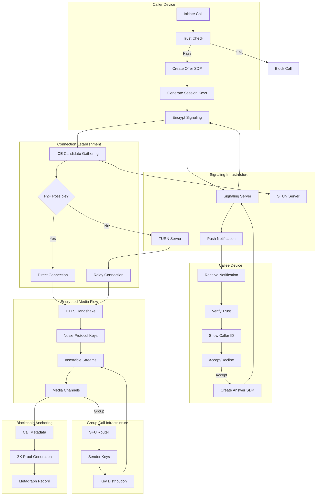
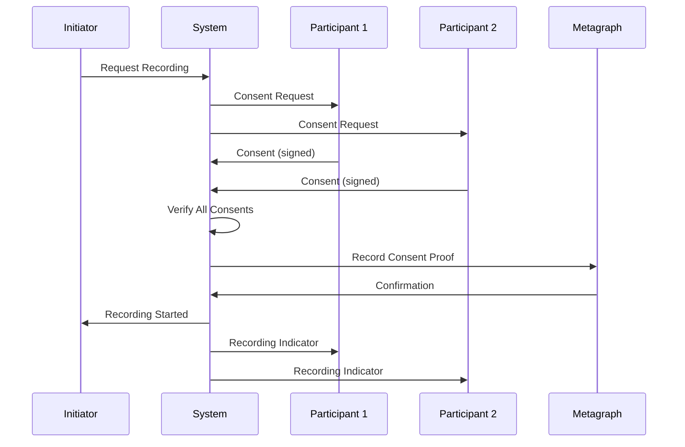

# Voice and Video Calls with Screen Sharing

## Overview

This feature provides high-quality voice and video calling capabilities with advanced screen sharing functionality, enabling users to conduct business meetings, technical support sessions, and collaborative work directly within the secure messaging environment. The system maintains end-to-end encryption for all audio, video, and screen content while leveraging the platform's trust infrastructure to verify participant identities and prevent unauthorized access to sensitive shared content.

## Architecture

The calling infrastructure uses WebRTC protocols enhanced with the platform's Noise Protocol encryption to ensure all call data remains private and tamper-proof. Calls are established through peer-to-peer connections when possible, with a Selective Forwarding Unit (SFU) providing scalable routing for group calls while maintaining end-to-end encryption through the Insertable Streams API.

### Call Establishment Flow



### Architecture Components

| Component | Technology | Purpose |
|-----------|------------|---------|
| Signaling | WebSocket + Noise Protocol | Encrypted call setup |
| STUN | RFC 5389 | NAT discovery |
| TURN | RFC 5766 over TLS 1.3 | Relay fallback |
| Media Encryption | SRTP + Noise Protocol | E2EE audio/video |
| Group Routing | Custom SFU | Scalable group calls |
| Frame Encryption | Insertable Streams API | E2EE through SFU |
| Codec (Audio) | Opus | Adaptive audio |
| Codec (Video) | VP9 / H.264 | Adaptive video |

### Connection Type Distribution

| Connection Type | Percentage | Latency | Description |
|-----------------|------------|---------|-------------|
| Direct P2P | ~45% | Lowest | Both on open networks |
| STUN-assisted P2P | ~30% | Low | NAT traversal successful |
| TURN Relay | ~20% | Medium | Symmetric NAT or firewall |
| TURN over TCP | ~5% | Higher | UDP blocked |

## Key Components

### Voice Calling

Users can initiate voice calls with individual contacts or groups. Voice calls support up to 100 participants in audio-only mode with automatic quality adjustment based on network conditions.

**Key Features:**

* One-on-one and group voice calls
* Up to 100 participants (audio-only)
* Automatic quality adjustment
* AI noise cancellation (on-device)
* Speaker identification and labeling
* Mute/unmute with visual indicator
* Call hold and resume
* Call transfer (warm and cold)
* Call recording with cryptographic consent
* Full call history with search

**Audio Quality Presets:**

| Preset | Bitrate | Sample Rate | Use Case |
|--------|---------|-------------|----------|
| Low Data | 16 kbps | 16 kHz | Poor connection, roaming |
| Balanced | 32 kbps | 24 kHz | Default for most calls |
| High Quality | 64 kbps | 48 kHz | Good connection |
| Studio | 128 kbps | 48 kHz stereo | Recording, broadcast |

**Noise Cancellation:**

```
On-Device AI Noise Cancellation

Model: RNNoise (quantized)
Size: 2 MB
CPU Usage: ~5%
Latency: <10ms

Removes:
- Background chatter
- Keyboard typing
- Fan/AC noise
- Traffic sounds
- Echo cancellation

Does NOT remove:
- Music (intentional)
- Doorbell/alerts (safety)
- Other speakers (intentional)
```

### Video Calling

Users can initiate video calls with individual contacts or groups. Video calls support up to 50 participants with automatic quality adjustment.

**Key Features:**

* One-on-one and group video calls
* Up to 50 participants with video
* Adaptive quality (360p to 1080p)
* Virtual backgrounds (on-device ML)
* Beauty filters (local processing)
* Front/back camera switching
* Video mute with avatar display
* Picture-in-Picture mode
* Multiple layout options
* Call recording with consent

**Video Quality Tiers:**

| Tier | Resolution | Bitrate | Participants |
|------|------------|---------|--------------|
| Thumbnail | 180p | 100 kbps | Gallery overflow |
| Low | 360p | 300 kbps | Poor network |
| Medium | 540p | 800 kbps | Default |
| High | 720p | 1.5 Mbps | Good network |
| Full HD | 1080p | 3 Mbps | 1:1 calls only |

**Simulcast Layers:**

```
Sender transmits multiple quality layers simultaneously:

┌─────────────────────────────────────────────────────────┐
│ Camera Input (1080p)                                    │
├─────────────────────────────────────────────────────────┤
│                                                         │
│   ┌─────────┐   ┌─────────┐   ┌─────────┐              │
│   │ 1080p   │   │  720p   │   │  360p   │              │
│   │ 3 Mbps  │   │ 1.5Mbps │   │ 300kbps │              │
│   │ Layer 2 │   │ Layer 1 │   │ Layer 0 │              │
│   └────┬────┘   └────┬────┘   └────┬────┘              │
│        │             │             │                    │
│        └─────────────┼─────────────┘                    │
│                      ▼                                  │
│              ┌──────────────┐                           │
│              │     SFU      │                           │
│              │ Selects best │                           │
│              │ layer per    │                           │
│              │ recipient    │                           │
│              └──────────────┘                           │
└─────────────────────────────────────────────────────────┘
```

**Layout Modes:**

| Mode | Description | Best For |
|------|-------------|----------|
| Speaker | Active speaker fullscreen, others in filmstrip | Presentations |
| Gallery | Equal grid, up to 25 visible (paginated) | Team meetings |
| Spotlight | Pin 1-4 participants prominently | Interviews, panels |
| Side-by-Side | Two participants equally sized | 1:1 conversations |
| Picture-in-Picture | Floating mini window | Multitasking |
| Audio-Only | Avatars only, saves bandwidth | Low bandwidth |

### Group Call E2EE Architecture

Group calls maintain end-to-end encryption using the Insertable Streams API with sender keys, ensuring the SFU cannot access plaintext media.

**Architecture Overview:**

```
┌─────────────┐         ┌─────────────┐         ┌─────────────┐
│Participant A│         │     SFU     │         │Participant B│
│             │         │             │         │             │
│ ┌─────────┐ │         │             │         │ ┌─────────┐ │
│ │Encrypt  │──────────►│ ─────────── │────────►│ │Decrypt  │ │
│ │(Key A)  │ │Encrypted│  Forward    │Encrypted│ │(Key A)  │ │
│ └─────────┘ │ Frames  │  Only       │ Frames  │ └─────────┘ │
│             │         │             │         │             │
│ ┌─────────┐ │         │             │         │ ┌─────────┐ │
│ │Decrypt  │◄──────────│ ─────────── │◄────────│ │Encrypt  │ │
│ │(Key B)  │ │         │             │         │ │(Key B)  │ │
│ └─────────┘ │         │             │         │ └─────────┘ │
└─────────────┘         └─────────────┘         └─────────────┘

SFU sees: Encrypted frames (cannot decrypt)
SFU does: Route, adapt bitrate, select simulcast layer
```

**Sender Key Protocol:**

```typescript
interface SenderKeyDistribution {
  // Each participant generates their own sender key
  participantId: string;
  senderKey: {
    algorithm: 'AES-256-GCM';
    key: Uint8Array;          // 256-bit key
    keyId: number;            // For key rotation
    createdAt: Date;
  };
  
  // Key distributed to all participants via Noise Protocol
  distribution: {
    encryptedTo: ParticipantId[];
    distributedAt: Date;
    signature: Uint8Array;    // Sign with identity key
  };
}

// Key rotation triggers
const KEY_ROTATION_TRIGGERS = {
  timeInterval: 5 * 60 * 1000,    // Every 5 minutes
  participantJoin: true,           // New participant joins
  participantLeave: true,          // Participant leaves
  manualRequest: true,             // User requests rotation
};
```

**Frame Encryption:**

```typescript
interface EncryptedFrame {
  // Insertable Streams API frame structure
  keyId: number;              // Which sender key version
  iv: Uint8Array;             // 12-byte nonce
  encryptedData: Uint8Array;  // AES-256-GCM ciphertext
  authTag: Uint8Array;        // 16-byte authentication tag
  
  // Metadata (unencrypted, for routing)
  participantId: string;
  frameType: 'key' | 'delta';
  timestamp: number;
}

// Encryption process
function encryptFrame(frame: VideoFrame, senderKey: SenderKey): EncryptedFrame {
  const iv = crypto.getRandomValues(new Uint8Array(12));
  const { ciphertext, authTag } = aesGcmEncrypt(
    senderKey.key,
    iv,
    frame.data
  );
  
  return {
    keyId: senderKey.keyId,
    iv,
    encryptedData: ciphertext,
    authTag,
    participantId: myParticipantId,
    frameType: frame.type,
    timestamp: frame.timestamp,
  };
}
```

**Participant Limits by Mode:**

| Mode | Max Participants | Encryption | Quality |
|------|------------------|------------|---------|
| P2P Mesh | 6 | Direct DTLS | Highest |
| SFU Video | 50 | Sender Keys | Adaptive |
| SFU Audio-Only | 100 | Sender Keys | High |
| Webinar (View-Only) | 1000 | Sender Keys | Presenter only |

### NAT Traversal Infrastructure

**STUN Servers:**

```
Global STUN Deployment:

┌─────────────────────────────────────────────────────────┐
│                    STUN Servers                         │
├─────────────────────────────────────────────────────────┤
│                                                         │
│  🌍 Region          │ Endpoints    │ Capacity           │
│  ─────────────────────────────────────────────────────  │
│  North America East │ 4 servers    │ 100K concurrent    │
│  North America West │ 4 servers    │ 100K concurrent    │
│  Europe West        │ 4 servers    │ 100K concurrent    │
│  Europe East        │ 2 servers    │ 50K concurrent     │
│  Asia Pacific       │ 4 servers    │ 100K concurrent    │
│  South America      │ 2 servers    │ 50K concurrent     │
│  Middle East        │ 2 servers    │ 50K concurrent     │
│  Africa             │ 2 servers    │ 50K concurrent     │
│                                                         │
│  Protocol: STUN (RFC 5389) over UDP + TCP fallback     │
│  Purpose: Discover public IP:port mapping               │
│  Privacy: No media flows through STUN                   │
│                                                         │
└─────────────────────────────────────────────────────────┘
```

**TURN Servers:**

```
Global TURN Deployment:

┌─────────────────────────────────────────────────────────┐
│                    TURN Servers                         │
├─────────────────────────────────────────────────────────┤
│                                                         │
│  Same regions as STUN, co-located                       │
│                                                         │
│  Protocol: TURN (RFC 5766)                              │
│  Transport: UDP preferred, TCP/TLS fallback            │
│  Encryption: TLS 1.3 for TCP, DTLS for UDP             │
│                                                         │
│  Credential System:                                     │
│  ┌─────────────────────────────────────────────────┐   │
│  │ • Short-lived credentials (1 hour validity)     │   │
│  │ • Credentials bound to call session ID          │   │
│  │ • HMAC-based credential generation              │   │
│  │ • Rate limit: 10 Mbps per user                  │   │
│  │ • Geographic restrictions available             │   │
│  └─────────────────────────────────────────────────┘   │
│                                                         │
│  Privacy Guarantee:                                     │
│  ┌─────────────────────────────────────────────────┐   │
│  │ • Media encrypted before reaching TURN          │   │
│  │ • TURN sees only encrypted packets              │   │
│  │ • Cannot decrypt audio/video content            │   │
│  │ • Logs: only connection metadata, 24h retention │   │
│  └─────────────────────────────────────────────────┘   │
│                                                         │
└─────────────────────────────────────────────────────────┘
```

**ICE Candidate Prioritization:**

```typescript
const ICE_PRIORITY = {
  // Prefer direct connections
  host: {
    priority: 126,
    description: 'Local network interface',
  },
  
  // Then STUN-discovered public address
  serverReflexive: {
    priority: 100,
    description: 'Public IP via STUN',
  },
  
  // Then peer reflexive (discovered during connectivity checks)
  peerReflexive: {
    priority: 110,
    description: 'Discovered during ICE',
  },
  
  // Relay as last resort
  relay: {
    priority: 0,
    description: 'TURN relay (highest latency)',
  },
};
```

### Screen Sharing

Users can share their entire screen, specific application windows, or selected desktop areas with call participants. Screen sharing is encrypted end-to-end with granular permission controls.

**Key Features:**

* Full screen sharing
* Application window sharing
* Browser tab sharing (with audio)
* Selected area/region sharing
* Annotation tools (draw, highlight, pointer)
* Remote pointer visibility
* Granular permission controls
* DRM-style capture prevention
* Resolution up to 1080p @ 15fps (4K @ 5fps)
* Audio sharing (system audio)

**Screen Share Modes:**

| Mode | Content | Audio | Use Case |
|------|---------|-------|----------|
| Full Screen | Entire display | Optional | General sharing |
| Window | Single application | App audio | Focused demo |
| Browser Tab | Single tab | Tab audio | Web content |
| Region | Selected area | No | Privacy-conscious |

**Permission Controls:**

```typescript
interface ScreenSharePermissions {
  // What presenter allows
  presenterControls: {
    allowViewerScreenshots: boolean;    // Default: false
    allowViewerRecording: boolean;      // Default: false
    allowViewerAnnotation: boolean;     // Default: false
    allowRemoteControl: boolean;        // Default: false
    includeSystemAudio: boolean;        // Default: false
    showMousePointer: boolean;          // Default: true
    highlightClicks: boolean;           // Default: false
  };
  
  // Application blacklist (never share these)
  applicationBlacklist: string[];       // e.g., ['1Password', 'Banking App']
  
  // Notification handling
  hideNotifications: boolean;           // Default: true
  hideNotificationContent: boolean;     // Default: true
}
```

**Capture Prevention:**

| Platform | Method | Protection Level |
|----------|--------|------------------|
| iOS | UIScreen.isCaptured detection | High |
| Android | FLAG_SECURE on surface | Medium-High |
| macOS | CGDisplayStream private mode | Medium |
| Windows | SetWindowDisplayAffinity(WDA_EXCLUDEFROMCAPTURE) | Medium |

**Limitations (Transparency):**

```
⚠️ Screen Share Security Limitations

What we CAN prevent:
✓ Built-in screenshot tools (Cmd+Shift+4, PrtScn)
✓ Built-in screen recording (QuickTime, Xbox Game Bar)
✓ Most third-party recording apps

What we CANNOT prevent:
✗ External camera pointing at screen
✗ HDMI/DisplayPort capture devices
✗ Virtual machine screenshots from host
✗ Rooted/jailbroken device bypasses
✗ Memory inspection tools (advanced)

Recommendation: For highly sensitive content, use 
watermarking and trusted participant verification.
```

**Presenter Controls UI:**

```
┌─────────────────────────────────────────────────────────┐
│ You are sharing: "Quarterly Report.xlsx"          ⏸️ ⏹️ │
├─────────────────────────────────────────────────────────┤
│                                                         │
│ Viewers: Alice, Bob, Carol                              │
│                                                         │
│ Quick Actions:                                          │
│ [🔇 Mute Audio] [✏️ Annotate] [👆 Highlight Clicks]     │
│                                                         │
│ [⚙️ Sharing Settings...]                               │
│                                                         │
│ ⌨️ Pause: Cmd+Shift+P  │  ⏹️ Stop: Cmd+Shift+S          │
└─────────────────────────────────────────────────────────┘
```

### Call Quality Management

The system automatically adjusts call quality based on network conditions and device capabilities.

**Key Features:**

* Real-time bandwidth estimation
* Adaptive bitrate adjustment
* Automatic codec switching
* Packet loss concealment
* Jitter buffer optimization
* Network type detection
* Quality statistics display
* Proactive quality warnings
* Graceful degradation
* Recovery handling

**Quality Indicators:**

```
┌─────────────────────────────────────────────────────────┐
│ Call Quality                                            │
├─────────────────────────────────────────────────────────┤
│                                                         │
│ Your Connection:     ████████░░ Good                   │
│ Latency:            45ms (excellent)                   │
│ Packet Loss:        0.2% (excellent)                   │
│ Jitter:             12ms (good)                        │
│ Bandwidth:          ↑ 2.1 Mbps  ↓ 1.8 Mbps            │
│                                                         │
│ Current Quality:    720p @ 30fps                       │
│ Audio:              Opus 48kHz stereo                  │
│                                                         │
│ Connection Type:    P2P (direct)                       │
│                                                         │
├─────────────────────────────────────────────────────────┤
│ Participant Quality:                                    │
│ Alice:  ████████░░ Good   │ Bob:  ██████░░░░ Fair      │
└─────────────────────────────────────────────────────────┘
```

**Automatic Adjustments:**

| Condition | Action |
|-----------|--------|
| Packet loss > 3% | Reduce video bitrate 25% |
| Packet loss > 8% | Switch to lower resolution |
| Packet loss > 15% | Disable video, audio only |
| Latency > 300ms | Enable FEC (forward error correction) |
| Latency > 500ms | Reduce frame rate to 15fps |
| Bandwidth < 500kbps | Audio only mode |
| Bandwidth recovers | Gradually restore quality |

### Real-Time Transcription

Calls can be automatically transcribed in real-time for accessibility. Transcription is processed entirely on-device to maintain privacy.

**Key Features:**

* Real-time speech-to-text
* 99 language support
* Speaker diarization (who said what)
* Punctuation and formatting
* Searchable transcripts
* Export to text/PDF
* Accessibility integration
* Zero cloud processing

**On-Device Model:**

| Property | Specification |
|----------|---------------|
| Model | Whisper Small (INT8 quantized) |
| Size | 150 MB |
| Languages | 99 (auto-detect or manual) |
| Runtime | Core ML (iOS) / ONNX (Android) |
| Latency | ~500ms behind speech |
| Accuracy | ~90% WER (word error rate) |
| CPU Usage | 15-25% during transcription |
| Memory | 200 MB resident |
| Battery | ~10% additional drain/hour |

**Transcription Display:**

```
┌─────────────────────────────────────────────────────────┐
│ Live Transcript                               🔴 REC    │
├─────────────────────────────────────────────────────────┤
│                                                         │
│ 10:15:32 Alice (Verified ✓)                            │
│ "Let's review the quarterly numbers. As you can see    │
│ on slide three, we've exceeded our targets."           │
│                                                         │
│ 10:15:45 Bob                                           │
│ "That's great news. What about the European market?"   │
│                                                         │
│ 10:15:52 Alice (Verified ✓)                            │
│ "Europe is up fifteen percent, which is..."            │
│ [transcribing...]                                       │
│                                                         │
├─────────────────────────────────────────────────────────┤
│ 🔒 Transcription is processed on your device only.     │
│                                                         │
│ [Search] [Export] [Settings]                           │
└─────────────────────────────────────────────────────────┘
```

**Device Requirements:**

| Platform | Minimum | Recommended |
|----------|---------|-------------|
| iOS | A12 Bionic (2018+) | A14+ |
| Android | Snapdragon 855 (2019+) | Snapdragon 888+ |
| Note | Neural Engine / NPU required | - |

### Call Recording

Calls can be recorded with explicit, cryptographically-verified participant consent.

**Key Features:**

* Recording requires all-party consent
* Consent recorded on metagraph
* Persistent recording indicator
* Local or cloud-encrypted storage
* Recording pause/resume
* Separate audio/video tracks
* Transcript included if enabled
* Secure sharing with expiry
* Compliance mode for enterprises

**Consent Protocol:**



**Consent UI:**

```
┌─────────────────────────────────────────────────────────┐
│ 🔴 Recording Request                                    │
├─────────────────────────────────────────────────────────┤
│                                                         │
│ Alice wants to record this call.                       │
│                                                         │
│ By consenting, you agree to have your audio and video  │
│ recorded. The recording will be:                       │
│                                                         │
│ • Encrypted end-to-end                                 │
│ • Stored by Alice                                      │
│ • Your consent recorded on blockchain                  │
│                                                         │
│ Waiting for consent from:                              │
│ ✓ Alice (initiator)                                    │
│ ⏳ Bob                                                  │
│ ⏳ You                                                  │
│                                                         │
│              [Decline]        [I Consent]              │
└─────────────────────────────────────────────────────────┘
```

**Consent Record (Metagraph):**

```typescript
interface RecordingConsentRecord {
  // Recording identification
  recordingId: string;
  callId: string;
  
  // Consent details
  initiator: {
    userId: string;
    timestamp: Date;
    signature: string;
  };
  
  participants: {
    userId: string;
    consentedAt: Date;
    signature: string;        // Signed with identity key
    consentHash: string;      // Hash of consent UI shown
  }[];
  
  // Recording metadata (no content)
  metadata: {
    startTime: Date;
    endTime?: Date;
    duration?: number;
    participantCount: number;
    hasVideo: boolean;
    hasScreenShare: boolean;
    hasTranscript: boolean;
  };
  
  // Blockchain anchor
  anchor: {
    txHash: string;
    snapshotId: string;
    timestamp: Date;
  };
}
```

**During Recording:**

| Rule | Enforcement |
|------|-------------|
| Indicator always visible | Cannot be hidden or minimized |
| New participant joins | Must consent or cannot see recording |
| Participant withdraws consent | Recording pauses, 30s to re-consent |
| Consent not restored | Recording ends, partial saved |
| Initiator leaves | Recording ends |

**Recording Storage:**

| Option | Encryption | Location | Sharing |
|--------|------------|----------|---------|
| Local Device | AES-256-GCM | Device storage | Manual export |
| Cloud (User) | AES-256-GCM (client-side) | User's cloud | Secure links |
| Enterprise | AES-256-GCM + compliance key | Company storage | Audit access |

### Call Scheduling

Users can schedule calls in advance with calendar integration and automated reminders.

**Key Features:**

* Schedule calls up to 90 days ahead
* Calendar integration (iOS/Google/Outlook)
* Customizable reminders
* Recurring call support
* Timezone-aware scheduling
* Meeting agenda and notes
* Participant trust requirements
* Waiting room option
* Join-before-host option
* One-click join from reminder

**Scheduled Call Settings:**

```typescript
interface ScheduledCall {
  // Basic info
  callId: string;
  title: string;
  description?: string;
  agenda?: string;
  
  // Timing
  scheduledStart: Date;
  scheduledDuration: number;     // minutes
  timezone: string;
  
  // Recurrence
  recurrence?: {
    pattern: 'daily' | 'weekly' | 'biweekly' | 'monthly';
    endDate?: Date;
    occurrences?: number;
  };
  
  // Participants
  host: UserId;
  coHosts: UserId[];
  invitees: UserId[];
  
  // Trust requirements
  trustRequirements: {
    minimumTrustLevel: TrustLevel;
    requireVerificationBadge: boolean;
    minimumCircle: CircleLevel;
    allowForwardingInvite: boolean;
  };
  
  // Call settings
  settings: {
    waitingRoom: boolean;
    joinBeforeHost: boolean;
    muteOnEntry: boolean;
    videoOffOnEntry: boolean;
    recordAutomatically: boolean;
    enableTranscription: boolean;
  };
  
  // Reminders
  reminders: {
    times: number[];           // Minutes before: [60, 15, 5]
    methods: ('push' | 'email' | 'sms')[];
  };
}
```

**Calendar Integration:**

```
┌─────────────────────────────────────────────────────────┐
│ Schedule Call                                           │
├─────────────────────────────────────────────────────────┤
│                                                         │
│ Title: Weekly Team Sync                                │
│ ───────────────────────────────────────────────────    │
│                                                         │
│ Date: [Tuesday, Feb 10, 2026    ▼]                     │
│ Time: [10:00 AM                 ▼]                     │
│ Duration: [60 minutes           ▼]                     │
│                                                         │
│ Your timezone: EST (UTC-5)                             │
│                                                         │
│ Participants:                                          │
│ ┌─────────────────────────────────────────────────┐    │
│ │ 👤 Alice Johnson (Host)                   [You] │    │
│ │ 👤 Bob Smith                          [Remove] │    │
│ │ 👤 Carol Williams                     [Remove] │    │
│ │ [+ Add participants...]                        │    │
│ └─────────────────────────────────────────────────┘    │
│                                                         │
│ □ Repeat: [Weekly on Tuesdays ▼]                       │
│ □ Require verified participants                        │
│ □ Enable waiting room                                  │
│ □ Record automatically (consent at start)              │
│                                                         │
│ Sync to: [✓] iOS Calendar  [✓] Google Calendar        │
│                                                         │
│          [Cancel]              [Schedule Call]         │
└─────────────────────────────────────────────────────────┘
```

### Trust-Based Call Permissions

The calling system integrates with the Trust Network to control who can call whom and display verified caller identification.

**Call Initiation Permissions:**

| Trust Level | Voice (1:1) | Video (1:1) | Group (Create) | Screen Share |
|-------------|-------------|-------------|----------------|--------------|
| Unverified (0-19) | Contacts only | No | No | No |
| Newcomer (20-39) | Contacts only | Contacts only | Up to 4 | No |
| Member (40-59) | Anyone | Contacts | Up to 8 | Trusted+ only |
| Trusted (60-79) | Anyone | Anyone | Up to 16 | Anyone |
| Verified (80-100) | Anyone | Anyone | Up to 50 | Anyone |

**Call Reception by Circle:**

| Caller's Circle | Voice | Video | Auto-Accept Available |
|-----------------|-------|-------|----------------------|
| Inner Circle | ✓ Direct ring | ✓ Direct ring | Yes |
| Trusted | ✓ Direct ring | ✓ Ring with preview | Yes |
| Known | ✓ Ring with approval | ✓ Approval required | No |
| Public (Verified) | ✓ Approval required | Approval required | No |
| Public (Unverified) | Notification only | No | No |
| Blocked | Silently rejected | Silently rejected | No |

**Caller ID Display:**

```
Trusted Caller:
┌─────────────────────────────────────────────────────────┐
│               Incoming Video Call                       │
├─────────────────────────────────────────────────────────┤
│                                                         │
│                       👤                                │
│                  Alice Johnson                          │
│                                                         │
│              ✓✓✓ Verified User                         │
│              Trust Score: 87                            │
│              📍 Inner Circle                            │
│              🤝 Mutual Endorsement                      │
│                                                         │
│       🔴               💬               🟢              │
│    [Decline]       [Message]        [Accept]           │
│                                                         │
└─────────────────────────────────────────────────────────┘

Unknown/Low-Trust Caller:
┌─────────────────────────────────────────────────────────┐
│               Incoming Voice Call                       │
├─────────────────────────────────────────────────────────┤
│                                                         │
│                       👤                                │
│                  Unknown User                           │
│                                                         │
│              ⚠️ Unverified Account                      │
│              Trust Score: 15                            │
│              📍 Not in your contacts                    │
│                                                         │
│  ┌─────────────────────────────────────────────────┐   │
│  │ ⚠️ CAUTION: This caller has a low trust score.  │   │
│  │ They may be attempting to impersonate someone.  │   │
│  │ Consider verifying their identity before        │   │
│  │ sharing sensitive information.                  │   │
│  └─────────────────────────────────────────────────┘   │
│                                                         │
│       🚫              🔴               🟡              │
│    [Block]        [Decline]      [Accept Anyway]       │
│                                                         │
└─────────────────────────────────────────────────────────┘
```

**SAS Verification (Optional High-Security):**

For high-stakes calls, participants can verify the E2EE channel:

```
┌─────────────────────────────────────────────────────────┐
│ Verify Call Security                              ×     │
├─────────────────────────────────────────────────────────┤
│                                                         │
│ To verify your call is secure, compare these words     │
│ with Alice. Read them aloud to each other:             │
│                                                         │
│            ╔═══════════════════════════╗               │
│            ║  TIGER  LAMP  OCEAN  BRAVE ║               │
│            ╚═══════════════════════════╝               │
│                                                         │
│ If Alice sees the same four words, your call is        │
│ end-to-end encrypted and cannot be intercepted.        │
│                                                         │
│ If the words are DIFFERENT, end the call immediately   │
│ - someone may be intercepting your communication.      │
│                                                         │
│      [Words Don't Match!]        [Verified ✓]          │
└─────────────────────────────────────────────────────────┘
```

### Call Metadata & Blockchain Anchoring

Call metadata is recorded on the metagraph for audit purposes while preserving participant privacy through zero-knowledge proofs.

**Key Features:**

* Call metadata anchored on-chain
* Participant privacy via ZK proofs
* Duration and quality metrics
* Recording consent proofs
* Compliance audit trail
* Verifiable call history
* Tamper-proof records

**What Gets Anchored:**

| Data | Visibility | Purpose |
|------|------------|---------|
| Call ID | Public | Unique identifier |
| Start/End time | Public | Duration verification |
| Participant count | Public | Capacity verification |
| Participant list | ZK Proof | Privacy-preserving membership |
| Quality metrics (avg) | Public | Platform analytics |
| Recording consent | Public hashes | Legal compliance |
| Transcript hash | ZK Proof | Integrity without content |

**Metagraph Record:**

```typescript
interface CallAnchorRecord {
  // Public metadata
  callId: string;
  callType: 'voice' | 'video' | 'screenshare';
  startTime: Date;
  endTime: Date;
  durationSeconds: number;
  participantCount: number;
  
  // Zero-knowledge proofs
  zkProofs: {
    // Prove participant was in call without revealing identity
    participantMembership: string;  // ZK-SNARK proof
    
    // Prove recording consent without revealing participants
    recordingConsent?: string;      // ZK-SNARK proof
    
    // Prove call quality met threshold
    qualityAttestation: string;     // Aggregate proof
  };
  
  // Commitments (can be revealed later if needed)
  commitments: {
    participantListHash: string;    // Pedersen commitment
    transcriptHash?: string;        // SHA-256 if transcript exists
    recordingHash?: string;         // SHA-256 if recording exists
  };
  
  // Anchor reference
  anchor: {
    txHash: string;
    snapshotId: string;
    ordinal: number;
  };
}
```

### Multi-Call Support

Users can manage multiple concurrent calls with call waiting, merging, and transfer capabilities.

**Key Features:**

* Call waiting notifications
* Hold current call to answer new
* Merge calls into group
* Warm transfer (introduce first)
* Cold transfer (direct handoff)
* Call swap (switch between held calls)

**Call Waiting UI:**

```
┌─────────────────────────────────────────────────────────┐
│ On call with: Alice Johnson                    🔴 15:32 │
├─────────────────────────────────────────────────────────┤
│                                                         │
│              ┌─────────────────────────┐               │
│              │ 📞 Incoming Call        │               │
│              │    Bob Smith            │               │
│              │    ✓ Trusted (72)       │               │
│              │                         │               │
│              │ [Decline] [Hold & Answer]│               │
│              └─────────────────────────┘               │
│                                                         │
│                                                         │
│         👤 Alice Johnson                               │
│         (current call)                                  │
│                                                         │
│   [🔇 Mute]  [📱 Hold]  [➕ Merge]  [🔴 End]            │
└─────────────────────────────────────────────────────────┘
```

**Call Transfer:**

```typescript
interface CallTransfer {
  type: 'warm' | 'cold';
  
  // Warm transfer: current call → 3-way → leave
  warmTransfer: {
    step1: 'Hold original call';
    step2: 'Call transfer target';
    step3: 'Introduce parties';
    step4: 'Leave call (original continues with target)';
  };
  
  // Cold transfer: current call → direct to target
  coldTransfer: {
    step1: 'Notify original caller of transfer';
    step2: 'Connect original caller to target';
    step3: 'You exit immediately';
    requirement: 'Target must accept transfer';
  };
  
  // Trust requirement
  requirements: {
    transferToTrustLevel: 'Member+';  // Can't transfer to unverified
    originalCallerConsent: true;       // Must agree to transfer
  };
}
```

### Voice Messages on Declined Calls

When a call is declined or unanswered, callers can leave an encrypted voice message.

**Key Features:**

* Leave voice message after decline/no-answer
* Max 2 minutes duration
* Encrypted with same E2EE as messages
* Delivered via messaging channel
* Transcription available
* Notification as missed call + voicemail

**UI Flow:**

```
┌─────────────────────────────────────────────────────────┐
│ Call Ended                                              │
├─────────────────────────────────────────────────────────┤
│                                                         │
│              Alice didn't answer                        │
│                                                         │
│              Duration: 0:45 (ringing)                   │
│                                                         │
│    ┌─────────┐   ┌─────────┐   ┌─────────────────┐     │
│    │   📞    │   │   💬    │   │       🎤        │     │
│    │  Call   │   │ Message │   │ Leave Voice Msg │     │
│    │  Again  │   │         │   │   (up to 2 min) │     │
│    └─────────┘   └─────────┘   └─────────────────┘     │
│                                                         │
└─────────────────────────────────────────────────────────┘
```

**Voicemail Notification:**

```
┌─────────────────────────────────────────────────────────┐
│ Missed call from Bob Smith                 Today 2:34 PM│
├─────────────────────────────────────────────────────────┤
│                                                         │
│ 📞 Missed voice call                                    │
│                                                         │
│ 🎤 Voice message (0:45)                                │
│ ┌─────────────────────────────────────────────────┐    │
│ │ ▶️ ═══════════●══════════════════════ 0:00/0:45 │    │
│ └─────────────────────────────────────────────────┘    │
│                                                         │
│ Transcript:                                            │
│ "Hey, just wanted to check in about tomorrow's        │
│ meeting. Give me a call back when you get a chance."   │
│                                                         │
│           [📞 Call Back]    [💬 Reply]                  │
└─────────────────────────────────────────────────────────┘
```

## Security Principles

* All call media encrypted end-to-end using Noise Protocol + SRTP
* Group calls use Insertable Streams with sender keys (SFU cannot decrypt)
* Key rotation every 5 minutes and on participant changes
* TURN relays see only encrypted packets, cannot access content
* Recording requires cryptographic consent from all participants
* Consent proofs anchored on metagraph for legal verifiability
* Participant lists protected by zero-knowledge proofs
* Trust-based call screening reduces phishing/impersonation
* SAS verification available for high-security calls
* Screen share content encrypted before transmission
* Transcription processed entirely on-device (no cloud STT)
* Call metadata anchored without revealing participant identities
* WebRTC enhanced with platform-specific security hardening

## Integration Points

### With Messaging Blueprint

| Feature | Integration |
|---------|-------------|
| Missed Calls | Appear in conversation with call-back button |
| Voice Messages | Delivered as encrypted voice notes |
| Call from Chat | Tap contact header to initiate call |
| Share During Call | Send messages/files to call participants |
| Post-Call Summary | Auto-generated message with duration, participants |

### With Trust Network Blueprint

| Feature | Integration |
|---------|-------------|
| Call Permissions | Based on trust level and circle |
| Caller ID | Shows trust score, badges, circle |
| Low-Trust Warning | Alert for unverified callers |
| Trust Score Effects | Answered calls affect behavioral score |
| Endorsement Display | Shows mutual endorsement status |

### With Silent & Scheduled Blueprint

| Feature | Integration |
|---------|-------------|
| Do Not Disturb | Calls go to voicemail |
| Silent Mode | Calls ring silently, notification only |
| Inner Circle Bypass | Optional ring even in DND |
| Scheduled Calls | Created via scheduling system |
| Reminders | Use scheduled message infrastructure |

### With Search & Archive Blueprint

| Feature | Integration |
|---------|-------------|
| Call History Search | Search by participant, date, duration |
| Transcript Search | Full-text search in call transcripts |
| Archive | Archive old call records |
| Export | Export call history with metagraph proofs |

## Appendix: Error Codes

| Code | Meaning | User Message |
|------|---------|--------------|
| CALL_001 | Network unreachable | "Unable to connect. Check your internet connection." |
| CALL_002 | Peer unreachable | "Could not reach [Name]. They may be offline." |
| CALL_003 | Call declined | "[Name] declined the call." |
| CALL_004 | Call busy | "[Name] is on another call." |
| CALL_005 | Trust insufficient | "Your trust level is too low for this call type." |
| CALL_006 | Blocked | Call silently fails (no message to caller) |
| CALL_007 | Encryption failed | "Secure connection could not be established." |
| CALL_008 | Quality too low | "Call quality is too low. Switching to audio only." |
| CALL_009 | Participant limit | "This call has reached its participant limit." |
| CALL_010 | Recording denied | "Not all participants consented to recording." |
| CALL_011 | Transcription unavailable | "Your device doesn't support on-device transcription." |
| CALL_012 | Screen share denied | "Screen sharing requires participant permission." |
| CALL_013 | Transfer failed | "Call transfer was declined." |
| CALL_014 | SFU unavailable | "Group calling is temporarily unavailable." |
| CALL_015 | TURN quota exceeded | "Relay service quota exceeded. Try again later." |

---

*Blueprint Version: 2.0*  
*Last Updated: February 5, 2026*  
*Status: Complete with Implementation Details*
